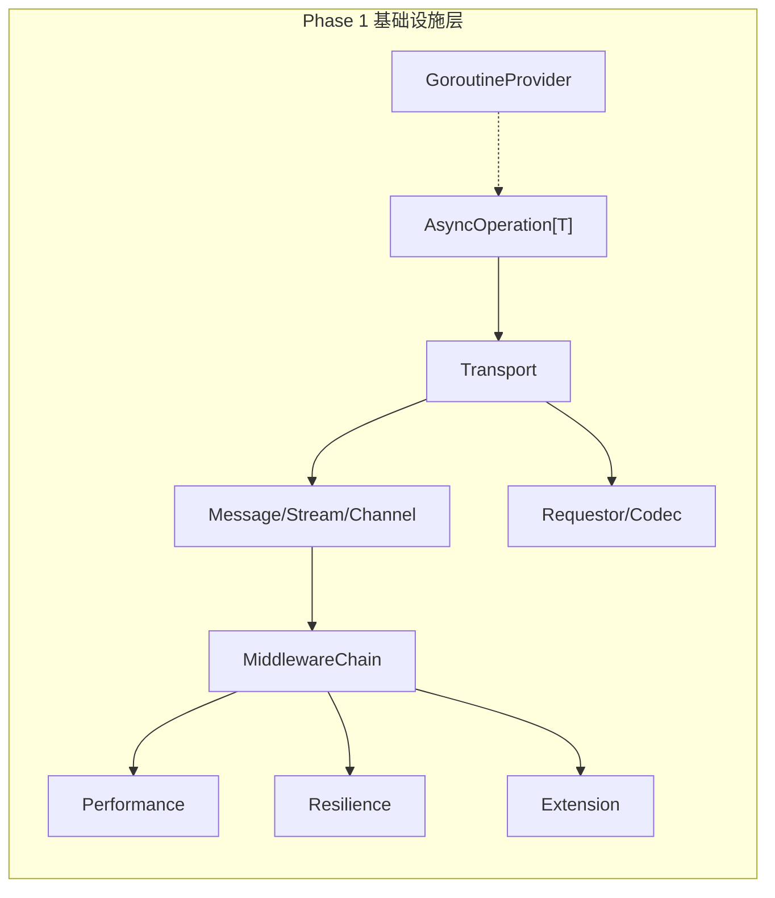
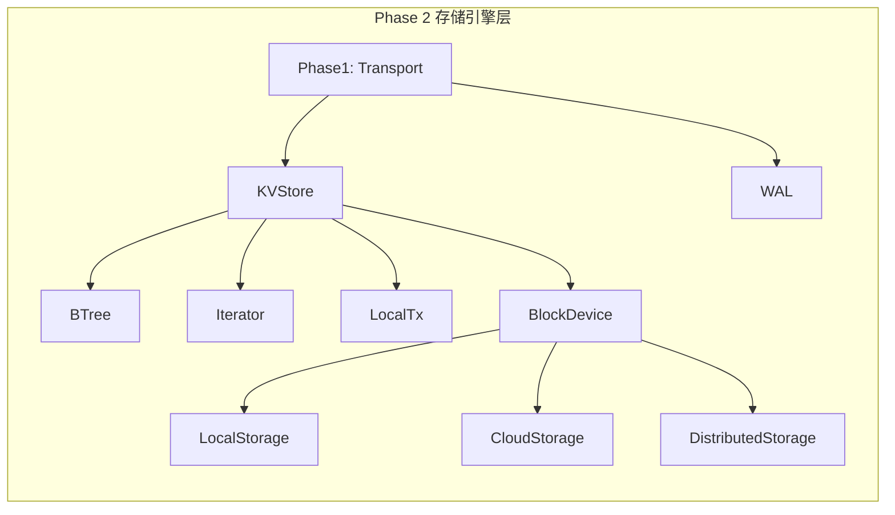
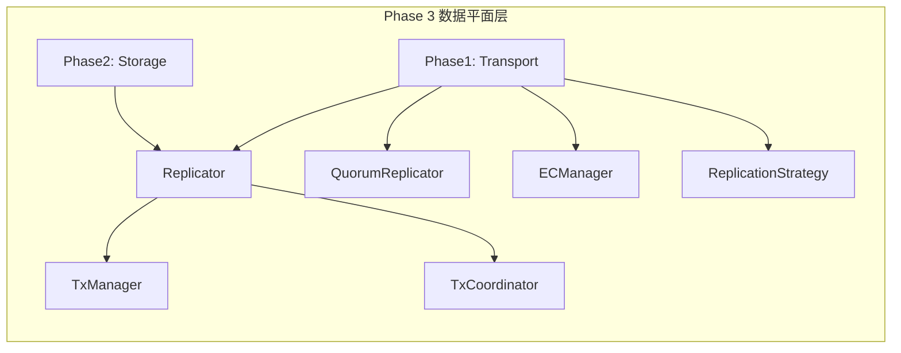
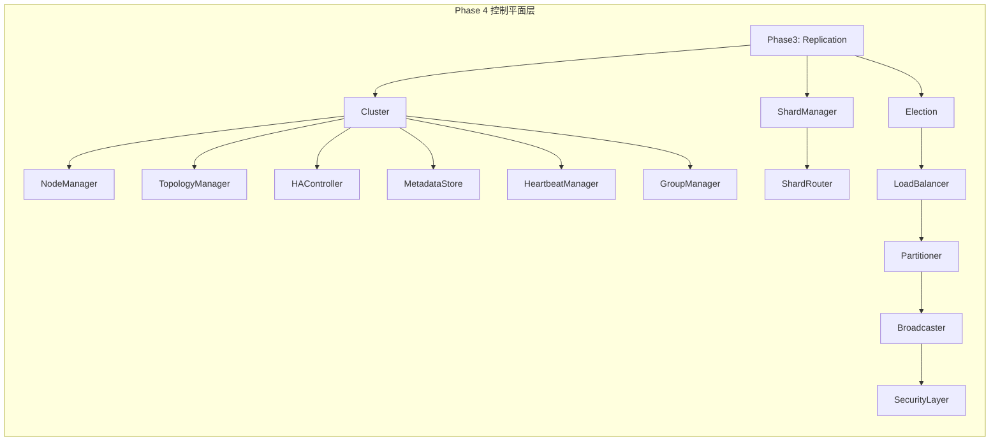
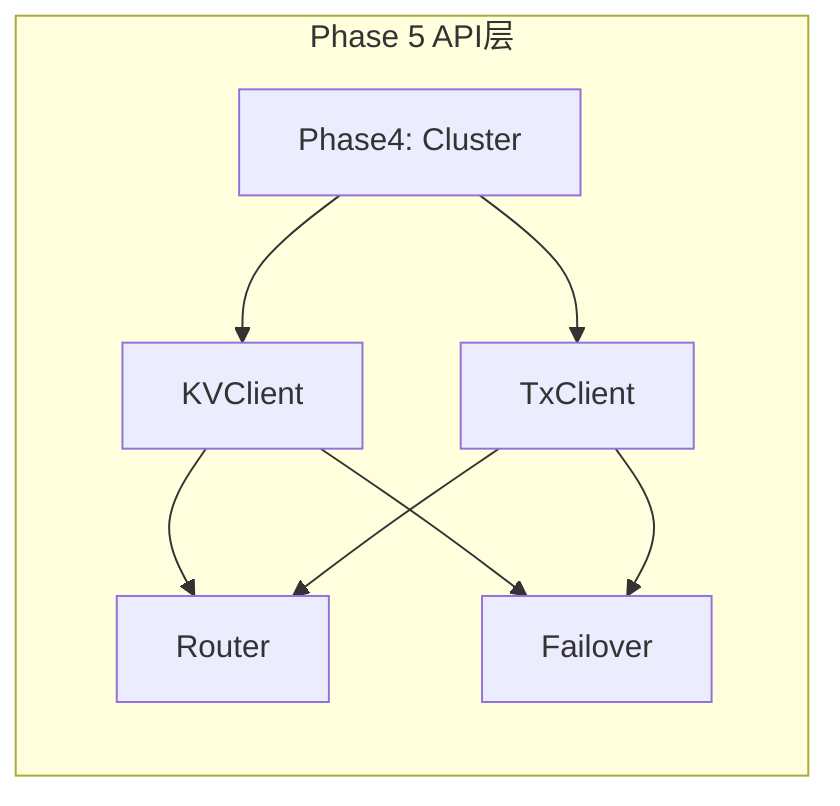
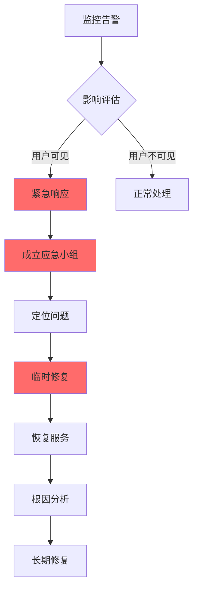

# NexKV DDD 实施路线图（增强版）

**文档版本**: v3.0 | **最后更新**: 2026-03-02
**基于**: spike-nexkv-ddd-interface.md v3.0 + spike-nexkv-ddd-implement.md v3.0
**总周期**: 约28周（含阶段 0: 异步重构 4周） | **接口总数**: 47个 | **实现文件数**: 89个

> **📋 v3.1 变更说明 (2026-03-05)**：
> - **版本同步**：与 interface.md、implement.md 统一版本号到 v3.1
> - **阶段 0 更新**：V4 异步管道架构（TaskRunner + Task[Result] + CompositeWriteTask）
> - **新增组件**：BaseTask[Result]、Pipeline、具体 Task 类型
> - **死锁约束**：PerCoreExecutor 嵌套 Submit 限制
>
> **📋 v3.0 变更说明 (2026-03-02)**：
> - **版本同步**：与 interface.md、implement.md 统一版本号到 v3.0
> - **新增阶段 0**：异步重构（AsyncOp 重命名 + 泛型锁包装器 + 流水线框架）
> - **总周期调整**：24周 → 28周（增加 4 周异步重构）
> - **里程碑更新**：新增 M0 里程碑（阶段 0 完成），所有后续里程碑 +4 周
>
> **📋 v2.1 变更说明 (2026-02-22)**：

---

## 📋 关联文档

| 文档 | 说明 |
|------|------|
| [Interface 定义](./2026-02-18_spike_nexkv-ddd-interface.md) | 47个接口详细定义 |
| [实现方案](./2026-02-18_spike_nexkv-ddd-implement.md) | 接口实现方案 |
| [统一执行器架构（Per-Core + 接口拆分）](./2026-02-25_spike-glm-unified-executor.md) | **执行层核心** - GoroutineProvider 接口拆分 + Per-Core 无锁执行器 + 可暂停调度器 |

---

## 〇、核心架构决策

### 0.1 双存储引擎策略

> **核心原则**：存储结构跟着场景走，而非强行统一

| 存储类型 | 底层实现 | 数据类型 | 核心诉求 |
|---------|---------|---------|---------|
| **Metadata KV** | `sync.Map` + MVStore | 元数据（节点、分片、副本） | 极致读写性能 O(1) |
| **External KV** | Bf-Tree（B+树变体） | 业务数据（应用数据） | 有序存储、范围查询、持久化 |

**实现位置**：
```
internal/infrastructure/storage/
├── metadata/           # Metadata KV（sync.Map）
│   └── metadata_kv.go
└── bftree/             # External KV（Bf-Tree）
    ├── tree.go
    ├── scan.go
    └── ...
```

**设计理由**：参见 `docs/07_spike/2026-02-21_spike_m2-storage-engine.md`

---

## 一，项目概览

### 1.1 项目目标

构建一个高性能、分布式、DDD架构的KV存储系统：
- 单机-分布式一体部署
- 47个统一接口
- 5层精简架构
- AsyncOperation[T] 精化异步接口
- **双存储引擎**：Metadata KV（sync.Map）+ External KV（Bf-Tree）

### 1.2 技术栈

| 组件 | 选型 | 说明 |
|------|------|------|
| **语言** | Go 1.21+ | 泛型支持、高性能并发 |
| **Transport** | libp2p | 去中心化、NAT穿透 |
| **Metadata KV** | sync.Map + MVStore | O(1) 哈希查找，元数据专用 |
| **External KV** | Bf-Tree (Go port) | 高性能 B+tree、WAL 优化、范围扫描 |
| **并发管理** | ants + 泛型 | Goroutine Pool + 类型安全异步 |
| **序列化** | MessagePack | 高性能、自描述 |
| **DI容器** | Wire | 编译时检查 |
| **日志** | Zap | 结构化日志 |

### 1.3 5层架构

| 层次 | 接口数 | 实现文件数 | 核心职责 |
|------|--------|-----------|----------|
| ① API层 | 2 | 8 | 对外 KV/Tx 接口 |
| ② 控制平面层 | 14 | 23 | 分片路由、选举、负载均衡 |
| ③ 数据平面层 | 6 | 20 | 复制、事务 |
| ④ 存储引擎层 | 9 | 19 | **双存储引擎**（Metadata + External） |
| ⑤ 基础设施层 | 16 | 16 | 网络通信、扩展能力 |
| **总计** | **47** | **89** | - |

---

## 二，实施阶段规划（自底向上）⭐ v3.0 更新

> **阶段 0 新增**：异步重构（4周） - AsyncOp 重命名 + 泛型锁包装器 + 流水线框架
> **总周期调整**：24周 → 28周（增加 4 周异步重构）

### ⭐ 阶段 0: 异步重构（4周）- **前置必做**

> **设计来源**: `thoughts/2026-03-02-idea-async-pipeline-refactor.md`
> **目标**: 为全链路异步流水线打基础

#### 为什么需要阶段 0？

| 问题 | 影响 | 解决方案 |
|------|------|----------|
| **AsyncOperation 命名太长** | 代码冗长，可读性差 | 重命名为 AsyncOp |
| **缺少泛型锁包装器** | 每次都需要手动实现锁逻辑 | 实现 Locked[T] |
| **流水线框架缺失** | 存储层异步能力不足 | 设计流水线架构 |
| **V4 异步管道架构缺失** | 缺少泛型任务 + 统一调度 | 实现 TaskRunner + Task[Result] |

#### 阶段 0 任务分解

| 周次 | 任务 | 交付物 | 验收标准 |
|------|------|--------|----------|
| **Week 1-2** | AsyncOp 重命名 | `domain/service/rpc_async.go`, `infrastructure/rpc/async_impl.go` | 所有引用更新，测试通过 |
| **Week 3** | 泛型锁包装器 | `infrastructure/concurrent/locked.go`, `locked_test.go` | 单元测试 + 基准测试 |
| **Week 4** | V4 异步管道架构 | `docs/07_spike/2026-03-04-spike-async-pipeline-v4.md` | V4 架构设计文档 |

#### Week 1-2: AsyncOp 重命名

**文件清单** (7个核心文件):
```
internal/domain/service/rpc_async.go           # 接口定义
internal/infrastructure/rpc/async_impl.go        # 实现
internal/infrastructure/rpc/adapter.go           # 适配器
internal/infrastructure/rpc/broadcast_progress.go # 广播
测试文件 (4个)                                    # 测试
```

**重命名策略**:
```go
// 新接口
type AsyncOp[T any] interface {
    Await(ctx context.Context) (T, error)
    OnComplete(callback func(T, error)) string
    // ... 其他方法
}

// 向后兼容别名
type AsyncOperation[T any] = AsyncOp[T]
```

**验收标准**:
- [ ] 所有 `AsyncOperation[T]` 引用已更新为 `AsyncOp[T]`
- [ ] 类型别名工作正常，旧代码可以编译
- [ ] 所有测试通过

#### Week 3: 泛型锁包装器

**文件清单**:
```
internal/infrastructure/concurrent/locked.go      # 实现
internal/infrastructure/concurrent/locked_test.go # 单元测试
internal/infrastructure/concurrent/locked_bench_test.go # 基准测试
```

**核心实现**:
```go
// Locked[T] 泛型锁包装器
// 支持有锁和无锁模式一键切换
type Locked[T any] struct {
    mu   sync.RWMutex
    core T
}

// View 读视图（自动加读锁）
func (l *Locked[T]) View(fn func(core T) error) error

// Modify 写视图（自动加写锁）
func (l *Locked[T]) Modify(fn func(core T) error) error

// GetDirect 直接访问（无锁，由调用者保证并发安全）
func (l *Locked[T]) GetDirect() T
```

**验收标准**:
- [ ] 单元测试通过（并发访问测试）
- [ ] 基准测试：View/Modify 性能优于直接加锁
- [ ] GetDirect 性能优于 View 10 倍以上

#### Week 4: V4 异步管道架构

**设计文档**: [V4 异步管道架构](./2026-03-04-spike-async-pipeline-v4.md)

**核心组件**:
1. **双层接口设计**
   - `TaskRunner` - 非泛型接口（Executor 视角）
   - `Task[Result]` - 泛型接口（用户视角）
2. **BaseTask[Result]** - 任务基类，提供通用实现
3. **Pipeline** - 流水线上下文，聚合存储引擎
4. **具体 Task 类型**
   - `BTreeReadTask` - BTree 读取任务
   - `BTreeWriteTask` - BTree 写入任务
   - `BTreeDeleteTask` - BTree 删除任务
   - `WALAppendTask` - WAL 追加任务
   - `CompositeWriteTask` - 组合写入任务（WAL + BTree）

**关键约束**:
- **PerCoreExecutor 死锁**: Task 内部禁止嵌套 Submit
- **正确做法**: CompositeWriteTask 直接调用存储引擎方法

**验收标准**:
- [ ] V4 设计文档通过评审
- [ ] TaskRunner/Task[Result] 接口定义完成
- [ ] BaseTask[Result] 实现完成
- [ ] Pipeline 结构定义完成
- [ ] 具体 Task 类型定义完成
- [ ] PerCoreExecutor 死锁约束文档化

#### 阶段 0 依赖关系图

```mermaid
graph TD
    A[AsyncOp 重命名] --> B[泛型锁包装器]
    B --> C[V4 异步管道架构]
    C --> C1[TaskRunner/Task[Result]]
    C --> C2[BaseTask[Result]]
    C --> C3[Pipeline]
    C --> C4[CompositeWriteTask]
    C1 --> D[Phase 1: 基础设施层]
    C2 --> D
    C3 --> D
    C4 --> D
    D --> E[Phase 2: 存储引擎层]
    E --> F[Phase 3-8: 其他阶段]

    style A fill:#ff9999
    style B fill:#ffcc99
    style C fill:#ffff99
    style C1 fill:#ffff99
    style C2 fill:#ffff99
    style C3 fill:#ffff99
    style C4 fill:#ffff99
    style D fill:#99ff99
```

#### 阶段 0 完成标准

##### 核心验收标准

| 验证项 | 说明 | 验收标准 |
|--------|------|----------|
| **编译通过** | 所有代码可以编译 | `go build ./...` 通过 |
| **测试通过** | 所有测试通过 | `go test ./...` 通过 |
| **性能验证** | 基准测试符合预期 | Locked[T] 性能优于手动加锁 |
| **文档完整** | 设计文档完整 | 评审通过 |

##### 阶段 0 输出物清单

| 输出物类型 | 具体内容 | 位置 |
|-----------|---------|------|
| **代码文件** | AsyncOp 接口定义 | `internal/domain/service/rpc_async.go` |
| **代码文件** | AsyncOp 实现 | `internal/infrastructure/rpc/async_impl.go` |
| **代码文件** | 泛型锁包装器 | `internal/infrastructure/concurrent/locked.go` |
| **测试文件** | Locked 单元测试 | `locked_test.go` |
| **测试文件** | Locked 基准测试 | `locked_bench_test.go` |
| **设计文档** | V4 异步管道架构 | `docs/07_spike/2026-03-04-spike-async-pipeline-v4.md` |
| **代码文件** | TaskRunner/Task[Result] 接口 | `internal/domain/service/task.go` |
| **代码文件** | BaseTask[Result] 实现 | `internal/domain/model/base_task.go` |
| **代码文件** | Pipeline 结构 | `internal/infrastructure/storage/pipeline.go` |
| **代码文件** | CompositeWriteTask | `internal/infrastructure/storage/composite_task.go` |
| **代码文件** | BTreeReadTask/BTreeWriteTask/BTreeDeleteTask | `internal/infrastructure/storage/btree_tasks.go` |
| **代码文件** | WALAppendTask | `internal/infrastructure/storage/wal_tasks.go` |

##### 阶段 0 → 阶段 1 准入条件

**必须满足以下所有条件才能进入阶段 1：**

| 准入条件 | 验证方式 | 状态 |
|---------|---------|------|
| ✅ AsyncOp 重命名完成 | 所有测试通过 + 代码审查 | ⬜ 未验证 |
| ✅ 泛型锁包装器实现 | 单元测试 + 基准测试通过 | ⬜ 未验证 |
| ✅ V4 异步管道架构设计评审 | 架构师审查通过 | ⬜ 未验证 |
| ✅ PerCoreExecutor 死锁约束文档化 | 文档审查通过 | ⬜ 未验证 |
| ✅ 接口向后兼容验证 | 旧代码可以编译运行 | ⬜ 未验证 |
| ✅ 性能基准达标 | Locked 性能优于手动锁 | ⬜ 未验证 |

##### 阶段 1 启动前 Checklist

**技术准备：**
- [ ] AsyncOp[T] 接口已在所有模块中替换完成
- [ ] Locked[T] 泛型锁包装器已实现并通过测试
- [ ] 流水线架构设计文档已通过评审
- [ ] 与 TaskExecutor 的集成方案已确认
- [ ] V4 异步管道架构设计文档已通过评审
- [ ] TaskRunner/Task[Result] 接口已实现
- [ ] BaseTask[Result] 已实现
- [ ] Pipeline 结构已实现
- [ ] CompositeWriteTask 已实现
- [ ] PerCoreExecutor 死锁约束已文档化并培训

**文档准备：**
- [ ] 阶段 0 实施总结文档
- [ ] 阶段 1 详细实施计划
- [ ] 风险评估与应对措施

**团队准备：**
- [ ] 所有开发人员熟悉 AsyncOp 新接口
- [ ] 所有开发人员理解流水线架构设计
- [ ] 阶段 1 任务分配与时间估算完成

**质量保证：**
- [ ] 所有单元测试通过率 100%
- [ ] 所有基准测试性能达标
- [ ] 代码审查通过
- [ ] 技术债务评估完成

---

### Phase 1: 基础设施层（4周）⭐ 阶段 0 后执行

**目标**: 构建底层基础设施，为上层提供网络通信、异步能力、扩展能力

**接口清单** (16个):
```
pkg/domain/service/transport.go      (6个) - Transport, Message, Stream, Channel, Requestor, Codec
pkg/domain/service/middleware.go    (2个) - Middleware, MiddlewareChain
pkg/domain/service/performance.go   (3个) - BatchReplicator, PipelineReplicator, CacheLayer
pkg/domain/service/resilience.go    (3个) - CircuitBreaker, RetryPolicy, ChaosMonkey
pkg/domain/service/extension.go      (2个) - Plugin, DynamicConfig
pkg/domain/service/goroutine_provider.go (1个) - GoroutineProvider⭐
```

> ⭐ **v2.0 新增**：GoroutineProvider 并发管理层（类型安全的泛型异步任务提交 + 优先级控制 + Prometheus 监控）

#### 依赖关系图



#### 每周任务分解

| 周次 | 任务 | 交付物 | 验收标准 |
|------|------|--------|----------|
| **Week 1** | AsyncOperation[T] 核心 + Transport 接口定义 + **GoroutineProvider**⭐ | `domain/model/futures.go`, `domain/service/transport.go`, `domain/service/goroutine_provider.go` | 接口定义通过评审 + **并发池正常工作** |
| **Week 2** | libp2p Transport 实现 + Codec 实现 + **GoroutineProvider 实现**⭐ + **AsyncOperation 重构**⭐ | `infrastructure/transport/libp2p_*.go`, `pkg/concurrency/ants_provider.go`, `pkg/async/operation.go` | 单节点 ping/pong 正常 + **4级优先级池管理** + **AsyncOperation 基于 GoroutineProvider** |
| **Week 3** | MiddlewareChain + 性能优化接口 + **NexKV 专用封装**⭐ + **批量操作实现**⭐ | `infrastructure/transport/middleware_*.go`, `internal/concurrency/nexkv_tasks.go`, `pkg/async/batch.go` | 中间件链按序执行 + **7个封装函数** + **批量异步操作** |
| **Week 4** | 容错 + 扩展接口实现 + **Storage 层集成**⭐ | `infrastructure/resilience/*`, `infrastructure/extension/*`, `internal/storage/kvstore.go` | 熔断/重试/插件加载正常 + **异步 KV 接口** |

> ⭐ **v2.0 新增**：GoroutineProvider 相关任务（预计 8 天）
> - Week 1: 接口定义（2 天）
> - Week 2: AntsGoroutineProvider 实现（3 天）+ **AsyncOperation 重构**（1 天）
> - Week 3: NexKV 专用封装（1 天）+ 批量操作（0.5 天）+ 全局单例管理（0.5 天）
> - Week 4: Storage 层集成（1 天）

#### 统一执行器架构（Phase 1 深化）

> ⭐ **统一执行器架构**是 Phase 1 基础设施层的**核心深化**，为 M2 存储引擎提供异步能力基础

| 组件 | 说明 | 文档 |
|------|------|------|
| **接口拆分** | GoroutineProvider 13 个方法 → 5原子 + 3组合 + 4可暂停调度器 | [统一执行器架构](./2026-02-25_spike-glm-unified-executor.md#4-接口拆分方案kimi) |
| **Per-Core 执行器** | 绑核无锁执行器，消除延迟抖动 | [Per-Core 实现](./2026-02-25_spike-glm-unified-executor.md#6-per-core-无锁执行器实现glm) |
| **可暂停调度器** | 支持任务暂停/恢复/迁移 | [可暂停调度器](./2026-02-25_spike-glm-unified-executor.md#5-可暂停调度器接口kimi--glm) |

**M2 存储引擎依赖链**：
```
GoroutineProvider → AsyncOperation[T] → M2 异步接口
     ↓                    ↓
 接口拆分            GetAsync/SetAsync/DeleteAsync
     ↓
Per-Core 执行器 → 可暂停调度器 → 跨节点迁移
```

> 📖 **深度关联**：M2 存储引擎的异步操作依赖于 GoroutineProvider，未来迁移到 Per-Core 执行器后将获得无锁性能

#### 详细文件清单

| 接口 | 包路径 | 实现文件 | 优先级 |
|------|--------|----------|--------|
| Transport | `infrastructure/transport` | `libp2p_transport_impl.go` | P0 |
| Message | `infrastructure/transport` | `message_impl.go` | P0 |
| Stream | `infrastructure/transport` | `stream_impl.go` | P0 |
| Channel | `infrastructure/transport` | `channel_impl.go` | P0 |
| Requestor | `infrastructure/transport` | `requestor_impl.go` | P0 |
| Codec | `infrastructure/transport` | `codec_impl.go` | P0 |
| Middleware | `infrastructure/transport` | `middleware_impl.go` | P1 |
| MiddlewareChain | `infrastructure/transport` | `middleware_impl.go` | P1 |
| BatchReplicator | `infrastructure/performance` | `batch_replicator_impl.go` | P2 |
| PipelineReplicator | `infrastructure/performance` | `pipeline_impl.go` | P2 |
| CacheLayer | `infrastructure/performance` | `cache_layer_impl.go` | P2 |
| CircuitBreaker | `infrastructure/resilience` | `circuit_breaker_impl.go` | P1 |
| RetryPolicy | `infrastructure/resilience` | `retry_policy_impl.go` | P1 |
| ChaosMonkey | `infrastructure/resilience` | `chaos_monkey_impl.go` | P2 |
| Plugin | `infrastructure/extension` | `plugin_impl.go` | P2 |
| DynamicConfig | `infrastructure/extension` | `dynamic_config_impl.go` | P2 |
| **GoroutineProvider**⭐ | `pkg/concurrency` | `ants_provider.go`, `global.go` | P0 |
| **AsyncOperation**⭐ | `pkg/async` | `operation.go`, `batch.go`, `types.go` | P0 |
| **NexKV 封装**⭐ | `internal/concurrency` | `nexkv_tasks.go` | P1 |

> ⭐ **v2.0 新增**：GoroutineProvider 并发管理层 + AsyncOperation 重构（17 个实现文件 → 21 个实现文件）

#### 验收标准（可验证）

- [ ] `go build` 通过，无编译错误
- [ ] Transport 连接/断开/重连 单元测试通过
- [ ] AsyncOperation[T] 三种异步模式（AsyncOp/Callback/Channel）测试通过
- [ ] MiddlewareChain 按顺序执行测试通过
- [ ] CircuitBreaker 打开/关闭状态转换正常
- [ ] RetryPolicy 重试次数和退避时间正确
- [ ] 测试覆盖率 ≥ 80%

**GoroutineProvider 验收标准**⭐：
- [ ] 支持泛型 `Result[T any]`，无需类型断言
- [ ] 支持 4 级优先级（Critical/High/Normal/Low）
- [ ] 支持批量操作（快速失败 + 全错误返回）
- [ ] 支持动态扩缩容（`SetCapacity` 方法）
- [ ] Prometheus 指标导出（running/waiting/tasks_total/duration）
- [ ] 优雅关闭不丢任务（延迟任务跟踪）
- [ ] NexKV 专用封装（Raft/KV/Metadata/Compaction/Gossip/WAL）
- [ ] 多优先级池管理测试通过（4 个独立池）
- [ ] 泛型结果类型安全测试通过
- [ ] 全局单例初始化/关闭测试通过

**AsyncOperation 重构验收标准**⭐（v19.0）：
- [ ] 基于 GoroutineProvider 实现，不再独立创建 goroutine
- [ ] 支持优先级控制（Critical/High/Normal/Low）
- [ ] 支持状态管理（Status/Cancel/Discard/IsStarted）
- [ ] 支持回调机制（OnComplete/OffComplete）
- [ ] 支持批量操作（BatchAsyncOperations/WaitAll/WaitAllWithDiscard）
- [ ] 与 Storage 层集成（GetAsync/SetAsync/DeleteAsync）
- [ ] OperationStatus 包含 StatusRunning 和 StatusDiscarded
- [ ] goroutine 复用率 ≥ 90%（通过 ants 池监控验证）
- [ ] 资源可控（无 goroutine 泄漏）
- [ ] Prometheus 指标覆盖所有异步操作

---

### Phase 2: 存储引擎层（6周）

**目标**: 实现单机 KV 存储，为分布式提供持久化能力

**接口清单** (9个):
```
pkg/domain/service/storage.go       (5个) - KVStore, WAL, BTree, Iterator, LocalTx
pkg/domain/service/blockdevice.go   (4个) - BlockDevice, LocalStorage, CloudStorage, DistributedStorage
```

#### 依赖关系图



#### 每周任务分解

| 周次 | 任务 | 交付物 | 验收标准 |
|------|------|--------|----------|
| **Week 5** | Bf-Tree KVStore 实现 | `infrastructure/storage/bftree_store_impl.go` | Get/Put/Delete 正常 |
| **Week 6** | WAL 实现（同步模式） | `infrastructure/storage/wal_impl.go` | 写入和 Replay 正常 |
| **Week 7** | WAL 异步模式 + BTree | `infrastructure/storage/wal_impl.go`, `btree_impl.go` | 异步写入正常 |
| **Week 8** | Iterator + LocalTx | `infrastructure/storage/iterator_impl.go`, `local_tx_impl.go` | 范围查询正常 |
| **Week 9** | BlockDevice 抽象 + LocalStorage | `infrastructure/blockdevice/local_storage_impl.go` | 块读写 ≥50K ops/sec |
| **Week 10** | CloudStorage + DistributedStorage | `infrastructure/blockdevice/cloud_*.go` | 云存储上传/下载正常 |

#### 详细文件清单

| 接口 | 包路径 | 实现文件 | 优先级 | 依赖 |
|------|--------|----------|--------|------|
| KVStore | `infrastructure/storage` | `bftree_store_impl.go` | P0 | Transport |
| WAL | `infrastructure/storage` | `wal_impl.go` | P0 | Transport |
| BTree | `infrastructure/storage` | `btree_impl.go` | P1 | - |
| Iterator | `infrastructure/storage` | `iterator_impl.go` | P1 | KVStore |
| LocalTx | `infrastructure/storage` | `local_tx_impl.go` | P1 | KVStore |
| BlockDevice | `infrastructure/blockdevice` | `block_device_impl.go` | P0 | - |
| LocalStorage | `infrastructure/blockdevice` | `local_storage_impl.go` | P0 | BlockDevice |
| CloudStorage | `infrastructure/blockdevice` | `cloud_storage_impl.go` | P2 | BlockDevice |
| DistributedStorage | `infrastructure/blockdevice` | `distributed_storage_impl.go` | P2 | BlockDevice, Phase3 |

#### 验收标准（可验证）

- [ ] 单节点 Get/Put/Delete 单元测试通过
- [ ] WAL 写入和 Replay 测试通过
- [ ] BTree 范围查询正确性测试通过
- [ ] LocalTx 事务原子性测试通过
- [ ] BlockDevice 读写性能 ≥ 50,000 ops/sec（基准测试）
- [ ] 云存储上传/下载功能正常（集成测试）
- [ ] 测试覆盖率 ≥ 80%

#### Phase 2 拆分评估 ⭐ v3.0 新增

**问题**: 是否将 Phase 2 拆分为 Metadata KV 和 External KV 两个独立阶段？

**当前方案**: Phase 2 统一实现（6周）
- 专注 Bf-Tree 实现
- Metadata KV 作为简化实现同步完成

**拆分方案 A**: Phase 2A + Phase 2B
- **Phase 2A: Metadata KV**（2周）
  - sync.Map 封装
  - 元数据专用接口
  - 极简实现，快速交付
- **Phase 2B: External KV**（6周）
  - Bf-Tree 完整实现
  - WAL + 事务支持
  - 复杂优化

**拆分方案 B**: Phase 2 延迟为 Metadata + External 并行（8周）
- **Week 1-2**: Metadata KV 基础实现
- **Week 3-8**: External KV 完整实现
- 两者并行开发，团队协作

**评估结论**:

| 评估维度 | 当前方案 | 拆分方案 A | 拆分方案 B | 推荐 |
|---------|---------|-----------|-----------|------|
| **实施复杂度** | 中 | 低（分阶段） | 高（并行） | ✅ 当前方案 |
| **时间风险** | 低 | 低（快速 MVP） | 高（依赖多） | ✅ 拆分 A |
| **代码清晰度** | 中 | 高（职责分离） | 中 | ✅ 拆分 A |
| **团队协作** | 低 | 低（顺序开发） | 高（需要协调） | ✅ 当前方案 |
| **灵活性** | 中 | 高（可调整） | 中 | ✅ 拆分 A |

**最终建议**: ✅ **采用拆分方案 A**，原因：

1. **快速 MVP**: Metadata KV 2周交付，上层可立即使用
2. **风险降低**: 先简单后复杂，渐进式实施
3. **职责清晰**: 两种存储引擎独立实现和维护
4. **灵活调整**: External KV 可根据需求调整优先级

**实施调整**:

```markdown
### Phase 2A: Metadata KV（2周）⭐ 新增

**目标**: 实现元数据存储，支持集群管理

**接口清单**:
```
pkg/domain/service/storage.go       (1个) - KVStore (简化版)
pkg/infrastructure/storage/metadata/ (3个) - MetadataKV, MetadataStore, MVStore
```

**每周任务**:
- Week 5: MetadataKV 基础实现（sync.Map 封装）
- Week 6: 元数据接口封装 + 集成测试

**验收标准**:
- [ ] Get/Put/Delete 单元测试通过
- [ ] 并发安全测试通过
- [ ] 性能测试：O(1) 查找，延迟 < 10μs
- [ ] 测试覆盖率 ≥ 80%

---

### Phase 2B: External KV（6周）⭐ 调整后

**目标**: 实现业务数据存储，支持范围查询

**接口清单**:
```
pkg/domain/service/storage.go       (5个) - KVStore, WAL, BTree, Iterator, LocalTx
pkg/domain/service/blockdevice.go   (4个) - BlockDevice, LocalStorage, CloudStorage, DistributedStorage
```

**每周任务**: 保持原计划（Week 7-12）

**验收标准**: 保持原标准

**时间调整**: Phase 2A (2周) + Phase 2B (6周) = 8周总计
**总周期调整**: 28周 → 30周（增加 2周）
```

**风险与缓解**:

| 风险 | 缓解措施 |
|------|----------|
| 总周期 +2周 | Metadata KV 提前交付，上层可并行开发 |
| 两套 KV 接口 | 统一 KVStore 接口，实现可替换 |
| 额外集成成本 | Phase 2B 验证时包含与 Metadata KV 集成 |

---

### Phase 3: 数据平面层（4周）

**目标**: 实现副本管理、事务一致性

**接口清单** (6个):
```
pkg/domain/service/replication.go    (4个) - Replicator, QuorumReplicator, ECManager, ReplicationStrategy
pkg/domain/service/tx.go            (2个) - TxManager, TxCoordinator
```

#### 依赖关系图



#### 每周任务分解

| 周次 | 任务 | 交付物 | 验收标准 |
|------|------|--------|----------|
| **Week 11** | Replicator 接口 + 基础实现 | `infrastructure/replication/replicator_impl.go` | 主从复制正常 |
| **Week 12** | QuorumReplicator 实现 | `infrastructure/replication/quorum.go` | 3副本写入多数派确认正常 |
| **Week 13** | EC 纠删码实现 | `infrastructure/replication/ec_strategy_impl.go` | EC 编码解码正确 |
| **Week 14** | TxManager + TxCoordinator | `infrastructure/tx/tx_manager_impl.go`, `tx_coordinator_impl.go` | 2PC 事务提交/回滚正常 |

#### 详细文件清单

| 接口 | 包路径 | 实现文件 | 优先级 | 依赖 |
|------|--------|----------|--------|------|
| Replicator | `infrastructure/replication` | `replicator_impl.go` | P0 | Transport, Storage |
| QuorumReplicator | `infrastructure/replication` | `quorum.go` | P0 | Replicator |
| ECManager | `infrastructure/replication` | `ec_manager_impl.go` | P1 | Replicator |
| ReplicationStrategy | `infrastructure/replication` | `replication_strategy_impl.go` | P1 | - |
| TxManager | `infrastructure/tx` | `tx_manager_impl.go` | P0 | Storage |
| TxCoordinator | `infrastructure/tx` | `tx_coordinator_impl.go` | P0 | Replicator |

#### 验收标准（可验证）

- [ ] 3副本 Quorum 写入多数派确认正常
- [ ] EC 编码/解码数据完整性验证通过
- [ ] 分布式事务 2PC 提交/回滚正常
- [ ] 主节点故障后从节点自动提升正常
- [ ] 测试覆盖率 ≥ 80%

---

### Phase 4: 控制平面层（4周）

**目标**: 实现集群管理、分片路由、负载均衡

**接口清单** (14个):
```
pkg/domain/service/cluster.go        (7个) - TreeCoordinator, NodeManager, TopologyManager, HAController, MetadataStore, HeartbeatManager, GroupManager
pkg/domain/service/shard.go         (2个) - ShardManager, ShardRouter
pkg/domain/service/partition.go    (1个) - Partitioner
pkg/domain/service/election.go      (1个) - Election
pkg/domain/service/balance.go      (1个) - LoadBalancer
pkg/domain/service/broadcast.go    (1个) - Broadcaster
pkg/domain/service/security.go     (1个) - SecurityLayer
```

#### 依赖关系图



#### 每周任务分解

| 周次 | 任务 | 交付物 | 验收标准 |
|------|------|--------|----------|
| **Week 15** | Cluster 核心（TreeCoordinator, NodeManager, Topology） | `infrastructure/cluster/tree_coordinator_impl.go`, `node_manager_impl.go` | 3节点集群通信正常 |
| **Week 16** | HA + Metadata + Heartbeat | `infrastructure/cluster/ha_controller_impl.go`, `metadata_store_impl.go` | 故障检测和主备切换正常 |
| **Week 17** | ShardManager + ShardRouter | `infrastructure/shard/shard_manager_impl.go`, `shard_router_impl.go` | 分片路由正确 |
| **Week 18** | Election + LoadBalancer + Broadcaster + Security | `infrastructure/cluster/election_impl.go`, `loadbalancer_impl.go` | 选举和负载均衡正常 |

#### 详细文件清单

| 接口 | 包路径 | 实现文件 | 优先级 | 依赖 |
|------|--------|----------|--------|------|
| TreeCoordinator | `infrastructure/cluster` | `tree_coordinator_impl.go` | P0 | Phase1-3 |
| NodeManager | `infrastructure/cluster` | `node_manager_impl.go` | P0 | Transport |
| TopologyManager | `infrastructure/cluster` | `topology_impl.go` | P0 | NodeManager |
| HAController | `infrastructure/cluster` | `ha_controller_impl.go` | P0 | Replication |
| MetadataStore | `infrastructure/cluster` | `metadata_store_impl.go` | P0 | Storage |
| HeartbeatManager | `infrastructure/cluster` | `heartbeat_impl.go` | P0 | Transport |
| GroupManager | `infrastructure/cluster` | `group_manager_impl.go` | P1 | TopologyManager |
| ShardManager | `infrastructure/shard` | `shard_manager_impl.go` | P0 | Replication |
| ShardRouter | `infrastructure/shard` | `shard_router_impl.go` | P0 | ShardManager |
| Partitioner | `infrastructure/shard` | `partitioner_impl.go` | P1 | ShardRouter |
| Election | `infrastructure/cluster` | `election_impl.go` | P0 | Replication |
| LoadBalancer | `infrastructure/cluster` | `loadbalancer_impl.go` | P1 | ShardRouter |
| Broadcaster | `infrastructure/cluster` | `broadcaster_impl.go` | P1 | Transport |
| SecurityLayer | `infrastructure/transport` | `security_layer_impl.go` | P2 | Transport |

#### 验收标准（可验证）

- [ ] 3节点集群发现和通信正常
- [ ] 节点故障检测时间 < 5秒
- [ ] 主备切换 RTO < 30秒
- [ ] 分片迁移无数据丢失（双写验证）
- [ ] 选举Leader正确性测试通过
- [ ] 负载均衡策略正确执行
- [ ] 测试覆盖率 ≥ 80%

---

### Phase 5: API层（2周）

**目标**: 实现对外客户端接口

**接口清单** (2个):
```
pkg/domain/service/client.go       (2个) - KVClient, TxClient
```

#### 依赖关系图



#### 每周任务分解

| 周次 | 任务 | 交付物 | 验收标准 |
|------|------|--------|----------|
| **Week 19** | KVClient 实现 + Router | `infrastructure/client/kv_client_impl.go`, `router.go` | 自动路由正确 |
| **Week 20** | TxClient + Failover | `infrastructure/client/client_tx_impl.go`, `failover.go` | 故障转移正常 |

#### 详细文件清单

| 接口 | 包路径 | 实现文件 | 优先级 | 依赖 |
|------|--------|----------|--------|------|
| KVClient | `infrastructure/client` | `kv_client_impl.go` | P0 | Cluster, Shard |
| TxClient | `infrastructure/client` | `client_tx_impl.go` | P0 | KVClient, TxManager |
| ClientFuture | `infrastructure/client` | `client_future_impl.go` | P1 | AsyncOperation[T] |
| Router | `infrastructure/client` | `router.go` | P0 | ShardRouter |
| Failover | `infrastructure/client` | `failover.go` | P0 | HAController |

#### 验收标准（可验证）

- [ ] KVClient 自动路由到正确分片
- [ ] 节点故障后自动Failover
- [ ] 客户端重试策略正确执行
- [ ] HTTP/gRPC 适配器正常工作
- [ ] 测试覆盖率 ≥ 80%

---

### Phase 6: 集成测试与优化（4周）

**目标**: 端到端集成测试，性能优化

#### 每周任务分解

| 周次 | 任务 | 交付物 | 验收标准 |
|------|------|--------|----------|
| **Week 21** | 集成测试框架搭建 | 测试用例套件 | 1000+并发测试用例通过 |
| **Week 22** | 混沌测试 | 故障注入测试 | 随机杀节点/网络分区测试通过 |
| **Week 23** | 性能调优 | 优化报告 | 达到性能目标 |
| **Week 24** | 最终验收 | 验收报告 | 所有验收标准通过 |

#### 性能目标

| 指标 | 目标值 | 验证方法 |
|------|--------|----------|
| 单节点写入 | ≥ 50,000 ops/sec | 基准测试 |
| 单节点读取 | ≥ 100,000 ops/sec | 基准测试 |
| 集群吞吐 | ≥ 500,000 ops/sec | 集成测试 |
| 延迟 P99 | < 10ms | 集成测试 |
| 故障转移 RTO | < 30秒 | 混沌测试 |

---

## 三、里程碑时间表 ⭐ v3.0 更新

> **时间调整**：增加阶段 0（4周），所有里程碑 +4周

| 里程碑 | 原时间 | 新时间 | 关键成果 | 可验证标准 |
|--------|--------|--------|----------|------------|
| **M0** | - | 第4周 | 阶段 0 完成 | AsyncOp 重命名 + 泛型锁包装器 + **V4 异步管道架构** |
| **M1** | 第4周 | 第8周 | 基础设施层完成 | 16个接口单元测试通过 |
| **M2** | 第10周 | 第14周 | 存储引擎层完成 | 单节点 KV 性能达标 |
| **M3** | 第14周 | 第18周 | 数据平面层完成 | 3副本写入正常 |
| **M4** | 第18周 | 第22周 | 控制平面层完成 | 3节点集群运行正常 |
| **M5** | 第20周 | 第24周 | API层完成 | 客户端路由和故障转移正常 |
| **M6** | 第24周 | 第28周 | 集成测试与优化完成 | 所有性能目标达成 |

**总周期**: 24周 → 28周

---

## 四、依赖矩阵

### 接口间依赖关系

```
Phase 1 (基础设施层)
├── Transport ← AsyncOperation[T]
├── Message ← Transport
├── Stream ← Transport
├── Channel ← Transport
├── Requestor ← Transport, Codec
├── Codec ← (无依赖)
├── MiddlewareChain ← Middleware
├── BatchReplicator ← Transport
├── PipelineReplicator ← Transport
├── CacheLayer ← (无依赖)
├── CircuitBreaker ← Transport
├── RetryPolicy ← (无依赖)
├── ChaosMonkey ← (无依赖)
├── Plugin ← (无依赖)
└── DynamicConfig ← (无依赖)

Phase 2 (存储引擎层) ← Phase 1
├── KVStore ← Transport
├── WAL ← Transport
├── BTree ← (无依赖)
├── Iterator ← KVStore
├── LocalTx ← KVStore
├── BlockDevice ← (无依赖)
├── LocalStorage ← BlockDevice
├── CloudStorage ← BlockDevice
└── DistributedStorage ← BlockDevice, Phase3

Phase 3 (数据平面层) ← Phase 1, Phase 2
├── Replicator ← Transport, Storage
├── QuorumReplicator ← Replicator
├── ECManager ← Replicator
├── ReplicationStrategy ← (无依赖)
├── TxManager ← Storage
└── TxCoordinator ← Replicator

Phase 4 (控制平面层) ← Phase 1-3
├── TreeCoordinator ← Phase1-3
├── NodeManager ← Transport
├── TopologyManager ← NodeManager
├── HAController ← Replication
├── MetadataStore ← Storage
├── HeartbeatManager ← Transport
├── GroupManager ← TopologyManager
├── ShardManager ← Replication
├── ShardRouter ← ShardManager
├── Partitioner ← ShardRouter
├── Election ← Replication
├── LoadBalancer ← ShardRouter
├── Broadcaster ← Transport
└── SecurityLayer ← Transport

Phase 5 (API层) ← Phase 1-4
├── KVClient ← Cluster, Shard
└── TxClient ← KVClient, TxManager
```

---

## 五、风险与缓解

### 5.1 风险分类

#### 技术风险 🔴

| 风险项 | 概率 | 影响 | 风险等级 | 缓解措施 | 负责人 | 验证方法 |
|--------|------|------|----------|----------|--------|----------|
| **泛型接口实现复杂** | 中 | 高 | 🔴 高 | 参考 AsyncOp 精化接口，分周交付 | 架构师 | 每周代码审查 |
| **异步流水线死锁** | 低 | 高 | 🟡 中 | 使用 Channel 背压，避免环形等待 | 并发专家 | 竞态检测 |
| **分布式事务性能** | 中 | 高 | 🔴 高 | 2PC 优化，减少锁持有时间 | 性能专家 | P99 < 10ms |
| **网络分区脑裂** | 中 | 高 | 🔴 高 | Quorum 机制 + RAFT | 分布式专家 | 故障注入 |
| **BfTree 性能不达标** | 低 | 高 | 🟡 中 | 提前基准测试，备选方案 | 存储专家 | 基准测试 |
| **Goroutine 泄漏** | 中 | 中 | 🟡 中 | 使用统一执行器，超时控制 | 并发专家 | pprof 监控 |

#### 工程风险 🟡

| 风险项 | 概率 | 影响 | 风险等级 | 缓解措施 | 负责人 | 验证方法 |
|--------|------|------|----------|----------|--------|----------|
| **阶段 0 延期** | 中 | 中 | 🟡 中 | 预留 1 周缓冲，明确优先级 | PM | 每周进度检查 |
| **接口定义变更** | 中 | 中 | 🟡 中 | 冻结接口前充分评审 | 架构师 | ADR 流程 |
| **测试覆盖率不足** | 中 | 中 | 🟡 中 | CI 强制 80% 覆盖率 | QA | 每日 CI 报告 |
| **依赖库兼容性** | 低 | 中 | 🟢 低 | 固定版本，定期升级 | 依赖管理员 | 依赖扫描 |
| **文档缺失** | 中 | 低 | 🟢 低 | 代码与文档同步更新 | 技术写作 | 文档审查 |

#### 业务风险 🟢

| 风险项 | 概率 | 影响 | 风险等级 | 缓解措施 | 负责人 | 验证方法 |
|--------|------|------|----------|----------|--------|----------|
| **需求变更** | 中 | 中 | 🟡 中 | 敏捷迭代，小步快跑 | PM | 双周评审 |
| **人员流动** | 低 | 中 | 🟢 低 | 知识文档化，结对编程 | Tech Lead | 交接清单 |
| **性能目标变更** | 低 | 高 | 🟡 中 | 提前沟通，预留优化时间 | PM | 性能测试 |

### 5.2 风险应对策略

#### 风险规避 (Avoid)

- ❌ 不使用实验性 Go 特性
- ❌ 不引入不稳定依赖库
- ❌ 不在关键路径使用未验证技术

#### 风险缓解 (Mitigate)

| 风险 | 缓解行动 | 时间线 |
|------|----------|--------|
| 泛型接口复杂 | 技术预研 2 周，POC 验证 | 阶段 0 前 |
| 性能瓶颈 | 每阶段基准测试，提前发现 | 每阶段末 |
| 依赖冲突 | 依赖锁定，定期审查 | 双周 |
| 人员流动 | 文档优先，知识分享 | 持续 |

#### 风险转移 (Transfer)

- 云存储故障 → 使用多云策略
- 网络攻击 → 使用专业安全服务
- 数据中心故障 → 跨地域部署

#### 风险接受 (Accept)

| 风险 | 接受理由 | 应急预案 |
|------|----------|----------|
| 单节点延迟 > P99 | 罕见场景，整体可用性高 | 降级策略 |
| 极端并发下吞吐下降 | 非正常负载，可限流 | 自动扩容 |
| Beta 版本小缺陷 | 快速迭代可修复 | 快速回滚 |

### 5.3 风险监控指标

#### 技术指标

| 指标 | 警告阈值 | 危险阈值 | 应对措施 |
|------|----------|----------|----------|
| **测试覆盖率** | < 75% | < 70% | 暂停合并，补充测试 |
| **基准测试退化** | > 5% | > 10% | 回滚变更，性能分析 |
| **Goroutine 数量** | > 1000 | > 5000 | pprof 分析，检查泄漏 |
| **内存占用** | > 2GB | > 5GB | 内存分析，优化 |
| **P99 延迟** | > 10ms | > 50ms | 性能分析，优化 |

#### 工程指标

| 指标 | 警告阈值 | 危险阈值 | 应对措施 |
|------|----------|----------|----------|
| **阶段延期** | > 1 周 | > 2 周 | 调整范围，增加资源 |
| **Bug 积压** | > 20 | > 50 | Bug Bash，暂停新功能 |
| **代码审查等待** | > 24h | > 48h | 增加审查人 |
| **CI 失败率** | > 5% | > 10% | 紧急修复，阻塞合并 |

### 5.4 应急响应计划

#### P0 事故响应流程



#### 应急联系人

| 角色 | 姓名 | 联系方式 | 职责 |
|------|------|----------|------|
| **应急指挥** | Tech Lead | @tech-lead | 决策发布 |
| **现场指挥** | On-call | @on-call | 问题定位 |
| **沟通协调** | PM | @pm | 外部沟通 |

#### 应急工具

- 监控：Prometheus + Grafana
- 告警：Alertmanager + PagerDuty
- 沟通：Slack #incident
- 文档：Google Doc 实时更新

### 5.5 风险审查机制

#### 双周风险审查

- 时间：每双周五下午
- 参与者：Tech Lead、架构师、PM
- 议程：
  1. 回顾上期风险状态
  2. 识别新增风险
  3. 更新风险矩阵
  4. 调整缓解措施

#### 月度风险评估

- 更新风险概率和影响评级
- 评估缓解措施效果
- 调整风险应对策略

### 5.6 风险知识库

#### 历史事故记录

| 日期 | 事故描述 | 根因 | 解决方案 | 预防措施 |
|------|----------|------|----------|----------|
| 待补充 | 待补充 | 待补充 | 待补充 | 待补充 |

#### 经验教训

- **教训 1**：泛型接口需要提前 POC 验证
- **教训 2**：性能测试必须尽早开始
- **教训 3**：文档与代码同步更新很重要

---

---

## 六、质量保证

### 测试覆盖率要求

| 测试类型 | 覆盖率要求 | 验证命令 |
|---------|-----------|----------|
| 单元测试 | ≥ 80% | `go test -cover` |
| 集成测试 | 每 Phase 有验证目标 | `make integration-test` |
| E2E测试 | 覆盖所有关键用户流程 | `make e2e-test` |

### 提交前检查

```bash
make build && make lint && make test && make fmt && make clean
```

---

## 七、AsyncOperation 演进历程

### 7.1 v18.0 精化接口

| 变更 | 改进前 | 改进后 | 重要性 |
|------|--------|--------|--------|
| 取消语义 | Cancel() error | Cancel() (canceled bool, err error) | P0 |
| 状态查询 | IsDone() (bool, error) | Status() OperationStatus | P0 |
| 回调安全 | 直接调用 | safeCallback() + recover() | P0 |
| 错误定义 | 无 | ErrCanceled / ErrTimeout / ErrCompleted | P1 |

### 7.2 v19.0 重构（基于 GoroutineProvider）

**架构演进**：

```
重构前：AsyncOperation 独立实现
├── 每个 AsyncOperation 独立创建 goroutine
├── 资源不可控、无法复用
└── 无优先级、无监控

重构后：AsyncOperation 使用 GoroutineProvider
├── 通过 GoroutineProvider.SubmitWithResult() 提交
├── ants.Pool 复用 goroutine
├── 优先级控制（Critical/High/Normal/Low）
└── 统一监控（Prometheus 指标）
```

**核心变更**：

| 特性 | 重构前 | 重构后 |
|------|--------|--------|
| goroutine 管理 | 每个 AsyncOperation 独立创建 | 通过 GoroutineProvider 复用 |
| 并发控制 | 无（可能无限增长） | 有（ants 池限制） |
| 优先级 | 无 | Critical/High/Normal/Low |
| 监控 | 无 | Prometheus 指标 |
| 资源清理 | 需要 Discard | 统一由 Provider 管理 |
| 代码复杂度 | 高（自己管理 goroutine） | 低（委托给 Provider） |

**新增功能**：

- ✅ **Discard()** - 放弃结果，释放资源
- ✅ **IsStarted()** - 返回是否已启动
- ✅ **批量操作** - BatchAsyncOperations/WaitAll/WaitAllWithDiscard
- ✅ **优先级控制** - NewAsyncOperationWithPriority
- ✅ **Storage 层集成** - GetAsync/SetAsync/DeleteAsync

**OperationStatus 枚举**：

- **StatusPending** - 待执行
- **StatusRunning** - 执行中（v19.0 新增）
- **StatusCompleted** - 成功完成
- **StatusFailed** - 失败
- **StatusCanceled** - 被取消
- **StatusDiscarded** - 被丢弃（v19.0 新增）
- **StatusTimeout** - 超时

**性能提升**：

| 指标 | 重构前 | 重构后 | 提升 |
|------|--------|--------|------|
| goroutine 创建开销 | 每次创建/销毁 | 复用 | 10-100x |
| 并发控制 | 无限制 | 池限制 | 可控 |
| 资源泄漏风险 | 高 | 低 | - |
| 监控能力 | 无 | Prometheus | + |

---

## 八、总结

- **47个接口** 完整定义
- **89个实现文件** 明确分配
- **5层精简架构** 自底向上实施
- **24周实施周期** → 细化到每周任务
- **v18.0 AsyncOperation[T]** 精化接口
- **可验证的验收标准** 每个 Phase 明确
- **80%+ 测试覆盖率** 质量目标

---

**维护者**: NexKV 开发团队
