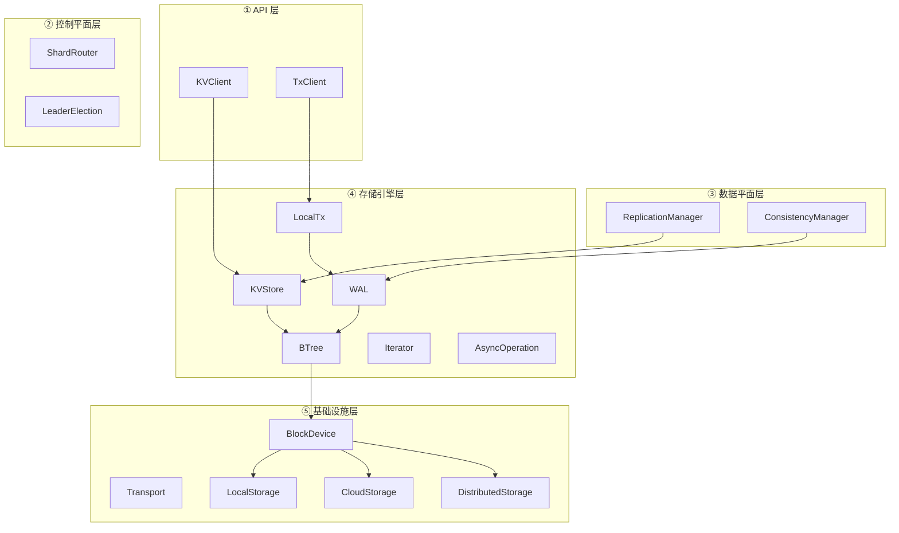
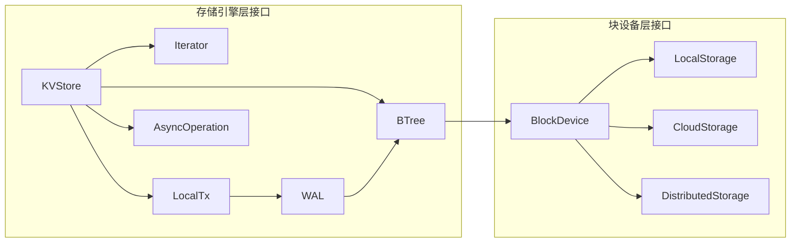
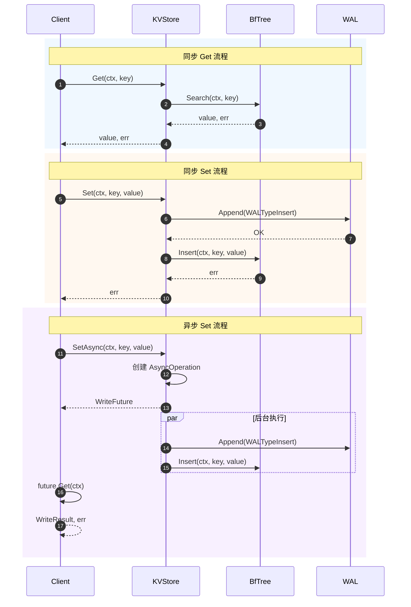
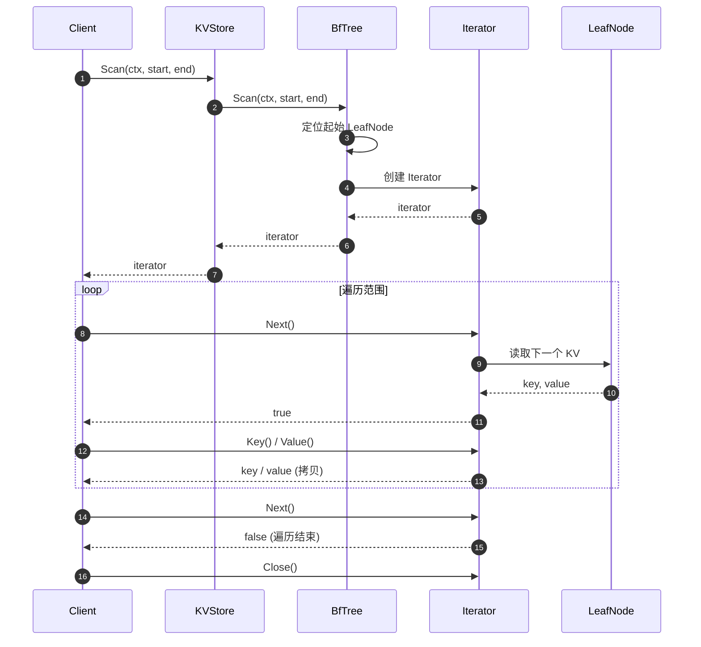
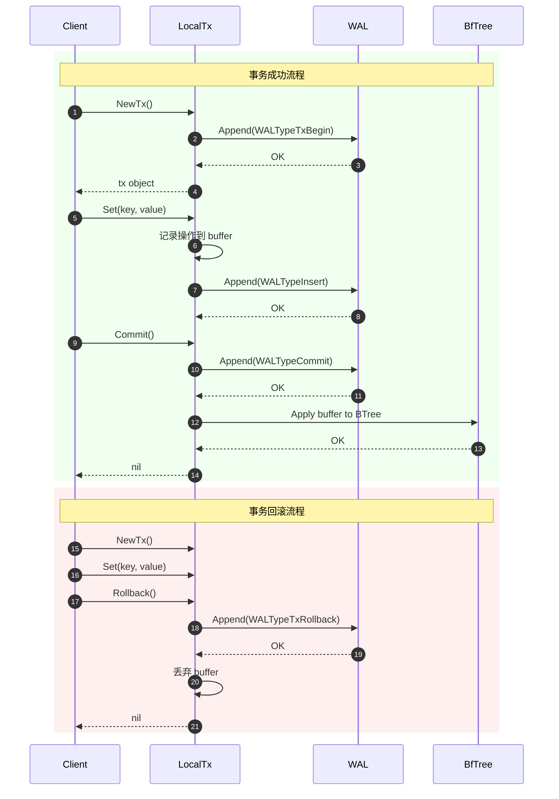
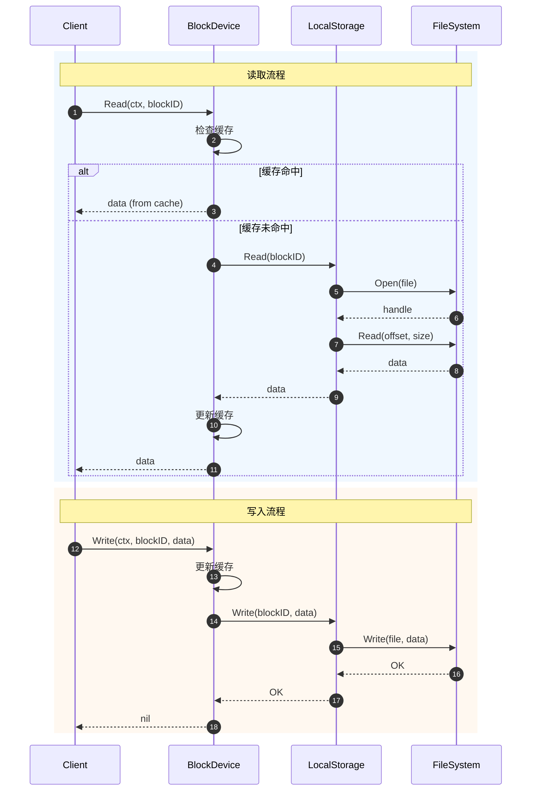
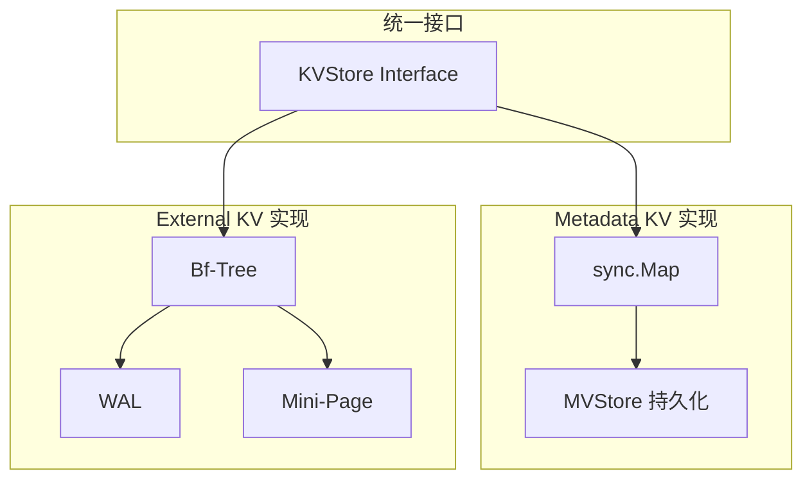
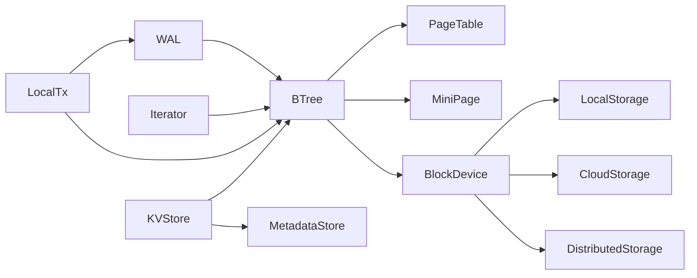
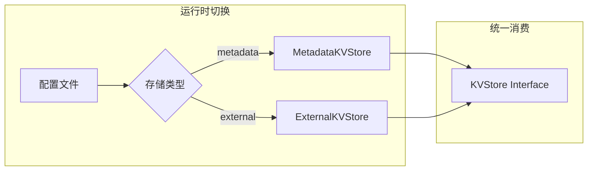

# M2 存储引擎层 - Interface 定义

> **预研类型**: Spike
> **创建日期**: 2026-02-21
> **最后更新**: 2026-02-22
> **分支**: `spike/m2-storage-engine`
> **状态**: ✅ 已完成

---

## 📋 关联文档

| 文档 | 版本 | 说明 |
|------|------|------|
| [Interface 定义](./2026-02-21_spike_m2-storage-engine-interface.md) | v2.2 | 接口设计（本文档） |
| [实现方案](./2026-02-21_spike_m2-storage-engine-implement.md) | v2.1 | 技术实现 |
| [实施路线图](./2026-02-21_spike_m2-storage-engine-roadmap.md) | v2.0 | 时间规划 |
| [性能基准](./2026-02-21_spike_m2-storage-engine-benchmark.md) | v2.0 | 性能测试方案 |
| [**DDD Interface v3.0**](./2026-02-18_spike_nexkv-ddd-interface.md) | **v3.0** | **统一接口定义（47个接口，包含 AsyncOperation、BTree、WAL）** |
| [**DDD Implement v3.0**](./2026-02-18_spike_nexkv-ddd-implement.md) | **v3.0** | **DDD 实施方案（含测试策略）** |
| [**DDD Roadmap v3.0**](./2026-02-18_spike_nexkv-ddd-roadmap.md) | **v3.0** | **阶段规划（含阶段 0：异步重构）** |
| [**统一执行器架构**](./2026-02-25_spike_glm-unified-executor.md) | - | 执行层核心 - GoroutineProvider 接口拆分 + Per-Core 无锁执行器 |

> 📖 **并发管理参考**: [DDD Interface v3.0 - GoroutineProvider](./2026-02-18_spike_nexkv-ddd-interface.md#13-b4-goroutineprovider)
>
> ⚠️ **重要**: M2 存储引擎层直接依赖 DDD v3.0 的架构定义，确保版本一致。

---

## 📊 文档概览

**文档定位**：本文档是 M2 存储引擎层的**总纲领性文件**，定义所有接口的完整规范（非 MVP 限制版）。

**核心特性**：
- **双存储引擎策略**：Metadata KV（sync.Map）+ External KV（Bf-Tree）
- **统一接口，分层实现**：KVStore 接口统一，底层实现各司其职
- **5 层架构集成**：存储引擎层作为第 ④ 层，提供单机 KV 能力
- **同步异步统一**：同一接口支持同步和异步两种调用方式

**Interface 统计总览**：

| 组件 | Interface 数量 | 核心职责 | 包名 | 异步支持 | 实施阶段 |
|------|---------------|----------|------|---------|---------|
| **KV 存储** | 1 个 | 基础 CRUD、批量操作、范围查询 | storage | ✅ 完整支持 | **MVP** |
| **WAL** | 1 个 | 预写日志、崩溃恢复 | storage | ✅ 完整支持 | **MVP** |
| **迭代器** | 1 个 | 范围扫描 | storage | - | **MVP** |
| **异步操作** | 1 个（泛型） | 统一异步接口 | async | - | **MVP** |
| **本地事务** | 1 个 | 单机 ACID 事务 | storage | ✅ 完整支持 | v1.1 |
| **BTree** | 1 个 | B+树索引、页管理 | storage | ✅ 完整支持 | v1.2 |
| **块设备** | 1 个 | 存储后端抽象 | blockdevice | ✅ 完整支持 | v2.0 |
| **本地存储** | 1 个 | HDD/SSD/NVMe | blockdevice | ✅ 完整支持 | v2.0 |
| **云存储** | 1 个 | S3/Azure Blob/GCS | blockdevice | ✅ 完整支持 | **Phase 3+** |
| **分布式存储** | 1 个 | Ceph/MinIO | blockdevice | ✅ 完整支持 | **Phase 3+** |
| **总计** | **10 个** | - | - | **8 个支持异步** | - |

> 📖 **完整接口清单**：参见 [DDD 架构参考 - 完整接口清单](./2026-02-18_spike_nexkv-ddd-interface.md#完整接口清单5层架构)

---

## Context 使用规范

所有接口的 `context.Context` 参数用于：
- **取消操作**：监听 `ctx.Done()`，及时终止长时间运行的操作
- **超时控制**：通过 `context.WithTimeout()` 设置操作超时
- **链路追踪**：传递 trace ID 等上下文信息

**实现要求**：
- 所有阻塞操作必须监听 `ctx.Done()`
- 及时释放资源，避免 goroutine 泄漏
- 不要在结构体中存储 context，应在方法调用时传递

**示例**：
```go
func (s *Store) Get(ctx context.Context, key []byte) ([]byte, error) {
    // 检查 context 是否已取消
    select {
    case <-ctx.Done():
        return nil, ctx.Err()
    default:
    }

    // 执行查询...
    result := make(chan []byte, 1)
    errCh := make(chan error, 1)
    go func() {
        val, err := s.tree.Search(ctx, key)  // ✅ 修复：添加 ctx 参数
        result <- val
        errCh <- err
    }()

    // 等待结果或 context 取消
    select {
    case <-ctx.Done():
        return nil, ctx.Err()
    case val := <-result:
        return val, <-errCh
    }
}
```

---

## 一、架构总图

### 1.1 存储引擎层在 5 层架构中的位置



### 1.2 接口依赖关系图



---

## 二、核心接口定义

### 2.1 KVStore 接口（统一接口，双层实现）

> 📖 **参考**: [DDD 架构参考 - KVStore 接口](./2026-02-18_spike_nexkv-ddd-interface.md#2221-kvstore---存储引擎核心接口)

**位置**: `internal/domain/service/storage.go`

```go
// KVStore 定义存储引擎的核心接口（同步+异步统一接口）。
//
// 设计原则：
//   - 接口统一：同步和异步方法在同一个接口中
//   - 可插拔：B+tree/LSM/Bf-Tree 可以互换，接口不变
//   - 正交性：与上层的 Replication/Cluster 完全解耦
//   - 灵活性：根据场景选择同步或异步方法
//
// 使用场景：
//   - Metadata KV：节点、分片、配置元数据（sync.Map 实现）
//   - External KV：业务数据、用户数据（Bf-Tree 实现）
//
// 并发安全性：
//   - 所有方法可以并发调用
//   - Scan 返回的 Iterator 不是线程安全的
//
// 输入限制（安全要求）：
//   - Key 大小：最大 4KB（MaxKeySize）
//   - Value 大小：最大 4MB（MaxValueSize）
//   - 批量操作数量：最大 1000 个 KV（MaxBatchSize）
//   - 超过限制将返回 ErrKeyTooLarge / ErrValueTooLarge / ErrBatchTooLarge
//
// 实现要求：
//   - 必须在接口实现层验证输入大小
//   - 必须返回明确的错误类型（便于上层处理）
//   - 建议记录监控指标（key_size_histogram, value_size_histogram）
//
// 使用示例：
//   ```go
//   import (
//       "context"
//       "github.com/yourorg/nexkv/internal/domain/service"
//   )
//
//   var store service.KVStore = // ... 初始化实现
//   value, err := store.Get(context.Background(), []byte("key"))
//   ```
type KVStore interface {
    // ====== 同步读写 ======
    Get(ctx context.Context, key []byte) ([]byte, error)
    Set(ctx context.Context, key, value []byte) error
    Delete(ctx context.Context, key []byte) error

    // ====== 异步读写 ======
    GetAsync(ctx context.Context, key []byte) ReadFuture
    SetAsync(ctx context.Context, key, value []byte) WriteFuture
    DeleteAsync(ctx context.Context, key []byte) WriteFuture

    // ====== 范围查询 ======
    // Scan 范围查询，返回迭代器
    // 范围为左闭右开 [start, end)，即包含 start，不包含 end
    // 若 end 为 nil，则从 start 开始遍历到数据末尾
    // 若 start 为 nil，则从数据开头开始遍历到 end
    Scan(ctx context.Context, start, end []byte) (Iterator, error)
    ScanAsync(ctx context.Context, start, end []byte) IteratorFuture

    // ====== 批量操作 ======
    BatchGet(ctx context.Context, keys [][]byte) ([]KeyValue, error)
    BatchSet(ctx context.Context, kvs []KeyValue) error
    BatchDelete(ctx context.Context, keys [][]byte) error
    BatchGetAsync(ctx context.Context, keys [][]byte) BatchGetFuture
    BatchSetAsync(ctx context.Context, kvs []KeyValue) WriteFuture
    BatchDeleteAsync(ctx context.Context, keys [][]byte) WriteFuture

    // ====== 本地事务 ======
    NewTx() (LocalTx, error)

    // ====== 状态管理 ======
    Close() error
    Sync() error
    SyncAsync(ctx context.Context) WriteFuture

    // ====== 监控统计 ======
    Stats() StoreStats
}

// KeyValue 键值对
type KeyValue struct {
    Key   []byte
    Value []byte
}

// ====== 输入限制常量（安全要求）======

const (
    // MaxKeySize Key 最大大小（4KB）
    // 理由：
    //   - B+Tree 页面大小为 4KB，单个 Key 不应超过页面大小
    //   - 避免 DoS 攻击（超大 Key 导致内存耗尽）
    //   - 与主流 KV 存储对齐（RocksDB 限制 4KB）
    MaxKeySize = 4 * 1024

    // MaxValueSize Value 最大大小（4MB）
    // 理由：
    //   - 大 Value 应使用对象存储（S3/OSS），而非 KV 存储
    //   - 避免网络带宽耗尽（范围扫描返回超大 Value）
    //   - 避免 WAL 文件无限增长
    //   - 与主流 KV 存储对齐（RocksDB 限制 4MB）
    MaxValueSize = 4 * 1024 * 1024

    // MaxBatchSize 批量操作最大数量（1000 个）
    // 理由：
    //   - 避免单次操作占用过多内存
    //   - 避免长时间阻塞其他操作
    //   - 与主流 KV 存储对齐（Redis MGET 限制 1000）
    MaxBatchSize = 1000
)

// ====== 错误类型定义 ======

var (
    // ErrKeyTooLarge Key 超过最大限制
    ErrKeyTooLarge = errors.New("key size exceeds maximum limit (4KB)")

    // ErrValueTooLarge Value 超过最大限制
    ErrValueTooLarge = errors.New("value size exceeds maximum limit (4MB)")

    // ErrBatchTooLarge 批量操作超过最大数量
    ErrBatchTooLarge = errors.New("batch size exceeds maximum limit (1000)")
)

// ====== 错误映射说明 ======

// StorageError 与简单错误的映射关系：
//
// 简单错误（ErrKeyTooLarge 等）是便捷错误，用于快速验证。
// StorageError 是结构化错误，包含错误码、消息和原因，适合生产环境。
//
// 映射规则：
//   - ErrKeyTooLarge → StorageError{Code: ErrCodeInvalidInput, Message: "...", Cause: ErrKeyTooLarge}
//   - ErrValueTooLarge → StorageError{Code: ErrCodeInvalidInput, Message: "...", Cause: ErrValueTooLarge}
//   - ErrBatchTooLarge → StorageError{Code: ErrCodeInvalidInput, Message: "...", Cause: ErrBatchTooLarge}
//
// 使用示例：
//   ```go
//   // 简单验证（开发/测试）
//   if err := ValidateKey(key); err != nil {
//       return err  // 直接返回 ErrKeyTooLarge
//   }
//
//   // 结构化错误（生产环境）
//   if err := ValidateKey(key); err != nil {
//       return StorageError{
//           Code:    ErrCodeInvalidInput,
//           Message: fmt.Sprintf("key validation failed: %v", err),
//           Cause:   err,  // 包装 ErrKeyTooLarge
//       }
//   }
//   ```

// ====== 输入验证函数（实现层必须调用）======

// ValidateKey 验证 Key 大小
func ValidateKey(key []byte) error {
    if len(key) > MaxKeySize {
        return fmt.Errorf("%w: key_size=%d, max_size=%d",
            ErrKeyTooLarge, len(key), MaxKeySize)
    }
    return nil
}

// ValidateValue 验证 Value 大小
func ValidateValue(value []byte) error {
    if len(value) > MaxValueSize {
        return fmt.Errorf("%w: value_size=%d, max_size=%d",
            ErrValueTooLarge, len(value), MaxValueSize)
    }
    return nil
}

// ValidateBatch 验证批量操作数量
func ValidateBatch(batchSize int) error {
    if batchSize > MaxBatchSize {
        return fmt.Errorf("%w: batch_size=%d, max_size=%d",
            ErrBatchTooLarge, batchSize, MaxBatchSize)
    }
    return nil
}


// StoreStats 存储统计信息
type StoreStats struct {
    TotalKeys     int64  // 总键数
    TotalBytes    int64  // 总字节数
    HitCount      int64  // 缓存命中次数
    MissCount     int64  // 缓存未命中次数
    WriteCount    int64  // 写入次数
    ReadCount     int64  // 读取次数
    TxCount       int64  // 事务次数
    TxConflict    int64  // 事务冲突次数
    WALWriteCount int64  // WAL 写入次数
    PageHit       int64  // 页缓存命中
    PageMiss      int64  // 页缓存未命中
    TreeHeight    int    // B+树高度

    // 新增监控指标
    WALQueueLength  int64   // WAL 积压队列长度
    LockWaitTimeMs  float64 // 锁等待时间（毫秒）
    GCPauseTotalMs  int64   // GC 暂停总时间
}
```

**使用场景**：

| 方法 | Metadata KV 场景 | External KV 场景 |
|------|-----------------|------------------|
| `Get` | 获取节点元数据、分片配置 | 获取业务数据 |
| `Set` | 更新节点状态、配置参数 | 写入业务数据 |
| `Delete` | 删除过期元数据 | 删除业务数据 |
| `GetAsync` | 高并发元数据查询 | 高并发业务查询 |
| `BatchGet` | 批量获取多个节点信息 | 批量读取热点数据 |
| `BatchSet` | 批量更新配置 | 批量写入日志 |
| `Scan` | 枚举所有分片 | 范围查询用户数据 |
| `NewTx` | 事务性更新元数据 | 事务性写入业务数据 |

**CRUD 流程时序图**：



---

### 2.2 Iterator 接口

> 📖 **参考**: [DDD 架构参考 - Iterator 接口](./2026-02-18_spike_nexkv-ddd-interface.md#2224-iterator---迭代器接口)

**位置**: `internal/domain/service/storage.go`

```go
// Iterator 迭代器接口
//
// 内存安全：
//   - Key() 和 Value() 返回的是数据拷贝，外部可安全修改
//   - 不会因外部修改 slice 而破坏 BTree 内存结构
//
// 用于范围扫描，支持正向遍历。持有快照，不反映后续修改。
//
// 线程安全：
//   - 单个 Iterator 不是线程安全的，不能跨 goroutine 使用
//   - 每个 goroutine 应创建独立的 Iterator
type Iterator interface {
    // Next 移动到下一个元素
    // 返回 false 表示遍历结束或发生错误
    Next() bool

    // Key 获取当前元素的键（返回拷贝，外部可安全修改）
    // 调用前必须确保 Next() 返回 true
    Key() []byte

    // Value 获取当前元素的值（返回拷贝，外部可安全修改）
    // 调用前必须确保 Next() 返回 true
    Value() []byte

    // Error 获取遍历过程中的错误
    Error() error

    // Close 释放资源
    Close()
}
```

**快照实现策略**：

采用 **Copy-on-Read** 模式（MVP 简化）：

```go
func (t *BfTree) Scan(ctx context.Context, start, end []byte) (Iterator, error) {
    t.mu.RLock()
    defer t.mu.RUnlock()

    // 1. 定位起始 LeafNode
    // 2. 复制范围内的所有 KV 到 Iterator 内部缓冲
    // 3. 释放锁后返回 Iterator
    // 4. Iterator 遍历的是创建时的数据拷贝
}
```

**优缺点**：
- ✅ 不阻塞写入操作
- ✅ 真正的快照语义
- ❌ 内存开销较大（适合小范围扫描）

**未来优化方向**（v2.0）：
- MVCC 版本快照（零拷贝）

**使用示例**：

```go
func ListShards(store KVStore) ([]*Shard, error) {
    iter, err := store.Scan(context.Background(), []byte("shard:"), []byte("shard:~"))
    if err != nil {
        return nil, err
    }
    defer iter.Close()

    var shards []*Shard
    for iter.Next() {
        var shard Shard
        if err := json.Unmarshal(iter.Value(), &shard); err != nil {
            return nil, err
        }
        shards = append(shards, &shard)
    }

    if err := iter.Error(); err != nil {
        return nil, err
    }
    return shards, nil
}
```

**范围扫描流程时序图**：



---

### 2.3 LocalTx 接口

> 📖 **参考**: [DDD 架构参考 - LocalTx 接口](./2026-02-18_spike_nexkv-ddd-interface.md#2225-localtx---本地事务接口)

**位置**: `internal/domain/service/storage.go`

```go
// LocalTx 本地事务接口（同步+异步统一接口）
//
// 提供 ACID 事务能力。通过 KVStore.NewTx() 创建。
//
// 内存安全：
//   - 所有方法内部会深拷贝 key/value，避免外部指针修改导致数据不一致
//   - Get 返回的 value 是拷贝，外部可安全修改
//   - Set/SetAsync 接收的 key/value 会被深拷贝存储
//
// 事务隔离级别：
//   - Read Committed：默认级别
//   - Repeatable Read：MVCC 实现（基于版本号）
//
// 线程安全：
//   - 单个 LocalTx 实例不是线程安全的，不能跨 goroutine 使用
//   - 事务对象应在创建它的 goroutine 中使用
//
// 生命周期约束：
//   - Commit() 或 Rollback() 调用后，事务对象必须废弃
//   - 后续所有 Get/Set/Delete 调用均返回 ErrTxClosed
//   - 必须在使用完毕后调用 Commit 或 Rollback，避免资源泄漏
type LocalTx interface {
    // ====== 单条事务操作 ======
    Get(ctx context.Context, key []byte) ([]byte, error)
    Set(ctx context.Context, key, value []byte) error
    Delete(ctx context.Context, key []byte) error

    // ====== 批量事务操作（同步，事务内顺序执行） ======
    BatchSet(ctx context.Context, kvs []KeyValue) error
    BatchGet(ctx context.Context, keys [][]byte) ([]KeyValue, error)
    BatchDelete(ctx context.Context, keys [][]byte) error

    // ====== 提交/回滚 ======
    Commit() error
    CommitAsync() WriteFuture
    Rollback() error // 回滚是内存操作，极快，无需异步版本
}
```

**事务隔离级别**：

| 级别 | 支持 | 说明 |
|------|------|------|
| Read Uncommitted | ❌ | 不支持脏读 |
| Read Committed | ✅ | 默认级别 |
| Repeatable Read | ✅ | MVCC 实现（基于版本号） |
| Serializable | 🔜 TODO | 计划 v2.0 支持 |

**事务流程时序图**：



---

### 2.4 WAL 接口

> 📖 **参考**: [DDD 架构参考 - WAL 接口](./2026-02-18_spike_nexkv-ddd-interface.md#2222-wal---写前日志接口)

**位置**: `internal/domain/service/storage.go`

```go
// WAL 定义写前日志接口（同步+异步统一接口）
//
// 用于崩溃恢复和事务持久化。
//
// 事务语义：
//   - 事务操作：TxID > 0，包含 TxBegin/Data/Commit 或 TxBegin/Data/Rollback
//   - 非事务操作：TxID = 0，单条 KV 操作直接写入
//
// 线程安全：所有方法可并发调用
type WAL interface {
    // ====== 同步写日志 ======
    Append(entry WALEntry) error
    Sync() error
    Recover() ([]WALEntry, error)
    Truncate(lsn uint64) error

    // ====== 异步写日志 ======
    AppendAsync(entry WALEntry) WriteFuture
    TruncateAsync(lsn uint64) WriteFuture

    // ====== 生命周期 ======
    Close() error
}

// WALEntry 定义 WAL 条目结构
type WALEntry struct {
    LSN       uint64      // 日志序列号
    TxID      uint64      // 事务ID（TxID = 0 表示非事务的单 KV 操作；TxID > 0 表示属于某事务）
    Timestamp int64       // Unix 时间戳（微秒），用于恢复和调试
    Type      WALType     // 日志类型
    Key       []byte      // 键：KV操作为业务key，页操作为pageID的二进制编码
    Value     []byte      // 值：KV操作为业务value，页操作为页数据/操作元数据
    PrevLSN   uint64      // 前一条日志的 LSN（用于链式恢复）
}

// WALType 定义日志类型
type WALType uint8

const (
    WALTypeInsert WALType = iota
    WALTypeDelete
    WALTypeTxBegin      // 事务开始
    WALTypeCommit       // 事务提交
    WALTypeTxRollback   // 事务回滚
    WALTypeCheckpoint   // 检查点
    // Bf-Tree 扩展类型
    WALTypeInsertMiniPage
    WALTypeDeleteMiniPage
    WALTypeUpgradeToFullPage
)
```

---

### 2.5 BTree 接口

> 📖 **参考**: [DDD 架构参考 - BTree 接口](./2026-02-18_spike_nexkv-ddd-interface.md#2223-btree---btree专用接口)

> **设计说明**：BTree 是底层存储引擎接口，提供页级别的操作能力；KVStore 是上层业务接口，提供键值操作的抽象。KVStore 的 Bf-Tree 实现会内部调用 BTree 接口。

**位置**: `internal/domain/service/storage.go`

```go
// BTree 定义 B+树的核心接口（同步+异步统一接口）。
//
// B+树是 KVStore 的一种实现，特点：
//   - 内存 B+树：负责快速查询
//   - 磁盘页文件：负责持久化
//   - 页管理器：负责内存和磁盘之间的页交换
//
// 微软 Bf-Tree 特性：
//   - 读优化：大部分查询在内存完成
//   - 页式存储：4KB/8KB/16KB 页大小
//   - 缓存友好：热点数据常驻内存
//   - 范围查询：B+树天然支持范围扫描
//
// 线程安全：内部使用 RWMutex 保护，所有方法可并发调用
//
// 设计说明：BTree 是内部存储引擎接口，不对外暴露。
// - KVStore：对外业务接口，供上层服务调用
// - BTree：内部实现细节，KVStore 的 Bf-Tree 实现会内部调用
type BTree interface {
    // ====== 同步页管理 ======
    LoadPage(ctx context.Context, pageID uint32) (Page, error)
    WritePage(ctx context.Context, page Page) error

    // ====== 异步页管理 ======
    LoadPageAsync(ctx context.Context, pageID uint32) PageFuture
    WritePageAsync(ctx context.Context, page Page) WriteFuture
    PrefetchPages(ctx context.Context, pageIDs []uint32) WriteFuture

    // ====== 同步 B+树操作 ======
    Insert(ctx context.Context, key, value []byte) error
    Delete(ctx context.Context, key []byte) error
    Search(ctx context.Context, key []byte) ([]byte, error)
    // Scan 范围查询，返回迭代器
    // 范围为左闭右开 [start, end)，即包含 start，不包含 end
    Scan(ctx context.Context, start, end []byte) (Iterator, error)

    // ====== 异步 B+树操作 ======
    InsertAsync(ctx context.Context, key, value []byte) WriteFuture
    DeleteAsync(ctx context.Context, key []byte) WriteFuture
    SearchAsync(ctx context.Context, key []byte) ReadFuture
    ScanAsync(ctx context.Context, start, end []byte) IteratorFuture

    // ====== 刷盘 ======
    Flush(ctx context.Context) error
    FlushAsync(ctx context.Context) WriteFuture

    // ====== 生命周期 ======
    Close() error
}

// BTreeConfig B+树配置
type BTreeConfig struct {
    PageSize    int    // 4KB / 8KB / 16KB
    Path        string // 磁盘文件路径
    CacheSize   int    // 内存缓存大小
    EnableWAL   bool   // 是否开启 WAL
}

// Page 页（磁盘和内存之间的单位）
type Page interface {
    ID() uint32
    Data() []byte
    Dirty() bool
    SetDirty(bool)
}
```

---

### 2.6 AsyncOperation 泛型接口

> 📖 **参考**: [DDD 架构参考 - AsyncOperation 接口](./2026-02-18_spike_nexkv-ddd-interface.md#226-asyncoperation---统一异步操作接口)

**位置**: `internal/domain/async/operation.go`

```go
// AsyncOperation 统一的异步操作接口（泛型设计）
//
// AsyncOperation 是所有异步操作的核心抽象，使用 Go 泛型统一不同返回类型。
//
// 设计优势：
//   - 接口统一：Get(ctx) + Status() + Cancel() + OnComplete() 四种核心方法
//   - Context 内置：Get() 直接接收 context
//   - 类型安全：泛型保证编译时类型检查
//   - 状态明确：Status() 返回操作状态枚举，无歧义
//   - 精确取消：Cancel() 返回 (canceled bool, err error)，语义精确
//   - 防崩溃：回调执行带 recover() 隔离 panic
//
// > ⚠️ **重命名计划**: AsyncOperation 将在重构中重命名为 AsyncOp
// >    参见: `thoughts/2026-03-02-idea-async-pipeline-refactor.md`
// >    向后兼容: `type AsyncOp[T any] = AsyncOperation[T]`
type AsyncOperation[T any] interface {
    // Get 等待异步操作完成并返回结果
    Get(ctx context.Context) (T, error)

    // Status 返回操作当前状态（非阻塞，无歧义）
    Status() OperationStatus

    // Cancel 取消异步操作（语义精确）
    Cancel() (canceled bool, err error)

    // Discard 丢弃异步操作结果（v19.0 新增）
    // 用于释放资源，适用于不再需要结果的场景
    Discard() error

    // IsStarted 返回操作是否已启动（v19.0 新增）
    IsStarted() bool

    // OnComplete 注册回调函数（结果就绪时调用）
    //
    // 线程安全：可在任意 goroutine 调用
    // cbID 格式："{opID}-{seq}"，如 "op-123-0"
    // 注意：回调执行时的 panic 会被 recover 并记录日志
    OnComplete(callback func(T, error)) string

    // OffComplete 注销回调函数
    // 如果 cbID 不存在，返回 ErrCallbackNotFound
    OffComplete(cbID string) error
}

// OperationStatus 操作状态枚举
type OperationStatus int

const (
    StatusPending   OperationStatus = iota // 初始状态为待执行（v19.0更新）
    StatusRunning                          // 执行中（v19.0新增）
    StatusCompleted                        // 操作成功完成
    StatusFailed                           // 操作失败
    StatusCanceled                         // 操作被取消
    StatusDiscarded                        // 操作被丢弃（v19.0新增）
    StatusTimeout                          // 操作超时
)

// IsTerminal 返回是否为终态（终态不可变更）
func (s OperationStatus) IsTerminal() bool {
    switch s {
    case StatusCompleted, StatusFailed, StatusCanceled, StatusDiscarded, StatusTimeout:
        return true
    default:
        return false
    }
}

// ============================================================================
// Future 类型别名（基于泛型 AsyncOperation）
// ============================================================================

// Future 类型别名（兼容性命名）
type Future[T any] = AsyncOperation[T]

// 具体类型别名
type ReadFuture      = Future[[]byte]                   // 读取 Future
type WriteFuture     = Future[WriteResult]              // 写入 Future
type IteratorFuture  = Future[Iterator]                 // 迭代器 Future
type BatchGetFuture  = Future[[]KeyValue]               // 批量读取 Future（返回 []KeyValue 支持二进制 key）
type PageFuture      = Future[Page]                     // 页 Future

// WriteResult 写操作结果
type WriteResult struct {
    Success   bool
    Timestamp int64
}
```

**使用示例**：

```go
// 创建异步操作
future := store.GetAsync(ctx, []byte("key"))

// ====== 方式1：阻塞等待 ======
value, err := future.Get(ctx)
if err != nil {
    log.Error("获取失败", err)
    return
}
fmt.Println("获取到的值:", string(value))

// ====== 方式2：回调（非阻塞） ======
cbID := future.OnComplete(func(v []byte, err error) {
    if err != nil {
        log.Error("回调获取失败", err)
        return
    }
    fmt.Println("回调获取到的值:", string(v))
})

// ====== 方式3：取消操作 ======
canceled, err := future.Cancel()
if canceled {
    fmt.Println("操作已取消")
}

// ====== 方式4：注销回调 ======
if err := future.OffComplete(cbID); err != nil {
    log.Error("注销回调失败", err)
}

// ====== 方式5：检查状态 ======
switch future.Status() {
case StatusPending:
    fmt.Println("操作进行中")
case StatusCompleted:
    fmt.Println("操作成功完成")
case StatusFailed:
    fmt.Println("操作失败")
case StatusCanceled:
    fmt.Println("操作被取消")
}
```

### 2.6.1 回调风格指南

> 🎯 **设计理念**: NexKV 支持两种回调风格，开发者可根据场景灵活选择。

#### 函数式回调（推荐用于简单场景）

**特点**：简洁直观，适合单次处理逻辑。

```go
// 简单的函数式回调
future.OnComplete(func(result T, err error) {
    if err != nil {
        log.Error("操作失败", err)
        return
    }
    fmt.Println("操作成功:", result)
})
```

**适用场景**：
- ✅ 单次异步操作处理
- ✅ 简单的成功/失败日志记录
- ✅ 不需要复杂状态管理的场景

#### 接口式回调（推荐用于复杂场景）

**特点**：结构清晰，支持状态管理和重试逻辑。

```go
// 定义回调处理器
type MyCallback struct {
    retries int
    maxRetries int
}

func (c *MyCallback) OnSuccess(value T, stats AsyncStats) {
    // 成功处理逻辑
    log.Printf("操作成功，耗时: %v", stats.Duration)
}

func (c *MyCallback) OnFailure(err error, stats AsyncStats) {
    // 失败处理逻辑（含重试）
    if c.retries < c.maxRetries {
        c.retries++
        log.Printf("操作失败，重试 %d/%d: %v", c.retries, c.maxRetries, err)
        // 触发重试...
    } else {
        log.Error("达到最大重试次数", err)
    }
}

func (c *MyCallback) OnComplete(stats AsyncStats) {
    // 完成清理逻辑
    log.Printf("操作结束，状态码: %d", stats.StatusCode)
}

// 使用方式
callback := &MyCallback{maxRetries: 3}
adapted := AdaptCallback(callback.OnSuccess) // 转换为函数式
future.OnComplete(adapted)
```

**适用场景**：
- ✅ 需要重试机制的异步操作
- ✅ 需要状态管理的复杂流程
- ✅ 需要详细统计信息的场景

#### 选择建议

| 场景 | 推荐风格 | 理由 |
|------|---------|------|
| 简单日志记录 | 函数式 | 代码简洁，1-3 行即可 |
| 单次异步操作 | 函数式 | 无需额外抽象 |
| 重试机制 | 接口式 | 需要维护重试计数器 |
| 状态管理 | 接口式 | 需要追踪多次操作状态 |
| 性能统计 | 接口式 | 需要收集详细的 AsyncStats |
| 批量操作 | 接口式 | 需要统一处理多个异步结果 |

#### 最佳实践

1. **优先使用函数式回调**：90% 的场景下，函数式回调已足够
2. **按需升级到接口式**：当出现复杂需求时再重构为接口式
3. **避免过度设计**：不要为了"未来可能需要"而使用接口式

```go
// ❌ 错误：过度设计
type SimpleLogger struct{}
func (l *SimpleLogger) OnSuccess(v T, s AsyncStats) { log.Info("成功") }
func (l *SimpleLogger) OnFailure(e error, s AsyncStats) { log.Error("失败") }
func (l *SimpleLogger) OnComplete(s AsyncStats) {}
future.OnComplete(AdaptCallback((&SimpleLogger{}).OnSuccess))

// ✅ 正确：简洁直接
future.OnComplete(func(v T, err error) {
    if err != nil { log.Error("失败", err); return }
    log.Info("成功")
})
```

### 2.6.2 AsyncOperation 接口版本说明 ⭐ v2.0 新增

> **⚠️ 重要声明**：M2 存储引擎层直接使用 **DDD v3.0** 定义的 `AsyncOperation[T]` 接口
>
> **接口位置**：`internal/domain/service/rpc_async.go`
> **完整定义**：参见 [DDD Interface v3.0 - AsyncOperation 泛型接口](./2026-02-18_spike_nexkv-ddd-interface.md#22-asyncoperation-泛型接口)
>
> **设计原则**：
> - M2 **不再单独定义**此接口，避免版本不一致和重复维护
> - 所有异步接口（SetAsync, GetAsync, DeleteAsync 等）均返回 `AsyncOperation[T]`
> - 未来 AsyncOperation → AsyncOp 重命名时，M2 代码将自动受益
>
> ---
>
> **更新日期**: 2026-03-02
> **参考**: `thoughts/2026-03-02-idea-async-pipeline-refactor.md`

#### v1.0 (原始版本)

基础异步操作接口：
```go
type AsyncOperation[T any] interface {
    Get(ctx context.Context) (T, error)
    Status() OperationStatus
    Cancel() (canceled bool, err error)
    OnComplete(callback func(T, error))
}
```

**特点**：
- ✅ 基础异步能力
- ✅ 阻塞等待（Get）
- ✅ 状态查询（Status）
- ✅ 取消操作（Cancel）
- ✅ 回调注册（OnComplete）

**限制**：
- ❌ 无资源管理方法（Discard）
- ❌ 无启动状态查询（IsStarted）
- ❌ 无回调注销（OffComplete）

#### v2.0 (增强版本，受异步流水线设计影响)

新增方法：
```go
type AsyncOperation[T any] interface {
    // ====== v1.0 方法 ======
    Get(ctx context.Context) (T, error)
    Status() OperationStatus
    Cancel() (canceled bool, err error)
    OnComplete(callback func(T, error)) string  // 现在返回 cbID

    // ====== v2.0 新增方法 ======
    // Discard 丢弃操作结果，释放资源
    Discard() error

    // IsStarted 检查操作是否已开始
    IsStarted() bool

    // OffComplete 注销回调
    OffComplete(cbID string) error
}
```

**新增功能**：

| 方法 | 说明 | 使用场景 |
|------|------|----------|
| **Discard()** | 丢弃操作结果，释放资源 | 取消不再需要的异步操作 |
| **IsStarted()** | 检查操作是否已开始 | 区分"待执行"和"运行中"状态 |
| **OffComplete()** | 注销回调函数 | 动态移除回调，避免内存泄漏 |

**兼容性**：v2.0 完全兼容 v1.0
- 旧代码无需修改，可以正常编译
- 新方法为可选扩展，不影响现有功能

#### v3.0 (重命名版本，待实施)

> **实施时间**: 阶段 0 Week 1-2
> **设计来源**: `thoughts/2026-03-02-idea-async-pipeline-refactor.md`

**重命名**：`AsyncOperation[T]` → `AsyncOp[T]`

```go
// 新接口（更简洁的命名）
type AsyncOp[T any] interface {
    Await(ctx context.Context) (T, error)  // 替代 Get
    OnComplete(callback func(T, error)) string
    OnError(callback func(error)) string
    OnSuccess(callback func(T)) string
    OffComplete(cbID string) error
    WithTimeout(timeout time.Duration) AsyncOp[T]
    IsDone() bool
    IsSuccess() bool
    IsFailed() bool
    IsCanceled() bool
}

// 向后兼容别名
type AsyncOperation[T any] = AsyncOp[T]
```

**迁移路径**：
1. **阶段 0**：添加 `AsyncOp[T]` 接口和类型别名
2. **后续阶段**：逐步迁移到 `AsyncOp[T]`
3. **最终移除**：在 v2.0 版本中移除 `AsyncOperation[T]`

---

## 三、块设备层接口

### 3.1 BlockDevice 接口

> 📖 **参考**: [DDD 架构参考 - BlockDevice 接口](./2026-02-18_spike_nexkv-ddd-interface.md#261-blockdevice---块设备核心接口)

**位置**: `internal/domain/service/blockdevice.go`

```go
// BlockDevice 定义块设备的核心接口（同步+异步统一接口）。
//
// BlockDevice 是存储介质的抽象层，支持本地磁盘、SSD、NVMe、云存储等多种后端。
type BlockDevice interface {
    // ====== 同步块读写 ======
    Read(ctx context.Context, blockID BlockID) ([]byte, error)
    Write(ctx context.Context, blockID BlockID, data []byte) error
    Delete(ctx context.Context, blockID BlockID) error

    // ====== 异步块读写 ======
    ReadAsync(ctx context.Context, blockID BlockID) BlockFuture
    WriteAsync(ctx context.Context, blockID BlockID, data []byte) WriteFuture
    DeleteAsync(ctx context.Context, blockID BlockID) WriteFuture

    // ====== 批量操作 ======
    ReadBatch(ctx context.Context, blockIDs []BlockID) (map[BlockID][]byte, error)
    WriteBatch(ctx context.Context, blocks map[BlockID][]byte) error
    ReadBatchAsync(ctx context.Context, blockIDs []BlockID) BatchBlockFuture
    WriteBatchAsync(ctx context.Context, blocks map[BlockID][]byte) WriteFuture

    // ====== 同步刷盘 ======
    Sync(ctx context.Context) error
    SyncAsync(ctx context.Context) WriteFuture

    // ====== 设备信息 ======
    Stats() DeviceStats
    Close() error
}

// BlockID 块标识符（uint64 固定大小，支持高效页表、预读、连续块分配）
type BlockID uint64

// DeviceStats 设备统计信息
type DeviceStats struct {
    TotalBlocks    int64   // 总块数
    UsedBlocks     int64   // 已用块数
    FreeBlocks     int64   // 空闲块数
    ReadBytes      int64   // 读取字节数
    WriteBytes     int64   // 写入字节数
    ReadLatency    float64 // 平均读延迟(ms)
    WriteLatency   float64 // 平均写延迟(ms)
    IOPS           int64   // 每秒 IO 操作数
    Bandwidth      int64   // 带宽(MB/s)
    StorageType    string  // 存储类型(SSD/HDD/S3/Ceph)
}

// Future 类型别名
type BlockFuture = AsyncOperation[[]byte]
type BatchBlockFuture = AsyncOperation[map[BlockID][]byte]
```

**读写流程时序图**：



---

### 3.2 LocalStorage 接口

> 📖 **参考**: [DDD 架构参考 - LocalStorage 接口](./2026-02-18_spike_nexkv-ddd-interface.md#262-localstorage---本地存储接口)

**位置**: `internal/domain/service/blockdevice.go`

```go
// LocalStorage 定义本地存储接口（同步+异步统一接口，HDD/SSD/NVMe）。
//
// 使用场景：
//   - 本地 SSD：高性能、低延迟（100μs 级）
//   - NVMe SSD：极高 IOPS（10万+）
//   - HDD：低成本、大容量
type LocalStorage interface {
    BlockDevice

    // ====== 本地存储特有操作 ======
    // 获取文件路径
    FilePath(blockID BlockID) string

    // 预读（同步+异步）
    Prefetch(ctx context.Context, blockIDs []BlockID) error
    PrefetchAsync(ctx context.Context, blockIDs []BlockID) WriteFuture

    // 碎片整理（同步+异步）
    Defragment(ctx context.Context) error
    DefragmentAsync(ctx context.Context) WriteFuture
}

// LocalStorageConfig 本地存储配置
type LocalStorageConfig struct {
    BasePath       string // 基础路径
    BlockSize      int    // 块大小（4KB/8KB/64KB）
    MaxBlocks      int64  // 最大块数
    SyncWrite      bool   // 是否同步写入
    DirectIO       bool   // 是否使用 Direct I/O
    EnablePrefetch bool   // 是否启用预读
}
```

---

### 3.3 CloudStorage 接口（Phase 3+）

> ⚠️ **实施阶段**：Phase 3+，不在当前 MVP 范围内
>
> ⚠️ **实现状态**：仅有接口定义，无具体实现，留待将来实现

> 📖 **参考**: [DDD 架构参考 - CloudStorage 接口](./2026-02-18_spike_nexkv-ddd-interface.md#263-cloudstorage---云存储接口)

**位置**: `internal/domain/service/blockdevice.go`

```go
// CloudStorage 定义云存储接口（同步+异步统一接口，S3/Azure Blob/GCS）。
//
// ⚠️ 云存储不可变性：
//   - S3/Azure Blob/GCS 的对象写完后不可修改
//   - Write() 对已存在的 blockID 会返回 ErrBlockExists
//   - 如需更新，必须先 Delete() 再 Write()
//   - 如需版本控制，请使用 VersionedCloudStorage 接口
//
// 📦 本地缓存策略：
//   - 读取时自动缓存到本地磁盘
//   - 支持 PrefetchToCache 预取热点数据
//   - 支持 CacheInvalidate 使缓存失效
//   - 缓存驱逐策略由 CloudStorageConfig 配置（LRU/LFU）
//
// 使用场景：
//   - AWS S3：无限容量、11 个 9 的持久性
//   - Azure Blob：云原生存储、分层存储
//   - GCS：Google 云存储、全球分布
type CloudStorage interface {
    BlockDevice

    // ====== 云存储特有操作 ======
    // 获取对象 URL
    ObjectURL(blockID BlockID) string

    // 分片上传（同步+异步）
    MultipartUpload(ctx context.Context, blockID BlockID, chunks []Chunk) error
    MultipartUploadAsync(ctx context.Context, blockID BlockID, chunks []Chunk) WriteFuture

    // 设置生命周期（同步+异步）
    SetLifecycle(ctx context.Context, rules []LifecycleRule) error
    SetLifecycleAsync(ctx context.Context, rules []LifecycleRule) WriteFuture

    // 获取元数据（同步+异步）
    GetMetadata(ctx context.Context, blockID BlockID) (map[string]string, error)
    GetMetadataAsync(ctx context.Context, blockID BlockID) MetadataFuture

    // ====== 本地缓存操作 ======
    // 预取到本地缓存（同步+异步）
    PrefetchToCache(ctx context.Context, blockIDs []BlockID) error
    PrefetchToCacheAsync(ctx context.Context, blockIDs []BlockID) WriteFuture

    // 使缓存失效（同步+异步）
    CacheInvalidate(ctx context.Context, blockID BlockID) error
    CacheInvalidateAsync(ctx context.Context, blockID BlockID) WriteFuture

    // 查询缓存状态（同步+异步）
    CacheStatus(ctx context.Context, blockID BlockID) (CacheStatus, error)
    CacheStatusAsync(ctx context.Context, blockID BlockID) CacheStatusFuture

    // 获取缓存统计
    CacheStats() CacheStats
}

// CloudStorageConfig 云存储配置（包含缓存配置）
type CloudStorageConfig struct {
    // 云服务配置
    Provider      string // "s3" / "azure" / "gcs"
    Bucket        string
    Region        string
    Endpoint      string // 自定义端点（MinIO 等）

    // 本地缓存配置
    EnableCache    bool          // 是否启用本地缓存
    CachePath      string        // 缓存目录路径
    MaxCacheBytes  int64         // 最大缓存大小（字节）
    CachePolicy    CachePolicy   // 缓存驱逐策略（LRU/LFU）
    CacheTTL       time.Duration // 缓存过期时间
    PrefetchOnRead bool          // 读取时是否自动预取相邻块
    CacheMode      CacheMode     // 缓存一致性模式（Strong/Eventually/None）
}

// CachePolicy 缓存驱逐策略
type CachePolicy int

const (
    CachePolicyLRU CachePolicy = iota // 最近最少使用（默认）
    CachePolicyLFU                    // 最不常用
)

// CacheMode 缓存一致性模式
type CacheMode int

const (
    CacheModeEventually CacheMode = iota // 最终一致（默认）
    CacheModeStrong                      // 强一致（每次验证 ETag）
    CacheModeNone                        // 不缓存
)
```

**缓存一致性策略**：

| 策略 | 说明 | 适用场景 |
|------|------|---------|
| **TTL 过期** | 缓存设置 TTL，过期后重新获取 | 读多写少 |
| **ETag 验证** | 读取前发 HEAD 请求验证 ETag | 强一致性要求 |
| **最终一致** | 信任本地缓存，直到显式 Invalidate | 读密集 |

**本地缓存机制**：

| 特性 | 说明 |
|------|------|
| **缓存路径** | 可配置的本地目录 |
| **驱逐策略** | LRU（默认）/ LFU |
| **一致性验证** | 通过 ETag 验证云端数据变化 |
| **预取** | 支持 PrefetchToCache 批量预取 |

// CacheStatus 缓存状态

// CacheStatus 缓存状态
type CacheStatus struct {
    Cached      bool      // 是否在本地缓存
    CachePath   string    // 缓存文件路径
    CacheSize   int64     // 缓存大小
    LastAccess  time.Time // 最后访问时间
    ETag        string    // 云端 ETag（用于验证一致性）
}

// CacheStats 缓存统计
type CacheStats struct {
    TotalCached   int64 // 缓存块数
    TotalBytes    int64 // 缓存字节数
    HitCount      int64 // 缓存命中次数
    MissCount     int64 // 缓存未命中次数
    EvictCount    int64 // 驱逐次数
    MaxCacheBytes int64 // 最大缓存大小
}

// Chunk 分片
type Chunk struct {
    Offset int64
    Data   []byte
}

// LifecycleRule 生命周期规则
type LifecycleRule struct {
    ID         string
    Prefix     string        // 对象前缀
    Expiration time.Duration // 过期时间
}

// Future 类型别名
type MetadataFuture = AsyncOperation[map[string]string]
type CacheStatusFuture = AsyncOperation[CacheStatus]
```

---

### 3.4 VersionedCloudStorage 接口（Phase 3+）

> ⚠️ **实施阶段**：Phase 3+，不在当前 MVP 范围内
>
> ⚠️ **实现状态**：仅有接口定义，无具体实现，留待将来实现

> 📖 **参考**: [DDD 架构参考 - VersionedCloudStorage 接口](./2026-02-18_spike_nexkv-ddd-interface.md#264-versionedcloudstorage---版本控制云存储接口)

**位置**: `internal/domain/service/blockdevice.go`

```go
// VersionedCloudStorage 支持版本控制的云存储接口。
//
// 继承 CloudStorage，扩展版本控制能力：
//   - Write() 会创建新版本而非报错
//   - 支持列出、获取、删除特定版本
//
// 适用场景：
//   - 需要保留历史版本的场景
//   - 合规审计要求（数据不可变 + 版本追溯）
type VersionedCloudStorage interface {
    CloudStorage

    // ====== 版本控制操作 ======
    // 列出所有版本（同步+异步）
    ListVersions(ctx context.Context, blockID BlockID) ([]BlockVersion, error)
    ListVersionsAsync(ctx context.Context, blockID BlockID) VersionsFuture

    // 获取特定版本（同步+异步）
    GetVersion(ctx context.Context, blockID BlockID, versionID string) ([]byte, error)
    GetVersionAsync(ctx context.Context, blockID BlockID, versionID string) BlockFuture

    // 删除特定版本（同步+异步）
    DeleteVersion(ctx context.Context, blockID BlockID, versionID string) error
    DeleteVersionAsync(ctx context.Context, blockID BlockID, versionID string) WriteFuture
}

// BlockVersion 版本信息
type BlockVersion struct {
    VersionID    string    // 版本ID
    BlockID      BlockID   // 块ID
    Size         int64     // 大小
    ETag         string    // ETag（用于一致性校验）
    LastModified time.Time // 修改时间
    IsLatest     bool      // 是否最新版本
}

// Future 类型别名
type VersionsFuture = AsyncOperation[[]BlockVersion]
```

**接口验证策略**（Week 12-13）：

> ⚠️ **注意**：CloudStorage 和 DistributedStorage 接口在 Phase 3+ 实现，但需要在 Phase 2 进行验证

1. **最小实现验证**：
   ```go
   // 实现 Mock 版本（内存存储）
   type MockCloudStorage struct {
       data map[BlockID][]byte
       mu   sync.RWMutex
   }

   func (m *MockCloudStorage) Read(ctx context.Context, blockID BlockID) ([]byte, error) {
       m.mu.RLock()
       defer m.mu.RUnlock()

       data, ok := m.data[blockID]
       if !ok {
           return nil, ErrBlockNotFound
       }
       return data, nil
   }

   func (m *MockCloudStorage) Write(ctx context.Context, blockID BlockID, data []byte) error {
       m.mu.Lock()
       defer m.mu.Unlock()

       m.data[blockID] = data
       return nil
   }

   // ... 实现其他方法
   ```

2. **接口设计验证**：
   - 验证接口方法是否完整
   - 验证参数设计是否合理
   - 验证错误处理是否充分
   - 验证异步接口是否符合 AsyncOperation[T] 规范

3. **真实实现**（Phase 3）：
   - 替换 Mock 为真实 SDK（AWS S3 SDK、Azure Blob SDK）
   - 集成测试（真实云环境）
   - 性能测试（延迟、吞吐、成本）

---

### 3.4 DistributedStorage 接口（Phase 3+）

> ⚠️ **实施阶段**：Phase 3+，不在当前 MVP 范围内
>
> ⚠️ **实现状态**：仅有接口定义，无具体实现，留待将来实现

> 📖 **参考**: [DDD 架构参考 - DistributedStorage 接口](./2026-02-18_spike_nexkv-ddd-interface.md#264-distributedstorage---分布式存储接口)

**位置**: `internal/domain/service/blockdevice.go`

```go
// DistributedStorage 定义分布式存储接口（同步+异步统一接口，Ceph/MinIO）。
//
// 使用场景：
//   - Ceph：高性能、高可用、可扩展
//   - MinIO：S3 兼容、云原生
//   - GlusterFS：分布式文件系统
type DistributedStorage interface {
    BlockDevice

    // ====== 分布式存储特有操作 ======
    // 获取块位置（同步+异步）
    GetBlockLocation(ctx context.Context, blockID BlockID) ([]NodeLocation, error)
    GetBlockLocationAsync(ctx context.Context, blockID BlockID) LocationFuture

    // 数据迁移（同步+异步）
    MigrateBlock(ctx context.Context, blockID BlockID, fromNode, toNode NodeID) error
    MigrateBlockAsync(ctx context.Context, blockID BlockID, fromNode, toNode NodeID) WriteFuture

    // 重建副本（同步+异步）
    RebuildReplica(ctx context.Context, blockID BlockID) error
    RebuildReplicaAsync(ctx context.Context, blockID BlockID) WriteFuture

    // 获取集群状态（同步+异步）
    ClusterStatus(ctx context.Context) (ClusterStatus, error)
    ClusterStatusAsync(ctx context.Context) ClusterStatusFuture
}

// NodeLocation 节点位置
type NodeLocation struct {
    NodeID  NodeID
    Address string
    Zone    string // 可用区
    Rack    string // 机架
}

// ClusterStatus 集群状态
type ClusterStatus struct {
    TotalNodes    int
    HealthyNodes  int
    DegradedNodes int
    TotalCapacity int64 // 总容量(GB)
    UsedCapacity  int64 // 已用容量(GB)
    IOPS          int64
    Latency       float64
}

// Future 类型别名
type LocationFuture = AsyncOperation[[]NodeLocation]
type ClusterStatusFuture = AsyncOperation[ClusterStatus]
```

**实现类型**：

| 实现类型 | 位置 | 说明 |
|---------|------|------|
| **LocalStorage** | `internal/infrastructure/storage/local/` | 本地文件系统 |
| **CloudStorage** | `internal/infrastructure/storage/cloud/` | S3/Azure Blob/GCS |
| **DistributedStorage** | `internal/infrastructure/storage/distributed/` | 分布式存储 |

---

## 四、双存储引擎策略

> 📖 **详细实现方案**: [实现方案 - 双存储引擎策略](./2026-02-21_spike_m2-storage-engine-implement.md#二双存储引擎实现策略)

### 4.1 Metadata KV vs External KV

> **核心结论**：**不需要统一存储实现**（最优解）



### 4.2 实现映射

| 存储类型 | 接口 | 实现位置 | 底层存储 | 适用场景 |
|---------|------|---------|---------|---------|
| **Metadata KV** | `KVStore` | `internal/infrastructure/storage/metadata/` | `sync.Map` + MVStore | 节点、分片、配置元数据 |
| **External KV** | `KVStore` | `internal/infrastructure/storage/bftree/` | Bf-Tree（B+树变体） | 业务数据、用户数据 |

### 4.3 为什么不统一？

| 维度 | Metadata（元数据） | External KV（业务数据） | 统一的弊端 |
|------|-------------------|------------------------|-----------|
| **数据特征** | 量小（<1000条）、读写高频 | 量大、需范围查询 | Metadata 用 Bf-Tree 会引入不必要的节点分裂/合并开销 |
| **核心诉求** | 极致读写性能（O(1)） | 有序存储、范围查询 | 失去 map 的 O(1) 优势 |
| **工程复杂度** | 无持久化/事务需求 | 需 WAL、并发控制 | 元数据层被迫引入复杂逻辑 |

---

## 五、依赖关系

### 5.1 存储引擎层内部依赖



### 5.2 跨层依赖

| 依赖方向 | 依赖内容 | 说明 |
|---------|---------|------|
| **↑ 依赖数据平面层** | ReplicationManager | 副本复制需要 KVStore |
| **↑ 依赖控制平面层** | ShardRouter | 分片路由需要元数据 |
| **↓ 依赖基础设施层** | BlockDevice | Bf-Tree 需要存储抽象 |

---

## 六、设计原则

### 6.1 依赖倒置原则（DIP）

```go
// ✅ 正确：高层模块依赖抽象
type ReplicationManager struct {
    store KVStore  // 依赖接口，不依赖具体实现
}

// ✅ 正确：依赖注入
func NewReplicationManager(store KVStore) *ReplicationManager {
    return &ReplicationManager{store: store}
}

// ✅ 正确：可以注入不同的实现
var metadataStore KVStore = metadata.NewMetadataKVStore()
var externalStore KVStore = bftree.NewBfTreeStore()

// 元数据复制管理器
replMgr1 := NewReplicationManager(metadataStore)

// 业务数据复制管理器
replMgr2 := NewReplicationManager(externalStore)
```

### 6.2 接口隔离原则（ISP）

```go
// ❌ 为什么不拆分为 KVReader + KVWriter？
//
// 原因 1：原子性要求
// - Get-Set-Delete 经常在同一个事务中执行
// - 拆分接口会导致事务边界不清晰
//
// 原因 2：实现一致性
// - KVStore 的实现需要维护一致的状态
// - 拆分接口会导致实现复杂化（需要共享内部状态）
//
// 原因 3：使用场景
// - 90% 的场景需要完整的 CRUD 能力
// - 只读场景是少数（备份、审计），可以通过组合接口实现

// ✅ 正确的 ISP 应用场景
//
// 示例：只读客户端（备份系统）
type ReadOnlyClient interface {
    Get(ctx context.Context, key []byte) ([]byte, error)
    Scan(ctx context.Context, start, end []byte) (Iterator, error)
}
```

### 6.3 可插拔设计



---

## 七、错误定义

### 7.1 错误码规范

```go
// ErrorCode 错误码
type ErrorCode int

const (
    ErrCodeKeyNotFound ErrorCode = iota + 1
    ErrCodeKeyExists
    ErrCodeTxConflict
    ErrCodeTxTimeout
    ErrCodeStorageFull
    ErrCodeCorruptedData
    ErrCodeWALWriteFailed
    ErrCodeIteratorClosed
    ErrCodeTxClosed
    ErrCodeBlockNotFound
    ErrCodeBlockCorrupted
    // 云存储特有错误
    ErrCodeBlockExists      // 块已存在（云存储不可变）
    ErrCodeCacheMiss        // 缓存未命中
    ErrCodeCacheCorrupted   // 缓存损坏
    ErrCodeVersionNotFound  // 版本不存在
    ErrCodeVersioningDisabled // 未启用版本控制
)

// StorageError 存储引擎错误
type StorageError struct {
    Code  ErrorCode
    Msg   string
    Cause error // 原始错误（可选）
}

func (e *StorageError) Error() string {
    if e.Cause != nil {
        return fmt.Sprintf("[%d] %s: %v", e.Code, e.Msg, e.Cause)
    }
    return fmt.Sprintf("[%d] %s", e.Code, e.Msg)
}

func (e *StorageError) Unwrap() error {
    return e.Cause
}
```

### 7.2 预定义错误

```go
// 存储引擎错误
var (
    ErrKeyNotFound      = &StorageError{Code: ErrCodeKeyNotFound, Msg: "key not found"}
    ErrKeyExists        = &StorageError{Code: ErrCodeKeyExists, Msg: "key already exists"}
    ErrTxConflict       = &StorageError{Code: ErrCodeTxConflict, Msg: "transaction conflict"}
    ErrTxTimeout        = &StorageError{Code: ErrCodeTxTimeout, Msg: "transaction timeout"}
    ErrStorageFull      = &StorageError{Code: ErrCodeStorageFull, Msg: "storage full"}
    ErrCorruptedData    = &StorageError{Code: ErrCodeCorruptedData, Msg: "corrupted data"}
    ErrWALWriteFailed   = &StorageError{Code: ErrCodeWALWriteFailed, Msg: "WAL write failed"}
    ErrIteratorClosed   = &StorageError{Code: ErrCodeIteratorClosed, Msg: "iterator closed"}
    ErrTxClosed         = &StorageError{Code: ErrCodeTxClosed, Msg: "transaction closed"}
    ErrBlockNotFound    = &StorageError{Code: ErrCodeBlockNotFound, Msg: "block not found"}
    ErrBlockCorrupted   = &StorageError{Code: ErrCodeBlockCorrupted, Msg: "block corrupted"}
    // 云存储特有错误
    ErrBlockExists        = &StorageError{Code: ErrCodeBlockExists, Msg: "block already exists (cloud storage is immutable)"}
    ErrCacheMiss          = &StorageError{Code: ErrCodeCacheMiss, Msg: "cache miss"}
    ErrCacheCorrupted     = &StorageError{Code: ErrCodeCacheCorrupted, Msg: "cache corrupted"}
    ErrVersionNotFound    = &StorageError{Code: ErrCodeVersionNotFound, Msg: "version not found"}
    ErrVersioningDisabled = &StorageError{Code: ErrCodeVersioningDisabled, Msg: "versioning not enabled"}
)

// 异步操作标准错误
var (
    ErrCanceled         = errors.New("operation canceled")
    ErrTimeout          = errors.New("operation timeout")
    ErrCompleted        = errors.New("operation already completed")
    ErrAlreadyCanceled  = errors.New("operation already canceled")
    ErrCallbackNotFound = errors.New("callback not found")
)
```

### 7.3 错误使用示例

```go
// 返回错误
func (s *KVStore) Get(ctx context.Context, key []byte) ([]byte, error) {
    value, err := s.tree.Search(ctx, key)
    if err != nil {
        return nil, err
    }
    if value == nil {
        return nil, ErrKeyNotFound
    }
    return value, nil
}

// 判断错误类型
func handleGetError(err error) {
    var storageErr *StorageError
    if errors.As(err, &storageErr) {
        switch storageErr.Code {
        case ErrCodeKeyNotFound:
            // 处理 key 不存在
        case ErrCodeTxConflict:
            // 处理事务冲突
        }
    }
}
```

---

## 八、设计决策

### 8.1 为什么选择 Bf-Tree？

参见 [实现方案 - 术语澄清](./2026-02-21_spike_m2-storage-engine-implement.md#一术语澄清) 的详细分析。

### 8.2 同步/异步接口统一？

**设计决策**：同一接口包含同步和异步方法。

**理由**：
- 调用者按需选择，无需维护两套接口
- 异步方法使用泛型 `AsyncOperation[T]` 统一返回值
- Go 的 goroutine 已经提供轻量级并发

### 8.3 批量操作设计？

**当前设计**：内置于 KVStore 接口，而非独立接口。

**理由**：
- 减少接口数量
- 批量操作是高频需求
- 可通过装饰器模式扩展

---

## 九、同步 vs 异步使用建议

| 场景 | 推荐方法 | 理由 |
|------|---------|------|
| **单次查询** | store.Get() | 简单直接，性能足够 |
| **批量写入** | store.BatchSetAsync() | 异步批量，高吞吐 |
| **高并发读取** | store.GetAsync() | 非阻塞，减少等待 |
| **范围扫描** | store.Scan() | Iterator 已经是流式，同步足够 |
| **事务提交** | tx.Commit() | 需要确认提交成功 |
| **WAL 写入** | wal.AppendAsync() | 顺序写，异步性能好 |
| **页加载** | btree.LoadPageAsync() | I/O 密集，异步优势明显 |
| **云存储上传** | cloudStore.WriteAsync() | 网络延迟大，异步避免阻塞 |

---

## 十、接口组合模式

通过组合现有接口，可以创建适用于特定场景的专用接口。

### 10.1 只读接口组合

```go
// ReadOnlyStore 只读存储接口
// 适用于备份系统、审计系统等只读场景
type ReadOnlyStore interface {
    Get(ctx context.Context, key []byte) ([]byte, error)
    Scan(ctx context.Context, start, end []byte) (Iterator, error)
    BatchGet(ctx context.Context, keys [][]byte) ([]KeyValue, error)
    Stats() StoreStats
    Close() error
}

// 编译时验证：KVStore 实现了 ReadOnlyStore
var _ ReadOnlyStore = (KVStore)(nil)
```

### 10.2 批量操作接口组合

```go
// BatchStore 批量操作接口
// 适用于数据导入、批量处理场景
type BatchStore interface {
    BatchGet(ctx context.Context, keys [][]byte) ([]KeyValue, error)
    BatchSet(ctx context.Context, kvs []KeyValue) error
    BatchDelete(ctx context.Context, keys [][]byte) error
    BatchGetAsync(ctx context.Context, keys [][]byte) BatchGetFuture
    BatchSetAsync(ctx context.Context, kvs []KeyValue) WriteFuture
    BatchDeleteAsync(ctx context.Context, keys [][]byte) WriteFuture
}

// 编译时验证：KVStore 实现了 BatchStore
var _ BatchStore = (KVStore)(nil)
```

### 10.3 异步操作接口组合

```go
// AsyncStore 全异步操作接口
// 适用于高并发、非阻塞场景
type AsyncStore interface {
    GetAsync(ctx context.Context, key []byte) ReadFuture
    SetAsync(ctx context.Context, key, value []byte) WriteFuture
    DeleteAsync(ctx context.Context, key []byte) WriteFuture
    ScanAsync(ctx context.Context, start, end []byte) IteratorFuture
    SyncAsync(ctx context.Context) WriteFuture
    Close() error
}

// 编译时验证：KVStore 实现了 AsyncStore
var _ AsyncStore = (KVStore)(nil)
```

### 10.4 使用场景

| 组合接口 | 适用场景 | 典型用例 |
|---------|---------|---------|
| **ReadOnlyStore** | 备份、审计、分析 | 数据导出、一致性检查 |
| **BatchStore** | 数据导入、批量处理 | 日志导入、缓存预热 |
| **AsyncStore** | 高并发服务 | API 网关、消息队列消费者 |

---

## 十一、线程安全模型

### 11.1 接口线程安全保证

| 接口 | 线程安全 | 说明 |
|------|---------|------|
| **KVStore** | ✅ 安全 | 所有方法可并发调用 |
| **WAL** | ✅ 安全 | 所有方法可并发调用 |
| **BTree** | ✅ 安全 | 内部使用 RWMutex 保护 |
| **Iterator** | ❌ 不安全 | 单个 Iterator 不能并发使用 |
| **LocalTx** | ❌ 不安全 | 单个事务对象不能跨 goroutine |
| **BlockDevice** | ✅ 安全 | 所有方法可并发调用 |
| **AsyncOperation** | ✅ 安全 | 回调在独立 goroutine 中执行 |

### 11.2 注意事项

- **Iterator**：每个 goroutine 应创建独立的 Iterator
- **LocalTx**：事务对象应在创建它的 goroutine 中使用
- **AsyncOperation**：回调在独立 goroutine 中执行，需自行处理并发

### 11.3 最佳实践

```go
// ✅ 正确：每个 goroutine 创建独立的 Iterator
go func() {
    iter, _ := store.Scan(ctx, start, end)
    defer iter.Close()
    for iter.Next() {
        // 处理数据
    }
}()

// ❌ 错误：跨 goroutine 共享 Iterator
iter, _ := store.Scan(ctx, start, end)
go func() {
    for iter.Next() { // 危险！iter 不是线程安全的
        // 处理数据
    }
}()

// ✅ 正确：事务在创建它的 goroutine 中使用
tx, _ := store.NewTx()
tx.Set(ctx, key, value)
tx.Commit() // 在同一个 goroutine 中提交

// ❌ 错误：跨 goroutine 使用事务
tx, _ := store.NewTx()
go func() {
    tx.Commit() // 危险！tx 不是线程安全的
}()
```

---

## 十二、流水线任务类型定义 ⭐ v2.3 新增

> **来源**: `thoughts/2026-03-02-idea-async-pipeline-pre.md`
> **用途**: 异步流水线架构中的任务类型定义

### 12.1 SyncPolicy 同步策略

```go
// SyncPolicy 定义 WAL 同步策略
type SyncPolicy int

const (
    // SyncAsync 异步模式，不等待 fsync（最高性能）
    // 适用场景：日志写入、非关键数据
    // 风险：崩溃后可能丢失最后一批数据
    SyncAsync SyncPolicy = iota

    // SyncBatch 批量 fsync（默认）
    // 适用场景：一般业务数据
    // 行为：累积一定数量或时间后统一 fsync
    SyncBatch

    // SyncAlways 每次操作都 fsync（最安全）
    // 适用场景：关键数据、事务提交
    // 性能：最低，但数据安全性最高
    SyncAlways
)

// String 返回策略名称
func (s SyncPolicy) String() string {
    switch s {
    case SyncAsync:
        return "async"
    case SyncBatch:
        return "batch"
    case SyncAlways:
        return "always"
    default:
        return "unknown"
    }
}
```

**策略对比**：

| 策略 | 延迟 | 吞吐量 | 数据安全 | 适用场景 |
|------|------|--------|----------|----------|
| SyncAsync | ~5μs | 最高 | 可能丢失 | 日志、缓存 |
| SyncBatch | ~500μs | 高 | 批量丢失 | 一般业务 |
| SyncAlways | ~5ms | 低 | 不丢失 | 关键数据、事务 |

### 12.2 WriteTask 写任务

```go
// WriteTask 贯穿写链路的任务结构
type WriteTask struct {
    // Key 键（最大 4KB）
    Key []byte

    // Value 值（最大 4MB，nil 表示删除）
    Value []byte

    // Done 完成通知通道（可选）
    // - 同步模式：调用方等待此通道
    // - 异步模式：可设置为 nil
    Done chan error

    // SyncPolicy 同步策略
    SyncPolicy SyncPolicy

    // TxnID 事务 ID（0 表示非事务操作）
    TxnID uint64

    // Timestamp 操作时间戳（HLC）
    Timestamp hlc.Timestamp
}

// IsDelete 判断是否为删除操作
func (t *WriteTask) IsDelete() bool {
    return t.Value == nil
}

// IsTransactional 判断是否为事务操作
func (t *WriteTask) IsTransactional() bool {
    return t.TxnID != 0
}
```

### 12.3 ReadTask 读任务

```go
// ReadTask 用于读操作的任务结构
type ReadTask struct {
    // Key 键
    Key []byte

    // Result 结果返回通道
    Result chan []byte

    // Err 错误返回通道
    Err chan error

    // TxnID 事务 ID（0 表示非事务读）
    TxnID uint64

    // Snapshot 快照版本（用于 MVCC）
    // 0 表示读取最新版本
    Snapshot uint64

    // Timestamp 读操作时间戳
    Timestamp hlc.Timestamp
}

// IsSnapshotRead 判断是否为快照读
func (t *ReadTask) IsSnapshotRead() bool {
    return t.Snapshot != 0
}
```

### 12.4 TransactionTask 事务任务

```go
// TxnMode 事务模式
type TxnMode int

const (
    // TxnModeReadWrite 读写事务（默认）
    TxnModeReadWrite TxnMode = iota

    // TxnModeReadOnly 只读事务
    TxnModeReadOnly
)

// TransactionTask 用于事务操作的任务结构
type TransactionTask struct {
    // TxnID 事务唯一标识
    TxnID uint64

    // Mode 事务模式
    Mode TxnMode

    // Isolation 隔离级别
    Isolation IsolationLevel

    // Writes 事务内的写操作列表
    Writes []*WriteTask

    // Reads 事务内的读操作列表
    Reads []*ReadTask

    // Done 完成通知通道
    Done chan error

    // StartTime 事务开始时间
    StartTime time.Time

    // Timeout 事务超时时间
    Timeout time.Duration
}

// IsReadOnly 判断是否为只读事务
func (t *TransactionTask) IsReadOnly() bool {
    return t.Mode == TxnModeReadOnly || len(t.Writes) == 0
}

// HasTimeout 判断是否设置了超时
func (t *TransactionTask) HasTimeout() bool {
    return t.Timeout > 0
}
```

### 12.5 IsolationLevel 事务隔离级别

```go
// IsolationLevel 事务隔离级别
type IsolationLevel int

const (
    // IsolationReadCommitted 已提交读
    // - 只能读取已提交的数据
    // - 可能遇到不可重复读和幻读
    // - 性能最好
    IsolationReadCommitted IsolationLevel = iota

    // IsolationSnapshot 快照隔离（默认）
    // - 基于 MVCC 实现
    // - 保证可重复读
    // - 可能遇到写冲突（需要冲突检测）
    IsolationSnapshot

    // IsolationSerializable 可串行化
    // - 最高隔离级别
    // - 完全避免并发异常
    // - 性能最差（当前未实现）
    IsolationSerializable
)

// String 返回隔离级别名称
func (i IsolationLevel) String() string {
    switch i {
    case IsolationReadCommitted:
        return "read_committed"
    case IsolationSnapshot:
        return "snapshot"
    case IsolationSerializable:
        return "serializable"
    default:
        return "unknown"
    }
}
```

**隔离级别对比**：

| 隔离级别 | 脏读 | 不可重复读 | 幻读 | 实现方式 | 性能 |
|----------|------|------------|------|----------|------|
| ReadCommitted | ❌ 不会 | ✅ 可能 | ✅ 可能 | 锁 | 最高 |
| Snapshot | ❌ 不会 | ❌ 不会 | ✅ 可能 | MVCC | 高 |
| Serializable | ❌ 不会 | ❌ 不会 | ❌ 不会 | 锁+MVCC | 低 |

### 12.6 任务类型使用示例

```go
// 示例 1：普通写操作（批量同步策略）
writeTask := &WriteTask{
    Key:        []byte("user:123"),
    Value:      []byte(`{"name":"Alice"}`),
    Done:       make(chan error, 1),
    SyncPolicy: SyncBatch,
    TxnID:      0, // 非事务
}
writeChan <- writeTask
err := <-writeTask.Done

// 示例 2：事务写操作（强制同步）
txnWriteTask := &WriteTask{
    Key:        []byte("account:456"),
    Value:      []byte(`{"balance":1000}`),
    Done:       make(chan error, 1),
    SyncPolicy: SyncAlways, // 关键数据，强制同步
    TxnID:      txnID,
}
writeChan <- txnWriteTask

// 示例 3：快照读操作
readTask := &ReadTask{
    Key:      []byte("user:123"),
    Result:   make(chan []byte, 1),
    Err:      make(chan error, 1),
    TxnID:    txnID,
    Snapshot: snapshotVersion, // 读取历史版本
}
readChan <- readTask
value := <-readTask.Result

// 示例 4：只读事务
txnTask := &TransactionTask{
    TxnID:     generateTxnID(),
    Mode:      TxnModeReadOnly,
    Isolation: IsolationSnapshot,
    Reads:     []*ReadTask{readTask1, readTask2},
    Done:      make(chan error, 1),
}
txnChan <- txnTask
err := <-txnTask.Done

// 示例 5：读写事务（批量提交）
txnWrite1 := &WriteTask{Key: []byte("a"), Value: []byte("1"), TxnID: txnID}
txnWrite2 := &WriteTask{Key: []byte("b"), Value: []byte("2"), TxnID: txnID}

rwTxnTask := &TransactionTask{
    TxnID:     txnID,
    Mode:      TxnModeReadWrite,
    Isolation: IsolationSnapshot,
    Writes:    []*WriteTask{txnWrite1, txnWrite2},
    Done:      make(chan error, 1),
    Timeout:   30 * time.Second,
}
txnChan <- rwTxnTask
err := <-rwTxnTask.Done
```

**v2.3 流水线任务类型定义完成！** 🎉

**新增内容**：
- ✅ SyncPolicy 同步策略（Async/Batch/Always）
- ✅ WriteTask 写任务（支持事务和同步策略）
- ✅ ReadTask 读任务（支持 MVCC 快照读）
- ✅ TransactionTask 事务任务（支持读写和只读模式）
- ✅ IsolationLevel 隔离级别（ReadCommitted/Snapshot/Serializable）
- ✅ 完整使用示例

---

**文档版本**: v2.3
**创建日期**: 2026-02-21
**最后更新**: 2026-03-02
**维护者**: NexKV 开发团队
**状态**: ✅ 已完成
