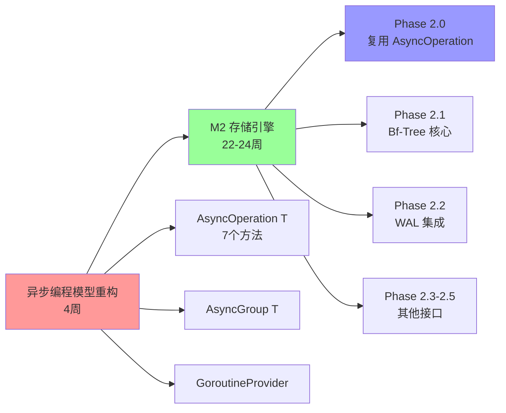
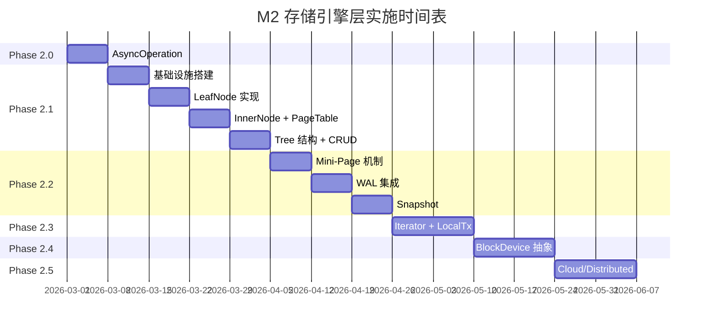

# M2 存储引擎层 - 实施路线图

> **预研类型**: Spike
> **创建日期**: 2026-02-21
> **最后更新**: 2026-02-22
> **分支**: `spike/m2-storage-engine`
> **状态**: 📋 已批准（待实施）

---

## 📋 关联文档

| 文档 | 说明 |
|------|------|
| [**前置依赖：异步编程模型重构**](./2026-02-22_spike_m2-async-programming-model-refactor.md) | **⚠️ 必须先完成（4周）** - AsyncOperation 核心实现 |
| [Interface 定义](./2026-02-21_spike_m2-storage-engine-interface.md) | 接口设计（总纲领性文件，10 个接口） |
| [实现方案](./2026-02-21_spike_m2-storage-engine-implement.md) | 技术实现 |
| [实施路线图](./2026-02-21_spike_m2-storage-engine-roadmap.md) | 时间规划（本文档） |
| [**DDD 架构参考**](./2026-02-18_spike_nexkv-ddd-roadmap.md) | **完整 DDD 实施路线图** |

---

## 📋 项目概览

**项目目标**：
- 实现完整存储引擎层（10 个接口）
- 双存储引擎策略：Metadata KV + External KV
- 复用现有 WAL 实现
- 满足分级性能目标

**接口清单（10 个）**：

| 接口 | 优先级 | 异步支持 |
|------|--------|---------|
| KVStore | P0 | ✅ |
| WAL | P0 | ✅ |
| BTree | P0 | ✅ |
| Iterator | P0 | - |
| LocalTx | P1 | ✅ |
| BlockDevice | P1 | ✅ |
| LocalStorage | P1 | ✅ |
| CloudStorage | P2 | ✅ |
| DistributedStorage | P2 | ✅ |
| AsyncOperation | P0 | 泛型 |

**⚠️ 前置依赖说明**：

AsyncOperation 是 M2 存储引擎的核心依赖，**必须在开始 M2 实施前完成异步编程模型重构**。

**依赖关系图**：



**接口对比**（为什么必须先完成重构）：

| 方法 | M2 原定义 | 异步重构定义 | 差异 |
|------|----------|-------------|------|
| Get(ctx) | ✅ | ✅ | 一致 |
| Status() | ✅ | ✅ | 一致 |
| Cancel() | ✅ | ✅ | 一致 |
| **Discard()** | ❌ | ✅ | **重构更完整** |
| **IsStarted()** | ❌ | ✅ | **重构更完整** |
| OnComplete() | ✅ | ✅ | 一致 |
| **OffComplete()** | ❌ | ✅ | **重构更完整** |

**成本效益**：
- ✅ **先重构**: 4 周重构成本，避免后期 8-12 周重构成本
- ❌ **不重构**: 需要重新实现不完整的 AsyncOperation，后期大规模重构

**技术栈**：
- **存储引擎**：Bf-Tree（B+ 树变体）
- **并发控制**：sync.RWMutex（MVP）
- **内存管理**：sync.Pool + GC
- **WAL**：扩展现有 `internal/wal`
- **异步接口**：AsyncOperation[T] 泛型

**总周期**：26-28 周（含 4 周前置异步重构 + 22-24 周 M2 实施）

---

## 一、实施阶段规划（已调整缓冲）

### ⚠️ 前置依赖：异步编程模型重构（必须先完成）

| 阶段 | 内容 | 周期 | 优先级 | 交付物 |
|------|------|------|--------|--------|
| **Phase 1.0** | 异步编程模型重构 | **4 周** | **P0** | `pkg/async/*` |
| | - AsyncOperation[T] + AsyncGroup[T] | | | - `async_op.go` |
| | - GoroutineProvider + AntsGoroutineProvider | | | - `async_group.go` |
| | - 适配层（方案B并行实现） | | | - `ants_provider.go` |
| | - 集成测试 + 性能基准 | | | - `libp2p_rpc_adapter.go` |

**依赖说明**：
- ⚠️ **必须在 M2 Phase 2.0 开始前完成**
- AsyncOperation 是 M2 所有异步接口的核心依赖
- 避免重复实现和后期大规模重构
- 详见：[异步编程模型重构方案](./2026-02-22_spike_async-programming-model-refactor.md)

---

### M2 存储引擎实施阶段

| 阶段 | 内容 | 原周期 | **调整后** | 优先级 | 交付物 |
|------|------|--------|-----------|--------|--------|
| **Phase 2.0** | AsyncOperation 泛型接口（复用） | 1 周 | **0 周** | P0 | **复用 Phase 1.0 成果** |
| **Phase 2.1** | Bf-Tree 核心（无持久化） | 4 周 | **5 周** | P0 | `tree.go`, `leaf_node.go`, `inner_node.go` |
| **Phase 2.2** | WAL 集成 + Snapshot | 3 周 | **5 周** | P0 | `bftree_wal.go`, `snapshot.go` |
| **Phase 2.3** | Iterator + LocalTx | 2 周 | 2 周 | P1 | `iterator_impl.go`, `local_tx_impl.go` |
| **Phase 2.4** | BlockDevice + LocalStorage | 2 周 | 2 周 | P1 | `block_device.go`, `local_storage.go` |
| **Phase 2.5** | CloudStorage + DistributedStorage | 2 周 | 2 周 | P2 | `cloud_*.go`, `distributed_*.go` |
| **集成测试** | 集成测试 + Bug 修复 | 2 周 | **3 周** | P0 | 测试报告 |

**总计**: 18-20 周 → **22-24 周 M2 + 4 周前置** = **26-28 周**（+20% 缓冲）

### 时间线调整理由

| 阶段 | 调整原因 |
|------|---------|
| **Phase 2.1 (+1周)** | Bf-Tree 是研究级算法，位操作复杂 |
| **Phase 2.2 (+2周)** | WAL 恢复逻辑复杂，需要大量测试 |
| **集成测试 (+1周)** | Bug 修复需要时间，测试覆盖率要求高 |

### 风险缓冲策略

- ✅ **Phase 2.1 延期 1 周**：不影响整体目标
- ✅ **Phase 2.2 延期 2 周**：可考虑延后 Phase 2.5（Cloud/Distributed）
- ✅ **集成测试延期 1 周**：可考虑延后 Phase 2.5

---

## 二、每周任务分解

### 2.0 Phase 1.0 详细任务（Week 0-3）- 前置依赖

> ⚠️ **必须在 M2 Phase 2.0 开始前完成**

| 周次 | 任务 | 交付物 | 预计时间 |
|------|------|--------|----------|
| **Week 0** | AsyncOp[T] 基础实现 | `pkg/async/async_op.go` | 5 天 |
| | - AsyncOperation[T] 接口实现（7个方法） | | 2 天 |
| | - 超时处理 + 选项模式 | | 1 天 |
| | - ResultChan() 扩展方法 | | 1 天 |
| | - 单元测试 | | 1 天 |
| **Week 1** | AsyncGroup[T] + GoroutineProvider | `pkg/async/async_group.go` | 5 天 |
| | - AsyncGroup[T] 批量操作实现 | | 2 天 |
| | - GoroutineProvider 接口定义 | | 1 天 |
| | - AntsGoroutineProvider 实现 | | 1 天 |
| | - 单元测试 | | 1 天 |
| **Week 2** | 集成测试 + 性能基准 | `pkg/async/*_test.go` | 5 天 |
| | - 与现有 RPC 集成测试 | | 2 天 |
| | - 性能基准测试（vs BroadcastTracker） | | 2 天 |
| | - 内存泄漏检查 | | 1 天 |
| **Week 3** | 渐进式迁移 + 文档 | 适配层 + 文档 | 5 天 |
| | - RPCAdapter 适配层实现 | | 2 天 |
| | - 旧接口标记为废弃 | | 1 天 |
| | - 文档和使用指南 | | 1 天 |
| | - Code Review | | 1 天 |

**交付物清单**：
- ✅ `pkg/async/async_op.go` - AsyncOperation[T] 实现
- ✅ `pkg/async/async_group.go` - AsyncGroup[T] 实现
- ✅ `pkg/async/ants_provider.go` - AntsGoroutineProvider 实现
- ✅ `pkg/async/bridge.go` - BroadcastCallback 桥接
- ✅ `internal/infrastructure/transport/libp2p_rpc_adapter.go` - 适配层
- ✅ 完整单元测试和性能基准测试

---

### 2.1 Phase 2.0 详细任务（Week 4）- M2 开始

| 周次 | 任务 | 交付物 | 预计时间 |
|------|------|--------|----------|
| **Week 4** | AsyncOperation 泛型接口（复用） | **复用 Phase 1.0** | **0 天** |
| | - ✅ 直接复用 `pkg/async/async_op.go` | | - |
| | - ✅ 验证接口兼容性 | | 0.5 天 |
| | - ✅ 类型别名（Future、ReadFuture 等） | | 0.5 天 |

| 周次 | 任务 | 交付物 | 预计时间 |
|------|------|--------|----------|
| **Week 0** | AsyncOperation 泛型接口 | `operation.go` | 3 天 |
| | - AsyncOperation[T] 接口定义 | | 1 天 |
| | - 默认实现 asyncOp[T] | | 1 天 |
| | - Future 类型别名 | | 0.5 天 |
| | - 单元测试 | | 0.5 天 |

### 2.1 Phase 2.1 详细任务（Week 1-4）

| 周次 | 任务 | 交付物 | 预计时间 |
|------|------|--------|----------|
| **Week 1** | 基础设施搭建 | `config.go`, `bits.go`, `errors.go` | 5 天 |
| | - Config 模块 | | 1 天 |
| | - 位操作工具 | | 2 天 |
| | - 错误定义 | | 1 天 |
| | - 目录结构搭建 | | 1 天 |
| **Week 2** | LeafNode 实现 | `leaf_node.go` | 5 天 |
| | - 节点结构定义 | | 1 天 |
| | - 插入/删除逻辑 | | 2 天 |
| | - 查找逻辑 | | 1 天 |
| | - 单元测试 | | 1 天 |
| **Week 3** | InnerNode + PageTable | `inner_node.go`, `pagetable.go` | 5 天 |
| | - InnerNode 结构 | | 1 天 |
| | - 节点分裂/合并 | | 2 天 |
| | - PageTable 存储 | | 1 天 |
| | - 单元测试 | | 1 天 |
| **Week 4** | Tree 结构 + CRUD + 异步方法 | `tree.go`, `bftree_store.go` | 5 天 |
| | - Tree 主结构 | | 1 天 |
| | - Get/Put/Delete | | 1 天 |
| | - 异步方法实现 | | 1 天 |
| | - KVStore 适配 | | 1 天 |
| | - 集成测试 | | 1 天 |

### 2.2 Phase 2.2 详细任务（Week 5-7）

| 周次 | 任务 | 交付物 | 预计时间 |
|------|------|--------|----------|
| **Week 5** | Mini-Page 机制 | `mini_page.go` | 5 天 |
| | - 3 级 Mini-Page | | 2 天 |
| | - Delta Chain | | 2 天 |
| | - 单元测试 | | 1 天 |
| **Week 6** | WAL 集成 | `bftree_wal.go` | 5 天 |
| | - WALType 扩展 | | 1 天 |
| | - 写入集成 | | 1 天 |
| | - 异步 WAL 方法 | | 1 天 |
| | - 恢复集成 | | 1 天 |
| | - 单元测试 | | 1 天 |
| **Week 7** | Snapshot | `snapshot.go` | 5 天 |
| | - 快照创建 | | 2 天 |
| | - 快照恢复 | | 2 天 |
| | - 单元测试 | | 1 天 |

### 2.3 Phase 2.3 详细任务（Week 8-9）

| 周次 | 任务 | 交付物 | 预计时间 |
|------|------|--------|----------|
| **Week 8** | Iterator 实现 | `iterator.go` | 5 天 |
| | - Iterator 接口实现 | | 2 天 |
| | - 范围扫描逻辑 | | 2 天 |
| | - 单元测试 | | 1 天 |
| **Week 9** | LocalTx 实现 | `local_tx.go` | 5 天 |
| | - 事务操作 | | 2 天 |
| | - 异步提交/回滚 | | 1 天 |
| | - MVCC 支持 | | 1 天 |
| | - 单元测试 | | 1 天 |

### 2.4 Phase 2.4 详细任务（Week 10-11）

| 周次 | 任务 | 交付物 | 预计时间 |
|------|------|--------|----------|
| **Week 10** | BlockDevice 抽象 | `block_device.go` | 5 天 |
| | - BlockDevice 接口实现 | | 2 天 |
| | - 异步读写方法 | | 2 天 |
| | - 单元测试 | | 1 天 |
| **Week 11** | LocalStorage 实现 | `local_storage.go` | 5 天 |
| | - 本地文件存储 | | 2 天 |
| | - 预读/碎片整理 | | 2 天 |
| | - 单元测试 | | 1 天 |

### 2.5 Phase 2.5 详细任务（Week 12-13）

| 周次 | 任务 | 交付物 | 预计时间 |
|------|------|--------|----------|
| **Week 12** | CloudStorage 实现 | `s3_storage.go`, `azure_storage.go` | 5 天 |
| | - S3 适配 | | 2 天 |
| | - Azure Blob 适配 | | 2 天 |
| | - 单元测试 | | 1 天 |
| **Week 13** | DistributedStorage 实现 | `ceph_storage.go`, `minio_storage.go` | 5 天 |
| | - Ceph 适配 | | 2 天 |
| | - MinIO 适配 | | 2 天 |
| | - 单元测试 | | 1 天 |

### 2.6 集成测试详细任务（Week 14-15）

| 周次 | 任务 | 交付物 | 预计时间 |
|------|------|--------|----------|
| **Week 14** | 集成测试 | 测试报告 | 5 天 |
| | - 接口集成测试 | | 2 天 |
| | - 性能回归测试 | | 2 天 |
| | - Bug 修复 | | 1 天 |
| **Week 15** | 系统测试 | 测试报告 | 5 天 |
| | - 压力测试 | | 2 天 |
| | - 稳定性测试 | | 2 天 |
| | - 文档完善 | | 1 天 |

---

## 三、里程碑时间表



### 里程碑定义

| 里程碑 | 完成时间 | 验收标准 |
|--------|---------|---------|
| **M0: AsyncOperation 完成** | Week 0 | 泛型接口实现，单元测试通过 |
| **M1: Bf-Tree 核心完成** | Week 5 | Get/Put/Delete 功能正常，同步+异步方法通过 |
| **M2: WAL 集成完成** | Week 7 | 崩溃恢复测试通过，数据不丢失 |
| **M3: 存储引擎层完成** | Week 24 | 所有 10 个接口实现完成，集成测试通过，性能测试达标 |

---

## 四、时间线对比分析

### 4.1 路线图 M2（已废弃的 6 周计划）vs 当前计划（22-24 周）

> ⚠️ **注意**：以下对比展示了原始简化路线图与当前完整计划的差异。

| 维度 | 原路线图（已废弃） | 当前计划 | 说明 |
|------|-----------------|---------|------|
| **周期** | 6 周 | 22-24 周 | 完整计划更全面，包含 20% 缓冲时间 |
| **接口数量** | 5 个 | 10 个 | 包含异步接口和块设备层 |
| **异步支持** | P2 计划 | P0 内置 | AsyncOperation 泛型接口 |
| **块设备层** | 未提及 | 完整实现 | Local/Cloud/Distributed |
| **集成测试** | 未提及 | 3 周 | 确保质量 |

**结论**：采用当前完整计划（22-24 周），确保所有接口实现和充分测试。

---

## 五、性能目标分级

> **注意**：性能目标基于 MVP 简化实现（sync.RWMutex + sync.Pool），与 benchmark 文档保持一致。
>
> **文档一致性要求**：
> - ✅ 本文档（roadmap）定义性能目标
> - ✅ benchmark 文档必须使用相同的目标值
> - ✅ 任何调整需要同步更新所有相关文档

| 操作 | P0（最低） | P1（推荐） | P2（理想） |
|------|-----------|-----------|-----------|
| **点查询（同步）** | < 50μs | < 30μs | < 20μs |
| **点查询（异步）** | < 60μs | < 40μs | < 25μs |
| **写入吞吐（同步）** | > 5万 ops/s | > 10万 ops/s | > 20万 ops/s |
| **写入吞吐（异步）** | > 8万 ops/s | > 15万 ops/s | > 30万 ops/s |
| **范围查询** | O(log N + M) | O(log N + M) | O(log N + M) |

**与 Rust 原版基准对比**：

> ⚠️ **注意**：以下对比展示 Go MVP 实现与 Rust 原版的性能差距，用于评估技术选型。

| 操作 | Rust 原版（基准） | Go MVP P0（目标） | 差距 | 说明 |
|------|----------------|-----------------|------|------|
| 点查询 | 10μs | 50μs | 5x | Go GC 和 RWMutex 开销 |
| 写入吞吐 | 200万 ops/s | 5万 ops/s | 40x | Go 缺少 Lock-free SMR |

**性能目标分级说明**：

- **P0（最低）**：MVP 阶段必须达到的最低性能，可接受部署
- **P1（推荐）**：生产环境推荐性能，经过优化后可实现
- **P2（理想）**：理想性能目标，需要深度优化（如 Lock-free SMR）

**性能差距原因**：

1. **GC 开销**：Go GC 暂停（10-50ms）vs Rust 无 GC
2. **并发控制**：sync.RWMutex vs Lock-free SMR
3. **内存管理**：sync.Pool vs 手动内存池
4. **编译优化**：Go 编译器 vs Rust LLVM 优化

---

## 六、目标用户与场景

> **核心价值**：Go MVP 不是要超越 Rust 原版，而是为特定场景提供**足够好**的解决方案。

### 适合使用 Go MVP 的场景

| 场景 | 说明 | 为什么 5万 ops/s 足够 |
|------|------|---------------------|
| **中小规模部署** | < 1000 节点 | 总吞吐量需求 < 5万 TPS |
| **开发/测试环境** | 快速迭代 | 性能不是首要考虑 |
| **边缘计算** | 资源受限 | Go 二进制小（~10MB），部署方便 |
| **与 Go 生态集成** | 现有 Go 系统 | 避免 CGO 复杂性，保持纯 Go |

### 不适合的场景

- ❌ 大规模生产环境（> 1万 TPS）
- ❌ 对延迟敏感的交易系统（需要 < 10μs）
- ❌ 高并发写入密集型业务（需要 > 20万 ops/s）

### 未来优化路径（P1/P2）

| 阶段 | 目标 | 关键技术 | 预期提升 |
|------|------|---------|---------|
| **P1** | 10万 ops/s | sync.Pool 优化、批量 WAL | 2x |
| **P2** | 20万 ops/s | Lock-free SMR、内存池 | 4x |
| **P3** | 50万 ops/s | 深度优化（SIMD、汇编）| 10x |

### 与其他方案对比

| 方案 | 性能 | 优势 | 劣势 |
|------|------|------|------|
| **Rust Bf-Tree** | 200万 ops/s | 性能最优 | CGO 复杂、二进制大 |
| **Go MVP** | 5万 ops/s | 纯 Go、部署简单 | 性能较低 |
| **Pebble (RocksDB)** | 20万+ ops/s | 成熟稳定 | 非 Bf-Tree、写放大高 |

**结论**：Go MVP 适合中小规模、快速迭代的场景，不适合高性能生产环境。

---

## 七、风险与缓解

| 风险 | 可能性 | 影响 | 缓解措施 |
|------|--------|------|---------|
| Bf-Tree 移植复杂度超预期 | 中 | 高 | 采用简化 MVP 策略 |
| 性能不达标 | 中 | 中 | 分级性能目标（P0/P1/P2） |
| WAL 集成困难 | 低 | 中 | 现有 WAL 已验证 |
| 内存占用过高 | 中 | 中 | Mini-Page 分级管理 |
| 并发 Bug | 中 | 高 | 使用 `go test -race` 检测 |
| 异步接口复杂度 | 中 | 中 | 使用泛型统一接口 |
| 云存储 SDK 兼容性 | 低 | 低 | 标准化接口抽象 |

---

## 八、决策状态追踪

| 决策 | 选项 | 建议 | 状态 |
|------|------|------|------|
| **WAL 实现** | 新写 vs 复用 | ✅ 复用现有 WAL | 已确定 |
| **并发控制** | Lock-free SMR vs sync.RWMutex | sync.RWMutex（MVP） | 已确定 |
| **内存管理** | 手动 vs GC | sync.Pool + GC（MVP） | 已确定 |
| **Mini-Page 级别** | 3 级 vs 6+ 级 | 3 级（MVP） | 已确定 |
| **目录结构** | DDD vs 传统 | DDD 架构 | 已确定 |
| **异步接口** | 多种 Future vs 泛型 | AsyncOperation[T] | 已确定 |
| **块设备层** | 单一 vs 多种 | 可插拔设计 | 已确定 |

---

## 九、质量保证

### 8.1 测试覆盖率要求

| 组件 | 覆盖率要求 |
|------|-----------|
| AsyncOperation | ≥ 90% |
| BfTree 核心 | ≥ 80% |
| WAL 集成 | ≥ 80% |
| KVStore 适配 | ≥ 80% |
| BlockDevice 层 | ≥ 80% |
| 整体覆盖率 | ≥ 80% |

### 8.2 提交前检查

```bash
# 完整的本地验证流程
make build     # 编译项目
make lint      # 代码质量检查
make test      # 运行所有测试
make test-race # 竞态检测
make fmt       # 格式化代码
make clean     # 清理编译文件
```

### 8.3 CI 验证

- ✅ 单元测试通过
- ✅ 竞态检测通过（`go test -race`）
- ✅ 代码覆盖率 ≥ 80%
- ✅ Lint 检查通过

### 8.4 测试类型覆盖

| 测试类型 | 工具/命令 | 说明 |
|---------|----------|------|
| **单元测试** | `go test ./...` | 每个模块独立测试 |
| **竞态检测** | `go test -race` | 并发安全验证 |
| **崩溃恢复** | `go test -tags=crash` | WAL 恢复测试 |
| **模糊测试** | `go test -fuzz=. -fuzztime=5m` | 随机输入测试 |
| **基准测试** | `go test -bench=. -benchtime=10s` | 性能回归检测 |
| **压力测试** | `./scripts/stress_test.sh` | 高负载稳定性 |

---

## 十、下一步行动

### 9.1 立即行动（Week 0）

1. **实现 AsyncOperation 泛型接口**
   - 位置：`internal/domain/async/operation.go`
   - 参考：[DDD 架构参考 - AsyncOperation](./2026-02-18_spike_nexkv-ddd-interface.md#226-asyncoperation---统一异步操作接口)

2. **定义完整接口** - `internal/domain/service/storage.go`
   ```go
   // KVStore 单机 KV 存储接口（同步+异步统一）
   type KVStore interface {
       // 同步读写
       Get(ctx context.Context, key []byte) ([]byte, error)
       Set(ctx context.Context, key, value []byte) error
       Delete(ctx context.Context, key []byte) error

       // 异步读写
       GetAsync(ctx context.Context, key []byte) ReadFuture
       SetAsync(ctx context.Context, key, value []byte) WriteFuture
       DeleteAsync(ctx context.Context, key []byte) WriteFuture

       // 范围查询
       Scan(ctx context.Context, start, end []byte) (Iterator, error)
       ScanAsync(ctx context.Context, start, end []byte) IteratorFuture

       // 批量操作
       BatchGet(ctx context.Context, keys [][]byte) (map[string][]byte, error)
       BatchSet(ctx context.Context, kvs []KeyValue) error
       BatchGetAsync(ctx context.Context, keys [][]byte) BatchGetFuture
       BatchSetAsync(ctx context.Context, kvs []KeyValue) WriteFuture

       // 事务支持
       NewTx() (LocalTx, error)

       // 资源管理
       Close() error
       Sync() error
       SyncAsync(ctx context.Context) WriteFuture
   }
   ```

3. **搭建骨架** - 目录结构和基础类型定义
   ```
   internal/
   ├── domain/
   │   ├── service/
   │   │   ├── storage.go      # 存储接口定义
   │   │   └── blockdevice.go  # 块设备接口定义
   │   └── async/
   │       └── operation.go    # AsyncOperation 泛型接口
   │
   └── infrastructure/
       └── storage/
           ├── metadata/       # Metadata KV 实现
           ├── bftree/         # Bf-Tree 实现
           ├── block/          # BlockDevice 基础实现
           ├── local/          # LocalStorage 实现
           ├── cloud/          # CloudStorage 实现
           └── distributed/    # DistributedStorage 实现
   ```

---

**文档版本**: v2.0
**创建日期**: 2026-02-21
**最后更新**: 2026-02-22
**维护者**: NexKV 开发团队
**状态**: 📋 已批准（待实施）
