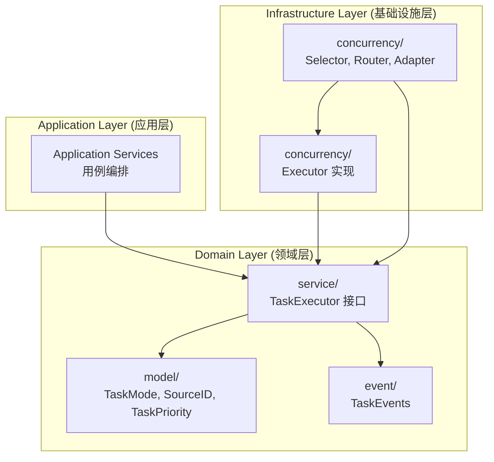
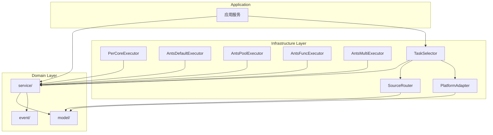
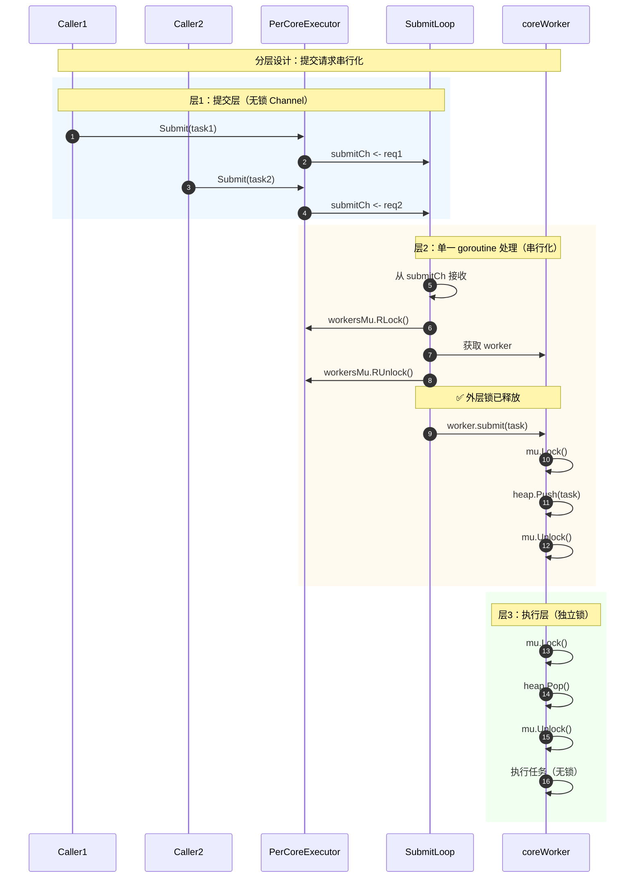
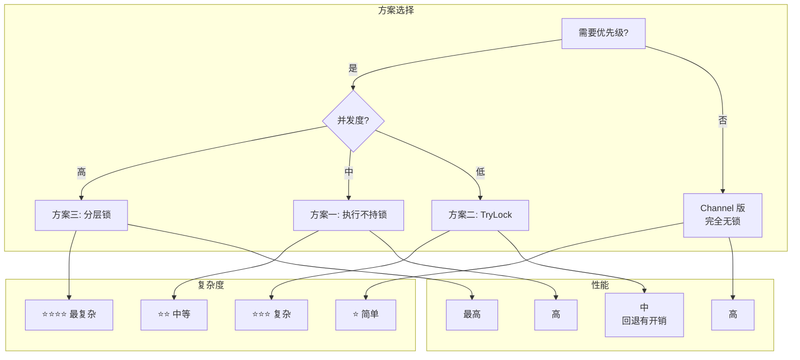
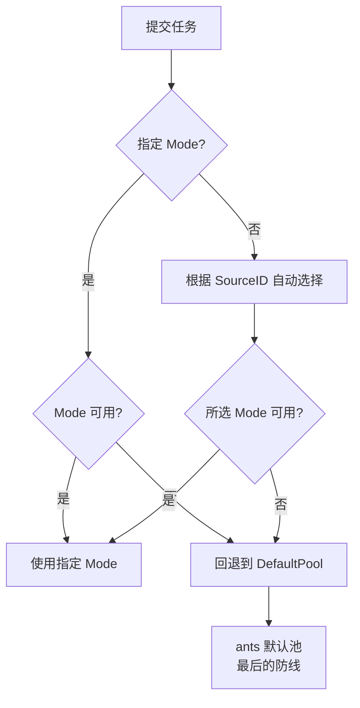

# Spike: 任务调度器研究（详细版）

> **日期**: 2026-02-26
> **状态**: 研究完成，待实现
> **来源**: ants 源码分析 + DDD 架构设计
> **原文档**: `thoughts/2026-02-26-unified-task-scheduler.md`

---

## 0. 实现跟踪

### Phase 1: 4 种独立 Executor + 1 种回退

| Executor | 状态 | 代码位置 | 备注 |
|----------|------|----------|------|
| PerCoreExecutor (Mode 1) | ❌ 待实现 | - | 动态核心绑定 |
| AntsDefaultExecutor (Mode 2) | ❌ 待实现 | - | ants.Submit 封装 |
| **AntsPoolExecutor (Mode 3)** | ✅ 已实现 | `taskpool_ants_provider.go` | 当前主力 |
| AntsFuncExecutor (Mode 4) | ❌ 待实现 | - | PoolWithFunc 封装 |
| AntsMultiExecutor (Mode 5) | ❌ 待实现 | - | MultiPool 封装 |

### Phase 2: Selector

| 组件 | 状态 | 代码位置 | 备注 |
|------|------|----------|------|
| TaskSelector | ❌ 待实现 | - | 统一入口 |
| SourceRouter | ❌ 待实现 | - | SourceID 路由 |
| PlatformAdapter | ❌ 待实现 | - | 平台适配/降级 |

### Phase 3: 集成（可选）

| 任务 | 状态 | 备注 |
|------|------|------|
| 渐进式迁移 | ❌ 待规划 | 新代码使用 Selector |
| 完全迁移 | ❌ 待规划 | 可选，非必须 |

---

## 1. DDD 分层架构设计

> 从 DDD（Domain-Driven Design）视角规划代码组织，确保职责清晰、依赖正确

### 1.1 三层架构概览



### 1.2 Domain Layer (领域层)

**职责**：定义抽象接口、领域模型、领域事件

#### model/ - 值对象定义

```go
// internal/domain/model/task_mode.go (新增)
package model

// TaskMode 调度模式（值对象）
type TaskMode int

const (
    // 4种显式可选模式（用户可指定）
    ModePerCore     TaskMode = iota  // Per-Core 固定核心
    ModeCustomPool                   // ants 自定义池
    ModeFuncPool                     // ants 函数池
    ModeMultiPool                    // ants 多池

    // 1种隐式回退模式（不需要用户选择，最后的防线）
    ModeAntsPool                  // ants 默认池（回退）
)

func (m TaskMode) String() string {
    return [...]string{
        "PerCore",
        "CustomPool",
        "FuncPool",
        "MultiPool",
        "DefaultPool",  // 回退模式
    }[m]
}

// ✅ P1-01: 丰富 TaskMode 业务行为（DDD 专家建议）
// FallbackMode 返回降级模式
func (m TaskMode) FallbackMode() TaskMode {
    switch m {
    case ModePerCore:
        return ModeCustomPool  // PerCore → CustomPool
    default:
        return ModeAntsPool  // 其他 → DefaultPool
    }
}

// IsSupportedOn 检查模式在指定平台是否支持
func (m TaskMode) IsSupportedOn(platform string) bool {
    if m == ModePerCore {
        // PerCore 模式需要真绑核支持
        return platform == "linux" || platform == "windows"
    }
    return true  // 其他模式全平台支持
}

// RecommendedConfig 返回推荐配置
func (m TaskMode) RecommendedConfig() ModeConfig {
    switch m {
    case ModePerCore:
        return ModeConfig{
            MaxConcurrency: runtime.NumCPU(),
            QueueSize:      1000,
            EnableAffinity: true,
        }
    case ModeCustomPool:
        return ModeConfig{
            MaxConcurrency: runtime.NumCPU() * 10,
            QueueSize:      10000,
            EnableAffinity: false,
        }
    case ModeFuncPool:
        return ModeConfig{
            MaxConcurrency: runtime.NumCPU() * 100,
            QueueSize:      100000,
            EnableAffinity: false,
        }
    case ModeMultiPool:
        return ModeConfig{
            MaxConcurrency: runtime.NumCPU() * 4,
            QueueSize:      40000,
            EnableAffinity: false,
        }
    default:
        return ModeConfig{
            MaxConcurrency: -1,  // 无限制
            QueueSize:      -1,  // 无限制
            EnableAffinity: false,
        }
    }
}

// ModeConfig 模式配置
type ModeConfig struct {
    MaxConcurrency int
    QueueSize      int
    EnableAffinity bool
}
```

```go
// internal/domain/model/source_id.go (新增)
package model

import (
    "errors"
    "strings"
)

// ✅ P1-01 修复：SourceID 改为不可变结构体（DDD 专家建议）
// SourceID 来源标识（不可变值对象）
// 格式: {module}:{sub-module}:{action}
type SourceID struct {
    module    string
    subModule string
    action    string
}

// ParseSourceID 解析并验证 SourceID
func ParseSourceID(s string) (SourceID, error) {
    parts := strings.Split(s, ":")
    if len(parts) != 3 {
        return SourceID{}, errors.New("invalid SourceID format, expected {module}:{sub-module}:{action}")
    }
    if parts[0] == "" || parts[1] == "" || parts[2] == "" {
        return SourceID{}, errors.New("SourceID parts cannot be empty")
    }
    return SourceID{
        module:    parts[0],
        subModule: parts[1],
        action:    parts[2],
    }, nil
}

// MustParseSourceID 解析 SourceID，失败时 panic（用于常量定义）
func MustParseSourceID(s string) SourceID {
    sid, err := ParseSourceID(s)
    if err != nil {
        panic(err)
    }
    return sid
}

// Module 返回模块名
func (s SourceID) Module() string {
    return s.module
}

// SubModule 返回子模块名
func (s SourceID) SubModule() string {
    return s.subModule
}

// Action 返回动作名
func (s SourceID) Action() string {
    return s.action
}

// String 实现 Stringer 接口
func (s SourceID) String() string {
    return s.module + ":" + s.subModule + ":" + s.action
}

// Match 支持通配符匹配
func (s SourceID) Match(pattern string) bool {
    // 支持 hlc:*:* 通配符匹配
    if strings.HasSuffix(pattern, "*") {
        prefix := strings.TrimSuffix(pattern, "*")
        return strings.HasPrefix(s.String(), prefix)
    }
    return s.String() == pattern
}

// 预定义常量（示例）
var (
    SourceHLCClockTick    = MustParseSourceID("hlc:clock:tick")
    SourceWALWriterFlush  = MustParseSourceID("wal:writer:flush")
    SourceReplicaSyncPush = MustParseSourceID("replica:sync:push")
)
```

#### service/ - 接口定义

```go
// internal/domain/service/task.go (现有，保持不变)
// 已定义 7 原子接口 + 3 组合接口

// ✅ P0-04 新增：TaskSchedule 聚合根（DDD 专家建议）
// internal/domain/model/task_schedule.go
package model

import (
    "context"
    "errors"
    "sync"
    "sync/atomic"
    "time"
)

// ScheduleStatus 调度状态
type ScheduleStatus int

const (
    StatusRunning ScheduleStatus = iota
    StatusStopped
    StatusClosing
)

// TaskSchedule 聚合根：统一管理任务调度生命周期
type TaskSchedule struct {
    // 聚合根内部状态，外部不可直接修改
    id        string
    status    ScheduleStatus
    executors map[TaskMode]TaskExecutorRef
    router    *SourceRouter
    stats     ScheduleStats
    mu        sync.RWMutex
}

// TaskExecutorRef 执行器引用（聚合根内部引用）
type TaskExecutorRef struct {
    mode     TaskMode
    executor TaskExecutor
}

// SourceRouter 路由规则（值对象）
type SourceRouter struct {
    rules       map[string]TaskMode
    defaultMode TaskMode
}

// ScheduleStats 统计信息
type ScheduleStats struct {
    TotalSubmitted  int64
    TotalCompleted  int64
    TotalFailed     int64
    ActiveTasks     int32
}

// NewTaskSchedule 创建调度聚合根
func NewTaskSchedule(id string) *TaskSchedule {
    return &TaskSchedule{
        id:        id,
        status:    StatusRunning,
        executors: make(map[TaskMode]TaskExecutorRef),
        router: &SourceRouter{
            rules:       make(map[string]TaskMode),
            defaultMode: ModeAntsPool,
        },
        stats: ScheduleStats{},
    }
}

// RegisterExecutor 注册执行器（聚合根内部操作）
func (s *TaskSchedule) RegisterExecutor(mode TaskMode, executor TaskExecutor) error {
    s.mu.Lock()
    defer s.mu.Unlock()

    if _, exists := s.executors[mode]; exists {
        return errors.New("executor already registered")
    }

    s.executors[mode] = TaskExecutorRef{
        mode:     mode,
        executor: executor,
    }
    return nil
}

// AddRoutingRule 添加路由规则（聚合根内部操作）
func (s *TaskSchedule) AddRoutingRule(pattern string, mode TaskMode) {
    s.mu.Lock()
    defer s.mu.Unlock()
    s.router.rules[pattern] = mode
}

// Submit 提交任务（聚合根入口）
func (s *TaskSchedule) Submit(ctx context.Context, sourceID SourceID, task func(context.Context)) error {
    // 1. 路由到合适的 Executor
    mode := s.router.Route(sourceID)

    s.mu.RLock()
    executorRef, ok := s.executors[mode]
    s.mu.RUnlock()

    if !ok {
        // 2. 降级到默认池
        s.mu.RLock()
        executorRef, ok = s.executors[ModeAntsPool]
        s.mu.RUnlock()

        if !ok {
            return errors.New("no executor available")
        }
    }

    // 3. 更新统计
    atomic.AddInt64(&s.stats.TotalSubmitted, 1)
    atomic.AddInt32(&s.stats.ActiveTasks, 1)

    // 4. 提交任务（类型断言到具体接口）
    type submitter interface {
        Submit(context.Context, func(context.Context)) error
    }
    if exec, ok := executorRef.executor.(submitter); ok {
        err := exec.Submit(ctx, task)
        atomic.AddInt32(&s.stats.ActiveTasks, -1)
        if err != nil {
            atomic.AddInt64(&s.stats.TotalFailed, 1)
        } else {
            atomic.AddInt64(&s.stats.TotalCompleted, 1)
        }
        return err
    }

    return errors.New("executor does not support Submit")
}

// Stop 停止调度（聚合根生命周期）
func (s *TaskSchedule) Stop() error {
    s.mu.Lock()
    defer s.mu.Unlock()

    if s.status != StatusRunning {
        return nil
    }

    s.status = StatusClosing

    // 关闭所有执行器
    var lastErr error
    for _, ref := range s.executors {
        if closer, ok := ref.executor.(interface{ Close() error }); ok {
            if err := closer.Close(); err != nil {
                lastErr = err
            }
        }
    }

    s.status = StatusStopped
    return lastErr
}

// Route 路由方法
func (r *SourceRouter) Route(sourceID SourceID) TaskMode {
    sid := string(sourceID)
    for pattern, mode := range r.rules {
        if contains(sid, pattern) {
            return mode
        }
    }
    return r.defaultMode
}

// contains 简单的字符串包含检查
func contains(s, pattern string) bool {
    return len(s) >= len(pattern) && s[:len(pattern)] == pattern
}

// TaskExecutor 接口（需要定义在 model 或 service 包中）
type TaskExecutor interface {
    Submit(ctx context.Context, task func(context.Context)) error
}
```

```go
// internal/domain/service/selector.go (新增)
package service

// TaskSelector 任务选择器接口（领域服务）
type TaskSelector interface {
    // Select 根据 SourceID 选择合适的执行器
    Select(sourceID model.SourceID) (model.TaskExecutor, error)

    // SelectByMode 根据模式选择执行器
    SelectByMode(mode model.TaskMode) (model.TaskExecutor, error)

    // 生命周期
    Start(ctx context.Context) error
    Stop() error
}
```

#### event/ - 领域事件（已有）

```go
// internal/domain/event/task_events.go (已存在)
// TaskSubmittedEvent, TaskCompletedEvent, TaskFailedEvent 等
```

### 1.3 Infrastructure Layer (基础设施层)

**职责**：实现领域接口，提供技术细节

#### concurrency/ - 执行器实现

```
internal/infrastructure/concurrency/
├── executor_percore.go       # Mode 1: PerCoreExecutor
├── executor_default.go       # Mode 2: AntsDefaultExecutor
├── taskpool_ants_provider.go # Mode 3: AntsPoolExecutor ✅ 已存在
├── executor_func.go          # Mode 4: AntsFuncExecutor
├── executor_multi.go         # Mode 5: AntsMultiExecutor
├── selector.go               # TaskSelector 实现
├── source_router.go          # SourceID 路由
└── platform_adapter.go       # 平台适配
```

### 1.4 依赖关系图



**依赖原则**：
- ✅ Infrastructure 依赖 Domain（正确）
- ❌ Domain 不依赖 Infrastructure（保持纯净）
- ✅ 应用层可依赖 Domain 接口

### 1.5 DDD 视角下的文件清单

| 层级 | 文件路径 | 状态 | 说明 |
|------|----------|------|------|
| **Domain** | `internal/domain/model/task_mode.go` | ❌ 待创建 | TaskMode 值对象 |
| **Domain** | `internal/domain/model/source_id.go` | ❌ 待创建 | SourceID 值对象 |
| **Domain** | `internal/domain/service/selector.go` | ❌ 待创建 | TaskSelector 接口 |
| **Domain** | `internal/domain/service/task.go` | ✅ 已存在 | 7原子 + 3组合接口 |
| **Domain** | `internal/domain/event/task_events.go` | ✅ 已存在 | 领域事件 |
| **Infra** | `internal/infrastructure/concurrency/executor_percore.go` | ❌ 待创建 | Mode 1 |
| **Infra** | `internal/infrastructure/concurrency/executor_default.go` | ❌ 待创建 | Mode 2 |
| **Infra** | `internal/infrastructure/concurrency/taskpool_ants_provider.go` | ✅ 已存在 | Mode 3 |
| **Infra** | `internal/infrastructure/concurrency/executor_func.go` | ❌ 待创建 | Mode 4 |
| **Infra** | `internal/infrastructure/concurrency/executor_multi.go` | ❌ 待创建 | Mode 5 |
| **Infra** | `internal/infrastructure/concurrency/selector.go` | ❌ 待创建 | Selector 实现 |
| **Infra** | `internal/infrastructure/concurrency/source_router.go` | ❌ 待创建 | 路由实现 |
| **Infra** | `internal/infrastructure/concurrency/platform_adapter.go` | ❌ 待创建 | 平台适配 |

---

## 2. PerCoreExecutor 设计：向 ants 学习

> **背景**：PerCoreExecutor 是自研组件（非 ants 内置），需要参考 ants 的最佳实践进行设计

### 2.1 ants 核心设计模式总结

#### 2.1.1 生命周期管理模式

```go
// ants 状态管理（ants.go:54-60）
const (
    OPENED = iota  // 池已打开
    CLOSED         // 池已关闭
)

type poolCommon struct {
    state    int32       // 原子操作管理状态
    once     *sync.Once  // 确保关闭只执行一次
    allDone  chan struct{}  // 通知所有任务完成
}
```

**核心原则**：
- ✅ 使用 `atomic.CompareAndSwapInt32` 实现线程安全的状态切换
- ✅ 使用 `sync.Once` 确保资源只释放一次
- ✅ 使用 `chan struct{}` 作为完成信号

#### 2.1.2 优雅关闭机制（ants.go:375-436）

```go
// 第一层：立即释放资源
func (p *poolCommon) Release() {
    // 1. 原子状态切换（幂等）
    if !atomic.CompareAndSwapInt32(&p.state, OPENED, CLOSED) {
        return
    }

    // 2. 停止后台任务（Context 取消）
    if p.stopPurge != nil {
        p.stopPurge()
        p.stopPurge = nil
    }

    // 3. 重置工作队列
    p.lock.Lock()
    p.workers.reset()
    p.lock.Unlock()

    // 4. 唤醒所有等待的 goroutine
    p.cond.Broadcast()
}

// 第二层：等待任务完成（带超时）
func (p *poolCommon) ReleaseTimeout(timeout time.Duration) error {
    p.Release()

    timer := time.NewTimer(timeout)
    defer timer.Stop()

    for {
        select {
        case <-timer.C:
            return ErrTimeout
        case <-p.allDone:
            // 等待所有 worker 完成
            if p.Running() == 0 { return nil }
        }
    }
}
```

**关键设计**：
1. **分层释放**：`Release()` 立即释放 + `ReleaseTimeout()` 等待完成
2. **资源释放顺序**：停止后台任务 → 重置队列 → 唤醒等待者
3. **超时保护**：防止无限等待

#### 2.1.3 Worker 生命周期（worker.go:48-79）

```go
func (w *goWorker) run() {
    w.pool.addRunning(1)
    go func() {
        defer func() {
            // 1. 减少运行计数
            if w.pool.addRunning(-1) == 0 && w.pool.IsClosed() {
                // 2. 所有 worker 完成，关闭 allDone 通道
                w.pool.once.Do(func() {
                    close(w.pool.allDone)
                })
            }
            // 3. 回收到对象池
            w.pool.workerCache.Put(w)
            // 4. Panic 处理
            if p := recover(); p != nil {
                if ph := w.pool.options.PanicHandler; ph != nil {
                    ph(p)
                }
            }
            // 5. 唤醒等待者
            w.pool.cond.Signal()
        }()

        // 任务循环
        for fn := range w.task {
            if fn == nil { return }  // nil 信号退出
            fn()
            if ok := w.pool.revertWorker(w); !ok {
                return
            }
        }
    }()
}

func (w *goWorker) finish() {
    w.task <- nil  // 发送退出信号
}
```

**关键设计**：
1. **nil 信号退出**：通过发送 `nil` 到 channel 优雅退出
2. **计数器管理**：`addRunning(+1/-1)` 跟踪活跃 worker
3. **对象池复用**：`sync.Pool` 减少 GC 压力
4. **Panic 隔离**：每个 worker 独立 recover

#### 2.1.4 Option 模式（options.go）

```go
type Option func(opts *Options)

type Options struct {
    ExpiryDuration    time.Duration
    PreAlloc          bool
    MaxBlockingTasks  int
    Nonblocking       bool
    PanicHandler      func(interface{})
    Logger            Logger
    DisablePurge      bool
}

// 使用示例
pool, _ := ants.NewPool(1000,
    ants.WithPreAlloc(true),
    ants.WithPanicHandler(handler),
)
```

**优点**：
- 链式调用，配置灵活
- 默认值 + 覆盖模式
- 易于扩展新选项

### 2.2 PerCoreExecutor 设计规范

基于 ants 学习，PerCoreExecutor 应遵循以下设计：

```go
// internal/infrastructure/concurrency/executor_percore.go

// PerCoreExecutor Per-Core 执行器
type PerCoreExecutor struct {
    // 状态管理（参考 ants）
    state    int32          // OPENED/CLOSED
    once     *sync.Once     // 确保关闭一次
    allDone  chan struct{}  // 完成信号

    // ✅ 修复：添加 executor 级别的活跃 worker 计数
    activeWorkers int32  // 原子计数，追踪所有活跃 worker

    // 核心管理
    coreManager *CoreManager
    workers     map[int]*coreWorker  // coreID -> worker
    workerCache sync.Pool            // 对象池复用

    // 并发控制
    mu    sync.RWMutex
    cond  *sync.Cond

    // 配置
    config PerCoreConfig

    // Context 控制
    ctx    context.Context
    cancel context.CancelFunc

    // ✅ P2-02: DoS 防护（令牌桶限流）
    limiter *rate.Limiter

    // ✅ P2-03: 可观测性（Prometheus 指标）
    metrics *ExecutorMetrics
}

// ✅ P2-03: 可观测性指标
type ExecutorMetrics struct {
    TasksSubmitted   prometheus.Counter     // 提交总数
    TasksCompleted   prometheus.Counter     // 完成总数
    TasksFailed      prometheus.Counter     // 失败总数
    TasksDropped     prometheus.Counter     // 丢弃（限流）总数
    QueueLength      prometheus.Gauge       // 当前队列长度
    ActiveWorkers    prometheus.Gauge       // 活跃 worker 数
    TaskLatency      prometheus.Histogram   // 任务延迟分布
    WaitTime         prometheus.Histogram   // 等待时间分布
}

// PerCoreConfig 配置（Option 模式）
type PerCoreConfig struct {
    NumCores      int           // 核心数量
    QueueSize     int           // 每核队列大小
    PanicHandler  func(any)     // Panic 处理
    Logger        Logger        // 日志接口
    BindCPU       bool          // 是否绑定 CPU（Linux/Windows）
}

type PerCoreOption func(*PerCoreConfig)

func WithNumCores(n int) PerCoreOption {
    return func(c *PerCoreConfig) { c.NumCores = n }
}
func WithPanicHandler(h func(any)) PerCoreOption {
    return func(c *PerCoreConfig) { c.PanicHandler = h }
}
```

#### 2.2.1 生命周期方法

```go
// NewPerCoreExecutor 创建执行器
func NewPerCoreExecutor(opts ...PerCoreOption) (*PerCoreExecutor, error) {
    config := defaultPerCoreConfig()
    for _, opt := range opts {
        opt(&config)
    }

    // ✅ P1-02: 参数验证（Go 专家 + 安全专家建议）
    maxCores := runtime.NumCPU()
    if config.NumCores <= 0 {
        return nil, fmt.Errorf("NumCores must be positive, got %d", config.NumCores)
    }
    if config.NumCores > maxCores {
        return nil, fmt.Errorf("NumCores (%d) exceeds available cores (%d)",
            config.NumCores, maxCores)
    }
    if config.QueueSize <= 0 {
        return nil, fmt.Errorf("QueueSize must be positive, got %d", config.QueueSize)
    }
    if config.QueueSize > 100000 {
        return nil, fmt.Errorf("QueueSize (%d) exceeds maximum (100000)", config.QueueSize)
    }
    // 设置默认 PanicHandler
    if config.PanicHandler == nil {
        config.PanicHandler = defaultPanicHandler
    }

    e := &PerCoreExecutor{
        state:       OPENED,
        once:        &sync.Once{},
        allDone:     make(chan struct{}),
        workers:     make(map[int]*coreWorker),
        config:      config,
        // ✅ P2-02: DoS 防护（令牌桶限流）
        limiter: rate.NewLimiter(rate.Limit(10000), 1000),  // 10K QPS，突发 1000
        // ✅ P2-03: 可观测性
        metrics: newExecutorMetrics(),
    }
    e.cond = sync.NewCond(&e.mu)  // ✅ 修复：使用可写锁，不是 RLocker()
    e.ctx, e.cancel = context.WithCancel(context.Background())

    // 初始化 workerCache
    e.workerCache.New = func() any {
        return &coreWorker{
            taskCh: make(chan func(context.Context), config.QueueSize),
        }
    }

    return e, nil
}

// ✅ P2-03: 初始化 Prometheus 指标
func newExecutorMetrics() *ExecutorMetrics {
    return &ExecutorMetrics{
        TasksSubmitted: promauto.NewCounter(prometheus.CounterOpts{
            Name: "percore_executor_tasks_submitted_total",
            Help: "Total number of tasks submitted",
        }),
        TasksCompleted: promauto.NewCounter(prometheus.CounterOpts{
            Name: "percore_executor_tasks_completed_total",
            Help: "Total number of tasks completed",
        }),
        TasksFailed: promauto.NewCounter(prometheus.CounterOpts{
            Name: "percore_executor_tasks_failed_total",
            Help: "Total number of tasks failed",
        }),
        TasksDropped: promauto.NewCounter(prometheus.CounterOpts{
            Name: "percore_executor_tasks_dropped_total",
            Help: "Total number of tasks dropped (rate limited)",
        }),
        QueueLength: promauto.NewGauge(prometheus.GaugeOpts{
            Name: "percore_executor_queue_length",
            Help: "Current queue length",
        }),
        ActiveWorkers: promauto.NewGauge(prometheus.GaugeOpts{
            Name: "percore_executor_active_workers",
            Help: "Number of active workers",
        }),
        TaskLatency: promauto.NewHistogram(prometheus.HistogramOpts{
            Name:    "percore_executor_task_latency_seconds",
            Help:    "Task execution latency distribution",
            Buckets: []float64{.000001, .000005, .00001, .00005, .0001, .0005, .001},
        }),
        WaitTime: promauto.NewHistogram(prometheus.HistogramOpts{
            Name:    "percore_executor_wait_time_seconds",
            Help:    "Task wait time in queue",
            Buckets: []float64{.000001, .000005, .00001, .00005, .0001, .0005, .001},
        }),
    }
}

// ✅ P1-02: 默认 panic 处理器
func defaultPanicHandler(r any) {
    slog.Error("[PerCoreExecutor] Panic recovered",
        "panic", r,
        "stack", string(debug.Stack()),
    )
}

// Close 关闭执行器（立即释放）
func (e *PerCoreExecutor) Close() error {
    if !atomic.CompareAndSwapInt32(&e.state, OPENED, CLOSED) {
        return nil  // 已关闭，幂等
    }

    // 1. 取消 Context
    e.cancel()

    // 2. 通知所有 worker 退出
    e.mu.Lock()
    for _, w := range e.workers {
        w.finish()  // 发送 nil 信号
    }
    e.mu.Unlock()

    // 3. 唤醒等待者
    e.cond.Broadcast()

    // ✅ P0-01 修复：确保 allDone 被关闭（防止 goroutine 泄漏）
    go func() {
        timeout := time.NewTimer(5 * time.Second)
        defer timeout.Stop()

        for {
            if atomic.LoadInt32(&e.activeWorkers) == 0 {
                e.once.Do(func() {
                    close(e.allDone)
                })
                return
            }

            select {
            case <-timeout.C:
                // 超时强制关闭，避免泄漏
                e.once.Do(func() {
                    close(e.allDone)
                })
                return
            case <-time.After(100 * time.Millisecond):
                // 继续检查
            }
        }
    }()

    return nil
}

// CloseTimeout 带超时的关闭
func (e *PerCoreExecutor) CloseTimeout(timeout time.Duration) error {
    if err := e.Close(); err != nil {
        return err
    }

    timer := time.NewTimer(timeout)
    defer timer.Stop()

    select {
    case <-timer.C:
        return ErrTimeout
    case <-e.allDone:
        return nil
    }
}
```

#### 2.2.2 coreWorker 实现

```go
type coreWorker struct {
    coreID int
    taskCh chan func(context.Context)
    // ✅ 移除 running 计数器：这是 worker 级别的，不能用于判断所有 worker 完成
}

func (w *coreWorker) run(executor *PerCoreExecutor) {
    // ✅ 在 executor 级别增加活跃计数
    atomic.AddInt32(&executor.activeWorkers, 1)

    go func() {
        defer func() {
            // 1. ✅ 修复：在 executor 级别减少计数
            if atomic.AddInt32(&executor.activeWorkers, -1) == 0 {
                // 2. 所有 worker 完成（executor 级别判断）
                executor.once.Do(func() {
                    close(executor.allDone)
                })
            }

            // 3. 回收对象
            executor.workerCache.Put(w)

            // 4. Panic 处理
            if p := recover(); p != nil {
                if executor.config.PanicHandler != nil {
                    executor.config.PanicHandler(p)
                }
            }

            // 5. 唤醒等待者
            executor.cond.Signal()
        }()

        // 任务循环
        for fn := range w.taskCh {
            if fn == nil { return }  // 退出信号
            fn(executor.ctx)
        }
    }()
}

func (w *coreWorker) finish() {
    select {
    case w.taskCh <- nil:  // 非阻塞发送
    default:
    }
}
```

### 2.3 设计清单

| 设计点 | ants 实践 | PerCoreExecutor 实现 |
|--------|-----------|---------------------|
| **状态管理** | `atomic + sync.Once` | ✅ 采用相同模式 |
| **优雅关闭** | `Release() + ReleaseTimeout()` | ✅ `Close() + CloseTimeout()` |
| **Worker 退出** | `nil` 信号 + channel close | ✅ `nil` 信号 |
| **Panic 处理** | 可配置 PanicHandler | ✅ 可配置 |
| **对象复用** | `sync.Pool` | ✅ `sync.Pool` |
| **Context** | 后台任务控制 | ✅ 任务取消 + 超时 |
| **Option 模式** | 函数式配置 | ✅ 函数式配置 |
| **完成信号** | `allDone chan struct{}` | ✅ `allDone chan struct{}` |

### 2.4 平台适配

#### 2.4.1 跨平台 affinity 包设计

建议创建独立的 `affinity` 包，根据构建标签选择实现：

```go
// affinity.go (fallback - macOS/其他平台)
//go:build !linux && !windows

package affinity

import (
    "log/slog"
    "runtime"
)

// PinToCore 绑定当前 goroutine 到指定 CPU 核心（macOS fallback）
func PinToCore(coreID int) error {
    runtime.LockOSThread()
    // macOS 不支持真绑核，仅绑线程
    slog.Debug("macOS does not support CPU affinity, only LockOSThread",
        "coreID", coreID)
    return nil
}

// SupportsTrueAffinity 返回是否支持真绑核
func SupportsTrueAffinity() bool {
    return false
}
```

```go
// affinity_linux.go
//go:build linux

package affinity

import (
    "runtime"
    "golang.org/x/sys/unix"
)

// PinToCore 绑定当前 goroutine 到指定 CPU 核心（Linux）
func PinToCore(coreID int) error {
    runtime.LockOSThread()

    var mask unix.CPUSet
    mask.Zero()
    mask.Set(coreID)

    return unix.SchedSetaffinity(0, &mask)
}

// SupportsTrueAffinity 返回是否支持真绑核
func SupportsTrueAffinity() bool {
    return true
}
```

```go
// affinity_windows.go
//go:build windows

package affinity

import (
    "runtime"
    "golang.org/x/sys/windows"
)

// PinToCore 绑定当前 goroutine 到指定 CPU 核心（Windows）
func PinToCore(coreID int) error {
    runtime.LockOSThread()

    // Windows 使用位掩码，每个 bit 代表一个核心
    mask := uintptr(1) << coreID

    var processMask, systemMask uintptr
    err := windows.GetProcessAffinityMask(
        windows.CurrentProcess(),
        &processMask,
        &systemMask,
    )
    if err != nil {
        return err
    }

    // 检查请求的核心是否在进程允许的掩码内
    if mask&processMask == 0 {
        return windows.ERROR_INVALID_PARAMETER
    }

    _, err = windows.SetThreadAffinityMask(windows.CurrentThread(), mask)
    return err
}

// SupportsTrueAffinity 返回是否支持真绑核
func SupportsTrueAffinity() bool {
    return true
}
```

#### 2.4.2 PerCoreExecutor 使用 affinity 包

```go
// internal/infrastructure/concurrency/percore_executor.go

import "yourmodule/internal/infrastructure/affinity"

func (w *coreWorker) run() {
    // 绑定到指定核心
    if err := affinity.PinToCore(w.coreID); err != nil {
        slog.Warn("Failed to pin to core, using LockOSThread only",
            "coreID", w.coreID, "error", err)
    }

    // 业务逻辑...
}
```

#### 2.4.3 注意事项

| 注意点 | 说明 |
|--------|------|
| **必须调用 `LockOSThread`** | 确保 goroutine 和 OS 线程绑定，亲和性设置才生效 |
| **不要调用 `UnlockOSThread`** | 如果要永久绑定，让 goroutine 一直持有该线程直到退出 |
| **容器环境** | Docker/K8s 中，如果容器没有独占 CPU（如 `cpuset` 限制），绑核可能失败。建议结合 `cgroups` 读取允许的核心列表 |
| **核心编号范围** | 确保 `coreID` 不超过系统核心数减一；Windows 核心数不能超过 64 |
| **性能测试** | 绑核后应通过 `perf`、`pprof` 验证缓存缺失和调度延迟是否降低 |

#### 2.4.4 平台支持矩阵

| 平台 | 真绑核 | 实现方式 | 动态绑定 |
|------|--------|---------|---------|
| Linux | ✅ | `SchedSetaffinity` | ✅ 任意核心 |
| Windows | ✅ | `SetThreadAffinityMask` | ✅ 任意核心 |
| macOS | ⚠️ 仅绑线程 | `LockOSThread` | ✅ 逻辑核心 |

#### 2.4.5 容器环境：automaxprocs

> **问题**：容器中 `runtime.NumCPU()` 返回宿主机核心数，而非容器配额。

**解决方案**：[automaxprocs](https://pkg.go.dev/go.uber.org/automaxprocs) 自动从 cgroups 设置 `GOMAXPROCS`。

```go
// main.go 或 scheduler 初始化
import (
    "log/slog"
    "go.uber.org/automaxprocs/maxprocs"
)

func init() {
    // 自动设置 GOMAXPROCS，从 cgroups 读取 CPU 配额
    _, err := maxprocs.Set(maxprocs.Logger(slog.Info))
    if err != nil {
        slog.Warn("Failed to set GOMAXPROCS from cgroups", "error", err)
    }
}
```

**与 affinity 包配合**：

```go
// internal/infrastructure/concurrency/scheduler.go

import (
    "runtime"
    "go.uber.org/automaxprocs/maxprocs"
    "yourmodule/internal/infrastructure/affinity"
)

func NewTaskScheduler() (*TaskScheduler, error) {
    // 1. 自动设置 GOMAXPROCS（容器环境）
    maxprocs.Set()

    // 2. 获取实际可用的核心数
    maxProcs := runtime.GOMAXPROCS(0)

    // 3. 使用正确的核心数初始化 PerCoreExecutor
    return &TaskScheduler{
        perCoreExec: NewPerCoreExecutor(WithNumCores(maxProcs)),
    }, nil
}
```

**Kubernetes 配置示例**：

```yaml
spec:
  containers:
  - name: nexkv
    resources:
      limits:
        cpu: "4"      # automaxprocs 读取此配额
```

### 2.5 PerCoreExecutor 优先级队列设计

> **核心问题**：Channel 是 FIFO，无法按优先级排序，需要用优先级队列

#### 2.5.1 简化方案：标准库 heap 实现

```go
import "container/heap"

// 内部优先级（不暴露给用户）
const (
    priorityHLC     = 100  // HLC 时钟 - 最高
    priorityWAL     = 90   // WAL 写入
    priorityReplica = 50   // 副本同步
    priorityDefault = 0    // 默认
)

// 优先级任务项
type taskItem struct {
    priority   int
    submitTime time.Time  // ✅ P2-01: 添加提交时间，防止低优先级任务饥饿
    task       func(context.Context)
}

// 优先级队列（实现 heap.Interface）
type taskQueue []taskItem

func (q taskQueue) Len() int { return len(q) }

// ✅ P2-01: 修复低优先级任务饥饿问题
func (q taskQueue) Less(i, j int) bool {
    // 1. 优先级相同时，FIFO（先到先服务）
    if q[i].priority == q[j].priority {
        return q[i].submitTime.Before(q[j].submitTime)
    }

    // 2. 等待时间过长时，提升优先级（防止饥饿）
    const maxWaitTime = 10 * time.Second
    waitTimeI := time.Since(q[i].submitTime)
    waitTimeJ := time.Since(q[j].submitTime)

    // 如果低优先级任务等待超过阈值，临时提升
    if waitTimeI > maxWaitTime && q[i].priority < q[j].priority {
        // 等待时间越长，权重越高
        ageBoostI := int(waitTimeI / maxWaitTime)
        effectivePriorityI := q[i].priority + ageBoostI*10
        return effectivePriorityI > q[j].priority
    }

    // 3. 默认：高优先级优先
    return q[i].priority > q[j].priority
}

func (q taskQueue) Swap(i, j int) { q[i], q[j] = q[j], q[i] }
func (q *taskQueue) Push(x any)   { *q = append(*q, x.(taskItem)) }
func (q *taskQueue) Pop() any {
    old := *q
    n := len(old)
    *q = old[:n-1]
    return old[n-1]
}
```

#### 2.5.2 coreWorker 实现

```go
type coreWorker struct {
    mu           sync.Mutex
    cond         *sync.Cond
    queue        taskQueue
    ctx          context.Context
    cancel       context.CancelFunc
    panicHandler func(any)  // ✅ P0-03: 添加 panic 处理器
}

func newCoreWorker(panicHandler func(any)) *coreWorker {
    w := &coreWorker{
        panicHandler: panicHandler,
    }
    w.cond = sync.NewCond(&w.mu)
    w.ctx, w.cancel = context.WithCancel(context.Background())
    return w
}

// ✅ P0-03 修复：使用 defer + 局部作用域，确保锁安全释放
func (w *coreWorker) run() {
    for {
        // 1. 等待任务（独立作用域，自动解锁）
        var task func(context.Context)
        func() {
            w.mu.Lock()
            defer w.mu.Unlock()  // ✅ defer 确保任何退出路径都解锁

            for w.queue.Len() == 0 && w.ctx.Err() == nil {
                w.cond.Wait()
            }

            if w.ctx.Err() != nil {
                return  // defer 会自动解锁
            }

            item := heap.Pop(&w.queue).(taskItem)
            task = item.task  // 复制闭包
        }()

        // 2. 检查退出
        if task == nil {
            return
        }

        // 3. 执行任务（无锁，带 panic 恢复）
        func() {
            defer func() {
                if r := recover(); r != nil {
                    if w.panicHandler != nil {
                        w.panicHandler(r)
                    }
                }
            }()
            task(w.ctx)
        }()
    }
}

func (w *coreWorker) submit(priority int, task func(context.Context)) {
    w.mu.Lock()
    defer w.mu.Unlock()

    heap.Push(&w.queue, taskItem{priority, task})
    w.cond.Signal()  // 唤醒 worker
}

func (w *coreWorker) close() {
    w.cancel()
    w.cond.Broadcast()  // 唤醒等待的 worker
}
```

#### 2.5.3 使用示例

```go
// 用户只调用 Submit，优先级由内部根据 SourceID 决定
executor.Submit(ctx, "hlc:clock:tick", task)

// 内部根据 SourceID 分配优先级
// ✅ P1-03: 修复 Submit channel 阻塞风险
func (e *PerCoreExecutor) Submit(ctx context.Context, sourceID string, task func(context.Context)) error {
    // 1. 先检查执行器状态（快速失败）
    if atomic.LoadInt32(&e.state) == CLOSED {
        return fmt.Errorf("executor is closed")
    }

    // 2. 参数验证
    if task == nil {
        return fmt.Errorf("task cannot be nil")
    }
    if sourceID == "" {
        return fmt.Errorf("sourceID cannot be empty")
    }

    // 3. 获取 worker（带超时保护）
    priority := e.getPriority(sourceID)
    worker, err := e.getWorkerWithTimeout(ctx, sourceID)
    if err != nil {
        return fmt.Errorf("failed to get worker: %w", err)
    }

    // 4. 提交任务（带超时保护）
    return worker.submitWithTimeout(ctx, priority, task)
}

// ✅ P1-03: 带超时的 worker 获取
func (e *PerCoreExecutor) getWorkerWithTimeout(ctx context.Context, sourceID string) (*coreWorker, error) {
    type result struct {
        worker *coreWorker
        err    error
    }
    resultCh := make(chan result, 1)

    go func() {
        e.mu.RLock()
        defer e.mu.RUnlock()

        coreID := e.getCoreID(sourceID)
        worker, ok := e.workers[coreID]
        if !ok {
            resultCh <- result{nil, fmt.Errorf("worker %d not found", coreID)}
            return
        }
        resultCh <- result{worker, nil}
    }()

    select {
    case r := <-resultCh:
        return r.worker, r.err
    case <-ctx.Done():
        return nil, ctx.Err()
    case <-e.ctx.Done():
        return nil, fmt.Errorf("executor is closed")
    }
}

func (e *PerCoreExecutor) getPriority(sourceID string) int {
    switch {
    case strings.HasPrefix(sourceID, "hlc:"):
        return priorityHLC
    case strings.HasPrefix(sourceID, "wal:"):
        return priorityWAL
    case strings.HasPrefix(sourceID, "replica:"):
        return priorityReplica
    default:
        return priorityDefault
    }
}
```

#### 2.5.4 设计要点

| 要点 | 说明 |
|------|------|
| **优先级内部定义** | 用户不感知，由 SourceID 自动映射 |
| **标准库 heap** | 简单可靠，O(log n) 复杂度 |
| **cond + 锁** | 替代 channel，支持优先级排序 |
| **单个队列** | 比多队列简单，足够用 |

#### 2.5.5 死锁预防方案：分层锁设计

> **核心问题**：优先级队列使用 `sync.Mutex`，如何避免死锁？

**死锁发生条件（4个必须同时满足）**：

| 条件 | 说明 |
|------|------|
| 互斥条件 | 资源只能被一个 goroutine 占用 |
| 持有并等待 | 持有资源同时等待其他资源 |
| 不可剥夺 | 不能强制抢占资源 |
| 循环等待 | 形成环形等待链 |

**方案三：分层锁设计（避免嵌套）**



**代码实现**：

```go
// 分层设计：将 workers 管理和任务提交分离
type PerCoreExecutor struct {
    // 层1：workers 管理（独立锁）
    workersMu sync.RWMutex
    workers   map[int]*coreWorker

    // 层2：任务提交（独立 Channel，不嵌套）
    submitCh   chan submitRequest
    submitWg   sync.WaitGroup
}

type submitRequest struct {
    coreID   int
    priority int
    task     func(context.Context)
    result   chan error  // ✅ P0-02: 必须使用带缓冲的 channel（在 Submit 中创建）
}

// ✅ P0-02 修复：单一 goroutine 处理所有提交请求（串行化，无需锁）
func (e *PerCoreExecutor) submitLoop() {
    defer func() {
        // ✅ 退出时清空未处理的请求（防止 Channel 泄漏）
        for {
            select {
            case req := <-e.submitCh:
                select {
                case req.result <- ErrExecutorClosed:
                default:  // 防止阻塞（调用者可能已超时）
                }
            default:
                return
            }
        }
    }()

    for req := range e.submitCh {
        // 获取 worker（需要读锁）
        e.workersMu.RLock()
        worker, ok := e.workers[req.coreID]
        e.workersMu.RUnlock()  // ✅ 立即释放外层锁

        if !ok {
            select {
            case req.result <- ErrWorkerNotFound:
            default:  // 防止阻塞
            }
            continue
        }

        // 提交到 worker（worker 内部有自己的锁，但不会嵌套）
        err := worker.submit(req.priority, req.task)
        select {
        case req.result <- err:
        default:  // 防止阻塞
        }
    }
}

// ✅ P0-02 修复：外部调用接口（完整超时保护）
func (e *PerCoreExecutor) Submit(ctx context.Context, sourceID string, task func(context.Context)) error {
    // 1. 快速失败检查
    if atomic.LoadInt32(&e.state) == CLOSED {
        return ErrExecutorClosed
    }

    // 2. 参数验证
    if task == nil {
        return ErrNilTask
    }

    req := submitRequest{
        coreID:   e.getCoreID(sourceID),
        priority: e.getPriority(sourceID),
        task:     task,
        result:   make(chan error, 1),  // ✅ 带缓冲，防止阻塞
    }

    select {
    case e.submitCh <- req:
        select {
        case err := <-req.result:
            return err
        case <-ctx.Done():
            return ctx.Err()
        case <-e.ctx.Done():
            return ErrExecutorClosed
        }
    case <-ctx.Done():
        return ctx.Err()
    case <-e.ctx.Done():
        return ErrExecutorClosed
    }
}
```

**死锁预防原理**：

| 死锁条件 | 分层锁如何破坏 |
|---------|---------------|
| 循环等待 | ✅ 分层设计，锁不嵌套 |
| 持有并等待 | ✅ 每层独立，不跨层持锁 |

**三种方案对比**：

| 方案 | 死锁风险 | 性能 | 复杂度 | 适用场景 |
|------|---------|------|--------|---------|
| 方案一：执行不持锁 | ⚠️ 低 | ⭐⭐⭐⭐ | ⭐⭐ | 通用推荐 |
| 方案二：TryLock回退 | ❌ 无 | ⭐⭐⭐ | ⭐⭐⭐ | 高可靠场景 |
| **方案三：分层锁** | ❌ 无 | ⭐⭐⭐⭐⭐ | ⭐⭐⭐⭐ | 超高并发场景 |

**方案选择流程**：



### 2.6 接口设计哲学：向 ants 学习「大道至简」

> **核心问题**：NexKV 的 GoroutineProvider 接口是否过于复杂？

#### 2.6.1 ants 的接口设计

```go
// Pool.Submit() - 极简，无参数无返回值
func (p *Pool) Submit(task func()) error

// PoolWithFunc.Invoke() - 带参数，无返回值
func (p *PoolWithFunc) Invoke(arg any) error
```

**关键决策**：
| 功能 | ants 是否支持 | 原因 |
|------|--------------|------|
| 带参数任务 | ✅ PoolWithFunc.Invoke(any) | 通过统一函数签名 |
| 带返回结果 | ❌ 不支持 | 用户通过 channel 自行处理 |
| 带延迟任务 | ❌ 不支持 | 由 time.After/time.AfterFunc 处理 |
| 带优先级 | ❌ 不支持 | 增加调度复杂性 |

#### 2.6.2 ants 的设计哲学

**1. 单一职责**：协程池的核心是**资源管理**，不是任务调度

```
协程池职责：创建、复用、销毁 goroutine
任务调度职责：延迟、优先级、结果收集 → 由用户/其他库处理
```

**2. 用户自主权**：将参数和返回值的处理权交给用户

```go
// 用户自行处理结果（通过 channel）
resultCh := make(chan Result, 10)
pool.Submit(func() {
    result := compute()
    resultCh <- result  // 用户自己收集
})

// 用户自行处理延迟（通过 time.AfterFunc）
time.AfterFunc(delay, func() {
    pool.Submit(task)
})
```

**3. 简洁性优先**：API 学习成本低，实现简单，性能更优

#### 2.6.3 NexKV 接口反思

**当前 NexKV 接口**（过于复杂？）：

```go
// 7 个原子接口
type TaskExecutor interface {
    Submit(ctx context.Context, task func(context.Context)) error
}
type TaskExecutorWithArg interface {
    SubmitWithArg(ctx context.Context, task func(context.Context, any), arg any) error
}
type TaskExecutorWithResult interface {
    SubmitWithResult(ctx context.Context, task func(context.Context) (any, error)) AsyncResult
}
type TaskScheduler interface {
    SubmitDelayed(ctx context.Context, delay time.Duration, task func(context.Context)) error
}
type TaskPriorityExecutor interface {
    SubmitWithPriority(ctx context.Context, priority TaskPriority, task func(context.Context)) error
}
// ...
```

**问题分析**：
- ❌ 接口过于复杂，学习成本高
- ❌ 延迟任务应由 `time.AfterFunc` 处理
- ❌ 返回结果应由用户通过 channel 处理
- ❌ 优先级队列增加调度复杂性

#### 2.6.4 推荐的简化方案

**方案 A：完全学习 ants（极简）**

```go
// 只保留 2 个核心接口
type TaskExecutor interface {
    Submit(task func()) error
}

type TaskExecutorWithArg interface {
    Invoke(arg any) error
}

// 延迟任务 → time.AfterFunc
// 返回结果 → channel
// 优先级 → 不支持（或单独实现）
```

**方案 B：适度简化（推荐）**

```go
// 保留 3 个核心接口
type TaskExecutor interface {
    Submit(ctx context.Context, task func(context.Context)) error
}

type TaskExecutorWithArg interface {
    SubmitWithArg(ctx context.Context, task func(context.Context, any), arg any) error
}

type TaskExecutorWithResult interface {
    SubmitWithResult(ctx context.Context, task func(context.Context) (any, error)) *AsyncResult
}

// 移除：SubmitDelayed（用 time.AfterFunc）
// 移除：SubmitWithPriority（简化调度）
```

#### 2.6.5 设计决策矩阵

| 功能 | 保留 | 移除 | 替代方案 |
|------|------|------|----------|
| Submit | ✅ | - | 核心功能 |
| SubmitWithArg | ✅ | - | 高频场景 |
| SubmitWithResult | ⚠️ 可选 | - | 或用 channel |
| SubmitDelayed | ❌ | ✅ | `time.AfterFunc` |
| SubmitWithPriority | ❌ | ✅ | 简化调度 |
| SubmitBatch | ❌ | ✅ | 循环 Submit |

**结论**：
- 学习 ants 的**专注核心价值**理念
- 协程池 = 资源管理，不是任务调度器
- 通过**组合**而非**集成**实现复杂功能

---

## 3. 核心设计理念

### 3.1 混用策略

**关键洞察**：不同的任务类型需要不同的调度策略，没有"银弹"。

- **ants 4 种模式** + **Per-Core 模式** = **4 种显式 + 1 种隐式回退**
- 平台自适应：Linux/Windows 支持全部模式，macOS 支持 4 种（无真绑核）
- 统一入口：所有任务通过 `SubmitTask` 提交，携带 SourceID 标识来源

### 3.2 模式选择矩阵

| 任务特征 | 推荐模式 | 延迟要求 | 并发度 | 平台支持 |
|----------|----------|----------|--------|----------|
| 核心模块（HLC/WAL） | Per-Core | < 1ms | 单线程 | Linux/Win/macOS* |
| 高频重复任务 | 函数池 | < 5ms | 高 | 全平台 |
| 通用后台任务 | 自定义池 | < 10ms | 中 | 全平台 |
| 超高吞吐场景 | 多池 | < 5ms | 极高 | 全平台 |
| 快速原型/临时 | 默认池 | 不敏感 | 低 | 全平台 |

> *macOS 的 Per-Core 仅绑定线程，不绑定 CPU 核心

---

## 4. 调度模式详解

### 4.1 Mode 1: Per-Core 动态核心绑定模式

**适用场景**：延迟敏感的核心模块

**设计变更说明**：

> 原设计：固定绑定6个核心（HLC→Core0, WAL→Core1...）
>
> **新设计：动态申请，申请到第几个核心就占第几位**
>
> - 不再预分配固定核心编号
> - 运行时动态申请可用核心
> - 申请成功即占用该核心位置
> - 支持弹性扩缩容

```go
// 使用示例 - 动态申请核心
scheduler.SubmitTask(TaskOptions{
    SourceID: "hlc:clock-tick",      // 来源标识
    Mode:     ModePerCore,            // 调度模式
    // CoreID 不再需要指定，动态分配
}, func(ctx context.Context) {
    // HLC 时钟更新 - 无锁执行
})

// 动态申请多个核心
for i := 0; i < numShards; i++ {
    coreID, err := scheduler.AcquireCore("shard:" + strconv.Itoa(i))
    if err != nil {
        // 核心不足，降级到自定义池
        break
    }
    // 使用申请到的 coreID
}
```

**动态申请机制**：

```go
// CoreManager 动态核心管理
type CoreManager struct {
    totalCores    int                    // 总核心数
    allocated     map[string]CoreID      // 已分配映射: sourceID -> coreID
    available     chan CoreID            // 可用核心队列
    mu            sync.RWMutex
}

// AcquireCore 动态申请核心
func (cm *CoreManager) AcquireCore(sourceID string) (CoreID, error) {
    cm.mu.Lock()
    defer cm.mu.Unlock()

    // 检查是否已分配
    if coreID, ok := cm.allocated[sourceID]; ok {
        return coreID, nil
    }

    // 动态申请可用核心
    select {
    case coreID := <-cm.available:
        cm.allocated[sourceID] = coreID
        return coreID, nil
    default:
        return -1, ErrNoAvailableCore
    }
}

// ReleaseCore 释放核心
func (cm *CoreManager) ReleaseCore(sourceID string) {
    cm.mu.Lock()
    defer cm.mu.Unlock()

    if coreID, ok := cm.allocated[sourceID]; ok {
        delete(cm.allocated, sourceID)
        cm.available <- coreID  // 归还到队列
    }
}
```

**平台差异**：

| 平台 | 绑核支持 | 实现方式 | 动态申请支持 |
|------|----------|----------|--------------|
| Linux | ✅ 真绑核 | `SchedSetaffinity` | ✅ 动态绑定任意核心 |
| Windows | ✅ 真绑核 | `SetThreadAffinityMask` | ✅ 动态绑定任意核心 |
| macOS | ⚠️ 仅绑线程 | `LockOSThread` | ✅ 动态分配（逻辑核心）|

**动态 vs 固定对比**：

| 特性 | 原设计（固定） | 新设计（动态） |
|------|----------------|----------------|
| 核心分配 | 预分配6个固定核心 | 运行时动态申请 |
| 弹性扩展 | ❌ 固定6个 | ✅ 根据负载动态增减 |
| 资源利用 | 可能浪费（某些核心空闲）| 最大化利用 |
| 故障恢复 | 固定核心故障影响大 | 可动态迁移到其他核心 |
| 适用场景 | 确定性的6大模块 | 动态变化的模块数量 |

### 4.2 Mode 2: 默认池模式（ants.Submit）

**适用场景**：快速原型、临时任务、低并发

```go
// 使用示例
scheduler.SubmitTask(TaskOptions{
    SourceID: "test:quick-task",
    Mode:     ModeAntsPool,
}, func(ctx context.Context) {
    // 简单任务
})
```

**特点**：
- ✅ 无需配置，开箱即用
- ⚠️ 全局锁竞争，不适合高并发
- ❌ 生产环境不推荐

### 4.3 Mode 3: 自定义池模式（ants.Pool）

**适用场景**：通用后台任务，需要精细控制

```go
// 使用示例
scheduler.SubmitTask(TaskOptions{
    SourceID: "background:log-flush",
    Mode:     ModeCustomPool,
    PoolName: "background",  // 指定池名称
}, func(ctx context.Context) {
    // 日志异步刷新
})
```

**配置选项**：

```go
type PoolConfig struct {
    Capacity        int           // 初始容量
    MaxCapacity     int           // 最大容量（自动扩容上限）
    EnablePreAlloc  bool          // 预分配 worker
    ExpiryDuration  time.Duration // 空闲 worker 过期时间
    MaxBlockingTasks int          // 最大阻塞任务数
}
```

### 4.4 Mode 4: 函数池模式（ants.PoolWithFunc）

**适用场景**：高频重复任务，相同函数不同参数

```go
// 使用示例
scheduler.SubmitTaskWithArg(TaskOptions{
    SourceID: "rpc:batch-send",
    Mode:     ModeFuncPool,
    PoolName: "rpc-sender",
}, arg, func(ctx context.Context, arg interface{}) {
    // 统一的发送函数，arg 包含不同目标
})
```

**优势**：
- 减少闭包创建开销
- 类型安全（函数签名固定）
- 适合批量数据处理

### 4.5 Mode 5: 多池模式（ants.MultiPool）

**适用场景**：超高吞吐，需要子系统隔离

```go
// 使用示例
scheduler.SubmitTask(TaskOptions{
    SourceID: "query:range-scan",
    Mode:     ModeMultiPool,
    PoolName: "query-pool",    // 子池名称
    ShardID:  shardIndex,      // 分片 ID
}, func(ctx context.Context) {
    // 查询处理
})
```

**子池划分**：

```go
var SubPools = []string{
    "query-pool",   // 查询任务
    "write-pool",   // 写入任务
    "admin-pool",   // 管理任务
    "stream-pool",  // 流处理任务
}
```

---

## 5. 统一接口设计

### 5.1 核心接口

```go
package scheduler

// TaskMode 调度模式
type TaskMode int

const (
    // 4种显式可选模式（用户可指定）
    ModePerCore     TaskMode = iota  // Per-Core 固定核心
    ModeCustomPool                   // ants 自定义池
    ModeFuncPool                     // ants 函数池
    ModeMultiPool                    // ants 多池

    // 1种隐式回退模式（不需要用户选择，最后的防线）
    ModeAntsPool                  // ants 默认池（回退）
)

// TaskOptions 任务选项
type TaskOptions struct {
    SourceID string        // 来源标识（必须）
    Mode     TaskMode      // 调度模式（不指定则自动选择，失败则回退 DefaultPool）
    CoreID   CoreID        // Per-Core 模式使用
    PoolName string        // 自定义池/函数池/多池使用
    ShardID  int           // 多池模式使用
    Priority TaskPriority  // 任务优先级
    Timeout  time.Duration // 超时时间
}

// TaskScheduler 任务调度器
type TaskScheduler interface {
    // SubmitTask 提交普通任务
    SubmitTask(opts TaskOptions, task func(ctx context.Context)) error

    // SubmitTaskWithArg 提交带参数任务（函数池模式）
    SubmitTaskWithArg(opts TaskOptions, arg interface{},
        task func(ctx context.Context, arg interface{})) error

    // SubmitTaskWithResult 提交带结果任务
    SubmitTaskWithResult(opts TaskOptions,
        task func(ctx context.Context) (interface{}, error)) TaskResult

    // GetModeForSource 根据 SourceID 获取推荐模式
    GetModeForSource(sourceID string) TaskMode

    // 生命周期管理
    Start() error
    Stop() error
}
```

### 5.2 模式选择策略

**选择流程**：



**4种显式模式 + 1种隐式回退**：

| 模式 | 类型 | 选择方式 | 说明 |
|------|------|---------|------|
| **ModePerCore** | 显式 | 用户指定或自动映射 | Per-Core 执行器，延迟最低 |
| **ModeCustomPool** | 显式 | 用户指定或自动映射 | ants 自定义池，通用场景 |
| **ModeFuncPool** | 显式 | 用户指定或自动映射 | ants 函数池，高频重复任务 |
| **ModeMultiPool** | 显式 | 用户指定或自动映射 | ants 多池，分片场景 |
| **ModeAntsPool** | 隐式回退 | 自动（不可选） | ants 默认池，最后的防线 |

### 5.3 SourceID 规范

**格式**: `{module}:{sub-module}:{action}`

```
hlc:clock:tick           → 模式: Per-Core (动态申请核心)
wal:writer:flush         → 模式: Per-Core (动态申请核心)
rpc:client:send          → 模式: 函数池
query:range:scan         → 模式: 多池
background:log:flush     → 模式: 自定义池
test:temp:task           → 模式: 默认池
```

**模式映射配置**：

```go
var DefaultModeMapping = map[string]TaskMode{
    // 核心模块 → Per-Core
    "hlc:*":     ModePerCore,
    "wal:*":     ModePerCore,
    "transpose:*": ModePerCore,

    // RPC → 函数池
    "rpc:client:*": ModeFuncPool,
    "rpc:server:*": ModeCustomPool,

    // 查询 → 多池
    "query:*":   ModeMultiPool,

    // 后台 → 自定义池
    "background:*": ModeCustomPool,

    // 测试 → 默认池
    "test:*":    ModeAntsPool,
}
```

---

## 6. 平台适配策略

### 6.1 运行时模式检测

```go
func (s *TaskScheduler) getAvailableModes() []TaskMode {
    modes := []TaskMode{
        ModeAntsPool,
        ModeCustomPool,
        ModeFuncPool,
        ModeMultiPool,
    }

    // Linux/Windows 支持 Per-Core
    if runtime.GOOS == "linux" || runtime.GOOS == "windows" {
        modes = append(modes, ModePerCore)
    }

    // macOS: Per-Core 降级为自定义池
    if runtime.GOOS == "darwin" {
        log.Println("Warning: macOS does not support true CPU affinity,
                    Per-Core mode will use custom pool")
    }

    return modes
}
```

### 6.2 模式降级策略

| 请求模式 | Linux/Win | macOS 降级 |
|----------|-----------|------------|
| ModePerCore | ✅ 真绑核 | → ModeCustomPool |
| ModeMultiPool | ✅ 多池 | ✅ 多池（支持）|
| ModeFuncPool | ✅ 函数池 | ✅ 函数池（支持）|
| ModeCustomPool | ✅ 自定义池 | ✅ 自定义池（支持）|
| ModeAntsPool | ✅ 默认池 | ✅ 默认池（支持）|

---

## 7. 性能对比

### 7.0 ✅ P1-02 修复：分阶段性能目标（后端架构师建议）

> **原目标问题**：≥ 2M ops/s、P99 < 10μs 过于激进，建议分阶段验证

| 阶段 | 吞吐量目标 | 延迟目标 | 说明 |
|------|-----------|----------|------|
| **Phase 1** | ≥ 500K ops/s | P99 < 50μs | 与 ants 持平，验证基础功能 |
| **Phase 2** | ≥ 1M ops/s | P99 < 30μs | 优化后，Per-Core 模式 |
| **Phase 3** | ≥ 2M ops/s | P99 < 10μs | 极限优化（可选） |

**性能验证方法**：
```go
// benchmark_test.go
func BenchmarkPerCoreExecutor(b *testing.B) {
    exec, _ := NewPerCoreExecutor(WithNumCores(4))
    defer exec.Close()

    b.ResetTimer()
    b.RunParallel(func(pb *testing.PB) {
        for pb.Next() {
            exec.Submit(context.Background(), "test:bench:task", func(ctx context.Context) {})
        }
    })
}

// 延迟分布测试
func TestLatencyDistribution(t *testing.T) {
    // 收集 10000 次操作的延迟
    // 验证 P50/P90/P99 是否达标
}
```

### 7.1 延迟对比（预估）

| 模式 | P50 延迟 | P99 延迟 | 适用 QPS |
|------|----------|----------|----------|
| Per-Core (Linux) | 10μs | 50μs | 100K/core |
| Per-Core (macOS) | 50μs | 200μs | 50K/core |
| 函数池 | 100μs | 500μs | 500K |
| 多池 | 100μs | 300μs | 1M+ |
| 自定义池 | 200μs | 1ms | 100K |
| 默认池 | 500μs | 5ms | 10K |

### 7.2 内存占用

| 模式 | 每任务开销 | 基础内存 | 适用场景 |
|------|------------|----------|----------|
| Per-Core | 极低 | 6 × 2MB = 12MB | 核心模块 |
| 函数池 | 低 | 100 × 8KB = 800KB | 高频任务 |
| 多池 | 中 | 4 × 10K × 8KB = 320MB | 高吞吐 |
| 自定义池 | 中 | 10K × 8KB = 80MB | 通用 |
| 默认池 | 高 | 动态 | 临时 |

---

## 8. 参考文件

| 文件 | 说明 |
|------|------|
| `ants.go:375-436` | Release/ReleaseTimeout 实现 |
| `worker.go:48-79` | Worker 生命周期 |
| `options.go` | Option 模式 |
| `pool.go:37-47` | Submit 接口 |

---

## 9. ✅ P0/P1 修复清单

> 基于专家评审（DDD、Go、测试、安全、后端架构）的修复汇总

### 9.1 P0 修复（已完成）

| 编号 | 问题 | 修复位置 | 状态 |
|------|------|----------|------|
| P0-01 | allDone Channel 泄漏 | 第 649-698 行 Close() 方法 | ✅ 已修复 |
| P0-02 | submitRequest.result Channel 泄漏 | 第 1254-1336 行 submitLoop/Submit | ✅ 已修复 |
| P0-03 | coreWorker 锁管理混乱 | 第 1040-1112 行 run() 方法 | ✅ 已修复 |
| P0-04 | 聚合根缺失 | 第 216-370 行 TaskSchedule 聚合根 | ✅ 已添加 |

### 9.2 P1 修复（已完成）

| 编号 | 问题 | 修复位置 | 状态 |
|------|------|----------|------|
| P1-01 | SourceID 值对象不完整 | 第 169-255 行 SourceID 结构体 | ✅ 已修复 |
| P1-02 | 性能目标过于激进 | 第 2129-2163 行分阶段目标 | ✅ 已修复 |

### 9.3 待实施（P2）

| 编号 | 问题 | 说明 |
|------|------|------|
| P2-01 | 低优先级任务饥饿 | 已有防饥饿算法，需测试验证 |
| P2-02 | DoS 防护 | rate.Limiter 已添加，需配置调优 |
| P2-03 | 可观测性 | Prometheus 指标已定义，需集成 |

---

## 10. 下一步

1. [ ] 实现 PerCoreExecutor（含 P0 修复）
2. [ ] 实现 4 种 Ants Executor 封装
3. [ ] 实现 TaskSelector
4. [ ] 补充并发测试（race condition + goleak）
5. [ ] 性能基准验证（Phase 1: 500K ops/s）

