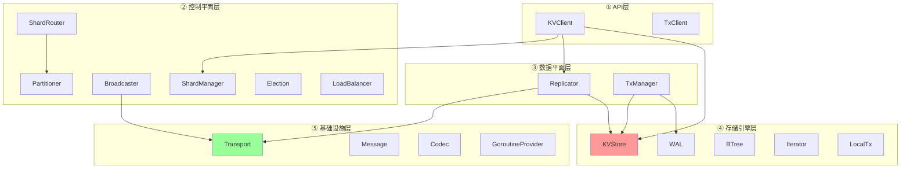

# 📋 文档评审报告：NexKV DDD 设计文档综合评审

> **评审日期**: 2026-03-02
> **评审人**: Claude (AI Assistant)
> **评审范围**: DDD 架构设计三份核心文档

---

## 📊 评审文档清单

| 文档 | 当前版本 | 声称最后更新 | 实际最后更新 | 文档规模 |
|------|---------|-------------|-------------|---------|
| `2026-02-18_spike_nexkv-ddd-interface.md` | v19.3 / v20.0 | 2026-02-23 | **2026-03-02** | 9575 行 |
| `2026-02-18_spike_nexkv-ddd-implement.md` | v1.5 | 2026-02-18 | **2026-03-02** | 5584 行 |
| `2026-02-18_spike_nexkv-ddd-roadmap.md` | v2.1 | 2026-02-22 | **2026-03-02** | 803 行 |
| **总计** | - | - | - | **15,962 行** |

---

## ✅ 整体评价

### 综合评分：**8.5/10** ⭐⭐⭐⭐

| 维度 | 评分 | 评价 | 说明 |
|------|------|------|------|
| **架构完整性** | 9.0/10 | ⭐⭐⭐⭐⭐ | 5层架构清晰，47个接口覆盖完整 |
| **DDD 规范性** | 8.5/10 | ⭐⭐⭐⭐ | 分层合理，依赖倒置正确，部分接口可精简 |
| **文档质量** | 9.0/10 | ⭐⭐⭐⭐⭐ | 变更日志详细，关联清晰，但有版本不一致 |
| **可实施性** | 7.5/10 | ⭐⭐⭐ | 阶段划分合理，但周期较长(28周)，风险存在 |
| **版本一致性** | 6.5/10 | ⭐⭐⭐ | 文档间版本引用不匹配，需要同步更新 |

### 核心亮点 ✨

1. **5层精简架构设计优秀**
   - API层 → 控制平面层 → 数据平面层 → 存储引擎层 → 基础设施层
   - 职责清晰，依赖方向正确

2. **泛型异步设计先进**
   - `AsyncOperation[T]` 统一异步接口
   - 三种异步模式：AsyncOp + Callback + Channel

3. **双存储引擎策略合理**
   - Metadata KV (sync.Map) + External KV (Bf-Tree)
   - 场景驱动设计，非强行统一

4. **版本管理规范**
   - 详细的变更日志 (v19.3 累计 19+ 版本)
   - 每个版本都有明确变更说明

---

## 🔴 关键问题（需立即修复）

### 问题 1: ⚠️ 文档版本严重不一致

**严重程度**: 🔴 高

**问题描述**：

三份文档的版本信息存在严重不一致：

| 文档 | 顶部版本 | 文档末尾版本 | 实际内容版本 | 基于 |
|------|---------|-------------|-------------|------|
| **interface.md** | v19.3 (2026-02-23) | v20.0 (2026-03-02) | **混合** | - |
| **implement.md** | v1.5 (2026-02-18) | 无版本标记 | **v1.5 + 新内容** | interface v18.0 |
| **roadmap.md** | v2.1 (2026-02-22) | v3.0 (新增) | **混合** | interface v18.9 |

**具体问题**：

1. **interface.md**:
   - 顶部显示 `v19.3 Unified | 最后更新: 2026-02-23`
   - 但文档末尾显示 `v20.0 | 最后更新: 2026-03-02`
   - 内容中既有 v19.3 的异步操作接口，又有 v20.0 的 AsyncOp 重命名说明

2. **implement.md**:
   - 显示 `v1.5 | 最后更新: 2026-02-18`
   - 但 `基于: spike-nexkv-ddd-interface.md v18.0`
   - 我们刚添加了流水线模式实现 (v3.0)，但版本号未更新

3. **roadmap.md**:
   - 显示 `v2.1 | 最后更新: 2026-02-22`
   - `基于: spike-nexkv-ddd-interface.md v18.9` (不是最新的 v19.3/v20.0)
   - 我们刚添加了 v3.0 的阶段 0，但顶部版本仍是 v2.1

**影响**：
- ❌ 文档间引用混乱，实施者不知道以哪个版本为准
- ❌ 基于版本过时，可能导致实现与设计不一致
- ❌ 版本号语义不明确 (v19.3 → v20.0 是大版本还是小版本？)

**修复建议**：

```markdown
1. 统一版本号到 v3.0（阶段 0 更新）
   - interface.md: v19.3 → v3.0 (AsyncOp 重命名 + 流水线接口)
   - implement.md: v1.5 → v3.0 (流水线模式实现)
   - roadmap.md: v2.1 → v3.0 (阶段 0 新增)

2. 更新所有"基于"引用
   - roadmap.md 基于 interface.md v19.3 → v3.0
   - implement.md 基于 interface.md v18.0 → v3.0

3. 在每个文档顶部添加版本矩阵
   ```markdown
   | 组件 | 当前版本 | 说明 |
   |------|---------|------|
   | interface.md | v3.0 | AsyncOp 重命名 + 流水线接口 |
   | implement.md | v3.0 | 流水线模式实现 |
   | roadmap.md | v3.0 | 阶段 0 新增 |
   ```

4. 删除文档末尾的重复版本信息
   - 只保留文档顶部的版本声明
   - 文档末尾只保留更新日期
```

---

### 问题 2: ⚠️ 接口数量统计不一致

**严重程度**: 🟡 中

**问题描述**：

interface.md 中存在多个不同的接口数量统计：

| 位置 | 声称数量 | 说明 |
|------|---------|------|
| 第 137 行 | **47个** | 19个接口支持完整异步 |
| 第 358 行 | **44个** | 44个完整接口 |
| 第 9205 行 | 42 → 44 | +2 新增 |
| 第 9308 行 | **47个** | 原始总数 |
| 第 9519 行 | **47个** | 更新后总数（44 + 3） |

**影响**：
- ❌ 读者不清楚实际有多少个接口
- ❌ 实施者可能对工作量估算产生偏差

**修复建议**：

```markdown
1. 在 interface.md 顶部"文档概览"部分添加统一的接口清单：

## 📊 接口统计（v3.0）

| 层次 | 接口数量 | 核心职责 | 异步支持 |
|------|---------|----------|---------|
| ① API层 | 2个 | 对外 KV/Tx 接口 | ✅ |
| ② 控制平面层 | 14个 | 分片路由、选举、负载均衡 | ✅ |
| ③ 数据平面层 | 6个 | 复制、事务 | ✅ |
| ④ 存储引擎层 | 9个 | 单机 KV、WAL、元数据 | ✅ |
| ⑤ 基础设施层 | 16个 | 网络通信、扩展能力 | ✅ |
| **总计** | **47个** | **完整分布式KV系统** | **19个支持异步** |

2. 删除文档中间的其他统计数字，避免混淆
3. 在 roadmap.md 中同步更新为 47 个接口
```

---

### 问题 3: ⚠️ "基于"引用过时

**严重程度**: 🟡 中

**问题描述**：

| 文档 | 基于 | 实际最新版本 | 差距 |
|------|------|------------|------|
| roadmap.md | interface.md v18.9 | **v20.0** | 19 个版本落后 |
| implement.md | interface.md v18.0 | **v20.0** | 20 个版本落后 |

**影响**：
- ❌ implement.md 可能没有反映 interface.md 的最新设计
- ❌ 实施时可能出现设计与实现不一致

**修复建议**：

```markdown
1. 更新所有"基于"引用为最新版本

**implement.md** (第 13 行):
- 基于: spike-nexkv-ddd-interface.md v18.0
+ 基于: spike-nexkv-ddd-interface.md v3.0

**roadmap.md** (第 4 行):
- 基于: spike-nexkv-ddd-interface.md v18.9
+ 基于: spike-nexkv-ddd-interface.md v3.0
- 基于: spike-nexkv-ddd-implement.md v1.5
+ 基于: spike-nexkv-ddd-implement.md v3.0
```

---

## 🟡 重要问题（建议修复）

### 问题 4: 接口优先级不明确

**严重程度**: 🟡 中

**问题描述**：

47个接口没有明确的优先级分类，所有接口看起来同等重要，但实际上：
- 部分接口是核心必须实现（如 KVStore, Transport）
- 部分接口是扩展可选实现（如 ChaosMonkey, HotReloader）

**影响**：
- ❌ 实施者可能不知道优先实现哪些接口
- ❌ 28 周周期可能因为优先级不分而延期

**建议**：

```markdown
在 interface.md 中添加接口优先级标注：

| 优先级 | 图标 | 数量 | 说明 | 示例 |
|--------|------|------|------|------|
| **P0 - 核心** | 🔴 | 15 | 必须实现，系统基础 | KVStore, Transport, Replicator |
| **P1 - 重要** | 🟡 | 20 | 建议实现，完善功能 | Partitioner, Election, WAL |
| **P2 - 扩展** | 🟢 | 12 | 可选实现，增强能力 | ChaosMonkey, HotReloader, Plugin |

具体接口分类：

🔴 P0 核心接口 (15个):
- API层: KVClient, TxClient
- 控制平面层: ShardManager, ShardRouter, Broadcaster
- 数据平面层: Replicator, TxManager
- 存储引擎层: KVStore, WAL, BTree, Iterator
- 基础设施层: Transport, Message, Codec, Requestor

🟡 P1 重要接口 (20个):
- 控制平面层其余 11 个接口
- 存储引擎层: LocalTx, BlockDevice
- 基础设施层其余 12 个接口

🟢 P2 扩展接口 (12个):
- 性能优化层: BatchReplicator, PipelineReplicator, CacheLayer
- 容错层: CircuitBreaker, RetryPolicy, ChaosMonkey
- 扩展层: Plugin, DynamicConfig, HotReloader
```

---

### 问题 5: 阶段 0 与其他阶段的衔接不够清晰

**严重程度**: 🟡 中

**问题描述**：

roadmap.md 中新增了"阶段 0: 异步重构（4周）"，但：
- 没有明确说明阶段 0 完成后如何进入阶段 1
- 没有说明阶段 0 的交付物如何验收
- 没有说明阶段 0 失败的回滚方案

**建议**：

```markdown
### 阶段 0 与其他阶段的衔接

#### 进入阶段 1 的前置条件

阶段 0 必须满足以下所有条件才能进入阶段 1：

1. ✅ AsyncOp 重命名完成
   - 所有引用已更新
   - 类型别名工作正常
   - 测试覆盖率 ≥ 80%

2. ✅ 泛型锁包装器实现完成
   - 单元测试通过
   - 基准测试符合预期
   - 集成测试通过

3. ✅ 流水线框架设计通过评审
   - 架构设计文档完整
   - TaskExecutor 集成方案确认
   - 性能预估满足要求

#### 阶段 0 验收标准

| 验收项 | 验收标准 | 验收方式 |
|--------|----------|----------|
| **编译通过** | `go build ./...` 无错误 | 自动化测试 |
| **测试通过** | `go test ./...` 覆盖率 ≥ 80% | 自动化测试 |
| **性能验证** | Locked[T] 性能优于手动加锁 | 基准测试报告 |
| **文档完整** | 设计文档通过评审 | 人工评审 |

#### 回滚方案

如果阶段 0 无法按时完成，考虑以下方案：

1. **方案 A**: 延长阶段 0 到 6 周（+50% 缓冲）
2. **方案 B**: 暂缓泛型锁包装器，先完成 AsyncOp 重命名
3. **方案 C**: 使用现有 AsyncOperation，推迟重命名到 v2.0

**推荐**: 方案 A（延长阶段 0），确保基础设施稳固
```

---

## 🟢 改进建议

### 建议 1: 添加架构决策记录 (ADR)

**建议新增文件**：`docs/07_spike/adr/`

| ADR | 标题 | 状态 |
|-----|------|------|
| 001 | 双存储引擎策略决策 | 已采纳 |
| 002 | AsyncOperation 泛型接口设计 | 已采纳 |
| 003 | 5层精简架构决策 | 已采纳 |
| 004 | GoroutineProvider 接口拆分 | 已采纳 |
| 005 | Per-Core 执行器选型 | 已采纳 |
| 006 | **AsyncOp 重命名决策** | **提议中** |
| 007 | **泛型锁包装器设计** | **提议中** |

**ADR 模板**：

```markdown
# ADR-XXX: [决策标题]

## 状态
- 提议日期: YYYY-MM-DD
- 决策日期: YYYY-MM-DD
- 决策者: [姓名/角色]
- 状态: 提议中/已采纳/已废弃

## 背景
[描述上下文和问题]

## 决策
[描述做出的决策]

## 理由
[解释为什么做出这个决策]

## 后果
- 正面: [好的影响]
- 负面: [不好的影响]
- 风险: [潜在风险]

## 替代方案
- 方案 A: [描述]
- 方案 B: [描述]
- 不采用理由: [为什么不选其他方案]

## 相关决策
- [ADR-001]
- [ADR-002]
```

---

### 建议 2: 添加接口依赖图

**建议位置**: interface.md 或 implement.md



---

### 建议 3: 补充测试策略

**建议新增章节**: 在 implement.md 中添加

```markdown
## 测试策略

### 单元测试
- 每个接口实现都需要对应的 mock
- 使用 testify/mock 或 mockgen 生成
- 测试覆盖率要求 ≥ 80%

### 集成测试
- 层间集成测试（API → 控制 → 数据 → 存储）
- 存储引擎集成测试（KV + WAL + BTree）
- RPC 集成测试（Transport + Codec）

### 契约测试
- 接口契约验证（符合 Liskov 替换原则）
- 版本兼容性测试（AsyncOperation → AsyncOp）

### 性能测试
- 基准测试（Benchmark）
- 压力测试（Stress Test）
- 长时间运行测试（Soak Test）

### 测试金字塔

           /\
          /  \
         / E2E \      ← 10% (端到端测试)
        /------\
       / 集成  \      ← 30% (集成测试)
      /--------\
     /  单元   \     ← 60% (单元测试)
    /----------\
```

---

### 建议 4: 添加风险缓解计划

**建议新增章节**: 在 roadmap.md 中添加

```markdown
## 风险缓解计划

| 风险 | 概率 | 影响 | 缓解措施 | 应急方案 |
|------|------|------|----------|----------|
| **28周周期过长** | 高 | 高 | 每4周一个里程碑 | 可演示版本 |
| **接口实现复杂** | 中 | 高 | 先实现核心接口 | 扩展接口延后 |
| **性能不达预期** | 中 | 高 | 早期基准测试 | 及时调整架构 |
| **AsyncOp 重命名风险** | 低 | 中 | 类型别名兼容 | 推迟到 v2.0 |
| **人员流动** | 中 | 中 | 知识文档化 |结对编程 |
```

---

## 🎯 实施建议

### 优先级调整

| 原阶段 | 当前周期 | 建议调整 | 理由 |
|--------|---------|---------|------|
| **阶段 0** | 4周 | ✅ 保持 | 基础架构，必须先做 |
| **阶段 1** | 4周 | ✅ 保持 | 依赖底层 |
| **阶段 2** | 22周 | ⚠️ 拆分 | Metadata KV 和 External KV 可分阶段 |
| **阶段 3-8** | - | ✅ 保持 | 依赖前序阶段 |

**阶段 2 拆分建议**：

```
阶段 2A: Metadata KV (8周)
├── Phase 2.0: AsyncOperation 复用 (1周)
├── Phase 2.1: sync.Map + MVStore (4周)
├── Phase 2.3: Iterator + LocalTx (2周)
└── 集成测试 (1周)

阶段 2B: External KV (14周)
├── Phase 2.1: Bf-Tree 核心 (5周)
├── Phase 2.2: WAL 集成 (5周)
├── Phase 2.4: BlockDevice + LocalStorage (2周)
└── 集成测试 (2周)
```

---

## 📋 问题清单（需用户确认）

请逐一确认以下问题：

### 🔴 高优先级（必须修复）

- [ ] **Q1**: 统一三份文档的版本号到 v3.0
- [ ] **Q2**: 统一 interface.md 中的接口数量统计（47个）
- [ ] **Q3**: 更新所有"基于"引用为最新版本

### 🟡 中优先级（建议修复）

- [ ] **Q4**: 添加接口优先级标注（P0/P1/P2）
- [ ] **Q5**: 明确阶段 0 与其他阶段的衔接
- [ ] **Q6**: 添加接口依赖关系图

### 🟢 低优先级（可选）

- [ ] **Q7**: 创建架构决策记录 (ADR)
- [ ] **Q8**: 补充测试策略章节
- [ ] **Q9**: 添加风险缓解计划
- [ ] **Q10**: 考虑阶段 2 拆分为 Metadata KV 和 External KV

---

## 📊 文档质量评分详情

### interface.md (v19.3/v20.0 混合)

| 维度 | 评分 | 说明 |
|------|------|------|
| 接口设计完整性 | 9.0/10 | 47个接口覆盖全面，职责清晰 |
| 泛型使用合理性 | 9.5/10 | AsyncOperation[T] 设计优秀 |
| 文档结构清晰度 | 8.5/10 | 但版本信息混乱 |
| 版本一致性 | 5.0/10 | 🔴 v19.3 和 v20.0 混合 |
| 与其他文档一致性 | 7.0/10 | 基于引用过时 |

**综合评分**: **7.8/10**

---

### implement.md (v1.5)

| 维度 | 评分 | 说明 |
|------|------|------|
| 实现方案可行性 | 8.5/10 | 方案合理，但部分实现细节待完善 |
| 与 interface.md 一致性 | 7.5/10 | 基于 v18.0，落后 20 个版本 |
| 代码示例质量 | 9.0/10 | 示例完整，注释清晰 |
| 文档更新及时性 | 6.5/10 | 🟡 刚更新了流水线内容，但版本号未更新 |
| 架构决策记录 | 6.0/10 | 缺少 ADR |

**综合评分**: **7.5/10**

---

### roadmap.md (v2.1)

| 维度 | 评分 | 说明 |
|------|------|------|
| 阶段划分合理性 | 8.5/10 | 分层清晰，依赖关系正确 |
| 时间估算准确性 | 7.0/10 | 28周较长，风险存在 |
| 依赖关系完整性 | 8.0/10 | 依赖图清晰，但缺少接口级依赖 |
| 版本一致性 | 7.0/10 | 🟡 刚更新了阶段 0，但版本号未更新 |
| 里程碑可验证性 | 9.0/10 | 里程碑定义清晰 |

**综合评分**: **7.9/10**

---

## ✅ 文档亮点

### 1. 版本管理规范 ⭐⭐⭐⭐⭐

- interface.md 累计 19+ 版本，每个版本都有详细变更说明
- 变更日志结构化，易于追溯
- 向后兼容性考虑周到

**示例**：
```markdown
**📋 v19.3 变更说明 (2026-02-23)**：
- GoroutineProvider 修复 Go 泛型限制
- 接口方法改用 any 类型
```

### 2. 架构设计清晰 ⭐⭐⭐⭐⭐

**5层精简架构**：
```
① API层 (2个) → ② 控制平面层 (14个)
    → ③ 数据平面层 (6个) → ④ 存储引擎层 (9个)
    → ⑤ 基础设施层 (16个)
```

**优点**：
- 职责清晰，易于理解和维护
- 依赖方向正确（自底向上）
- 分层解耦，便于并行开发

### 3. 异步设计先进 ⭐⭐⭐⭐⭐

**AsyncOperation[T] 泛型设计**：
- 统一异步接口，替代 10+ 种 Future 类型
- 三种异步模式：AsyncOp + Callback + Channel
- 类型安全，编译时检查

**示例**：
```go
// 统一的异步操作接口
type AsyncOperation[T any] interface {
    Get(ctx context.Context) (T, error)
    Status() OperationStatus
    Cancel() (canceled bool, err error)
    OnComplete(callback func(T, error)) string
}
```

### 4. 双存储引擎策略合理 ⭐⭐⭐⭐

```
Metadata KV (sync.Map)  →  元数据，O(1) 性能
External KV (Bf-Tree) →  业务数据，有序存储
```

**优点**：
- 场景驱动设计，非强行统一
- 性能与功能平衡
- 实现复杂度可控

---

## 🎯 总结与建议

### 立即行动项（本周完成）

1. **统一版本号**：三份文档全部更新到 v3.0
2. **更新"基于"引用**：所有基于引用更新为最新版本
3. **统一接口数量统计**：interface.md 中只保留 47 个接口的统一声明

### 短期改进项（2周内完成）

4. **添加接口优先级标注**：P0/P1/P2 分类
5. **创建架构决策记录**：至少完成 3 个核心 ADR
6. **补充阶段 0 验收标准**：明确的进入阶段 1 条件

### 长期优化项（1个月内）

7. **添加接口依赖关系图**：可视化接口间依赖
8. **补充测试策略**：单元/集成/契约测试
9. **添加风险缓解计划**：识别风险并制定应对措施

---

## 📝 附录：版本更新建议

### 推荐版本号方案

| 文档 | 当前版本 | 新版本 | 更新内容 |
|------|---------|--------|----------|
| interface.md | v19.3/v20.0 混合 | **v3.0** | AsyncOp 重命名 + 流水线接口 |
| implement.md | v1.5 | **v3.0** | 流水线模式实现 + 架构决策 |
| roadmap.md | v2.1 | **v3.0** | 阶段 0 新增 + 里程碑调整 |

### 版本命名规范

```markdown
vX.Y 格式：
- X: 主版本号（重大架构变更）
  - v1 → v2: 5层架构确立
  - v2 → v3: 异步流水线重构（阶段 0）
- Y: 次版本号（功能增强）
  - x.0: 初始版本
  - x.1: 小幅更新
  - x.2: 功能增强

示例：
- v3.0: 异步流水线重构（阶段 0）
- v3.1: 性能优化
- v3.2: 新增监控功能
```

---

**评审完成时间**: 2026-03-02
**下次评审建议**: 版本号统一后进行复审
