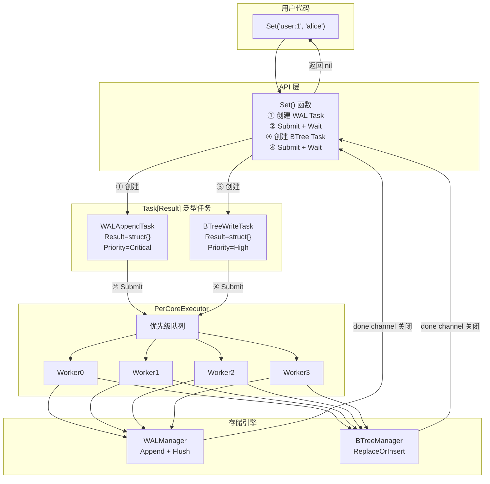

# NexKV 全链路异步流水线设计

> 设计日期：2026-03-04
> 状态：📝 设计草案

---

## 核心问题：Pipeline 怎么连起来？

**这是整个设计最重要的一节，先看懂这个，后面才好理解。**

### 一个 Set 请求的完整旅程

假设用户调用 `Set("user:1", "alice")`，数据要经历：

```
用户调用 Set()
    ↓
写 WAL（保证持久性）
    ↓
更新 BTree（内存索引）
    ↓
返回成功
```

### V4 的连接方式：API 显式控制

**关键点：组件之间没有常驻的 channel 连接！**

是 API 代码**显式地、顺序地**创建 Task 来实现"流水线"：

```go
func (p *Pipeline) Set(key, value []byte) error {
    ts := p.hlc.Now()

    // ═══════════════════════════════════════
    // 第一步：创建 WAL Task，提交，等待
    // ═══════════════════════════════════════
    walTask := NewWALAppendTask(&LogEntry{
        Key:       key,
        Value:     value,
        Timestamp: ts,
    }, sourceID)

    p.Submit(walTask)   // ① 提交到 Executor
    walTask.Wait()      // ② 阻塞等待完成 ← 这里会卡住，直到 WAL 写完

    // ═══════════════════════════════════════
    // 第二步：创建 BTree Task，提交，等待
    // ═══════════════════════════════════════
    btreeTask := NewBTreeWriteTask(key, value, ts, sourceID)

    p.Submit(btreeTask) // ③ 提交到 Executor
    btreeTask.Wait()    // ④ 阻塞等待完成 ← 这里会卡住，直到 BTree 更新完

    return nil
}
```

### 图解：数据在 Pipeline 中的流动

```
┌─────────────────────────────────────────────────────────────────────────────┐
│                          用户调用 Set("user:1", "alice")                      │
└─────────────────────────────────────────────────────────────────────────────┘
                                      │
                                      ▼
┌─────────────────────────────────────────────────────────────────────────────┐
│                            API 层：Set() 函数                                │
│                                                                             │
│  ┌─────────────────────────────────────────────────────────────────────┐   │
│  │  ① 创建 WAL Task                                                     │   │
│  │     ┌──────────────────────────────────────┐                         │   │
│  │     │ WALAppendTask {                      │                         │   │
│  │     │   entries: [{                        │                         │   │
│  │     │     Key: "user:1",  ◄────────────────┼─── 数据在这里           │   │
│  │     │     Value: "alice"                   │                         │   │
│  │     │   }]                                 │                         │   │
│  │     │   done: chan struct{}  ◄─────────────┼─── 完成信号             │   │
│  │     │ }                                    │                         │   │
│  │     └──────────────────────────────────────┘                         │   │
│  │                      │                                               │   │
│  │                      ▼                                               │   │
│  │  ② p.Submit(walTask)  ────────────────────►  Executor 队列          │   │
│  │                      │                                               │   │
│  │                      ▼                                               │   │
│  │  ③ walTask.Wait()  ◄───── 阻塞等待 ◄──── WAL Task 执行完毕          │   │
│  │         │                                                            │   │
│  │         │  ← done channel 关闭，阻塞解除                              │   │
│  │         ▼                                                            │   │
│  └─────────────────────────────────────────────────────────────────────┘   │
│                                                                             │
│  ════════════════════════════════ 分隔线 ═══════════════════════════════   │
│                                                                             │
│  ┌─────────────────────────────────────────────────────────────────────┐   │
│  │  ④ 创建 BTree Task                                                   │   │
│  │     ┌──────────────────────────────────────┐                         │   │
│  │     │ BTreeWriteTask {                     │                         │   │
│  │     │   key: "user:1"     ◄────────────────┼─── 数据在这里           │   │
│  │     │   value: "alice"   ◄─────────────────┼─── 数据在这里           │   │
│  │     │   done: chan struct{}  ◄─────────────┼─── 完成信号             │   │
│  │     │ }                                    │                         │   │
│  │     └──────────────────────────────────────┘                         │   │
│  │                      │                                               │   │
│  │                      ▼                                               │   │
│  │  ⑤ p.Submit(btreeTask)  ──────────────────►  Executor 队列          │   │
│  │                      │                                               │   │
│  │                      ▼                                               │   │
│  │  ⑥ btreeTask.Wait()  ◄───── 阻塞等待 ◄─── BTree Task 执行完毕       │   │
│  │         │                                                            │   │
│  │         │  ← done channel 关闭，阻塞解除                              │   │
│  │         ▼                                                            │   │
│  └─────────────────────────────────────────────────────────────────────┘   │
│                                                                             │
└─────────────────────────────────────────────────────────────────────────────┘
                                      │
                                      ▼
                              返回 nil（成功）
```

### 核心要点

| 问题 | 答案 |
|------|------|
| **数据怎么从 API 到 WAL？** | API 创建 WAL Task，**数据在 Task 对象里** |
| **怎么知道 WAL 完成了？** | 调用 `walTask.Wait()`，**阻塞等待 done channel 关闭** |
| **数据怎么从 WAL 到 BTree？** | **不是自动流转！** 是 API 等 WAL 完成后，**再创建 BTree Task** |
| **有 channel 连接组件吗？** | **没有！** 每个 Task 内部有一个 done channel，但组件之间没有 |

### 对比：两种连接方式

```
┌─────────────────────────────────────────────────────────────────────────────┐
│                     方式 A：Channel 串联（doubao 方案）                       │
│                                                                             │
│   ┌──────────┐   channel   ┌──────────┐   channel   ┌──────────┐           │
│   │   API    │ ──────────► │   WAL    │ ──────────► │  BTree   │           │
│   │goroutine │             │goroutine │             │goroutine │           │
│   └──────────┘             └──────────┘             └──────────┘           │
│        │                        │                        │                 │
│        └────────────────────────┴────────────────────────┘                 │
│                              数据自动流向下一个组件                           │
│                                                                             │
└─────────────────────────────────────────────────────────────────────────────┘

┌─────────────────────────────────────────────────────────────────────────────┐
│                     方式 B：API 显式控制（V4 方案）                           │
│                                                                             │
│   ┌──────────────────────────────────────────────────────────────────────┐ │
│   │                         API 代码                                      │ │
│   │                                                                      │ │
│   │   ① 创建 WAL Task ──► Submit ──► Wait ──► (WAL 完成)                 │ │
│   │                                                      │               │ │
│   │                                                      ▼               │ │
│   │   ② 创建 BTree Task ──► Submit ──► Wait ──► (BTree 完成)             │ │
│   │                                                      │               │ │
│   │                                                      ▼               │ │
│   │   ③ 返回成功                                                         │ │
│   │                                                                      │ │
│   └──────────────────────────────────────────────────────────────────────┘ │
│                                                                             │
│   API 显式控制每一步：创建 Task → 提交 → 等待 → 创建下一个 Task              │
│                                                                             │
└─────────────────────────────────────────────────────────────────────────────┘
```

### 为什么选择方式 B？

| 优点 | 说明 |
|------|------|
| **灵活控制** | 可以在任意步骤插入逻辑（比如 Set 先 WAL 后 BTree，但 Get 只需 BTree） |
| **错误处理** | 每一步的错误都能独立处理 |
| **超时控制** | 可以给每个 Task 设置不同的超时 |
| **优先级** | WAL Task 是 Critical，BTree Task 是 High，Executor 会优先调度 WAL |
| **资源效率** | 固定 Worker 池，不会 goroutine 爆炸 |

---

## 演进过程：从简单到复杂

现在你已经知道 Pipeline 怎么连起来了，让我们看看为什么设计成这样。

### 第一步：最直观的实现（同步调用）

```go
func (p *Pipeline) Set(key, value []byte) error {
    ts := p.hlc.Now()

    // 1. 写 WAL（阻塞等待完成）
    if err := p.wal.Append(&LogEntry{...}); err != nil {
        return err
    }

    // 2. 更新 BTree（阻塞等待完成）
    p.btree.ReplaceOrInsert(key, value)
    return nil
}
```

**问题**：
- 同步阻塞，CPU 空闲等待 I/O
- 无法利用多核
- 吞吐量低

### 第二步：用 goroutine 异步化

```go
func (p *Pipeline) Set(key, value []byte) error {
    go func() {
        p.wal.Append(...)
        p.btree.ReplaceOrInsert(...)
    }()
    return nil  // 立即返回
}
```

**问题**：
- 如何知道操作完成了？
- 如何获取结果？
- goroutine 数量失控
- 无优先级

### 第三步：引入 Task 抽象

```go
type Task interface {
    Execute(ctx context.Context) error
}

type BTreeWriteTask struct {
    key   []byte
    value []byte
    done  chan error
}

func (t *BTreeWriteTask) Wait() error {
    return <-t.done
}
```

**问题**：不同任务返回不同类型
- BTreeReadTask → `[]byte`
- BTreeRangeTask → `[]KVPair`
- BTreeWriteTask → `struct{}`

### 第四步：泛型的困境

```go
type Task[Result any] interface {
    Execute(ctx context.Context) (Result, error)
}

// ❌ 这无法编译！
var tasks []Task[???]  // 问号填什么都无法同时容纳不同 Result 类型
tasks = append(tasks, &BTreeReadTask{})   // Task[[]byte]
tasks = append(tasks, &BTreeRangeTask{})  // Task[[]KVPair]
```

**核心矛盾**：
- 我们需要**泛型**保证类型安全
- 但 Executor 需要**统一类型**来调度

### 第五步：双层接口设计

**核心洞察**：Executor 不需要知道 Result 类型，只需要知道"如何执行"。

```go
// 第一层：TaskRunner（非泛型）—— Executor 只看到这个
type TaskRunner interface {
    Run(ctx context.Context, p *Pipeline)
    Priority() Priority
    SourceID() model.SourceID
}

// 第二层：Task[Result]（泛型）—— 用户使用，类型安全
type Task[Result any] interface {
    TaskRunner  // 嵌入第一层
    Execute(ctx context.Context, p *Pipeline) (Result, error)
}
```

**类型擦除与恢复**：

```
用户创建 Task[[]byte]
       │
       ▼
Submit(task)  ←── task 作为 TaskRunner 传入（类型擦除）
       │
       ▼
Executor 调用 task.Run()  ←── Executor 不知道 Result 类型
       │
       ▼
Run() 内部：
  1. 通过类型断言调用 Execute()
  2. 结果存入 BaseTask.result（类型固定！）
  3. 关闭 done channel
       │
       ▼
用户调用 task.Wait()  ←── 返回 ([]byte, error)，类型安全恢复！
```

---

## 实现细节

### BaseTask 泛型基类

```go
type BaseTask[Result any] struct {
    // 调度属性
    opType   OpType
    priority Priority
    sourceID model.SourceID

    // 结果存储
    done   chan struct{}  // 完成信号（唯一的 channel）
    result Result         // 直接存储结果（值类型）
    err    error
}

func NewBaseTask[Result any](opType OpType, priority Priority, sourceID model.SourceID) BaseTask[Result] {
    return BaseTask[Result]{
        opType:   opType,
        priority: priority,
        sourceID: sourceID,
        done:     make(chan struct{}),
    }
}

// Run 实现 TaskRunner 接口（Executor 调用）
func (b *BaseTask[Result]) Run(ctx context.Context, p *Pipeline) {
    defer close(b.done)

    // 类型断言调用具体 Task 的 Execute
    runner := any(b).(Task[Result])
    b.result, b.err = runner.Execute(ctx, p)
}

// Wait 等待完成并返回结果
func (b *BaseTask[Result]) Wait() (Result, error) {
    <-b.done
    return b.result, b.err
}
```

### 具体 Task 实现

```go
// 读取任务：返回 []byte
type BTreeReadTask struct {
    BaseTask[[]byte]
    key []byte
}

func (t *BTreeReadTask) Execute(ctx context.Context, p *Pipeline) ([]byte, error) {
    p.btree.mu.RLock()
    defer p.btree.mu.RUnlock()
    return p.btree.Get(t.key), nil
}

// 写入任务：返回 struct{}
type BTreeWriteTask struct {
    BaseTask[struct{}]
    key, value []byte
    ts *HLC
}

func (t *BTreeWriteTask) Execute(ctx context.Context, p *Pipeline) (struct{}, error) {
    p.btree.mu.Lock()
    defer p.btree.mu.Unlock()
    p.btree.ReplaceOrInsert(t.key, t.value)
    return struct{}{}, nil
}

// WAL 任务：返回 struct{}，优先级 Critical
type WALAppendTask struct {
    BaseTask[struct{}]
    entries []*LogEntry
}

func (t *WALAppendTask) Execute(ctx context.Context, p *Pipeline) (struct{}, error) {
    p.wal.mu.Lock()
    defer p.wal.mu.Unlock()
    p.wal.AppendBatch(t.entries)
    p.wal.Flush()
    return struct{}{}, nil
}
```

---

## 完整架构图



---

## 存储引擎

### BTreeManager

```go
type BTreeManager struct {
    tree     *btree.BTree
    mu       sync.RWMutex
    versions map[string]*VersionChain
}

type VersionChain struct {
    key      []byte
    versions []Version
    mu       sync.RWMutex
}

type Version struct {
    Value     []byte
    Timestamp *HLC
    TxnID     uint64
    Deleted   bool
}

func (b *BTreeManager) Get(key []byte) []byte {
    item := b.tree.Get(&Item{Key: key})
    if item == nil {
        return nil
    }
    return item.(*Item).Value
}

func (b *BTreeManager) GetWithSnapshot(key []byte, snapshot *HLC) []byte {
    chain, ok := b.versions[string(key)]
    if !ok {
        return nil
    }
    chain.mu.RLock()
    defer chain.mu.RUnlock()
    for i := len(chain.versions) - 1; i >= 0; i-- {
        v := chain.versions[i]
        if v.Timestamp.LessThanOrEqual(snapshot) {
            if v.Deleted {
                return nil
            }
            return v.Value
        }
    }
    return nil
}

func (b *BTreeManager) ReplaceOrInsert(key, value []byte) {
    b.tree.ReplaceOrInsert(&Item{Key: key, Value: value})
}

func (b *BTreeManager) UpdateVersion(key, value []byte, ts *HLC) {
    chain, ok := b.versions[string(key)]
    if !ok {
        chain = &VersionChain{key: key}
        b.versions[string(key)] = chain
    }
    chain.mu.Lock()
    chain.versions = append(chain.versions, Version{
        Value:     value,
        Timestamp: ts,
    })
    chain.mu.Unlock()
}
```

### WALManager

```go
type WALManager struct {
    file          *os.File
    writer        *bufio.Writer
    mu            sync.Mutex
    flushInterval time.Duration
    stopCh        chan struct{}
}

type LogEntry struct {
    Op        OpType
    Key       []byte
    Value     []byte
    Timestamp *HLC
    TxnID     uint64
    CRC       uint32
}

func (w *WALManager) AppendBatch(entries []*LogEntry) error {
    for _, entry := range entries {
        entry.CRC = w.calculateCRC(entry)
        data, err := w.encodeEntry(entry)
        if err != nil {
            return err
        }
        if _, err := w.writer.Write(data); err != nil {
            return err
        }
    }
    return nil
}

func (w *WALManager) Flush() error {
    if err := w.writer.Flush(); err != nil {
        return err
    }
    return w.file.Sync()
}
```

### HLC 混合逻辑时钟

```go
type HLC struct {
    pt int64   // 物理时间（毫秒）
    c  uint16  // 逻辑计数
}

func (h *HLC) Now() *HLC {
    return &HLC{pt: time.Now().UnixMilli(), c: 0}
}

func (h *HLC) LessThanOrEqual(other *HLC) bool {
    if h.pt != other.pt {
        return h.pt <= other.pt
    }
    return h.c <= other.c
}
```

---

## Pipeline 结构

```go
type Pipeline struct {
    ctx      context.Context
    cancel   context.CancelFunc
    btree    *BTreeManager
    wal      *WALManager
    hlc      *HLC
    executor TaskExecutor
}

type TaskExecutor interface {
    Submit(ctx context.Context, sourceID model.SourceID, priority model.TaskPriority, task func(context.Context)) error
    Close() error
}

func (p *Pipeline) Submit(task TaskRunner) error {
    return p.executor.Submit(
        p.ctx,
        task.SourceID(),
        model.TaskPriority(task.Priority()),
        func(ctx context.Context) {
            task.Run(ctx, p)
        },
    )
}
```

---

## API 层完整实现

```go
// Get 读取
func (p *Pipeline) Get(ctx context.Context, key []byte) ([]byte, error) {
    task := NewBTreeReadTask(key, sourceID)
    if err := p.Submit(task); err != nil {
        return nil, err
    }
    return task.Wait()
}

// Set 写入（先 WAL 后 BTree）
func (p *Pipeline) Set(ctx context.Context, key, value []byte) error {
    ts := p.hlc.Now()

    // 1. WAL
    walTask := NewWALAppendTask(&LogEntry{
        Op:        OpWrite,
        Key:       key,
        Value:     value,
        Timestamp: ts,
    }, sourceID)
    if err := p.Submit(walTask); err != nil {
        return err
    }
    if _, err := walTask.Wait(); err != nil {
        return err
    }

    // 2. BTree
    btreeTask := NewBTreeWriteTask(key, value, ts, sourceID)
    if err := p.Submit(btreeTask); err != nil {
        return err
    }
    _, err := btreeTask.Wait()
    return err
}

// Delete 删除
func (p *Pipeline) Delete(ctx context.Context, key []byte) error {
    ts := p.hlc.Now()

    // 1. WAL
    walTask := NewWALAppendTask(&LogEntry{
        Op:        OpDelete,
        Key:       key,
        Timestamp: ts,
    }, sourceID)
    if err := p.Submit(walTask); err != nil {
        return err
    }
    if _, err := walTask.Wait(); err != nil {
        return err
    }

    // 2. BTree
    btreeTask := NewBTreeDeleteTask(key, ts, sourceID)
    if err := p.Submit(btreeTask); err != nil {
        return err
    }
    _, err := btreeTask.Wait()
    return err
}
```

### 异步 API（SetAsync）

**问题**：同步 API 会阻塞调用者，如果用户想并发写入多个 key，必须自己启动 goroutine。

**解决方案**：提供异步 API，**复用 TaskExecutor**，而不是自己启动 goroutine。

#### 为什么异步 API 也要用 TaskExecutor？

```
❌ 错误做法：直接启动 goroutine
┌─────────────────────────────────────────────────────────────────┐
│  SetAsync() {                                                   │
│      go func() {                        // goroutine 爆炸！      │
│          wal.Append(...)                                        │
│          btree.ReplaceOrInsert(...)                             │
│      }()                                                        │
│  }                                                              │
│                                                                 │
│  问题：                                                         │
│  • 无优先级（WAL 和 BTree 同等对待）                              │
│  • 无 CPU 亲和性（同一 key 可能在不同 CPU 执行）                  │
│  • 无背压控制（10000 个并发 = 10000 个 goroutine）               │
└─────────────────────────────────────────────────────────────────┘

✅ 正确做法：复用 TaskExecutor
┌─────────────────────────────────────────────────────────────────┐
│  SetAsync() {                                                   │
│      task := NewWALAppendTask(...)     // 创建 Task             │
│      p.Submit(task)                    // 提交到 Executor        │
│      return AsyncOp{task: task}        // 返回句柄              │
│  }                                                              │
│                                                                 │
│  优势：                                                         │
│  • 优先级调度（WAL = Critical）                                 │
│  • CPU 亲和性（同一 key 绑定同一 Worker）                        │
│  • 背压控制（Worker 池大小固定）                                 │
└─────────────────────────────────────────────────────────────────┘
```

#### AsyncOp 定义（包装 Task）

```go
// AsyncOp 异步操作句柄（包装 Task[Result]）
type AsyncOp[Result any] struct {
    task Task[Result]  // 持有 Task 引用
}

// Wait 等待完成（内部调用 Task.Wait()）
func (op *AsyncOp[Result]) Wait() (Result, error) {
    return op.task.Wait()
}

// Done 返回完成 channel（用于 select）
// 注意：这需要 Task 暴露内部的 done channel
func (op *AsyncOp[Result]) Done() <-chan struct{} {
    return op.task.Done()  // Task 需要提供这个方法
}

// IsComplete 非阻塞检查是否完成
func (op *AsyncOp[Result]) IsComplete() bool {
    select {
    case <-op.task.Done():
        return true
    default:
        return false
    }
}
```

#### BaseTask 添加 Done() 方法

```go
// BaseTask 泛型任务基类
type BaseTask[Result any] struct {
    // ... 其他字段
    done   chan struct{}
    result Result
    err    error
}

// Done 返回完成 channel（供 AsyncOp 使用）
func (b *BaseTask[Result]) Done() <-chan struct{} {
    return b.done
}
```

#### 异步 API 实现（复用 TaskExecutor）

```go
// GetAsync 异步读取
// 创建 Task → 提交到 Executor → 返回 AsyncOp（不阻塞）
func (p *Pipeline) GetAsync(key []byte) *AsyncOp[[]byte] {
    sourceID := model.MustParseSourceID("pipeline:btree:get:async")
    task := NewBTreeReadTask(key, sourceID)

    // 提交到 Executor（非阻塞，立即返回）
    p.Submit(task)

    // 返回 AsyncOp 包装 Task
    return &AsyncOp[[]byte]{task: task}
}

// SetAsync 异步写入（先 WAL 后 BTree）
// 注意：这里需要两个 Task，WAL 完成后才提交 BTree
func (p *Pipeline) SetAsync(key, value []byte) *AsyncOp[struct{}] {
    ts := p.hlc.Now()
    sourceID := model.MustParseSourceID("pipeline:set:async")

    // 创建一个组合 Task，内部执行 WAL + BTree
    task := NewCompositeWriteTask(key, value, ts, sourceID)

    p.Submit(task)
    return &AsyncOp[struct{}]{task: task}
}

// DeleteAsync 异步删除
func (p *Pipeline) DeleteAsync(key []byte) *AsyncOp[struct{}] {
    ts := p.hlc.Now()
    sourceID := model.MustParseSourceID("pipeline:delete:async")

    task := NewCompositeDeleteTask(key, ts, sourceID)

    p.Submit(task)
    return &AsyncOp[struct{}]{task: task}
}

// RangeAsync 异步范围查询
func (p *Pipeline) RangeAsync(start, end []byte, limit int) *AsyncOp[[]KVPair] {
    sourceID := model.MustParseSourceID("pipeline:btree:range:async")
    task := NewBTreeRangeTask(start, end, limit, sourceID)

    p.Submit(task)
    return &AsyncOp[[]KVPair]{task: task}
}
```

#### 组合 Task（CompositeWriteTask）

Set 需要先 WAL 后 BTree，我们需要一个"组合 Task"：

```go
// CompositeWriteTask 组合写入任务（WAL + BTree）
type CompositeWriteTask struct {
    BaseTask[struct{}]
    key, value []byte
    ts         *HLC
}

func NewCompositeWriteTask(key, value []byte, ts *HLC, sourceID model.SourceID) *CompositeWriteTask {
    return &CompositeWriteTask{
        BaseTask: NewBaseTask[struct{}](OpCompositeWrite, PriorityHigh, sourceID),
        key:      key,
        value:    value,
        ts:       ts,
    }
}

func (t *CompositeWriteTask) Execute(ctx context.Context, p *Pipeline) (struct{}, error) {
    // ⚠️ 重要：PerCoreExecutor 是单线程 Worker，不能在 Execute 中嵌套 Submit
    // 否则会导致死锁：Worker 等待自己执行新 Task，但自己正在忙
    //
    // ❌ 错误做法（死锁）：
    //   walTask := NewWALAppendTask(...)
    //   p.Submit(walTask)      // 提交到 Executor
    //   walTask.Wait()         // 死锁！Worker 无法执行新 Task
    //
    // ✅ 正确做法：直接调用存储引擎方法（在当前 Worker 中同步执行）

    // 1. 写 WAL（直接调用存储引擎，不经过 Executor）
    if err := p.wal.Append(&LogEntry{
        Op:        OpWrite,
        Key:       t.key,
        Value:     t.value,
        Timestamp: t.ts,
    }); err != nil {
        return struct{}{}, fmt.Errorf("wal: %w", err)
    }

    // 2. 更新 BTree（直接调用存储引擎，不经过 Executor）
    if err := p.btree.ReplaceOrInsert(t.key, t.value, t.ts); err != nil {
        return struct{}{}, fmt.Errorf("btree: %w", err)
    }

    return struct{}{}, nil
}
```

> **注意**：组合 Task 直接调用 `Execute()`，不再嵌套 Submit。这样整个 Set 操作在同一个 Worker 中完成，保持 CPU 亲和性。

---

## ⚠️ 重要限制：PerCoreExecutor 嵌套 Submit 死锁问题

### 问题描述

PerCoreExecutor 使用**单线程 Worker**模型，每个 Worker 同时只能执行一个 Task。如果在 Task 的 `Execute` 方法中嵌套调用 `p.Submit()` 并 `Wait()`，会导致**死锁**：

```
Worker 线程
    │
    ▼
Execute(CompositeWriteTask)  ← Worker 正在执行这个 Task
    │
    ├── Submit(WALTask) ──► 等待 Worker 执行 WALTask
    │                         │
    │                         ▼
    │                     Worker 正在忙（执行 CompositeWriteTask）
    │                     WALTask 无法执行
    │
    └── 死锁！
```

### 死锁代码示例（❌ 错误）

```go
func (t *CompositeWriteTask) Execute(ctx context.Context, p *Pipeline) (struct{}, error) {
    // ❌ 错误：在 Execute 中 Submit 并 Wait
    walTask := NewWALAppendTask(...)
    if err := p.Submit(walTask); err != nil {  // 提交到 Executor
        return struct{}{}, err
    }
    if _, err := walTask.Wait(); err != nil {  // 死锁！Worker 无法执行 walTask
        return struct{}{}, err
    }
    
    // ... 同样的问题
    btreeTask := NewBTreeWriteTask(...)
    if err := p.Submit(btreeTask); err != nil {
        return struct{}{}, err
    }
    if _, err := btreeTask.Wait(); err != nil {  // 死锁！
        return struct{}{}, err
    }
    
    return struct{}{}, nil
}
```

### 解决方案（✅ 正确）

**在 Execute 中直接调用存储引擎方法，不经过 Executor**：

```go
func (t *CompositeWriteTask) Execute(ctx context.Context, p *Pipeline) (struct{}, error) {
    // ✅ 正确：直接调用存储引擎，不 Submit
    if err := p.wal.Append(...); err != nil {
        return struct{}{}, err
    }
    if err := p.btree.ReplaceOrInsert(...); err != nil {
        return struct{}{}, err
    }
    return struct{}{}, nil
}
```

### 为什么这样可以？

| 方式 | 是否经过 Executor | 是否死锁 | 说明 |
|------|------------------|---------|------|
| `p.Submit(task); task.Wait()` | ✅ 是 | ❌ 死锁 | Worker 等待自己执行新 Task |
| `task.Execute(ctx, p)` | ❌ 否 | ✅ 安全 | 直接执行，不经过队列 |
| `p.wal.Append(...)` | ❌ 否 | ✅ 安全 | 直接调用存储引擎 |

### 设计原则

1. **API 层（Pipeline.Get/Set）**：使用 `Submit + Wait`，享受调度能力
2. **组合 Task（CompositeTask）**：直接调用存储引擎，保持原子性
3. **单一职责**：每个 Task 只做一件事，复杂操作用组合 Task 顺序执行

### AntsPoolExecutor 呢？

AntsPoolExecutor 使用**协程池**，Worker 可以动态创建，理论上不会死锁。但为了避免混淆和保持一致性，**建议所有 Executor 都遵循同样的原则**：

- **API 层**：`Submit + Wait`
- **Task 内部**：直接调用存储引擎

#### 使用示例

```go
// 示例 1：并发写入多个 key
func BatchSet(p *Pipeline, items map[string]string) error {
    ops := make([]*AsyncOp[struct{}], 0, len(items))

    // 发起所有异步请求（提交到 Executor，不阻塞）
    for k, v := range items {
        ops = append(ops, p.SetAsync([]byte(k), []byte(v)))
    }

    // 等待所有请求完成
    for _, op := range ops {
        if _, err := op.Wait(); err != nil {
            return err
        }
    }
    return nil
}

// 示例 2：并发读取多个 key
func BatchGet(p *Pipeline, keys []string) (map[string][]byte, error) {
    ops := make(map[string]*AsyncOp[[]byte])

    // 发起所有异步请求
    for _, k := range keys {
        ops[k] = p.GetAsync([]byte(k))
    }

    // 收集结果
    results := make(map[string][]byte)
    for k, op := range ops {
        v, err := op.Wait()
        if err != nil {
            return nil, err
        }
        results[k] = v
    }
    return results, nil
}

// 示例 3：使用 select 等待（带超时）
func GetWithTimeout(p *Pipeline, key []byte, timeout time.Duration) ([]byte, error) {
    op := p.GetAsync(key)

    select {
    case <-op.Done():
        return op.Wait()
    case <-time.After(timeout):
        return nil, errors.New("timeout")
    }
}
```

#### 同步 vs 异步对比

```go
// 同步 API：阻塞调用者
func ExampleSync() {
    p := NewPipeline(...)

    // 串行执行，总耗时 = T1 + T2 + T3
    p.Set(ctx, "k1", "v1")  // 阻塞 ~1ms
    p.Set(ctx, "k2", "v2")  // 阻塞 ~1ms
    p.Set(ctx, "k3", "v3")  // 阻塞 ~1ms
    // 总耗时 ~3ms
}

// 异步 API：不阻塞调用者，但仍然用 TaskExecutor
func ExampleAsync() {
    p := NewPipeline(...)

    // 并发提交到 Executor（不阻塞）
    op1 := p.SetAsync("k1", "v1")  // 提交到 Executor，立即返回
    op2 := p.SetAsync("k2", "v2")  // 提交到 Executor，立即返回
    op3 := p.SetAsync("k3", "v3")  // 提交到 Executor，立即返回

    // 等待所有完成
    op1.Wait()
    op2.Wait()
    op3.Wait()
    // 总耗时 ~1ms（Worker 池并行执行）
}
```

#### 图解：异步 API 也用 TaskExecutor

```
┌─────────────────────────────────────────────────────────────────────────────┐
│                     用户调用 SetAsync("k1", "v1")                            │
│                         SetAsync("k2", "v2")                                │
│                         SetAsync("k3", "v3")                                │
└─────────────────────────────────────────────────────────────────────────────┘
                                      │
                                      │ 创建 3 个 CompositeWriteTask
                                      │ 提交到 Executor（非阻塞）
                                      ▼
┌─────────────────────────────────────────────────────────────────────────────┐
│                          PerCoreExecutor                                     │
│  ┌─────────────────────────────────────────────────────────────────────┐   │
│  │  优先级队列                                                          │   │
│  │  ┌─────┐ ┌─────┐ ┌─────┐                                           │   │
│  │  │Task1│ │Task2│ │Task3│  ← 三个 SetAsync 创建的 Task              │   │
│  │  └─────┘ └─────┘ └─────┘                                           │   │
│  └─────────────────────────────────────────────────────────────────────┘   │
│                                      │                                      │
│                                      ▼                                      │
│  ┌─────────┐ ┌─────────┐ ┌─────────┐ ┌─────────┐                          │
│  │ Worker0 │ │ Worker1 │ │ Worker2 │ │ Worker3 │                          │
│  │ 执行 T1 │ │ 执行 T2 │ │ 执行 T3 │ │  空闲   │                          │
│  └─────────┘ └─────────┘ └─────────┘ └─────────┘                          │
│       │            │            │                                          │
│       ▼            ▼            ▼                                          │
│  ┌─────────┐ ┌─────────┐ ┌─────────┐                                      │
│  │WAL+BTree│ │WAL+BTree│ │WAL+BTree│  ← 每个 Worker 执行完整的 WAL+BTree   │
│  │  ~1ms   │ │  ~1ms   │ │  ~1ms   │                                      │
│  └─────────┘ └─────────┘ └─────────┘                                      │
│       │            │            │                                          │
│       └────────────┴────────────┘                                          │
│                    │                                                       │
│                    ▼                                                       │
│              关闭 done channel                                              │
└─────────────────────────────────────────────────────────────────────────────┘
                                      │
                                      ▼
┌─────────────────────────────────────────────────────────────────────────────┐
│                    用户调用 op1.Wait() / op2.Wait() / op3.Wait()             │
│                                                                             │
│                    <-op.Done() 收到信号，返回结果                            │
└─────────────────────────────────────────────────────────────────────────────┘
```

#### 关键点总结

| 问题 | 答案 |
|------|------|
| **异步 API 用 goroutine 吗？** | **不用！** 创建 Task，提交到 Executor |
| **AsyncOp 是什么？** | **Task 的包装器**，提供 Wait()/Done() 接口 |
| **优势是什么？** | 优先级、CPU 亲和性、背压控制，和同步 API 一致 |
| **SetAsync 怎么保证 WAL 先于 BTree？** | 用 CompositeWriteTask，在一个 Worker 内顺序执行 |
        _, err := op.Wait()
        return err
    case <-time.After(timeout):
        return errors.New("timeout")
    }
}
```

#### 同步 vs 异步对比

```go
// 同步 API：阻塞调用者
func ExampleSync() {
    p := NewPipeline(...)

    // 串行执行，总耗时 = T1 + T2 + T3
    p.Set(ctx, "k1", "v1")  // 阻塞 ~1ms
    p.Set(ctx, "k2", "v2")  // 阻塞 ~1ms
    p.Set(ctx, "k3", "v3")  // 阻塞 ~1ms
    // 总耗时 ~3ms
}

// 异步 API：不阻塞调用者
func ExampleAsync() {
    p := NewPipeline(...)

    // 并发执行，总耗时 ≈ max(T1, T2, T3)
    op1 := p.SetAsync("k1", "v1")  // 立即返回
    op2 := p.SetAsync("k2", "v2")  // 立即返回
    op3 := p.SetAsync("k3", "v3")  // 立即返回

    op1.Wait()  // 等待完成
    op2.Wait()
    op3.Wait()
    // 总耗时 ~1ms（并行执行）
}
```

#### 图解：同步 vs 异步

```
同步 API（串行）：
时间轴 ─────────────────────────────────────────────────────────►

用户线程:   [Set k1]──────Wait──────►[Set k2]──────Wait──────►[Set k3]──────Wait──────►
Worker0:         [执行 WAL + BTree]       [执行 WAL + BTree]       [执行 WAL + BTree]
Worker1:
Worker2:
Worker3:

总耗时: ~3ms


异步 API（并行）：
时间轴 ─────────────────────────────────────────────────────────►

用户线程:   [SetAsync k1][SetAsync k2][SetAsync k3]──[Wait all]──►
Worker0:         [执行 k1]───────►
Worker1:              [执行 k2]───────►
Worker2:                   [执行 k3]───────►
Worker3:

总耗时: ~1ms（三个任务并行执行）
```

---

## 总结

### 一句话总结

> **V4 = doubao 的泛型简洁 + V3 的调度能力**
>
> - **Pipeline 连接方式**：API 显式控制，没有常驻 channel
> - **泛型**：`Task[Result]` 保证编译时类型安全
> - **双层接口**：解决泛型与统一调度的矛盾
> - **Executor**：提供优先级、CPU 亲和性、背压控制

### 设计选择

| 问题 | 选择 | 原因 |
|------|------|------|
| Pipeline 怎么连 | API 显式控制 | 灵活、可控 |
| 泛型与调度矛盾 | 双层接口 | Executor 看 TaskRunner，用户用 Task[Result] |
| 结果存储 | 单 done channel + 直接存储 | 高效、符合 Go 惯例 |

---

## 实现清单

### P0 - 核心功能

- [ ] `TaskRunner` 接口
- [ ] `Task[Result]` 泛型接口
- [ ] `BaseTask[Result]` 泛型基类
- [ ] `BTreeReadTask` / `BTreeWriteTask` / `BTreeDeleteTask`
- [ ] `WALAppendTask`
- [ ] `Pipeline.Submit(TaskRunner)`
- [ ] 同步 API（Get/Set/Delete）

### P1 - 重要功能

- [ ] `BTreeRangeTask`
- [ ] 事务支持
- [ ] MVCC 版本链

### P2 - 增强功能

- [ ] 冲突检测
- [ ] Metrics 集成
- [ ] WAL 压缩

---

## 参考文档

- [V3 设计](2026-03-02-idea-async-pipeline-v3.md)
- [doubao 泛型方案](2026-03-04-doubao-chat-async-pipe.md)
- [TaskExecutor 设计](../internal/infrastructure/concurrency/executor_percore.md)
