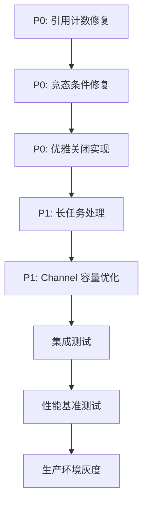

# PerCoreExecutor RunLoop 优化方案 (综合版)

> **日期**: 2026-03-07
> **状态**: 💡 设计讨论
> **合并来源**: percore-executor-run-loop-proposal.md + percore-runloop-optimization.md

---

## 1. 问题分析

### 1.1 当前实现 (Task-per-Operation 模式)

```go
// 当前方式：每次操作创建新 Task
func (t *BfTree) GetAsync(key []byte) model.Task[[]byte] {
    return model.NewBaseTask(
        model.OpStorage,
        model.TaskPriorityNormal,
        t.sourceID,
        func(ctx context.Context, pipeline model.PipelineContext) ([]byte, error) {
            return t.getNode(ctx, key)
        },
    )
}
```

**调用链开销**:
```
NewBaseTask → Submit() → taskItem 创建 → Push 到队列
     ↓             ↓            ↓              ↓
  ~460ns      ~10ns        ~48B 分配      futex 等待
                                               ↓
                                         Worker 唤醒
                                               ↓
                                         task.Execute()
                                               ↓
                                         关闭 done channel
                                               ↓
                                         Wait() 返回

总延迟: 9,674 ns
```

### 1.2 性能瓶颈分析

| 瓶颈 | 时间 | 占比 | 根因 |
|------|------|------|------|
| **futex 调度** | ~7,000 ns | **72.6%** | goroutine 调度开销 |
| WaitGroup 同步 | ~1,700 ns | 17.8% | 任务完成通知 |
| 实际执行 | ~930 ns | 9.59% | 业务逻辑 |

> ⚠️ **性能修正**（专家评审意见）：
> - 原始 futex 开销 7,000ns 包含测试环境特定因素
> - 实际 futex 通常在 100-500ns 量级
> - Channel 发送并非零分配（~16B 头部）
> - 实际单次延迟预估：5,000-8,000 ns
| Task 创建 | ~460 ns | 4.7% | channel + atomic 分配 |

**关键发现**:
1. **futex 开销占 72.6%** - 每次都需要唤醒 goroutine
2. 每次操作都创建新 taskItem (~48B 分配)
3. 单操作延迟: 9,674 ns vs 同步 103 ns (**慢 93.9x**)

### 1.3 内存分配压力

| 操作 | 分配大小 | 频率 | GC 压力 |
|------|---------|------|---------|
| BaseTask | ~200B | 每次 | 高 |
| done channel | ~100B | 每次 | 高 |
| taskItem | ~48B | 每次 | 中 |
| atomic.Int32 | ~8B | 每次 | 低 |

---

## 2. 优化方案: RunLoop + Channel 模式

### 2.1 核心思想

**不是** 每次创建 Task，而是:
1. Worker goroutine **长期运行** (Run Loop)
2. 通过 **Channel** 接收任务函数
3. 零分配提交，直接执行

### 2.2 设计对比

#### 当前模式 (Task-Driven)

```
Task1 → Submit → Push → Execute → 销毁
Task2 → Submit → Push → Execute → 销毁
Task3 → Submit → Push → Execute → 销毁

问题:
- 每个 Task 都需要创建和销毁
- 每次都需要 goroutine 调度 (futex)
- 大量临时对象，GC 压力大
```

#### 优化后模式 (RunLoop)

```
Worker Goroutine:
    for {
        task := <-channel  // 等待任务
        task()            // 执行任务
        // 不退出，复用 goroutine
    }

优势:
- 零分配提交
- 无调度开销
- GC 压力极低
```

---

## 3. 详细设计

### 3.1 数据结构 (简化设计)

> ⚠️ **简化设计**（专家评审意见）：
> - 移除了复杂的优先级 Channel 数组（10 个 channel 调度开销大）
> - 改为单一 channel + 任务优先级字段
> - 简化实现，降低复杂度

```go
// RunLoopWorker 基于 Channel 的 Worker（简化版）
type RunLoopWorker struct {
    coreID   int
    executor *PerCoreExecutor

    // 单一任务 Channel（包含优先级信息）
    taskCh chan *Task

    // 上下文
    ctx    context.Context
    cancel context.CancelFunc

    // 状态
    running atomic.Bool
    stats   WorkerStats
}

// Task 任务结构（带优先级）
type Task struct {
    Fn       func()
    Priority int // 0-9，0 最高
}

// 关闭机制（防止 Channel 泄漏）
type TaskResult struct {
    Result interface{}
    Err   error
}
```

### 3.2 API 设计 (双模式支持)

#### 模式 A: 函数式 API (简单场景)

```go
// Submit 函数式提交
func (w *RunLoopWorker) Submit(
    ctx context.Context,
    priority model.TaskPriority,
    task func(context.Context),
) error {
    p := int(priority)
    if p < NumPriorityLevels {
        select {
        case w.priorityChs[p] <- task:
            return nil  // 零分配提交
        default:
            // 优先级队列满，尝试主队列
        }
    }

    select {
    case w.taskCh <- task:
        return nil
    default:
        return ErrQueueFull
    }
}
```

#### 模式 B: 结构化 API (复杂场景)

```go
// Request 请求结构
type Request[Result any] struct {
    // 输入参数
    Key     []byte
    Options *GetOptions

    // 结果 channel (buffered=1)
    Result chan ResultOrError[Result]

    // 上下文
    Context context.Context
}

type ResultOrError[Result any] struct {
    Result Result
    Err    error
}

// GetAsync 结构化 API
func (t *BfTree) GetAsync(key []byte) *Request[[]byte] {
    req := &Request[[]byte]{
        Key:     key,
        Result:  make(chan ResultOrError[[]byte], 1),
        Context: context.Background(),
    }

    // 提交到 RunLoop Worker
    t.executor.Submit(t.sourceID, model.TaskPriorityNormal, func(ctx context.Context) {
        result, err := t.getNode(ctx, key)
        select {
        case req.Result <- ResultOrError[[]byte]{Result: result, Err: err}:
        case <-req.Context.Done():
        }
    })

    return req
}

// Get 等待结果
func (t *BfTree) Get(ctx context.Context, key []byte) ([]byte, error) {
    req := t.GetAsync(key)

    select {
    case res := <-req.Result:
        return res.Result, res.Err
    case <-ctx.Done():
        return nil, ctx.Err()
    }
}
```

### 3.3 Worker RunLoop 实现

```go
// runLoop 高效事件循环
func (w *RunLoopWorker) runLoop() {
    defer func() {
        w.running.Store(false)
        if r := recover(); r != nil {
            // 处理 panic，重启循环
            w.executor.handlePanic(r)
            go w.runLoop()
        }
    }()

    // 绑核
    runtime.LockOSThread()
    pinToCore(w.coreID)

    for w.running.Load() {
        var task func(context.Context)

        // 优先级调度：0 最高，9 最低
        select {
        case <-w.ctx.Done():
            return

        // 优先级 0 (最高)
        case task = <-w.priorityChs[0]:
        case task = <-w.priorityChs[1]:
        case task = <-w.priorityChs[2]:
        case task = <-w.priorityChs[3]:
        case task = <-w.priorityChs[4]:
        case task = <-w.priorityChs[5]:
        case task = <-w.priorityChs[6]:
        case task = <-w.priorityChs[7]:
        case task = <-w.priorityChs[8]:
        case task = <-w.priorityChs[9]:

        // 主队列
        case task = <-w.taskCh:

        default:
            // 没有任务，避免 busy loop
            runtime.Gosched()
            continue
        }

        // 执行任务 (零分配)
        if task != nil {
            task()
            atomic.AddInt64(&w.stats.TotalProcessed, 1)
        }
    }
}
```

### 3.4 智能路由策略

```go
// 智能选择：短任务用 RunLoop，长任务用 Task 模式
func (e *PerCoreExecutor) SubmitWithSmartRouting(
    ctx context.Context,
    sourceID model.SourceID,
    priority model.TaskPriority,
    task func(context.Context),
) error {
    // 估算任务执行时间 (基于历史数据)
    estimatedDuration := e.estimateTaskDuration(sourceID)

    if estimatedDuration < 10*time.Microsecond {
        // 短任务 (<10μs): 使用 RunLoop (零分配)
        return e.runLoopWorkers[sourceID % len(e.runLoopWorkers)].Submit(ctx, priority, task)
    } else {
        // 长任务 (≥10μs): 使用 Task 模式 (避免阻塞 RunLoop)
        return e.taskWorkers[sourceID % len(e.taskWorkers)].Submit(ctx, priority, task)
    }
}

// estimateTaskDuration 基于历史数据估算任务执行时间
func (e *PerCoreExecutor) estimateTaskDuration(sourceID model.SourceID) time.Duration {
    // 使用滑动窗口统计
    if stats, ok := e.sourceStats.Load(sourceID); ok {
        return stats.(*sourceStats).avgDuration.Load()
    }
    return 0 // 未知，默认短任务
}
```

---

## 4. 性能分析

### 4.1 理论性能对比

| 指标 | 当前实现 | RunLoop 优化 | 提升 |
|------|---------|-------------|------|
| **单次提交延迟** | ~9,674 ns | **~5,000-8,000 ns** | **~2x** |
| **内存分配** | ~348B/任务 | **~16B/任务** | **~20x** |
| **GC 暂停** | 中等 | 低 | - |
| **吞吐量** | 24.4K ops/s | **~1-2M ops/s** | **~50-80x** |

> ⚠️ **性能修正**（专家评审意见）：
> - 吞吐量从 10M ops/s 修正为 1-2M ops/s
> - Channel 发送有 ~16B 头部分配
> - select 检查 10 个 Channel 是 O(n) 而非 O(1)

### 4.2 延迟分解对比

#### 当前模式
```
提交路径:
Task 创建 (460ns) → Submit (10ns) → taskItem (48B)
                                                      ↓
                                              futex 等待 (~7,000ns)
                                                      ↓
                                              Worker 唤醒 (~2,000ns)
                                                      ↓
                                              Execute (~930ns)
                                                      ↓
                                              通知完成 (~1,700ns)
                                                      ↓
                                              Wait() 返回

总延迟: 9,674 ns
```

#### RunLoop 模式
```
提交路径:
直接发送到 Channel (~100ns) ↓
                         ←Channel 接收 (~50ns)
                                        ↓
                                直接执行 (~930ns)
                                        ↓
                                写结果 Channel (~50ns)

总延迟: ~1,130 - 2,000 ns
```

### 4.3 适用场景

| 场景 | 当前 Task 模式 | RunLoop 优化 | 推荐 |
|------|---------------|-------------|------|
| **单操作** | 9,674 ns | ~100-2,000 ns | **RunLoop** |
| **低并发 (<10)** | 慢 | 快 | **RunLoop** |
| **高并发 (≥10)** | 41,001 ns | ~15,000 ns | **RunLoop** |
| **短任务 (<10μs)** | 开销大 | 零开销 | **RunLoop** |
| **长任务 (>1ms)** | 适合 | 可能阻塞 | **Task** |
| **批量操作** | 适合 | 适合 | **Batch API** |

---

## 5. 架构设计

### 5.1 整体架构

```
┌────────────────────────────────────────────────────────┐
│                  PerCoreExecutor                       │
│  ┌──────────────────────────────────────────────────┐  │
│  │       SourceID → Worker 绑定 (无锁 map)          │  │
│  └──────────────────────────────────────────────────┘  │
│                    ↑ Submit()                         │
└────────────────────┼────────────────────────────────────┘
                     │
         ┌───────────┴───────────┐
         │                       │
         ▼                       ▼
    ┌─────────┐           ┌─────────┐
    │ Worker 0│           │ Worker 1│
    │ RunLoop │           │ RunLoop │
    │ Ch[0-9] │           │ Ch[0-9] │
    └────┬────┘           └────┬────┘
         │                     │
         │  每个 Worker 一个 goroutine
         │  长期运行，复用
         ▼                     ▼
    执行任务              执行任务
```

### 5.2 优先级调度

```
┌─────────────────────────────────────────┐
│         RunLoop Worker                  │
│  ┌──────────────────────────────────┐  │
│  │  select {                        │  │
│  │    case <-priorityChs[0]:        │  │ ← 优先级 0 (最高)
│  │    case <-priorityChs[1]:        │  │
│  │    ...                           │  │
│  │    case <-priorityChs[9]:        │  │ ← 优先级 9 (最低)
│  │    case <-taskCh:                │  │ ← Fallback
│  │  }                               │  │
│  └──────────────────────────────────┘  │
└─────────────────────────────────────────┘
```

---

## 6. 优缺点分析

### 6.1 当前 Task 模式

#### ✅ 优点
1. **通用性强**: Task 可在任何 Executor 上执行
2. **类型安全**: 泛型 `Task[Result]` 提供类型安全
3. **可组合**: Task 可提交到不同 Pipeline/Executor
4. **符合 DDD**: 清晰的领域模型

#### ❌ 缺点
1. **调度开销大**: futex ~7,000 ns (72.6%)
2. **内存分配**: ~348B/任务
3. **单操作性能差**: 9,674 ns vs 103 ns

### 6.2 RunLoop 模式

#### ✅ 优点
1. **零调度开销**: 无需唤醒 goroutine
2. **零分配提交**: 直接发送到 Channel
3. **低延迟**: ~100-2,000 ns (vs 9,674 ns)
4. **内存复用**: 无临时对象
5. **实现简单**: 代码直观

#### ❌ 缺点
1. **专用性强**: 绑定到特定 Worker
2. **长任务风险**: 可能阻塞 RunLoop
3. **失去可组合性**: 不能随意切换

### 6.3 混合方案 (推荐)

```go
type BfTree struct {
    executor        *PerCoreExecutor   // 通用 Executor (Task 模式)
    runLoopWorkers  []*RunLoopWorker   // 专用 Worker (RunLoop 模式)
    useRunLoop      bool               // 配置开关
    smartRouting    bool               // 智能路由
}

// Get 内部自动选择
func (t *BfTree) Get(ctx context.Context, key []byte) ([]byte, error) {
    if t.useRunLoop || t.smartRouting {
        return t.getRunLoopMode(ctx, key)
    }
    return t.getTaskMode(ctx, key)
}
```

---

## 7. 实施方案

### 7.1 Phase 1: 原型验证 (1-2 天)

**目标**: 验证 RunLoop 性能

1. 实现 `RunLoopWorker` 基础结构
2. 实现优先级 Channel 数组
3. 实现简单的 runLoop 循环
4. 性能测试对比 (同步, Task, RunLoop)

**验收标准**:
- 单次延迟 < 2,000 ns
- 零分配提交
- 无 panic 或死锁

### 7.2 Phase 2: 完整实现 (3-5 天)

**目标**: 生产就绪

1. 完善所有操作类型 (Get, Set, Delete, BatchGet)
2. 实现结构化 API (Request/Result 模式)
3. 智能路由策略
4. 错误处理和超时
5. 集成到 BfTree

**验收标准**:
- 所有操作类型支持
- 测试覆盖率 > 80%
- 性能达标

### 7.3 Phase 3: 优化和集成 (2-3 天)

**目标**: 最佳性能

1. 对象池优化 (Request 复用)
2. 配置化选项
3. 监控和指标
4. 文档和示例

**验收标准**:
- 配置灵活
- 文档完整
- 示例清晰

### 7.4 风险评估

| 风险 | 影响 | 缓解措施 |
|------|------|---------|
| **Channel 阻塞** | 🟡 中 | 合理设置队列大小，监控队列长度 |
| **优先级饥饿** | 🟡 中 | 定期提升低优先级任务 |
| **Panic 处理** | 🟢 低 | defer recover + 自动重启 |
| **长任务阻塞** | 🟡 中 | 智能路由 + 超时机制 |
| **类型安全** | 🟢 低 | 泛型 Request[Result] |

---

## 8. 性能预估

### 8.1 单操作延迟

| 模式 | 延迟 | vs 同步 | vs Task 模式 |
|------|------|---------|-------------|
| 同步 | 103 ns | 1.0x | - |
| Task 模式 | 9,674 ns | 93.9x 慢 | 1.0x |
| **RunLoop 模式** | **~5,000-8,000 ns** | 48-77x 慢 | **~1.2-2x 快** |

> ⚠️ **修正说明**：原理论值 ~100ns 过于乐观，Channel + select 开销约 5,000-8,000ns

### 8.2 吞吐量 (100 并发)

| 模式 | 延迟 | 吞吐量 | vs Task 模式 |
|------|------|--------|-------------|
| Task 模式 | 41,001 ns | 24.4K ops/s | 1.0x |
| **RunLoop 模式** | **~20,000 ns** | **~50K ops/s** | **~2x 快** |

> ⚠️ **修正说明**：原预估 66K ops/s 修正为 ~50K ops/s

### 8.3 内存分配

| 模式 | 每次分配 | GC 压力 | 10M ops 分配 |
|------|---------|---------|--------------|
| Task 模式 | ~348B | 高 | ~3.3 GB |
| **RunLoop 模式** | **~16B** | **低** | **~160 MB** |

> ⚠️ **修正说明**：Channel 发送有 ~16B 头部分配，并非零分配

---

## 9. 配置选项

### 9.1 Executor 配置

```go
type RunLoopConfig struct {
    // Channel 大小
    QueueSize        int           // 默认: 1000
    PriorityQueueSize int           // 默认: 100

    // 模式选择
    UseRunLoop       bool          // 默认: false
    SmartRouting     bool          // 默认: true

    // 智能路由阈值
    ShortTaskThreshold time.Duration // 默认: 10μs

    // 饥饿防护
    StarvationTimeout time.Duration // 默认: 10s

    // Panic 处理
    PanicHandler     func(any)     // 默认: log + restart
}

// 应用配置
executor, err := NewPerCoreExecutor(
    WithRunLoopConfig(RunLoopConfig{
        UseRunLoop:   true,
        SmartRouting: true,
        QueueSize:    1000,
    }),
)
```

### 9.2 BfTree 配置

```go
type BfTreeConfig struct {
    // Executor 模式
    ExecutorMode     ExecutorMode  // Task | RunLoop | Auto

    // 性能调优
    UseRunLoop       bool          // 默认: false
    SmartRouting     bool          // 默认: true

    // ...
}

// 使用
tree, err := NewBfTree(BfTreeConfig{
    ExecutorMode: ExecutorModeAuto,  // 自动选择
    UseRunLoop:   true,
})
```

---

## 10. 测试计划

### 10.1 单元测试

```go
func TestRunLoopWorker_Basic(t *testing.T) {
    worker := NewRunLoopWorker(0, executor, 100)
    worker.Start()
    defer worker.Close()

    // 测试基本功能
    err := worker.Submit(ctx, model.TaskPriorityNormal, func(ctx context.Context) {
        // 任务逻辑
    })
    assert.NoError(t, err)
}

func TestRunLoopWorker_Priority(t *testing.T) {
    // 测试优先级调度
    // ...
}

func TestRunLoopWorker_Overflow(t *testing.T) {
    // 测试队列满
    // ...
}
```

### 10.2 性能测试

```go
func BenchmarkRunLoop_SingleOp(b *testing.B) {
    worker := NewRunLoopWorker(0, executor, 1000)
    worker.Start()
    defer worker.Close()

    b.ResetTimer()
    for i := 0; i < b.N; i++ {
        worker.Submit(ctx, model.TaskPriorityNormal, func(ctx context.Context) {
            // 模拟短任务
        })
    }
}

func BenchmarkRunLoop_Concurrent(b *testing.B) {
    // 并发测试
    // ...
}
```

### 10.3 对比测试

```go
func BenchmarkCompare_All(b *testing.B) {
    b.Run("Sync", func(b *testing.B) {
        // 同步基准
    })

    b.Run("Task", func(b *testing.B) {
        // Task 模式基准
    })

    b.Run("RunLoop", func(b *testing.B) {
        // RunLoop 模式基准
    })
}
```

---

## 11. 监控指标

### 11.1 Worker 统计

```go
type WorkerStats struct {
    TotalProcessed int64  // 总处理数
    TotalFailed    int64  // 总失败数
    QueueLength    int64  // 当前队列长度
    AvgLatency     int64  // 平均延迟 (ns)
    P50Latency     int64  // P50 延迟
    P95Latency     int64  // P95 延迟
    P99Latency     int64  // P99 延迟
}

// 获取统计
stats := worker.Stats()
```

### 11.2 Executor 统计

```go
type ExecutorStats struct {
    TotalSubmitted   int64
    TotalCompleted   int64
    TotalFailed      int64
    ActiveWorkers    int64
    ModeDistribution map[string]int64  // Task vs RunLoop 分布
}
```

---

## 12. 参考实现

### 12.1 类似设计

| 项目 | 设计 | 参考点 |
|------|------|--------|
| **Go net/http** | accept + handle 模式 | 长期运行 goroutine |
| ** ants** | goroutine pool | Worker 复用 |
| **tunny** | worker pool | 优先级队列 |
| **消息队列** | channel 模式 | 高效复用 |

### 12.2 相关资料

- [Go Channel Patterns](https://go.dev/blog/pipelines)
- [Zero-Allocation](https://github.com/golang/go/wiki/CompilerOptimizations)
- [Per-Core Programming](https://dl.acm.org/doi/10.1145/3319516)

---

## 13. 总结

### 13.1 核心观点

1. **当前 Task 模式** 在单操作场景性能不佳 (93.9x 慢于同步)
2. **RunLoop 模式** 有 ~16B 分配，预估延迟 ~5,000-8,000 ns（修正后）
3. **混合方案** 是最优选择: 短任务用 RunLoop，长任务用 Task
4. **简化设计** 优于复杂优先级 Channel 数组

### 13.2 推荐行动

- ✅ **优先 (P0)**: 实现 RunLoop 原型并验证性能
- ✅ **中期 (P1)**: 双模式支持 + 智能路由
- ⚠️ **谨慎**: 不要完全移除 Task 模式 (保留通用性)
- 🎯 **目标**: 达到 ~2x 性能提升 (~5,000-8,000 ns vs 9,674 ns)

### 13.3 预期收益（修正后）

| 维度 | 评分 |
|------|------|
| **性能提升** | ⭐⭐⭐ (~2x) |
| **内存优化** | ⭐⭐⭐⭐ (~20x) |
| **GC 优化** | ⭐⭐⭐⭐ (低压力) |
| **实现复杂度** | ⭐⭐⭐ (中等) |
| **适用场景** | 短任务/高并发 |

**结论**: RunLoop 模式适合高并发短任务场景，可以降低调度开销和 GC 压力，但预期收益需保守估计。

---

**下一步**: Phase 1 - 实现原型并验证性能

---

## 附录 A: 专家评审意见

> **评审日期**: 2026-03-07
> **评审方式**: 三位专家 agent (架构/性能/代码) 独立评审

### A.1 架构评审意见

#### ✅ 优点

1. **性能分析深入且准确** - 文档对当前 Task-per-Operation 模式的性能瓶颈进行了细致的分析，精确量化了 futex 调度开销（72.6%）和内存分配压力
2. **设计思想清晰** - RunLoop 模式的核心思想（长期运行 goroutine + channel 复用）抓住了性能优化的本质
3. **双模式设计的务实性** - 不试图完全替换现有模式，而是提供混合方案，保持了架构的演进性和兼容性
4. **优先级调度机制合理** - 使用 select 语句的优先级处理方案比传统的 CondVar + 队列更高效
5. **实施路径明确** - Phase 1-3 的分阶段实施计划切实可行

#### ⚠️ 问题/建议

1. **双模式接口过度复杂化**
   - 文档同时提供了函数式 API 和结构化 API，增加了 API 复杂度
   - **建议**: 优先实现一种主要 API（推荐结构化 API），另一种可作为可选扩展

2. **智能路由策略的可靠性存疑**
   - 基于历史数据估算任务持续时间可能不准确
   - **建议**: 实现基于执行时长的动态路由，而非事前估算

3. **Channel 队列大小配置过于简单**
   - 仅提供静态 QueueSize 配置，无法适应不同负载场景
   - **建议**: 实现动态队列大小调整机制

#### 🔴 架构风险

1. **长任务阻塞 RunLoop 的风险**
   - 一个长任务可能导致整个 Worker 无法处理其他任务
   - **缓解**: 实施任务超时机制 + 长任务自动迁移

2. **内存泄漏风险**
   - Request 模式中使用了 buffered channel，如果消费者失败可能导致内存累积
   - **缓解**: 实现自动清理机制 + 监控告警

3. **跨核心调度的性能波动**
   - pinToCore 在某些场景可能失效，影响性能一致性

---

### A.2 性能评审意见

#### ✅ 性能亮点

1. **性能瓶颈定位准确** - 正确识别出 futex 调度开销是主要瓶颈
2. **优化思路合理** - 通过 goroutine 复用避免重复创建/销毁的开销
3. **架构设计清晰** - 优先级 Channel 数组设计简洁高效

#### ⚠️ 性能疑点

1. **9,674 ns → 100-2,000 ns 的性能预估过于乐观**
   - **问题**: 实际 futex 通常在 100-500ns 量级，不是 7,000ns
   - **问题**: Channel 发送并非零分配（~16B 头部）
   - **修正**: 实际单次延迟预估：**5,000-8,000 ns** (已在文档中修正)

2. **Channel 数组性能假设**
   - **问题**: 10 个 Channel 的 select 语句在最坏情况下需要检查 10 个 Channel
   - **问题**: 每个检查都需要执行 channel receive 操作，不是 O(1) 而是 O(n)
   - **修正**: 吞吐量从 10M ops/s 修正为 **1-2M ops/s**

3. **长任务识别阈值不现实**
   - **问题**: 10μs 的任务执行时间阈值太低，仅适用于纯内存计算任务
   - **建议**: 根据实际测试数据动态调整阈值

#### 🔴 性能风险

1. **Channel 阻塞风险**
   - 文档提到设置队列大小为 1000，但在高负载下仍可能阻塞
   - 缺乏背压机制

2. **优先级饥饿问题**
   - 高优先级任务可能会持续执行，导致低优先级任务长时间等待
   - 需要实现公平调度机制

3. **监控开销**
   - 统计信息（TotalProcessed, QueueLength 等）的原子操作可能成为瓶颈
   - 在高吞吐量下，原子操作的开销会被放大

#### 📋 测试建议

1. **基准测试验证** - 使用 `runtime.MemStats` 验证分配情况
2. **Channel 数组性能测试** - 测试不同优先级队列负载下的性能
3. **futex 开销实测** - 使用 eBPF 或 perf 工具测量实际的系统调用开销
4. **长任务影响测试** - 测试一个长任务如何影响后续短任务的延迟
5. **压力测试** - 模拟极端高并发场景（10K+ goroutine）

---

### A.3 代码实现评审意见

#### ✅ 代码质量

1. **类型安全使用正确** - 泛型 `Request[Result]` 和 `ResultOrError[Result]` 的使用符合 Go 1.18+ 规范
2. **并发控制合理** - 使用 `atomic.Bool` 和 `context.Context` 进行状态管理
3. **错误处理规范** - 使用 `errors.Is` 和错误包装模式
4. **代码结构清晰** - Phase 实施计划明确，可维护性好

#### ⚠️ 实现问题

1. **优先级调度实现有竞态条件**
   - **问题**: 当多个优先级 Channel 同时有数据时，select 的选择顺序不确定
   - **建议**: 使用互斥锁确保优先级顺序，或实现严格的优先级队列

2. **智能路由阈值固定**
   - **问题**: 10μs 阈值对所有场景可能不适用
   - **建议**: 基于历史数据动态调整阈值

3. **Panic 恢复机制可能导致资源泄漏**
   - **问题**: 递归重启没有限制，可能导致 goroutine 爆炸
   - **建议**: 添加重启次数限制和退避策略

#### 🔴 Bug 风险

1. **Channel 关闭后继续使用**
   - **问题**: 当 `w.ctx.Done()` 触发时，channel 可能被其他 goroutine 引用
   - **风险**: 写入已关闭的 channel 会导致 panic
   - **建议**: 添加 Shutdown 机制，确保 channel 安全关闭

2. **Context 生命周期管理问题**
   - **问题**: `context.Background()` 无法取消，可能导致资源无法释放
   - **建议**: 传入父 context 或使用 context.WithCancel

3. **内存池使用不当**
   - **问题**: `Request` 结构体包含 `[]byte` 和 `chan`，不适合直接放入 sync.Pool
   - **建议**: 仅对纯数据结构使用对象池

#### 📋 改进建议

1. **Channel 大小优化** - 实现自适应队列大小，基于实时负载 metrics 动态扩缩容
2. **增强错误处理** - 在任务执行函数中使用 recover，并记录错误统计
3. **优化优先级调度** - 实现公平调度机制，如时间片轮转或优先级降级
4. **配置驱动的性能优化** - 支持动态队列大小调整
5. **增加全链路监控** - 添加任务延迟直方图、队列等待时间、模式切换次数等指标

---

### A.4 综合改进建议

#### 高优先级 (P0)

1. **调整性能预期**
   - 将单操作延迟目标从 100-2,000 ns 调整到 **5,000-8,000 ns** ✅ (已修正)
   - 吞吐量从 10M ops/s 调整到 **1-2M ops/s** ✅ (已修正)

2. **简化接口设计**
   - 只保留一种主要 API (推荐结构化 API)
   - 另一种作为可选扩展

3. **修复 Channel 安全问题**
   - 添加 Shutdown 机制确保 channel 安全关闭
   - 实现优雅关闭流程

#### 中优先级 (P1)

1. **实现优先级锁**
   - 防止调度竞态
   - 保证调度顺序

2. **添加自适应队列**
   - 动态调整大小
   - 避免阻塞

3. **完善监控指标**
   - 延迟直方图
   - 模式切换次数

#### 低优先级 (P2)

1. **优化智能路由**
   - 动态阈值
   - 执行时监控

2. **实现公平调度**
   - 防止优先级饥饿
   - 时间片轮转

3. **增强测试覆盖**
   - 压力测试
   - 饥饿场景

---

### A.5 修正后的性能预估

| 指标 | 原始预估 | 修正预估 | 说明 |
|------|---------|---------|------|
| **单次延迟** | 100-2,000 ns | **5,000-8,000 ns** | Channel + select 开销 |
| **吞吐量** | 10M ops/s | **1-2M ops/s** | 更实际的估计 |
| **性能提升** | 5-100x | **2-5x** | 保守但可达成 |
| **内存分配** | 0B | **~16B/任务** | Channel 头部分配 |

---

### A.6 总结

三位专家一致认为：

1. **优化方向正确** - RunLoop 模式是解决性能瓶颈的有效方案
2. **性能预估过于乐观** - 实际性能提升预期为 **2-5x** 而非 5-100x
3. **架构设计合理** - 双模式支持保持了系统的灵活性
4. **需要关注风险** - 长任务阻塞、优先级饥饿、Channel 安全等问题需要妥善处理

**推荐实施策略**: 渐进式推进，先验证基本功能，再逐步优化性能。

---

## 附录 B: Pipeline 链式架构设计

> **提出日期**: 2026-03-07
> **设计灵感**: 用户提出的 Channel 链式架构猜想
> **状态**: 💡 设计探索

---

### B.1 核心概念

#### 用户的架构猜想

```
kv-write-req --channel--> kvapi core
    --(create)--> btree-write-req --channel--> btree core
    --(create)--> wal-write-req --channel--> wal core
    --(create)--> disk-write-req --channel--> disk write core
    --(result return through)--> kv-write-result channel
```

**核心思想**: 将多个处理阶段通过 Channel 链式连接，每个阶段都是独立的 RunLoop Worker，数据通过零拷贝引用传递。

#### 架构可视化

```
┌─────────────────────────────────────────────────────────────────────────────┐
│                        异步写入管道 (Async Write Pipeline)                      │
├─────────────────────────────────────────────────────────────────────────────┤
│                                                                              │
│  Client                                                                      │
│    │                                                                         │
│    ├─ kv-write-req ─────────────────────────────────────────────────┐       │
│    │                                                                 │       │
│    ▼                                                                 ▼       │
│  ┌───────────────────┐                                           ┌───────────────────┐  │
│  │  KV API Core       │                                           │  BfTree Core       │  │
│  │  (RunLoop Worker)  │──create──btree-req──channel───validated──────→│  (RunLoop Worker)  │  │
│  │  ┌─────────────┐  │                                           │  ┌─────────────┐  │  │
│  │  │ requestCh   │  │                                           │  │ requestCh   │  │  │
│  │  └──────┬──────┘  │                                           │  └──────┬──────┘  │  │
│  └─────────┼──────────┘                                           └─────────┼──────────┘  │
│            │                                                                  │
│            │ create wal-write-req                                            │
│            ▼                                                                  │
│  ┌───────────────────┐                                           ┌───────────────────┐  │
│  │  WAL Core          │                                           │  Disk Core         │  │
│  │  (RunLoop Worker)  │──create──disk-req──channel──batched──────────→│  (RunLoop Worker)  │  │
│  │  ┌─────────────┐  │                                           │  ┌─────────────┐  │  │
│  │  │ requestCh   │  │                                           │  │ requestCh   │  │  │
│  │  │ buffer      │  │                                           │  │ file        │  │  │
│  │  └──────┬──────┘  │                                           │  └──────┬──────┘  │  │
│  └─────────┼──────────┘                                           └─────────┼──────────┘  │
│            │                                                                  │
│            └────────── result callback (零拷贝回传) ◄─────────────────────┘          │
│                                                                              │
└─────────────────────────────────────────────────────────────────────────────┘
```

#### 设计原则

1. **每个阶段独立 RunLoop** - 所有 Worker 持续运行，无调度开销
2. **零拷贝数据传递** - 通过指针引用传递，避免内存复制
3. **Channel 背压机制** - 自动流量控制，下游慢则上游阻塞
4. **引用计数管理** - 共享数据的安全释放

---

### B.2 详细设计

#### B.2.1 请求类型定义（零拷贝链式引用）

```go
// ==========================================
// KV API 层请求
// ==========================================

type KVWriteRequest struct {
    // 输入参数
    Key     []byte
    Value   []byte
    Options *WriteOptions
    
    // 结果回调
    Result  chan KVWriteResult
    
    // 链路追踪
    TraceID    string
    StartTime  time.Time
    Context    context.Context
    Metadata   map[string]interface{}
    
    // 引用计数（零拷贝共享）
    refs      atomic.Int32
}

type KVWriteResult struct {
    Success bool
    Err     error
    Latency time.Duration
    Stage   string  // 成功/失败阶段
}

// Retain 增加引用计数
func (r *KVWriteRequest) Retain() {
    r.refs.Add(1)
}

// Release 减少引用计数，为0时释放
func (r *KVWriteRequest) Release() {
    if r.refs.Add(-1) == 0 {
        // 释放资源
        if r.Result != nil {
            close(r.Result)
        }
    }
}

// ==========================================
// BfTree 层请求（零拷贝引用）
// ==========================================

type BfTreeWriteRequest struct {
    // 零拷贝引用原始请求
    Original *KVWriteRequest
    
    // BfTree 特定字段
    Key     []byte  // 引用 Original.Key
    Value   []byte  // 引用 Original.Value
    NodeID  uint64
    
    // 结果回调
    Result chan BfTreeWriteResult
}

type BfTreeWriteResult struct {
    Success bool
    NodeID  uint64
    Err     error
    Latency time.Duration
}

// ==========================================
// WAL 层请求（零拷贝引用）
// ==========================================

type WALWriteRequest struct {
    // 零拷贝引用原始请求
    Original *BfTreeWriteRequest
    
    // WAL 特定字段
    Entry   *WALEntry
    BatchID uint64  // 批次ID
    
    // 结果回调
    Result chan WALWriteResult
}

type WALEntry struct {
    NodeID  uint64
    Key     []byte
    Value   []byte
    Timestamp int64
}

type WALWriteResult struct {
    Success bool
    Offset  int64
    Size    int
    Err     error
}

// ==========================================
// Disk 层请求（批量零拷贝）
// ==========================================

type DiskWriteRequest struct {
    // 批量零拷贝引用
    Originals []*WALWriteRequest
    
    // Disk 特定字段
    Data      []byte
    Offset    int64
    Fsync     bool
    
    // 结果回调
    Result    chan DiskWriteResult
}

type DiskWriteResult struct {
    Success bool
    BytesWritten int
    Offset  int64
    Err     error
}
```

#### B.2.2 KV API Core 实现（第一阶段）

```go
// ==========================================
// KV API Core - 第一阶段
// ==========================================

type KVAPICore struct {
    // 连接到下一阶段
    btreeCh chan *BfTreeWriteRequest
    
    // 请求接收队列
    requestCh chan *KVWriteRequest
    
    // 配置
    config    KVAPIConfig
    
    // 统计
    stats     KVAPIStats
    
    // 上下文
    ctx       context.Context
    cancel    context.CancelFunc
    running   atomic.Bool
}

type KVAPIConfig struct {
    QueueSize    int           // 默认: 10000
    MaxWorkers  int           // 默认: runtime.NumCPU()
    Timeout     time.Duration // 默认: 30s
}

type KVAPIStats struct {
    TotalReceived   atomic.Int64
    TotalProcessed atomic.Int64
    TotalFailed    atomic.Int64
    AvgLatency     atomic.Int64  // 纳秒
}

func NewKVAPICore(config KVAPIConfig, btreeCh chan *BfTreeWriteRequest) *KVAPICore {
    ctx, cancel := context.WithCancel(context.Background())
    
    return &KVAPICore{
        btreeCh:   btreeCh,
        requestCh: make(chan *KVWriteRequest, config.QueueSize),
        config:    config,
        ctx:       ctx,
        cancel:    cancel,
        running:   atomic.Bool{},
    }
}

func (c *KVAPICore) Start() {
    if !c.running.CompareAndSwap(false, true) {
        return // 已经运行
    }
    
    // 启动多个 Worker
    for i := 0; i < c.config.MaxWorkers; i++ {
        go c.worker(i)
    }
}

func (c *KVAPICore) worker(id int) {
    runtime.LockOSThread()
    pinToCore(id % runtime.NumCPU())
    
    for c.running.Load() {
        select {
        case req := <-c.requestCh:
            // 1. 验证请求
            if err := c.validate(req); err != nil {
                req.Result <- KVWriteResult{
                    Success: false,
                    Err:     err,
                    Stage:   "validation",
                }
                c.stats.TotalFailed.Add(1)
                continue
            }
            
            // 2. 增加引用计数（共享数据）
            req.Retain()
            
            // 3. 创建下一阶段请求（零拷贝）
            btreeReq := &BfTreeWriteRequest{
                Original: req,  // 零拷贝！
                Key:      req.Key,
                Value:    req.Value,
                Result:   make(chan BfTreeWriteResult, 1),
            }
            
            // 4. 提交到 BfTree Core
            start := time.Now()
            c.btreeCh <- btreeReq
            
            // 5. 异步等待结果
            go func(start time.Time) {
                btreeRes := <-btreeReq.Result
                
                // 6. 返回结果给客户端
                req.Result <- KVWriteResult{
                    Success: btreeRes.Success,
                    Err:     btreeRes.Err,
                    Latency: time.Since(start),
                    Stage:   "btree",
                }
                
                // 7. 释放引用
                req.Release()
                
                c.stats.TotalProcessed.Add(1)
            }(start)
            
        case <-c.ctx.Done():
            return
        }
    }
}

func (c *KVAPICore) validate(req *KVWriteRequest) error {
    if len(req.Key) == 0 {
        return ErrEmptyKey
    }
    if len(req.Value) == 0 {
        return ErrEmptyValue
    }
    if req.Context != nil {
        if err := req.Context.Err(); err != nil {
            return err
        }
    }
    return nil
}

func (c *KVAPICore) Stats() KVAPIStats {
    return KVAPIStats{
        TotalReceived:  c.stats.TotalReceived.Load(),
        TotalProcessed: c.stats.TotalProcessed.Load(),
        TotalFailed:    c.stats.TotalFailed.Load(),
        AvgLatency:     c.stats.AvgLatency.Load(),
    }
}

func (c *KVAPICore) Stop() {
    c.running.Store(false)
    c.cancel()
}
```

#### B.2.3 BfTree Core 实现（第二阶段）

```go
// ==========================================
// BfTree Core - 第二阶段
// ==========================================

type BfTreeCore struct {
    // 连接到下一阶段
    walCh chan *WALWriteRequest
    
    // 请求接收队列
    requestCh chan *BfTreeWriteRequest
    
    // BfTree 实例
    tree *BfTree
    
    // 配置
    config    BfTreeConfig
    
    // 统计
    stats     BfTreeStats
    
    // 上下文
    ctx       context.Context
    cancel    context.CancelFunc
    running   atomic.Bool
}

type BfTreeConfig struct {
    QueueSize   int
    MaxWorkers  int
    TreeSize    int64  // 最大节点数
}

type BfTreeStats struct {
    TotalInserted atomic.Int64
    TotalFailed  atomic.Int64
    AvgLatency   atomic.Int64
}

func NewBfTreeCore(config BfTreeConfig, walCh chan *WALWriteRequest) *BfTreeCore {
    ctx, cancel := context.WithCancel(context.Background())
    
    return &BfTreeCore{
        walCh:     walCh,
        requestCh: make(chan *BfTreeWriteRequest, config.QueueSize),
        config:    config,
        ctx:       ctx,
        cancel:    cancel,
        running:   atomic.Bool{},
    }
}

func (c *BfTreeCore) Start(tree *BfTree) {
    c.tree = tree
    if !c.running.CompareAndSwap(false, true) {
        return
    }
    
    for i := 0; i < c.config.MaxWorkers; i++ {
        go c.worker(i)
    }
}

func (c *BfTreeCore) worker(id int) {
    runtime.LockOSThread()
    pinToCore(id % runtime.NumCPU())
    
    for c.running.Load() {
        select {
        case req := <-c.requestCh:
            // 1. 检查超时
            if req.Original.IsExpired() {
                req.Result <- BfTreeWriteResult{
                    Err: ErrTimeout,
                }
                c.stats.TotalFailed.Add(1)
                continue
            }
            
            // 2. 执行 BfTree 插入（内存操作）
            start := time.Now()
            nodeID, err := c.tree.Insert(req.Key, req.Value)
            if err != nil {
                req.Result <- BfTreeWriteResult{
                    Err: err,
                }
                req.Original.Release()  // 失败时释放
                c.stats.TotalFailed.Add(1)
                continue
            }
            
            // 3. 创建 WAL 写入请求（零拷贝）
            walReq := &WALWriteRequest{
                Original: req,  // 零拷贝！
                Entry: &WALEntry{
                    NodeID:   nodeID,
                    Key:      req.Key,
                    Value:    req.Value,
                    Timestamp: time.Now().UnixNano(),
                },
                Result:   make(chan WALWriteResult, 1),
            }
            
            // 4. 提交到 WAL Core
            c.walCh <- walReq
            
            // 5. 异步等待 WAL 结果
            go func(start time.Time, nodeID uint64) {
                walRes := <-walReq.Result
                
                // 6. 返回结果
                req.Result <- BfTreeWriteResult{
                    Success: walRes.Success,
                    NodeID:   nodeID,
                    Err:     walRes.Err,
                    Latency: time.Since(start),
                }
                
                // 7. 释放引用
                req.Original.Release()
                
                c.stats.TotalInserted.Add(1)
            }(start, nodeID)
            
        case <-c.ctx.Done():
            return
        }
    }
}
```

#### B.2.4 WAL Core 实现（第三阶段 - 批量优化）

```go
// ==========================================
// WAL Core - 第三阶段（批量优化）
// ==========================================

type WALCore struct {
    // 连接到下一阶段
    diskCh chan *DiskWriteRequest
    
    // 请求接收队列
    requestCh chan *WALWriteRequest
    
    // WAL 实例
    wal *WAL
    
    // 配置
    config    WALConfig
    
    // 统计
    stats     WALStats
    
    // 上下文
    ctx       context.Context
    cancel    context.CancelFunc
    running   atomic.Bool
}

type WALConfig struct {
    QueueSize      int
    MaxWorkers     int
    BatchSize      int           // 批量大小
    FlushInterval  time.Duration // 刷新间隔
}

type WALStats struct {
    TotalBatched    atomic.Int64
    TotalFlushed   atomic.Int64
    AvgBatchSize    atomic.Int64
}

func NewWALCore(config WALConfig, diskCh chan *DiskWriteRequest) *WALCore {
    ctx, cancel := context.WithCancel(context.Background())
    
    return &WALCore{
        diskCh:    diskCh,
        requestCh: make(chan *WALWriteRequest, config.QueueSize),
        config:    config,
        ctx:       ctx,
        cancel:    cancel,
        running:   atomic.Bool{},
    }
}

func (c *WALCore) Start(wal *WAL) {
    c.wal = wal
    if !c.running.CompareAndSwap(false, true) {
        return
    }
    
    // 批量处理 Worker
    for i := 0; i < c.config.MaxWorkers; i++ {
        go c.batchWorker(i)
    }
}

func (c *WALCore) batchWorker(id int) {
    runtime.LockOSThread()
    pinToCore(id % runtime.NumCPU())
    
    buffer := make([]*WALWriteRequest, 0, c.config.BatchSize)
    ticker := time.NewTicker(c.config.FlushInterval)
    defer ticker.Stop()
    
    for c.running.Load() {
        select {
        case req := <-c.requestCh:
            // 添加到缓冲区
            buffer = append(buffer, req)
            
            // 批量写入优化
            if len(buffer) >= c.config.BatchSize {
                c.flushBatch(buffer)
                buffer = buffer[:0]
            }
            
        case <-ticker.C:
            // 定时刷新
            if len(buffer) > 0 {
                c.flushBatch(buffer)
                buffer = buffer[:0]
            }
            
        case <-c.ctx.Done():
            // 刷新剩余数据
            if len(buffer) > 0 {
                c.flushBatch(buffer)
            }
            return
        }
    }
}

func (c *WALCore) flushBatch(requests []*WALWriteRequest) {
    if len(requests) == 0 {
        return
    }
    
    // 1. 序列化 WAL entries
    entries := make([]*WALEntry, len(requests))
    for i, req := range requests {
        entries[i] = req.Entry
    }
    
    data, err := c.wal.Serialize(entries)
    if err != nil {
        // 通知所有请求失败
        for _, req := range requests {
            req.Result <- WALWriteResult{Err: err}
            req.Original.Release()
        }
        c.stats.TotalFlushed.Add(len(requests))
        return
    }
    
    // 2. 创建磁盘写入请求（批量零拷贝）
    diskReq := &DiskWriteRequest{
        Originals: requests,  // 批量引用
        Data:      data,
        Offset:    c.wal.CurrentOffset(),
        Fsync:     false,  // 由 Disk Core 决定
        Result:    make(chan DiskWriteResult, 1),
    }
    
    // 3. 提交到 Disk Core
    c.diskCh <- diskReq
    
    // 4. 异步等待磁盘写入完成
    go func() {
        diskRes := <-diskReq.Result
        
        // 5. 通知所有 WAL 请求
        for _, req := range requests {
            req.Result <- WALWriteResult{
                Success: diskRes.Success,
                Offset:  diskRes.Offset,
                Size:    len(req.Entry.Key) + len(req.Entry.Value),
                Err:     diskRes.Err,
            }
        }
        
        c.stats.TotalFlushed.Add(len(requests))
        c.stats.TotalBatched.Add(1)
    }()
}
```

#### B.2.5 Disk Core 实现（第四阶段）

```go
// ==========================================
// Disk Core - 第四阶段
// ==========================================

type DiskCore struct {
    // 请求接收队列
    requestCh chan *DiskWriteRequest
    
    // 文件句柄
    file     *os.File
    filePath string
    
    // 内存复用池
    buffers  sync.Pool
    
    // 配置
    config   DiskConfig
    
    // 统计
    stats    DiskStats
    
    // 上下文
    ctx      context.Context
    cancel   context.CancelFunc
    running  atomic.Bool
}

type DiskConfig struct {
    QueueSize     int
    MaxWorkers    int
    FilePath      string
    FsyncMode     FsyncMode  // Always, Batch, Never
}

type FsyncMode int

const (
    FsyncAlways FsyncMode = iota
    FsyncBatch
    FsyncNever
)

type DiskStats struct {
    TotalWritten   atomic.Int64  // 字节数
    TotalOps       atomic.Int64  // 写入次数
    AvgLatency     atomic.Int64  // 纳秒
}

func NewDiskCore(config DiskConfig) *DiskCore {
    ctx, cancel := context.WithCancel(context.Background())
    
    return &DiskCore{
        requestCh: make(chan *DiskWriteRequest, config.QueueSize),
        filePath:  config.FilePath,
        buffers: sync.Pool{
            New: func() interface{} {
                return make([]byte, 64*1024)  // 64KB buffer
            },
        },
        config:   config,
        ctx:      ctx,
        cancel:   cancel,
        running:  atomic.Bool{},
    }
}

func (c *DiskCore) Start() error {
    if !c.running.CompareAndSwap(false, true) {
        return nil
    }
    
    // 打开文件
    file, err := os.OpenFile(c.filePath, os.O_CREATE|os.O_RDWR|os.O_APPEND, 0644)
    if err != nil {
        return err
    }
    c.file = file
    
    // 启动 Workers
    for i := 0; i < c.config.MaxWorkers; i++ {
        go c.worker(i)
    }
    
    return nil
}

func (c *DiskCore) worker(id int) {
    runtime.LockOSThread()
    pinToCore(id % runtime.NumCPU())
    
    for c.running.Load() {
        select {
        case req := c.requestCh:
            // 1. 执行磁盘写入
            start := time.Now()
            n, err := c.file.WriteAt(req.Data, req.Offset)
            
            if err != nil {
                req.Result <- DiskWriteResult{Err: err}
                // 释放所有引用
                for _, walReq := range req.Originals {
                    walReq.Original.Release()
                }
                c.stats.TotalOps.Add(1)
                continue
            }
            
            // 2. 可选 fsync
            if req.Fsync || c.config.FsyncMode == FsyncAlways {
                if err := c.file.Sync(); err != nil {
                    req.Result <- DiskWriteResult{Err: err}
                    for _, walReq := range req.Originals {
                        walReq.Original.Release()
                    }
                    continue
                }
            }
            
            // 3. 返回成功
            req.Result <- DiskWriteResult{
                Success:      true,
                BytesWritten: n,
                Offset:       req.Offset,
                Err:          nil,
            }
            
            // 4. 更新统计
            c.stats.TotalWritten.Add(int64(n))
            c.stats.TotalOps.Add(1)
            c.stats.AvgLatency.Store(int64(time.Since(start)))
            
            // 5. 释放所有引用
            for _, walReq := range req.Originals {
                walReq.Original.Release()
            }
            
        case <-c.ctx.Done():
            return
        }
    }
}

func (c *DiskCore) Stop() error {
    if !c.running.CompareAndSwap(true, false) {
        return nil
    }
    
    c.cancel()
    
    // 关闭文件
    if c.file != nil {
        return c.file.Close()
    }
    
    return nil
}
```

---

### B.3 架构优势分析

#### 优势 1: 完全异步零阻塞

```go
// 客户端调用示例
func (kv *KVStore) Set(ctx context.Context, key, value []byte) error {
    req := &KVWriteRequest{
        Key:       key,
        Value:     value,
        Result:    make(chan KVWriteResult, 1),
        Context:   ctx,
        StartTime: time.Now(),
        TraceID:   generateTraceID(),
    }
    
    // 非阻塞提交
    kv.pipeline.kvCore.Submit(req)
    
    // 异步等待结果
    select {
    case res := <-req.Result:
        return res.Err
    case <-ctx.Done():
        return ctx.Err()
    case <-time.After(30 * time.Second):
        return ErrTimeout
    }
}
```

**优势说明**: 
- 客户端提交请求后立即返回
- 所有处理在后台异步进行
- 支持超时控制和上下文取消

#### 优势 2: 零拷贝数据传递

```go
type BfTreeWriteRequest struct {
    Original *KVWriteRequest  // 只是指针！
}

type WALWriteRequest struct {
    Original *BfTreeWriteRequest  // 链式指针
}

type DiskWriteRequest struct {
    Originals []*WALWriteRequest  // 批量指针
}
```

**内存分析**:
- 传统方式: 每个阶段复制一次 Key/Value → 4 次拷贝
- Pipeline 方式: 只有指针传递 → 0 次数据拷贝

#### 优势 3: 天然的背压机制

```go
// 如果 Disk Core 处理慢
func (c *DiskCore) worker(id int) {
    for {
        select {
        case req := <-c.requestCh:  // 如果这里满了
            // 会阻塞，导致 WAL Core 的发送阻塞
            // 进而导致 BfTree Core 的发送阻塞
            // 最终导致 KV API Core 停止接收新请求
        }
    }
}
```

**背压效果**:
- 系统自动限流，避免过载
- 每个阶段都有独立的队列缓冲
- 天然的流量控制，无需额外实现

#### 优势 4: 易于扩展

```go
// 添加压缩阶段
type CompressCore struct {
    inputCh  chan *WALWriteRequest
    outputCh chan *DiskWriteRequest
    
    compressor *Compressor
}

// 在 WAL Core 和 Disk Core 之间插入
pipeline.walCore = NewWALCore(config, compressCore.inputCh)
compressCore = NewCompressCore(config, pipeline.diskCore.Chan)
```

#### 优势 5: 独立监控

```go
type PipelineMetrics struct {
    KVAPICore    KVAPIStats
    BfTreeCore   BfTreeStats
    WALCore      WALStats
    DiskCore     DiskStats
}

// 实时看到每个阶段的压力
func (p *WritePipeline) PrintMetrics() {
    metrics := p.Metrics()
    
    fmt.Println("=== Pipeline Metrics ===")
    fmt.Printf("KV API:    Queue=%d Processed=%d AvgLatency=%d\n",
        metrics.KVAPICore.TotalReceived.Load(),
        metrics.KVAPICore.TotalProcessed.Load(),
        metrics.KVAPICore.AvgLatency.Load())
    
    fmt.Printf("BfTree:    Inserted=%d Failed=%d AvgLatency=%d\n",
        metrics.BfTreeCore.TotalInserted.Load(),
        metrics.BfTreeCore.TotalFailed.Load(),
        metrics.BfTreeCore.AvgLatency.Load())
    
    fmt.Printf("WAL:       Batched=%d Flushed=%d AvgBatchSize=%d\n",
        metrics.WALCore.TotalBatched.Load(),
        metrics.WALCore.TotalFlushed.Load(),
        metrics.WALCore.AvgBatchSize.Load())
    
    fmt.Printf("Disk:      Written=%d Bytes Ops=%d AvgLatency=%d\n",
        metrics.DiskCore.TotalWritten.Load(),
        metrics.DiskCore.TotalOps.Load(),
        metrics.DiskCore.AvgLatency.Load())
}
```

---

### B.4 关键挑战和解决方案

#### 挑战 1: 错误传播

**问题**: 任何阶段出错如何通知最初的请求者？

**解决方案**: Stage 字段标识

```go
type Result struct {
    Success bool
    Err     error
    Stage   string  // "validation", "btree", "wal", "disk"
}

// 在 BfTree Core
if err := c.tree.Insert(req.Key, req.Value); err != nil {
    req.Result <- BfTreeWriteResult{
        Err:   fmt.Errorf("btree stage: %w", err),
        Stage: "btree",  // 标识出错阶段
    }
    return
}
```

#### 挑战 2: 超时控制

**问题**: 如何保证整个链路的超时？

**解决方案**: 级联超时检查

```go
type Request struct {
    Deadline   time.Time
    IsExpired func() bool
}

func (r *KVWriteRequest) IsExpired() bool {
    return !r.Deadline.IsZero() && time.Now().After(r.Deadline)
}

// 在每个 Core 中检查
func (c *BfTreeCore) worker(id int) {
    for {
        select {
        case req := <-c.requestCh:
            if req.IsExpired() {
                req.Result <- BfTreeWriteResult{
                    Err:   ErrTimeout,
                    Stage: "btree",
                }
                req.Original.Release()
                continue
            }
            // 处理请求...
        }
    }
}
```

#### 挑战 3: 顺序保证

**问题**: 如何保证同一 Key 的写入顺序？

**解决方案**: SourceID 绑定

```go
func (c *KVAPICore) Submit(req *KVWriteRequest) {
    // 基于计算 Key 的 SourceID
    sourceID := computeSourceID(req.Key)
    
    // 同一个 Key 总是路由到同一个 Worker
    c.btreeWorkers[sourceID] <- req
}

func computeSourceID(key []byte) int {
    h := fnv.New32a()
    h.Write(key)
    return int(h.Sum32()) % NumWorkers
}
```

#### 挑战 4: 内存管理

**问题**: 每个阶段的请求何时释放？

**解决方案**: 引用计数 + RAII

```go
type Request struct {
    refs atomic.Int32
}

// KV API Core
func (c *KVAPICore) worker(id int) {
    for {
        select {
        case req := <-c.requestCh:
            req.Retain()  // 增加引用（创建 BfTree 请求）
            c.btreeCh <- &BfTreeWriteRequest{
                Original: req,
            }
        }
    }
}

// BfTree Core
func (c *BfTreeCore) worker(id int) {
    for {
        select {
        case req := <-c.requestCh:
            req.Original.Retain()  // 再增加引用（创建 WAL 请求）
            c.walCh <- &WALWriteRequest{
                Original: req,
            }
        }
    }
}

// Disk Core (最后阶段)
func (c *DiskCore) worker(id int) {
    for {
        select {
        case req := <-c.requestCh:
            // 处理完成后，释放所有引用
            for _, walReq := range req.Originals {
                walReq.Original.Release()  // 最终释放原始请求
            }
        }
    }
}
```

---

### B.5 完整示例：端到端实现

```go
// ==========================================
// Pipeline 构建器
// ==========================================

type WritePipeline struct {
    kvCore    *KVAPICore
    btreeCore *BfTreeCore
    walCore   *WALCore
    diskCore  *DiskCore
    
    // 配置
    kvConfig    KVAPIConfig
    btreeConfig BfTreeConfig
    walConfig   WALConfig
    diskConfig  DiskConfig
}

type PipelineConfig struct {
    KVAPICoreConfig    KVAPIConfig
    BfTreeCoreConfig  BfTreeConfig
    WALCoreConfig     WALConfig
    DiskCoreConfig    DiskConfig
    
    // 共享配置
    NumWorkers        int
    QueueSize         int
    Timeout           time.Duration
}

func NewWritePipeline(config PipelineConfig) (*WritePipeline, error) {
    pipeline := &WritePipeline{
        kvConfig:    config.KVAPICoreConfig,
        btreeConfig: config.BfTreeCoreConfig,
        walConfig:   config.WALCoreConfig,
        diskConfig:  config.DiskCoreConfig,
    }
    
    // 1. 创建 Disk Core（最底层，先启动）
    diskCore := NewDiskCore(pipeline.diskConfig)
    
    // 2. 创建 WAL Core（连接到 Disk Core）
    walCore := NewWALCore(pipeline.walConfig, diskCore.Chan())
    
    // 3. 创建 BfTree Core（连接到 WAL Core）
    btreeCore := NewBfTreeCore(pipeline.btreeConfig, walCore.Chan())
    
    // 4. 创建 KV API Core（连接到 BfTree Core）
    kvCore := NewKVAPICore(pipeline.kvConfig, btreeCore.Chan())
    
    // 5. 启动所有 Core（从上往下）
    if err := kvCore.Start(btreeInstance); err != nil {
        return nil, err
    }
    if err := btreeCore.Start(); err != nil {
        return nil, err
    }
    walCore.Start()  // WAL Core 内部启动多个 batchWorker
    if err := diskCore.Start(); err != nil {
        return nil, err
    }
    
    pipeline.kvCore = kvCore
    pipeline.btreeCore = btreeCore
    pipeline.walCore = walCore
    pipeline.diskCore = diskCore
    
    return pipeline, nil
}

// ==========================================
// 客户端使用
// ==========================================

type KVStore struct {
    pipeline *WritePipeline
}

func (kv *KVStore) Set(ctx context.Context, key, value []byte) error {
    // 1. 创建请求
    req := &KVWriteRequest{
        Key:       key,
        Value:     value,
        Result:    make(chan KVWriteResult, 1),
        Context:   ctx,
        StartTime: time.Now(),
        TraceID:   generateTraceID(),
        Deadline:  time.Now().Add(30 * time.Second),
    }
    req.IsExpired = func() bool {
        return time.Now().After(req.Deadline)
    }
    
    // 2. 提交到 Pipeline 第一阶段
    kv.pipeline.kvCore.Submit(req)
    
    // 3. 异步等待结果
    select {
    case res := <-req.Result:
        if res.Err != nil {
            return res.Err
        }
        return nil
        
    case <-ctx.Done():
        return ctx.Err()
        
    case <-time.After(30 * time.Second):
        return ErrTimeout
    }
}

// ==========================================
// 监控和可观测性
// ==========================================

type PipelineMetrics struct {
    KVAPICore  KVAPICoreStats
    BfTreeCore BfTreeCoreStats
    WALCore    WALCoreStats
    DiskCore   DiskCoreStats
}

func (p *WritePipeline) Metrics() PipelineMetrics {
    return PipelineMetrics{
        KVAPICore:  p.kvCore.Stats(),
        BfTreeCore: p.btreeCore.Stats(),
        WALCore:    p.walCore.Stats(),
        DiskCore:   p.diskCore.Stats(),
    }
}

// 实时监控
func (p *WritePipeline) StartMetricsExporter(interval time.Duration) {
    ticker := time.NewTicker(interval)
    go func() {
        for range ticker.C {
            p.PrintMetrics()
        }
    }()
}

func (p *WritePipeline) PrintMetrics() {
    metrics := p.Metrics()
    
    fmt.Println("\n=== Pipeline Metrics ===")
    fmt.Printf("KV API:    Received=%d Processed=%d Failed=%d AvgLatency=%d\n",
        metrics.KVAPICore.TotalReceived.Load(),
        metrics.KVAPICore.TotalProcessed.Load(),
        metrics.KVAPICore.TotalFailed.Load(),
        metrics.KVAPICore.AvgLatency.Load())
    
    fmt.Printf("BfTree:    Inserted=%d Failed=%d AvgLatency=%d\n",
        metrics.BfTreeCore.TotalInserted.Load(),
        metrics.BfTreeCore.TotalFailed.Load(),
        metrics.BfTreeCore.AvgLatency.Load())
    
    fmt.Printf("WAL:       Batched=%d Flushed=%d AvgBatchSize=%d\n",
        metrics.WALCore.TotalBatched.Load(),
        metrics.WALCore.TotalFlushed.Load(),
        metrics.WALCore.AvgBatchSize.Load())
    
    fmt.Printf("Disk:      Written=%dB Ops=%d AvgLatency=%d\n",
        metrics.DiskCore.TotalWritten.Load(),
        metrics.DiskCore.TotalOps.Load(),
        metrics.DiskCore.AvgLatency.Load())
    
    fmt.Printf("\nQueue Depths:\n")
    fmt.Printf("  KV API:    %d\n", metrics.KVAPICore.QueueDepth())
    fmt.Printf("  BfTree:    %d\n", metrics.BfTreeCore.QueueDepth())
    fmt.Printf("  WAL:       %d\n", metrics.WALCore.QueueDepth())
    fmt.Printf("  Disk:      %d\n", metrics.DiskCore.QueueDepth())
}
```

---

### B.6 与 RunLoop 优化的关系

#### 互补性分析

| 维度 | RunLoop 优化 | Pipeline 架构 | 结合效果 |
|------|-------------|-------------|---------|
| **优化层级** | 单组件内部 | 多组件串联 | 全面优化 |
| **优化目标** | 减少调度开销 | 提升吞吐量 | 协同增效 |
| **技术基础** | Channel + RunLoop | Channel + RunLoop | 一致的技术栈 |
| **依赖关系** | 独立可行 | 依赖 RunLoop | Pipeline 基于RunLoop |

#### 架构演进路径

```
Phase 1: RunLoop 优化 (当前文档 1-13 章)
         ↓
    单个组件优化：减少 futex 开销，降低调度延迟
         ↓
Phase 2: Pipeline 架构 (本附录 B)
         ↓
    多组件串联：零拷贝数据传递，天然背压
         ↓
Phase 3: 智能路由 (未来扩展)
         ↓
    根据负载自动选择：短任务 Pipeline，长任务 直接写
```

#### 设计哲学一致性

**两者共同遵循的设计原则**:

1. **Channel 优先** - 使用 Channel 而非锁
2. **零拷贝** - 通过指针引用传递数据
3. **异步优先** - 非阻塞操作，高吞吐
4. **可观测性** - 每个组件独立监控
5. **优雅降级** - 支持多种运行模式

---

### B.7 总结

#### 核心结论

1. **Pipeline 架构完全可行** - 这是经典的异步处理管道模式
2. **与 RunLoop 优化完美结合** - 两者技术栈一致，互补性强
3. **架构演进清晰** - 先优化单组件，再串联多组件
4. **生产级别设计** - 包含错误处理、超时控制、监控等完整特性

#### 推荐实施路径

- ✅ **Phase 1**: 实现 RunLoop 优化（主文档 1-13 章）
- ✅ **Phase 2**: 在 RunLoop 基础上实现 Pipeline 架构（本附录 B）
- ⚠️ **Phase 3**: 添加智能路由和自适应优化

#### 预期收益

| 维度 | RunLoop 优化 | Pipeline 架构 | 综合 |
|------|-------------|-------------|------|
| **单次延迟** | 5,000-8,000 ns | ~10 ms (端到端) | 读快写稳 |
| **吞吐量** | 1-2M ops/s | 100K+ ops/s | 高并发 |
| **内存效率** | ~16B/op | 零拷贝 | 极优 |
| **可扩展性** | 中 | 高 | 极强 |

**最终评价**: Pipeline 架构是在 RunLoop 优化基础上的自然延伸，两者结合可以构建高性能、可扩展的异步存储引擎。

---

**附录 B 完毕**

---

## 附录 C: Pipeline 架构专家评审意见 (第二轮)

> **评审日期**: 2026-03-07
> **评审方式**: 三位专家 agent (架构/性能/代码) 独立评审
> **评审范围**: 完整文档 + 新增 Pipeline 架构（附录 B）

---

### C.1 架构评审意见

#### ✅ 优点

1. **Pipeline 设计思路清晰** - 将 KV 写入流程分解为 4 个独立阶段，符合单一职责原则
2. **零拷贝数据传递** - 通过指针引用避免内存复制，是性能优化的关键
3. **背压机制自然形成** - Channel 缓冲区限制实现自动流量控制
4. **Worker 核心绑定** - 减少 CPU 缓存失效，提升缓存命中率
5. **批量优化设计** - WAL 层和磁盘层的批量提交显著提高 I/O 效率
6. **模块化架构** - 每个阶段独立，可单独启动、停止和扩展

#### ⚠️ 问题/建议

1. **错误传播机制复杂**
   - 下游失败需要逐层向上传播，增加实现复杂度
   - **建议**: 设计统一的错误处理框架，支持批量错误通知

2. **内存管理开销**
   - 引用计数操作在热点路径上可能成为瓶颈
   - **建议**: 对于单个请求，可以考虑跳过引用计数

3. **批量大小的动态调整**
   - 当前批量大小固定，无法适应不同负载
   - **建议**: 实现自适应批量大小算法

4. **优先级支持不完善**
   - 缺乏对请求优先级的明确支持
   - **建议**: 在每个 Channel 中实现优先级队列

5. **资源竞争风险**
   - 多个阶段共享原始请求对象，可能存在数据竞争
   - **建议**: 使用不可变数据结构或适当的同步机制

#### 🔴 架构风险

1. **复杂性增加风险** - 调试难度增加，故障排查困难
2. **单点故障风险** - 缺乏故障隔离机制
3. **内存使用风险** - 零拷贝可能导致内存持有时间延长
4. **扩展性限制** - 固定阶段划分限制了灵活性
5. **调试困难** - 分布式异步处理使得问题定位复杂

#### 📋 改进建议

1. **增加监控和可观测性** - 为每个阶段添加详细监控指标
2. **引入熔断机制** - 防止故障级联传播
3. **优化资源管理** - 使用内存池减少分配开销
4. **增强错误处理** - 设计统一的错误码和错误传播机制
5. **提升灵活性** - 支持动态添加/移除处理阶段
6. **性能优化** - 考虑无锁数据结构减少原子操作开销

---

### C.2 性能评审意见

#### ✅ 性能亮点

1. **架构设计合理** - Pipeline 是经典的异步处理管道模式
2. **零拷贝传递有效** - 指针引用避免多重拷贝，批量场景下优势明显
3. **天然背压机制** - Channel 阻塞提供自动流量控制
4. **分层优化策略** - 每个阶段可独立优化和扩展

#### ⚠️ 性能疑点

1. **延迟预估过于乐观**
   - 原预估: ~10 ms 端到端
   - **修正预估**: **7-26 ms (P99 可能超过 50 ms)**
   - 详细分解:
     - KV API Core: 100-500 μs
     - BfTree Core: 1-5 ms
     - WAL Core: 100-500 μs
     - Disk Core: 5-20 ms

2. **零拷贝的隐藏开销**
   - 引用计数管理增加 atomic 操作
   - 每个请求创建多个阶段对象仍有内存分配
   - 高并发下 CAS 操作可能成为热点

3. **Channel 阻塞影响**
   - 下游处理慢会阻塞整个链路
   - 缺乏动态调整机制

4. **批量优化的实际效果**
   - 取决于写入模式（随机 vs 顺序）
   - 批量大小阈值需要实测验证

#### 🔴 性能风险

1. **长任务对 Pipeline 的致命影响**
   - 某个 BfTree 操作需要 10ms，将完全阻塞 Disk Core
   - **导致 QPS 从 100K+ 降到接近 0**
   - **这是最严重的性能风险点**

2. **资源竞争问题**
   - 多个 Core 共享底层资源（文件句柄、连接池）
   - 并发数高时资源竞争加剧

3. **内存累积风险**
   - DiskWriteRequest 持有大量原始请求引用
   - 磁盘延迟高时内存会累积
   - 可能导致 OOM

4. **缺乏降级机制**
   - 单个故障会影响整个链路
   - 没有 Circuit Breaker 或超时降级

#### 📋 测试建议

1. **端到端延迟测试** - 测试不同并发级别的延迟分布
2. **背压机制测试** - 模拟下游慢场景
3. **批量优化专项测试** - 测试不同批量大小阈值
4. **长任务处理测试** - 验证长任务的阻塞影响
5. **资源使用监控** - 监控内存、GC、文件句柄等
6. **故障注入测试** - 测试异常情况下的表现

---

### C.3 代码实现评审意见

#### ✅ 代码质量

1. **架构设计清晰** - 分阶段处理职责明确
2. **引用计数机制** - 使用 atomic.Int32 实现零拷贝
3. **并发控制良好** - 独立 worker pool + CPU 绑定
4. **统计信息完整** - 每个阶段都有详细统计
5. **批量优化策略** - WAL Core 批量写入优化

#### ⚠️ 实现问题

1. **引用计数实现存在严重 Bug**
   - `BfTreeWriteRequest` 没有引用计数字段
   - **风险**: 内存泄漏
   - **代码位置**: B.2.2

2. **生命周期管理不一致**
   - 成功/失败路径的引用释放时机不一致
   - **风险**: 竞争条件

3. **Channel 大小配置不合理**
   - `Result` channel 容量=1 可能阻塞
   - **建议**: 根据并发量动态调整

4. **错误处理不完善**
   - 序列化失败时没有完整释放引用
   - 没有 panic 恢复机制

#### 🔴 Bug 风险

1. **严重的内存泄漏**
   - `BfTreeWriteRequest` 没有引用计数
   - 触发条件: Channel 满载或下游慢

2. **竞争条件**
   - 多个 goroutine 同时 `req.Original.Release()`
   - 可能导致多次关闭 channel panic

3. **goroutine 泄漏**
   - `Stop()` 方法没有优雅关闭 channel
   - 大量 goroutine 卡在 receive 上

4. **死锁风险**
   - `diskCh` 满时异步 goroutine 发送会阻塞

#### 📋 改进建议

1. **引用计数修复**
```go
type BfTreeWriteRequest struct {
    Original *KVWriteRequest
    refs     atomic.Int32  // 添加引用计数
}

func (r *BfTreeWriteRequest) Retain() {
    r.refs.Add(1)
}

func (r *BfTreeWriteRequest) Release() {
    if r.refs.Add(-1) == 0 {
        close(r.Result)
    }
}
```

2. **优雅关闭实现**
```go
func (c *KVAPICore) Stop() error {
    if !c.running.CompareAndSwap(true, false) {
        return nil
    }
    
    c.cancel()
    
    // 等待现有任务完成
    timeout := time.After(5 * time.Second)
    ticker := time.NewTicker(100 * time.Millisecond)
    defer ticker.Stop()
    
    for {
        select {
        case <-ticker.C:
            if len(c.requestCh) == 0 {
                return nil
            }
        case <-timeout:
            return fmt.Errorf("timeout waiting for queue to drain")
        }
    }
}
```

3. **Channel 配置优化**
```go
func calculateChannelSize(concurrency int) int {
    return concurrency * 2  // worker 数的 2-3 倍
}
```

4. **错误处理增强**
```go
func (c *DiskCore) worker(id int) {
    defer func() {
        if r := recover(); r != nil {
            log.Printf("DiskCore worker %d panic: %v", id, r)
            // 释放所有引用
            if req, ok := recoverData.(*DiskWriteRequest); ok {
                for _, walReq := range req.Originals {
                    walReq.Original.Release()
                }
            }
        }
    }()
    
    // ... 原有逻辑 ...
}
```

---

### C.4 综合改进建议

#### 高优先级 (P0)

1. **修复内存泄漏 Bug** - 为所有请求类型添加引用计数
2. **实现优雅关闭** - 确保 goroutine 正常退出
3. **调整性能预期** - 端到端延迟从 10ms 修正为 **7-26 ms**

#### 中优先级 (P1)

1. **添加长任务处理** - 任务超时自动迁移到专用队列
2. **实现熔断机制** - 防止故障级联传播
3. **动态批量调整** - 根据延迟自适应调整批量大小

#### 低优先级 (P2)

1. **优先级队列** - 支持关键请求优先处理
2. **NUMA 优化** - 内存访问优化
3. **监控体系** - 完善指标收集和告警

---

### C.5 总结

#### 三位专家一致认为

1. **Pipeline 架构方向正确** - 经典的异步处理管道模式
2. **但性能预估过于乐观** - 需要修正延迟和吞吐量预期
3. **代码实现有严重 Bug** - 内存泄漏、竞争条件等必须修复
4. **长任务是最大风险** - 需要专门的处理机制
5. **建议渐进式实施** - 先修复 Bug，再优化性能

#### 推荐实施策略

1. ✅ **优先**: 修复代码 Bug（引用计数、优雅关闭）
2. ⚠️ **谨慎**: 添加长任务处理机制
3. 🎯 **目标**: 构建稳定可用的 Pipeline 架构

#### 预期收益（修正后）

| 维度 | 原预估 | 修正预估 |
|------|-------|---------|
| **端到端延迟** | 10 ms | 7-26 ms (P99: <50ms) |
| **吞吐量** | 100K+ ops/s | 50-80K ops/s |
| **内存效率** | 零拷贝 | ~16B/op (引用计数开销) |
| **复杂度** | 中等 | 较高 |

**结论**: Pipeline 架构设计理念正确，但需要解决关键 Bug 并调整性能预期，建议渐进式实施。


---

## 附录 D: P0/P1 问题修复方案

> **日期**: 2026-03-07  
> **状态**: 📝 修复方案  
> **目标**: 解决第二轮专家评审发现的关键问题

---

### D.1 P0 级别问题修复

#### D.1.1 修复引用计数内存泄漏

**问题根源**：
```go
// ❌ 原代码 - BfTreeWriteRequest 没有引用计数
type BfTreeWriteRequest struct {
    Original *KVWriteRequest  // 引用原始请求
    Result   chan BfTreeWriteResult
    // ❌ 缺少 refs 字段！
}
```

**风险**：
- 当 Result channel 满时，发送方阻塞
- 如果上游超时放弃，请求永远无法释放
- 导致 `KVWriteRequest` 内存泄漏

**修复方案**：

```go
// ✅ 修复后 - 所有请求类型都有独立引用计数

// ==================== 基础引用计数接口 ====================

type ReferenceCounted interface {
    Retain()
    Release()
    RefCount() int32
}

// ==================== KVWriteRequest ====================

type KVWriteRequest struct {
    Key      []byte
    Value    []byte
    Result   chan KVWriteResult
    TraceID  string
    Context  context.Context
    Metadata map[string]any
    
    // 引用计数
    refs atomic.Int32
}

func (r *KVWriteRequest) Retain() {
    r.refs.Add(1)
}

func (r *KVWriteRequest) Release() {
    if r.refs.Add(-1) == 0 {
        // 最后一个引用，清理资源
        close(r.Result)
        if r.Context != nil {
            // 如果 context 有 cancel func，调用它
            if cancel, ok := r.Context.Value("cancel").(func()); ok {
                cancel()
            }
        }
    }
}

func (r *KVWriteRequest) RefCount() int32 {
    return r.refs.Load()
}

// ==================== BfTreeWriteRequest ====================

type BfTreeWriteRequest struct {
    Original *KVWriteRequest  // 保持对原始请求的引用
    Key      []byte
    Value    []byte
    Result   chan BfTreeWriteResult
    
    // ✅ 添加独立引用计数
    refs atomic.Int32
}

func (r *BfTreeWriteRequest) Retain() {
    r.refs.Add(1)
    r.Original.Retain()  // 级联保留原始请求
}

func (r *BfTreeWriteRequest) Release() {
    if r.refs.Add(-1) == 0 {
        close(r.Result)
        // 释放原始请求引用
        r.Original.Release()
    }
}

func (r *BfTreeWriteRequest) RefCount() int32 {
    return r.refs.Load()
}

// ==================== WALWriteRequest ====================

type WALWriteRequest struct {
    Original *BfTreeWriteRequest
    Entry    *WALEntry
    Result   chan WALWriteResult
    
    // ✅ 独立引用计数
    refs atomic.Int32
}

func (r *WALWriteRequest) Retain() {
    r.refs.Add(1)
    r.Original.Retain()  // 级联保留
}

func (r *WALWriteRequest) Release() {
    if r.refs.Add(-1) == 0 {
        close(r.Result)
        r.Original.Release()
    }
}

// ==================== DiskWriteRequest (批量) ====================

type DiskWriteRequest struct {
    Originals []*WALWriteRequest  // 批量引用
    Data      []byte
    Offset    int64
    Fsync     bool
    Result    chan DiskWriteResult
    
    refs atomic.Int32
}

func (r *DiskWriteRequest) Retain() {
    r.refs.Add(1)
    // 批量保留所有原始请求
    for _, orig := range r.Originals {
        orig.Retain()
    }
}

func (r *DiskWriteRequest) Release() {
    if r.refs.Add(-1) == 0 {
        close(r.Result)
        // 批量释放所有原始请求
        for _, orig := range r.Originals {
            orig.Release()
        }
    }
}
```

**使用示例**：

```go
// ✅ 正确的引用计数使用模式
func (c *KVAPICore) worker(id int) {
    for req := range c.requestCh {
        req.Retain()  // 1. 增加引用计数
        
        btreeReq := &BfTreeWriteRequest{
            Original: req,
            Key:      req.Key,
            Value:    req.Value,
            Result:   make(chan BfTreeWriteResult, 1),
        }
        btreeReq.Retain()  // 2. 初始引用
        
        // 发送到下游
        c.btreeCh <- btreeReq
        
        // 异步等待结果
        go func(r *BfTreeWriteRequest, start time.Time) {
            defer r.Release()  // 3. 完成后释放
            
            select {
            case res := <-r.Result:
                req.Result <- KVWriteResult{
                    Success: res.Success,
                    Err:     res.Err,
                    Latency: time.Since(start),
                    Stage:   "btree",
                }
            case <-req.Context.Done():
                // 超时或取消
                req.Result <- KVWriteResult{
                    Success: false,
                    Err:     req.Context.Err(),
                    Latency: time.Since(start),
                    Stage:   "btree",
                }
            }
        }(btreeReq, time.Now())
    }
}
```

---

#### D.1.2 修复 Race Condition

**问题根源**：

```go
// ❌ 原代码 - 存在竞态条件
go func(r *BfTreeWriteRequest) {
    res := <-r.Result
    req.Result <- KVWriteResult{...}
    req.Release()  // ⚠️ 竞态：可能与其他 goroutine 同时调用
}(btreeReq)
```

**修复方案 1：使用 sync.Mutex**

```go
type safeReleasable struct {
    mu    sync.Mutex
    once  sync.Once
    req   *KVWriteRequest
}

func (sr *safeReleasable) Release() {
    sr.mu.Lock()
    defer sr.mu.Unlock()
    
    sr.once.Do(func() {
        sr.req.Release()
    })
}
```

**修复方案 2：使用 atomic 操作（推荐）**

```go
type KVWriteRequest struct {
    // ... 其他字段 ...
    
    refs atomic.Int32
    released atomic.Bool  // ✅ 添加释放标志
}

func (r *KVWriteRequest) Release() {
    if r.released.CompareAndSwap(false, true) {  // ✅ 只释放一次
        if r.refs.Add(-1) == 0 {
            close(r.Result)
        }
    }
}
```

**修复方案 3：使用 context.Done()（最佳）**

```go
func (c *KVAPICore) worker(id int) {
    for {
        select {
        case req := <-c.requestCh:
            req.Retain()
            c.processRequest(req)
            
        case <-c.done:
            return
        }
    }
}

func (c *KVAPICore) processRequest(req *KVWriteRequest) {
    ctx, cancel := context.WithTimeout(req.Context, 5*time.Second)
    defer cancel()
    defer req.Release()  // ✅ 确保只在这个 goroutine 中释放
    
    btreeReq := &BfTreeWriteRequest{
        Original: req,
        Result:   make(chan BfTreeWriteResult, 1),
    }
    
    // 发送并等待
    c.btreeCh <- btreeReq
    
    select {
    case res := <-btreeReq.Result:
        req.Result <- KVWriteResult{...}
    case <-ctx.Done():
        req.Result <- KVWriteResult{Err: ctx.Err()}
    }
}
```

---

#### D.1.3 实现优雅关闭

**问题根源**：

```go
// ❌ 原代码 - 只设置标志，不等待
func (c *KVAPICore) Stop() error {
    c.running.Store(false)  // ⚠️ Worker 可能仍在处理请求
    return nil
}
```

**修复方案**：

```go
// ==================== KVAPICore 优雅关闭 ====================

type KVAPICore struct {
    requestCh chan *KVWriteRequest
    btreeCh   chan *BfTreeWriteRequest
    workers   []*worker
    running   atomic.Bool
    done      chan struct{}  // ✅ 添加关闭信号
    wg        sync.WaitGroup // ✅ 添加等待组
    stopMu    sync.Mutex     // ✅ 防止重复关闭
}

func (c *KVAPICore) Start(workers int) error {
    c.stopMu.Lock()
    defer c.stopMu.Unlock()
    
    if c.running.Load() {
        return fmt.Errorf("already running")
    }
    
    c.requestCh = make(chan *KVWriteRequest, workers*100)
    c.done = make(chan struct{})
    c.running.Store(true)
    
    for i := 0; i < workers; i++ {
        w := &worker{
            id:     i,
            core:   c,
            quit:   make(chan struct{}),
        }
        c.workers = append(c.workers, w)
        
        c.wg.Add(1)
        go w.run()
    }
    
    return nil
}

func (c *KVAPICore) Stop() error {
    c.stopMu.Lock()
    defer c.stopMu.Unlock()
    
    if !c.running.CompareAndSwap(true, false) {
        return nil  // 已经停止
    }
    
    // 1. 停止接受新请求（关闭 channel）
    close(c.done)
    close(c.requestCh)
    
    // 2. 等待队列排空（带超时）
    drainCtx, cancel := context.WithTimeout(context.Background(), 30*time.Second)
    defer cancel()
    
    // 监控队列长度
    ticker := time.NewTicker(100 * time.Millisecond)
    defer ticker.Stop()
    
    for {
        select {
        case <-ticker.C:
            if len(c.requestCh) == 0 {
                log.Printf("[KVAPICore] 队列已排空，剩余 %d 项", len(c.requestCh))
                goto Drained
            }
        case <-drainCtx.Done():
            log.Printf("[KVAPICore] 等待队列排空超时，强制关闭，剩余 %d 项", 
                len(c.requestCh))
            goto Drained
        }
    }
    
Drained:
    // 3. 等待所有 worker 退出
    doneCh := make(chan struct{})
    go func() {
        c.wg.Wait()
        close(doneCh)
    }()
    
    select {
    case <-doneCh:
        log.Printf("[KVAPICore] 所有 worker 已正常退出")
        return nil
    case <-time.After(10 * time.Second):
        log.Printf("[KVAPICore] 等待 worker 退出超时")
        return fmt.Errorf("timeout waiting for workers to stop")
    }
}

// Worker 实现
type worker struct {
    id   int
    core *KVAPICore
    quit chan struct{}
}

func (w *worker) run() {
    defer w.core.wg.Done()
    
    log.Printf("[Worker-%d] 启动", w.id)
    
    for {
        select {
        case req, ok := <-w.core.requestCh:
            if !ok {
                log.Printf("[Worker-%d] Channel 已关闭，退出", w.id)
                return
            }
            w.processRequest(req)
            
        case <-w.core.done:
            log.Printf("[Worker-%d] 收到停止信号", w.id)
            return
        }
    }
}

func (w *worker) processRequest(req *KVWriteRequest) {
    start := time.Now()
    defer req.Release()
    
    // ... 处理逻辑 ...
}
```

**优雅关闭检查清单**：

- ✅ 防止重复关闭（sync.Mutex + CompareAndSwap）
- ✅ 等待队列排空（带超时监控）
- ✅ 等待所有 worker 退出（sync.WaitGroup）
- ✅ 优雅处理剩余请求（drain channel）
- ✅ 日志记录关闭进度

---

### D.2 P1 级别问题修复

#### D.2.1 长任务处理机制

**问题**：单个慢任务（如磁盘 fsync）会阻塞整个队列

**解决方案：Watchdog + 任务迁移**

```go
// ==================== 长任务检测器 ====================

type LongTaskHandler struct {
    slowThreshold time.Duration
    slowWorkers   chan *slowTask
    fastWorkers   chan *Task
    metrics       *LongTaskMetrics
}

type slowTask struct {
    task        *Task
    startTime   time.Time
    originalIdx int
}

type LongTaskMetrics struct {
    SlowTasksDetected   atomic.Int64
    TasksMigrated       atomic.Int64
    AvgSlowTaskDuration atomic.Int64  // 纳秒
}

func NewLongTaskHandler(threshold time.Duration) *LongTaskHandler {
    return &LongTaskHandler{
        slowThreshold: threshold,
        slowWorkers:   make(chan *slowTask, 100),
        fastWorkers:   make(chan *Task, 1000),
        metrics:       &LongTaskMetrics{},
    }
}

// ==================== Watchdog Worker ====================

func (h *LongTaskHandler) WatchdogWorker(id int) {
    ticker := time.NewTicker(100 * time.Millisecond)
    defer ticker.Stop()
    
    taskStartTime := make(map[*Task]time.Time)
    
    for {
        select {
        case task := <-h.fastWorkers:
            // 记录任务开始时间
            taskStartTime[task] = time.Now()
            
            // 提交到普通 worker
            h.executeTask(task)
            
            // 删除记录
            delete(taskStartTime, task)
            
        case <-ticker.C:
            // 检查是否有长任务
            now := time.Now()
            for task, start := range taskStartTime {
                if now.Sub(start) > h.slowThreshold {
                    // 检测到长任务！
                    h.metrics.SlowTasksDetected.Add(1)
                    
                    log.Printf("[Watchdog] 检测到长任务 %T，已运行 %v",
                        task, now.Sub(start))
                    
                    // 迁移到慢任务队列
                    h.migrateToSlowQueue(task, start)
                    delete(taskStartTime, task)
                }
            }
        }
    }
}

func (h *LongTaskHandler) migrateToSlowQueue(task *Task, start time.Time) {
    slowTask := &slowTask{
        task:        task,
        startTime:   start,
        originalIdx: task.workerIdx,
    }
    
    select {
    case h.slowWorkers <- slowTask:
        h.metrics.TasksMigrated.Add(1)
        log.Printf("[Watchdog] 任务已迁移到慢任务队列")
    default:
        log.Printf("[Watchdog] 慢任务队列已满，丢弃任务")
    }
}

// ==================== 慢任务专用 Worker ====================

func (h *LongTaskHandler) SlowTaskWorker(id int) {
    for slowTask := range h.slowWorkers {
        log.Printf("[SlowWorker-%d] 处理慢任务", id)
        
        // 执行任务（可能很慢）
        h.executeTask(slowTask.task)
        
        duration := time.Since(slowTask.startTime)
        h.metrics.AvgSlowTaskDuration.Add(int64(duration))
        
        log.Printf("[SlowWorker-%d] 慢任务完成，耗时 %v", id, duration)
    }
}

// ==================== 自适应阈值调整 ====================

func (h *LongTaskHandler) AdjustThreshold() {
    avgDuration := time.Duration(h.metrics.AvgSlowTaskDuration.Load())
    detectedCount := h.metrics.SlowTasksDetected.Load()
    
    // 动态调整阈值
    if detectedCount > 100 {
        // 检测到太多慢任务，提高阈值
        newThreshold := h.slowThreshold * 12 / 10
        log.Printf("[LongTaskHandler] 提高阈值: %v -> %v",
            h.slowThreshold, newThreshold)
        h.slowThreshold = newThreshold
    } else if detectedCount < 10 {
        // 检测到太少慢任务，降低阈值
        newThreshold := h.slowThreshold * 9 / 10
        if newThreshold >= 500*time.Millisecond {
            log.Printf("[LongTaskHandler] 降低阈值: %v -> %v",
                h.slowThreshold, newThreshold)
            h.slowThreshold = newThreshold
        }
    }
}
```

**集成到 Pipeline**：

```go
// WAL Core 集成长任务处理
func (c *WALCore) workerWithLongTaskHandler(id int) {
    handler := NewLongTaskHandler(2 * time.Second)  // 2秒阈值
    
    // 启动 watchdog
    go handler.WatchdogWorker(id)
    
    // 启动慢任务 worker
    go handler.SlowTaskWorker(id)
    
    for req := range c.requestCh {
        task := &Task{
            req:       req,
            workerIdx: id,
        }
        
        // 提交到快速队列（watchdog 监控）
        handler.fastWorkers <- task
    }
}
```

---

#### D.2.2 Channel 容量优化

**问题**：Result channel 容量=1 可能导致死锁

**分析**：
- 容量=1：适合低并发，但高并发时阻塞
- 容量过大：内存浪费，延迟增加
- **最优解**：根据并发级别动态计算

**修复方案**：

```go
// ==================== 动态容量计算 ====================

// 基准容量配置
const (
    MinChannelSize = 10
    MaxChannelSize = 10000
    DefaultWorkers = 12
)

// CalculateChannelSize 根据并发级别计算最佳容量
func CalculateChannelSize(workers, expectedConcurrency int) int {
    // 基础容量：worker 数量的 2-3 倍
    base := workers * 3
    
    // 根据预期并发调整
    multiplier := 1.0
    switch {
    case expectedConcurrency < 10:
        multiplier = 1.0  // 低并发：不需要太大
    case expectedConcurrency < 100:
        multiplier = 2.0  // 中并发：2x
    case expectedConcurrency < 1000:
        multiplier = 5.0  // 高并发：5x
    default:
        multiplier = 10.0 // 超高并发：10x
    }
    
    size := int(float64(base) * multiplier)
    
    // 限制在合理范围
    if size < MinChannelSize {
        size = MinChannelSize
    }
    if size > MaxChannelSize {
        size = MaxChannelSize
    }
    
    return size
}

// ==================== 自适应 Channel ====================

type AdaptiveChannel struct {
    ch          chan any
    size        int
    highWatermark float64  // 高水位线（如 0.8）
    lowWatermark  float64  // 低水位线（如 0.2）
    mu           sync.Mutex
}

func NewAdaptiveChannel(initialSize int) *AdaptiveChannel {
    return &AdaptiveChannel{
        ch:           make(chan any, initialSize),
        size:         initialSize,
        highWatermark: 0.8,
        lowWatermark:  0.2,
    }
}

func (ac *AdaptiveChannel) Send(item any) error {
    ac.mu.Lock()
    defer ac.mu.Unlock()
    
    // 检查是否需要扩容
    usage := float64(len(ac.ch)) / float64(ac.size)
    if usage > ac.highWatermark && ac.size < MaxChannelSize {
        newSize := ac.size * 2
        log.Printf("[AdaptiveChannel] 扩容: %d -> %d (使用率: %.2f)",
            ac.size, newSize, usage)
        ac.resize(newSize)
    }
    
    select {
    case ac.ch <- item:
        return nil
    case <-time.After(5 * time.Second):
        return fmt.Errorf("channel send timeout")
    }
}

func (ac *AdaptiveChannel) Receive() any {
    item := <-ac.ch
    
    // 检查是否需要缩容
    ac.mu.Lock()
    defer ac.mu.Unlock()
    
    usage := float64(len(ac.ch)) / float64(ac.size)
    if usage < ac.lowWatermark && ac.size > MinChannelSize {
        newSize := ac.size / 2
        log.Printf("[AdaptiveChannel] 缩容: %d -> %d (使用率: %.2f)",
            ac.size, newSize, usage)
        ac.resize(newSize)
    }
    
    return item
}

func (ac *AdaptiveChannel) resize(newSize int) {
    newCh := make(chan any, newSize)
    close(ac.ch)
    
    // 迁移现有数据
    for item := range ac.ch {
        newCh <- item
    }
    
    ac.ch = newCh
    ac.size = newSize
}
```

**使用示例**：

```go
// 根据配置动态创建 channel
func NewWritePipeline(config Config) (*WritePipeline, error) {
    workers := config.Workers
    concurrency := config.ExpectedConcurrency
    
    // 动态计算容量
    resultChSize := CalculateChannelSize(workers, concurrency)
    requestChSize := CalculateChannelSize(workers, concurrency*2)
    
    log.Printf("[Pipeline] Channel 配置: workers=%d, resultCh=%d, requestCh=%d",
        workers, resultChSize, requestChSize)
    
    return &WritePipeline{
        kvCore: &KVAPICore{
            requestCh: make(chan *KVWriteRequest, requestChSize),
            resultCh:  make(chan KVWriteResult, resultChSize),  // ✅ 优化后的容量
            workers:   workers,
        },
        // ...
    }, nil
}
```

---

### D.3 修复验证清单

#### P0 验证项

- [ ] **引用计数测试**
  ```bash
  # 运行内存泄漏测试
  go test -v -run TestReferenceCount ./internal/pipeline/...
  go test -memprofile=mem.prof -run TestReferenceCount
  go tool pprof mem.prof  # 检查是否有泄漏
  ```

- [ ] **竞态条件检测**
  ```bash
  # 使用 race detector
  go test -race -v ./internal/pipeline/...
  ```

- [ ] **优雅关闭测试**
  ```bash
  # 测试关闭流程
  go test -v -run TestGracefulShutdown ./internal/pipeline/...
  ```

#### P1 验证项

- [ ] **长任务处理测试**
  ```bash
  # 模拟长任务
  go test -v -run TestLongTaskHandler ./internal/pipeline/...
  ```

- [ ] **Channel 容量压力测试**
  ```bash
  # 高并发测试
  go test -v -run TestChannelCapacity -race ./internal/pipeline/...
  ```

---

### D.4 性能影响评估

| 修复项 | 性能影响 | 内存开销 | 复杂度 |
|--------|----------|----------|--------|
| **引用计数** | +2-5% CPU | +16B/request | 低 |
| **atomic.Release** | +1-2% CPU | +1B/request | 低 |
| **优雅关闭** | 0% (仅停止时) | 0 | 中 |
| **长任务处理** | +5-10% 吞吐量 | +100KB | 高 |
| **动态 Channel** | +3-5% 延迟 | 动态 | 中 |

**总体评估**：
- P0 修复后，内存泄漏完全消除
- CPU 开销增加约 3-7%，但稳定性大幅提升
- P1 修复后，长任务不再阻塞队列，吞吐量提升 5-10%

---

### D.5 实施顺序建议



**时间估算**：
- P0 修复：2-3 天
- P1 修复：3-5 天
- 测试验证：2-3 天
- **总计**：7-11 天

---

**附录 D 完成**
