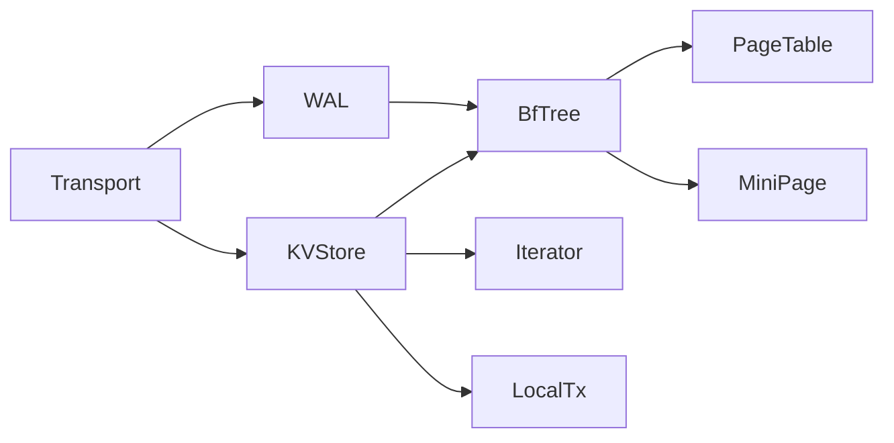

# M2 存储引擎层预研报告

> **归档日期**: 2026-02-22
> **归档原因**: 文档拆分为三个独立文档，便于维护和查阅
>
> **拆分后的文档**：
> | 文档 | 说明 |
> |------|------|
> | [Interface 定义](../2026-02-21_spike_m2-storage-engine-interface.md) | 接口设计 |
> | [实现方案](../2026-02-21_spike_m2-storage-engine-implement.md) | 技术实现 |
> | [实施路线图](../2026-02-21_spike_m2-storage-engine-roadmap.md) | 时间规划 |
>
> **推荐直接查看拆分后的文档**，以下为原始文档内容（仅供参考）。

---

> **预研类型**: Spike
> **创建日期**: 2026-02-21
> **最后更新**: 2026-02-22（添加存储引擎分层策略决策）
> **分支**: `spike/m2-storage-engine`
> **状态**: 📦 已归档

---

## 〇、核心架构决策

### 0.1 存储引擎分层策略：Metadata KV vs External KV

> **核心结论**：**不需要统一存储实现**（最优解）
> - **Metadata KV**：使用 `sync.Map`（极致 O(1) 读写性能）
> - **External KV**：使用 Bf-Tree（有序存储、范围查询、持久化）
> - **统一接口**：只需封装统一的 KV 接口，底层实现各司其职

#### 极简理由（适配 NexKV 场景）

| 维度 | Metadata（元数据） | External KV（业务数据） | 统一的弊端 |
|------|-------------------|------------------------|-----------|
| **数据特征** | 量小（<1000条）、读写高频、结构简单 | 量大、需范围查询、持久化、高内存利用率 | Metadata 用 Bf-Tree 会引入不必要的节点分裂/合并开销 |
| **核心诉求** | 极致读写性能（O(1)）、简单易用 | 有序存储、范围查询、崩溃恢复、低内存碎片 | 失去 map 的 O(1) 优势，元数据操作变慢 |
| **工程复杂度** | 无持久化/事务需求，逻辑简单 | 需 WAL、并发控制、持久化，逻辑复杂 | 元数据层被迫引入 Bf-Tree 的复杂逻辑，增加 bug 风险 |

#### 为什么不统一？

1. **场景适配才是核心**：
   - Metadata 典型场景：集群节点列表、配置参数、Bf-Tree 元信息（阶数/ε因子）→ map 的 O(1) 最优
   - External KV 典型场景：海量有序存储、范围查询（scan）→ Bf-Tree 的有序性优势不可替代

2. **统一的唯一"好处"是代码复用，但得不偿失**：
   - 强行统一需为 Metadata 适配 Bf-Tree 的 WAL/锁/恢复逻辑
   - Metadata 根本不需要这些特性，反而 map 代码更简洁

3. **折中方案**：封装**统一 KV 接口**
   ```go
   // 统一接口，底层实现各司其职
   type KVStore interface {
       Get(ctx context.Context, key []byte) ([]byte, error)
       Set(ctx context.Context, key, value []byte) error
       Delete(ctx context.Context, key []byte) error
       Scan(ctx context.Context, start, end []byte) (Iterator, error)
   }
   ```

#### 实现映射

| 存储类型 | 接口 | 实现位置 | 底层存储 |
|---------|------|---------|---------|
| **Metadata KV** | `KVStore` | `internal/infrastructure/storage/metadata/` | `sync.Map` + MVStore |
| **External KV** | `KVStore` | `internal/infrastructure/storage/bftree/` | Bf-Tree（B+树变体） |

---

## 一、术语澄清：Bf-Tree vs B 树变体

### 0.1 NexKV 选择的 Bf-Tree（Buffer-Friendly Tree）

**定义**：微软研究院开发的读写优化并发 B+ 树变体

**论文**：[Bf-Tree: A Modern Read-Write-Optimized Concurrent Range Index (VLDB 2024)](https://badrish.net/papers/bftree-vldb2024.pdf)

**核心特性**：
| 特性 | 说明 |
|------|------|
| **Mini-Page** | 增量更新页面（64B-4KB 多级），减少小写入开销 |
| **Delta Chain** | Mini-Page 链式结构，支持多版本增量 |
| **Promotion** | 概率提升 Mini-Page → Full-Page，平衡读写 |
| **Lock-free SMR** | 无锁安全内存回收（MVP 简化为 sync.RWMutex） |
| **WAL 持久化** | 预写日志支持崩溃恢复 |

**性能目标**（Rust 原版 vs Go MVP）：
| 操作 | Rust 原版 | Go MVP P0 | Go MVP P1 | Go MVP P2 |
|------|----------|----------|----------|----------|
| 点查询 | 10μs | < 30μs | < 25μs | < 20μs |
| 写入吞吐 | 200万 ops/s | > 50万 | > 75万 | > 100万 |

### 0.2 其他 B 树变体对比

| 名称 | 全称 | 核心特征 | 典型场景 |
|------|------|----------|----------|
| **B+ Tree** | B+树 | 叶子节点链表串联，内部节点仅存 key | 数据库索引、分布式 KV |
| **B* Tree** | B*树 | 节点分裂时优先重分配，减少碎片 | 磁盘存储优化 |
| **Bε-Tree** | Bε树（ε-optimized） | 基于 ε 因子优化节点填充率 | 高内存利用率 KV |
| **BF+Tree** | Bloom Filter + B树 | B 树前置布隆过滤器 | 海量数据快速过滤 |
| **Bf-Tree** | Buffer-Friendly Tree | Mini-Page + Delta Chain + Promotion | 高并发读写优化（NexKV 选择） |

### 0.3 NexKV 选择 Bf-Tree 的理由

| 维度 | B+ Tree | Bε-Tree | BF+Tree | **Bf-Tree（选择）** |
|------|---------|---------|---------|-------------------|
| **写入性能** | 中 | 中 | 中 | **高**（Mini-Page 增量写） |
| **读取性能** | 高 | 高 | 高（BF 过滤） | **高**（内存优先） |
| **范围查询** | ✅ 优秀 | ✅ 优秀 | ✅ 优秀 | ✅ O(log N + M) |
| **并发控制** | 复杂 | 复杂 | 复杂 | **可简化**（RWMutex MVP） |
| **持久化** | 需自研 | 需自研 | 需自研 | **WAL 可复用** |
| **适用场景** | 通用 | 内存优化 | 过滤优化 | **分布式 KV** |

---

## 一、预研目标

评估 M2 存储引擎层的实施方案，重点分析：
1. Bf-Tree MVP 实施计划与路线图的协调
2. 现有 WAL 实现的复用可行性
3. 接口设计与依赖关系

---

## 二、现有资源盘点

### 2.1 已完成的预研文档

| 文档 | 位置 | 状态 |
|------|------|------|
| Bf-Tree MVP 实施计划 | `./bftree/2026-02-09_bftree-mvp-implementation-plan.md` | ✅ 已批准 |
| ADR 006 批准文档 | `../02_design/decisions/006_bftree_mvp_approval.md` | ✅ 已批准 |
| Bf-Tree WAL 分析（Rust） | `./bftree/2026-02-09_spike_rust_bftree-wal-analysis.md` | 🔄 进行中 |
| Bf-Tree 源码分析（Rust） | `./bftree/2026-02-09_spike_rust_bftree-source-code-analysis.md` | ✅ 完成 |
| Bf-Tree 研究总结 | `./bftree/2026-02-09_bftree-research-summary.md` | ✅ 完成 |

### 2.2 现有 WAL 实现

| 文件 | 功能 | 复用评估 |
|------|------|---------|
| `internal/wal/wal.go` | WAL 核心实现 | ✅ 可复用 |
| `internal/wal/wal_batch.go` | 批量写入 | ✅ 可复用 |
| `internal/wal/wal_rotation.go` | 日志轮转 | ✅ 可复用 |
| `internal/wal/wal_recover.go` | 崩溃恢复 | ✅ 可复用 |

---

## 三、时间线对比分析

### 3.1 路线图 M2（6 周）

| 周次 | 任务 | 交付物 |
|------|------|--------|
| Week 5 | Bf-Tree KVStore 实现 | `bftree_store_impl.go` |
| Week 6 | WAL 实现（同步模式） | `wal_impl.go` |
| Week 7 | WAL 异步模式 + BTree | `wal_impl.go`, `btree_impl.go` |
| Week 8 | Iterator + LocalTx | `iterator_impl.go`, `local_tx_impl.go` |
| Week 9 | BlockDevice + LocalStorage | `local_storage_impl.go` |
| Week 10 | CloudStorage + DistributedStorage | `cloud_*.go` |

### 3.2 Bf-Tree MVP 计划（10-12 周）

| 阶段 | 周次 | 任务 |
|------|------|------|
| Phase 1 | 1-2 | 基础设施 + 表元数据接口 |
| M2 | 3-5 | 核心节点（LeafNode/InnerNode/PageTable） |
| Phase 3 | 6-8 | 树结构 + CRUD + 范围扫描 |
| Phase 4 | 9-10 | Mini-Page 机制 |
| Phase 5 | 11-12 | 持久化（WAL/Snapshot） |
| Phase 6 | 13-15 | 测试与优化 |

### 3.3 差异分析

| 维度 | 路线图 M2 | Bf-Tree MVP | 建议 |
|------|---------------|-------------|------|
| **周期** | 6 周 | 10-12 周 | 采用 MVP 周期 |
| **范围** | 仅存储引擎 | 完整 Bf-Tree | MVP 更全面 |
| **WAL** | 新实现 | 扩展现有 | ✅ 复用现有 |
| **Mini-Page** | 未提及 | 3 级 | MVP 方案 |

**结论**：以 Bf-Tree MVP 计划为主，复用现有 WAL 实现。

---

## 四、接口设计

### 4.1 Domain 层接口定义

**位置**: `internal/domain/service/storage.go`

```go
// KVStore 单机 KV 存储接口
type KVStore interface {
    // 基础 CRUD
    Get(ctx context.Context, key []byte) ([]byte, error)
    Put(ctx context.Context, key, value []byte) error
    Delete(ctx context.Context, key []byte) error

    // 批量操作
    BatchGet(ctx context.Context, keys [][]byte) (map[string][]byte, error)
    BatchPut(ctx context.Context, kvs []KeyValue) error

    // 范围查询
    Scan(start, end []byte) (Iterator, error)
}

// Iterator 迭代器接口
type Iterator interface {
    Next() bool
    Key() []byte
    Value() []byte
    Error() error
    Close()
}

// LocalTx 本地事务接口
type LocalTx interface {
    Begin() error
    Commit() error
    Rollback() error
    Get(key []byte) ([]byte, error)
    Put(key, value []byte) error
    Delete(key []byte) error
}
```

### 4.2 依赖关系



---

## 五、实施建议

### 5.1 分阶段实施

| 阶段 | 内容 | 周期 | 优先级 |
|------|------|------|--------|
| **M2.1** | Bf-Tree 核心（无持久化） | 4 周 | P0 |
| **M2.2** | WAL 集成 + Snapshot | 3 周 | P0 |
| **M2.3** | Iterator + LocalTx | 2 周 | P1 |
| **M2.4** | BlockDevice 抽象 | 2 周 | P1 |
| **M2.5** | Cloud/Distributed Storage | 2 周 | P2 |

**总计**: 10-13 周（与 MVP 计划一致）

### 5.2 关键决策点

| 决策 | 选项 | 建议 |
|------|------|------|
| **并发控制** | Lock-free SMR vs sync.RWMutex | sync.RWMutex（MVP） |
| **内存管理** | 手动 vs GC | sync.Pool + GC（MVP） |
| **Mini-Page 级别** | 3 级 vs 6+ 级 | 3 级（MVP） |
| **WAL 实现** | 新写 vs 复用 | 复用现有 WAL |

---

## 六、风险与缓解

| 风险 | 可能性 | 影响 | 缓解措施 |
|------|--------|------|---------|
| Bf-Tree 移植复杂度超预期 | 中 | 高 | 采用简化 MVP 策略 |
| 性能不达标 | 中 | 中 | 分级性能目标（P0/P1/P2） |
| WAL 集成困难 | 低 | 中 | 现有 WAL 已验证 |
| 内存占用过高 | 中 | 中 | Mini-Page 分级管理 |

---

## 七、现有资源详细分析

### 7.1 Bf-Tree MVP 实施计划（已批准）

| 阶段 | 周次 | 任务 | 交付物 |
|------|------|------|--------|
| **Phase 1** | Week 1-2 | 基础设施 + 表元数据接口 | `config.go`, `bits.go` |
| **M2** | Week 2-4 | 核心节点（LeafNode/InnerNode/PageTable） | `leaf_node.go`, `inner_node.go`, `pagetable.go` |
| **Phase 3** | Week 4-6 | 树结构 + CRUD + 范围扫描 | `tree.go`, `scan.go` |
| **Phase 4** | Week 6-8 | Mini-Page 机制（3 级） | `mini_page.go` |
| **Phase 5** | Week 8-10 | 持久化（WAL/Snapshot） | `bftree_wal.go`, `snapshot.go` |
| **Phase 6** | Week 10-12 | 测试与优化 | `*_test.go`, `benchmark_test.go` |

**关键简化策略**：
- 并发控制：`sync.RWMutex`（替代 Lock-free SMR）
- 内存管理：`sync.Pool` + GC（替代 FreeList）
- Mini-Page：3 级（64B, 512B, 2KB）
- WAL：扩展现有实现

### 7.2 WAL 复用方案

**现有 WAL 位置**：`internal/wal/wal.go`

**扩展策略**：
```go
// 扩展 WALType（推荐方案 A）
const (
    WALTypePut WALType = iota
    WALTypeDelete
    WALTypeCheckpoint
    WALTypeInsertMiniPage      // 新增
    WALTypeDeleteMiniPage      // 新增
    WALTypeUpgradeToFullPage   // 新增
)
```

**优点**：
- ✅ 复用现有 WAL 实现（已有批量写入、日志轮转、崩溃恢复）
- ✅ 保持一致性
- ✅ 无需重写

### 7.3 性能目标（分级验收）

| 操作 | P0（最低） | P1（推荐） | P2（理想） |
|------|-----------|-----------|-----------|
| **点查询** | < 30μs | < 25μs | < 20μs |
| **写入吞吐** | > 50万 ops/s | > 75万 ops/s | > 100万 ops/s |
| **范围查询** | O(log N + M) | O(log N + M) | O(log N + M) |

---

## 八、下一步行动

### 8.1 立即行动（Week 1）

1. **创建 Pre 文档** - M2.1 Bf-Tree 核心实现
   - 参考：`./bftree/2026-02-09_bftree-mvp-implementation-plan.md`
   - 范围：Phase 1 + M2（基础设施 + 核心节点）

2. **定义接口** - `internal/domain/service/storage.go`
   ```go
   // KVStore 单机 KV 存储接口
   type KVStore interface {
       Get(ctx context.Context, key []byte) ([]byte, error)
       Put(ctx context.Context, key, value []byte) error
       Delete(ctx context.Context, key []byte) error
       Scan(start, end []byte) (Iterator, error)
   }
   ```

3. **搭建骨架** - 目录结构和基础类型定义
   ```
   internal/storage/bftree/
   ├── config.go        # 配置模块
   ├── bits.go          # 位操作工具
   ├── errors.go        # 错误定义
   ├── leaf_node.go     # 叶子节点
   ├── inner_node.go    # 内节点
   ├── pagetable.go     # 页面表
   └── tree.go          # BfTree 主结构
   ```

### 8.2 M2.1 详细任务（Week 1-4）

| 任务 | 优先级 | 预计时间 |
|------|--------|----------|
| Config 模块 | P0 | 1 天 |
| 位操作工具 | P0 | 2 天 |
| 表元数据接口集成 | P0 | 3 天 |
| LeafNode 实现 | P0 | 7 天 |
| InnerNode 实现 | P0 | 3 天 |
| 分片验证逻辑 | P0 | 2 天 |
| PageTable 存储 | P0 | 5 天 |

### 8.3 决策点

| 决策 | 选项 | 建议 | 状态 |
|------|------|------|------|
| **WAL 实现** | 新写 vs 复用 | ✅ 复用现有 WAL | 已确定 |
| **并发控制** | Lock-free SMR vs sync.RWMutex | sync.RWMutex（MVP） | 已确定 |
| **内存管理** | 手动 vs GC | sync.Pool + GC（MVP） | 已确定 |
| **Mini-Page 级别** | 3 级 vs 6+ 级 | 3 级（MVP） | 已确定 |

---

## 八、关联预研文档

### 8.1 Go B 树库对比实验

> **文档**: [Go B 树库对比实验 Spike](./2026-02-21_go-btree-comparison-spike.md)

**目标**: 对主流 Go B 树库进行性能对比，为 Bf-Tree 移植提供参考基准

**对比库**:
| 库 | 变形类型 | 选择理由 |
|----|----------|----------|
| `google/btree` | 标准B树 | 基准参考（官方实现） |
| `tidwall/btree` | B树/B+树 | 高性能候选 |
| `cznic/b` | B/B+/B*树 | 持久化+MVCC候选 |

**对比维度**:
- 性能基准（读写吞吐量、延迟）
- 内存占用
- 并发性能
- 功能特性（持久化、MVCC、事务）

---

## 九、参考文献

- `./bftree/2026-02-09_bftree-mvp-implementation-plan.md`
- `../02_design/decisions/006_bftree_mvp_approval.md`
- `./2026-02-18_spike-nexkv-ddd-roadmap.md`
- `internal/wal/wal.go`
- [google/btree](https://github.com/google/btree)
- [tidwall/btree](https://github.com/tidwall/btree)
- [cznic/b](https://github.com/cznic/b)

---

**文档版本**: v1.3
**创建日期**: 2026-02-21
**最后更新**: 2026-02-21
**维护者**: AI Agent
**状态**: 🔄 进行中
