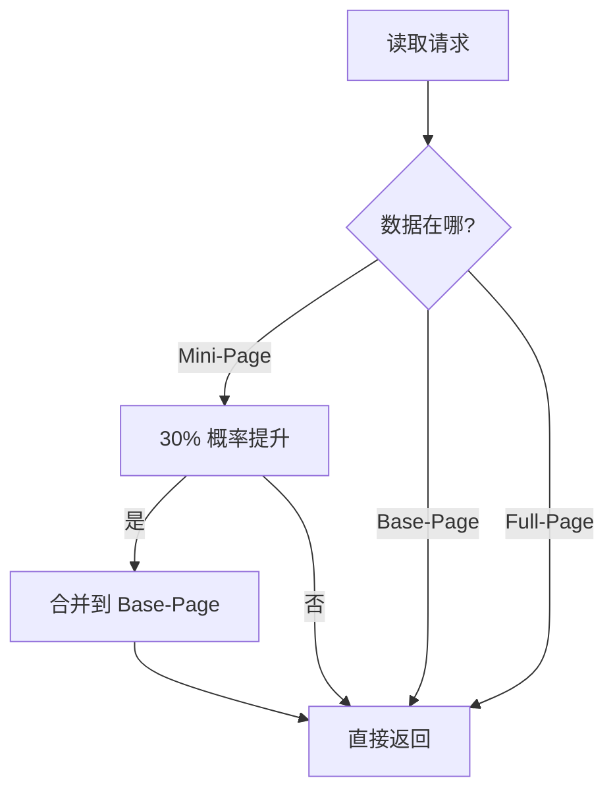
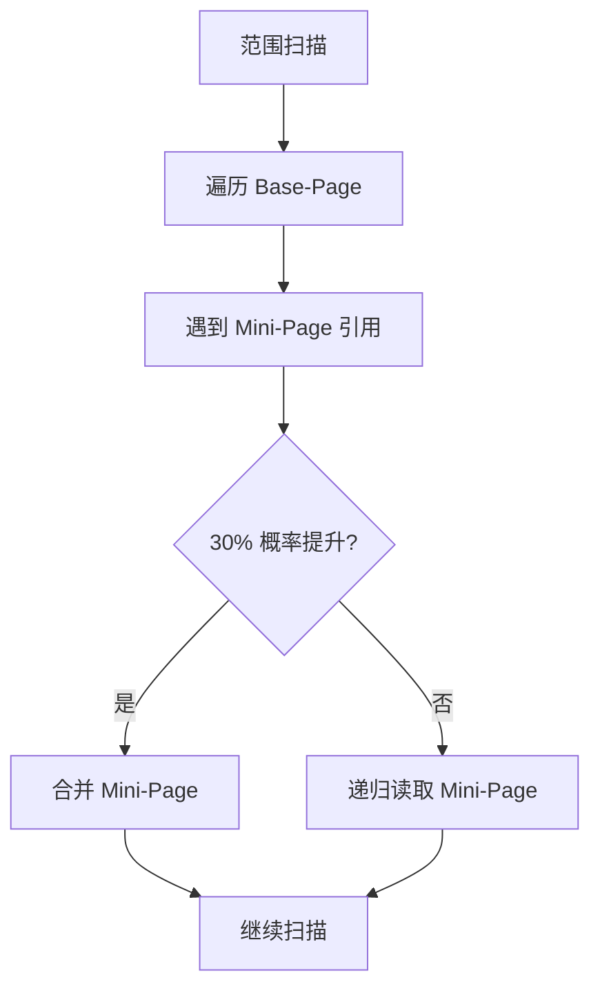
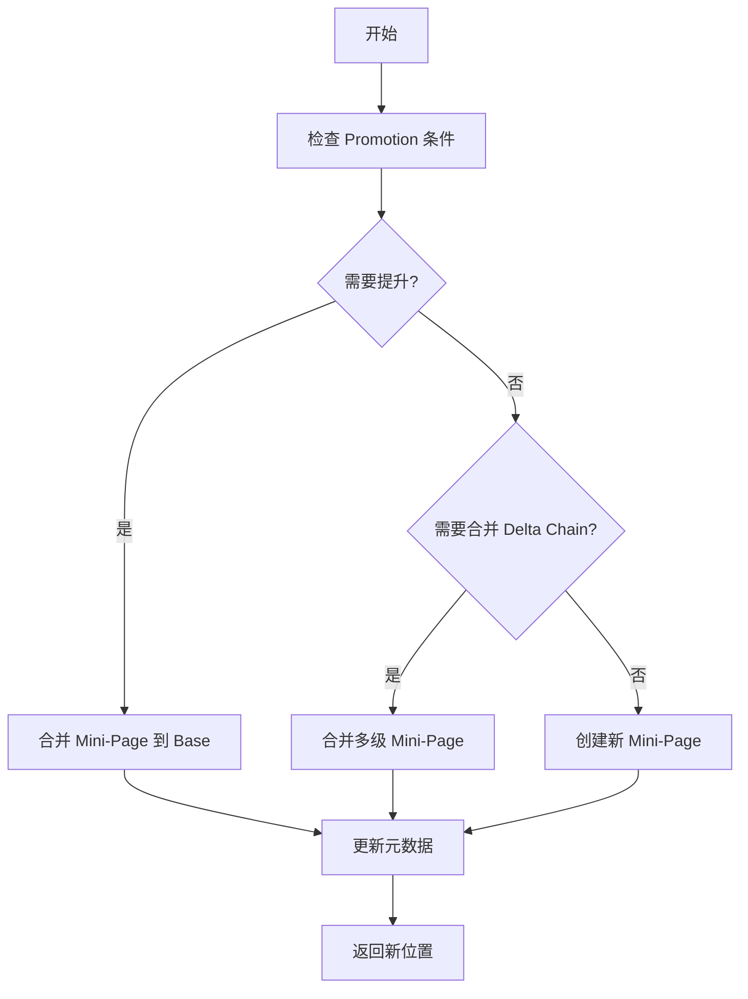
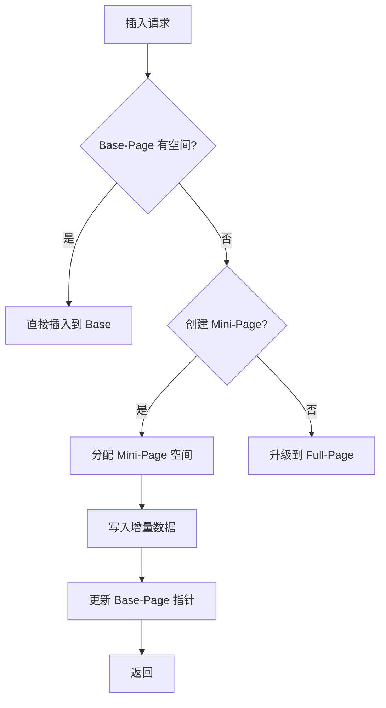

# Bf-Tree Delta Chain 与 Promotion 策略深度分析

> **预研究报告**
> **创建日期**: 2026-02-09
> **最后更新**: 2026-02-22（DDD 架构适配更新）
> **状态**: 已完成（已修订）
> **源码位置**: `/Users/zhangcz/ws/rust/src/github.com/microsoft/bf-tree/src/range_scan.rs`
> **参考文档**: `docs/07_spike/2026-02-18_spike-nexkv-ddd-interface.md`

---

## 📋 研究目标

深入分析 Bf-Tree 的 Delta Chain（增量链）管理机制和 Promotion（提升）策略，为 Go 移植提供核心算法实现依据。

---

## 一、Delta Chain 概述

### 1.1 核心概念

**Delta Chain** 是 Bf-Tree 的核心创新机制，用于管理 **Mini-Page 增量更新链**。

**重要修正**：Delta Chain 是 **单向链表结构**，不是树状结构。

```
正确结构：单向链表
━━━━━━━━━━━━━━━━━━━━━━━━━━━━━━━━━━━━━━━━

Base-Page (4KB)
    ↓
    └─ Mini-Page 1 (512B)  ← 第一层增量
        ↓
        └─ Mini-Page 2 (256B)  ← 第二层增量
            ↓
            └─ Mini-Page 3 (128B)  ← 第三层增量

错误结构：树状分支（不存在）
━━━━━━━━━━━━━━━━━━━━━━━━━━━━━━━━━━━━━━━━

Base-Page (4KB)
    ↓
    ├─ Mini-Page 1 (512B)  ← 这是不可能的！
    │   ↓
    │   └─ Mini-Page 2 (256B)
    │
    └─ Mini-Page 4 (1KB)  ← 这也是不可能的！
```

**关键特点**：
- ✅ **增量存储**：只存储变更部分，不复制整个页面
- ✅ **单向链表**：每个 Base-Page 只有一个 Delta Chain
- ✅ **懒合并**：按需合并，避免不必要的写放大
- ✅ **并发友好**：使用 Lock-free SMR 进行并发控制

---

### 1.2 数据结构

**位置**：`src/range_scan.rs:40-48`

```rust
pub(crate) enum ScanPosition {
    Base(usize),              // Base-Page 位置
    Full(usize),              // Full-Page 位置
    Mini(MiniPageNextLevel),  // Mini-Page 位置
}
```

**MiniPageNextLevel 指针**：

```rust
pub(crate) struct MiniPageNextLevel {
    val: usize,
}

impl MiniPageNextLevel {
    pub(crate) fn new(val: usize) -> Self { Self { val } }
    pub(crate) fn as_offset(&self) -> usize { self.val }
    pub(crate) fn is_null(&self) -> bool { self.val == usize::MAX }
    pub(crate) fn null() -> Self { Self { val: usize::MAX } }
}
```

**Delta Chain 遍历**：

```rust
// 伪代码
fn traverse_delta_chain(position: &ScanPosition) {
    match position {
        ScanPosition::Mini(next_level) => {
            if !next_level.is_null() {
                // 递归遍历下一层
                traverse_delta_chain(&ScanPosition::Mini(
                    MiniPageNextLevel::new(next_level.as_offset())
                ));
            }
            // 处理当前层
        }
        _ => { /* 处理 Base/Full */ }
    }
}
```

---

## 二、Promotion 策略

### 2.1 两种 Promotion 机制

**位置**：`src/tree.rs`

| 机制 | 函数 | 默认概率 | 触发场景 |
|------|------|---------|---------|
| **Read Promotion** | `should_promote_read()` | 30% | 点查询命中 |
| **Scan Promotion** | `should_promote_scan_page()` | 30% | 范围扫描 |

---

### 2.1.1 Read Promotion

**源码**：`src/tree.rs`

```rust
pub(crate) fn should_promote_read(&self) -> bool {
    get_rng().gen_range(0..100) < self.config.read_promotion_rate.load(Ordering::Relaxed)
}
```

**工作流程**：



**参数调优**：

| 场景 | 建议值 | 理由 |
|------|--------|------|
| **写多读少** | 10-20% | 减少合并开销 |
| **读写均衡** | 30% | 默认值，论文推荐 |
| **读多写少** | 50-70% | 提升读取性能 |

---

### 2.1.2 Scan Promotion

**源码**：`src/tree.rs`

```rust
pub(crate) fn should_promote_scan_page(&self) -> bool {
    get_rng().gen_range(0..100) < self.config.scan_promotion_rate.load(Ordering::Relaxed)
}
```

**工作流程**：



**扫描优化**：

1. **懒合并**：只在扫描时按需合并
2. **批量处理**：一次扫描可合并多个 Mini-Page
3. **概率控制**：避免过度合并

---

### 2.2 Promotion 实现细节

**核心函数**：`src/range_scan.rs:364-445`

```rust
fn promote_or_merge_mini_page<'a>(
    tree: &'a BfTree,
    key: &[u8],
    leaf: &mut LeafEntryXLocked<'a>,
    parent: PageID,
) -> Result<ScanPosition, TreeError>
```

**简化流程**：



---

## 三、Circular Buffer 机制

### 3.1 核心概念

**Circular Buffer（环形缓冲区）** 是 Bf-Tree 管理 Mini-Page 内存分配的核心机制。

**为什么需要 Circular Buffer？**

| 问题 | 传统方案 | Circular Buffer 方案 |
|------|---------|---------------------|
| **内存碎片** | 严重 | 无碎片 |
| **分配开销** | 每次 malloc | O(1) 指针移动 |
| **局部性** | 差 | 好（连续内存） |
| **回收复杂度** | 高 | 低（自动覆盖） |

### 3.2 数据结构

**位置**：`src/buffer.rs`（简化版）

```rust
pub(crate) struct CircularBuffer {
    buffer: *mut u8,           // 起始地址
    capacity: usize,           // 总容量（32MB）
    head: atomic::AtomicUsize, // 写指针
    tail: atomic::AtomicUsize, // 读指针
    mask: usize,               // 容量掩码（需为 2 的幂）
}

impl CircularBuffer {
    pub(crate) fn allocate(&self, size: usize) -> Option<*mut u8> {
        // 原子获取并移动 head 指针
        let old_head = self.head.fetch_add(size, Ordering::AcqRel);
        let new_head = old_head + size;

        // 检查是否越界
        if new_head > self.capacity {
            // 回滚
            self.head.fetch_sub(size, Ordering::AcqRel);
            return None;
        }

        // 返回地址（使用掩码实现环形）
        Some(unsafe { self.buffer.add(old_head & self.mask) })
    }
}
```

### 3.3 Go 移植实现

```go
package bftree

import (
    "sync/atomic"
    "unsafe"
)

type CircularBuffer struct {
    buffer    unsafe.Pointer // 起始地址
    capacity  uint64         // 总容量（32MB）
    head      atomic.Uint64  // 写指针
    tail      atomic.Uint64  // 读指针
    mask      uint64         // 容量掩码
}

func NewCircularBuffer(capacity int) *CircularBuffer {
    // 确保容量是 2 的幂
    powerOfTwo := 1
    for powerOfTwo < capacity {
        powerOfTwo *= 2
    }

    buffer := make([]byte, powerOfTwo)

    return &CircularBuffer{
        buffer:   unsafe.Pointer(&buffer[0]),
        capacity: uint64(powerOfTwo),
        mask:     uint64(powerOfTwo - 1),
    }
}

func (cb *CircularBuffer) Allocate(size uint64) unsafe.Pointer {
    for {
        oldHead := cb.head.Load()
        newHead := oldHead + size

        // 检查是否越界
        if newHead > cb.capacity {
            // 尝试回绕（环形特性）
            if newHead-cb.capacity > cb.tail.Load() {
                // 缓冲区满
                return nil
            }
            // 从头开始分配
            newHead = size
        }

        // CAS 更新 head 指针
        if cb.head.CompareAndSwap(oldHead, newHead) {
            // 返回地址（使用掩码实现环形）
            offset := oldHead & cb.mask
            return unsafe.Pointer(uintptr(cb.buffer) + uintptr(offset))
        }
        // CAS 失败，重试
    }
}

func (cb *CircularBuffer) Free(ptr unsafe.Pointer, size uint64) {
    // 简化实现：仅移动 tail 指针
    // 实际实现需要更复杂的回收逻辑
    // 这里依赖 Epoch-based SMR 进行延迟回收
}
```

### 3.4 与 Delta Chain 的集成

```go
func (t *BfTree) allocateMiniPage(size int) (*MiniPage, error) {
    // 从 Circular Buffer 分配
    ptr := t.buffer.Allocate(uint64(size))
    if ptr == nil {
        // 缓冲区满，触发合并
        t.mergeDeltaChains()
        ptr = t.buffer.Allocate(uint64(size))
        if ptr == nil {
            return nil, ErrBufferFull
        }
    }

    // 创建 Mini-Page
    data := unsafe.Slice((*byte)(ptr), size)
    return &MiniPage{
        data:  data,
        size:  size,
    }, nil
}
```

---

## 四、Lock-free 并发控制

### 4.1 Epoch-based SMR

**位置**：`src/epoch.rs`（简化版）

Bf-Tree 使用 **Epoch-based Safe Memory Reclamation** 实现 Lock-free 并发控制。

**核心概念**：

```
时间线：
━━━━━━━━━━━━━━━━━━━━━━━━━━━━━━━━━━━━━━━━

Epoch 1: [Thread A 进入] ────────── [Thread A 退出]
           ↓                        ↓
         记录 e1                  尝试回收 e1 的内存

Epoch 2:           [Thread B 进入] ────────── [Thread B 退出]
                    ↓                        ↓
                  记录 e2                  尝试回收 e2 的内存

Epoch 3:                     [Thread C 进入] ────────
                             ↓
                           记录 e3

回收规则：
- 当所有线程都离开 Epoch 1 时，可以安全回收 Epoch 1 的内存
- 使用全局 epoch 计数器和本地 epoch 记录
```

### 4.2 Go 移植简化方案

**MVP 简化**：使用 `sync.RWMutex` 替代 Lock-free SMR

```go
package bftree

import "sync"

type EpochManager struct {
    mu     sync.RWMutex
    epoch  atomic.Uint64
}

func (em *EpochManager) Enter() uint64 {
    em.mu.Lock()
    defer em.mu.Unlock()
    return em.epoch.Add(1)
}

func (em *EpochManager) Exit(epoch uint64) {
    // MVP 简化：不实现延迟回收
    // 完整版需要跟踪所有活跃 epoch
}

func (em *EpochManager) TryReclaim(oldEpoch uint64) bool {
    em.mu.Lock()
    defer em.mu.Unlock()
    current := em.epoch.Load()
    return current > oldEpoch+2 // 确保所有线程都已离开
}
```

### 4.3 Promotion 期间的锁升级

**重要补充**：代码审查指出缺少锁升级流程说明

```go
func (t *BfTree) promoteMiniPageWithLock(pid PageID, mini *MiniPage) error {
    // 1. 获取读锁
    t.mu.RLock()
    base := t.loadBasePage(mini.basePageOffset)
    t.mu.RUnlock()

    // 2. 准备合并数据
    merged := base.Clone()
    for _, record := range mini.records {
        merged.Insert(record.Key(), record.Value())
    }

    // 3. 升级为写锁（关键步骤）
    t.mu.Lock()
    defer t.mu.Unlock()

    // 4. 验证 Base-Page 未被修改（乐观并发控制）
    currentBase := t.loadBasePage(mini.basePageOffset)
    if currentBase.Version() != base.Version() {
        // Base-Page 已被修改，重试
        return t.promoteMiniPageWithLock(pid, mini)
    }

    // 5. 更新 PageTable
    t.storage.Put(pid, &PageLocation{
        Type: LocationFull,
        Full: merged,
    })

    // 6. 回收 Mini-Page（通过 Epoch Manager）
    t.epochMgr.TryReclaim(mini.epoch)

    return nil
}
```

---

## 五、Delta Chain 管理

### 3.1 创建 Mini-Page

**触发条件**：

1. **Base-Page 已满**：无法直接插入
2. **避免写放大**：小批量更新
3. **并发隔离**：不同操作的隔离

**创建流程**：



**大小选择策略**：

| 数据量 | 选择大小 | 理由 |
|--------|---------|------|
| < 100B | 64B | 最小开销 |
| 100B-500B | 512B | 平衡点 |
| 500B-2KB | 1KB-2KB | 接近阈值 |
| > 2KB | 升级 Full-Page | 避免 Delta Chain 过深 |

---

### 3.2 Delta Chain 合并

**合并触发条件**：

1. **Promotion 命中**：30% 概率
2. **Delta Chain 过深**：超过阈值（默认 3 层）
3. **内存压力**：需要回收 Mini-Page

**合并算法**：

```rust
// 伪代码
fn merge_delta_chain(base: &LeafNode, chain: &Vec<MiniPage>) -> LeafNode {
    let mut merged = base.clone();

    // 按顺序应用所有 Mini-Page
    for mini in chain.iter().rev() {
        for record in mini.records.iter() {
            match record.op_type {
                OpTypeInsert => merged.insert(record.key, record.value),
                OpTypeDelete => merged.delete(record.key),
                _ => {}
            }
        }
    }

    merged
}
```

**合并策略对比**：

| 策略 | 优点 | 缺点 | 适用场景 |
|------|------|------|---------|
| **惰性合并** | 减少写放大 | 读取可能慢 | 写多读少 |
| **激进合并** | 读取快 | 写放大大 | 读多写少 |
| **概率合并** | 平衡 | 需要调参 | 通用场景 |

---

## 四、Go 移植实现

### 4.1 Promotion 策略实现

```go
package bftree

import (
    "math/rand"
    "sync/atomic"
)

type PromotionStrategy struct {
    readRate atomic.Uint32 // 0-100
    scanRate atomic.Uint32 // 0-100
}

func (p *PromotionStrategy) ShouldPromoteRead() bool {
    rate := p.readRate.Load()
    if rate == 0 {
        return false
    }
    return rand.Intn(100) < int(rate)
}

func (p *PromotionStrategy) ShouldPromoteScan() bool {
    rate := p.scanRate.Load()
    if rate == 0 {
        return false
    }
    return rand.Intn(100) < int(rate)
}

func (p *PromotionStrategy) SetReadRate(rate uint32) {
    p.readRate.Store(rate)
}

func (p *PromotionStrategy) SetScanRate(rate uint32) {
    p.scanRate.Store(rate)
}
```

---

### 4.2 Delta Chain 管理

**修正后的 DeltaChain 结构**（单向链表）：

```go
package bftree

// MiniPageNode 单向链表节点
type MiniPageNode struct {
    mini     *MiniPage
    next     *MiniPageNode // 指向下一个 Mini-Page
    epoch    uint64        // 用于 SMR 回收
}

// DeltaChain 单向链表结构的 Delta Chain
type DeltaChain struct {
    basePage  *LeafNode
    head      *MiniPageNode // 链表头（最新的 Mini-Page）
    tail      *MiniPageNode // 链表尾（最老的 Mini-Page）
    depth     int           // 当前深度
    maxDepth  int
    mu        sync.RWMutex
}

func NewDeltaChain(base *LeafNode, maxDepth int) *DeltaChain {
    return &DeltaChain{
        basePage: base,
        maxDepth: maxDepth,
    }
}

// Append 在链表尾部添加新的 Mini-Page
func (dc *DeltaChain) Append(mini *MiniPage) error {
    dc.mu.Lock()
    defer dc.mu.Unlock()

    if dc.depth >= dc.maxDepth {
        return ErrDeltaChainTooDeep
    }

    node := &MiniPageNode{
        mini:  mini,
        next:  nil,
        epoch: uint64(time.Now().UnixNano()),
    }

    if dc.tail == nil {
        // 空链表
        dc.head = node
        dc.tail = node
    } else {
        // 添加到尾部
        dc.tail.next = node
        dc.tail = node
    }

    dc.depth++
    return nil
}

// Merge 合并整个 Delta Chain 到 Base-Page
// 注意：需要从 tail（最老）到 head（最新）按顺序应用
func (dc *DeltaChain) Merge() *LeafNode {
    dc.mu.RLock()
    defer dc.mu.RUnlock()

    merged := dc.basePage.Clone()

    // 从 tail（最老）开始，正向遍历到 head（最新）
    current := dc.tail
    for current != nil {
        mini := current.mini
        for _, record := range mini.records {
            switch record.OpType() {
            case OpTypeInsert:
                merged.Insert(record.Key(), record.Value())
            case OpTypeDelete:
                merged.Delete(record.Key())
            }
        }
        current = current.next // 注意：next 指向更新的节点
    }

    return merged
}

// ShouldMerge 判断是否需要合并
func (dc *DeltaChain) ShouldMerge(promotion *PromotionStrategy) bool {
    dc.mu.RLock()
    defer dc.mu.RUnlock()

    // 检查深度
    if dc.depth >= dc.maxDepth {
        return true
    }

    // 检查 Promotion 概率
    return promotion.ShouldPromoteRead()
}

// Clear 清空链表（用于合并后）
func (dc *DeltaChain) Clear() {
    dc.mu.Lock()
    defer dc.mu.Unlock()

    dc.head = nil
    dc.tail = nil
    dc.depth = 0
}
```

---

### 4.3 Mini-Page 升级逻辑

```go
package bftree

func (t *BfTree) insertWithDeltaChain(key, value []byte) error {
    pid := t.findLeafNode(key)
    loc, _ := t.storage.Get(pid)

    switch loc.Type {
    case LocationBase:
        // 尝试直接插入 Base-Page
        base := t.loadBasePage(loc.Base)
        err := base.Insert(key, value)
        if err == nil {
            return nil
        }

        // Base-Page 已满，创建 Mini-Page
        return t.createMiniPage(pid, key, value)

    case LocationMini:
        // 尝试插入到现有 Mini-Page
        mini := loc.Mini
        err := mini.Insert(key, value)
        if err == nil {
            return nil
        }

        // 检查是否需要提升
        if t.promotion.ShouldPromoteRead() {
            return t.promoteMiniPage(pid, mini)
        }

        // 创建新 Mini-Page（形成 Delta Chain）
        return t.appendDeltaChain(pid, mini, key, value)

    case LocationFull:
        // Full-Page，需要分裂
        return t.splitNode(pid, loc.Full, key, value)
    }

    return nil
}

func (t *BfTree) promoteMiniPage(pid PageID, mini *MiniPage) error {
    // 1. 加载 Base-Page
    base := t.loadBasePage(mini.basePageOffset)

    // 2. 合并 Mini-Page 到 Base-Page
    for _, record := range mini.records {
        base.Insert(record.Key(), record.Value())
    }

    // 3. 更新 PageTable
    t.storage.Put(pid, &PageLocation{
        Type: LocationFull,
        Full: base,
    })

    // 4. 回收 Mini-Page
    t.pool.Put(mini.data)

    return nil
}
```

---

## 五、性能优化建议

### 5.1 Promotion Rate 调优

**自动调优算法**：

```go
type AdaptivePromotion struct {
    readCount   atomic.Uint64
    promoteCount atomic.Uint64
    currentRate atomic.Uint32
}

func (a *AdaptivePromotion) updateRate() {
    reads := a.readCount.Load()
    promotes := a.promoteCount.Load()

    if reads == 0 {
        return
    }

    rate := (promotes * 100) / reads

    // 平滑调整
    current := a.currentRate.Load()
    diff := int(rate) - int(current)
    newRate := current + uint32(diff/10) // 10% 渐进调整

    a.currentRate.Store(newRate)
}
```

---

### 5.2 Delta Chain 深度控制

```go
type DeltaChainConfig struct {
    MaxDepth       int  // 最大深度（默认: 3）
    MergeThreshold int  // 合并阈值（默认: 2）
}

func (dc *DeltaChain) ShouldMerge(config *DeltaChainConfig) bool {
    if len(dc.miniPages) >= config.MaxDepth {
        return true
    }

    if len(dc.miniPages) >= config.MergeThreshold {
        // 检查总大小
        totalSize := 0
        for _, mini := range dc.miniPages {
            totalSize += mini.Size()
        }

        // 如果总大小超过 Base-Page 的 50%，触发合并
        if totalSize > dc.basePage.Size()/2 {
            return true
        }
    }

    return false
}
```

---

### 5.3 内存优化

**Mini-Page 对象池**：

```go
func (t *BfTree) getMiniPage(size int) *MiniPage {
    // 从对象池获取
    if buf := t.pool.Get(); buf != nil {
        data := buf.([]byte)
        if len(data) >= size {
            return &MiniPage{
                data: data[:size],
            }
        }
    }

    // 分配新的
    return &MiniPage{
        data: make([]byte, size),
    }
}

func (t *BfTree) putMiniPage(mini *MiniPage) {
    // 归还到对象池
    t.pool.Put(mini.data)
}
```

---

## 六、测试策略

### 6.1 单元测试

```go
func TestDeltaChain(t *testing.T) {
    base := NewLeafNode(4096)
    base.Insert([]byte("key1"), []byte("value1"))

    chain := NewDeltaChain(base, 3)

    // 添加 Mini-Page
    mini1 := NewMiniPage(0, 512)
    mini1.Insert([]byte("key2"), []byte("value2"))
    chain.Append(mini1)

    // 合并
    merged := chain.Merge()

    // 验证
    assert.Equal(t, 2, len(merged.records))
}
```

---

### 6.2 性能测试

```go
func BenchmarkPromotion(b *testing.B) {
    promo := &PromotionStrategy{}
    promo.SetReadRate(30)

    b.ResetTimer()
    for i := 0; i < b.N; i++ {
        promo.ShouldPromoteRead()
    }
}

func BenchmarkDeltaChainMerge(b *testing.B) {
    base := setupBasePage()
    chain := setupDeltaChain(base, 3)

    b.ResetTimer()
    for i := 0; i < b.N; i++ {
        chain.Merge()
    }
}
```

---

## 七、风险与缓解

### 技术风险

| 风险 | 影响 | 缓解措施 |
|------|------|---------|
| **Delta Chain 过深** | 读取性能下降 | 限制最大深度为 3 |
| **Promotion 频繁** | 写放大过高 | 自适应调优算法 |
| **内存占用高** | Mini-Page 泄漏 | 对象池 + 定期回收 |
| **合并开销大** | 性能抖动 | 批量合并 + 后台线程 |

---

## 八、总结

### 核心发现

1. **Delta Chain 是 Bf-Tree 的核心**：支持增量更新，减少写放大
2. **Promotion 是平衡机制**：30% 概率合并，平衡读写性能
3. **参数可调**：read_promotion_rate 和 scan_promotion_rate 可根据负载调整
4. **实现复杂度中等**：比 Lock-free SMR 简单，比 BTree 复杂

### Go 移植建议

| 组件 | 复杂度 | 时间估算 |
|------|--------|---------|
| **Promotion 策略** | ⭐⭐ | 2 天 |
| **Delta Chain 管理** | ⭐⭐⭐ | 1 周 |
| **Mini-Page 升级** | ⭐⭐⭐ | 1 周 |
| **合并优化** | ⭐⭐⭐⭐ | 3 天 |

---

**报告版本**: v1.1（代码审查后修订）
**创建日期**: 2026-02-09
**最后更新**: 2026-02-09（代码审查反馈后修订）
**维护者**: NexKV 开发团队
**状态**: 已完成（已修订）

---

## 变更历史

| 版本 | 日期 | 变更内容 | 变更人 |
|------|------|---------|--------|
| v1.0 | 2026-02-09 | 初始版本 | AI 分析团队 |
| v1.1 | 2026-02-09 | 代码审查反馈后修订：<br/>1. 修正 Delta Chain 结构（单向链表，非树状）<br/>2. 添加 Circular Buffer 机制说明<br/>3. 添加 Lock-free 并发控制说明<br/>4. 添加 Promotion 锁升级流程<br/>5. 修正 DeltaChain Go 结构设计 | AI 代码审查团队 |
