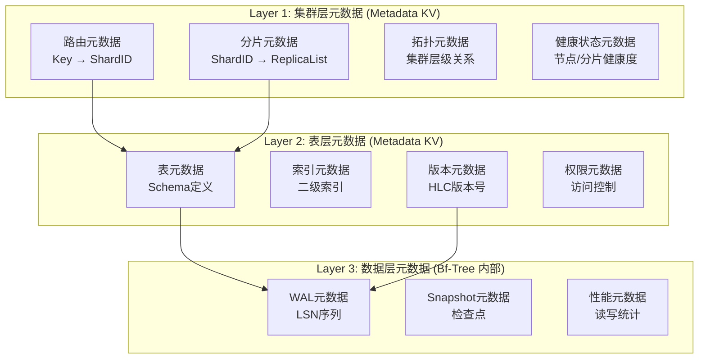
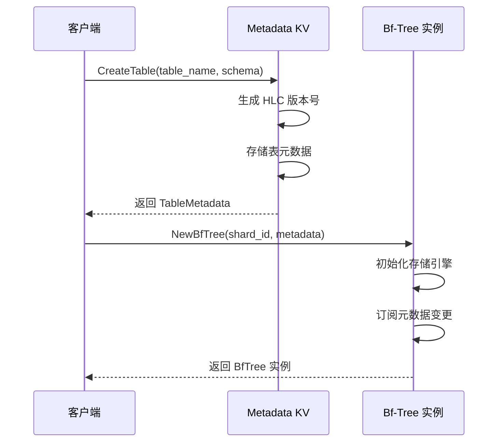
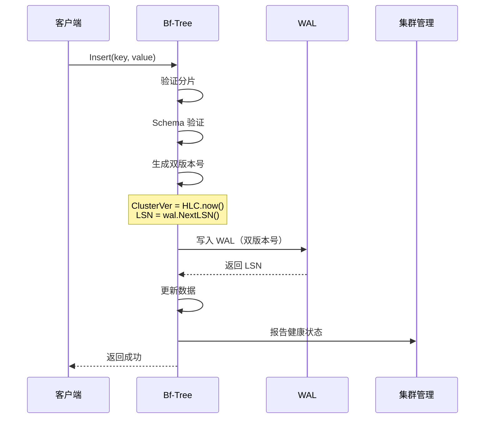
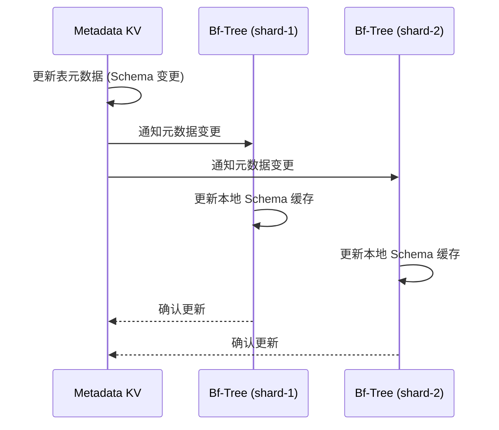
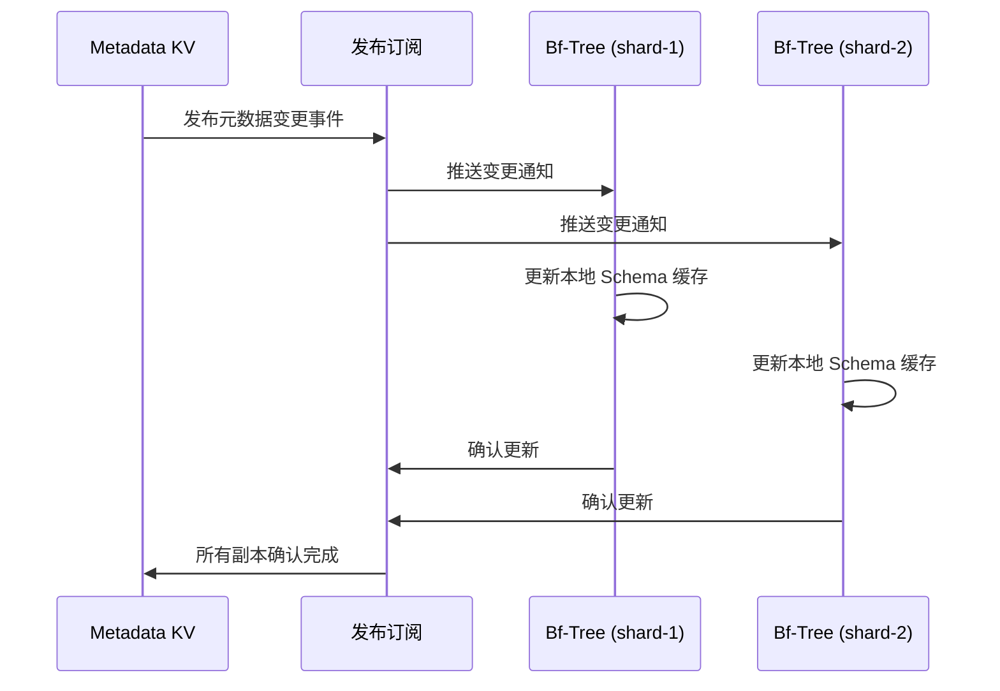

# Bf-Tree 元数据集成方案

> **技术方案文档**
> **创建日期**: 2026-02-09
> **最后更新**: 2026-02-22（DDD 架构适配更新）
> **状态**: ✅ 已批准
> **相关 ADR**: ADR 006 (Bf-Tree MVP)
> **参考文档**: `docs/07_spike/2026-02-18_spike-nexkv-ddd-interface.md`

---

## 🏗️ DDD 架构说明

> Bf-Tree 作为 **Infrastructure 层** 的存储引擎实现，需要与 **Domain 层** 的元数据服务交互。

### 层次关系

```
┌─────────────────────────────────────────────────────────┐
│  Domain 层 (internal/domain/)                           │
│  ├── service/storage.go     # KVStore/BTree 接口定义    │
│  └── model/                 # 领域模型                  │
└─────────────────────────────────────────────────────────┘
                          ▲
                          │ 接口调用
                          │
┌─────────────────────────────────────────────────────────┐
│  Infrastructure 层 (internal/infrastructure/)           │
│  └── storage/bftree/        # Bf-Tree 实现              │
│      ├── tree.go            # 实现 KVStore/BTree 接口   │
│      └── metadata_cache.go  # 元数据缓存                │
└─────────────────────────────────────────────────────────┘
                          │
                          │ 依赖
                          ▼
┌─────────────────────────────────────────────────────────┐
│  Metadata 层 (internal/metadata/)                       │
│  ├── table/                 # 表元数据                  │
│  └── cluster/               # 集群元数据                │
└─────────────────────────────────────────────────────────┘
```

---

## 📋 方案概述

基于架构师决策，Bf-Tree 需要与 NexKV 元数据体系深度集成：

| 决策项 | 选择 | 实施方案 |
|--------|------|---------|
| **元数据存储** | Metadata KV | 表元数据统一存储在 Metadata KV |
| **版本控制** | 双版本号 | LSN + HLC 并存，读取时验证 |
| **路由感知** | 需要 | Bf-Tree 知道自己属于哪个分片 |

---

## 一、元数据分层架构



---

## 二、核心数据结构

### 2.1 Metadata KV 中的表元数据

```go
// internal/metadata/table/table_metadata.go

package table

import (
    "time"
    "github.com/jzhang405/NexKV/internal/clock"
)

// TableMetadata 表元数据
type TableMetadata struct {
    // 基础信息
    TableName    string    `msgpack:"name"`
    SchemaID     string    `msgpack:"schema_id"`
    ShardID      string    `msgpack:"shard_id"`
    EngineType   string    `msgpack:"engine"`

    // Schema 定义
    KeySchema    *KeySchema    `msgpack:"key_schema"`
    ValueSchema  *ValueSchema  `msgpack:"value_schema"`
    Indexes      []*IndexDef   `msgpack:"indexes"`

    // 版本控制
    Version      *clock.HLC    `msgpack:"version"`
    CreatedAt    time.Time     `msgpack:"created_at"`
    UpdatedAt    time.Time     `msgpack:"updated_at"`

    // 状态
    State        TableState    `msgpack:"state"`

    // 新增：副本信息
    ReplicaInfo  *ReplicaInfo  `msgpack:"replica_info"`

    // 新增：分区信息
    PartitionInfo *PartitionInfo `msgpack:"partition_info"`
}

// ReplicaInfo 副本信息
type ReplicaInfo struct {
    ReplicaList  []string `msgpack:"replica_list"` // 副本节点列表
    PrimaryReplica string  `msgpack:"primary"`     // 主副本
    ReplicationFactor int  `msgpack:"factor"`      // 副本因子
}

// PartitionInfo 分区信息
type PartitionInfo struct {
    PartitionKey string `msgpack:"partition_key"` // 分区键
    PartitionID  int    `msgpack:"partition_id"`  // 分区 ID
    RangeStart   string `msgpack:"range_start"`   // 范围起始
    RangeEnd     string `msgpack:"range_end"`     // 范围结束
}

type KeySchema struct {
    Type        KeyType `msgpack:"type"`
    Encoding    string  `msgpack:"encoding"`
    Compression bool    `msgpack:"compression"`
}

type TableState string

const (
    TableStateCreating TableState = "creating"
    TableStateActive   TableState = "active"
    TableStateDisabled TableState = "disabled"
    TableStateDropping TableState = "dropping"
)
```

### 2.2 Bf-Tree 分片感知设计

```go
// internal/infrastructure/storage/bftree/tree.go

package bftree

import (
    "sync/atomic"
    "github.com/jzhang405/NexKV/internal/clock"
    "github.com/jzhang405/NexKV/internal/metadata/table"
)

// BfTree Bf-Tree 存储引擎（分片感知）
type BfTree struct {
    // 核心存储
    rootID  atomic.Uint64
    storage *PageTable
    config  *Config

    // 分片信息（路由感知）
    ShardID    string
    ReplicaID  string

    // 元数据引用
    metadata   *table.TableMetadata

    // 版本控制（双版本号）
    clusterVer atomic.Uint64 // HLC 物理部分
    engineVer  atomic.Uint64 // LSN

    // 持久化
    wal        *WAL
    snapshot   *SnapshotManager

    // 集群客户端
    cluster    ClusterClient
}

// ClusterClient 集群客户端接口
type ClusterClient interface {
    GetShardInfo(shardID string) (*ShardInfo, error)
    GetReplicas(shardID string) ([]string, error)
    ReportHealth(shardID, replicaID string, stats *HealthStats) error
    SubscribeMetadataChange(shardID string, handler MetaChangeHandler) error
}

type ShardInfo struct {
    ShardID     string
    ReplicaList []string
    Version     *clock.HLC
    State       ShardState
}

type MetaChangeHandler func(metaType MetaChangeType, data interface{}) error
```

---

## 三、元数据层边界与职责

### 3.1 层级职责划分

| 层级 | 职责范围 | 数据类型 | 存储位置 |
|------|---------|---------|---------|
| **Layer 1: 集群层** | 路由、分片、拓扑、健康状态 | 路由元数据、分片元数据、拓扑元数据、健康状态元数据 | Metadata KV |
| **Layer 2: 表层** | Schema、索引、版本、权限 | 表元数据、索引元数据、版本元数据、权限元数据 | Metadata KV |
| **Layer 3: 数据层** | WAL、Snapshot、性能统计 | WAL 元数据、Snapshot 元数据、性能元数据 | Bf-Tree 内部 |

**边界原则**：
1. **集群层元数据**：由集群管理模块负责，Bf-Tree 通过 ClusterClient 接口访问
2. **表层元数据**：由表管理模块负责，Bf-Tree 启动时加载，变更时通知更新
3. **数据层元数据**：由 Bf-Tree 内部管理，对外部不可见

### 3.2 分片验证逻辑

```go
// internal/infrastructure/storage/bftree/shard_validator.go

package bftree

import (
    "hash/fvn"
    "sync"
)

// 🔒 P0-3 安全修复：使用 sync.Map 替代 map 确保并发安全
// 原因：普通 map 在多 goroutine 并发读写时会 panic
type ShardValidator struct {
    shardID     string
    shardCount  int
    cache       sync.Map // key hash → shard ID cache (并发安全)
}

// NewShardValidator 创建分片验证器
func NewShardValidator(shardID string, shardCount int) *ShardValidator {
    return &ShardValidator{
        shardID:    shardID,
        shardCount: shardCount,
        // sync.Map 零值可用，无需初始化
    }
}

// ValidateKey 验证键是否属于当前分片
func (sv *ShardValidator) ValidateKey(key []byte) error {
    // 计算键的哈希
    hash := sv.hashKey(key)

    // 检查缓存（sync.Map 并发安全）
    if cached, ok := sv.cache.Load(hash); ok {
        cachedShardID := cached.(string)
        if cachedShardID != sv.shardID {
            return ErrKeyNotInShard
        }
        return nil
    }

    // 计算目标分片
    targetShardID := sv.computeShardID(hash)
    sv.cache.Store(hash, targetShardID)

    if targetShardID != sv.shardID {
        return ErrKeyNotInShard
    }

    return nil
}

// hashKey 计算键的哈希值
func (sv *ShardValidator) hashKey(key []byte) uint64 {
    h := fnv.New64a()
    h.Write(key)
    return h.Sum64()
}

// computeShardID 根据哈希值计算分片 ID
func (sv *ShardValidator) computeShardID(hash uint64) string {
    shardIndex := int(hash % uint64(sv.shardCount))
    return fmt.Sprintf("shard-%d", shardIndex)
}
```

### 3.3 元数据缓存机制

```go
// internal/infrastructure/storage/bftree/metadata_cache.go

package bftree

import "sync"

// MetadataCache 元数据缓存
type MetadataCache struct {
    metadata *table.TableMetadata
    mu       sync.RWMutex
    ttl      time.Duration
    lastSync time.Time
}

// NewMetadataCache 创建元数据缓存
func NewMetadataCache(ttl time.Duration) *MetadataCache {
    return &MetadataCache{
        ttl: ttl,
    }
}

// Get 获取缓存的元数据
func (mc *MetadataCache) Get() *table.TableMetadata {
    mc.mu.RLock()
    defer mc.mu.RUnlock()

    // 检查是否过期
    if time.Since(mc.lastSync) > mc.ttl {
        return nil
    }

    return mc.metadata
}

// Update 更新缓存的元数据
func (mc *MetadataCache) Update(metadata *table.TableMetadata) {
    mc.mu.Lock()
    defer mc.mu.Unlock()

    mc.metadata = metadata
    mc.lastSync = time.Now()
}

// Refresh 从 Metadata KV 刷新元数据
func (mc *MetadataCache) Refresh(client ClusterClient, tableName string) error {
    metadata, err := client.GetTableMetadata(tableName)
    if err != nil {
        return err
    }

    mc.Update(metadata)
    return nil
}
```

---

## 四、双版本号实现

### 3.1 WAL 条目结构

```go
// internal/infrastructure/storage/bftree/bftree_wal.go

package wal

import "github.com/jzhang405/NexKV/internal/clock"

// WALEntry WAL 条目（双版本号）
type WALEntry struct {
    // 操作类型
    Type     WALType

    // 双版本号
    ClusterVer *clock.HLC // 集群版本（全局一致性）
    LSN        uint64     // 引擎版本（本地顺序）

    // 分片信息
    ShardID   string
    ReplicaID string

    // 数据
    Key   []byte
    Value []byte

    // 校验
    Checksum uint32
}
```

### 3.2 版本验证逻辑

**重要修正**：双版本号应**分别存储**，而非合并。原设计存在逻辑缺陷。

```go
// VersionValidator 版本验证器（修正版）
type VersionValidator struct {
    clusterVer atomic.Uint64 // HLC 物理部分
    engineVer  atomic.Uint64 // LSN
}

// ValidateEntry 验证 WAL 条目的版本
func (v *VersionValidator) ValidateEntry(entry *WALEntry) error {
    currentClusterVer := v.clusterVer.Load()
    entryClusterVer := entry.ClusterVer.Physical

    if entryClusterVer > currentClusterVer {
        return ErrVersionTooNew
    }

    return nil
}

// ValidateRead 验证读取时的版本一致性
func (v *VersionValidator) ValidateRead(clusterVer *clock.HLC, lsn uint64) error {
    currentClusterVer := v.clusterVer.Load()
    currentEngineVer := v.engineVer.Load()

    // 验证集群版本
    if clusterVer.Physical > currentClusterVer {
        return ErrVersionTooNew
    }

    // 验证引擎版本
    if lsn > currentEngineVer {
        return ErrLSNTooNew
    }

    return nil
}

// UpdateClusterVer 更新集群版本
func (v *VersionValidator) UpdateClusterVer(ver *clock.HLC) {
    v.clusterVer.Store(ver.Physical)
}

// UpdateEngineVer 更新引擎版本
func (v *VersionValidator) UpdateEngineVer(lsn uint64) {
    v.engineVer.Store(lsn)
}

// ❌ 错误设计：MergeVersion 合并版本号（已废弃）
// 原因：合并 HLC 物理时间和 LSN 会破坏单调性保证
// func MergeVersion(clusterVer *clock.HLC, lsn uint64) uint64 {
//     return (uint64(clusterVer.Physical) << 32) | (lsn & 0xFFFFFFFF)
// }
```

**版本号存储结构**：

```go
// VersionPair 版本号对（正确设计）
type VersionPair struct {
    ClusterVer *clock.HLC // 集群版本（全局一致性）
    EngineVer  uint64     // 引擎版本（本地顺序）
}

// 🔒 P1-4 安全修复：HLC 版本比较应包含 Logical 部分
// 问题：原比较只比较 Physical，忽略 Logical，导致 HLC 语义不完整
// 解决：先比较 Physical，相同时再比较 Logical（完整 HLC 比较逻辑）
func (vp *VersionPair) CompareTo(other *VersionPair) int {
    // 优先比较集群版本的 Physical 部分
    if vp.ClusterVer.Physical != other.ClusterVer.Physical {
        if vp.ClusterVer.Physical > other.ClusterVer.Physical {
            return 1
        }
        return -1
    }

    // Physical 相同，比较 Logical 部分
    if vp.ClusterVer.Logical != other.ClusterVer.Logical {
        if vp.ClusterVer.Logical > other.ClusterVer.Logical {
            return 1
        }
        return -1
    }

    // 集群版本完全相同，比较引擎版本（LSN）
    if vp.EngineVer != other.EngineVer {
        if vp.EngineVer > other.EngineVer {
            return 1
        }
        return -1
    }

    return 0
}
```

---

## 四、集成流程

### 4.1 创建表流程



### 4.2 写入流程（带版本验证）



### 4.3 元数据变更处理



---

## 五、元数据变更通知机制

### 5.1 通知流程



### 5.2 通知接口

```go
// MetaChangeNotifier 元数据变更通知器
type MetaChangeNotifier interface {
    Subscribe(shardID string, handler MetaChangeHandler) error
    Unsubscribe(shardID string) error
    Publish(event *MetaChangeEvent) error
}

// MetaChangeEvent 元数据变更事件
type MetaChangeEvent struct {
    Type      MetaChangeType
    ShardID   string
    TableName string
    Data      interface{}
    Timestamp *clock.HLC
}

type MetaChangeType int

const (
    MetaChangeSchemaUpdate MetaChangeType = iota
    MetaChangeShardSplit
    MetaChangeShardMerge
    MetaChangeReplicaChange
)

// MetaChangeHandler 处理元数据变更
func (t *BfTree) handleMetaChange(event *MetaChangeEvent) error {
    switch event.Type {
    case MetaChangeSchemaUpdate:
        // 更新 Schema 缓存
        return t.updateSchemaCache(event.Data)
    case MetaChangeShardSplit:
        // 处理分片分裂
        return t.handleShardSplit(event.Data)
    case MetaChangeShardMerge:
        // 处理分片合并
        return t.handleShardMerge(event.Data)
    case MetaChangeReplicaChange:
        // 处理副本变更
        return t.handleReplicaChange(event.Data)
    }
    return nil
}
```

---

## 六、MVP 实施调整

基于元数据集成需求，调整 MVP 实施计划：

| 阶段 | 原计划 | 调整后 | 变化说明 |
|------|--------|--------|---------|
| **Phase 1** | Config + 数据结构 | Config + 数据结构 + **表元数据接口** | 新增表元数据定义 |
| **Phase 2** | 核心节点 | 核心节点 + **分片验证逻辑** | 新增分片感知 |
| **Phase 3** | 树结构 | 树结构 + **双版本号支持** | 新增版本验证 |
| **Phase 4** | Mini-Page | Mini-Page | 无变化 |
| **Phase 5** | 持久化 | 持久化 + **WAL 双版本号** | WAL 条目扩展 |
| **Phase 6** | 测试 | 测试 + **元数据集成测试** | 新增集成测试 |

**新增工作量**：
- 表元数据接口：3 天
- 分片验证逻辑：2 天
- 双版本号支持：3 天
- 元数据变更通知：2 天
- 元数据缓存机制：2 天
- 失败场景处理：2 天
- 元数据集成测试：3 天

**总周期调整**：8 周 → **10-12 周**

---

## 七、失败场景处理

### 7.1 元数据加载失败

**场景**：Bf-Tree 启动时无法从 Metadata KV 加载表元数据

**处理流程**：

```go
func (t *BfTree) loadMetadataWithRetry(tableName string, maxRetries int) error {
    var lastErr error

    for i := 0; i < maxRetries; i++ {
        metadata, err := t.cluster.GetTableMetadata(tableName)
        if err == nil {
            t.metadataCache.Update(metadata)
            return nil
        }

        lastErr = err
        time.Sleep(time.Second * time.Duration(i+1)) // 指数退避
    }

    return fmt.Errorf("failed to load metadata after %d retries: %w", maxRetries, lastErr)
}
```

### 7.2 分片验证失败

**场景**：写入的键不属于当前分片

**处理流程**：

```go
func (t *BfTree) Insert(key, value []byte) error {
    // 验证分片
    if err := t.shardValidator.ValidateKey(key); err != nil {
        // 键不属于当前分片，返回错误
        return err
    }

    // 继续正常写入流程
    // ...
}
```

### 7.3 版本冲突

**场景**：读取时发现版本不一致

**处理流程**：

// 🔒 P1-3 安全修复：修复 TOCTOU 漏洞（读取锁保护整个流程）
// 问题：getWithDataVersion 读取版本号 → ValidateRead 验证之间，版本可能被更新
// 解决：使用读取锁保护整个读取-验证流程，确保版本一致性
func (t *BfTree) Get(key []byte) ([]byte, error) {
    t.mu.RLock()
    defer t.mu.RUnlock()

    // 读取数据（持有锁期间读取，版本一致性由锁保证）
    value, clusterVer, engineVer, err := t.getWithDataVersion(key)
    if err != nil {
        return nil, err
    }

    // 验证版本（持有锁期间验证，版本号不会变化）
    if err := t.versionValidator.ValidateRead(clusterVer, engineVer); err != nil {
        // 版本冲突，触发恢复流程
        return t.handleVersionConflict(key, err)
    }

    return value, nil
}

func (t *BfTree) handleVersionConflict(key []byte, err error) ([]byte, error) {
    // 1. 从 WAL 重放最新版本
    // 2. 或者返回错误让客户端重试
    return nil, ErrVersionConflict
}
```

### 7.4 元数据变更通知丢失

**场景**：元数据变更通知失败

**处理流程**：

```go
func (t *BfTree) onMetadataChange(metaType MetaChangeType, data interface{}) error {
    // 尝试处理变更
    if err := t.processMetadataChange(metaType, data); err != nil {
        // 处理失败，记录日志
        log.Errorf("failed to process metadata change: %v", err)

        // 主动刷新元数据
        if err := t.metadataCache.Refresh(t.cluster, t.metadata.TableName); err != nil {
            log.Errorf("failed to refresh metadata: %v", err)
            return err
        }
    }

    return nil
}
```

---

## 八、验收标准

### 功能验收

- [ ] Bf-Tree 能从 Metadata KV 加载表元数据
- [ ] Bf-Tree 能验证键是否属于当前分片
- [ ] Bf-Tree 能处理元数据变更通知
- [ ] WAL 条目包含双版本号（HLC + LSN）
- [ ] 读取操作能验证版本一致性

### 性能验收

| 操作 | 目标 | 说明 |
|------|------|------|
| 元数据加载 | < 10ms | 从 Metadata KV 加载表元数据 |
| 分片验证 | < 1μs | 内存操作，极快 |
| 版本验证 | < 5μs | 原子操作，极快 |

---

## 七、风险与缓解

| 风险 | 影响 | 缓解措施 |
|------|------|---------|
| **元数据同步延迟** | 版本不一致 | 使用 HLC 确保全局一致 |
| **分片验证开销** | 性能下降 | 缓存路由元数据，减少查询 |
| **双版本号复杂度** | 实现错误 | 充分测试，边界条件覆盖 |
| **元数据伪造/篡改** | 数据损坏/安全漏洞 | 🔒 P1-6：添加元数据认证（HMAC） |

### 元数据认证机制（P1-6 安全修复）

```go
// internal/metadata/table/auth.go

package table

import (
    "crypto/hmac"
    "crypto/sha256"
    "encoding/base64"
)

// 🔒 P1-6 安全修复：添加元数据签名和验证，防止伪造和篡改
type MetadataAuth struct {
    secretKey []byte // HMAC 密钥（从环境变量或配置加载）
}

// NewMetadataAuth 创建元数据认证器
func NewMetadataAuth(secretKey string) *MetadataAuth {
    return &MetadataAuth{
        secretKey: []byte(secretKey),
    }
}

// SignMetadata 对元数据进行签名
func (ma *MetadataAuth) SignMetadata(meta *TableMetadata) (string, error) {
    // 1. 序列化元数据（排除签名字段本身）
    data, err := ma.serializeForSign(meta)
    if err != nil {
        return "", err
    }

    // 2. 计算 HMAC-SHA256
    h := hmac.New(sha256.New, ma.secretKey)
    h.Write(data)
    signature := h.Sum(nil)

    // 3. Base64 编码
    return base64.StdEncoding.EncodeToString(signature), nil
}

// VerifyMetadata 验证元数据签名
func (ma *MetadataAuth) VerifyMetadata(meta *TableMetadata, signature string) bool {
    // 1. 计算期望的签名
    expected, err := ma.SignMetadata(meta)
    if err != nil {
        return false
    }

    // 2. 比较签名（使用恒定时间比较，防止时序攻击）
    return hmac.Equal([]byte(expected), []byte(signature))
}

// serializeForSign 序列化元数据用于签名
func (ma *MetadataAuth) serializeForSign(meta *TableMetadata) ([]byte, error) {
    // 使用稳定的序列化格式（如 JSON），确保字段顺序一致
    // 这里简化为拼接关键字段
    data := meta.TableName +
        ";" + meta.SchemaID +
        ";" + meta.ShardID +
        ";" + meta.EngineType +
        ";" + string(meta.Version.Physical) +
        ";" + string(meta.Version.Logical)
    return []byte(data), nil
}

// TableMetadata 扩展：添加签名字段
type TableMetadata struct {
    // ... 原有字段 ...

    // 🔒 P1-6：元数据签名
    Signature string `msgpack:"signature"` // Base64 编码的 HMAC-SHA256
}
```

---

## 八、后续优化

1. **元数据缓存优化**：本地缓存表元数据，减少 Metadata KV 查询
2. **路由热更新**：支持路由变更时动态调整
3. **版本自动清理**：定期清理过期版本的 WAL 条目

---

**方案版本**: v1.1（代码审查后修订）
**创建日期**: 2026-02-09
**最后更新**: 2026-02-09（代码审查反馈后修订）
**维护者**: NexKV 开发团队
**状态**: 已批准（已修订）

---

## 变更历史

| 版本 | 日期 | 变更内容 | 变更人 |
|------|------|---------|--------|
| v1.0 | 2026-02-09 | 初始版本 | AI 架构团队 |
| v1.1 | 2026-02-09 | 代码审查反馈后修订：<br/>1. 修正双版本号设计（分别存储，不合并）<br/>2. 添加 ReplicaInfo 和 PartitionInfo 字段<br/>3. 添加元数据层边界说明<br/>4. 添加分片验证逻辑<br/>5. 添加元数据缓存机制<br/>6. 添加元数据变更通知机制<br/>7. 添加失败场景处理<br/>8. 更新时间估算（10-12 周） | AI 代码审查团队 |
