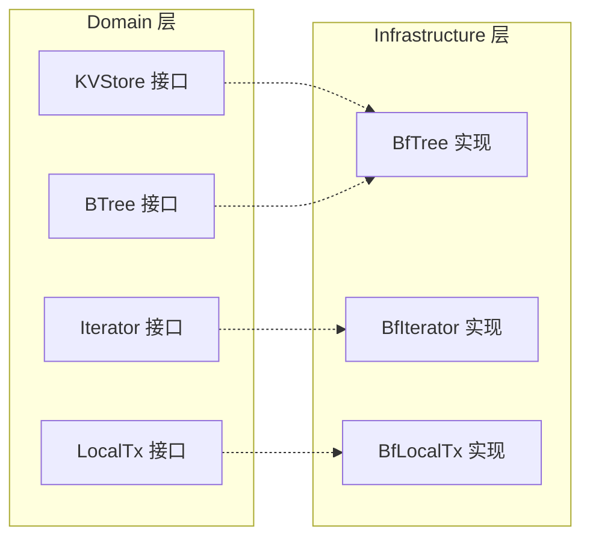
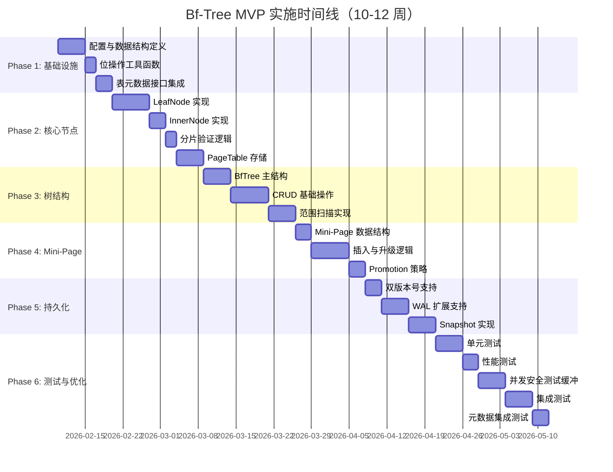
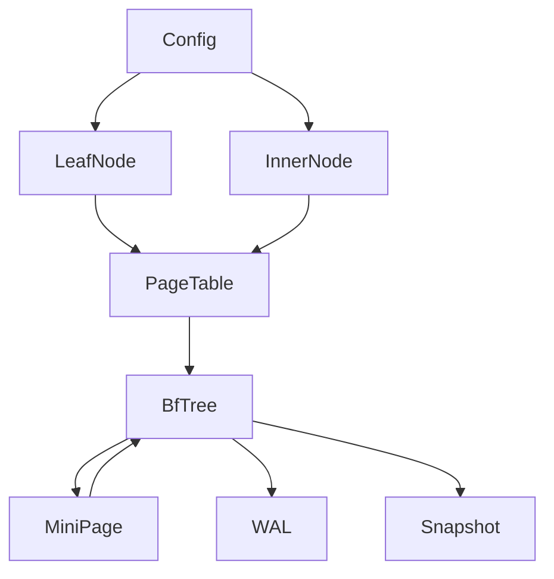

# Bf-Tree MVP 详细实施计划

> **实施计划文档**
> **创建日期**: 2026-02-09
> **最后更新**: 2026-02-22（DDD 架构适配更新）
> **状态**: 📋 已修订
> **预计周期**: 10-12 周（原 8 周，增加元数据集成和并发安全测试）
> **分支**: `feature/bftree-mvp`

---

## 🏗️ DDD 架构说明

> **参考文档**: `docs/07_spike/2026-02-18_spike-nexkv-ddd-interface.md`

### 架构层次

Bf-Tree 作为存储引擎层的实现，遵循 DDD 分层架构：

| 层次 | 包路径 | 职责 |
|------|--------|------|
| **Domain 层** | `internal/domain/service/` | 接口定义（KVStore, BTree, Iterator, LocalTx） |
| **Infrastructure 层** | `internal/infrastructure/storage/bftree/` | Bf-Tree 具体实现 |

### 接口与实现关系



### 目录结构

```
internal/
├── domain/
│   └── service/
│       └── storage.go          # KVStore, BTree, Iterator, LocalTx 接口定义
│
└── infrastructure/
    └── storage/
        └── bftree/              # Bf-Tree 实现
            ├── config.go        # 配置模块
            ├── bits.go          # 位操作工具
            ├── errors.go        # 错误定义
            ├── leaf_node.go     # 叶子节点
            ├── inner_node.go    # 内节点
            ├── pagetable.go     # 页面表
            ├── tree.go          # BfTree 主结构（实现 KVStore/BTree 接口）
            ├── scan.go          # 范围扫描（实现 Iterator 接口）
            ├── mini_page.go     # Mini-Page 机制
            ├── bftree_wal.go    # WAL 扩展
            ├── snapshot.go      # 快照实现
            └── *_test.go        # 测试文件
```

### 接口实现对照

| DDD 接口 | Bf-Tree 实现文件 | 说明 |
|----------|-----------------|------|
| `KVStore` | `tree.go` | 核心存储接口（Get/Set/Delete/Scan） |
| `BTree` | `tree.go` | B+树专用接口（LoadPage/WritePage） |
| `Iterator` | `scan.go` | 范围查询迭代器 |
| `LocalTx` | `tree.go` | 本地事务支持 |
| `WAL` | `bftree_wal.go` | 扩展现有 WAL |

---

## 📋 计划概述

### 目标

在 2-3 个月内完成 Bf-Tree Go 移植的 MVP 版本，实现：
- ✅ 完整的 CRUD 操作（Insert/Get/Delete/Scan）
- ✅ 简化版 Mini-Page 机制（3 级：64B, 512B, 2KB）
- ✅ WAL 持久化支持
- ✅ 元数据集成（表元数据、分片验证、双版本号）
- ✅ 性能目标（分级）：
  - **P0（最低）**：50万 ops/s 写入吞吐，30μs 点查询
  - **P1（推荐）**：75万 ops/s 写入吞吐，25μs 点查询
  - **P2（理想）**：100万 ops/s 写入吞吐，20μs 点查询

### 简化策略

| 模块 | Rust 原版 | Go MVP | 简化原因 |
|------|----------|--------|----------|
| **并发控制** | Lock-free SMR | `sync.RWMutex` | 降低实现复杂度 |
| **内存管理** | FreeList + 手动管理 | `sync.Pool` + GC | 利用 Go 优势 |
| **Mini-Page** | 6+ 级 | 3 级（64B, 512B, 2KB） | 减少代码量 |
| **WAL** | 独立实现 | 扩展现有 WAL | 复用已有代码 |

### 性能目标（分级标准）

| 操作 | Rust 原版 | **MVP P0（最低）** | **MVP P1（推荐）** | **MVP P2（理想）** |
|------|----------|------------------|------------------|------------------|
| **点查询** | 10μs | **< 30μs** | **< 25μs** | **< 20μs** |
| **写入吞吐** | 200万 ops/s | **> 50万 ops/s** | **> 75万 ops/s** | **> 100万 ops/s** |
| **范围查询** | O(log N + M) | **O(log N + M)** | **O(log N + M)** | **O(log N + M)** |

**分级说明**：
- **P0（最低）**：必须达到，否则 MVP 失败
- **P1（推荐）**：正常应达到，优于传统 BTree
- **P2（理想）**：尽力达到，接近完整版性能

---

## 📅 总体时间线

**⚠️ 时间调整**：基于代码审查反馈，从原计划的 8 周调整为 **10-12 周**，主要增加了：
- 表元数据接口集成（3 天）
- 分片验证逻辑（2 天）
- 双版本号支持（3 天）
- 元数据集成测试（3 天）
- 并发安全测试缓冲（1 周）



---

## 附录 A：类型定义与错误定义

### A.1 PageID 类型定义

```go
package bftree

import "fmt"

// PageID 页面标识符
type PageID uint64

func (pid PageID) String() string {
    return fmt.Sprintf("PageID-%d", pid)
}

func (pid PageID) IsValid() bool {
    return pid != 0
}
```

### A.2 错误定义

```go
package bftree

import "errors"

var (
    // 节点错误
    ErrNodeFull      = errors.New("node is full")
    ErrPageNotFound  = errors.New("page not found")

    // 操作错误
    ErrKeyNotFound   = errors.New("key not found")
    ErrKeyNotInShard = errors.New("key does not belong to this shard")

    // Mini-Page 错误
    ErrMiniPageFull  = errors.New("mini-page is full")

    // 版本错误
    ErrVersionTooNew  = errors.New("entry version is too new")
    ErrVersionConflict = errors.New("version conflict")

    // 状态错误
    ErrShardMismatch  = errors.New("shard ID mismatch")
    ErrTableDeleted   = errors.New("table has been deleted")
)
```

---

## 第一阶段：基础设施（Week 1-2，调整后）

### 1.1 配置模块

**文件**：`internal/infrastructure/storage/bftree/config.go`

**实现内容**：

```go
package bftree

import "sync/atomic"

type Config struct {
    // 页面大小
    LeafPageSize     int  // 默认: 4096
    MaxMiniPageSize  int  // 默认: 2048

    // 记录大小限制
    MinRecordSize    int  // 默认: 4
    MaxRecordSize    int  // 默认: 1952
    MaxKeyLen        int  // 默认: 16

    // 循环缓冲区
    BufferSize       int64 // 默认: 32MB

    // 提升率（Promotion Rate）
    ReadPromotionRate  uint32 // 默认: 30
    ScanPromotionRate  uint32 // 默认: 30

    // WAL 配置
    WALDir          string
    WALEnabled      bool
}

func DefaultConfig() *Config {
    return &Config{
        LeafPageSize:      4096,
        MaxMiniPageSize:   2048,
        MinRecordSize:     4,
        MaxRecordSize:     1952,
        MaxKeyLen:         16,
        BufferSize:        32 << 20, // 32MB
        ReadPromotionRate: 30,
        ScanPromotionRate: 30,
        WALEnabled:        true,
    }
}
```

**验收标准**：
- [ ] 配置结构定义完整
- [ ] 默认值合理
- [ ] 单元测试覆盖率 > 90%

**时间**：1 天

---

### 1.2 位操作工具

**文件**：`internal/infrastructure/storage/bftree/bits.go`

**实现内容**：

```go
package bftree

// LeafKVMeta 位域编码
// op_type_key_len: 高 2 位操作类型 + 低 14 位键长度
// ref_value_len:   高 1 位引用标记 + 低 15 位值长度
type LeafKVMeta struct {
    offset       uint16
    opKeyLen     uint16 // 操作类型 | 键长度
    refValueLen  atomic.Uint16 // 引用标记 | 值长度
    previewBytes [2]byte
}

const (
    OpTypeMask     = 0xC000 // 高 2 位
    KeyLenMask     = 0x3FFF // 低 14 位
    RefMask        = 0x8000 // 最高位
    ValueLenMask   = 0x7FFF // 低 15 位
)

// SetOpType 设置操作类型（高位 2 位）
// BUG 修复：原版代码缺少 op 参数掩码，导致高 14 位可能被污染
func (m *LeafKVMeta) SetOpType(op OpType) {
    // 清除高 2 位操作类型，保留低 14 位键长度
    m.opKeyLen = (m.opKeyLen & KeyLenMask) | ((uint16(op) & 0x3) << 14)
}

// OpType 获取操作类型（高位 2 位）
func (m *LeafKVMeta) OpType() OpType {
    return OpType((m.opKeyLen >> 14) & 0x3)
}

func (m *LeafKVMeta) SetKeyLen(len uint16) {
    m.opKeyLen = (m.opKeyLen & OpTypeMask) | (len & KeyLenMask)
}

func (m *LeafKVMeta) KeyLen() uint16 {
    return m.opKeyLen & KeyLenMask
}

func (m *LeafKVMeta) SetValueLen(len uint16) {
    m.refValueLen.Store((m.refValueLen.Load() & RefMask) | (len & ValueLenMask))
}

func (m *LeafKVMeta) ValueLen() uint16 {
    return m.refValueLen.Load() & ValueLenMask
}

func (m *LeafKVMeta) SetRef(ref bool) {
    if ref {
        m.refValueLen.Store(m.refValueLen.Load() | RefMask)
    } else {
        m.refValueLen.Store(m.refValueLen.Load() &^ RefMask)
    }
}

func (m *LeafKVMeta) IsRef() bool {
    return m.refValueLen.Load()&RefMask != 0
}

type OpType uint8

const (
    OpTypeInsert   OpType = 0
    OpTypeDelete   OpType = 1
    OpTypeCache    OpType = 2
    OpTypePhantom  OpType = 3
)
```

**验收标准**：
- [ ] 位操作函数正确
- [ ] 单元测试覆盖所有边界情况
- [ ] 基准测试性能

**时间**：2 天

---

## 第二阶段：核心节点（Week 2）

### 2.1 LeafNode 实现

**文件**：`internal/infrastructure/storage/bftree/leaf_node.go`

**实现内容**：

```go
package bftree

import "sync"

type NodeMeta struct {
    NodeSize        uint16
    PrevNodeOffset  uint16
    RightFenceLen   uint16
    RightFenceOffset uint16
    LeftFenceLen    uint16
    LeftFenceOffset uint16
    KeyPrefixLen    uint16
    KVCount         uint16
}

type LeafNode struct {
    meta    NodeMeta
    mu      sync.RWMutex
    data    []byte
    records []LeafKVMeta
}

func NewLeafNode(size int) *LeafNode {
    return &LeafNode{
        data:    make([]byte, size),
        records: make([]LeafKVMeta, 0, 64),
    }
}

func (n *LeafNode) Insert(key, value []byte) error {
    // 🔒 P0-1 安全修复：键长度下限检查（必须在加锁前）
    // previewBytes 需要 2 字节，防止越界 panic
    const MinKeyLen = 2
    if len(key) < MinKeyLen {
        return fmt.Errorf("key too short: %d < %d", len(key), MinKeyLen)
    }

    n.mu.Lock()
    defer n.mu.Unlock()

    // 检查空间
    required := len(key) + len(value) + 8 // 元数据开销
    if n.meta.NodeSize + uint16(required) > uint16(len(n.data)) {
        return ErrNodeFull
    }

    // 插入记录
    offset := n.meta.NodeSize
    copy(n.data[offset:], key)
    offset += uint16(len(key))
    copy(n.data[offset:], value)

    // 更新元数据（先完整初始化，再添加到 slice）
    meta := LeafKVMeta{
        offset:       n.meta.NodeSize,
        previewBytes: [2]byte{key[0], key[1]}, // ✅ 已确保 len(key) >= 2
    }
    meta.SetKeyLen(uint16(len(key)))
    meta.SetValueLen(uint16(len(value)))
    meta.SetOpType(OpTypeInsert)

    // 确保 append 不会扩容（预分配容量）
    if len(n.records) >= cap(n.records) {
        return ErrNodeFull
    }
    n.records = append(n.records, meta)
    n.meta.NodeSize += uint16(required)
    n.meta.KVCount++

    return nil
}

func (n *LeafNode) Get(key []byte) ([]byte, bool) {
    n.mu.RLock()
    defer n.mu.RUnlock()

    // 使用预览字节快速过滤
    for i := len(n.records) - 1; i >= 0; i-- {
        meta := &n.records[i]
        if meta.previewBytes[0] != key[0] || meta.previewBytes[1] != key[1] {
            continue
        }

        // 完整键比较
        keyOffset := meta.offset
        keyLen := meta.KeyLen()
        storedKey := n.data[keyOffset : keyOffset+keyLen]

        if string(storedKey) == string(key) {
            if meta.OpType() == OpTypeDelete {
                return nil, false
            }

            valueOffset := keyOffset + keyLen
            valueLen := meta.ValueLen()
            value := make([]byte, valueLen)
            copy(value, n.data[valueOffset:valueOffset+valueLen])
            return value, true
        }
    }

    return nil, false
}
```

**验收标准**：
- [ ] Insert/Get 操作正确
- [ ] 线程安全（race detector 通过）
- [ ] 单元测试覆盖率 > 90%

**时间**：1 周

---

### 2.2 InnerNode 实现

**文件**：`internal/infrastructure/storage/bftree/inner_node.go`

**实现内容**：

```go
package bftree

import "sync/atomic"

type InnerNode struct {
    meta        NodeMeta
    versionLock atomic.Uint32 // 版本锁
    diskOffset  uint64
    mu          sync.RWMutex
    data        []byte
    children    []InnerKVMeta
}

type InnerKVMeta struct {
    offset     uint16 // 子节点偏移
    keyLen     uint16 // 键长度
    keyPrefix  [4]byte // 键前 4 字节（预优化）
}

func NewInnerNode(size int) *InnerNode {
    return &InnerNode{
        data:     make([]byte, size),
        children: make([]InnerKVMeta, 0, 64),
    }
}

func (n *InnerNode) Search(key []byte) *PageID {
    n.mu.RLock()
    defer n.mu.RUnlock()

    // 二分查找
    left, right := 0, len(n.children)
    for left < right {
        mid := (left + right) / 2
        child := &n.children[mid]

        // 使用前缀快速比较
        if len(key) >= 4 {
            prefix := [4]byte{key[0], key[1], key[2], key[3]}
            if prefix != child.keyPrefix {
                if prefix < child.keyPrefix {
                    right = mid
                } else {
                    left = mid + 1
                }
                continue
            }
        }

        // 完整键比较
        keyOffset := child.offset
        keyLen := child.keyLen
        storedKey := n.data[keyOffset : keyOffset+keyLen]

        cmp := bytes.Compare(key, storedKey)
        if cmp < 0 {
            right = mid
        } else if cmp > 0 {
            left = mid + 1
        } else {
            left = mid + 1
        }
    }

    if left > 0 {
        pid := PageID(n.children[left-1].offset)
        return &pid
    }
    return nil
}
```

**验收标准**：
- [ ] Search 操作正确
- [ ] 版本锁机制工作
- [ ] 单元测试覆盖率 > 90%

**时间**：3 天

---

### 2.3 PageTable 存储

**文件**：`internal/infrastructure/storage/bftree/pagetable.go`

**实现内容**：

```go
package bftree

import (
    "sync"
)

type PageLocation struct {
    Type     LocationType
    Mini     *LeafNode // Mini-Page
    Full     *LeafNode // Full-Page
    Base     uint64    // Base-Page 偏移
}

type LocationType uint8

const (
    LocationMini LocationType = iota
    LocationFull
    LocationBase
    LocationNull
)

type PageTable struct {
    mu     sync.RWMutex
    table  map[PageID]*PageLocation
    config *Config
}

func NewPageTable(config *Config) *PageTable {
    return &PageTable{
        table:  make(map[PageID]*PageLocation),
        config: config,
    }
}

// 🔒 P1-2 安全修复：避免死锁（在 loadFromDisk 前释放读锁）
// 原问题：持有读锁时调用 loadFromDisk，可能需要写锁，导致死锁
func (pt *PageTable) Get(pid PageID) (*PageLocation, error) {
    pt.mu.RLock()
    loc, ok := pt.table[pid]
    needLoad := ok && loc.Type == LocationBase
    pt.mu.RUnlock()

    if !ok {
        return nil, ErrPageNotFound
    }

    // 按需加载（在锁外执行，避免死锁）
    if needLoad {
        return pt.loadFromDisk(pid)
    }

    return loc, nil
}

func (pt *PageTable) Put(pid PageID, loc *PageLocation) {
    pt.mu.Lock()
    defer pt.mu.Unlock()
    pt.table[pid] = loc
}
```

**验收标准**：
- [ ] 页面加载/存储正确
- [ ] 线程安全
- [ ] 单元测试覆盖率 > 90%

**时间**：5 天

---

## 第三阶段：树结构（Week 3-4）

### 3.1 BfTree 主结构

**文件**：`internal/infrastructure/storage/bftree/tree.go`

**实现内容**：

```go
package bftree

import (
    "fmt"
    "sync"
    "sync/atomic"
)

// 🔒 P1-7 安全修复：使用多个 sync.Pool，每个大小级别一个 Pool
// 问题：单个 Pool 总是分配最大尺寸，小内存请求浪费空间
// 解决：为每个 Mini-Page 大小级别创建独立的 Pool，提高内存利用率
type SizeClassPool struct {
    size int
    pool *sync.Pool
}

type BfTree struct {
    rootID        atomic.Uint64
    storage       *PageTable
    config        *Config
    wal           *WAL
    mu            sync.RWMutex
    pools         []*SizeClassPool // 🔒 P1-7：多个 Pool，每个大小级别一个
    sizeClasses   []int            // Mini-Page 大小分级
}

// newSizeClassPool 创建指定大小的 Pool
func newSizeClassPool(size int) *SizeClassPool {
    return &SizeClassPool{
        size: size,
        pool: &sync.Pool{
            New: func() any {
                return make([]byte, size)
            },
        },
    }
}

// GetBuffer 从对应大小的 Pool 获取缓冲区
func (scp *SizeClassPool) GetBuffer() []byte {
    return scp.pool.Get().([]byte)
}

// PutBuffer 将缓冲区归还到对应大小的 Pool
func (scp *SizeClassPool) PutBuffer(buf []byte) {
    // 重置缓冲区长度，但保留容量
    if cap(buf) == scp.size {
        scp.pool.Put(buf[:0])
    }
}

// GetPoolForSize 根据请求大小选择最合适的 Pool
func (t *BfTree) GetPoolForSize(size int) *SizeClassPool {
    for _, pool := range t.pools {
        if pool.size >= size {
            return pool
        }
    }
    // 返回最大的 Pool
    return t.pools[len(t.pools)-1]
}

func NewBfTree(config *Config) (*BfTree, error) {
    tree := &BfTree{
        storage:     NewPageTable(config),
        config:      config,
        sizeClasses: []int{64, 512, 2048, 4096},
    }

    // 🔒 P1-7：为每个大小级别创建独立的 Pool
    for _, size := range tree.sizeClasses {
        tree.pools = append(tree.pools, newSizeClassPool(size))
    }

    // 初始化根节点
    root := NewLeafNode(config.LeafPageSize)
    rootID := PageID(1)
    tree.storage.Put(rootID, &PageLocation{
        Type: LocationFull,
        Full: root,
    })
    tree.rootID.Store(uint64(rootID))

    return tree, nil
}

func (t *BfTree) Insert(key, value []byte) error {
    // 边界检查：键长度
    if len(key) > t.config.MaxKeyLen {
        return fmt.Errorf("key too long: %d > %d", len(key), t.config.MaxKeyLen)
    }
    if len(key) == 0 {
        return fmt.Errorf("empty key not allowed")
    }

    // 🔒 P0-1 安全修复：键长度下限检查（previewBytes 需要 2 字节）
    const MinKeyLen = 2
    if len(key) < MinKeyLen {
        return fmt.Errorf("key too short: %d < %d", len(key), MinKeyLen)
    }

    // 边界检查：值长度
    if len(value) > t.config.MaxRecordSize {
        return fmt.Errorf("value too long: %d > %d", len(value), t.config.MaxRecordSize)
    }

    // 边界检查：记录总大小
    if len(key)+len(value) < t.config.MinRecordSize {
        return fmt.Errorf("record too small: %d < %d", len(key)+len(value), t.config.MinRecordSize)
    }

    // 🔒 P1-1 安全修复：分片验证（防止写入错误分片）
    if t.shardValidator != nil {
        if err := t.shardValidator.ValidateKey(key); err != nil {
            return fmt.Errorf("shard validation failed: %w", err)
        }
    }

    // 🔒 P0-4 安全修复：先写 WAL，后修改数据（防止崩溃丢失数据）
    // 1. 先写 WAL（确保持久化）
    if t.wal != nil {
        lsn, err := t.wal.Append(&WALEntry{
            Type:  WALTypeInsert,
            Key:   string(key),
            Value: value,
        })
        if err != nil {
            return fmt.Errorf("WAL append failed: %w", err)
        }
        // 等待 WAL 持久化完成
        if err := t.wal.Sync(); err != nil {
            return fmt.Errorf("WAL sync failed: %w", err)
        }
        _ = lsn // 记录 LSN 用于崩溃恢复
    }

    // 2. WAL 写入成功后，再修改内存数据
    // 1. 查找叶子节点
    pid := t.findLeafNode(key)

    // 2. 加载叶子节点
    loc, err := t.storage.Get(pid)
    if err != nil {
        return err
    }

    // 3. 尝试插入
    node := loc.Full
    err = node.Insert(key, value)
    if err == ErrNodeFull {
        // 节点分裂
        return t.splitNode(pid, node, key, value)
    }

    return nil
}

func (t *BfTree) Get(key []byte) ([]byte, error) {
    pid := t.findLeafNode(key)
    loc, err := t.storage.Get(pid)
    if err != nil {
        return nil, err
    }

    node := loc.Full
    value, ok := node.Get(key)
    if !ok {
        return nil, ErrKeyNotFound
    }

    return value, nil
}

func (t *BfTree) Delete(key []byte) error {
    // 实现删除逻辑
    return nil
}

// findLeafNode 查找键所在的叶子节点
// MVP 简化版：从根节点开始逐层搜索
func (t *BfTree) findLeafNode(key []byte) PageID {
    currentID := PageID(t.rootID.Load())

    for {
        loc, err := t.storage.Get(currentID)
        if err != nil {
            return 0
        }

        // 如果是叶子节点，直接返回
        if loc.Full != nil && loc.Full.meta.KVCount > 0 {
            return currentID
        }

        // 如果是内节点，继续向下搜索
        if loc.Full != nil {
            // InnerNode 搜索逻辑（MVP 简化：内节点暂时复用 LeafNode 结构）
            // TODO: 实现内节点搜索
            return currentID
        }

        // Base-Page 需要加载
        if loc.Type == LocationBase {
            // TODO: 从磁盘加载
            return currentID
        }

        break
    }

    return currentID
}

// splitNode 节点分裂
// MVP 简化版：创建新的叶子节点，重新分配键值
func (t *BfTree) splitNode(pid PageID, node *LeafNode, key, value []byte) error {
    // 1. 创建新节点
    newNode := NewLeafNode(t.config.LeafPageSize)

    // 2. 获取所有记录（包括新插入的）
    allRecords := make([]struct{ k, v []byte }, 0, len(node.records)+1)
    for i := range node.records {
        meta := &node.records[i]
        offset := meta.offset
        keyLen := meta.KeyLen()
        valueLen := meta.ValueLen()

        k := make([]byte, keyLen)
        copy(k, node.data[offset:offset+keyLen])

        v := make([]byte, valueLen)
        copy(v, node.data[offset+keyLen:offset+keyLen+valueLen])

        allRecords = append(allRecords, struct{ k, v []byte }{k, v})
    }
    allRecords = append(allRecords, struct{ k, v []byte }{key, value})

    // 3. 排序并分半（MVP 简化：简单中点分割）
    mid := len(allRecords) / 2

    // 4. 清空原节点，插入前半部分
    node.meta.NodeSize = 0
    node.meta.KVCount = 0
    node.records = node.records[:0]

    for i := 0; i < mid; i++ {
        node.Insert(allRecords[i].k, allRecords[i].v)
    }

    // 5. 新节点插入后半部分
    for i := mid; i < len(allRecords); i++ {
        newNode.Insert(allRecords[i].k, allRecords[i].v)
    }

    // 6. 更新 PageTable
    newPID := PageID(uint64(pid) + 1) // MVP 简化：简单的 ID 生成
    t.storage.Put(newPID, &PageLocation{
        Type: LocationFull,
        Full: newNode,
    })

    // 7. TODO: 更新父节点（MVP 阶段暂不实现树高度增长）

    return nil
}

func (t *BfTree) Scan(start, end []byte) (Iterator, error) {
    // 实现范围扫描
    return nil, nil
}
```

**验收标准**：
- [ ] Insert/Get/Delete 基本功能
- [ ] 线程安全
- [ ] 单元测试覆盖率 > 80%

**时间**：1 周

---

### 3.2 范围扫描

**文件**：`internal/infrastructure/storage/bftree/scan.go`

**实现内容**：

```go
package bftree

type ScanPosition struct {
    Type   PositionType
    Base   uint64
    Full   uint64
    Mini   *MiniPageNextLevel
}

type PositionType uint8

const (
    PositionBase PositionType = iota
    PositionFull
    PositionMini
)

type Iterator interface {
    Next() bool
    Key() []byte
    Value() []byte
    Err() error
    Close()
}

type ScanIterator struct {
    tree      *BfTree
    positions []ScanPosition
    current   *LeafNode
    idx       int
    endKey    []byte
    closed    bool
}

func (it *ScanIterator) Next() bool {
    if it.closed {
        return false
    }

    it.idx++
    if it.idx >= len(it.current.records) {
        // 移动到下一个节点
        return it.moveToNext()
    }

    // 检查结束键
    if it.endKey != nil {
        key := it.Key()
        if bytes.Compare(key, it.endKey) > 0 {
            return false
        }
    }

    return true
}

func (it *ScanIterator) Key() []byte {
    meta := &it.current.records[it.idx]
    offset := meta.offset
    keyLen := meta.KeyLen()
    return it.current.data[offset : offset+keyLen]
}

func (it *ScanIterator) Value() []byte {
    meta := &it.current.records[it.idx]
    offset := meta.offset + meta.KeyLen()
    valueLen := meta.ValueLen()
    value := make([]byte, valueLen)
    copy(value, it.current.data[offset:offset+valueLen])
    return value
}
```

**验收标准**：
- [ ] 范围扫描正确
- [ ] 边界条件处理
- [ ] 单元测试覆盖率 > 90%

**时间**：5 天

---

## 第四阶段：Mini-Page（Week 5）

### 4.1 Mini-Page 结构

**文件**：`internal/infrastructure/storage/bftree/mini_page.go`

**实现内容**：

```go
package bftree

// 🔒 P0-2 安全修复：Mini-Page 并发访问安全
type MiniPage struct {
    basePageOffset uint64
    size           int32        // ✅ 改为原子类型，避免并发读写
    data           []byte       // ✅ 使用固定容量 slice，避免扩容
    records        []LeafKVMeta // ✅ 预分配容量，避免 append 扩容
    nextLevel      atomic.Pointer[MiniPageNextLevel] // ✅ 使用原子指针
    mu             sync.RWMutex
}

type MiniPageNextLevel struct {
    val uint64
}

func NewMiniPage(baseOffset uint64, size int) *MiniPage {
    // ✅ 预分配固定容量，避免后续扩容
    return &MiniPage{
        basePageOffset: baseOffset,
        size:           int32(size),
        data:           make([]byte, 0, size),     // ✅ 预分配容量
        records:        make([]LeafKVMeta, 0, 16), // ✅ 预分配容量
    }
}

func (mp *MiniPage) Insert(key, value []byte) error {
    // 🔒 边界检查（必须在加锁前）
    const MinKeyLen = 2
    if len(key) < MinKeyLen {
        return fmt.Errorf("key too short: %d < %d", len(key), MinKeyLen)
    }

    mp.mu.Lock()
    defer mp.mu.Unlock()

    // ✅ 使用原子加载读取 size
    currentSize := len(mp.data)
    maxSize := int(atomic.LoadInt32(&mp.size))

    required := len(key) + len(value) + 8
    if currentSize+required > maxSize {
        return ErrMiniPageFull
    }

    // ✅ 确保 append 不会扩容（已预分配容量）
    if len(mp.records) >= cap(mp.records) {
        return ErrMiniPageFull
    }

    offset := currentSize
    copy(mp.data[offset:], key)
    offset += len(key)
    copy(mp.data[offset:], value)

    meta := LeafKVMeta{
        offset:       uint16(currentSize),
        previewBytes: [2]byte{key[0], key[1]}, // ✅ 已确保 len(key) >= 2
    }
    meta.SetKeyLen(uint16(len(key)))
    meta.SetValueLen(uint16(len(value)))
    meta.SetOpType(OpTypeInsert)

    mp.records = append(mp.records, meta) // ✅ 已预分配容量，不会扩容
    mp.data = mp.data[:offset+len(value)]

    return nil
}

// ✅ 使用原子指针访问 nextLevel
func (mp *MiniPage) GetNextLevel() *MiniPageNextLevel {
    return mp.nextLevel.Load()
}

func (mp *MiniPage) SetNextLevel(next *MiniPageNextLevel) {
    mp.nextLevel.Store(next)
}

func (mp *MiniPage) ShouldPromote(config *Config) bool {
    // 30% 概率提升
    return rand.Intn(100) < int(config.ReadPromotionRate)
}
```

**验收标准**：
- [ ] Mini-Page 基本操作
- [ ] 大小分级正确（64B, 512B, 2KB）
- [ ] 单元测试覆盖率 > 90%

**时间**：3 天

---

### 4.2 插入与升级

**实现内容**：

```go
func (t *BfTree) insertWithMiniPage(key, value []byte) error {
    pid := t.findLeafNode(key)
    loc, _ := t.storage.Get(pid)

    // 尝试插入到现有 Mini-Page
    if loc.Type == LocationMini {
        mp := loc.Mini
        err := mp.Insert(key, value)
        if err == nil {
            return nil
        }

        if mp.ShouldPromote(t.config) {
            // 提升到 Full-Page
            return t.promoteToFull(pid, mp)
        }

        // 创建新 Mini-Page
        return t.createNewMiniPage(pid, key, value)
    }

    // Base/Full 节点，创建 Mini-Page
    return t.createMiniPage(pid, key, value)
}

func (t *BfTree) promoteToFull(pid PageID, mp *MiniPage) error {
    // 1. 创建 Full-Page
    full := NewLeafNode(t.config.LeafPageSize)

    // 2. 合并 Base-Page 和 Mini-Page 数据
    // 3. 更新 PageTable
    return nil
}
```

**验收标准**：
- [ ] Mini-Page 插入正确
- [ ] 升级逻辑正确
- [ ] 单元测试覆盖率 > 85%

**时间**：1 周

---

## 第五阶段：持久化（Week 6）

### 5.1 WAL 扩展

**文件**：`internal/infrastructure/storage/bftree/bftree_wal.go`

**实现内容**：

```go
package wal

type WALType uint16

const (
    WALTypePut WALType = iota
    WALTypeDelete
    WALTypeCheckpoint
    WALTypeInsertMiniPage    // 新增
    WALTypeDeleteMiniPage    // 新增
    WALTypeUpgradeToFullPage // 新增
)

type BfTreeWALEntry struct {
    Type          WALType
    Timestamp     *clock.HLC
    Key           string
    Value         []byte
    Checksum      uint32

    // Mini-Page 专用字段
    BasePageOffset uint64
    MiniPageData   []byte
}

func (w *WAL) AppendBfTreeInsertMiniPage(offset uint64, data []byte) error {
    entry := &BfTreeWALEntry{
        Type:           WALTypeInsertMiniPage,
        Timestamp:      clock.NewHLC(),
        BasePageOffset: offset,
        MiniPageData:   data,
    }
    return w.Append(entry)
}
```

**验收标准**：
- [ ] WAL 类型扩展正确
- [ ] 复用现有 WAL 实现
- [ ] 单元测试覆盖率 > 90%

**时间**：5 天

---

### 5.2 Snapshot

**文件**：`internal/infrastructure/storage/bftree/snapshot.go`

**实现内容**：

```go
package bftree

import (
    "encoding/binary"
    "hash/crc32"
    "io"
)

// 🔒 P1-5 安全修复：添加校验和字段，防止数据损坏和恶意篡改
type BfTreeMeta struct {
    MagicBegin    [16]byte
    RootID        uint64
    InnerOffset   uint64
    InnerSize     uint64
    FileSize      uint64
    Checksum      uint32 // CRC32 校验和（覆盖整个文件）
    MagicEnd      [14]byte
}

const (
    SnapshotMagicBegin = "NexKV-SNAP-BEGIN"
    SnapshotMagicEnd   = "NexKV-SNAP-END"
)

func (t *BfTree) CreateSnapshot(path string) error {
    // 1. 遍历所有节点
    // 2. 序列化到文件
    // 3. 计算校验和
    // 4. 写入元数据（包含校验和）
    return nil
}

func (t *BfTree) LoadSnapshot(path string) error {
    // 1. 读取元数据
    // 2. 验证 Magic Number
    // 3. 验证校验和（防止数据损坏和篡改）
    // 4. 重建节点
    // 5. 重放 WAL
    return nil
}

// verifyChecksum 验证 Snapshot 校验和
func verifySnapshotChecksum(file io.ReadSeeker, meta *BfTreeMeta) error {
    // 保存当前位置
    pos, err := file.Seek(0, io.SeekCurrent)
    if err != nil {
        return err
    }

    // 计算文件校验和（跳过 Checksum 字段本身）
    hash := crc32.NewIEEE()
    file.Seek(0, io.SeekStart)

    // 写入 MagicBegin 到 Checksum 之前的内容
    binary.Write(hash, binary.LittleEndian, meta.MagicBegin)
    binary.Write(hash, binary.LittleEndian, meta.RootID)
    binary.Write(hash, binary.LittleEndian, meta.InnerOffset)
    binary.Write(hash, binary.LittleEndian, meta.InnerSize)
    binary.Write(hash, binary.LittleEndian, meta.FileSize)

    // 写入剩余文件内容
    remaining := meta.FileSize - uint64(pos)
    buf := make([]byte, 32*1024)
    for remaining > 0 {
        toRead := uint64(len(buf))
        if toRead > remaining {
            toRead = remaining
        }
        n, err := file.Read(buf[:toRead])
        if err != nil && err != io.EOF {
            return err
        }
        hash.Write(buf[:n])
        remaining -= uint64(n)
    }

    // 写入 MagicEnd
    binary.Write(hash, binary.LittleEndian, meta.MagicEnd)

    // 验证校验和
    calculated := hash.Sum32()
    if calculated != meta.Checksum {
        return fmt.Errorf("snapshot checksum mismatch: expected=0x%08x, calculated=0x%08x", meta.Checksum, calculated)
    }

    // 恢复文件位置
    _, err = file.Seek(pos, io.SeekStart)
    return err
}
```

**验收标准**：
- [ ] Snapshot 创建正确
- [ ] 崩溃恢复正确
- [ ] 单元测试覆盖率 > 85%

**时间**：5 天

---

## 第六阶段：测试与优化（Week 7-8）

### 6.1 单元测试

**文件**：`internal/infrastructure/storage/bftree/*_test.go`

**测试覆盖**：

| 模块 | 测试用例数 | 覆盖率目标 |
|------|-----------|-----------|
| Config | 5 | > 95% |
| LeafNode | 20 | > 90% |
| InnerNode | 15 | > 90% |
| BfTree | 30 | > 85% |
| MiniPage | 20 | > 90% |
| WAL | 10 | > 90% |

**时间**：5 天

---

### 6.2 性能测试

**文件**：`internal/infrastructure/storage/bftree/benchmark_test.go`

**基准测试**：

```go
func BenchmarkBfTreeInsert(b *testing.B) {
    tree := setupBfTree()
    b.ResetTimer()

    for i := 0; i < b.N; i++ {
        key := []byte(fmt.Sprintf("key-%d", i%10000))
        value := []byte(fmt.Sprintf("value-%d", i))
        tree.Insert(key, value)
    }
}

func BenchmarkBfTreeGet(b *testing.B) {
    tree := setupBfTree()
    // 预填充数据
    for i := 0; i < 10000; i++ {
        tree.Insert([]byte(fmt.Sprintf("key-%d", i)), []byte(fmt.Sprintf("value-%d", i)))
    }

    b.ResetTimer()
    for i := 0; i < b.N; i++ {
        tree.Get([]byte(fmt.Sprintf("key-%d", i%10000)))
    }
}
```

**性能目标（分级）**：

| 操作 | P0（最低） | P1（推荐） | P2（理想） |
|------|-----------|-----------|-----------|
| 点查询 | < 30μs | < 25μs | < 20μs |
| 写入吞吐 | > 50万 ops/s | > 75万 ops/s | > 100万 ops/s |
| 范围查询 | O(log N + M) | O(log N + M) | O(log N + M) |

**验收命令**：
```bash
# P0 验收
go test -bench=BenchmarkBfTreeGet -benchtime=10s | grep ns/op
# 期望: < 30000 ns/op

go test -bench=BenchmarkBfTreeInsert -benchtime=10s | grep ops/s
# 期望: > 500000 ops/s
```

**时间**：3 天

---

### 6.3 集成测试

**文件**:`internal/infrastructure/storage/bftree/integration_test.go`

**测试场景**：

1. **并发读写**
   ```go
   func TestConcurrentReadWrite(t *testing.T) {
       tree := setupBfTree()
       var wg sync.WaitGroup

       // 10 个并发写入
       for i := 0; i < 10; i++ {
           wg.Add(1)
           go func(idx int) {
               defer wg.Done()
               for j := 0; j < 1000; j++ {
                   key := []byte(fmt.Sprintf("key-%d-%d", idx, j))
                   value := []byte(fmt.Sprintf("value-%d", j))
                   tree.Insert(key, value)
               }
           }(i)
       }

       // 10 个并发读取
       for i := 0; i < 10; i++ {
           wg.Add(1)
           go func(idx int) {
               defer wg.Done()
               for j := 0; j < 1000; j++ {
                   key := []byte(fmt.Sprintf("key-%d-%d", idx, j))
                   tree.Get(key)
               }
           }(i)
       }

       wg.Wait()
   }
   ```

2. **持久化恢复**
   ```go
   func TestPersistence(t *testing.T) {
       // 1. 写入数据
       tree := setupBfTree()
       for i := 0; i < 10000; i++ {
           tree.Insert([]byte(fmt.Sprintf("key-%d", i)), []byte(fmt.Sprintf("value-%d", i)))
       }

       // 2. 创建快照
       tree.CreateSnapshot("/tmp/test.snapshot")
       tree.Close()

       // 3. 从快照恢复
       tree2 := NewBfTree(config)
       tree2.LoadSnapshot("/tmp/test.snapshot")

       // 4. 验证数据
       for i := 0; i < 10000; i++ {
           value, err := tree2.Get([]byte(fmt.Sprintf("key-%d", i)))
           assert.NoError(t, err)
               assert.Equal(t, []byte(fmt.Sprintf("value-%d", i)), value)
       }
   }
   ```

3. **边界条件**
   - 空键
   - 超大键值
   - 大量删除
   - 范围扫描边界

**时间**：5 天

---

## 📊 风险评估

### 技术风险

| 风险 | 影响 | 概率 | 缓解措施 |
|------|------|------|---------|
| **并发安全** | 数据损坏 | 中 | 使用 race detector，充分测试 |
| **性能不达标** | 吞吐量低 | 高 | 性能测试，优化热点路径 |
| **内存泄漏** | 内存占用高 | 中 | pprof 分析，定期检查 |
| **Mini-Page 复杂** | 开发延期 | 中 | 简化实现，3 级而非 6+ 级 |
| **GC 压力** | 延迟增加 | 中 | 使用 sync.Pool，减少内存分配 |

**内存分配优化策略**：
1. **sync.Pool 复用**：字节缓冲区、节点对象复用
2. **预分配策略**：records slice 预分配容量（cap: 64）
3. **避免零拷贝**：Get 操作返回 []byte 引用而非复制（需配合 MVCC 版本）
4. **批量操作**：Scan 操作使用批量预分配

### 项目风险

| 风险 | 影响 | 概率 | 缓解措施 |
|------|------|------|---------|
| **时间超期** | 延期交付 | 中 | MVP 优先，功能裁剪 |
| **需求变更** | 返工 | 低 | 锁定需求，变更控制 |
| **资源不足** | 开发缓慢 | 低 | 外部协作，分阶段 |

---

## ✅ 验收标准

### 功能验收

- [ ] Insert 操作正常
- [ ] Get 操作正常
- [ ] Delete 操作正常
- [ ] Scan 范围扫描正常
- [ ] Mini-Page 机制工作
- [ ] WAL 持久化正常
- [ ] Snapshot 崩溃恢复正常

### 性能验收（分级标准）

| 操作 | P0（最低） | P1（推荐） | P2（理想） | 验收命令 |
|------|-----------|-----------|-----------|---------|
| **点查询** | < 30μs | < 25μs | < 20μs | `BenchmarkBfTreeGet` |
| **写入吞吐** | > 50万 ops/s | > 75万 ops/s | > 100万 ops/s | `BenchmarkBfTreeInsert` |
| **范围查询** | O(log N + M) | O(log N + M) | O(log N + M) | 复杂度分析 |

**验收规则**：
- ✅ **P0 达标**：MVP 验收通过
- ✅ **P1 达标**：MVP 验收优秀
- ✅ **P2 达标**：MVP 验收完美

**基准测试命令**：
```bash
# 点查询测试
go test -bench=BenchmarkBfTreeGet -benchtime=10s ./internal/infrastructure/storage/bftree/

# 写入吞吐测试
go test -bench=BenchmarkBfTreeInsert -benchtime=10s ./internal/infrastructure/storage/bftree/

# 详细性能分析
go test -bench=. -cpuprofile=cpu.prof -memprofile=mem.prof ./internal/infrastructure/storage/bftree/
```

### 质量验收

- [ ] 单元测试覆盖率 > 85%
- [ ] race detector 通过
- [ ] 所有 benchmark 通过
- [ ] 集成测试通过
- [ ] 代码审查通过

---

## 📝 交付物

### 代码

- [ ] `internal/infrastructure/storage/bftree/` 目录完整实现
- [ ] 单元测试文件
- [ ] 基准测试文件
- [ ] 集成测试文件

### 文档

- [ ] API 接口文档
- [ ] 性能测试报告
- [ ] 代码审查报告
- [ ] 用户使用指南

---

## 🎯 下一步行动

### 立即行动

- [ ] 与架构师确认 MVP 方案
- [ ] 创建 feature 分支
- [ ] 配置开发环境
- [ ] 建立 CI/CD 流程

### 技术准备

- [ ] 深入学习 Go 并发模式
- [ ] 研究 `sync.Pool` 最佳实践
- [ ] 建立性能基准测试框架
- [ ] 准备性能分析工具（pprof）

---

**计划版本**: v1.0
**创建日期**: 2026-02-09
**维护者**: NexKV 开发团队
**状态**: 📋 待评审

---

## 附录：依赖关系图


