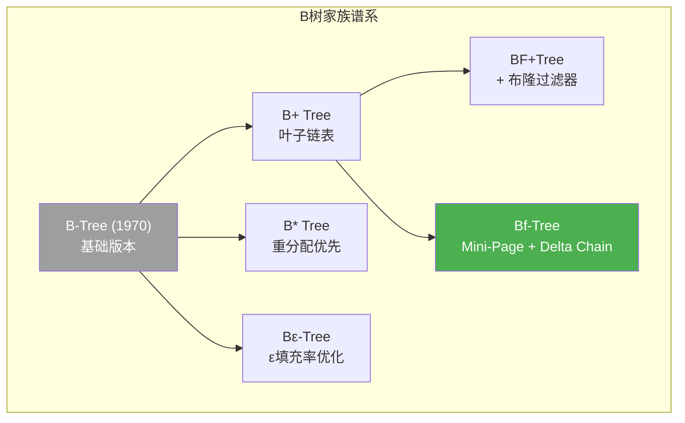
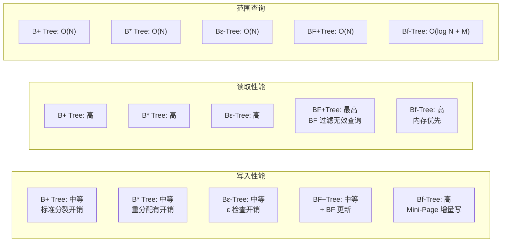
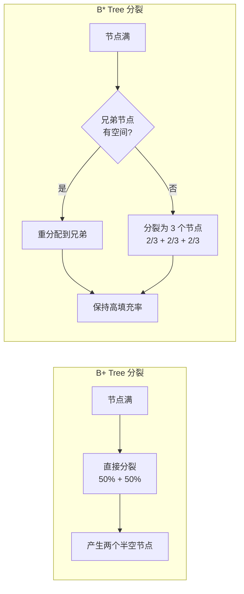
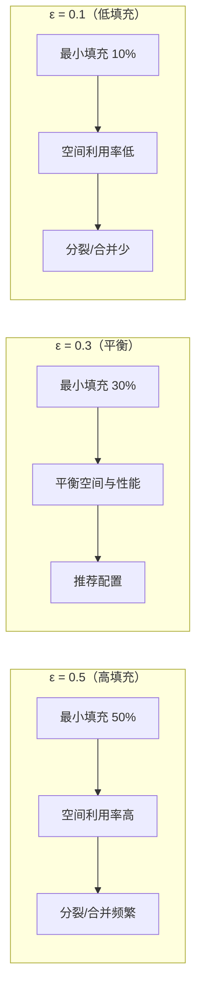
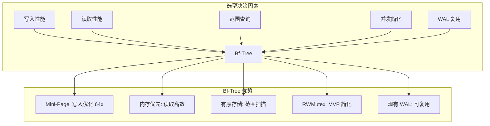
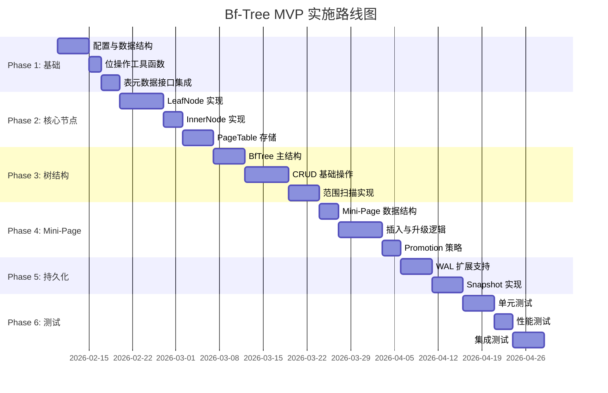

# B 树变体术语澄清与选型分析

> **预研类型**: Spike
> **创建日期**: 2026-02-22
> **状态**: ✅ 已完成
> **目的**: 澄清各类 "BF" 相关 B 树变体，明确 NexKV 选型依据
> **关联文档**: `docs/07_spike/2026-02-21_spike_m2-storage-engine.md`

---

## 一、术语澄清：谁是谁？

### 1.1 "BF" 相关术语迷雾

在数据库和存储领域，"BF" 前缀的 B 树变体容易混淆。以下是完整的术语对照表：

| 缩写 | 全称 | 中文 | 核心特征 | 论文/来源 |
|------|------|------|----------|----------|
| **B+ Tree** | B-Plus Tree | B+树 | 叶子节点链表串联，内部节点仅存 key | Knuth, 1970s |
| **B* Tree** | B-Star Tree | B*树 | 节点分裂时优先重分配，减少碎片 | Knuth, 1973 |
| **Bε-Tree** | B-epsilon Tree | Bε树 | ε 因子优化节点填充率 | Bender et al., 2000 |
| **BF+Tree** | Bloom Filter + B+Tree | 布隆B+树 | B+树前置布隆过滤器 | 工程实践，无统一论文 |
| **Bf-Tree** | Buffer-Friendly Tree | 缓冲友好树 | Mini-Page + Delta Chain + Promotion | 微软研究院, VLDB 2024 |

### 1.2 术语关系图



---

## 二、深度对比：五大 B 树变体

### 2.1 核心特性对比矩阵

| 特性维度 | B+ Tree | B* Tree | Bε-Tree | BF+Tree | **Bf-Tree** |
|---------|---------|---------|---------|---------|-------------|
| **叶子节点** | 链表串联 | 链表串联 | 链表串联 | 链表串联 | 不强制链表 |
| **内部节点** | 仅存 key | 仅存 key | 仅存 key | 仅存 key | key + Mini-Page |
| **范围查询** | ✅ O(N) 遍历 | ✅ O(N) 遍历 | ✅ O(N) 遍历 | ✅ O(N) 遍历 | ✅ O(log N + M) |
| **写入优化** | ❌ 标准分裂 | ⚠️ 重分配优先 | ⚠️ ε 因子控制 | ❌ 标准分裂 | ✅ Mini-Page 增量写 |
| **读取优化** | ✅ 内存高效 | ✅ 内存高效 | ✅ 高填充率 | ✅ BF 过滤 | ✅ 内存优先 |
| **并发控制** | 复杂 | 复杂 | 复杂 | 复杂 | **可简化**（RWMutex MVP） |
| **持久化** | 需自研 | 需自研 | 需自研 | 需自研 | **WAL 可复用** |
| **适用场景** | 通用数据库 | 磁盘优化 | 内存优化 | 海量过滤 | **分布式 KV** |

### 2.2 性能特征对比



---

## 三、各变体详细分析

### 3.1 B+ Tree（B-Plus Tree）

> **定位**: 数据库索引的标准选择，最广泛使用的 B 树变体

#### 3.1.1 核心结构

```
                    [内部节点: 仅存 key]
                           │
            ┌──────────────┼──────────────┐
            ▼              ▼              ▼
    [key: 10, 20]   [key: 30, 40]   [key: 50, 60]
            │              │              │
            ▼              ▼              ▼
    ┌─────────────┐ ┌─────────────┐ ┌─────────────┐
    │k:5,  v:xxx  │ │k:25, v:yyy │ │k:45, v:zzz │  ← 叶子节点
    │k:10, v:aaa  │ │k:30, v:bbb │ │k:50, v:ccc │     (key + value)
    │k:15, v:ddd  │ │k:35, v:eee │ │k:55, v:fff │
    └──────┬──────┘ └──────┬──────┘ └──────┬──────┘
           │               │               │
           └───────────────┴───────────────┘
                     叶子链表（范围查询核心）
```

#### 3.1.2 必要特性（Must-Have）

| 特性 | 定义 | 核心原因 |
|------|------|----------|
| **节点分层设计** | 内部节点：仅存 key + 子节点指针；叶子节点：key + value + 前驱/后继指针 | 所有数据在叶子节点，链表支持范围查询 |
| **核心 CRUD** | 插入分裂、删除合并/重分配、查找导航、范围遍历 | 基础能力，范围查询是核心优势 |
| **阶数配置** | 自定义节点最大 key 数（m），叶子/内部节点可不同阶数 | 适配不同内存/磁盘场景 |
| **根节点特殊处理** | 根节点无最小填充率限制（可只有 1 个 key） | 避免根节点频繁合并/分裂 |
| **错误处理** | 重复 key、空 key、越界查询的明确报错 | 保证数据一致性 |

#### 3.1.3 推荐特性（Should-Have）

| 特性 | 定义 | 核心原因 |
|------|------|----------|
| **并发安全** | 节点级锁（读共享/写排他），按路径加锁 | 高并发读写刚需 |
| **迭代器** | 正向/反向遍历、区间截断、懒加载 | 适配 KV 的 scan/seek 操作 |
| **批量操作** | 批量插入/删除、批量查询 | 提升高频批量操作性能 |
| **序列化** | 节点二进制序列化（protobuf/msgpack） | 持久化/网络传输基础 |
| **统计指标** | 树高度、叶子节点数、分裂/合并次数 | 监控树的健康状态 |

---

### 3.2 B* Tree（B-Star Tree）

> **定位**: 磁盘存储优化，减少碎片

#### 3.2.1 核心差异



#### 3.2.2 特性对比

| 特性 | B+ Tree | B* Tree |
|------|---------|---------|
| **节点填充率** | 50% ~ 100% | **66% ~ 100%** |
| **分裂策略** | 50/50 分裂 | 优先重分配，否则 2/3 分裂 |
| **空间利用率** | ~69%（平均） | **~85%（平均）** |
| **分裂频率** | 较高 | **较低** |
| **实现复杂度** | 简单 | 中等 |

---

### 3.3 Bε-Tree（B-epsilon Tree）

> **定位**: 内存利用率优化，可配置的填充率控制

#### 3.3.1 核心概念：ε 因子

```
ε (epsilon) = 节点最小填充率因子

节点最小 key 数 = ceil(m × ε)
节点最大 key 数 = m

示例：m = 100, ε = 0.3
├── 最小 key 数 = ceil(100 × 0.3) = 30
├── 最大 key 数 = 100
└── 填充率范围 = 30% ~ 100%
```

#### 3.3.2 ε 因子影响



---

### 3.4 BF+Tree（Bloom Filter + B+Tree）

> **定位**: 海量数据快速过滤，减少无效查询

#### 3.4.1 架构设计

```
┌─────────────────────────────────────────────────────────────┐
│                        查询流程                              │
├─────────────────────────────────────────────────────────────┤
│                                                             │
│   Get(key) ──► [布隆过滤器] ──► 可能存在? ──► [B+ Tree]     │
│                    │               │                        │
│                    │               ├── 是 ──► 查询 B+ Tree  │
│                    │               │                        │
│                    │               └── 否 ──► 返回不存在     │
│                    │                   (O(1)，无磁盘 IO)     │
│                    │                                        │
│                    └── 误判率 ~1%                           │
│                        (少数无效查询会穿透)                   │
│                                                             │
└─────────────────────────────────────────────────────────────┘
```

#### 3.4.2 必要特性

| 特性 | 定义 | 核心原因 |
|------|------|----------|
| **布隆过滤器集成** | 全局 BF 或分区 BF | 快速过滤不存在的 key |
| **BF 更新联动** | 插入时更新 BF，删除时标记 | 保证 BF 与 B+树一致性 |
| **BF 参数配置** | 哈希函数数、容量、误判率 | 平衡内存和误判率 |

#### 3.4.3 适用场景

| 场景 | 效果 | 说明 |
|------|------|------|
| **缓存穿透防护** | ⭐⭐⭐⭐⭐ | BF 过滤无效请求，保护后端 |
| **磁盘索引** | ⭐⭐⭐⭐ | 减少无效磁盘 IO |
| **分布式查询** | ⭐⭐⭐⭐ | 节点级 BF，减少网络请求 |
| **高频删除** | ⭐⭐ | BF 不支持直接删除，需重建 |

---

### 3.5 Bf-Tree（Buffer-Friendly Tree）- NexKV 选择

> **定位**: 高并发读写优化的 B+树变体，微软研究院出品
> **论文**: [Bf-Tree: A Modern Read-Write-Optimized Concurrent Range Index (VLDB 2024)](https://badrish.net/papers/bftree-vldb2024.pdf)

#### 3.5.1 核心创新：Mini-Page + Delta Chain

```
传统 B+ Tree 写入:
┌───────────────────────────────────────────────────────────┐
│  写入 key: "user:1001"                                    │
│  ┌─────────────────────────────────────────────────────┐  │
│  │  叶子节点 (4KB)                                      │  │
│  │  ┌─────┬─────┬─────┬─────┬─────┬─────┬─────┬─────┐ │  │
│  │  │k:1  │k:2  │k:3  │k:4  │...  │...  │...  │     │ │  │
│  │  │v:a  │v:b  │v:c  │v:d  │     │     │     │     │ │  │
│  │  └─────┴─────┴─────┴─────┴─────┴─────┴─────┴─────┘ │  │
│  └─────────────────────────────────────────────────────┘  │
│  问题: 小写入需要修改整个 4KB 页面 → 写放大严重            │
└───────────────────────────────────────────────────────────┘

Bf-Tree 写入:
┌───────────────────────────────────────────────────────────┐
│  写入 key: "user:1001"                                    │
│  ┌─────────────────────────────────────────────────────┐  │
│  │  Base Page (4KB)                                    │  │
│  │  ┌─────┬─────┬─────┬─────┬─────┬─────┬─────┬─────┐ │  │
│  │  │k:1  │k:2  │k:3  │k:4  │...  │...  │...  │     │ │  │
│  │  │v:a  │v:b  │v:c  │v:d  │     │     │     │     │ │  │
│  │  └─────┴─────┴─────┴─────┴─────┴─────┴─────┴─────┘ │  │
│  └────────────────────────┬────────────────────────────┘  │
│                           │                               │
│                           ▼ Delta Chain                   │
│  ┌─────────────────────────────────────────────────────┐  │
│  │  Mini-Page (64B~2KB)                                │  │
│  │  ┌──────────────────────────────┐                   │  │
│  │  │ k:1001, v:xxx (增量写入)     │ ← 只写 64B！      │  │
│  │  └──────────────────────────────┘                   │  │
│  └─────────────────────────────────────────────────────┘  │
│  优势: 小写入只需 64B → 写放大降低 64x                     │
└───────────────────────────────────────────────────────────┘
```

#### 3.5.2 核心特性

| 特性 | 说明 | 性能影响 |
|------|------|---------|
| **Mini-Page** | 增量更新页面（64B-4KB 多级） | 减少小写入开销 **64x** |
| **Delta Chain** | Mini-Page 链式结构，支持多版本增量 | 读取时合并，写入零拷贝 |
| **Promotion** | 概率提升 Mini-Page → Full-Page | 平衡读写，避免链过长 |
| **Lock-free SMR** | 无锁安全内存回收 | MVP 简化为 `sync.RWMutex` |
| **WAL 持久化** | 预写日志支持崩溃恢复 | 复用 NexKV 现有 WAL |

#### 3.5.3 性能目标

| 操作 | Rust 原版 | Go MVP P0 | Go MVP P1 | Go MVP P2 |
|------|----------|----------|----------|----------|
| **点查询** | 10μs | < 30μs | < 25μs | < 20μs |
| **写入吞吐** | 200万 ops/s | > 50万 | > 75万 | > 100万 |
| **范围查询** | O(log N + M) | O(log N + M) | O(log N + M) | O(log N + M) |

---

## 四、NexKV 选型决策

### 4.1 为什么选择 Bf-Tree？



### 4.2 综合评分

| 维度 | B+ Tree | B* Tree | Bε-Tree | BF+Tree | **Bf-Tree** |
|------|---------|---------|---------|---------|-------------|
| **写入性能** | 6/10 | 6/10 | 6/10 | 5/10 | **9/10** |
| **读取性能** | 8/10 | 8/10 | 8/10 | 9/10 | **8/10** |
| **范围查询** | 9/10 | 9/10 | 9/10 | 9/10 | **9/10** |
| **并发简化** | 5/10 | 4/10 | 5/10 | 4/10 | **8/10** |
| **持久化集成** | 6/10 | 6/10 | 6/10 | 5/10 | **9/10** |
| **分布式 KV 适配** | 7/10 | 7/10 | 7/10 | 7/10 | **9/10** |
| **总分** | 41/60 | 40/60 | 41/60 | 39/60 | **52/60** |

### 4.3 场景适配矩阵

| 场景 | 最佳选择 | 理由 |
|------|---------|------|
| **分布式 KV 主存储** | **Bf-Tree** | 写入优化 + 范围查询 + WAL 可复用 |
| **缓存层** | BF+Tree | 快速过滤无效请求 |
| **磁盘索引** | B* Tree | 高填充率，减少磁盘占用 |
| **内存受限** | Bε-Tree | ε 因子控制内存使用 |
| **通用数据库** | B+ Tree | 成熟稳定，生态完善 |

---

## 五、实现路线图

### 5.1 分阶段实现



### 5.2 特性优先级

| 优先级 | 特性 | 说明 |
|--------|------|------|
| **P0（必须）** | 基础 CRUD、3 级 Mini-Page、sync.RWMutex | MVP 核心功能 |
| **P1（推荐）** | 范围扫描、迭代器、批量操作 | 生产可用 |
| **P2（可选）** | WAL 持久化、Snapshot、TTL | 高级功能 |

---

## 六、附录：快速参考

### 6.1 术语速查表

| 术语 | 读法 | 含义 |
|------|------|------|
| B+ Tree | B-plus Tree | 叶子链表串联的 B 树 |
| B* Tree | B-star Tree | 重分配优先的 B+树 |
| Bε-Tree | B-epsilon Tree | ε 因子优化填充率 |
| BF+Tree | Bloom Filter + B+Tree | 布隆过滤器前置 |
| Bf-Tree | Buffer-Friendly Tree | 微软 Mini-Page 优化版 |
| Mini-Page | 迷你页 | 64B-4KB 增量更新单元 |
| Delta Chain | 增量链 | Mini-Page 链式结构 |
| Promotion | 提升 | Mini-Page → Full-Page 转换 |

### 6.2 参考链接

- [Bf-Tree 论文 (VLDB 2024)](https://badrish.net/papers/bftree-vldb2024.pdf)
- [微软 Bf-Tree 源码](https://github.com/microsoft/bf-tree)
- [B+ Tree 维基百科](https://en.wikipedia.org/wiki/B%2B_tree)
- [Bε-Tree 论文](https://www.cs.dartmouth.edu/~thc/papers/bepsilon.pdf)

---

**文档版本**: v1.0
**创建日期**: 2026-02-22
**维护者**: NexKV 开发团队
**状态**: ✅ 已完成
