# B-Tree WAL 设计预研究报告

> **预研类型**: Spike
> **创建日期**: 2026-02-22
> **最后更新**: 2026-02-22
> **分支**: `spike/phase2-storage-engine`
> **状态**: 🔄 进行中

---

## 〇、研究背景

### 0.1 核心问题

WAL（Write-Ahead Log）是 B-Tree 实现持久化和崩溃恢复的关键组件。本预研旨在：

1. **定义 WAL 功能特性分级**：明确哪些是必须实现，哪些是可选优化
2. **分析 B-Tree + WAL 集成点**：确定 WAL 与 B-Tree 的交互边界
3. **评估现有实现**：NexKV 现有 WAL 是否可复用
4. **制定移植策略**：为 Bf-Tree MVP 提供实施指导

### 0.2 关联文档

| 文档 | 说明 |
|------|------|
| `docs/07_spike/bftree/2026-02-09_spike_rust_bftree-wal-analysis.md` | Bf-Tree WAL 源码分析（Rust） |
| `docs/07_spike/bftree/2026-02-09_spike_bftree-mvp-implementation-plan.md` | Bf-Tree MVP 实施计划 |
| `internal/wal/wal.go` | NexKV 现有 WAL 实现 |

---

## 一、WAL 核心概念

### 1.1 WAL 基本原理

**Write-Ahead Logging（预写日志）**：在修改数据前，先将修改操作写入日志。崩溃后通过重放日志恢复数据一致性。

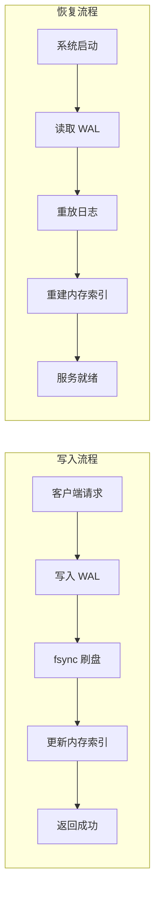

### 1.2 WAL 在存储系统中的位置

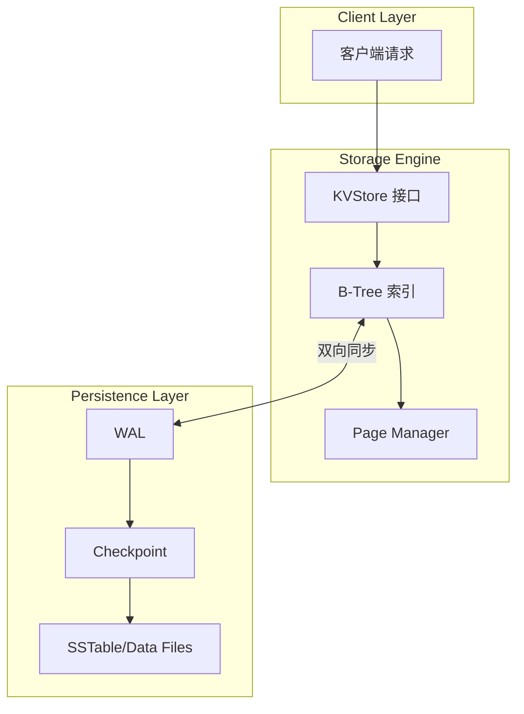

---

## 二、WAL 功能特性分级

### 2.1 Must-Have（必须实现）

> **定义**：MVP 阶段必须实现的核心功能，缺少将导致数据丢失或无法恢复

| 特性 | 说明 | 优先级 | 复杂度 |
|------|------|--------|--------|
| **Entry 结构** | 固定 Header + 变长 Payload | ⭐⭐⭐ | ⭐ |
| **顺序写入** | 追加写入，不修改已有数据 | ⭐⭐⭐ | ⭐ |
| **Sync 机制** | fsync 确保数据落盘 | ⭐⭐⭐ | ⭐ |
| **崩溃恢复** | Recover 重放日志恢复状态 | ⭐⭐⭐ | ⭐⭐ |
| **完整性校验** | CRC32/Checksum 检测损坏 | ⭐⭐⭐ | ⭐ |
| **事务原子性** | 单条 Entry 原子写入 | ⭐⭐⭐ | ⭐⭐ |

#### 2.1.1 Entry 结构设计

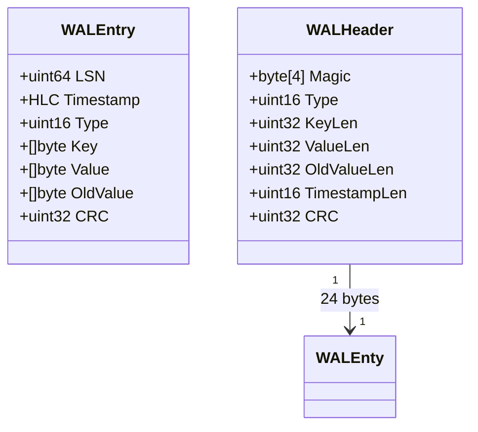

**NexKV 现有 Header 格式**（24 字节）：

```
+--------+------+--------+----------+-----------+-------------+---------+
| Magic  | Type | KeyLen | ValueLen | OldValLen | TimestampLen|   CRC   |
| 4 bytes|2 byte| 4 bytes|  4 bytes |  4 bytes  |   2 bytes   | 4 bytes |
+--------+------+--------+----------+-----------+-------------+---------+
```

#### 2.1.2 Sync 机制

```go
// 强制刷盘策略
type SyncPolicy int

const (
    SyncAlways   SyncPolicy = iota  // 每次写入都 fsync（最安全，性能最低）
    SyncBatch                        // 批量刷盘（平衡）
    SyncPeriodic                     // 定期刷盘（高性能，可能丢数据）
)
```

**Sync 流程**：

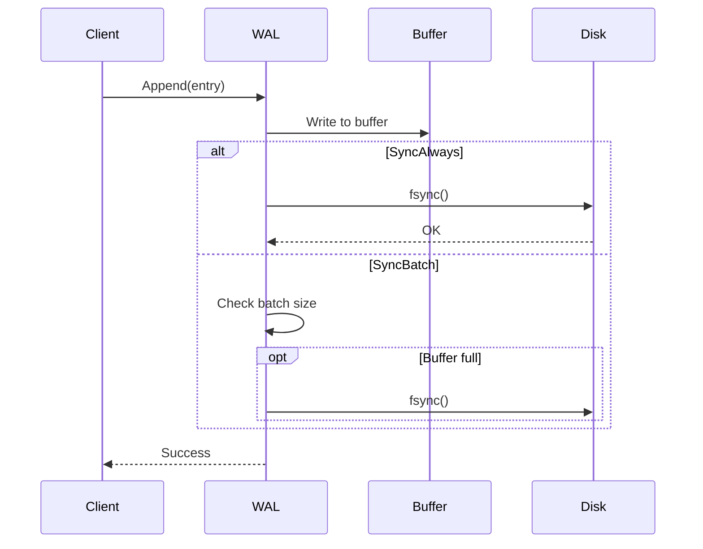

### 2.2 Should-Have（应该实现）

> **定义**：生产环境推荐的功能，显著提升性能和可维护性

| 特性 | 说明 | 优先级 | 复杂度 |
|------|------|--------|--------|
| **日志轮转** | 文件大小/时间限制，自动切换新文件 | ⭐⭐ | ⭐⭐ |
| **Checkpoint** | 定期快照，截断旧日志 | ⭐⭐ | ⭐⭐⭐ |
| **异步刷盘** | 后台线程定期 fsync | ⭐⭐ | ⭐⭐ |
| **压缩** | 日志条目压缩（Snappy/LZ4） | ⭐⭐ | ⭐⭐ |
| **Truncate** | 安全截断已持久化的日志 | ⭐⭐ | ⭐⭐ |
| **监控指标** | 大小、延迟、错误率等 | ⭐⭐ | ⭐ |

#### 2.2.1 日志轮转策略

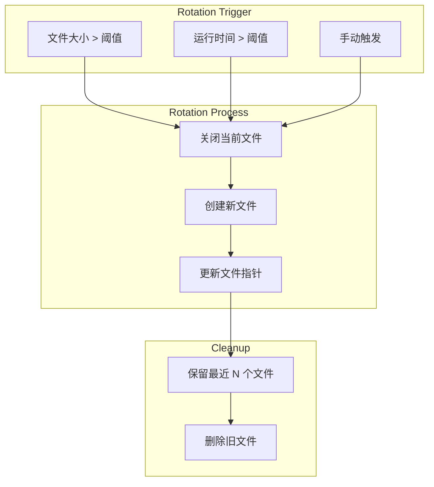

#### 2.2.2 Checkpoint 机制

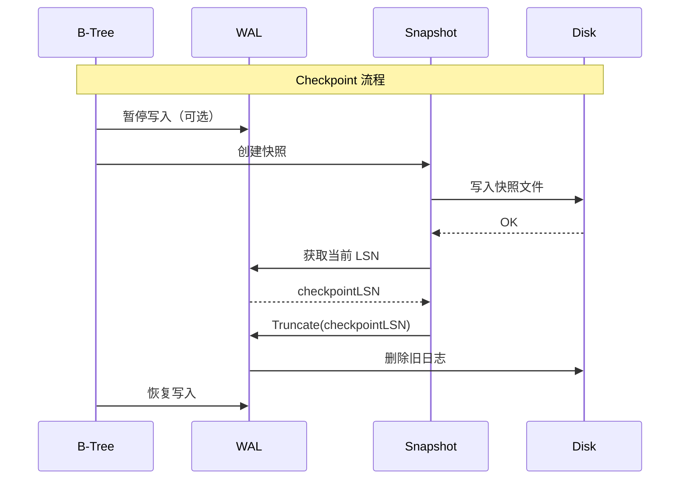

### 2.3 Optional（可选实现）

> **定义**：高级功能，适用于特定场景或进一步优化

| 特性 | 说明 | 优先级 | 复杂度 |
|------|------|--------|--------|
| **归档/备份** | 历史日志归档存储 | ⭐ | ⭐⭐ |
| **多副本同步** | WAL 复制到其他节点 | ⭐ | ⭐⭐⭐⭐ |
| **事务隔离** | 多条 Entry 原子提交 | ⭐ | ⭐⭐⭐ |
| **日志修复** | 损坏条目自动恢复 | ⭐ | ⭐⭐⭐ |
| **mmap** | 内存映射加速读取 | ⭐ | ⭐⭐ |

---

## 三、B-Tree + WAL 集成点

### 3.1 架构层次

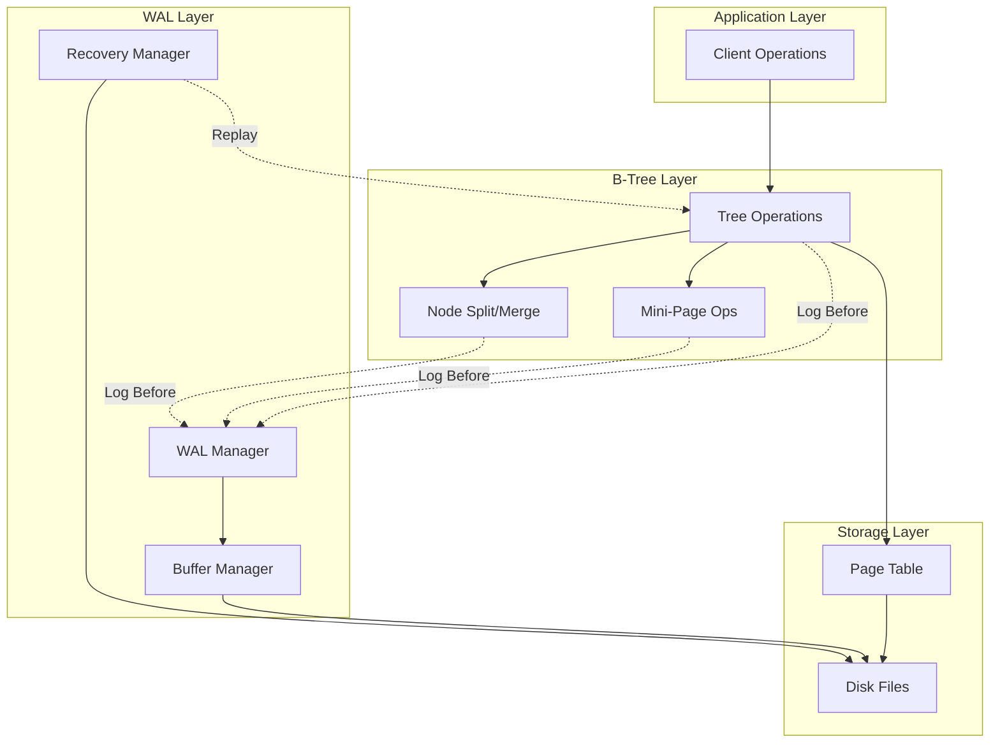

### 3.2 操作类型映射

| B-Tree 操作 | WAL Entry 类型 | 数据内容 |
|-------------|---------------|---------|
| **Insert(key, value)** | WALTypePut | Key + Value |
| **Delete(key)** | WALTypeDelete | Key |
| **NodeSplit(node)** | WALTypeNodeSplit | NodeID + SplitPoint + NewNode |
| **NodeMerge(node1, node2)** | WALTypeNodeMerge | NodeID1 + NodeID2 |
| **InsertMiniPage(page, delta)** | WALTypeInsertMiniPage | PageOffset + MiniPageData |
| **DeleteMiniPage(page)** | WALTypeDeleteMiniPage | PageOffset |
| **UpgradeToFullPage(page)** | WALTypeUpgradeToFullPage | PageOffset + FullPageData |
| **Checkpoint()** | WALTypeCheckpoint | CheckpointLSN + TreeMetadata |

### 3.3 WAL 写入时机

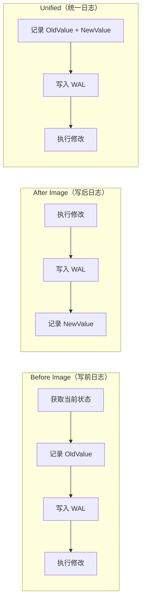

**NexKV 采用统一日志方案**：单条 Entry 包含 OldValue 和 NewValue，支持 Undo 和 Redo。

### 3.4 崩溃恢复流程

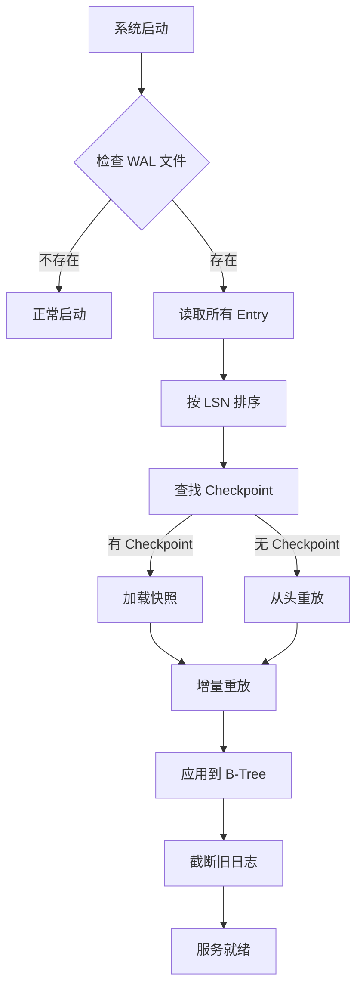

---

## 四、NexKV 现有 WAL 分析

### 4.1 已实现功能

| 功能 | 实现状态 | 位置 |
|------|---------|------|
| **Entry 序列化** | ✅ 完整 | `wal.go:568-622` |
| **顺序写入** | ✅ 完整 | `wal.go:96-129` |
| **Sync 机制** | ✅ 完整 | `wal.go:121` |
| **崩溃恢复** | ✅ 完整 | `wal.go:168-301` |
| **CRC32 校验** | ✅ 完整 | `wal.go:270-274` |
| **EOF 标记** | ✅ 完整 | `wal.go:303-352` |
| **Truncate** | ✅ 完整 | `wal.go:359-400` |
| **批量写入** | ✅ 完整 | `wal_batch.go` |
| **日志轮转** | ✅ 完整 | `wal_rotation.go` |

### 4.2 代码结构

```
internal/wal/
├── wal.go              # WAL 核心实现（687 行）
├── wal_batch.go        # 批量写入优化
├── wal_rotation.go     # 日志轮转
├── wal_recover.go      # 崩溃恢复
└── wal_test.go         # 测试用例
```

### 4.3 关键接口

```go
// MetadataWAL 元数据 WAL 实现
type MetadataWAL struct {
    file    *os.File
    path    string
    mu      sync.Mutex
    offset  int64  // 当前写入位置
    entries uint64 // 条目计数
    closed  bool
}

// 核心方法
func (w *MetadataWAL) Append(entry *WALEntry) error
func (w *MetadataWAL) Recover() ([]*WALEntry, error)
func (w *MetadataWAL) Truncate(offset int64) error
func (w *MetadataWAL) Sync() error
func (w *MetadataWAL) Close() error
```

### 4.4 现有 WAL 类型

```go
type WALType uint16

const (
    WALTypePut        WALType = iota  // 插入/更新
    WALTypeDelete                     // 删除
    WALTypeCheckpoint                 // 检查点
)
```

### 4.5 扩展需求分析

| 扩展项 | 现状 | Bf-Tree 需求 | 扩展方案 |
|--------|------|-------------|---------|
| **操作类型** | 3 种 | 5+ 种 | 扩展 WALType |
| **时间戳** | HLC | LSN + HLC | 添加 LSN 字段 |
| **Mini-Page** | 无 | 3 种操作 | 新增 WALType |
| **页面偏移** | 无 | BasePageOffset | 新增字段 |

---

## 五、Bf-Tree WAL 特有挑战

### 5.1 Mini-Page 操作日志

Bf-Tree 的核心特性是 **Mini-Page**（增量更新页面），需要特殊的 WAL 支持：

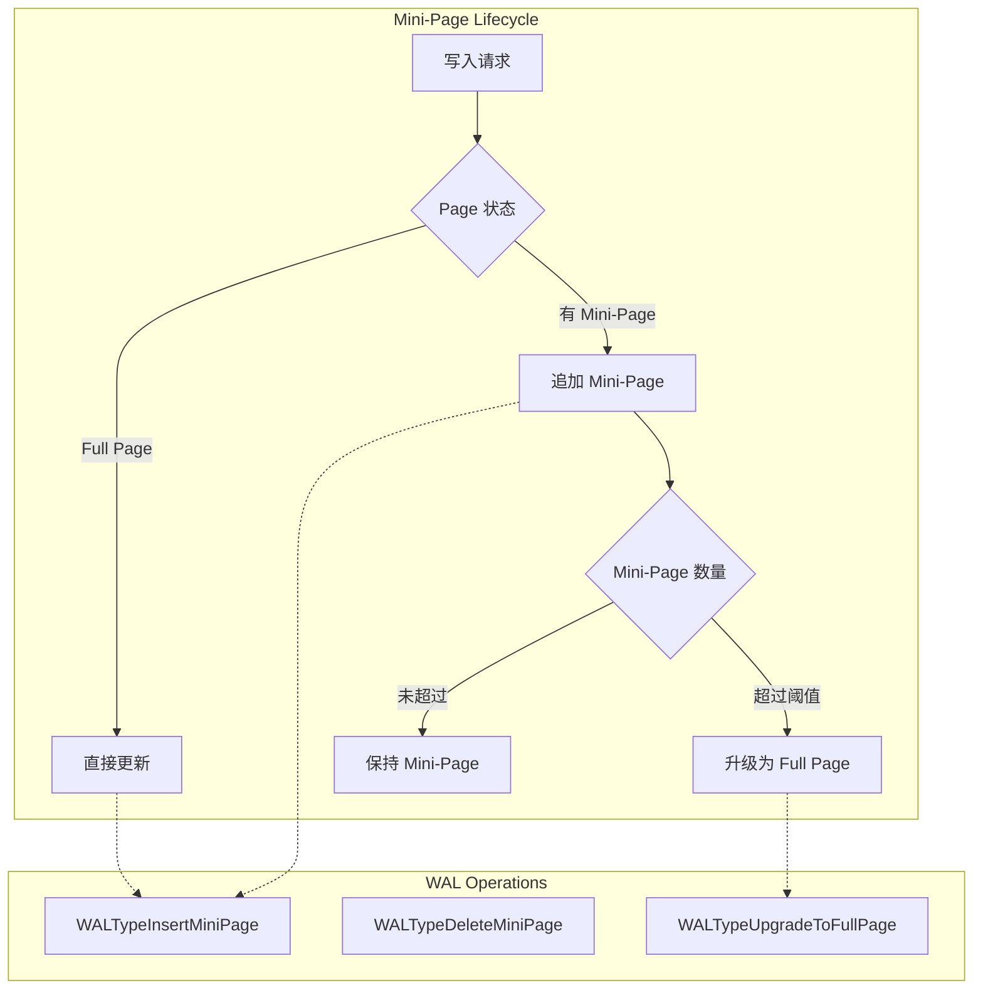

### 5.2 扩展的 WALType 定义

```go
// BfTreeWALType Bf-Tree 扩展的 WAL 类型
type BfTreeWALType uint16

const (
    // 基础操作（继承现有）
    BfTreeWALTypePut BfTreeWALType = iota
    BfTreeWALTypeDelete
    BfTreeWALTypeCheckpoint

    // Bf-Tree 特有操作
    BfTreeWALTypeInsertMiniPage      // 插入 Mini-Page
    BfTreeWALTypeDeleteMiniPage      // 删除 Mini-Page
    BfTreeWALTypeUpgradeToFullPage   // 升级到完整页面
    BfTreeWALTypeNodeSplit           // 节点分裂
    BfTreeWALTypeNodeMerge           // 节点合并
)
```

### 5.3 LSN vs HLC 映射

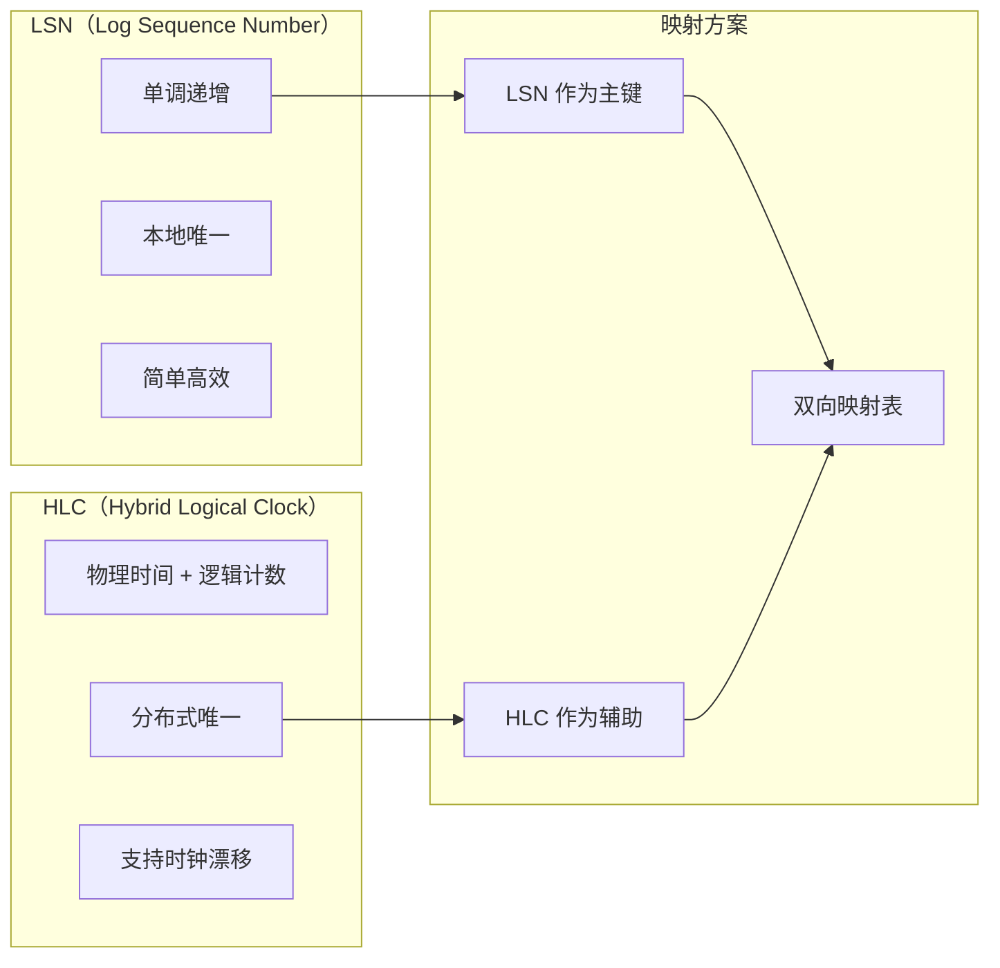

---

## 六、最佳实践与设计模式

### 6.1 Group Commit（组提交）

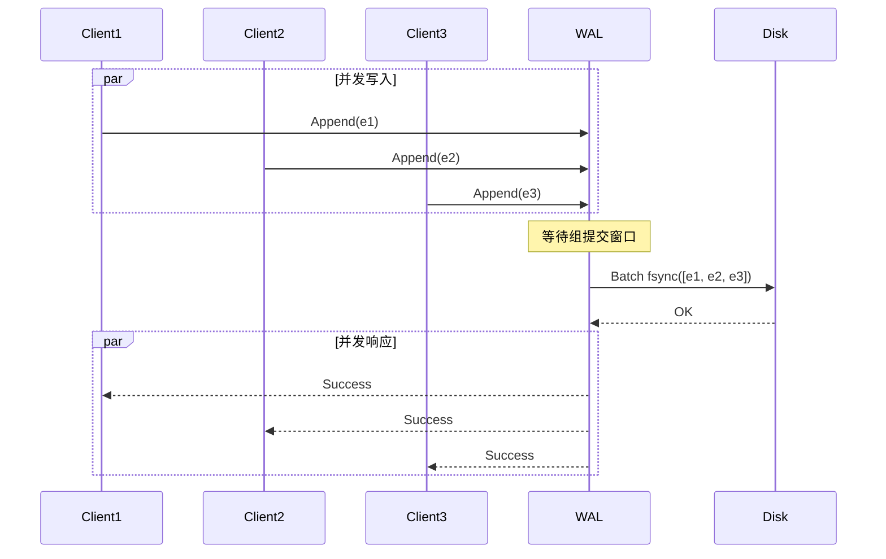

### 6.2 Write Batch（批量写入）

```go
// Batch 批量写入优化
type Batch struct {
    entries []*WALEntry
    size    int
    limit   int
}

func (b *Batch) Add(entry *WALEntry) error {
    if b.size >= b.limit {
        return ErrBatchFull
    }
    b.entries = append(b.entries, entry)
    b.size++
    return nil
}

func (w *MetadataWAL) AppendBatch(batch *Batch) error {
    w.mu.Lock()
    defer w.mu.Unlock()

    // 批量写入，只调用一次 fsync
    for _, entry := range batch.entries {
        if err := w.appendNoSync(entry); err != nil {
            return err
        }
    }

    return w.file.Sync()
}
```

### 6.3 Double-Write Buffer（双写缓冲）

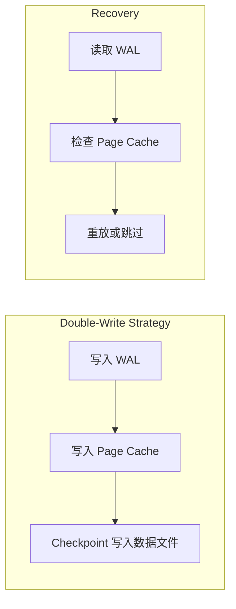

### 6.4 EOF 标记模式


---

## 七、性能优化策略

### 7.1 内存对齐

```go
const (
    // 磁盘块大小对齐
    BlockSize = 512

    // 页面大小对齐
    PageSize = 4096
)

// AlignSize 对齐到指定边界
func AlignSize(size int, alignment int) int {
    return (size + alignment - 1) & ^(alignment - 1)
}
```

### 7.2 缓冲区池化

```go
var bufferPool = sync.Pool{
    New: func() interface{} {
        buf := make([]byte, 64*1024) // 64KB 缓冲区
        return &buf
    },
}

func getBuffer() *[]byte {
    return bufferPool.Get().(*[]byte)
}

func putBuffer(buf *[]byte) {
    bufferPool.Put(buf)
}
```

### 7.3 异步刷盘

```go
type AsyncWAL struct {
    wal       *MetadataWAL
    flushCh   chan struct{}
    closeCh   chan struct{}
    pendingMu sync.Mutex
    pending   []*WALEntry
}

func (a *AsyncWAL) backgroundFlush() {
    ticker := time.NewTicker(100 * time.Millisecond)
    defer ticker.Stop()

    for {
        select {
        case <-ticker.C:
            a.flushPending()
        case <-a.flushCh:
            a.flushPending()
        case <-a.closeCh:
            return
        }
    }
}
```

---

## 八、实施建议

### 8.1 MVP 阶段（Phase 1）

| 任务 | 优先级 | 预计时间 |
|------|--------|---------|
| 扩展 WALType 支持新操作 | P0 | 1 天 |
| 实现 LSN/HLC 映射 | P0 | 1 天 |
| 测试崩溃恢复 | P0 | 2 天 |
| 集成到 Bf-Tree | P0 | 2 天 |

### 8.2 优化阶段（Phase 2）

| 任务 | 优先级 | 预计时间 |
|------|--------|---------|
| 实现 Group Commit | P1 | 2 天 |
| 优化缓冲区对齐 | P1 | 1 天 |
| 性能基准测试 | P1 | 2 天 |
| 监控指标集成 | P2 | 1 天 |

### 8.3 决策记录

| 决策项 | 选择 | 理由 |
|--------|------|------|
| **WAL 复用** | 扩展现有 | 减少重复代码，保持一致性 |
| **时间戳** | LSN + HLC | LSN 本地排序，HLC 分布式同步 |
| **Sync 策略** | SyncBatch | 平衡性能和安全性 |
| **缓冲区大小** | 64KB | 平衡内存占用和批量效率 |

---

## 九、测试策略

### 9.1 单元测试

| 测试场景 | 验证点 |
|---------|--------|
| Entry 序列化/反序列化 | 数据完整性 |
| CRC 校验 | 损坏检测 |
| 批量写入 | 原子性 |
| Truncate | 截断正确性 |

### 9.2 集成测试

| 测试场景 | 验证点 |
|---------|--------|
| 崩溃恢复 | 数据不丢失 |
| 并发写入 | 线程安全 |
| 日志轮转 | 无数据丢失 |
| Checkpoint | 恢复加速 |

### 9.3 压力测试

| 测试场景 | 指标 |
|---------|------|
| 顺序写入吞吐 | ops/s |
| 批量写入吞吐 | batches/s |
| 恢复时间 | 秒/GB |
| 内存占用 | MB |

---

## 十、总结

### 10.1 核心结论

1. **NexKV 现有 WAL 可复用**：核心功能完整，只需扩展操作类型
2. **Bf-Tree 特有需求**：Mini-Page 操作需要 3 种新 WAL 类型
3. **性能优化方向**：Group Commit、内存对齐、异步刷盘

### 10.2 推荐方案

**阶段 1**：扩展现有 WAL（推荐）

```go
// 扩展 WALType
const (
    WALTypePut WALType = iota
    WALTypeDelete
    WALTypeCheckpoint
    WALTypeInsertMiniPage      // 新增
    WALTypeDeleteMiniPage      // 新增
    WALTypeUpgradeToFullPage   // 新增
)
```

**阶段 2**：独立 Bf-Tree WAL（可选优化）

### 10.3 下一步行动

- [ ] 设计 WALType 扩展方案
- [ ] 实现 Mini-Page WAL 操作
- [ ] 编写崩溃恢复测试
- [ ] 性能基准测试

---

## 附录 A：参考资料

| 文档 | 链接 |
|------|------|
| Bf-Tree 论文 | [VLDB 2024](https://badrish.net/papers/bftree-vldb2024.pdf) |
| SQLite WAL | [sqlite.org/wal.html](https://www.sqlite.org/wal.html) |
| PostgreSQL WAL | [postgresql.org/docs/current/wal.html](https://www.postgresql.org/docs/current/wal.html) |
| MySQL Redo Log | [dev.mysql.com/doc/refman/8.0/en/innodb-redo-log.html](https://dev.mysql.com/doc/refman/8.0/en/innodb-redo-log.html) |

---

**文档版本**: v1.0
**创建日期**: 2026-02-22
**最后更新**: 2026-02-22
**维护者**: NexKV 开发团队
**状态**: 🔄 进行中
