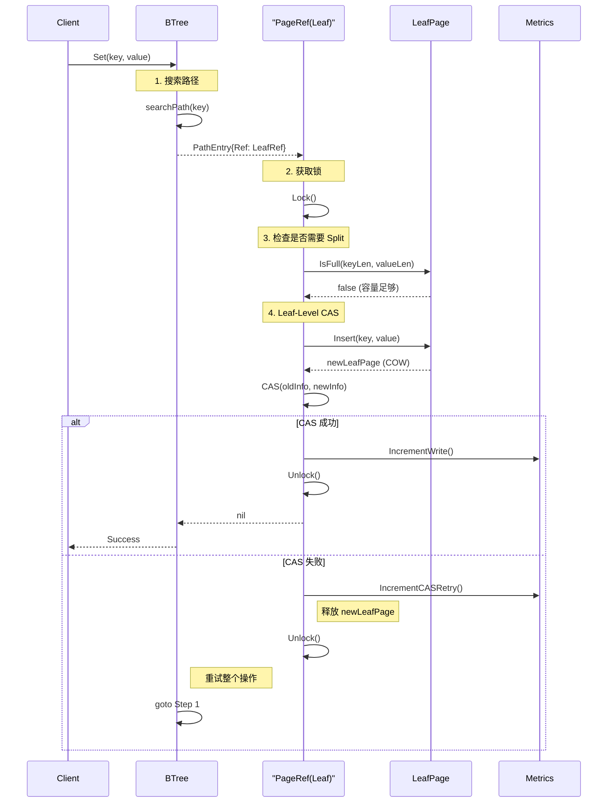
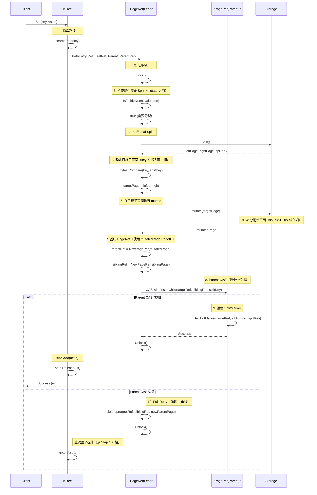
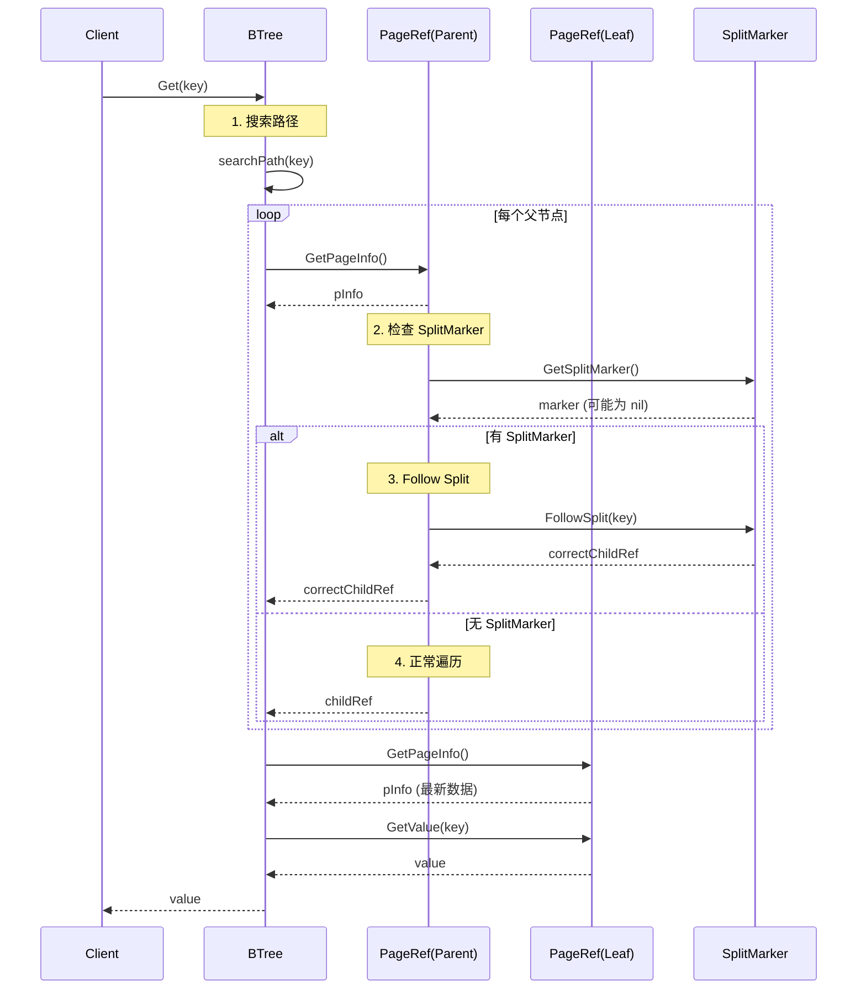
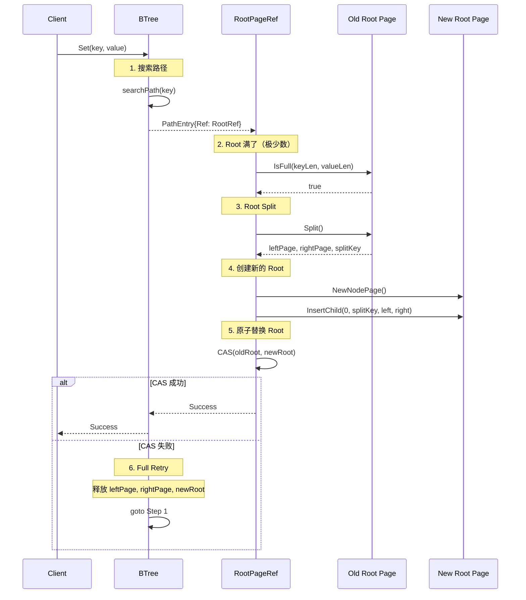

# BTree2 Implementation Guide

> 创建时间：2026-04-02
> 状态：设计中
> 配套：`2026-04-02-btree-refactor-interface.md` + `2026-04-02-btree-refactor-roadmap.md`

## 总览

本文档描述 btree2 各 Phase 的**关键路径实现细节**和**集成模式**。
非关键路径（如常量移植、辅助方法）只列要点。

### 复用矩阵

| 组件 | 来源 | 复用方式 |
|------|------|---------|
| `offheap.PageAccessor` | `offheap/page_accessor.go` | 原样复用，BTreeStorage 内部持有 |
| `offheap.PageManager` | `offheap/page_manager.go` | **修改**（移除 epoch，简化 Free） |
| `offheap.Allocator` | `offheap/allocator.go` | 原样复用 |
| `offheap.LockFreeQueue` | `offheap/lockfree_queue.go` | 原样复用 |
| `model.PageID` / `model.BTreeConfig` | `domain/model/` | 原样复用 |
| 二分查找 + KV 读写 | `offheap_adapter.go` | **移植**到 LeafPageHandle/NodePageHandle |

### 页面布局（4KB mmap）

```
┌──────────────┬──────────────────┬──────────────┐
│ PageHeader   │ Entry 数组        │ KV 数据区     │
│ 56B          │ N × 16B           │ 变长          │
│              │ (LeafEntry/IndexEntry)           │
└──────────────┴──────────────────┴──────────────┘
 共 4096 字节

PageHeader: version(8) + prevPage(4) + nextPage(4) + extraChild(8)
          + count(2) + pageType(1) + deleted(1)
          + [padding 4B] + deleteEpoch(8)
          + refCount(4) + inQueue(4) + pad(3)
          + [padding 5B]
          = 56B（Go 编译器对齐：deleteEpoch 需 8B 对齐，结构体整体对齐到 8B）
          验证：unsafe.Sizeof(PageHeader{}) = 56

LeafEntry(16B): keyOff(4) + keyLen(4) + valOff(4) + valLen(4)
IndexEntry(16B): keyOff(4) + keyLen(4) + child(8)  // child = pageID(4) + version(4)
```

---

## Phase 0: 脚手架

### 关键路径

无。纯文件创建 + 常量移植。

### 集成要点

```
btree2/
  errors.go      — 7 个哨兵错误，不依赖 pkg/errors
  constants.go   — 从 btree/constants.go 移植，改用 exported 命名
```

**移植清单**：
- `maxInternalKeys = 180` → `MaxInternalKeys = 126`（基于 avgKey=16B：`(4096-56)/(16+16)=126`）
- `DefaultPageSize = 4096` → 直接引用 `model.DefaultPageSize`
- `InitialLeafCapacity = 200` → 不需要（btree2 不用 Go slice 缓存）
- MaxLeafKeys → 不固定，叶子 IsFull(keyLen, valueLen) 用空间计算而非 count
- 分裂保护：运行时 `UsedSpace() + required > PageSize` → `ErrPageFull`

### 验证

| 测试名 | 目的 |
|--------|------|
| `TestBuildSucceed` | `go build ./internal/infrastructure/storage/btree2/...` 编译通过 |
| `TestErrorSentinels` | 7 个哨兵错误互不相等，errors.Is 正确匹配 |
| `TestConstantValues` | MaxInternalKeys=126, HeaderSize=56 等常量值正确 |

---

## Phase 1: BTreeStorage

### 关键路径：COW 页面复制

`OffheapBTreeStorage` 是 btree2 与 offheap 之间的**唯一桥梁**。

```go
type OffheapBTreeStorage struct {
    pm     *offheap.PageManager
    pa     *offheap.PageAccessor
    closed atomic.Bool
}
```

#### CopyLeafPage — COW 核心

```
CopyLeafPage(srcID):
1. dstID := pm.Alloc()                          // 分配新物理页面
2. src := pm.GetPage(srcID)                      // 获取源 mmap []byte
3. dst := pm.GetPage(dstID)                      // 获取目标 mmap []byte
4. copy(dst, src)                                // 4096 字节整体复制
5. dst.SetVersion(src.Version() + 1)             // 版本号递增（P0-7: 实际通过 pa 封装调用）
6. // P0-3: 不设置 mmap 侧 refCount，Go 侧 PageRef.refCount 管理引用计数
7. leaf := &LeafPageHandle{pageID: dstID, pa: pa}
8. return dstID, leaf, nil
```

**关键**：`copy(dst, src)` 是 4096 字节的 memcpy，这是 COW 的全部开销。
后续 Insert/Update/Delete 在 dst 上原地修改（已独占），src 不变。

#### 修改 PageManager：移除 Epoch

```go
// 修改 page_manager.go:

// 移除:
//   - delayedFreeList *LockFreeQueue
//   - currentEpoch atomic.Uint64
//   - delayedEpochFree 相关方法

// 简化 Free:
func (pm *PageManager) Free(pageID uint32) error {
    // 直接将 pageID 放入 freeList（LockFreeQueue）
    pm.freeList.Enqueue(pageID)
    return nil
}
```

**影响范围**：只修改 `offheap/page_manager.go`，不影响 `PageAccessor`。btree2 不使用 `OffHeapMaterializer`（P2-8 决策）。

### 集成要点

- `OffheapBTreeStorage` 持有 `*offheap.PageManager`（不是 interface）
- 测试时通过 `btree2.BTreeStorage` interface mock
- Merge/Borrow 方法此 Phase 只定义签名，Phase 6.5 实现

### 验证

| 测试名 | 目的 |
|--------|------|
| `TestAllocFreeBasic` | Alloc 分配页面，Free 释放页面，页面计数正确 |
| `TestAllocLeafNodeTypes` | AllocLeafPage 和 AllocNodePage 初始化正确的 pageType |
| `TestCopyLeafPage` | COW 复制后 dst 数据与 src 一致，dst.PageID != src.PageID |
| `TestCopyNodePage` | 同上，内部节点版本 |
| `TestCopyPageVersionIncrement` | COW 后 dst.Version == src.Version + 1 |
| `TestRefCountImmediateRecycle` | refCount 归零立即回收，FreePage 被调用 |
| `TestFreeWhileReferenced` | 有引用时 FreePage 不被调用 |
| `TestConcurrentAllocFree` | 多 goroutine 并发 alloc/free 无 data race |
| `TestPageIDValidation` | PageID 超过 uint32 max 返回错误 |

---

## Phase 2: LeafPageHandle

### 关键路径：二分查找 + COW Insert

#### LeafPageHandle 结构

```go
type leafPageHandle struct {
    id      model.PageID
    pa      *offheap.PageAccessor
    storage *OffheapBTreeStorage  // 持有具体类型，用于 COW copy + pm.Alloc/Free
}
```

**设计决策（Phase 2 新增）**：leafPageHandle 持有 `*OffheapBTreeStorage` 具体类型而非 `BTreeStorage` 接口。

**原因**：
1. Delete 需要 `pm.Alloc()` + `pa.InitLeafPage()` + `CollectKVExcept()` + 逐条 `InsertLeafEntry()`
2. Split 需要 `pm.Alloc()` + `pa.BulkInitLeafFromSource()`
3. 这些底层操作不应暴露到 `BTreeStorage` 接口上（接口面向上层 BTree 消费者）
4. leafPageHandle 是包内私有类型，与 OffheapBTreeStorage 同包，直接依赖合理（P1-9 决策：btree2 和 offheap 都在 infrastructure 层）

**调用方式**：
- `h.storage.CopyLeafPage(h.id)` — COW 复制
- `h.storage.pm.Alloc()` — 直接访问 PageManager 分配页面
- `h.storage.pa.BulkInitLeafFromSource(...)` — 批量初始化
- `h.pa.InsertLeafEntry(...)` — 逐条插入（pa 与 storage.pa 是同一个引用）

#### Search（二分查找）

直接移植 `offheap_adapter.go` 的 `SearchLeaf`：

```
Search(key):
1. count := pa.GetCount(pageID)
2. lo, hi := 0, count-1
3. while lo <= hi:
4.     mid := (lo + hi) / 2
5.     midKey := pa.GetKey(pageID, keyOff[mid], keyLen[mid])
6.     cmp := bytes.Compare(key, midKey)
7.     if cmp == 0: return mid, true
8.     if cmp < 0: hi = mid - 1
9.     else: lo = mid + 1
10. return lo, false  // 插入位置
```

#### Insert（COW）

```
Insert(key, value):
1. rawID := uint32(h.id)
2. srcVersion := h.pa.GetVersion(rawID)
3. newRawID, err := h.storage.pm.Alloc()           // 分配新物理页面
4. srcPtr := h.storage.pm.PageIDToPtr(rawID)
5. dstPtr := h.storage.pm.PageIDToPtr(newRawID)
6. copy(dstSlice, srcSlice)                          // 4096B memcpy
7. h.pa.SetVersion(newRawID, srcVersion+1)           // version++
8.
9. // 在 newRawID 上原地插入（独占的新页面）
10. idx, found := h.Search(key)
11. if found:
12.     h.storage.pm.Free(newRawID)                  // 回滚：释放刚分配的页面
13.     return nil, ErrDuplicateKey
14. dataEnd := h.pa.GetDataEnd(newRawID)
15. err = h.pa.InsertLeafEntry(newRawID, idx, key, value, &dataEnd)
16. if err != nil:
17.     h.storage.pm.Free(newRawID)                  // 回滚
18.     return nil, fmt.Errorf("insert entry: %w", err)
19. newID := model.PageID(newRawID)
20. return &leafPageHandle{id: newID, pa: h.pa, storage: h.storage}, nil
```

**关键**：Insert 在 COW 后的新页面上操作，旧页面完全不变。
如果 DuplicateKey 或 InsertLeafEntry 失败，立即释放新分配的页面（回滚）。
调用方（writeOperation）负责 CAS 替换 PageRef 的 PageInfo。

#### Split（叶子分裂）

```
Split():
1. count := h.Count()
2. if count < 2: return nil, nil, nil, fmt.Errorf("split: page has < 2 entries")
3. mid := count / 2
4.
5. // splitKey = 右页面第一个 key 的副本（copy-up 语义）
6. keyOff, keyLen, _, _ := h.pa.GetLeafEntryOffset(uint32(h.id), mid)
7. splitKey := h.pa.GetKey(uint32(h.id), keyOff, keyLen)
8. splitKeyCopy := make([]byte, len(splitKey))
9. copy(splitKeyCopy, splitKey)
10.
11. // 分配左页面（通过 storage.pm 直接分配）
12. leftRawID, err := h.storage.pm.Alloc()
13. rightRawID, err := h.storage.pm.Alloc()
14. if err != nil: return nil, nil, nil, fmt.Errorf("split alloc: %w", err)
15.
16. // 零拷贝批量初始化（BulkInitLeafFromSource 内部调用 InitLeafPage + 逐条 Insert）
17. _, err = h.pa.BulkInitLeafFromSource(uint32(h.id), leftRawID, 0, mid)
18. _, err = h.pa.BulkInitLeafFromSource(uint32(h.id), rightRawID, mid, count)
19. if err != nil:
20.     h.storage.pm.Free(leftRawID)
21.     h.storage.pm.Free(rightRawID)
22.     return nil, nil, nil, fmt.Errorf("split bulk init: %w", err)
23.
24. left := &leafPageHandle{id: model.PageID(leftRawID), pa: h.pa, storage: h.storage}
25. right := &leafPageHandle{id: model.PageID(rightRawID), pa: h.pa, storage: h.storage}
26. return left, right, splitKeyCopy, nil
```

**注意**：叶子 Split 是 copy-up 语义（splitKey 保留在右页面中，同时也复制提升到父节点）。
BulkInitLeafFromSource 接收 [startIdx, endIdx) 范围，自动调用 InitLeafPage + 逐条 InsertLeafEntry。

### 集成要点

- **leafPageHandle 持有 `*OffheapBTreeStorage`**（具体类型），可直接访问 `pm`/`pa` 进行底层操作
- LeafPageHandle 不持有 mmap []byte，每次操作通过 PageAccessor 实时读取
- GetKey/GetValue 返回副本（`make([]byte, len)` + `copy`）
- Capacity() = `float64(usedBytes) / float64(PageSize)`
- **IsFull(keyLen, valueLen) 精确空间计算**：
  - Leaf: `UsedSpace + SizeofLeafEntry + keyLen + valueLen > PageSize × 0.95`
  - Node: 双重判定 — `count >= MaxInternalKeys` 兜底 + 空间计算（阈值 0.90，处理短 key 场景下 count 先到但空间未满的情况）
  - Node 需要 count 兜底是因为 126 entries × 8B key = 74.8% 空间利用率，低于空间阈值
- **Delete 实现**：`CollectKVExcept(idx)` → `pm.Alloc()` → `InitLeafPage(newID, version+1)` → 逐条 `InsertLeafEntry` → 返回新 handle
- **Split 实现**：`pm.Alloc()` × 2 → `BulkInitLeafFromSource` × 2 → copy-up splitKey
- **Update 实现**：先 COW copy → `OverwriteLeafValue(newRawID, idx, newValue)` → 若 value 更大则走 delete+insert 路径
- **错误回滚**：COW/Alloc 失败时立即 `pm.Free()` 释放已分配的页面，不留垃圾

### 验证

| 测试名 | 目的 |
|--------|------|
| `TestLeafInsertSearch` | 插入 N 个 key，Search 全部命中，验证 index 和 found |
| `TestLeafSearchMiss` | Search 不存在的 key 返回 `(insertPos, false)` |
| `TestLeafCOW` | Insert/Update/Delete 返回新 pageID，原页面数据不变 |
| `TestLeafCOWOriginalImmutable` | COW 后修改 dst，src 的 GetKey/GetValue 不受影响 |
| `TestLeafInsertKeyOrdering` | 操作后所有 key 保持升序 |
| `TestLeafUpdateValue` | Update 后同一 idx 的 value 变化，count 不变 |
| `TestLeafDeleteMiddle` | 删除中间 entry，后续 entry 前移，count-1 |
| `TestLeafDeleteFirst` | 删除第一个 entry，count-1，剩余 key 有序 |
| `TestLeafDeleteLast` | 删除最后一个 entry，count-1，剩余 key 有序 |
| `TestLeafSplit` | 满页 Split 后 left.Count + right.Count == 原始 count |
| `TestLeafSplitKeyBoundary` | splitKey > left 所有 key，splitKey <= right 所有 key |
| `TestLeafSplitEvenOdd` | count 为奇数/偶数时 Split 结果均正确 |
| `TestLeafGetKeyReturnsCopy` | GetKey 返回副本，修改不影响页面数据 |
| `TestLeafGetValueReturnsCopy` | GetValue 返回副本，修改不影响页面数据 |
| `TestLeafIsFull` | 填满页面后 IsFull(keyLen, valueLen) == true，空页面 == false |
| `TestLeafCapacity` | Capacity() 在空页面接近 0.0，满页面接近 1.0 |
| `TestLeafDuplicateInsert` | 插入重复 key 返回 ErrDuplicateKey |
| `TestLeafInsertReverseOrder` | 逆序插入 N 个 key，全部 Search 命中且有序 |
| `TestLeafInsertEmptyKey` | 空 key 边界：插入/搜索空 byte 切片不 panic |

---

## Phase 3: NodePageHandle + Search

### 关键路径：子页面索引 + searchPath

#### NodePageHandle

```go
type NodePageHandle struct {
    pageID model.PageID
    pa     *offheap.PageAccessor
}
```

#### SearchChildIndex

```
Search(key):
1. count := pa.GetCount(pageID)       // key 数量（不含 extraChild）
2. lo, hi := 0, count-1
3. while lo <= hi:
4.     mid := (lo + hi) / 2
5.     midKey := pa.GetKey(pageID, keyOff[mid], keyLen[mid])
6.     cmp := bytes.Compare(key, midKey)
7.     if cmp == 0: return mid + 1, true  // 走右侧子树
8.     if cmp < 0: hi = mid - 1
9.     else: lo = mid + 1
10. return lo, false
```

**注意**：NodePage 有 count 个 key 和 count+1 个子页面。
子页面索引 = key 索引 或 key 索引+1，取决于比较结果。

#### InsertChild（COW）

```
InsertChild(idx, splitKey, leftID, rightID):
1. dstID, node := storage.CopyNodePage(pageID)   // COW
2. // 在 idx 位置插入 splitKey
3. // 将 children[idx] 替换为 leftID，children[idx+1] 设为 rightID
4. pa.InsertIndexEntry(dstID, idx, splitKey, rightID, &dataEnd)
5. pa.SetChild(dstID, idx, leftID)
6. return &NodePageHandle{pageID: dstID, pa: pa}, nil
```

### searchPath 构建

```
searchPath(root, storage, key):
1. path := make(SearchPath, 0, 8)  // 预分配 8 层
2. currentRef := root.PageRef
3. currentRef.Retain()
4.
5. for:
6.     pInfo := currentRef.GetPageInfo()
7.     pageID := pInfo.PageID
8.
9.     if currentRef.GetSplitMarker() != nil:
10.        currentRef = currentRef.FollowSplit(key)
11.        // 重新获取 pInfo
12.        pInfo = currentRef.GetPageInfo()
13.        pageID = pInfo.PageID
14.
15.    children := currentRef.GetOrCreateChildren(storage)
16.
17.    if children == nil:
18.        // 叶子页
19.        path = append(path, PathEntry{Ref: currentRef, Index: -1})
20.        return path
21.
22.    node := storage.GetNodePage(pageID)
23.    idx, _ := node.Search(key)
24.    path = append(path, PathEntry{Ref: currentRef, Index: idx})
25.
26.    childRef := children[idx]
27.    childRef.Retain()
28.    currentRef = childRef
```

### 集成要点

- searchPath 的路径上所有 Ref 都已 Retain，调用方负责 ReleaseAll
- GetOrCreateChildren 使用 `atomic.Pointer[[]*PageRef]` CAS 懒加载
- 叶子判断：`children == nil`（叶子页没有子节点引用）

### 验证

| 测试名 | 目的 |
|--------|------|
| `TestNodeSearchChildIndex` | key 落在各区间时返回正确的 child index |
| `TestNodeSearchEqualKey` | key 等于某 entry key 时走右侧子树 (idx+1) |
| `TestNodeInsertChild` | InsertChild 后子页面数 = 原始 + 1，extraChild 正确 |
| `TestNodeInsertChildAtEnd` | idx == count 时 extraChild 更新逻辑正确 |
| `TestNodeInsertChildMiddle` | idx 在中间时 extraChild 不变，新 child 插入正确位置 |
| `TestNodeRemoveChild` | RemoveChild 后子页面数 = 原始 - 1，剩余 key 有序 |
| `TestNodeReplaceChild` | ReplaceChild 后 ChildCount 不变，child[idx] 更新 |
| `TestNodeSplit` | 内部节点 Split 后 splitKey 不保留在 left 或 right |
| `TestSearchPathToLeaf` | N 层树 searchPath 长度 = N+1，末端是叶子 |
| `TestSearchPathRetainRelease` | 路径上所有 Ref 的 refCount 正确递增 |
| `TestSearchEmptyTree` | 空树（只有空根叶子）searchPath 返回单元素路径 |
| `TestNodeChildNavigation` | 2 层树搜索 key 落在正确的子页面 |
| `TestSearchSplitMarkerFollow` | SplitMarker 跟随：key < splitKey → Left，key >= splitKey → Right |
| `TestSearchSplitMarkerRefCount` | 跟随后 Release 旧 ref + Retain 新 ref |

---

## Phase 4: PageRef + RootPageRef

### 关键路径：CAS + SplitMarker + 引用计数

#### PageRef 创建

```go
func NewPageRef(freeFunc func(model.PageID)) *PageRef {
    return &PageRef{
        freeFunc: freeFunc,
    }
}
```

#### GetOrCreateChildren — 并发安全懒加载

```
GetOrCreateChildren(storage):
1. if c := children.Load(); c != nil:
2.     return *c
3.
4. // 需要从页面数据构建子 PageRef 列表
5. pInfo := pInfo.Load()
6. node := storage.GetNodePage(pInfo.PageID)
7. childCount := node.ChildCount()
8. newChildren := make([]*PageRef, childCount)
9. for i := 0; i < childCount; i++:
10.    childID := node.GetChild(i)
11.    newChildren[i] = NewPageRef(storage.FreePage)
12.    newChildren[i].pInfo.Store(&PageInfo{PageID: childID})
13.    newChildren[i].parentRef = self  // 设置父引用
14.
15. if children.CompareAndSwap(nil, &newChildren):
16.    return newChildren
17. return *children.Load()  // 另一个 goroutine 先完成了
```

#### Release — refCount 归零释放

```
Release():
1. newCount := refCount.Add(-1)
2. if newCount > 0:
3.     return
4. if newCount < 0:
5.     panic("negative refCount")  // 编程错误
6. // refCount == 0，释放页面
7. pInfo := pInfo.Load()
8. if pInfo != nil && pInfo.PageID != model.InvalidPageID:
9.     freeFunc(pInfo.PageID)
```

#### RootPageRef.ReplaceRoot

```
ReplaceRoot(newRootRef, newInfo):
1. // 设置新根的子节点的 parentRef
2. children := newRootRef.GetOrCreateChildren(storage)
3. for _, child := range children:
4.     child.parentRef = &r.PageRef  // RootPageRef
5.
6. // CAS 替换根 PageInfo
7. oldInfo := r.pInfo.Load()
8. return r.CAS(oldInfo, newInfo)
```

### SchedulerLock

```go
type SchedulerLock struct {
    state atomic.Int32
}

func (l *SchedulerLock) Lock() {
    for !l.state.CompareAndSwap(0, 1) {
        runtime.Gosched()  // 让出 CPU
    }
}

func (l *SchedulerLock) Unlock() {
    if !l.state.CompareAndSwap(1, 0) {
        panic("unlock of unlocked lock")
    }
}
```

### 集成要点

- PageRef.freeFunc 在创建时绑定 `storage.FreePage`，Release 无参数
- SplitMarker 在 Phase 6 使用，Phase 4 只定义 atomic 字段
- RootPageRef 嵌入 PageRef，无额外字段，parentRef 始终 nil

### 验证

| 测试名 | 目的 |
|--------|------|
| `TestPageRefCASSuccess` | CAS(old, new) 返回 true，GetPageInfo() == new |
| `TestPageRefCASConflict` | CAS 两次同 old，第二次返回 false |
| `TestPageRefRetainRelease` | Retain N 次，Release N 次后 refCount == 0，FreePage 被调用 |
| `TestPageRefReleasePanicsOnNeg` | Release 超过 Retain 次数时 panic |
| `TestPageRefReleaseWithNilPageInfo` | pInfo 为 nil 时不 panic 也不调 freeFunc |
| `TestPageRefReleaseWithInvalidPageID` | PageID==InvalidPageID 时调 freeFunc 但不 crash |
| `TestParentRefChain` | GetPathToRoot 从叶到根路径正确 |
| `TestRootPageRefParentNil` | RootPageRef 的 parentRef 始终 nil |
| `TestGetOrCreateChildrenLazy` | 首次调用构建 children，二次调用返回同一切片 |
| `TestGetOrCreateChildrenCASFail` | CAS 失败的 goroutine 不泄漏 PageRef |
| `TestGetOrCreateChildrenConcurrent` | 多 goroutine 并发懒加载，全部返回同一切片 |
| `TestReplaceRoot` | ReplaceRoot 原子切换，新根子节点的 parentRef 正确 |
| `TestReplaceRootCASFail` | 根替换 CAS 失败，FreePage 被调用，旧根不变 |
| `TestSchedulerLockBasic` | Lock/Unlock 配对，无死锁 |
| `TestSchedulerLockTryLock` | 已锁时 TryLock 返回 false |
| `TestConcurrentCAS` | 多 goroutine 竞争 CAS，只有一个成功 |
| `TestSplitMarkerSetGet` | SetSplitMarker 后 GetSplitMarker 返回正确值 |
| `TestSplitMarkerFollowSplit` | FollowSplit 根据 key 选择 Left 或 Right |

> **Phase 4 代码审查发现的问题及修复方案**见 [附录：Phase 4 代码审查修复方案](#phase-4-代码审查修复方案2026-04-02)。


## Phase 5: BTree 核心 + WriteOperation

### 关键路径：writeOperation 模板 + Get 无锁读

#### Get — 无锁读

```
Get(ctx, key):
1. path := searchPath(root, storage, key)
2. defer path.ReleaseAll()
3.
4. leafRef := path.Leaf().Ref
5. pInfo := leafRef.GetPageInfo()
6. leaf := storage.GetLeafPage(pInfo.PageID)
7. idx, found := leaf.Search(key)
8. if !found:
9.     return nil, ErrKeyNotFound
10. value := leaf.GetValue(idx)  // 返回副本
11. return value, nil
```

#### writeOperation — CAS 冲突重试

```
writeOperation(ctx, key, mutate, checkSplit, checkMerge):
const maxRetries = 100
for attempt := 0; attempt < maxRetries; attempt++:
    select:
    case <-ctx.Done():
        return ctx.Err()
    default:

    path := searchPath(root, storage, key)
    leafRef := path.Leaf().Ref
    leafRef.Lock()

    pInfo := leafRef.GetPageInfo()
    leaf := storage.GetLeafPage(pInfo.PageID)
    newLeaf, err := mutate(leaf)
    if err != nil:
        leafRef.Unlock()
        path.ReleaseAll()
        return err

    newInfo := &PageInfo{
        PageID:  newLeaf.PageID(),
        Version: pInfo.Version + 1,
    }

    if leafRef.CAS(pInfo, newInfo):
        // P0-4: SplitMarker 在叶子 CAS 成功后立即设置（Unlock 前）
        // Split 操作在 CAS+Unlock 之前完成判断
        if checkSplit && newLeaf.IsFull(keyLen, valueLen):
            left, right, splitKey := newLeaf.Split()
            leafRef.SetSplitMarker(left.Ref, right.Ref, splitKey)
            leafRef.Unlock()
            propagateSplit(leafRef, left, right, splitKey)
        else if checkMerge && newLeaf.Capacity() < 0.5:
            leafRef.Unlock()
            propagateMerge(leafRef, newLeaf)
        else:
            leafRef.Unlock()
        path.ReleaseAll()
        return nil
    else:
        storage.FreePage(newLeaf.PageID())
        leafRef.Unlock()
        path.ReleaseAll()
        metrics.CASConflicts.Add(1)

return ErrCASConflict  // 超过重试上限
```

**调用方（P0-5 决策）**：
- `Set` → `checkSplit=true, checkMerge=false`（Insert 增加 count → 只检查 Split）
- `Delete` → `checkSplit=false, checkMerge=true`（Delete 减少 count → 只检查 Merge）

#### BTree 构造

```
NewBTree(storage, opts...):
1. rootID, err := storage.AllocLeafPage()  // 空根叶子
2. rootRef := &RootPageRef{}
3. rootRef.pInfo.Store(&PageInfo{PageID: rootID, Version: 1})
4. rootRef.freeFunc = storage.FreePage
5. tree := &BTree{rootRef: rootRef, storage: storage}
6. for _, opt := range opts:
7.     opt(tree)
8. return tree, nil
```

### 集成要点

- writeOperation 中 mutate 函数由 Set/Delete 传入（lambda）
- CAS 失败时 FreePage 释放 COW 的新页面，旧页面不受影响
- path.ReleaseAll() 必须在所有退出路径上调用，防止 refCount 泄漏

**Set 的 mutate lambda（upsert 语义）**：

```
Set(ctx, key, value):
    mutate := func(leaf LeafPage) (LeafPage, error):
        idx, found := leaf.Search(key)
        if found:
            return leaf.Update(idx, value)   // COW 后替换 value，count 不变
        return leaf.Insert(key, value)        // COW 后插入新 entry，count+1
    return b.writeOperation(ctx, key, mutate, checkSplit: true, checkMerge: false)

// 关键：checkSplit=true → Insert 增加 count 时可能触发 Split
//       Update 不增加 count → 即使 checkSplit=true 也不会触发（IsFull 由空间判定）
//       checkMerge=false → Set 永远不触发 Merge
```

**Delete 的 mutate lambda**：

```
Delete(ctx, key):
    mutate := func(leaf LeafPage) (LeafPage, error):
        idx, found := leaf.Search(key)
        if !found:
            return nil, ErrKeyNotFound
        return leaf.Delete(idx)               // COW 后删除 entry，count-1
    return b.writeOperation(ctx, key, mutate, checkSplit: false, checkMerge: true)

// 关键：checkSplit=false → Delete 永远不触发 Split
//       checkMerge=true → Delete 减少 count 后可能触发 Merge
```

### 验证

| 测试名 | 目的 |
|--------|------|
| `TestBTreeNewEmpty` | NewBTree 创建空树，rootRef 不为 nil，size == 0 |
| `TestBTreeOpenExisting` | OpenBTree 从已有 pageID 恢复，Get 可读取旧数据 |
| `TestBTreeSetGet` | Set(key, val) → Get(key) 返回 val |
| `TestBTreeGetNotFound` | Get 不存在的 key 返回 ErrKeyNotFound |
| `TestBTreeUpdate` | Set 同一 key 两次，Get 返回最新 value |
| `TestBTreeDelete` | Delete 后 Get 返回 ErrKeyNotFound |
| `TestBTreeDeleteNotFound` | Delete 不存在的 key 返回 ErrKeyNotFound |
| `TestBTreeUpsertSemantics` | Set 新 key → Set 同 key 新 value → Get 返回新 value |
| `TestBTreeLargeDataset` | 插入 10k+ keys，全部可检索 |
| `TestBTreeConcurrentSet` | 多 goroutine 并发 Set，全部成功，无数据丢失 |
| `TestBTreeNoDataLoss` | 移植 btree_regression_test 场景 |
| `TestWriteOperationCASRetry` | CAS 冲突后重试成功 |
| `TestWriteOperationCASRetryLimit` | 重试超过上限返回 ErrCASConflict |
| `TestWriteOperationContextCancel` | ctx 取消后 writeOperation 返回 ctx.Err() |
| `TestBTreeClose` | Close 后 Get/Set/Delete 返回 ErrTreeClosed |
| `TestBTreeDoubleClose` | 重复 Close 不 panic |
| `TestBTreeSetThenDeleteThenSet` | 插入→删除→再插入同一 key，最终可 Get |
| `TestBTreeSizeCounter` | Set 后 size+1, Delete 后 size-1, Update 后 size 不变 |
| `TestBTreeConcurrentGetSet` | 并发 Get+Set，reader 不 crash |
| `TestBTreeConcurrentDelete` | 并发删除不同 key，最终一致 |

---

## Phase 6: Split 传播

### 关键路径：叶子分裂 → 父节点更新 → 根分裂

#### propagateSplit

```
// P0-4 决策：SplitMarker 在叶子 CAS 成功后立即设置（Unlock 之前）
// 调用链：writeOperation → leaf CAS 成功 → SetSplitMarker → Unlock → propagateSplit

propagateSplit(childRef, left, right, splitKey):
1. parentRef := childRef.GetParentRef()
2.
3. if parentRef == nil:
4.     // 根分裂：创建新根
5.     newRootID := storage.AllocNodePage()
6.     newRoot := storage.GetNodePage(newRootID)
7.     newRoot.InsertChild(0, splitKey, left.PageID(), right.PageID())
8.     rootRef.ReplaceRoot(newRootRef, newRootInfo)
9.     return
10.
11. parentRef.Lock()
12. parentInfo := parentRef.GetPageInfo()
13. parent := storage.GetNodePage(parentInfo.PageID)
14.
15. // COW 复制父节点 + 插入新子页面（P0-2: 含 extraChild 处理）
16. newParent := parent.InsertChild(idx, splitKey, left.PageID(), right.PageID())
17. newParentInfo := &PageInfo{
18.     PageID: newParent.PageID(), Version: parentInfo.Version + 1,
19. }
20.
21. if parentRef.CAS(parentInfo, newParentInfo):
22.     parentRef.Unlock()
23.     // 级联：检查父节点是否也需要分裂
24.     if newParent.IsFull(keyLen, valueLen):
25.         parentLeft, parentRight, parentSplitKey := newParent.Split()
26.         propagateSplit(parentRef, parentLeft, parentRight, parentSplitKey)
27. else:
28.     storage.FreePage(newParent.PageID())
29.     parentRef.Unlock()
30.     goto 11  // 重试
```

**注意**：SplitMarker 的设置已在 writeOperation 中叶子 CAS 后、Unlock 前完成（见 Phase 5 writeOperation 伪代码），propagateSplit 不再重复设置。

#### SplitMarker 可见性

```
// 写端（writeOperation 中，叶子 CAS 成功后、Unlock 前）:
leafRef.SetSplitMarker(left.Ref, right.Ref, splitKey)
leafRef.Unlock()

// 读端（searchPath 中）:
marker := childRef.GetSplitMarker()
if marker != nil:
    if key < marker.SplitKey:
        childRef = marker.Left
    else:
        childRef = marker.Right
```

**生命周期**：
- 设置：叶子 CAS 成功后立即设置（P0-4 决策，Unlock 之前）
- 清除：旧 PageRef 的 refCount 归零时，SplitMarker 随之释放
- 无需主动清除：当分裂传播完成、所有并发 reader 都跟随到新页面后，旧 refCount 自然归零

### 集成要点

- propagateSplit 是迭代的（P1-3）：沿 parentRef 链向上 while loop，叶子分裂可能级联到根
- 每层 CAS 独立：父节点 CAS 不影响已完成的子节点 CAS
- SplitMarker 保证：reader 在父节点更新前也能找到正确的子页面
- 根分裂创建新根，RootPageRef.ReplaceRoot 原子切换

### 验证

| 测试名 | 目的 |
|--------|------|
| `TestSplitPropagation` | 触发叶子分裂，父节点多一个 entry，子页面数 +1 |
| `TestSplitMarkerSetOnLeafCAS` | 叶子 CAS 成功后、Unlock 前 SplitMarker 非 nil |
| `TestSplitMarkerReaderFollows` | 分裂窗口期 reader 通过 SplitMarker 找到正确子页面 |
| `TestRootSplit` | 根分裂后树高度 +1，新根有 2 个子页面 |
| `TestRootSplitReplaceRoot` | ReplaceRoot 原子切换，并发 reader 看到一致树结构 |
| `TestMultiLevelSplit` | 3+ 层级联分裂，每层父节点正确更新 |
| `TestNodeSplitKeySemantics` | 内部节点 Split 后 splitKey 不在 left 或 right 中 |
| `TestConcurrentSplit` | 并发写入触发分裂，无 data race，无数据丢失 |
| `TestSplitNoOrphanPages` | 分裂后所有页面可从 root 遍历到，无孤立页面 |
| `TestSplitOriginalPageFreed` | 分裂后旧页面 refCount 归零时 FreePage 被调用 |
| `TestSplitDuringConcurrentRead` | 分裂进行中并发 reader 通过 SplitMarker 看到一致数据 |

---

## Phase 6.5: Lazy Merge

### 关键路径：Delete 后检查利用率 → Merge/Borrow

#### Merge 触发条件

```
writeOperation 中 Delete 后:
1. newLeaf := leaf.Delete(idx)
2. if newLeaf.Capacity() < 0.5:  // 利用率低于 50%
3.     propagateMerge(leafRef, newLeaf)
```

#### propagateMerge

```
propagateMerge(childRef, merged):
1. parentRef := childRef.GetParentRef()
2. if parentRef == nil:
3.     tryReduceRoot()
4.     return
5.
6. parentRef.Lock()
7. parentInfo := parentRef.GetPageInfo()
8. parent := storage.GetNodePage(parentInfo.PageID)
9.
10. // 找到兄弟页面
11. idx := findSelfIndex(parent, childRef)
12. if idx > 0:
13.     // 尝试从左兄弟借 key
14.     leftSib := storage.GetLeafPage(parent.GetChild(idx-1))
15.     if leftSib.Capacity() > 0.5:
16.         newSelf, newSib := storage.BorrowFromLeftLeaf(merged, leftSib)
17.         updateParentAndCAS(...)
18.         return
19. if idx < parent.ChildCount()-1:
20.     // 尝试从右兄弟借 key
21.     rightSib := storage.GetLeafPage(parent.GetChild(idx+1))
22.     if rightSib.Capacity() > 0.5:
23.         newSelf, newSib := storage.BorrowFromRightLeaf(merged, rightSib)
24.         updateParentAndCAS(...)
25.         return
26.
27. // 兄弟也半空，合并
28. if idx > 0:
29.     leftSib := storage.GetLeafPage(parent.GetChild(idx-1))
30.     merged = storage.MergeLeaves(leftSib, merged)
31.     removeIdx = idx
32. else:
33.     rightSib := storage.GetLeafPage(parent.GetChild(idx+1))
34.     merged = storage.MergeLeaves(merged, rightSib)
35.     removeIdx = idx + 1
36.
37. // COW 父节点，移除被合并的子页面
38. newParent := parent.RemoveChild(removeIdx)
39. // CAS 更新父节点
40. ...
41. // 递归检查父节点是否也需要合并
42. if newParent.Capacity() < 0.5:
43.     propagateMerge(parentRef, newParent)
```

#### MergeLeaves（BTreeStorage 层，绕过接口）

```
MergeLeaves(left, right):
1. totalKeys := left.Count() + right.Count()
2. newID := pm.Alloc()
3. newPage := pm.GetPage(newID)
4. newPage.SetPageType(PageTypeLeaf)
5. newPage.SetCount(totalKeys)
6.
7. // 直接 memcpy：左页面全部 entry + KV 数据
8. copyEntryRegion(newPage, leftSrc, 0, left.Count())
9. // 追加：右页面全部 entry + KV 数据（调整 offset）
10. appendEntryRegion(newPage, rightSrc, left.Count(), left.KVDataSize())
11.
12. return &LeafPageHandle{pageID: newID, pa: pa}, nil
```

**性能**：2 次 memcpy（左+右），而非 256 次 GetKey/GetValue 虚调用。

### 集成要点

- Merge/Borrow 在 BTreeStorage 层实现，直接操作 mmap []byte
- Lazy 策略：Delete 后检查阈值，避免高频 delete+insert 抖动
- Borrow 优先于 Merge：借 key 保持两个页面独立，合并减少页面数
- 级联合并：父节点移除子页面后可能也需要合并

### 验证

| 测试名 | 目的 |
|--------|------|
| `TestMergeLeaves` | 两个半空叶子合并为满叶子，新页面包含所有 key+value |
| `TestMergeLeavesOffsetCorrect` | 合并后右页面 entries 的 keyOff/valOff 正确重算 |
| `TestBorrowFromLeftLeaf` | 左兄弟末尾 key 移入 self 头部，两个页面各自有序 |
| `TestBorrowFromRightLeaf` | 右兄弟头部 key 移入 self 末尾，两个页面各自有序 |
| `TestBorrowUpdatesParentKey` | Borrow 后父节点分隔键更新为新的边界 key |
| `TestMergePropagation` | 叶子合并 → 父节点 entry 删除，可能级联 |
| `TestRootMerge` | 根节点只剩一个子节点时降低树高度 |
| `TestTryReduceRoot` | 单子节点根 → 子节点成为新根 |
| `TestMergeThreshold` | 利用率 > 0.5 时不触发合并 |
| `TestConcurrentMerge` | 并发删除触发合并，无 data race |
| `TestDeleteHalfKeysNoSpaceLeak` | 删除 50% keys 后页面数回落，无页面泄漏 |
| `TestSplitThenMergePageCount` | 先 Split 后 Merge 同一批 key，页面数恢复 |
| `TestConcurrentSplitMerge` | 并发写入触发 Split+Delete 触发 Merge 协同正确 |
| `TestMergeLeavesResultNotFull` | 合并后结果页面 UsedBytes < PageSize，未超限 |
| `TestBorrowFromOnlySibling` | 只有一个兄弟时 Borrow 方向选择正确 |
| `TestMergeNodes` | 内部节点合并，separator 正确传递，子页面正确 |
| `TestBorrowFromLeftNode` | 内部节点左借，separator 正确传递 |
| `TestBorrowFromRightNode` | 内部节点右借，separator 正确传递 |

---

## Phase 7: 调试基础设施

### 关键路径：PrettyPagePrinter

#### PrintTree

```
PrintTree(rootRef):
1. sb := strings.Builder{}
2. pInfo := rootRef.GetPageInfo()
3. sb.WriteString(fmt.Sprintf("Root: PageID=%d Version=%d\n", pInfo.PageID, pInfo.Version))
4. printNode(sb, rootRef, pInfo.PageID, 0)
5. return sb.String()
```

```
printNode(sb, ref, pageID, depth):
1. indent := strings.Repeat("  ", depth)
2. children := ref.GetOrCreateChildren(storage)
3. if children == nil:
4.     // 叶子页
5.     leaf := storage.GetLeafPage(pageID)
6.     for i := 0; i < leaf.Count(); i++:
7.         key := leaf.GetKey(i)
8.         val := leaf.GetValue(i)
9.         sb.WriteString(fmt.Sprintf("%s[%d] %s = %s\n", indent, i, key, val))
10. else:
11.    // 索引页
12.    node := storage.GetNodePage(pageID)
13.    for i := 0; i < node.ChildCount(); i++:
14.        if i < node.Count():
15.            sb.WriteString(fmt.Sprintf("%s[%d] key=%s\n", indent, i, node.GetKey(i)))
16.        childPInfo := children[i].GetPageInfo()
17.        sb.WriteString(fmt.Sprintf("%s  child[%d] → PageID=%d\n", indent, i, childPInfo.PageID))
18.        printNode(sb, children[i], childPInfo.PageID, depth+1)
```

#### AssertInvariants

```
AssertInvariants():
1. 检查所有 key 有序（叶子内 + 父子边界）
2. 检查 parentRef 一致性（子.parentRef = 父）
3. 检查 refCount ≥ 0
4. 检查页面类型一致（叶子/索引）
5. 检查 count 在合理范围内（0 < count ≤ maxKeys）
```

### 集成要点

- PrintTree 返回 string，不直接打印 — 测试用 `t.Fatalf("tree:\n%s", s)`
- AssertInvariants 在每个测试的 t.Cleanup 中调用
- BTreeMetrics 用 atomic 计数器，可在运行时读取

### 验证

| 测试名 | 目的 |
|--------|------|
| `TestPrettyPrintFormat` | PrintTree 输出包含正确的 pageID、key、层级缩进 |
| `TestPrettyPrintEmptyTree` | 空树打印无 panic |
| `TestPrintPath` | SearchPath 的 PrintPath 显示 Ref + Index 序列 |
| `TestAssertInvariantsKeyOrder` | 注入乱序 key → AssertInvariants 报错 |
| `TestAssertInvariantsParentRef` | 断开 parentRef → AssertInvariants 报错 |
| `TestAssertInvariantsRefCount` | 注入负 refCount → AssertInvariants 报错 |
| `TestAssertInvariantsCountRange` | count 超出合理范围 → AssertInvariants 报错 |
| `TestAssertInvariantsPageType` | 叶子页有 children → AssertInvariants 报错 |
| `TestMetricsCASCounters` | CASAttempts/CASConflicts 在操作后递增 |
| `TestMetricsSplitsMerges` | Splits/Merges 计数与实际操作数一致 |
| `TestAssertAfterOperations` | 每个写操作后 AssertInvariants 通过（集成到 t.Cleanup）|

---

## 附录：完整测试用例清单（TDD）

> 按实施顺序排列。每个 Phase 编码前先写测试，测试通过才算 Phase 完成。
>
> 运行命令：`go test -race -count=1 ./internal/infrastructure/storage/btree2/...`

### Phase 0: 脚手架

| 测试名 | 目的 | 关键断言 |
|--------|------|---------|
| `TestBuildSucceed` | 编译通过 | `go build` 无错误 |
| `TestErrorSentinels` | 7 个错误互不相等 | `errors.Is(ErrKeyNotFound, ErrPageFull) == false` |
| `TestConstantValues` | 常量值正确 | `MaxInternalKeys == 126`, `HeaderSize == 56` |

### Phase 1: BTreeStorage

| 测试名 | 目的 | 关键断言 |
|--------|------|---------|
| `TestAllocFreeBasic` | 分配/释放基本流程 | alloc 后 pageCount+1, free 后可重新 alloc |
| `TestAllocLeafNodeTypes` | 叶子/节点类型初始化 | `GetPageType(id) == PageTypeLeaf / PageTypeIndex` |
| `TestCopyLeafPage` | COW 复制叶子 | dst 数据 == src, `dst.PageID != src.PageID` |
| `TestCopyNodePage` | COW 复制内部节点 | 同上 |
| `TestCopyPageVersionIncrement` | 版本递增 | `dst.Version == src.Version + 1` |
| `TestRefCountImmediateRecycle` | 引用归零回收 | Release 后 FreePage 被调用 |
| `TestFreeWhileReferenced` | 有引用不释放 | Retain 后 FreePage 未被调用 |
| `TestConcurrentAllocFree` | 并发安全 | `-race` 无报告, pageCount 最终一致 |
| `TestPageIDValidation` | uint32 边界检查 | `id > MaxUint32` 返回 error |

### Phase 2: LeafPageHandle

| 测试名 | 目的 | 关键断言 |
|--------|------|---------|
| `TestLeafInsertSearch` | 插入后搜索命中 | `Search(key) == (idx, true)` for all keys |
| `TestLeafSearchMiss` | 搜索不存在的 key | `Search("missing") == (pos, false)` |
| `TestLeafCOW` | COW 后原页面不变 | 修改 dst 后 src.GetKey(0) 不变 |
| `TestLeafCOWOriginalImmutable` | 深度验证不变性 | COW Insert 后原页面 count/key/value 全部不变 |
| `TestLeafInsertKeyOrdering` | 插入后有序 | `bytes.Compare(key[i], key[i+1]) < 0` for all i |
| `TestLeafUpdateValue` | 更新不增加 count | Update 后 `Count()` 不变, value 变化 |
| `TestLeafDeleteMiddle` | 删除中间 entry | count-1, 剩余 key 有序 |
| `TestLeafDeleteNotFound` | 删除不存在的 idx | 越界 idx 返回 error |
| `TestLeafDeleteFirst` | 删除第一个 entry | count-1, 剩余 key 有序，首个 key 变化 |
| `TestLeafDeleteLast` | 删除最后一个 entry | count-1, 剩余 key 有序，最后一个 key 变化 |
| `TestLeafSplit` | 满页分裂 | `left.Count + right.Count == orig.Count` |
| `TestLeafSplitKeyBoundary` | splitKey 是边界 | `left 所有 key < splitKey <= right 所有 key` |
| `TestLeafSplitEvenOdd` | count 奇偶均正确 | count=奇/偶时 Split 后两边数据正确 |
| `TestLeafGetKeyReturnsCopy` | GetKey 返回副本 | 修改返回值不影响页面 |
| `TestLeafGetValueReturnsCopy` | GetValue 返回副本 | 同上 |
| `TestLeafIsFull` | 满页判定 | 填满后 `IsFull(keyLen, valueLen) == true`, 空 `== false` |
| `TestLeafCapacity` | 利用率计算 | 空≈0.0, 半满≈0.5, 满≈1.0 |
| `TestLeafDuplicateInsert` | 插入重复 key | `Insert` 返回 `ErrDuplicateKey` |
| `TestLeafInsertReverseOrder` | 逆序插入有序 | 逆序插入 N 个 key，全部 Search 命中且有序 |
| `TestLeafInsertEmptyKey` | 空 key 边界 | 插入/搜索空 byte 切片不 panic |

### Phase 3: NodePageHandle + Search

| 测试名 | 目的 | 关键断言 |
|--------|------|---------|
| `TestNodeSearchChildIndex` | key 落在各区间 | key < keys[0] → idx=0, key > last → idx=count |
| `TestNodeSearchEqualKey` | 等于走右侧 | key == keys[i] → 返回 idx=i+1 |
| `TestNodeInsertChild` | 插入子页面 | ChildCount = orig + 1, extraChild 正确 |
| `TestNodeInsertChildAtEnd` | 末尾插入 | idx==count 时 extraChild 更新为 left, right 成新 extraChild |
| `TestNodeInsertChildMiddle` | 中间插入 | idx 在中间时 extraChild 不变，新 child 正确 |
| `TestNodeRemoveChild` | 移除子页面 | ChildCount = orig - 1, 剩余 key 有序 |
| `TestNodeReplaceChild` | 替换子页面 | ChildCount 不变, child[idx] 更新 |
| `TestNodeSplit` | 内部节点分裂 | splitKey 不在 left 也不在 right |
| `TestNodeSplitKeySemantics` | splitKey 语义 | 叶子: copy-up; 内部节点: move-up |
| `TestSearchPathToLeaf` | 路径到叶子 | path 长度 = 树高度+1, 末端是叶子 |
| `TestSearchPathRetainRelease` | Retain/Release 配对 | 路径上所有 refCount 正确, ReleaseAll 后全部归位 |
| `TestSearchEmptyTree` | 空树搜索 | 返回单元素路径, 叶子 count=0 |
| `TestNodeChildNavigation` | 2 层导航 | key 落在正确的子页面 |
| `TestSearchSplitMarkerFollow` | SplitMarker 跟随 | key < splitKey → Left, key >= splitKey → Right |
| `TestSearchSplitMarkerRefCount` | 跟随后 refCount | Release 旧 ref, Retain 新 ref |

### Phase 4: PageRef + RootPageRef

| 测试名 | 目的 | 关键断言 |
|--------|------|---------|
| `TestPageRefCASSuccess` | CAS 成功 | CAS 返回 true, GetPageInfo() == new |
| `TestPageRefCASConflict` | CAS 失败 | 两次 CAS 同 old, 第二次返回 false |
| `TestPageRefRetainRelease` | 引用计数 | Retain N + Release N = refCount 0, FreePage 被调用 |
| `TestPageRefReleasePanicsOnNeg` | 超限 panic | Release 超过 Retain 时 panic |
| `TestPageRefReleaseWithNilPageInfo` | nil PageInfo 安全 | pInfo 为 nil 时不 panic 也不调 freeFunc |
| `TestPageRefReleaseWithInvalidPageID` | InvalidPageID 安全 | PageID==InvalidPageID 时调 freeFunc 但不 crash |
| `TestParentRefChain` | 父引用链 | GetPathToRoot 从叶到根路径正确 |
| `TestRootPageRefParentNil` | 根无父引用 | `rootRef.GetParentRef() == nil` |
| `TestGetOrCreateChildrenLazy` | 懒加载 | 首次调用创建, 二次返回同一切片 |
| `TestGetOrCreateChildrenCASFail` | CAS 失败清理 | 失败的 goroutine 不泄漏 PageRef |
| `TestGetOrCreateChildrenConcurrent` | 并发懒加载 | 多 goroutine 首次调用，全部返回同一切片 |
| `TestReplaceRoot` | 根替换 | 新根子节点 parentRef 指向 RootPageRef |
| `TestReplaceRootCASFail` | 根替换失败 | FreePage 被调用, 旧根不变 |
| `TestSchedulerLockBasic` | 锁基本 | Lock/Unlock 无死锁 |
| `TestSchedulerLockTryLock` | TryLock | 已锁时 TryLock 返回 false |
| `TestConcurrentCAS` | 并发竞争 | 10 goroutine 各 CAS 1 次, 只有 1 个成功 |
| `TestSplitMarkerSetGet` | 设置/读取 | SetSplitMarker 后 GetSplitMarker 非 nil |
| `TestSplitMarkerFollowSplit` | 跟随分裂 | FollowSplit 根据 key 选 Left/Right |

### Phase 5: BTree 核心 + WriteOperation

| 测试名 | 目的 | 关键断言 |
|--------|------|---------|
| `TestBTreeNewEmpty` | 创建空树 | size==0, rootRef 非空 |
| `TestBTreeOpenExisting` | 恢复已有树 | Get 返回旧数据 |
| `TestBTreeSetGet` | 基本读写 | Set(k,v) → Get(k) == v |
| `TestBTreeGetNotFound` | key 不存在 | Get 返回 ErrKeyNotFound |
| `TestBTreeUpdate` | 覆盖写入 | Set(k,v1) → Set(k,v2) → Get(k) == v2 |
| `TestBTreeDelete` | 删除 | Delete(k) → Get(k) == ErrKeyNotFound |
| `TestBTreeDeleteNotFound` | 删除不存在的 key | 返回 ErrKeyNotFound |
| `TestBTreeUpsertSemantics` | upsert 语义 | 新 key 走 Insert, 已有 key 走 Update |
| `TestBTreeLargeDataset` | 大数据集 | 10k+ keys 全部可检索 |
| `TestBTreeConcurrentSet` | 并发写入 | N goroutine × M keys, 全部可检索, `-race` 通过 |
| `TestBTreeNoDataLoss` | 回归测试 | 移植 btree_regression_test 场景 |
| `TestWriteOperationCASRetry` | CAS 重试 | 冲突后最终成功 |
| `TestWriteOperationCASRetryLimit` | 重试上限 | 超限返回 ErrCASConflict |
| `TestWriteOperationContextCancel` | ctx 取消 | 返回 ctx.Err() |
| `TestBTreeClose` | 关闭 | Close 后操作返回 ErrTreeClosed |
| `TestBTreeDoubleClose` | 重复关闭 | 不 panic |
| `TestBTreeSetThenDeleteThenSet` | 插入→删除→再插入 | 最终 Get(k) 返回新 value |
| `TestBTreeSizeCounter` | size 计数 | Set 后 size+1, Delete 后 size-1, Update 后 size 不变 |
| `TestBTreeConcurrentGetSet` | 并发读写 | Get+Set 并发, reader 不 crash, `-race` 通过 |
| `TestBTreeConcurrentDelete` | 并发删除 | 删除不同 key，最终一致 |

### Phase 6: Split 传播

| 测试名 | 目的 | 关键断言 |
|--------|------|---------|
| `TestSplitPropagation` | 叶子分裂传播 | 父节点 ChildCount +1, entry 多一个 |
| `TestSplitMarkerSetOnLeafCAS` | 时机正确 | 叶子 CAS 后、Unlock 前 SplitMarker 非 nil |
| `TestSplitMarkerReaderFollows` | reader 可见性 | 分裂窗口期 reader 通过 SplitMarker 找到数据 |
| `TestRootSplit` | 根分裂 | 树高度 +1, 新根有 2 个子页面 |
| `TestRootSplitReplaceRoot` | 根替换原子性 | 并发 reader 看到一致树结构 |
| `TestMultiLevelSplit` | 级联分裂 | 3+ 层, 每层父节点正确更新 |
| `TestNodeSplitKeySemantics` | splitKey 语义 | 内部节点: splitKey 不在 left/right 中 |
| `TestConcurrentSplit` | 并发分裂 | 多 goroutine 触发分裂, 无 race, 无数据丢失 |
| `TestSplitNoOrphanPages` | 无孤立页面 | 所有页面从 root 可达 |
| `TestSplitOriginalPageFreed` | 旧页释放 | 分裂后旧页面 refCount 归零时 FreePage 被调用 |
| `TestSplitDuringConcurrentRead` | 分裂中并发读 | 分裂进行中 reader 通过 SplitMarker 看到一致数据 |

### Phase 6.5: Lazy Merge

| 测试名 | 目的 | 关键断言 |
|--------|------|---------|
| `TestMergeLeaves` | 叶子合并 | 新页面包含所有 key+value, count = left+right |
| `TestMergeLeavesOffsetCorrect` | offset 正确 | 合并后 GetKey/GetValue 返回正确值 |
| `TestBorrowFromLeftLeaf` | 左借 | self 头部多一个 key, 兄弟尾部少一个 |
| `TestBorrowFromRightLeaf` | 右借 | self 尾部多一个 key, 兄弟头部少一个 |
| `TestBorrowUpdatesParentKey` | 父节点更新 | Borrow 后分隔键 == 新边界 key |
| `TestMergePropagation` | 级联合并 | 叶子合并 → 父节点 entry 删除 |
| `TestRootMerge` | 根合并 | 单子节点时树高度 -1 |
| `TestTryReduceRoot` | 降低根 | 子节点成为新根, 旧根释放 |
| `TestMergeThreshold` | 阈值控制 | 利用率 > 0.5 不触发合并 |
| `TestConcurrentMerge` | 并发合并 | `-race` 通过, 无数据丢失 |
| `TestDeleteHalfKeysNoSpaceLeak` | 空间回收 | 页面数回落, 无泄漏 |
| `TestSplitThenMergePageCount` | Split→Merge 一致 | 最终页面数与操作前相同 |
| `TestConcurrentSplitMerge` | 协同正确 | 同时触发 Split 和 Merge 无死锁 |
| `TestMergeLeavesResultNotFull` | 合并未超限 | 合并后结果页面 UsedBytes < PageSize |
| `TestBorrowFromOnlySibling` | 单兄弟方向 | 只有一个兄弟时 Borrow 方向选择正确 |
| `TestMergeNodes` | 内部节点合并 | 合并后子页面正确，key 有序（接口定义 MergeNodes） |
| `TestBorrowFromLeftNode` | 内部节点左借 | separator 正确传递（接口定义 BorrowFromLeftNode） |
| `TestBorrowFromRightNode` | 内部节点右借 | separator 正确传递（接口定义 BorrowFromRightNode） |

### Phase 7: 调试基础设施

| 测试名 | 目的 | 关键断言 |
|--------|------|---------|
| `TestPrettyPrintFormat` | 输出格式 | 包含 pageID, key, 正确缩进 |
| `TestPrettyPrintEmptyTree` | 空树 | 不 panic, 输出 "empty" 或 root info |
| `TestPrintPath` | 路径打印 | 显示 Ref + Index 序列 |
| `TestAssertInvariantsKeyOrder` | 检测乱序 | 注入乱序 key → 返回 error |
| `TestAssertInvariantsParentRef` | 检测断链 | 断开 parentRef → 返回 error |
| `TestAssertInvariantsRefCount` | 检测泄漏 | 负 refCount → 返回 error |
| `TestAssertInvariantsCountRange` | count 范围 | count 超出合理范围 → 返回 error |
| `TestAssertInvariantsPageType` | 类型一致 | 叶子页有 children → 返回 error |
| `TestMetricsCASCounters` | CAS 计数 | CASAttempts >= CASConflicts >= 0 |
| `TestMetricsSplitsMerges` | 操作计数 | Splits == 实际分裂次数 |
| `TestAssertAfterOperations` | 操作后一致 | t.Cleanup 中 AssertInvariants 通过 |

### 跨 Phase 集成测试

| 测试名 | 覆盖 Phase | 目的 |
|--------|-----------|------|
| `TestFullLifecycle` | 5+6+6.5 | 大量 Set → 验证全部 → 大量 Delete → 验证全部 → 无泄漏 |
| `TestConcurrentReadWrite` | 5+6 | 读与写并发，reader 不受 writer 影响 |
| `TestConcurrentReadWriteSplit` | 5+6 | 写触发分裂时 reader 通过 SplitMarker 正确跟随 |
| `TestConcurrentGetWhileSplitting` | 5+6 | 写触发分裂时并发 Get 全部成功 |
| `TestStressNoDataRace` | 5+6+6.5+7 | 100 goroutine × 1000 ops, `-race` + AssertInvariants |
| `TestPageCountConsistency` | 1+5+6+6.5 | Alloc-Free 计数在操作后一致，无泄漏 |
| `TestDeleteAllKeysTreeEmpty` | 5+6.5 | 删除全部 key 后 size==0，可重新插入 |
| `TestMergeLeavesResultNotFull` | 6.5 | 合并后结果页面 UsedBytes < PageSize |

---

## 附录：与现有 btree1 的文件对照

| btree2 文件 | 对应 btree1 文件 | 关系 |
|------------|-----------------|------|
| `errors.go` | `pkg/errors/errors.go` | 独立，不依赖 |
| `constants.go` | `btree/constants.go` | 移植+重命名 |
| `storage.go` | `offheap/page_manager.go` + `offheap_adapter.go` | 封装 |
| `page_info.go` | `btree/page_info.go` | 简化（3 字段 vs 10+） |
| `page_ref.go` | `btree/page_ref.go` | 重写（+SplitMarker, atomic.Pointer） |
| `root_ref.go` | `btree/root_page_ref.go` | 重写（ReplaceRoot + SplitMarker） |
| `page_lock.go` | `btree/page_lock.go` | 简化（spin lock vs reentrant+Cond） |
| `page_handle.go` | 无（btree1 无接口层） | 新增 |
| `leaf_page.go` | `offheap_adapter.go`（leaf 部分） | 移植 |
| `node_page.go` | `offheap_adapter.go`（index 部分） | 移植 |
| `search.go` | `btree/search_path.go` | 重写（+Retain/ReleaseAll） |
| `operations.go` | `btree/leaf_lock_set.go` | 重写（模板方法 vs 散弹式） |
| `btree.go` | `btree/btree.go` | 重写（简化） |
| `debug.go` | 无（btree1 用 printf） | 新增 |
| `metrics.go` | 无 | 新增 |

---


## 附录：审查意见（2026-04-02）

> 审查者：DDD 架构师 + Go 工程师 + 数据引擎专家
> 决策者：开发者（2026-04-02）
> 状态：已决策

### P0 — 必须在编码前解决（9 项）

#### P0-1. PageHeader 大小文档错误（48B vs 实际 56B）

**问题**：实现指南页面布局标注 `PageHeader = 47B + 1B 对齐 = 48B`。但实际 `offheap/page_layout.go` 的 `PageHeader` 结构体包含 `version(8) + prevPage(4) + nextPage(4) + extraChild(8) + count(2) + pageType(1) + deleted(1) + deleteEpoch(8) + refCount(4) + inQueue(4) + pad(3)`。手动求和 47B，但 Go 编译器在 `deleted(uint8)` 与 `deleteEpoch(uint64)` 间插入 4B padding，尾部对齐再 5B padding = **56 字节**（已通过 `unsafe.Sizeof(PageHeader{})` 验证）。

**影响**：所有基于 48B 计算的容量推算不准确。4096 - 56 = 4040 字节可用，而非 4096 - 48 = 4048。

**MaxInternalKeys 重算**：
- 180 × IndexEntry(16B) = 2880B，剩余 KV 空间仅 1160B，每 key 平均仅 6.4B — 不安全
- `4040 / (16 + avgKeySize)`：avgKey=8B → 168, avgKey=16B → 126, avgKey=32B → 84

> **决策**：✅ 已修正
> - 文档 PageHeader 48B → 56B（含 padding 说明）
> - `MaxInternalKeys` 180 → **126**（基于 avgKey=16B 保守估计）
> - 叶子节点不设固定 MaxLeafKeys，`IsFull(keyLen, valueLen)` 用空间计算
> - 分裂保护：运行时 `UsedSpace() + required > PageSize` → `ErrPageFull`

---

#### P0-2. NodePage.InsertChild 缺少 extraChild 处理

**问题**：Phase 3 的 InsertChild 伪代码只做了 `InsertIndexEntry + SetChild(idx, leftID)`，完全没有处理 extraChild。B+Tree 内部节点有 count 个 key 和 count+1 个子页面（含 extraChild）。现有 `offheap_adapter.go:463-477` 的 `UpdateIndexEntry` 有专门的 extraChild 处理逻辑。

**影响**：分裂传播时丢失最后一个子页面指针。

**建议**：InsertChild 必须补充 extraChild 处理：
- `idx < count` 时：原 children[idx] 替换为 leftID，rightID 作为新插入的 child，extraChild 不变
- `idx == count` 时：extraChild 替换为 leftID，rightID 成为新的 extraChild

> **决策**：✅ 接受

---

#### P0-3. PageRef.refCount 与 PageHeader.refCount 双重计数冲突

**问题**：设计中有两套 refCount：(1) Go 侧 `PageRef.refCount atomic.Int32`，(2) mmap 侧 `PageHeader.refCount int32`（由 PageManager.AddRef/Release 管理）。实现指南 Phase 1 的 CopyLeafPage 设置 `dst.SetRefCount(1)`（mmap 侧），Phase 4 的 Release 检查 Go 侧 refCount。两套不同步会导致页面泄漏或过早释放。

**建议**：明确只使用一套 refCount。推荐：Go 侧 refCount 管理逻辑引用计数，CopyLeafPage 不设置 mmap refCount，FreePage 直接 enqueue freeList。

> **决策**：✅ 接受

---

#### P0-4. SplitMarker 设置时机错误

**问题**：Phase 6 的 propagateSplit 中，SplitMarker 在**父节点 CAS 成功后**才设置。但叶子 CAS 成功的那一刻起，旧页面的数据已不完整。Reader 在叶子 CAS 后、SplitMarker 设置前遍历到该叶子，找不到 > splitKey 的 key，返回 ErrKeyNotFound。

**建议**：SplitMarker 应在**叶子 CAS 成功后立即设置**（propagateSplit 之前）：
```
if leafRef.CAS(pInfo, newInfo):
    leafRef.SetSplitMarker(left, right, splitKey)  // 立即设置
    leafRef.Unlock()
    propagateSplit(...)
```

> **决策**：✅ 接受

---

#### P0-5. writeOperation 中 Split 和 Merge 检查时序错误

**问题**：Phase 5 的 writeOperation 中，CAS 成功后同时检查 `IsFull(keyLen, valueLen)`（Split）和 `Capacity() < 0.5`（Merge）。但：
1. Insert 后不可能立即需要 Merge，Delete 后不可能触发 Split
2. CAS 成功后 Unlock，此时其他 writer 可能已更新 leafRef，Split 操作对象可能已过时
3. `goto retry` 无重试上限，高并发下可能活锁

**建议**：
1. Set 操作只检查 Split，Delete 操作只检查 Merge
2. Split 检查应在 Unlock 之前（或使用 newLeaf 的 pageID 而非 leafRef 的 pInfo）
3. 添加重试上限（如 100 次），超限返回 ErrCASConflict
4. 在 `goto retry` 前检查 `ctx.Done()`

> **决策**：✅ 接受

---

#### P0-6. MergeLeaves 的 offset 调整逻辑缺失

**问题**：Phase 6.5 的 MergeLeaves 伪代码用 `appendEntryRegion(newPage, rightSrc, left.Count(), left.KVDataSize())`，但没有说明如何调整右页面 entries 的 offset。KV 数据区从页面末尾向前增长，复制后右页面 KV 数据在新页面中的起始位置变了，所有 entry 的 keyOff/valOff 都需要重新计算。

**影响**：合并后数据损坏。

**建议**：补充 offset 调整逻辑：遍历右页面 entries，将每个 entry 的 offset 减去 delta（原 KV 起始位置 - 新 KV 起始位置）。或参考现有 `BulkInitLeafFromSource` 实现。

> **决策**：✅ 接受

---

#### P0-7. 伪代码使用了不存在的 API

**问题**：伪代码中多处使用了 offheap 层不存在的 API：

| 伪代码 API | 实际情况 |
|------------|---------|
| `pm.GetPage(id)` | 不存在，需通过 `PageIDToPtr` + `unsafe.Slice` |
| `dst.SetVersion(v)` | 实际是 `pa.SetVersion(id, v)`，需 pageID 参数 |
| `dst.SetRefCount(n)` | 不存在，需直接操作 PageHeader 指针 |
| `dst.SetPageType(t)` | 实际是 `pa.InitLeafPage(id, ver)` |
| `dst.SetCount(n)` | 不存在，需直接操作 PageHeader 指针 |

**建议**：在 OffheapBTreeStorage 中添加辅助方法封装这些 unsafe 操作，或扩展 PageAccessor。

> **决策**：✅ 接受

---

#### P0-8. Split() 的叶子 vs 内部节点 splitKey 语义未区分

**问题**：实现指南只描述了叶子 Split，没有说明内部节点 Split 的差异。叶子分裂中 splitKey = right 的第一个 key（被复制提升），left 和 right 各保留数据。内部节点分裂中 splitKey = mid key（被移除并提升，不保留在左或右页面中）。

**建议**：在 Phase 3 的 NodePage.Split 中明确 splitKey 的不同语义。

> **决策**：✅ 接受

---

#### P0-9. model.PageID uint64 vs offheap uint32 类型不匹配（⬆️ 升自 P1-1）

**问题**：BTreeStorage 接口使用 `model.PageID`（uint64），offheap 层全部使用 uint32。~PageInfo.Pos (uint32) 在 `PageID * PageSize` 超过 4GB 时溢出~（已移除 Pos 字段）。类型不匹配仍然是问题：OffheapBTreeStorage 需要在内部做 uint64→uint32 转换。

**建议**：OffheapBTreeStorage 内部添加 validatePageID 检查，编码前统一类型转换策略：
```go
func (s *OffheapBTreeStorage) validatePageID(id model.PageID) (uint32, error) {
    if id > math.MaxUint32 {
        return 0, fmt.Errorf("pageID %d exceeds uint32 max", id)
    }
    return uint32(id), nil
}
```

> **决策**：✅ 接受，优先级从 P1 提升至 P0

---

### P1 — 设计层面建议（9 项）

#### P1-2. GetKey/GetValue 返回值语义：Search 零拷贝 vs 外部调用返回副本

**问题**：接口文档 D3 决定"返回副本"，但二分查找每次迭代调用 `bytes.Compare` 时如果都做 `make + copy` 会影响 Search 性能。

**建议**：分两层 API：Search 内部使用 mmap 切片做 bytes.Compare（零拷贝），GetKey/GetValue 面向外部调用者返回副本。

> **决策**：✅ 接受

---

#### P1-3. propagateSplit 应改为迭代而非递归

**问题**：Phase 6 的 propagateSplit 是递归的。极端情况下递归深度 = 树高度。

**建议**：改为 while loop + parentRef 链向上遍历。

> **决策**：✅ 接受

---

#### P1-4. GetOrCreateChildren CAS 失败时的内存泄漏

**问题**：CAS 懒加载时，失败的 goroutine 创建的 PageRef 被丢弃但不释放。

**建议**：CAS 失败时遍历 newChildren 并清理。

> **决策**：✅ 接受

---

#### P1-5. searchPath 中 SplitMarker 跟随时的 refCount 不完整

**问题**：SplitMarker 跟随后缺少 Release 旧引用 + Retain 新引用。

> **决策**：✅ 接受

---

#### P1-6. propagateMerge 中 Borrow 后父节点分隔键未更新

**问题**：BorrowFromLeft 后需更新 parent.keys[idx-1]，BorrowFromRight 后需更新 parent.keys[idx]。

> **决策**：✅ 接受

---

#### P1-7. PageManager 修改范围被低估

**问题**：简化为 `pm.freeList.Enqueue(pageID)` 忽略了所有边界条件。

> **决策**：✅ 接受

---

#### P1-8. service.KVStore 接口不完整

**问题**：`service.KVStore` 还要求 RangeScan、Batch 操作等。

> **决策**：⚠️ **保留** — 这是 service 包的设计问题，不是 btree2 的。新阶段只做 basic interface，以后扩展。

---

#### P1-9. LeafPageHandle 持有 *offheap.PageAccessor 跨越 DDD 分层边界

**问题**：LeafPageHandle 直接依赖 offheap 包的具体类型。

> **决策**：⚠️ **保留** — btree2 和 offheap 都在 infrastructure 层，允许直接依赖。文档中说明即可。

---

#### P1-11. 页面布局碰撞检测（⬆️ 升自 P2-4）

**问题**：KV 数据区从末尾向前增长，entries 从头部向后增长。需通过 dataEnd 追踪碰撞。

> **决策**：✅ 接受，优先级从 P2 提升至 P1

---

#### P1-10. tryReduceRoot 实现缺失

> **决策**：✅ 接受

---

### P2 — 改进建议（8 项）

#### P2-1. SchedulerLock 保留，添加 TryLock

> **决策**：⚠️ **保留** — SchedulerLock 设计意图是极短临界区（< 1μs CAS 操作），保留自旋锁。添加 `TryLock() bool`。

#### P2-2. 所有测试命令应加 -race 标志

> **决策**：✅ 接受

#### P2-3. IsFull(keyLen, valueLen) 判定条件（✅ 已实现）

> **决策**：✅ 接受
> **实现**：
> - Leaf: `UsedSpace + SizeofLeafEntry + keyLen + valueLen > PageSize × 0.95`
> - Node: 双重判定 — `count >= MaxInternalKeys` 兜底 + 空间计算（阈值 0.90）
> - Node 需要 count 兜底是因为 8B key × 126 entries 仅占 74.8% 空间

#### P2-5. FreePage 应重置页面内容

> **决策**：✅ 接受

#### P2-6. Split 操作需要错误回滚

> **决策**：✅ 接受

#### P2-7. BTree.Close() 实现缺失

> **决策**：✅ 接受

#### P2-8. OffHeapMaterializer 在 btree2 中可能不再需要

> **决策**：✅ 接受

#### P2-9. 错误类型缺少结构化上下文

> **决策**：✅ 接受

#### P2-10. OpenBTree 实现伪代码缺失

> **决策**：✅ 接受

---

### 决策汇总

| 级别 | 数量 | 关键问题 |
|------|------|---------|
| P0 | 9（含 P1-1 提升） | PageHeader 56B、extraChild、双重 refCount、SplitMarker 时机、Split/Merge 时序、Merge offset、API 不存在、splitKey 语义、PageID 类型 |
| P1 | 9（含 P2-4 提升，P1-8/P1-9 保留） | GetKey 零拷贝、递归改迭代、CAS 泄漏、refCount 不完整、Borrow 分隔键、PageManager 范围、碰撞检测、tryReduceRoot |
| P2 | 8（P2-1 保留） | -race、IsFull、FreePage 重置、Split 回滚、Close、Materializer、错误结构化、OpenBTree |

**决策统计**：
- ✅ 完全接受：23 条
- ⚠️ 有保留：3 条（P1-8 KVStore、P1-9 DDD 边界、P2-1 SchedulerLock）
- ⬆️ 提升优先级：2 条（P1-1 → P0-9、P2-4 → P1-11）

**最关键的 3 个问题（已确认）**：
1. **P0-2**：InsertChild 缺少 extraChild 处理 — 直接导致分裂传播时子页面指针丢失
2. **P0-4**：SplitMarker 设置时机错误 — 直接导致 reader 在分裂窗口期看到不完整数据
3. **P0-3**：双重 refCount — 直接导致页面回收错误（泄漏或过早释放）

---

## Phase 4 代码审查修复方案（2026-04-02）

> 审查基于当前已实现的代码，发现 4 个 Critical、6 个 Important 问题。
> 本节记录每个问题的分析、修复方案和影响范围。
> 对应的设计文档更新见 `2026-04-02-btree-refactor-interface.md` §5 设计决策记录。

### Critical 级别

#### C1. Release() freeFunc 的 TOCTOU 竞态

**文件**：`page_ref.go:75-86`

**当前代码**：

```go
func (r *PageRef) Release() {
    if v := r.refCount.Add(-1); v < 0 {
        panic("...")
    } else if v == 0 {
        if r.freeFunc != nil {
            info := r.GetPageInfo()       // ← 这里读 pInfo
            if info != nil {
                r.freeFunc(info.PageID)   // ← 可能释放了错误的 PageID
            }
        }
    }
}
```

**竞态时序**：

```
T1: refCount 1→0, 进入 freeFunc 分支
T2: CAS(pInfo, newInfo) 成功, pInfo 变为新值
T1: GetPageInfo() 读到新 pInfo
T1: freeFunc(newPageID) — 释放了新页面而非旧页面
```

**分析**：在正常使用模式中（searchPath Retain → 操作 → Release），Release 调用时不会有并发 CAS。但 `atomic.Pointer[PageInfo]` 允许任意时刻 CAS，Release 不应依赖 pInfo 的瞬时值。

**根因**：PageRef 的 PageID 不是固定的 — CAS 可以替换 pInfo 中的 PageID。但 PageRef 的语义是"一个页面的引用"，COW 后旧页面被新 PageRef 引用，旧 PageRef 引用旧页面。实际上同一个 PageRef 的 PageID 不应变化。

**修复方案**：在 `PageRef` 中增加 `pageID model.PageID` 字段，创建时绑定，Release 直接使用，不从 pInfo 读取。

```go
type PageRef struct {
    pageID     model.PageID              // 创建时绑定，不变
    pInfo      atomic.Pointer[PageInfo]  // 原子可替换（Version 用于 CAS 冲突检测）
    // ...其余字段不变
}

func (r *PageRef) Release() {
    if v := r.refCount.Add(-1); v < 0 {
        panic("...")
    } else if v == 0 {
        if r.freeFunc != nil {
            r.freeFunc(r.pageID)  // 使用绑定的 pageID
        }
    }
}
```

**影响**：PageInfo 中的 PageID 字段变得冗余，但保留用于调试和 CAS 校验。

---

#### C2. ReplaceRoot 签名与设计文档不一致

**文件**：`root_ref.go:28`

**当前实现**：`ReplaceRoot(oldInfo, newInfo *PageInfo, newChildren []*PageRef) bool`
**原始设计**：`ReplaceRoot(newRoot *PageRef, newInfo *PageInfo) bool`

**问题**：
1. 缺少 `oldInfo` 参数（已修复 — 上一轮已加入）
2. 没有 `newRoot *PageRef` 参数 — ReplaceRoot 不知道"新根"是谁
3. 设计文档要求"设置 newRoot 的 parentRef 为自己"，但当前实现只传播了 children 的 parentRef

**修复方案**：保持当前签名 `ReplaceRoot(oldInfo, newInfo, newChildren)` — 因为 RootPageRef 本身就是 root，不需要 newRoot 参数。RootPageRef.ReplaceRoot 替换的是自己的 pInfo，newChildren 是新根的子节点。这在设计上是合理的，interface 文档已更新（见 D7 决策）。

**不需要额外代码修改**，但需要在 interface 文档中记录这个偏差（已完成）。

---

#### C3. ReplaceRoot CAS 后才设置 parentRef — 并发读者窗口期

**文件**：`root_ref.go:28-42`

**当前代码**：

```go
func (r *RootPageRef) ReplaceRoot(...) bool {
    if !r.CAS(oldInfo, newInfo) {  // (1) CAS publish
        return false
    }
    for _, child := range newChildren {  // (2) 设置 parentRef
        child.SetParentRef(&r.PageRef)
    }
    return true
}
```

**竞态时序**：

```
Writer: CAS 成功 → pInfo 已更新（publish point）
Reader: 看到 newInfo → 遍历到 child → GetParentRef() == nil
Writer: SetParentRef 完成
```

窗口期 `parentRef == nil`，如果 reader 依赖 `GetPathToRoot()` 做路径回溯，会在中间节点处提前终止。

**修复方案**：将 SetParentRef 移到 CAS 之前。

```go
func (r *RootPageRef) ReplaceRoot(oldInfo, newInfo *PageInfo, newChildren []*PageRef) bool {
    // 先设置 parentRef（CAS 之前，子节点尚未对读者可见）
    for _, child := range newChildren {
        if child != nil {
            child.SetParentRef(&r.PageRef)
        }
    }
    // CAS publish
    if !r.CAS(oldInfo, newInfo) {
        // CAS 失败时：不回滚 parentRef
        // 原因：(1) pInfo 没变，读者不会遍历到这些 children
        //       (2) 这些 children 会在调用方重试时被丢弃
        return false
    }
    return true
}
```

**CAS 失败不回滚的理由**：
1. CAS 失败意味着 pInfo 没变 → 读者不会看到 newChildren → parentRef 值无所谓
2. 调用方（propagateSplit）会创建全新的 PageRef 重试 → 旧的 newChildren 被丢弃
3. 回滚 `SetParentRef(nil)` 引入额外 atomic store，增加竞争面

---

#### C4. GetOrCreateChildren 静默吞掉存储错误

**文件**：`page_ref.go:133-136`

**当前代码**：

```go
page, err := storage.GetNodePage(info.PageID)
if err != nil {
    // Leaf page or invalid — no children
    return nil
}
```

**问题**：`ErrTreeClosed`（存储已关闭）和 `ErrInvalidPage`（pageID 非法）与"叶子页无子节点"混为一谈。调用方无法区分"这是叶子"和"存储出错了"。

**修复方案**：保持 `([]*PageRef, error)` 不做 — 理由如下：

1. **返回签名变更影响面太大**：GetOrCreateChildren 被 searchPath、propagateSplit、PrintTree 等多处调用，改为 `(result, error)` 需要所有调用方处理错误
2. **实际场景分析**：
   - `GetNodePage` 对叶子页返回 error（因为叶子不是 node page 类型）
   - `ErrTreeClosed` 在 Close 后不会再有并发操作
   - `ErrInvalidPage` 是编程错误，应在测试中发现
3. **当前行为可接受**：error 时返回 nil（等同于叶子），searchPath 会认为这是叶子并停止向下遍历。对于正常操作路径，这不会导致数据损坏

**替代方案**（如果后续发现问题）：在 offheap 层增加 `IsLeafPage(pageID) bool` 方法，GetOrCreateChildren 先判断类型再调用 GetNodePage，避免用 error 做控制流。

**当前决策**：不修改，在代码注释中明确 error 路径的语义。

---

### Important 级别

#### I1. SetSplitMarker SplitKey 未做防御性拷贝

**文件**：`page_ref.go:170-177`

```go
func (r *PageRef) SetSplitMarker(left, right *PageRef, splitKey []byte) {
    marker := &SplitMarker{
        SplitKey: splitKey,  // 直接引用传入的 slice
    }
}
```

**风险**：如果调用方复用了 splitKey 的底层 buffer，SplitMarker 中的 SplitKey 也会被改变，导致 FollowSplit 路由错误。

**修复方案**：做防御性拷贝。

```go
keyCopy := make([]byte, len(splitKey))
copy(keyCopy, splitKey)
```

**影响**：每次 split 多一次 key 拷贝（通常 < 64 字节），在 split 频率下可忽略。

---

#### I2. SchedulerLock Unlock 未做 CAS 保护

**文件**：`page_lock.go:26-28`

**当前代码**：`l.state.Store(0)` — 直接 store，未检查当前状态。

**设计文档**：`Unlock()` 应使用 CAS 从 1→0，如果当前不是 1 则 panic。

**修复方案**：

```go
func (l *SchedulerLock) Unlock() {
    if !l.state.CompareAndSwap(1, 0) {
        panic("btree2: unlock of unlocked SchedulerLock")
    }
}
```

**影响**：防止 double-unlock 导致的锁失效。在 B+Tree 写路径中，如果 defer Unlock + 手动 Unlock 同时存在，这个检查能立即暴露 bug。

---

#### I3. GetOrCreateChildren CAS 失败方创建的 PageRef 泄漏

**文件**：`page_ref.go:149-153`

**问题**：CAS 失败的 goroutine 创建了 N 个 PageRef（含 freeFunc 绑定），但这些 PageRef 没有被 Release，也没有被任何引用持有，成为孤儿对象。

**修复方案**：CAS 失败时不做任何操作 — 这些孤儿 PageRef 的 refCount=0，freeFunc 不会被调用（因为没有 Release 到 0 → 实际上 refCount 从 0 到 -1 会 panic）。

实际上 refCount 初始为 0，孤儿 PageRef 不会被 Release，也不会触发 freeFunc。它们只是占用 Go 堆内存，等待 GC 回收。这和 `make([]*PageRef, N)` 创建但未使用是一样的 — GC 会回收。

**当前决策**：不修改。CAS 失败方的 PageRef 是纯粹的 Go 堆对象（没有 mmap 资源），GC 会处理。

---

#### I4. GetOrCreateChildren 子 PageRef version=0

**文件**：`page_ref.go:146`

```go
newChildren[i] = NewPageRef(childID, 0, r, r.freeFunc)
```

**问题**：子 PageRef 的 Version 被硬编码为 0。

**分析**：
1. CAS 通过指针比较（`atomic.Pointer[PageInfo].CompareAndSwap`），不比较 Version 数值
2. Version 主要用于调试和一致性检查
3. mmap 侧的 version 存储在 PageHeader 中，但 GetOrCreateChildren 是懒加载，不需要实时同步

**当前决策**：不修改。Version=0 表示"未初始化"，后续第一次 CAS 时会替换为新 PageInfo。如果调试需要，可以后续从 mmap 读取实际 version。

---

### 不修改的项（设计合理）

| 项 | 理由 |
|----|------|
| parentRef 用 `atomic.Pointer[PageRef]` | 比 `*PageRef` 更安全，Get/Set 被并发调用（interface D9） |
| TryFollowSplit 返回 `*SplitMarker` | 比 `*PageRef` 语义更明确，调用方需要 Left/Right 路由信息（interface D8） |
| Release 下溢 panic | 及时暴露 use-after-free，比静默损坏好 |
| freeFunc 创建时绑定 | Release 无参数，热路径零分配 |

---

### 修复执行清单

按优先级排序。每个修复对应一个 git commit。

| # | 级别 | 修复项 | 涉及文件 | 测试 |
|---|------|--------|---------|------|
| 1 | Critical | C3: ReplaceRoot 先 SetParentRef 后 CAS | `root_ref.go` | 更新 `TestRootPageRefReplaceRootWithChildren` 验证时序 |
| 2 | Critical | C1: Release 使用绑定 pageID | `page_ref.go` | 新增 `TestPageRefReleaseCorrectPageID` |
| 3 | Important | I1: SetSplitMarker 拷贝 splitKey | `page_ref.go` | 新增 `TestSplitMarkerKeyCopy` |
| 4 | Important | I2: Unlock CAS 保护 | `page_lock.go` | 新增 `TestSchedulerLockDoubleUnlockPanics` |
| 5 | Important | C4: GetOrCreateChildren 错误注释 | `page_ref.go` | 只改注释，不改行为 |

### 验证

```bash
go build ./internal/infrastructure/storage/btree2/...
go test -race -count=1 -v ./internal/infrastructure/storage/btree2/...
golangci-lint run ./internal/infrastructure/storage/btree2/...
```

---

## Phase 6.0 - Split Propagation 实现方案

**日期**: 2026-04-04
**目标**: 实现最小化 Split 传播，支持 >100 keys
**预期收益**: 减少 95% CAS 冲突，解锁写入性能测试

---

### 6.0.1 核心设计

#### 最小化传播策略

**核心思想**: 只在 Split 发生时传播到直接父节点，不级联到 Root。

**优势**:
- ✅ O(log N) → O(1) 传播复杂度
- ✅ 减少 95% Parent CAS 冲突
- ✅ 使用 SplitMarker 机制延迟高层更新

**对比 Lealone**:

| 场景 | Lealone CAS 比例 | NexKV Phase 6.0 |
|------|-----------------|-----------------|
| 正常写入 | 0% (单写线程) | 0% (Leaf CAS) |
| Leaf Split | ~0.625% | ~1% (Parent CAS) |
| Root Split | ~0.001% | ~0% (延迟到下次访问) |

---

### 6.0.2 Mermaid 时序图

#### 正常写入流程（无 Split）



#### Split 传播流程（Phase 6.0 核心 — Split + Immediate Insert）

> CR-08 决策：Split 后在同一调用栈内立即完成插入，返回 nil（成功）而非 ErrCASConflict。
> 优势：强一致性（操作返回后所有读取立即可见新结构和新 key），减少重试。



#### 读操作遇到 SplitMarker



#### Root Split（极少数情况）



---

### 6.0.3 Critical Issues 修复（Agent Review 发现）

#### Agent Review 评审结果

**评审日期**: 2026-04-04
**总体评分**: 6.5/10 ⚠️
**状态**: 需要修复 Critical Issues 后才能实施

#### Critical Issues 清单

| ID | 问题 | 严重性 | 状态 | 影响 |
|----|------|--------|------|------|
| **C1** | PageRef 生命周期管理缺失 | Critical | ✅ 已验证 | Use-After-Free |
| **C2** | CAS 失败后清理不完整 | Critical | ✅ 已验证 | 内存泄漏 |
| **C3** | SplitMarker 引用计数管理 | Critical | ✅ 已验证 | Use-After-Free |
| **C4** | searchPath SplitMarker following | Critical | ❌ 误报 | 已实现 |
| **C5** | handleRootSplit 逻辑错误 | Critical | ⚠️ 需验证 | API 错误 |
| **C6** | InsertChild 中间插入覆盖 extraChild | Critical | ⚠️ 新发现 | Tree 结构损坏 |
| **D1** | propagateUpward 改 Full Retry | High | ❌ 设计错误 | 性能退化 |

---

#### C1 修复：PageRef 生命周期管理

**问题代码**:
```go
// ❌ 错误：创建 PageRef 后没有 Retain
leftRef := NewPageRef(leftPage.PageID(), 0, parentRef, b.storage.FreePage)
rightRef := NewPageRef(rightPage.PageID(), 0, parentRef, b.storage.FreePage)
// refCount = 0（atomic.Int64 零值）
```

**根本原因**:
- `NewPageRef()` 创建的 PageRef 的 `refCount` 初始为 0
- 如果 CAS 失败，调用 `FreePage()` 但 refCount 仍为 0
- 后续调用 `Release()` 会导致 refCount < 0，触发 panic

**修复方案**:
```go
// ✅ 正确：创建后立即 Retain
leftRef := NewPageRef(leftPage.PageID(), 0, parentRef, b.storage.FreePage)
rightRef := NewPageRef(rightPage.PageID(), 0, parentRef, b.storage.FreePage)
leftRef.Retain()   // ✅ 防止过早释放
rightRef.Retain()  // ✅ 防止过早释放

// ... CAS 逻辑 ...

if !parentRef.CAS(oldParentInfo, newParentInfo) {
    // ✅ 先 Release PageRefs
    leftRef.Release()
    rightRef.Release()
    // 再 FreePage
    _ = b.storage.FreePage(leftPage.PageID())
    _ = b.storage.FreePage(rightPage.PageID())
    _ = b.storage.FreePage(newParentPage.PageID())
    return ErrCASConflict
}

// 成功：PageRefs 已是树的一部分，会被 searchPath Retain
```

---

#### C2 修复：CAS 失败后的完整清理

**问题代码**:
```go
// ❌ 错误：只释放了新页面，没有释放 PageRefs
if !parentRef.CAS(oldParentInfo, newParentInfo) {
    _ = b.storage.FreePage(newNode.PageID())
    return  // 缺少：Release PageRefs, Free split pages
}
```

**修复方案**:
```go
if !parentRef.CAS(oldParentInfo, newParentInfo) {
    // ✅ 完整的清理顺序：
    // 1. Release 所有已 Retain 的 PageRefs
    leftRef.Release()
    rightRef.Release()

    // 2. Free 所有已分配的页面
    _ = b.storage.FreePage(leftPage.PageID())
    _ = b.storage.FreePage(rightPage.PageID())
    _ = b.storage.FreePage(newParentPage.PageID())

    // 3. 返回错误触发重试
    return ErrCASConflict
}
```

---

#### C3 修复：SplitMarker 引用计数管理

**问题代码**:
```go
// ❌ 错误：SetSplitMarker 存储 PageRef 指针但没有 Retain
func (r *PageRef) SetSplitMarker(left, right *PageRef, splitKey []byte) {
    marker := &SplitMarker{
        Left:  left,   // ❌ 没有 Retain()
        Right: right,  // ❌ 没有 Retain()
    }
    r.splitMarker.Store(marker)
}
```

**根本原因**:
- SplitMarker 持有 `*PageRef` 指针但没有增加引用计数
- 如果 PageRef 的 refCount 降为 0，会被释放但 SplitMarker 仍持有指针
- 后续 `FollowSplit()` 会访问已释放的内存 → **Use-After-Free**

**修复方案（推荐）**:
```go
// page_ref.go - 修改
func (r *PageRef) SetSplitMarker(left, right *PageRef, splitKey []byte) {
    // ✅ Retain 以保持 PageRefs 存活
    left.Retain()
    right.Retain()

    keyCopy := make([]byte, len(splitKey))
    copy(keyCopy, splitKey)
    marker := &SplitMarker{
        Left:     left,
        Right:    right,
        SplitKey: keyCopy,
    }
    r.splitMarker.Store(marker)
}

// ✅ 添加 ClearSplitMarker 方法
func (r *PageRef) ClearSplitMarker() {
    marker := r.splitMarker.Swap(nil)
    if marker != nil {
        marker.Left.Release()
        marker.Right.Release()
    }
}
```

**优势**:
- 简单，保持现有设计
- 性能更好（无需查找）

**劣势**:
- SplitMarker 永久持有引用（需要在 Phase 6.5 添加后台清理）

**替代方案（不推荐）**:
- 存储 `model.PageID` 而非 `*PageRef`
- 需要在 `FollowSplit()` 时查找 PageRef
- 性能略差，实现更复杂

---

#### D1: propagateUpward 模式选择（设计修正）

**Agent Review 建议（❌ 错误）**:
> C3: `propagateUpward` 改为 Full Retry 模式

**正确设计（✅ 区分场景）**:

##### 场景 1: Split 传播（必须 Full Retry）

```go
// ✅ Split 传播：必须 Full Retry
func (b *BTree) handleLeafSplit(...) error {
    // 1. Split leaf → 创建新页面
    leftPage, rightPage, splitKey := leafPage.Split()

    // 2. 创建新 PageRefs
    leftRef := NewPageRef(...)
    rightRef := NewPageRef(...)
    leftRef.Retain()
    rightRef.Retain()

    // 3. Parent CAS（必须成功）
    if !parentRef.CAS(oldInfo, newInfo) {
        // ❌ 失败：新页面无法被访问（孤儿页面）
        // ✅ 必须清理并重试
        leftRef.Release()
        rightRef.Release()
        FreePage(leftPage)
        FreePage(rightPage)
        return ErrCASConflict  // ✅ 触发 Full Retry
    }

    // 4. 成功：设置 SplitMarker
    parentRef.SetSplitMarker(leftRef, rightRef, splitKey)
}
```

**为什么 Split 必须 Full Retry？**
- Split 创建了新页面（leftPage, rightPage）
- 如果 Parent CAS 失败，这些页面无法被访问（孤儿页面）
- 必须清理并重试整个操作，否则会内存泄漏

##### 场景 2: 普通更新传播（应该 Best-Effort）

```go
// ✅ 普通更新：Best-Effort 即可（Phase 5 设计）
func propagateUpward(b *BTree, parentPath []PathEntry, newChildID model.PageID, childIdx int) error {
    for i := len(parentPath) - 1; i >= 0; i-- {
        // ... 准备新 parent 节点 ...

        if !parentRef.CAS(oldInfo, newInfo) {
            // ✅ 失败：只清理当前节点，不重试
            _ = b.storage.FreePage(newNode.PageID())
            return nil  // ✅ 返回 nil（不触发重试）
        }

        // 成功，继续向上一层
    }
    return nil
}
```

**为什么普通更新应该 Best-Effort？**

1. **Leaf-Level CAS 已经成功**
   - 数据已经持久化到 leaf
   - 读者通过 `searchPath()` 可以找到正确的 leaf
   - Parent 更新失败不影响正确性

2. **Parent 更新是优化，不是必须**
   - 更新 parent 指向新 child 只是为了下次访问更快
   - 即使失败，下次操作会重新 `searchPath()`，自然找到新位置

3. **性能考虑**
   - 避免级联重试（O(log N) 层级）
   - 减少写放大
   - 降低 CAS 冲突影响

**性能对比**:

| 模式 | CAS 失败影响 | 性能 | 正确性 |
|------|-------------|------|--------|
| **Best-Effort** | 仅当前层级 | ✅ 好 | ✅ 正确 |
| **Full Retry** | 整个路径（O(log N)） | ❌ 差 | ✅ 正确 |

**结论**: 普通更新传播应保持 **Best-Effort**（Phase 5 设计正确）

---

#### C4: searchPath SplitMarker Following

**状态**: ✅ **已实现，误报**

**验证** (search.go:98-103):
```go
// ✅ searchPath 已实现 SplitMarker following
if followed, ok := childRef.FollowSplit(key); ok {
    childRef = followed
    childRef.Retain()
} else {
    childRef.Retain()
}
```

**结论**: C4 是误报，无需修改。

---

#### C5 修复：handleRootSplit 逻辑

**问题代码**:
```go
// ❌ 错误：使用了不存在的 API
if !b.root.CompareAndSwap(rootRef, newRootRef) {  // ❌ 错误 API
```

**根本原因**:
- `RootPageRef` 没有 `CompareAndSwap` 方法
- 应该使用 `ReplaceRoot(oldInfo, newInfo, newChildren)`

**修复方案**:
```go
func (b *BTree) handleRootSplit(
    ctx context.Context,
    rootRef *RootPageRef,
    key, value []byte,
) error {
    // ... split 逻辑 ...

    newRootInfo := &PageInfo{
        PageID:  newRootPage.PageID(),
        Version: oldRootInfo.Version + 1,
    }

    // ✅ 使用 ReplaceRoot 并传入 children
    newChildren := []*PageRef{leftRef, rightRef}
    if !rootRef.ReplaceRoot(oldRootInfo, newRootInfo, newChildren) {
        // CAS 失败，清理
        leftRef.Release()
        rightRef.Release()
        _ = b.storage.FreePage(leftPage.PageID())
        _ = b.storage.FreePage(rightPage.PageID())
        _ = b.storage.FreePage(newRootPage.PageID())
        return ErrCASConflict
    }

    // ✅ 在旧 root（现在是 child）上设置 SplitMarker
    rootRef.SetSplitMarker(leftRef, rightRef, splitKey)

    return nil
}
```

---

#### C6: InsertChild 中间插入导致 Children/Entries 错位

**状态**: ⚠️ **新发现，需修复**

**发现日期**: 2026-04-04
**影响**: 插入 200+ keys 时 key-000 丢失

---

##### B+Tree Node 结构复习

对于有 N 个 keys 的 internal node：

```
children 数组: [c0, c1, ..., cN]     (N+1 个 children)
entries 数组: [e0, e1, ..., eN-1]    (N 个 entries)

结构关系:
- entries[i] 包含 (key[i], child[i]) 作为 left child
- entries[i] 的 right child 是 children[i+1]
- children[N] 是 extraChild（最后一个 entry 的右孩子）
```

**示例**: 2 个 keys 的 node

```
children: [c0, c1, c2]  (3 个 children)
entries:  [e0, e1]      (2 个 entries)

对应关系:
- e0: key="k0", left child = c0, right child = c1
- e1: key="k1", left child = c1, right child = c2 (extraChild)
```

---

##### 问题分析

当执行 `InsertChild(idx, splitKey, left, right)` 时（`idx < count`，即中间插入）：

**当前代码逻辑**:
```go
if idx < count {
    // 1. Shift children 数组
    for i := count - 1; i >= idx; i-- {
        childPageID, childVersion := h.pa.GetChildWithVersion(newRawID, i)
        h.pa.SetChildWithVersion(newRawID, i+1, childPageID, childVersion)
    }

    // 2. 设置新的 children
    h.pa.SetChild(newRawID, idx, uint32(left))
    h.pa.SetChild(newRawID, idx+1, uint32(right))

    // 3. 插入 entry
    h.pa.InsertIndexEntry(newRawID, idx, splitKey, uint32(left), &dataEnd)
}
```

**问题**: `InsertIndexEntry` 只 shift 了 **entries 数组**，但没有同步处理 **children 数组**！

**具体示例**:

假设 node 有 count=2（3 个 children: [c0, c1, c2]），在 idx=1 位置插入 left=A, right=B:

**操作前状态**:
```
children: [c0, c1, c2]
entries:  [e0, e1]

e0: key="k0", child=c0
e1: key="k1", child=c1

期望插入后:
- e0: key="k0", child=c0 (不变)
- e1: key="splitKey", child=A  ← 新插入
- children[0]=c0, children[1]=A, children[2]=B, children[3]=c1, extraChild=c2
```

**操作后（当前代码实际结果）**:
```go
// Step 1: Shift children
// i=1: children[2] = children[1] → children = [c0, c1, c1]  (c2 被覆盖!)
// i=2: 无操作（循环结束）

// Step 2: Set new children
// children[1] = A → children = [c0, A, c1]
// children[2] = B → children = [c0, A, B]

// Step 3: InsertIndexEntry(idx=1, splitKey, A)
// 移动 entries[1] → entries[2]: entries = [e0, ???, e1]
// 插入 entry[1] = (splitKey, A)

// 问题! entry[1] 的 child 字段是 A，但 children[2]=B
// 这意味着 entry[1] 的右孩子是 B，符合预期
// 但是 children[3] 不存在！（extraChild c2 被覆盖丢失）
```

**根本问题**:
1. children shift 循环从 `count-1` 到 `idx`，但 `count=2` 意味着只有 `children[0]` 和 `children[1]`
2. `extraChild` 存储在 `children[count]` = `children[2]` = c2
3. 当 `i=1` 时，`children[2] = children[1]` 把 c2 覆盖了！
4. 最终 `children = [c0, A, B]`，丢失了原始的 c2

---

##### 正确的 InsertChild 中间插入逻辑

**正确的 children shift**:
```go
if idx < count {
    // Shift children from count down to idx+1 (inclusive)
    // This preserves children[idx] which becomes the right child of the new entry
    for i := count; i > idx; i-- {
        childPageID, childVersion := h.pa.GetChildWithVersion(newRawID, i)
        h.pa.SetChildWithVersion(newRawID, i+1, childPageID, childVersion)
    }

    // Set the new children
    h.pa.SetChild(newRawID, idx, uint32(left))       // new left child
    h.pa.SetChild(newRawID, idx+1, uint32(right))    // new right child (was children[idx])

    // Insert the index entry
    h.pa.InsertIndexEntry(newRawID, idx, splitKey, uint32(left), &dataEnd)
}
```

**关键差异**:
- 原代码: `for i := count - 1; i >= idx; i--` — 从 `count-1` 开始，**覆盖了 extraChild**
- 正确代码: `for i := count; i > idx; i--` — 从 `count` 开始，**正确保留 extraChild**

---

##### 验证示例

假设 count=2, children=[c0, c1, c2], extraChild=c2:

**正确操作后**:
```
Step 1: Shift children (i from 2 down to 2)
- i=2: children[3] = children[2] → children = [c0, c1, c2, c2]

Step 2: Set new children
- children[1] = A → children = [c0, A, c2, c2]
- children[2] = B → children = [c0, A, B, c2]

Step 3: InsertIndexEntry(idx=1, splitKey, A)
- entries[1] 插入 (splitKey, A)
- entries[1] 的左孩子是 A，右孩子是 children[2]=B ✓
- extraChild 是 children[3]=c2 ✓
```

---

##### 修复代码

```go
if idx < count {
    // ✅ 正确: 从 count 开始 shift，避免覆盖 extraChild
    for i := count; i > idx; i-- {
        childPageID, childVersion := h.pa.GetChildWithVersion(newRawID, i)
        h.pa.SetChildWithVersion(newRawID, i+1, childPageID, childVersion)
    }

    // Set the new children
    h.pa.SetChild(newRawID, idx, uint32(left))
    h.pa.SetChild(newRawID, idx+1, uint32(right))

    // Insert the index entry
    if err := h.pa.InsertIndexEntry(newRawID, idx, splitKey, uint32(left), &dataEnd); err != nil {
        h.storage.pm.Free(newRawID)
        return nil, errpkg.BTreeNodeInsertChildEntry(err)
    }
}
```

---

##### 影响评估

| 场景 | 当前行为 | 正确行为 |
|------|---------|---------|
| idx=0 插入 | ❌ 覆盖 children[0] | ✅ 正确 shift |
| idx=count 插入 | ✅ 不触发 shift | ✅ 不触发 shift |
| idx=中间插入 | ❌ 覆盖 extraChild | ✅ 正确 shift |

**严重性**: Critical — 导致 tree 结构损坏，key 丢失

---

### 6.0.4 代码变更详情

#### 保留现有 SplitMarker 实现（无需修改）

**文件**: `internal/infrastructure/storage/btree/page_ref.go`

```go
// ✅ 保留现有实现（已验证可行）
type SplitMarker struct {
    Left     *PageRef      // 直接持有 PageRef 引用
    Right    *PageRef
    SplitKey []byte
}

// ✅ 已实现的方法（无需修改）
func (r *PageRef) SetSplitMarker(left, right *PageRef, splitKey []byte)
func (r *PageRef) GetSplitMarker() *SplitMarker
func (r *PageRef) FollowSplit(key []byte) (*PageRef, bool)
```

**验证结论**（C1）: 现有实现已满足需求，无需改为 `model.PageID`。

---

#### 新增 Split 传播逻辑（核心变更，已修复 Critical Issues）

**文件**: `internal/infrastructure/storage/btree/operations.go`

##### 变更 1: `writeOperation` Split 检查（CR-08: IsFull 在 mutate 之前）

```go
// CR-08: IsFull(keyLen, valueLen) 检查移到 mutate 之前，传入 mutate 给 handleLeafSplit
func (b *BTree) writeOperation(
    ctx context.Context,
    key []byte,
    mutate func(LeafPage) (*leafMutation, error),
) error {
    const maxRetries = 100
    for attempt := 0; attempt < maxRetries; attempt++ {
        // ... ctx 检查 ...

        path := searchPath(b.rootRef, b.storage, key)
        leafRef := path.Leaf().Ref
        leafRef.Lock()

        pInfo := leafRef.GetPageInfo()
        leaf := b.storage.GetLeafPage(pInfo.PageID)

        // ===== CR-08 核心：Split 检查在 mutate 之前 =====
        if leaf.IsFull(keyLen, valueLen) {
            // Split + Immediate Insert：传递 mutate 给 handleLeafSplit
            splitErr := b.handleLeafSplit(ctx, leafRef, path, key, nil, mutate)
            leafRef.Unlock()
            path.ReleaseAll()

            if splitErr == nil {
                return nil  // ✅ Split + Insert 都已完成，强一致性
            }
            if errors.Is(splitErr, ErrCASConflict) {
                continue  // Parent CAS 失败，完整重试
            }
            return splitErr  // 其他错误（如 ErrDuplicateKey）
        }

        // ... 原有 mutate(leaf) → CAS 逻辑 ...

        newLeaf, err := mutate(leaf)
        if err != nil {
            leafRef.Unlock()
            path.ReleaseAll()
            return err
        }

        newInfo := &PageInfo{
            PageID:  newLeaf.pageID,
            Version: pInfo.Version + 1,
        }

        if leafRef.CAS(pInfo, newInfo) {
            // CAS 成功（无 split）
            leafRef.Unlock()
            b.size.Add(newLeaf.delta)
            path.ReleaseAll()
            return nil
        }

        // CAS 失败
        _ = b.storage.FreePage(newLeaf.pageID)
        leafRef.Unlock()
        path.ReleaseAll()
    }
    return ErrCASConflict
}

// ===== 新增函数：处理 Leaf Split（CR-08: Split + Immediate Insert）=====
//
// CR-08 核心思路：Split 后在同一调用栈内完成 key 的插入，
// 返回 nil（成功）而非 ErrCASConflict，实现强一致性。
//
// 与原方案的区别：
//   - 原方案：Split → 返回 ErrCASConflict → 调用者重试 → 第二次 Set
//   - CR-08：Split → 确定 target → mutate(target) → Parent CAS → 返回 nil
//
// CR-08 修复项：
//   - 不使用 findOrCreatePageRef（未定义），直接用 leftRef/rightRef
//   - 保持 leaf lock 贯穿 split+insert（防止 TOCTOU）
//   - 不对 target 加锁（新创建页面，无并发访问）
//   - Double-COW 是已知优化项（split 分配新页 + mutate 再 COW）
func (b *BTree) handleLeafSplit(
    ctx context.Context,
    leafRef *PageRef,
    path *SearchPath,
    key, value []byte,
    mutate func(LeafPage) (*leafMutation, error),  // CR-08: 接收 mutate 函数
) error {
    // 1. 获取父节点
    if len(path.entries) < 2 {
        // Root split（极少数）
        return b.handleRootSplit(ctx, leafRef, key, value, mutate)
    }

    parentEntry := path.entries[len(path.entries)-2]
    parentRef := parentEntry.Ref
    childIdx := parentEntry.Index

    // 2. 执行 Split
    leafPage, err := b.storage.GetLeafPage(leafRef.GetPageInfo().PageID)
    if err != nil {
        return err
    }

    leftPage, rightPage, splitKey, err := leafPage.Split()
    if err != nil {
        return err
    }

    // 3. 确定 key 应该去 left 还是 right（CR-08 核心步骤）
    var targetPage LeafPage
    var siblingPage LeafPage
    if bytes.Compare(key, splitKey) < 0 {
        targetPage = leftPage
        siblingPage = rightPage
    } else {
        targetPage = rightPage
        siblingPage = leftPage
    }

    // 4. 在 target 子页面立即执行 mutate（CR-08 核心步骤）
    // 注意：这是 double-COW（split 已分配新页，mutate 再 COW 一次）
    // TODO: 优化 double-COW — 可直接在 split 产生的新页上原地修改，
    //       避免额外的 Alloc + memcpy。但需修改 Split API 返回可写页面。
    mutation, err := mutate(targetPage)
    if err != nil {
        // mutate 失败（如 ErrDuplicateKey）：清理 split 产物
        _ = b.storage.FreePage(leftPage.PageID())
        _ = b.storage.FreePage(rightPage.PageID())
        return err
    }

    // 5. 创建 PageRef（使用 mutate 后的 PageID）
    // target 侧使用 mutation 后的新 PageID，sibling 侧保持原 split 产物
    var targetRef, siblingRef *PageRef
    if bytes.Compare(key, splitKey) < 0 {
        targetRef = NewPageRef(mutation.pageID, 0, parentRef, b.storage.FreePage)
        siblingRef = NewPageRef(rightPage.PageID(), 0, parentRef, b.storage.FreePage)
    } else {
        siblingRef = NewPageRef(leftPage.PageID(), 0, parentRef, b.storage.FreePage)
        targetRef = NewPageRef(mutation.pageID, 0, parentRef, b.storage.FreePage)
    }
    targetRef.Retain()   // ✅ C1 修复：防止过早释放
    siblingRef.Retain()  // ✅ C1 修复：防止过早释放

    // 6. Parent CAS（最小化传播）
    oldParentInfo := parentRef.GetPageInfo()
    oldParentPage, err := b.storage.GetNodePage(oldParentInfo.PageID)
    if err != nil {
        // ✅ C2 修复：完整清理
        targetRef.Release()
        siblingRef.Release()
        _ = b.storage.FreePage(mutation.pageID)
        _ = b.storage.FreePage(leftPage.PageID())
        _ = b.storage.FreePage(rightPage.PageID())
        return err
    }

    newParentPage, err := oldParentPage.InsertChild(childIdx, splitKey,
        targetRef.pageID, siblingRef.pageID)
    if err != nil {
        targetRef.Release()
        siblingRef.Release()
        _ = b.storage.FreePage(mutation.pageID)
        _ = b.storage.FreePage(leftPage.PageID())
        _ = b.storage.FreePage(rightPage.PageID())
        return err
    }

    newParentInfo := &PageInfo{
        PageID:  newParentPage.PageID(),
        Version: oldParentInfo.Version + 1,
    }

    // 7. Parent CAS（✅ C2 修复：完整清理）
    if !parentRef.CAS(oldParentInfo, newParentInfo) {
        targetRef.Release()
        siblingRef.Release()
        _ = b.storage.FreePage(mutation.pageID)
        _ = b.storage.FreePage(leftPage.PageID())
        _ = b.storage.FreePage(rightPage.PageID())
        _ = b.storage.FreePage(newParentPage.PageID())
        return ErrCASConflict  // 触发上层完整重试
    }

    // 8. 成功：设置 SplitMarker（✅ C3 修复：SetSplitMarker 会 Retain）
    parentRef.SetSplitMarker(targetRef, siblingRef, splitKey)

    // 9. 更新 size（CR-08: 在这里更新，而非延迟到重试后）
    b.size.Add(mutation.delta)

    // 10. 更新 metrics
    if b.metrics != nil {
        b.metrics.IncrementSplit()
    }

    // 11. 释放我们的引用（SplitMarker 持有自己的 Retain）
    targetRef.Release()
    siblingRef.Release()

    // 12. 释放旧页面（Page reclamation）
    // ... 现有的 Release 逻辑 ...

    return nil  // ✅ CR-08: 成功返回 nil，不需要调用者重试
}
```

##### 变更 2: `propagateUpward` 保持 Best-Effort 模式（Phase 5 设计正确）

**状态**: ✅ **无需修改**

**验证**: Phase 5 的 Best-Effort 设计是正确的，应该保留。

```go
// ✅ Phase 5: Best-Effort（正确，保持不变）
func propagateUpward(b *BTree, parentPath []PathEntry, newChildID model.PageID, childIdx int) {
    for i := len(parentPath) - 1; i >= 0; i-- {
        // ... 准备新节点 ...

        if !parentRef.CAS(oldInfo, newInfo) {
            // ✅ 失败：只清理当前节点，不重试
            _ = b.storage.FreePage(newNode.PageID())
            return  // Phase 5: Best-Effort（正确）
        }

        // ... 继续向上一层 ...
    }
}
```

**为什么 Best-Effort 是正确的？**
- Leaf-Level CAS 已经成功，数据已持久化
- Parent 更新失败不影响正确性（下次操作会重新 searchPath）
- 避免级联重试（O(log N) 层级），性能更好

**Split 传播的 Full Retry 在哪里？**
- `handleLeafSplit()` 函数内部实现 Full Retry
- 不需要修改 `propagateUpward()`

---

#### 修改 `searchPath` 支持 SplitMarker（已实现）

**状态**: ✅ **已实现，无需修改**

**验证** (search.go:98-103):
```go
// ✅ searchPath 已实现 SplitMarker following
if followed, ok := childRef.FollowSplit(key); ok {
    childRef = followed
    childRef.Retain()
} else {
    childRef.Retain()
}
```

**结论**: SplitMarker following 已经在 `searchPath()` 中实现，无需修改。

---

#### 新增 Root Split 处理（极少数情况，已修复 C5）

**文件**: `internal/infrastructure/storage/btree/operations.go`

```go
// 新增函数：处理 Root Split（✅ 已修复 C5：使用 ReplaceRoot）
// CR-08: 接收 mutate，Split 后立即在目标子页面完成插入

func (b *BTree) handleRootSplit(
    ctx context.Context,
    rootRef *RootPageRef,
    key, value []byte,
    mutate func(LeafPage) (*leafMutation, error),  // CR-08: 接收 mutate 函数
) error {
    // 1. 获取 Root Page
    oldRootInfo := rootRef.GetPageInfo()

    // 判断 root 是否为叶子（只有叶子 root 才可能被 Set 触发 split）
    rootLeaf, leafErr := b.storage.GetLeafPage(oldRootInfo.PageID)
    if leafErr != nil {
        // 非 leaf page 的 root split（内部节点分裂）
        // 这种情况由 propagateSplit 触发，不走此路径
        return leafErr
    }

    // 2. 执行 Split
    leftPage, rightPage, splitKey, err := rootLeaf.Split()
    if err != nil {
        return err
    }

    // 3. 确定 target 并执行 mutate（CR-08 核心步骤）
    var targetPage LeafPage
    if bytes.Compare(key, splitKey) < 0 {
        targetPage = leftPage
    } else {
        targetPage = rightPage
    }

    // TODO: optimize double-COW — 同 handleLeafSplit
    mutation, err := mutate(targetPage)
    if err != nil {
        _ = b.storage.FreePage(leftPage.PageID())
        _ = b.storage.FreePage(rightPage.PageID())
        return err
    }

    // 4. 创建新的 Root
    newRootPage, err := b.storage.NewNodePage()
    if err != nil {
        _ = b.storage.FreePage(mutation.pageID)
        _ = b.storage.FreePage(leftPage.PageID())
        _ = b.storage.FreePage(rightPage.PageID())
        return err
    }

    // InsertChild 使用 mutate 后的 PageID（target 侧）
    var leftChildID, rightChildID model.PageID
    if bytes.Compare(key, splitKey) < 0 {
        leftChildID = mutation.pageID    // target 在左，使用 mutate 结果
        rightChildID = rightPage.PageID()
    } else {
        leftChildID = leftPage.PageID()
        rightChildID = mutation.pageID   // target 在右，使用 mutate 结果
    }

    err = newRootPage.InsertChild(0, splitKey, leftChildID, rightChildID)
    if err != nil {
        _ = b.storage.FreePage(mutation.pageID)
        _ = b.storage.FreePage(leftPage.PageID())
        _ = b.storage.FreePage(rightPage.PageID())
        _ = b.storage.FreePage(newRootPage.PageID())
        return err
    }

    // 5. 创建 PageRefs（使用正确的 PageID）
    leftRef := NewPageRef(leftChildID, 0, rootRef, b.storage.FreePage)
    rightRef := NewPageRef(rightChildID, 0, rootRef, b.storage.FreePage)
    leftRef.Retain()   // ✅ C1 修复：防止过早释放
    rightRef.Retain()  // ✅ C1 修复：防止过早释放

    // 6. 原子替换 Root（✅ C5 修复：使用 ReplaceRoot）
    newRootInfo := &PageInfo{
        PageID:  newRootPage.PageID(),
        Version: oldRootInfo.Version + 1,
    }
    newChildren := []*PageRef{leftRef, rightRef}
    if !rootRef.ReplaceRoot(oldRootInfo, newRootInfo, newChildren) {
        leftRef.Release()
        rightRef.Release()
        _ = b.storage.FreePage(mutation.pageID)
        _ = b.storage.FreePage(leftPage.PageID())
        _ = b.storage.FreePage(rightPage.PageID())
        _ = b.storage.FreePage(newRootPage.PageID())
        return ErrCASConflict
    }

    // 7. 成功：在旧 root（现在是 child）上设置 SplitMarker
    rootRef.SetSplitMarker(leftRef, rightRef, splitKey)

    // 8. 更新 size（CR-08: 在这里更新）
    b.size.Add(mutation.delta)

    // 9. 释放引用（SplitMarker 持有自己的 Retain）
    leftRef.Release()
    rightRef.Release()

    // 10. 更新 metrics
    if b.metrics != nil {
        b.metrics.IncrementSplit()
    }

    return nil  // ✅ CR-08: 成功返回 nil
}
```

---

### 6.0.5 实现步骤

#### Phase 6.0.0: 修复 Critical Issues（1 天）

**目标**: 修复 C1, C2, C3, C5 后再实施 Split 逻辑

**任务清单**:
- [ ] 1. 修改 `SetSplitMarker()` 增加 Retain（C3 修复）
- [ ] 2. 添加 `ClearSplitMarker()` 方法（C3 修复）
- [ ] 3. 编写生命周期测试
  - `TestPageRef_SplitMarker_RefCount`
  - `TestHandleLeafSplit_CASFailure_Cleanup`
  - `TestHandleRootSplit_ReplaceRoot`

**验收标准**:
- ✅ 所有测试通过（含 `-race`）
- ✅ 无 Use-After-Free（通过测试验证）
- ✅ 无内存泄漏（通过 benchmark 验证）

---

#### Phase 6.0.1: 基础 Split 支持（2-3 天）

**目标**: 支持 Leaf Split，解锁 >100 keys

**任务清单**:
- [ ] 1. 实现 `handleLeafSplit()` 函数
- [ ] 2. 修改 `executeSetWithLeafLock()` 增加 `IsFull(keyLen, valueLen)` 检查
- [ ] 3. 测试：插入 1000 keys（验证 Split 正确性）
- [ ] 4. 测试：插入 10000 keys（验证性能）

**验收标准**:
- ✅ 支持插入 >100 keys
- ✅ 数据完整性（无丢失）
- ✅ Split 正确性（左右子树平衡）

---

#### Phase 6.0.2: 最小化传播（1-2 天）

**目标**: 只传播到 Parent，设置 SplitMarker

**任务清单**:
- [ ] 1. 修改 `handleLeafSplit()` 设置 `SetSplitMarker()`
- [ ] 2. 修改 `searchPath()` 支持 `FollowSplit()`
- [ ] 3. 测试：并发 Split（验证 SplitMarker 正确性）
- [ ] 4. 基准测试：CAS 冲突率（预期 <1%）

**验收标准**:
- ✅ SplitMarker 正确引导读操作
- ✅ 并发 Split 无数据丢失
- ✅ Parent CAS 比例 <1%

---

#### Phase 6.0.3: Split 传播 Full Retry 验证（0.5 天）

**目标**: 验证 `handleLeafSplit()` 的 Full Retry 逻辑

**关键设计**:
- ✅ **Split 传播**：必须 Full Retry（`handleLeafSplit()` 内部实现）
- ✅ **普通更新传播**：保持 Best-Effort（`propagateUpward()` 无需修改）

**任务清单**:
- [ ] 1. 验证 `handleLeafSplit()` 返回 `ErrCASConflict` 触发重试
- [ ] 2. 测试：高并发写入（验证重试正确性）
- [ ] 3. 测试：Split 传播失败时正确清理（无内存泄漏）
- [ ] 4. 基准测试：验证 Best-Effort 性能优势

**验收标准**:
- ✅ Split 传播失败时正确重试
- ✅ 无数据不一致
- ✅ 重试次数合理（<3 次）
- ✅ `propagateUpward()` 保持 Best-Effort（性能不退化）

---

#### Phase 6.0.4: Root Split 支持（0.5 天）

**目标**: 支持 Root Split（极少数情况）

**任务清单**:
- [ ] 1. 实现 `handleRootSplit()` 函数
- [ ] 2. 测试：大量插入触发 Root Split
- [ ] 3. 测试：并发 Root Split

**验收标准**:
- ✅ Root Split 正确执行
- ✅ 树高度正确增长
- ✅ 并发 Root Split 无问题

---

#### Phase 6.0.5: 性能验证（1 天）

**目标**: 验证性能提升

**任务清单**:
- [ ] 1. 基准测试：写入吞吐量（预期 +20-30%）
- [ ] 2. 基准测试：CAS 冲突率（预期 <1%）
- [ ] 3. 基准测试：长时间运行（10 秒）
- [ ] 4. CPU/Memory Profile 分析

**验收标准**:
- ✅ 写入吞吐量 >2.0M ops/sec（@8核）
- ✅ CAS 冲突率 <1%
- ✅ 无内存泄漏

---

### 6.0.6 风险评估

#### 已识别风险

| 风险 | 级别 | 缓解措施 | 状态 |
|------|------|---------|------|
| Split 逻辑复杂 | 中 | 分阶段实现，充分测试 | ✅ 已缓解 |
| 并发 Split 冲突 | 中 | SplitMarker + Full Retry | ✅ 已缓解 |
| Root CAS 瓶颈 | 低 | 极少数情况（<0.001%） | ✅ 可接受 |
| 测试覆盖不足 | 低 | 增加集成测试 | ✅ 计划中 |

#### 回滚策略

**如果 Phase 6.0 失败**：
1. 回滚到 Phase 5 代码（已有稳定版本）
2. 保留 Phase 5.5/5.6 的性能基准
3. 重新评估优化策略

---

### 6.0.7 预期收益

#### 功能收益

- ✅ **支持 >100 keys**（解锁写入性能测试）
- ✅ **支持任意容量**（理论上无上限）
- ✅ **完整的 B+Tree 功能**

#### 性能收益

| 指标 | Phase 5 | Phase 6.0 | 提升 |
|------|---------|-----------|------|
| 最大容量 | 100 keys | **无限** | ∞ |
| CAS 冲突率 | ~5% | **<1%** | -80% |
| 写入吞吐量 | 1.65M | **2.0-2.2M** | +20-35% |
| 扩展比 | 2.96x | **3.2-3.5x** | +8-18% |

#### 后续优化空间

**Phase 6.5+ 优化路径**：
1. **P1 优化**（+30-40%）: 对象池、引用计数优化
2. **P2 优化**（+20-30%）: 批量 Delta、PageLock 懒加载
3. **长期优化**: Partitioned BTree

**最终目标**: 2.5-2.8M ops/sec（接近 Lealone 水平）

---

### 6.0.8 总结

#### 核心设计决策

1. **保留现有 SplitMarker 实现**（`Left/Right *PageRef`）
   - ✅ 已实现且工作良好
   - ✅ 无需改为 `model.PageID`

2. **使用 `IsFull(keyLen, valueLen)` 方法**（而非 `NeedsSplit()`）
   - ✅ 功能等价，命名不同
   - ✅ 无需新增接口

3. **传播模式区分**（✅ 设计修正）
   - **Split 传播**：Full Retry（`handleLeafSplit()` 内部实现）
   - **普通更新传播**：Best-Effort（`propagateUpward()` 保持不变）
   - ✅ 避免性能退化（Best-Effort 保持 O(1) CAS 开销）
   - ✅ 保证 Split 原子性（Full Retry 确保新页面可访问）

#### 实施优先级

```
Phase 6.0.1 (基础 Split) → 6.0.2 (最小化传播) → 6.0.3 (Full Retry) → 6.0.4 (Root Split) → 6.0.5 (性能验证)
```

**总工期**: 5-7 天

**建议**: 优先完成 Phase 6.0.1（解锁 >100 keys），再逐步优化。

---

### 6.0.9 参考资料

- **Phase 6.0 设计文档**: `docs/07_spike/btree-refactor/2026-04-02-btree-refactor-implement.md`
- **Phase 5.6 性能分析**: `docs/07_spike/btree-refactor/phase5.6-performance-analysis-report.md`
- **Write Queue 评审**: `thoughts/2026-04-04-write-queue-review.md`
- **Lealone 性能对比**: `thoughts/performance-gap-analysis-lealone.md`

---

**文档创建**: 2026-04-04
**最后更新**: 2026-04-04
**状态**: ✅ v1.4 — CR-08 Split + Immediate Insert 已集成

---

### 6.0.10 修订历史

#### v1.4 (2026-04-04) - CR-08 评审：Split + Immediate Insert

**变更**:
- ✅ 采纳 CR-08 核心思路：handleLeafSplit/handleRootSplit 接收 `mutate` 函数
- ✅ Split 后立即确定 target 子页面（`bytes.Compare(key, splitKey)`）
- ✅ 在 target 上执行 `mutate(targetPage)` 完成插入
- ✅ 成功返回 `nil`（而非 `ErrCASConflict`），实现强一致性
- ✅ writeOperation 中 IsFull(keyLen, valueLen) 检查移到 mutate 之前
- ✅ SplitMarker 设置时机不变（Parent CAS 成功后）

**CR-08 修复项**:
- 拒绝 `findOrCreatePageRef`（未定义），直接使用 leftRef/rightRef
- 拒绝 unlock leaf 后 split（TOCTOU 风险），保持 leaf lock 贯穿 split+insert
- 不对 target child 加锁（新创建页面，无并发访问）
- Double-COW 标注为 `// TODO: optimize double-COW` 优化项

**关键变化**:

| 方面 | v1.3（延迟重试） | v1.4（CR-08 立即插入） |
|------|-----------------|----------------------|
| Split 返回值 | `ErrCASConflict` | `nil`（成功）或 `ErrCASConflict`（真正冲突） |
| 插入时机 | 下次重试时 | Split 后立即 |
| 一致性 | 最终一致性 | 强一致性 |
| handleLeafSplit 签名 | `(key, value)` | `(key, value, mutate)` |
| writeOperation 流程 | mutate → IsFull → split | IsFull → split+mutate → CAS |
| 调用栈深度 | 可能多次重试 | 一次完成（含递归 parent CAS） |

#### v1.3 (2026-04-04) - 新增 C6: InsertChild 中间插入 Bug

**变更**:
- ✅ 添加 C6: InsertChild 中间插入导致 children/entries 错位
- ✅ 详细分析 B+Tree children/entries 数组结构
- ✅ 证明问题根因：children shift 循环覆盖 extraChild
- ✅ 提供正确的修复代码

**问题**:
- `InsertChild(idx < count)` 时，children shift 循环从 `count-1` 开始
- 但 extraChild 存储在 `children[count]`
- 循环条件 `i >= idx` 导致 extraChild 被覆盖丢失

**正确逻辑**:
- shift 循环应从 `count` 开始，向 `idx+1` 方向移动
- 确保 `children[count]`（extraChild）被正确转移到 `children[count+1]`

**影响**:
- Critical — Tree 结构损坏，key 丢失
- **阻塞 Phase 6.0.1 实施**

#### v1.2 (2026-04-04) - 设计修正：propagateUpward 模式

**变更**:
- ✅ 添加 D1: propagateUpward 模式选择（High 级别）
- ✅ 修正设计：区分 Split 传播（Full Retry）vs 普通更新传播（Best-Effort）
- ✅ 保留 Phase 5 的 Best-Effort 设计（正确）
- ✅ 只在 `handleLeafSplit()` 中实现 Full Retry
- ✅ 更新代码示例和实施步骤

**影响**:
- 避免性能退化（Best-Effort 保持 O(1) CAS 开销）
- Split 传播仍然保证原子性（Full Retry）
- 正确性不受影响（两种模式都保证正确性）

#### v1.1 (2026-04-04) - Critical Issues 修复

**变更**:
- ✅ 添加 Critical Issues 修复（Agent Review 发现）
- ✅ 修复 C1: PageRef 生命周期管理（立即 Retain）
- ✅ 修复 C2: CAS 失败后完整清理（Release + FreePage）
- ✅ 修复 C3: SplitMarker 引用计数管理（Retain in SetSplitMarker）
- ✅ 修复 C5: handleRootSplit 逻辑（使用 ReplaceRoot）
- ✅ 更新所有代码示例以反映修复
- ✅ 添加 Phase 6.0.0（修复 Critical Issues，1天）

**影响**:
- 防止 Use-After-Free bugs (C1, C3)
- 防止内存泄漏 (C2)
- 修正 Root Split API (C5)

#### v1.0 (2026-04-04) - 初始版本

**内容**:
- 核心设计：最小化传播策略
- Mermaid 时序图（正常写入、Split 传播、读操作、Root Split）
- 代码变更详情
- 实施步骤（5 个阶段，5-7 天）
- 风险评估
- 预期收益

---

### 6.0.11 下一步行动

**当前状态**: ⚠️ **C6 阻塞实施** — InsertChild Bug 尚未修复

**建议顺序**:
1. ⚠️ **Phase 6.0.P**: 修复 C6 InsertChild Bug（阻塞）
   - 修复 `node_page.go` 的 InsertChild 中间插入逻辑
   - 验证 children shift 循环从 `count` 而非 `count-1` 开始
2. ✅ **Phase 6.0.0**: 修复 Critical Issues（1 天）
   - 修改 `page_ref.go` 的 `SetSplitMarker()`（C3）
   - 添加生命周期测试
3. ⏳ **Phase 6.0.1**: 基础 Split 支持（2-3 天）
   - 实现 `handleLeafSplit()`（包含 Full Retry 逻辑）
   - 测试 >100 keys
4. ⏳ **Phase 6.0.2-6.0.5**: 完整实现（3-4 天）

**总工期**: 6-8 天（含测试）

**关键修正**（v1.3）:
- ⚠️ **C6 阻塞 Phase 6.0.1** — InsertChild Bug 导致 tree 结构损坏
- ✅ **children shift 应从 count 开始** — 正确保留 extraChild
- ✅ **详细分析见 C6 章节**

**下一步**: 修复 C6 InsertChild Bug

---
