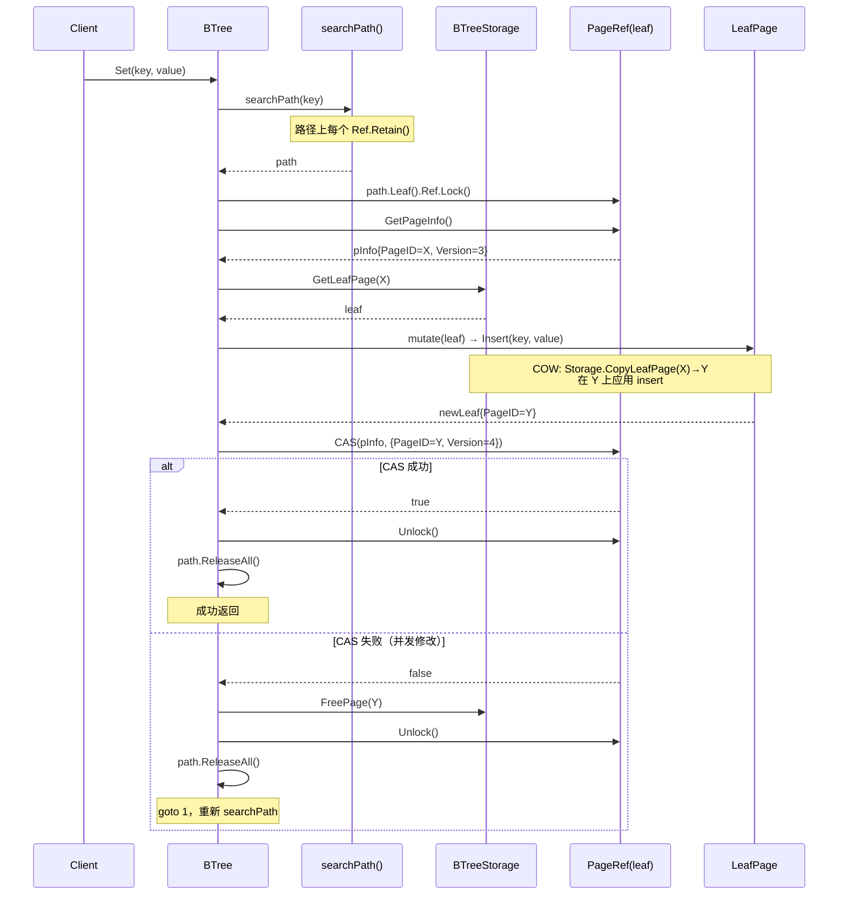
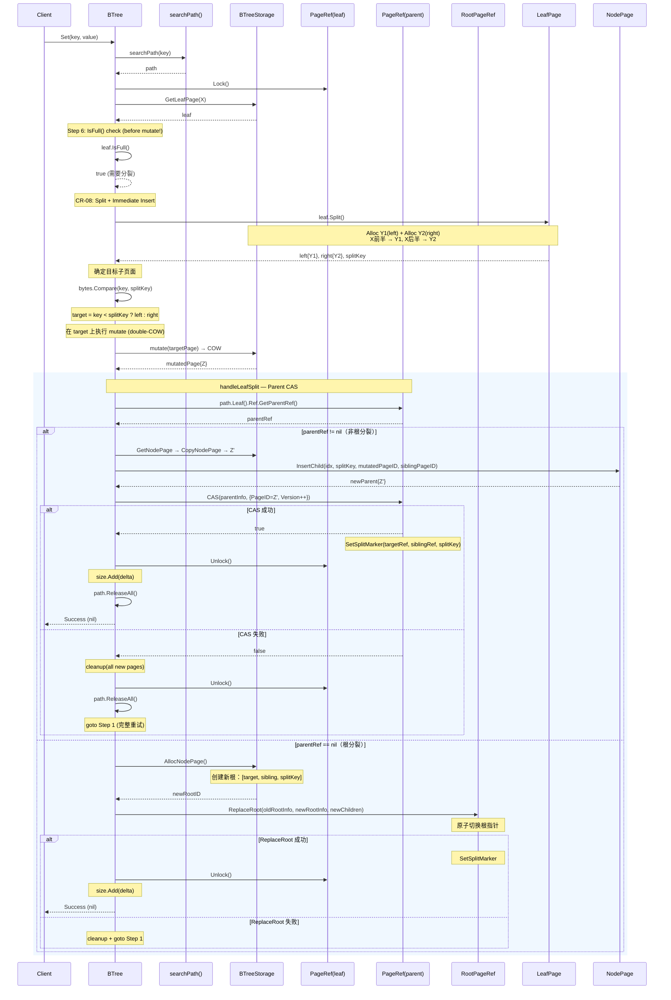
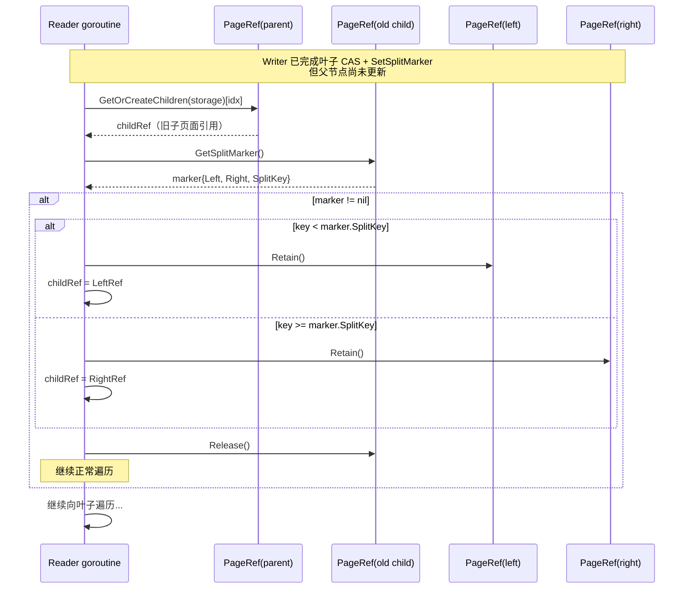

# BTree2 Interface Design

> 创建时间：2026-04-02
> 状态：设计中
> 参考：Lealone CCOW 架构 + 现有 offheap mmap 实现
> Roadmap：`2026-04-02-btree-refactor-roadmap.md`

## 1. 设计原则

1. **PageRef 与 PageHandle 分离**：PageRef 管理并发（长生命周期，构成树结构），PageHandle 管理数据（短生命周期，每次操作创建）。
2. **不可变 PageInfo**：页面元数据是不可变值，通过 PageRef.CAS 原子替换。
3. **COW 语义**：所有变更返回新实例，原实例不变。失败时丢弃新实例，无需回滚。
4. **懒加载 children**：子 PageRef 在首次遍历时创建，冷页面不占内存。
5. **返回副本**：GetKey/GetValue 返回数据副本，调用方可安全持有。
6. **零 printf**：调试信息通过 PrettyPagePrinter 返回 string，不直接打印。

## 2. Lealone → btree2 映射

| Lealone (Java) | btree2 (Go) | 说明 |
|---------------|-------------|------|
| `PageReference` | `PageRef` struct | 原子 CAS + parentRef + refCount |
| `RootPageReference` | `RootPageRef` struct | 根特化：CAS root 切换 + parentRef 传播 |
| `PageInfo` | `PageInfo` struct | 不可变值：pageID, version |
| `Page` (abstract) | `PageHandle` interface | 页面数据的只读视图 |
| `LeafPage` | `LeafPage` interface | 叶子页 KV 操作 + COW 变更 |
| `NodePage` | `NodePage` interface | 索引页子页面管理 + COW 变更 |
| `BTreeStorage` | `BTreeStorage` interface | 页面生命周期：alloc/get/free/copy |
| `BTreeMap` | `BTree` struct | 顶层结构，实现 `service.KVStore` |
| `PageOperations` | `operations.go` | CAS 冲突重试模板方法 |
| `SchedulerLock` | `SchedulerLock` struct | 自旋锁（spin + runtime.Gosched） |

### 关键差异

| 方面 | Lealone (Java) | btree2 (Go) |
|------|---------------|-------------|
| Page 数据 | Java 堆对象 (`Object[]`) | offheap mmap `[]byte`（通过 PageHandle 视图访问） |
| PageRef.children | `PageReference[]`（强引用） | `atomic.Pointer[[]*PageRef]`（CAS 懒创建，首次遍历时填充） |
| 并发写 | 单写线程 Scheduler | 叶级锁 + CAS（更高并发） |
| COW | Java 对象 `copy()` | mmap 页面 copy（`storage.CopyPage` → alloc + memcpy） |
| GC | JVM GC 管理 | refCount 归零 → `storage.FreePage` |

## 3. Domain Types

复用 `internal/domain/model/btree_types.go` 中的类型，不重新定义：

```go
// model.PageID — 页面唯一标识（uint64）
// model.PageType — 页面类型（LeafPage / InternalPage / MetaPage）
// model.BTreeConfig — BTree 配置
// model.BTreeStats — BTree 统计信息
```

常量：

```go
// model.RootPageID     = 1
// model.InvalidPageID  = 0
// model.DefaultPageSize = 4096
```

## 4. PageInfo — 不可变值类型

> 对应 Lealone `PageInfo`，但大幅简化。

```go
// PageInfo 是页面元数据的不可变快照。
// 通过 PageRef.CAS 原子替换，每次 COW 变更产生新实例。
// 一旦创建，字段不可修改。
type PageInfo struct {
    PageID  model.PageID
    Version uint64
}
```

**设计说明**：

- Lealone 的 PageInfo 有 10+ 字段（page, buff, pageLength, dirty, removed, metaVersion 等），因为 Java 需要管理页面加载、脏页标记、GC 等。
- btree2 的 PageInfo 只需 2 个字段：PageID（标识）、Version（CAS 比较）。页面数据通过 PageHandle 从 mmap 读取，脏页管理通过 COW 隐式处理。
- mmap 偏移量是 OffheapBTreeStorage 的内部实现细节，通过 `pageOffset(id) uintptr` 方法计算，不暴露到 PageInfo（避免 uint32 溢出和抽象泄漏）。

## 5. PageRef — 并发控制层

> 对应 Lealone `PageReference`。

```go
// PageRef 管理页面的并发访问。
// 每个 PageRef 对应树中一个页面，通过 parentRef 形成从叶到根的链。
// 生命周期：与页面在树中的存在时间一致（分裂/合并时替换）。
type PageRef struct {
    pInfo       atomic.Pointer[PageInfo]   // 原子可替换的页面信息
    parentRef   *PageRef                   // 父引用，nil 表示根（RootPageRef）
    children    atomic.Pointer[[]*PageRef] // 子引用，nil=叶子 or 未填充；CAS 懒加载
    refCount    atomic.Int32               // 引用计数，归零时释放页面
    splitMarker atomic.Pointer[SplitMarker] // 分裂标记，nil = 无分裂
    freeFunc    func(model.PageID)         // 创建时绑定，Release 归零时调用
    lock        SchedulerLock              // 叶级锁
}

// GetPageInfo 原子读取当前 PageInfo。
// 调用方必须先 Retain，确保使用期间页面不被释放。
func (r *PageRef) GetPageInfo() *PageInfo

// CAS 原子替换 PageInfo。old 必须等于当前值才替换成功。
// 返回是否替换成功。
func (r *PageRef) CAS(old, new *PageInfo) bool

// Retain 增加引用计数。searchPath 时对路径上每个 PageRef 调用。
func (r *PageRef) Retain()

// Release 减少引用计数。归零时调用创建时绑定的 freeFunc 释放页面。
func (r *PageRef) Release()

// Lock/Unlock 获取/释放叶级锁。
func (r *PageRef) Lock()
func (r *PageRef) Unlock()

// GetParentRef 返回父引用。根节点返回 nil。
func (r *PageRef) GetParentRef() *PageRef

// GetOrCreateChildren 返回子引用切片。叶子页返回 nil。
// 懒填充：首次调用时从页面数据构建，使用 CAS 保证并发安全。
func (r *PageRef) GetOrCreateChildren(storage BTreeStorage) []*PageRef

// GetPathToRoot 沿 parentRef 向上收集到根的路径。
// 返回切片索引 0 = 当前节点，末尾 = 根。
func (r *PageRef) GetPathToRoot() []*PageRef
```

### RootPageRef — 根页面特化

> 对应 Lealone `RootPageReference`。

```go
// RootPageRef 是根页面的 PageRef。
// 负责原子切换根指针，并在切换时传播 parentRef 到所有子节点。
// parentRef 始终为 nil。
type RootPageRef struct {
    PageRef
}

// ReplaceRoot 原子替换根页面。
//
// 参数：
//   - oldInfo: 调用方在操作前捕获的预期当前 PageInfo（乐观锁）
//   - newInfo: 替换后的新 PageInfo（新根的 pageID + version）
//   - newChildren: 新根的子节点列表（用于传播 parentRef）
//
// 执行顺序（P0-10 修正，见下方审查意见）：
//   1. 先为所有 newChildren 设置 parentRef（CAS 前）
//   2. CAS(oldInfo, newInfo) 原子发布
//   3. CAS 失败时不回滚 parentRef（子节点会在下次重试时重新创建）
//
// 返回 true 表示 CAS 成功。
func (r *RootPageRef) ReplaceRoot(oldInfo, newInfo *PageInfo, newChildren []*PageRef) bool

// TryFollowSplit 检查根是否发生分裂。
// 无分裂返回 (nil, false)；有分裂返回 (SplitMarker, true)。
// 调用方从 SplitMarker 中获取 Left/Right 子树引用。
func (r *RootPageRef) TryFollowSplit() (*SplitMarker, bool)
```

#### Phase 4 实现决策记录

> Phase 4 代码审查产生的设计决策详见 [§13 设计决策记录 D11-D14](#d11-replaceroot-签名变更)。


### SchedulerLock

```go
// SchedulerLock 是轻量级自旋锁。
// 适用于持有时间极短的场景（微秒级 BTree 写操作）。
type SchedulerLock struct {
    state atomic.Int32 // 0 = unlocked, 1 = locked
}

func (l *SchedulerLock) Lock()   // spin + runtime.Gosched
func (l *SchedulerLock) Unlock()
```

## 6. PageHandle — 数据操作层

> 对应 Lealone `Page` 抽象类，但拆分为 Go 接口。

### PageHandle（公共接口）

```go
// PageHandle 是所有页面类型的公共只读接口。
// 不持有 mmap 内存，通过 storage 间接访问。
// 短生命周期：每次操作创建，操作结束后丢弃。
type PageHandle interface {
    // Identity
    PageID() model.PageID
    Count() int     // 条目数（leaf = KV 数，node = key 数）
    IsFull(keyLen, valueLen int) bool // 是否达到分裂阈值（基于实际 key/value 长度计算空间）
    IsLeaf() bool   // 是否为叶子页
    Capacity() float64 // 页面利用率 0.0~1.0，用于 writeOperation 判断 split/merge

    // Read
    Search(key []byte) (index int, found bool)
    GetKey(idx int) []byte // 返回副本，调用方可安全持有
}
```

### LeafPage（叶子页接口）

> 对应 Lealone `LeafPage`。

```go
// LeafPage 扩展 PageHandle，增加叶子页的 KV 操作。
// 所有变更方法遵循 COW 语义：返回新实例，原实例不变。
type LeafPage interface {
    PageHandle

    // Leaf read
    GetValue(idx int) []byte // 返回副本

    // COW mutations — 分配新页面，复制+修改，返回新 LeafPage
    Insert(key, value []byte) (LeafPage, error)
    Update(idx int, value []byte) (LeafPage, error)
    Delete(idx int) (LeafPage, error)
    Split() (left, right LeafPage, splitKey []byte, err error)

    // Validation
    Validate() error
}
```

### NodePage（索引页接口）

> 对应 Lealone `NodePage`。

```go
// NodePage 扩展 PageHandle，增加索引页的子页面管理操作。
// 所有变更方法遵循 COW 语义。
type NodePage interface {
    PageHandle

    // Node read
    GetChild(idx int) model.PageID
    ChildCount() int // = key count + 1

    // COW mutations — 分配新页面，复制+修改，返回新 NodePage
    ReplaceChild(idx int, newChildID model.PageID) (NodePage, error)
    InsertChild(idx int, splitKey []byte, left, right model.PageID) (NodePage, error)
    RemoveChild(idx int) (NodePage, error)
    Split() (left, right NodePage, splitKey []byte, err error)

    // Validation
    Validate() error
}
```

### COW 语义规则

```
调用前：storage 中存在 original page（pageID = X）
调用后：
  1. storage 分配新页面（pageID = Y）
  2. 将 X 的数据复制到 Y
  3. 在 Y 上应用变更（insert/update/delete）
  4. 返回包装 Y 的新 LeafPage/NodePage
  5. X 不变，仍可通过原 PageHandle 访问

Split 特殊规则：
  - Split() 分配两个新页面 left（Y1）和 right（Y2）
  - X 的前半部分数据复制到 Y1，后半部分复制到 Y2
  - splitKey 返回副本（提升到父节点的中间 key）
  - X 不变，left 和 right 都是全新页面

异常时：
  - 分配失败：返回错误，Y 不存在
  - 变更失败：释放 Y，返回错误
```

## 7. BTreeStorage — 存储接口

> 对应 Lealone `BTreeStorage`，封装 offheap.PageManager。

```go
// BTreeStorage 管理页面的物理生命周期。
// 是 btree2 与 offheap 之间的唯一接口。
type BTreeStorage interface {
    // Alloc 分配新页面（内容为零页）
    AllocLeafPage() (model.PageID, error)
    AllocNodePage() (model.PageID, error)

    // Get 从 mmap 读取页面数据，返回操作视图
    GetLeafPage(pageID model.PageID) (LeafPage, error)
    GetNodePage(pageID model.PageID) (NodePage, error)

    // Copy COW 核心：分配新页面 + 复制源页面数据
    // 等价于 Alloc + memcpy(src → dst)
    CopyLeafPage(srcID model.PageID) (model.PageID, LeafPage, error)
    CopyNodePage(srcID model.PageID) (model.PageID, NodePage, error)

    // Free 释放页面（refCount 归零后由 PageRef.Release 调用）
    FreePage(pageID model.PageID) error

    // Merge/Borrow — 绕过接口层直接操作 mmap
    // reason: Merge 需要批量读取两个页面的全部数据，逐条 GetKey/GetValue
    // 造成 128+ 次虚调用 + memcpy，性能不可接受。
    MergeLeaves(left, right LeafPage) (LeafPage, error)
    BorrowFromLeftLeaf(self, sibling LeafPage) (newSelf, newSib LeafPage, err error)
    BorrowFromRightLeaf(self, sibling LeafPage) (newSelf, newSib LeafPage, err error)
    MergeNodes(left, right NodePage, separator []byte) (NodePage, error)
    BorrowFromLeftNode(self, sibling NodePage, separator []byte) (newSelf, newSib NodePage, newSep []byte, err error)
    BorrowFromRightNode(self, sibling NodePage, separator []byte) (newSelf, newSib NodePage, newSep []byte, err error)

    // Close 关闭存储，释放所有资源
    Close() error
}
```

**实现**：`OffheapBTreeStorage` struct，封装 `offheap.PageManager` + `offheap.PageAccessor`。

**复用**：
- `offheap.PageAccessor` — 原样复用，提供 mmap `[]byte` 的读写方法
- `offheap.PageManager` — 修改（移除 epoch，简化 Free）

## 8. BTree — 树结构

> 对应 Lealone `BTreeMap`。

```go
// BTree 是 B+Tree 的顶层结构。
// 实现 service.KVStore 接口。
type BTree struct {
    rootRef *RootPageRef
    storage BTreeStorage
    config  *model.BTreeConfig
    metrics *BTreeMetrics
    size    atomic.Int64 // 树中 KV 总数
    closed  atomic.Bool
}

// NewBTree 创建空 B+Tree（分配初始根叶子页）。
func NewBTree(storage BTreeStorage, opts ...BTreeOption) (*BTree, error)

// OpenBTree 从已有存储恢复 B+Tree（读取 rootID 作为根）。
func OpenBTree(storage BTreeStorage, rootID model.PageID, opts ...BTreeOption) (*BTree, error)

// BTreeOption 可选配置。
type BTreeOption func(*BTree)

func WithConfig(cfg *model.BTreeConfig) BTreeOption
func WithMetrics(m *BTreeMetrics) BTreeOption

// Get 无锁读：rootRef → 遍历到叶子 → 读取 value
func (b *BTree) Get(ctx context.Context, key []byte) ([]byte, error)

// Set upsert 语义：key 存在则覆盖 value（Update），不存在则插入（Insert）。
// 内部通过 LeafPage.Search 判断后调用 Update 或 Insert。
// Update 不增加 count → 不触发 Split；Insert 增加 count → 可能触发 Split。
func (b *BTree) Set(ctx context.Context, key, value []byte) error

// Delete 叶级锁写：searchPath → lock leaf → COW delete → CAS → maybe merge
func (b *BTree) Delete(ctx context.Context, key []byte) error

// Close 关闭树，释放所有资源
func (b *BTree) Close() error

// Stats 返回统计信息（内部 *model.BTreeStats，适配层转换为 *service.StoreStats）
func (b *BTree) Stats() *model.BTreeStats

// AssertInvariants 检查树的一致性（仅测试使用）
func (b *BTree) AssertInvariants() error
```

### BTreeMetrics

```go
// BTreeMetrics 原子计数器，记录操作统计。
type BTreeMetrics struct {
    CASAttempts  atomic.Int64
    CASConflicts atomic.Int64
    Splits       atomic.Int64
    Merges       atomic.Int64
    Retries      atomic.Int64
}
```

## 9. SearchPath — 搜索路径

```go
// PathEntry 记录搜索路径中的一个节点。
type PathEntry struct {
    Ref   *PageRef // 页面引用
    Index int      // 在父节点中的子页面索引（叶子节点为 -1）
}

// SearchPath 是从根到叶的遍历路径。
// path[0] = 根，path[len-1] = 叶子。
type SearchPath []PathEntry

// Leaf 返回叶子节点的 PathEntry。
func (p SearchPath) Leaf() PathEntry

// ParentPath 返回从叶子到根的父路径（不含叶子）。
func (p SearchPath) ParentPath() []PathEntry

// ReleaseAll 释放路径上所有 PageRef 的引用计数。
// CAS 失败重试前必须调用，防止引用计数泄漏。
func (p SearchPath) ReleaseAll()
```

搜索过程：

```
1. rootRef.GetPageInfo() → pInfo → rootRef.Retain()
2. page := storage.GetNodePage(pInfo.PageID)
3. idx := page.Search(key)
4. childRef := rootRef.GetOrCreateChildren(storage)[idx]
5. childRef.Retain()
6. // 检查分裂标记（D5 SplitMarker）
7. if childRef.GetSplitMarker() != nil:
8.     childRef = childRef.FollowSplit(key)
11.    childRef.Retain()
12. 重复 2-11 直到叶子页
13. 返回 SearchPath（路径上所有 Ref 已 Retain）
```

**Reader 引用计数规则（P0-3 修复）**：
- searchPath 期间：每访问一个 PageRef 就 Retain，保证使用期间页面不被释放
- Get 操作：读取 value（副本）后，调用 `path.ReleaseAll()` 释放路径
- Set/Delete 操作：CAS 成功后由 writeOperation 释放路径；CAS 失败先 `path.ReleaseAll()` 再重试

## 10. WriteOperation — 写操作模板

> 对应 Lealone `PageOperations`。

```go
// WriteOperation 是写操作的模板方法。
// 封装 CAS 冲突重试逻辑，Set 和 Delete 共用。
//
// 流程：
//   1. searchPath(key) → path（路径上所有 Ref 已 Retain）
//   2. leafRef := path.Leaf().Ref
//   3. leafRef.Lock()
//   4. pInfo := leafRef.GetPageInfo()
//   5. leaf := storage.GetLeafPage(pInfo.PageID)
//   6. [Split check] if leaf.IsFull():
//      a. handleLeafSplit(leafRef, path, key, mutate)  // CR-08: 传入 mutate
//         - Split → determine target → mutate(target)
//         - Parent CAS with InsertChild
//      b. 成功: SetSplitMarker, Unlock, return nil
//      c. 失败(ErrCASConflict): cleanup, Unlock, goto 1
//   7. newLeaf := mutate(leaf)          // 具体操作由调用方定义
//   8. newInfo := &PageInfo{PageID: newLeaf.PageID(), Version: pInfo.Version+1}
//   9. if leafRef.CAS(pInfo, newInfo):
//  10.     leafRef.Unlock()
//  11.     propagate(path, newLeaf)      // 向上传播分裂/合并（Best-Effort）
//  12.     path.ReleaseAll()             // 释放路径引用
//  13. else:
//  14.     storage.FreePage(newLeaf.PageID())
//  15.     leafRef.Unlock()
//  16.     path.ReleaseAll()             // 释放旧路径（防止泄漏）
//  17.     goto 1                        // 重试
//
// CR-08 决策 (D15): Split 检查在 mutate 之前，handleLeafSplit 接收 mutate 函数，
// 在 Split 后同一调用栈内完成 key 插入，返回 nil（强一致性）而非 ErrCASConflict。
func (b *BTree) writeOperation(ctx context.Context, key []byte, mutate func(LeafPage) (LeafPage, error)) error
```

### Set 操作序列图（无分裂）



### Set 操作序列图（触发叶子分裂 — CR-08 Split + Immediate Insert）



### 并发 Reader 跟随 SplitMarker



### 分裂传播

```
propagateSplit(leafRef, left, right, splitKey):
1. parentRef := leafRef.GetParentRef()
2. if parentRef == nil:
3.     // 根分裂：创建新根
4.     newRoot := createNodeWithChildren(left, right, splitKey)
5.     rootRef.ReplaceRoot(newRoot)
6.     return
7.
8. parentRef.Lock()
9. parentInfo := parentRef.GetPageInfo()
10. parent := storage.GetNodePage(parentInfo.PageID)
11. newParent := parent.InsertChild(idx, splitKey, left.PageID(), right.PageID())
12. newParentInfo := &PageInfo{PageID: newParent.PageID(), Version: parentInfo.Version+1}
13. if parentRef.CAS(parentInfo, newParentInfo):
14.     parentRef.Unlock()
15.     // 设置分裂标记（方案 B）：让并发 reader 能跟随到新的子页面
16.     leafRef.SetSplitMarker(left, right, splitKey)
17.     // 继续向上检查是否需要分裂
18.     if newParent.IsFull():
19.         propagateSplit(parentRef, newParentLeft, newParentRight, ...)
20. else:
21.     storage.FreePage(newParent.PageID())
22.     parentRef.Unlock()
23.     goto 8  // 重试
```

### SplitMarker — 分裂可见性机制（方案 B）

> 对应 Lealone `PageInfo.isDataStructureChanged()` + `getNewRef()`。

**问题**：叶子 CAS 成功后、父节点更新前，并发 reader 遍历到旧叶子可能看到不一致数据。

**方案**：PageRef 增加分裂标记，reader 检测后自动跟随到新页面。

```go
// SplitMarker 记录页面的分裂信息。
// 父节点 CAS 成功后立即设置，reader 在搜索时检查。
type SplitMarker struct {
    Left     *PageRef    // 分裂后的左页面
    Right    *PageRef    // 分裂后的右页面
    SplitKey []byte      // 分裂 key
}

// PageRef 中的分裂标记字段
type PageRef struct {
    // ...existing fields...
    splitMarker atomic.Pointer[SplitMarker] // nil = 无分裂
}

// SetSplitMarker 设置分裂标记（propagateSplit 中调用）。
func (r *PageRef) SetSplitMarker(left, right *PageRef, splitKey []byte)

// GetSplitMarker 读取分裂标记。
func (r *PageRef) GetSplitMarker() *SplitMarker

// FollowSplit 如果存在分裂标记，根据 key 决定跟随左或右子页面。
// 返回目标 PageRef；无分裂标记返回 nil。
func (r *PageRef) FollowSplit(key []byte) *PageRef
```

**Reader 搜索时的处理**：

```
searchPath 遍历过程中：
1. 获取 childRef
2. marker := childRef.GetSplitMarker()
3. if marker != nil:
4.     if key < marker.SplitKey:
5.         childRef = marker.Left
6.     else:
7.         childRef = marker.Right
8.     // 继续正常遍历
```

**生命周期**：
- 设置时机：propagateSplit 中父节点 CAS 成功后立即设置
- 清除时机：分裂传播完全完成后（父节点稳定后），可延迟清除
- GC：当旧 PageRef 的 refCount 归零时，SplitMarker 随之释放

### 合并传播

```
propagateMerge(leafRef, merged):
1. parentRef := leafRef.GetParentRef()
2. if parentRef == nil:
3.     // 根合并：如果是单子节点，降低树高度
4.     tryReduceRoot()
5.     return
6.
7. parentRef.Lock()
8. parentInfo := parentRef.GetPageInfo()
9. parent := storage.GetNodePage(parentInfo.PageID)
10. newParent := storage.MergeNodes(leftChild, rightChild, separator)
11. newParentInfo := &PageInfo{PageID: newParent.PageID(), Version: parentInfo.Version+1}
12. if parentRef.CAS(parentInfo, newParentInfo):
13.     if newParent.Capacity() < 0.5:
14.         propagateMerge(parentRef, newParent)
15. else:
16.     storage.FreePage(newParent.PageID())
17.     goto 7  // 重试
```

## 11. Error Types

```go
var (
    ErrCASConflict  = errors.New("btree2: cas conflict, retry")
    ErrPageFreed    = errors.New("btree2: page already freed")
    ErrKeyNotFound  = errors.New("btree2: key not found")
    ErrTreeClosed   = errors.New("btree2: tree closed")
    ErrInvalidPage  = errors.New("btree2: invalid page")
    ErrPageFull     = errors.New("btree2: page full")
    ErrPageEmpty    = errors.New("btree2: page empty")
)
```

与现有 `pkg/errors/errors.go` 的关系：
- btree2 使用独立的错误类型，不依赖 btree1 的哨兵错误
- 对外（service.KVStore 层面）统一映射：`ErrKeyNotFound` → `service.ErrKeyNotFound`

## 12. 调试接口

```go
// PrettyPagePrinter 提供结构化的页面/树打印。
// 返回 string，不直接打印。测试和日志框架决定去向。
type PrettyPagePrinter struct {
    storage BTreeStorage
}

func (p *PrettyPagePrinter) PrintPage(pageID model.PageID) (string, error)
func (p *PrettyPagePrinter) PrintTree(root *RootPageRef) (string, error)
func (p *PrettyPagePrinter) PrintPath(path SearchPath) string
```

## 13. 设计决策记录

### D1. PageHandle: Interface vs Concrete

**决策**：定义为 Go interface（PageHandle, LeafPage, NodePage）。
**理由**：DDD 要求接口作为契约；Go 接口隐式满足，实现返回具体类型；性能开销可接受。
**评估时间**：实现 Phase 2 时用 benchmark 验证。

### D2. PageRef.children: atomic.Pointer 懒填充

**决策**：`children atomic.Pointer[[]*PageRef]`，CAS 懒加载，冷页面不占内存。
**理由**：与 Lealone `getOrReadPage()` 一致；CAS 保证并发安全，避免 data race。
**审查修订**：原 `[]*PageRef` 改为 `atomic.Pointer[[]*PageRef]`（P0-1）。

### D3. GetKey/GetValue: 返回副本

**决策**：返回数据副本（memcpy）。
**理由**：安全性优先，mmap slice 在页面释放后变成脏数据；后续可加 PeekKey/PeekValue 零拷贝方法。

### D4. Merge 操作移到 BTreeStorage

**决策**：Merge/Borrow 方法从 LeafPage/NodePage 接口移到 BTreeStorage。
**理由**：Merge 需要批量访问两个页面的全部数据，逐条 GetKey/GetValue 导致 128+ 次虚调用。BTreeStorage 内部可直接操作 mmap []byte，绕过接口层。
**审查修订**：原设计 Merge 在 Page 接口上（P1-2）。

### D5. SplitMarker — 分裂可见性方案 B

**决策**：PageRef 增加 `atomic.Pointer[SplitMarker]`，reader 检测后自动跟随到新页面。
**理由**：叶子 CAS 成功后、父节点更新前，并发 reader 可能看到不一致树结构。SplitMarker 让 reader 无需等待父节点锁即可找到正确页面。
**替代方案**：方案 A（锁覆盖传播）简单但并发度低，分裂期间阻塞所有经过该路径的写操作。

### D6. freeFunc 绑定到 PageRef

**决策**：PageRef 创建时绑定 `freeFunc func(model.PageID)`，Release() 无参数。
**理由**：减少热路径堆分配（原 Release(free) 每次传闭包可能触发 escape）。
**审查修订**：原 `Release(free func(model.PageID))`（P2-1）。

### D7. Reader Retain/Release 规则

**决策**：searchPath 路径上每个 PageRef 都 Retain，使用完后 ReleaseAll()。
**理由**：防止 reader 使用期间页面被 writer 释放（P0-3 竞态窗口）。

### D8. RangeScan 不在 v1 scope

**决策**：v1 不实现 RangeScan/Iterator。
**理由**：RangeScan 需要叶子链表指针和 Iterator 状态机，增加复杂度。先验证核心 CRUD + Split/Merge 架构正确性，后续版本添加。

### D9. COW interface 堆分配 — 待 benchmark

**决策**：v1 使用 interface 返回值，Phase 2 benchmark 量化后决定是否优化。
**理由**：过早优化可能引入不必要的复杂度。如 benchmark 显示 1-3M ops/sec 的堆分配显著影响 GC，再考虑 sync.Pool 或具体类型替代。

### D10. BTree 对 value 格式透明

**决策**：BTree 不感知 value 的内部结构（MVCC version、LOB 溢出页面指针、对象存储引用等）。value 是 `[]byte` 黑盒，BTree 只负责按 key 索引存储。
**理由**：单一职责。BTree 专注索引结构和并发控制，MVCC 版本管理和大对象存储是独立的关注点。
**约束**：
- value 中的 9B 元数据（version + header）由上层编码/解码，BTree 不可见
- 当 value 包含外部资源引用（溢出页面、对象存储指针）时，释放这些资源是**上层的责任**
- BTree.Delete 只释放叶子条目占用的页面空间，不会自动释放溢出页面或外部对象
- 协调机制：上层在调用 BTree.Delete 前，先解码 value 释放外部资源，再调用 Delete
**参考**：`thoughts/2026-04-02-kimi-cr-02.md`（方案 A：BTree 层透明）

### D11. ReplaceRoot 签名变更

**决策**：`ReplaceRoot(oldInfo, newInfo *PageInfo, newChildren []*PageRef) bool` — 保持当前签名，不使用 `newRoot *PageRef` 参数。
**理由**：RootPageRef 本身就是 root，替换的是自己的 pInfo，newChildren 是新根的子节点。RootPageRef 嵌入 PageRef，无需额外 newRoot 参数。
**审查修订**：原始设计 `ReplaceRoot(newRoot *PageRef, newInfo *PageInfo) bool`（P4-1 审查前）。

### D12. TryFollowSplit 返回 SplitMarker

**决策**：`TryFollowSplit() (*SplitMarker, bool)` — 返回完整的 SplitMarker 而非 `*PageRef`。
**理由**：调用方需要 Left/Right 两个子树引用进行路由，单一 `*PageRef` 语义不明确。SplitMarker 包含 SplitKey 用于 key 比较。
**审查修订**：原始设计返回 `(targetRef *PageRef, ok bool)`（P4-2 审查前）。

### D13. parentRef 使用 atomic.Pointer[PageRef]

**决策**：`parentRef atomic.Pointer[PageRef]`（而非普通 `*PageRef`）。
**理由**：parentRef 被 SetParentRef 和 GetParentRef 并发调用（ReplaceRoot 设置 parentRef 时 reader 可能同时读取）。Go race detector 对非 atomic 并发读写报告 data race。
**审查修订**：原始设计 `parentRef *PageRef`（interface 文档初版）。

### D14. ReplaceRoot 先 SetParentRef 后 CAS

**决策**：ReplaceRoot 在 CAS **之前**为所有 newChildren 设置 parentRef。
**理由**：CAS 后设置 parentRef 存在并发 reader 窗口期 — reader 看到 newInfo 后遍历到 child，此时 parentRef 仍为 nil，GetPathToRoot 提前终止。
**执行顺序**：
1. 先为所有 newChildren 设置 parentRef（CAS 前，子节点尚未对读者可见）
2. CAS(oldInfo, newInfo) 原子发布
3. CAS 失败时不回滚 parentRef（调用方重试时创建新 PageRef）
**审查修订**：原始代码 CAS 后设置 parentRef（C3 审查发现）。

### D15. Split + Immediate Insert（CR-08）

**决策**：writeOperation 在 mutate 之前检查 `leaf.IsFull()`，若满则调用 `handleLeafSplit` 传入 `mutate` 函数，Split 后在同一调用栈内完成 key 插入。

**理由**：
1. **强一致性**：操作返回 nil 后，所有读取立即可见新结构和新 key，无需等待重试
2. **减少 CAS 冲突重试**：原方案 Split 后返回 ErrCASConflict 触发完整重试（searchPath + Lock + CAS），新方案一次完成
3. **消除不一致窗口**：原方案 T2-T3 之间其他读取可能看不到新结构

**CR-08 修复项**：
- 拒绝 `findOrCreatePageRef(targetLeafID)`（未定义 API），直接使用 leftRef/rightRef
- 保持 leaf lock 贯穿 split+insert（拒绝 unlock 后 split 的 TOCTOU 风险）
- 不对 target child 加锁（新创建页面，无并发访问）
- Double-COW（split 分配新页 + mutate 再 COW）标注为优化项

**SplitMarker 设置时机**：不变（Parent CAS 成功后设置）

**与 D1 的关系**：
- D1（propagateUpward Best-Effort）保持不变
- D15 只改变 Split 路径：handleLeafSplit 内部完成 split+insert，成功返回 nil
- 普通 CAS 冲突（非 Split 场景）仍走 Best-Effort 重试

## 14. 文件映射

| 文件 | 主要内容 |
|------|---------|
| `page_info.go` | `PageInfo` struct |
| `page_ref.go` | `PageRef` struct + 方法 |
| `root_ref.go` | `RootPageRef` struct + `ReplaceRoot` |
| `page_lock.go` | `SchedulerLock` struct |
| `page_handle.go` | `PageHandle`, `LeafPage`, `NodePage` 接口定义 |
| `leaf_page.go` | `LeafPageHandle` 实现 |
| `node_page.go` | `NodePageHandle` 实现 |
| `storage.go` | `BTreeStorage` 接口 + `OffheapBTreeStorage` 实现 |
| `search.go` | `SearchPath`, `PathEntry`, `searchPath()` |
| `operations.go` | `writeOperation`, `propagateSplit`, `propagateMerge` |
| `btree.go` | `BTree` struct + `Get`/`Set`/`Delete` |
| `debug.go` | `PrettyPagePrinter` |
| `metrics.go` | `BTreeMetrics` |
| `errors.go` | 错误变量 |
| `constants.go` | 常量 |

---

## 附录 A：审查意见（2026-04-02）

> 审查者：DDD 架构师 + Go 工程师
> 状态：已决策（2026-04-02）

**决策汇总**：
- P0 全部接受，已反映到接口定义中
- P1-1（RangeScan）：不在 v1 scope
- P1-2（Merge 移到 Storage）：已接受，已更新 BTreeStorage 接口
- P1-3（Split 可见性）：选方案 B（SplitMarker），已添加到 PageRef
- P1-4（构造函数）：已补充 NewBTree/OpenBTree
- P2-1（freeFunc 绑定）：已接受，Release() 改为无参
- P2-2（COW 堆分配）：待 benchmark，D9 记录
- P2-3~P2-5：已接受

### P0 — 必须在编码前解决

#### P0-1. PageRef.children 并发访问不安全

**问题**：`children []*PageRef` 是普通 slice，无 atomic/mutex 保护。多个 goroutine 同时首次遍历同一 NodePage 时 data race。

**建议**：改用 `atomic.Pointer[[]*PageRef]` + CAS 懒加载：

```go
type PageRef struct {
    children atomic.Pointer[[]*PageRef] // nil = 未填充
}

func (r *PageRef) GetOrCreateChildren(storage BTreeStorage, pageID model.PageID) []*PageRef {
    if c := r.children.Load(); c != nil {
        return *c
    }
    newChildren := loadChildrenFrom(storage, pageID)
    if r.children.CompareAndSwap(nil, &newChildren) {
        return newChildren
    }
    return *r.children.Load()
}
```

#### P0-2. SearchPath Retain/Release 不配对

**问题**：writeOperation 搜索过程 Retain 路径上每个 PageRef，但 CAS 失败重试时未 Release 旧路径。每次重试泄漏引用计数，旧页面永不释放。

**建议**：SearchPath 实现 `ReleaseAll()` 方法，每次重试前调用：

```go
func (p SearchPath) ReleaseAll() {
    for _, entry := range p {
        entry.Ref.Release()
    }
}
```

writeOperation 中：CAS 失败 → `path.ReleaseAll()` → 重试 searchPath。

#### P0-3. refCount 与 CAS 的竞态窗口

**问题**：reader 通过 `pInfo := ref.GetPageInfo()` 获取旧 PageInfo 后，writer CAS 替换成新 PageInfo 并调用 Release。如果此时 refCount 恰好归零，旧页面被释放，reader 手持的 pageID 变成无效。

**建议**：reader 在 GetPageInfo() 的同时也需要 Retain，确保使用期间页面不被释放。具体机制需与 epoch/引用计数模型一并设计，保证：reader 持有 PageInfo 期间，对应 pageID 不被释放。

### P1 — 设计层面需确认

#### P1-1. RangeScan/Iterator 支持缺失

**问题**：`service.KVStore` 接口要求 `RangeScan(ctx, start, end) (Iterator, error)`，但 LeafPage/NodePage 接口没有邻居指针，无法高效顺序扫描。

**建议**：在 LeafPage 增加 Prev/Next 页面 ID：

```go
type LeafPage interface {
    PageHandle
    // ...
    PrevPageID() model.PageID // 0 = 无
    NextPageID() model.PageID // 0 = 无
}
```

**决策**：不在 v1 scope。见 D8。后续版本添加叶子链表指针 + Iterator 状态机。

#### P1-2. MergeWith(sibling LeafPage) 无法高效访问 sibling 数据

**问题**：LeafPage 接口只有 `GetKey(idx)` 和 `GetValue(idx)` 逐条访问。合并两个 128 KV 的页面需要 512 次虚调用 + memcpy，性能不可接受。

**建议**：将 Merge/Borrow 操作移到 BTreeStorage（可绕过接口层直接操作 mmap）：

```go
type BTreeStorage interface {
    // ...
    MergeLeaves(left, right LeafPage) (LeafPage, error)
    BorrowFromLeftLeaf(self, sibling LeafPage) (self2, sib2 LeafPage, err error)
    BorrowFromRightLeaf(self, sibling LeafPage) (self2, sib2 LeafPage, err error)
}
```

#### P1-3. Split 可见性竞态

**问题**：叶子 CAS 成功后，父节点尚未更新。此时并发 reader 遍历到父节点，看到的还是旧的子页面列表，可能错过分裂后的右半部分数据。

**建议**：分裂传播期间需要确保读者看到一致的树结构。可选方案：
- A) 分裂传播在叶子锁持有期间完成（锁覆盖整个传播过程）
- B) 使用"分裂标记"（类似 Lealone 的 dataStructureChanged 标志），reader 检测到后跟随新引用

#### P1-4. 缺少 BTree 构造函数

**问题**：文档只定义了 BTree struct，没有 `NewBTree` / `OpenBTree` 签名。

**建议**：

```go
func NewBTree(storage BTreeStorage, opts ...BTreeOption) (*BTree, error)
func OpenBTree(storage BTreeStorage, rootID model.PageID, opts ...BTreeOption) (*BTree, error)

type BTreeOption func(*BTree)
func WithConfig(cfg *model.BTreeConfig) BTreeOption
func WithMetrics(m *BTreeMetrics) BTreeOption
```

### P2 — 建议改进

#### P2-1. Release(free func(model.PageID)) 回调签名改为绑定

**问题**：每次 Release 传入 free 回调，热路径上如果 free 是闭包则触发堆分配。

**建议**：PageRef 创建时绑定 freeFunc，Release 无参数：

```go
type PageRef struct {
    // ...
    freeFunc func(model.PageID) // 创建时绑定
}
func (r *PageRef) Release() // 内部调用 freeFunc
```

#### P2-2. COW 返回 interface 的堆分配

**问题**：每次 COW 变更返回 LeafPage interface，底层 LeafPageHandle struct 发生逃逸。百万 ops/sec = ~1-3M 次/sec 堆分配。

**建议**：
1. Phase 2 实现时用 `sync.Pool` 缓存 LeafPageHandle/NodePageHandle
2. benchmark 量化实际开销（`go test -benchmem`）
3. 如果开销显著，可考虑用具体类型替代 interface

#### P2-3. BTreeStats 类型不匹配 service.KVStore

**问题**：`BTree.Stats()` 返回 `*model.BTreeStats`，但 `service.KVStore.Stats()` 返回 `(*StoreStats, error)`。类型不兼容。

**建议**：BTree 内部返回 `*model.BTreeStats`，适配层增加 `ToStoreStats()` 转换。

#### P2-4. Split() 返回值语义需明确

**问题**：`Split()` 返回 `(left, right LeafPage, splitKey []byte, err error)`，但未明确 left/right 是新分配页面还是原页面修改。splitKey 是副本还是引用？

**建议**：在 COW 语义规则中补充：left 和 right 都是新分配页面（COW），splitKey 返回副本。

#### P2-5. 缺少页面容量查询（✅ 已解决）

`IsFull(keyLen, valueLen int)` 接受实际 key/value 长度参数进行精确的空间计算：
- Leaf: `SizeofLeafEntry(16) + keyLen + valueLen` 与页面剩余空间比较，阈值 0.95
- Node: 双重判定 — `count >= MaxInternalKeys` 兜底 + 猺间计算（阈值 0.90）处理短 key 场景
- Capacity() 返回 `float64(usedBytes) / PageSize`，已实现。

### 审查通过项

| 项目 | 说明 |
|------|------|
| PageInfo 不可变值类型 | 3 字段设计 vs btree1 的 192 字节，显著简化 |
| PageRef/PageHandle 分离 | 长短生命周期解耦，并发控制和数据访问职责清晰 |
| BTreeStorage 接口边界 | offheap 完全封装，8 个方法可 mock |
| LeafPage/NodePage 接口拆分 | 符合 ISP，公共只读 + 各自特化 |
| atomic.Pointer[PageInfo] | 无 ABA 问题（每次 COW 新实例，指针地址不同） |
| 错误类型独立 | 不依赖 btree1，符合 Go 惯例 |
| PrettyPagePrinter | 返回 string 零副作用，调试设计正确 |
