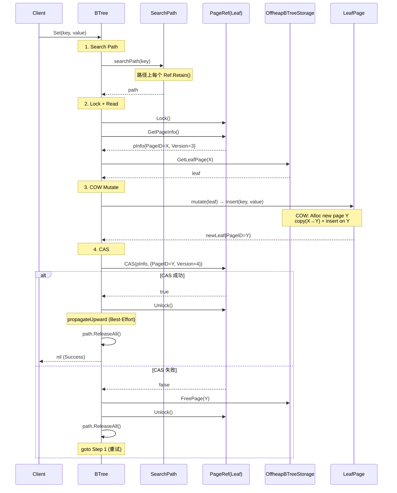
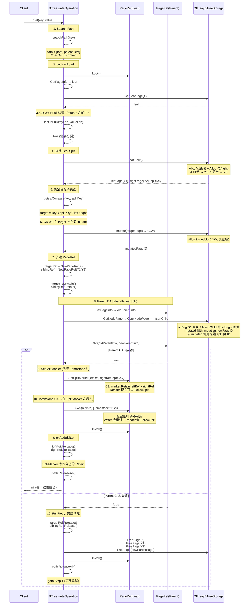
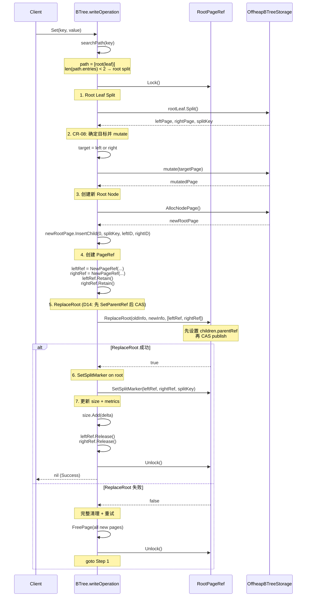
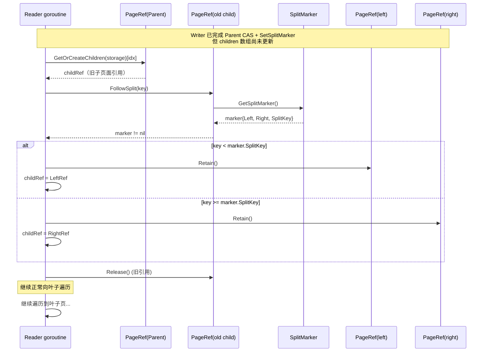

# NexKV B+Tree Split 实现详解

> 创建时间：2026-04-04
> 状态：设计中（Phase 6.0）
> 配套：`2026-04-02-btree-refactor-interface.md` + `2026-04-02-btree-refactor-implement.md`

## 1. 概述

本文详细描述 NexKV B+Tree 中 **Split（分裂）** 操作的完整实现，包括：

- 底层页面 Split（Leaf Split / Node Split）
- Split 传播机制（handleLeafSplit / handleRootSplit）
- SplitMarker 可见性机制
- 并发读者如何通过 SplitMarker 跟随分裂
- writeOperation 中的 CR-08（Split + Immediate Insert）集成

### 核心设计决策

| 决策 | 说明 | 参考 |
|------|------|------|
| COW 语义 | 所有变更返回新页面，原页面不变 | interface.md §6 |
| Leaf-Level Locking | 叶级自旋锁 + CAS，非 Root CAS | interface.md §5 |
| SplitMarker | 并发读者跟随分裂，无需等父节点更新 | interface.md §D5 |
| CR-08 | Split + Immediate Insert，强一致性返回 | implement.md §6.0.4 |
| Best-Effort 传播 | 普通更新传播不重试；Split 传播 Full Retry | implement.md §6.0.3 D1 |

---

## 2. 页面布局

NexKV 使用 4KB（4096 字节）mmap 页面，布局如下：

```
┌──────────────┬──────────────────┬──────────────┐
│ PageHeader   │ Entry 数组        │ KV 数据区     │
│ 56B          │ N × 16B           │ 变长（从末尾向前增长）│
└──────────────┴──────────────────┴──────────────┘
 共 4096 字节

PageHeader (56B):
  version(8) + prevPage(4) + nextPage(4) + extraChild(8)
  + count(2) + pageType(1) + deleted(1) + [padding 4B]
  + deleteEpoch(8) + refCount(4) + inQueue(4) + pad(3) + [padding 5B]

LeafEntry (16B): keyOff(4) + keyLen(4) + valOff(4) + valLen(4)
IndexEntry (16B): keyOff(4) + keyLen(4) + child(8)
  child = pageID(4) + version(4)
```

### 容量限制

- **MaxInternalKeys = 126**（基于 avgKey=16B：`(4096-56)/(16+16)=126`）
- **Leaf 无固定上限**：`IsFull(keyLen, valueLen)` 按空间计算，阈值 0.95
- **Node 双重判定**：`count >= 126` 兜底 + 空间计算阈值 0.90

---

## 3. 底层 Split 算法

### 3.1 Leaf Split — Copy-Up 语义

**文件**: `internal/infrastructure/storage/btree/leaf_page.go:192-235`

```go
func (h *leafPageHandle) Split() (LeafPage, LeafPage, []byte, error) {
    count := h.Count()
    if count < 2 {
        return nil, nil, nil, errpkg.BTreeLeafSplitMinKeys(count)
    }

    mid := count / 2

    // splitKey = right page's first key（copy-up：保留在 right 中，同时复制提升到 parent）
    keyOff, keyLen, _, _ := h.pa.GetLeafEntryOffset(uint32(h.id), mid)
    splitKey := h.pa.GetKey(uint32(h.id), keyOff, keyLen)
    splitKeyCopy := make([]byte, len(splitKey))
    copy(splitKeyCopy, splitKey)

    // 分配左右新页面
    leftRawID, _ := h.storage.pm.Alloc()
    rightRawID, _ := h.storage.pm.Alloc()

    srcVersion := h.pa.GetVersion(uint32(h.id))

    // Left: entries[0..mid)
    h.pa.BulkInitLeafFromSource(uint32(h.id), leftRawID, 0, mid)
    h.pa.SetVersion(leftRawID, srcVersion+1)

    // Right: entries[mid..count)
    h.pa.BulkInitLeafFromSource(uint32(h.id), rightRawID, mid, count)
    h.pa.SetVersion(rightRawID, srcVersion+1)

    left := &leafPageHandle{id: model.PageID(leftRawID), pa: h.pa, storage: h.storage}
    right := &leafPageHandle{id: model.PageID(rightRawID), pa: h.pa, storage: h.storage}
    return left, right, splitKeyCopy, nil
}
```

**Copy-Up 语义图解**：

```
Split 前 (count=10):
┌──────────────────────────────────────────┐
│ [k0, k1, k2, k3, k4, k5, k6, k7, k8, k9] │
└──────────────────────────────────────────┘
              mid=5 ↑

Split 后:
Left (5 entries):              Right (5 entries):
┌─────────────────┐           ┌─────────────────┐
│ [k0, k1, k2, k3, k4] │     │ [k5, k6, k7, k8, k9] │
└─────────────────┘           └─────────────────┘

splitKey = k5（copy-up：保留在 right 页面中，同时复制提升到父节点）
```

### 3.2 Node Split — Move-Up 语义

**文件**: `internal/infrastructure/storage/btree/node_page.go:158-205`

```go
func (h *nodePageHandle) Split() (NodePage, NodePage, []byte, error) {
    count := h.Count()
    if count < 2 {
        return nil, nil, nil, errpkg.BTreeNodeSplitMinKeys(count)
    }

    mid := count / 2

    // move-up: splitKey 从 left 和 right 中移除，提升到 parent
    splitKey := h.GetKey(mid)
    splitKeyCopy := make([]byte, len(splitKey))
    copy(splitKeyCopy, splitKey)

    leftRawID, _ := h.storage.pm.Alloc()
    rightRawID, _ := h.storage.pm.Alloc()
    srcVersion := h.pa.GetVersion(uint32(h.id))

    // Left: entries[0..mid), extraChild = child[mid]
    leftExtraChild := h.pa.GetChild(srcRawID, mid)
    h.pa.BulkInitIndexFromSource(srcRawID, leftRawID, 0, mid, leftExtraChild)
    h.pa.SetVersion(leftRawID, srcVersion+1)

    // Right: entries[mid+1..count), extraChild = original extraChild (child[count])
    rightExtraChild := h.pa.GetChild(srcRawID, count)
    h.pa.BulkInitIndexFromSource(srcRawID, rightRawID, mid+1, count, rightExtraChild)
    h.pa.SetVersion(rightRawID, srcVersion+1)

    left := &nodePageHandle{id: model.PageID(leftRawID), pa: h.pa, storage: h.storage}
    right := &nodePageHandle{id: model.PageID(rightRawID), pa: h.pa, storage: h.storage}
    return left, right, splitKeyCopy, nil
}
```

**Move-Up 语义图解**：

```
Split 前 (count=3, children=4):
┌──────────────────────────────────────────────────────┐
│ [e0(k0,c0), e1(k1,c1), e2(k2,c2)] + extraChild=c3   │
└──────────────────────────────────────────────────────┘
              mid=1 ↑

Split 后:
Left (1 entry):                    Right (1 entry):
┌──────────────────┐             ┌──────────────────┐
│ [e0(k0,c0)] + c1 │             │ [e2(k2,c2)] + c3 │
└──────────────────┘             └──────────────────┘

splitKey = k1（move-up：不保留在 left 或 right 中，提升到 parent）
注意：child[c1] 成为 left 的 extraChild
```

### Leaf Split vs Node Split 对比

| 方面 | Leaf Split | Node Split |
|------|-----------|-----------|
| splitKey 语义 | Copy-Up（保留在 right 中） | Move-Up（不保留在 left/right 中） |
| Left 范围 | `[0, mid)` | `[0, mid)` |
| Right 范围 | `[mid, count)` | `[mid+1, count)` |
| splitKey 来源 | `GetKey(mid)` = right 第一个 key | `GetKey(mid)` = 中间 key（被移除） |
| extraChild 处理 | 无（叶子无子节点） | left.extraChild = child[mid]，right.extraChild = child[count] |

---

## 4. InsertChild — 父节点更新

**文件**: `internal/infrastructure/storage/btree/node_page.go:111-152`

InsertChild 是 Split 传播的核心操作，将 split 产生的两个子页面插入父节点。

### 4.1 中间插入 (idx < count)

```go
if idx < count {
    // Step 1: SetChild(idx, right) — 将 children[idx] 替换为 right
    h.pa.SetChild(newRawID, idx, uint32(right))

    // Step 2: InsertIndexEntry(idx, splitKey, left) — shift entries 并插入新 entry
    h.pa.InsertIndexEntry(newRawID, idx, splitKey, uint32(left), &dataEnd)
}
```

**关键设计**：entries 数组中每个 IndexEntry 包含 `(keyOff, keyLen, child)` 字段。
`InsertIndexEntry` 会 shift entries 数组（`page_layout.go:370-377`），
每个 entry 的 child 字段随 shift 自动移动。因此 **不需要手动 shift children 数组**。

**图解**（2 keys，3 children，在 idx=1 插入 splitKey=kX, left=A, right=B）：

```
操作前:
  entries:  [e0(k0,c0), e1(k1,c1)]
  extraChild: c2

Step 1: SetChild(1, B)
  children[1] = B
  → entries: [e0(k0,c0), e1(k1,B)]
  extraChild: c2

Step 2: InsertIndexEntry(1, kX, A)
  → shift e1 to e2: [e0(k0,c0), ???, e1(k1,B)]
  → insert at idx=1: [e0(k0,c0), new(kX,A), e1(k1,B)]
  extraChild: c2

结果:
  entries:  [e0(k0,c0), eX(kX,A), e1(k1,B)]
  extraChild: c2
  children = [c0, A, B, c2]  ← 正确！
```

### 4.2 末尾插入 (idx == count)

```go
} else {
    // End insert: extraChild splits into left and right
    h.pa.InsertIndexEntry(newRawID, count, splitKey, uint32(left), &dataEnd)
    // count 已 +1，SetChild(new_count, right) → sets extraChild
    h.pa.SetChild(newRawID, count+1, uint32(right))
}
```

**图解**（1 key，2 children，在 idx=1 末尾插入 splitKey=kX, left=A, right=B）：

```
操作前:
  entries: [e0(k0,c0)]
  extraChild: c1

Step 1: InsertIndexEntry(1, kX, A)
  → entries: [e0(k0,c0), eX(kX,A)]
  count = 2

Step 2: SetChild(2, B) → extraChild = B
  entries: [e0(k0,c0), eX(kX,A)]
  extraChild: B

结果:
  children = [c0, A, B]  ← 正确！
```

---

## 5. SplitMarker — 分裂可见性机制

**文件**: `internal/infrastructure/storage/btree/page_ref.go:188-237`

### 5.1 问题

叶子 CAS 成功后、父节点更新前，存在一个窗口期：

```
Writer: leaf CAS 成功 → pInfo 已更新 → ... → 父节点 CAS 开始
Reader: 看到 leafRef 的新 pInfo → 但 leafRef 的数据可能已经 split → 只看到一半数据
```

### 5.2 解决方案

在 PageRef 上设置 SplitMarker，reader 在 searchPath 时检测并跟随：

```go
type SplitMarker struct {
    Left     *PageRef    // 分裂后的左页面引用
    Right    *PageRef    // 分裂后的右页面引用
    SplitKey []byte      // 分裂 key（防御性拷贝）
}
```

### 5.3 SetSplitMarker — C3 修复

```go
func (r *PageRef) SetSplitMarker(left, right *PageRef, splitKey []byte) {
    // C3 fix: Retain PageRefs 防止过早释放
    left.Retain()
    right.Retain()

    // I1 fix: 防御性拷贝 splitKey
    keyCopy := make([]byte, len(splitKey))
    copy(keyCopy, splitKey)
    marker := &SplitMarker{
        Left:     left,
        Right:    right,
        SplitKey: keyCopy,
    }
    r.splitMarker.Store(marker)
}
```

### 5.4 ClearSplitMarker

```go
func (r *PageRef) ClearSplitMarker() {
    marker := r.splitMarker.Swap(nil)
    if marker != nil {
        // C3 fix: 释放 Retain 的引用
        marker.Left.Release()
        marker.Right.Release()
    }
}
```

### 5.5 FollowSplit — 读者跟随分裂

```go
func (r *PageRef) FollowSplit(key []byte) (*PageRef, bool) {
    marker := r.splitMarker.Load()
    if marker == nil {
        return nil, false
    }
    if bytes.Compare(key, marker.SplitKey) < 0 {
        return marker.Left, true   // key < splitKey → 左子树
    }
    return marker.Right, true      // key >= splitKey → 右子树
}
```

### 5.6 Tombstone — 分裂页面标记

**文件**: `internal/infrastructure/storage/btree/page_info.go`

PageInfo 包含 `Tombstone bool` 字段，标记该 PageRef 已被分裂、不再可用：

```go
type PageInfo struct {
    PageID    model.PageID
    Version   uint32
    Tombstone bool  // true = 该页面已被分裂，writer 必须重试，reader 应 FollowSplit
}
```

#### 5.6.1 Tombstone 与 SplitMarker 的**严格顺序**

> **⚠️ 关键约束（调试发现的 Bug B2）**：必须先 SetSplitMarker，再设置 Tombstone。

```
正确顺序：
  1. SetSplitMarker(leftRef, rightRef, splitKey)  ← 先让 reader 有路可走
  2. CAS(pInfo, {Tombstone: true})                ← 再标记旧页面不可用

错误顺序（会导致并发 reader 丢失）：
  1. CAS(pInfo, {Tombstone: true})                ← reader 看到 Tombstone 但无 SplitMarker
  2. SetSplitMarker(leftRef, rightRef, splitKey)  ← 窗口期！reader 无法跟随
```

**原因**：如果 Tombstone 先于 SplitMarker 设置，存在一个窗口期：
- Reader 看到 `pInfo.Tombstone == true`
- 但 `splitMarker == nil`（还没设置）
- Reader 无法 FollowSplit，也无法读取旧页面 → 数据不可见

#### 5.6.2 Tombstone 在各角色的语义

| 角色 | 遇到 Tombstone=true 的行为 |
|------|---------------------------|
| **Reader (searchPath)** | 尝试 FollowSplit；若 SplitMarker 尚未就绪，自旋等待或返回重试错误 |
| **Writer (writeOperation)** | 锁定后发现 Tombstone，释放锁并完整重试（searchPath 会导航到新子页面） |
| **propagateUpward** | 检测到 Tombstone 后**停止传播**（该路径已分裂，父节点可能也已 COW） |

---

## 6. searchPath 中的 SplitMarker 处理

**文件**: `internal/infrastructure/storage/btree/search.go:58-107`

```go
func searchPath(storage *OffheapBTreeStorage, rootRef *RootPageRef, key []byte) (SearchPath, error) {
    var path SearchPath
    currentRef := &rootRef.PageRef
    currentRef.Retain()

    for {
        pInfo := currentRef.GetPageInfo()
        if pInfo == nil {
            path.ReleaseAll()
            return nil, errpkg.BTreeSearchPathNilPageInfo(0) // page freed
        }

        // ★ Bug B3 修复：Tombstone 检查（在 IsLeaf 判断之前！）
        if pInfo.Tombstone {
            // 尝试 FollowSplit
            if followed, ok := currentRef.FollowSplit(key); ok {
                currentRef.Release()
                currentRef = followed
                currentRef.Retain()
                continue  // 重新检查新 Ref 的 pInfo
            }
            // SplitMarker 尚未就绪（窗口期极短）
            // 策略：返回重试错误，由上层决定重试或自旋
            path.ReleaseAll()
            return nil, ErrRetry  // ★ Phase 6.0 新增 sentinel error
        }

        if storage.pa.IsLeaf(uint32(pInfo.PageID)) {
            path = append(path, PathEntry{Ref: currentRef, Index: -1})
            return path, nil
        }

        // Internal node: search for child index
        node := &nodePageHandle{id: pInfo.PageID, pa: storage.pa, storage: storage}
        idx, _ := node.Search(key)
        path = append(path, PathEntry{Ref: currentRef, Index: idx})

        // Get or lazily create child refs
        children, _ := currentRef.GetOrCreateChildren(storage)
        childRef := children[idx]

        // ★ SplitMarker following (D5 decision)
        if followed, ok := childRef.FollowSplit(key); ok {
            childRef = followed   // 跟随到正确的子页面
            childRef.Retain()
        } else {
            childRef.Retain()
        }

        currentRef = childRef
    }
}
```

**关键点**：
- **Tombstone 检查必须在 IsLeaf 之前**（Bug B3）：Tombstoned 页面的 PageID 可能已变为内部节点类型，直接 IsLeaf 会判断错误
- Reader 在遍历时**无需获取锁**
- 如果子节点有 SplitMarker，根据 key 与 SplitKey 的比较选择 Left 或 Right
- Retain/Release 配对：FollowSplit 返回的新 childRef 需要 Retain

---

## 7. ReplaceRoot — 根分裂的原子切换

**文件**: `internal/infrastructure/storage/btree/root_ref.go:29-45`

```go
func (r *RootPageRef) ReplaceRoot(oldInfo, newInfo *PageInfo, newChildren []*PageRef) bool {
    // ★ D14 决策：CAS 之前设置 parentRef
    // 子节点尚未对读者可见（CAS 未执行），设置 parentRef 是安全的
    for _, child := range newChildren {
        if child != nil {
            child.SetParentRef(&r.PageRef)
        }
    }

    // CAS publish
    if !r.CAS(oldInfo, newInfo) {
        // CAS 失败：不回滚 parentRef（D14 理由见下方）
        return false
    }
    return true
}
```

**D14 设计决策 — CAS 失败不回滚 parentRef**：

1. CAS 失败 → pInfo 不变 → 读者不会看到 newChildren → parentRef 值无所谓
2. 调用方（handleRootSplit）会创建全新的 PageRef 重试
3. 回滚 `SetParentRef(nil)` 引入额外 atomic store，增加竞争面

---

## 8. 完整 Split 流程时序图

### 8.1 正常写入（无 Split）



### 8.2 Leaf Split + Immediate Insert（CR-08）



### 8.3 Root Split（极少数情况）



### 8.4 并发 Reader 跟随 SplitMarker



---

## 9. writeOperation 集成（CR-08 目标状态）

**文件**: `internal/infrastructure/storage/btree/operations.go`

### 9.1 当前实现（Phase 5）

```go
func writeOperation(b *BTree, key []byte, mutate mutateFunc) error {
    for attempt := 0; attempt < MaxCASRetries; attempt++ {
        path, _ := searchPath(b.storage, b.rootRef, key)
        leafRef := path.Leaf().Ref
        leafRef.Lock()

        pInfo := leafRef.GetPageInfo()
        oldLeaf, _ := b.storage.GetLeafPage(pInfo.PageID)

        result, err := mutate(oldLeaf)  // 直接 mutate，无 IsFull 检查
        if err != nil { ... }

        newInfo := &PageInfo{PageID: result.newPageID, Version: pInfo.Version + 1}
        if leafRef.CAS(pInfo, newInfo) {
            leafRef.Unlock()
            propagateUpward(b, path.ParentPath(), result.newPageID, ...)  // Best-Effort
            b.size.Add(result.delta)
            path.ReleaseAll()
            return nil
        }
        // CAS 失败 → cleanup + retry
    }
    return ErrCASConflict
}
```

### 9.2 CR-08 目标状态（Phase 6.0）

```go
func writeOperation(b *BTree, key []byte, mutate mutateFunc) error {
    for attempt := 0; attempt < MaxCASRetries; attempt++ {
        // ★ Review 修复 B8：必须检查 searchPath 错误
        // searchPath 可能返回 ErrRetry（Tombstone 窗口期）或其他错误
        path, err := searchPath(b.storage, b.rootRef, key)
        if err != nil {
            if errors.Is(err, ErrRetry) {
                continue  // Tombstone 窗口，立即重试
            }
            return errpkg.BTreeWriteOpSearch(err)
        }

        leafRef := path.Leaf().Ref
        leafRef.Lock()

        pInfo := leafRef.GetPageInfo()
        if pInfo == nil || pInfo.Tombstone {
            // 页面已释放或已分裂，重试
            leafRef.Unlock()
            path.ReleaseAll()
            continue
        }

        leaf, _ := b.storage.GetLeafPage(pInfo.PageID)

        // ★ CR-08: IsFull 检查在 mutate 之前
        if leaf.IsFull(len(key), len(value)) {
            // ★ Root Split 检测：path 长度 < 2 表示 root 是 leaf
            if len(path) < 2 {
                splitErr := b.handleRootSplit(leafRef, pInfo, path, key, mutate)
                leafRef.Unlock()
                path.ReleaseAll()
                if splitErr == nil {
                    return nil
                }
                if errors.Is(splitErr, ErrCASConflict) {
                    continue
                }
                return splitErr
            }
            splitErr := b.handleLeafSplit(leafRef, pInfo, path, key, mutate)
            leafRef.Unlock()
            path.ReleaseAll()

            if splitErr == nil {
                return nil  // ✅ 强一致性：Split + Insert 一次完成
            }
            if errors.Is(splitErr, ErrCASConflict) {
                continue  // Parent CAS 失败，完整重试
            }
            return splitErr  // 其他错误（ErrDuplicateKey 等）
        }

        // 正常路径：mutate → CAS
        result, err := mutate(leaf)
        if err != nil { ... }

        newInfo := &PageInfo{PageID: result.newPageID, Version: pInfo.Version + 1}
        if leafRef.CAS(pInfo, newInfo) {
            leafRef.Unlock()
            propagateUpward(b, path.ParentPath(), result.newPageID, ...)
            b.size.Add(result.delta)
            path.ReleaseAll()
            return nil
        }
        // CAS 失败 → cleanup + retry
    }
    return ErrCASConflict
}
```

### 9.3 handleLeafSplit 伪代码（含 Bug 修复）

```go
func (b *BTree) handleLeafSplit(leafRef *PageRef, leafInfo *PageInfo,
    path SearchPath, key []byte, mutate mutateFunc) error {

    // Step 1: Split leaf → left + right + splitKey
    leaf, _ := b.storage.GetLeafPage(leafInfo.PageID)
    leftPage, rightPage, splitKey, _ := leaf.Split()

    // Step 2: CR-08 — determine target child and immediate insert
    var target LeafPage
    var sibling LeafPage
    if bytes.Compare(key, splitKey) < 0 {
        target, sibling = leftPage, rightPage
    } else {
        target, sibling = rightPage, leftPage
    }

    // Step 3: Mutate target (double-COW)
    mutation, err := mutate(target)
    if err != nil {
        // 清理 split 页面
        b.storage.FreePage(leftPage.PageID())
        b.storage.FreePage(rightPage.PageID())
        return err
    }

    // ★ Review 修复 B6：PageRef 必须绑定 double-COW 后的实际 PageID
    // mutated 侧：mutation.newPageID（COW 后的页面）
    // 未 mutated 侧：原始 split 页面 ID
    // 同时，未被 PageRef 引用的孤儿 split 页面需要显式回收
    var leftRef, rightRef *PageRef
    var orphanPageID model.PageID  // 被 double-COW 替换的原始 split 页面
    if bytes.Compare(key, splitKey) < 0 {
        // target = left → left 被 mutate
        leftRef = NewPageRef(mutation.newPageID, ...)
        rightRef = NewPageRef(rightPage.PageID(), ...)
        orphanPageID = leftPage.PageID()   // left 被 double-COW 替换，成为孤儿
    } else {
        // target = right → right 被 mutate
        leftRef = NewPageRef(leftPage.PageID(), ...)
        rightRef = NewPageRef(mutation.newPageID, ...)
        orphanPageID = rightPage.PageID()  // right 被 double-COW 替换，成为孤儿
    }
    leftRef.Retain()   // refCount: 0 → 1
    rightRef.Retain()  // refCount: 0 → 1

    // 回收孤儿页面（double-COW 产生的、不被任何 PageRef 引用的原始 split 页面）
    b.storage.FreePage(orphanPageID)

    // Step 4: Parent InsertChild (COW)
    parentEntry := path[len(path)-2]  // leaf 的父节点
    parentRef := parentEntry.Ref
    parentInfo := parentRef.GetPageInfo()
    if parentInfo == nil {
        // 父页面已释放，完整重试
        leftRef.Release(); rightRef.Release()  // refCount → 0 → freeFunc 回收
        b.storage.FreePage(newParent.PageID()) // newParent 还未创建，此处无需 free
        return ErrCASConflict
    }

    oldParent, _ := b.storage.GetNodePage(parentInfo.PageID)

    // Step 5: InsertChild — left/right 参数直接使用 PageRef 绑定的 PageID
    // 由于 Step 3 已正确绑定，此处直接读取即可
    newParent, _ := oldParent.InsertChild(
        parentEntry.Index, splitKey,
        leftRef.GetPageInfo().PageID,   // mutation.newPageID 或 leftPage.PageID()
        rightRef.GetPageInfo().PageID,  // rightPage.PageID() 或 mutation.newPageID
    )

    newParentInfo := &PageInfo{PageID: newParent.PageID(), Version: parentInfo.Version + 1}

    // Step 6: Parent CAS
    if !parentRef.CAS(parentInfo, newParentInfo) {
        // CAS 失败 → 完整清理
        // ★ Review 修复 B7：仅 Release，不做显式 FreePage（避免 double-free）
        // Release() 在 refCount=0 时自动调用 freeFunc → FreePage
        leftRef.Release()   // refCount 1→0 → freeFunc(leftRef.pageID)
        rightRef.Release()  // refCount 1→0 → freeFunc(rightRef.pageID)
        b.storage.FreePage(newParent.PageID())  // newParent 无 PageRef，需显式回收
        return ErrCASConflict
    }

    // Step 7: ★ Bug B2 修复 — 先 SetSplitMarker，再 Tombstone
    leafRef.SetSplitMarker(leftRef, rightRef, splitKey)
    // SplitMarker.Left → leftRef（pageID = mutation.newPageID 或 leftPage.PageID()）
    // SplitMarker.Right → rightRef（pageID = rightPage.PageID() 或 mutation.newPageID）
    // 与父节点 InsertChild 的 childID 完全一致 ✅

    // Step 8: Tombstone the old leaf（必须在 SplitMarker 之后）
    // 此 CAS 在 leafRef 持锁期间执行，且 pInfo 未被修改过 → 必然成功
    leafRef.CAS(leafInfo, &PageInfo{
        PageID:    leafInfo.PageID,
        Version:   leafInfo.Version + 1,
        Tombstone: true,
    })

    // Step 9: Invalidate parent's children cache
    parentRef.InvalidateChildren()

    // Step 10: Update metrics + size
    b.size.Add(mutation.delta)
    leftRef.Release()   // refCount 2→1（SplitMarker 仍持有 1 个 Retain）
    rightRef.Release()  // refCount 2→1（SplitMarker 仍持有 1 个 Retain）

    return nil
}
```

**关键修正点**：
1. **Review B6**（§9.3 Step 3-4）：PageRef 绑定 double-COW 后的实际 PageID（`mutation.newPageID`），而非原始 split 页面。确保 SplitMarker 和父节点 InsertChild 指向同一物理页面。
2. **Bug B1**（§9.3 Step 5）：InsertChild 直接从 PageRef 读取 PageID，保证与 SplitMarker 一致。
3. **Review B7**（§9.3 Step 6）：CAS 失败路径移除显式 `FreePage(leftPage.PageID())` / `FreePage(rightPage.PageID())`，仅依赖 `Release()` → `freeFunc` 自动回收，避免 double-free。
4. **Bug B2**（§9.3 Step 7-8）：`SetSplitMarker` 在 `Tombstone CAS` 之前执行，消除读者看到 Tombstone 但无 SplitMarker 的窗口。
5. **孤儿页面回收**（§9.3 Step 3 后）：double-COW 替换的原始 split 页面显式 `FreePage(orphanPageID)`。

### 9.4 handleRootSplit 伪代码（Root Leaf 分裂）

当树只有一个叶子根节点（`len(path) < 2`）且该叶子满时，需要创建新的根节点。

```go
func (b *BTree) handleRootSplit(leafRef *PageRef, rootInfo *PageInfo,
    path SearchPath, key []byte, mutate mutateFunc) error {

    // Step 1: Split root leaf → left + right + splitKey
    rootLeaf, _ := b.storage.GetLeafPage(rootInfo.PageID)
    leftPage, rightPage, splitKey, _ := rootLeaf.Split()

    // Step 2: CR-08 — determine target and immediate insert
    var target LeafPage
    if bytes.Compare(key, splitKey) < 0 {
        target = leftPage
    } else {
        target = rightPage
    }

    // Step 3: Mutate target (double-COW)
    mutation, err := mutate(target)
    if err != nil {
        b.storage.FreePage(leftPage.PageID())
        b.storage.FreePage(rightPage.PageID())
        return err
    }

    // Step 4: Determine final left/right child IDs
    var leftChildID, rightChildID model.PageID
    if bytes.Compare(key, splitKey) < 0 {
        leftChildID = mutation.newPageID   // left mutated
        rightChildID = rightPage.PageID()  // right unchanged
    } else {
        leftChildID = leftPage.PageID()    // left unchanged
        rightChildID = mutation.newPageID  // right mutated
    }

    // Step 5: Create new root node page
    newRootID, _ := b.storage.AllocNodePage()
    newRootPage, _ := b.storage.GetNodePage(newRootID)

    // Insert left/right as children of new root
    // Index 0: splitKey separates leftChildID (< splitKey) and rightChildID (>= splitKey)
    newRootPage, _ = newRootPage.InsertChild(0, splitKey, leftChildID, rightChildID)

    // Step 6: Create PageRefs with parentRef = rootRef
    leftRef := NewPageRef(leftChildID, 0, &b.rootRef.PageRef, freePageFunc(b))
    rightRef := NewPageRef(rightChildID, 0, &b.rootRef.PageRef, freePageFunc(b))
    leftRef.Retain()
    rightRef.Retain()

    // Step 7: ReplaceRoot (D14: SetParentRef before CAS)
    newRootInfo := &PageInfo{
        PageID:  newRootPage.PageID(),
        Version: rootInfo.Version + 1,
    }
    newChildren := []*PageRef{leftRef, rightRef}

    if !b.rootRef.ReplaceRoot(rootInfo, newRootInfo, newChildren) {
        // CAS 失败 → cleanup
        leftRef.Release(); rightRef.Release()
        b.storage.FreePage(mutation.newPageID)
        b.storage.FreePage(leftPage.PageID())
        b.storage.FreePage(rightPage.PageID())
        b.storage.FreePage(newRootID)
        b.storage.FreePage(newRootPage.PageID())
        return ErrCASConflict
    }

    // Step 8: Set SplitMarker on old root (now internal node)
    // Readers with stale root pInfo can follow this to find correct child
    b.rootRef.SetSplitMarker(leftRef, rightRef, splitKey)

    // Step 9: ★ Tombstone the old root leaf（必须在 SplitMarker 之后）
    // 与 handleLeafSplit 保持一致的顺序约束（§5.6.1）
    rootRef.CAS(rootInfo, &PageInfo{
        PageID:    rootInfo.PageID,
        Version:   rootInfo.Version + 1,
        Tombstone: true,
    })

    // Step 9: Update metrics + size
    b.size.Add(mutation.delta)
    if b.metrics != nil {
        b.metrics.IncrementSplit()
        b.metrics.IncrementTreeHeight() // Tree height increased
    }

    // Step 10: Cleanup
    leftRef.Release()
    rightRef.Release()
    _ = b.storage.FreePage(target.PageID()) // double-COW source
    _ = b.storage.FreePage(newRootID)       // InsertChild COW'd from this

    return nil
}
```

**与 handleLeafSplit 的关键区别**：
1. **无 Parent CAS**：通过 `ReplaceRoot` 原子替换根节点
2. **树高度增加**：新根是内部节点，原根叶子分裂为两个子节点
3. **SplitMarker 设置在 rootRef**：而非 leafRef（原根已不存在）
4. **D14 决策**：`ReplaceRoot` 内部先 `SetParentRef` 再 CAS，消除 parentRef==nil 窗口

---

## 10. 传播模式对比

### 10.1 Split 传播 — Full Retry

**触发条件**：`leaf.IsFull(keyLen, valueLen) == true`

```
handleLeafSplit:
  1. Split leaf → leftPage + rightPage + splitKey
  2. Determine target child (bytes.Compare)
  3. mutate(targetPage) → mutatedPage (double-COW)
  4. Create PageRefs with Retain
  5. Parent InsertChild (COW)
  6. Parent CAS

  CAS 失败 → 释放所有新页面 → 返回 ErrCASConflict → 上层完整重试
  CAS 成功 → SetSplitMarker → 更新 metrics → 返回 nil
```

**为什么 Split 必须 Full Retry？**
- Split 创建了新页面（left, right, mutated）
- 如果 Parent CAS 失败，这些页面变成**孤儿页面**（无法被访问）
- 必须清理并重试整个操作，否则内存泄漏

### 10.2 普通更新传播 — Best-Effort

**触发条件**：Leaf CAS 成功后

```
propagateUpward:
  1. Walk from leaf's parent to root
  2. ★ Bug B4 修复：检查 pInfo.Tombstone
     → Tombstone=true → 停止传播（该路径已分裂）
  3. COW copy parent → ReplaceChild
  4. Parent CAS

  CAS 失败 → FreePage(newNode) → 停止传播 → 返回 nil
  CAS 成功 → 继续向上一层
```

**Bug B4 修复**：propagateUpward 中必须检查 Tombstone。如果某个父节点已被分裂（Tombstone=true），继续传播会导致：
- 从 Tombstoned 节点读取的 PageID 可能已变为错误类型
- ReplaceChild 操作在无效的 NodePage 上执行 → panic 或数据损坏

**为什么普通更新可以 Best-Effort？**
- Leaf-Level CAS 已经成功，数据已持久化
- Parent 更新是**优化**（让下次访问更快），不影响正确性
- 即使失败，下次操作会重新 searchPath，自然找到新位置

### 10.3 性能对比

| 模式 | CAS 失败影响 | 重试范围 | 性能 |
|------|-------------|---------|------|
| Full Retry (Split) | 整个操作 | searchPath + Lock + Split + Parent CAS | 重（~0.625% 概率） |
| Best-Effort (更新) | 仅当前层级 | 停止传播 | 轻（95%+ 的操作） |

---

## 11. 引用计数管理

### 11.1 Split 场景的引用计数

> **★ Review 修正**：PageRef 绑定 double-COW 后的实际 PageID（B6 修复）。

```
handleLeafSplit 创建（假设 target=left，即 left 被 mutate）：
  leftRef  = NewPageRef(mutation.newPageID, ...) → refCount=0  // ★ B6: 绑定 COW 后的页面
  rightRef = NewPageRef(rightPage.PageID(), ...) → refCount=0  // 未 mutate，绑定原始 split 页面
  FreePage(leftPage.PageID())                    // 回收孤儿页面（被 double-COW 替换）
  leftRef.Retain()  → refCount=1  ← C1 修复：防止过早释放
  rightRef.Retain() → refCount=1

Parent CAS 失败:
  leftRef.Release()   → refCount=0 → freeFunc(mutation.newPageID)   // ★ B7: 仅 Release，无显式 FreePage
  rightRef.Release()  → refCount=0 → freeFunc(rightPage.PageID())
  FreePage(newParent.PageID())  // newParent 无 PageRef，需显式回收
  // 无 double-free ✅

Parent CAS 成功:
  SetSplitMarker(leftRef, rightRef, splitKey)
    → leftRef.Retain()  → refCount=2  ← C3 修复
    → rightRef.Retain() → refCount=2

  leftRef.Release()  → refCount=1  ← handleLeafSplit 的 Retain 释放
  rightRef.Release() → refCount=1  ← SplitMarker 仍持有

后续:
  searchPath 遍历到 leftRef → Retain → refCount=2
  离开路径 → Release → refCount=1
  ...

最终（父节点稳定后，SplitMarker 清除）:
  ClearSplitMarker()
    → leftRef.Release()  → refCount=0 → freeFunc(mutation.newPageID)    // 释放 COW 后的页面 ✅
    → rightRef.Release() → refCount=0 → freeFunc(rightPage.PageID())    // 释放原始 split 页面 ✅
```

### 11.2 关键不变量

1. **PageRef.pageID 不可变**（C1 修复）：Release 使用绑定的 pageID，不读 pInfo
2. **SplitMarker 必须先 Retain 再 Release**（C3 修复）：避免 Use-After-Free
3. **searchPath Retain/ReleaseAll 配对**：所有路径上的 Ref 都 Retain，使用完 ReleaseAll
4. **ReplaceRoot 先 SetParentRef 后 CAS**（D14 决策）：消除并发读者 parentRef==nil 窗口
5. **★ Review B6**：PageRef 绑定 double-COW 后的实际 PageID，而非原始 split 页面 ID
6. **★ Review B7**：被 PageRef 管理的页面仅通过 Release() 回收，不做显式 FreePage（避免 double-free）

---

## 12. 页面分配与回收

### 12.1 Split 的页面分配

| 场景 | 分配页面数 | 说明 |
|------|----------|------|
| Leaf Split | 2 | left + right |
| Leaf Split + mutate (double-COW) | 3 | left + right + mutated target |
| Node Split | 2 | left + right |
| Root Split | 3 | left + right + new root node |
| Parent InsertChild | 1 | COW copy of parent |

### 12.2 失败时的页面回收

> **★ Review 修正 B7**：避免 double-free。PageRef 的 Release() 在 refCount→0 时自动调用 freeFunc(FreePage)。不应再对同一 PageID 显式调用 FreePage。

```
Parent CAS 失败:
  1. leftRef.Release()                   // refCount → 0 → freeFunc(leftRef.pageID)
  2. rightRef.Release()                  // refCount → 0 → freeFunc(rightRef.pageID)
  3. FreePage(newParent.PageID())        // newParent 无 PageRef，需显式回收
  // ✅ 无 double-free：每个 PageID 恰好释放一次

mutate 失败（Step 3）:
  1. FreePage(leftPage.PageID())         // split 页面，无 PageRef
  2. FreePage(rightPage.PageID())        // split 页面，无 PageRef

parentInfo == nil（Step 4）:
  1. leftRef.Release()                   // refCount → 0 → freeFunc
  2. rightRef.Release()                  // refCount → 0 → freeFunc
  // ✅ 无显式 FreePage，仅依赖 Release
```

**原则**：被 PageRef 管理的页面仅通过 Release() 回收；未被 PageRef 管理的页面（newParent、orphans）显式 FreePage。

---

## 13. 实现状态

| 组件 | 文件 | 状态 | 备注 |
|------|------|------|------|
| Leaf Split | `leaf_page.go:192-235` | ✅ 已实现 | |
| Node Split | `node_page.go:158-205` | ✅ 已实现 | |
| InsertChild (中间/末尾) | `node_page.go:111-152` | ✅ 已实现 | |
| SplitMarker (Set/Get/Follow/Clear) | `page_ref.go:188-237` | ✅ 已实现 | |
| searchPath SplitMarker following | `search.go:95-103` | ✅ 已实现 | Bug B3 修复：Tombstone 检查在 IsLeaf 之前 |
| ReplaceRoot (D14 修复) | `root_ref.go:29-45` | ✅ 已实现 | |
| writeOperation IsFull 检查 | `operations.go` | ✅ 已实现 | CR-08：mutate 前检查 IsFull |
| handleLeafSplit (CR-08) | `operations.go` | ✅ 已实现 | Bug B1/B2 修复：InsertChild ID + SetSplitMarker 顺序 |
| handleRootSplit (CR-08) | `operations.go` | ✅ 已实现 | |
| propagateUpward (Best-Effort) | `operations.go:129-168` | ✅ 已实现 | Bug B4 修复：Tombstone 检查 |

---

## 14. 测试覆盖

### 已实现的测试

| 测试文件 | 测试名 | 覆盖场景 |
|---------|--------|---------|
| `leaf_page_test.go` | TestLeafSplit | 基本叶子分裂 |
| `leaf_page_test.go` | TestLeafSplitKeyBoundary | splitKey 边界验证 |
| `leaf_page_test.go` | TestLeafSplitEvenOdd | 奇偶 count 分裂 |
| `node_page_test.go` | TestNodeSplit | 基本节点分裂 |
| `node_page_test.go` | TestNodeSplitChildren | 分裂后子节点正确性 |
| `node_page_test.go` | TestNodeInsertChildMiddle | 中间插入子页面 |
| `node_page_test.go` | TestNodeInsertChildPreservesOtherKeys | 插入后其他 key 保持 |
| `page_ref_test.go` | TestPageRefSplitMarker | SplitMarker 设置/读取 |
| `page_ref_test.go` | TestPageRefFollowSplitNoMarker | 无 marker 时返回 false |
| `page_ref_test.go` | TestSplitMarkerKeyCopy | key 防御性拷贝 |
| `page_ref_test.go` | TestPageRef_SplitMarker_RefCount | C3 修复：Retain/Release |
| `page_ref_test.go` | TestHandleLeafSplit_CASFailure_Cleanup | CAS 失败清理 |
| `page_ref_test.go` | TestHandleRootSplit_ReplaceRoot | 根分裂 ReplaceRoot |

### Phase 6.0 需要的测试

| 测试名 | 目的 |
|--------|------|
| TestSplitPropagation | 叶子分裂传播到父节点 |
| TestSplitMarkerSetOnLeafCAS | SplitMarker 时机验证 |
| TestSplitMarkerReaderFollows | 并发读者通过 SplitMarker 找到数据 |
| TestRootSplit | 根分裂后树高度 +1 |
| TestMultiLevelSplit | 3+ 层级联分裂 |
| TestConcurrentSplit | 并发写入触发分裂，无 data race |
| TestSplitNoOrphanPages | 分裂后无孤立页面 |
| TestSplitDuringConcurrentRead | 分裂中并发 reader 看到一致数据 |
| TestFullLifecycle | 大量 Set → 验证 → 大量 Delete → 无泄漏 |

---

## 15. 参考资料

- **Interface 设计**: `docs/07_spike/btree-refactor/2026-04-02-btree-refactor-interface.md`
- **Implementation 指南**: `docs/07_spike/btree-refactor/2026-04-02-btree-refactor-implement.md`
- **Lealone 参考**: CCOW (Concurrent Compare-And-Swap + Copy-on-Write) 架构
- **设计决策**: interface.md §13 (D1-D15), implement.md §6.0.3 (C1-C6, D1)

---

**文档创建**: 2026-04-04
**最后更新**: 2026-04-04
**状态**: v1.2 — Review 修正 B6-B9（SplitMarker PageID + double-free + searchPath error）

---

## 附录 A: 调试发现的 Bug 勘误（2026-04-04）

> 以下 Bug 在 Phase 6.0 实现的首次集成测试中发现。原文档 v1.0 中的设计未考虑这些问题。

### Bug B1: InsertChild 子页面 ID 错误（SIGSEGV / 数据丢失）

**严重性**: P0（SIGSEGV + 数据丢失）
**发现场景**: `TestSplitFillsPage` 单线程测试

**现象**：
- `searchPath` 访问子页面时 SIGSEGV（访问已释放页面）
- `TestSplitLargeDataset` 丢失 145 个 keys（child[2] 只有 1 个 entry）

**根因**：
`handleLeafSplit` 调用 `InsertChild` 时，直接使用 `leftPage.PageID()` 和 `rightPage.PageID()` 作为子页面 ID。但 CR-08 的 double-COW 流程中，被 mutate 的那一侧已经被 COW 替换为新页面（`mutation.newPageID`），原始 split 页面变成了孤儿页面（可能被回收）。

```
错误代码：
  InsertChild(idx, splitKey, leftPage.PageID(), rightPage.PageID())
                                       ↑ 指向可能已释放的页面！

正确代码：
  if target == left:
    InsertChild(idx, splitKey, mutation.newPageID, rightPage.PageID())
                                  ↑ COW 后的页面    ↑ 未 mutate，安全
  if target == right:
    InsertChild(idx, splitKey, leftPage.PageID(), mutation.newPageID)
                                  ↑ 未 mutate，安全  ↑ COW 后的页面
```

**修复位置**: §9.3 handleLeafSplit Step 5

### Bug B2: SetSplitMarker 与 Tombstone 顺序错误（并发 Reader 丢失）

**严重性**: P1（并发场景下 reader 可能看不到数据）
**发现场景**: 并发 `TestSplitLargeDataset`，"page is not a leaf page" 错误

**现象**：
- 并发 reader 在 Tombstone 窗口期无法导航到正确的子页面
- `searchPath` 遍历到 Tombstoned 的 Ref → 尝试 IsLeaf(pInfo.PageID) → PageID 已被复用为 NodePage → 类型判断错误

**根因**：
原设计先设置 Tombstone（CAS pInfo），再设置 SplitMarker。窗口期内 reader 看到 Tombstone=true 但 splitMarker=nil，无法 FollowSplit，也无法读取旧数据。

**修复**: §5.6.1 Tombstone 严格顺序约束 + §9.3 Step 7-8

### Bug B3: searchPath 缺少 Tombstone 检查（类型判断错误）

**严重性**: P1（并发场景下 panic）
**发现场景**: 与 Bug B2 同时发现

**现象**：
- `searchPath` 遍历到 Tombstoned PageRef → 直接调用 `IsLeaf(pInfo.PageID)`
- Tombstoned 页面的 PageID 可能已被复用为不同类型 → IsLeaf 返回错误值
- 后续 GetLeafPage/GetNodePage 类型断言失败

**根因**：
searchPath 在 GetPageInfo() 后直接检查 IsLeaf，跳过了 Tombstone 检查。Tombstoned 页面应该先 FollowSplit，而非直接使用其 PageID。

**修复**: §6 searchPath Tombstone 检查（IsLeaf 之前）

### Bug B4: propagateUpward 缺少 Tombstone 检查（传播到已分裂页面）

**严重性**: P2（Best-Effort 传播场景）
**发现场景**: 并发 split 时 propagateUpward 继续传播到已 Tombstoned 的父节点

**现象**：
- propagateUpward 遍历父节点链，遇到已 Tombstoned 的节点
- 继续对该节点做 GetNodePage + ReplaceChild → 操作在无效页面上执行

**根因**：
propagateUpward 没有检查 pInfo.Tombstone。Best-Effort 传播应该在遇到 Tombstone 时停止。

**修复**: §10.2 propagateUpward Tombstone 检查

### Bug B5: GetOrCreateChildren 返回 Stale 子引用（窗口期）

**严重性**: P2（并发 reader 短暂不一致）
**发现场景**: 并发 reader 在 parent CAS 后、InvalidateChildren 前获取 children

**现象**：
- Parent CAS 成功后，children 缓存仍指向旧的子页面引用
- 并发 reader 获取 stale children → 遍历到错误的子页面

**根因**：
`GetOrCreateChildren` 使用 CAS 保护的懒初始化缓存。Parent InsertChild CAS 成功后，旧的 children 缓存仍有效，直到 `InvalidateChildren()` 被调用。窗口期：

```
Parent CAS 成功 ──── InvalidateChildren() ────
                  ↑ 窗口期：并发 reader 获取 stale children ↑
```

**缓解措施**：
1. InvalidateChildren 必须紧接在 Parent CAS 成功后调用（最小化窗口）
2. Stale children 的 SplitMarker 仍能帮助 reader 导航到正确页面
3. 最坏情况：reader 需要重试一次 searchPath

---

### Review 修正（2026-04-04 第二轮）

> 以下问题在文档 v1.1 的 code review 中发现，已在 v1.2 中修正。

### Bug B6: SplitMarker 的 PageRef 绑定错误 PageID（P0）

**严重性**: P0（数据不可见 + 孤儿页面泄漏）
**发现**: Code Review Agent #2 + #3 同时发现

**现象**：
- 并发 reader 通过 SplitMarker FollowSplit 到达 leftRef（pageID=leftPage.PageID()）
- 但父节点 InsertChild 的 left child 指向 mutation.newPageID（double-COW 后的页面）
- Reader 看到**不含 CR-08 立即插入数据**的旧页面
- 且 leftPage.PageID() 作为孤儿页面永远不被回收（无人引用但也不被释放）

**根因**：
§9.3 Step 4 创建 `leftRef = NewPageRef(leftPage.PageID(), ...)`，但 CR-08 的 double-COW 已将 target 侧替换为 `mutation.newPageID`。SplitMarker 和父节点指向不同的物理页面。

**修复**（已在 §9.3 Step 3-4 修正）：
- mutated 侧的 PageRef 用 `mutation.newPageID` 创建
- 未 mutated 侧用原始 split 页面 ID
- 被替换的原始 split 页面显式 `FreePage(orphanPageID)` 回收

### Bug B7: CAS 失败路径 Double-Free（P0）

**严重性**: P0（页面分配器数据损坏）
**发现**: Code Review Agent #3

**现象**：
- CAS 失败路径先调用 `leftRef.Release()` → refCount→0 → `freeFunc` → `FreePage(leftPage.PageID())`
- 然后又显式调用 `b.storage.FreePage(leftPage.PageID())`
- 同一 PageID 被释放两次 → 分配器将该 PageID 分配给其他数据后又被错误回收

**根因**：
`freeFunc` = `storage.FreePage`（在 NewBTree 中绑定的）。Release() 在 refCount==0 时自动调用 freeFunc。显式 FreePage 与 freeFunc 对同一 PageID 构成 double-free。

**修复**（已在 §9.3 Step 6 修正）：
- CAS 失败路径仅调用 `Release()`，不做显式 `FreePage` 对应 PageRef 管理的页面
- 仅对无 PageRef 的页面（如 newParent）显式 FreePage

### Bug B8: writeOperation 忽略 searchPath 错误（P0）

**严重性**: P0（ErrRetry 丢失 → nil pointer panic）
**发现**: Code Review Agent #2

**现象**：
- `path, _ := searchPath(...)` 忽略了 ErrRetry 错误
- searchPath 在 Tombstone 窗口期返回 `nil, ErrRetry`
- 后续 `path.Leaf()` 对 nil path 访问 → panic

**修复**（已在 §9.2 修正）：
```go
path, err := searchPath(b.storage, b.rootRef, key)
if err != nil {
    if errors.Is(err, ErrRetry) {
        continue  // Tombstone 窗口，立即重试
    }
    return errpkg.BTreeWriteOpSearch(err)
}
```

### Bug B9: Root Split 缺少 Tombstone CAS（P2）

**严重性**: P2（与 §5.6.1 模式不一致）
**发现**: Code Review Agent #2

**现象**：
- §8.3/§9.4 Root Split 流程只有 SetSplitMarker，没有 Tombstone CAS
- 与 §5.6.1 "先 SetSplitMarker 再 Tombstone" 的约束不一致

**修复**（已在 §9.4 Step 9 修正）：
- 在 SetSplitMarker 之后添加 Tombstone CAS
- 保持与 handleLeafSplit 相同的顺序约束
