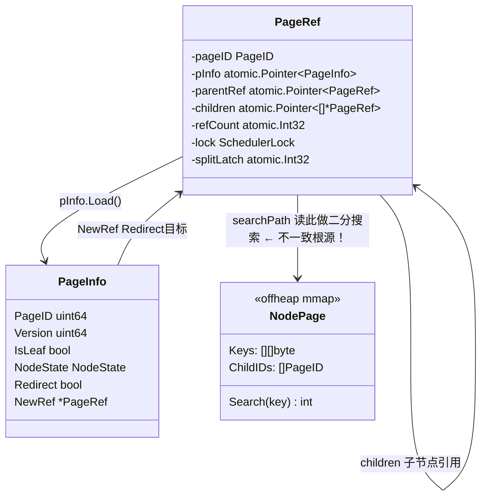
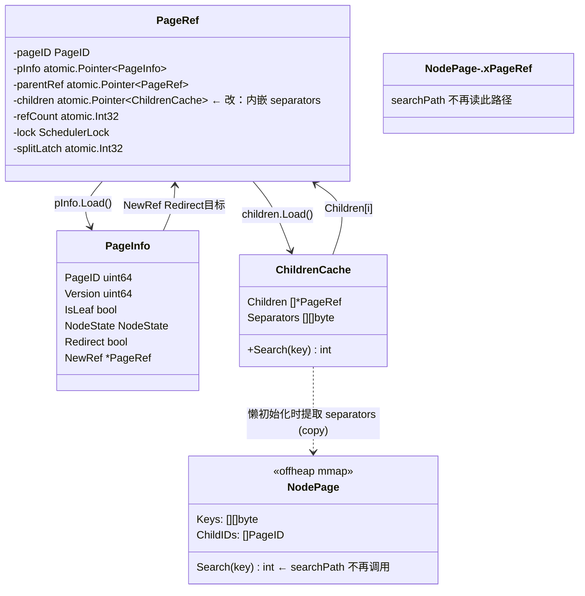

# 方案 B：Children Cache 内嵌 Separator Keys，消除 searchPath 对物理 Page 的依赖

# 最终版 v2.0 | 2026-04-06

## Context

`TestConcurrentSplit` 持续失败（~100% missing keys）。根因是 `propagateUpward` CAS parent pInfo 后，children cache（`[]*PageRef`）中的 PageRef 对象与 parent node page 中的 childID 不一致。即使禁用 `propagateUpward`，`searchPath` 仍依赖 `storage.GetNodePage(pInfo.PageID)` 读取 separator keys 做二分搜索——当 pInfo 被其他操作 CAS 改变后，读到的新 page 的 childID 与 cache 中的 PageRef 不匹配。

**核心思路**：将 separator keys 存入 children cache，让 `searchPath` 在 cache 命中时不读 NodePage，彻底消除不一致窗口。

**Redirect 时序决策**：保持当前顺序（先 CAS parent + updateChildrenCache，再 CAS leaf 设 Redirect）。通过 ChildrenCache 原子更新 + ErrRetry 兜底解决窗口问题。详见「并发正确性论证」第 4 节。

## 数据结构变化

### 改造前（当前）



**问题**：`searchPath` 先读 `NodePage.Keys` 做 `Search(key)`，再用 `PageRef.children[idx]` 取子节点。当 NodePage 被 COW 替换后，Keys 与 children 不一致。

### 改造后（方案 B）



**关键改变**：
1. `PageRef.children` 类型从 `atomic.Pointer[[]*PageRef]` → `atomic.Pointer[ChildrenCache]`
2. `ChildrenCache` 同时持有 `Children` 和 `Separators`，searchPath 用 `cache.Search(key)` 导航
3. `NodePage` 仍存在（split handler 写入），但 `searchPath` 在 cache 命中时不读取它

### 字段类型变更汇总

| 结构体 | 字段 | 改造前 | 改造后 |
|--------|------|--------|--------|
| `PageRef` | `children` | `atomic.Pointer[[]*PageRef]` | `atomic.Pointer[ChildrenCache]` |
| `PageRef` | `GetOrCreateChildren()` 返回值 | `([]*PageRef, error)` | `(*ChildrenCache, error)` |
| `RootPageRef` | `ReplaceRoot()` 参数 | `newChildren []*PageRef` | `newChildren *ChildrenCache` |
| `RootPageRef` | `ReplaceRoot()` 内部 Store | `Store(&newChildren)` | `Store(newChildren)` |
| `operations.go` | `updateChildrenCache()` 构建 | `[]*PageRef` | `*ChildrenCache`（从 CAS 后的 newNodePage 提取 separators） |
| `operations.go` | `distributeChildrenAfterSplit()` 分配 | `[]*PageRef` | `ChildrenCache`（含 separators） |
| **新建** | `ChildrenCache` | - | `Children []*PageRef` + `Separators [][]byte` + `Search(key)` |

### searchPath 数据流对比

```
改造前：
  searchPath(key)
    → pInfo = ref.GetPageInfo()
    → node = storage.GetNodePage(pInfo.PageID)     ← 读磁盘页
    → idx = node.Search(key)                        ← 用页内 keys 二分
    → children = ref.GetOrCreateChildren(storage)
    → childRef = children[idx]
    问题：node.Keys 与 children 可能不一致

改造后：
  searchPath(key)
    → pInfo = ref.GetPageInfo()
    → cache = ref.GetOrCreateChildren(storage)     ← 返回 *ChildrenCache
    → idx = cache.Search(key)                       ← 用内嵌 separators 二分（cache 命中时不读 NodePage）
    → childRef = cache.Children[idx]               ← 同一 cache 对象
    优势：separators 与 children 原子更新，不存在不一致
```

注意：`GetOrCreateChildren` 首次访问（cache 未命中）仍需读 NodePage 懒初始化提取 separators。**cache 命中**后不再读 NodePage。

### ChildrenCache.Search 语义

```
B+Tree 内部节点布局：

  Separators:  [k1]    [k2]    [k3]
  Children:  [C0]    [C1]    [C2]    [C3]

  Search(key):
    key < k1       → 0  (走 C0)
    k1 <= key < k2 → 1  (走 C1)
    k2 <= key < k3 → 2  (走 C2)
    key >= k3      → 3  (走 C3)

  不变量: len(Separators) == len(Children) - 1
```

## 改动范围

| 文件 | 改动 |
|------|------|
| **新建** `children_cache.go` | `ChildrenCache` 结构体 + `Search(key)` + `copyKey()` |
| `page_ref.go` | `children` 类型改为 `atomic.Pointer[ChildrenCache]`；`GetOrCreateChildren` 返回 `*ChildrenCache` |
| `search.go` | `searchPath` 用 `cache.Search(key)` 替代 `node.Search(key)` |
| `root_ref.go` | `ReplaceRoot` 参数从 `[]*PageRef` 改为 `*ChildrenCache`；Store 修正 |
| `operations.go` | `updateChildrenCache`/`distributeChildrenAfterSplit` 构建 `ChildrenCache` |
| `page_ref_test.go` | 8 个测试函数适配返回值类型 |

### page_ref_test.go 受影响测试完整列表

| 测试函数 | 变化说明 |
|---------|---------|
| `TestPageRefGetOrCreateChildrenLeaf` | nil 判断不变 |
| `TestPageRefGetOrCreateChildrenNode` | `children[i]` → `cache.Children[i]` |
| `TestPageRefGetOrCreateChildrenConcurrent` | `results` 类型从 `[][]*PageRef` → `[]*ChildrenCache`；断言改为指针比较 |
| `TestRootPageRefReplaceRoot` | `ReplaceRoot` 参数类型变化 |
| `TestRootPageRefReplaceRootWithChildren` | `ReplaceRoot` 参数变化；遍历 `newChildren.Children` |
| `TestRootPageRefReplaceRootConflict` | `ReplaceRoot` 参数类型变化 |
| `TestHandleRootSplit_ReplaceRoot` | `ReplaceRoot` 参数类型变化 |
| `TestRootPageRefNoRedirectNeeded` | `ReplaceRoot` 参数类型变化 |

## 步骤

### Step 1: 新建 `children_cache.go` + 单元测试（独立提交）

```go
type ChildrenCache struct {
    Children   []*PageRef   // 子节点 PageRef，有序
    Separators [][]byte     // Separators[i] = Children[i] 和 Children[i+1] 的分界 key
                             // len(Separators) == len(Children) - 1
}

// Search 二分搜索，语义与 nodePageHandle.Search 一致：
// key == Separators[i] → 返回 i+1（右子树）
// key < Separators[0]  → 返回 0
// key >= Separators[last] → 返回 len(Children)-1
func (c *ChildrenCache) Search(key []byte) int

// copyKey 从 mmap slice 拷贝独立 key（GetKey() 返回 mmap slice）
func copyKey(k []byte) []byte {
    cp := make([]byte, len(k))
    copy(cp, k)
    return cp
}
```

**测试要求**：
- `TestChildrenCacheSearch`：空 cache、单 separator、多 separator、边界值（==、<、>）、单 Children（0 separator）
- `TestChildrenCacheInvariant`：验证 `len(Separators) == len(Children) - 1`；`Search` 返回值在 `[0, len(Children))` 范围内
- `TestCopyKey`：验证 copy 后修改原 buffer 不影响 cache 中的 key
- `TestChildrenCacheSearchConsistency`：与 `nodePageHandle.Search` 对比（需要 offheap storage，放入 Step 2-6 合并提交）

### Step 2-6: 合并提交（编译依赖）

#### Step 2: 修改 `page_ref.go`

- `children` 字段: `atomic.Pointer[[]*PageRef]` → `atomic.Pointer[ChildrenCache]`
- `GetOrCreateChildren` 返回 `(*ChildrenCache, error)`
  - **IsLeaf 快速返回**：优先检查 `pInfo.IsLeaf`，直接返回 `(nil, nil)`，避免不必要的 `GetNodePage` 调用
  - 构建时通过 `page.GetKey(i)` 提取 separator keys（**必须 copy**，GetKey 返回 mmap slice）
  - **并发安全**：`CompareAndSwap(nil, &newCache)` 保证只有一个 goroutine 的结果被采纳
  - CAS 失败时读已存储的值（split handler 写入的新 cache），安全

#### Step 3: 修改 `root_ref.go`

- `ReplaceRoot` 签名: `newChildren []*PageRef` → `newChildren *ChildrenCache`
- 内部 `SetParentRef` 遍历 `newChildren.Children`（需 nil check）
- `Store` 修正: `Store(&newChildren)` → `Store(newChildren)`（`atomic.Pointer[T].Store` 接受 `*T`，参数已是指针）

#### Step 4: 修改 `operations.go`

**`updateChildrenCache`**:
- 从 CAS **后**的 `newNodePage` 提取 separators（copy），构建 `ChildrenCache{Children, Separators}` 并 Store
- `newNodePage` 是 COW 产物，split handler 独占持有，keys 是最新的

**`distributeChildrenAfterSplit`**:
- 分配 children **和** separators 给 left/right
- Left children: `oldChildren[0:mid+1]`
- Left separators: `oldSeparators[0:mid]`（共 mid 个 = children 数 - 1）
- Right children: `oldChildren[mid+1:]`
- Right separators: `oldSeparators[mid+1:]`（跳过被上移到 parent 的 split key `oldSeparators[mid]`，共 len-mid-1 个 = children 数 - 1）

**`handleRootSplit`/`handleRootInternalSplit`**:
- `ReplaceRoot` 传 `&ChildrenCache{Children: []*PageRef{leftRef, rightRef}, Separators: [][]byte{copyKey(splitKey)}}`

**Redirect 时序**：**保持当前顺序不变**（先 CAS parent + updateChildrenCache，再 CAS leaf 设 Redirect）。安全性论证见下方第 4 节。

**`propagateUpward`**：确认禁用。**如果未来恢复，必须同时更新 parent 的 ChildrenCache（含 separator keys），否则引入新的不一致。**

#### Step 5: 修改 `search.go`

核心改动——`searchPath` 在 cache 命中时不调用 `storage.GetNodePage`:

```go
// 旧：node = storage.GetNodePage(pInfo.PageID); idx = node.Search(key); children = GetOrCreateChildren()
// 新：cache = GetOrCreateChildren(); idx = cache.Search(key); childRef = cache.Children[idx]
```

**Redirect 处理改进**:
```go
if childInfo.Redirect {
    // 重新加载 parent cache（split handler 已更新）
    updatedCache := currentRef.children.Load()
    if updatedCache != nil {
        reIdx := updatedCache.Search(key)
        if reIdx < len(updatedCache.Children) && updatedCache.Children[reIdx] != nil {
            childRef = updatedCache.Children[reIdx]
            // ...
        }
    }
}
```

**False-negative 防御性兜底**:
```go
// 当 Redirect 处理后仍导航到 Redirect child（parent cache 未更新窗口）
// 或导航结果不合理时，返回 ErrRetry 让 searchPath 从根重试
```

#### Step 6: 修改 `page_ref_test.go`

- 所有 `GetOrCreateChildren` 返回值从 `[]*PageRef` 改为 `*ChildrenCache`
- 所有 `ReplaceRoot` 参数从 `[]*PageRef` 改为 `*ChildrenCache`
- 测试断言从 `children[i]` 改为 `cache.Children[i]`

## 并发正确性论证

### 1. Stale separators 基本安全性

**命题**：Stale separators 不会导致数据丢失。

**证明**：
1. Split handler 原子更新 parent cache（`children.Store`），新 cache 包含正确的 separators
2. 读者如果持有旧 cache（split 前加载），stale separator 可能导航到错误 child
3. 错误 child 有两种情况：
   - **情况 A**：child 已被 Redirect（Redirect 在 CAS parent 后设置）→ 读者检测到 Redirect → 重新加载 parent cache → 正确导航
   - **情况 B**：child 未被 Redirect → 说明 child 不在 split 涉及范围内 → stale separator 导航到的是正确 child

### 2. False-negative 风险分析

**场景**：读者用 stale cache 导航到 child[i]，child[i] 既不是 Redirect 也没有被修改——只是 separator 变了导致选错了 child。

**分析**：Split 只影响**相邻的两个** child。如果 child 不在 split 范围内，stale separator 导航到的一定是正确 child（因为相邻的 separator 未变）。

**多级联 split**：如果同一 parent 的不同 child 被并发 split，stale cache 中多个 separator 都变了。但每个被 split 的 child 一定有 Redirect 标志。读者检测到任意 Redirect 都会触发 ErrRetry 从根重试。

**防御性编程**：增加 ErrRetry 兜底，即使论证成立的场景也做重试保护。

### 3. `updateChildrenCache` 并发安全

**命题**：多个 goroutine 并发 split 同一 parent 的不同 child 时，children cache 更新安全。

**安全保证来自 CAS 线性化，不是 split latch**：
- `handleParentCASWithSpin` 使用 CAS（`CompareAndSwap`）更新 parent pInfo
- CAS 是线性化操作：同一时刻只有一个 goroutine 成功
- CAS 成功后，`updateChildrenCache` 中 `children.Store` 是该 goroutine 独占执行
- 第二个 goroutine 的 CAS 必然失败（pInfo.Version 已变），自旋重试后基于新 Version 重建

**Split latch 的作用域**：
- `splitLatch` 在 **child** 级别，不在 parent 级别
- 两个 goroutine split 同一 parent 的不同 child → 各自持有自己 child 的 split latch → 互不阻塞
- 但 parent 的 CAS 串行化保证了 children cache 更新的顺序性

**CAS 与 Store 之间被抢占**：
- `handleParentCASWithSpin` 中 `parentRef.CAS` 成功后、`updateChildrenCache` 执行前，goroutine 可能被抢占
- 窗口内读者看到新 pInfo 但旧 children cache → 可能 idx_out_of_bounds
- `searchPath` 的 bounds check + ErrRetry 兜底处理这种情况

### 4. Redirect 时序安全性（保持当前顺序）

**当前执行顺序**（`handleLeafSplit`）：
1. Step 5: `handleParentCASWithSpin` → CAS parent pInfo + `updateChildrenCache`
2. Step 6: CAS leaf pInfo → Redirect=true

**为什么保持这个顺序**：

**方案 A（先 Redirect 后 parent）的问题**：
- 如果先 CAS leaf 设 Redirect，再 CAS parent 失败 → leaf 永久处于 Redirect 状态但 parent cache 未更新 → 读者检测到 Redirect → 重新加载 parent cache（旧的）→ 再次导航到同一 Redirect child → 需要回滚机制，增加复杂度和失败路径

**方案 B（先 parent 后 Redirect，当前顺序）的安全性分析**：

窗口分析（Step 5 完成后、Step 6 执行前）：

```
读者 A（持有旧 cache，在 Step 5 前加载）：
  → 用旧 separators 导航到旧 child（C2）
  → C2 的 pInfo 还没被 CAS 设 Redirect（Step 6 未执行）
  → 读者操作旧 child
  → 旧 child 的物理 page 数据是 split 前的完整数据（COW 保证旧 page 不变）
  → key 如果在 split 前就存在于 C2 中，读者能找到（读到旧值）
  → key 如果是 split 后才插入的（在 left 或 right 中），读者找不到 → false negative
  → false negative 由 writeOperation 的重试机制兜底（ErrRetry → 从根重走 searchPath）

读者 B（在 Step 5 后加载 cache）：
  → 加载新 cache（Step 5 的 updateChildrenCache 已写入）
  → 用新 separators 导航到 left 或 right
  → left/right 没有 Redirect → 正确路径 → 安全
```

**结论**：
- 读者 B（新 cache）的路径完全安全
- 读者 A（旧 cache）可能 false negative，但由 writeOperation 的 ErrRetry 重试兜底
- 旧 child 的物理 page 数据完整（COW），不会读到损坏数据
- false negative 窗口极短：Step 5 和 Step 6 在同一 goroutine 中连续执行，不可分割

### 5. `GetOrCreateChildren` 懒初始化 TOCTOU

**风险**：两个 goroutine 同时发现 `children == nil`，都进入构建逻辑。

**安全**：`CompareAndSwap(nil, &newCache)` 保证只有一个 goroutine 的结果被采纳。

**Stale cache 窗口**：
1. G1 调用 `GetOrCreateChildren`，读 `pInfo.PageID = P1`，构建 cache
2. 构建期间 split handler G2 CAS 替换 pInfo 为 `PageID = P2`，并 `updateChildrenCache` Store 新 cache
3. G1 构建完毕，`CompareAndSwap(nil, &newCache)` 失败（children 已非 nil）
4. G1 fallback 读 G2 写入的新 cache → 安全

**逆向时序**：
1. G1 CAS 成功（children 为 nil，G2 还没 Store）
2. G2 随后 `children.Store` 覆盖 G1 的 stale cache
3. 覆盖前短暂窗口：读者可能用 stale cache 导航
4. Stale cache 导航到的 child 如果已被 Redirect → 重试（安全）
5. 未被 Redirect → child 不在 split 范围内 → 导航正确（安全）

## 实施约束

### 原子提交要求

Step 2-6 有编译依赖：
- Step 2 改 `children` 字段类型 → Step 3/4/5/6 必须同步改
- 任何一步单独提交都会编译失败

**策略**：Step 1（新建文件 + 单元测试）可独立提交；Step 2-6 作为单次原子提交。

### Key Copy 规范

`GetKey()` 返回 mmap slice，**必须 copy** 才能持久化到 ChildrenCache：
```go
func copyKey(k []byte) []byte {
    cp := make([]byte, len(k))
    copy(cp, k)
    return cp
}
```

### 无循环依赖

`ChildrenCache` 包含 `[]*PageRef`，`PageRef` 包含 `atomic.Pointer[ChildrenCache]`。两者在同一 `package btree` 内，Go 编译器对同 package 类型无循环导入限制。

### handleInternalSplit 的 Redirect CAS best-effort

`handleInternalSplit` 第 382 行 `_ = currentRef.CAS(currentInfo, redirectInfo)` 是 best-effort。如果 CAS 失败（currentInfo 已被并发修改），currentRef 无 Redirect 标志但 grandparent cache 已更新。此时读者通过 grandparent 的新 cache 导航到 currentLeftRef/currentRightRef，不经过 currentRef，所以 Redirect 失败不影响正确性。

## 验证

```bash
# 1. 编译
go build ./internal/infrastructure/storage/btree/...

# 2. ChildrenCache 单元测试（Step 1 完成后立即运行）
go test -v -run TestChildrenCacheSearch ./internal/infrastructure/storage/btree/
go test -v -run TestChildrenCacheInvariant ./internal/infrastructure/storage/btree/
go test -v -run TestCopyKey ./internal/infrastructure/storage/btree/

# 3. 并发 split 测试（多次运行验证稳定性）
go test -v -count=10 -run TestConcurrentSplit ./internal/infrastructure/storage/btree/

# 4. 全量 btree 测试（含竞态检测）
go test -v -race -timeout 5m ./internal/infrastructure/storage/btree/...

# 5. Lint
make lint
```

## 评审变更日志

| 编号 | 级别 | 发现 | 处理 |
|------|------|------|------|
| CR-1 | CRITICAL | `distributeChildrenAfterSplit` Right separator 公式错误：`separators[mid:]` 应为 `separators[mid+1:]` | 修正公式，跳过 split key |
| CR-2 | CRITICAL | Redirect 时序：先 Redirect 后 parent 引入回滚风险（parent CAS 失败 → 死循环） | 保持当前顺序（先 parent 后 Redirect），ErrRetry 兜底 |
| CR-3 | CRITICAL | `updateChildrenCache` "CAS 前预构建" 误导 | 改为从 CAS 后的 newNodePage 提取 |
| CR-4 | CRITICAL | `searchPath` "不再读 NodePage" 不精确 | 改为 cache 命中时不读，首次访问仍需 |
| H-1 | HIGH | PageInfo Mermaid 图遗漏 `NewRef` 字段 | 补充到改造前后两图 |
| H-2 | HIGH | `ReplaceRoot` Store 类型错误：`Store(&newChildren)` 应为 `Store(newChildren)` | 修正字段类型变更汇总表 |
| H-3 | HIGH | `updateChildrenCache` 并发安全理由错误：不是 split latch 而是 CAS 线性化 | 重写并发论证第 3 节 |
| H-4 | HIGH | `GetOrCreateChildren` stale 窗口未论证 | 补充 TOCTOU 安全论证第 5 节 |
| H-5 | HIGH | `page_ref_test.go` 受影响测试列表不完整 | 补充 8 个测试函数完整列表 |
| H-6 | HIGH | `handleInternalSplit` Redirect CAS best-effort 未论证 | 补充到实施约束 |
| M-1 | MEDIUM | Step 1 缺少 `copyKey` 测试和 Search 返回值范围 invariant 测试 | 增加 `TestCopyKey` + `TestChildrenCacheInvariant` 含范围检查 |
| M-2 | MEDIUM | `TestChildrenCacheSearchConsistency` 需要 offheap storage | 移到 Step 2-6 合并提交 |
| M-3 | MEDIUM | `propagateUpward` 禁用后未来恢复注意事项 | 增加显式说明 |
