# Spike: PageRef SchedulerLock → 纯 CAS 乐观锁改造

> 日期: 2026-04-08
> 状态: Spike — 可行性分析

---

## 1. 背景与动机

当前 `writeOperation` 使用 `SchedulerLock`（spinlock）串行化同一 leaf 的所有写入：

```go
leafRef.Lock()          // spinlock 忙等待
  check redirect
  check isFull
  handleLeafSplit(...)  // 整个 split 流程在锁内，包括 alloc page、parent CAS、updateChildrenCache
  OR
  mutate + CAS          // 非分裂路径
leafRef.Unlock()
```

**问题**：
- Lock 覆盖了整个 split 流程，其他写同一 leaf 的 goroutine 全部空转
- split 涉及 page alloc、parent CAS spin、updateChildrenCache 等 I/O 密集操作，持锁时间远超「微秒级」的 spinlock 预期
- Lock 与 CAS 是两层并发控制，逻辑上有重叠

**参考**：Lealone PLBTree 使用 Optimistic Locking（乐观锁），读无锁、写用 CAS 重试。

---

## 2. 当前代码中 SchedulerLock 的作用域

SchedulerLock **仅**在 `writeOperation` 中使用（`operations.go:133-233`）：

| 路径 | Lock 覆盖范围 |
|------|-------------|
| 失效重试 | Lock → check nil/redirect → Unlock → continue |
| 非分裂写入 | Lock → check → GetLeafPage → mutate → CAS → Unlock |
| 根分裂 | Lock → check → handleRootSplit → Unlock |
| 叶子分裂 | Lock → check → IsFull → handleLeafSplit → Unlock |

所有 Unlock 后都 `continue`（重试）或 `return`。

---

## 2.1 时序对比：SchedulerLock vs 乐观 CAS

### 场景 A：两个 goroutine 并发写同一 leaf（非分裂路径）

```mermaid
sequenceDiagram
    participant G1 as G1 (写入 key-a)
    participant G2 as G2 (写入 key-b)
    participant Lock as SchedulerLock
    participant Leaf as Leaf PageRef
    participant CAS as atomic CAS

    rect rgb(90, 120, 120)
        note over G1,G2: ❌ 当前方案：SchedulerLock 串行化
        G1->>Lock: Lock()
        note right of Lock: G1 获取锁
        G2->>Lock: Lock()
        note right of Lock: G2 忙等待（spin + Gosched）
        G1->>Leaf: GetPageInfo → oldInfo
        G1->>CAS: mutate → CAS(oldInfo, newInfo) ✓
        G1->>Lock: Unlock()
        note right of Lock: G2 结束等待
        G2->>Leaf: GetPageInfo → oldInfo'
        G2->>CAS: mutate → CAS(oldInfo', newInfo') ✓
        G2->>Lock: Unlock()
        note over G1,G2: G2 在 G1 持锁期间空转，<br/>即使只是 mutate+CAS（微秒级）
    end

    rect rgb(20, 50, 20)
        note over G1,G2: ✅ 乐观 CAS：无锁并发
        G1->>Leaf: GetPageInfo → oldInfo₁
        G2->>Leaf: GetPageInfo → oldInfo₁
        note over G1,G2: 并行读取，无阻塞
        G1->>CAS: mutate → CAS(oldInfo₁, newInfo₁) ✓
        G2->>CAS: mutate → CAS(oldInfo₁, newInfo₂) ✗
        note right of CAS: G2 CAS 失败（Version 已变）
        G2->>Leaf: GetPageInfo → oldInfo₂
        G2->>CAS: mutate → CAS(oldInfo₂, newInfo₂) ✓
        note over G1,G2: G2 仅重试一次，无空转<br/>mutate+CAS 是纯 CPU 操作，无 I/O
    end
```



### 场景 B：两个 goroutine 并发触发同一 leaf 的 split

```mermaid
sequenceDiagram
    participant G1 as G1 (写入 key-a)
    participant G2 as G2 (写入 key-b)
    participant Lock as SchedulerLock
    participant Leaf as Leaf PageRef
    participant Split as handleLeafSplit
    participant Parent as Parent PageRef

    rect rgb(90, 120, 120)
        note over G1,G2: ❌ 当前方案：Lock 覆盖整个 split
        G1->>Lock: Lock()
        G2->>Lock: Lock()
        note right of Lock: G2 空转，等待 G1 完成<br/>整个 split 流程
        G1->>Leaf: IsFull → true
        G1->>Split: Split + mutate + parent CAS<br/>（耗时：alloc page + I/O）
        note right of Split: 持锁时间 = split 全流程<br/>可能数百微秒 ~ 毫秒级
        G1->>Leaf: CAS(redirectInfo)
        G1->>Lock: Unlock()
        note right of Lock: G2 终于拿到锁
        G2->>Leaf: GetPageInfo → Redirect
        note right of Leaf: G2 发现 leaf 已被 split<br/>释放锁，重新 searchPath
        G2->>Lock: Unlock()
        G2->>G2: searchPath → 找到新 leaf → 重试写入
    end

    rect rgb(20, 50, 20)
        note over G1,G2: ✅ 乐观 CAS：Splitting 标记 + CAS 竞争
        G1->>Leaf: GetPageInfo → oldInfo
        G2->>Leaf: GetPageInfo → oldInfo
        G1->>Leaf: CAS(oldInfo, splittingInfo) ✓
        G2->>Leaf: CAS(oldInfo, splittingInfo) ✗
        note right of Leaf: G2 立即知道有人在 split<br/>无空转，立即 searchPath 重试
        G1->>Split: Split + mutate + parent CAS
        G1->>Leaf: CAS(splittingInfo, redirectInfo) ✓
        G2->>G2: searchPath → 找到新 leaf → 重试写入
        note over G1,G2: G2 等待时间 = 0（CAS 瞬间失败）<br/>而非 G1 整个 split 流程的时间
    end
```



### 场景 C：两个 goroutine 写不同 leaf（无竞争）

```mermaid
sequenceDiagram
    participant G1 as G1 → Leaf-A
    participant G2 as G2 → Leaf-B
    participant LockA as Lock-A
    participant LockB as Lock-B

    rect rgb(90, 120, 120)
        note over G1,G2: ❌ 当前方案：各自 Lock 各自的 leaf（无竞争）
        G1->>LockA: Lock() ✓
        G2->>LockB: Lock() ✓
        G1->>G1: mutate + CAS
        G2->>G2: mutate + CAS
        G1->>LockA: Unlock()
        G2->>LockB: Unlock()
        note over G1,G2: 此场景两种方案等价<br/>但 Lock/Unlock 仍有原子操作开销
    end

    rect rgb(20, 50, 20)
        note over G1,G2: ✅ 乐观 CAS：完全无锁
        G1->>G1: mutate + CAS
        G2->>G2: mutate + CAS
        note over G1,G2: 无 Lock/Unlock 开销<br/>hot path 更短
    end
```



### 关键优势总结

| 维度 | SchedulerLock | 乐观 CAS |
|------|--------------|----------|
| **非竞争路径开销** | Lock + Unlock = 2 次 atomic op | 0（直接 CAS） |
| **竞争等待方式** | 忙等待（spin + Gosched） | CAS 失败 → 立即重试 |
| **Split 持锁时间** | 整个 split 流程（可能 ms 级） | Splitting CAS 瞬间（ns 级） |
| **等待者的 CPU 浪费** | 持续空转直到 Unlock | 0（失败方立即走开） |
| **并发写同一 leaf 吞吐** | 串行（1 个执行，其余空转） | 并行 mutate，CAS 串行化提交 |
| **Lock 与 CAS 的关系** | 两层冗余并发控制 | 单层 CAS 即足够 |

**核心洞察**：`CAS(oldInfo, newInfo)` 本身就是原子操作，已经保证了一致性。`SchedulerLock` 在 CAS 之上再加一层互斥是**冗余的**——它的唯一作用是"让 goroutine 读到最新的 oldInfo"，但这完全可以通过 CAS 失败重试来达成，且重试代价远低于忙等待。

---

## 3. 改造方案：移除 SchedulerLock，纯 CAS 乐观锁

### 3.1 核心思路

**当前**：Lock → 读状态 → 操作 → CAS → Unlock
**目标**：读状态（无锁）→ 操作 → CAS → 失败则重试

SchedulerLock 保护的本质是：**在 CAS 之前，确保读到一致的 oldInfo**。但 `PageInfo` 已经通过 `atomic.Pointer` 原子访问，CAS 本身就保证了一致性。Lock 的实际作用退化为：

1. **防止同一 leaf 的并发 split**：两个 goroutine 同时发现 isFull=true → 都去 split → 数据错乱
2. **防止读到 stale oldInfo 后做无用功**：Lock 保证读到最新 pInfo

### 3.2 关键保护点：并发 split

移除 Lock 后，两个 goroutine 可能同时对同一个 leaf 进入 split 路径：

```
G1: searchPath → leaf L (isFull) → handleLeafSplit → Split → parent CAS ✓
G2: searchPath → leaf L (isFull) → handleLeafSplit → Split → parent CAS ✗ (retry)
```

这**不是问题**，因为：
- `handleLeafSplit` 内部通过 `leafRef.CAS(leafInfo, redirectInfo)` 竞争
- 只有一个 goroutine 的 CAS 会成功
- 失败方 Release leftRef/rightRef，返回 `ErrCASConflict`，外层重试

但有一个**临界窗口**需要处理：

```
G1: Split leaf → [left, right, splitKey]
G1: parent CAS success → updateChildrenCache
G1: leaf CAS redirect ←---- 这之间 ----→ G2: 也 Split 了同一个 leaf → 产生不同的 [left', right', splitKey']
G1: redirect CAS 成功
G2: parent CAS 使用 G2 的 split 数据（基于旧 leaf 内容）→ 产生错误的 separator
```

**解决方案**：在 `handleLeafSplit` 中，先做 `leafRef.CAS(leafInfo, splittingInfo)` 标记「正在分裂」，再执行实际 split。其他 goroutine 看到 `splitting` 标记后立即重试。

### 3.3 NodeState 扩展

```go
const (
    NodeNormal    NodeState = 0
    NodeRoot      NodeState = 1
    NodeRedirect  NodeState = 2  // 已分裂
    NodeSplitting NodeState = 3  // 正在分裂（新增）
)
```

**Version 流转图**：

```
成功路径：Normal(v) → CAS → Splitting(v+1) → handleLeafSplit → CAS → Redirect(v+2)
回滚路径：Normal(v) → CAS → Splitting(v+1) → handleLeafSplit 失败 → defer CAS → Normal(v)
               ↑                                                         指针回到 oldInfo
Root 分裂：Normal(v) → CAS → Splitting(v+1) → handleRootSplit → ReplaceRoot
           → pInfo 指向 newRootInfo（≠ splittingInfo）→ defer 不回滚
```

> **注意**：CAS 比较的是指针地址而非 Version 值。回滚路径中 `splittingInfo` 指针被替换回 `oldInfo` 指针，
> Version 字段的回退在 CAS 语义下无影响。不存在依赖 Version 单调递增的代码路径。

### 3.4 改造后的 writeOperation

> **关键设计决策**：Split 逻辑提取到辅助函数 `doSplitWithSplitting`，使 defer 在辅助函数返回时正确触发（而非延迟到 `writeOperation` 函数返回）。这解决了 `defer path.ReleaseAll()` 在 for 循环 `continue` 时不会执行的问题（Go defer 只在函数返回时执行，不在循环迭代结束时执行）。

```go
func writeOperation(b *BTree, key []byte, mutate mutateFunc) error {
    var searchRetryCount, splittingRetry, attempt int
    for attempt = range MaxCASRetries {
        // Step 1: Search path（无锁）
        path, err := searchPath(b.rootRef, key)
        if err != nil {
            searchRetryCount++
            if errors.Is(err, ErrRetry) { continue }
            return errpkg.BTreeWriteOpSearch(err)
        }

        leafRef := path.Leaf().Ref

        // Step 2: 无锁读取 PageInfo
        oldInfo := leafRef.GetPageInfo()
        if oldInfo == nil || oldInfo.NodeState == NodeRedirect || oldInfo.Redirect || !oldInfo.IsLeaf {
            path.ReleaseAll()
            continue
        }
        // Splitting 退避：专用计数器 + runtime.Gosched()
        if oldInfo.NodeState == NodeSplitting {
            splittingRetry++
            path.ReleaseAll()
            if splittingRetry > 16 {
                runtime.Gosched() // 让出 CPU，但不阻塞（与 SchedulerLock 退避行为等价）
            }
            continue
        }

        // Step 3: GetLeafPage（无锁，I/O 操作）
        // 注意：Step 3-4 之间存在 TOCTOU 窗口。GetLeafPage 是 I/O 操作，
        // 期间 pInfo 可能被其他 goroutine CAS 替换。Step 4 的 double-check
        // 是为了尽早发现过期数据，最终正确性由 CAS 保证。
        oldLeaf, err := b.storage.GetLeafPage(oldInfo.PageID)
        if err != nil {
            path.ReleaseAll()
            if isLeafPageError(err) { continue }
            return errpkg.BTreeWriteOpGetLeaf(err)
        }

        // Step 4: Double-check pInfo 未被并发修改
        curInfo := leafRef.GetPageInfo()
        if curInfo == nil || curInfo.Redirect || curInfo.NodeState != NodeNormal || !curInfo.IsLeaf {
            path.ReleaseAll()
            continue
        }

        if oldLeaf.IsFull(len(key), 0) {
            // ---- Split 路径 ----
            // CAS 标记 Splitting，防止并发 split
            splittingInfo := &PageInfo{
                PageID:    oldInfo.PageID,
                Version:   oldInfo.Version + 1,
                IsLeaf:    true,
                NodeState: NodeSplitting,
            }
            if !leafRef.CAS(oldInfo, splittingInfo) {
                path.ReleaseAll()
                continue  // 另一个 goroutine 在操作此 leaf
            }

            // ★ 提取到辅助函数：defer 在辅助函数返回时正确触发，
            // 避免 for 循环中 continue 不触发 defer 的问题。
            splitErr := b.doSplitWithSplitting(leafRef, splittingInfo, oldInfo, path, key, mutate)

            if splitErr == nil {
                return nil // Split + Insert 成功
            }
            // 非 transient 错误直接返回
            if !errors.Is(splitErr, ErrCASConflict) && !errors.Is(splitErr, ErrRetry) {
                return splitErr // ErrDuplicateKey, ErrKeyNotFound 等
            }
            // transient 错误 → defer 已回滚 Splitting，继续重试
            continue
        }

        // ---- 非 Split 路径 ----
        result, err := mutate(oldLeaf)
        if err != nil {
            path.ReleaseAll()
            return err
        }

        newInfo := &PageInfo{
            PageID:  result.newPageID,
            Version: oldInfo.Version + 1,
            IsLeaf:  true,
        }
        if !leafRef.CAS(oldInfo, newInfo) {
            _ = b.storage.FreePage(result.newPageID)
            path.ReleaseAll()
            if b.metrics != nil { b.metrics.IncrementCASRetry() }
            continue
        }

        path.ReleaseAll()
        b.size.Add(result.delta)
        return nil
    }

    GlobalTracer.LogOp("writeOp.EXHAUSTED", "key", string(key), "attempt", attempt,
        "searchRetry", searchRetryCount, "splittingRetry", splittingRetry)
    return ErrCASConflict
}

// doSplitWithSplitting 执行 Split 操作。
// ★ 独立函数使 defer 在每次调用返回时正确触发（而非延迟到 writeOperation 返回）。
// Splitting CAS 成功后调用此函数，函数返回时：
//   - path 已 ReleaseAll（defer 保证，含 panic 场景）
//   - 如果 pInfo 仍为 splittingInfo，回滚为 oldInfo（defer 保证）
func (b *BTree) doSplitWithSplitting(leafRef *PageRef, splittingInfo, oldInfo *PageInfo,
    path SearchPath, key []byte, mutate mutateFunc) error {

    // defer LIFO 顺序：先 ReleaseAll，后 Splitting 回滚。
    // ReleaseAll 释放 path 引用不影响 leafRef 的 pInfo CAS。
    // 两个 defer 之间无依赖关系。
    defer func() {
        // 如果 pInfo 仍指向 splittingInfo，说明没成功转为 Redirect/ReplaceRoot
        if leafRef.GetPageInfo() == splittingInfo {
            leafRef.CAS(splittingInfo, oldInfo) // 回滚到 Normal
        }
        // ★ handleRootSplit 成功后 ReplaceRoot 已将 pInfo 替换为 newRootInfo（≠ splittingInfo），
        //   此处 GetPageInfo() != splittingInfo → defer 不执行回滚 → 语义正确。
        //   旧 leafRef（原 root）的 Splitting 状态成为孤儿，不影响后续操作（不可达）。
    }()
    defer path.ReleaseAll() // 保证 panic 时也清理 path 引用

    if len(path) < 2 {
        // ★ handleRootSplit 成功：通过 ReplaceRoot CAS 替换 pInfo → defer 检测到 pInfo≠splittingInfo → 不回滚
        //   handleRootSplit 失败：pInfo 仍为 splittingInfo → defer 回滚为 oldInfo
        return b.handleRootSplit(leafRef, splittingInfo, path, key, mutate)
    }
    return b.handleLeafSplit(leafRef, splittingInfo, path, key, mutate)
}
```

### 3.5 handleLeafSplit 调整

`handleLeafSplit` 接收的 `leafInfo` 已经是 `NodeSplitting` 状态。Split 完成后：

- **成功**：CAS `splittingInfo → redirectInfo`（设置 Redirect + NewRef）
- **失败**：调用方回滚 `splittingInfo → oldInfo`

不再需要 `leafRef.Lock()`。

---

## 4. 移除 parentRef（附带清理）

`parentRef` 在当前代码中有三个用途，都有替代方案：

| 用途 | 位置 | 替代方案 |
|------|------|---------|
| 级联分裂找 grandparent | `handleInternalSplit:301` | 用 `path[currentLevel-1].Ref` |
| 分裂后更新子节点 parent 指针 | `distributeChildrenAfterSplit:599` | 删除 parentRef 后此逻辑消失 |
| 调试路径回溯 | `GetPathToRoot:272` | 用 path 数组 |

移除后的 PageRef：

```go
type PageRef struct {
    pageID   model.PageID
    pInfo    atomic.Pointer[PageInfo]
    children atomic.Pointer[ChildrenCache]
    refCount atomic.Int32
    freeFunc func(model.PageID)
}
```

---

## 5. 可删除的文件和代码

| 项目 | 文件 | 说明 |
|------|------|------|
| `SchedulerLock` 类型 | `page_lock.go` | 整个文件删除 |
| `SchedulerLock` 测试 | `page_lock_test.go` | 整个文件删除 |
| `PageRef.lock` 字段 | `page_ref.go:30` | 删除 |
| `PageRef.parentRef` 字段 | `page_ref.go:26` | 删除 |
| `GetParentRef/SetParentRef` | `page_ref.go:132-141` | 删除 |
| `GetPathToRoot` | `page_ref.go:265-275` | 删除 |
| `handleInternalSplit` 中 `GetParentRef()` | `operations.go:301` | 改用 path 索引 |
| `distributeChildrenAfterSplit` 中 `SetParentRef` | `operations.go:599-604` | 删除 |
| `NewPageRef` 的 `parentRef` 参数 | `page_ref.go:37` | 删除参数 |
| 所有 `NewPageRef(..., parentRef, ...)` 调用 | `operations.go` 多处 | 删除 parentRef 参数 |
| `ReplaceRoot` 中 `SetParentRef` | `root_ref.go:45` | 删除 |
| `NewRootPageRef` 中 parentRef 注释 | `root_ref.go:23` | 删除 |
| `handleRootInternalSplit` 中 `NewPageRef(..., &b.rootRef.PageRef, ...)` | `operations.go:448-449` | 删除 parentRef 参数 |
| `handleRootSplit` 中 `NewPageRef(..., &b.rootRef.PageRef, ...)` | `operations.go:898-899` | 删除 parentRef 参数 |
| `handleLeafSplit` 中 `NewPageRef(..., nil, ...)` | `operations.go:734-735, 739-740` | 删除 parentRef 参数 |
| `handleInternalSplit` 中 `NewPageRef(..., grandparentRef, ...)` | `operations.go:321-322` | 删除 parentRef 参数 |
| `GetOrCreateChildren` 中 `NewPageRef(childID, 0, r, ...)` | `page_ref.go:205` | **完全删除方法**（searchPath 已用 GetChildren()，GetOrCreateChildren 是死代码路径，保留会引入不必要的复杂度和 parentRef 不一致风险。cache 为 nil 是瞬态：cache 由 ReplaceRoot/distributeChildrenAfterSplit/updateChildrenCache 设置，这些操作是 split 流程的原子步骤。searchPath 遇到 nil cache 返回 ErrRetry，writeOperation 重试后 cache 已设置） |
| `GetOrCreateChildren` 测试 | `page_ref_test.go:175-255` | **完全删除**（TestPageRefGetOrCreateChildrenLeaf/Node/Concurrent） |
| `Lock()/Unlock()` 方法定义 | `page_ref.go:123-130` | 删除 |
| `RootPageRef` 注释 "SchedulerLock" | `root_ref.go:18` | 删除 |
| 测试文件中 `NewPageRef` 调用 | `page_ref_test.go` 多处 | 删除 parentRef 参数 |
| 测试文件中 SchedulerLock 测试 | `page_ref_test.go` | 删除 |

---

## 6. handleInternalSplit 改造

当前用 `currentRef.GetParentRef()` 找 grandparent，改为用 path 数组：

```go
// 当前：
grandparentRef := currentRef.GetParentRef()

// 改为：
// ★ 安全检查：currentLevel 必须 >= 1 才有 grandparent。
// path[0] = root，没有 grandparent。此检查必须在 path[currentLevel-1] 访问之前。
// 实施时极易放错位置（在 path 索引之后），导致数组越界 panic。
if currentLevel < 1 {
    return b.handleRootInternalSplit(...)
}
grandparentRef := path[currentLevel-1].Ref
// ★ 断言：grandparentRef 必然非 nil（searchPath 保证 path[i].Ref 都已 Retain）
```

**级联分裂中的层级语义**：path 数组在 searchPath 时快照，不随级联分裂更新。`currentLevel--`（operations.go:431）每次循环使索引指向更高层级祖先。`path[currentLevel-1]` 的 PageInfo 可能被并发修改，但后续 `grandparentRef.GetPageInfo()` + nil/Redirect 检查提供了足够的保护。

**handleRootSplit 约束**：`handleRootSplit` 成功后通过 `ReplaceRoot` CAS 替换 pInfo。此后**绝不能**对传入的 `leafRef`（即 `&rootRef.PageRef`）做任何额外 CAS 操作——否则会覆盖 ReplaceRoot 设置的新 root 状态。当前代码满足此约束（handleRootSplit 成功后直接 return nil）。

`NewPageRef` 调用处去掉 parentRef 参数：

```go
// 当前：
currentLeftRef := NewPageRef(currentLeft.PageID(), 0, grandparentRef, b.rootRef.freeFunc)

// 改为：
currentLeftRef := NewPageRef(currentLeft.PageID(), 0, b.rootRef.freeFunc)
```

---

## 7. 专家评审意见（Go 无锁编程 + BTree 引擎）

> 评审日期: 2026-04-08
> 评审人: Go 并发专家, B+Tree 存储引擎专家

### 7.1 设计亮点（认可）

1. **核心洞察正确**：`CAS(oldInfo, newInfo)` 本身已是原子操作，`SchedulerLock` 在 CAS 之上再加互斥确实冗余。非分裂路径移除 Lock 是无争议的改进。
2. **Splitting 状态方向正确**：CAS 原子标记"正在分裂"是经典的无锁模式（类似 MCS 锁的 locked 标志位），把 split 路径从"持锁做 I/O"转变为"CAS 标记 → 做 I/O → CAS 提交"。
3. **时序对比图（Section 2.1）**：三种场景清晰揭示关键差异，比纯文字更有说服力。
4. **parentRef 移除合理**：由 path 数组索引替代 O(h) 的 parentRef 链遍历，等价且更清晰。
5. **渐进式实施策略**：先加状态、改 writeOperation、改 handler、最后删 Lock，可逐步验证。

### 7.2 P0 致命问题（实施前必须修复）

#### P0-1: Splitting 回滚逻辑不完整 — 非 CASConflict 错误导致永久死锁

伪代码只对 `ErrCASConflict` 做回滚，但 `handleLeafSplit` 可能返回其他错误（如 `GetLeafPage` 返回 `fmt.Errorf(...)`）。这些路径直接 `return splitErr`，**Splitting 标记永远不会被清除，该 leaf 永久卡死**。

```go
// ❌ 当前伪代码 — 只回滚 ErrCASConflict
if splitErr == nil { return nil }
if errors.Is(splitErr, ErrCASConflict) {
    leafRef.CAS(splittingInfo, oldInfo)  // 只回滚这种
    continue
}
return splitErr  // ← 其他错误：Splitting 标记永远不会被清除！
```

**修复方案**：用 `defer` + 状态检查保证所有退出路径都清理：

```go
// ✅ 修复后 — 所有退出路径都保证清理
if !leafRef.CAS(oldInfo, splittingInfo) {
    path.ReleaseAll()
    continue
}

// defer 保证 panic 和所有错误路径都回滚
defer func() {
    // 如果 pInfo 仍指向 splittingInfo，说明没成功转为 Redirect
    if leafRef.GetPageInfo() == splittingInfo {
        leafRef.CAS(splittingInfo, oldInfo)
    }
}()

splitErr := b.handleLeafSplit(leafRef, splittingInfo, path, key, mutate)
path.ReleaseAll()

if splitErr == nil {
    return nil  // handleLeafSplit 成功 → 已 CAS splittingInfo → redirectInfo
}
// 所有错误（含 ErrCASConflict）都会被 defer 回滚
continue
```

#### P0-2: Splitting 窗口期间的 Thundering Herd（忙等风暴）

10 个 goroutine 同时写同一个 full leaf，G1 获得 Splitting CAS 后，其余 9 个疯狂循环 `searchPath → 发现 Splitting → ReleaseAll → 重试`。如果 split 涉及级联分裂（数十毫秒），CPU 开销远超 spinlock 的一次 `runtime.Gosched()`。

**修复方案**：用专用 `splittingRetry` 计数器 + 纯 `runtime.Gosched()` 退避（无 sleep，保持无锁原则）：

```go
var splittingRetry int  // 独立于 attempt，仅统计 Splitting 重试

// Step 2 中增加 Splitting 检查 + 退避
if oldInfo != nil && oldInfo.NodeState == NodeSplitting {
    splittingRetry++
    path.ReleaseAll()
    // 纯无锁退避：前 16 次纯自旋，超过 16 次 Gosched 让出 CPU
    if splittingRetry > 16 {
        runtime.Gosched()  // 让出但不阻塞，保持无锁原则
    }
    continue
}
```

> **为什么不用 time.Sleep**：无锁编程应避免阻塞操作。`runtime.Gosched()` 让出 CPU 时间片，
> 其他 goroutine（包括正在 split 的）可以继续执行，但不引入阻塞延迟。

> **为什么不直接用 `attempt`**：`attempt` 统计所有重试原因（searchPath 失败、CAS 失败、Redirect 等），
> 一个 goroutine 可能 `attempt=10` 却从未遇到 Splitting。基于 `attempt` 的退避会在非 Splitting 场景下
> 引入不必要的延迟。专用计数器精确匹配 Splitting 场景。

> **对比 SchedulerLock 的行为**：G2-G10 排队在 spinlock 上，G1 完成后 G2 获得锁，发现 Redirect，释放锁重试。每个 goroutine 只被唤醒一次。新方案中高竞争下 goroutine 可能反复重试，需退避控制。

> **退避行为等价声明**：`runtime.Gosched()` 退避与 `SchedulerLock`（page_lock.go:21-27）的退避行为本质等价——
> 两者都使用 `runtime.Gosched()` 让出 CPU。新设计的优势不在于退避策略本身，而在于：
> (1) Splitting CAS 标记是瞬时操作（ns 级），而非持锁整个 split 流程（可能 ms 级）；
> (2) 等待者 CAS 失败后**立即**走开（而非空转直到 Unlock）。
> 在 GOMAXPROCS=1 等极端场景下，两者退避效果相同。

### 7.3 P1 严重问题

#### P1-1: 读路径未处理 Splitting 状态（已修正：读 Splitting 是安全的）

> **第三轮修正**：前两轮建议"读操作遇到 Splitting 返回 ErrRetry"是过度保守。
> 代码追踪 `btree.go:84-120` 确认：COW 机制下原始 leaf 的物理数据未被修改（split 只创建副本），
> 读 Splitting leaf 返回旧数据在 COW 语义下是合法的快照读。**searchPath 和 Get 不需要额外处理 Splitting**。

`writeOperation` 的 Step 2/4 已通过 `NodeState != NodeNormal` 拒绝 Splitting leaf（写路径保护足够）。
读路径不需要修改：

```go
// ✅ 写路径：writeOperation 已有保护（Step 2 + Step 4 的 NodeState 检查）
// ✅ 读路径：Get 读 Splitting leaf → 返回旧数据 → COW 快照语义 → 安全
// ❌ 不需要：在 searchPath 中全局检查 Splitting（会影响读性能且无必要）
```

#### P1-2: path.ReleaseAll() 的 defer 缺失

Splitting CAS 成功后如果 `handleLeafSplit` panic，`path.ReleaseAll()` 不会执行，导致 refCount 永远不为 0，page 永远不被回收。

**修复**：Splitting CAS 成功后立即 `defer path.ReleaseAll()`：

```go
if !leafRef.CAS(oldInfo, splittingInfo) {
    path.ReleaseAll()
    continue
}
defer path.ReleaseAll()  // 保证 panic 时也清理
```

> **注**：此 P1-2 原始方案为内联 defer。Section 3.4 已演进为提取 `doSplitWithSplitting` 辅助函数，
> 将 `defer path.ReleaseAll()` 和 `defer Splitting 回滚` 统一封装在辅助函数内。
> 两者语义等价，Section 3.4 的辅助函数方案是此修复的最终形态。

#### P1-3: 同一 parent 下不同 leaf 并发 split 需显式论证

Splitting 解决了同一 leaf 的并发 split，但不同 leaf（同一 parent）的并发 split 依赖 `handleParentCASWithSpin` 的 re-derive idx + CAS 重试。当前设计是安全的，但文档应显式说明此交互。

### 7.4 P2 设计建议

#### P2-1: PLBTree 引用存在误导

NexKV 是 **COW 模式**，更接近 WiredTiger 而非原地修改的 PLBTree。PLBTree 不做 COW，其乐观锁机制（version check）与 NexKV 的指针 CAS 有本质差异。

> | 实现 | 写并发模型 | Split 保护 | COW |
> |------|-----------|-----------|-----|
> | **PLBTree (Lealone)** | 乐观锁 + version check | Version check | 否 |
> | **WiredTiger** | Intent Lock | Intent Lock | 是 |
> | **LMDB** | 单写者 | 无需 | 是 |
> | **Lehman-Yao** | Lock-free + link pointer | Link pointer | 否 |
> | **NexKV（提议）** | Splitting CAS | CAS + Splitting 标记 | 是 |

建议引用改为 WiredTiger 或类似 COW B+Tree 实现。

#### P2-2: ABA 安全性需显式论证

Go 的 `atomic.Pointer[T].CompareAndSwap` 比较的是**指针地址**而非值。GC 保证两个不同的 `PageInfo` 对象永远不会共享同一地址。因此 **ABA 问题在 Go 中不会发生**（与 C/C++ 不同）。应在风险评估中明确说明。

#### P2-3: Version 回退需文档化

回滚 `splittingInfo → oldInfo` 时 Version 从 v+1 回到 v。由于 CAS 比较指针不比较 Version，这是安全的。但如果有代码依赖 Version 单调递增（当前不存在），则是隐含风险。Version 流转需明确：

```
Normal(v) → Splitting(v+1) → Redirect(v+2)  [成功路径]
Normal(v) → Splitting(v+1) → Normal(v)       [回滚路径，指针回到 oldInfo]
```

#### P2-4: 缺少 link pointer 讨论

当前设计 split 期间搜索必须重试（而非右移），对单 key 操作影响不大，但如果未来需要 RangeScan，Lehman-Yao 的 link pointer 是必要的。应在文档中注明此限制。

#### P2-5: Section 5 遗漏 GetOrCreateChildren

`page_ref.go:205` 中 `GetOrCreateChildren` 的 `NewPageRef` 调用也传入了 parentRef 参数，移除时需一并修改。

#### P2-6: 建议增加 Splitting 超时兜底

在 PageInfo 中记录 Splitting 开始时间，超时后允许强制回滚，作为 panic recovery 的补充保护。

### 7.5 修正后的风险评估

| 风险 | 原评级 | 修正评级 | 缓解措施 |
|------|--------|---------|---------|
| Splitting 标记未回滚导致死锁 | 中 | **高** | defer + 所有错误路径回滚 + 超时兜底 |
| 高竞争下 Thundering Herd | 未评估 | **高** | 专用 splittingRetry 计数器 + 指数退避 |
| 非 transient 错误无限重试 | 未评估 | **中** | 区分 ErrCASConflict/ErrRetry（continue）与其他错误（return） |
| 读路径 Splitting 处理 | 未评估 | **不需要** | COW 快照语义下读 Splitting leaf 返回旧数据安全 |
| path 资源泄漏（panic） | 未评估 | **中** | Splitting CAS 成功后 defer path.ReleaseAll() |
| 内存可见性 trade-off | 未评估 | **低** | Lock 保证最新值 → CAS 失败重试保证最终最新值 |
| 非 split 路径 TOCTOU | 低 | 低 | CAS 失败自动重试，无数据丢失 |
| parentRef 移除后级联分裂 | 低 | 低 | path 数组 + physical page re-derive |
| 并发 split CAS 竞争 | 低 | 低 | CAS lock-free，失败方立即重试 |
| ABA 问题 | 未评估 | **不存在** | Go atomic.Pointer 比较指针地址，GC 保证唯一性 |
| Graceful shutdown vs Splitting | 未评估 | **低** | 建议增加 Close 等待机制或 Splitting 超时扫描 |
| 高竞争下无用 mutate CPU 开销 | 未评估 | **中** | CAS 失败前的 mutate 是纯 CPU 操作，高竞争下产生无效计算。但 CAS 失败重试成本低于 Lock 空转成本 |
| Splitting 窗口上界 | 未评估 | **低** | 纯 CAS 层面：≤ MaxParentCASSpins × 级联层数 × 10ns ≈ 5μs。含 I/O（offheap mmap 热路径：纳秒级页表命中；冷路径：微秒级 page fault，但 offheap 为纯内存无磁盘 IO）。实际 Splitting 窗口 ≈ 10-50μs（热路径全部缓存命中），极端级联 ≈ 100-500μs |

### 7.6 第二轮代码级深度评审

> 评审日期: 2026-04-08（第二轮）
> 评审方法：逐行追踪 `operations.go`、`page_ref.go`、`search.go`、`root_ref.go`、`btree.go`

#### 7.6.1 原评审意见代码验证

| 原评审项 | 代码验证结论 |
|---------|------------|
| **P0-1 Splitting 回滚不完整** | **确认且更复杂**。`handleLeafSplit`(operations.go:696-822) 有多条非 CASConflict 错误路径：`GetLeafPage` IO 错误(700)、`Split()` 错误(704)、`mutate` 返回 `ErrPageFull/ErrDuplicateKey`(721)、`handleParentCASWithSpin` 非 CASConflict 错误(771)。defer 回滚方案覆盖所有路径。 |
| **P0-2 Thundering Herd** | **确认**。退避策略已修正为专用 `splittingRetry` 计数器（见 P0-2 修正）。 |
| **P1-1 读路径 Splitting** | **确认**。`searchPath`(search.go:74-83) 只检查 `pInfo.Redirect`，不检查 `NodeSplitting`，Splitting leaf 会被当作正常 leaf 返回。`btree.go` 的 `Get` 也需要补充。 |
| **P1-2 path.ReleaseAll defer** | **确认**。P0-1 的 defer 方案已包含 `defer path.ReleaseAll()`。 |
| **P0-1 defer 指针比较安全性** | **确认安全**。Go 使用非移动式 GC，`atomic.Pointer.Load()` 返回的指针地址与 Store 时相同。`splittingInfo` 是函数局部变量，被 defer 闭包捕获，GC 不会回收。且 `handleLeafSplit` 成功 CAS `splittingInfo→redirectInfo` 后，`GetPageInfo()!=splittingInfo`，defer 不执行回滚——语义正确。 |
| **P2-5 Section 5 遗漏 GetOrCreateChildren** | **部分确认**。`GetOrCreateChildren`(page_ref.go:169-257) 在 searchPath 中未被调用（searchPath 用 `GetChildren()`）。应明确决策：保留为 fallback 还是删除。 |

#### 7.6.2 新发现的正确性问题

**N1: handleLeafSplit 接收 splittingInfo 后的行为安全**

追踪 `handleLeafSplit` 使用 `leafInfo` 的四个位置：
1. `operations.go:700` — `GetLeafPage(leafInfo.PageID)`：PageID 不变，安全
2. `operations.go:784` — `PageID: leafInfo.PageID` 构造 redirectInfo：PageID 不变，安全
3. `operations.go:785` — `Version: leafInfo.Version + 1`：splittingInfo.Version = oldInfo.Version+1，redirectInfo.Version = oldInfo.Version+2，正确
4. `operations.go:791` — `leafRef.CAS(leafInfo, redirectInfo)`：leafInfo 即 splittingInfo（同一指针），CAS 比较指针地址，能成功

**handleLeafSplit 不检查 `leafInfo.NodeState`**，只依赖 `PageID` 和 `Version`。改为传入 `splittingInfo` 后无需修改内部逻辑。

**N2: handleRootSplit 与 Splitting 状态的交互**

`handleRootSplit`(operations.go:829-951) 成功后**不做** leaf redirect CAS，而是通过 `ReplaceRoot` 替换整个 rootRef。
旧 leafRef 仍持有 Splitting 状态，但已不再是 root → defer 会回滚 `splittingInfo→oldInfo`（多余但无害）。

**N3: 内部节点不需要 Splitting 状态**

追踪 `handleInternalSplit`(operations.go:267-434) 和 `handleParentCASWithSpin`(operations.go:29-98)：
- `handleParentCASWithSpin` 的 re-derive idx（:58-68）+ CAS 重试已完全串行化内部节点的并发修改
- Splitting 只需在 leaf 层，防止两个 goroutine 同时 split 同一个 leaf
- 文档应明确说明这一设计决策

**N4: refCount 生命周期正确**

追踪 `Release()`(page_ref.go:88-115)：使用不可变的 `r.pageID`（创建时绑定），不使用 `pInfo.PageID`（可能被 CAS 替换）。
freeFunc 回收的是旧版本物理页面，在 COW 语义下完全正确。移除 Lock 不影响 refCount 安全性。

#### 7.6.3 Split 协议完整性分析

追踪新设计下的三个关键时间窗口：

**窗口 1：Splitting CAS 成功 → handleLeafSplit 开始**
- searchPath 可能到达 Splitting leaf
- 当前代码不会拒绝它（searchPath 不检查 NodeSplitting）
- **对写路径**：writeOperation Step 2/4 的 `NodeState != NodeNormal` 检查会拒绝 Splitting leaf
- **对读路径**：COW 机制下原始 leaf 物理数据未被修改，读 Splitting leaf 返回旧数据是安全的（见 7.7 审计-4）

**窗口 2：parent CAS 成功 → leaf redirect CAS（operations.go:771 → 791）**
- parent 的 ChildrenCache 已更新为 [leftRef, rightRef]
- leaf 仍为 Splitting（非 Redirect）
- 通过 parent 新 cache 导航的 searchPath → 找到 leftRef/rightRef → 正常操作，安全
- 通过旧 cache（或旧 path）到达 leaf → 看到 Splitting → 重试，安全

**窗口 3：handleRootSplit + ReplaceRoot 成功**
- 旧 leafRef 的 Splitting 由 defer 回滚，多余但无害
- 新 root 的 children cache 由 ReplaceRoot 原子设置，安全

#### 7.6.4 伪代码与实际代码差异

| 差异点 | 严重度 | 说明 |
|--------|-------|------|
| 重试计数器（searchRetryCount 等）省略 | 低 | 伪代码可省略调试变量 |
| `isLeafPageError` 简化 | 低 | 遗漏 `"is not a leaf page"` 字符串检查，CAS 重试兜底 |
| Step 4 Double-check 条件不一致 | 中 | 伪代码用 `!= NodeNormal`（更宽泛），实际代码用 `== NodeRedirect`。伪代码的写法**更正确**（也捕获 Splitting），应保留并注释意图 |
| CAS retry metrics 遗漏 | 低 | Split 路径 CAS 失败无 metrics，与当前代码行为一致 |
| EXHAUSTED trace 日志遗漏 | 中 | operations.go:245-247 的 `writeOp.EXHAUSTED` 对调试高竞争场景重要，应保留 |
| Step 2 缺少 Splitting 检查 | 中 | 伪代码第 238 行检查了 Redirect 但没显式检查 Splitting（Step 4 的 `!=NodeNormal` 会兜底），应提前到 Step 2 减少无效 I/O |

#### 7.6.5 Splitting 与 Separator Disorder 正交性声明

> **重要**：`NodeSplitting` 状态仅防止同一 leaf 的并发 split，**不解决也不加剧** separator disorder 问题。
> Separator disorder 的根因是不同 leaf 的并发 split 对同一 parent 的交叉更新。
> `handleParentCASWithSpin` 的 re-derive idx + `updateChildrenCache` 的 CAS 循环
> 是 separator 一致性的实际保障，与 Lock/Splitting 无关。

**详细论证**（基于 `handleParentCASWithSpin` 代码追踪 `operations.go:29-98`）：

场景：G1 split leaf-A（parent 的 child[2]），G2 split leaf-B（parent 的 child[5]），两个 goroutine 并发操作同一 parent。

1. G1 读 parent pInfo（version=v），re-derive idx=2，InsertChild 产生 newParent₁
2. G2 读 parent pInfo（version=v），re-derive idx=5，InsertChild 产生 newParent₂
3. G1 CAS(parentInfo_v, newParentInfo₁) 成功 → parent pInfo 指向 newParent₁
4. G2 CAS(parentInfo_v, newParentInfo₂) 失败（pInfo 已变为 newParentInfo₁ ≠ parentInfo_v）
5. G2 重试：读 newParentInfo₁（version=v+1），re-derive idx（在 newParent₁ 的物理页面上重新查找 leaf-B 的位置 → 可能已变），InsertChild → CAS(newParentInfo₁, newParent₂') 成功
6. 两次 InsertChild 的 separator 都基于各自物理页面的实际 key 顺序，不会交叉错乱

**关键**：re-derive idx 在每次 CAS 重试时从**最新物理页面**重新查找位置，不依赖 searchPath 快照。这保证了 separator 的正确性。Splitting 标记只影响 leaf 层的并发控制，不影响 parent 层的 InsertChild 逻辑。

#### 7.6.6 Section 5 删除列表补充（基于代码搜索）

第二轮代码搜索发现的遗漏项已补充到 Section 5 表格中，包括：
- `handleRootInternalSplit`、`handleRootSplit`、`handleLeafSplit`、`handleInternalSplit` 中所有 `NewPageRef` 调用
- `Lock()/Unlock()` 方法定义
- `RootPageRef` 注释
- 测试文件中的 `NewPageRef` 调用和 SchedulerLock 测试

### 7.7 第三轮代码级深度评审

> 评审日期: 2026-04-08（第三轮）
> 评审方法：伪代码逐行审计 + 边界条件分析 + 前两轮结论验证
> 评审重点：仅关注前两轮（7.1-7.6）未覆盖的问题

#### 7.7.1 P1 新发现问题

**P1-NEW-1: 非 transient 错误的无限重试（P0-1 defer 方案的副作用）**

P0-1 的 defer 方案将所有 `splitErr` 都走 `continue`，但 `ErrDuplicateKey`、`ErrKeyNotFound` 等不是 transient 错误——重试不会改变结果，只会浪费 CPU 直到 `MaxCASRetries` 耗尽。

```go
// ❌ 当前 defer 方案 — 所有错误都 continue
splitErr := b.handleLeafSplit(...)
path.ReleaseAll()
if splitErr == nil { return nil }
// ErrDuplicateKey 也会走 continue → 无限重试
continue

// ✅ 修复：区分 transient 和非 transient 错误
splitErr := b.handleLeafSplit(...)
path.ReleaseAll()
if splitErr == nil { return nil }
if !errors.Is(splitErr, ErrCASConflict) && !errors.Is(splitErr, ErrRetry) {
    // 非 transient 错误（ErrDuplicateKey 等）→ 直接返回
    // defer 仍会回滚 Splitting 标记
    return splitErr
}
// transient 错误 → 重试
continue
```

defer 在 `return` 路径上同样生效，回滚 `splittingInfo → oldInfo`。

**P1-NEW-2: parent CAS 成功后 leaf redirect CAS 不可能失败（需显式论证）**

追踪 `handleLeafSplit`(operations.go:771→791)：
- `handleParentCASWithSpin` 成功 → parent children cache 包含 leftRef/rightRef
- `leafRef.CAS(splittingInfo, redirectInfo)` — 这个 CAS 能失败吗？

**论证**：Splitting 状态阻止其他 goroutine 修改 leafRef 的 pInfo（Step 2/4 检查 `NodeState != NodeNormal` → continue）。唯一能修改 pInfo 的是持有 `splittingInfo` 指针的当前 goroutine。而当前 goroutine 在 split 过程中没有对 leafRef 做任何其他 CAS。因此 **leaf redirect CAS 不可能失败**（除非 panic，由 defer 处理）。

**推论**：不存在"parent CAS 成功但 leaf redirect CAS 失败"的不一致状态（除 panic 外）。panic 由 defer 回滚 splittingInfo，此时 parent cache 中的 leftRef/rightRef 成为孤儿——这是可接受的，因为后续 searchPath 会通过 parent cache 导航到 leftRef/rightRef 正常工作。

#### 7.7.2 P2 补充发现

**P2-NEW-1: 内存屏障 trade-off 未文档化**

`leafRef.Lock()` 底层是 `atomic.Int32.CompareAndSwap(0, 1)`，在 Go 内存模型中充当 acquire-release 屏障。Lock 保证 `GetPageInfo()` 读到其他 goroutine 在 Unlock 之前写入的最新 pInfo。

移除 Lock 后：
- **Lock 方案**：`Lock() → GetPageInfo()` 保证看到最新值
- **CAS 方案**：`GetPageInfo()` 可能读到 stale 值，但 CAS 失败重试保证最终看到最新值

这不是正确性问题（CAS 兜底），但属于设计 trade-off。文档应在 Section 7.5 风险评估中增加此条目。

**P2-NEW-2: Step 4 缺少 `!curInfo.IsLeaf` 防御性检查**

伪代码 Step 2 检查了 `!oldInfo.IsLeaf`，但 Step 4 的 double-check 没有。这是现有代码的遗留问题（operations.go:163 也没检查）。COW 机制下 pageID 不会被复用为不同类型，概率极低，但伪代码改写时应修复：

```go
// Step 4: Double-check（补充 IsLeaf 检查）
curInfo := leafRef.GetPageInfo()
if curInfo == nil || curInfo.Redirect || curInfo.NodeState != NodeNormal || !curInfo.IsLeaf {
    path.ReleaseAll()
    continue
}
```

**P2-NEW-3: Graceful shutdown 与 Splitting 状态**

`btree.Close()` (btree.go:209-214) 设置 closed 标志后调用 `storage.Close()` 释放 mmap 内存。如果此时有 goroutine 正在执行 handleLeafSplit（leaf 处于 Splitting），访问已释放的 mmap 区域会导致 segfault。

当前设计下这同样存在（Close 不等待进行中的操作），但新设计延长了"leaf 处于特殊状态"的窗口。建议文档增加 graceful shutdown 讨论：
- 方案 A：Close 前等待所有 active writeOperation 完成（参考计数器）
- 方案 B：Close 时扫描所有 Splitting 状态的 leaf 并强制回滚

**P2-NEW-4: defer 回滚 CAS 不可能失败（补充论证）**

defer 中 `leafRef.CAS(splittingInfo, oldInfo)` 的安全性论证：
1. Splitting 状态阻止其他 goroutine 修改 leafRef 的 pInfo
2. 只有当前 goroutine 持有 splittingInfo 指针
3. 当前 goroutine 的 handleLeafSplit 已返回，不再做任何 CAS
4. 因此 defer 执行时 pInfo 必然仍指向 splittingInfo，CAS 必然成功

#### 7.7.3 伪代码逐行审计（补充项）

| 审计项 | 说明 |
|--------|------|
| **Step 4 与 Step 2 检查条件应对齐** | Step 2 用精确匹配（`NodeRedirect`），Step 4 用反向匹配（`!= NodeNormal`）。应统一为 `!= NodeNormal`，减少认知负担 |
| **Step 4 应增加 `!curInfo.IsLeaf`** | 防御性检查，见 P2-NEW-2 |
| **Split 路径 non-transient 错误处理** | 伪代码 `continue` 应改为先判断是否 transient，见 P1-NEW-1 |
| **EXHAUSTED trace 不可省略** | 伪代码应保留 `writeOp.EXHAUSTED` trace 日志 |

#### 7.7.4 存储层并发模型验证

追踪 `offheap_storage.go` 和 `page_manager.go`：
- `Alloc()` 使用 `freeList.Dequeue()`（Michael-Scott 无锁队列）+ `nextPageID.Add(1)`
- `Free()` 使用 `freeList.Enqueue()`
- 两者都是 lock-free 的，不涉及 mutex

**结论**：移除 SchedulerLock **不会在存储层引入新瓶颈**。页分配器本身是无锁的。

#### 7.7.5 前两轮结论验证

| 前轮结论 | 第三轮验证 |
|---------|-----------|
| N1: handleLeafSplit 接收 splittingInfo 安全 | **确认**，不影响内部逻辑 |
| N2: handleRootSplit defer 回滚多余但无害 | **确认**，ReplaceRoot 后旧 leafRef 不可达 |
| N3: 内部节点不需要 Splitting | **确认**，handleParentCASWithSpin 的 CAS 已串行化 |
| N4: refCount 生命周期正确 | **确认**，Release 用不可变 r.pageID |
| 7.6.5 Splitting 与 separator disorder 正交 | **确认** |
| P0-1 defer 指针比较安全 | **确认**，Go 非移动式 GC |
| **P1-1 读路径需返回 ErrRetry** | **修正**：读 Splitting leaf 返回旧数据是安全的（COW 快照语义），searchPath/Get 不需要额外处理 |
| **P0-1 所有错误 continue** | **修正**：非 transient 错误（ErrDuplicateKey 等）应直接 return，见 P1-NEW-1 |

#### 7.7.6 未来优化：Help Completion 模式

> 此模式作为**未来优化方向**记录，不作为当前实施要求。

当前退避策略（Gosched）是被动的——等待者只让出 CPU。更激进的方案是 **Help Completion**：

```go
if oldInfo.NodeState == NodeSplitting {
    // 不等待，帮助正在 split 的 goroutine 完成！
    splitErr := b.helpCompleteSplit(leafRef, oldInfo)
    if splitErr == nil {
        path.ReleaseAll()
        continue  // 重新 searchPath
    }
    // 帮助失败，Gosched 一次再试
    runtime.Gosched()
    path.ReleaseAll()
    continue
}
```

优势：将等待者的 CPU 时间用于推进 split，而非空转。劣势：实现复杂度高，需要处理部分完成状态。
适合 Splitting 窗口频繁且持续较长的场景（如树高度较大导致级联分裂常见时）。

> **实现约束分析**：`helpCompleteSplit` 需要访问正在执行 split 的 goroutine 的局部状态（leftRef, rightRef,
> splitKey, parentRef 等），这些状态**不在 PageRef 上**——它们是 `handleLeafSplit` 的局部变量。
> 可行的实现路径：
> 1. 在 PageInfo 中嵌入 split 进度状态（需修改 PageInfo 结构，影响所有 CAS 路径）
> 2. 使用 leaf 级别的 split 状态注册表（引入全局 map + 新的原子操作）
> 3. 等待原始 goroutine 完成（退化为当前退避方案）
>
> 路径 1/2 的实现复杂度和正确性验证成本远超当前 spike 范围。**不建议短期实施**。

#### 7.7.7 最终 Go/No-Go 判定

**判定：Conditional Go**

设计方向正确，三轮评审已充分覆盖正确性风险。实施前条件：

1. **P0-1 修复方案采纳 defer 回滚**（已确认指针比较安全）
2. **P0-2 退避策略采用专用 splittingRetry 计数器**
3. **P1-NEW-1 非 transient 错误区分处理**（return 而非 continue）
4. **P1-NEW-2 parent CAS 成功后 leaf redirect CAS 不可能失败需显式论证**
5. **P1-1 读路径结论修正**（不需要额外处理 Splitting）
6. **Section 7.5 风险评估增加内存屏障 trade-off**

---

## 8. 修正后的实施顺序

> 基于三轮评审 + Kimi 审核意见修正。原 6 Phase 合并为 4 Phase：纯设计/文档 Phase 并入相邻实施 Phase，减少上下文切换。

### Phase 1 — 基础设施

- 新增 `NodeSplitting` 状态常量（`page_info.go`）
- Splitting 退避机制设计：专用 `splittingRetry` 计数器 + `runtime.Gosched()`（>16 次后让出 CPU）
- 回滚逻辑设计：`defer` + `GetPageInfo() == splittingInfo` 检查
- ABA 安全性论证：Go `atomic.Pointer` 比较指针地址，GC 保证唯一性
- 非 transient 错误区分：`ErrDuplicateKey`/`ErrKeyNotFound` 直接 return，`ErrCASConflict`/`ErrRetry` 重试
- **产出**：状态定义、writeOperation 中 Splitting 检查逻辑已确定

### Phase 2 — 核心改造

- 重写 `writeOperation`：移除 `Lock()/Unlock()`，无锁读取 PageInfo → mutate → CAS → 失败重试
- Split 路径：CAS `oldInfo → splittingInfo`（标记 Splitting）→ `handleLeafSplit`/`handleRootSplit` → CAS `splittingInfo → redirectInfo`
- Splitting 回滚：`defer` 保证所有退出路径（含 panic）清理 Splitting 标记
- 非 transient 错误处理：`return` 而非 `continue`
- Splitting 与 separator disorder 正交性验证：`NodeSplitting` 仅防止同一 leaf 并发 split，不解决也不加剧 separator disorder
- **全量测试**：`TestNodeStateSplittingTransition`、`TestSplittingRollback`、`TestSplittingThunderingHerd`、`TestReadDuringSplitting`、`TestSplittingNonTransientError`、`TestSplittingPanicRecovery`、`TestWriteOperationWithoutLock`

### Phase 3 — 清理 parentRef

- 移除 `PageRef.parentRef` 字段（`page_ref.go:26`）
- 删除 `GetParentRef`/`SetParentRef`（`page_ref.go:132-141`）、`GetPathToRoot`（`page_ref.go:265-275`）
- 所有 `NewPageRef` 调用移除 parentRef 参数（`operations.go` 多处、`page_ref.go:205`、`root_ref.go`、测试文件）
- `handleInternalSplit` 改用 `path[currentLevel-1].Ref` 替代 `GetParentRef()`
- `distributeChildrenAfterSplit` 移除 `SetParentRef` 逻辑（`operations.go:597-606`）
- `ReplaceRoot` 移除 `SetParentRef` 调用（`root_ref.go:45`）
- **完全删除** `GetOrCreateChildren` 方法（`page_ref.go:169-257`）及其测试（`page_ref_test.go:175-255`）——searchPath 已用 `GetChildren()`，GetOrCreateChildren 是死代码路径
- **原子执行**：Phase 3 必须作为一个原子操作完成——同时删除字段、所有方法、所有调用点，不允许中间状态
- **测试**：`TestCascadingSplitWithoutParentRef`，完成后全量 `make test` + `-race`

### Phase 4 — 删除 SchedulerLock

- 删除 `page_lock.go`（整个文件）
- 删除 `page_lock_test.go`（整个文件）
- 删除 `PageRef.lock` 字段（`page_ref.go:30`）
- 删除 `Lock()/Unlock()` 方法（`page_ref.go:123-130`）
- 并发压力测试 + 性能基准对比（`BenchmarkWriteWithLock` vs `BenchmarkWriteWithCAS`）

---

## 9. 验证方案

```bash
# 编译验证
go build ./internal/infrastructure/storage/btree/

# 并发 split 测试（核心）
go test -v -race -run TestConcurrentSplit -timeout 60s ./internal/infrastructure/storage/btree/

# 缺失 key 诊断测试
go test -v -tags=enable_tracer -run TestDiagMissingRanges -timeout 60s ./internal/infrastructure/storage/btree/

# 全量测试
go test -v -race -timeout 120s ./internal/infrastructure/storage/btree/

# 基准测试（对比改造前后 QPS）
go test -bench=BenchmarkConcurrentWrite -benchmem ./internal/infrastructure/storage/btree/
```

### 9.1 新增测试用例（基于三轮评审 + Kimi 审核意见）

```bash
# 状态转换测试 — 验证 Normal → Splitting → Redirect/Normal 转换正确
go test -v -run TestNodeStateSplittingTransition ./internal/infrastructure/storage/btree/

# Splitting 回滚测试 — 验证非 CASConflict 错误后 Splitting 标记被清理
go test -v -run TestSplittingRollback ./internal/infrastructure/storage/btree/

# 高竞争 Thundering Herd 测试 — 10+ goroutine 写同一 full leaf，验证纯 Gosched 退避
go test -v -race -run TestSplittingThunderingHerd ./internal/infrastructure/storage/btree/

# 读 Splitting leaf 安全性测试 — 验证读操作遇到 Splitting 返回旧数据（非 ErrRetry）
go test -v -run TestReadDuringSplitting ./internal/infrastructure/storage/btree/

# 非 transient 错误处理测试 — 验证 ErrDuplicateKey 不触发无限重试
go test -v -run TestSplittingNonTransientError ./internal/infrastructure/storage/btree/

# parent CAS 成功 + leaf CAS panic 测试 — 验证 defer 回滚 + 孤儿 children 不影响后续操作
go test -v -run TestSplittingPanicRecovery ./internal/infrastructure/storage/btree/

# 级联分裂无 parentRef 测试 — 验证 path 索引替代 parentRef 后级联分裂正确
go test -v -race -run TestCascadingSplitWithoutParentRef ./internal/infrastructure/storage/btree/

# 完整写入流程无 Lock 测试 — 端到端验证 writeOperation 不依赖 SchedulerLock
go test -v -race -run TestWriteOperationWithoutLock ./internal/infrastructure/storage/btree/

# 多节点交互：同一 parent 不同 leaf 并发 split — 验证 handleParentCASWithSpin re-derive idx 正确
go test -v -race -run TestSplittingConcurrentDifferentLeaves ./internal/infrastructure/storage/btree/

# 树关闭 + Splitting — 验证 Close 不会导致 segfault（graceful shutdown）
go test -v -run TestSplittingDuringTreeClose ./internal/infrastructure/storage/btree/

# 级联分裂 Splitting 窗口 — 验证多层级联期间并发写行为
go test -v -race -run TestCascadingSplitSplittingWindow ./internal/infrastructure/storage/btree/

# Root split Splitting 生命周期 — 验证 Normal→Splitting→ReplaceRoot→defer 不回滚完整路径
go test -v -race -run TestSplittingRootSplit ./internal/infrastructure/storage/btree/

# Splitting 回滚后并发写恢复 — 验证 Splitting 回滚后其他 goroutine 能正常写入该 leaf（无死锁/无状态残留）
go test -v -race -run TestSplittingRollbackAndRecovery ./internal/infrastructure/storage/btree/

# 性能对比基准（应在改造前先跑基线，包含不同并发度 1/2/4/8/16 goroutine）
go test -bench=BenchmarkWriteWithLock -benchmem ./internal/infrastructure/storage/btree/
go test -bench=BenchmarkWriteWithCAS -benchmem ./internal/infrastructure/storage/btree/
```
