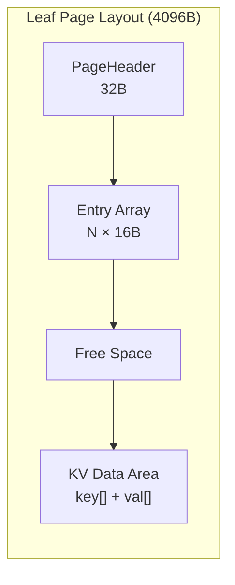
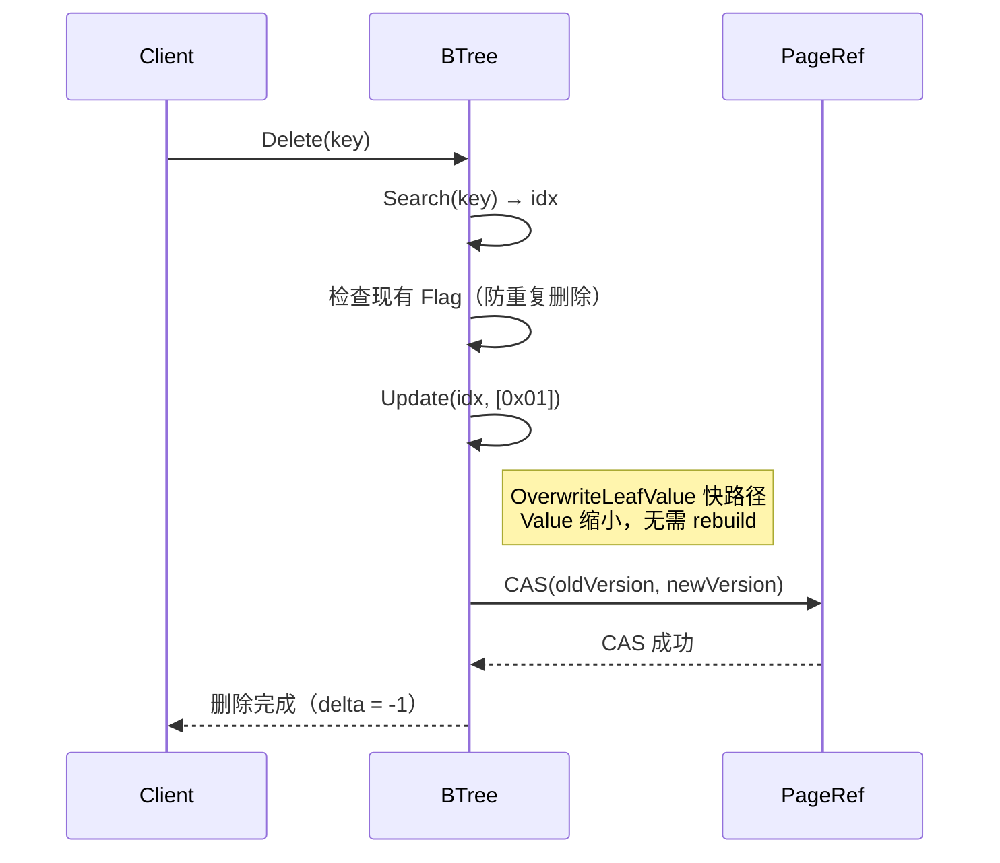
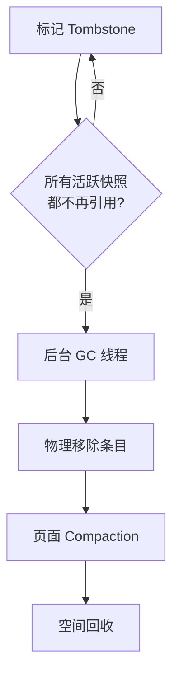

# BTree Delete Tombstone 设计预研

> **预研类型**: Spike
> **创建日期**: 2026-04-09
> **最后更新**: 2026-04-09 (v1.3)
> **分支**: `spike/btree-refactor`
> **状态**: 🔄 进行中

---

## 一、研究背景

### 1.1 核心问题

当前 NexKV BTree 的 `Delete()` 实现为**物理删除**——直接从 Leaf Page 中移除 Key-Value 条目。这在 COW（Copy-on-Write）架构下存在严重问题：

1. **写放大**：每次删除需复制整页 4KB 数据
2. **破坏 MVCC 基础**：历史版本丢失，无法支持快照读和事务
3. **崩溃恢复不可靠**：物理删除无痕迹，断电后页结构可能残缺
4. **无法支持分布式**：缺少删除可见性标记，跨节点一致性无法保障

### 1.2 研究目标

- 论证 Tombstone（逻辑删除）替代物理删除的必要性
- 设计与现有 Page Layout 兼容的 Tombstone 方案
- 规划 Tombstone 与 COW / MVCC 的集成路径

### 1.3 关联文档

| 文档 | 说明 |
|------|------|
| `docs/07_spike/btree-refactor/2026-04-01-lealone-btree-deep-dive.md` | Lealone BTree 深度分析 |
| `docs/07_spike/btree-refactor/2026-04-02-btree-refactor-implement.md` | BTree 重构实施方案 |
| `docs/07_spike/btree-refactor/2026-04-08-schedulerlock-to-optimistic-cas.md` | CAS 乐观锁重构 |
| `internal/infrastructure/storage/btree/leaf_page.go` | Leaf Page 删除实现 |
| `internal/infrastructure/storage/offheap/page_layout.go` | Page Layout 定义 |

---

## 二、现状分析

### 2.1 当前 Page Layout



`PageHeader` 32B（`unsafe.Sizeof` 验证：`version(8)+prevPage(4)+nextPage(4)+extraChild(8)+count(2)+pageType(1)+deleted(1)` = 28B，对齐后 32B）。

每条 `LeafEntry` 占 16 字节，**无预留 bit 位**：

```go
// offheap/page_layout.go:56-61
type LeafEntry struct {
    keyOff uint32  // 4 bytes — key 偏移
    keyLen uint32  // 4 bytes — key 长度
    valOff uint32  // 4 bytes — value 偏移
    valLen uint32  // 4 bytes — value 长度
}
```

> **注意**：`PageHeader.deleted uint8` 是**页面级**标记（标记整页已释放），与条目级 Tombstone 是不同层级，不复用。

### 2.2 当前物理删除流程

**代码位置**：`btree/leaf_page.go:165-189`

```go
func (h *leafPageHandle) Delete(idx int) (LeafPage, error) {
    // 物理删除：跳过目标 idx，重建剩余所有 KV 到新页
    keys, vals := h.pa.CollectKVExcept(uint32(h.id), idx)
    newRawID, _ := h.storage.pm.Alloc()
    h.pa.InitLeafPage(newRawID, srcVersion+1)
    for i := range keys {
        h.pa.InsertLeafEntry(newRawID, i, keys[i], vals[i], &dataEnd)
    }
    // ...
}
```

**问题**：
- 页内数据前移 → 修正偏移量表 → 必须复制整页 → COW 写放大
- Key 永久消失 → 无历史记录 → MVCC / 快照读 / 事务全部不可用
- 删除中途宕机 → 页结构残缺 → 无法回滚恢复

### 2.3 工业级引擎对标

| 引擎 | 删除策略 | 原因 |
|------|---------|------|
| **Lealone** | Tombstone（逻辑删除） | BTree + MVCC + 事务 |
| **WiredTiger** | Tombstone + 后台 Compaction | 混合策略，延迟回收空间 |
| **LMDB** | COW 新版本隐式标记 | 写时复制创建新版本 |
| **RocksDB** | Tombstone + Compaction | LSM-Tree 标配 |

**共识**：持久化存储引擎**必须留痕迹、留版本、留生命周期记录**。

---

## 三、Tombstone 方案设计

### 3.1 核心原则

> Tombstone **绝不破坏原有 Key/Value Page Layout**——不额外加字段改结构，而是嵌入 Value 头部。

- **不动 Key**：Key 位置、偏移、排序不变
- **不动页排列**：B+Tree 有序性完全保留
- **不动 LeafEntry**：16 字节结构不变，不侵入 Entry 元数据
- **兼容 COW**：只改 Value 内容，走现有 Update 路径

### 3.2 方案 A：Value 头部 1-byte Flag（推荐）

**原有 Value 布局**：
```
ValLen | Value
```

**改造后**：
```
ValLen | Flag(1byte) | RealValue
```

`ValLen = 1 + len(RealValue)`，Flag 长度计入 ValLen，`LeafEntry` 结构不变。

| Flag 值 | 含义 |
|---------|------|
| `0x00` | 正常数据 |
| `0x01` | Tombstone（已删除） |

**优势**：
- Layout 100% 兼容，ValLen 把 Flag 算入即可
- Key 不变，Page 偏移 / 排序 / 遍历 / B+Tree 结构完全不动
- 实现最简单，改动最小
- Debug 时可直接观察 Flag 字节

**删除操作**：
```
Delete(key) → Search(key) → 检查现有 Flag → Update(idx, [0x01]) → OverwriteLeafValue 快路径
```

Tombstone Value 仅 1 byte（Flag=0x01，无 RealValue），比原 Value 小，直接走 `OverwriteLeafValue` 快路径，无需 delete+insert fallback。

> **实现细节**：`OverwriteLeafValue` 将旧 Value 区域的前 `len(newValue)` 字节覆写，旧 Value 尾部可能有不可达的垃圾字节（`valLen` 已缩小）。这些字节在 COW 页内不可通过任何路径访问，Phase 3 Compaction 重建页面时会清除。

### 3.3 方案 B：Entry 元数据 Bit 位（不推荐）

理论上可利用 `valLen` 高位做标记（4GB value 不现实），但：

- **侵入性强**：需修改所有 `LeafEntry` 解析/写入逻辑
- **Debug 不直观**：Flag 藏在 valLen 高位，无法直接观察
- **维护负担大**：每处读写 valLen 的代码都要处理 Flag 语义

**结论**：方案 B 侵入性过强，不推荐采用。

### 3.4 向后兼容性

> **当前 NexKV BTree 为纯内存引擎**（mmap offheap），进程重启后页面重新初始化，**不存在历史持久化数据**。因此 Flag 编码无需考虑旧格式迁移问题。

所有新写入统一带 Flag 前缀。`ParseValueWithFlag` 中 `len(val) == 0` 的边界情况属于防御性编程，实际运行中不会出现无 Flag 的 Value。

---

## 四、集成路径分析

### 4.1 与 COW 的兼容性

Tombstone 本质上是 **Update 一条带标记的 Value**，完全走现有 CAS 乐观锁 + COW 流程：



**零侵入**：不需要修改 COW、CAS、Page 复制机制。

**delta 语义**：`leafMutation.delta` 保持 `-1`（外部视角 Key 已删除，`BTree.Size()` 减少）。Key 仍留在页上但逻辑已不可见。

### 4.2 Get() 的 Flag 解析

**解析位置**：在 `BTree.Get()` 层处理，不修改 `LeafPage` 接口。

```go
// btree.go — Get() 改造
idx, found := leaf.Search(key)
if !found {
    return nil, ErrKeyNotFound
}
raw := leaf.GetValue(idx)
flag, realVal := ParseValueWithFlag(raw)
if flag == FlagTombstone {
    return nil, ErrKeyNotFound  // 逻辑已删除
}
return realVal, nil
```

**原则**：`LeafPage.GetValue()` 保持返回原始字节，Flag 解析由调用方负责。所有调用 `GetValue()` 的位置（Get、Delete、Set 的 Update 路径、未来的 RangeScan）都需审查。

### 4.3 Delete 防重复删除

**问题**：Delete 同一个 Key 两次会导致 `Size()` 减少两次（Key 物理还在页上，Search 仍能找到）。

**解决**：Delete 内先检查现有 Value 的 Flag，已是 Tombstone 则返回 `ErrKeyNotFound`。

```go
// btree.go — Delete 防重复
idx, found := leaf.Search(key)
if !found {
    return nil, ErrKeyNotFound
}
raw := leaf.GetValue(idx)
flag, _ := ParseValueWithFlag(raw)
if flag == FlagTombstone {
    return nil, ErrKeyNotFound  // 已删除，no-op
}
tombstoneVal := BuildValueWithFlag(FlagTombstone, nil)
newLeaf, err := leaf.Update(idx, tombstoneVal)
```

### 4.4 Set() 的 Tombstone 恢复（关键）

**问题**：Tombstone 后 Set 同 Key 会导致 `Size()` 计数错误。

```
1. Set(key, val)    → delta=+1, Size=1
2. Delete(key)      → delta=-1, Size=0  (Tombstone)
3. Set(key, newVal) → found=true, Update路径, delta=0, Size=0  ← 错误！
```

第 3 步 Size 应为 1（Key 已恢复可见），但 Update 路径 `delta=0`，导致 Size 保持 0。

**修复**：Set() 的 Update 路径必须检查现有 Flag，Tombstone 恢复时 `delta=+1`：

```go
// btree.go — Set() Update 路径改造
idx, found := leaf.Search(key)
if found {
    raw := leaf.GetValue(idx)
    flag, _ := ParseValueWithFlag(raw)
    newLeaf, err := leaf.Update(idx, BuildValueWithFlag(FlagNormal, value))
    if err != nil {
        return nil, err
    }
    delta := int64(0)
    if flag == FlagTombstone {
        delta = +1  // 恢复被 Tombstone 的 Key
    }
    return &leafMutation{newPageID: newLeaf.PageID(), delta: delta}, nil
}
// Insert 路径（key 不存在）
newLeaf, err := leaf.Insert(key, BuildValueWithFlag(FlagNormal, value))
return &leafMutation{newPageID: newLeaf.PageID(), delta: +1}, nil
```

**性能影响**：Tombstone 恢复时，新 Value 通常大于 1-byte Tombstone，`OverwriteLeafValue` 会失败（`len(newValue) > entry.valLen`），触发 rebuild 路径重建整页。这比普通 Update 更昂贵，但仅影响 Tombstone 恢复场景。

### 4.5 RangeScan 过滤

**当前状态**：`RangeScan` 返回 `ErrNotImplemented`（`btree.go:230-232`），尚未实现。

**设计原则**：Tombstone 过滤应在 **Iterator 层**处理，Iterator 内部跳过 Tombstone 条目，调用方无感知。BTree 层只负责页面遍历。

### 4.6 与 MVCC 的兼容性

Tombstone 为后续 MVCC 铺路：

| 阶段 | Flag 语义 | 可见性规则 |
|------|----------|-----------|
| **Phase 1** | `0x00`=正常, `0x01`=已删除 | Get/Scan 跳过 Tombstone |
| **Phase 2** | Flag 扩展为 `(version, status)` | 快照读根据 version 判断可见性 |
| **Phase 3** | 完整 MVCC 版本链 | 多版本并发读，GC 回收旧版本 |

### 4.7 Size() 语义变更

**Tombstone 前**：`BTree.Size()` = 物理条目总数（Split/并发窗口期除外）。

**Tombstone 后**：`BTree.Size()` = 逻辑可见 Key 数量（不含 Tombstone）。物理条目数始终 >= `Size()`。

当前代码库中**没有**内部正确性路径依赖 `Size()` == 物理条目数。Split 决策使用 `IsFull()`（测量物理空间），不依赖 `Size()`。

### 4.8 Garbage Collection

**Tombstone 不等于永远不删**，而是延迟到安全时机再物理回收：



GC 策略需进一步设计（Compaction 阈值、并发安全、回收时机），属于 Phase 3。

---

## 五、关键边界情况分析

### 5.1 Tombstone 累积与 Page 有效容量

**问题**：Page 上 Tombstone 条目占 Entry 槽位（16B header + 1B value）但不贡献有效数据，导致 Page 有效容量持续降低。

**极端场景**：Page 有 100 条记录全部标记为 Tombstone：
- Page 实际无有效数据，但仍占用 4KB
- 遍历需检查 100 条 Tombstone 才能确定为空
- Split 时 Tombstone 传播到子页，浪费分裂空间

**缓解措施（Phase 3）**：
- 在 `PageHeader` 新增 `TombstoneCount` 统计（不复用现有 `deleted` 字段，层级不同）
- 设定阈值（如 50% Tombstone）触发 Compaction
- 遍历前检查 `TombstoneCount == Count` 可快速跳过空页
- Split 时评估 Tombstone 比例，高 Tombstone 页优先 Compaction 而非 Split
- Merge/Split 决策感知 Tombstone 比例（当前不感知，延到 Phase 3）

### 5.2 遍历性能退化

**问题**：遍历需解析每条 Value 头部判断 Flag，增加 CPU 开销。

**Phase 1 影响**：Flag 检查是 1 byte 比较，低 Tombstone 密度下开销可忽略。

**Phase 3 优化策略**：
- **PageHeader TombstoneCount**：全 Tombstone 页直接跳过
- **高 Tombstone 密度触发 Compaction**：消除 Tombstone

### 5.3 与 CAS 重构的关联

Tombstone 和 CAS 乐观锁重构改动不冲突：

| 重构 | 改动范围 |
|------|---------|
| Tombstone | `btree.go` Delete/Get 逻辑 + `offheap/page_layout.go` 辅助函数 |
| CAS 乐观锁 | `operations.go` 并发控制 |

**建议**：可独立实施，但两者都涉及 `writeOperation` 调用链，建议串行开发避免合并冲突。

---

## 六、对现有代码的改动评估

### 6.1 需要修改的文件

| 文件 | 改动 | 影响范围 |
|------|------|---------|
| `offheap/page_layout.go` | 新增 `ParseValueWithFlag()` / `BuildValueWithFlag()` 辅助函数 | 低 |
| `btree/btree.go` | `Delete()` 增加 Flag 检查 + `Update(idx, [0x01])` | 中 |
| `btree/btree.go` | `Get()` 返回前解析 Flag，Tombstone 返回 `ErrKeyNotFound` | 低 |
| `btree/btree.go` | `Set()` Insert/Update 路径写入带 Flag 的 Value，Tombstone 恢复时 delta=+1 | 中 |
| 相关测试文件 | 全面更新（见下方测试影响说明） | 高 |

**注意**：`leaf_page.go` 的 `Delete()` 方法在 Phase 1 **不修改**——Tombstone 逻辑完全在 `btree.go` 层通过调用 `Update()` 实现。`leaf_page.go` 的物理 `Delete()` 保留供 Compaction（Phase 3）内部使用。

**代码改动示例**：

```go
// offheap/page_layout.go — 新增常量和辅助函数
const (
    FlagNormal    byte = 0x00
    FlagTombstone byte = 0x01
)

// ParseValueWithFlag 解析带 Flag 的 Value。
// 纯函数，无共享状态，天然 goroutine 安全。
func ParseValueWithFlag(val []byte) (flag byte, realVal []byte) {
    if len(val) == 0 {
        return FlagNormal, nil  // 防御性：空 Value 视为 Normal
    }
    return val[0], val[1:]
}

// BuildValueWithFlag 构建带 Flag 的 Value。
// 纯函数，无共享状态，天然 goroutine 安全。
func BuildValueWithFlag(flag byte, realVal []byte) []byte {
    result := make([]byte, 1+len(realVal))
    result[0] = flag
    copy(result[1:], realVal)
    return result
}

// btree/btree.go — Get() 改造（第 109-119 行）
idx, found := leaf.Search(key)
if !found {
    return nil, ErrKeyNotFound
}
raw := leaf.GetValue(idx)
flag, realVal := ParseValueWithFlag(raw)
if flag == FlagTombstone {
    return nil, ErrKeyNotFound
}
return realVal, nil

// btree/btree.go — Delete 改造（第 164-189 行）
err := writeOperation(b, key, func(leaf LeafPage) (*leafMutation, error) {
    idx, found := leaf.Search(key)
    if !found {
        return nil, ErrKeyNotFound
    }
    // 防重复删除：检查现有 Flag
    raw := leaf.GetValue(idx)
    flag, _ := ParseValueWithFlag(raw)
    if flag == FlagTombstone {
        return nil, ErrKeyNotFound  // 已删除，no-op
    }
    // Tombstone：调用 Update 快路径
    tombstoneVal := BuildValueWithFlag(FlagTombstone, nil)
    newLeaf, err := leaf.Update(idx, tombstoneVal)
    if err != nil {
        return nil, err
    }
    return &leafMutation{
        newPageID: newLeaf.PageID(),
        delta:     -1,  // 外部视角：Key 已删除
    }, nil
})

// btree/btree.go — Set() 改造（Insert/Update 路径）
err := writeOperation(b, key, func(leaf LeafPage) (*leafMutation, error) {
    idx, found := leaf.Search(key)
    if found {
        // Update 路径：覆盖旧 Value（含 Tombstone 恢复）
        raw := leaf.GetValue(idx)
        flag, _ := ParseValueWithFlag(raw)
        newLeaf, err := leaf.Update(idx, BuildValueWithFlag(FlagNormal, value))
        if err != nil {
            return nil, err
        }
        delta := int64(0)
        if flag == FlagTombstone {
            delta = +1  // Tombstone 恢复：Key 重新可见
        }
        return &leafMutation{newPageID: newLeaf.PageID(), delta: delta}, nil
    }
    // Insert 路径：新 Key，Value 带 Flag 前缀
    newLeaf, err := leaf.Insert(key, BuildValueWithFlag(FlagNormal, value))
    if err != nil {
        return nil, err
    }
    return &leafMutation{newPageID: newLeaf.PageID(), delta: +1}, nil
})
```

### 6.2 不需要修改的文件

- `btree/leaf_page.go`（`Delete()` 保留，Tombstone 走 `Update()`）
- `btree/operations.go`（CAS 逻辑不变）
- Page 分裂 / 合并逻辑
- BTree 搜索路径
- Page 偏移量管理
- `LeafEntry` 结构（16 字节不变）

### 6.3 测试影响范围

**影响超出 Delete/Get 测试**：由于 `LeafPage.GetValue()` 保持返回原始字节（含 Flag 前缀），所有通过 `GetValue()` 断言裸 Value 的测试都会失败。

需要全面更新的测试文件：
- `btree/leaf_page_test.go`：所有 `GetValue` 断言需通过 `ParseValueWithFlag` 解析
- `btree/storage_test.go`：同上
- `offheap/page_layout_test.go`：底层测试不受影响（操作原始字节，不感知 Flag）

---

## 七、验证计划

### 7.1 单元测试

- [ ] `ParseValueWithFlag` / `BuildValueWithFlag` 正确性（含空 Value 边界）
- [ ] `Get()` 跳过 Tombstone 条目，返回 `ErrKeyNotFound`
- [ ] `Delete()` 防重复删除：第二次 Delete 同 Key 返回 `ErrKeyNotFound`
- [ ] Tombstone 不影响 B+Tree 有序性（Search / Split 正常）
- [ ] COW 复制保留 Tombstone 标记
- [ ] Delete 后 Set 同 Key 可恢复（Update 路径覆盖 Tombstone）
- [ ] `BTree.Size()` 语义正确（Delete 减 1，Tombstone 恢复 Set 加 1，Double Delete 不多减）
- [ ] Tombstone 后 Set 同 Key 的 Size 恢复（`Set→Delete→Set` 序列 Size 正确）
- [ ] 全部 `GetValue` 测试断言更新为 Flag 感知（`leaf_page_test.go`、`storage_test.go`）

### 7.2 集成测试

- [ ] Delete + Get 幂等性
- [ ] 并发 Delete + Get 一致性
- [ ] Tombstone 后 Set 同 Key 覆盖恢复
- [ ] 全 Tombstone 页的 Split 行为

### 7.3 性能基准

- [ ] Tombstone Delete vs 物理 Delete 延迟对比
- [ ] Tombstone 对 Get 延迟的影响（Flag 解析开销）
- [ ] Tombstone 密度对 Page 空间利用率的影响

---

## 八、结论

### 8.1 核心结论

物理删除仅适用于内存临时 KV，无法支持持久化、MVCC、事务和分布式场景。Tombstone（逻辑删除）是工业级持久化存储引擎的标配机制，是 NexKV 从内存引擎演进到可持久化、可分布式存储引擎的关键一步。

### 8.2 推荐方案

采用 **方案 A（Value 头部 1-byte Flag）**，分三阶段实施：

1. **Phase 1 — 基础 Tombstone**：Delete → `Update(idx, [0x01])`，Get 过滤，防重复删除
2. **Phase 2 — MVCC 集成**：Flag 扩展为 Version + Status
3. **Phase 3 — GC 回收**：后台 Compaction 物理回收空间，Split/Merge 感知 Tombstone

### 8.3 Phase 1 范围

| 功能 | Phase | 说明 |
|------|-------|------|
| Value Flag 编解码 | Phase 1 | `ParseValueWithFlag` / `BuildValueWithFlag` |
| Delete → Update Tombstone | Phase 1 | `btree.go` 层改造 |
| Get 跳过 Tombstone | Phase 1 | `btree.go` 层 Flag 解析 |
| 防重复 Delete | Phase 1 | Flag 检查 + `ErrKeyNotFound` |
| Set 写入带 Flag Value | Phase 1 | Insert/Update 路径 |
| RangeScan 过滤 | 延后 | `RangeScan` 未实现，Iterator 层处理 |
| TombstoneCount 统计 | Phase 3 | PageHeader 新增字段 |
| Compaction 回收 | Phase 3 | 后台线程 |
| Split/Merge 感知 | Phase 3 | Tombstone 比例决策 |

### 8.4 风险评估

| 风险 | 等级 | 缓解措施 |
|------|------|---------|
| OverwriteLeafValue 缩小 Value 后有垃圾字节 | 低 | 不可达字节，Phase 3 Compaction 清除 |
| Double Delete 导致 Size 重复减少 | 低 | Delete 内 Flag 检查，已 Tombstone 则 no-op |
| Page 空间浪费（Tombstone 累积占位） | 中 | Phase 3 设阈值触发 Compaction |
| 与 CAS 重构的合并冲突 | 低 | 串行开发 |
| 与现有测试不兼容 | 中 | 全面更新 `leaf_page_test.go` / `storage_test.go` 的 GetValue 断言 |
| Tombstone 恢复后 Size() 计数错误 | 低 | Set() Update 路径检查 Flag，Tombstone 恢复时 delta=+1 |
| Tombstone 恢复走 rebuild 路径 | 低 | 新 Value > 1-byte Tombstone，OverwriteLeafValue 失败走 rebuild |

---

**文档版本**: v1.3
**维护者**: NexKV 开发团队
