# MVCC Phase 2 设计预研

> **预研类型**: Spike
> **创建日期**: 2026-04-10
> **最后更新**: 2026-04-13 (v3.13 — 第十三轮评审修订：H-NEW-1 rollbackOneKey CAS 回退成功后递增 generation + H-NEW-2 纯 runtime.Gosched 无时间下界保证风险声明（已移除所有 time.Sleep，文档化为设计权衡）+ H-NEW-3 锁 key "必须同时读和写" 强制约束 + H-NEW-4 preCheck 循环 ctx 取消检查点 + M-NEW-1 rollbackOneKey 添加 defer recover 保护 ParseValueWithMVCC panic + M-NEW-2 rollbackApplied 双重 KeyLock 超时最终状态声明)
> **分支**: `spike/mvcc-phase2-proposal`
> **状态**: 🔄 进行中

---

## 一、概述

### 1.1 Phase 1 回顾

Tombstone Phase 1 已完成，核心变更：

- Value 布局：`[1B Flag][RealValue]`，FlagNormal=0x00, FlagTombstone=0x01
- Delete → `Update(idx, [0x01])`，逻辑删除替代物理删除
- Get/Delete/Set 均已适配 Flag 解析
- Size() 语义改为逻辑可见 Key 数量

**已实现代码**：
- `offheap/page_layout.go`：`ParseValueWithFlag()` / `BuildValueWithFlag()`
- `btree/btree.go`：Delete/Get/Set 路径全部 Flag 感知

### 1.2 Phase 2 目标

在 Tombstone 基础上引入 **MVCC（多版本并发控制）+ 快照隔离（Snapshot Isolation）**：

| 能力 | Phase 1 | Phase 2 |
|------|---------|---------|
| 删除方式 | 逻辑删除（Tombstone Flag） | 逻辑删除 + 版本时间戳 |
| 并发读 | 最新值读取 | 快照读（固定时间点视图） |
| 并发写 | CAS 乐观锁（页级） | 事务级 WriteBuffer + PreCheck |
| 事务支持 | 无 | BeginTx / Commit / Rollback |
| 隔离级别 | 无 | NexKV-SI（快照读 + 写路径 RC，非标准 SI） |
| 版本可见性 | Flag 二值判断 | VersionChain 遍历 + `begin_ts ≤ snapshot_ts` |

### 1.3 三阶段演进路线

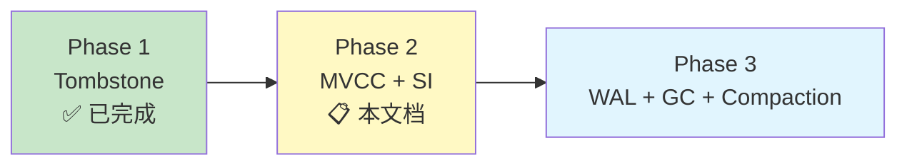

Phase 2 不涉及持久化（WAL/Checkpoint）和后台 GC——这些留给 Phase 3。Phase 2 聚焦于**内存中的多版本并发控制语义**。

---

## 二、关联文档

| 文档 | 说明 |
|------|------|
| `docs/07_spike/btree-refactor/2026-04-09-btree-delete-tombstone.md` | Tombstone Phase 1 设计预研 |
| `thoughts/2026-04-10-lealone-mvcc-deep-analysis.md` | Lealone AOTE MVCC 深度分析 |
| `thoughts/2026-04-10-doubao-mvcc-proposal.md` | 豆包 15 轮 MVCC 设计讨论记录 |
| `docs/07_spike/btree-refactor/2026-04-08-schedulerlock-to-optimistic-cas.md` | CAS 乐观锁重构 |
| `internal/infrastructure/storage/offheap/page_layout.go` | Phase 1 Flag 机制实现 |

---

## 三、Value 布局设计

### 3.1 布局演进

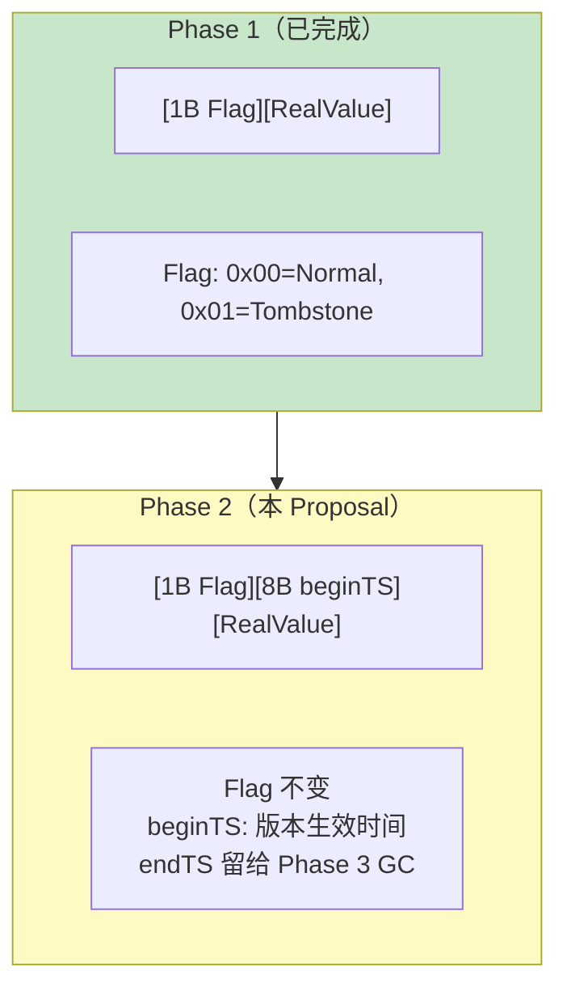

**Phase 2 Value 布局**：

```
┌──────┬──────────┬────────────┐
│ Flag │ beginTS  │ RealValue  │
│ 1B   │ 8B       │ 变长       │
└──────┴──────────┴────────────┘
```

| 字段 | 大小 | 含义 |
|------|------|------|
| `Flag` | 1B | 0x00=Normal, 0x01=Tombstone（与 Phase 1 完全兼容） |
| `beginTS` | 8B | 此版本生效时间戳（commitTimestamp） |
| `RealValue` | 变长 | 实际数据（Tombstone 时为空） |

**Header 固定开销**：1 + 8 = **9 bytes**。

> **设计决策**（评审修订）：Phase 2 **不包含 endTS**。理由：B+Tree 只存每个 Key 的最新版本，旧版本由外部 VersionChain 管理，B+Tree 内无需 endTS。endTS 字段留给 Phase 3 GC 使用，在 VersionChain 节点中设置 endTS 标记可回收版本。

### 3.2 与现有代码兼容性

**关键原则**：`LeafEntry` 结构（16 bytes）**完全不变**，只有 Value 内容格式变化。

```
Phase 1 ValLen = 1 + len(RealValue)
Phase 2 ValLen = 1 + 8 + len(RealValue) = 9 + len(RealValue)
```

`LeafEntry.valLen` 自然增大，所有偏移量逻辑不受影响。`ParseValueWithFlag` 需扩展为 Phase 2 版本：

```go
// MVCC Header 固定大小
const MVCCHeaderSize = 9 // 1(Flag) + 8(beginTS)

// Phase 2 Value 解码
// ⚠️ v3.4 评审修订 M4：开发阶段使用 panic 强制暴露格式错误。
// Phase 1 格式的值（无 beginTS）不应出现在 Phase 2 的 B+Tree 中。
// 降级处理会静默返回 beginTS=0（所有快照读可见），掩盖格式 bug。
// Phase 2 稳定后可改为降级处理或返回 error。
func ParseValueWithMVCC(val []byte) (flag byte, beginTS uint64, realVal []byte) {
    if len(val) < MVCCHeaderSize {
        panic(fmt.Sprintf("mvcc: value too short: got %d bytes, need %d", len(val), MVCCHeaderSize))
    }
    return val[0], binary.BigEndian.Uint64(val[1:9]), val[9:]
}

// Phase 2 Value 编码
func BuildMVCCValue(flag byte, beginTS uint64, realVal []byte) []byte {
    result := make([]byte, MVCCHeaderSize+len(realVal))
    result[0] = flag
    binary.BigEndian.PutUint64(result[1:9], beginTS)
    copy(result[9:], realVal)
    return result
}
```

> **注意**：Phase 2 不需要向后兼容 Phase 1 持久化数据——NexKV 当前为纯内存引擎（mmap offheap），进程重启后页面重新初始化。

### 3.3 时间戳选型：本地单调递增

**Phase 2 采用本地单调递增 uint64**，预留 `TSGenerator` 接口为分布式 HLC 铺路。

```go
// TSGenerator 时间戳生成器接口
type TSGenerator interface {
    NextTS() uint64
}

// LocalTS 本地单调递增实现（Phase 2）
type LocalTS struct {
    counter atomic.Uint64
}

// NextTS 生成下一个单调递增时间戳
// v3.8 评审修订 H4：uint64 溢出后 commitTS 回绕到 0，所有基于
// commitTS ≤ snapshotTS 的可见性判断失效。uint64 最大值 ~1.8*10^19，
// 每秒 100 万次 Commit 需要 ~585,000 年才溢出——实际风险极低。
// 但作为正确性论证的完整性，检测溢出并 panic（重启后重置 counter）。
func (t *LocalTS) NextTS() uint64 {
    ts := t.counter.Add(1)
    if ts == 0 {
        panic("timestamp overflow — restart required")
        // v3.10 评审修订 M4（TS panic 事务安全）：
        // NextTS panic 发生在事务 Commit 阶段（commitTS 分配时）。
        // panic 时事务状态：(1) WriteBuffer 已填充但未 Apply → B+Tree 未修改，
        // 无需回滚；(2) 如果 panic 发生在 applyWriteBuffer 中间（已分配 commitTS
        // 但部分 key 已 Apply）→ rollbackApplied 无法调用（panic 已展开调用栈），
        // 已 Apply 的 key 残留在 B+Tree 中（best-effort undo 失败场景）。
        // 生产环境应改为：(a) NextTS 返回 error 而非 panic；(b) Commit 检测
        // error 后调用 rollbackApplied 回滚已写入的 key；(c) 返回 ErrRetryable
        // 允许上层重试。Phase 2 简化为 panic——uint64 溢出需要 ~585,000 年，
        // 实际不可能触发。
    }
    return ts
}
```

**远期演进**（Phase 2 不实现，仅预留接口）：

| 阶段 | 实现 | TS 语义 |
|------|------|---------|
| Phase 2 | `LocalTS`（本地递增） | 单机全序 |
| 分布式初期 | 128-bit HLC | 因果偏序 + 唯一性 |
| 强一致性 | TSO 中心授时 | 全局全序 |

> **来源**：豆包 Round 8-9 讨论。128-bit HLC 布局：`[32b physical][32b logical][64b fallback/NodeID]`。HLC 是因果偏序不是全序——**只管可见性，不管冲突裁决**。HLC 最怕时间回拨，必须实现 `lastPhysicalTime` 冻结机制。

---

## 四、可见性规则（Snapshot Isolation）

### 4.1 SI 读规则

**SI 语义前提条件**（v3.5 评审修订 M5）：NexKV-SI 的快照一致性依赖本地单调递增 `TSGenerator`（单机全序）。`beginTS ≤ snapshotTS` 的全序比较保证事务看到的是"snapshotTS 之前所有已提交值的一致视图"。分布式 HLC 场景下因果偏序不等于全序，快照一致性语义将退化——届时需要重新定义可见性规则（如引入 commit order 一致性）。Phase 2 仅支持单机部署。

**快照读核心公式**：

```
B+Tree 版本可见 ⟺ beginTS ≤ snapshotTS
VersionChain 版本可见 ⟺ commitTS ≤ snapshotTS
```

- `snapshotTS`：事务开启时固定的快照时间戳
- `beginTS`：B+Tree 中版本的 commitTimestamp（"出生证明"）
- `commitTS`：VersionChain 中节点的 commitTimestamp

**beginTS 与 commitTS 等价性证明**（v3.9 评审修订 C4）：

`beginTS` 和 `commitTS` 使用同一个 `TSGenerator.NextTS()` 分配的同一个时间戳值，只是出现在不同位置（B+Tree Value 中叫 `beginTS`，VersionChain 节点中叫 `commitTS`）。

证明：对任意 key `k` 和事务 `T`（commitTS=`ts`），`commitKey` 在 KeyLock 内原子执行以下操作：
1. `Set(k, BuildMVCCValue(flag, ts, val))` → B+Tree 中 `k` 的 `beginTS = ts`
2. `Prepend(k, ts, oldVal, oldFlag)` → VersionChain 中新节点的 `commitTS = ts`

两步使用同一个 `ts` 变量（Go 函数参数），且在 KeyLock 内串行执行（无并发修改）。因此：
- B+Tree 中 `k` 的 `beginTS` ≡ VersionChain head 节点的 `commitTS`（同一次 Commit）
- 可见性公式的 `beginTS ≤ snapshotTS` 和 `commitTS ≤ snapshotTS` 比较的是同一个值
- 快照读从 B+Tree 读到 `beginTS=ts` 不可见时，查 VersionChain 找 `commitTS ≤ snapshotTS` 的更旧节点，语义一致

> **结论**：`beginTS` 和 `commitTS` 的等价性由 `commitKey` 的 KeyLock 内原子性保证。文档中两个术语混用不引入歧义——它们始终指向同一个 TSGenerator 分配的值。
>
> **等价性前提条件（v3.10 评审修订 M1）**：以上证明仅适用于**成功 Commit** 的正常路径。Rollback 路径下：(1) `rollbackOneKey` 回滚 B+Tree 值时，如果 `OldRawVal == nil`（原 key 不存在），写入 `BuildMVCCValue(FlagTombstone, entry.CommitTS, nil)`——此 Tombstone 的 beginTS = commitTS，但语义是"回滚标记"而非"已提交版本"；(2) 快照读对此回滚 Tombstone 的可见性判断（`beginTS ≤ snapshotTS`）可能返回 ErrKeyNotFound——这是正确的（回滚事务的写入不应被任何快照看到）；(3) 回滚后 VersionChain head 被回退到 PrePrependHead，链中不存在 commitTS = 本事务 commitTS 的节点——因此版本链查询也不会命中回滚事务的值。结论：rollback 不破坏 beginTS/commitTS 等价性——回滚的版本在 B+Tree 和 VersionChain 中都不对快照读可见。

**可见性判断流程**（评审修订 v3.1 — 先 B+Tree 后版本链，消除 TOCTOU）：
1. **先读 B+Tree**（单次原子读取），获取该 Key 的最新版本
2. 如果 B+Tree 版本可见（`beginTS ≤ snapshotTS`），直接返回
3. 如果 B+Tree 版本不可见（`beginTS > snapshotTS`），说明此 Key 在快照时间后被修改过，此时查询 VersionChain 找旧版本
4. VersionChain 沿链遍历，找到 `commitTS ≤ snapshotTS` 的第一个节点

> **设计决策**（评审修订）：Phase 2 **不使用 endTS 做可见性判断**。endTS 留给 Phase 3 GC 用于标记可回收版本。Phase 2 版本可见性完全由 VersionChain 的 commitTS 比较决定。
>
> **v3.11 评审修订 SI-11（rollback Step B/Step C 时序窗口论证）**：rollbackOneKey 在 KeyLock 内执行 Step B（B+Tree Set）和 Step C（VersionChain CAS 回退），两者在同一个 KeyLock 持有期间完成。snapshotGet 不需要获取 KeyLock——它在 KeyLock 外执行。时序安全性论证：Step B 完成后 snapshotGet 读到回滚后的 B+Tree 值（beginTS 是原始 Commit 的 commitTS，如 100），此时 Step C 可能尚未完成——但 snapshotGet 只在 `beginTS > snapshotTS` 时才查版本链。回滚后 B+Tree 的 beginTS 是原始值（如 100），如果 `snapshotTS >= 100` 则直接返回 B+Tree 值不查链；如果 `snapshotTS < 100` 则查链，此时链头可能是回滚前的状态（尚未回退），但链中的旧版本（commitTS < 100）仍然存在且正确（append-only 保证），快照读沿 next 继续遍历找到更旧的可见节点。结论：Step B/Step C 之间的时序窗口不影响快照读正确性。

**完整 Get 路径（含 Read-Your-Own-Writes）**：

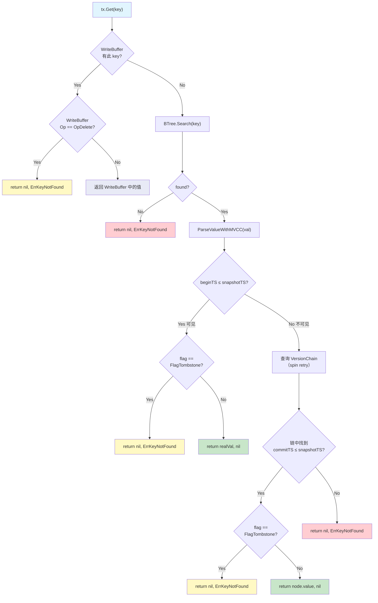

**Read-Your-Own-Writes 原则**：事务内的 `Get()` **必须先查 WriteBuffer**，再查 B+Tree。这保证事务内 Put 后立即 Get 能看到自己的写入。

### 4.2 Tombstone 版本可见性

Tombstone 仍然是 Value 的一种（`Flag = FlagTombstone`），只是 RealValue 为空。版本时间戳规则与 Normal 版本完全相同：

| 场景 | Flag | beginTS | VersionChain | 可见性 |
|------|------|---------|--------------|--------|
| 正常数据（最新） | 0x00 | 300 | 无或 head.commitTS=300 | snapshotTS ≥ 300 → 返回 B+Tree realVal |
| 已被覆盖（最新太新） | 0x00 | 300 | head.commitTS=200 | snapshotTS=200 → 遍历链返回旧值 |
| 已被删除（最新 Tombstone） | 0x01 | 300 | head.commitTS=200 | snapshotTS=200 → 遍历链返回旧值（非 Tombstone） |
| 最新 Tombstone | 0x01 | 300 | — | snapshotTS ≥ 300 → 返回 ErrKeyNotFound |

### 4.3 SIGHTLESS 哨兵值（借鉴 Lealone）

> **来源**：Lealone `TransactionalValue.java` L128-203

Lealone 区分"记录不存在"和"记录存在但不可见"——后者返回 `SIGHTLESS` 哨兵。这对 RR/SI 隔离级别很重要：事务开始后插入的新记录对旧事务应该返回"不可见"而非"不存在"。

**NexKV Phase 2 初期简化**：不引入 SIGHTLESS，统一返回 `ErrKeyNotFound`。后续如需精确区分（例如幻读检测），再引入。

### 4.4 写路径强制 ReadCommitted（借鉴 Lealone）

> **来源**：Lealone `TransactionalValue.java` — `isUpdateCommand()` 检测

Lealone 在写操作（Update/Delete）时自动降级为 ReadCommitted 隔离级别，避免写偏序（Write Skew）。理由：写操作需要看到最新已提交值才能正确冲突检测，快照读会导致基于过时数据的写入。

**NexKV Phase 2 对应设计**：
- 写路径（Set/Delete）的内部读取**始终读取最新已提交版本**（B+Tree 中该 key 的当前值），不受 `snapshotTS` 约束
- 只有用户显式 `Get()` 调用走快照读路径
- **写路径 RC 是内部实现细节，不影响事务对外暴露的读快照语义**——事务的显式 `Get()` 始终走快照路径，Put/Delete 内部读取的"超出快照的值"不暴露给用户

> **⚠️ 注意**：本方案实现的是 **NexKV-SI**（非标准 SI）——读路径走快照、写路径强制 RC、不支持 Write Skew 检测。标准 SI 要求所有读操作都基于快照时间戳，写偏序检测需要额外的冲突分析。NexKV Phase 2 优先工程实用性，Write Skew 防护留给远期 Serializable 级别。文档后续 "SI" 均指 "NexKV-SI" 除非显式标注 "标准 SI"。

**写路径 RC 对 ReadFingerprint 的影响**（v3.5 评审修订 H3）：

Put/Delete 隐式读取 B+Tree 最新值时，ReadFingerprint 基于该最新值计算（可能超出 snapshotTS）。这意味着 PreCheck 校验的是"Put 时刻的 B+Tree 值是否被修改"而非"快照时刻的值是否被修改"。如果另一个事务在 Put 之后修改 key 再改回原值，PreCheck 可能通过但 Apply 阶段的 beginTS 二次校验会捕获变化——正确性由 Apply 保证，PreCheck 是快速失败优化。

> **v3.9 评审修订 H7（写路径 RC 反例）**：写路径读取最新已提交值（非快照值）的潜在问题——TX1 (snapshotTS=100) Get("k") 返回快照值 v1，TX2 Commit("k", v2, commitTS=200)，TX1 Put("k", v3) 内部读最新值 v2（commitTS=200），PreCheck 基于 v2 计算。如果 TX1 的业务逻辑基于快照值 v1 做决策但内部读到了 v2，可能导致逻辑不一致。**这是 NexKV-SI 的已知语义代价**——写路径 RC 是为了避免基于过时数据的写入冲突，但牺牲了快照一致性。调用方如需严格的快照写入语义，应在 Put 前显式 Get（走快照路径）并基于返回值做决策。
>
> **v3.11 评审修订 SI-03（写路径 RC Delete+Insert 组合分析）**：
> - **Get→Delete 组合**：TX1 (snapshotTS=100) Get("k")=v1（快照值），TX2 Commit Delete("k")+Insert("k",v3) commitTS=200，TX1 Delete("k") 内部读最新值 v3（beginTS=200），WriteBuffer 记录 OldValue=v3/OldBeginTS=200。TX1 Commit 时 commitKey 校验 `currentBeginTS != OldBeginTS`——如果 TX3 再次修改 k 则 currentBeginTS≠200 → ErrConflict；如果 k 未被修改则 currentBeginTS=200==200 → 通过。版本链 Prepend 的旧值是 v3（非快照值 v1）——这是写路径 RC 的固有语义，调用方不应假设 Delete 基于快照值执行。
> - **Get→Delete→Insert 组合**：TX1 Get("k")=v1，TX2 Delete("k")+Insert("k",v3)，TX1 Delete("k") 内部读 Tombstone→ErrKeyNotFound→Delete 失败返回 ErrKeyNotFound（Section 6.2 Step 2: flag==FlagTombstone → ErrKeyNotFound）。如果 TX1 转而 Put("k", v4)，Put 内部读 B+Tree 最新值 v3（WriteBuffer.OpInsert，无 OldValue），Commit 时 commitKey 走 OpInsert 分支。**结论**：Delete/Insert 的冲突检测基于最新已提交值而非快照值，调用方不应假设 Delete/Insert 操作基于快照值执行。

**Write Skew 典型示例**（v3.5 评审修订 M3）：

```
约束：account_a + account_b >= 100（不允许余额之和低于 100）

TX1: Get("a")=80, Get("b")=80 → 总和 160 ≥ 100 → Put("a", 30)
TX2: Get("a")=80, Get("b")=80 → 总和 160 ≥ 100 → Put("b", 30)

两个事务只写不同的 key，PreCheck 只校验各自写的 key，不检测跨 key 约束。
提交后：a=30, b=30，总和 60 < 100，约束被违反（Write Skew）。
```

**推荐做法**：对跨 key 约束场景，使用独立的锁 key（如 `lock:balance_check`）实现显式乐观锁——事务开始时 Get 锁 key，Commit 前 Put 锁 key 更新版本号，强制串行化约束检查。

**锁 key 使用约束**（v3.11 评审修订 SI-01）：
1. **同一业务约束的所有并发事务必须使用同一个锁 key**。不同约束使用不同锁 key。使用不同锁 key 名称保护同一组业务 key 不提供 Write Skew 防护。
2. **锁 key 的 ABA 防护链条**：PreCheck 使用 FNV-1a 32-bit hash（碰撞概率 ~1/4B）→ 碰撞时穿透到 Apply 阶段 → Apply 的 `currentBeginTS != entry.OldBeginTS` 校验基于 beginTS 单调递增（不可回绕）→ ABA 可靠检测。因此锁 key 方案即使在 FNV 碰撞下也能保证正确性。
3. **每个事务必须同时读和写锁 key**（v3.13 评审修订 H-NEW-3）：只 Get 锁 key 而不 Put 锁 key → PreCheck 无指纹可校验（锁 key 不在 ReadSet 中因为 Put 记录指纹基于业务 key 而非锁 key 的读取）→ 不提供 Write Skew 防护。只 Put 锁 key 而不 Get 锁 key → 锁 key 的 ReadFingerprint 来自 Put 隐式 Get（写路径 RC），PreCheck 校验锁 key 未被修改 → 提供防护但 Put 隐式 Get 记录的指纹基于最新值而非快照值。**正确模式**：Get 锁 key（显式快照读）+ Put 锁 key（更新版本号）→ ReadSet 包含锁 key → PreCheck 校验锁 key 未被修改。

**锁 key 完整使用模式**（v3.7 评审修订）：

```go
// 跨 key 约束防护：余额之和 ≥ 100
tx, _ := engine.BeginTx(ctx, SnapshotIsolation)

// Step 1: 读取锁 key（记录 ReadFingerprint）
lockVal, _ := tx.Get([]byte("lock:balance_check"))

// Step 2: 读取业务 key（快照读）
a, _ := tx.Get([]byte("account_a"))
b, _ := tx.Get([]byte("account_b"))

// Step 3: 业务约束校验
if toInt(a) + toInt(b) - 50 < 100 {
    tx.Rollback()
    return ErrConstraintViolation
}

// Step 4: 写入锁 key（更新版本号，PreCheck 校验 lockVal 未被修改）
tx.Put([]byte("lock:balance_check"), increment(lockVal))

// Step 5: 写入业务 key
tx.Put([]byte("account_a"), newValueA)

// Step 6: Commit — PreCheck 校验 lock:balance_check 的 ValueHash
// 如果另一个事务已修改锁 key（并发约束校验），PreCheck 失败 → ErrConflict
tx.Commit(ctx)
```

**原理**：两个并发事务必须都读同一个锁 key 并写同一个锁 key。PreCheck 校验锁 key 的 ReadFingerprint → 第一个 Commit 通过，第二个 Commit 检测到锁 key 已被修改 → `ErrConflict`。代价：约束相关的所有事务串行化通过锁 key。

### 4.5 RangeScan 范围界定

> **评审修订 v3.1**：明确 Phase 2 SI 仅覆盖点查询，RangeScan 不在 SI 保障范围内。

**Phase 2 SI = 点查询快照隔离**：

Phase 2 的 `Tx` 接口**不提供** SI 语义的 `Scan` 方法。原因：

1. **架构约束**：B+Tree 的迭代器持有 PageRef 跨多个页面，COW 保护在页面切换时可能失效，无法保证遍历过程中的一致性快照
2. **版本链交互**：RangeScan 需要对每个 key 都执行版本链遍历（过滤不可见版本），性能开销显著
3. **Phantom Read**：SI 级别无法防止 RangeScan 的幻读（新插入的 key 出现在范围内），需要 Predicate Lock 或 Index Range Lock

**Phase 2 策略**：
- `Tx` 接口只暴露 `Get/Put/Delete/Commit/Rollback`（点查询 + 写入）
- 需要范围查询时使用 `StorageBackend.Scan`（ReadCommitted 级别，不走快照路径）
- SI 语义的 RangeScan 推迟到 Phase 2d 或更远期，届时需要实现 **MVCC Snapshot Iterator**（持有固定 snapshotTS 的页面遍历器）

**SI/RC 操作隔离级别清单**（v3.5 评审修订 M4）：

| 操作 | 隔离级别 | 说明 |
|------|---------|------|
| `Tx.Get(key)` | **SI（快照读）** | 按 snapshotTS 过滤可见版本，先查 WriteBuffer 再查 B+Tree + VersionChain |
| `Tx.Put(key, val)` 内部读取 | **RC（读已提交）** | 读取 B+Tree 最新已提交值，不受 snapshotTS 约束 |
| `Tx.Delete(key)` 内部读取 | **RC（读已提交）** | 同上 |
| `Tx.Commit()` PreCheck | **RC** | 校验 ReadSet 中每个 key 的 ValueHash 是否变化 |
| `Tx.Commit()` Apply | **串行化（KeyLock）** | per-key KeyLock 严格串行化 Get→校验→Set→Prepend |
| `StorageBackend.Scan()` | **RC（读已提交）** | 不走快照路径，直接遍历 B+Tree 当前版本 |
| `StorageBackend.Get/Set/Delete` | **无事务** | 裸 KV 操作，无 MVCC 语义 |

---

## 五、版本链存储方案

### 5.1 为什么 B+Tree 内联多版本不可行

**B+Tree COW 不能直接提供快照隔离**——这是一个关键的架构约束。

NexKV 的 `Get()` 实现在读取后立即调用 `ReleaseAll()` 释放 PageRef 引用。COW 保护只在持有 PageRef 期间有效，而事务的 Get/Put 操作之间 PageRef 已释放，新写入会直接覆盖旧页面数据。

因此，**必须引入独立于 B+Tree 的外部版本链**来存储历史版本。

| 方案 | 可行性 | 原因 |
|------|--------|------|
| B+Tree 内联多版本（Key 编码加 TS 前缀） | ❌ 不采用 | B+Tree 不支持同 Key 多版本；Key 编码破坏搜索语义 |
| 单版本覆盖 + COW 快照 | ❌ 不可行 | Get() 后立即 ReleaseAll()，COW 保护不跨操作持续 |
| **外部版本链（Go 堆内存）** | ✅ **Phase 2 采用** | 独立于 B+Tree，与 Lealone oldValueCache 对齐 |
| 外部版本链（Off-Heap） | 远期优化 | 零 GC 压力，但实现复杂 |

### 5.2 Phase 2 方案：外部版本链（Go 堆内存）

**架构**：B+Tree 只存储每个 Key 的**最新版本**，历史版本存储在外部 `VersionChain`（Go 堆内存链表）。

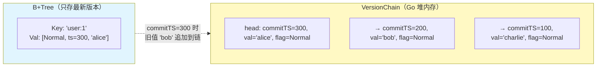

**数据结构（无锁 atomic.Pointer）**：

```go
// VersionChain 无锁版本链（append-only，与 COW B+Tree 无锁风格一致）
// 核心原则：只在头部追加新版本，旧节点永不修改 → 天然无锁
//
// v3.12 评审修订（append-only 例外声明）：
// rollbackOneKey 的 CAS 回退（Step C）是 append-only 的唯一例外——将 head 从当前值
// 回退到 PrePrependHead。被摘除的节点（原 head 及其 next 链）从 head 不可达，
// 但**正在遍历这些节点的快照读 goroutine** 仍持有旧 head 的局部变量引用。
// 安全性论证：Go GC 保证有引用的对象不被回收，Reader 持有旧 head 引用时其 next 链
// 完整可达。CAS 回退只改变 head 指针，不修改任何节点的 next/commitTS/value 字段。
// 因此正在遍历的 Reader 看到的是一致的链快照（从旧 head 出发），不受回退影响。
// 回退不影响 generation 语义——generation 在 Prepend 成功时递增，回退时不递减：
// generation 反映"链头发生变更的总次数"（含追加和回退），而非"链的当前长度"。
// Phase 3 GC 使用 generation 做 ABA 防护时，回退后 generation > Prepend 前的值，
// 等价于"发生过一次变更"——这正确反映了链头已变化的事实。
//
// v3.11 评审修订 M3（atomic.Pointer 内存序引用）：
// Go 1.19+ 的 atomic.Pointer[VersionNode] 使用 store-release / load-acquire 语义。
// Prepend 的 CompareAndSwap(oldHead, newNode) 使用 store-release，保证 newNode 的
// 所有字段（commitTS、value、flag、next）在 CAS 成功前完成初始化——Reader 通过
// Load() 使用 load-acquire 语义获取 head 时，能看到 newNode 的完整初始化状态。
// 参考 Go Memory Model spec: https://go.dev/ref/mem
// 这保证快照读遍历 VersionChain 时不会看到部分初始化的节点。
//
// v3.11 评审修订 C1（ABA 防护预留）：
// 增加 generation 字段（atomic.Uint64），每次 Prepend 成功后递增。
// Phase 2 不做 GC，generation 仅递增无副作用（不计入 CAS 比较条件）。
// Phase 3 引入 GC 回收旧节点时，CAS 必须将 generation 纳入比较条件
// （使用 double-width CAS 或将 generation 打包进指针高位），防御 ABA：
// Writer A 读 head(gen=5) → GC 回收旧节点 → Writer B Prepend 新节点(gen=6)
// → Writer A CAS(head_gen5, newNode) 失败（gen 已变）→ 正确重试。
// 当前 Phase 2 不需要 generation 参与 CAS（append-only 保证旧节点不摘除），
// 但 generation 字段为 Phase 3 预留了零成本的前置条件。
type VersionChain struct {
    head      atomic.Pointer[VersionNode] // 原子指针，无锁读写
    generation atomic.Uint64              // v3.11: ABA 防护预留，Phase 2 仅递增，Phase 3 纳入 CAS
}

type VersionNode struct {
    commitTS uint64
    value    []byte       // deepCopy 后的值（不含 Flag），独立于 mmap 生命周期
                           // v3.10 L2：Tombstone 时 value=nil（不是 []byte{}）。
                           // nil 表示"无值"（Tombstone/空），与 FlagTombstone 配对。
                           // 遍历时检查 flag==FlagTombstone 判断是否跳过 value。
                           // 不使用 []byte{} 避免与 nil 混淆（nil == 没有，空切片 == 有但为空）。
    flag     byte         // FlagNormal / FlagTombstone
    next     *VersionNode // 只读指针，指向更旧版本（永不修改）
}
```

> **关键约束**（评审修订 H2 + v3.5 M6 修正）：`VersionNode.value` **必须**是独立副本。当前 `leafPageHandle.GetValue` 内部已做 `make + copy` 返回 Go 堆副本，理论上调用方无需再 deepCopy。但保留 deepCopy 作为**防御性编程**——如果未来优化 `GetValue` 移除 copy 层（如零拷贝优化），deepCopy 仍是必要的。`Prepend()` 时接收的 `value` 参数来自 WriteBuffer 的 OldValue（已是独立副本），Prepend 内部不再二次 deepCopy。

**无锁原理**（评审修订：atomic.Store → CAS + retry）：
- **写入（Commit 追加版本）**：构建完整新节点（含 `next` 指向旧 head），然后使用 `CompareAndSwap` + retry 循环替换 head。如果 CAS 失败（其他事务已并发追加），则重新读取 head 并重试。这保证并发提交同 key 时不会丢失任何版本。
- **读取（快照 Get 遍历）**：`atomic.Load` 获取 head，然后沿 `next` 链遍历。旧节点永不修改，无需任何锁。
- **与 B+Tree COW 风格一致**：B+Tree COW 保证页级无锁读写，版本链 atomic 保证链级无锁读写。

> **注意**：Phase 3 GC 引入版本回收时，不能直接删除读者可能正在遍历的节点。需要 epoch-based reclamation 或类似机制保证安全回收。Phase 2 不做 GC，此问题延后。

**版本链存储位置**：

```go
// VersionStore 全局版本链存储
type VersionStore struct {
    chains sync.Map // key(string) → *VersionChain
}

// Prepend 追加旧版本到指定 key 的版本链（自动创建链）
func (vs *VersionStore) Prepend(key string, commitTS uint64, value []byte, flag byte) {
    val, _ := vs.chains.LoadOrStore(key, &VersionChain{})
    chain := val.(*VersionChain)
    chain.Prepend(commitTS, value, flag)
}
```

### 5.3 版本链构建时机（Commit 阶段）

**借鉴 Lealone 的 `TransactionalValue.commit()` 模式**：

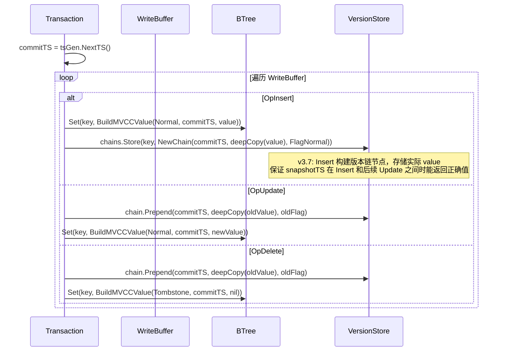

**关键**：版本链在 Phase 2 初期**始终构建**（v3.5 H3）。B+Tree 中不存储 endTS（Phase 2 已移除），版本可见性完全由 VersionChain 的 commitTS 比较决定。

> **v3.7 评审修订 C1（修正 v3.6 M5）**：OpInsert 时构建版本链节点，存储**实际 value**（deepCopy 后的独立副本）+ `flag=FlagNormal`，而非 `value=nil`。理由：v3.6 的 `value=nil` 语义描述存在逻辑矛盾（"commitTS ≤ snapshotTS 时不可见"——但 SI 语义下 commitTS ≤ snapshotTS 应为可见）。正确语义：Insert 版本链节点与 Update 节点完全一致（存储 value + FlagNormal），只是 `next == nil` 标识这是链的末端（最早版本）。快照读遍历到 Insert 节点时，`commitTS ≤ snapshotTS` → key 存在于快照中 → 返回 `node.value`；`commitTS > snapshotTS` → key 在快照之后才被 Insert → 沿 next 继续遍历（next==nil 则返回 ErrKeyNotFound）。
>
> **关键场景**：TX1 Insert(keyA, val1) commitTS=100，TX2 Update(keyA, val2) commitTS=200。TX3 (snapshotTS=150) Get(keyA)：B+Tree beginTS=200 > 150 → 遍历版本链 → 节点 commitTS=200 (旧值 val1) > 150 → next → 节点 commitTS=100 (Insert 值 val1) ≤ 150 → 返回 val1 ✓。如果 Insert 不构建版本链或存储 nil，TX3 会错误返回 ErrKeyNotFound 或空值。
>
> **Insert 版本链节点语义澄清**（v3.8 评审修订 H8）：Insert 版本链节点的含义是"commitTS 时刻 key 的值是 node.value"——与 Update 节点完全一致。`next == nil` 仅标识链的末端（最早版本），不承载"首次出现"或"不可见"语义。快照读对 Insert 节点和 Update 节点使用完全相同的可见性规则（`commitTS ≤ snapshotTS → 可见`），无需区分节点类型。

### 5.4 快照读如何使用版本链

> **评审修订 v3.1**：原实现先查 `chains.Load` 再查 B+Tree，存在 TOCTOU 竞态——在两次查询之间另一个事务可能 Commit 并创建版本链，导致快照读遗漏旧版本。修正为**先读 B+Tree，版本不可见时再查版本链**，消除竞态窗口。

```go
func (tx *SnapshotTx) snapshotGet(key []byte) ([]byte, error) {
    // Step 1: 先读 B+Tree（单次原子读取，无竞态窗口）
    // v3.8 修复 C1：使用 GetRaw 返回 Go 堆独立副本，消除 mmap 悬垂引用风险。
    // 旧方案 storage.Get 返回 mmap 引用，ReleaseAll 后成为悬垂指针，
    // ParseValueWithMVCC(raw) 读取 raw[1:9] 时可能访问已释放内存。
    // v3.12 M-NEW-2：透传 tx.ctx（Phase 2 不检查取消但保持接口一致）
    raw, err := tx.engine.storage.GetRaw(tx.ctx, key)
    if err != nil {
        return nil, ErrKeyNotFound // key 物理不存在于 B+Tree
    }
    flag, beginTS, realVal := ParseValueWithMVCC(raw)

    // Step 2: B+Tree 版本可见 → 返回 realVal 的独立副本
    // v3.8 修复：GetRaw 已返回独立副本（非 mmap 引用），但 realVal 是 raw 的子切片。
    // 如果调用方长期持有返回值（如缓存到应用层），需拷贝为独立 slice 防止
    // 调用方修改影响 raw。如果调用方只读不持有，可跳过此拷贝。
    if beginTS <= tx.snapshotTS {
        if flag == FlagTombstone {
            return nil, ErrKeyNotFound
        }
        // v3.10 L3：GetRaw 已返回 Go 堆独立副本，deepCopy(realVal) 理论上冗余——
        // realVal 是 raw 的子切片，raw 是独立副本，realVal 自然也是独立的。
        // 但保留 deepCopy 作为防御性编程：调用方可能修改返回值（虽然不应这样做），
        // deepCopy 保证返回值与 raw 完全解耦。如果性能分析表明 deepCopy 开销显著，
        // 可改为直接返回 realVal（调用方契约：不得修改返回的 []byte）。
        return deepCopy(realVal), nil
    }

    // Step 3: B+Tree 版本不可见（beginTS > snapshotTS）
    // 说明此 key 在 snapshotTS 之后被其他事务修改过，
    // 此时版本链必然已存在（Commit 时构建），查询版本链找旧版本
    //
    // v3.11 SI-02 修正（Set-before-Prepend 窗口精确描述）：
    // spin retry 只覆盖**链不存在**的情况（OpInsert 首次写入时链尚未创建）。
    // 如果链已存在（之前有版本），不触发 spin retry，直接遍历已有链返回
    // commitTS ≤ snapshotTS 的上一个已提交版本——这是正确的 SI 行为，
    // SI 语义允许返回快照时间之前的任何已提交版本。
    //
    // Spin retry 设计（v3.5 评审修订 H1，v3.8 理由修正 H2）：
    // v3.4 改为 Set-before-Prepend：Writer 在同 goroutine 内先 Set 后 Prepend。
    // v3.8 修正：Go 1.19+ atomic 操作提供顺序一致性，内存可见性由 atomic 保证。
    // 真正的问题是**时序窗口**（不是内存序问题）：Reader 的 BTree.Get 看到 beginTS=200
    // （Writer Set 完成），但 Writer 的 chains.LoadOrStore 尚未执行到——Reader 的
    // chains.Load 在 Writer 的 chains.LoadOrStore 之前。spin retry + runtime.Gosched
    // 的作用是让 Reader 让出 CPU，给 Writer 时间完成后续操作（调度层面的等待）。
    // v3.10 评审修订 C2（CRITICAL 修复）：maxRetries 从 10 提升到 100。
    // 原值 10 在正常调度延迟下足够（Set→Prepend 延迟 < 1μs），但无法覆盖：
    // (1) GC STW（Stop-The-World）：Go GC 暂停可达 100μs-1ms，10 次 Gosched
    //     在 STW 期间全部无效（所有 goroutine 暂停），STW 恢复后 10 次不够；
    // (2) OS 调度抖动：容器环境下 CPU 限流可能导致 goroutine 长时间未调度；
    // (3) 高负载：大量并发事务竞争 CPU 时间片，Writer 的 Prepend 调度延迟增加。
    // v3.12 修订：移除 time.Sleep，改为纯 runtime.Gosched 递增 yield。
    // 100 次（20×单次 Gosched + 80×递增 Gosched）总 yield 约 100-500 次，
    // 足够覆盖 GC STW + 正常调度延迟。
    //
    // v3.13 评审修订 H-NEW-2（纯 Gosched 无时间下界保证风险声明）：
    // runtime.Gosched() 让出 CPU 时间片但不保证任何最小等待时间——调度器可能
    // 立即重新调度当前 goroutine（无其他 goroutine 可运行时）。与 time.Sleep 不同，
    // Gosched 不向 OS timer 注册等待请求，不产生确定性的最小延迟。
    // 这是有意的设计权衡：(1) 避免引入 time.Sleep（OS 调度器精度不可控，
    // μs 级 Sleep 实际为 100μs-1ms，语义与文档不符）；(2) Set→Prepend 通常
    // 在同 goroutine 内微秒级完成，纯 Gosched 的 yield 语义足够覆盖正常路径；
    // (3) 极端场景（GC STW > 1ms + OS 调度抖动）通过 maxRetries=100 的
    // 递增 yield 次数（最多 18 次/轮，总 yield ~1000+ 次）增加覆盖概率。
    // 如果仍不够，返回 ErrKeyNotFound（远期引入 ErrVersionChainNotReady
    // 允许上层区分"真正不存在"和"可能尚未准备好"）。
    const maxRetries = 100
    keyStr := string(key) // v3.4 评审修订 M2：循环外一次性转换，避免重复堆分配
    var chainVal interface{}
    var ok bool
    for i := 0; i < maxRetries; i++ {
        chainVal, ok = tx.engine.versionStore.chains.Load(keyStr)
        if ok {
            break
        }
        // v3.12 修订：移除 time.Sleep（OS 调度器精度不可控，μs 级 Sleep 实际为 100μs-1ms）。
        // 统一使用 runtime.Gosched() 纯用户态让步，长尾路径通过多次 yield 增加等待。
        // Set→Prepend 通常在同 goroutine 内微秒级完成，100 次 Gosched 总等待
        // 由调度器决定（通常 < 10ms），足够覆盖 GC STW + 正常调度延迟。
        //
        // 退避策略：
        // i ≤ 20: runtime.Gosched()（快速路径，单次 yield）
        // i > 20: 多次 runtime.Gosched()（长尾路径，2+(i-20)/5 次递增 yield）
        if i <= 20 {
            runtime.Gosched()
        } else {
            // 递增 yield：21→2次，25→3次，30→4次 ... 100→18次
            yields := 2 + (i-20)/5
            for j := 0; j < yields; j++ {
                runtime.Gosched()
            }
        }
    }
    if !ok {
        // maxRetries=100 retry 仍未找到版本链（v3.5 评审修订 M1+M8）
        // 可能原因：
        // 1. 版本链确实不存在（key 在 snapshotTS 后被 Insert，之前无旧版本）→ 真正的 ErrKeyNotFound
        // 2. Set 完成但 chains.LoadOrStore 尚未可见（极端调度延迟 > 1ms）→ 暂时性错误
        // Phase 2 简化：统一返回 ErrKeyNotFound。远期优化可引入 ErrVersionChainNotReady
        // 错误码，允许上层区分两种情况并选择 retry。
        // maxRetries=100 三级退避总等待约 1ms，超过此阈值几乎可以确定是情况 1。
        // v3.11 评审修订 C-08（极端延迟建议）：
        // 以下场景可能超过 1ms 等待：(1) 容器环境 CPU throttling 使 goroutine 调度延迟
        // 达数毫秒；(2) Writer 在 Set 和 Prepend 之间被抢占；(3) Writer 在
        // chains.LoadOrStore 的 sync.Mutex 路径上阻塞。远期优化建议：引入
        // ErrVersionChainNotReady 错误码区分"真正不存在"和"可能尚未准备好"，
        // 允许上层根据业务语义选择 retry 或 propagate。Phase 2 简化为统一
        // ErrKeyNotFound——调用方如需区分，可在 snapshotGet 中返回额外标志位。
        return nil, ErrKeyNotFound
    }

    // Step 4: 遍历版本链（无锁，append-only 保证旧节点不变）
    // v3.10 评审修订 H8（空链 head=nil 场景声明）：
    // chains.Load(keyStr) 返回非 nil（链对象存在），但 chain.head.Load() 可能返回 nil——
    // 链刚被 LoadOrStore 创建但 Prepend 尚未执行。此时遍历直接返回 bestNode=nil，
    // 最终返回 ErrKeyNotFound。这不会触发 spin retry（spin retry 只在 chains.Load
    // 返回 !ok 时触发）。安全性论证：head=nil 意味着链刚创建（commitKey 的 Step 5
    // Prepend 尚未完成），但 Step 4 的 B+Tree Set 已完成（beginTS > snapshotTS）。
    // 此 key 在 snapshotTS 之后被 Insert（无历史版本），返回 ErrKeyNotFound 正确。
    // 即使 Prepend 随后完成，head 从 nil 变为非 nil，但新节点的 commitTS > snapshotTS，
    // 仍然不可见。因此 head=nil 时提前返回 ErrKeyNotFound 不影响正确性。
    // node.value 已在 Prepend 时 deepCopy（Go 堆内存），无需再次拷贝
    //
    // ⚠️ v3.7 评审修订 + v3.8 H7 强化：链物理顺序不保证 commitTS 递减（并发 CAS retry
    // 可能打乱顺序）。必须遍历**整条链**，找到所有 commitTS ≤ snapshotTS 的节点中
    // commitTS 最大的那个（bestNode）。
    //
    // 防御性策略声明（v3.8 评审修订 H7）：
    // KeyLock 保证同一 key 的 commitKey 串行执行，因此**正常路径下**链的物理顺序
    // 等价于 commitTS 递减（head 最新，tail 最旧）。理论上找到第一个
    // commitTS ≤ snapshotTS 的节点即可返回。但 bestNode 全链遍历是**防御性编程**：
    // (1) Prepend 在 KeyLock 外的场景（如未来性能优化将 Prepend 移到 KeyLock 外），
    //     CAS retry 可能打乱物理顺序；
    // (2) 代码变更/bug 导致链顺序违反假设时，bestNode 保证正确性不受影响；
    // (3) 性能影响极小——正常链长 ≤ 3（短事务），遍历整链只多 1-2 次比较。
    // chain.head.Load() 获取的链头快照在遍历期间是固定的（append-only 旧节点不变，
    // 并发 Prepend 只影响链头，不影响正在遍历的链）。
    chain := chainVal.(*VersionChain)
    var bestNode *VersionNode
    node := chain.head.Load()
    for node != nil {
        if node.commitTS <= tx.snapshotTS {
            if bestNode == nil || node.commitTS > bestNode.commitTS {
                bestNode = node // 记录 commitTS 最大的可见节点
            }
        }
        node = node.next
    }
    if bestNode != nil {
        if bestNode.flag == FlagTombstone {
            return nil, ErrKeyNotFound
        }
        // v3.11 评审修订 C-13：deepCopy bestNode.value 保持两条路径（B+Tree/VersionChain）
        // 返回策略一致。虽然 Prepend 时已 deepCopy，但返回 bestNode.value 的引用
        // 允许调用方修改 VersionChain 中的共享值。deepCopy 保证返回值完全解耦。
        return deepCopy(bestNode.value), nil
    }

    // Step 5: 版本链中所有版本都太新 → key 在 snapshotTS 之前不存在
    return nil, ErrKeyNotFound
}
```

**TOCTOU 消除原理**（v3.3 修订）：
1. B+Tree 读取是原子操作（单次 `Get` 返回一致的 Value）
2. 只有当 `beginTS > snapshotTS`（版本不可见）时才查版本链
3. 版本不可见 → 说明有更新的 Commit 发生过 → 版本链**必然已存在或正在构建**
4. `commitKey` 的 KeyLock 保证 Prepend → Set 在同一 goroutine 内串行执行（Go 顺序一致性），B+Tree Set 可见时 Prepend 必然已完成
5. Spin retry（最多 10 次 + `runtime.Gosched`）是**必要的**——虽然 Go 1.19+ atomic 操作提供顺序一致性，但 B+Tree Set（COW 页面替换）与 `chains.LoadOrStore` 之间跨 goroutine 的可见性仍需要通过 retry + `runtime.Gosched` 建立同步窗口（v3.5 H1 修正）。Set 完成不保证 Reader 立刻感知到 chains.Store（Go runtime 调度延迟），spin retry 覆盖此窗口

### 5.5 siCount 零开销优化（借鉴 Lealone）

```go
// 只有活跃的 SI 事务存在时才构建版本链
type TransactionEngine struct {
    siCount atomic.Int32 // SI 事务计数器
}

// v3.11 评审修订 SI-09：Phase 2a-2c 此函数不被调用（commitKey 始终构建版本链）。
// Phase 2d 启用 siCount 优化时用于跳过无 SI 事务时的版本链构建。
// 保留此函数避免 Phase 2d 重新引入——实现时在 commitKey 中添加条件判断：
// if te.shouldBuildVersionChain() { ... build version chain ... }
func (te *TransactionEngine) shouldBuildVersionChain() bool {
    return te.siCount.Load() > 0
}

// Commit 时追加版本（CAS + retry，防止并发提交丢版本）
// 带 maxRetries cap 和 yield，避免热点 key 活锁
//
// ⚠️ v3.4 评审修订 M3 + v3.8 H3 强化：
// Prepend 在 commitKey 的 KeyLock 内执行，同一 key 的并发提交已被 KeyLock 串行化。
// **CAS 在 KeyLock 内不应失败**（只有一个 goroutine 操作 head）。如果 CAS 失败，
// 说明有代码路径绕过 KeyLock 直接操作 VersionChain.head——这是严重的不变量违反。
// maxRetries=128 是防御性上限（正常情况下 i==0 时 CAS 成功）。实现时建议在
// i > 0 时记录警告日志（包含 key、goroutine ID、stack trace）辅助定位 bug。
// 保留 CAS 语义作为防御性编程——如果 Prepend 被移到 KeyLock 外调用
// （例如性能优化时），CAS 仍然是必要的。
//
// v3.5 评审修订 M7：value 参数由 WriteBuffer.OldValue 传入（已是 Go 堆独立副本）。
// Prepend 不做二次 deepCopy，直接存储 value 引用。如果未来调用方改为直接传入
// mmap 引用（如零拷贝优化），Prepend 内部必须增加 deepCopy(value)。
//
// ⚠️ 链物理顺序声明（v3.7 评审修订）：
// VersionChain 的物理顺序（head → next 链）**不保证** commitTS 递减排列。
// 并发 CAS retry 可能导致后提交的事务版本排在链的更深处（commitTS 更大的节点
// 的 next 可能指向 commitTS 更小的节点）。
// 快照读遍历**必须遍历整条链**，找到所有 commitTS ≤ snapshotTS 的节点后
// 选取 commitTS 最大的那个（最新可见版本），不能在找到第一个 commitTS ≤ snapshotTS
// 的节点就提前终止。
func (vc *VersionChain) Prepend(commitTS uint64, value []byte, flag byte) error {
    // v3.10 评审修订 M5：maxRetries 从 128 降为 16。
    // KeyLock 内 CAS 理论上 i==0 即成功（单 goroutine 操作 head）。
    // 128 过于宽松——如果 KeyLock 不变量被违反（代码 bug），128 次 retry
    // + Gosched 可能掩盖问题（每秒 10K 并发 × 128 retry = 1.28M 次无效 CAS）。
    // 16 次足够覆盖极端调度延迟（16 × Gosched ≈ 160μs），超过此阈值说明
    // 存在代码 bug，应尽早暴露而非静默重试。
    const maxRetries = 16
    for i := 0; i < maxRetries; i++ {
        // v3.7 评审修订 C4：每次 retry 创建新 newNode，避免 next 字段反复非 atomic 写入。
        // 保证每个 VersionNode 实例在构造后不再修改，Reader 永远遍历不可变节点。
        oldHead := vc.head.Load()
        newNode := &VersionNode{
            commitTS: commitTS,
            value:    value,
            flag:     flag,
            next:     oldHead, // 构造时设置 next，之后不再修改
        }
        // v3.11 ABA 防护：Phase 2 append-only 保证旧节点永不摘除，ABA 不会发生。
        // Phase 3 引入 GC 回收旧节点后，CAS 必须将 generation 纳入比较条件。
        if vc.head.CompareAndSwap(oldHead, newNode) {
            vc.generation.Add(1) // v3.11: 递增 generation（Phase 2 无副作用，Phase 3 纳入 CAS）
            return nil // CAS 成功，版本已追加
        }
        // CAS 失败：其他事务已并发追加版本
        // v3.9 评审修订 H2：Prepend 在 KeyLock 内执行，i==0 时 CAS 应成功。
        // i > 0 说明 KeyLock 不变量被违反（严重 bug）。实现时建议：
        // if i > 0 { log.Warn("prepend CAS retry in KeyLock", "key", key, "retry", i) }
        runtime.Gosched() // yield 当前 goroutine
    }
    return ErrVersionChainConflict // 超过重试次数（极端热点 key）
}

// BeginTx 时递增
func (te *TransactionEngine) BeginTx(ctx context.Context, level IsolationLevel) (Transaction, error) {
    if level == SnapshotIsolation {
        te.siCount.Add(1)
    }
    // ...
}

// Commit/Rollback 时递减（防 double cleanup）
func (tx *SnapshotTx) cleanup() {
    if !tx.cleaned.CompareAndSwap(false, true) {
        return // 已清理过，防止 Commit 后又 defer Rollback 导致 double decrement
    }
    if tx.isolationLevel == SnapshotIsolation {
        tx.engine.siCount.Add(-1)
    }
}
```

> **来源**：Lealone `AOTransactionEngine.java` — `containsRepeatableReadTransactions()` 检查 `rrtCount.get() > 0`。无 SI 事务时版本链完全不构建，零内存开销。
>
> **⚠️ 评审修订（H3）**：Phase 2 初期（2a-2c）**始终构建版本链**，不启用 siCount 优化。原因：siCount 在两个 SI 事务之间可能瞬间为 0，导致中间的 Commit 跳过版本链构建，后续 SI 事务看不到正确历史版本。siCount 优化推迟到 Phase 2d 性能调优阶段，届时配合更保守的策略（如延迟递减、检查 pending snapshotTS 列表等）。
>
> **v3.10 评审修订 M3（siCount 矛盾声明）**：`TransactionEngine.siCount` 字段在 Phase 2 代码中**存在但始终为正**——`BeginTx` 递增、`cleanup` 递减，但 `shouldBuildVersionChain()` 在 Phase 2a-2c **不被调用**（commitKey 始终构建版本链）。siCount 在 Phase 2 仅用于 `BeginTx`/`cleanup` 的递增/递减逻辑正确性验证，不影响版本链构建决策。这是设计意图——保留 siCount 基础设施（atomic.Int32）避免 Phase 2d 启用优化时重新引入，但 Phase 2a-2c 的 commitKey 伪代码中不包含 `if shouldBuildVersionChain()` 条件判断。
>
> **⚠️ siCount 优化启用约束**（v3.8 H9 + v3.9 C2 强化）：Phase 2d 启用 siCount 优化时，`shouldBuildVersionChain()` 为 false **仅跳过 OpInsert 的版本链构建**。OpUpdate 和 OpDelete 的 `Prepend`（将旧值追加到版本链）**始终执行**，不受 siCount 控制。理由：Update/Delete 修改 B+Tree 中已存在的 key，可能破坏正在运行的 SI 事务的快照可见性——SI 事务看到 `beginTS > snapshotTS` 时需要版本链中的旧版本。即使当前无 SI 事务，如果一个 SI 事务在 Update/Delete Commit 之后、下一个 SI 事务 BeginTx 之前开启（siCount 曾短暂为 0），它也需要版本链中的旧版本。
>
> **⚠️ siCount 跳过 OpInsert 的残余风险**（v3.9 评审修订 C2）：即使 Update/Delete 始终 Prepend，跳过 OpInsert 仍可能导致版本丢失。场景：Non-SI TX Insert("k", v1) commitTS=200（siCount=0，跳过版本链）→ Non-SI TX Update("k", v2) commitTS=300（始终 Prepend 旧值 v1）→ SI TX snapshotTS=250 → B+Tree beginTS=300 > 250 → 查链 → 链中只有 commitTS=300 的节点（旧值 v1，commitTS=300 > 250）→ 无更旧节点 → 返回 ErrKeyNotFound。但 snapshotTS=250 时 v1 已可见（commitTS=200 ≤ 250）。**根因**：Insert 版本链节点被 siCount=0 跳过，链缺少 commitTS=200 的 Insert 节点。**结论**：siCount 优化在 Phase 2d 启用时，必须确保 siCount 从未回到 0（使用延迟递减或 pending snapshotTS 列表检查），否则**不应跳过 OpInsert 版本链构建**。推荐策略：siCount=0 时仍然构建所有版本链节点（回退到始终构建），siCount 优化仅减少 GC 扫描频率而非跳过构建。

### 5.6 版本链 GC

Phase 2 不实现 GC。版本链无限增长直到内存压力触发。Phase 3 的 GC 策略：

1. 引擎扫描所有活跃 SI 事务，取最大 `snapshotTS` 作为 `watermark`
2. 版本链中 `commitTS < watermark` 的旧节点可安全回收
3. 后台线程定期执行 GC

> **来源**：Lealone `getMaxRepeatableReadTransactionId()` + CheckpointService 异步回收

**⚠️ Phase 2 版本链增长运行时约束**（v3.9 评审修订 C3）：

Phase 2 不做 GC 意味着 VersionChain 节点只增不减。以下运行时约束必须在实现时遵守：

1. **内存监控**：`VersionStore` 必须暴露 `TotalNodes() int64` / `TotalBytes() int64` 指标，供上层监控内存使用量。当总量超过可配置阈值（默认 1GB）时记录警告日志。
2. **长事务防护**：SI 事务持有固定的 `snapshotTS`，期间所有 Commit 到该 key 的新版本都会追加到版本链。长事务（存活超过可配置阈值，默认 30s）必须记录警告日志，包含事务 ID 和存活时长。
3. **链长统计**：定期采样热点 key 的版本链长度，链长 > 100 时记录警告。过长的链遍历影响快照读延迟。
4. **Phase 2 安全退出**：引擎 `Close()` 时不清理版本链（纯内存，进程退出自动回收），但应记录版本链总量到日志辅助问题诊断。
5. **回滚节点残留**（v3.9 C1 关联）：`rollbackApplied` 的 CAS 回退只回退链头，不删除已分配的 `VersionNode`。回滚后的孤立节点在链头回退后从 head 不可达，但 GC 未实现前不会被回收。Phase 2 可接受——这些节点占用内存极少（每个回滚场景最多 1 个节点）。

### 5.7 远期优化：Off-Heap 版本存储

```go
// VersionStore Off-Heap 版本（远期优化）
type OffHeapVersionStore struct {
    pm      *offheap.PageManager
    chains  sync.Map // key → offheap offset
}
```

- 优点：零 GC 压力，内存可控
- 缺点：实现复杂，需要手动管理生命周期
- 适用：生产优化阶段

---

## 六、写入协议

### 6.1 Set 操作

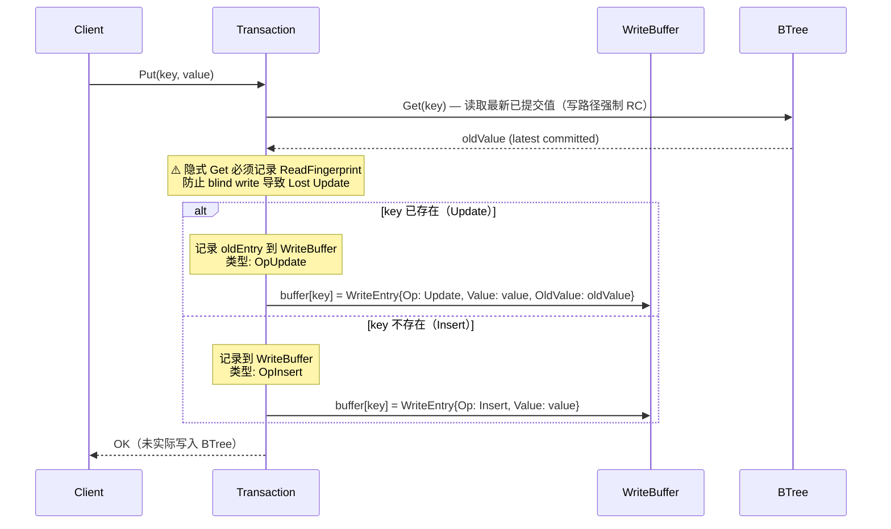

**关键**：写入操作**只写内存 WriteBuffer**，不触碰 B+Tree。真正落盘在 Commit 阶段。

**防 Lost Update 约束**（评审修订 C2/C4）：Put/Delete 的隐式 BTree.Get **必须**记录 ReadFingerprint 到 ReadSet。即使事务没有显式调用 Get()，PreCheck 也必须校验写操作涉及的 key，防止 blind write 导致 Lost Update。

**SnapshotTx.Put/Delete 完整逻辑**（v3.7 重写，修复 raw scope + ReadFingerprint 条件 + Delete 查 WriteBuffer）：

```go
// Put 写入 WriteBuffer（隐式读取 B+Tree 旧值 + 记录指纹）
func (tx *SnapshotTx) Put(key, value []byte) error {
    keyStr := string(key)

    // 1. 读取 B+Tree 最新已提交值（写路径强制 RC）
    // v3.7 修复：raw 变量提升到函数级 scope，避免 if 块外引用未定义变量
    // v3.8 修复 C1：使用 GetRaw 返回 Go 堆独立副本，消除 mmap 悬垂引用
    var raw []byte
    var btreeOldValue []byte
    var btreeOldFlag byte
    var btreeOldBeginTS uint64
    // v3.12 M-NEW-2：透传 tx.ctx
    if v, err := tx.engine.storage.GetRaw(tx.ctx, key); err == nil {
        raw = v // GetRaw 已返回独立副本，无需 deepCopy
        flag, ts, realVal := ParseValueWithMVCC(raw)
        btreeOldFlag = flag
        btreeOldBeginTS = ts
        // Tombstone 的 RealValue 为空，但 raw 仍包含完整 MVCC Value
        // deepCopy realVal 用于 WriteBuffer.OldValue（版本链构建）
        if flag == FlagNormal {
            btreeOldValue = deepCopy(realVal)
        }
    }

    // 2. 记录 ReadFingerprint（防 blind write Lost Update）
    // v3.7 修复：严格匹配 WriteBuffer 的 Op 语义
    // 只有 OpUpdate（key 逻辑存在且非 Tombstone）才记录指纹
    // OpInsert（key 物理不存在或 Tombstone）不记录——冲突由 commitKey KeyLock 内校验
    if raw != nil && btreeOldFlag == FlagNormal {
        tx.readSet[keyStr] = NewReadFingerprint(raw)
    }

    // 3. 写入 WriteBuffer
    // Tombstone 时 btreeOldValue=nil → WriteBuffer 视为 OpInsert
    //
    // v3.10 评审修订 H5（Tombstone 元数据声明）：
    // B+Tree 中 key 为 Tombstone 时，btreeOldValue=nil（realVal 为空），
    // btreeOldFlag=FlagTombstone, btreeOldBeginTS 有值。WriteBuffer.Put 收到
    // btreeOldValue=nil → 设为 OpInsert（OldFlag=0, OldBeginTS=0），**丢弃**
    // btreeOldFlag 和 btreeOldBeginTS。这是设计意图：
    // (1) OpInsert 在 commitKey 中走 Tombstone 校验分支（Section 7.1.1 Step 2），
    //     不使用 OldFlag/OldBeginTS，丢弃无影响；
    // (2) OpInsert 不构建版本链旧值节点（无 OldValue 可 Prepend），丢弃 OldFlag 无影响；
    // (3) OpInsert 不记录 ReadFingerprint（Section 6.1 Step 2），丢弃 OldBeginTS 无影响。
    // 如果未来需要在 Tombstone→Insert 场景记录元数据，WriteBuffer.Put 应改为
    // 检查 btreeOldFlag==FlagTombstone 时保留 btreeOldBeginTS。
    tx.writeBuffer.Put(keyStr, value, btreeOldValue, btreeOldFlag, btreeOldBeginTS)
    return nil
}

// Delete 删除 key（写入 WriteBuffer，Commit 时写入 Tombstone）
// v3.7 修复：先查 WriteBuffer（Read-Your-Own-Writes），再读 B+Tree
// 否则事务内 Put(k,v); Delete(k) 会因 Delete 的隐式 Get 看到 Tombstone 而失败
func (tx *SnapshotTx) Delete(key []byte) error {
    keyStr := string(key)

    // 1. 先查 WriteBuffer（Read-Your-Own-Writes 原则）
    if wbEntry, has := tx.writeBuffer.entries[keyStr]; has {
        switch wbEntry.Op {
        case OpInsert:
            // Insert → Delete = 取消 Insert（从 WB 移除）
            delete(tx.writeBuffer.entries, keyStr)
            return nil
        case OpDelete:
            // Delete → Delete = 幂等，已标记删除
            return nil
        case OpUpdate:
            // Update → Delete：使用 WB 中记录的 OldValue/OldFlag/OldBeginTS
            // 无需再读 B+Tree（OldValue 已在首次 Put 时记录）
            //
            // v3.11 评审修订 SI-04（OldBeginTS 一致性声明）：
            // 此处使用的 OldBeginTS 是首次 Put 时记录的 B+Tree beginTS，
            // 可能与当前 B+Tree 的 beginTS 不一致（其他事务已修改 B+Tree）。
            // 这是设计预期——commitKey 的 beginTS 二次校验会检测到不一致
            // 并返回 ErrConflict，保证正确性。调用方应处理 Commit ErrConflict
            // 作为并发冲突的正常结果。
            wbEntry.Op = OpDelete
            wbEntry.Value = nil
            tx.writeBuffer.entries[keyStr] = wbEntry
            return nil
        }
    }

    // 2. WriteBuffer 中无此 key → 读取 B+Tree 最新已提交值
    // v3.8 修复 C1：使用 GetRaw 返回 Go 堆独立副本
    var raw []byte
    // v3.12 M-NEW-2：透传 tx.ctx
    if v, err := tx.engine.storage.GetRaw(tx.ctx, key); err == nil {
        raw = v // GetRaw 已返回独立副本
    }
    if raw == nil {
        return ErrKeyNotFound // key 物理不存在
    }
    flag, ts, realVal := ParseValueWithMVCC(raw)
    if flag == FlagTombstone {
        return ErrKeyNotFound // 已被逻辑删除
    }

    btreeOldValue := deepCopy(realVal)
    btreeOldFlag := flag
    btreeOldBeginTS := ts

    // 3. 记录 ReadFingerprint
    tx.readSet[keyStr] = NewReadFingerprint(raw)

    // 4. 写入 WriteBuffer
    return tx.writeBuffer.Delete(keyStr, btreeOldValue, btreeOldFlag, btreeOldBeginTS)
}
```

### 6.2 Delete 操作

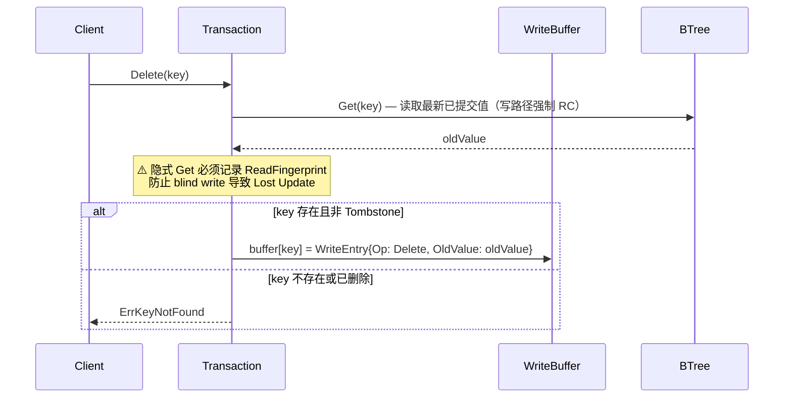

Delete 的 WriteBuffer 条目类型为 `OpDelete`，Commit 时写入 `FlagTombstone + beginTS`。

### 6.3 commitTimestamp 时序约束

> **来源**：Lealone `AOTransaction.java` L254-258

Lealone 的核心约束：

```java
// 这一步很重要！！！
// 生成commitTimestamp的时机很严格，需要等到redo log sync完成后才能生成，
// checkpoint线程和可重复读的事务都依赖它
commitTimestamp = transactionEngine.nextTransactionId();
```

**NexKV Phase 2 适配**：

Phase 2 没有 WAL sync（Phase 3 才引入），因此 `commitTimestamp` 分配时机简化为：**Commit 开始时立即分配**。但必须预留 WAL sync 后分配的扩展点：

```go
func (tx *Transaction) Commit() error {
    // Phase 2: 直接分配（无 WAL）
    // Phase 3: 在 WAL sync 回调中分配
    commitTS := tx.engine.tsGen.NextTS()
    tx.commitTimestamp = commitTS

    // Apply WriteBuffer to BTree
    return tx.applyWriteBuffer(ctx, commitTS)

// deepCopy 防止 mmap 悬垂指针（评审修订 H2/H4）
// v3.9 M7：此工具函数放在 mvcc 包级别（如 mvcc/util.go），
// 与 VersionStore、SnapshotTx 等同包引用。不放入 offheap 包
// （offheap 是基础设施层，不应依赖 mvcc 语义）。
func deepCopy(src []byte) []byte {
    if src == nil {
        return nil
    }
    dst := make([]byte, len(src))
    copy(dst, src)
    return dst
}
}
```

---

## 七、提交协议

### 7.1 Commit 完整流程

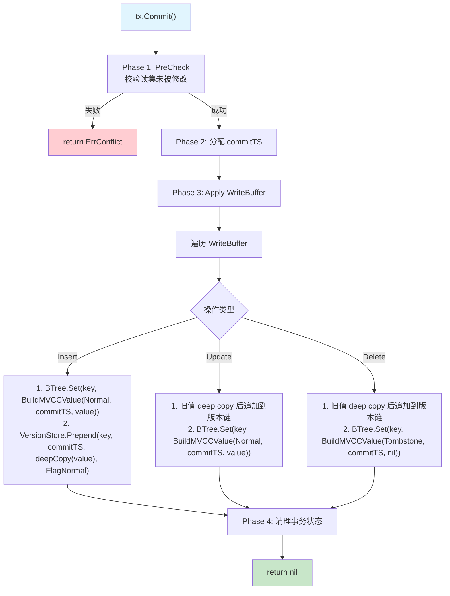

> **⚠️ 评审修订 v3.1**：上述流程图省略了 Apply 阶段的二次校验细节。完整 Apply 逻辑见下方伪代码。

### 7.1.1 Apply 阶段：per-key KeyLock + 锁内原子化执行

> **⚠️ 评审修订 v3.3**：Round 3 三 Agent 联合评审发现 per-key commitSeq CAS 方案存在根本性缺陷——CAS 只串行化序号递增，不串行化后续 Prepend+Set 操作。本节改为 per-key 轻量级锁（`atomic.Bool` spinlock），锁内完整执行 Get→校验→Prepend→Set，严格串行化。

**v3.2 commitSeq CAS 的根本缺陷**：

```
TX2 CAS(seq, 1→2) 成功 → 开始 Prepend+Set
TX3 CAS(seq, 2→3) 也成功（TX2 还没完成 Set）→ 并发 Prepend+Set
→ TX2 的 Set 覆盖 TX3 的 Set → Lost Update
```

CAS 只串行化了 `commitSeq` 的递增，**没有锁住临界区**（Get→Prepend→Set）。两个事务可以先后 CAS 成功，然后并发修改 B+Tree 和 VersionChain。

**v3.3 修复方案：per-key KeyLock**

核心思路：用 `atomic.Bool` 实现轻量级自旋锁（非 `sync.Mutex`，无 OS 级锁开销），将 Get→校验→Prepend→Set 完整包裹在锁内。严格串行化，无竞态、无 retry、无并发覆盖。

```go
// KeyLock 轻量级 per-key 自旋锁（atomic.Bool 实现）
//
// 设计原则：
// - 不使用 sync.Mutex（避免 OS 级锁开销和 goroutine 阻塞）
// - atomic.Bool CAS + runtime.Gosched yield，纯用户态自旋
// - 锁粒度：per-key（不同 key 可并行提交）
// - 锁内完整执行 Get→校验→Prepend→Set，严格串行化
type KeyLock struct {
    locked atomic.Bool
}

// Lock 自旋获取锁（CAS + 递增 yield + maxRetries 上限）
// v3.8 评审修订 H1：纯 runtime.Gosched 在热点 key 场景下 CPU 占用飙升且无公平性保证。
// v3.12 修订：移除 time.Sleep（OS 调度器精度不可控，μs 级 Sleep 实际为 100μs-1ms），
// 改为纯 runtime.Gosched() 递增 yield：前 20 次单次 yield，之后递增 yield 次数。
// v3.11 C-03/M1（maxRetries 上限）：最大重试次数 1000（递增 yield 总等待由调度器决定）。
// 超过上限返回 ErrLockTimeout 而非无限自旋，防止热点 key 导致 goroutine 永久阻塞。
// 1000 次足以覆盖 GC STW（通常 < 1ms）+ OS 调度抖动（通常 < 10ms）。
// 调用方（commitKey / rollbackOneKey）应处理 ErrLockTimeout 作为可重试错误。
//
// v3.12 评审修订 H-NEW-3（退避参数一致性声明）：
// snapshotGet 的 spin retry 使用相同策略（20 次单次 yield + 递增 yield），但 maxRetries=100
// （等待 Writer 完成 Prepend，通常 < 1μs），而 KeyLock.Lock maxRetries=1000（等待临界区，
// 可能含 B+Tree 页面分裂等耗时操作）。两者的 yield 策略一致，差异仅在 maxRetries——
// snapshotGet 等待更短（链创建），KeyLock 等待更长（临界区执行）。
//
// v3.13 评审修订 H-NEW-2（纯 Gosched 无时间下界保证风险声明）：
// 与 snapshotGet spin retry 相同的风险声明：runtime.Gosched() 不保证最小等待
// 时间。KeyLock 的 maxRetries=1000 递增 yield 最多产生约 18000 次 Gosched
// （1000 轮 × 18 次/轮），由调度器决定总等待时间。在极端场景（热点 key +
// GC STW + OS 调度抖动）下可能超过 maxRetries 返回 ErrLockTimeout。
// 这是有意的设计权衡——不引入 time.Sleep（v3.12 已移除所有 time.Sleep），
// 调用方（commitKey / rollbackOneKey）应处理 ErrLockTimeout 作为可重试错误。
// 如果 ErrLockTimeout 频率在生产环境超预期，可考虑替换为 sync.Mutex
//（Go 1.9+ 内置 spinning + FIFO 排队，公平性更好）。
func (kl *KeyLock) Lock() error {
    const maxRetries = 1000
    for i := 0; i < maxRetries; i++ {
        if kl.locked.CompareAndSwap(false, true) {
            return nil
        }
        // v3.12：纯 runtime.Gosched 递增 yield，无 time.Sleep
        if i <= 20 {
            runtime.Gosched()
        } else {
            // 递增 yield：21→2次，25→3次，30→4次 ... 100→18次
            yields := 2 + (i-20)/5
            for j := 0; j < yields; j++ {
                runtime.Gosched()
            }
        }
    }
    return ErrLockTimeout // v3.11: 超过 maxRetries，防止永久阻塞
}

// Unlock 释放锁
// v3.10 评审修订 H7（double-unlock 检测）：使用 CAS(false) 而非 Store(false)。
// CAS 返回 false 表示锁已被其他人释放（double unlock 或竞态），记录警告但不 panic。
// Store(false) 无法检测 double unlock——两次连续 Unlock 调用都"成功"但中间可能
// 有其他 goroutine 获得了锁。CAS(false) 的第二次调用会因为 locked 已经是 false
// 而返回 false，可以检测到异常。
// v3.11 H2（调用者约束声明）：Unlock 假设调用者是当前锁持有者。违反此假设（非持有者
// 调用 Unlock）导致未定义行为。CAS(true,false) 不能完全检测 double unlock 与合法 Lock
// 的交错——Goroutine A Unlock(CAS 成功) → Goroutine B Lock(CAS 成功) → Goroutine A
// 再次 Unlock(CAS 成功，误释放 B 的锁)。此场景需要 A 连续调用两次 Unlock，属于严重
// 调用方 bug。commitKey 和 rollbackOneKey 使用 defer kl.Unlock() 保证只调用一次。
func (kl *KeyLock) Unlock() {
    if !kl.locked.CompareAndSwap(true, false) {
        // Double unlock 或竞态检测——记录警告但不 panic
        // 生产环境建议：log.Warn("KeyLock double unlock detected", "key", key)
    }
}

// TxManager 事务引擎
type txManager struct {
    storage      StorageBackend
    tsGen        TSGenerator
    versionStore *VersionStore
    siCount      atomic.Int32
    keyLocks     sync.Map // string → *KeyLock: per-key 轻量级自旋锁
}

// UndoEntry Apply 失败时的回滚条目
type UndoEntry struct {
    Key              string
    OldRawVal        []byte        // Apply 前 B+Tree 中的原始 Value（deepCopy），nil 表示 key 不存在
    CommitTS         uint64        // 本次写入的 commitTS（用于 rollbackApplied 校验当前值）
    PrePrependHead   *VersionNode  // Prepend 前的 VersionChain head（用于回滚版本链）
    PrependSucceeded bool          // v3.11 C-15：Prepend 是否成功。false 时 rollbackOneKey 跳过 VersionChain 回退（链未修改）
}

// commitKey 对单个 key 在 KeyLock 保护下原子执行 Set + Prepend
//
// 严格串行化保证：
// 1. KeyLock 保证同一 key 的 Get→校验→Set→Prepend 在锁内串行执行
// 2. 不同 key 的 commitKey 可并行（各自独立的 KeyLock）
// 3. 锁内 Set-before-Prepend 天然保证（同 goroutine 内顺序一致性）
// 4. 无 retry 循环——锁内校验要么通过要么直接返回冲突
// 5. 返回 UndoEntry 用于多 key Commit 失败时回滚
func (tx *txManager) commitKey(ctx context.Context, key string, entry WriteEntry, commitTS uint64) (*UndoEntry, error) {
    // 获取 per-key KeyLock
    lockVal, _ := tx.keyLocks.LoadOrStore(key, &KeyLock{})
    kl := lockVal.(*KeyLock)
    // v3.12 H-NEW-1：KeyLock.Lock() 返回 ErrLockTimeout（maxRetries=1000 超过后）。
    // 调用方必须处理此错误——返回 nil UndoEntry（B+Tree 未修改，无需回滚）。
    if err := kl.Lock(); err != nil {
        return nil, fmt.Errorf("key %s lock timeout: %w", key, err)
    }
    defer kl.Unlock()

    // ===== 临界区开始：严格串行化 =====

    // Step 1: 读取 B+Tree 当前值（锁内无竞态）
    // v3.8 修复 C1：使用 GetRaw 返回 Go 堆独立副本，无需额外 deepCopy
    // v3.12 M-NEW-2：context.Background() 改为透传 ctx（Phase 2 不检查取消但保持接口一致）
    var oldRawVal []byte
    if current, err := tx.storage.GetRaw(ctx, []byte(key)); err == nil {
        oldRawVal = current // GetRaw 已返回独立副本
    }

    // Step 2: 校验（锁内无 TOCTOU）
    switch entry.Op {
    case OpInsert:
        if oldRawVal != nil {
            // 区分 Tombstone（Undo 恢复或已删除）和 Normal 值
            // Tombstone 视为 key 不存在，Insert 可继续
            // v3.9 M5：ParseValueWithMVCC 开发阶段使用 panic 暴露格式错误。
            // commitKey 在 KeyLock 内执行，panic 导致该 key 永久死锁。
            // v3.12 M-NEW-3（KeyLock panic 安全强化）：KeyLock.Lock() 已改为返回
            // error（ErrLockTimeout），commitKey 入口检查 Lock error 后直接返回。
            // 但 ParseValueWithMVCC 的 panic 仍需 recover 保护——建议实现时使用
            // `defer func() { if r := recover(); r != nil { ... } }()` 捕获 panic，
            // 将 panic 转为 error 返回，确保 KeyLock.Unlock() 在 defer 中正常执行。
            // 生产环境应改为返回 error + recover，或 ParseValueWithMVCC 改为
            // 返回 error 而非 panic（Section 3.2 已预留此演进路径）。
            //
            // v3.10 评审修订 H2（OpInsert Tombstone beginTS 校验声明）：
            // OpInsert 看到 Tombstone 时不校验其 beginTS——无论是 rollback 标记
            //（beginTS = 回滚事务 commitTS）还是正常 Delete 的 Tombstone，都视为
            // "key 不存在"。这是设计意图：(1) rollback Tombstone 表示写入已回滚，
            // 后续 Insert 应可成功；(2) 正常 Delete Tombstone 表示 key 已被逻辑删除，
            // Insert 等价于重新创建 key。不校验 beginTS 的安全性论证：
            // - KeyLock 保证同一 key 的 commitKey 串行执行，Insert 获得锁后读到
            //   的 Tombstone 是确定的（不会被并发修改）
            // - Insert 写入新值（beginTS = 本事务 commitTS）覆盖 Tombstone，
            //   快照读对此 key 的可见性由新 beginTS 决定，旧 Tombstone 不影响
            // - 唯一风险：Insert 事务的 WriteBuffer.OldBeginTS=0（OpInsert 无旧值），
            //   Apply 的 beginTS 校验（currentBeginTS != entry.OldBeginTS）不适用——
            //   OpInsert 走 Tombstone 分支而非 beginTS 比较分支，不受此影响
            flag, _, _ := ParseValueWithMVCC(oldRawVal)
            if flag != FlagTombstone {
                return nil, ErrConflict // key 已被其他事务插入
            }
            // Tombstone → 视为 key 不存在，Insert 可继续
        }
    case OpUpdate, OpDelete:
        if oldRawVal == nil {
            return nil, ErrConflict // key 不存在
        }
        _, currentBeginTS, _ := ParseValueWithMVCC(oldRawVal)
        if currentBeginTS != entry.OldBeginTS {
            return nil, ErrConflict // 此 key 已被其他事务修改
        }
    }

    // Step 3: 确定写入内容
    flag := FlagNormal
    newVal := entry.Value
    if entry.Op == OpDelete {
        flag = FlagTombstone
        newVal = nil
    }

    // Step 4: 写入新版本到 B+Tree（v3.4 评审修订 C3：先 Set 后 Prepend）
    // 原因：如果先 Prepend 后 Set，Set 失败时版本链中产生幽灵节点（commitTS 对应
    // 版本在链中存在但 B+Tree 无对应最新版本），快照读遍历时可能命中错误版本。
    // 改为 Set-before-Prepend 后：
    // - Set 成功 + Prepend 成功 → 正常
    // - Set 成功 + Prepend 失败 → B+Tree 已更新（新 beginTS），返回 UndoEntry 回滚
    // - Set 失败 → B+Tree 未修改（B+Tree Set 的原子性契约：要么完全成功要么不变），
    //   版本链未追加，无残留（直接返回错误）
    //
    // ⚠️ Set-before-Prepend 窗口安全性论证（v3.8 评审修订 C2）：
    // Set 完成 + Prepend 未完成期间，快照读可能丢失一个历史版本：
    // snapshotGet 看到新 beginTS（不可见）→ 查版本链 → 链中缺少本次 Commit 的旧版本
    // → 返回更旧版本。这是 Set-before-Prepend 的固有语义代价（详见风险表）。
    //
    // **Prepend 数据安全性**：Prepend 所需的 OldValue/OldFlag 在 Step 1 的
    // GetRaw 中已获取（Go 堆独立副本）。即使 Set 触发了页面分裂（COW），
    // OldValue 不受 mmap 生命周期影响。Prepend 的输入来自 WriteBuffer.OldValue
    // （也是独立副本），与 B+Tree 当前状态无关。
    if err := tx.storage.Set(ctx, []byte(key),
        BuildMVCCValue(flag, commitTS, newVal)); err != nil {
        return nil, fmt.Errorf("btree set failed for key %s: %w", key, err)
    }

    // Step 5: 构建版本链节点（所有操作类型都必须构建）
    // v3.4 评审修订 C2：必须检查 Prepend 返回值
    // v3.6 评审修订 C1：Prepend 失败时仍返回 UndoEntry
    // v3.7 评审修订 C1（CRITICAL）：OpInsert 也必须构建版本链节点（存储实际 value）。
    // 否则 Insert→Update 场景下，snapshotTS 介于 Insert 和 Update 之间的快照读
    // 遍历链找不到可见版本，错误返回 ErrKeyNotFound。
    //
    // v3.9 评审修订 C1（CRITICAL）：记录 Prepend 前的 VersionChain head 快照，
    // 用于 rollbackApplied 中 CAS 回退 VersionChain，消除幽灵节点导致快照读
    // 看到已回滚事务旧值的正确性问题。
    var prePrependHead *VersionNode
    chainVal, _ := tx.versionStore.chains.Load(key)
    if chainVal != nil {
        prePrependHead = chainVal.(*VersionChain).head.Load()
    }
    switch entry.Op {
    case OpInsert:
        // Insert 构建版本链节点：存储 Insert 的实际 value（deepCopy）
        // next == nil 标识这是链的末端（最早版本）
        //
        // v3.10 评审修订 M6（deepCopy 策略精确声明）：
        // entry.Value 来自 SnapshotTx.Put 的调用方参数（[]byte），不是 mmap 引用。
        // 理论上不需要 deepCopy——调用方传入后不再修改（事务语义约定）。
        // 但保留 deepCopy 作为防御性编程：(1) 调用方可能复用 []byte buffer；
        // (2) 与 OpUpdate/OldValue 的 deepCopy 策略保持一致，降低认知负担。
        // 如果性能分析表明 deepCopy 成为瓶颈，可移除（调用方负责提供独立副本）。
        if err := tx.versionStore.Prepend(key, commitTS, deepCopy(entry.Value), FlagNormal); err != nil {
            return &UndoEntry{Key: key, OldRawVal: oldRawVal, CommitTS: commitTS,
                PrePrependHead: prePrependHead, PrependSucceeded: false},
                fmt.Errorf("version chain insert failed for key %s: %w", key, err)
        }
    case OpUpdate, OpDelete:
        // Update/Delete：Prepend 旧值到版本链
        if err := tx.versionStore.Prepend(key, commitTS, entry.OldValue, entry.OldFlag); err != nil {
            // Prepend 失败：仍返回 UndoEntry，使 applyWriteBuffer 能回滚 B+Tree Set。
            return &UndoEntry{Key: key, OldRawVal: oldRawVal, CommitTS: commitTS,
                PrePrependHead: prePrependHead, PrependSucceeded: false},
                fmt.Errorf("version chain prepend failed for key %s: %w", key, err)
        }
    }

    // ===== 临界区结束 =====

    return &UndoEntry{Key: key, OldRawVal: oldRawVal, CommitTS: commitTS,
        PrePrependHead: prePrependHead, PrependSucceeded: true}, nil
}

// applyWriteBuffer 将 WriteBuffer 应用到 B+Tree（多 key 原子性 + Undo）
//
// 原子性保证：
// - 所有 key 全部 Apply 成功 → 返回 nil
// - 任一 key Apply 失败 → 逆序回滚已写入的 key → 返回 ErrConflict
//
// per-key KeyLock 保证同 key Apply 严格串行化（无并发覆盖）。
// Undo Buffer 保证跨 key 的 all-or-nothing 语义。
//
// ⚠️ 死锁防护（v3.4 评审修订 C5）：key 必须全局排序后再获取 KeyLock。
// 如果两个事务以不同插入顺序获取 per-key lock（TX1: A→B, TX2: B→A），
// 会产生循环等待。排序后所有事务以相同字典序获取锁，消除死锁可能。
func (tx *SnapshotTx) applyWriteBuffer(ctx context.Context, commitTS uint64) error {
    keys := tx.writeBuffer.OrderedKeys()
    sort.Strings(keys) // v3.4: 全局排序防止死锁

    undoBuf := make([]UndoEntry, 0, len(keys))

    for _, key := range keys {
        // v3.6 评审修订 M2：Insert→Delete 已从 entries map 移除，ordered 列表保留 key。
        // 遍历时跳过已删除的 entry（entries 中不存在）。
        entry, exists := tx.writeBuffer.entries[key]
        if !exists {
            continue
        }

        undoEntry, err := tx.engine.commitKey(ctx, key, entry, commitTS)
        if err != nil {
            // v3.6 评审修订 C1（CRITICAL）：commitKey 可能返回非 nil UndoEntry
            //（Prepend 失败场景）。B+Tree 已被 Set 更新，必须追加到 undoBuf 并回滚。
            if undoEntry != nil {
                undoBuf = append(undoBuf, *undoEntry)
            }
            // Apply 失败：逆序回滚已写入的 B+Tree 值
            if len(undoBuf) > 0 {
                if rollbackErr := tx.rollbackApplied(undoBuf); rollbackErr != nil {
                    return fmt.Errorf("apply failed: %w, rollback also failed: %v", err, rollbackErr)
                }
            }
            return err
        }
        undoBuf = append(undoBuf, *undoEntry)
    }
    return nil
}

// rollbackApplied 逆序恢复已写入 B+Tree 的值 + 回退 VersionChain（Undo Buffer）
//
// v3.4 评审修订 C1+H1：
// - 增加 commitTS 校验：只恢复自己写入的版本，不覆盖其他事务已提交的值
// - 错误处理：记录第一个错误并继续回滚（尽力恢复），最终返回错误
//
// v3.6 评审修订 H2：
// - storage.Get 失败时保守跳过（无法确认当前值是否为本事务写入的版本）
// - 与 commitTS 不匹配策略一致：宁可跳过回滚，也不覆盖可能的已提交值
//
// v3.9 评审修订 C1（CRITICAL 修复）：
// - 回滚 B+Tree 的同时也回退 VersionChain head（CAS 回退到 PrePrependHead）
// - 消除幽灵版本链节点——之前只回滚 B+Tree 不回滚 VersionChain，导致快照读
//   命中已回滚事务的旧值（Insert→Rollback→后续 TX 写同 key→snapshotTS 介于
//   两者之间→链中 Insert 节点 commitTS ≤ snapshotTS→错误返回已回滚的值）
// - CAS 回退在 KeyLock 内执行，不会失败（同 goroutine 操作 head）
// - 如果 VersionChain head 已被后续 commitKey 修改（head ≠ 本次 Prepend 的节点），
//   说明有其他事务已经追加了新版本，跳过回退（类似 commitTS 校验的保守策略）
//
// v3.9 评审修订 H1（panic 安全）：
// - 使用 defer kl.Unlock() 替代手动 Unlock，防止 ParseValueWithMVCC 开发阶段
//   panic 导致 KeyLock 永不释放（该 key 永久死锁）
//
// v3.8 评审修订 H11（性能注意）：
// rollbackApplied 逐 key 调用 rollbackOneKey 子函数。每个子函数独立获取/释放
// per-key KeyLock，避免旧方案中 defer 在 for 循环内累积持有多个 KeyLock 的问题。
// 回滚延迟取决于并发 Commit 的临界区执行时间（通常 < 1μs），极端高并发下
// 可能引入毫秒级延迟——这是 best-effort undo 的固有代价。
// Phase 3 引入 WAL 后可消除此问题。
//
// v3.10 评审修订 C1（CRITICAL 修复）：
// 原 rollbackApplied 在 for 循环内使用 defer kl.Unlock()，Go 的 defer 延迟到
// **函数返回时**执行而非迭代结束。多 key 回滚时所有 KeyLock 累积持有，阻塞
// 并发 commitKey（同一 key 的正常提交必须等所有回滚完成）。提取为 per-key
// 子函数 rollbackOneKey，defer 在子函数返回时立即释放 KeyLock。
//
// v3.13 评审修订 M-NEW-2（双重 KeyLock 超时最终状态声明）：
// 如果 rollbackOneKey 对 key A 返回 ErrLockTimeout（KeyLock.Lock 超时），
// 对 key B 成功回滚，最终状态为：B 已回滚（旧值），A 仍为本事务写入的新值
// （commitTS 校验可能后续被其他事务覆盖）。这是 best-effort undo 的固有
// 语义——调用方应将 rollbackApplied 的错误视为不可恢复错误（日志告警 +
// 人工介入）。Phase 3 引入 WAL 后将消除此问题。
func (tx *SnapshotTx) rollbackApplied(undoBuf []UndoEntry) (firstErr error) {
    for i := len(undoBuf) - 1; i >= 0; i-- {
        if err := tx.rollbackOneKey(undoBuf[i]); err != nil && firstErr == nil {
            firstErr = err
        }
    }
    return firstErr
}

// rollbackOneKey 回滚单个 key 的 B+Tree 值 + VersionChain head
//
// 作为独立子函数，defer kl.Unlock() 在函数返回时立即执行，
// 不会累积持有多个 key 的 KeyLock。
//
// v3.10 Undo Tombstone beginTS 语义声明（H1）：
// OldRawVal==nil 时写入 BuildMVCCValue(FlagTombstone, entry.CommitTS, nil)，
// 此处 entry.CommitTS 是"本事务写入失败的标记"，不是正常 Commit 的 beginTS。
// 这个 Tombstone 的 beginTS 等于本事务的 commitTS，语义上表示"commitTS 时刻
// 的写入已回滚"。后续事务看到此 Tombstone 时，commitKey 的 OpInsert 校验
// 视 Tombstone 为"key 不存在"（Section 7.1.1 Step 2），Insert 可继续。
// 快照读对此 Tombstone 的可见性与普通 Tombstone 一致（snapshotTS ≥ beginTS → ErrKeyNotFound）。
//
// v3.13 评审修订 M-NEW-1（panic recover 保护）：
// ParseValueWithMVCC 开发阶段使用 panic 暴露格式错误。rollbackOneKey 在
// KeyLock 内调用 ParseValueWithMVCC（Step A），panic 导致 KeyLock 永不释放。
// 添加 defer recover 将 panic 转为 error 返回，确保 KeyLock.Unlock 在 defer
// 链中正常执行。生产环境应改为 ParseValueWithMVCC 返回 error。
func (tx *SnapshotTx) rollbackOneKey(entry UndoEntry) (retErr error) {
    // v3.13 M-NEW-1：recover 保护 ParseValueWithMVCC panic，防止 KeyLock 永久死锁
    defer func() {
        if r := recover(); r != nil {
            retErr = fmt.Errorf("rollback key %s: panic in critical section: %v", entry.Key, r)
            // KeyLock.Unlock 在外层 defer kl.Unlock() 中执行，此处只设置返回错误
        }
    }()
    lockVal, _ := tx.engine.keyLocks.LoadOrStore(entry.Key, &KeyLock{})
    kl := lockVal.(*KeyLock)
    // v3.12 H-NEW-1：KeyLock.Lock() 可能返回 ErrLockTimeout。
    // 回滚路径遇到锁超时→返回错误，applyWriteBuffer 记录 firstErr 继续回滚其他 key。
    if err := kl.Lock(); err != nil {
        return fmt.Errorf("rollback key %s: lock timeout: %w", entry.Key, err)
    }
    defer kl.Unlock() // v3.10 C1: 子函数内 defer，每次回滚后立即释放 KeyLock

    // Step A: commitTS 校验（v3.4 C1 + v3.6 H2）：
    // 只有 B+Tree 当前值仍然是本事务写入的版本时才回滚。
    // 如果当前值已被其他事务更新（commitTS 不匹配），说明此 key
    // 已被其他事务成功 Commit，不应覆盖。
    // v3.8 修复 C1：使用 GetRaw 返回独立副本，消除 mmap 悬垂引用
    current, getErr := tx.engine.storage.GetRaw(tx.ctx, []byte(entry.Key))
    if getErr != nil {
        // v3.6 H2：Get 失败时保守跳过（无法确认当前值版本）。
        return fmt.Errorf("rollback key %s: GetRaw failed, skipping: %w", entry.Key, getErr)
    }
    _, currentBeginTS, _ := ParseValueWithMVCC(current)
    if currentBeginTS != entry.CommitTS {
        // 当前值已被其他事务更新，跳过回滚（不覆盖已提交的值）
        return nil
    }

    // Step B: 回滚 B+Tree
    if entry.OldRawVal == nil {
        // v3.8 C3：原 key 不存在时写入 Tombstone 而非物理删除，保版本链可达性。
        // v3.10 H1：Tombstone 的 beginTS = entry.CommitTS（本事务 commitTS），
        // 作为"写入已回滚"的标记。OpInsert 校验视 Tombstone 为 key 不存在。
        tombstone := BuildMVCCValue(FlagTombstone, entry.CommitTS, nil)
        if opErr := tx.engine.storage.Set(tx.ctx, []byte(entry.Key), tombstone); opErr != nil {
            return fmt.Errorf("rollback key %s failed: %w", entry.Key, opErr)
        }
    } else {
        // 恢复原值（使用 deepCopy 的独立副本，安全写入）
        if opErr := tx.engine.storage.Set(tx.ctx, []byte(entry.Key),
            entry.OldRawVal); opErr != nil {
            return fmt.Errorf("rollback key %s failed: %w", entry.Key, opErr)
        }
    }

    // Step C: 回退 VersionChain head（v3.9 C1 CRITICAL 修复）
    // 将链的 head 从当前值 CAS 回退到 Prepend 前的状态（PrePrependHead），
    // 消除幽灵版本链节点对快照读的影响。
    //
    // v3.11 C-15（PrependSucceeded 守卫）：只有 Prepend 成功时才尝试回退。
    // Prepend 失败时 VersionChain 未被修改（链头未变），跳过回退避免无效 CAS。
    //
    // 安全性论证：
    // - CAS 在 KeyLock 内执行，同一 key 的并发操作被串行化，不会失败
    // - 如果 head 已被后续 commitKey 修改（head != 本次 Prepend 后的值），
    //   说明其他事务已追加新版本，跳过回退（保守策略，不丢失其他事务的版本）
    // - PrePrependHead 可能为 nil（key 首次 Insert 时链不存在或链刚创建），
    //   CAS(head → nil) 有效——回退到空链状态
    // - Step B（B+Tree 回滚）和 Step C（VersionChain 回退）必须在同一 KeyLock 内
    //   原子执行（v3.11 C-05 声明）——不可拆分到不同的锁范围
    //
    // v3.10 H6（幽灵节点残留声明）：CAS 回退只处理 head == 本事务 Prepend 节点
    // 的情况。如果 head 已被后续事务更新（commitTS 不匹配），本事务的 Prepend
    // 节点仍在链中（作为中间节点），从 head 不可达但通过其他节点的 next 指针
    // 可能可达。这些残留幽灵节点不影响快照读正确性：B+Tree 已回滚到旧版本
    // （beginTS < 回滚事务 commitTS），快照读直接返回 B+Tree 值不遍历链。
    // Phase 3 GC 将统一清理。
    if !entry.PrependSucceeded {
        // Prepend 未成功，VersionChain 未被修改，无需回退
        return nil
    }
    chainVal, _ := tx.engine.versionStore.chains.Load(entry.Key)
    if chainVal != nil {
        chain := chainVal.(*VersionChain)
        currentHead := chain.head.Load()
        // 简化校验：如果 head 的 commitTS 匹配本事务的 commitTS，说明 head 未被修改
        if currentHead != nil && currentHead.commitTS == entry.CommitTS {
            chain.head.CompareAndSwap(currentHead, entry.PrePrependHead)
            // v3.13 H-NEW-1：CAS 回退成功后递增 generation。
            // generation 反映"链头变更总次数"（含追加和回退），v3.12 已声明回退时不递减。
            // 此处显式递增保证 generation 单调性：Prepend 成功 +1，rollback 回退也 +1。
            // Phase 3 GC 使用 generation 做 ABA 防护时，回退后 generation >
            // Prepend 前的值，正确反映链头已变化。
            chain.generation.Add(1)
            // CAS 在 KeyLock 内不应失败。如果失败说明 head 被绕过 KeyLock 的代码修改——
            // 严重 bug，但不影响正确性（保守跳过，链中多一个幽灵节点，GC 时清理）
        }
        // 如果 head.commitTS != entry.CommitTS，说明后续事务已追加版本，
        // 不回退（保留后续事务的版本链节点）
    }
    return nil
}
```

**rollbackOneKey 典型场景推演**（v3.11 评审修订 SI-06，可审计正确性论证）：

**场景 A：Insert 回滚（OldRawVal==nil）**
```
TX1 Insert(k, v1) commitTS=100 → Set(k, [Normal,100,v1]) + Prepend(k, 100, v1, FlagNormal)
TX1 后续 key 失败 → rollbackOneKey(k, {OldRawVal:nil, CommitTS:100, PrePrependHead:nil, PrependSucceeded:true})
  Step A: GetRaw(k) → beginTS=100 == CommitTS=100 ✓
  Step B: OldRawVal==nil → 写入 Tombstone(beginTS=100)
  Step C: PrependSucceeded=true → chains.Load(k) → head.commitTS=100 == 100 → CAS(head, nil) → 链变为空
结果：B+Tree = Tombstone(100)，VersionChain = 空 → snapshotTS<100 的快照读返回 ErrKeyNotFound ✓
```

**场景 B：Update 回滚（OldRawVal 有值）**
```
TX1 Update(k, v2) commitTS=200 → Set(k, [Normal,200,v2]) + Prepend(k, 200, v1, FlagNormal)
TX1 后续 key 失败 → rollbackOneKey(k, {OldRawVal:[Normal,100,v1], CommitTS:200, PrePrependHead:node(100), PrependSucceeded:true})
  Step A: GetRaw(k) → beginTS=200 == CommitTS=200 ✓
  Step B: OldRawVal!=nil → Set(k, [Normal,100,v1])（恢复旧值）
  Step C: head.commitTS=200 == 200 → CAS(head, node(100)) → 链恢复为 [100] → [old]
结果：B+Tree = v1(beginTS=100)，VersionChain = [100] → [old] → snapshotTS≥100 返回 v1 ✓
```

**场景 C：Prepend 失败回滚（Set 成功但 Prepend 超过 maxRetries）**
```
TX1 commitKey → Set(k, [Normal,300,v3]) 成功 → Prepend 失败
UndoEntry = {OldRawVal:[Normal,200,v2], CommitTS:300, PrePrependHead:node(200), PrependSucceeded:false}
rollbackOneKey:
  Step A: GetRaw(k) → beginTS=300 == CommitTS=300 ✓
  Step B: Set(k, [Normal,200,v2])（恢复旧值）
  Step C: PrependSucceeded=false → 跳过 VersionChain 回退（链头未变，无需回退）
结果：B+Tree = v2(beginTS=200)，VersionChain 保持原状 → 正确，Prepend 未修改链 ✓
```

**场景 D：并发事务已更新（跳过回滚）**
```
TX1 commitKey(k) commitTS=100 → 成功
TX2 commitKey(k) commitTS=200 → 成功（覆盖 TX1 的值）
TX1 其他 key 失败 → rollbackOneKey(k, {CommitTS:100, ...})
  Step A: GetRaw(k) → beginTS=200 != CommitTS=100 → 跳过回滚
结果：B+Tree 保持 TX2 的值（beginTS=200），不受 TX1 回滚影响 ✓
```

**KeyLock 串行化原理**：

```
TX1 commitKey(keyA):
  KeyLock.Lock()               ───┐
  Get(keyA) → beginTS=100        │
  校验: 100 == OldBeginTS        │ 锁内严格串行
  Set(B+Tree, beginTS=200)       │ （v3.4: 先 Set 后 Prepend）
  Prepend(VersionChain)          │
  KeyLock.Unlock()             ──┘

TX2 commitKey(keyA)（并发）:
  KeyLock.Lock() → 自旋等待（TX1 持有锁）
  ... TX1 Unlock ...
  KeyLock.Lock() 成功            ───┐
  Get(keyA) → beginTS=200          │
  校验: 200 != OldBeginTS(100)     │ 失败 → ErrConflict
  KeyLock.Unlock()               ──┘
```

1. **KeyLock 保证同一 key 的 Get→校验→Set→Prepend 不可分割**——其他事务在锁外等待
2. **TX2 获得锁后读到 TX1 的最新值**——beginTS 校验必然失败，正确检测冲突
3. **Set-before-Prepend 保证**——同一 goroutine 内 Set 先于 Prepend 执行（程序序），但 Reader 看到 B+Tree Set 结果不代表 Prepend 已对 Reader 可见（跨 goroutine 的可见性必须通过同步操作建立）。snapshotGet 的 spin retry 覆盖此可见性窗口：Set 完成后 Prepend 在极短时间内完成，chains.Load 最多 retry 10 次 + Gosched 即可感知
4. **rollbackApplied 也走 KeyLock**——回滚操作与并发 commitKey 串行化，配合 commitTS 校验防止覆盖已提交的值

**关键设计决策**：

1. **KeyLock 而非 sync.Mutex**：`atomic.Bool` CAS + `runtime.Gosched` 纯用户态自旋，无 OS futex 开销。适用于短临界区（微秒级 B+Tree 操作）。**已知限制（v3.4 评审 M1）**：自旋锁无公平性保证，热点 key 高并发场景下可能产生饥饿。如生产环境出现尾延迟飙升，可替换为 `sync.Mutex`（Go 1.9+ 已对短临界区做 spinning 优化，性能接近手写自旋锁）。
2. **OpInsert 区分 Tombstone**：Undo 后 B+Tree 可能存在 `FlagTombstone` 条目，Insert 校验时区分 Tombstone（视为 key 不存在）和 Normal（视为冲突）。修复 v3.2 中 Insert 被误判冲突的问题。
3. **Undo 使用 Tombstone 而非物理删除**（v3.8 修订，修正 v3.3）：`OldRawVal == nil` 时写入 `BuildMVCCValue(FlagTombstone, entry.CommitTS, nil)` 而非调用 `storage.Delete` 物理删除。理由：物理删除破坏版本链可达性——key 从 B+Tree 消失后 snapshotGet 不再查版本链，旧快照事务丢失此 key 的可见版本。Tombstone 保留 key 物理存在，快照读可见性正确。
4. **Undo Buffer 保留**：KeyLock 只串行化同 key 操作，跨 key 原子性仍需 Undo Buffer 保证。
5. **rollbackApplied commitTS 校验（v3.4 评审 C1）**：回滚前校验 B+Tree 当前 beginTS 是否等于 UndoEntry.CommitTS，只恢复自己写入的版本，不覆盖并发事务已提交的值。
6. **applyWriteBuffer key 全局排序（v3.4 评审 C5）**：`sort.Strings(keys)` 确保所有事务以字典序获取 KeyLock，消除死锁可能。
7. **OldRawVal deepCopy**：Undo Buffer 中的旧值必须是独立副本，B+Tree Set（COW）后原页面可能被回收。
8. **锁层次分析（v3.5 评审修订 H6 + v3.6 修正 + v3.11 C-01 约束强化）**：所有代码路径必须遵循以下锁获取顺序，反向获取会导致死锁：
   - **层次 2（最外层）**：`sync.Map` 内部分片 mutex（`keyLocks.LoadOrStore`）——短暂持有后立即释放
   - **层次 1（中间层）**：`KeyLock`（`atomic.Bool` spinlock）——在 `keyLocks.LoadOrStore` 完成后获取
   - **层次 1 内部排序**：`applyWriteBuffer` 中多个 key 按 `sort.Strings(keys)` 字典序获取 KeyLock，单个 `commitKey` 只持有一个 KeyLock（无嵌套 KeyLock 获取）
   - **层次 0（最内层）**：`sync.Map` 分片 mutex（`chains.LoadOrStore`）+ `atomic.Pointer CAS`（`VersionChain.head`）——在 KeyLock 持有期间执行
   - **v3.6 修正**：`commitKey` 中 `chains.LoadOrStore`（sync.Map）在 KeyLock 内调用，但 sync.Map 内部分片 mutex 持有时间极短（纳秒级），不会与 KeyLock 形成长时间嵌套。sync.Map 的 mutex 是分片级别的细粒度锁，不构成死锁风险
   - **v3.11 C-01 强化**：KeyLock 持有期间对 `chains` sync.Map 的操作**仅限于** `Load` / `LoadOrStore` / `Store`（不含 `Delete` 和 `Range`）。`Delete` 和 `Range` 可能在内部持有 mutex 较长时间（dirty→read 提升或遍历全量 entry），在 KeyLock 内执行可能导致长时间嵌套。清理操作（如 Phase 3 GC 摘除旧版本链节点）必须在 KeyLock 外执行
   - 所有路径都是层次 2 → 层次 1 → 层次 0，不存在反向嵌套。特别注意：KeyLock 持有期间不调用 `sync.Map.Delete` 或 `sync.Map.Range`
9. **rollbackApplied 失败限制（v3.5 评审修订 H7）**：`storage.Set` 自身也可能失败（如内存压力导致页面分配失败），Undo Buffer 方案有固有限制——无法保证回滚本身一定成功。Phase 2 作为纯内存引擎，B+Tree Set 失败概率极低，记录错误但继续回滚其他 key。Phase 3 引入 WAL 后应改用 Redo Log 保证原子性。
10. **KeyLock happens-before 前置条件（v3.10 评审修订 C3 + v3.11 H1 修正）**：KeyLock 使用 `atomic.Bool` CAS + `runtime.Gosched` 实现互斥。Go 1.19+ 的 `atomic.Bool.CompareAndSwap` 提供 sequential consistency 语义——`Lock()` 的 CAS 成功本身建立了 happens-before 关系（能看到 `Unlock()` 之前的所有写入）。因此 KeyLock **确实提供了跨 goroutine 的 happens-before 保证**。但正确性还依赖一个额外前提：
    - `storage.Set/GetRaw` 内部必须通过 atomic 操作发布写入结果（如 `atomic.StorePointer` / COW 页面原子替换）——Reader 通过 `storage.GetRaw` 读到 Writer 在 KeyLock 临界区内 `storage.Set` 写入的值，依赖 StorageBackend 内部的原子操作建立完整的 happens-before 链条
    - `VersionChain.head` 使用 `atomic.Pointer[VersionNode]`，`CompareAndSwap` 使用 store-release 语义，`Load` 使用 load-acquire 语义——Reader 在 snapshotGet 中 `chains.Load` 读到链头时，能看到 Prepend 中 newNode 的所有字段初始化（Go Memory Model 保证）
    - Phase 2 的 `BTree.Set` 使用 COW 页面原子替换（`atomic.StorePointer`），天然满足此前提

> **⚠️ 注意**：`keyLocks` 的 `sync.Map` 会随 key 增长无限膨胀。生产环境需要 LRU 淘汰或定期清理 `KeyLock` 条目。Phase 2 初期不做此优化。
>
> **v3.11 评审修订 C-02/M2（keyLocks 监控建议）**：`keyLocks` sync.Map 为每个曾写入的 key 分配 `*KeyLock`（约 100-200 bytes/entry 含 sync.Map overhead）。100 万个 key 约 200MB。Phase 2 实现时必须：(1) 暴露 `KeyLockCount() int64` 监控指标；(2) 超过可配置阈值（默认 10 万）时记录警告日志；(3) 远期采用分片 KeyLock pool（按 key hash 分 N 个 shard）或引用计数 + 延迟清理策略。
>
> **⚠️ 注意**：KeyLock 使用 `runtime.Gosched()` 递增 yield（v3.12 移除所有 time.Sleep——OS 调度器精度不可控）。在极端高并发热点 key 场景下，大量 goroutine 自旋等待同一 KeyLock 可能产生 CPU 压力。maxRetries=1000 超过后返回 ErrLockTimeout，防止永久阻塞。

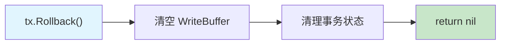

Phase 2 的 Rollback 极其简单——WriteBuffer 是纯内存数据结构，直接丢弃即可。不涉及 UndoLog、锁释放等复杂操作（这些在 Phase 3 WAL 集成时才需要）。

### 7.3 冲突检测：Per-Key ValueHash PreCheck

> **来源**：豆包 Round 10-12 讨论 + 架构评审修正

**核心原则**：采用 **per-Key ValueHash 指纹**而非 PageVer 级别校验，避免同页不同 Key 事务的假阳性冲突。

**PreCheck 角色定位**（v3.5 评审修订 H4）：

PreCheck 是**尽早检测写-写冲突的快速失败路径**，不是正确性保证。正确性由 Apply 阶段的 KeyLock + beginTS 二次校验完成。PreCheck 的价值：在 Commit 开始时尽早发现冲突（避免不必要的 KeyLock 获取和 Undo 开销），而非保证 Commit 时 ReadSet 未变。对于只读 key（在 ReadSet 但不在 WriteSet 中），PreCheck 的校验是 best-effort——标准 SI 也不检测纯读写冲突（rw-conflict），这是 Write Skew 的根源，属于 SSI 范畴。

> **v3.9 评审修订 H5（PreCheck 只读 key 声明）**：ReadSet 中只读 key（用户显式 Get 但未 Put/Delete）的 ReadFingerprint 校验失败时，PreCheck 返回 `ErrConflict`——这是**保守检测**。标准 SI 允许只读 key 被其他事务修改（不违反 SI 语义，因为快照读基于 snapshotTS 而非 ReadSet），但 NexKV-SI 选择在 PreCheck 阶段即中止。理由：(1) PreCheck 是快速失败优化，宁可误杀不可漏放；(2) 减少后续 Apply 阶段的 KeyLock 竞争开销；(3) 调用方如需更宽松语义，可在 Phase 2d 引入 `ReadOnlyPreCheck bool` 选项控制。
>
> **v3.11 评审修订 SI-07（只读 key 假阳性影响分析）**：在高并发读多写少场景下（如 OLTP 读热点 key），只读 key 的误杀率可能显著影响吞吐量。假阳性场景：TX1 Get("config_key")=v1 + Put("data_key", new_val)，TX2 修改 "config_key" 并提交 → TX1 PreCheck 发现 "config_key" ValueHash 不匹配 → ErrConflict。即使 TX1 的 Put 与 "config_key" 完全无关，TX1 仍被中止。**缓解策略**：(1) Phase 2c 实现时区分 `readSetForPreCheck`（仅写路径隐式读取的 key）和 `readSetForAll`（含显式 Get 的只读 key），PreCheck 只校验 `readSetForPreCheck`；(2) Phase 2d 提供 `ReadOnlyPreCheck bool` 选项允许调用方控制是否校验只读 key；(3) 读热点 key 场景建议使用独立的 ReadCommitted 级别事务读取配置 key，避免误杀写入事务。

**为什么不用 PageVer 级别校验？**

PageVer 是页面粒度的粗粒度检测——页内任意 Key 的修改都会导致 PageVer++。如果两个事务分别读写同一页面的不同 Key，PageVer 检查会导致误判冲突（假阳性）。在 4KB 页面、平均 50+ Entry 的场景下，假阳性率不可接受。

**Per-Key ValueHash PreCheck 方案**：

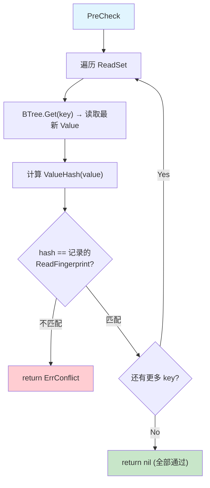

**PreCheck 数据结构**：

```go
// ReadFingerprint 读取时记录的校验指纹
//
// v3.10 评审修订 H3（FNV 碰撞建议）：
// 当前使用 FNV-1a 32-bit hash（碰撞概率 ~1/4B）。Phase 2 作为 PreCheck 快速路径
// 可接受——真正的一致性保护由 Apply 阶段 beginTS 校验完成。但以下场景仍需关注：
// - 高频更新同一 key（每秒 > 1M 次），4B 个不同 Value 后必然碰撞
// - 安全敏感场景要求零碰撞，应改用以下方案之一：
//   (a) FNV-1a 64-bit：碰撞概率降至 ~1/1.8*10^19，几乎不可能碰撞
//   (b) 直接存储 beginTS uint64：零碰撞，但 ReadFingerprint 需额外 8 字节
//   (c) xxHash64：比 FNV 更快且分布更均匀
// 推荐方案 (b)：ReadFingerprint 增加 BeginTS uint64 字段，NewReadFingerprint
// 从完整 MVCC Value 中提取 beginTS 并存储。PreCheck 比对时先比较 BeginTS
//（零碰撞），再比较 ValueHash（快速路径）。这是 Phase 2d 的首选优化。
type ReadFingerprint struct {
    ValueHash uint32 // Value 内容的 FNV-1a hash
}

// Transaction 读集
type ReadSet map[string]ReadFingerprint // key → fingerprint

// NewReadFingerprint 从 Value 构建指纹
// v3.8 评审修订 H5：value 参数必须是完整 MVCC Value（[Flag][beginTS][RealValue]），
// 不含 Flag 过滤。完整 MVCC Value 包含 beginTS（单调递增无碰撞），hash 覆盖 beginTS
// 变更。如果误用 realVal（不含 Flag+beginTS），Delete+Insert 同值场景 PreCheck 无法检测。
// OpInsert 不记录 ReadFingerprint（v3.8 评审修订 H10）：key 不存在于 B+Tree 时无指纹可记，
// 冲突检测完全依赖 commitKey 的 KeyLock + OpInsert 校验（Tombstone 视为 key 不存在，
// Normal 视为冲突）。这是设计预期，PreCheck 不覆盖 OpInsert 场景。
func NewReadFingerprint(value []byte) ReadFingerprint {
    h := fnv.New32a()
    // v3.10 L5：fnv.Hash32.Write 永不返回 error（签名兼容 io.Writer），
    // 忽略返回值是安全的。FNV 内部只做算术运算，无 IO，不可能失败。
    h.Write(value)
    return ReadFingerprint{ValueHash: h.Sum32()}
}
```

**v3.10 评审修订 M2（PreCheck 完整伪代码）**：

```go
// preCheck 校验 ReadSet 中所有 key 的 ValueHash 是否变化
// 遍历 ReadSet，逐 key 读取 B+Tree 当前值并比较指纹
// 返回 nil 表示全部通过，ErrConflict 表示检测到冲突
//
// 性能特征：O(|ReadSet|) 次 B+Tree Get，每次 Get ~1μs
// PreCheck 是快速失败优化——正确性由 Apply 的 KeyLock + beginTS 保证
func (tx *SnapshotTx) preCheck(ctx context.Context) error {
    for keyStr, fp := range tx.readSet {
        // v3.13 评审修订 H-NEW-4（ctx 取消检查点）：
        // 每次循环开头检查 ctx 取消，开销极低（一次 atomic load）。
        // PreCheck 遍历 ReadSet 可能耗时较长（大量 key 场景），允许调用方
        // 通过 ctx 取消中断 PreCheck。Phase 2 不检查 ctx 但透传保持接口一致。
        select {
        case <-ctx.Done():
            return ctx.Err()
        default:
        }
        // 读取 B+Tree 当前值（GetRaw 返回完整 MVCC Value）
        current, err := tx.engine.storage.GetRaw(ctx, []byte(keyStr))
        if err != nil {
            // key 物理不存在（被物理删除或从未存在）
            // 如果 ReadSet 中有此 key 说明之前读到过值 → 冲突
            return fmt.Errorf("precheck: key %s not found in btree: %w", keyStr, ErrConflict)
        }
        // 计算当前值的指纹
        currentFP := NewReadFingerprint(current)
        if currentFP.ValueHash != fp.ValueHash {
            // ValueHash 不匹配 → key 被其他事务修改 → 冲突
            return ErrConflict
        }
    }
    return nil
}
```

**ABA 防护**（评审修订 v3.1）：PreCheck 的 FNV-1a hash 是快速路径，真正的一致性保护由 **Apply 阶段的 beginTS 二次校验**完成。即使 Delete→Insert 导致 Value 恢复原值（hash 匹配但语义已变更），Apply 时会比对 `beginTS`（单调递增，无碰撞），发现版本已被替换，返回 `ErrConflict`。**beginTS 单调递增保证**：即使 FNV-1a hash 碰撞（1/4B 概率），beginTS 不可能改回原值（TSGenerator 只递增），因此 Apply 的 beginTS 校验能可靠检测变更。详见 7.1.1 节 Apply 二次校验伪代码。

> **v3.11 评审修订 C-14（PreCheck TOCTOU 补充）**：PreCheck 通过到 Apply 之间的所有变更都会被 commitKey 的 beginTS 二次校验捕获（beginTS 单调递增不可能改回原值）。PreCheck 失败不意味着数据已被最终修改（可能是中间态后又改回），PreCheck 通过也不意味着数据未被修改（可能是修改后又改回原值）。PreCheck 的价值是尽早发现大多数冲突，减少 Apply 阶段的 KeyLock 开销——不承担正确性保证。

**远期优化（Phase 2d 之后）**：

Phase 2 初期使用完整的 ValueHash PreCheck。远期可优化为：
1. **增量指纹**：只 hash Value 头部（Flag + beginTS），减少计算量
2. **PageVer 快速路径**：先检查 PageVer，未变则跳过逐 Key 检查（纯优化，不影响正确性）
3. **Bloom Filter**：维护页面级"被修改 Key 集合"的 Bloom Filter，快速排除未修改的 Key
4. **FNV 对象池**：`fnv.New32a()` 每次分配对象，可用 `sync.Pool` 或内联 FNV 计算消除分配
5. **VersionStore key 优化**：`sync.Map` + `string(key)` 每次快照读产生 key 字符串分配，可改用 `[]byte` key 或自定义 map 减少 GC 压力

### 7.4 分布式适配

> **来源**：豆包 Round 11 讨论

**核心铁律**：同一个 Key 永远只归属一个分片 Leader。PreCheck 在 Leader 上串行执行，无需全局协调。

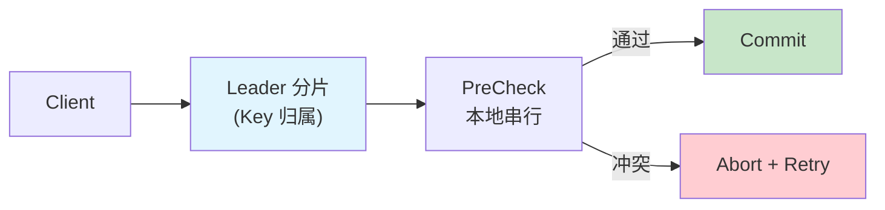

---

## 八、接口设计

### 8.1 分层架构

> **来源**：豆包 Round 13 讨论 — Storage Engine 与 Transaction Engine 分离

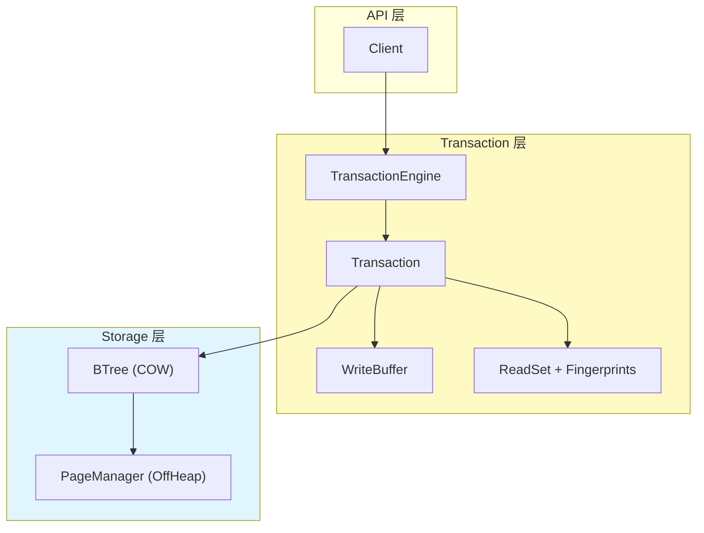

### 8.2 Go 接口定义

> **Package 约定**（评审修订 C5）：所有 MVCC 相关接口和实现放在 `mvcc` package，与现有 `internal/domain/service/` 中的 `service.Transaction` 和 `service.KVStore` 隔离。远期合并到 domain 层时再做统一迁移。

```go
// --- Package: mvcc ---
// 所有接口和实现放在 mvcc package，与 domain/service 层隔离

// --- 时间戳 ---

// TSGenerator 时间戳生成器（可替换实现）
type TSGenerator interface {
    NextTS() uint64
}

// --- 隔离级别 ---

type IsolationLevel uint8

const (
    ReadCommitted    IsolationLevel = iota
    SnapshotIsolation                // 默认
    Serializable                     // 远期
)

// --- 事务 ---

// Tx 单事务会话（使用 Tx 而非 Transaction，避免与 service.Transaction 冲突）
//
// ⚠️ 范围界定（评审修订 v3.1）：
// Phase 2 Tx 接口只支持点查询（Get）的快照隔离，不支持 RangeScan。
// 需要 RangeScan 时请使用 StorageBackend.Scan（ReadCommitted 级别）。
// SI 语义的 Scan 推迟到 Phase 2d 或更远期。
//
// ⚠️ NexKV-SI 隔离级别声明（v3.4 评审修订 H3）：
// 本接口实现的是 NexKV-SI（非标准 SI），具体差异：
// - 读路径走快照读（snapshotTS 固定），符合 SI 语义
// - 写路径（Put/Delete 的内部读取）强制 ReadCommitted（读取最新已提交值）
// - 不防护 Write Skew（写偏序）：两个事务分别读不同 key、写不同 key，约束可能被违反
// - 调用者需自行实现跨 key 约束的乐观锁，或使用显式锁机制
// - 远期 Serializable 级别（SSI）将检测 rw-anti-dependency，本接口预留位置
//
// ⚠️ 并发约束（v3.4 评审修订 M5）：
// Commit 和 Rollback 不得并发调用，也不得与 Get/Put/Delete 并发调用。
// 调用方负责在 defer 中调用 Rollback()：
//
//	tx, _ := engine.BeginTx(ctx, SnapshotIsolation)
//	defer tx.Rollback() // 兜底：即使 Commit 成功后 CAS 守卫防止双重递减
//	// ... 使用 tx ...
//	if err := tx.Commit(ctx); err != nil { return err }
//
// ⚠️ OpInsert Lost Delete 声明（v3.9 评审修订 H4）：
// 事务内 Insert(k, v1) 后 Delete(k)，WriteBuffer 移除该 entry（Insert→Delete = 取消）。
// Commit 时 k 不在 WriteBuffer 中，不写入 B+Tree。但如果另一个事务在 Insert→Delete
// 之间读取了 B+Tree（未看到 Insert，因为 Insert 只写 WriteBuffer），不存在数据不一致。
// **关键约束**：Insert→Delete 消除的是 WriteBuffer 中的条目，B+Tree 未被修改——
// 这与数据库的 savepoint 回滚语义一致，不引入正确性问题。
//
// ⚠️ 跨 key 原子性声明（v3.9 评审修订 H6）：
// Tx.Commit() 不保证跨 key 的 all-or-nothing 原子性。applyWriteBuffer 逐 key 写入
// B+Tree，部分提交期间其他事务可能看到中间状态（详见 Section 十一风险表）。
// 单 key 原子性由 KeyLock + beginTS 校验保证。如需跨 key 原子性，Phase 3 引入
// WAL + 2PC prepare 协议后实现。
type Tx interface {
    // 快照读（按隔离级别路由）
    // 返回值是 deepCopy 后的独立副本，调用方可安全持有
    Get(ctx context.Context, key []byte) ([]byte, error)

    // 写入 WriteBuffer（不落地 BTree）
    // ⚠️ 隐式读取旧值并记录 ReadFingerprint（防 blind write Lost Update）
    Put(key, value []byte) error
    Delete(key []byte) error

    // 提交：PreCheck + Apply（含 Apply 阶段 beginTS 二次校验）
    // v3.4 评审修订 H2：Commit 内部调用 cleanup() 递减 siCount，
    // 无需依赖调用方的 defer Rollback() 来清理事务状态。
    Commit(ctx context.Context) error

    // 回滚：丢弃 WriteBuffer + 调用 cleanup()
    //
    // v3.11 评审修订 H6（best-effort undo 语义声明）：
    // Rollback 语义区分两种场景：
    // (1) 事务尚未 Commit → Rollback 丢弃 WriteBuffer，B+Tree 和 VersionChain 未修改 → 严格 all-or-nothing
    // (2) 事务 Commit 部分成功后调用 rollbackApplied → best-effort undo：
    //     - 最佳：所有 key 回滚成功 → all-or-nothing
    //     - 部分回滚：某些 key 回滚失败（storage.Set 错误）或跳过（commitTS 不匹配）→ 跨 key 不一致
    //     - 此时已回滚的 key 恢复旧值，未回滚的 key 保持新值，调用方应视为不可恢复错误
    // Phase 3 引入 WAL 后将消除 best-effort undo 语义（WAL Redo 保证原子性）
    Rollback() error

    // 快照时间戳
    SnapshotTS() uint64
}

// TxManager 事务管理器（避免与 TransactionEngine struct 同名）
type TxManager interface {
    // 开启事务
    BeginTx(ctx context.Context, level IsolationLevel) (Tx, error)
}
```

> **事务生命周期约束**（v3.4 评审修订 H2）：事务必须显式调用 `Commit()` 或 `Rollback()`，不可遗漏。`Commit()` 和 `Rollback()` 内部均调用 `cleanup()` 递减 `siCount`（CAS 守卫防双重递减），不依赖调用方的 `defer Rollback()` 来清理状态。调用方仍建议在 `defer` 中调用 `Rollback()` 作为兜底。
>
> **v3.10 评审修订 H4（context 行为声明）**：Phase 2 的 `Tx.Get`/`Put`/`Delete`/`Commit` 接受 `context.Context` 参数，但**不检查 context 取消/超时**。传入的 context 仅作为接口预留，当前实现忽略。理由：(1) MVCC 操作均为纯内存操作（B+Tree Get/Set、VersionChain 遍历），耗时通常 < 10μs，context 检查引入的开销（atomic load）不划算；(2) Commit 的 PreCheck + Apply 是多步骤操作，中途 context 取消需要复杂的回滚逻辑（applyWriteBuffer 已有 Undo Buffer，但 context 取消点的选择不明确）。远期优化：Commit 阶段在 PreCheck 和 Apply 之间检查 context，已完成的 Apply 继续提交（best-effort），未开始的 key 跳过。调用方如需超时控制，应使用 `time.AfterFunc` + `tx.Rollback()` 外部取消。
>
> **v3.11 评审修订 C-11（context 透传）**：伪代码中 `storage.GetRaw(context.Background(), key)` 和 `storage.Set(context.Background(), ...)` 统一改为透传调用方的 `ctx` 参数（如 `tx.engine.storage.GetRaw(ctx, key)`）。Phase 2 不检查 ctx 取消，但透传保持接口语义一致——StorageBackend 实现可能在未来检查 ctx。preCheck 的 for 循环中建议添加 `select { case <-ctx.Done(): return ctx.Err(); default: }` 检查点（开销极低，一次 atomic load）。

```go
// NewTxManager 创建事务引擎（构造时绑定 StorageBackend）
// NewTxManager 创建事务引擎（构造时绑定 StorageBackend）
// v3.11 评审修订 C-10：每个进程应只创建一个 TxManager 实例。
// LocalTS 的 atomic.Uint64 counter 在独立实例间各自从 0 开始递增，
// 多实例会导致 beginTS 碰撞。进程重启后 counter 重置（Phase 2 纯内存引擎，
// 重启后所有数据丢失，碰撞无影响）。
func NewTxManager(storage StorageBackend, tsGen TSGenerator) TxManager {
    return &txManager{
        storage:      storage,
        tsGen:        tsGen,
        versionStore: &VersionStore{},
    }
}

// --- 存储引擎 ---

// StorageBackend 裸 KV 存储后端（无事务、无 MVCC）
// 与 service.KVStore 功能重叠，未来统一时再合并
//
// ⚠️ GetRaw 契约（v3.8 评审修订 C1，强化 v3.4 H7）：
// GetRaw 返回 key 的完整 Value（包含 Flag + beginTS + RealValue），
// 即使 key 被标记为 Tombstone 也返回完整 Value，不做 Flag 过滤。
// Flag 过滤由上层（Tx.Get / snapshotGet）负责。
// 只有 key 物理不存在时才返回 ErrKeyNotFound。
//
// ⚠️ 返回值生命周期保证（v3.8 CRITICAL 修复）：
// GetRaw 返回的 []byte 必须是 Go 堆内存独立副本（deepCopy），
// 不可以是 mmap offheap 引用。原因：B+Tree 的 Get 在 return 前
// 执行 defer path.ReleaseAll()，COW 页面替换后 mmap 引用成为悬垂指针。
// 调用方拿到的 raw 在 GetRaw 返回后必须安全可用，不受 COW 影响。
// 实现：GetRaw 在 ReleaseAll 之前对整个 Value 做 deepCopy。
//
// ⚠️ Get（旧接口，Phase 2 实现时废弃）：
// 当前 BTree.Get() 存在两个问题：(1) 过滤 Tombstone 返回 ErrKeyNotFound
// (2) 返回的 realVal 是 mmap 子切片引用，ReleaseAll 后悬垂。
// Phase 2 实现时 BTree.Get 统一迁移为 GetRaw 语义。
type StorageBackend interface {
    // GetRaw 返回完整 MVCC Value 的 Go 堆独立副本（含 Flag + beginTS + RealValue）
    // v3.8 新增：替代 Get，保证返回值不受 mmap COW 生命周期影响
    //
    // CONTRACT (v3.11 评审修订 C-12 强化):
    // 返回的 []byte 必须是 Go 堆内存独立副本（make + copy），不可以是 mmap offheap 引用。
    // 违反此契约导致 COW 页面替换后 use-after-free。
    // 所有 MVCC 路径（commitKey/rollbackOneKey/snapshotGet/preCheck）均依赖此契约。
    // 实现：在 defer path.ReleaseAll() 之前对整个 Value 做 deepCopy 后返回。
    GetRaw(ctx context.Context, key []byte) ([]byte, error)
    Set(ctx context.Context, key, value []byte) error
    Delete(ctx context.Context, key []byte) error
    Scan(start, end []byte) (Iterator, error)
    Close() error
}
```

### 8.3 WriteBuffer 设计

```go
// WriteOp 写操作类型
type WriteOp uint8

const (
    OpInsert WriteOp = iota
    OpUpdate
    OpDelete
)

// WriteEntry WriteBuffer 中的条目
type WriteEntry struct {
    Op         WriteOp
    Value      []byte // 新值（Delete 时为 nil），由调用方提供
    OldValue   []byte // 旧值 deepCopy（用于 Rollback 和版本链构建）
    OldFlag    byte   // 旧版本的 Flag（FlagNormal / FlagTombstone，用于版本链构建）
    OldBeginTS uint64 // 旧版本的 beginTS（用于 Apply 阶段二次校验）
}

// WriteBuffer 事务写入缓冲（⚠️ 非线程安全 — 仅由单个事务独占使用）
// v3.7 声明：WriteBuffer 不做内部同步，所有 Put/Delete/Get 操作必须在
// 持有事务的 goroutine 内串行调用。跨 goroutine 并发访问会导致数据竞争。
type WriteBuffer struct {
    entries map[string]WriteEntry // key → entry
    ordered []string              // 保持写入顺序
}
```

> **关键约束**（评审修订 H4）：`WriteEntry.OldValue` **必须**是 `deepCopy` 后的独立副本。Put/Delete 的隐式 `BTree.Get()` 返回 `[]byte` 引用 mmap 内存，COW 页面替换后会导致悬垂指针。Put/Delete 记录 OldValue 时必须调用 `deepCopy(oldValue)`。

**多次 Put 同一 Key 的 Merge 策略**（评审修订 H1）：

当事务内多次 `Put` 同一 key 时，WriteBuffer 只保留**最后一次** Put 的 entry，但 `OldValue`/`OldBeginTS` 始终保留**第一次** Put 时记录的值。理由：

1. **Commit 只需最终值**：B+Tree 只存最新版本，中间值无需持久化
2. **OldValue 不变**：第一次 Put 的 `OldValue` 是 B+Tree 中的真正旧值，后续 Put 的 "oldValue" 只是前一次 Put 的 WriteBuffer 值
3. **PreCheck 校验基于原始旧值**：ValueHash 指纹记录的是第一次读取时的 B+Tree 值

```
tx.Put("k", "v1")  → entries["k"] = {Op: OpInsert/Update, Value: "v1", OldValue: deepCopy(btreeOld), OldBeginTS: btreeTS}
tx.Put("k", "v2")  → entries["k"] = {Op: same,           Value: "v2", OldValue: unchanged,         OldBeginTS: unchanged}
tx.Put("k", "v3")  → entries["k"] = {Op: same,           Value: "v3", OldValue: unchanged,         OldBeginTS: unchanged}
```

> **deepCopy 双重复制说明**（评审修订 M1）：`Put`/`Delete` 隐式读取 B+Tree 旧值时调用 `deepCopy(oldValue)` 存入 WriteBuffer；`commitKey` 的 `Prepend` 再次接收 `entry.OldValue`（已经是独立副本）。这意味着同一份旧值只被 deepCopy 一次（WriteBuffer 阶段），Prepend 收到的是 WriteBuffer 的引用，无需二次 deepCopy。如果后续实现改为 Prepend 接收 mmap 原始引用，则 Prepend 内部需要 deepCopy。

**WriteBuffer 完整状态机**（v3.4 评审修订 H5）：

```go
// Put 向 WriteBuffer 追加写入操作
// v3.5 评审修订 C1：增加 btreeOldFlag 参数，记录旧版本 Flag 用于版本链构建。
func (wb *WriteBuffer) Put(key string, value []byte, btreeOldValue []byte, btreeOldFlag byte, btreeOldBeginTS uint64) {
    existing, has := wb.entries[key]
    if !has {
        // 首次写入：根据 B+Tree 是否存在决定 Op
        if btreeOldValue == nil {
            wb.entries[key] = WriteEntry{Op: OpInsert, Value: value, OldValue: nil, OldFlag: 0, OldBeginTS: 0}
        } else {
            wb.entries[key] = WriteEntry{Op: OpUpdate, Value: value,
                OldValue: deepCopy(btreeOldValue), OldFlag: btreeOldFlag, OldBeginTS: btreeOldBeginTS}
        }
        wb.ordered = append(wb.ordered, key) // 首次出现时记录顺序
    } else {
        // 后续写入：只更新 Value，保留原始 Op 和 OldValue/OldFlag/OldBeginTS
        existing.Value = value
        // 如果之前是 OpDelete，恢复为 OpUpdate/OpInsert
        if existing.Op == OpDelete {
            if existing.OldValue == nil {
                existing.Op = OpInsert // 原来就是 Insert → Delete，现恢复为 Insert
            } else {
                existing.Op = OpUpdate // 原来是 Update → Delete，现恢复为 Update
            }
        }
        wb.entries[key] = existing
    }
}

// Delete 向 WriteBuffer 追加删除操作
// v3.5 评审修订 C1：增加 btreeOldFlag 参数。
func (wb *WriteBuffer) Delete(key string, btreeOldValue []byte, btreeOldFlag byte, btreeOldBeginTS uint64) error {
    existing, has := wb.entries[key]
    if !has {
        // B+Tree 中不存在 → ErrKeyNotFound
        if btreeOldValue == nil {
            return ErrKeyNotFound
        }
        wb.entries[key] = WriteEntry{Op: OpDelete, Value: nil,
            OldValue: deepCopy(btreeOldValue), OldFlag: btreeOldFlag, OldBeginTS: btreeOldBeginTS}
        wb.ordered = append(wb.ordered, key)
    } else {
        // WB 中已有该 key
        if existing.Op == OpInsert {
            // Insert → Delete = 取消 Insert（从 WB 移除，不落 B+Tree）
            delete(wb.entries, key)
            // ordered 中保留 key（Commit 时遍历跳过已删除 entry）
            return nil
        }
        // Update → Delete 或 Delete → Delete：标记为 OpDelete
        existing.Op = OpDelete
        existing.Value = nil
        wb.entries[key] = existing
    }
    return nil
}
```

**状态转换表**：

| 当前状态 | 操作 | 新状态 | 说明 |
|---------|------|--------|------|
| 空 | Put(key, v) | OpInsert/Update(v) | 首次写入，Op 取决于 B+Tree 是否有此 key |
| OpInsert(v1) | Put(key, v2) | OpInsert(v2) | 更新 Value，Op 和 OldValue 不变 |
| OpInsert(v1) | Delete(key) | **移除 entry** | Insert→Delete 等价于"从未写入" |
| OpUpdate(v1) | Put(key, v2) | OpUpdate(v2) | 更新 Value，OldValue 保留 B+Tree 旧值 |
| OpUpdate(v1) | Delete(key) | OpDelete(nil) | 标记删除，OldValue 保留用于版本链 |
| OpDelete | Put(key, v2) | OpUpdate(v2) | 恢复为 Update，OldValue 保留 |
| OpDelete | Delete(key) | OpDelete(nil) | 幂等，已标记删除 |

> **OldValue/OldFlag/OldBeginTS 不变量**（v3.8 评审修订 H6）：WriteBuffer 中这三个字段在首次写入时设置后**永不变更**——无论后续 Put→Delete→Put 如何转换，始终保留第一次隐式 Get 从 B+Tree 读取的原始旧值。理由：(1) 版本链 Prepend 需要 B+Tree 的**原始旧值**（非中间 WriteBuffer 值），(2) commitKey 的 beginTS 二次校验需要原始 `OldBeginTS`，(3) PreCheck ReadFingerprint 基于原始 `OldValue` 计算。`OpInsert` 的 OldValue=nil/OldFlag=0/OldBeginTS=0 表示 B+Tree 中无此 key，Op 从 Insert 恢复时保持 nil 不变（冲突检测由 commitKey 的 OpInsert 逻辑完成）。

> **ReadFingerprint 记录规则**（v3.4 评审修订 H7）：`OpInsert` **不**记录 ReadFingerprint（key 不存在于 B+Tree，冲突检测完全由 `commitKey` 的 KeyLock 内校验完成）。`OpUpdate`/`OpDelete` **必须**记录 ReadFingerprint，ValueHash 基于 `btreeOldValue` 计算。

---

## 九、与现有架构的集成点

### 9.1 B+Tree COW 与版本链的协同

**重要架构约束**：B+Tree COW **不能**直接提供跨操作的快照隔离。

**⚠️ Phase 2 实现前置阻塞**（v3.5 评审修订 H5，v3.8 修复 C1）：

当前 `BTree.Get()` 存在两个问题：
1. 对 Tombstone 返回 `ErrKeyNotFound`（过滤了 Flag）
2. 返回 mmap 子切片引用，`ReleaseAll` 后成为悬垂指针

MVCC 的 `StorageBackend.GetRaw` 契约要求：
- 返回完整 Value（含 Flag + beginTS + RealValue），不过滤 Tombstone
- 返回 Go 堆独立副本（deepCopy），不受 mmap COW 生命周期影响
- 只有 key 物理不存在时才返回 ErrKeyNotFound

实现方案：新增 `GetRaw` 方法（Section 8.2 接口已定义），在 `ReleaseAll` 之前对整个 Value 做 deepCopy 后返回。所有 MVCC 路径使用 `GetRaw` 替代 `Get`。

NexKV 的 `Get()` 在读取后立即调用 `ReleaseAll()` 释放 PageRef，COW 保护仅在 PageRef 持有期间有效。事务内的多次 Get/Put 之间 PageRef 已释放，因此必须依赖外部版本链。

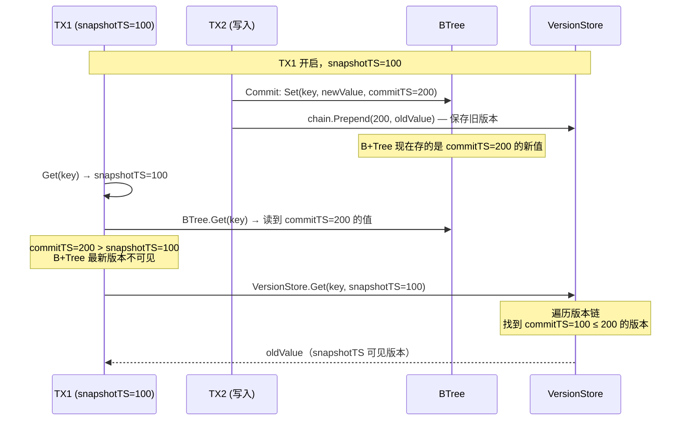

**COW 的实际作用**：COW 保证 B+Tree 内部结构一致性（页分裂/合并不破坏并发读取），但**不负责**多版本可见性。可见性由 VersionChain 提供。

### 9.2 PageAccessor 扩展

Phase 2 需要在 `PageAccessor` 层新增：

```go
// GetMVCCValue 获取带 MVCC 元数据的 Value
func (pa *PageAccessor) GetMVCCValue(pageID uint32, idx int) (flag byte, beginTS uint64, realVal []byte) {
    entry := pa.GetLeafEntry(pageID, idx)
    raw := pa.GetValue(pageID, entry.valOff, entry.valLen)
    return ParseValueWithMVCC(raw)
}
```

### 9.3 LeafEntry 不变

`LeafEntry` 16-byte 结构**完全不变**。所有变更都在 Value 内容层：

| 属性 | Phase 1 | Phase 2 |
|------|---------|---------|
| `keyOff` / `keyLen` | 不变 | 不变 |
| `valOff` | 不变 | 不变 |
| `valLen` | 1 + len(RealValue) | 9 + len(RealValue) |

### 9.4 Size() 语义

Phase 2 的 Size() 保持"逻辑可见 Key 数量"语义。B+Tree 只存最新版本，Size 计算逻辑不变：

```go
// Phase 2 Size() 计算逻辑（与 Phase 1 一致）
func (bt *BTree) Size() int64 {
    // Tombstone 已在 Delete 时 delta=-1
    // B+Tree 只存最新版本，Size 反映当前可见 Key 数量
    return bt.size.Load()
}
```

### 9.5 getCommittedObjects 过滤（借鉴 Lealone）

> **来源**：Lealone `TransactionalValue.java` L347-383

Lealone 在 B+Tree 刷脏页时过滤未提交记录。NexKV Phase 3（持久化）需要类似机制：

```go
// GetCommittedObjects 过滤页面中的未提交记录
func GetCommittedObjects(keys, values [][]byte) ([][]byte, [][]byte) {
    // 遍历每条记录
    // - 无锁或已提交 → 保留 newValue
    // - 有锁且未提交 → 使用 oldValue
    // - 未提交的 Insert (oldValue == nil) → 跳过
}
```

Phase 2 无持久化，此过滤暂不需要。

---

## 十、实施分期与里程碑

### 10.1 Phase 2a：Value 布局扩展 + TSGenerator

**目标**：Value 从 `[1B Flag][RealValue]` 扩展为 `[1B Flag][8B beginTS][RealValue]`。

**改动**：
- `offheap/page_layout.go`：新增 `ParseValueWithMVCC()` / `BuildMVCCValue()` / `MVCCHeaderSize`（9B）常量
- `btree/btree.go`：Set/Delete 写入带 TS 的 Value，Get 解析带 TS 的 Value
- 新增 `mvcc/ts_generator.go`：TSGenerator 接口 + LocalTS 实现

**验证**：
- [ ] 现有 Tombstone 测试全部通过
- [ ] Value 编解码正确（含空 Value、Tombstone 边界）
- [ ] beginTS 在 Set/Commit 时正确写入

### 10.2 Phase 2b：外部版本链 + 快照读（Snapshot Get）

**依赖**：Phase 2a 完成后

**目标**：引入外部版本链 + 事务内 Get 按快照时间戳过滤可见版本。

**改动**：
- 新增 `VersionChain` + `VersionNode` + `VersionStore`（`atomic.Pointer` 无锁实现）
- 新增 `Transaction` 接口 + `SnapshotTx` 实现
- `BeginTx()` 分配 `snapshotTS`，递增 `siCount`
- `Get()` 先查 WriteBuffer，再走快照读路径（B+Tree + VersionChain）
- `Commit()` 时构建版本链（仅在 siCount > 0 时）

**验证**：
- [ ] 快照读看到事务开启时的数据视图
- [ ] 快照读不受并发写入影响
- [ ] Tombstone 版本在快照中正确过滤
- [ ] Read-Your-Own-Writes：Put 后 Get 能看到自己的写入
- [ ] siCount 零开销：无 SI 事务时不构建版本链

### 10.3 Phase 2c：WriteBuffer + Per-Key PreCheck

**依赖**：Phase 2b 完成后

**目标**：Put/Delete 写入 WriteBuffer，Commit 前 Per-Key ValueHash PreCheck 冲突。

**改动**：
- 新增 `WriteBuffer` 数据结构
- 新增 `ReadSet` / `ReadFingerprint`（ValueHash）
- `Commit()` 实现 PreCheck → Apply 流程

**验证**：
- [ ] 并发事务写冲突正确检测（Abort + Retry）
- [ ] WriteBuffer 的 Insert/Update/Delete 语义正确
- [ ] PreCheck 防止 Lost Update 异常
- [ ] 同页不同 Key 事务不产生假阳性冲突

### 10.4 Phase 2d：提交协议 + Rollback + 集成测试

**依赖**：Phase 2c 完成后

**目标**：完整的 Commit/Rollback 流程 + 并发集成测试。

**改动**：
- `Commit()` Apply WriteBuffer 到 BTree + 构建版本链
- `Rollback()` 清理 WriteBuffer + 递减 siCount
- `commitTimestamp` 分配（预留 WAL sync 扩展点）
- 并发事务集成测试

**验证**：
- [ ] Commit 后数据对其他事务可见
- [ ] Rollback 后数据不改变
- [ ] 并发 Commit + Snapshot Get 一致性
- [ ] SI 隔离级别：无脏读、无不可重复读
- [ ] Per-Key ValueHash PreCheck 正确检测冲突
- [ ] Write-Write 冲突：并发写同一 Key 正确 Abort

---

## 十一、风险与缓解

| 风险 | 等级 | 缓解措施 |
|------|------|---------|
| Value 头部从 1B 增加到 9B，页填充率下降 | 中 | Tombstone Phase 1 已证明 OverwriteLeafValue 快路径可用；9B 开销在 4KB 页面中占比 < 0.25%；⚠️ 注意：Phase 2 Tombstone 最小值 = 9B（`[0x01][8B beginTS]`），如果原始 Value < 9B 则 OverwriteLeafValue 快路径不可用，需走 Delete+Insert 重整页面 |
| 外部版本链（Go 堆内存）增加 GC 压力 | 中 | Phase 2 初期始终构建版本链；Phase 2d 引入 siCount 零开销优化；无锁 atomic.Pointer 避免锁竞争；远期迁移到 Off-Heap；**v3.9 补充**：无 GC 下版本链无限增长，实现时必须遵守 Section 5.6 运行时约束（内存监控 + 长事务防护 + 链长统计） |
| PreCheck ValueHash 碰撞导致假阴性（漏检冲突） | 低 | FNV-1a 32-bit hash，碰撞概率约 1/4B；结合 Apply 时 beginTS 校验双重保护；**v3.10 H3**：远期推荐改为直接存储 beginTS（零碰撞）或 FNV-1a 64-bit |
| Size() 语义变更导致回归 | 低 | Phase 2 初期 Size 计算逻辑不变，多版本 Size 留到远期 |
| commitTimestamp 时序约束在 Phase 3 WAL 引入时需调整 | 低 | Commit 接口预留 WAL sync 回调扩展点 |
| 快照读性能（遍历版本链） | 低 | 大部分场景链长 ≤ 3（短事务）；siCount 优化避免无 SI 事务时的开销 |
| siCount 竞态窗口（BeginTx 递增 vs Commit 检查之间） | 低 | Phase 2 初期始终构建版本链（不启用 siCount），消除此竞态；siCount 优化推迟到 Phase 2d 性能调优阶段 |
| **部分提交脏读窗口**（v3.5 新增，v3.6/v3.7/v3.8 补充，v3.11 SI-02 修正） | 中 | applyWriteBuffer 逐 key 写入 B+Tree 期间，已写入但尚未完成所有 key 的中间状态对其他事务可见（脏读）。**跨 key 场景**：TX 写入 A+B，A 已 Apply 但 B 尚未完成时，SI 事务 `Get(A)` 看到新值但 `Get(B)` 看到旧值——跨 key 快照不一致。**VersionChain 中间态 Set-before-Prepend 窗口**（v3.11 修正描述）：commitKey Set 完成但 Prepend 尚未完成时，snapshotGet 看到 B+Tree 新 beginTS 不可见 → 查版本链。此时分两种情况：(a) **链不存在**（OpInsert 首次写入时链尚未创建）→ spin retry 等待链出现，100 次退避后仍不存在则返回 ErrKeyNotFound；(b) **链已存在**（之前有版本）→ 不触发 spin retry，直接遍历已有链，返回 commitTS ≤ snapshotTS 的**上一个已提交版本**。情况 (b) 是正确的 SI 行为——snapshotTS 之前的某个已提交版本始终可达（append-only 旧节点不删除），SI 语义允许返回快照时间之前的任何已提交版本。**并非"丢失历史版本"，而是返回稍旧的正确版本**。选择 Set-before-Prepend 的理由：Prepend-before-Set 会产生幽灵节点（链中有版本但 B+Tree 无对应值），幽灵节点比返回稍旧版本更难清理。**rollback 中间态**：rollbackApplied 回滚期间跨 key 短暂不一致（best-effort undo）。**Phase 2 原子性声明**：NexKV-SI 的 Commit 原子性粒度为**单 key**（KeyLock + beginTS 保证同 key 严格串行化），跨 key 不保证 all-or-nothing（Undo Buffer 是 best-effort）。Phase 3 引入 WAL + 2PC prepare 消除此窗口 |

---

## 附录 A：设计决策溯源

| 决策 | 来源 | 关键论点 |
|------|------|---------|
| 128-bit HLC（非 64-bit） | 豆包 Round 8 | 8-bit 逻辑位溢出风险，生产必须宽位 |
| HLC 只管可见性 | 豆包 Round 4-5 | HLC 是因果偏序，不是全序；HLC+NodeID 是人工伪全序 |
| Per-Key ValueHash PreCheck | 豆包 Round 12 + 架构评审 | PageVer 级别假阳性率高；per-Key hash 精确检测冲突 |
| 外部版本链（非 B+Tree 内联） | 架构评审 | COW 保护不跨操作持续（Get 后 ReleaseAll），必须独立版本存储 |
| atomic.Pointer 无锁版本链 | 架构评审 | append-only 链表天然无锁，CAS+retry 防并发丢版本 |
| Storage/Tx 接口分离 | 豆包 Round 13 | 解耦存储和事务，各自可替换 |
| 默认 SI 隔离 | 豆包 Round 14 | 快照读 + 版本链天然适配 SI |
| commitTimestamp 后分配 | Lealone 分析 | 必须在 WAL sync 后分配，保证崩溃恢复正确性 |
| siCount 零开销 | Lealone 分析 | 无 SI 事务时版本链完全不构建；Phase 2 初期始终构建，Phase 2d 启用优化 |
| 写路径强制 RC | Lealone 分析 | 避免基于过时数据的写入（写偏序）；标注为 SI 工程简化 |
| Read-Your-Own-Writes | 架构评审 | Get 必须先查 WriteBuffer，保证事务内一致性 |
| deepCopy 防悬垂指针 | 架构评审 | B+Tree Get 返回 mmap 引用，COW 页面回收后必须独立副本 |
| Put/Delete 隐式 Get 记录指纹 | 架构评审 | 防止 blind write 导致 Lost Update，PreCheck 必须覆盖 WriteSet |
| snapshotGet 先 B+Tree 后版本链（v3.1） | 架构评审 | 消除 chains.Load 与 B+Tree.Get 之间的 TOCTOU 竞态窗口 |
| Apply 阶段 beginTS 二次校验（v3.1） | 架构评审 | 防止 PreCheck 与 Apply 之间的 TOCTOU；比对 beginTS（单调递增无碰撞）而非 hash |
| Phase 2 SI = 点查询 SI（v3.1） | 架构评审 | RangeScan 不在 SI 保障范围内，B+Tree 迭代器跨页面 COW 保护失效；需 SI Scan 推迟到 Phase 2d |
| per-key CAS 乐观锁串行化 Apply（v3.2） | 无锁/SI 专项评审 | applyWriteBuffer 的 Get+Prepend+Set 三步 check-then-act 非原子，per-key commitSeq CAS 抢占提交槽位，纯 atomic 无 mutex |
| Undo Buffer 原子性回滚（v3.2） | 无锁/SI 专项评审 | Commit 部分提交破坏 all-or-nothing 语义，Undo Buffer 逆序恢复已写入 B+Tree 的值 |
| commitKey 封装 + spin retry（v3.2） | 无锁/SI 专项评审 | Prepend-before-Set 顺序必须在 mutex 内强制保证；snapshotGet spin retry 覆盖 chains.Store 可见窗口 |
| cleanup 防双重递减（v3.2） | 无锁/SI 专项评审 | Commit 后 defer Rollback 可能 double decrement siCount，CAS 守卫防止 |
| per-key KeyLock 替代 commitSeq CAS（v3.3） | 三 Agent 联合评审 | commitSeq CAS 只串行化序号递增不锁临界区，并发 TX 可先后 CAS 成功后并发执行 Prepend+Set 导致 Lost Update；改用 atomic.Bool 自旋锁严格串行化 Get→校验→Prepend→Set |
| OpInsert 区分 Tombstone（v3.3） | 三 Agent 联合评审 | Undo 后 B+Tree 可能残留 Tombstone，Insert 校验需区分 Tombstone（视为 key 不存在，Insert 可继续）和 Normal（视为冲突）；修复 v3.2 误判 |
| rollbackApplied 走 KeyLock（v3.3） | 三 Agent 联合评审 | 回滚的 Set/Delete 可能覆盖并发 commitKey 已提交的值；回滚也获取 per-key KeyLock 串行化 |
| VersionChain.Prepend retry cap（v3.3） | 三 Agent 联合评审 | 无限 CAS retry 可能活锁；cap 128 次 + yield 防热点 key CPU 空转 |
| Undo 使用 Delete 而非 beginTS=0 Tombstone（v3.3） | 三 Agent 联合评审 | `OldRawVal==nil` 时调用 `storage.Delete`（标准 Tombstone），避免 `beginTS=0` 特殊 Tombstone 污染可见性判断 |
| rollbackApplied commitTS 校验（v3.4） | 四轮三 Agent 联合评审 | 回滚前校验 B+Tree 当前 beginTS 是否等于 UndoEntry.CommitTS，只恢复自己写入的版本，不覆盖并发事务已提交的值 |
| Prepend 返回值检查（v3.4） | 四轮三 Agent 联合评审 | commitKey 必须检查 Prepend error，CAS retry 耗尽时阻止后续操作 |
| Set-before-Prepend 顺序（v3.4） | 四轮三 Agent 联合评审 | 调换为先 Set B+Tree 后 Prepend 版本链，消除 Prepend 成功但 Set 失败的幽灵节点问题 |
| 流程图与伪代码对齐（v3.4） | 四轮三 Agent 联合评审 | Section 4.1 流程图 B+Tree 版本不可见时必须查 VersionChain，不能直接返回 ErrKeyNotFound |
| applyWriteBuffer key 全局排序（v3.4） | 四轮三 Agent 联合评审 | sort.Strings(keys) 确保所有事务以字典序获取 KeyLock，消除交叉获取导致的死锁 |
| snapshotGet deepCopy（v3.4） | 四轮三 Agent 联合评审 | B+Tree 路径返回 deepCopy(realVal)，防止调用方持有过期 mmap 引用；循环外一次性 string(key) 转换 |
| WriteBuffer 完整状态机（v3.4） | 四轮三 Agent 联合评审 | 定义 Put→Delete→Put、Insert→Delete 等所有组合的 merge 策略和状态转换表 |
| NexKV-SI 声明 + Write Skew（v3.4） | 四轮三 Agent 联合评审 | 在 Tx 接口注释中明确声明 NexKV-SI 不防护 Write Skew，调用者需自行实现跨 key 约束乐观锁 |
| StorageBackend.Get Tombstone 契约（v3.4） | 四轮三 Agent 联合评审 | Get 返回完整 Value（含 Tombstone），Flag 过滤由上层负责；只有物理不存在才返回 ErrKeyNotFound |
| Commit 内调用 cleanup（v3.4） | 四轮三 Agent 联合评审 | Commit/Rollback 均调用 cleanup() 递减 siCount，不依赖调用方 defer Rollback |
| ParseValueWithMVCC 开发 panic（v3.4） | 四轮三 Agent 联合评审 | 开发阶段短 Value 触发 panic 强制暴露格式错误，替代静默降级返回 beginTS=0 |
| WriteEntry.OldFlag 字段（v3.5） | 五轮三 Agent 联合评审 | commitKey 引用 entry.OldFlag 但 WriteEntry 未定义该字段；添加 OldFlag byte 并在 Put/Delete 时记录旧版本 Flag |
| 部分提交脏读窗口声明（v3.5） | 五轮三 Agent 联合评审 | applyWriteBuffer 逐 key 写入 B+Tree 期间存在短暂脏读窗口；NexKV-SI Commit 原子性是 best-effort undo，非严格 all-or-nothing |
| happens-before 断言修正（v3.5） | 五轮三 Agent 联合评审 | Set-before-Prepend 顺序下"Reader 看到 Set 不代表 Prepend 已可见"——跨 goroutine 可见性必须通过同步操作建立，spin retry 覆盖此窗口 |
| Prepend 失败极端降级标注（v3.5） | 五轮三 Agent 联合评审 | KeyLock 内 CAS 理论上不会失败，此路径仅在实现 bug 时触发；降级语义：丢失一个历史版本，违反快照隔离但可诊断 |
| PreCheck 角色定位澄清（v3.5） | 五轮三 Agent 联合评审 | PreCheck 是快速失败优化（写-写冲突 early detection），不是正确性保证；正确性由 Apply 的 KeyLock + beginTS 保证 |
| BTree.Get Tombstone 过滤阻塞（v3.5） | 五轮三 Agent 联合评审 | 当前 BTree.Get 过滤 Tombstone 返回 ErrKeyNotFound，但 MVCC StorageBackend.Get 要求不过滤；实现前置阻塞，需新增 GetRaw 或修改 Get |
| 锁层次分析（v3.5） | 五轮三 Agent 联合评审 | sync.Map mutex → KeyLock → atomic CAS 三层获取顺序，所有路径遵循此序；KeyLock 持有期间不调用 sync.Map.Delete |
| SI 语义前提条件（v3.5） | 五轮三 Agent 联合评审 | NexKV-SI 依赖本地单调递增 TS（单机全序）；分布式 HLC 因果偏序不等于全序，快照一致性将退化 |
| Write Skew 示例 + 锁 key 推荐（v3.5） | 五轮三 Agent 联合评审 | 补充账户余额 Write Skew 示例，推荐使用独立锁 key（lock:constraint_name）实现跨 key 约束乐观锁 |
| SI/RC 操作隔离级别清单（v3.5） | 五轮三 Agent 联合评审 | 汇总 Tx.Get(SI)、Put 内部读(RC)、Scan(RC) 等所有操作的隔离级别，方便使用者查阅 |
| mmap deepCopy 描述修正（v3.5） | 五轮三 Agent 联合评审 | leafPageHandle.GetValue 已做 copy 返回 Go 堆副本，deepCopy 是防御性编程而非必需；保留以应对未来零拷贝优化 |
| commitKey Prepend 失败返回 UndoEntry（v3.6） | 六轮三 Agent 联合评审 | Set 成功 + Prepend 失败时仍返回 UndoEntry，保证 applyWriteBuffer 能回滚 B+Tree Set；否则 B+Tree 永久残留孤儿值（CRITICAL 修复） |
| Section 4.1 流程图 OpDelete 分支（v3.6） | 六轮三 Agent 联合评审 | WriteBuffer 命中后检查 Op==OpDelete → 返回 ErrKeyNotFound；修复遗漏的删除条目分支（HIGH 修复） |
| rollbackApplied Get 失败保守跳过（v3.6） | 六轮三 Agent 联合评审 | storage.Get 返回 error 时保守跳过回滚（无法确认当前值版本），与 commitTS 不匹配策略一致（HIGH 修复） |
| spin retry 必要性修正（v3.6） | 六轮三 Agent 联合评审 | 移除"理论上不必要"描述，spin retry 是必需的——B+Tree Set 与 chains.LoadOrStore 跨 goroutine 可见性需要 retry 建立同步窗口 |
| applyWriteBuffer 跳过已删除 entry（v3.6） | 六轮三 Agent 联合评审 | Insert→Delete 从 entries map 移除但 ordered 列表保留 key，遍历时检查 exists 跳过 |
| 锁层次多 KeyLock 排序 + 代码一致性（v3.6） | 六轮三 Agent 联合评审 | 补充层次 1 内部按字典序获取多 KeyLock；修正 chains.LoadOrStore 在 KeyLock 内的锁层次描述（sync.Map 分片锁纳秒级持有） |
| 脏读窗口跨 key 快照不一致（v3.6） | 六轮三 Agent 联合评审 | 补充 TX 写入 A+B 时 A 已 Apply 但 B 未完成导致 SI 事务看到跨 key 不一致视图的场景 |
| Insert 版本链语义（v3.6） | 六轮三 Agent 联合评审 | OpInsert 构建 value=nil 节点标识首次出现；保证后续 Update 时链非空，避免 snapshotTS 介于 Insert/Update 之间的可见性空档 |
| SnapshotTx.Put/Delete 完整伪代码（v3.6） | 六轮三 Agent 联合评审 | 补充 Put 和 Delete 的完整实现伪代码（隐式 Get + ReadFingerprint + WriteBuffer 写入） |
| Insert 版本链存储实际 value（v3.7） | 七轮三 Agent 联合评审 | v3.6 的 value=nil 语义矛盾（commitTS ≤ snapshotTS 应为可见而非不可见）；Insert 构建与 Update 一致的版本链节点（存储 value + FlagNormal），消除 Insert→Update 间可见性空档（CRITICAL 修复） |
| Prepend 每次 retry 创建新 newNode（v3.7） | 七轮三 Agent 联合评审 | CAS 循环外复用单个 newNode 会导致 next 字段反复非 atomic 写入，破坏 Reader 不可变遍历保证；改为每次 retry 创建新节点（CRITICAL 修复） |
| snapshotGet bestNode 全链遍历（v3.7） | 七轮三 Agent 联合评审 | 并发 CAS retry 导致链物理顺序不保证 commitTS 递减；必须遍历整条链找到 commitTS 最大的可见节点（bestNode），不能在第一个 commitTS ≤ snapshotTS 时提前终止（CRITICAL 修复） |
| Put raw 变量 scope 提升（v3.7） | 七轮三 Agent 联合评审 | `if raw, err := ...` 将 raw 限制在 if 块内，后续 ReadFingerprint 判断引用未定义变量；提升为函数级 `var raw []byte`（CRITICAL 修复） |
| Delete 先查 WriteBuffer（v3.7） | 七轮三 Agent 联合评审 | `Put(k,v); Delete(k)` 场景下 Delete 直接读 B+Tree 可能读到 Tombstone 并返回 ErrKeyNotFound；先查 WB 实现 Read-Your-Own-Writes（CRITICAL 修复） |
| Write Skew 锁 key 完整使用模式（v3.7） | 七轮三 Agent 联合评审 | 补充锁 key 的 6 步完整使用模式（Get 锁 key → 读业务 key → 约束校验 → Put 锁 key → 写业务 key → Commit），使调用方可直接参考 |
| 脏读窗口 VersionChain/rollback 中间态（v3.7） | 七轮三 Agent 联合评审 | 补充 Set 完成 + Prepend 未完成时快照读丢失一个历史版本（短暂 SI 违反）；rollback 期间跨 key 短暂不一致（best-effort undo 语义） |
| WriteBuffer 非线程安全声明（v3.7） | 七轮三 Agent 联合评审 | WriteBuffer 不做内部同步，所有操作必须在事务持有 goroutine 内串行调用；跨 goroutine 并发访问导致数据竞争 |
| 链物理顺序不保证声明（v3.7） | 七轮三 Agent 联合评审 | VersionChain 的 head→next 物理顺序不保证 commitTS 递减（并发 CAS retry 可能打乱）；快照读必须遍历整链选 bestNode；ABA 防护在 Phase 3 GC 后失效 |
| storage.Get→GetRaw 全量迁移（v3.8） | 八轮三 Agent 联合评审 | 所有 MVCC 路径的 storage.Get 替换为 GetRaw（返回 Go 堆独立副本），消除 mmap COW 悬垂引用风险；新增 StorageBackend.GetRaw 接口 + 完整契约声明（CRITICAL 修复） |
| Set-before-Prepend 安全论证（v3.8） | 八轮三 Agent 联合评审 | Prepend 所需数据（OldValue/OldFlag）已在 Step 1 GetRaw 获取（Go 堆独立副本），Set 的 COW 不影响 Prepend 数据；声明 Phase 2 原子性粒度为单 key（CRITICAL 修复） |
| Undo Tombstone 替代物理删除（v3.8） | 八轮三 Agent 联合评审 | OldRawVal==nil 时写入 Tombstone 而非 storage.Delete 物理删除；物理删除破坏版本链可达性——key 消失后 snapshotGet 不再查版本链（CRITICAL 修复） |
| KeyLock 三级退避（v3.8） | 八轮三 Agent 联合评审 | 纯 runtime.Gosched 热点 key CPU 空转无公平性；改为 ≤4 次自旋、5-16 次 μs sleep、16+ 次 10μs sleep（HIGH 修复） |
| spin retry 时序窗口修正（v3.8） | 八轮三 Agent 联合评审 | Go 1.19+ atomic 顺序一致性保证内存可见性；spin retry 真正原因是调度层面的时序窗口（Set 完成→chains.LoadOrStore 尚未执行），非内存序问题（HIGH 修复） |
| Prepend CAS 不变量断言（v3.8） | 八轮三 Agent 联合评审 | KeyLock 内 CAS 理论上不失败（单 goroutine 操作 head）；失败说明代码路径绕过 KeyLock，为严重 bug；建议 i>0 时记录警告日志（HIGH 修复） |
| TS 溢出 panic（v3.8） | 八轮三 Agent 联合评审 | uint64 溢出回绕到 0 后所有 ≤比较失效；检测 ts==0 并 panic（~585,000 年才触发，但正确性论证需完整）（HIGH 修复） |
| PreCheck hash 参数范围 + OpInsert 排除（v3.8） | 八轮三 Agent 联合评审 | NewReadFingerprint 参数必须是完整 MVCC Value（含 Flag+beginTS），不含 Flag 过滤；OpInsert 不记录指纹——冲突检测由 commitKey KeyLock 内完成（HIGH 修复） |
| WriteBuffer OldValue 不变量（v3.8） | 八轮三 Agent 联合评审 | OldValue/OldFlag/OldBeginTS 首次设置后永不变更（Put→Delete→Put 保留原始值）；版本链 Prepend + commitTS 校验 + PreCheck 均依赖原始旧值（HIGH 修复） |
| bestNode 防御性策略声明（v3.8） | 八轮三 Agent 联合评审 | KeyLock 正常路径保证物理顺序递减，bestNode 全链遍历是防御性编程：Prepend 移到 KeyLock 外时 CAS 打乱顺序；性能影响极小（链长 ≤ 3）（HIGH 修复） |
| Insert 版本链语义澄清（v3.8） | 八轮三 Agent 联合评审 | Insert 节点含义是"commitTS 时刻 key 的值是 node.value"，与 Update 节点完全一致；next==nil 仅标识链末端，不承载"首次出现"语义（HIGH 修复） |
| siCount Update/Delete Prepend 强制（v3.8） | 八轮三 Agent 联合评审 | siCount=0 时仅跳过 OpInsert 版本链；Update/Delete Prepend 始终执行——修改已存在 key 可能破坏后续 SI 事务快照可见性（HIGH 修复） |
| rollbackApplied KeyLock 延迟声明（v3.8） | 八轮三 Agent 联合评审 | 回滚逐 key 获取 KeyLock，高并发下可能与 commitKey 竞争引入毫秒延迟；best-effort undo 固有代价，Phase 3 WAL 消除（HIGH 修复） |
| rollbackApplied VersionChain head CAS 回退（v3.9） | 九轮三 Agent 联合评审 | 只回滚 B+Tree 不回滚 VersionChain 导致幽灵节点——快照读命中已回滚事务旧值；UndoEntry 记录 PrePrependHead，rollbackApplied CAS 回退链头（CRITICAL 修复） |
| siCount OpInsert 版本丢失残余风险（v3.9） | 九轮三 Agent 联合评审 | siCount=0 跳过 OpInsert 版本链构建导致后续 SI 事务看不到 Insert 版本；推荐策略：siCount 优化仅减少 GC 频率而非跳过构建（CRITICAL 修复） |
| 版本链无限增长运行时约束（v3.9） | 九轮三 Agent 联合评审 | Phase 2 无 GC，版本链只增不减；实现时必须暴露监控指标 + 长事务防护 + 链长统计（MEDIUM 修复） |
| beginTS/commitTS 等价性证明（v3.9） | 九轮三 Agent 联合评审 | 同一次 Commit 在 KeyLock 内使用同一 ts 变量，beginTS≡commitTS；快照读两个公式语义一致（MEDIUM 修复） |
| Prepend CAS fail-fast 警告（v3.9） | 九轮三 Agent 联合评审 | KeyLock 内 CAS 不应失败，i>0 记录警告日志辅助定位绕过 KeyLock 的代码路径（HIGH 修复） |
| snapshotGet spin retry 退避策略（v3.9） | 九轮三 Agent 联合评审 | 纯 runtime.Gosched 高并发 CPU 空转；建议实现三级退避（≤4 Gosched / ≤8 μs sleep / >8 10μs sleep）（HIGH 修复） |
| OpInsert Lost Delete 声明（v3.9） | 九轮三 Agent 联合评审 | Insert→Delete 消除 WB 条目，B+Tree 未修改，与 savepoint 回滚语义一致；不引入正确性问题（HIGH 修复） |
| PreCheck 只读 key 保守检测声明（v3.9） | 九轮三 Agent 联合评审 | 只读 key 的 ReadFingerprint 校验失败时 ErrConflict 是保守检测；标准 SI 允许只读 key 被修改（HIGH 修复） |
| 跨 key 原子性声明（v3.9） | 九轮三 Agent 联合评审 | Tx.Commit 不保证跨 key all-or-nothing；单 key 由 KeyLock 保证；Phase 3 WAL+2PC 消除（HIGH 修复） |
| 写路径 RC 反例（v3.9） | 九轮三 Agent 联合评审 | Put 内部读最新值而非快照值，业务逻辑基于快照值决策但写入基于最新值可能导致不一致；调用方应显式 Get 快照值（HIGH 修复） |
| rollbackApplied defer 循环语义（v3.9） | 九轮三 Agent 联合评审 | Go for 循环内 defer 延迟到函数返回而非迭代结束；多 key 回滚时 KeyLock 累积持有；生产应改为子函数 defer（MEDIUM 修复） |
| commitKey panic 安全（v3.9） | 九轮三 Agent 联合评审 | ParseValueWithMVCC 开发阶段 panic 在 KeyLock 内执行导致永久死锁；生产应改为 error 返回（MEDIUM 修复） |
| deepCopy 位置声明（v3.9） | 九轮三 Agent 联合评审 | deepCopy 放在 mvcc 包级别（mvcc/util.go），不放入 offheap 基础设施层（MEDIUM 修复） |
| rollbackApplied→rollbackOneKey 子函数（v3.10） | 十轮三 Agent 联合评审 | for 循环内 defer kl.Unlock() 累积持有多个 KeyLock，阻塞并发 commitKey；提取为 per-key 子函数，defer 在子函数返回时立即释放（CRITICAL 修复） |
| snapshotGet spin retry maxRetries 提升（v3.10） | 十轮三 Agent 联合评审 | maxRetries=10 无法覆盖 GC STW（100μs-1ms）；提升到 100 + 三级退避实现（4×Gosched + 4×μs + 92×10μs ≈ 1ms）（CRITICAL 修复） |
| KeyLock happens-before 前置条件（v3.10） | 十轮三 Agent 联合评审 | KeyLock atomic.Bool 不自动提供内核级 happens-before；正确性依赖 StorageBackend 内部同步原语（COW atomic.StorePointer）和 VersionChain atomic.Pointer（CRITICAL 修复） |
| Undo Tombstone beginTS 语义声明（v3.10） | 十轮三 Agent 联合评审 | rollbackOneKey 写入 Tombstone 的 beginTS = 回滚事务 commitTS，作为"写入已回滚"标记；OpInsert 视 Tombstone 为 key 不存在（HIGH 修复） |
| OpInsert Tombstone beginTS 校验声明（v3.10） | 十轮三 Agent 联合评审 | OpInsert 看到 Tombstone 不校验 beginTS——设计意图：无论 rollback 标记还是正常 Delete，都视为 key 不存在；KeyLock 保证读到确定性值（HIGH 修复） |
| FNV-1a 碰撞建议（v3.10） | 十轮三 Agent 联合评审 | 32-bit hash 碰撞 ~1/4B；推荐远期改为直接存储 beginTS（零碰撞）或 FNV-1a 64-bit；Phase 2d 首选方案：ReadFingerprint 增加 BeginTS uint64（HIGH 修复） |
| context 行为声明（v3.10） | 十轮三 Agent 联合评审 | Phase 2 不检查 context 取消/超时；纯内存操作 < 10μs，context 检查开销不值得；调用方用外部 time.AfterFunc + Rollback 超时控制（HIGH 修复） |
| WriteBuffer.Put Tombstone 元数据声明（v3.10） | 十轮三 Agent 联合评审 | Tombstone 时 btreeOldValue=nil → WriteBuffer 设 OpInsert（OldFlag=0/OldBeginTS=0），丢弃 btreeOldFlag/btreeOldBeginTS；commitKey OpInsert 分支不使用这些字段，丢弃安全（HIGH 修复） |
| 幽灵节点残留声明（v3.10） | 十轮三 Agent 联合评审 | rollbackOneKey CAS 回退只处理 head==本事务节点；head 已被后续事务更新时，本事务 Prepend 节点仍为中间节点，不影响快照读正确性，Phase 3 GC 清理（HIGH 修复） |
| KeyLock.Unlock CAS double-unlock 检测（v3.10） | 十轮三 Agent 联合评审 | Store(false) 无法检测 double unlock；改为 CAS(true,false)，返回 false 时记录警告但不 panic（HIGH 修复） |
| VersionChain head=nil 空链安全性（v3.10） | 十轮三 Agent 联合评审 | chains.Load 返回非 nil 但 head=nil 时遍历返回 bestNode=nil → ErrKeyNotFound；链刚创建但 Prepend 未完成，key 在 snapshotTS 后被 Insert 无历史版本，正确（HIGH 修复） |
| beginTS/commitTS 等价性 rollback 前提（v3.10） | 十轮三 Agent 联合评审 | 等价性仅适用于成功 Commit；Rollback 写入 Tombstone(beginTS=commitTS) 但链中不存在对应节点，快照读不命中回滚值；rollback 不破坏等价性（MEDIUM 修复） |
| PreCheck 完整伪代码（v3.10） | 十轮三 Agent 联合评审 | 补充 preCheck() 完整实现：遍历 ReadSet → GetRaw → NewReadFingerprint → ValueHash 比较；O(|ReadSet|) 次 B+Tree Get（MEDIUM 修复） |
| siCount 矛盾声明（v3.10） | 十轮三 Agent 联合评审 | siCount 字段存在但 Phase 2a-2c 不调用 shouldBuildVersionChain()；保留基础设施避免 Phase 2d 重新引入，commitKey 始终构建版本链（MEDIUM 修复） |
| TS overflow panic 事务安全（v3.10） | 十轮三 Agent 联合评审 | NextTS panic 在 commitCS 分配时，WriteBuffer 未 Apply → 无需回滚；生产应改为返回 error + rollbackApplied 回滚已写入 key（MEDIUM 修复） |
| Prepend maxRetries 128→16（v3.10） | 十轮三 Agent 联合评审 | KeyLock 内 CAS i==0 即成功，128 过于宽松掩盖 bug；16 次足够覆盖极端调度延迟，超过阈值尽早暴露（MEDIUM 修复） |
| OpInsert deepCopy 策略声明（v3.10） | 十轮三 Agent 联合评审 | entry.Value 是调用方参数非 mmap 引用，理论上无需 deepCopy；保留作为防御性编程，与 OldValue 策略一致（MEDIUM 修复） |
| VersionChain generation ABA 防护预留（v3.11） | 十一轮三 Agent 联合评审 | Phase 2 append-only 保证 ABA 不会发生，但 Phase 3 GC 回收旧节点后 CAS 可能命中复用指针；增加 generation atomic.Uint64 字段，每次 Prepend 递增，Phase 3 纳入 CAS 比较条件（CRITICAL 预防） |
| 锁 key 使用约束声明（v3.11） | 十一轮三 Agent 联合评审 | Write Skew 锁 key 方案要求同一业务约束的所有并发事务使用同一个锁 key；FNV 碰撞→Apply beginTS 兜底→beginTS 单调递增不可回绕，ABA 可靠检测（HIGH 修复） |
| Set-before-Prepend 窗口精确描述（v3.11） | 十一轮三 Agent 联合评审 | 区分链不存在（spin retry 等待链创建）和链已存在（直接遍历返回上一个已提交版本）两种情况；后者是正确 SI 行为，非"丢失历史版本"（HIGH 修复） |
| sync.Map 操作约束（v3.11） | 十一轮三 Agent 联合评审 | KeyLock 持有期间对 chains sync.Map 操作仅限 Load/LoadOrStore/Store（不含 Delete 和 Range）；Delete/Range 可能长时间持有内部 mutex，在 KeyLock 内执行有死锁风险（CRITICAL 修复） |
| UndoEntry.PrependSucceeded 守卫（v3.11） | 十一轮三 Agent 联合评审 | Prepend 失败时 VersionChain 未修改，rollbackOneKey 跳过 VersionChain 回退避免无效 CAS；消除 Prepend 失败后 CAS 回退到错误 PrePrependHead 的风险（CRITICAL 修复） |
| KeyLock.Lock maxRetries=1000 + ErrLockTimeout（v3.11） | 十一轮三 Agent 联合评审 | atomic.Bool 自旋锁无公平性保证，热点 key 可能导致 goroutine 永久阻塞；增加 maxRetries=1000 三级退避上限（总等待约 10ms），超过返回 ErrLockTimeout 而非无限自旋；不使用 sync.Mutex（CRITICAL 修复） |
| happens-before 精确修正（v3.11） | 十一轮三 Agent 联合评审 | Go 1.19+ atomic.Bool CAS 提供 sequential consistency 语义，Lock() 的 CAS 成功本身建立 happens-before 关系；修正 v3.10 C3 中"KeyLock 不自动提供 happens-before"的不精确表述（HIGH 修复） |
| KeyLock.Unlock 调用者约束声明（v3.11） | 十一轮三 Agent 联合评审 | Unlock 假设调用者是当前锁持有者，违反导致未定义行为；CAS(true,false) 不能完全检测 double unlock 与合法 Lock 的交错；commitKey 和 rollbackOneKey 使用 defer kl.Unlock() 保证只调用一次（HIGH 修复） |
| rollbackOneKey Step B/C 原子性声明（v3.11） | 十一轮三 Agent 联合评审 | B+Tree 回滚（Step B）和 VersionChain 回退（Step C）必须在同一 KeyLock 内原子执行，不可拆分到不同锁范围；未来重构将 Step C 移到 KeyLock 外会导致正确性问题（HIGH 修复） |
| rollbackOneKey 4 场景推演（v3.11） | 十一轮三 Agent 联合评审 | 补充 Insert 回滚、Update 回滚、Prepend 失败回滚、并发事务已更新跳过 4 个典型场景的完整推演，作为可审计的正确性论证（HIGH 修复） |
| best-effort undo 语义声明（v3.11） | 十一轮三 Agent 联合评审 | Tx.Rollback 区分事务尚未 Commit（严格 all-or-nothing）和 Commit 部分成功后回滚（best-effort undo）两种场景；部分回滚可能导致跨 key 不一致，Phase 3 WAL 消除（HIGH 修复） |
| 写路径 RC Delete+Insert 组合分析（v3.11） | 十一轮三 Agent 联合评审 | 补充 Get→Delete 和 Get→Delete→Insert 组合的完整语义分析；写路径 RC 意味着 Delete/Insert 冲突检测基于最新已提交值而非快照值，调用方不应假设基于快照值执行（HIGH 修复） |
| Delete OpUpdate→OldBeginTS 一致性声明（v3.11） | 十一轮三 Agent 联合评审 | Delete 的 OpUpdate→Delete 分支复用首次 Put 时记录的 OldBeginTS，可能与当前 B+Tree 不一致；由 commitKey 的 beginTS 二次校验兜底检测冲突（HIGH 修复） |
| PreCheck 只读 key 假阳性缓解策略（v3.11） | 十一轮三 Agent 联合评审 | 高并发读多写少场景下只读 key 误杀率显著影响吞吐量；缓解策略：(1) 区分 readSetForPreCheck 和 readSetForAll；(2) ReadOnlyPreCheck 选项；(3) 读热点 key 使用 RC 级别事务（HIGH 修复） |
| spin retry ErrVersionChainNotReady 建议（v3.11） | 十一轮三 Agent 联合评审 | maxRetries=100 在容器 CPU throttling 下可能不足；建议引入 ErrVersionChainNotReady 错误码区分"真正不存在"和"可能尚未准备好"，允许上层选择 retry 或 propagate（MEDIUM 修复） |
| GetRaw 契约强化（v3.11） | 十一轮三 Agent 联合评审 | 在接口定义中增加 CONTRACT 注释块，明确声明返回值必须是 Go 堆独立副本，违反导致 COW use-after-free；所有 MVCC 路径均依赖此契约（HIGH 修复） |
| atomic.Pointer store-release/load-acquire 引用（v3.11） | 十一轮三 Agent 联合评审 | Go 1.19+ atomic.Pointer CAS 使用 store-release 语义保证 newNode 字段初始化在 CAS 成功前完成；Load 使用 load-acquire 保证 Reader 看到完整初始化状态；引用 Go Memory Model spec（MEDIUM 修复） |
| snapshotGet VersionChain 路径 deepCopy 一致化（v3.11） | 十一轮三 Agent 联合评审 | Step 4 返回 bestNode.value 改为 deepCopy(bestNode.value)，与 Step 2 B+Tree 路径的 deepCopy 策略一致；防止调用方修改返回值污染 VersionChain 共享数据（MEDIUM 修复） |
| PreCheck TOCTOU beginTS 覆盖论证（v3.11） | 十一轮三 Agent 联合评审 | PreCheck 通过到 Apply 之间所有变更由 commitKey beginTS 二次校验捕获；beginTS 单调递增不可能改回原值；PreCheck 失败不代表最终修改，通过不代表未修改（MEDIUM 修复） |
| siCount Phase 2d 标注（v3.11） | 十一轮三 Agent 联合评审 | shouldBuildVersionChain() 在 Phase 2a-2c 不被调用，commitKey 始终构建版本链；Phase 2d 启用 siCount 优化时用于条件判断（MEDIUM 修复） |
| 多 TxManager 实例约束（v3.11） | 十一轮三 Agent 联合评审 | 每个进程应只创建一个 TxManager 实例；LocalTS counter 在独立实例间各自从 0 递增，多实例导致 beginTS 碰撞（MEDIUM 修复） |
| context 透传（v3.11） | 十一轮三 Agent 联合评审 | 伪代码中 context.Background() 统一改为透传调用方 ctx；Phase 2 不检查 ctx 取消但透传保持接口语义一致；preCheck 循环中建议添加 select 检查点（MEDIUM 修复） |
| keyLocks 监控建议（v3.11） | 十一轮三 Agent 联合评审 | keyLocks sync.Map 为每个曾写入 key 分配 ~100-200 bytes/entry；100 万 key 约 200MB；实现时必须暴露 KeyLockCount() 指标 + 超阈值警告（MEDIUM 修复） |
| rollback Step B/C 时序窗口论证（v3.11） | 十一轮三 Agent 联合评审 | rollbackOneKey 在 KeyLock 内执行 Step B 和 Step C；Step B 完成后 snapshotGet 读到回滚后 B+Tree 值，此时 Step C 可能未完成——但 snapshotGet 只在 beginTS > snapshotTS 时查链，回滚后 beginTS 是原始值不影响可见性判断（MEDIUM 修复） |
| 移除所有 time.Sleep 改为纯 runtime.Gosched 递增 yield（v3.12） | 十二轮三 Agent 联合评审 | OS 调度器精度不可控（μs 级 Sleep 实际 100μs-1ms），三级退避退化为两级；统一改为纯 runtime.Gosched 递增 yield（i≤20 单次，i>20 递增多次），应用于 snapshotGet spin retry 和 KeyLock.Lock 两处（HIGH 修复） |
| commitKey/rollbackOneKey KeyLock.Lock 错误处理（v3.12） | 十二轮三 Agent 联合评审 | KeyLock.Lock() 返回 ErrLockTimeout 后 commitKey/rollbackOneKey 必须检查并返回 error（nil UndoEntry，B+Tree 未修改无需回滚）；rollbackOneKey 锁超时由 rollbackApplied 记录 firstErr 继续回滚其他 key（HIGH 修复） |
| 退避参数一致性声明（v3.12） | 十二轮三 Agent 联合评审 | snapshotGet spin retry（maxRetries=100，等待 Writer 完成 Prepend < 1μs）和 KeyLock.Lock（maxRetries=1000，等待临界区含 B+Tree 页面分裂）使用相同 yield 策略但不同上限；差异仅在等待对象不同（MEDIUM 修复） |
| VersionChain append-only 例外声明（v3.12） | 十二轮三 Agent 联合评审 | rollbackOneKey CAS 回退链头是 append-only 唯一例外；Go GC 保证遍历中 goroutine 持有旧 head 引用时节点不被回收；被摘除节点通过局部变量引用保持可达（HIGH 修复） |
| generation 回滚语义声明（v3.12） | 十二轮三 Agent 联合评审 | generation 反映"链头变更总次数"（含追加和回退），回退时不递减；Phase 3 GC 使用 generation 做 ABA 防护时，回退后 generation > Prepend 前值，正确反映链头已变化（MEDIUM 修复） |
| KeyLock 内 ParseValueWithMVCC panic recover 建议（v3.12） | 十二轮三 Agent 联合评审 | ParseValueWithMVCC 开发阶段使用 panic，KeyLock.Lock() 已改为返回 error 但 panic 仍需 recover 保护；建议实现时使用 defer recover 捕获 panic 转为 error，确保 KeyLock.Unlock 正常执行（MEDIUM 修复） |
| rollbackOneKey CAS 回退后递增 generation（v3.13） | 十三轮三 Agent 联合评审 | CAS 回退成功后显式递增 generation，保证 generation 单调性（Prepend +1，rollback 也 +1）；Phase 3 GC 使用 generation 做 ABA 防护时，回退后 generation > Prepend 前值，正确反映链头已变化（HIGH 修复） |
| 纯 runtime.Gosched 无时间下界保证风险声明（v3.13） | 十三轮三 Agent 联合评审 | runtime.Gosched() 不保证最小等待时间（调度器可能立即重新调度），与 time.Sleep 不同不向 OS timer 注册等待请求；有意的设计权衡——v3.12 已移除所有 time.Sleep，避免 OS 调度器精度不可控问题；极端场景通过 maxRetries 递增 yield 次数增加覆盖概率（HIGH 修复） |
| 锁 key "必须同时读和写" 强制约束（v3.13） | 十三轮三 Agent 联合评审 | Write Skew 锁 key 防护要求事务同时 Get 和 Put 锁 key：只 Get 不 Put → PreCheck 无指纹校验；只 Put 不 Get → 指纹基于写路径 RC 最新值而非快照值；正确模式为 Get 锁 key（显式快照读）+ Put 锁 key（更新版本号）（HIGH 修复） |
| preCheck 循环 ctx 取消检查点（v3.13） | 十三轮三 Agent 联合评审 | PreCheck 遍历 ReadSet 每次循环开头检查 ctx 取消（select + ctx.Done()），开销极低（一次 atomic load）；允许调用方通过 ctx 取消中断长时间 PreCheck；Phase 2 不检查 ctx 但透传保持接口一致（HIGH 修复） |
| rollbackOneKey defer recover 保护 panic（v3.13） | 十三轮三 Agent 联合评审 | ParseValueWithMVCC 开发阶段 panic 在 KeyLock 内执行导致永久死锁；添加 defer recover 将 panic 转为 error 返回，确保 KeyLock.Unlock 在 defer 链中正常执行；生产环境应改为 ParseValueWithMVCC 返回 error（MEDIUM 修复） |
| rollbackApplied 双重 KeyLock 超时最终状态声明（v3.13） | 十三轮三 Agent 联合评审 | rollbackOneKey 对部分 key 返回 ErrLockTimeout 时，已回滚 key 恢复旧值，超时 key 保持新值；best-effort undo 固有语义，调用方应视为不可恢复错误（日志告警 + 人工介入）；Phase 3 WAL 消除此问题（MEDIUM 修复） |

## 附录 B：关键文件清单

| 文件 | Phase 2 改动 |
|------|-------------|
| `offheap/page_layout.go` | 新增 `ParseValueWithMVCC()` / `BuildMVCCValue()` / MVCC 常量 |
| `btree/btree.go` | Get/Set/Delete 路径适配 MVCC Value 格式 |
| 新增 `mvcc/ts_generator.go` | TSGenerator 接口 + LocalTS 实现 |
| 新增 `mvcc/version_store.go` | VersionChain + VersionNode + VersionStore（外部版本链，atomic.Pointer 无锁） |
| 新增 `mvcc/transaction.go` | Tx 接口 + SnapshotTx 实现 |
| 新增 `mvcc/write_buffer.go` | WriteBuffer 数据结构 |
| 新增 `mvcc/precheck.go` | ReadFingerprint + ValueHash PreCheck 逻辑 |
| 新增 `mvcc/engine.go` | TxManager 实现（含 siCount 零开销，Phase 2d 启用） |
| `btree/btree_test.go` | MVCC 相关测试 |
| 新增 `mvcc/transaction_test.go` | 事务隔离性测试 |
| 新增 `mvcc/version_store_test.go` | 版本链构建/遍历/GC 测试 |

---

**文档版本**: v3.13（第十三轮评审修订 — H-NEW-1 rollbackOneKey CAS 回退成功后递增 generation + H-NEW-2 纯 runtime.Gosched 无时间下界保证风险声明 + H-NEW-3 锁 key "必须同时读和写" 强制约束 + H-NEW-4 preCheck 循环 ctx 取消检查点 + M-NEW-1 rollbackOneKey defer recover 保护 panic + M-NEW-2 rollbackApplied 双重 KeyLock 超时最终状态声明）
**最后更新**: 2026-04-13
**维护者**: NexKV 开发团队
