# MVCC Phase 2 设计预研

> **预研类型**: Spike
> **创建日期**: 2026-04-10
> **最后更新**: 2026-04-11 (v2.0)
> **分支**: `spike/mvcc-phase2-proposal`
> **状态**: 🔄 进行中

---

## 一、概述

### 1.1 Phase 1 回顾

Tombstone Phase 1 已完成，核心变更：

- Value 布局：`[1B Flag][RealValue]`，FlagNormal=0x00, FlagTombstone=0x01
- Delete → `Update(idx, [0x01])`，逻辑删除替代物理删除
- Get/Delete/Set 均已适配 Flag 解析
- Size() 语义改为逻辑可见 Key 数量

**已实现代码**：
- `offheap/page_layout.go`：`ParseValueWithFlag()` / `BuildValueWithFlag()`
- `btree/btree.go`：Delete/Get/Set 路径全部 Flag 感知

### 1.2 Phase 2 目标

在 Tombstone 基础上引入 **MVCC（多版本并发控制）+ 快照隔离（Snapshot Isolation）**：

| 能力 | Phase 1 | Phase 2 |
|------|---------|---------|
| 删除方式 | 逻辑删除（Tombstone Flag） | 逻辑删除 + 版本时间戳 |
| 并发读 | 最新值读取 | 快照读（固定时间点视图） |
| 并发写 | CAS 乐观锁（页级） | 事务级 WriteBuffer + PreCheck |
| 事务支持 | 无 | BeginTx / Commit / Rollback |
| 隔离级别 | 无 | Snapshot Isolation (SI) |
| 版本可见性 | Flag 二值判断 | `begin_ts ≤ snapshot_ts < end_ts` |

### 1.3 三阶段演进路线

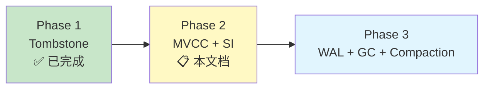

Phase 2 不涉及持久化（WAL/Checkpoint）和后台 GC——这些留给 Phase 3。Phase 2 聚焦于**内存中的多版本并发控制语义**。

---

## 二、关联文档

| 文档 | 说明 |
|------|------|
| `docs/07_spike/btree-refactor/2026-04-09-btree-delete-tombstone.md` | Tombstone Phase 1 设计预研 |
| `thoughts/2026-04-10-lealone-mvcc-deep-analysis.md` | Lealone AOTE MVCC 深度分析 |
| `thoughts/2026-04-10-doubao-mvcc-proposal.md` | 豆包 15 轮 MVCC 设计讨论记录 |
| `docs/07_spike/btree-refactor/2026-04-08-schedulerlock-to-optimistic-cas.md` | CAS 乐观锁重构 |
| `internal/infrastructure/storage/offheap/page_layout.go` | Phase 1 Flag 机制实现 |

---

## 三、Value 布局设计

### 3.1 布局演进

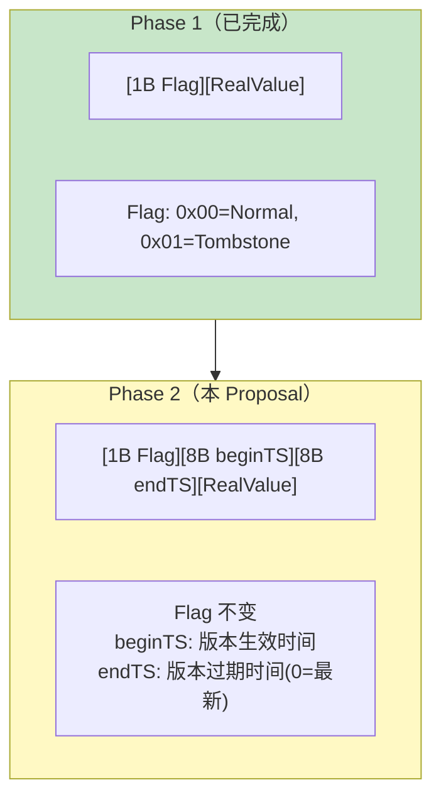

**Phase 2 Value 布局**：

```
┌──────┬──────────┬────────┬────────────┐
│ Flag │ beginTS  │ endTS  │ RealValue  │
│ 1B   │ 8B       │ 8B     │ 变长       │
└──────┴──────────┴────────┴────────────┘
```

| 字段 | 大小 | 含义 |
|------|------|------|
| `Flag` | 1B | 0x00=Normal, 0x01=Tombstone（与 Phase 1 完全兼容） |
| `beginTS` | 8B | 此版本生效时间戳（commitTimestamp） |
| `endTS` | 8B | 此版本过期时间戳，0 表示最新版本 |
| `RealValue` | 变长 | 实际数据（Tombstone 时为空） |

**Header 固定开销**：1 + 8 + 8 = **17 bytes**。

### 3.2 与现有代码兼容性

**关键原则**：`LeafEntry` 结构（16 bytes）**完全不变**，只有 Value 内容格式变化。

```
Phase 1 ValLen = 1 + len(RealValue)
Phase 2 ValLen = 1 + 8 + 8 + len(RealValue) = 17 + len(RealValue)
```

`LeafEntry.valLen` 自然增大，所有偏移量逻辑不受影响。`ParseValueWithFlag` 需扩展为 Phase 2 版本：

```go
// MVCC Header 固定大小
const MVCCHeaderSize = 17 // 1(Flag) + 8(beginTS) + 8(endTS)

// Phase 2 Value 解码
func ParseValueWithMVCC(val []byte) (flag byte, beginTS, endTS uint64, realVal []byte) {
    if len(val) < MVCCHeaderSize {
        // Phase 1 兼容：无 TS 的 Value 视为 beginTS=0, endTS=0
        flag, realVal = ParseValueWithFlag(val)
        return flag, 0, 0, realVal
    }
    return val[0],
        binary.BigEndian.Uint64(val[1:9]),
        binary.BigEndian.Uint64(val[9:17]),
        val[17:]
}

// Phase 2 Value 编码
func BuildMVCCValue(flag byte, beginTS, endTS uint64, realVal []byte) []byte {
    result := make([]byte, MVCCHeaderSize+len(realVal))
    result[0] = flag
    binary.BigEndian.PutUint64(result[1:9], beginTS)
    binary.BigEndian.PutUint64(result[9:17], endTS)
    copy(result[17:], realVal)
    return result
}
```

> **注意**：Phase 2 不需要向后兼容 Phase 1 持久化数据——NexKV 当前为纯内存引擎（mmap offheap），进程重启后页面重新初始化。

### 3.3 时间戳选型：本地单调递增

**Phase 2 采用本地单调递增 uint64**，预留 `TSGenerator` 接口为分布式 HLC 铺路。

```go
// TSGenerator 时间戳生成器接口
type TSGenerator interface {
    NextTS() uint64
}

// LocalTS 本地单调递增实现（Phase 2）
type LocalTS struct {
    counter atomic.Uint64
}

func (t *LocalTS) NextTS() uint64 {
    return t.counter.Add(1)
}
```

**远期演进**（Phase 2 不实现，仅预留接口）：

| 阶段 | 实现 | TS 语义 |
|------|------|---------|
| Phase 2 | `LocalTS`（本地递增） | 单机全序 |
| 分布式初期 | 128-bit HLC | 因果偏序 + 唯一性 |
| 强一致性 | TSO 中心授时 | 全局全序 |

> **来源**：豆包 Round 8-9 讨论。128-bit HLC 布局：`[32b physical][32b logical][64b fallback/NodeID]`。HLC 是因果偏序不是全序——**只管可见性，不管冲突裁决**。HLC 最怕时间回拨，必须实现 `lastPhysicalTime` 冻结机制。

---

## 四、可见性规则（Snapshot Isolation）

### 4.1 SI 读规则

**快照读核心公式**：

```
版本可见 ⟺ beginTS ≤ snapshotTS AND (endTS == 0 OR snapshotTS < endTS)
```

- `snapshotTS`：事务开启时固定的快照时间戳
- `beginTS`：版本的"出生证明"（commitTimestamp）
- `endTS`：版本的"死亡证明"（被新版本覆盖时设置），0 表示仍为最新版本

> **注意**：`endTS == 0` 表示"最新版本、永不过期"，必须单独判断，不能直接用 `snapshotTS < endTS`（否则 0 会导致误判为不可见）。

**完整 Get 路径（含 Read-Your-Own-Writes）**：

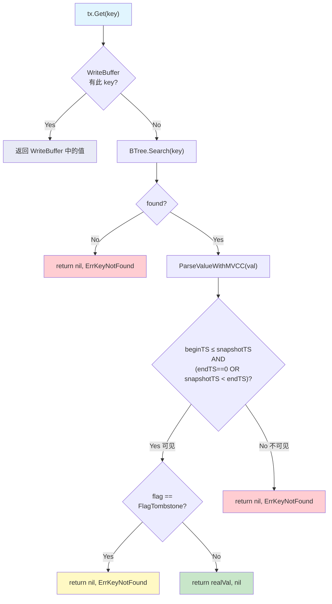

**Read-Your-Own-Writes 原则**：事务内的 `Get()` **必须先查 WriteBuffer**，再查 B+Tree。这保证事务内 Put 后立即 Get 能看到自己的写入。

### 4.2 Tombstone 版本可见性

Tombstone 仍然是 Value 的一种（`Flag = FlagTombstone`），只是 RealValue 为空。版本时间戳规则与 Normal 版本完全相同：

| 场景 | Flag | beginTS | endTS | 可见性 |
|------|------|---------|-------|--------|
| 正常数据 | 0x00 | 100 | 0 | snapshotTS ≥ 100 → 返回 realVal |
| 已被更新 | 0x00 | 100 | 200 | 100 ≤ snapshotTS < 200 → 返回旧值 |
| 已被删除 | 0x01 | 100 | 300 | 100 ≤ snapshotTS < 300 → 返回 ErrKeyNotFound |
| 最新 Tombstone | 0x01 | 300 | 0 | snapshotTS ≥ 300 → 返回 ErrKeyNotFound |

### 4.3 SIGHTLESS 哨兵值（借鉴 Lealone）

> **来源**：Lealone `TransactionalValue.java` L128-203

Lealone 区分"记录不存在"和"记录存在但不可见"——后者返回 `SIGHTLESS` 哨兵。这对 RR/SI 隔离级别很重要：事务开始后插入的新记录对旧事务应该返回"不可见"而非"不存在"。

**NexKV Phase 2 初期简化**：不引入 SIGHTLESS，统一返回 `ErrKeyNotFound`。后续如需精确区分（例如幻读检测），再引入。

### 4.4 写路径强制 ReadCommitted（借鉴 Lealone）

> **来源**：Lealone `TransactionalValue.java` — `isUpdateCommand()` 检测

Lealone 在写操作（Update/Delete）时自动降级为 ReadCommitted 隔离级别，避免写偏序（Write Skew）。理由：写操作需要看到最新已提交值才能正确冲突检测，快照读会导致基于过时数据的写入。

**NexKV Phase 2 对应设计**：
- 写路径（Set/Delete）的内部读取**始终读取最新已提交版本**（`endTS == 0`），不受 `snapshotTS` 约束
- 只有用户显式 `Get()` 调用走快照读路径

---

## 五、版本链存储方案

### 5.1 为什么 B+Tree 内联多版本不可行

**B+Tree COW 不能直接提供快照隔离**——这是一个关键的架构约束。

NexKV 的 `Get()` 实现在读取后立即调用 `ReleaseAll()` 释放 PageRef 引用。COW 保护只在持有 PageRef 期间有效，而事务的 Get/Put 操作之间 PageRef 已释放，新写入会直接覆盖旧页面数据。

因此，**必须引入独立于 B+Tree 的外部版本链**来存储历史版本。

| 方案 | 可行性 | 原因 |
|------|--------|------|
| B+Tree 内联多版本（Key 编码加 TS 前缀） | ❌ 不采用 | B+Tree 不支持同 Key 多版本；Key 编码破坏搜索语义 |
| 单版本覆盖 + COW 快照 | ❌ 不可行 | Get() 后立即 ReleaseAll()，COW 保护不跨操作持续 |
| **外部版本链（Go 堆内存）** | ✅ **Phase 2 采用** | 独立于 B+Tree，与 Lealone oldValueCache 对齐 |
| 外部版本链（Off-Heap） | 远期优化 | 零 GC 压力，但实现复杂 |

### 5.2 Phase 2 方案：外部版本链（Go 堆内存）

**架构**：B+Tree 只存储每个 Key 的**最新版本**，历史版本存储在外部 `VersionChain`（Go 堆内存链表）。

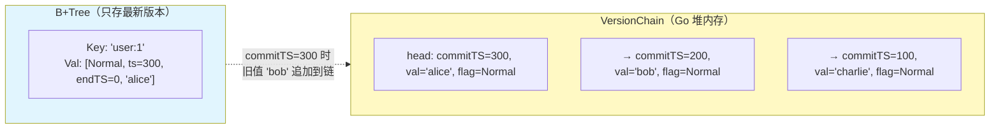

**数据结构（无锁 atomic.Pointer）**：

```go
// VersionChain 无锁版本链（append-only，与 COW B+Tree 无锁风格一致）
// 核心原则：只在头部追加新版本，旧节点永不修改 → 天然无锁
type VersionChain struct {
    head atomic.Pointer[VersionNode] // 原子指针，无锁读写
}

type VersionNode struct {
    commitTS uint64
    value    []byte       // 实际值（不含 Flag）
    flag     byte         // FlagNormal / FlagTombstone
    next     *VersionNode // 只读指针，指向更旧版本（永不修改）
}
```

**无锁原理**：
- **写入（Commit 追加版本）**：构建完整新节点（含 `next` 指向旧 head），然后 `atomic.Store` 替换 head。Go 的 `atomic.Pointer` 提供 release 语义，保证新节点所有字段对后续读者可见。
- **读取（快照 Get 遍历）**：`atomic.Load` 获取 head，然后沿 `next` 链遍历。旧节点永不修改，无需任何锁。
- **与 B+Tree COW 风格一致**：B+Tree COW 保证页级无锁读写，版本链 atomic 保证链级无锁读写。

> **注意**：Phase 3 GC 引入版本回收时，不能直接删除读者可能正在遍历的节点。需要 epoch-based reclamation 或类似机制保证安全回收。Phase 2 不做 GC，此问题延后。

**版本链存储位置**：

```go
// VersionStore 全局版本链存储
type VersionStore struct {
    chains sync.Map // key(string) → *VersionChain
}
```

### 5.3 版本链构建时机（Commit 阶段）

**借鉴 Lealone 的 `TransactionalValue.commit()` 模式**：

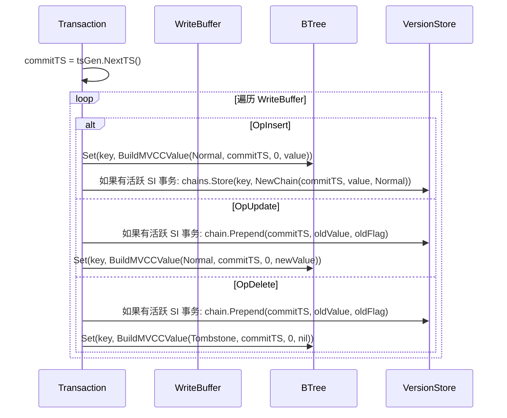

**关键**：版本链只在有活跃 SI 事务时构建。B+Tree 中的 `endTS` 字段在 Phase 2 初期始终为 0（单最新版本），版本可见性完全由 VersionChain 决定。

### 5.4 快照读如何使用版本链

```go
func (tx *SnapshotTx) snapshotGet(key []byte) ([]byte, error) {
    // 1. 从 VersionStore 查找版本链
    chainVal, ok := tx.engine.versionStore.chains.Load(string(key))
    if !ok {
        // 无版本链 → B+Tree 中的值就是唯一版本
        raw, err := tx.engine.storage.Get(key)
        if err != nil {
            return nil, err
        }
        flag, beginTS, _, realVal := ParseValueWithMVCC(raw)
        if flag == FlagTombstone {
            return nil, ErrKeyNotFound
        }
        if beginTS > tx.snapshotTS {
            return nil, ErrKeyNotFound // 版本太新，不可见
        }
        return realVal, nil
    }

    // 2. 遍历版本链（无锁，append-only 保证旧节点不变）
    chain := chainVal.(*VersionChain)
    node := chain.head.Load() // atomic.Load，无锁
    for node != nil {
        if node.commitTS <= tx.snapshotTS {
            // 找到可见版本
            if node.flag == FlagTombstone {
                return nil, ErrKeyNotFound
            }
            return node.value, nil
        }
        node = node.next
    }

    // 3. 所有版本都太新 → 检查 B+Tree 最新版本之前的值
    return nil, ErrKeyNotFound
}
```

### 5.5 siCount 零开销优化（借鉴 Lealone）

```go
// 只有活跃的 SI 事务存在时才构建版本链
type TransactionEngine struct {
    siCount atomic.Int32 // SI 事务计数器
}

func (te *TransactionEngine) shouldBuildVersionChain() bool {
    return te.siCount.Load() > 0
}

// Commit 时追加版本（无锁 atomic.Store）
func (vc *VersionChain) Prepend(commitTS uint64, value []byte, flag byte) {
    oldHead := vc.head.Load()
    newNode := &VersionNode{
        commitTS: commitTS,
        value:    value,
        flag:     flag,
        next:     oldHead, // 指向旧 head
    }
    vc.head.Store(newNode) // atomic.Store，release 语义
}

// BeginTx 时递增
func (te *TransactionEngine) BeginTx(ctx context.Context, level IsolationLevel) (Transaction, error) {
    if level == SnapshotIsolation {
        te.siCount.Add(1)
    }
    // ...
}

// Commit/Rollback 时递减
func (tx *SnapshotTx) cleanup() {
    if tx.isolationLevel == SnapshotIsolation {
        tx.engine.siCount.Add(-1)
    }
}
```

> **来源**：Lealone `AOTransactionEngine.java` — `containsRepeatableReadTransactions()` 检查 `rrtCount.get() > 0`。无 SI 事务时版本链完全不构建，零内存开销。

### 5.6 版本链 GC

Phase 2 不实现 GC。版本链无限增长直到内存压力触发。Phase 3 的 GC 策略：

1. 引擎扫描所有活跃 SI 事务，取最大 `snapshotTS` 作为 `watermark`
2. 版本链中 `commitTS < watermark` 的旧节点可安全回收
3. 后台线程定期执行 GC

> **来源**：Lealone `getMaxRepeatableReadTransactionId()` + CheckpointService 异步回收

### 5.7 远期优化：Off-Heap 版本存储

```go
// VersionStore Off-Heap 版本（远期优化）
type OffHeapVersionStore struct {
    pm      *offheap.PageManager
    chains  sync.Map // key → offheap offset
}
```

- 优点：零 GC 压力，内存可控
- 缺点：实现复杂，需要手动管理生命周期
- 适用：生产优化阶段

---

## 六、写入协议

### 6.1 Set 操作

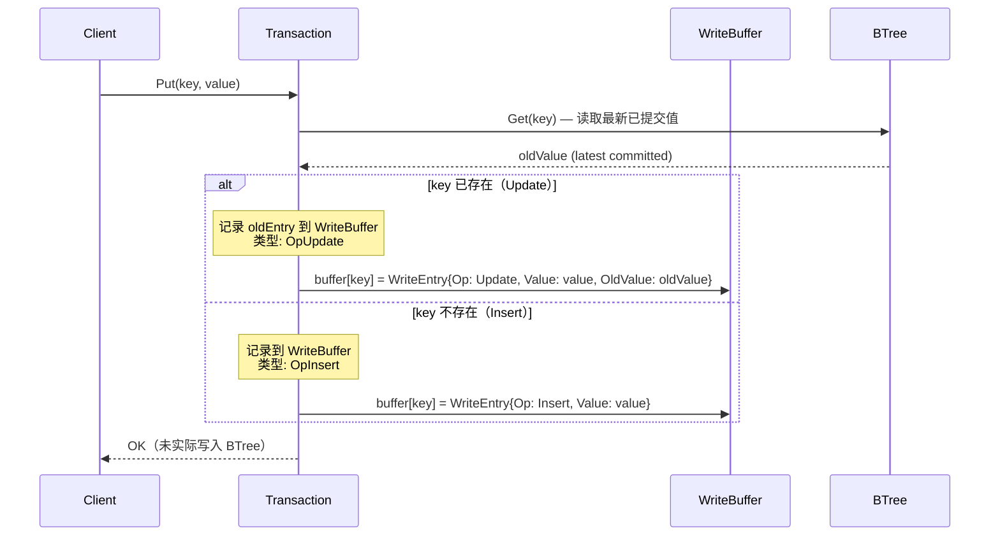

**关键**：写入操作**只写内存 WriteBuffer**，不触碰 B+Tree。真正落盘在 Commit 阶段。

### 6.2 Delete 操作

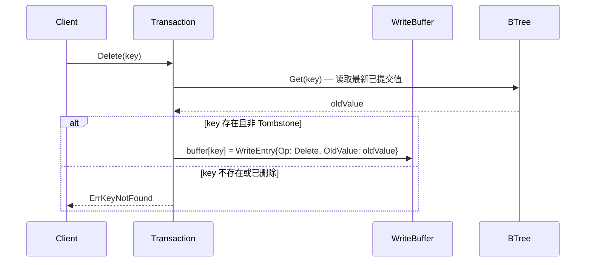

Delete 的 WriteBuffer 条目类型为 `OpDelete`，Commit 时写入 `FlagTombstone + beginTS + endTS`。

### 6.3 commitTimestamp 时序约束

> **来源**：Lealone `AOTransaction.java` L254-258

Lealone 的核心约束：

```java
// 这一步很重要！！！
// 生成commitTimestamp的时机很严格，需要等到redo log sync完成后才能生成，
// checkpoint线程和可重复读的事务都依赖它
commitTimestamp = transactionEngine.nextTransactionId();
```

**NexKV Phase 2 适配**：

Phase 2 没有 WAL sync（Phase 3 才引入），因此 `commitTimestamp` 分配时机简化为：**Commit 开始时立即分配**。但必须预留 WAL sync 后分配的扩展点：

```go
func (tx *Transaction) Commit() error {
    // Phase 2: 直接分配（无 WAL）
    // Phase 3: 在 WAL sync 回调中分配
    commitTS := tx.engine.tsGen.NextTS()
    tx.commitTimestamp = commitTS

    // Apply WriteBuffer to BTree
    return tx.applyWriteBuffer(commitTS)
}
```

---

## 七、提交协议

### 7.1 Commit 完整流程

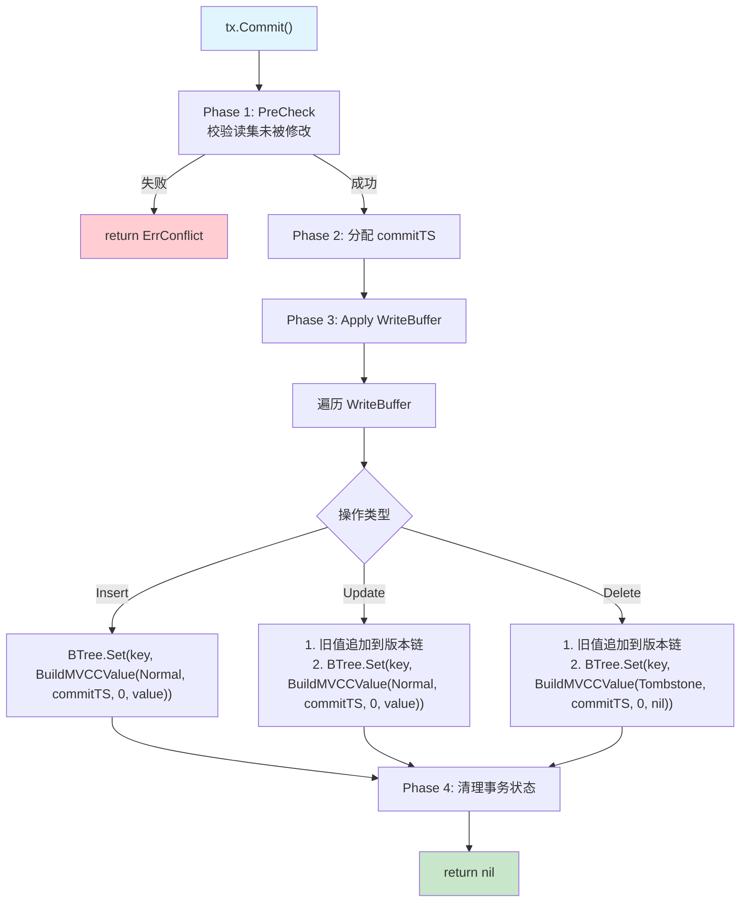

### 7.2 Rollback 流程

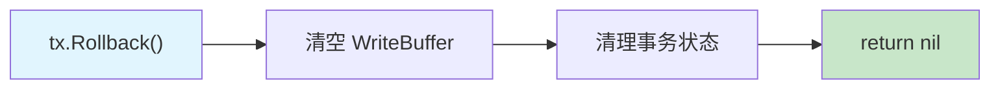

Phase 2 的 Rollback 极其简单——WriteBuffer 是纯内存数据结构，直接丢弃即可。不涉及 UndoLog、锁释放等复杂操作（这些在 Phase 3 WAL 集成时才需要）。

### 7.3 冲突检测：Per-Key ValueHash PreCheck

> **来源**：豆包 Round 10-12 讨论 + 架构评审修正

**核心原则**：采用 **per-Key ValueHash 指纹**而非 PageVer 级别校验，避免同页不同 Key 事务的假阳性冲突。

**为什么不用 PageVer 级别校验？**

PageVer 是页面粒度的粗粒度检测——页内任意 Key 的修改都会导致 PageVer++。如果两个事务分别读写同一页面的不同 Key，PageVer 检查会导致误判冲突（假阳性）。在 4KB 页面、平均 50+ Entry 的场景下，假阳性率不可接受。

**Per-Key ValueHash PreCheck 方案**：

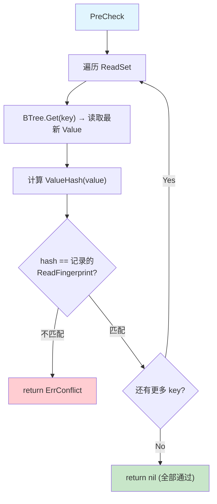

**PreCheck 数据结构**：

```go
// ReadFingerprint 读取时记录的校验指纹
type ReadFingerprint struct {
    ValueHash uint32 // Value 内容的 FNV-1a hash
}

// Transaction 读集
type ReadSet map[string]ReadFingerprint // key → fingerprint

// NewReadFingerprint 从 Value 构建指纹
func NewReadFingerprint(value []byte) ReadFingerprint {
    h := fnv.New32a()
    h.Write(value)
    return ReadFingerprint{ValueHash: h.Sum32()}
}
```

**ABA 防护**：FNV-1a 32-bit hash 对 Value 全内容计算。如果 Key 被 Delete 再 Insert（Value 恢复原值），hash 匹配但实际已变更——这种情况由 `endTS` 版本链机制保证正确性（PreCheck 通过后，Apply 时再验证 endTS==0 即可发现中间变更）。

**远期优化（Phase 2d 之后）**：

Phase 2 初期使用完整的 ValueHash PreCheck。远期可优化为：
1. **增量指纹**：只 hash Value 头部（Flag + beginTS + endTS），减少计算量
2. **PageVer 快速路径**：先检查 PageVer，未变则跳过逐 Key 检查（纯优化，不影响正确性）
3. **Bloom Filter**：维护页面级"被修改 Key 集合"的 Bloom Filter，快速排除未修改的 Key

### 7.4 分布式适配

> **来源**：豆包 Round 11 讨论

**核心铁律**：同一个 Key 永远只归属一个分片 Leader。PreCheck 在 Leader 上串行执行，无需全局协调。

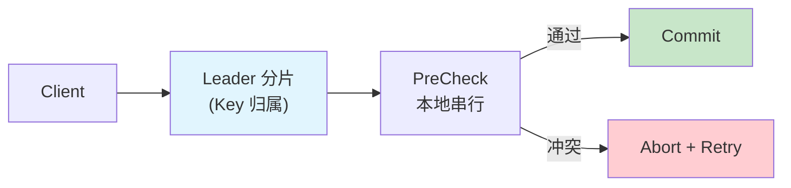

---

## 八、接口设计

### 8.1 分层架构

> **来源**：豆包 Round 13 讨论 — Storage Engine 与 Transaction Engine 分离

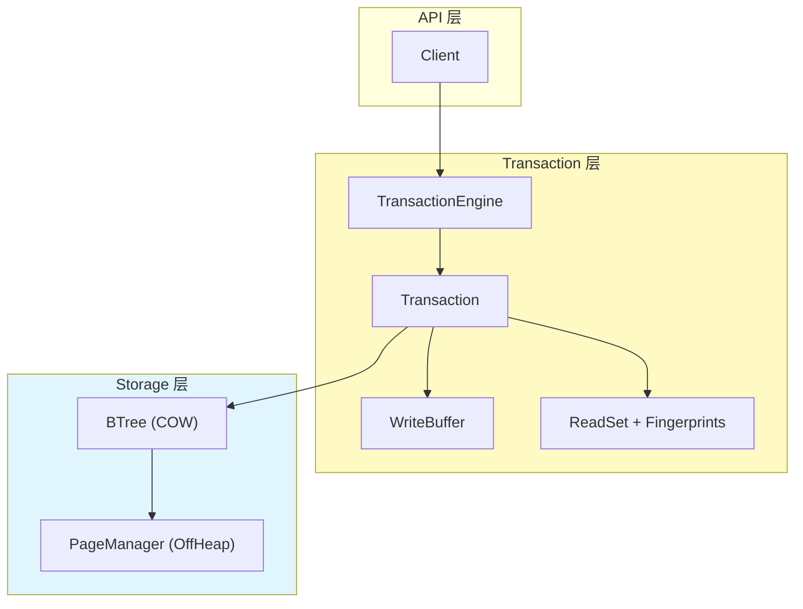

### 8.2 Go 接口定义

```go
// --- 时间戳 ---

// TSGenerator 时间戳生成器（可替换实现）
type TSGenerator interface {
    NextTS() uint64
}

// --- 隔离级别 ---

type IsolationLevel uint8

const (
    ReadCommitted    IsolationLevel = iota
    SnapshotIsolation                // 默认
    Serializable                     // 远期
)

// --- 事务 ---

// Transaction 单事务会话
type Transaction interface {
    // 快照读（按隔离级别路由）
    Get(ctx context.Context, key []byte) ([]byte, error)

    // 写入 WriteBuffer（不落地 BTree）
    Put(key, value []byte) error
    Delete(key []byte) error

    // 提交：PreCheck + Apply
    Commit(ctx context.Context) error

    // 回滚：丢弃 WriteBuffer
    Rollback() error

    // 快照时间戳
    SnapshotTS() uint64
}

// TransactionEngine 事务管理器
type TransactionEngine interface {
    // 开启事务
    BeginTx(ctx context.Context, level IsolationLevel) (Transaction, error)
}

// NewTransactionEngine 创建事务引擎（构造时绑定 StorageEngine）
func NewTransactionEngine(storage StorageEngine, tsGen TSGenerator) TransactionEngine {
    return &transactionEngine{
        storage:       storage,
        tsGen:         tsGen,
        versionStore:  &VersionStore{},
    }
}

// --- 存储引擎 ---

// StorageEngine 裸 KV 存储（无事务、无 MVCC）
type StorageEngine interface {
    Get(ctx context.Context, key []byte) ([]byte, error)
    Set(ctx context.Context, key, value []byte) error
    Delete(ctx context.Context, key []byte) error
    Scan(start, end []byte) (Iterator, error)
    Close() error
}
```

### 8.3 WriteBuffer 设计

```go
// WriteOp 写操作类型
type WriteOp uint8

const (
    OpInsert WriteOp = iota
    OpUpdate
    OpDelete
)

// WriteEntry WriteBuffer 中的条目
type WriteEntry struct {
    Op         WriteOp
    Value      []byte // 新值（Delete 时为 nil）
    OldValue   []byte // 旧值快照（用于 Rollback 和 endTS 设置）
    OldBeginTS uint64 // 旧版本的 beginTS（用于设置 endTS）
}

// WriteBuffer 事务写入缓冲
type WriteBuffer struct {
    entries map[string]WriteEntry // key → entry
    ordered []string              // 保持写入顺序
}
```

---

## 九、与现有架构的集成点

### 9.1 B+Tree COW 与版本链的协同

**重要架构约束**：B+Tree COW **不能**直接提供跨操作的快照隔离。

NexKV 的 `Get()` 在读取后立即调用 `ReleaseAll()` 释放 PageRef，COW 保护仅在 PageRef 持有期间有效。事务内的多次 Get/Put 之间 PageRef 已释放，因此必须依赖外部版本链。

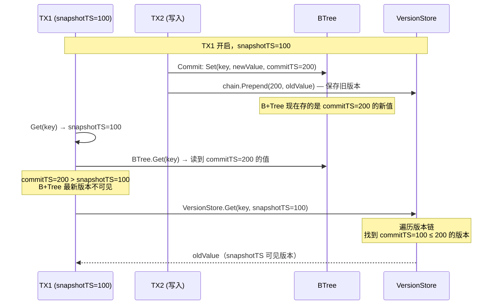

**COW 的实际作用**：COW 保证 B+Tree 内部结构一致性（页分裂/合并不破坏并发读取），但**不负责**多版本可见性。可见性由 VersionChain 提供。

### 9.2 PageAccessor 扩展

Phase 2 需要在 `PageAccessor` 层新增：

```go
// GetMVCCValue 获取带 MVCC 元数据的 Value
func (pa *PageAccessor) GetMVCCValue(pageID uint32, idx int) (flag byte, beginTS, endTS uint64, realVal []byte) {
    entry := pa.GetLeafEntry(pageID, idx)
    raw := pa.GetValue(pageID, entry.valOff, entry.valLen)
    return ParseValueWithMVCC(raw)
}
```

### 9.3 LeafEntry 不变

`LeafEntry` 16-byte 结构**完全不变**。所有变更都在 Value 内容层：

| 属性 | Phase 1 | Phase 2 |
|------|---------|---------|
| `keyOff` / `keyLen` | 不变 | 不变 |
| `valOff` | 不变 | 不变 |
| `valLen` | 1 + len(RealValue) | 17 + len(RealValue) |

### 9.4 Size() 语义

Phase 2 的 Size() 保持"逻辑可见 Key 数量"语义。B+Tree 只存最新版本，Size 计算逻辑不变：

```go
// Phase 2 Size() 计算逻辑（与 Phase 1 一致）
func (bt *BTree) Size() int64 {
    // Tombstone 已在 Delete 时 delta=-1
    // B+Tree 只存最新版本，Size 反映当前可见 Key 数量
    return bt.size.Load()
}
```

### 9.5 getCommittedObjects 过滤（借鉴 Lealone）

> **来源**：Lealone `TransactionalValue.java` L347-383

Lealone 在 B+Tree 刷脏页时过滤未提交记录。NexKV Phase 3（持久化）需要类似机制：

```go
// GetCommittedObjects 过滤页面中的未提交记录
func GetCommittedObjects(keys, values [][]byte) ([][]byte, [][]byte) {
    // 遍历每条记录
    // - 无锁或已提交 → 保留 newValue
    // - 有锁且未提交 → 使用 oldValue
    // - 未提交的 Insert (oldValue == nil) → 跳过
}
```

Phase 2 无持久化，此过滤暂不需要。

---

## 十、实施分期与里程碑

### 10.1 Phase 2a：Value 布局扩展 + TSGenerator

**目标**：Value 从 `[1B Flag][RealValue]` 扩展为 `[1B Flag][8B beginTS][8B endTS][RealValue]`。

**改动**：
- `offheap/page_layout.go`：新增 `ParseValueWithMVCC()` / `BuildMVCCValue()` / `MVCCHeaderSize` 常量
- `btree/btree.go`：Set/Delete 写入带 TS 的 Value，Get 解析带 TS 的 Value
- 新增 `mvcc/ts_generator.go`：TSGenerator 接口 + LocalTS 实现

**验证**：
- [ ] 现有 Tombstone 测试全部通过
- [ ] Value 编解码正确（含空 Value、Tombstone 边界）
- [ ] beginTS 在 Set/Commit 时正确写入

### 10.2 Phase 2b：外部版本链 + 快照读（Snapshot Get）

**依赖**：Phase 2a 完成后

**目标**：引入外部版本链 + 事务内 Get 按快照时间戳过滤可见版本。

**改动**：
- 新增 `VersionChain` + `VersionNode` + `VersionStore`（`atomic.Pointer` 无锁实现）
- 新增 `Transaction` 接口 + `SnapshotTx` 实现
- `BeginTx()` 分配 `snapshotTS`，递增 `siCount`
- `Get()` 先查 WriteBuffer，再走快照读路径（B+Tree + VersionChain）
- `Commit()` 时构建版本链（仅在 siCount > 0 时）

**验证**：
- [ ] 快照读看到事务开启时的数据视图
- [ ] 快照读不受并发写入影响
- [ ] Tombstone 版本在快照中正确过滤
- [ ] Read-Your-Own-Writes：Put 后 Get 能看到自己的写入
- [ ] siCount 零开销：无 SI 事务时不构建版本链

### 10.3 Phase 2c：WriteBuffer + Per-Key PreCheck

**依赖**：Phase 2b 完成后

**目标**：Put/Delete 写入 WriteBuffer，Commit 前 Per-Key ValueHash PreCheck 冲突。

**改动**：
- 新增 `WriteBuffer` 数据结构
- 新增 `ReadSet` / `ReadFingerprint`（ValueHash）
- `Commit()` 实现 PreCheck → Apply 流程

**验证**：
- [ ] 并发事务写冲突正确检测（Abort + Retry）
- [ ] WriteBuffer 的 Insert/Update/Delete 语义正确
- [ ] PreCheck 防止 Lost Update 异常
- [ ] 同页不同 Key 事务不产生假阳性冲突

### 10.4 Phase 2d：提交协议 + Rollback + 集成测试

**依赖**：Phase 2c 完成后

**目标**：完整的 Commit/Rollback 流程 + 并发集成测试。

**改动**：
- `Commit()` Apply WriteBuffer 到 BTree + 构建版本链
- `Rollback()` 清理 WriteBuffer + 递减 siCount
- `commitTimestamp` 分配（预留 WAL sync 扩展点）
- 并发事务集成测试

**验证**：
- [ ] Commit 后数据对其他事务可见
- [ ] Rollback 后数据不改变
- [ ] 并发 Commit + Snapshot Get 一致性
- [ ] SI 隔离级别：无脏读、无不可重复读
- [ ] Per-Key ValueHash PreCheck 正确检测冲突
- [ ] Write-Write 冲突：并发写同一 Key 正确 Abort

---

## 十一、风险与缓解

| 风险 | 等级 | 缓解措施 |
|------|------|---------|
| Value 头部从 1B 增加到 17B，页填充率下降 | 中 | Tombstone Phase 1 已证明 OverwriteLeafValue 快路径可用；17B 开销在 4KB 页面中占比 < 0.5% |
| 外部版本链（Go 堆内存）增加 GC 压力 | 中 | siCount 零开销优化：无 SI 事务时不构建版本链；无锁 atomic.Pointer 避免锁竞争；远期迁移到 Off-Heap |
| PreCheck ValueHash 碰撞导致假阴性（漏检冲突） | 低 | FNV-1a 32-bit hash，碰撞概率约 1/4B；结合 Apply 时 endTS 验证双重保护 |
| Size() 语义变更导致回归 | 低 | Phase 2 初期 Size 计算逻辑不变，多版本 Size 留到远期 |
| commitTimestamp 时序约束在 Phase 3 WAL 引入时需调整 | 低 | Commit 接口预留 WAL sync 回调扩展点 |
| 快照读性能（遍历版本链） | 低 | 大部分场景链长 ≤ 3（短事务）；siCount 优化避免无 SI 事务时的开销 |
| siCount 竞态窗口（BeginTx 递增 vs Commit 检查之间） | 低 | 窗口极小；最坏情况是多余构建一个版本链节点，不影响正确性 |

---

## 附录 A：设计决策溯源

| 决策 | 来源 | 关键论点 |
|------|------|---------|
| 128-bit HLC（非 64-bit） | 豆包 Round 8 | 8-bit 逻辑位溢出风险，生产必须宽位 |
| HLC 只管可见性 | 豆包 Round 4-5 | HLC 是因果偏序，不是全序；HLC+NodeID 是人工伪全序 |
| Per-Key ValueHash PreCheck | 豆包 Round 12 + 架构评审 | PageVer 级别假阳性率高；per-Key hash 精确检测冲突 |
| 外部版本链（非 B+Tree 内联） | 架构评审 | COW 保护不跨操作持续（Get 后 ReleaseAll），必须独立版本存储 |
| atomic.Pointer 无锁版本链 | 架构评审 | append-only 链表天然无锁，与 B+Tree COW 无锁风格一致 |
| Storage/Tx 接口分离 | 豆包 Round 13 | 解耦存储和事务，各自可替换 |
| 默认 SI 隔离 | 豆包 Round 14 | 快照读 + 版本链天然适配 SI |
| commitTimestamp 后分配 | Lealone 分析 | 必须在 WAL sync 后分配，保证崩溃恢复正确性 |
| siCount 零开销 | Lealone 分析 | 无 SI 事务时版本链完全不构建 |
| 写路径强制 RC | Lealone 分析 | 避免基于过时数据的写入（写偏序） |
| Read-Your-Own-Writes | 架构评审 | Get 必须先查 WriteBuffer，保证事务内一致性 |

## 附录 B：关键文件清单

| 文件 | Phase 2 改动 |
|------|-------------|
| `offheap/page_layout.go` | 新增 `ParseValueWithMVCC()` / `BuildMVCCValue()` / MVCC 常量 |
| `btree/btree.go` | Get/Set/Delete 路径适配 MVCC Value 格式 |
| 新增 `mvcc/ts_generator.go` | TSGenerator 接口 + LocalTS 实现 |
| 新增 `mvcc/version_store.go` | VersionChain + VersionNode + VersionStore（外部版本链，atomic.Pointer 无锁） |
| 新增 `mvcc/transaction.go` | Transaction 接口 + SnapshotTx 实现 |
| 新增 `mvcc/write_buffer.go` | WriteBuffer 数据结构 |
| 新增 `mvcc/precheck.go` | ReadFingerprint + ValueHash PreCheck 逻辑 |
| 新增 `mvcc/engine.go` | TransactionEngine 实现（含 siCount 零开销） |
| `btree/btree_test.go` | MVCC 相关测试 |
| 新增 `mvcc/transaction_test.go` | 事务隔离性测试 |
| 新增 `mvcc/version_store_test.go` | 版本链构建/遍历/GC 测试 |

---

**文档版本**: v2.0
**最后更新**: 2026-04-11
**维护者**: NexKV 开发团队
