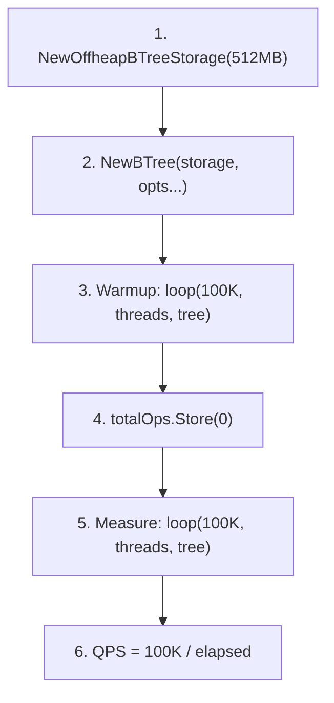
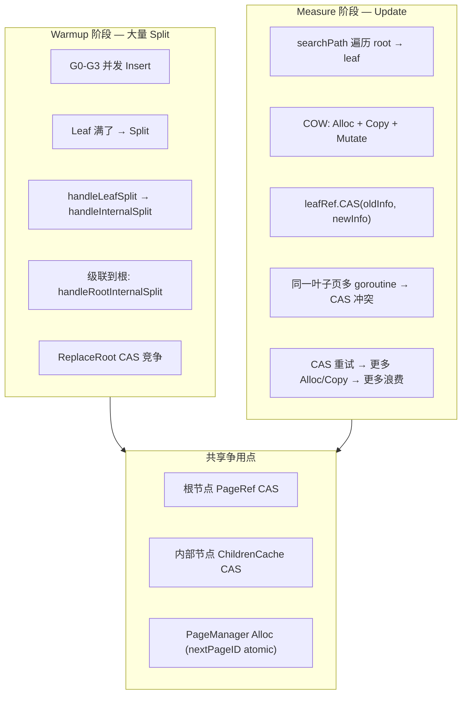
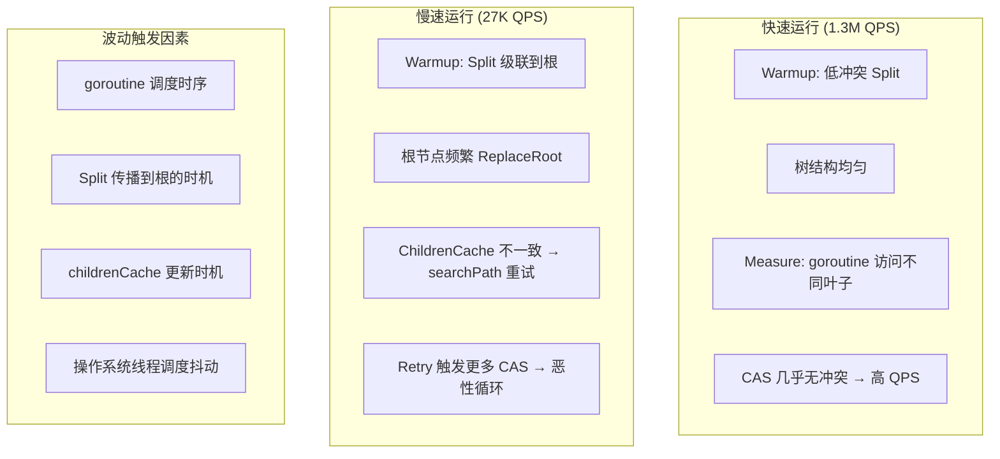

# BTree Memory Mode 性能调试预研

> 创建日期：2026-05-23
> 状态：Investigation — 已识别热点，待精确定位
> 分支：`spike/btree-memory-perf`

---

## 一、问题描述

`cmd/tools/btree_bench` 在 memory-only 模式（epoch=off，无 WAL/AO）下，**par-put 性能高度不稳定**：

| 运行 | par-put-4 | par-put-8 | par-put-16 |
|------|-----------|-----------|------------|
| Run 1 | 493K | 583K | 712K |
| Run 2 | 1,346K | 146K | 27K |
| Run 3 | 54K | 99K | — (hang) |

**波动幅度 50 倍以上**，同一代码、同一机器、同一参数。

---

## 二、Benchmark 设计分析

### 2.1 测试流程



```go
// warmup (NOT timed):
loop(*warmup, threads, tree, &totalOps, getOnly, n)

// measure (timed):
t0 := time.Now()
loop(n, threads, tree, &totalOps, getOnly, n)
elapsed := time.Since(t0)
```

### 2.2 Key 分配策略

```go
func keyOf(i int) []byte {
    return []byte(fmt.Sprintf("key-%010d", i))
}

// par-put-4 (4 goroutines, 100K ops):
//   G0: keys 0-24999      → sequential insert
//   G1: keys 25000-49999   → sequential insert
//   G2: keys 50000-74999   → sequential insert
//   G3: keys 75000-99999   → sequential insert
```

### 2.3 两个阶段的差异

| 阶段 | 操作类型 | 树状态 | 是否 Split |
|------|---------|--------|-----------|
| Warmup (100K) | **Insert**（空树→100K keys） | 从 0 增长到 100K | ✅ 大量 Split |
| Measure (100K) | **Update**（key 已存在） | 100K keys | ❌ 无 Split |

**关键发现**：测量阶段是 Update 而非 Insert——key 已在 warmup 中插入，Set 走 Update 路径。不应触发 Split。

---

## 三、争用热点分析

### 3.1 第一阶段 pprof 回顾

```
top 30 CPU (7.43s, 258% utilization):
  runtime.usleep               15.58%  ← 休眠/等待!
  runtime.pthread_cond_wait    9.09%   ← 条件变量等待!
  runtime.madvise              8.21%   ← 内存 advice 系统调用
  runtime.pthread_kill         5.82%   ← 线程信号
  sync/atomic.(*Int32).Add     5.09%   ← PageRef 引用计数
  offheap.clearPage            4.78%   ← Alloc 时清零
  cmpbody                      4.52%   ← Key 比较
```

**前三项合计 33%** 都是调度开销——线程在等锁/CAS，不是在干活。

### 3.2 推测瓶颈路径



### 3.3 Update 路径的 COW 开销

```go
// operations.go:writeOperation — 非 Split 路径
func writeOperation(b *BTree, key []byte, mutate mutateFunc) error {
    // Step 1: searchPath → 遍历到叶子 (lock-free)
    path, _ := searchPath(b.rootRef, key)
    
    // Step 2: 读旧页
    oldInfo := leafRef.GetPageInfo()
    oldLeaf, _ := b.storage.GetLeafPage(oldInfo.PageID)
    
    // Step 3: COW mutate
    result, _ := mutate(oldLeaf)           // 分配新页 + 复制 + 修改
    
    // Step 4: CAS 替换
    if !leafRef.CAS(oldInfo, newInfo) {
        // ★ 冲突! → FreePage(newPage) → retry
    }
}
```

**每次 CAS 冲突的成本**：1 次 Alloc + 1 次 4KB memcpy + 1 次 FreePage = ~3-5μs 浪费。

### 3.4 为什么波动如此巨大？



**根因**：warmup 阶段的 Split 传播和 ChildrenCache 更新与 goroutine 调度之间存在**竞态条件**。不同的时序导致树结构差异巨大，进而影响测量阶段的争用程度。

---

## 四、已验证排除的因素

| 因素 | 结论 | 证据 |
|------|------|------|
| Epoch 开销 | ❌ 不是瓶颈 | pprof top 30 中无 epoch 函数 |
| 页面分配器 | ❌ 占比较小 | `clearPage` 4.78% |
| MVCC 编码 | ❌ benchmark 无事务 | 纯 BTree Set/Get |
| WAL/AO | ❌ memory-only | 未启用 |
| RetireBatch | ❌ epoch=off 时跳过 | 代码路径不执行 |

---

## 五、下一步计划

### 5.1 精确 profiling（待执行）

```bash
# 聚焦 par-put，加 cpuprofile
go run ./cmd/tools/btree_bench -n 50000 -only par-put -cpuprofile /tmp/parput.prof

# 分析
go tool pprof -top -nodecount=30 /tmp/parput.prof
go tool pprof -list 'split\|CAS\|searchPath' /tmp/parput.prof
```

### 5.2 待验证的假设

| 假设 | 验证方法 |
|------|---------|
| Root CAS 是主要争用点 | pprof 看 `ReplaceRoot` / `handleRootInternalSplit` 占比 |
| ChildrenCache 更新竞争 | 看 `updateChildrenCache` CAS 重试次数 |
| warmup 阶段的 Split 级联触发恶性循环 | 对比 warmup=0 (跳过 warmup) 的 QPS |
| PageRef CAS 重试频率 | 看 `writeOperation` 中 CAS 失败路径占比 |

### 5.3 可能的优化方向

| 方向 | 预期收益 | 复杂度 |
|------|---------|--------|
| 跳过 warmup（par-put 不需要预填充） | 消除 Split 级联 | 低（改 benchmark） |
| CAS 退避策略（指数退避 + 随机抖动） | 减少恶性循环 | 低（改 operations.go） |
| ChildrenCache 批量更新 | 减少 CAS 重试 | 中 |
| Per-goroutine key range 预分割 | 消除跨 goroutine leaf 共享 | 高 |

---

## 六、参考

- Phase 5.6 性能分析：`docs/07_spike/btree-refactor/2026-04-02-btree-refactor-roadmap.md` §Phase 5.6
- Epoch 性能基线：`docs/07_spike/btree-refactor/2026-05-21-epoch-page-reclamation-spike.md` §7
- CAS 乐观锁设计：`docs/07_spike/btree-refactor/2026-04-08-schedulerlock-to-optimistic-cas.md`
- Benchmark 源码：`cmd/tools/btree_bench/main.go`

---

**文档版本**：v1.0
**状态**：Investigation
