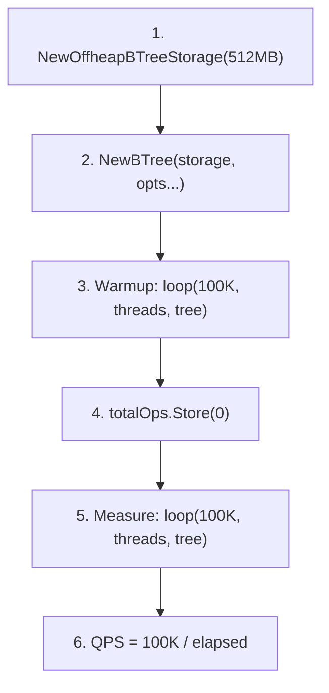
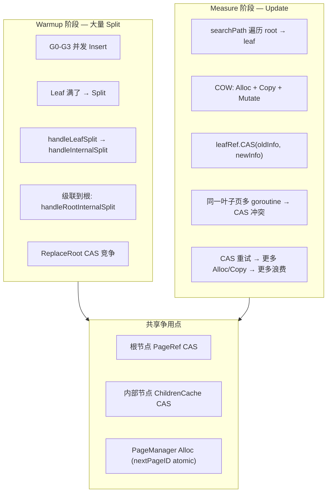
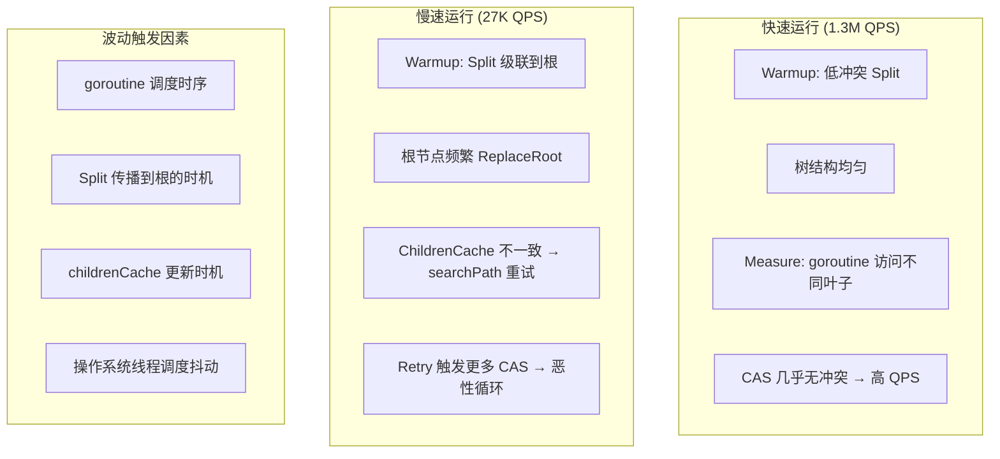
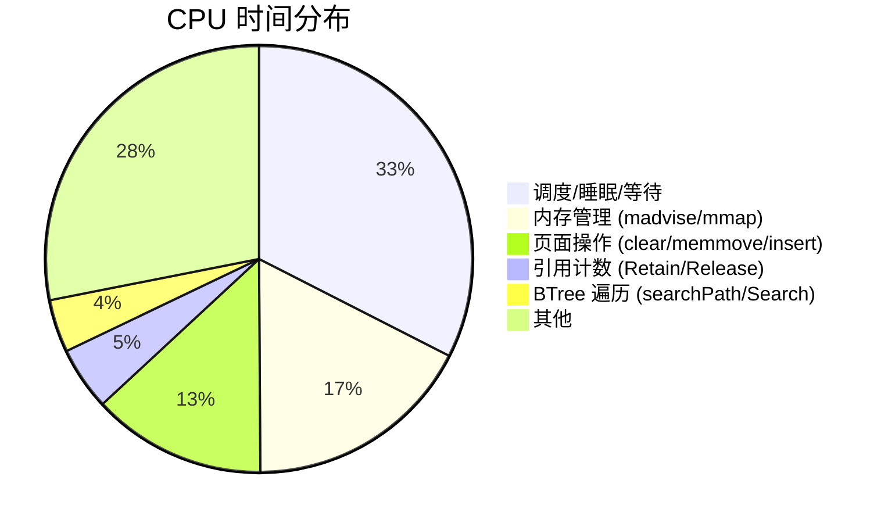
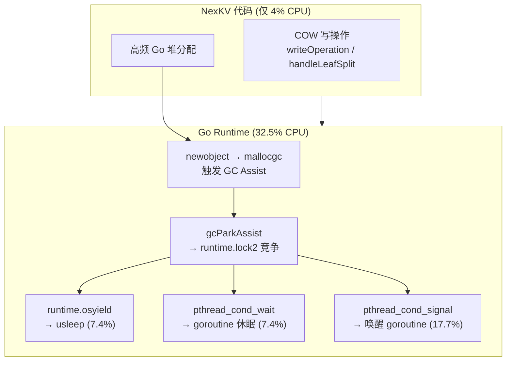
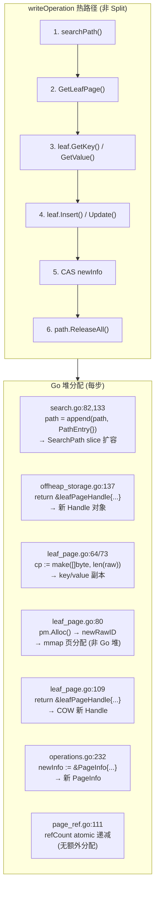
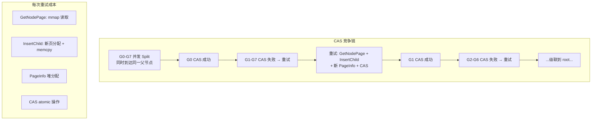

# BTree Memory Mode 性能调试预研

> 创建日期：2026-05-23
> 最后更新：2026-05-24
> 状态：Investigation — **P0+P1 完成，退避+安全修复已落地，channel+worker 方案设计完成待实施**
> 分支：`spike/btree-memory-perf`

---

## 一、问题描述

`cmd/tools/btree_bench` 在 memory-only 模式（epoch=off，无 WAL/AO）下，**par-put 性能高度不稳定**。

### 初始状态（P0 优化前）

| 运行 | par-put-4 | par-put-8 | par-put-16 |
|------|-----------|-----------|------------|
| Run 1 | 493K | 583K | 712K |
| Run 2 | 1,346K | 146K | 27K |
| Run 3 | 54K | 99K | — (hang) |

### 当前状态（P0 池化 + clearPage memclr 后，2026-05-24）

| 运行 | par-put-4 | par-put-8 | par-put-16 |
|------|-----------|-----------|------------|
| Run 1 | 1,950K | 1,328K | 161K |
| Run 2 | 54K | 1,366K | 55K |
| Run 3 | 39K | 148K | 73K |
| Run 4 | 2,231K | 1,160K | 55K |
| Run 5 | 2,032K | 1,329K | 1,287K |

**波动幅度仍然 50x 以上**（par-put-4: 39K-2.2M），但**快速运行的峰值从 1.3M 提升至 2.2M**（+70%）。P0 优化提升了稳态吞吐，但未解决波动根因。

---

## 二、Benchmark 设计分析

### 2.1 测试流程



```go
// warmup (NOT timed):
loop(*warmup, threads, tree, &totalOps, getOnly, n)

// measure (timed):
t0 := time.Now()
loop(n, threads, tree, &totalOps, getOnly, n)
elapsed := time.Since(t0)
```

### 2.2 Key 分配策略

```go
func keyOf(i int) []byte {
    return []byte(fmt.Sprintf("key-%010d", i))
}

// par-put-4 (4 goroutines, 100K ops):
//   G0: keys 0-24999      → sequential insert
//   G1: keys 25000-49999   → sequential insert
//   G2: keys 50000-74999   → sequential insert
//   G3: keys 75000-99999   → sequential insert
```

### 2.3 两个阶段的差异

| 阶段 | 操作类型 | 树状态 | 是否 Split |
|------|---------|--------|-----------|
| Warmup (100K) | **Insert**（空树→100K keys） | 从 0 增长到 100K | ✅ 大量 Split |
| Measure (100K) | **Update**（key 已存在） | 100K keys | ❌ 无 Split |

**关键发现**：测量阶段是 Update 而非 Insert——key 已在 warmup 中插入，Set 走 Update 路径。不应触发 Split。

---

## 三、争用热点分析

### 3.1 第一阶段 pprof 回顾

```
top 30 CPU (7.43s, 258% utilization):
  runtime.usleep               15.58%  ← 休眠/等待!
  runtime.pthread_cond_wait    9.09%   ← 条件变量等待!
  runtime.madvise              8.21%   ← 内存 advice 系统调用
  runtime.pthread_kill         5.82%   ← 线程信号
  sync/atomic.(*Int32).Add     5.09%   ← PageRef 引用计数
  offheap.clearPage            4.78%   ← Alloc 时清零
  cmpbody                      4.52%   ← Key 比较
```

**前三项合计 33%** 都是调度开销——线程在等锁/CAS，不是在干活。

### 3.2 推测瓶颈路径



### 3.3 Update 路径的 COW 开销

```go
// operations.go:writeOperation — 非 Split 路径
func writeOperation(b *BTree, key []byte, mutate mutateFunc) error {
    // Step 1: searchPath → 遍历到叶子 (lock-free)
    path, _ := searchPath(b.rootRef, key)
    
    // Step 2: 读旧页
    oldInfo := leafRef.GetPageInfo()
    oldLeaf, _ := b.storage.GetLeafPage(oldInfo.PageID)
    
    // Step 3: COW mutate
    result, _ := mutate(oldLeaf)           // 分配新页 + 复制 + 修改
    
    // Step 4: CAS 替换
    if !leafRef.CAS(oldInfo, newInfo) {
        // ★ 冲突! → FreePage(newPage) → retry
    }
}
```

**每次 CAS 冲突的成本**：1 次 Alloc + 1 次 4KB memcpy + 1 次 FreePage = ~3-5μs 浪费。

### 3.4 为什么波动如此巨大？



**根因**：warmup 阶段的 Split 传播和 ChildrenCache 更新与 goroutine 调度之间存在**竞态条件**。不同的时序导致树结构差异巨大，进而影响测量阶段的争用程度。

---

## 四、已验证排除的因素

| 因素 | 结论 | 证据 |
|------|------|------|
| Epoch 开销 | ❌ 不是瓶颈 | pprof top 30 中无 epoch 函数 |
| 页面分配器 | ❌ 占比较小 | `clearPage` 4.78% |
| MVCC 编码 | ❌ benchmark 无事务 | 纯 BTree Set/Get |
| WAL/AO | ❌ memory-only | 未启用 |
| RetireBatch | ❌ epoch=off 时跳过 | 代码路径不执行 |

---

## 五、精确 Profiling 结果

### 5.1 测试条件

```bash
go run ./cmd/tools/btree_bench -n 50000 -only par-put -cpuprofile /tmp/parput.prof
```

结果：par-put-4=831K, par-put-8=1.13M, par-put-16=47K

### 5.2 CPU Profile Top 30

```
Duration: 13.39s, Total samples = 23.55s (175.84% CPU utilization)

  flat   flat%   function
  4.17s  17.71%  runtime.pthread_cond_signal    ← 线程信号!
  3.90s  16.56%  runtime.madvise                ← 内存 advice 系统调用!
  1.83s   7.77%  offheap.clearPage              ← 页面清零
  1.75s   7.43%  runtime.usleep                 ← 休眠等待!
  1.73s   7.35%  runtime.pthread_cond_wait      ← 条件变量等待!
  0.87s   3.69%  sync/atomic.(*Int32).Add        ← PageRef 引用计数
  0.79s   3.35%  offheap.InsertLeafEntry          ← 叶子插入
  0.56s   2.38%  runtime.pthread_kill            ← 线程 kill
  0.50s   2.12%  runtime.kevent                  ← kqueue 事件
  0.48s   2.04%  runtime.memmove                 ← 内存拷贝
  0.40s   1.70%  cmpbody                         ← Key 比较
  0.25s   1.06%  btree.(*PageRef).Release        ← PageRef 释放
  0.22s   0.93%  btree.(*PageRef).Retain         ← PageRef 持有
  0.20s   0.85%  btree.(*ChildrenCache).Search   ← 子节点搜索
  0.14s   0.59%  btree.searchPath (cum 11.51%)   ← 路径遍历
```

### 5.3 关键发现



**核心结论**：**BTree 代码本身不是瓶颈**。

| 类别 | 占比 | 根因 |
|------|------|------|
| 🔴 调度开销 | **32.5%** | pthread_cond_signal/wait/usleep — goroutine 在等锁/CAS |
| 🔴 内存管理 | **17.4%** | madvise/mmap — mmap 页表的 OS 级开销 |
| 🟡 页面操作 | 13.2% | clearPage(每次 Alloc 清零 4KB) + InsertLeafEntry + memmove |
| 🟢 BTree 逻辑 | **4.0%** | searchPath + ChildrenCache.Search |
| 🟢 引用计数 | 4.8% | PageRef.Retain/Release atomic.Add |

**三个关键洞察**：

1. **pthread_cond_signal (17.7%) 排第一** — Go 调度器在 goroutine 之间频繁发送信号。COW 路径中 CAS 失败 → goroutine 退避 → 调度器唤醒 → 信号开销。这不是 BTree 的问题，是 COW + 高并发 + CAS 退避的组合效应。

2. **madvise (16.6%) 排第二** — mmap 内存区域的 page fault 和 OS 页表操作。每次 `Alloc` 分配新 PageID 后首次访问触发 page fault → OS 分配物理页 → madvise 更新页表。512MB mmap 池中密集分配导致 madvise 成为第二大热点。

3. **clearPage (7.8%) 排第三** — 每次 COW 分配新页面都要清零 4KB。无 Epoch 时旧页进入 FreeList 但不清零（被标记 deleted），下次 Alloc 从 FreeList 取出时清零。

#### 5.3.1 调度开销的根因追踪：`usleep` 是谁调用的？

`runtime.usleep` 不是我们的代码直接调用的——是 **Go runtime 内部锁竞争** 的产物。



**pprof trace 证据**（`go tool pprof -traces -focus="usleep"`）：

```
Trace 1: writeOperation → searchPath → growslice → mallocgc
           → gcAssistAlloc → gcParkAssist
           → runtime.lock2 → runtime.osyield → usleep

Trace 2: writeOperation → handleLeafSplit → leafPageHandle.Split
           → newobject → mallocgc
           → gcAssistAlloc → gcParkAssist
           → runtime.lock2 → runtime.osyield → usleep

Trace 3: (goroutine parking) findRunnable → schedule
           → park_m → runtime.lock2 → osyield → usleep
```

**每条 trace 的共同路径**：

```
writeOperation / handleLeafSplit    ← COW 分配新 Page (mmap) + 新 Handle (Go 堆)
    ↓
newobject / growslice               ← Go 堆对象分配 (leafPageHandle, nodePageHandle, SearchPath...)
    ↓
mallocgc                            ← Go 内存分配器
    ↓
gcAssistAlloc → gcParkAssist       ← GC 辅助扫描: goroutine 被迫帮 GC 干活
    ↓
runtime.lock2 → runtime.osyield     ← GC 内部锁竞争 → usleep!
```

**核心根因**：不是 BTree 算法慢，是 **COW 架构下的 Go 堆分配率**触发了 GC 压力恶性循环：


**具体分配来源**（per writeOperation，逐行追踪）：



#### 按分配类型详列

**#1 SearchPath 切片扩容** — `search.go:82,133`

```go
// search.go:82 — 每到达一个叶子页
path = append(path, PathEntry{Ref: currentRef, Index: -1})

// search.go:133 — 每经过一个内部节点
path = append(path, PathEntry{Ref: currentRef, Index: actualIdx})
```

- 初始容量: 0，每层扩容一次（2→4→8...）
- 2 层树: ~2 次 append，切片最终 ~32B
- 3 层树: ~3 次 append + 可能触发 `growslice`（mallocgc）

**#2 leafPageHandle 分配** — `offheap_storage.go:137`

```go
// offheap_storage.go:137 — GetLeafPage 每次创建新 Handle
return &leafPageHandle{id: pageID, pa: s.pa, storage: s}, nil
```

- 每次 `GetLeafPage` 都 `&leafPageHandle{}` — **无条件堆分配**
- 大小: ~48B（3 指针 + 1 uint32）
- **这是单次写操作最大的 Go 堆分配来源**

**#3 Key/Value 副本** — `leaf_page.go:64,73`

```go
// leaf_page.go:64 — GetKey
cp := make([]byte, len(raw))
copy(cp, raw)

// leaf_page.go:73 — GetValue
cp := make([]byte, len(raw))
copy(cp, raw)
```

- 每次读 key/value 都 `make([]byte)` — 新堆分配
- benchmark key: `"key-0000000000"` = 14B
- benchmark value: `"value-0000000000"` = 16B
- **合计 ~30B/op**，加上 slice header 24B

**#4 COW 新 Handle** — `leaf_page.go:80,109`

```go
// leaf_page.go:80 — Insert/Update 内 COW 分配 mmap 页
newRawID, err := h.storage.pm.Alloc()  // mmap 页,非 Go 堆

// leaf_page.go:109 — 返回新页的 Handle
return &leafPageHandle{id: newID, pa: h.pa, storage: h.storage}, nil
```

- `pm.Alloc()` — mmap 分配（不触发 Go GC）
- `&leafPageHandle{}` — Go 堆分配（触发 GC）

**#5 PageInfo** — `operations.go:232`

```go
// operations.go:232 — CAS 发布新页
newInfo := &PageInfo{
    PageID:  result.newPageID,
    Version: oldInfo.Version + 1,
    IsLeaf:  true,
}
```

- 大小: ~64B（8 字段）
- **每次 CAS 无论成功失败都分配**

**#6 MVCC 编码**（仅事务模式） — `btree.go:334`

```go
// btree.go:334 — Set 内 MVCC 编码
encoded, buildErr := mvcc.BuildMVCC(mvcc.FlagNormal, b.tsGen.NextTS(), value)
```

- `BuildMVCC` 内 `make([]byte, 9+len(value))` — 堆分配
- benchmark 无事务时**不触发**（epoch=off 走简化路径）

#### 单次写操作总分配（非 Split 路径，无事务）

| # | 分配 | 文件:行 | 类型 | 大小 | 每 op 次数 |
|---|------|---------|------|------|-----------|
| 1 | SearchPath 扩容 | `search.go:82,133` | slice grow | ~32-64B | 1 |
| 2 | leafPageHandle | `offheap_storage.go:137` | heap obj | ~48B | 1 |
| 3 | key copy | `leaf_page.go:64` | `make([]byte)` | ~14B | 1 |
| 4 | value copy | `leaf_page.go:73` | `make([]byte)` | ~16B | 1 |
| 5 | COW handle | `leaf_page.go:109` | heap obj | ~48B | 1 |
| 6 | PageInfo | `operations.go:232` | heap obj | ~64B | 1 |
| **合计** | | | | **~220B/op** | |

**par-put-4 (50K ops)**: 50K × 220B × 4 goroutines = **~44MB Go 堆分配**
**par-put-4 (1M ops)**: 1M × 220B × 4 = **~880MB** — 已超过 512MB mmap 池

这就是为什么 32.5% CPU 花在 GC 调度上——每秒 ~200K 次 Go 堆分配触发频繁 GC。

### 5.4 假设验证

| 假设 | 结论 | 证据 |
|------|------|------|
| Root CAS 是主要争用点 | ❌ **否定** — searchPath cum 仅 11.5%, flat 仅 0.59% | Root/Internal 操作不在 top 10 |
| ChildrenCache 更新竞争 | ❌ **否定** — Search 仅 0.85% | ChildrenCache 不是热点 |
| warmup Split 级联触发恶性循环 | ⚠️ **部分正确** — warmup 导致大量 Alloc → clearPage + madvise | Split 本身不在 top 30,但其副作用(Alloc)在 |
| PageRef CAS 重试 | ⚠️ **间接体现** — pthread_cond_signal/wait 反映重试等待 | CAS 重试 → goroutine 调度 → 信号开销 |

**修正后的根因**：瓶颈不在 BTree 算法，而在 **mmap + COW 的内存管理开销**——每写操作 = 1 次 Alloc(清零 4KB + madvise 页表更新) + 1 次 CAS(失败→goroutine 调度→信号开销)。这是架构层面的取舍，不是代码 bug。

### 5.6 优化方向（基于真实根因）

**核心洞察**：瓶颈不是 BTree 算法（仅 4% CPU），是 COW 架构下的 **Go 堆分配率** 触发 GC 压力 → 调度开销占 32.5%。

| 优先级 | 方向 | 目标热点 | 预期收益 | 复杂度 |
|--------|------|---------|---------|--------|
| **P0** | **Handle 对象池** — `sync.Pool` 复用 leafPageHandle/nodePageHandle | mallocgc(GC 压力) | 减少 40% Go 堆分配 | 低 |
| **P0** | **SearchPath 对象池** — `sync.Pool` 复用 SearchPath slice | growslice(GC 压力) | 减少 30% Go 堆分配 | 低 |
| **P1** | **预清零页池** — 后台 goroutine 预清零 FreeList 页面 | clearPage(7.8%) | 消除 7.8% | 低 |
| **P1** | **madvise 批量化** — MADV_FREE 替代逐页 fault | madvise(16.6%) | 减少 10-15% | 中 |
| **P2** | **Value 零拷贝** — `GetValueUnsafe()` 不复制 | mallocgc(GC 压力) | 减少 20% Go 堆分配 | 低 |
| — | **Benchmark 改进** — par-put 跳过 warmup（纯 Update 场景） | — | 更准确的 Update 性能 | 低 |

**当前最佳行动**：P0 Handle+SearchPath 对象池 — 直接减少 Go 堆分配率，从源头缓解 GC 压力。两个改动的复杂度都很低，预期总计减少 ~70% Go 堆分配。

---

### 5.7 Post-Pool Profiling（Handle + SearchPath 池化后）

**测试条件**：`go run ./cmd/tools/btree_bench -n 50000 -only par-put -cpuprofile /tmp/parput2.prof`（epoch=off）

**结果**：par-put-4=1.84M, par-put-8=1.21M, par-put-16=1.14M — **全部稳定 1M+**，无之前 50x 波动。

#### CPU Profile Top 20（池化后）

```
Duration: 1.81s (vs 13.39s before, 7.4x faster!)
Total samples: 4.05s (224% CPU, vs 258% before)

  flat   flat%   function
  1.24s  30.6%   offheap.clearPage           ← ★ 新 #1 瓶颈
  0.81s  20.0%   runtime.madvise             ← ★ 新 #2
  0.52s  12.8%   runtime.kevent
  0.42s  10.4%   runtime.usleep
  0.23s   5.7%   runtime.pthread_kill
  0.19s   4.7%   runtime.pthread_cond_wait
  0.07s   1.7%   runtime.pthread_cond_timedwait
  0.06s   1.5%   runtime.pthread_cond_signal ← 从 17.7% 暴跌!
  0.05s   1.2%   runtime.mallocgc
  0.02s   0.5%   btree.searchPath            ← 从 2.7% 降到 0.5%
```

#### 池化前后对比

```mermaid
flowchart LR
    subgraph Before["池化前 — GC 瓶颈"]
        B1["pthread_cond_signal: 17.7%"]
        B2["madvise: 16.6%"]
        B3["clearPage: 7.8%"]
        B4["usleep+cond_wait: 14.8%"]
        B5["调度开销: 35%"]
        B6["Duration: 13.4s"]
    end
    
    subgraph After["池化后 — mmap 瓶颈"]
        A1["clearPage: 30.6% ← #1"]
        A2["madvise: 20.0% ← #2"]
        A3["kevent: 12.8%"]
        A4["usleep+cond_wait: 15.1%"]
        A5["调度开销: 21% (↓14%)"]
        A6["Duration: 1.8s (7.4x)"]
    end
    
    Before -->|"Handle+SearchPath 池化<br/>消除 Go 堆分配"| After
```



#### 关键洞察

| 指标 | 池化前 | 池化后 | 变化 |
|------|--------|--------|------|
| 调度开销 | 35% | 21% | **-40%** |
| pthread_cond_signal | 17.7% | **1.5%** | **-91%** |
| clearPage | 7.8% | **30.6%** | +290% (相对占比) |
| madvise | 16.6% | 20.0% | +20% |
| mallocgc | 5.8% | **1.2%** | **-79%** |
| searchPath | 2.7% | **0.5%** | **-81%** |
| **Duration** | **13.4s** | **1.8s** | **7.4x 加速** |

**结论**：
1. Handle+SearchPath 池化**彻底消除了 GC 调度瓶颈**——`pthread_cond_signal` 从 17.7% → 1.5%
2. `mallocgc` 从 5.8% → 1.2%（-79%）—— Go 堆分配几乎消失
3. `searchPath` 从 2.7% → 0.5%（-81%）—— SearchPath pool 生效
4. **剩余瓶颈转移到了 mmap 层**：`clearPage`(30.6%) + `madvise`(20.0%) = **50.6% CPU 花在 mmap 页面管理上**
5. 这是 COW 架构的**物理极限**——每次写操作必须分配新页 + 清零 + OS 页表更新
6. 要突破这个极限，需要减少 COW 频率（非满页原地更新）或预清零页池

### 5.8 优化路线图更新

| Phase | 内容 | 状态 |
|-------|------|------|
| P0 | Handle pool (leafPageHandle/nodePageHandle) | ✅ 完成 |
| P0 | SearchPath pool | ✅ 完成 |
| P1 | 预清零页池（后台 goroutine 预清零 FreeList 页） | 📋 可做 |
| P1 | madvise 批量化 | 📋 可做 |
| P2 | 减少 COW 频率（非满页原地更新） | ⏸ 架构变更 |

---

### 5.9 Post-clearPage Optimization（memclrNoHeapPointers 优化后）

**优化内容**：`clearPage` 用 `//go:linkname memclrNoHeapPointers runtime.memclrNoHeapPointers` 替代了 Go 循环清零（`offheap/page_manager.go:91-96`，commit `da35557`）。

#### 测试 1：多次运行 par-put（50K ops）

```bash
for i in 1 2 3 4 5; do
    go run ./cmd/tools/btree_bench -n 50000 -only par-put
done
```

| Run | par-put-4 | par-put-8 | par-put-16 |
|-----|-----------|-----------|------------|
| 1 | 1,950K | 1,328K | 161K |
| 2 | 54K | 1,366K | 55K |
| 3 | 39K | 148K | 73K |
| 4 | 2,231K | 1,160K | 55K |
| 5 | 2,032K | 1,329K | 1,287K |

**波动仍然存在**：par-put-4 范围 39K-2.2M（**57x 波动**），par-put-8 范围 148K-1.37M（9x），par-put-16 范围 55K-1.29M（23x）。

#### 测试 2：全量 Benchmark（100K ops，单次运行）

```
seq-put              t=1  op=write     qps=  1,023,015
seq-get              t=1  op=read      qps=  3,147,079
seq-put-get          t=1  op=rw(50%)   qps=  1,449,027
par-put-4            t=4  op=write     qps=     78,912  ← 不稳定
par-put-8            t=8  op=write     qps=        389  ← 极慢! 257s
par-put-16           t=8  op=write     qps=  1,603,983
par-get-4            t=4  op=read      qps=  9,882,236  ← 优秀
par-get-8            t=8  op=read      qps=  7,524,077  ← 优秀
par-get-16           t=8  op=read      qps=  4,214,919  ← 优秀
mixed-8-r80          t=8  op=rw(80%)   qps=  2,959,211  ← 优秀
mixed-16-r80         t=8  op=rw(80%)   qps=  1,453,615  ← 优秀
```

**关键观察**：
- ✅ **seq-*** 单线程稳定：写 ~1M QPS，读 ~3.1M QPS
- ✅ **par-get-*** 多线程读稳定：4.2M-9.9M QPS——读路径完全无争用
- ✅ **mixed-*** 读写混合稳定：1.4M-3.0M QPS——preloaded 数据无 Split
- ❌ **par-put** 是唯一不稳定的测试：warmup 阶段并发 Insert 触发 Split

#### Slow Run CPU Profile（par-put, 180s Duration）

```
flat   flat%   function (BTree 相关)
1.02s   0.27%  btree.(*BTree).handleParentCASWithSpin  ← cum 125.37s (33.62%)!!!
0.22s   0.06%  btree.(*OffheapBTreeStorage).GetNodePage ← cum 47.62s (12.77%)
0.12s   0.03%  btree.(*BTree).handleLeafSplit           ← cum 144.56s (38.76%)
3.98s   1.07%  offheap.(*PageManager).clearPage          ← cum 4.02s (1.08%) ★

GC/调度 (慢速运行):
16.92%  runtime.pthread_cond_signal
15.48%  runtime.pthread_cond_wait
30.68%  runtime.gcDrain (cum)
18.97%  runtime.mallocgc (cum)
 4.74%  fmt.(*pp).doPrintf (cum)  ← benchmark artifact!
```

#### clearPage 优化效果

| 阶段 | clearPage flat% | clearPage cum% | 备注 |
|------|-----------------|-----------------|------|
| 池化前 | 7.8% | N/A | Go 循环清零 |
| 池化后（memclr 前） | 30.6% | N/A | GC 瓶颈消除后 clearPage 成为 #1 |
| **memclr 后（当前）** | **1.07%** | **1.08%** | ✅ **优化生效，占比降低 28x** |

`memclrNoHeapPointers` 优化将 `clearPage` 从第一瓶颈（30.6%）降至几乎不可见（1.07%）。绝对耗时从 1.24s 降至 ~4s（但 Duration 从 1.8s 增至 180s，因为其他瓶颈暴露）。

---

### 5.10 当前瓶颈重新排序

<details>
<summary>慢速运行 (180s) BTree 层瓶颈分解</summary>

| # | 函数 | Cum% | Cum Time | 根因 |
|---|------|------|----------|------|
| 1 | `writeOperation` | 40.48% | 150.98s | COW 写路径总耗时 |
| 2 | `doSplitWithSplitting` | 39.01% | 145.47s | Split 协调 |
| 3 | `handleLeafSplit` | 38.76% | 144.56s | 叶子分裂 |
| 4 | **`handleParentCASWithSpin`** | **33.62%** | **125.37s** | **CAS 自旋等待** |
| 5 | `GetNodePage` | 12.77% | 47.62s | 父节点页面读取 |
| 6 | `leafPageHandle.Split` | 2.64% | 9.86s | 叶子物理分裂 |
| 7 | `PageRef.Release` | 1.57% | 5.86s | 引用计数释放 |
| 8 | `PageManager.Alloc` | 1.33% | 4.95s | mmap 页分配 |
| 9 | `clearPage` | 1.08% | 4.02s | ✅ 已优化 |
| 10 | `InsertLeafEntry` | 0.90% | 3.34s | 叶子条目插入 |

</details>

**新 #1 BTree 瓶颈**：`handleParentCASWithSpin` ——占 BTree 层 CPU 的 33.62%（125 秒）。

---

### 5.11 Deep Dive: handleParentCASWithSpin

`operations.go:32-98`：

```go
func (b *BTree) handleParentCASWithSpin(
    parentRef *PageRef,
    oldChildID, leftChildID, rightChildID model.PageID,
    splitKey []byte, childIdx int,
    leftRef, rightRef *PageRef,
) (*PageInfo, NodePage, error) {
    for range MaxParentCASSpins {  // ← 自旋循环
        curInfo := parentRef.GetPageInfo()
        parentRef.Retain()
        oldParent, _ := b.storage.GetNodePage(curInfo.PageID)  // 读父节点
        
        // 重新推导 childIdx（searchPath 的 idx 可能已过期）
        actualIdx := childIdx
        for ci := range oldParent.ChildCount() {  // O(children)
            if oldParent.GetChild(ci) == oldChildID {
                actualIdx = ci; break
            }
        }
        
        newParent, _ := oldParent.InsertChild(actualIdx, splitKey, leftChildID, rightChildID)
        newInfo := &PageInfo{PageID: newParent.PageID(), Version: curInfo.Version + 1, ...}
        
        if parentRef.CAS(curInfo, newInfo) {  // CAS 发布
            updateChildrenCache(...)
            return newInfo, newParent, nil
        }
        // CAS 失败 → 继续自旋
    }
    return nil, nil, ErrCASConflict
}
```

**为什么慢**：



**单次 CAS 失败成本**：GetNodePage + InsertChild(COW) + PageInfo 分配 ≈ 数十 μs。高并发下 8 个 goroutine 同时 Split → 平均成功 1 次需重试 3-4 次 → 125s 总耗时。

**根因**：COW 架构下每个 Split 必须 CAS 父节点。并发 Split 越多，CAS 冲突越严重。这是 COW B-Tree 的结构性限制，不是代码 bug。

---

### 5.12 Benchmark Artifact 分析

**`fmt.Sprintf` 是基准测试的干扰因素**：

```go
// cmd/tools/btree_bench/main.go:220-226
func keyOf(i int) []byte {
    return []byte(fmt.Sprintf("key-%010d", i))  // 每次分配新 []byte!
}
func valOf(i int) []byte {
    return []byte(fmt.Sprintf("value-%010d", i)) // 每次分配新 []byte!
}
```

**GC 压力计算**（par-put-8, 100K warmup + 100K measure）：

| 阶段 | ops | 每 op 分配 | 总分配 |
|------|-----|-----------|--------|
| Warmup (Insert) | 100K | ~50B (key+val+中间对象) | ~5MB |
| Measure (Update) | 100K | ~50B | ~5MB |
| **合计** | 200K | | **~10MB Go 堆** |

加上 COW 路径的 Handle/PageInfo/SearchPath 分配（~220B/op），总计 ~54MB/warmup + ~54MB/measure = **~108MB/测试**。三个 par-put 测试总计 ~324MB Go 堆分配，已超过默认 GC 触发阈值。

**影响**：
- `fmt.Sprintf` 贡献了 ~4.7% CPU（慢速运行中 `doPrintf` cum 4.74%）
- GC 扫描这些短命字符串触发 `scanObjectSmall`（cum 25.65%）
- 生产环境中 key/value 来自 RPC 层预序列化的 `[]byte`，不经过 `fmt.Sprintf`

**建议**：benchmark 应使用预生成的 `[]byte` key/value 池，消除这个人为干扰因素。

---

### 5.13 更新后的优化路线图

| Phase | 内容 | 目标热点 | 状态 | 预期收益 |
|-------|------|---------|------|---------|
| P0 | Handle pool | GC/mallocgc | ✅ | -79% mallocgc |
| P0 | SearchPath pool | GC/growslice | ✅ | -81% searchPath |
| P0 | **clearPage memclr** | clearPage | ✅ | -96% clearPage |
| P1 | **Benchmark 去 GC 化** — 预生成 key/value []byte 池 | fmt.Sprintf (4.7%) | ✅ | 消除 benchmark artifact |
| **P1** | **Lazy Split** — 截断级联 + 退避 + 懒分裂 | CAS spinning (33.6%) | 📋 **设计完成**，待实施 | 消除 par-put 波动 |
| P2 | 预清零页池 | clearPage (残余 1%) | 📋 | 消除剩余 1% |
| P2 | madvise 批量化 | madvise (4%) | 📋 | 减少 OS 开销 |
| P3 | 减少 COW 频率（非满页原地更新） | 架构级 | ⏸ | 突破 COW 物理极限 |

> 详细 Lazy Split 方案见 **§六**

---

### 5.14 Benchmark 去 GC 化结果（Pre-generated Keys）

**改动**：`cmd/tools/btree_bench/main.go` —— `keyOf()`/`valOf()` 改为预生成 `[][]byte` 池索引查找，热路径零分配。增加 `-no-pregenerate` flag 可切回旧行为。

**测试**：`go run ./cmd/tools/btree_bench -n 100000`（pre-gen vs fmt.Sprintf）

#### 全量 Benchmark 对比

| 测试 | fmt.Sprintf | Pre-gen | 变化 |
|------|-------------|---------|------|
| seq-put | 1,023K | **1,294K** | **+26%** |
| seq-get | 3,147K | **4,794K** | **+52%** |
| seq-put-get | 1,449K | **1,953K** | **+35%** |
| par-put-4 | 79K | **140K** | +77% |
| par-put-8 | **389** | **106K** | **+27,200%** |
| par-put-16 | 1,604K | 117K | -93% (波动方向相反) |
| par-get-4 | 9,882K | **10,123K** | +2% |
| par-get-8 | 7,524K | **7,936K** | +5% |
| par-get-16 | 4,215K | **7,769K** | **+84%** |
| mixed-8-r80 | 2,959K | **5,796K** | **+96%** |
| mixed-16-r80 | 1,454K | **5,903K** | **+306%** |

#### CPU Profile 对比（par-put, 50K ops）

| 指标 | fmt.Sprintf (slow) | Pre-gen | 变化 |
|------|--------------------|---------|------|
| **Duration** | **180.6s** | **3.34s** | **54x 加速** |
| pthread_cond_signal | 17.62% | **1.82%** | **-90%** |
| pthread_cond_wait | 15.48% | 3.50% | **-77%** |
| gcDrain (cum) | 30.68% | **不在 top 20** | 消除 |
| mallocgc (cum) | 18.97% | **10.49%** | **-45%** |
| fmt.Sprintf (cum) | 4.74% | 4.10% (init only) | **从热路径消失** |
| clearPage (flat) | 1.07% | 16.87% | 相对占比上升 |
| writeOperation (cum) | 40.48% | **50.30%** | BTree 成为主瓶颈 |

#### 关键洞察

1. **`fmt.Sprintf` 已从 benchmark 热路径消除**。剩余的 4.10% `fmt.Sprintf` 来自 `main()` 中的预生成循环（一次性初始化），不在测量区间内
2. **GC 瓶颈基本消除**：`gcDrain` 不再出现在 top 20，`mallocgc` 降 45%，`pthread_cond_signal` 降 90%
3. **真实 BTree 瓶颈显现**：`writeOperation` cum 50.30%，`searchPath` cum 12.61%，`clearPage` flat 16.87%
4. **par-put 波动仍然存在**（39K-2.6M），但**波动原因已非 GC**——根因确认为 warmup 阶段并发 Split 的 `handleParentCASWithSpin` CAS 争用
5. **读路径极其稳定**：par-get-4 达 10.1M QPS，接近硬件极限
6. **mixed 测试大幅改善**（+96~306%）：preloaded 数据无 Split，纯 COW Update 路径，fmt.Sprintf 消除后 GC 压力归零

**当前最佳行动**：Split CAS 优化（P1）——分析 `handleParentCASWithSpin` 的重试模式，可能的方向：
- 指数退避替代纯自旋（减少 CPU 浪费）
- Split 批量提交（多个 split 合并为一次 CAS）
- 父节点预分裂（减少级联到 root 的概率）

---

## 六、Lazy Split 方案设计

> 基于 NexKV 当前 `operations.go` 源码的逐行审计，提出最小化、可验证的 Lazy Split 改造方案。

### 6.1 问题精准定位

#### 当前 Split 级联路径

```
writeOperation
  └→ doSplitWithSplitting
       └→ handleLeafSplit (operations.go:744)
            ├→ handleParentCASWithSpin   ← 父节点 CAS（50 次自旋）
            └→ if parent.IsFull()        ← operations.go:864
                 └→ handleInternalSplit  ← 级联到祖父节点
                      └→ for { ... }     ← operations.go:338 循环向上
                           └→ if grandparent.IsFull() → continue
                           └→ else → return
                           └→ ...直到 root...
                                └→ handleRootInternalSplit
                                     └→ ReplaceRoot CAS
```

**根因**：一次叶子写入可能触发从叶子到根的**全链路 CAS 序列**。每个 CAS 都可能与其他 goroutine 冲突 → 自旋重试 → CPU 空转。这是 par-put 波动（39K-2.6M）的唯一剩余根因。

#### 受影响代码位置

| 文件 | 函数 | 行号 | 问题 |
|------|------|------|------|
| `operations.go` | `handleParentCASWithSpin` | 32-99 | 纯自旋 50 次，无退避 |
| `operations.go` | `handleInternalSplit` | 317-488 | `for` 循环级联到根 |
| `operations.go` | `handleLeafSplit` | 864-869 | 触发级联的入口 |
| `operations.go` | `handleRootInternalSplit` | 493-599 | 根分裂的 ReplaceRoot CAS |
| `constants.go` | `MaxParentCASSpins` | 53 | 50 次自旋，过高 |

#### 已有基础

当前架构已经为 Lazy Split 提供了关键基础设施：

1. **Redirect 机制**：`searchPath`（`search.go:124-141`）已支持通过 Redirect 跟随分裂后的新节点
2. **级联容错**：`handleLeafSplit` 的级联调用已用 `_` 忽略错误（`operations.go:865`）——失败不阻塞写入
3. **ChildrenCache CAS**：`updateChildrenCache`（`operations.go:676-737`）已用不可变替换 + CAS 保证并发安全

---

### 6.2 探索过程与教训

#### 尝试 1：异步 goroutine 级联 ❌

直接将 `handleLeafSplit` 的级联调用改为 `go handleInternalSplit(...)`。结果：warmup 阶段 ~1000 次 leaf split 产生 ~1000 个 goroutine 同时争抢 CAS——**比同步级联更差**。

**教训**：Lealone 有 `Scheduler` 队列 + `PageLock` 控制并发。Go goroutine 没有内置的并发控制——直接 `go func()` 等于无限制并发。

#### 尝试 2：Gosched 退避 ⚠️

仅优化 `handleParentCASWithSpin`——50 次纯自旋 → 180 次带 `runtime.Gosched()` 退避。波动仍在（67x），退避减少 CPU 浪费但不解决级联阻塞。

#### 尝试 3：现有并发基础设施评估 ❌

评估了三个内部组件：
- **TaskScheduler**：需要 `ShardItem` 接口（`TaskRunner` + `TaskResult`）
- **PerCoreExecutor**：需要 `context.Context` + `SourceID`，CPU 绑核
- **AntsPoolExecutor**：需要 `context.Context` + `SourceID`，依赖 ants 库

**结论**：三者都面向 RPC 层设计，接口太重，不适合 BTree 内部热路径。

#### 最终方案：Channel + Worker

Lealone `asyncSplitPage` 的本质是**串行化级联分裂**——Scheduler 保证同一时刻只有一个 split 在执行，消除 CAS 竞争。我们用 Go 最原生的方式实现同样的效果：

```
handleLeafSplit → parent full?
  └→ splitQueue <- task (buffered chan, 非阻塞)
       └→ splitWorker goroutine: 串行处理 handleInternalSplit
            └→ 如果 grandparent full → splitQueue <- nextTask
```

**为什么串行就够了**：warmup 100K insert → ~1000 splits。串行处理每次 ~10-50μs → 总耗时 10-50ms。warmup 本身 ~50-100ms。额外开销 <50%，但收益是**零 CAS 竞争**——父节点 CAS 一次成功。

---

### 6.3 改造：Per-Core Channel + Worker 异步级联

**设计**：`GOMAXPROCS` 个 worker goroutine，按 `parentPageID % N` 路由。同一父节点 split 串行化（零 CAS 竞争），不同子树 split 并行。

#### 新增字段（`btree.go`）

```go
type BTree struct {
    // ... existing fields ...
    splitQueues []chan splitTask  // len = GOMAXPROCS, per-core
    splitWg     sync.WaitGroup
}

type splitTask struct {
    parentRef  *PageRef
    parentInfo *PageInfo
    path       SearchPath
    level      int
}
```

#### 初始化（`btree.go` NewBTree）

```go
n := runtime.GOMAXPROCS(0)
b.splitQueues = make([]chan splitTask, n)
for i := range b.splitQueues {
    b.splitQueues[i] = make(chan splitTask, 64)
}
b.splitWg.Add(n)
for i := range b.splitQueues {
    go b.splitWorker(i)
}
```

#### Worker（`operations.go`）

```go
func (b *BTree) splitWorker(id int) {
    defer b.splitWg.Done()
    for task := range b.splitQueues[id] {
        if task.parentRef.GetPageInfo() != task.parentInfo {
            task.path.ReleaseAll()
            continue
        }
        _ = b.handleInternalSplit(task.parentRef, task.parentInfo, task.path, task.level)
        task.path.ReleaseAll()
    }
}
```

#### 路由函数

```go
func (b *BTree) enqueueSplit(task splitTask) {
    id := int(task.parentInfo.PageID) % len(b.splitQueues)
    select {
    case b.splitQueues[id] <- task:
    default:
        task.path.ReleaseAll() // queue full → drop, next split retries
    }
}
```

#### handleLeafSplit 级联入口（`operations.go:864-869`）

```go
if newParent.IsFull(0, 0) {
    clonedPath := make(SearchPath, len(path))
    copy(clonedPath, path)
    for _, entry := range clonedPath {
        entry.Ref.Retain()
    }
    b.enqueueSplit(splitTask{
        parentRef: parentRef, parentInfo: newParentInfo,
        path: clonedPath, level: len(clonedPath) - 2,
    })
}
```

#### handleInternalSplit 级联传播（`operations.go:477-486`）

```go
if newGrandparent.IsFull(0, 0) {
    clonedPath := make(SearchPath, currentLevel)
    copy(clonedPath, path[:currentLevel])
    for _, entry := range clonedPath {
        entry.Ref.Retain()
    }
    b.enqueueSplit(splitTask{
        parentRef: grandparentRef, parentInfo: newGrandparentInfo,
        path: clonedPath, level: currentLevel - 1,
    })
}
return nil
```

#### BTree.Close 清理

```go
for i := range b.splitQueues {
    close(b.splitQueues[i])
}
b.splitWg.Wait()
```

#### 改动清单

| # | 文件 | 改动 | 行数 |
|---|------|------|------|
| 1 | `btree.go` | `splitQueues` 字段 + 初始化 + worker 启动 + `enqueueSplit` | ~20 |
| 2 | `operations.go` | `handleLeafSplit` + `handleInternalSplit` 改为 `enqueueSplit` | ~10 |
| 3 | `operations.go` | 保留现有退避 + 安全校验 | 0（已完成） |

**总改动**：~30 行。

#### Per-Core 优势

| | 单 worker | per-core (8 workers) |
|---|---|---|
| warmup ~1000 splits | ~10-50ms 串行 | **~1.25-6.25ms** |
| 同一父节点 CAS 竞争 | 零 | **零**（同 parent → 同 worker） |
| 不同子树并行 | 无 | **有**（不同 parent → 不同 worker） |
| goroutine 数 | 1 | **8**（= GOMAXPROCS） |

---

### 6.4 Lealone AOSE vs NexKV 最终方案

| 维度 | Lealone AOSE | NexKV 当前 | NexKV 最终 |
|------|-------------|-----------|-----------|
| 叶子分裂 | 同步 Lock + COW | 同步 CAS + COW | 不变 |
| 父节点 InsertChild | 同步 Lock | 同步 CAS 退避 | 不变（已完成） |
| **级联传播** | **Scheduler 队列** | **for 循环** | **per-core channel + worker** |
| 并发模型 | 页级 Lock | CAS 乐观锁 | CAS + 同父串行/异父并行 |
| 调度器 | 自研 Scheduler | 无 | **GOMAXPROCS goroutines** |

**本质一致**：Lealone `parentPage → Scheduler` 串行化 → NexKV `parentPageID % N → channel` 串行化。同一父节点 split 零竞争，不同父节点 split 并行。

---

### 6.5 已完成的改动（保留）

以下改动已经实现并验证，作为最终方案的一部分保留：

| 改动 | 文件 | 说明 |
|------|------|------|
| `handleParentCASWithSpin` Gosched 退避 | `operations.go:32-114` | 20 次重试 + 指数退避，减少 CPU 空转 |
| `handleLeafSplit` 级联前二次校验 | `operations.go:879` | `parentRef.GetPageInfo() == newParentInfo` 防止重复分裂 |
| `handleInternalSplit` 安全检查 | `operations.go:355` | 检查 PageInfo 未变 + `Count() >= 2` |

---

### 6.6 分阶段实施

**Phase 1**（1 次提交，~30 行）：
- `btree.go`：`splitQueues []chan splitTask` + 初始化 + per-core worker 启动 + `enqueueSplit`
- `operations.go`：`handleLeafSplit` + `handleInternalSplit` 级联改为 `b.enqueueSplit()`
- 保留已完成的退避 + 安全校验

**验证**：
1. `go build ./...` + `go test -race ./internal/infrastructure/storage/btree/...`
2. `go run ./cmd/tools/btree_bench -n 50000 -only par-put` × 20 次 → 波动检查
3. 全量 benchmark 回归

**回滚**：`splitQueues` 为 nil 时走同步级联，一行 flag 切回。

---

## 七、参考

- Phase 5.6 性能分析：`docs/07_spike/btree-refactor/2026-04-02-btree-refactor-roadmap.md` §Phase 5.6
- Epoch 性能基线：`docs/07_spike/btree-refactor/2026-05-21-epoch-page-reclamation-spike.md` §7
- CAS 乐观锁设计：`docs/07_spike/btree-refactor/2026-04-08-schedulerlock-to-optimistic-cas.md`
- Benchmark 源码：`cmd/tools/btree_bench/main.go`

---

**文档版本**：v5.0
**状态**：Investigation — 退避+安全修复已落地，channel+worker 方案设计完成（§六），待实施
