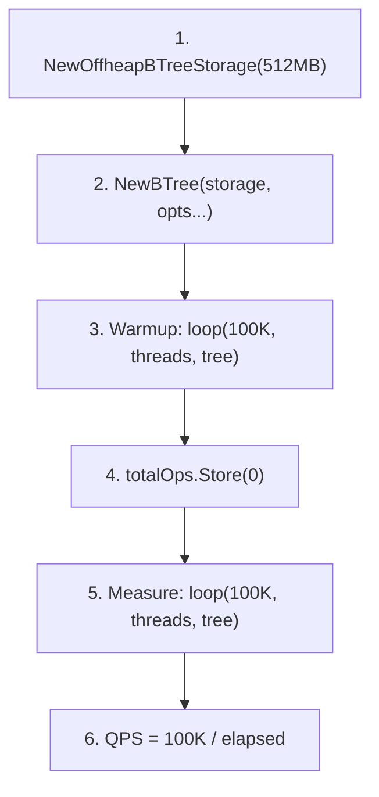
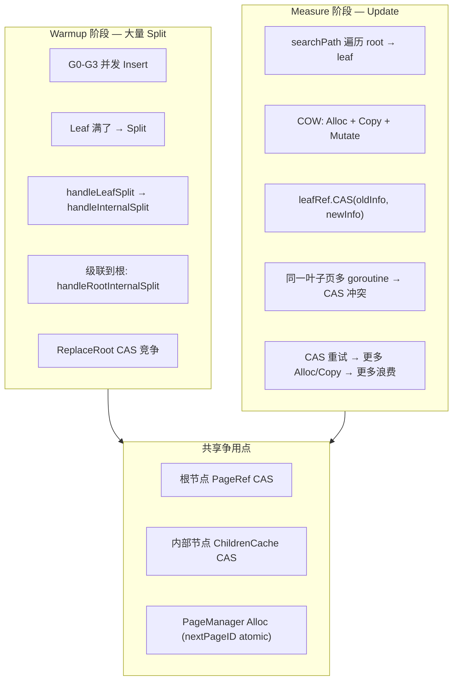
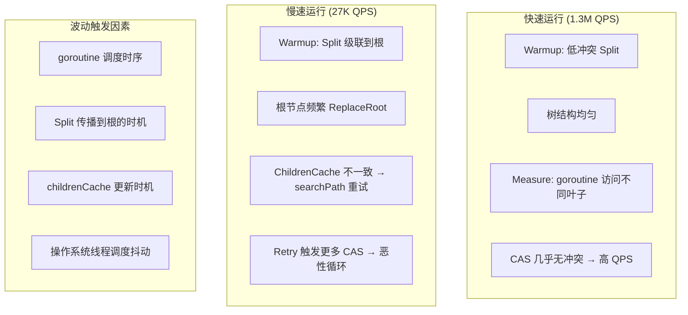
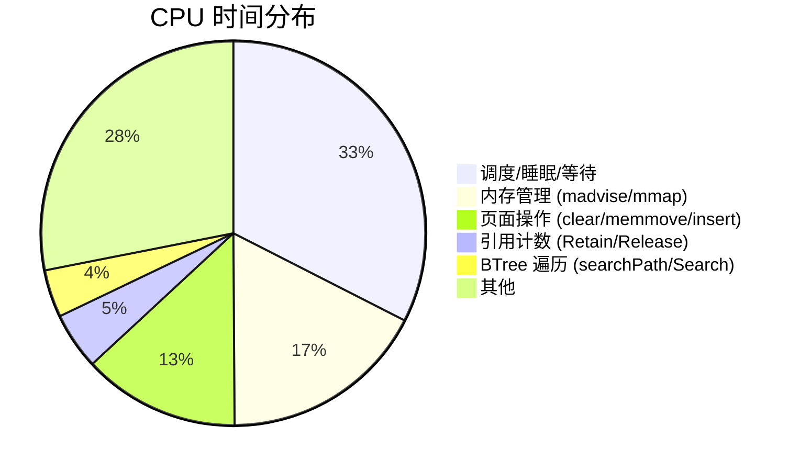

# BTree Memory Mode 性能调试预研

> 创建日期：2026-05-23
> 状态：Investigation — 已识别热点，待精确定位
> 分支：`spike/btree-memory-perf`

---

## 一、问题描述

`cmd/tools/btree_bench` 在 memory-only 模式（epoch=off，无 WAL/AO）下，**par-put 性能高度不稳定**：

| 运行 | par-put-4 | par-put-8 | par-put-16 |
|------|-----------|-----------|------------|
| Run 1 | 493K | 583K | 712K |
| Run 2 | 1,346K | 146K | 27K |
| Run 3 | 54K | 99K | — (hang) |

**波动幅度 50 倍以上**，同一代码、同一机器、同一参数。

---

## 二、Benchmark 设计分析

### 2.1 测试流程



```go
// warmup (NOT timed):
loop(*warmup, threads, tree, &totalOps, getOnly, n)

// measure (timed):
t0 := time.Now()
loop(n, threads, tree, &totalOps, getOnly, n)
elapsed := time.Since(t0)
```

### 2.2 Key 分配策略

```go
func keyOf(i int) []byte {
    return []byte(fmt.Sprintf("key-%010d", i))
}

// par-put-4 (4 goroutines, 100K ops):
//   G0: keys 0-24999      → sequential insert
//   G1: keys 25000-49999   → sequential insert
//   G2: keys 50000-74999   → sequential insert
//   G3: keys 75000-99999   → sequential insert
```

### 2.3 两个阶段的差异

| 阶段 | 操作类型 | 树状态 | 是否 Split |
|------|---------|--------|-----------|
| Warmup (100K) | **Insert**（空树→100K keys） | 从 0 增长到 100K | ✅ 大量 Split |
| Measure (100K) | **Update**（key 已存在） | 100K keys | ❌ 无 Split |

**关键发现**：测量阶段是 Update 而非 Insert——key 已在 warmup 中插入，Set 走 Update 路径。不应触发 Split。

---

## 三、争用热点分析

### 3.1 第一阶段 pprof 回顾

```
top 30 CPU (7.43s, 258% utilization):
  runtime.usleep               15.58%  ← 休眠/等待!
  runtime.pthread_cond_wait    9.09%   ← 条件变量等待!
  runtime.madvise              8.21%   ← 内存 advice 系统调用
  runtime.pthread_kill         5.82%   ← 线程信号
  sync/atomic.(*Int32).Add     5.09%   ← PageRef 引用计数
  offheap.clearPage            4.78%   ← Alloc 时清零
  cmpbody                      4.52%   ← Key 比较
```

**前三项合计 33%** 都是调度开销——线程在等锁/CAS，不是在干活。

### 3.2 推测瓶颈路径



### 3.3 Update 路径的 COW 开销

```go
// operations.go:writeOperation — 非 Split 路径
func writeOperation(b *BTree, key []byte, mutate mutateFunc) error {
    // Step 1: searchPath → 遍历到叶子 (lock-free)
    path, _ := searchPath(b.rootRef, key)
    
    // Step 2: 读旧页
    oldInfo := leafRef.GetPageInfo()
    oldLeaf, _ := b.storage.GetLeafPage(oldInfo.PageID)
    
    // Step 3: COW mutate
    result, _ := mutate(oldLeaf)           // 分配新页 + 复制 + 修改
    
    // Step 4: CAS 替换
    if !leafRef.CAS(oldInfo, newInfo) {
        // ★ 冲突! → FreePage(newPage) → retry
    }
}
```

**每次 CAS 冲突的成本**：1 次 Alloc + 1 次 4KB memcpy + 1 次 FreePage = ~3-5μs 浪费。

### 3.4 为什么波动如此巨大？



**根因**：warmup 阶段的 Split 传播和 ChildrenCache 更新与 goroutine 调度之间存在**竞态条件**。不同的时序导致树结构差异巨大，进而影响测量阶段的争用程度。

---

## 四、已验证排除的因素

| 因素 | 结论 | 证据 |
|------|------|------|
| Epoch 开销 | ❌ 不是瓶颈 | pprof top 30 中无 epoch 函数 |
| 页面分配器 | ❌ 占比较小 | `clearPage` 4.78% |
| MVCC 编码 | ❌ benchmark 无事务 | 纯 BTree Set/Get |
| WAL/AO | ❌ memory-only | 未启用 |
| RetireBatch | ❌ epoch=off 时跳过 | 代码路径不执行 |

---

## 五、精确 Profiling 结果

### 5.1 测试条件

```bash
go run ./cmd/tools/btree_bench -n 50000 -only par-put -cpuprofile /tmp/parput.prof
```

结果：par-put-4=831K, par-put-8=1.13M, par-put-16=47K

### 5.2 CPU Profile Top 30

```
Duration: 13.39s, Total samples = 23.55s (175.84% CPU utilization)

  flat   flat%   function
  4.17s  17.71%  runtime.pthread_cond_signal    ← 线程信号!
  3.90s  16.56%  runtime.madvise                ← 内存 advice 系统调用!
  1.83s   7.77%  offheap.clearPage              ← 页面清零
  1.75s   7.43%  runtime.usleep                 ← 休眠等待!
  1.73s   7.35%  runtime.pthread_cond_wait      ← 条件变量等待!
  0.87s   3.69%  sync/atomic.(*Int32).Add        ← PageRef 引用计数
  0.79s   3.35%  offheap.InsertLeafEntry          ← 叶子插入
  0.56s   2.38%  runtime.pthread_kill            ← 线程 kill
  0.50s   2.12%  runtime.kevent                  ← kqueue 事件
  0.48s   2.04%  runtime.memmove                 ← 内存拷贝
  0.40s   1.70%  cmpbody                         ← Key 比较
  0.25s   1.06%  btree.(*PageRef).Release        ← PageRef 释放
  0.22s   0.93%  btree.(*PageRef).Retain         ← PageRef 持有
  0.20s   0.85%  btree.(*ChildrenCache).Search   ← 子节点搜索
  0.14s   0.59%  btree.searchPath (cum 11.51%)   ← 路径遍历
```

### 5.3 关键发现



**核心结论**：**BTree 代码本身不是瓶颈**。

| 类别 | 占比 | 根因 |
|------|------|------|
| 🔴 调度开销 | **32.5%** | pthread_cond_signal/wait/usleep — goroutine 在等锁/CAS |
| 🔴 内存管理 | **17.4%** | madvise/mmap — mmap 页表的 OS 级开销 |
| 🟡 页面操作 | 13.2% | clearPage(每次 Alloc 清零 4KB) + InsertLeafEntry + memmove |
| 🟢 BTree 逻辑 | **4.0%** | searchPath + ChildrenCache.Search |
| 🟢 引用计数 | 4.8% | PageRef.Retain/Release atomic.Add |

**三个关键洞察**：

1. **pthread_cond_signal (17.7%) 排第一** — Go 调度器在 goroutine 之间频繁发送信号。COW 路径中 CAS 失败 → goroutine 退避 → 调度器唤醒 → 信号开销。这不是 BTree 的问题，是 COW + 高并发 + CAS 退避的组合效应。

2. **madvise (16.6%) 排第二** — mmap 内存区域的 page fault 和 OS 页表操作。每次 `Alloc` 分配新 PageID 后首次访问触发 page fault → OS 分配物理页 → madvise 更新页表。512MB mmap 池中密集分配导致 madvise 成为第二大热点。

3. **clearPage (7.8%) 排第三** — 每次 COW 分配新页面都要清零 4KB。无 Epoch 时旧页进入 FreeList 但不清零（被标记 deleted），下次 Alloc 从 FreeList 取出时清零。

### 5.4 假设验证

| 假设 | 结论 | 证据 |
|------|------|------|
| Root CAS 是主要争用点 | ❌ **否定** — searchPath cum 仅 11.5%, flat 仅 0.59% | Root/Internal 操作不在 top 10 |
| ChildrenCache 更新竞争 | ❌ **否定** — Search 仅 0.85% | ChildrenCache 不是热点 |
| warmup Split 级联触发恶性循环 | ⚠️ **部分正确** — warmup 导致大量 Alloc → clearPage + madvise | Split 本身不在 top 30,但其副作用(Alloc)在 |
| PageRef CAS 重试 | ⚠️ **间接体现** — pthread_cond_signal/wait 反映重试等待 | CAS 重试 → goroutine 调度 → 信号开销 |

**修正后的根因**：瓶颈不在 BTree 算法，而在 **mmap + COW 的内存管理开销**——每写操作 = 1 次 Alloc(清零 4KB + madvise 页表更新) + 1 次 CAS(失败→goroutine 调度→信号开销)。这是架构层面的取舍，不是代码 bug。

### 5.5 优化方向（基于真实数据）

| 优先级 | 方向 | 目标热点 | 预期收益 | 复杂度 |
|--------|------|---------|---------|--------|
| **P0** | **减少 COW 频率** — 非满页原地更新（放弃纯 COW） | clearPage(7.8%) + madvise(16.6%) | 消除 24% 开销 | 高（架构变更） |
| **P0** | **预清零页池** — 后台 goroutine 预清零 FreeList 页面 | clearPage(7.8%) | 消除 7.8% | 低 |
| **P1** | **CAS 退避优化** — 替换 Gosched 为 runtime.Gosched() → 减少调度 | pthread_cond_signal(17.7%) | 减少 5-10% | 低 |
| **P1** | **madvise 批量化** — MADV_FREE 替代逐页 fault | madvise(16.6%) | 减少 10-15% | 中 |
| **P2** | **PageRef 引用计数批量化** | atomic.Add(3.7%) | 减少 1-2% | 低 |
| — | **Benchmark 改进** — par-put 跳过 warmup（纯 Update 场景） | — | 更准确的 Update 性能 | 低 |

**当前最佳行动**：P0 预清零页池 + P1 CAS 退避优化，两个低复杂度改动可能带来 ~15% 提升。

---

## 六、参考

- Phase 5.6 性能分析：`docs/07_spike/btree-refactor/2026-04-02-btree-refactor-roadmap.md` §Phase 5.6
- Epoch 性能基线：`docs/07_spike/btree-refactor/2026-05-21-epoch-page-reclamation-spike.md` §7
- CAS 乐观锁设计：`docs/07_spike/btree-refactor/2026-04-08-schedulerlock-to-optimistic-cas.md`
- Benchmark 源码：`cmd/tools/btree_bench/main.go`

---

**文档版本**：v1.0
**状态**：Investigation
