# NexKV 持久化架构全景指南

> 从头理解 NexKV 的存储引擎、WAL、AO 落盘、MVCC 事务、Checkpoint 与崩溃恢复
> 创建日期：2026-05-23
> 覆盖范围：Page 物理布局 → BTree COW → AO Chunk 落盘 → WAL 日志 → Checkpoint → MVCC 事务 → Recovery
> 图表格式：Mermaid（可在 GitHub、Obsidian 等支持 Mermaid 的 Markdown 渲染器中直接查看）

---

## 目录

1. [总览：数据的一生](#一总览数据的一生)
2. [深入理解 WAL 与 AO](#14-深入理解-wal-与-ao)
3. [第一层：物理 Page 布局](#二第一层物理-page-布局)
4. [第二层：mmap 页面池与 COW](#三第二层mmap-页面池与-cow)
5. [第三层：BTree 存储引擎](#四第三层btree-存储引擎)
6. [第四层：AO Chunk 落盘](#五第四层ao-chunk-落盘)
7. [第五层：WAL 日志](#六第五层wal-日志)
8. [第六层：Checkpoint 检查点](#七第六层checkpoint-检查点)
9. [第七层：MVCC 多版本并发控制](#八第七层mvcc-多版本并发控制)
10. [第八层：Epoch 页面回收](#九第八层epoch-页面回收)
11. [第九层：崩溃恢复](#十第九层崩溃恢复)
12. [完整数据流：一条 Put 的旅程](#十一完整数据流一条-put-的旅程)
13. [关键设计决策汇总](#十二关键设计决策汇总)
14. [附录 A：关键文件索引](#附录-a关键文件索引)
15. [附录 B：磁盘文件格式速查](#附录-b磁盘文件格式速查)

---

## 一、总览：数据的一生

在深入细节之前，先用一张全景图理解 NexKV 的存储架构。

### 1.1 全景架构图

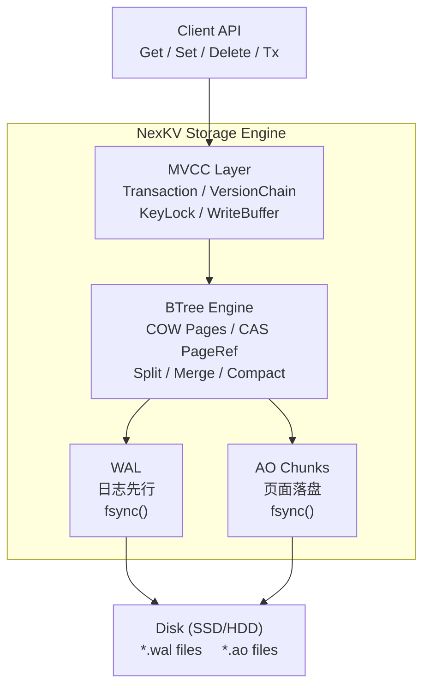

**组件交互全景**：

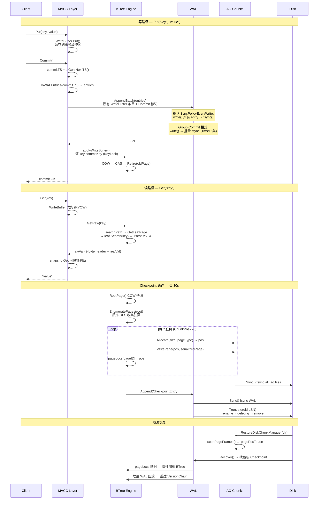

### 1.2 数据的两条持久化路径

NexKV 采用 **WAL + Checkpoint 双路径持久化**，借鉴了经典数据库的 Write-Ahead Logging 模式：

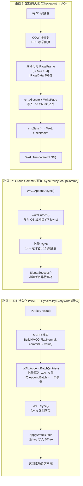

**WAL 同步策略说明**：

| 策略 | 行为 | 类比 |
|------|------|------|
| `SyncPolicyEveryWrite` (默认) | 每次 `AppendBatch` 后立即 fsync。MVCC Commit 将事务所有 WAL Entry 打包为一次 `AppendBatch`，因此是**一个事务一次 fsync**，非每个 Entry 一次 | 类似于 Lealone `instant` 模式 |
| `SyncPolicyGroupCommit` | 写入 OS 缓冲区不 fsync，由后台 task scheduler 批量 fsync（1ms ticker + 16 条目 batch 触发） | 类似于 Lealone `periodic` 模式（~3s 循环） |
| `SyncPolicyEverySecond` | 每秒一次 fsync | — |
| `SyncPolicyBatch` | 批量级别同步 | — |

> **与 Lealone 的对比**：Lealone 默认使用 `periodic` 模式——后台线程每 ~3s 收集所有 pending RedoLogRecord 批量写入 + 一次 fsync，事务提交不等待 fsync 完成。NexKV 的默认 `SyncPolicyEveryWrite` 更保守（保证每个事务落盘），但 Group Commit 模式与 Lealone 的 `periodic`/`instant` 对齐——批量 fsync 而非逐条 sync。

### 1.3 关键数据结构速览

| 数据结构 | 位置 | 用途 |
|---------|------|------|
| `PageHeader` (56B) | mmap 每页开头 | 页面元数据：版本号、类型、计数、兄弟链 |
| `LeafEntry` (16B) | mmap 页内 | 叶子页的 KV 条目：key 偏移 + value 偏移 |
| `IndexEntry` (16B) | mmap 页内 | 内部节点的索引条目：key 偏移 + child pageID |
| `PageInfo` | Go 堆 | PageRef 发布的不变元数据：PageID、Version、NodeState、ChunkPos |
| `PageRef` | Go 堆 | CAS 可替换的页面引用：pInfo + children cache |
| `WALEntry` | WAL 文件 | 操作日志：LSN、Type、Key、Value、TxID、CRC32C |
| `ChunkHeader` | .ao 文件头 | Chunk 元数据：ID、pageCount、removedPageOffset |
| `PageFrame` | .ao 文件体 | 页面序列化：CRC32C + PageHeader + KV Data |
| `VersionChain` | Go 堆 | MVCC 版本链：head → node(commitTS, oldValue) → node(...) |
| `ChunkPosition` (uint64) | 各处 | 页面在 .ao 文件中的定位编码 |

---

### 1.4 深入理解 WAL 与 AO

在深入各层细节之前，必须先理解两个核心持久化机制——**WAL** 和 **AO**——是什么、为什么这样设计、以及它们如何协作。

#### 1.4.1 WAL：Write-Ahead Logging（预写日志）

**WAL 是什么？**

WAL 是一条**只能追加、不可修改**的操作日志。在执行任何内存修改之前，必须先将操作记录写入 WAL 并持久化到磁盘。这是数据库领域的经典设计原则——**先记日志，后改数据**。

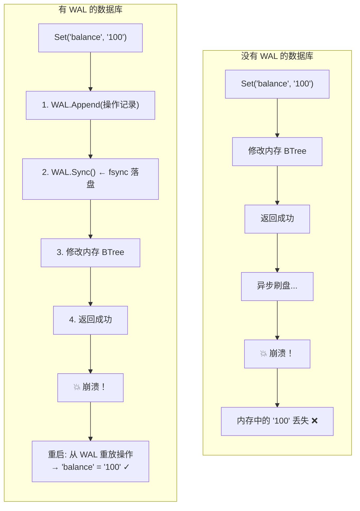

**WAL 解决了什么问题？**

| 问题 | 没有 WAL | 有 WAL |
|------|---------|--------|
| 崩溃后数据 | 内存中未刷盘的数据**永久丢失** | 从 WAL 重放，**一条不丢** |
| 写入原子性 | 部分写入不可检测 | Commit 标记保证**全部 or 全不** |
| 恢复时间 | 需要全量扫描修复 | 从最后一个 Checkpoint 增量回放 |

**WAL 的代价与权衡：**

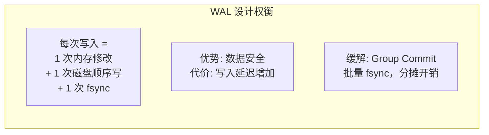

- **顺序写**：WAL 是 append-only 文件，磁盘顺序写速度远超随机写（~100MB/s vs ~1MB/s）
- **fsync 是瓶颈**：每次 fsync 等待磁盘确认，是最大的延迟来源
- **Group Commit**：将多个事务的 WAL 写入合并为一次 fsync，大幅提升吞吐

**WAL 文件的生命周期：**

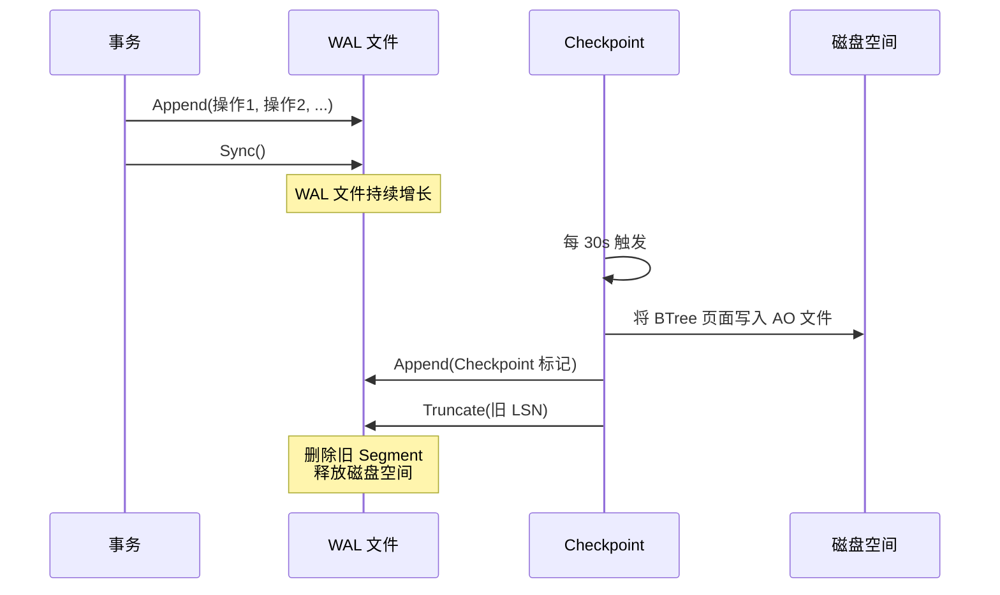

WAL 文件是**临时的**——Checkpoint 确认数据已持久化到 AO 后，对应的 WAL 即可删除。

#### 1.4.2 AO：Append-Only Chunk（只追加块文件）

**AO 是什么？**

AO（Append-Only）是一种**页面级持久化文件格式**。BTree 的内存页面（4KB）被序列化为 PageFrame 写入 `.ao` 文件——也只能追加，从不原地修改。

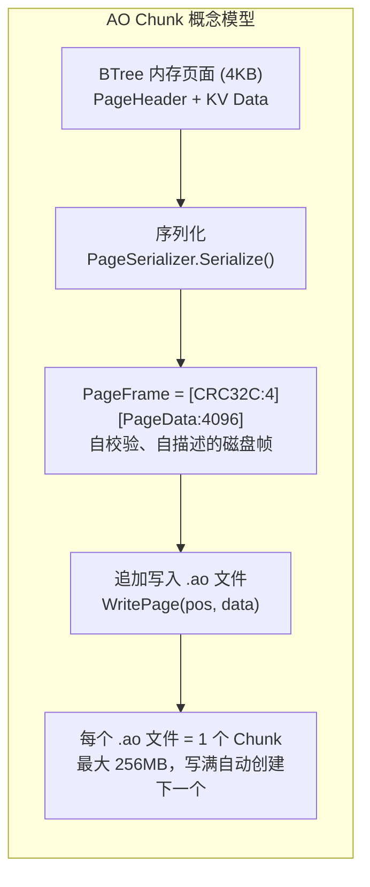

**为什么叫 Append-Only？**

```
传统文件（可随机写）：           AO 文件（只追加）：
┌───┬───┬───┬───┬───┐          ┌───┬───┬───┬───┬───┬───┬───┐
│ A │   │ C │   │ E │          │ A │ B │ C │ D │ E │ F │ G │
└───┴───┴───┴───┴───┘          └───┴───┴───┴───┴───┴───┴───┘
  ↑ 删除B  ↑ 删除D               ← 只往后追加，从不删除或修改 →
  产生空洞                       删除 = 标记 removedPages
                                 回收 = ChunkCompactor 异步重写
```

- **不原地修改**：页面更新后写新位置，旧位置标记为 `removedPages`
- **不原地删除**：FreePage 只标记不释放空间，由 `ChunkCompactor` 异步回收
- **自校验**：每个 PageFrame 带 CRC32C，损坏只丢一帧

**AO 解决了什么问题？**

| 问题 | 只有 WAL | WAL + AO |
|------|---------|----------|
| WAL 无限增长 | 所有操作永久保留，磁盘耗尽 | Checkpoint 后截断 WAL |
| 恢复速度 | 重放全部历史 WAL，恢复极慢 | 加载 AO + 少量 WAL 增量 |
| 页面读取 | 只能在内存中 | 惰性加载：按需从 AO 读入 mmap |

#### 1.4.3 WAL + AO 协作全景

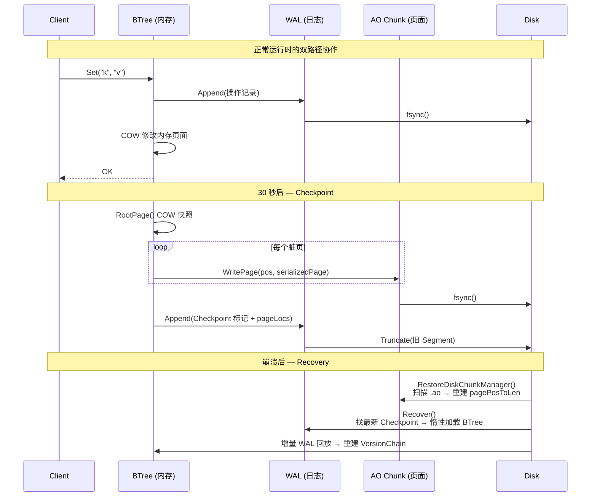

**为什么数据库都这样设计？**

```
这是数据库领域的经典分层：

┌──────────────────────────────────────────────┐
│              写入路径                         │
│                                              │
│  用户操作 ──→ WAL (实时, 低延迟, 顺序写)      │
│                    │                         │
│                    ▼                         │
│              BTree (内存, 高性能读写)          │
│                    │                         │
│                    ▼ (定期, 30s)              │
│              AO Chunk (持久, 页面落盘)         │
└──────────────────────────────────────────────┘

为什么不是直接写 AO？
  → AO 页面是随机位置，直接写需要随机 I/O（慢）
  → WAL 是顺序追加，磁盘顺序写 ~100MB/s
  → 先写 WAL（快），再异步写 AO（后台）

为什么不是只写 WAL？
  → WAL 记录每次操作，无限增长
  → 恢复需要重放全部历史（慢）
  → AO 存页面快照，恢复只需加载 + 少量增量

两条路径配合：
  WAL = 低延迟安全网（操作级）
  AO  = 高吞吐持久化（页面级）
```

**类比：就像记账**

```
WAL = 流水账本（每笔交易即时记录）
  "2026-05-23 14:30:01  收入 +100  余额=1100"
  "2026-05-23 14:30:05  支出 -50   余额=1050"
  → 随时可查最新余额，但翻历史账很慢

AO = 月度总账（定期汇总页面快照）
  "2026年5月 第3页:  期初=1000, 收入合计=500, 支出合计=300, 期末=1200"
  → 快速了解某月状态，但看不到每笔明细

WAL + AO = 流水账 + 总账
  → 今天查余额：看流水账最后一行（WAL 最新 LSN）
  → 查上个月状态：直接翻总账第3页（AO Chunk）
  → 上个月第3页之后的变化：从流水账增量回放（WAL Recovery）
```

---

## 二、第一层：物理 Page 布局

NexKV 最底层的存储单元是 **4KB 的 Page**，通过 mmap 映射到内存。理解 Page 的物理布局是理解一切的基础。

### 2.1 Page 的整体结构

每个 Page（无论叶子还是内部节点）都是 4096 字节，分为四个区域：

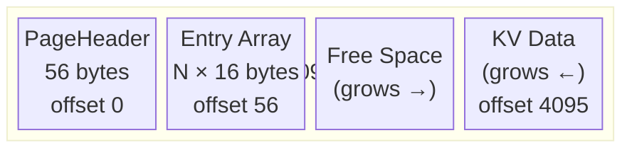

**关键规则**：
- Entry Array 从前往后增长（offset 56 → offset 4095）
- KV Data 从后往前增长（offset 4095 → offset 56）
- 两者在中间相遇 → 页面满 → 触发 Split
- 不需要预先划分"元数据区"和"数据区"，最大化空间利用

### 2.2 PageHeader：每个 Page 的身份证（56 字节）

`PageHeader` 是每个 Page 的前 56 字节，代码位置：`internal/infrastructure/storage/offheap/page_layout.go:32-44`

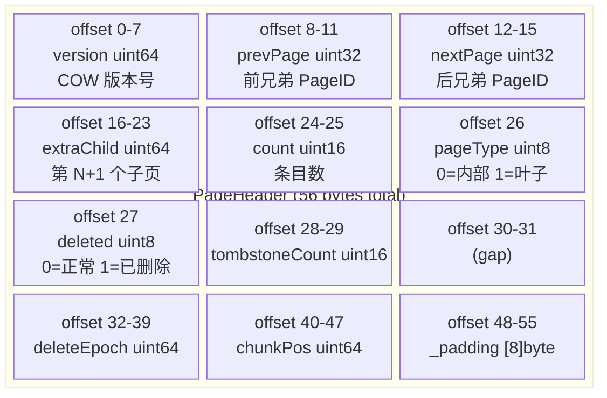

**关键字段解读**：

- **version**：COW 版本号。每次 COW 分配新页面时 version = 原页面 version + 1。用于快照隔离。
- **prevPage / nextPage**：组成叶子页的双向链表，用于 Range Scan。初始值为 `0xFFFFFFFF`（哨兵）。
- **extraChild**：B+Tree 内部节点的特殊设计。N 个 Key 有 N+1 个 Child，前 N 个 Child 存在 IndexEntry 中，第 N+1 个存在这里。
- **pageType**：决定 Entry Array 里存的是 LeafEntry 还是 IndexEntry。
- **tombstoneCount**：Phase 6.5 引入，追踪逻辑删除但物理未删除的条目数。
- **chunkPos**：辅助校验字段。PageInfo.ChunkPos 才是权威来源。

### 2.3 LeafEntry：叶子页的 KV 条目（16 字节）

代码位置：`internal/infrastructure/storage/offheap/page_layout.go:64-69`

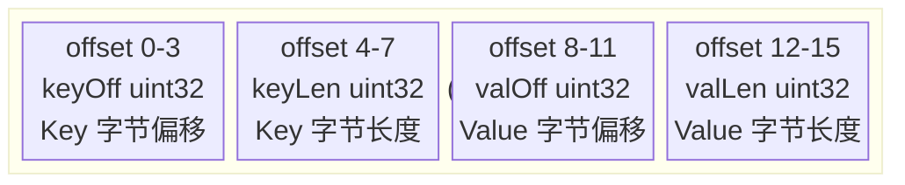

**LeafEntry 不存储 Key/Value 本身，只存储偏移量和长度**。实际的 Key 和 Value 数据存在页面的 KV Data 区域。

```
举例：一个叶子页有 3 个条目

LeafEntry[0]: {keyOff:4040, keyLen:6, valOff:4080, valLen:10}  → "hello" → "world!!!!!!"
LeafEntry[1]: {keyOff:4030, keyLen:5, valOff:4070, valLen:10}  → "foo"   → "bar!!!!!!!!"
LeafEntry[2]: {keyOff:4010, keyLen:3, valOff:4060, valLen:10}  → "xyz"   → "abc!!!!!!!!"

KV Data 区（从 Page 尾部向前排列）：
offset 4095 ← value[0]: "world!!!!!!" (10B)
offset 4080 ← key[0]:   "hello" (6B)
offset 4070 ← value[1]: "bar!!!!!!!!" (10B)
offset 4060 ← key[1]:   "foo" (5B)
...
```

### 2.4 IndexEntry：内部节点的索引条目（16 字节）

代码位置：`internal/infrastructure/storage/offheap/page_layout.go:54-58`

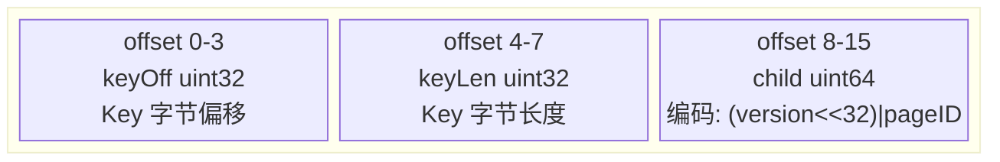

**Child 编码**（`EncodeChildWithVersion`）：
```
child = (version << 32) | pageID

高 32 位：子页的 COW 版本号
低 32 位：子页的 PageID
```

**B+Tree 内部节点的组织规则**：

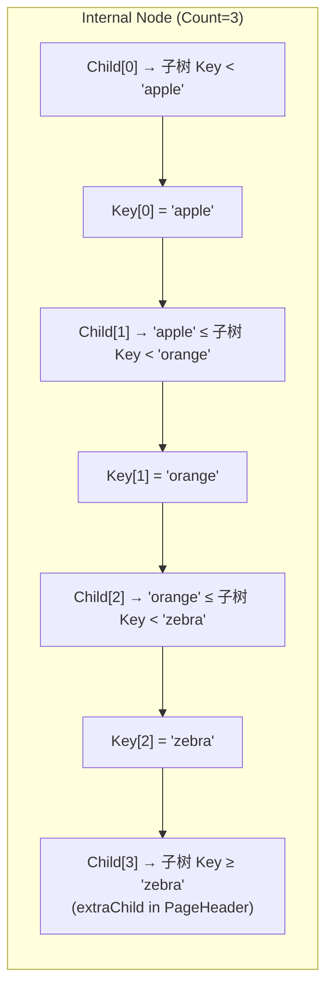

### 2.5 页面容量计算

**空间检查**（`IsFull()`）：判断能否插入新的 KV 对：

```
可用空间 = 4096 - 56(Header) - count×16(EntryArray) - dataEnd(KVData)

新条目需要 = 16(新Entry) + len(key) + len(value)
若 需要 > 可用空间 → 页面满 → 触发 Split
```

**最大容量估算**：一个 4KB 页面约可存储 ~168 个 4-byte key + 4-byte value 的叶子条目（或 ~101 个 12-byte key + 12-byte value）。

---

## 三、第二层：mmap 页面池与 COW

### 3.1 mmap 页面池

NexKV 的整个 BTree 存储在一片巨大的 mmap 映射中。代码位置：`internal/infrastructure/storage/offheap/page_manager.go`

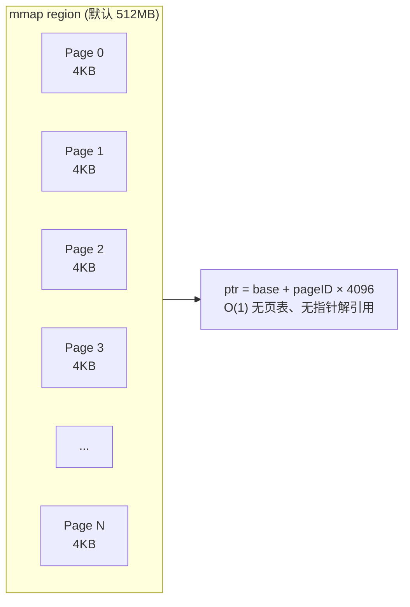

**PageID 到指针的转换**（O(1)）：
```go
// page_manager.go:157
func (pm *PageManager) PageIDToPtr(pageID uint32) unsafe.Pointer {
    if pageID >= pm.total {
        panic("offheap: pageID out of range")
    }
    return unsafe.Add(pm.base, uintptr(pageID)*PageSize)
}
```

**分配策略**：
1. 优先从 FreeList（无锁队列）获取回收的 PageID
2. FreeList 为空时，从 `nextPageID` 单调递增分配
3. 新分配的 Page 清零（`clearPage`），version 初始化为 1

### 3.2 COW（Copy-On-Write）语义

NexKV 的 BTree 采用 **页面级 Copy-On-Write**。这是整个系统的核心并发控制机制。

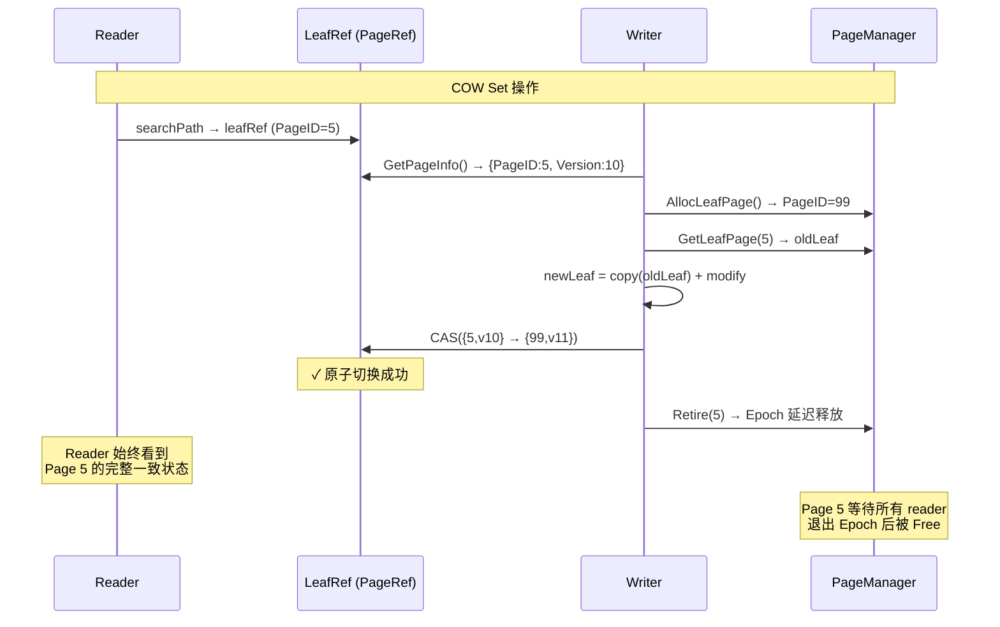

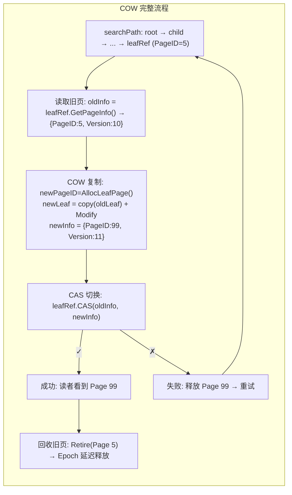

### 3.3 PageRef：CAS 可替换的页面引用

代码位置：`internal/infrastructure/storage/btree/page_ref.go`

```go
type PageRef struct {
    pageID   model.PageID                   // 不变：这个引用指向哪个 Page
    pInfo    atomic.Pointer[PageInfo]       // 原子替换：当前 Page 的元数据
    children atomic.Pointer[ChildrenCache]  // 原子替换：子页缓存（内部节点用）
    refCount atomic.Int32                   // 引用计数：多少 reader 正在使用
    freeFunc func(model.PageID)             // refCount 归零时的回调
}
```

**PageInfo**（代码位置：`internal/infrastructure/storage/btree/page_info.go`）：

```go
type PageInfo struct {
    PageID       model.PageID         // 页面 ID
    Version      uint64               // COW 版本号
    Redirect     bool                 // 是否已重定向（split/merge 后）
    NewRef       *PageRef             // Redirect=true 时指向新页面
    IsLeaf       bool                 // 是否叶子页
    NodeState    NodeState            // Normal/Splitting/Merging/Compacting/Redirect
    ChildVersion uint64               // 子页版本校验
    ChunkPos     model.ChunkPosition  // AO 位置（0=脏页）
}
```

**NodeState 状态机**：

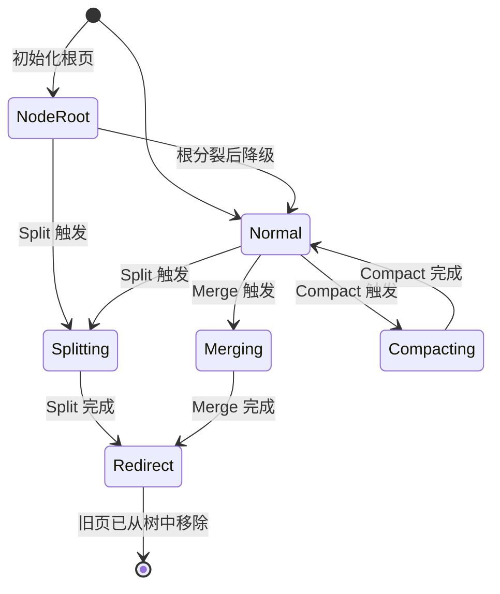

---

## 四、第三层：BTree 存储引擎

### 4.1 BTree 结构体

代码位置：`internal/infrastructure/storage/btree/btree.go`

```go
type BTree struct {
    rootRef        *RootPageRef           // 根页面引用（CAS 替换）
    storage        *OffheapBTreeStorage   // mmap 存储管理
    size           atomic.Int64           // 逻辑 key 数量
    closed         atomic.Bool            // 生命周期守卫
    metrics        *BTreeMetrics          // 性能指标
    epochMgr       *EpochManager          // 旧页延迟回收
    epochCancel    context.CancelFunc     // Epoch 后台 goroutine 生命周期
    tsGen          mvcc.TSGenerator       // MVCC 时间戳生成
    txMgr          mvcc.TxManager         // 事务管理器
    compactWp      WatermarkProvider      // Compaction 水位
    compactMu      sync.Mutex             // Compaction 串行化
}
```

### 4.2 Set 操作的完整流程

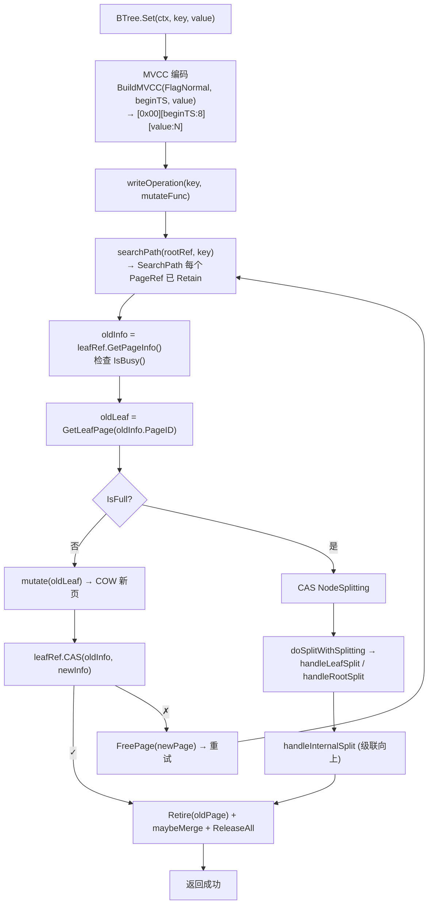

### 4.3 Split 分裂流程（树长高）

当一个页面满了，需要分裂为两个页面：

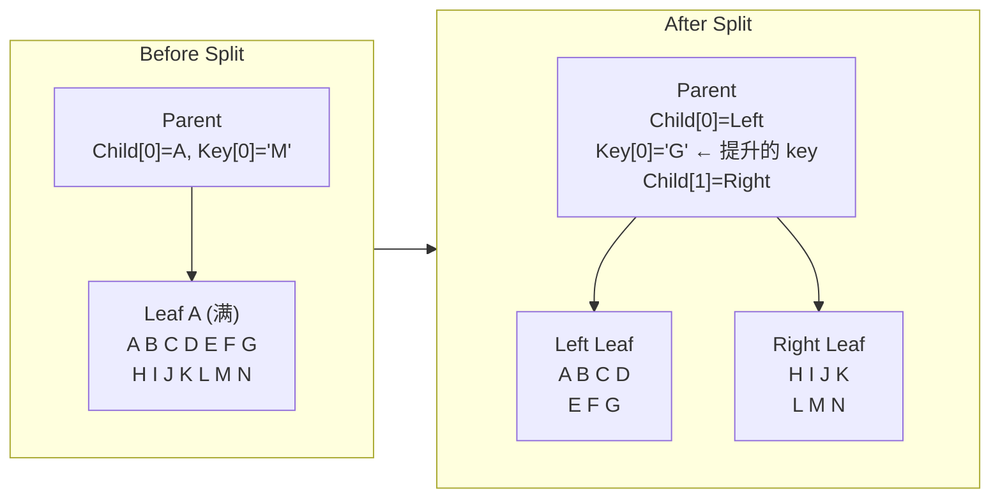

**Split 的 CAS 协议**（`handleLeafSplit`，`operations.go:744-878`）：

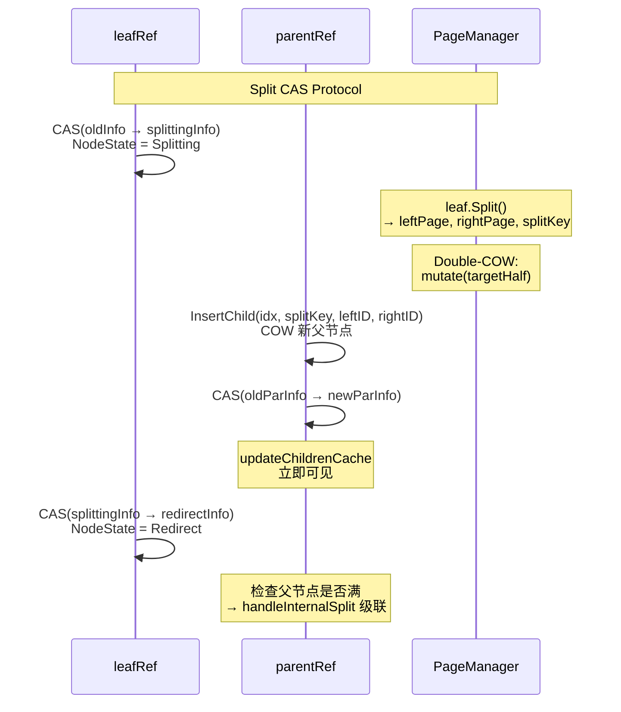

### 4.4 Merge 合并流程（树收缩）

当页面利用率低于 50%，触发 Lazy Merge（`handleLeafMerge`, `merge_ops.go:38-189`）：

```mermaid
flowchart LR
    subgraph Before2["Before Merge"]
        BP2["Parent<br/>Child[0]=Left<br/>Key[0]=separator<br/>Child[1]=Right"]
        BL2["Left Leaf<br/>A B C D"]
        BR2["Right Leaf<br/>E F G H"]
        
        BP2 --> BL2
        BP2 --> BR2
    end
    
    subgraph After2["After Merge"]
        AP2["Parent<br/>Child[0]=Merged"]
        AM2["Merged Leaf<br/>A B C D E F G H"]
        
        AP2 --> AM2
    end
    
    Before2 --> After2
```

**Merge 的 4-Phase CAS 协议**：

```mermaid
sequenceDiagram
    participant RA as refA (low PageID)
    participant RB as refB (high PageID)
    participant PR2 as parentRef
    
    Note over RA,PR2: Phase 1: CAS NodeMerging
    RA->>RA: CAS(piA → markA) ✓
    RB->>RB: CAS(piB → markB) ✓
    Note over RB: 失败则回滚 refA
    
    Note over RA,RB: Phase 2: COW Merge<br/>MergeLeaves(left, right)
    
    Note over PR2: Phase 3: COW Parent<br/>RemoveChild + ReplaceChild
    PR2->>PR2: CAS(parentPI → newParPI)
    
    Note over RA,RB: Phase 4: Mark Redirect<br/>Retire old pages via Epoch
    
    Note over PR2: Underflow? → handleInternalMerge 递归
```

---

## 五、第四层：AO Chunk 落盘

AO（Append-Only）Chunk 是 NexKV 的页面持久化文件。代码位置：`internal/infrastructure/storage/chunk/`

### 5.1 .ao 文件物理布局

```mermaid
block-beta
    columns 1
    block:ao["btree_{chunkID}_{seq}.ao 文件"]
        columns 1
        block:header["Header Block 0 (4096 bytes) - offset 0x0000"]
            columns 1
            H0A["id:0<br/>rootPagePos:0<br/>pageCount:42<br/>sumOfPageLength:172200<br/>sumOfLivePageLength:164000<br/>pagePositionAndLengthOffset:0<br/>blockSize:4096<br/>format:1<br/>removedPageOffset:0<br/>removedPageCount:3<br/>lastTransactionId:0<br/>mapSize:0<br/>(key:value 文本格式，共 12 字段，对齐 Lealone)"]
        end
        block:header2["Header Block 1 (4096 bytes) - offset 0x1000<br/>完全相同，用于崩溃恢复"]
        end
        block:frames["Page Frames (offset 0x2000 → EOF)"]
            columns 1
            F0["Frame 0 (4100 bytes): [CRC32C:4][PageHeader:56][...KV Data...]"]
            F1["Frame 1 (4100 bytes): [CRC32C:4][PageHeader:56][...KV Data...]"]
            Fn["..."]
        end
    end
```

**为什么需要双 Block Header？**

```mermaid
flowchart TB
    subgraph Crash1["危险时序"]
        C1A["T1: 开始写 Block 0"]
        C1B["T2: 写了一半 → 崩溃"]
        C1C["Block 0 损坏 ← 数据丢失 ❌"]
        C1A --> C1B --> C1C
    end
    
    subgraph Safe["安全时序 (Dual-Block)"]
        C2A["T1: 写 Block 0 → 成功"]
        C2B["T2: 写 Block 1 → 崩溃"]
        C2C["Block 0 是完整的新版本 ← 可恢复 ✓"]
        C2A --> C2B --> C2C
    end
```

恢复逻辑（`readHeader()`）：先读 Block 0 → CRC/解析失败 → 读 Block 1 → 两者都失败 → Chunk 损坏，跳过。

### 5.2 PageFrame：页面的磁盘表示

代码位置：`internal/infrastructure/storage/chunk/page_serializer.go`

```mermaid
block-beta
    columns 1
    block:frame["PageFrame (60 ~ 4100 bytes)"]
        columns 2
        CRC["CRC32C<br/>4 bytes<br/>LE uint32<br/>Castagnoli 多项式"]
        Payload["Page Data (payload)<br/>56 ~ 4096 bytes<br/>PageHeader + KV Data"]
    end
```

CRC32C 覆盖 payload 部分。与 WAL 使用相同的 Castagnoli 多项式，硬件加速友好。

```go
// page_serializer.go:Serialize
func (s *PageSerializer) Serialize(ptr unsafe.Pointer, pageLength int) ([]byte, error) {
    buf := make([]byte, CRCSize+pageLength)             // [4 + N] 字节
    src := unsafe.Slice((*byte)(ptr), pageLength)        // 从 mmap 构造切片
    copy(buf[CRCSize:], src)                              // 复制页面数据
    crc := wal.CRC32C(buf[CRCSize:])                     // 计算 CRC
    binary.LittleEndian.PutUint32(buf[:CRCSize], crc)    // 小端序写入 CRC
    return buf, nil
}
```

### 5.3 ChunkPosition：页面在磁盘上的"GPS 坐标"

代码位置：`internal/domain/model/chunk_position.go`

```mermaid
block-beta
    columns 4
    A["63-38<br/>ChunkID<br/>26 bits<br/>最多 67M Chunk"]
    B["37-6<br/>FileOffset<br/>32 bits<br/>每 Chunk 4GB"]
    C["5-1<br/>PageType<br/>5 bits<br/>0=内部 1=叶子"]
    D["0<br/>Reserved<br/>1 bit"]
```

`ChunkPosition(0)` = 脏页，尚未持久化。

### 5.4 ChunkManager 操作流程

```mermaid
sequenceDiagram
    participant CM as DiskChunkManager
    participant CF as ChunkFile
    participant Disk as Disk
    
    Note over CM,Disk: Alloc + Write + Read + Free + Sync
    
    CM->>CM: Allocate(size, pageType)
    Note over CM: EncodeChunkPosition(chunkID, offset, pageType)<br/>advance nextOffset by MaxDiskPageSize
    
    CM->>CF: WritePage(pos, data)
    CF->>Disk: file.WriteAt(data, offset)
    CF->>CF: pagePosToLen[pos] = len(data)
    
    CM->>CF: ReadPage(pos)
    CF->>CF: length = pagePosToLen[pos]
    CF->>Disk: file.ReadAt(buf, offset)
    CF-->>CM: return buf
    
    CM->>CF: FreePage(pos)
    CF->>CF: removedPages[pos] = {}
    Note over CF: 不立即释放空间<br/>由 ChunkCompactor 异步回收
    
    CM->>Disk: Sync() → fsync
```

### 5.5 ChunkCompactor：空间回收

当一个 Chunk 的 `removedPages` 占比过高时（fillRate ≤ 30%），触发压缩：

```mermaid
flowchart TB
    C1["1. 收集全局 removedPages 快照"] --> C2["2. 遍历 Chunks (跳过 lastChunk)<br/>fillRate = 1 + 98 × liveLen / totalLen<br/>结果: 1=空, 99=满"]
    C2 --> C3["3. 选中 fillRate ≤ 30% 的 Chunk"]
    C3 --> C4["4. 贪心选择: 累计 liveSize ≤ 64MB"]
    C4 --> C5["5. 快照活跃页面<br/>(pagePosToLen - removedPages)"]
    C5 --> C6["6. 活跃页面复制到新 Chunk"]
    C6 --> C7["7. Sync 新 Chunk"]
    C7 --> C8["8. 删除旧 Chunk<br/>(rename → .ao.deleting → os.Remove)"]
```

---

## 六、第五层：WAL 日志

WAL（Write-Ahead Logging）保证每个操作在内存修改前先持久化到磁盘。代码位置：`internal/infrastructure/storage/wal/`

### 6.1 WAL 文件组织

```
wal_dir/
├── 00000000000000000001.wal    ← 第 1 个 Segment
├── 00000000000000001234.wal    ← 第 2 个 Segment（LSN 达到 1234 时创建）
├── 00000000000000005678.wal    ← 第 3 个 Segment
└── ...
```

**Segment 轮转**：当 Segment 达到 64MB，创建下一个。文件名用 20 位零填充 LSN，字典序 = LSN 顺序。

### 6.2 WAL Entry 的磁盘格式

```mermaid
block-beta
    columns 1
    block:wal["WAL Entry 物理布局 (BE = Big Endian)"]
        columns 2
        block:meta["元数据 (45 bytes fixed, LSN through ValLen)"]
            columns 4
            M1["CRC32C<br/>4B BE"]
            M2["Length<br/>4B BE"]
            M3["LSN<br/>8B BE"]
            M4["Type<br/>1B"]
            M5["ShardID<br/>2B"]
            M6["Term<br/>2B"]
            M7["TxID<br/>8B BE"]
            M8["Timestamp<br/>8B BE"]
            M9["PrevLSN<br/>8B BE"]
            M10["KeyLen<br/>4B BE"]
            M11["ValLen<br/>4B BE"]
        end
        block:data["可变数据"]
            columns 3
            D1["Key<br/>KeyLen bytes"]
            D2["Value<br/>ValLen bytes"]
            D3["Padding<br/>0~7B<br/>(8B align)"]
        end
    end
    Trailer["Trailer: 0xDEADBEEF (4B BE)"]
```

**CRC32C 覆盖范围**：从 Length 字段到 Padding 结束（不含 CRC 自身）。尾部 Magic Number `0xDEADBEEF` 用于恢复时的快速边界验证。

### 6.3 Group Commit（批量提交）

高并发场景下，每次写入都 fsync 效率低。NexKV 通过 `AppendAsync` + `TaskScheduler` + `WALAppendItem` 实现 Group Commit，将多个事务的 WAL 写入合并为一次 fsync。

> **与 Lealone 的对比**：Lealone 默认 `periodic` 模式——后台线程每 ~3s 收集所有 pending `RedoLogRecord`，批量写入 + 一次 fsync，事务提交**不等待** fsync 完成。NexKV 的 `SyncPolicyGroupCommit` 采用相似思路，但粒度更细：`StartBatchFlusher` 以 1ms ticker + 16 条目 batch 边界作为**双重触发器**（time + size），而非 Lealone 的纯 time-driven ~3s 循环。

```mermaid
sequenceDiagram
    participant Tx1 as Tx1
    participant Tx2 as Tx2
    participant Tx3 as Tx3
    participant DW as DiskWAL
    participant Disk2 as Disk
    
    Tx1->>DW: AppendAsync(entry) → TaskScheduler
    Tx2->>DW: AppendAsync(entry) → TaskScheduler
    Tx3->>DW: AppendAsync(entry) → TaskScheduler
    
    Note over DW: WALAppendItem 排队到 ShardID=1<br/>writeEntries() 写入 OS buffer (无 fsync)
    
    Note over DW: 双重触发: 1ms ticker 或 16 条 batch 满
    
    DW->>Disk2: FlushBatch(): 单次 fsync()
    
    DW-->>Tx1: SignalSuccess()
    DW-->>Tx2: SignalSuccess()
    DW-->>Tx3: SignalSuccess()
```

**四种 SyncPolicy 对比**：

| Policy | fsync 时机 | 事务等待 fsync | 类比 |
|--------|-----------|---------------|------|
| `EveryWrite` (默认) | 每次 `AppendBatch` 后 | 是 | Lealone `instant` |
| `GroupCommit` | 批量触发 (1ms/16条) | 否 (异步通知) | Lealone `periodic` |
| `EverySecond` | 每秒一次 | 否 | — |
| `Batch` | 批次边界 | 可配置 | — |

### 6.4 Truncate：安全截断

Checkpoint 后删除旧 WAL 文件，采用**重命名后删除**协议：

```mermaid
flowchart TB
    S1["1. rename('0001.wal', '0001.wal.deleting')"] --> S2["2. fsync(parent_dir)"]
    S2 --> S3["3. os.Remove('0001.wal.deleting')"]
    S3 --> S4["4. fsync(parent_dir)"]
    
    S1 -.-> Crash["崩溃在 rename 之后"]
    Crash -.-> Recovery["重启: cleanDeleting() 清理残留<br/>→ 安全 ✓"]
```

---

## 七、第六层：Checkpoint 检查点

Checkpoint 将内存中的 BTree 页面刷新到 AO Chunk，然后截断 WAL。代码位置：`internal/infrastructure/storage/checkpoint/checkpoint_manager.go`

### 7.1 为什么需要 Checkpoint？

```mermaid
flowchart LR
    subgraph Without["没有 Checkpoint"]
        W1["WAL 无限增长 → 磁盘耗尽"]
        W2["重启回放所有 WAL → 恢复时间无限增长"]
        W1 --> W2
    end
    
    subgraph With["有了 Checkpoint"]
        C1["定期页面持久化到 AO"]
        C2["WAL 仅保留 Checkpoint 后增量"]
        C3["恢复: 加载 AO + 少量 WAL → 快速恢复"]
        C1 --> C2 --> C3
    end
    
    Without --> With
```

### 7.2 FuzzyCheckpoint 的 7 步流程

```mermaid
sequenceDiagram
    participant M as Manager
    participant BT as BTree
    participant CM as ChunkManager
    participant WA as WAL
    participant Disk3 as Disk
    
    Note over M,Disk3: FuzzyCheckpoint T0-T7
    
    M->>M: T0: mu.Lock()
    M->>WA: T1: startLSN = CurrentLSN()
    Note over WA: 此 LSN 之前的条目将被覆盖
    
    M->>BT: T2: root = RootPage() (COW 快照)
    
    M->>BT: T3: EnumeratePages(root)<br/>后序 DFS 收集 PageFlushItem
    loop 每个脏页 (ChunkPos==0)
        M->>CM: Allocate(size, pageType) → pos
        M->>CM: WritePage(pos, serializedPageData)
        M->>M: pageLocs[pageID] = pos
    end
    M->>CM: Sync() → fsync all chunks
    
    M->>WA: T4: Append(CheckpointEntry)<br/>Key = [startLSN:8][pageCount:4][(PageID,ChunkPos)*N]
    M->>WA: T5: Sync() → fsync WAL
    
    M->>WA: T6: Truncate(startLSN)<br/>删除旧 WAL 文件
    
    M->>M: T7: mu.Unlock()<br/>异步触发 Compactor + BTree Compact
```

### 7.3 Checkpoint Key 格式

```
[startLSN:8 BE][pageCount:4 BE][(PageID:8 BE, ChunkPos:8 BE) × N]

恢复时:
  解析 pageLocs 映射 → pageLocs[PageID] = ChunkPosition
  → BTree 惰性加载: 首次访问时从 ChunkPosition 读取
```

### 7.4 Fuzzy vs Sharp Checkpoint

| 特性 | FuzzyCheckpoint | SharpCheckpoint |
|------|----------------|-----------------|
| 触发时机 | 定时（30s） | 关闭时 |
| 是否暂停写入 | 否（COW 快照） | 是 |
| pageLocs | 有 | 无（pageCount=0） |
| 用途 | 常规持久化 | 干净关闭 |

### 7.5 DirtyTracker 为什么是空的？

BTree 的 COW 语义天然解决了脏页追踪问题：每次 Set 分配新 PageID，旧 Page 不变。Checkpoint 时从 root 开始 DFS 访问所有"当前版本"页面 → 这些就是需要持久化的页面。不需要额外脏页位图。

---

## 八、第七层：MVCC 多版本并发控制

MVCC 是 NexKV 事务支持的基石。代码位置：`internal/infrastructure/storage/mvcc/`

### 8.1 Value 的 MVCC 编码

```mermaid
block-beta
    columns 3
    block:total["MVCCHeader = 9 bytes"]
        F["Flag<br/>1 byte<br/>0x00=Normal<br/>0x01=Tombstone"]
        B["beginTS<br/>8 bytes BE<br/>版本时间戳"]
        R["RealVal<br/>1-4087 bytes<br/>用户实际数据"]
    end
```

**为什么 Flag 在 BTree 内部？** B+Tree 只存每个 Key 的单版本最新值。Flag 内联意味着 Get 可以直接判断 key 是否存在（FlagTombstone → ErrKeyNotFound），Set 可以直接判断是否需要创建 VersionChain。

### 8.2 VersionChain：历史版本链

```mermaid
flowchart TB
    subgraph BTree2["BTree 当前值"]
        BV["FlagNormal<br/>beginTS = 300<br/>RealVal = '300'"]
    end
    
    subgraph Chain["VersionChain (链表)"]
        direction TB
        H["head → node<br/>commitTS = 300<br/>value = '250'<br/>flag = Normal"]
        M["next → node<br/>commitTS = 200<br/>value = '100'<br/>flag = Normal"]
        T["next → node<br/>commitTS = 100<br/>value = nil<br/>flag = Tombstone"]
        
        H --> M --> T
    end
    
    BTree2 -.->|"快照读 (snapshotTS=250):<br/>beginTS=300 > 250 不可见<br/>→ 查链 → commitTS=300 > 250<br/>→ bestNode.value = '250'"| Chain
```

### 8.3 事务生命周期

```mermaid
stateDiagram-v2
    [*] --> Begin: BeginTx()
    state Begin {
        [*] --> SnapshotAlloc: snapshotTS = tsGen.NextTS()
        SnapshotAlloc --> WriteBufferInit: WriteBuffer = {}
        WriteBufferInit --> Registry: 注册 ActiveTxRegistry
    }
    
    Begin --> Active: Put/Get/Delete
    state Active {
        [*] --> Put: WriteBuffer.Put()
        Put --> Get: WriteBuffer 优先<br/>否则 snapshotGet()
        Get --> Delete: WriteBuffer.Delete()
    }
    
    Active --> Commit: Commit()
    state Commit {
        [*] --> PreCheck: ValueHash 冲突检测
        PreCheck --> AllocTS: commitTS = tsGen.NextTS()
        AllocTS --> WALWrite: WAL.Append + Sync
        WALWrite --> Apply: applyWriteBuffer()
        Apply --> Success: cleanup()
    }
    
    Active --> Rollback: Rollback()
    state Rollback {
        [*] --> Undo: rollbackApplied(undoBuf)
        Undo --> Cleanup2: cleanup()
    }
    
    Success --> [*]
    Cleanup2 --> [*]
```

### 8.4 commitKey：提交一个 Key 的原子操作

```mermaid
sequenceDiagram
    participant CK as commitKey()
    participant KL as KeyLock
    participant VS as VersionStore
    participant BT3 as BTree
    
    CK->>VS: LoadOrStore(key) → chain<br/>(Lock 外操作)
    CK->>KL: Lock()
    
    CK->>BT3: GetRaw(key) → rawVal
    Note over CK: ParseMVCC → beginTS, flag, realVal
    
    alt Insert 冲突: flag == Normal
        CK-->>CK: ErrConflict
    else Update/Delete 冲突: beginTS != OldBeginTS
        CK-->>CK: ErrConflict
    end
    
    CK->>VS: Prepend(chain, commitTS, oldVal, oldFlag)
    Note over CK,VS: ★ Prepend-before-Set<br/>先建链，旧值不丢失
    
    CK->>BT3: Set(key, BuildMVCC(newFlag, commitTS, newVal))
    
    CK->>KL: Unlock()
    CK-->>CK: return UndoEntry
```

**为什么 Prepend-before-Set？** 崩溃在 Prepend 后、Set 前：BTree 值未变，VersionChain 有额外节点 → 恢复时重做 Set → 幂等安全。反之，Set-before-Prepend 可能导致崩溃后旧值永久丢失。

### 8.5 快照读 snapshotGet —— 无锁乐观读

```mermaid
flowchart TB
    Start2["snapshotGet(key, snapshotTS)"] --> ReadBTree["GetRaw(key) → ParseMVCC"]
    ReadBTree --> Check{"beginTS ≤ snapshotTS?"}
    
    Check -->|"是"| Visible["BTree 版本可见"]
    Visible --> CheckFlag{"Flag?"}
    CheckFlag -->|"Normal"| Return["return deepCopy(realVal)"]
    CheckFlag -->|"Tombstone"| NotFound["return ErrKeyNotFound"]
    
    Check -->|"否"| LoadChain["VersionStore.Load(key)<br/>记录 generation"]
    LoadChain --> Walk["遍历链表: 找 commitTS > snapshotTS (最小值)<br/>跳过 rolledBack + reclaimed<br/>该节点的 value = 快照时的活跃值"]
    Walk --> GenCheck{"generation 未变?"}
    GenCheck -->|"否"| Retry2["retry (max 3)"]
    GenCheck -->|"是"| Found{"找到节点?"}
    Found -->|"是"| ReturnVal["return deepCopy(node.value)"]
    Found -->|"否"| NotFound2["return ErrKeyNotFound"]
    Retry2 --> Start2
```

### 8.6 VersionChain GC

```go
func (vc *VersionChain) Prune(watermark uint64) int {
    // watermark = min(所有活跃事务的 snapshotTS)
    // commitTS < watermark 的版本对任何活跃事务都不可见
    
    // 保留规则:
    // 1. 链头始终保留
    // 2. commitTS < watermark 的最近版本保留
    // 3. 如果保留的是 Tombstone，额外保留前一个非 Tombstone 版本
    //    (防止旧快照看到 key "复活")
    
    // 其他 commitTS < watermark 的节点 → 标记 reclaimed
}
```

---

## 九、第八层：Epoch 页面回收

### 9.1 问题：COW 旧页何时可以释放？

```mermaid
sequenceDiagram
    participant R3 as Reader
    participant LR3 as leafRef
    participant W3 as Writer
    participant PM3 as PageManager
    
    Note over R3,PM3: 危险时序（无 Epoch 时）
    
    R3->>LR3: 读 rootRef → PageID=5
    W3->>LR3: CAS(5 → 99)
    W3->>PM3: FreePage(5) ← 立即回收
    PM3->>PM3: Alloc → Page 5 被重用 → count=0
    R3->>PM3: 读 Page 5 → count=0 → PANIC ❌
```

### 9.2 EpochManager：延迟释放

代码位置：`internal/infrastructure/storage/btree/epoch.go`

```mermaid
sequenceDiagram
    participant R4 as Reader
    participant EM as EpochManager
    participant W4 as Writer
    participant BG as Reclaimer (500ms ticker)
    
    R4->>EM: AllocSlot() → slot
    R4->>EM: EnterRead(slot)<br/>epoch = globalEpoch (=5)<br/>readers[slot] = 5
    
    W4->>W4: CAS(old→new) ✓
    W4->>EM: Retire(slot, oldPageID)<br/>Note over EM: epoch = globalEpoch.Load()
    
    R4->>EM: ExitRead(slot)<br/>readers[slot] = 0
    
    BG->>BG: tryReclaim()
    Note over BG: newEpoch = 6<br/>safeEpoch = min(readers) = 5(?)
    Note over BG: No, readers all 0 → safeEpoch = 6
    Note over BG: oldPage.epoch(5) < safeEpoch(6) → FreePage ✓
```

**核心思想**：记录旧页时标记当前 epoch，仅当所有看到该 epoch 的 reader 都退出后才释放。

**Reader 双检协议**：
```go
func (em *EpochManager) EnterRead(slot int) {
    epoch := em.globalEpoch.Load()
    em.readers[slot].Store(epoch)
    // 双检：防止 Load 和 Store 之间 globalEpoch 被推进
    if em.globalEpoch.Load() != epoch {
        em.readers[slot].Store(em.globalEpoch.Load())
    }
}
```

---

## 十、第九层：崩溃恢复

### 10.1 恢复全景

```mermaid
flowchart TB
    Crash["💥 崩溃"] --> PhaseA
    
    subgraph PhaseA["Phase A: 基础设施初始化"]
        direction TB
        A1["1. RestoreDiskChunkManager(dir, chunkSize)<br/>扫描 .ao 文件 → 重建 pagePosToLen"]
        A2["2. PageManager 初始化 (空 mmap 池)"]
        A3["3. WAL 扫描 → 找最新 CheckpointEntry"]
        A1 --> A2 --> A3
    end
    
    PhaseA --> PhaseB
    
    subgraph PhaseB["Phase B: BTree 结构重建"]
        direction TB
        B1["4. 解析 CheckpointEntry<br/>→ rootPageID + pageLocs"]
        B2["5. OffheapBTreeStorage.pageLocs ← 映射"]
        B3["6. RebuildBTree(rootPageID)<br/>惰性加载 PageRef 图"]
        B1 --> B2 --> B3
    end
    
    PhaseB --> PhaseC
    
    subgraph PhaseC["Phase C: 增量 WAL 回放"]
        direction TB
        C1["7. 从 checkpointStartLSN 扫描 WAL"]
        C2["8. 按 TxID 分组<br/>丢弃无 Commit 标记的事务"]
        C3["9. 已提交事务回放<br/>三阶段幂等性检查<br/>重建 BTree + VersionChain"]
        C1 --> C2 --> C3
    end
    
    PhaseC --> Done["✅ 恢复完成<br/>BTree 可服务"]
```

### 10.2 WAL 恢复协议

```go
// 伪代码 — 实际函数为 RecoverFromWAL，签名更复杂，此处为简化逻辑
func recoverFromWAL(entries []WALEntry) {
    txGroups := groupByTxID(entries)
    
    for txID, txEntries := range txGroups {
        if !hasCommitMarker(txEntries) {
            continue  // 未提交 → 丢弃
        }
        commitTS := extractCommitTS(txEntries)
        
        for _, entry := range txEntries {
            if entry.Type == WALTypeCommit { continue }
            
            currentBeginTS := ParseMVCC(btree.GetRaw(entry.Key)).BeginTS
            
            if currentBeginTS > commitTS { continue }  // 已有更新版本
            if currentBeginTS == commitTS {
                if versionChainContains(entry.Key, commitTS) { continue }  // 已回放
            }
            
            applyWALEntry(entry, commitTS)
        }
    }
}
```

### 10.3 Jump Scan：损坏恢复

```mermaid
flowchart TB
    NormalScan["正常读取 Entry 0, 1, 2..."] --> CRCFail{"Entry 2 CRC 失败"}
    
    CRCFail --> Jump["从此处 Jump Scan:<br/>8 字节步长向前扫描"]
    Jump --> Check{"读 4 字节 == 0xDEADBEEF?<br/>CRC 匹配?"}
    Check -->|"是"| Recover["找到 Entry 边界<br/>继续正常读取"]
    Check -->|"否"| Next["下一个 8 字节"]
    Next --> FoundCheck{"找到有效 Entry?"}
    FoundCheck -->|"是"| Recover2["恢复: Entry 0, 1, K, K+1, ..., N ✓"]
    FoundCheck -->|"否"| Next
    
    NormalScan --> Done2["Entry 0, 1 ✓"]
    CRCFail --> Done2
```

### 10.4 .ao 文件恢复

```go
func RestoreDiskChunkManager(dir string, chunkSize int64) (*DiskChunkManager, error) {
    // Step 1-2: 扫描目录，删除零长度文件
    // Step 3: 解析文件名，去重（同 chunkID 留最高 seq）
    // Step 4-6: 按 seq 排序，打开文件，验证双 Block Header
    //          Block 0 损坏 → Block 1 fallback
    // Step 7: scanPageFrames 重建 pagePosToLen
    //          固定步长 4100B, CRC + pageType 校验
    //          连续 16 帧失败 → end of data
    // Step 8: 重建 chunkIDs, idToChunk, seqToID, chunks
}
```

---

## 十一、完整数据流：一条 Put 的旅程

### 11.1 写入路径

```mermaid
flowchart TB
    Step1["1. Client: btree.Set('balance', '100')"]
    
    subgraph Step2["2. MVCC 编码 (事务内)"]
        direction TB
        S2A["tx.Put('balance', '100')<br/>→ WriteBuffer['balance'] = {Op:Insert, Value:'100'}"]
        S2B["tx.Commit()<br/>→ commitTS = 1000<br/>→ encoded = BuildMVCC(Normal, 1000, '100')"]
        S2C["WAL.Append({Type:Insert, Key:'balance', Value:encoded})"]
        S2D["WAL.Sync() ← fsync"]
        S2A --> S2B --> S2C --> S2D
    end
    
    subgraph Step3["3. BTree writeOperation"]
        direction TB
        S3A["searchPath → leafRef (PageID=5)"]
        S3B["oldLeaf = GetLeafPage(5)"]
        S3C["COW: AllocLeafPage → 99<br/>newLeaf = copy(oldLeaf) + Insert"]
        S3D["CAS: leafRef.CAS(oldInfo→newInfo) ✓"]
        S3E["Retire(5) → Epoch 延迟"]
        S3A --> S3B --> S3C --> S3D --> S3E
    end
    
    subgraph Step4["4. Page 99 mmap 布局"]
        S4A["PageHeader: version=11, count=1, pageType=Leaf"]
        S4B["LeafEntry[0]: key='balance', val=[0x00][1000]['100']"]
        S4A --> S4B
    end
    
    subgraph Step5["5. Checkpoint (30s 后)"]
        direction TB
        S5A["enumeratePages → PageFlushItem{99}"]
        S5B["cm.Allocate(4100) → ChunkPos(chunk=0, off=8192)"]
        S5C["cm.WritePage(pos, serialize(Page 99))"]
        S5D["cm.Sync() → .ao 文件持久化"]
        S5A --> S5B --> S5C --> S5D
    end
    
    Step1 --> Step2 --> Step3 --> Step4 --> Step5
```

### 11.2 读取路径

```mermaid
flowchart TB
    R1["1. Client: btree.Get('balance')"]
    
    subgraph R2["2. Epoch 注册"]
        R2A["slot = AllocSlot()"]
        R2B["EnterRead(slot) / defer ExitRead"]
        R2A --> R2B
    end
    
    subgraph R3["3. searchPath + Page Access"]
        direction TB
        R3A["root → child → leafRef (PageID=99)"]
        R3B["GetLeafPage(99) → mmap ptr"]
        R3C["leaf.Search('balance') → idx=0"]
        R3D["rawVal = [0x00][1000]['100']"]
        R3A --> R3B --> R3C --> R3D
    end
    
    subgraph R4["4. MVCC 解析"]
        R4A["ParseMVCC: flag=Normal, beginTS=1000"]
        R4B["snapshotTS=1200 → beginTS(1000) ≤ 1200 → 可见"]
        R4C["返回 '100'"]
        R4A --> R4B --> R4C
    end
    
    R1 --> R2 --> R3 --> R4
```

### 11.3 崩溃恢复路径

```mermaid
flowchart TB
    Crash2["💥 崩溃后重启"] --> PA["Phase A: .ao 恢复<br/>scanPageFrames → pagePosToLen"]
    PA --> PB["Phase B: 惰性加载<br/>ReadPage(ChunkPosition) → Deserialize → mmap"]
    PB --> PC["Phase C: WAL 回放<br/>重放 Checkpoint 之后的已提交事务"]
    PC --> Done3["✅ 恢复完成"]
```

---

## 十二、关键设计决策汇总

| # | 决策 | 原因 | 位置 |
|---|------|------|------|
| 1 | **4KB Page + mmap** | 直接内存映射，零拷贝读取，O(1) PageID→Ptr | `offheap/` |
| 2 | **PageHeader 56B 固定头** | 通过 `unsafe.Pointer` 直接映射，无需反序列化 | `offheap/page_layout.go` |
| 3 | **Entry Array + KV Data 相向增长** | 最大化空间利用，只在相遇时页面才满 | `offheap/page_layout.go` |
| 4 | **页面级 COW（非行级）** | 简化并发控制，整页 CAS 原子替换 | `btree/operations.go` |
| 5 | **CAS 乐观锁（非 Mutex）** | 无锁读，写路径 CAS 重试，高并发性能 | `btree/page_ref.go` |
| 6 | **NodeState 状态机** | Splitting/Merging/Compacting 标记防止并发结构修改 | `btree/page_info.go` |
| 7 | **WAL 先行 + AO Checkpoint** | 低延迟顺序写 WAL + 高吞吐页面落盘 AO | `wal/` + `chunk/` |
| 8 | **Dual-Block Header** | 崩溃时 Header 损坏 → Block 1 fallback | `chunk/chunk_file.go` |
| 9 | **CRC32C (Castagnoli)** | WAL 和 AO 统一使用，硬件加速（SSE4.2 / ARM CRC32） | `wal/crc.go` |
| 10 | **PageFrame = CRC + Payload** | 每个页面帧自校验，损坏只丢一帧 | `chunk/page_serializer.go` |
| 11 | **Group Commit + 4 SyncPolicies** | EveryWrite(默认, 每次 AppendBatch fsync) / GroupCommit(1ms+16条双重触发, 对齐 Lealone periodic) / EverySecond / Batch | `wal/diskwal.go` |
| 12 | **Rename-before-Delete** | 安全截断 WAL，崩溃可恢复 | `wal/diskwal.go` |
| 13 | **Fuzzy Checkpoint (COW)** | 不暂停写入的快照式 Checkpoint | `checkpoint/` |
| 14 | **惰性加载（Lazy Load）** | 恢复时不加载所有页面，按需从 AO 读取 | `btree/offheap_storage.go` |
| 15 | **9-byte MVCC Header** | Flag + beginTS 内联在 BTree Value 中 | `mvcc/codec.go` |
| 16 | **Prepend-before-Set** | 先建链再写 BTree，崩溃后旧值不丢失 | `mvcc/transaction.go` |
| 17 | **无锁 snapshotGet** | 乐观读 + generation 校验 + 重试 | `mvcc/transaction.go` |
| 18 | **Epoch-based Reclamation** | COW 旧页安全延迟释放 | `btree/epoch.go` |
| 19 | **Jump Scan 恢复** | 损坏 WAL 不放弃全部数据 | `wal/diskwal.go` |
| 20 | **ChunkCompactor 贪心选择** | 低填充率 Chunk 空间回收 | `chunk/chunk_compactor.go` |

---

## 附录 A：关键文件索引

| 层 | 文件 | 内容 |
|----|------|------|
| Page | `offheap/page_layout.go` | PageHeader、LeafEntry、IndexEntry、PageAccessor |
| Page | `offheap/page_manager.go` | mmap 管理、Alloc/Free、LockFreeQueue |
| BTree | `btree/btree.go` | BTree 结构体、Set/Get/Delete |
| BTree | `btree/operations.go` | writeOperation、handleLeafSplit、handleInternalSplit |
| BTree | `btree/merge_ops.go` | handleLeafMerge、handleInternalMerge、mergeRoot |
| BTree | `btree/page_ref.go` | PageRef CAS、retain/release、children cache |
| BTree | `btree/page_info.go` | PageInfo、NodeState、IsBusy |
| BTree | `btree/search.go` | searchPath、SearchPath、Redirect 跟随 |
| BTree | `btree/epoch.go` | EpochManager、EnterRead/ExitRead/Retire/tryReclaim |
| BTree | `btree/compaction.go` | Tombstone compaction |
| WAL | `wal/diskwal.go` | DiskWAL、Segment 轮转、Group Commit、Truncate |
| WAL | `wal/types.go` | WALEntry 格式、编解码、CRC32C |
| WAL | `wal/recovery.go` | WAL 恢复（RecoverFromWAL） |
| WAL | `wal/recovery_manager.go` | 三阶段恢复协议 |
| Chunk | `chunk/disk_chunk_manager.go` | Allocate/WritePage/ReadPage/FreePage/Restore |
| Chunk | `chunk/chunk_file.go` | ChunkFile、readHeader/writeHeader、scanPageFrames |
| Chunk | `chunk/chunk_header.go` | ChunkHeader 文本编解码 |
| Chunk | `chunk/page_serializer.go` | PageFrame CRC+序列化 |
| Chunk | `chunk/chunk_compactor.go` | 空间回收压缩 |
| Checkpoint | `checkpoint/checkpoint_manager.go` | FuzzyCheckpoint T0-T7 |
| MVCC | `mvcc/transaction.go` | TxManager、BeginTx、Commit、commitKey、Rollback |
| MVCC | `mvcc/version_chain.go` | VersionChain、Prepend、Prune |
| MVCC | `mvcc/codec.go` | BuildMVCC、ParseMVCC、9-byte Header |
| MVCC | `mvcc/write_buffer.go` | WriteBuffer 暂存 |
| MVCC | `mvcc/gc.go` | 后台 GC 循环 |
| MVCC | `mvcc/key_lock.go` | Per-key 自旋锁 |
| MVCC | `mvcc/wal_integration.go` | WriteBuffer → WAL Entry 转换 |
| Model | `domain/model/chunk_position.go` | ChunkPosition 64-bit 编码 |
| Model | `domain/model/btree_types.go` | PageID、BTreeConfig |

---

## 附录 B：磁盘文件格式速查

| 文件类型 | 命名 | 格式 |
|---------|------|------|
| WAL Segment | `%020d.wal` | `[CRC32C:4][Length:4][Header:45][Key:?][Value:?][Pad:?][0xDEADBEEF:4]` |
| AO Chunk | `btree_{id}_{seq}.ao` | `[Header:4096][Header:4096][Frame:4100]...[Frame:4100]` |
| Chunk Header | (同上) | Text: `key:value\n` × 12 fields, padded to 4096B |
| Page Frame | (同上) | `[CRC32C:4 LE][PageHeader:56][Entries:16×N][KVData:?]` |

---

**文档版本**：v2.0 (Mermaid 图版)
**创建日期**：2026-05-23
**字数**：~18,000 中文 + ~39 Mermaid 图表 = 约 25,000 字等价内容
