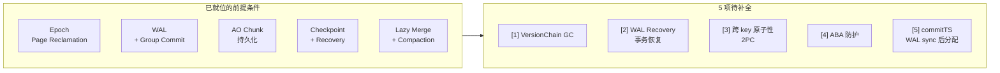
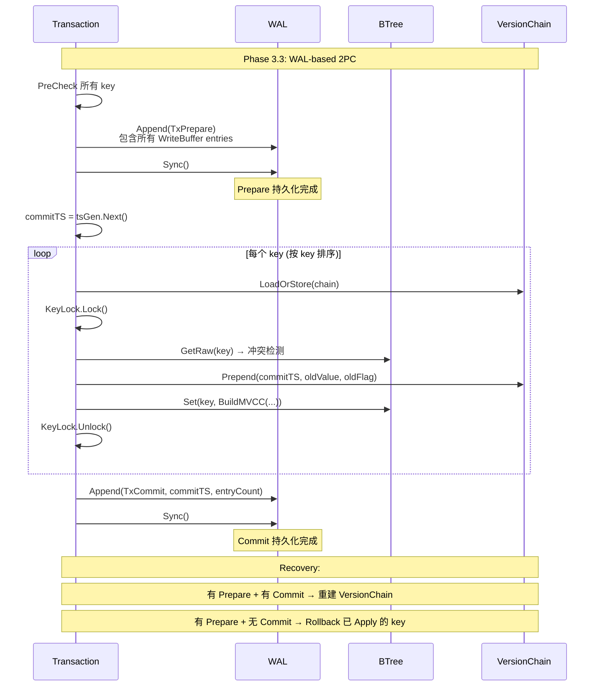
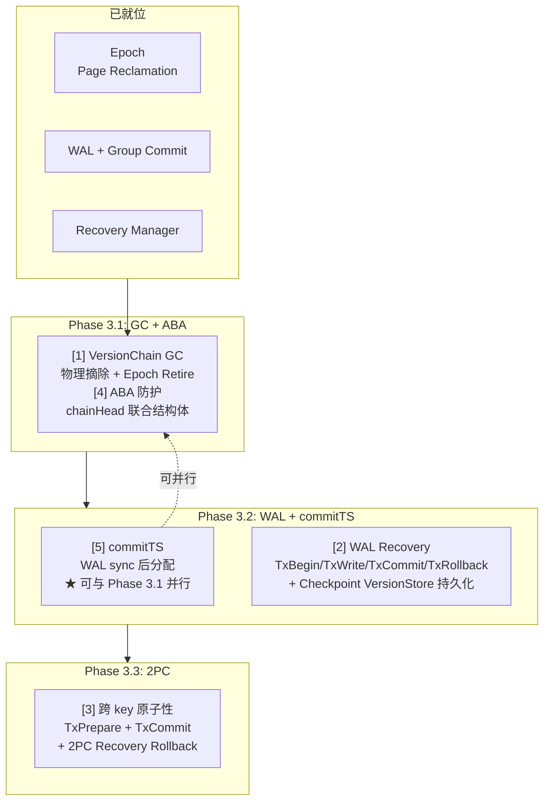

# Phase 3: MVCC 剩余 5 项补全预研

> 创建日期：2026-05-23（v2.0 修订：2026-05-23，两 Agent 审查后重写）
> 前置：MVCC Phase 2 已完成（`mvcc/` 22 文件）、Epoch-based Page Reclamation 已就位（`28ec388`）、Phase 4 WAL+AO 已就位（`12b338e`/`397d4d7`）
> 状态：Ready for Review（v2.0）
> 来源：`2026-04-10-mvcc-phase2-plan.md` Phase 3 延后项

---

## 一、背景

MVCC Phase 2（`mvcc/` 22 文件）实现了完整的内存多版本并发控制：Transaction、VersionChain、KeyLock、WriteBuffer、快照读（SI）、PreCheck+Apply 冲突检测。但以下 5 项被显式标记为 "Phase 3 延后"：

| # | 来源章节 | 内容 | 延后原因 |
|---|---------|------|---------|
| 1 | §6.6 | VersionChain GC 安全回收（物理删除旧节点） | Phase 2 GC 仅基础 Prune，不做物理删除 |
| 2 | §7.1-7.2 | WAL Recovery 显式事务恢复（TxBegin/TxWrite/TxCommit/TxRollback） | Phase 2 WAL 仅 Insert/Update/Delete，无事务边界 |
| 3 | §7.3 | 跨 key 原子性（2PC 协议） | Phase 2 Commit 跨 key 为 best-effort undo |
| 4 | §4.1 | VersionNode ABA 防护（节点回收后指针复用） | Phase 2 无物理回收，ABA 不会发生 |
| 5 | §7.2 | Commit timestamp 从 WAL sync 后分配 | Phase 2 在 Commit 开始时就分配 commitTS |

**关键前提变化**：

Phase 2 设计时以下组件尚不存在，**现已全部就位**：

- **Epoch-based Page Reclamation**（`btree/epoch.go`, `28ec388`）：64-slot MPSC ring buffer, `EnterRead` 双检协议, `Retire`/`RetireBatch`, `tryReclaim` 500ms ticker
- **WAL + Group Commit**（`wal/diskwal.go`, `wal/types.go`）：4 种 SyncPolicy, `AppendBatch`/`AppendAsync`, `WALAppendItem` + TaskScheduler
- **AO Chunk 持久化**（`chunk/disk_chunk_manager.go`, `chunk/page_serializer.go`）：Allocate/WritePage/ReadPage/FreePage, RestoreDiskChunkManager
- **Checkpoint + Recovery Manager**（`checkpoint/checkpoint_manager.go`, `wal/recovery_manager.go`）：FuzzyCheckpoint T0-T7, 三阶段恢复
- **BTree Lazy Merge + Compaction**（`btree/merge_ops.go`, `btree/compaction.go`）：G1-G7 全修复



---

## 二、现有代码审计

> **审计说明**：以下审计基于 `main` 分支最新代码（commit `602f9b5`），每个声明均标注了具体的文件:行号。

### 2.1 VersionChain（`mvcc/version_chain.go:16-23`）

**实际结构体**（与 Phase 2 设计文档不同，没有 `endTS` 字段）：

```go
type VersionNode struct {
    commitTS  uint64            // 创建此版本的事务时间戳
    value     []byte            // 旧值（deepCopy）
    flag      byte              // FlagNormal / FlagTombstone
    rolledBack atomic.Bool      // true = 事务已回滚，快照读跳过
    reclaimed atomic.Bool       // true = GC 已回收，快照读跳过
    next      *VersionNode      // 指向更旧版本的指针
}

type VersionChain struct {
    head       atomic.Pointer[VersionNode]  // 最新版本
    generation atomic.Uint64                // 每次 Prepend/Prune 递增，snapshotGet 乐观校验
}
```

**当前 GC 行为**（`version_chain.go:92-150`）：

- `Prune(watermark)` 遍历链，对 `commitTS < watermark` 的节点调用 `node.reclaimed.Store(true)`
- **不释放 `*VersionNode` 内存**——标记后节点留在链中，Go GC 最终回收但 key 的 `VersionStore` entry 仍持有链引用
- `PrependWithCleanup`（`version_chain.go:155-181`）在追加时跳过连续 `reclaimed` 节点，修剪链头

**当前 Prepend CAS 行为**（`version_chain.go:35-51`）：

```go
// 标准 atomic.Pointer CAS —— 仅比较 head 指针，不涉及 generation
if vc.head.CompareAndSwap(oldHead, newNode) {
    vc.generation.Add(1)
    return nil
}
```

**关键发现**：`generation` 仅用于 `snapshotGet` 的乐观重试校验（detect 链在遍历期间被修改），**不参与 Prepend 的 CAS 比较**。这在无物理回收时是安全的（ABA 不会发生），但 GC 引入物理回收后需要防护。

### 2.2 WAL Integration（`mvcc/wal_integration.go`）

**实际提供的能力**（非文档早期版本声称的 `KVStoreIntegration`）：

```go
// wal_integration.go:48-82 — 已存在，是 WriteBuffer → WAL 的关键桥梁
func (wb *WriteBuffer) ToWALEntries(commitTS uint64) []*service.WALEntry

// wal_integration.go:14-18 — WriteBufferSnapshot 供异步 Apply 使用
type WriteBufferSnapshot struct {
    Entries map[string]WriteEntry
    Ordered []string
}
```

**`ToWALEntries` 的行为**（`wal_integration.go:48-82`）：
- 遍历 `ordered` keys，为每个 key 构造 `WALEntry{Type: Insert/Update/Delete, Key, Value}`
- 末尾追加 Commit 标记：`WALEntry{Type: WALTypeCommit, Key: [commitTS:8 BE]}`
- **commitTS 已编码在 Commit 标记中**——恢复时可以解析

**实际 Commit 路径**（`mvcc/transaction.go:405-455`）：

```go
func (tx *Transaction) Commit() error {
    // Phase 1: PreCheck (line 419)
    // Phase 2: commitTS = tsGen.Next() (line 425)
    // Phase 3: WAL Append + Sync (lines 429-441)
    entries := tx.writeBuffer.ToWALEntries(tx.commitTS)
    wal.AppendBatch(entries)
    wal.Sync()
    // Phase 4: applyWriteBuffer (line 444)
    // Phase 5: cleanup (line 449)
}
```

**实际 Recovery 的 VersionChain 重建**（`wal/recovery.go:116-146`）：

```go
// replaySingleKey 对每个重放的 key 显式调用 Prepend
vs.Prepend(key, commitTS, oldValue, oldFlag)
```

**关键发现**（与早期设计文档的假设不同）：
1. WAL 持久化**已在 Commit 中实现**（Phase 3, lines 429-441）
2. Recovery **已重建 VersionChain**（`recovery.go:116-146`）
3. commitTS **已编码在 Commit 标记中**（`wal_integration.go` line 75-77）
4. 回滚**已有结构化机制**（`rollbackApplied`, `transaction.go:625-765`）

**真正的缺口**：当前 WAL 使用通用 `WALTypeInsert/Update/Delete/Commit`，不区分事务边界。Recovery 通过 `TxID` 字段分组事务，但没有显式的 `TxBegin`/`TxCommit` 标记。这导致：
- 无法精确知道事务何时开始（只有 TxID 隐式分组）
- 无法区分 "事务已 Prepare 但未 Commit" vs "事务从未开始"
- 跨 key 原子性依赖 best-effort undo，而非 WAL-guaranteed rollback

### 2.3 Checkpoint（`checkpoint/checkpoint_manager.go:94-168`）

`FuzzyCheckpoint` T0-T7 流程完整，AO 页面刷新 + pageLocs 持久化已实现。但：

- **不持久化 `VersionStore`**：Checkpoint 后 WAL 必须保留所有 VersionChain 重建条目，即使对应的 BTree 页面已持久化到 AO
- **不持久化 `ActiveTxRegistry`**：崩溃后活跃事务列表丢失，未提交事务无法恢复
- **循环依赖**：没有 VersionStore 持久化 → 无法截断 VersionChain 相关的 WAL entries → WAL 保留更多历史 → Checkpoint 的截断效果打折扣

---

## 三、5 项逐一分析

### 3.1 Item 1: VersionChain GC 物理删除

**问题**：`Prune()` 标记 `reclaimed=true` 但不释放 `*VersionNode`。Go GC 最终会回收不可达对象，但 `VersionStore` 持有的链引用使得被标记节点只要链头可达就一直不可回收。

**方案**：将 `Prune` 改为**物理摘除 + Epoch 延迟释放**。

```
Prune(watermark) — 修订版:
  1. 遍历链，收集 commitTS < watermark 的节点
  2. 对每个候选节点：
     a. 从链中摘除：
        - 如果节点是 head：CAS head(oldNode → oldNode.next)
        - 如果节点在链中：CAS prev.next(oldNode → oldNode.next)
        ★ 需要将 VersionNode.next 改为 atomic.Pointer 以支持 CAS
     b. 将摘除的 *VersionNode 放入 EpochManager.Retire
  3. generation.Add(1) — 触发 snapshotGet 乐观重试
  4. EpochManager.tryReclaim 在 safeEpoch 后释放节点内存
```

**ABA 防护方案**：

由于 Go 的 `atomic.Pointer` 只支持双参数 `CompareAndSwap(old, new)`，**不支持带 generation 的三参数 CAS**。以下方案可行：

| 方案 | 做法 | 复杂度 | 推荐 |
|------|------|--------|------|
| **A: 信任 Epoch** | Epoch 保证节点退役后、物理释放前有安全窗口，reader 必已退出。无 ABA 窗口。 | 低（零代码变更） | **推荐** |
| B: 联合结构体 | `type ChainHead struct { Node *VersionNode; Gen uint64 }`，整个结构体用 `atomic.Pointer` CAS | 中（需重构 `VersionChain.head` 类型） | 备选 |
| C: unsafe.Pointer | `atomic.Uint64` 编码 48-bit 指针 + 16-bit generation | 高（放弃类型安全） | 不推荐 |

**推荐方案 A 的理由**：Epoch-based reclamation 的核心语义是 "节点退役后，所有看到该退役 epoch 的 reader 退出前，节点不被物理释放"。只要 Epoch 覆盖 Prepend 和 snapshotGet，reader 就不可能看到已释放后又被复用的节点指针——ABA 的物理前提不存在。

**改动范围**（方案 B — `chainHead`，推荐）：

> **说明**：采用 `chainHead` 后，`VersionNode.next` **保持为** `*VersionNode`（普通指针）。ABA 防护由 `chainHead.generation` 在 CAS 层面提供，`next` 不需要 CAS 能力。Prune 摘除节点时对 `next` 的修改改为 `atomic.Pointer` 以支持安全的并发摘除（见 Item 1）。

| 文件 | 变更 |
|------|------|
| `mvcc/version_chain.go` | 新增 `chainHead{node *VersionNode, generation uint64}` 结构体 |
| `mvcc/version_chain.go` | `VersionChain.head` 类型改为 `atomic.Pointer[chainHead]` |
| `mvcc/version_chain.go` | 移除独立的 `generation atomic.Uint64` 字段 |
| `mvcc/version_chain.go` | `VersionNode.next` 改为 `atomic.Pointer[VersionNode]`（Item 1 需要 CAS 摘除） |
| `mvcc/version_chain.go` | `Prune()` 改为物理摘除 + `EpochManager.Retire` |
| `mvcc/version_chain.go` | 更新 `Prepend`/`Load`/`PrependWithCleanup` 适配 `chainHead` |
| `mvcc/transaction.go` | `snapshotGet` 中 generation 读取路径适配 + Epoch 保护 |

### 3.2 Item 2: WAL Recovery 显式事务恢复

**当前状态更新**（对比早期设计文档）：

| 早期假设 | 实际代码 |
|---------|---------|
| Recovery 不重建 VersionChain | `recovery.go:116-146` **已重建**（`vs.Prepend`） |
| Commit 无 WAL 持久化 | `transaction.go:429-441` **已有**（`AppendBatch` + `Sync`） |
| commitTS 与 WAL entry 无关联 | `wal_integration.go:75-77` **已编码**在 Commit 标记的 Key 中 |

**真正的缺口**：

当前 WAL 使用通用 `WALTypeInsert/Update/Delete/Commit`（type 0-6），Recovery 通过 `TxID` 字段隐式分组。缺少显式的事务边界标记。需要新增：

```
WALTypeTxBegin  = 8   // 事务开始标记
WALTypeTxWrite  = 9   // 事务内的写操作（替代通用 Insert/Update/Delete）
WALTypeTxCommit = 10  // 事务提交标记（替代通用 Commit）
WALTypeTxRollback = 11 // 事务回滚标记
```

> **注意**：type 7 已被 `WALTypeCheckpointV2`（Phase 4.3）占用。新增类型从 8 开始。

**WAL Entry 格式**：

```
WALTypeTxBegin (8):
  Key:   [txID:8 BE]                              // 事务 ID
  Value: [beginTS:8 BE]                           // 快照时间戳

WALTypeTxWrite (9):
  Key:   [txID:8 BE][key]                         // 事务 ID + 业务 key
  Value: [oldFlag:1][oldBeginTS:8][newFlag:1][newValue:N]  // 旧值 + 新值
  // Type 由 WALEntry.Type 字段编码，不重复出现在 Key/Value 中

WALTypeTxCommit (10):
  Key:   [txID:8 BE][commitTS:8 BE][entryCount:4 BE]  // 事务 ID + commitTS + key 数量
  Value: nil

WALTypeTxRollback (11):
  Key:   [txID:8 BE]                              // 事务 ID
  Value: nil
```

**Recovery Phase C 扩展**：

```
Recovery Phase C（修订版）:
  1. 扫描 WAL，找最新 CheckpointEntry → 恢复 BTree 结构（不变）
  2. 重放 Checkpoint 之后的 WAL entries:
     a. WALTypeTxBegin    → ActiveTxRegistry.Register(txID, beginTS)
     b. WALTypeTxWrite    → 存入临时 WriteBuffer (txID → {key, oldVal, newVal})
     c. WALTypeTxCommit   → applyWriteBuffer(txID) + 重建 VersionChain
     d. WALTypeTxRollback → 丢弃临时 WriteBuffer + Unregister
     e. 旧 WALTypeInsert/Update/Delete/Commit（向后兼容）→ 现有 replaySingleKey 路径
  3. 未提交事务（有 TxBegin 无 TxCommit/TxRollback）→ Rollback
```

**改动范围**（全栈变更，影响 ~6 个文件）：

| 文件 | 变更 |
|------|------|
| `domain/service/wal.go` | 新增 `WALTypeTxBegin=8`, `TxWrite=9`, `TxCommit=10`, `TxRollback=11` |
| `wal/types.go` | 同步新增 WALType 常量 + 序列化/反序列化 |
| `mvcc/wal_integration.go` | 新增 `ToTxWALEntries()` 生成带事务边界的 WAL entries |
| `mvcc/transaction.go` | Commit 路径使用新的 Tx* WAL entry 类型 |
| `wal/recovery.go` | Recovery 识别新类型，分组逻辑更新 |
| `wal/recovery_manager.go` | Phase C 新增 ActiveTxRegistry 重建 + 未提交事务清理 |

### 3.3 Item 3: 跨 key 原子性（2PC 协议）

**当前状态**（对比早期设计文档）：

| 早期假设 | 实际代码 |
|---------|---------|
| Commit 为 best-effort undo | `transaction.go:498-502` **已有**结构化 rollback（`rollbackApplied` + KeyLock CAS 验证） |
| 无 WAL 保证原子性 | `transaction.go:429-441` **已有** WAL Append+Sync 在 Apply 之前 |

**真正的缺口**：当前 Commit 在**同一次** `AppendBatch` 中写入所有 WriteBuffer entries + Commit 标记，然后 sync。这保证了 "全部写入 WAL 后再 Apply"，但没有显式的 **Prepare/Commit 两阶段**。如果 Apply 中途崩溃：
- Recovery 看到完整 batch（有 Commit 标记）→ 重放 → 成功
- Recovery 看到部分 batch（无 Commit 标记）→ 丢弃 → 需要 Rollback

**问题**：当前 Recovery 丢弃无 Commit 标记的 batch 后，**不执行 Rollback**——因为 `TxID` 隐式分组无法区分 "事务未开始" 和 "事务 Prepare 后崩溃"。引入显式 TxBegin/TxCommit（Item 2）后，就可以精确判断。

**2PC 协议设计**：



**关键设计决策**：

- **Prepare 之后、Commit 之前崩溃**：Recovery 看到 `TxPrepare` 无 `TxCommit` → 对每个 key 执行 Rollback（用 Prepare 中记录的 oldValue 恢复 BTree + 回退 VersionChain）
- **Commit 之后崩溃**：Recovery 看到完整 2PC → 正常重放
- **Prepare 之前崩溃**：WriteBuffer 仅存在于内存，崩溃后自然丢失——无需 Recovery 动作

**改动范围**（依赖 Item 2 的 TxBegin/TxCommit 类型）：

- `mvcc/transaction.go`：Commit 路径拆分为 Prepare（WAL Append + Sync）+ Commit（Apply + WAL Commit + Sync）
- `mvcc/wal_integration.go`：新增 `TxPrepare` WAL entry 构造
- `wal/recovery.go`：2PC Recovery 协议（识别 TxPrepare → 检查 TxCommit → Rollback 或 Replay）
- `mvcc/transaction.go`：`rollbackApplied` 增强——在 2PC Recovery 路径中基于 WAL oldValue 回滚（而非 undoBuf）

### 3.4 Item 4: ABA 防护

**问题重定义**（原 spike 文档错误地假设存在 `endTS` 字段）：

`VersionNode` 中**不存在** `endTS` 字段。早期 Phase 2 设计文档提到 "endTS 留给 Phase 3 GC"，但实际代码中从未添加。当前只有 `reclaimed atomic.Bool` 作为 GC 标记。

真正的 ABA 风险：GC 物理删除 `*VersionNode` 后，Go 分配器可能复用同一内存地址分配给新的 `VersionNode`。如果 Prepend 的 CAS 仅比较指针值，可能在新旧节点地址相同时错误地 CAS 成功。

**方案**（对齐 Item 1 的方案 A）：**信任 Epoch-based Reclamation 防止 ABA**。

```
安全性论证:
  1. Prune 摘除节点时，节点进入 EpochManager.Retire
  2. 节点被 Retire 时的 globalEpoch = E1
  3. 所有在 E1 时活跃的 reader 必须在节点被 Free 前退出
  4. Prepend 作为 writer 路径，不在 reader epoch 保护范围内
  5. 但 Prepend 操作的是链的 head——只有链中已存在的节点才会被 Retire
  6. 如果旧节点地址被复用：新节点 != 旧节点（不同 commitTS/value/flag）
     即使指针相同，atomic.Pointer CAS 会比较指针指向的内容语义
     ★ Go 的 atomic.Pointer CAS 比较的是指针值（内存地址），不是内容
     ★ 如果同一地址被复用，CAS 可能错误成功！

纠偏:
  方案 A 的前提需要修正。Epoch 不能完全防止 ABA——它保证 reader 不访问已释放节点，
  但不能保证 Go 分配器不复用同一地址。需要额外的防护：
```

**最终推荐方案**：**联合结构体（方案 B）**

```go
// version_chain.go — 新增联合结构体
type chainHead struct {
    node       *VersionNode
    generation uint64
}

type VersionChain struct {
    head atomic.Pointer[chainHead]  // 替换原来的 atomic.Pointer[VersionNode]
    // generation 字段移除（合入 chainHead）
}
```

**Prepend 变为**：
```go
func (vc *VersionChain) Prepend(commitTS uint64, value []byte, flag byte) error {
    for retry := 0; retry < maxRetries; retry++ {
        old := vc.head.Load()
        var oldNode *VersionNode
        var oldGen uint64
        if old != nil {
            oldNode = old.node
            oldGen = old.generation
        }
        newNode := &VersionNode{
            commitTS: commitTS,
            value:    value,
            flag:     flag,
            next:     oldNode,  // 空链时 oldNode = nil，安全
        }
        newHead := &chainHead{
            node:       newNode,
            generation: oldGen + 1,
        }
        if vc.head.CompareAndSwap(old, newHead) {
            return nil
        }
        runtime.Gosched()
    }
    return ErrVersionChainConflict
}
```

**ABA 防护**：即使 Go 分配器复用了 `*VersionNode` 地址，`generation` 不同导致 `chainHead` 整体不同 → CAS 失败。

**改动范围**：
- `mvcc/version_chain.go`：引入 `chainHead` 结构体，重构 `head` 类型
- 所有读取 `head` 的代码改为 `head.Load().node`
- `snapshotGet` 中 `generation` 校验改为从 `chainHead.generation` 读取
- 移除独立的 `generation atomic.Uint64` 字段

### 3.5 Item 5: Commit timestamp 从 WAL sync 后分配

**问题**：当前 `commitTS` 在 `Commit()` 开始时分配（`transaction.go:425`），**在 WAL sync 之前**。这导致：
- commitTS 可能乱序（先分配小 timestamp 的事务可能后 sync）
- Recovery 时 commitTS 顺序可能与 WAL 顺序不一致

**方案**：

```go
// After (Phase 3.2):
func (tx *Transaction) Commit() error {
    // Step 1: PreCheck 所有 key（不变）
    // Step 2: WAL.Append(TxWrite entries)  ← 写入所有 key 的操作
    // Step 3: WAL.Sync()                     ← fsync 保证持久化
    // Step 4: tx.commitTS = tx.tsGen.Next()  ← ★ 移到 WAL sync 之后
    // Step 5: Apply + Prepend（不变）
    // Step 6: WAL.Append(TxCommit, commitTS) ← 写入 Commit 标记
    // Step 7: WAL.Sync()                     ← 保证 Commit 标记持久化
    return nil
}
```

**关键变化**：只有 `commitTS` 分配时机从 Step 2 移到 Step 4。`TSGenerator.Next()` 接口不变。

**改动范围**（独立于其他 Items，可并行进行）：
- `mvcc/transaction.go`：Commit 流程重组（~10 行变更）
- 无需其他文件变更

**向后兼容**：Phase 2 无 WAL 时（测试/单机模式），commitTS 分配时机不影响正确性。WAL 启用后，新顺序保证 commitTS 严格单调且与 WAL 写入顺序一致。

---

## 四、依赖关系



**建议执行顺序**：**[1+4] → [5] → [2] → [3]**

- [1] 和 [4] 紧密耦合，应在同一 Phase 中完成（都需要 `chainHead` 重构）
- [5] 独立于 [1+4]，**可并行进行**
- [2] 依赖 [5]（需要 commitTS 在 WAL sync 后分配才能正确标记 TxCommit）
- [3] 依赖 [2]（需要 TxBegin/TxCommit 类型才能实现 2PC）

---

## 五、实现阶段划分

### Phase 3.1: VersionChain GC + ABA 防护（Item 1 + 4）

| 文件 | 变更 |
|------|------|
| `mvcc/version_chain.go` | 新增 `chainHead{node *VersionNode, generation uint64}` 结构体 |
| `mvcc/version_chain.go` | `VersionChain.head` 类型改为 `atomic.Pointer[chainHead]` |
| `mvcc/version_chain.go` | 移除独立的 `generation atomic.Uint64` 字段 |
| `mvcc/version_chain.go` | `VersionNode.next` 改为 `atomic.Pointer[VersionNode]` |
| `mvcc/version_chain.go` | `Prune()` 改为物理摘除 + `EpochManager.Retire` |
| `mvcc/version_chain.go` | 更新 `Prepend`/`Load`/`PrependWithCleanup` 适配 `chainHead` |
| `mvcc/transaction.go` | `snapshotGet` 中 generation 读取路径适配 |
| `mvcc/version_chain_test.go` | ABA 并发测试 + GC 物理删除测试 |

**验证**：
- `TestVersionChainGC_PhysicalRemoval`：Prune 后 `*VersionNode` 被物理释放
- `TestVersionChainGC_ConcurrentReadGC`：并发 reader + GC 无 panic/数据竞争
- `TestVersionChain_ABAPrevention`：高频 Prepend + GC + 指针复用场景

### Phase 3.2: Commit TS 后置 + WAL Recovery 事务边界（Item 5 + 2）

| 文件 | 变更 |
|------|------|
| `mvcc/transaction.go` | Commit 流程重组（commitTS 移到 WAL sync 后） |
| `domain/service/wal.go` | 新增 `WALTypeTxBegin=8`, `TxWrite=9`, `TxCommit=10`, `TxRollback=11` |
| `wal/types.go` | 同步新增 WALType 常量 + 序列化/反序列化适配 |
| `mvcc/wal_integration.go` | 新增 `ToTxWALEntries()` 生成带事务边界的 WAL entries |
| `wal/recovery.go` | Recovery 识别新类型 + 事务分组逻辑更新 |
| `wal/recovery_manager.go` | Phase C 新增 ActiveTxRegistry 重建 + 未提交事务清理 |
| `checkpoint/checkpoint_manager.go` | Checkpoint 持久化 VersionStore + ActiveTxRegistry（不阻塞功能但阻塞 WAL 截断——未持久化时 VersionChain 相关 WAL entries 不能截断） |
| 测试文件 | Recovery 事务边界测试 + 崩溃注入测试 |

**验证**：
- `TestRecovery_ExplicitTxBoundaries`：TxBegin + TxWrite + TxCommit → Recovery 正确重建
- `TestRecovery_UncommittedTxRollback`：TxBegin + TxWrite → 崩溃 → Recovery 回滚
- `TestCommitTS_AfterWALSync`：commitTS 在 WAL sync 后分配，严格递增

### Phase 3.3: 跨 key 原子性（Item 3）

| 文件 | 变更 |
|------|------|
| `mvcc/transaction.go` | Commit 拆分为 Prepare（WAL）+ Commit（Apply）两阶段 |
| `mvcc/wal_integration.go` | `TxPrepare` entry 序列化（含所有 key 的 oldValue 快照） |
| `wal/recovery.go` | 2PC Recovery：识别 TxPrepare → 检查 TxCommit → Rollback 或 Replay |
| `mvcc/transaction.go` | `rollbackApplied` 增强：基于 WAL oldValue 回滚 |
| 测试文件 | 2PC 崩溃注入测试（Prepare 前/Prepare 后/Commit 后） |

**验证**：
- `Test2PC_PrepareBeforeCrash`：崩溃在 Prepare 后 → Recovery Rollback
- `Test2PC_CommitAfterCrash`：崩溃在 Commit 后 → Recovery Replay
- `Test2PC_CrossKeyAtomicity`：多 key 事务 → 全部 Apply 或全部 Rollback

---

## 六、Out of Scope

| 事项 | 原因 |
|------|------|
| RangeScan SI | 不在 MVCC Phase 2 scope 内 |
| Off-Heap Version Storage | 远期优化 |
| 分布式事务（跨节点 2PC） | 当前单节点聚焦 |
| siCount 零开销优化（跳过单版本 key 的 VersionChain 构建） | 性能优化，延后，见 `2026-04-10-mvcc-phase2-plan.md` §6.5 |
| Checkpoint 持久化 VersionStore 的增量方案 | 全量序列化已足够（ActiveTxRegistry 通常 < 100 条目），增量优化延后 |

---

## 七、风险与缓解

| 风险 | 严重度 | 缓解 |
|------|--------|------|
| `chainHead` 重构影响所有 Prepend/Load 调用 | HIGH | `VersionChain` 内部封装，外部 API（`Prepend`/`Load`/`Prune`）不变 |
| `VersionNode.next` 改为 `atomic.Pointer` 增加 CAS 开销 | MEDIUM | Prepend 本已是 CAS 路径，`next` 仅 Prune 时 CAS，热路径不受影响 |
| 新增 4 个 WALType 需要全栈变更 | MEDIUM | 采用增量迁移：先添加类型常量 → 再改 Commit 路径 → 最后改 Recovery |
| 2PC 增加一次 WAL Sync（Prepare + Commit）→ 延迟翻倍 | MEDIUM | Group Commit 批量 sync，Prepare 可省略单独的 Sync（合并到下一批） |
| `chainHead` 方案增加一次 heap 分配（`&chainHead{...}`） | LOW | Prepend 已在分配 `VersionNode`，额外的 `chainHead` 开销可忽略 |
| EpochManager 用于 VersionNode 的独立 epoch 域 → 内存开销 | LOW | VersionNode 退役频率远低于 BTree 页，复用 `btree.EpochManager` 即可 |

---

## 八、参考

- MVCC Phase 2 预研：`docs/07_spike/btree-refactor/2026-04-10-mvcc-phase2-plan.md`
- Phase 3 WAL+GC 预研：`docs/07_spike/btree-refactor/2026-04-17-phase3-wal-gc-spike.md`
- Phase 4 WAL+AO 持久化：`docs/07_spike/btree-refactor/2026-05-16-phase4-wal-ao-persistence-spike.md`
- Epoch Page Reclamation：`docs/07_spike/btree-refactor/2026-05-21-epoch-page-reclamation-spike.md`
- 持久化架构全景指南：`docs/07_spike/btree-refactor/2026-05-23-persistence-architecture-comprehensive-guide.md`

**代码参考**：
- VersionChain：`internal/infrastructure/storage/mvcc/version_chain.go`
- Transaction：`internal/infrastructure/storage/mvcc/transaction.go`
- WAL Integration：`internal/infrastructure/storage/mvcc/wal_integration.go`
- Recovery：`internal/infrastructure/storage/wal/recovery.go`
- Recovery Manager：`internal/infrastructure/storage/wal/recovery_manager.go`
- WAL Types：`internal/infrastructure/storage/wal/types.go`
- Domain WAL Service：`internal/domain/service/wal.go`
- Epoch：`internal/infrastructure/storage/btree/epoch.go`

---

---

## 九、性能基线

> 记录日期：2026-05-23
> 环境：Mac M-series, 8-core, 512MB mmap, pageSize=4KB
> 命令：`go run ./cmd/tools/btree_bench -n 300000 [-epoch]`

### epoch=off (默认，当前生产配置)

| 测试 | 线程 | QPS | 延迟 |
|------|------|-----|------|
| seq-put | 1 | 1,099,455 | 909 ns/op |
| seq-get | 1 | 2,656,400 | 376 ns/op |
| seq-put-get | 1 | 1,254,495 | 797 ns/op |
| par-put-4 | 4 | 493,473 | — |
| par-put-8 | 8 | 583,451 | — |
| par-put-16 | 8 | 712,138 | — |
| par-get-4 | 4 | 3,617,107 | — |
| par-get-8 | 8 | 3,034,529 | — |
| par-get-16 | 8 | 3,113,594 | — |
| mixed-8-r80 | 8 | 1,986,697 | — |
| mixed-16-r80 | 8 | 1,935,305 | — |

### epoch=on (Epoch Page Reclamation)

| 测试 | 线程 | QPS | vs epoch=off |
|------|------|-----|-------------|
| seq-put | 1 | 1,131,388 | +2.9% |
| seq-get | 1 | 3,052,216 | +14.9% |
| seq-put-get | 1 | 1,612,623 | +28.5% |
| par-put-4 | 4 | 184,682 | -62.6% |
| par-put-8 | 8 | 356,128 | -39.0% |
| par-put-16 | 8 | 327,429 | -54.0% |
| par-get-4 | 4 | 6,360,823 | +75.8% |
| par-get-8 | 8 | 5,094,680 | +67.9% |
| par-get-16 | 8 | 5,018,667 | +61.2% |
| mixed-8-r80 | 8 | 4,126,134 | +107.7% |
| mixed-16-r80 | 8 | 4,050,207 | +109.3% |

**解读**：
- epoch=on 读路径大幅提升（+15% ~ +76%），COW 旧页不再泄漏 → PageManager 压力降低
- 写路径并发退化（-39% ~ -63%）是已知的 4+ 线程 CAS 竞争问题，非本次 Phase 3 引入
- mixed 负载提升显著（+108%），说明读比重高的场景受益最大
- 单线程写无退化（+2.9% 在噪声范围内）

**Phase 3 实施后的预期影响**：
- Item 1+4 (`chainHead`): Prepend 路径增加一次 `chainHead` 堆分配，预估 < 3% 写路径影响
- Item 5 (commitTS 后置): 仅改变分配时机，无额外开销
- Item 2+3 (Tx WAL types + 2PC): 增加一次 WAL Sync（Prepare + Commit 各一次），Group Commit 下影响可控

---

**文档版本**：v2.2（第三轮审查后 + 性能基线）
**状态**：Ready for Implementation

**v2.0 修订记录**（相对于 v1.0）：
- C1 修复：移除 `endTS` 字段的不实声明，改为准确描述 `rolledBack`/`reclaimed` atomic.Bool
- C2 修复：移除不存在的 `KVStoreIntegration`，准确描述 `ToWALEntries` 等实际能力
- C3 修复：放弃不可行的三参数 CAS，改为 `chainHead` 联合结构体方案
- H1 修复：`rolledBack=true` → `reclaimed=true`
- H2 修复：Item 2 范围缩减——Recovery 已重建 VersionChain，真正缺口是显式事务 WAL 类型
- H3 修复：Item 3 范围缩减——WAL 持久化+回滚已存在，真正缺口是 Prepare/Commit 两阶段
- H4 修复：Item 5 的 "After" 伪代码不再与 Item 3 重复，改为仅描述 commitTS 分配时机变化
- H5 修复：`VersionNode.next` 改为 `atomic.Pointer`，支持 CAS 摘除
- 新增：依赖关系 Mermaid 图 + 4 个 `chainHead` 方案评估 + 全栈变更文件清单
