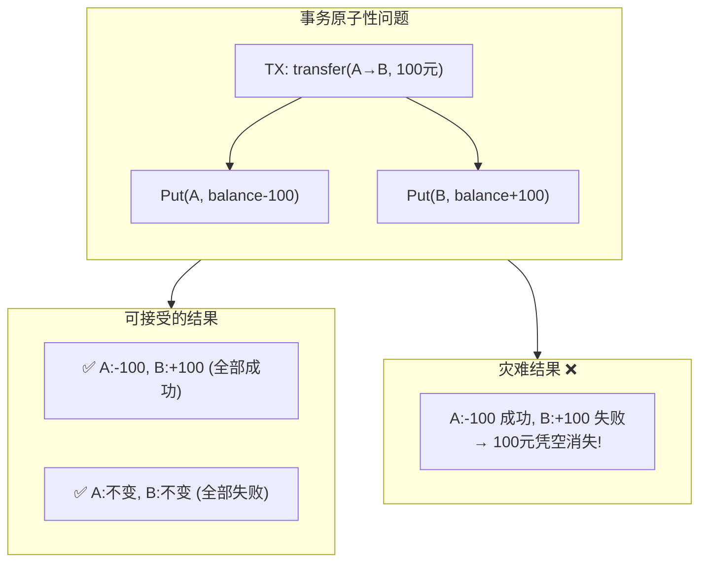
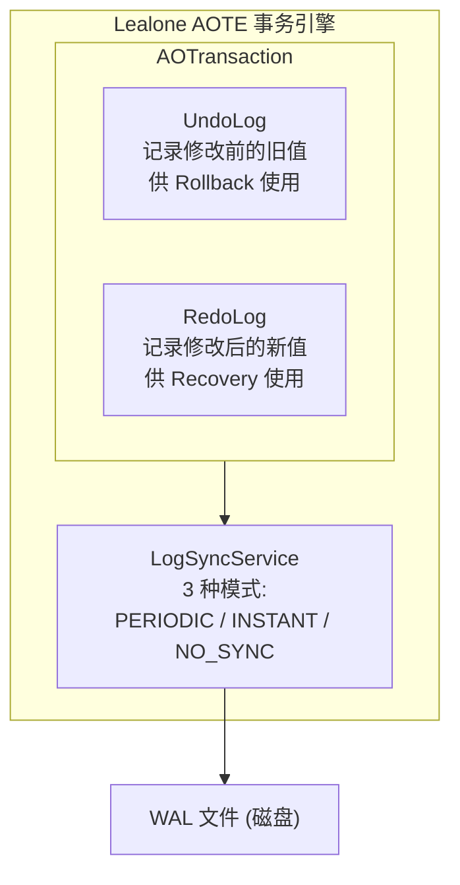
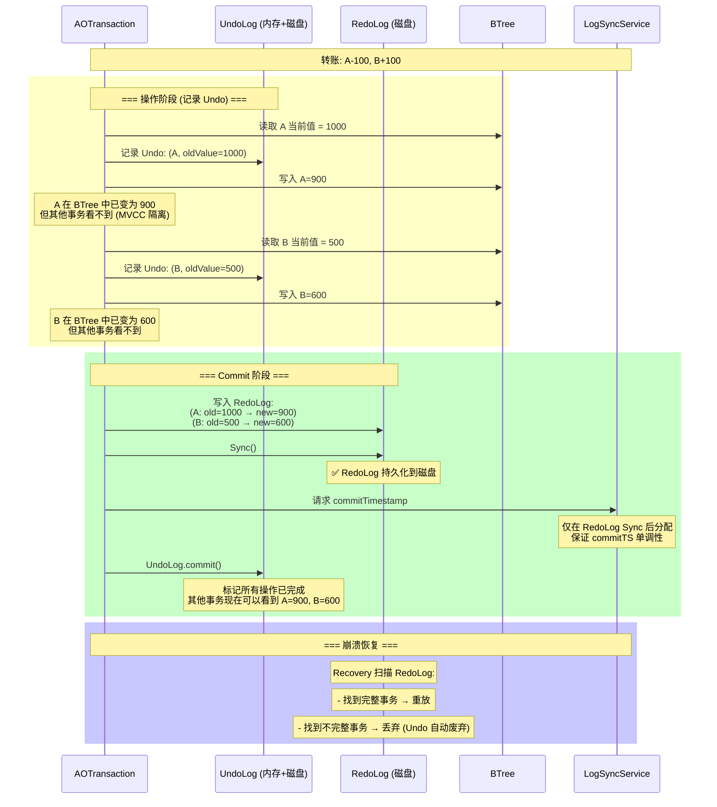
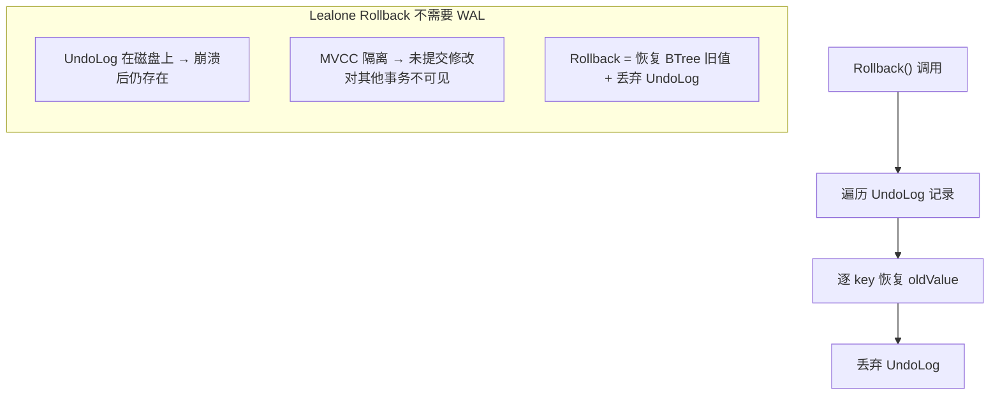
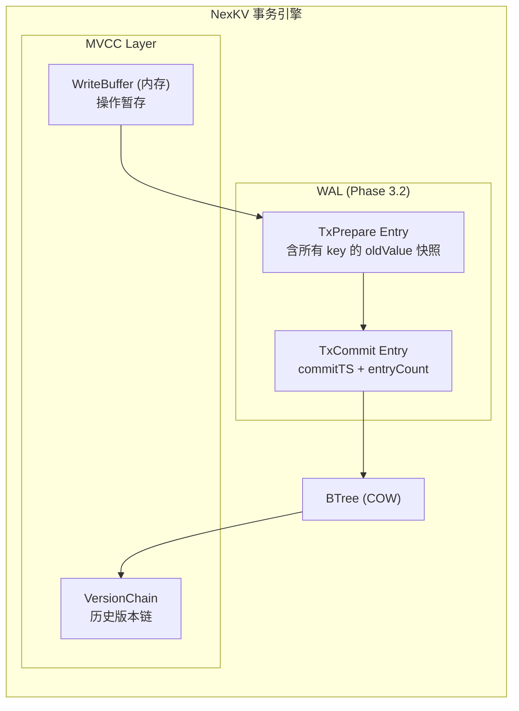
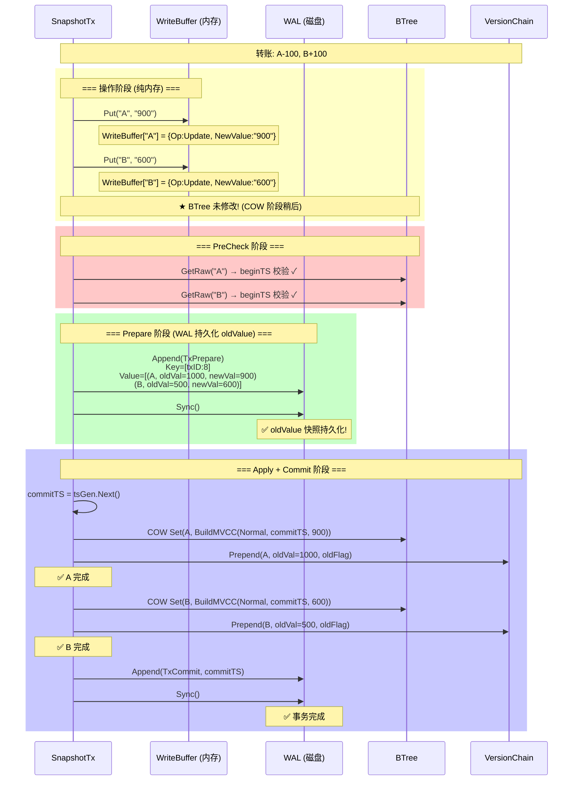
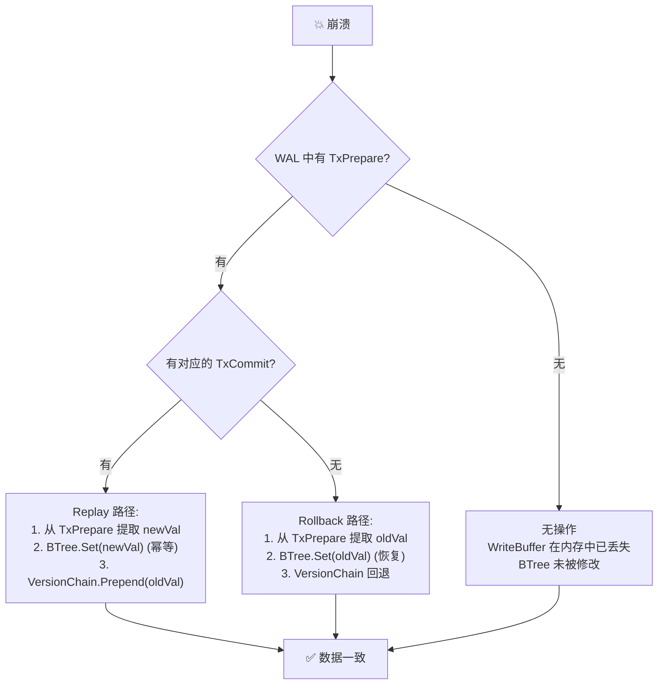
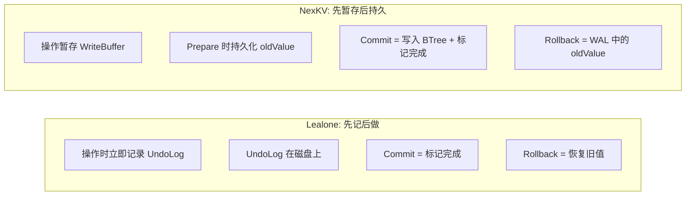
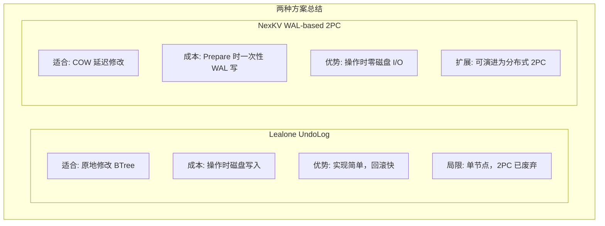

# 事务原子性方案对比：Lealone UndoLog vs NexKV WAL-based 2PC

> 创建日期：2026-05-23
> 前置：Lealone AOTE 源码分析 + NexKV Phase 3.3 2PC 设计
> 核心问题：多 key 事务如何保证"要么全做，要么全不做"？

---

## 一、问题定义



**核心挑战**：崩溃可能发生在任何时刻——在修改 A 之后、修改 B 之前。如何保证 Recovery 后要么两个 key 都修改了，要么都没修改？

---

## 二、Lealone 方案：UndoLog + RedoLog

### 2.1 架构概览

Lealone 的 AOTE（Async Adaptive Optimization Transaction Engine）使用 **UndoLog + RedoLog 双日志** 实现单节点事务原子性。



### 2.2 完整流程



### 2.3 关键设计：UndoLog 的磁盘持久化

Lealone 的 UndoLog **存储在磁盘上**（非纯内存）：

```java
// UndoLog.java — 核心数据结构
class UndoLog {
    // 每个事务的 Undo 记录列表
    List<UndoLogRecord> records;
    
    // 记录格式:
    // [key][oldValue][transactionId]
    
    void add(String key, Value oldValue) {
        records.add(new UndoLogRecord(key, oldValue));
        // ★ 写入磁盘 WAL 文件
    }
    
    void commit(TransactionEngine engine) {
        // ★ 原子性地使所有变更可见
        for (UndoLogRecord r : records) {
            engine.commitFinal(r.key, r.oldValue);
        }
    }
}
```

**核心优势**：UndoLog 在磁盘上，崩溃后不丢失。Recovery 不需要特别处理——不完整的事务的 Undo 记录自然被丢弃，BTree 中的未提交修改被 MVCC 隔离。

### 2.4 Rollback 机制



### 2.5 局限性

| 局限 | 说明 |
|------|------|
| **单节点** | `isLocal()` 始终返回 `true`，无远程参与者 |
| **2PC 已废弃** | `PREPARE_COMMIT`/`COMMIT_TRANSACTION` 语句已移除 |
| **UndoLog 膨胀** | 大事务产生大量 Undo 记录，占用磁盘空间 |
| **MVCC 复杂度** | `TransactionalValue` 的可见性判断依赖 commitTS，与 UndoLog 耦合 |

---

## 三、NexKV 方案：WAL-based 2PC

### 3.1 架构概览

NexKV Phase 3.3 使用 **WAL-based 2PC**（两阶段提交），核心区别在于：**回滚信息（oldValue）在 Prepare 阶段才持久化到 WAL，而非在操作时实时记录**。



### 3.2 完整流程



### 3.3 崩溃恢复对比



---

## 四、核心差异对比

### 4.1 设计哲学



### 4.2 详细对比表

| 维度 | Lealone (UndoLog) | NexKV (WAL-based 2PC) |
|------|------------------|----------------------|
| **操作时行为** | 立即修改 BTree + 记录 Undo | 暂存 WriteBuffer（内存），不修改 BTree |
| **回滚信息存储** | UndoLog（磁盘，实时记录） | WAL TxPrepare（磁盘，Prepare 时一次性写入） |
| **回滚信息来源** | UndoLog 记录 | WAL TxPrepare 中的 oldValue 快照 |
| **BTree 修改时机** | 操作时（MVCC 隔离） | Commit Apply 阶段（COW 批量写入） |
| **崩溃后 Rollback** | UndoLog 自动废弃（磁盘记录不丢失） | Recovery 扫描 WAL → 提取 oldValue → 回滚 |
| **Prepare 阶段** | 无 | 有（WAL 持久化 oldValue） |
| **适用场景** | 单节点 | 单节点（可扩展为分布式 2PC） |
| **磁盘写入量** | 每次操作写入 Undo（多次小写） | Prepare 时一次写入（一次大写） |
| **大事务风险** | UndoLog 持续膨胀 | TxPrepare 单次分配（可能很大） |
| **隔离机制** | MVCC（TransactionalValue + commitTS） | MVCC（VersionChain + beginTS + snapshotTS） |
| **WAL Sync 模式** | PERIODIC/INSTANT/NO_SYNC | EveryWrite/GroupCommit/EverySecond/Batch |

### 4.3 具体场景对比

**场景：转账 10000 个账户，中途崩溃**

```mermaid
flowchart TB
    subgraph LealoneScenario["Lealone: 先改后记"]
        direction TB
        LA["操作 5000 个账户<br/>每操作一次: BTree 修改 + UndoLog 写入"]
        LB["💥 崩溃在第 5001 个"]
        LC["Recovery:<br/>UndoLog 记录完整 → Rollback 5000 个"]
        LD["✅ 全部回滚成功<br/>代价: 5000 次 BTree 写 + 5000 次 UndoLog 写"]
    end
    
    subgraph NexKVScenario["NexKV: 先暂存后持久"]
        direction TB
        NA["操作 10000 个账户<br/>全部暂存 WriteBuffer (纯内存)"]
        NB["PreCheck + Prepare<br/>一条 TxPrepare 写入所有 oldValue"]
        NC["Apply: 修改 BTree"]
        ND["💥 崩溃在第 5001 个 Apply"]
        NE["Recovery:<br/>TxPrepare 完整 → Rollback 5000 个<br/>基于 WAL 中的 oldValue"]
        NF["✅ 全部回滚成功<br/>代价: 0 次 BTree 写 (操作时) + 1 次 WAL 写 (Prepare)"]
    end
```



---

## 五、NexKV 为什么选择 WAL-based 2PC 而非 UndoLog？

### 5.1 COW 架构的天然优势

NexKV 的 BTree 使用 **页面级 Copy-On-Write**——每次修改分配新 Page，旧 Page 不变。这意味着：

- **操作时不需要修改 BTree**：WriteBuffer 暂存即可，COW 延迟到 Apply 阶段
- **不需要"撤销"BTree 修改**：Apply 前的崩溃 = BTree 完全未被修改（因为 COW 还没发生）
- **oldValue 天然可得**：WriteBuffer 记录 first-put 时的 BTree 当前值

### 5.2 与 Phase 3.2 的协同

Phase 3.2 已实现 commitTS 后置（WAL Sync 后分配）和显式事务 WAL 类型。Phase 3.3 的 2PC 直接复用这些基础设施：

```
Phase 3.2 提供:
  ✅ WALTypeTxBegin/TxWrite/TxCommit/TxRollback
  ✅ WriteEntries() + CommitEntry() 两阶段 WAL 写入
  ✅ Recovery 识别新类型

Phase 3.3 在此基础上:
  + TxPrepare Entry (包含 oldValue 快照)
  + Recovery Rollback 路径 (基于 WAL oldValue)
  = 完整的跨 key 原子性
```

### 5.3 不选 UndoLog 的原因

| 如果 NexKV 使用 UndoLog | 代价 |
|------------------------|------|
| 每次 Put 写入磁盘 Undo | 操作延迟增加（磁盘 I/O 在热路径） |
| UndoLog 持续膨胀 | 长时间事务占用大量磁盘 |
| 与 COW 语义冲突 | UndoLog 假设原地修改，COW 是延迟修改 |
| 双日志维护成本 | UndoLog + WAL = 两套日志系统 |

---

## 六、总结



| | Lealone | NexKV |
|---|---------|-------|
| **原子性保证** | UndoLog (磁盘) | WAL TxPrepare (磁盘) |
| **回滚机制** | UndoLog.commit() 标记 + MVCC 隔离 | WAL oldValue 快照 + rollbackApplied |
| **最大优势** | 简单可靠，10 年验证 | 操作时零 I/O，COW 天然适配 |
| **最大风险** | UndoLog 膨胀 | Prepare 单点写入瓶颈 |
| **2PC 支持** | ❌ 已废弃 | 🔄 Phase 3.3 实现中 |

---

**文档版本**：v1.0
**创建日期**：2026-05-23
**参考**：
- Lealone AOTE: `lealone-aote/src/main/java/com/lealone/transaction/aote/`
- NexKV Phase 3.3: `docs/07_spike/btree-refactor/2026-05-23-phase3-mvcc-remaining-gaps-spike.md` §3.3
- NexKV WAL: `internal/infrastructure/storage/wal/`
- NexKV MVCC: `internal/infrastructure/storage/mvcc/`
