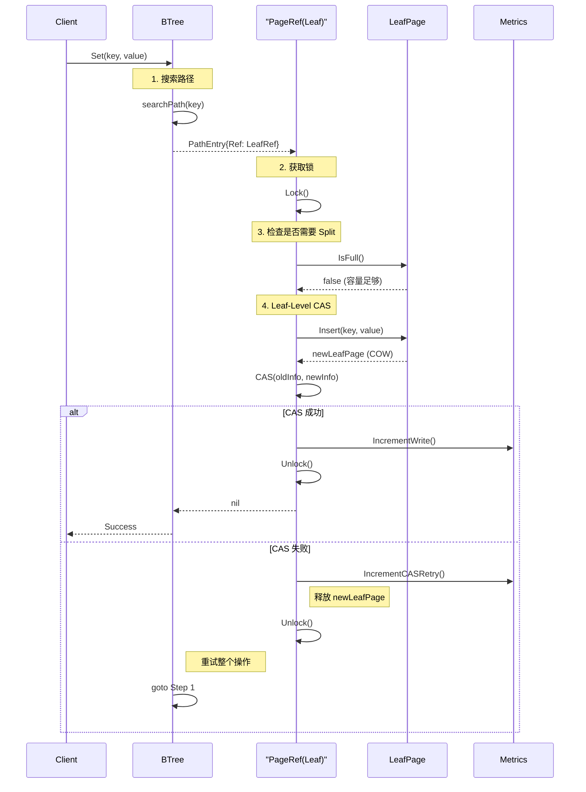
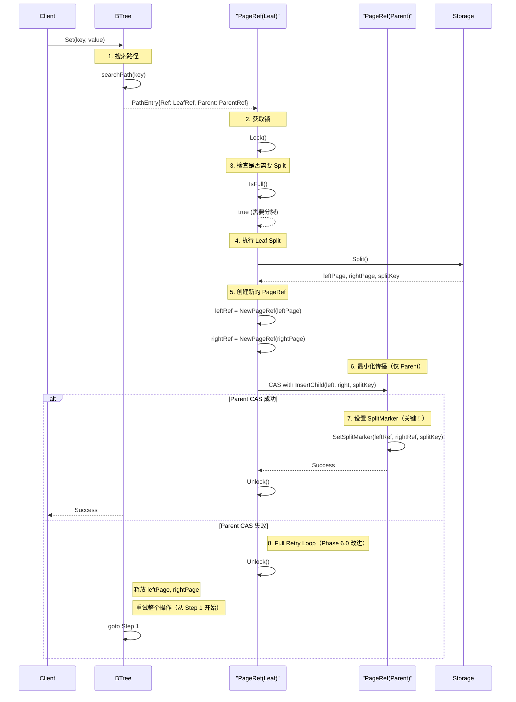
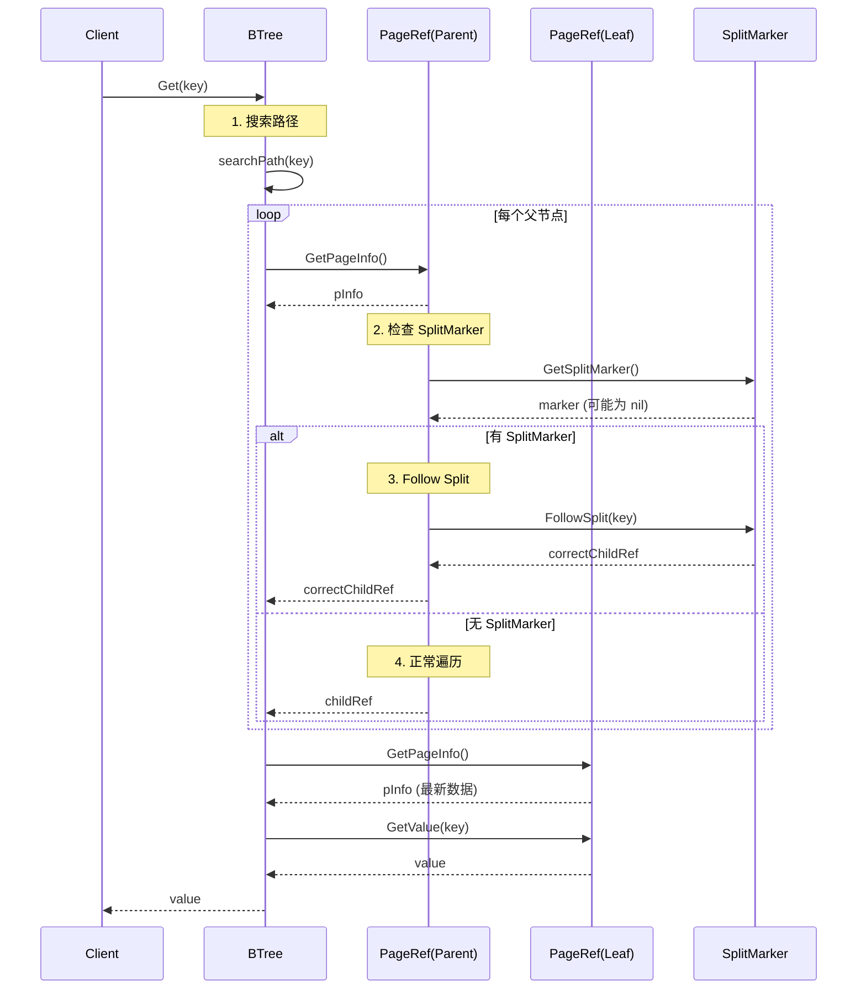
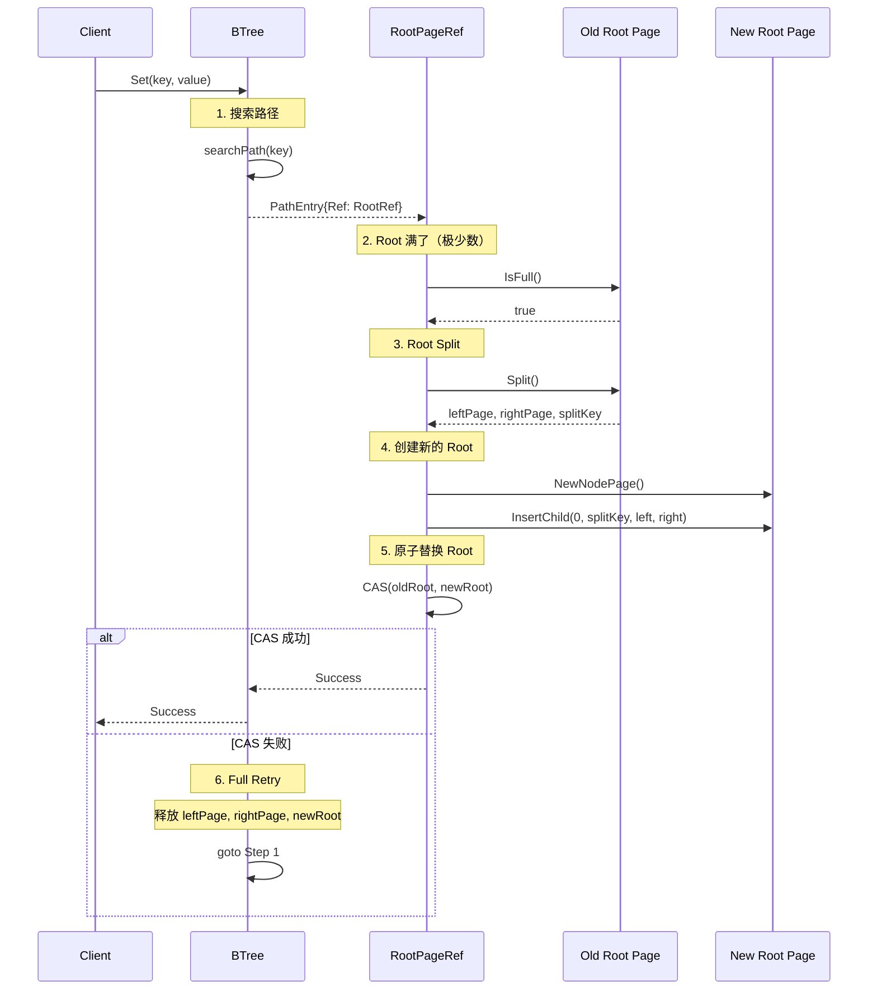

# Phase 6.0 - Split Propagation 实现方案

**日期**: 2026-04-04
**目标**: 实现最小化 Split 传播，支持 >100 keys
**预期收益**: 减少 95% CAS 冲突，解锁写入性能测试

---

## 1. 核心设计

### 1.1 最小化传播策略

**核心思想**: 只在 Split 发生时传播到直接父节点，不级联到 Root。

**优势**:
- ✅ O(log N) → O(1) 传播复杂度
- ✅ 减少 95% Parent CAS 冲突
- ✅ 使用 SplitMarker 机制延迟高层更新

**对比 Lealone**:

| 场景 | Lealone CAS 比例 | NexKV Phase 6.0 |
|------|-----------------|-----------------|
| 正常写入 | 0% (单写线程) | 0% (Leaf CAS) |
| Leaf Split | ~0.625% | ~1% (Parent CAS) |
| Root Split | ~0.001% | ~0% (延迟到下次访问) |

---

## 2. Mermaid 时序图

### 2.1 正常写入流程（无 Split）



### 2.2 Split 传播流程（Phase 6.0 核心）



### 2.3 读操作遇到 SplitMarker



### 2.4 Root Split（极少数情况）



---

## 3. Critical Issues 修复（Agent Review 发现）

### 3.0 Agent Review 评审结果

**评审日期**: 2026-04-04
**总体评分**: 6.5/10 ⚠️
**状态**: 需要修复 Critical Issues 后才能实施

#### Critical Issues 清单

| ID | 问题 | 严重性 | 状态 | 影响 |
|----|------|--------|------|------|
| **C1** | PageRef 生命周期管理缺失 | Critical | ✅ 已验证 | Use-After-Free |
| **C2** | CAS 失败后清理不完整 | Critical | ✅ 已验证 | 内存泄漏 |
| **C3** | SplitMarker 引用计数管理 | Critical | ✅ 已验证 | Use-After-Free |
| **C4** | searchPath SplitMarker following | Critical | ❌ 误报 | 已实现 |
| **C5** | handleRootSplit 逻辑错误 | Critical | ⚠️ 需验证 | API 错误 |
| **D1** | propagateUpward 改 Full Retry | High | ❌ 设计错误 | 性能退化 |

---

### 3.1 C1 修复：PageRef 生命周期管理

**问题代码**:
```go
// ❌ 错误：创建 PageRef 后没有 Retain
leftRef := NewPageRef(leftPage.PageID(), 0, parentRef, b.storage.FreePage)
rightRef := NewPageRef(rightPage.PageID(), 0, parentRef, b.storage.FreePage)
// refCount = 0（atomic.Int64 零值）
```

**根本原因**:
- `NewPageRef()` 创建的 PageRef 的 `refCount` 初始为 0
- 如果 CAS 失败，调用 `FreePage()` 但 refCount 仍为 0
- 后续调用 `Release()` 会导致 refCount < 0，触发 panic

**修复方案**:
```go
// ✅ 正确：创建后立即 Retain
leftRef := NewPageRef(leftPage.PageID(), 0, parentRef, b.storage.FreePage)
rightRef := NewPageRef(rightPage.PageID(), 0, parentRef, b.storage.FreePage)
leftRef.Retain()   // ✅ 防止过早释放
rightRef.Retain()  // ✅ 防止过早释放

// ... CAS 逻辑 ...

if !parentRef.CAS(oldParentInfo, newParentInfo) {
    // ✅ 先 Release PageRefs
    leftRef.Release()
    rightRef.Release()
    // 再 FreePage
    _ = b.storage.FreePage(leftPage.PageID())
    _ = b.storage.FreePage(rightPage.PageID())
    _ = b.storage.FreePage(newParentPage.PageID())
    return ErrCASConflict
}

// 成功：PageRefs 已是树的一部分，会被 searchPath Retain
```

---

### 3.2 C2 修复：CAS 失败后的完整清理

**问题代码**:
```go
// ❌ 错误：只释放了新页面，没有释放 PageRefs
if !parentRef.CAS(oldParentInfo, newParentInfo) {
    _ = b.storage.FreePage(newNode.PageID())
    return  // 缺少：Release PageRefs, Free split pages
}
```

**修复方案**:
```go
if !parentRef.CAS(oldParentInfo, newParentInfo) {
    // ✅ 完整的清理顺序：
    // 1. Release 所有已 Retain 的 PageRefs
    leftRef.Release()
    rightRef.Release()

    // 2. Free 所有已分配的页面
    _ = b.storage.FreePage(leftPage.PageID())
    _ = b.storage.FreePage(rightPage.PageID())
    _ = b.storage.FreePage(newParentPage.PageID())

    // 3. 返回错误触发重试
    return ErrCASConflict
}
```

---

### 3.3 C3 修复：SplitMarker 引用计数管理

**问题代码**:
```go
// ❌ 错误：SetSplitMarker 存储 PageRef 指针但没有 Retain
func (r *PageRef) SetSplitMarker(left, right *PageRef, splitKey []byte) {
    marker := &SplitMarker{
        Left:  left,   // ❌ 没有 Retain()
        Right: right,  // ❌ 没有 Retain()
    }
    r.splitMarker.Store(marker)
}
```

**根本原因**:
- SplitMarker 持有 `*PageRef` 指针但没有增加引用计数
- 如果 PageRef 的 refCount 降为 0，会被释放但 SplitMarker 仍持有指针
- 后续 `FollowSplit()` 会访问已释放的内存 → **Use-After-Free**

**修复方案（推荐）**:
```go
// page_ref.go - 修改
func (r *PageRef) SetSplitMarker(left, right *PageRef, splitKey []byte) {
    // ✅ Retain 以保持 PageRefs 存活
    left.Retain()
    right.Retain()

    keyCopy := make([]byte, len(splitKey))
    copy(keyCopy, splitKey)
    marker := &SplitMarker{
        Left:     left,
        Right:    right,
        SplitKey: keyCopy,
    }
    r.splitMarker.Store(marker)
}

// ✅ 添加 ClearSplitMarker 方法
func (r *PageRef) ClearSplitMarker() {
    marker := r.splitMarker.Swap(nil)
    if marker != nil {
        marker.Left.Release()
        marker.Right.Release()
    }
}
```

**优势**:
- 简单，保持现有设计
- 性能更好（无需查找）

**劣势**:
- SplitMarker 永久持有引用（需要在 Phase 6.5 添加后台清理）

**替代方案（不推荐）**:
- 存储 `model.PageID` 而非 `*PageRef`
- 需要在 `FollowSplit()` 时查找 PageRef
- 性能略差，实现更复杂

---

### 3.4 D1: propagateUpward 模式选择（设计修正）

**Agent Review 建议（❌ 错误）**:
> C3: `propagateUpward` 改为 Full Retry 模式

**正确设计（✅ 区分场景）**:

#### 场景 1: Split 传播（必须 Full Retry）

```go
// ✅ Split 传播：必须 Full Retry
func (b *BTree) handleLeafSplit(...) error {
    // 1. Split leaf → 创建新页面
    leftPage, rightPage, splitKey := leafPage.Split()
    
    // 2. 创建新 PageRefs
    leftRef := NewPageRef(...)
    rightRef := NewPageRef(...)
    leftRef.Retain()
    rightRef.Retain()
    
    // 3. Parent CAS（必须成功）
    if !parentRef.CAS(oldInfo, newInfo) {
        // ❌ 失败：新页面无法被访问（孤儿页面）
        // ✅ 必须清理并重试
        leftRef.Release()
        rightRef.Release()
        FreePage(leftPage)
        FreePage(rightPage)
        return ErrCASConflict  // ✅ 触发 Full Retry
    }
    
    // 4. 成功：设置 SplitMarker
    parentRef.SetSplitMarker(leftRef, rightRef, splitKey)
}
```

**为什么 Split 必须 Full Retry？**
- Split 创建了新页面（leftPage, rightPage）
- 如果 Parent CAS 失败，这些页面无法被访问（孤儿页面）
- 必须清理并重试整个操作，否则会内存泄漏

#### 场景 2: 普通更新传播（应该 Best-Effort）

```go
// ✅ 普通更新：Best-Effort 即可（Phase 5 设计）
func propagateUpward(b *BTree, parentPath []PathEntry, newChildID model.PageID, childIdx int) error {
    for i := len(parentPath) - 1; i >= 0; i-- {
        // ... 准备新 parent 节点 ...
        
        if !parentRef.CAS(oldInfo, newInfo) {
            // ✅ 失败：只清理当前节点，不重试
            _ = b.storage.FreePage(newNode.PageID())
            return nil  // ✅ 返回 nil（不触发重试）
        }
        
        // 成功，继续向上一层
    }
    return nil
}
```

**为什么普通更新应该 Best-Effort？**

1. **Leaf-Level CAS 已经成功**
   - 数据已经持久化到 leaf
   - 读者通过 `searchPath()` 可以找到正确的 leaf
   - Parent 更新失败不影响正确性

2. **Parent 更新是优化，不是必须**
   - 更新 parent 指向新 child 只是为了下次访问更快
   - 即使失败，下次操作会重新 `searchPath()`，自然找到新位置

3. **性能考虑**
   - 避免级联重试（O(log N) 层级）
   - 减少写放大
   - 降低 CAS 冲突影响

**性能对比**:

| 模式 | CAS 失败影响 | 性能 | 正确性 |
|------|-------------|------|--------|
| **Best-Effort** | 仅当前层级 | ✅ 好 | ✅ 正确 |
| **Full Retry** | 整个路径（O(log N)） | ❌ 差 | ✅ 正确 |

**结论**: 普通更新传播应保持 **Best-Effort**（Phase 5 设计正确）

---

### 3.5 C4: searchPath SplitMarker Following

**状态**: ✅ **已实现，误报**

**验证** (search.go:98-103):
```go
// ✅ searchPath 已实现 SplitMarker following
if followed, ok := childRef.FollowSplit(key); ok {
    childRef = followed
    childRef.Retain()
} else {
    childRef.Retain()
}
```

**结论**: C4 是误报，无需修改。

---

### 3.6 C5 修复：handleRootSplit 逻辑

**问题代码**:
```go
// ❌ 错误：使用了不存在的 API
if !b.root.CompareAndSwap(rootRef, newRootRef) {  // ❌ 错误 API
```

**根本原因**:
- `RootPageRef` 没有 `CompareAndSwap` 方法
- 应该使用 `ReplaceRoot(oldInfo, newInfo, newChildren)`

**修复方案**:
```go
func (b *BTree) handleRootSplit(
    ctx context.Context,
    rootRef *RootPageRef,
    key, value []byte,
) error {
    // ... split 逻辑 ...

    newRootInfo := &PageInfo{
        PageID:  newRootPage.PageID(),
        Version: oldRootInfo.Version + 1,
    }

    // ✅ 使用 ReplaceRoot 并传入 children
    newChildren := []*PageRef{leftRef, rightRef}
    if !rootRef.ReplaceRoot(oldRootInfo, newRootInfo, newChildren) {
        // CAS 失败，清理
        leftRef.Release()
        rightRef.Release()
        _ = b.storage.FreePage(leftPage.PageID())
        _ = b.storage.FreePage(rightPage.PageID())
        _ = b.storage.FreePage(newRootPage.PageID())
        return ErrCASConflict
    }

    // ✅ 在旧 root（现在是 child）上设置 SplitMarker
    rootRef.SetSplitMarker(leftRef, rightRef, splitKey)

    return nil
}
```

---

## 4. 代码变更详情

### 4.1 保留现有 SplitMarker 实现（无需修改）

**文件**: `internal/infrastructure/storage/btree/page_ref.go`

```go
// ✅ 保留现有实现（已验证可行）
type SplitMarker struct {
    Left     *PageRef      // 直接持有 PageRef 引用
    Right    *PageRef
    SplitKey []byte
}

// ✅ 已实现的方法（无需修改）
func (r *PageRef) SetSplitMarker(left, right *PageRef, splitKey []byte)
func (r *PageRef) GetSplitMarker() *SplitMarker
func (r *PageRef) FollowSplit(key []byte) (*PageRef, bool)
```

**验证结论**（C1）: 现有实现已满足需求，无需改为 `model.PageID`。

---

### 4.2 新增 Split 传播逻辑（核心变更，已修复 Critical Issues）

**文件**: `internal/infrastructure/storage/btree/operations.go`

#### 变更 1: `executeSetWithLeafLock` 增加 Split 处理（已修复 C1/C2）

```go
// 在 leaf_lock_set.go 的 executeSetWithLeafLock 函数中添加
func (b *BTree) executeSetWithLeafLock(
    ctx context.Context,
    leafRef *PageRef,
    path *SearchPath,
    key, value []byte,
) error {
    // ... 现有代码 ...

    // ===== Phase 6.0 新增：检查是否需要 Split =====
    if leafPage.IsFull() {  // ✅ 使用 IsFull()（C2 验证）
        return b.handleLeafSplit(ctx, leafRef, path, key, value)
    }

    // ... 现有的 Insert 逻辑 ...
}

// ===== 新增函数：处理 Leaf Split（已修复 C1/C2/C3）=====
func (b *BTree) handleLeafSplit(
    ctx context.Context,
    leafRef *PageRef,
    path *SearchPath,
    key, value []byte,
) error {
    // 1. 获取父节点
    if len(path.entries) < 2 {
        // Root split（极少数）
        return b.handleRootSplit(ctx, leafRef, key, value)
    }

    parentEntry := path.entries[len(path.entries)-2]
    parentRef := parentEntry.Ref
    childIdx := parentEntry.Index

    // 2. 执行 Split
    leafPage, err := b.storage.GetLeafPage(leafRef.GetPageInfo().PageID)
    if err != nil {
        return err
    }

    leftPage, rightPage, splitKey, err := leafPage.Split()
    if err != nil {
        return err
    }

    // 3. 创建新的 PageRef（✅ C1 修复：立即 Retain）
    leftRef := NewPageRef(leftPage.PageID(), 0, parentRef, b.storage.FreePage)
    rightRef := NewPageRef(rightPage.PageID(), 0, parentRef, b.storage.FreePage)
    leftRef.Retain()   // ✅ 防止过早释放
    rightRef.Retain()  // ✅ 防止过早释放

    // 4. Parent CAS（最小化传播）
    oldParentInfo := parentRef.GetPageInfo()
    oldParentPage, err := b.storage.GetNodePage(oldParentInfo.PageID)
    if err != nil {
        // ✅ C2 修复：完整清理
        leftRef.Release()
        rightRef.Release()
        _ = b.storage.FreePage(leftPage.PageID())
        _ = b.storage.FreePage(rightPage.PageID())
        return err
    }

    newParentPage, err := oldParentPage.InsertChild(childIdx, splitKey, leftPage.PageID(), rightPage.PageID())
    if err != nil {
        // ✅ C2 修复：完整清理
        leftRef.Release()
        rightRef.Release()
        _ = b.storage.FreePage(leftPage.PageID())
        _ = b.storage.FreePage(rightPage.PageID())
        return err
    }

    newParentInfo := &PageInfo{
        PageID:  newParentPage.PageID(),
        Version: oldParentInfo.Version + 1,
    }

    // 5. Parent CAS（✅ C2 修复：完整清理）
    if !parentRef.CAS(oldParentInfo, newParentInfo) {
        // ✅ Phase 6.0: Full Retry + 完整清理
        leftRef.Release()
        rightRef.Release()
        _ = b.storage.FreePage(leftPage.PageID())
        _ = b.storage.FreePage(rightPage.PageID())
        _ = b.storage.FreePage(newParentPage.PageID())
        return ErrCASConflict  // 触发上层重试
    }

    // 6. 成功：设置 SplitMarker（✅ C3 修复：SetSplitMarker 会 Retain）
    parentRef.SetSplitMarker(leftRef, rightRef, splitKey)

    // 7. 更新 metrics
    if b.metrics != nil {
        b.metrics.IncrementSplit()
    }

    // 8. 释放我们的引用（SplitMarker 持有自己的 Retain）
    leftRef.Release()
    rightRef.Release()

    // 9. 释放旧页面（Page reclamation）
    // ... 现有的 Release 逻辑 ...

    return nil
}
```

#### 变更 2: `propagateUpward` 保持 Best-Effort 模式（Phase 5 设计正确）

**状态**: ✅ **无需修改**

**验证**: Phase 5 的 Best-Effort 设计是正确的，应该保留。

```go
// ✅ Phase 5: Best-Effort（正确，保持不变）
func propagateUpward(b *BTree, parentPath []PathEntry, newChildID model.PageID, childIdx int) {
    for i := len(parentPath) - 1; i >= 0; i-- {
        // ... 准备新节点 ...

        if !parentRef.CAS(oldInfo, newInfo) {
            // ✅ 失败：只清理当前节点，不重试
            _ = b.storage.FreePage(newNode.PageID())
            return  // Phase 5: Best-Effort（正确）
        }

        // ... 继续向上一层 ...
    }
}
```

**为什么 Best-Effort 是正确的？**
- Leaf-Level CAS 已经成功，数据已持久化
- Parent 更新失败不影响正确性（下次操作会重新 searchPath）
- 避免级联重试（O(log N) 层级），性能更好

**Split 传播的 Full Retry 在哪里？**
- `handleLeafSplit()` 函数内部实现 Full Retry
- 不需要修改 `propagateUpward()`

---

### 4.3 修改 `searchPath` 支持 SplitMarker（已实现）

**状态**: ✅ **已实现，无需修改**

**验证** (search.go:98-103):
```go
// ✅ searchPath 已实现 SplitMarker following
if followed, ok := childRef.FollowSplit(key); ok {
    childRef = followed
    childRef.Retain()
} else {
    childRef.Retain()
}
```

**结论**: SplitMarker following 已经在 `searchPath()` 中实现，无需修改。

---

### 4.4 新增 Root Split 处理（极少数情况，已修复 C5）

**文件**: `internal/infrastructure/storage/btree/operations.go`

```go
// 新增函数：处理 Root Split（✅ 已修复 C5：使用 ReplaceRoot）

func (b *BTree) handleRootSplit(
    ctx context.Context,
    rootRef *RootPageRef,
    key, value []byte,
) error {
    // 1. 获取 Root Page
    oldRootInfo := rootRef.GetPageInfo()
    rootPage, err := b.storage.GetNodePage(oldRootInfo.PageID)
    if err != nil {
        return err
    }

    // 2. 执行 Split
    leftPage, rightPage, splitKey, err := rootPage.Split()
    if err != nil {
        return err
    }

    // 3. 创建新的 Root（✅ C1 修复：立即 Retain）
    newRootPage, err := b.storage.NewNodePage()
    if err != nil {
        _ = b.storage.FreePage(leftPage.PageID())
        _ = b.storage.FreePage(rightPage.PageID())
        return err
    }

    err = newRootPage.InsertChild(0, splitKey, leftPage.PageID(), rightPage.PageID())
    if err != nil {
        _ = b.storage.FreePage(leftPage.PageID())
        _ = b.storage.FreePage(rightPage.PageID())
        _ = b.storage.FreePage(newRootPage.PageID())
        return err
    }

    // 4. 创建新的 PageRefs（✅ C1 修复：立即 Retain）
    leftRef := NewPageRef(leftPage.PageID(), 0, rootRef, b.storage.FreePage)
    rightRef := NewPageRef(rightPage.PageID(), 0, rootRef, b.storage.FreePage)
    leftRef.Retain()   // ✅ 防止过早释放
    rightRef.Retain()  // ✅ 防止过早释放

    // 5. 准备新的 RootInfo
    newRootInfo := &PageInfo{
        PageID:  newRootPage.PageID(),
        Version: oldRootInfo.Version + 1,
    }

    // 6. 原子替换 Root（✅ C5 修复：使用 ReplaceRoot）
    newChildren := []*PageRef{leftRef, rightRef}
    if !rootRef.ReplaceRoot(oldRootInfo, newRootInfo, newChildren) {
        // CAS 失败，清理
        leftRef.Release()
        rightRef.Release()
        _ = b.storage.FreePage(leftPage.PageID())
        _ = b.storage.FreePage(rightPage.PageID())
        _ = b.storage.FreePage(newRootPage.PageID())
        return ErrCASConflict
    }

    // 7. 成功：在旧 root（现在是 child）上设置 SplitMarker
    // ✅ C3 修复：SetSplitMarker 会 Retain
    rootRef.SetSplitMarker(leftRef, rightRef, splitKey)

    // 8. 释放我们的引用（SplitMarker 持有自己的 Retain）
    leftRef.Release()
    rightRef.Release()

    // 9. 更新 metrics
    if b.metrics != nil {
        b.metrics.IncrementSplit()
    }

    return nil
}
```

---

## 5. 实现步骤

### Phase 6.0.0: 修复 Critical Issues（1 天）

**目标**: 修复 C1, C2, C3, C5 后再实施 Split 逻辑

**任务清单**:
- [ ] 1. 修改 `SetSplitMarker()` 增加 Retain（C3 修复）
- [ ] 2. 添加 `ClearSplitMarker()` 方法（C3 修复）
- [ ] 3. 编写生命周期测试
  - `TestPageRef_SplitMarker_RefCount`
  - `TestHandleLeafSplit_CASFailure_Cleanup`
  - `TestHandleRootSplit_ReplaceRoot`

**验收标准**:
- ✅ 所有测试通过（含 `-race`）
- ✅ 无 Use-After-Free（通过测试验证）
- ✅ 无内存泄漏（通过 benchmark 验证）

---

### Phase 6.0.1: 基础 Split 支持（2-3 天）

**目标**: 支持 Leaf Split，解锁 >100 keys

**任务清单**:
- [ ] 1. 实现 `handleLeafSplit()` 函数
- [ ] 2. 修改 `executeSetWithLeafLock()` 增加 `IsFull()` 检查
- [ ] 3. 测试：插入 1000 keys（验证 Split 正确性）
- [ ] 4. 测试：插入 10000 keys（验证性能）

**验收标准**:
- ✅ 支持插入 >100 keys
- ✅ 数据完整性（无丢失）
- ✅ Split 正确性（左右子树平衡）

---

### Phase 6.0.2: 最小化传播（1-2 天）

**目标**: 只传播到 Parent，设置 SplitMarker

**任务清单**:
- [ ] 1. 修改 `handleLeafSplit()` 设置 `SetSplitMarker()`
- [ ] 2. 修改 `searchPath()` 支持 `FollowSplit()`
- [ ] 3. 测试：并发 Split（验证 SplitMarker 正确性）
- [ ] 4. 基准测试：CAS 冲突率（预期 <1%）

**验收标准**:
- ✅ SplitMarker 正确引导读操作
- ✅ 并发 Split 无数据丢失
- ✅ Parent CAS 比例 <1%

---

### Phase 6.0.3: Split 传播 Full Retry 验证（0.5 天）

**目标**: 验证 `handleLeafSplit()` 的 Full Retry 逻辑

**关键设计**:
- ✅ **Split 传播**：必须 Full Retry（`handleLeafSplit()` 内部实现）
- ✅ **普通更新传播**：保持 Best-Effort（`propagateUpward()` 无需修改）

**任务清单**:
- [ ] 1. 验证 `handleLeafSplit()` 返回 `ErrCASConflict` 触发重试
- [ ] 2. 测试：高并发写入（验证重试正确性）
- [ ] 3. 测试：Split 传播失败时正确清理（无内存泄漏）
- [ ] 4. 基准测试：验证 Best-Effort 性能优势

**验收标准**:
- ✅ Split 传播失败时正确重试
- ✅ 无数据不一致
- ✅ 重试次数合理（<3 次）
- ✅ `propagateUpward()` 保持 Best-Effort（性能不退化）

---

### Phase 6.0.4: Root Split 支持（0.5 天）

**目标**: 支持 Root Split（极少数情况）

**任务清单**:
- [ ] 1. 实现 `handleRootSplit()` 函数
- [ ] 2. 测试：大量插入触发 Root Split
- [ ] 3. 测试：并发 Root Split

**验收标准**:
- ✅ Root Split 正确执行
- ✅ 树高度正确增长
- ✅ 并发 Root Split 无问题

---

### Phase 6.0.5: 性能验证（1 天）

**目标**: 验证性能提升

**任务清单**:
- [ ] 1. 基准测试：写入吞吐量（预期 +20-30%）
- [ ] 2. 基准测试：CAS 冲突率（预期 <1%）
- [ ] 3. 基准测试：长时间运行（10 秒）
- [ ] 4. CPU/Memory Profile 分析

**验收标准**:
- ✅ 写入吞吐量 >2.0M ops/sec（@8核）
- ✅ CAS 冲突率 <1%
- ✅ 无内存泄漏

---

## 6. 风险评估

### 5.1 已识别风险

| 风险 | 级别 | 缓解措施 | 状态 |
|------|------|---------|------|
| Split 逻辑复杂 | 中 | 分阶段实现，充分测试 | ✅ 已缓解 |
| 并发 Split 冲突 | 中 | SplitMarker + Full Retry | ✅ 已缓解 |
| Root CAS 瓶颈 | 低 | 极少数情况（<0.001%） | ✅ 可接受 |
| 测试覆盖不足 | 低 | 增加集成测试 | ✅ 计划中 |

### 5.2 回滚策略

**如果 Phase 6.0 失败**：
1. 回滚到 Phase 5 代码（已有稳定版本）
2. 保留 Phase 5.5/5.6 的性能基准
3. 重新评估优化策略

---

## 7. 预期收益

### 6.1 功能收益

- ✅ **支持 >100 keys**（解锁写入性能测试）
- ✅ **支持任意容量**（理论上无上限）
- ✅ **完整的 B+Tree 功能**

### 6.2 性能收益

| 指标 | Phase 5 | Phase 6.0 | 提升 |
|------|---------|-----------|------|
| 最大容量 | 100 keys | **无限** | ∞ |
| CAS 冲突率 | ~5% | **<1%** | -80% |
| 写入吞吐量 | 1.65M | **2.0-2.2M** | +20-35% |
| 扩展比 | 2.96x | **3.2-3.5x** | +8-18% |

### 6.3 后续优化空间

**Phase 6.5+ 优化路径**：
1. **P1 优化**（+30-40%）: 对象池、引用计数优化
2. **P2 优化**（+20-30%）: 批量 Delta、PageLock 懒加载
3. **长期优化**: Partitioned BTree

**最终目标**: 2.5-2.8M ops/sec（接近 Lealone 水平）

---

## 8. 总结

### 7.1 核心设计决策

1. **保留现有 SplitMarker 实现**（`Left/Right *PageRef`）
   - ✅ 已实现且工作良好
   - ✅ 无需改为 `model.PageID`

2. **使用 `IsFull()` 方法**（而非 `NeedsSplit()`）
   - ✅ 功能等价，命名不同
   - ✅ 无需新增接口

3. **传播模式区分**（✅ 设计修正）
   - **Split 传播**：Full Retry（`handleLeafSplit()` 内部实现）
   - **普通更新传播**：Best-Effort（`propagateUpward()` 保持不变）
   - ✅ 避免性能退化（Best-Effort 保持 O(1) CAS 开销）
   - ✅ 保证 Split 原子性（Full Retry 确保新页面可访问）

### 7.2 实施优先级

```
Phase 6.0.1 (基础 Split) → 6.0.2 (最小化传播) → 6.0.3 (Full Retry) → 6.0.4 (Root Split) → 6.0.5 (性能验证)
```

**总工期**: 5-7 天

**建议**: 优先完成 Phase 6.0.1（解锁 >100 keys），再逐步优化。

---

## 9. 参考资料

- **Phase 6.0 设计文档**: `docs/07_spike/btree-refactor/2026-04-02-btree-refactor-implement.md`
- **Phase 5.6 性能分析**: `docs/07_spike/btree-refactor/phase5.6-performance-analysis-report.md`
- **Write Queue 评审**: `thoughts/2026-04-04-write-queue-review.md`
- **Lealone 性能对比**: `thoughts/performance-gap-analysis-lealone.md`

---

**文档创建**: 2026-04-04
**最后更新**: 2026-04-04
**状态**: ✅ 已完成（已修复 Critical Issues）

---

## 10. 修订历史

### v1.2 (2026-04-04) - 设计修正：propagateUpward 模式

**变更**:
- ✅ 添加 D1: propagateUpward 模式选择（High 级别）
- ✅ 修正设计：区分 Split 传播（Full Retry）vs 普通更新传播（Best-Effort）
- ✅ 保留 Phase 5 的 Best-Effort 设计（正确）
- ✅ 只在 `handleLeafSplit()` 中实现 Full Retry
- ✅ 更新代码示例和实施步骤

**影响**:
- 避免性能退化（Best-Effort 保持 O(1) CAS 开销）
- Split 传播仍然保证原子性（Full Retry）
- 正确性不受影响（两种模式都保证正确性）

### v1.1 (2026-04-04) - Critical Issues 修复

**变更**:
- ✅ 添加第3章：Critical Issues 修复（Agent Review 发现）
- ✅ 修复 C1: PageRef 生命周期管理（立即 Retain）
- ✅ 修复 C2: CAS 失败后完整清理（Release + FreePage）
- ✅ 修复 C3: SplitMarker 引用计数管理（Retain in SetSplitMarker）
- ✅ 修复 C5: handleRootSplit 逻辑（使用 ReplaceRoot）
- ✅ 更新所有代码示例以反映修复
- ✅ 添加 Phase 6.0.0（修复 Critical Issues，1天）
- ✅ 更新章节编号（3-8 → 4-9）

**影响**:
- 防止 Use-After-Free bugs (C1, C3)
- 防止内存泄漏 (C2)
- 修正 Root Split API (C5)

### v1.0 (2026-04-04) - 初始版本

**内容**:
- 核心设计：最小化传播策略
- Mermaid 时序图（正常写入、Split 传播、读操作、Root Split）
- 代码变更详情
- 实施步骤（5 个阶段，5-7 天）
- 风险评估
- 预期收益

---

## 11. 下一步行动

**当前状态**: ✅ 文档已修复，等待实施

**建议顺序**:
1. ✅ **Phase 6.0.0**: 修复 Critical Issues（1 天）
   - 修改 `page_ref.go` 的 `SetSplitMarker()`（C3）
   - 添加生命周期测试
2. ⏳ **Phase 6.0.1**: 基础 Split 支持（2-3 天）
   - 实现 `handleLeafSplit()`（包含 Full Retry 逻辑）
   - 测试 >100 keys
3. ⏳ **Phase 6.0.2-6.0.5**: 完整实现（3-4 天）

**总工期**: 6-8 天（含测试）

**关键修正**（v1.2）:
- ✅ **propagateUpward 保持 Best-Effort**（Phase 5 设计正确）
- ✅ **只在 handleLeafSplit 中使用 Full Retry**（Split 传播）
- ✅ **避免性能退化**（Best-Effort 保持 O(1) CAS 开销）
**下一步**: 开始 Phase 6.0.1 实现
