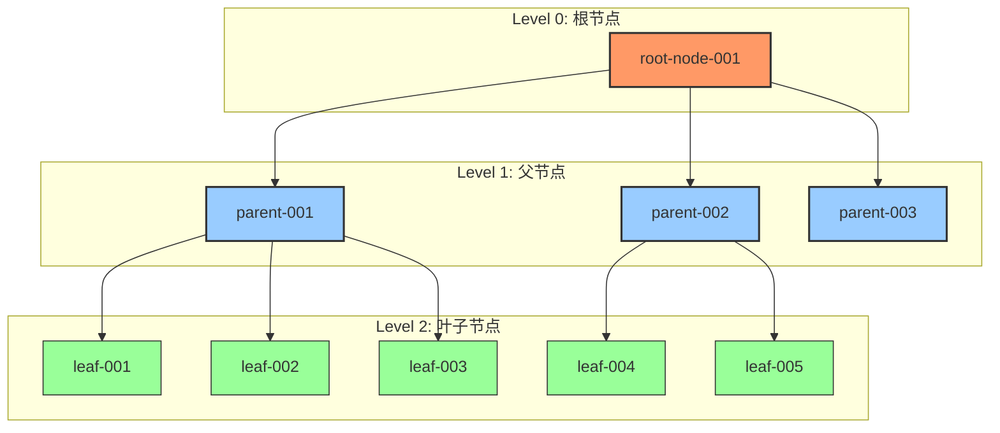
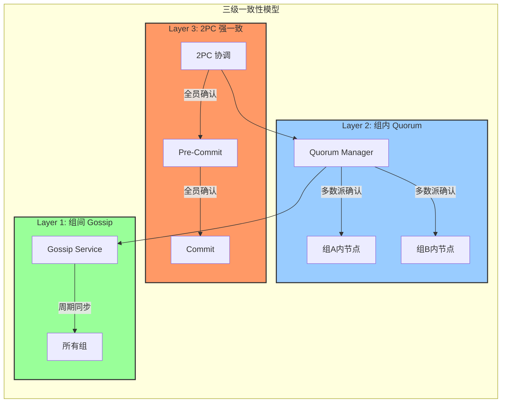
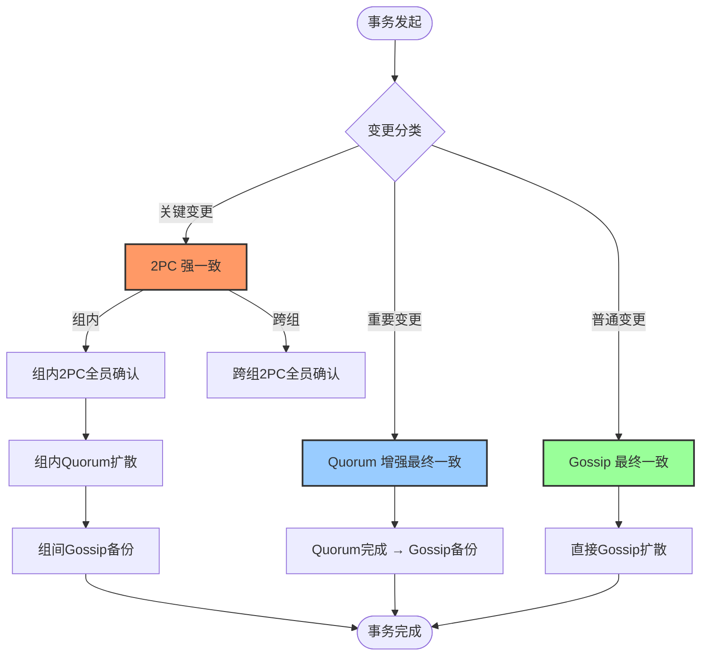
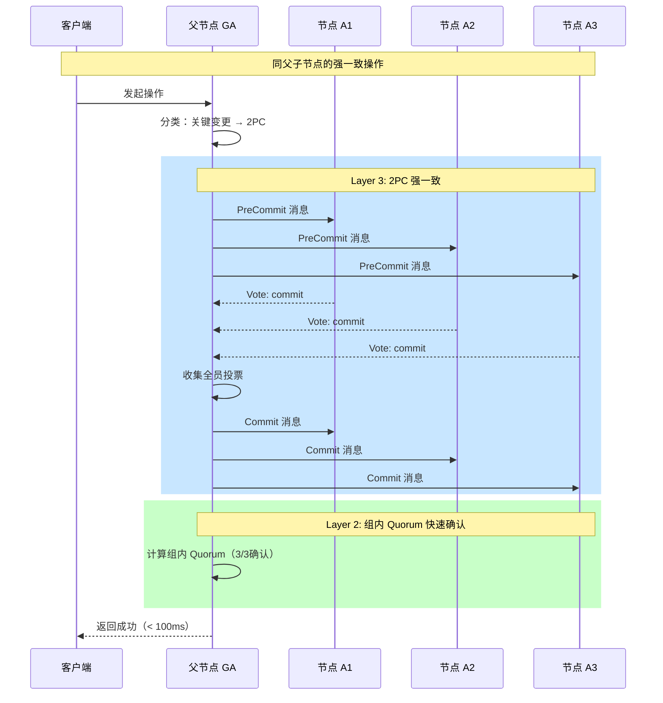
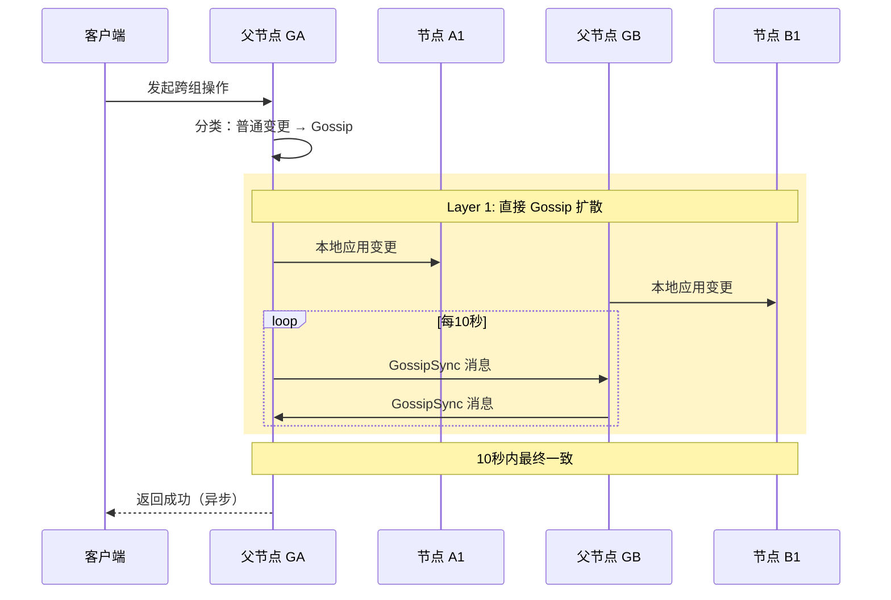

# 【预研报告】树形拓扑下的一致性分层机制

> **预研目标**：设计 Gossip + Quorum + 2PC 三种一致性机制的完整集成方案，解决树形拓扑下的一致性分层问题（同父节点强一致，跨父节点弱一致）

---

## 📋 预研信息

| 项目 | 内容 |
|------|------|
| **预研主题** | 树形拓扑下的一致性分层机制 |
| **预研日期** | 2026-02-10 |
| **预研负责人** | 🤖 核心开发 A |
| **关联需求** | 元数据管理系统完善 - 一致性协议增强 |
| **预研状态** | ✅ 已完成 |
| **预研结论** | 推荐采用双层架构（2PC → Quorum → Gossip） |

---

## 1. 调研目标

### 1.1 核心问题

**问题一：一致性机制完整性**
- **现状**：当前设计只考虑了 Gossip + Quorum 两种一致性机制
- **需求**：Gossip + Quorum + **2PC** 三种机制的协同工作
- **疑问**：三种机制如何分工？如何协同？

**问题二：树形拓扑一致性分层**
- **现状**：TreeCoordinator 采用树形拓扑结构（根节点 → 父节点 → 叶子节点）
- **需求**：
  - 同一父节点的叶子节点需要**强一致性**
  - 不同父节点的叶子节点一致性可以**减弱**
- **疑问**：如何在树形拓扑中实现一致性分层？

### 1.2 预研范围

**包含**：
- ✅ 三种一致性机制（Gossip、Quorum、2PC）的协同工作
- ✅ 树形拓扑下的一致性分层策略
- ✅ 同父子节点的强一致性机制
- ✅ 跨父节点叶子的弱一致性机制
- ✅ 与现有 TreeCoordinator 的集成方案

**不包含**：
- ❌ 跨数据中心的元数据同步
- ❌ 元数据加密传输
- ❌ Gossip 协议性能优化（增量同步、压缩）

---

## 2. 现有架构分析

### 2.1 树形拓扑结构



**拓扑特征**：
- **Level 0（根节点）**：集群入口，负责全局协调
- **Level 1（父节点）**：管理一组叶子节点，承担协调职责
- **Level 2（叶子节点）**：实际存储节点，处理业务请求

### 2.2 现有一致性模型

**发现**：现有文档 `docs/02_design/protocols/02_二阶段提交与Gossip状态同步.md` 定义了三层一致性模型：

```
Layer 3: 2PC (强一致) - 关键变更：分片创建、主副本切换
   ↓
Layer 2: Quorum (增强最终一致) - 重要变更：节点角色变更
   ↓
Layer 1: Gossip (最终一致) - 普通变更：状态更新
```

**关键发现**：
- ✅ 2PC 模块已完成 75%
- ⚠️ **Gossip 状态同步是核心 TODO**
- ✅ TreeCoordinator 已集成 kvstore 和 api 包
- ✅ 使用 libp2p 进行节点间通信

### 2.3 元数据命名空间一致性映射

现有 `internal/metadata/kvstore/metadata_kv.go` 已定义命名空间到一致性级别的映射：

| 命名空间 | 一致性级别 | 说明 |
|---------|-----------|------|
| **NamespaceCluster** | ConsistencyStrong | 集群配置：强一致 |
| **NamespaceNode** | ConsistencyEventual | 节点信息：最终一致 |
| **NamespaceRole** | ConsistencyEventual | 角色信息：最终一致 |
| **NamespaceTopo** | ConsistencyEventual | 拓扑关系：最终一致 |
| **NamespaceShard** | ConsistencyStrong | 分片信息：强一致 |
| **NamespaceStatic** | ConsistencyStrong | 静态配置：强一致 |
| **NamespaceDynamic** | ConsistencyEventual | 动态状态：最终一致 |
| **NamespaceOp** | ConsistencyEventual | 操作记录：最终一致 |
| **NamespaceVersion** | ConsistencyStrong | 版本控制：强一致 |

---

## 3. 三种一致性机制对比分析

### 3.1 机制特性对比

| 特性 | Gossip | Quorum | 2PC |
|------|--------|--------|-----|
| **一致性级别** | 最终一致 | 增强最终一致 | 强一致 |
| **延迟** | 低（异步） | 中（等待多数派） | 高（等待全员） |
| **吞吐量** | 高 | 中 | 低 |
| **容错能力** | 高（容忍 F 节点故障） | 中（容忍 F 节点故障） | 低（任意节点故障阻塞） |
| **适用场景** | 状态更新、负载信息 | 角色变更、配置变更 | 分片创建、主副本切换 |
| **协调者** | 无 | 提议者 | 事务协调者 |
| **确认机制** | 无确认 | 多数派确认 | 全员确认 |

### 3.2 变更类型分类

**基于预研分析，建议将元数据变更分为三类**：

| 变更类型 | 示例 | 一致性要求 | 同步机制 | 传播范围 |
|---------|------|-----------|---------|---------|
| **关键变更** | 分片创建、主副本切换、节点加入 | 强一致 | 2PC + Quorum | 相关节点全员 |
| **重要变更** | 节点角色变更、拓扑调整 | 增强最终一致 | Quorum + Gossip | 组内多数派 + 组间备份 |
| **普通变更** | 节点状态更新、负载信息刷新 | 最终一致 | Gossip | 随机选点扩散 |

### 3.3 架构争议分析

**争议点**：2PC 决策后如何扩散？

| 方案 | 描述 | 优点 | 缺点 | 推荐度 |
|------|------|------|------|--------|
| **双层架构** | 2PC → Quorum → Gossip | 可靠性高，渐进式确认 | 复杂度高，延迟增加 | ⭐⭐⭐⭐⭐ |
| **单层架构** | 2PC → 直接 Gossip | 简单，延迟低 | 可靠性低，无确认机制 | ⭐⭐ |

**预研结论**：推荐采用**双层架构**（2PC → Quorum → Gossip）

**理由**：
1. **可靠性**：Quorum 多数派确认提供额外可靠性保障
2. **渐进式**：从强一致到最终一致的平滑过渡
3. **可维护性**：层次清晰，便于故障排查
4. **与树形拓扑匹配**：组内强一致，组间弱一致

---

## 4. 树形拓扑一致性分层方案

### 4.1 核心设计：三级一致性模型



### 4.2 决策流程



### 4.3 同父子节点的强一致机制

**目标**：A1、A2、A3（同父）通过父节点 GA 实现强一致



**关键设计点**：
- **2PC 协调者**：父节点担任 2PC 协调者
- **全员确认**：Pre-Commit 和 Commit 阶段全员投票
- **组内 Quorum**：2PC 完成后立即进行组内 Quorum 确认
- **Gossip 备份**：最后通过 Gossip 异步扩散到其他组

### 4.4 跨父节点叶子的弱一致机制

**目标**：A1、B1（不同父）使用 Gossip 达到最终一致



**关键设计点**：
- **本地优先**：变更先在本地生效
- **周期同步**：每 10 秒进行一次 Gossip 同步
- **随机选点**：每次随机选择 2-3 个节点进行同步
- **最终一致**：保证 10 秒内达到最终一致

---

## 5. 关键接口设计

### 5.1 一致性协调器接口

```go
// ConsistencyScope 一致性范围
type ConsistencyScope int

const (
    // ScopeIntraGroup 组内（同父子节点）
    ScopeIntraGroup ConsistencyScope = iota
    // ScopeInterGroup 组间（跨父节点）
    ScopeInterGroup
    // ScopeGlobal 全局
    ScopeGlobal
)

// MetadataChange 元数据变更
type MetadataChange struct {
    // Namespace 命名空间
    Namespace string

    // Key 元数据键
    Key string

    // Value 元数据值（MessagePack 编码）
    Value []byte

    // Version MVCC 版本号
    Version uint64

    // Timestamp 操作时间戳（HLC）
    Timestamp *clock.HLC

    // ChangeType 变更类型（Put/Delete）
    ChangeType ChangeType

    // ConsistencyLevel 一致性级别
    ConsistencyLevel kvstore.ConsistencyLevel
}

// PropagateResult 传播结果
type PropagateResult struct {
    // Success 是否成功
    Success bool

    // CommittedNodes 已确认节点列表
    CommittedNodes []string

    // PendingNodes 待确认节点列表
    PendingNodes []string

    // Latency 延迟（毫秒）
    Latency int64
}

// ConsistencyCoordinator 一致性协调器接口
type ConsistencyCoordinator interface {
    // PropagateChange 传播变更（统一入口）
    PropagateChange(
        ctx context.Context,
        change *MetadataChange,
        scope ConsistencyScope,
    ) (*PropagateResult, error)

    // PropagateIntraGroup 组内传播（强一致）
    PropagateIntraGroup(
        ctx context.Context,
        change *MetadataChange,
        parentID string,
        children []string,
    ) (*PropagateResult, error)

    // PropagateInterGroup 组间传播（弱一致）
    PropagateInterGroup(
        ctx context.Context,
        change *MetadataChange,
        sourceGroup string,
        targetGroups []string,
    ) (*PropagateResult, error)
}
```

### 5.2 2PC 消息定义

```go
// TwoPCPhase 2PC 阶段
type TwoPCPhase int

const (
    TwoPCPhasePreCommit TwoPCPhase = iota
    TwoPCPhaseCommit
    TwoPCPhaseAbort
)

// TwoPCPreCommitMessage 2PC 预提交消息
type TwoPCPreCommitMessage struct {
    // TransactionID 事务ID
    TransactionID string

    // Change 元数据变更
    Change *MetadataChange

    // Coordinator 协调者节点ID
    Coordinator string

    // Participants 参与者节点列表
    Participants []string

    // Timestamp 消息时间戳（HLC）
    Timestamp *clock.HLC
}

// VoteResult 投票结果
type VoteResult struct {
    // NodeID 投票节点ID
    NodeID string

    // Vote 投票结果（commit, abort）
    Vote string

    // Timestamp 投票时间戳（HLC）
    Timestamp *clock.HLC
}

// TwoPCCommitMessage 2PC 提交消息
type TwoPCCommitMessage struct {
    // TransactionID 事务ID
    TransactionID string

    // Decision 决策（commit, abort）
    Decision string

    // Coordinator 协调者节点ID
    Coordinator string

    // Timestamp 消息时间戳（HLC）
    Timestamp *clock.HLC
}
```

### 5.3 Quorum 消息定义

```go
// QuorumProposeMessage Quorum 提议消息
type QuorumProposeMessage struct {
    // ChangeID 变更ID
    ChangeID string

    // Change 元数据变更
    Change *MetadataChange

    // Proposer 提议者节点ID
    Proposer string

    // Quorum 需要的确认数
    Quorum int

    // Timestamp 消息时间戳（HLC）
    Timestamp *clock.HLC
}

// QuorumAckMessage Quorum 确认消息
type QuorumAckMessage struct {
    // ChangeID 变更ID
    ChangeID string

    // Acceptor 确认者节点ID
    Acceptor string

    // Accept 是否接受
    Accept bool

    // Timestamp 确认时间戳（HLC）
    Timestamp *clock.HLC
}

// QuorumDecisionMessage Quorum 决策消息
type QuorumDecisionMessage struct {
    // ChangeID 变更ID
    ChangeID string

    // Decision 决策（true: 接受, false: 拒绝）
    Decision bool

    // Quorum 需要的确认数
    Quorum int

    // Actual 实际确认数
    Actual int

    // Timestamp 消息时间戳（HLC）
    Timestamp *clock.HLC
}
```

---

## 6. 技术风险评估

### 6.1 风险矩阵

| 风险 | 严重程度 | 可能性 | 影响 | 缓解措施 |
|------|---------|--------|------|----------|
| **双层架构复杂度** | 高 | 高 | 开发周期延长 | 分阶段实施（3 个 Sprint） |
| **协调者单点故障** | 高 | 中 | 系统不可用 | 状态持久化 + 多副本备份 |
| **与 TreeCoordinator 集成** | 中 | 中 | 兼容性问题 | 设计适配层，渐进式迁移 |
| **性能开销** | 中 | 中 | 延迟增加 | 优化关键路径，异步备份 |
| **测试覆盖不足** | 中 | 低 | 质量风险 | Mock Gossip 节点，混沌测试 |
| **内存开销** | 低 | 低 | 内存占用增加 | 限制缓存大小，LRU 淘汰 |

### 6.2 关键风险详解

#### 风险1：双层架构复杂度

**描述**：2PC → Quorum → Gossip 三层模型增加了系统复杂度

**影响**：
- 开发周期延长（预估 17 天 = 2.5 周）
- 代码维护成本增加
- 故障排查难度提升

**缓解措施**：
1. **分阶段实施**：
   - Phase 1（5 天）：基础设施 - 一致性协调器接口、2PC 状态持久化
   - Phase 2（8 天）：协议实现 - 2PC → Quorum → Gossip 集成
   - Phase 3（4 天）：TreeCoordinator 集成 - 适配器和端到端测试

2. **清晰的层次划分**：
   - Layer 3（2PC）：仅用于关键变更，使用频率低
   - Layer 2（Quorum）：用于重要变更，提供可靠性保障
   - Layer 1（Gossip）：用于普通变更，保持高性能

3. **渐进式迁移**：
   - 先实现 Gossip 层（已有基础）
   - 再实现 Quorum 层（中等复杂度）
   - 最后实现 2PC 层（最高复杂度）

#### 风险2：协调者单点故障

**描述**：2PC 协调者（父节点）故障可能导致事务阻塞

**影响**：
- 事务无法完成
- 资源锁定
- 系统不可用

**缓解措施**：
1. **状态持久化**：
   - 2PC 事务状态写入 MVStore
   - 故障恢复后可继续执行

2. **超时机制**：
   - Pre-Commit 阶段超时自动 Abort
   - Commit 阶段超时重试

3. **多副本备份**：
   - 协调者状态同步到其他节点
   - 协调者故障后可切换

#### 风险3：与 TreeCoordinator 集成

**描述**：新的一致性协调器需要与现有 TreeCoordinator 集成

**影响**：
- 接口不兼容
- 功能冲突
- 性能下降

**缓解措施**：
1. **适配器模式**：
   - 创建 ConsistencyAdapter 适配现有接口
   - 最小化对 TreeCoordinator 的修改

2. **渐进式迁移**：
   - 先在新功能中使用新协调器
   - 逐步迁移现有功能

3. **充分测试**：
   - 单元测试覆盖所有接口
   - 集成测试覆盖关键场景
   - 混沌测试验证故障场景

---

## 7. 实施建议

### 7.1 文件结构规划

```
internal/metadata/
├── consistency/              # 新增：一致性协调器模块
│   ├── coordinator.go        # 一致性协调器接口
│   ├── twopc_enhanced.go     # 2PC 增强（Gossip 状态同步）
│   ├── quorum_integration.go # Quorum 集成
│   ├── transaction_manager.go# 事务状态管理器
│   └── gossip_sync.go        # Gossip 同步逻辑
│
├── cluster/
│   ├── tree_coordinator.go   # 修改：集成一致性协调器
│   └── consistency_adapter.go # 新增：一致性适配器
│
└── types/
    └── consistency.go         # 新增：一致性相关类型

internal/rpc/
└── twopc_messages.go         # 新增：2PC 消息定义
```

### 7.2 工作量评估

| 阶段 | 工作量 | 里程碑 |
|------|--------|--------|
| **Phase 1: 基础设施** | 5 天 | 一致性协调器接口可用 |
| **Phase 2: 协议实现** | 8 天 | 三层一致性模型完整 |
| **Phase 3: 集成验证** | 4 天 | TreeCoordinator 集成完成 |
| **总计** | **17 天** | 约 2.5 周 |

### 7.3 关键依赖

| 组件 | 状态 | 说明 |
|------|------|------|
| MVStore | ✅ 已完成 | 多版本存储引擎 |
| MetadataKV | ✅ 已完成 | 元数据 KV 封装 |
| MetadataAPI | ✅ 已完成 | 元数据高层接口 |
| TreeCoordinator | ✅ 已完成 | 树形拓扑协调器 |
| libp2p | ✅ 已完成 | P2P 网络层 |
| **2PC Gossip 同步** | ⚠️ TODO | **核心待完成** |

### 7.4 测试策略

**单元测试**（覆盖率 > 80%）：
- 一致性协调器接口
- 2PC 状态管理
- Quorum 投票逻辑
- Gossip 同步逻辑

**集成测试**：
- 同父子节点强一致场景
- 跨父节点弱一致场景
- 故障恢复场景

**混沌测试**：
- 协调者故障
- 网络分区
- 节点宕机

---

## 8. 结论与建议

### 8.1 预研结论

✅ **方案可行**：双层架构（2PC → Quorum → Gossip）技术可行，风险可控

**核心理由**：
1. **现有基础扎实**：MVStore、MetadataKV、TreeCoordinator 已完成
2. **架构清晰**：三层一致性模型职责明确
3. **与树形拓扑匹配**：组内强一致，组间弱一致
4. **分阶段实施**：风险可控，渐进式交付

### 8.2 下一步行动

| 优先级 | 任务 | 预估工期 | 负责人 |
|--------|------|----------|--------|
| **P0** | 完成 2PC Gossip 状态同步（核心 TODO） | 3 天 | 核心开发 A |
| **P0** | 实现一致性协调器接口 | 2 天 | 核心开发 A |
| **P1** | 实现 Quorum 集成 | 4 天 | 核心开发 B |
| **P1** | TreeCoordinator 集成 | 3 天 | 核心开发 A |
| **P2** | 单元测试和集成测试 | 5 天 | 测试工程师 |

**总工期**：17 天（约 2.5 周）

### 8.3 决策建议

| 选项 | 说明 | 建议 |
|------|------|------|
| **转入正式 PR** | 创建 `feature/consistency-layering` 分支，启动开发 | ✅ **推荐** |
| **继续预研** | 深入研究某个特定技术点 | 可选（如有疑问） |
| **暂停项目** | 暂时不实施此功能 | 不推荐（需求明确） |

**推荐行动**：**转入正式 PR 流程**

**理由**：
1. 预研目标已达成
2. 技术方案已明确
3. 风险已识别，缓解措施已制定
4. 工作量已评估

---

## 9. 附录

### 9.1 关键文件清单

**现有文件（需理解）**：
1. `docs/02_design/protocols/02_二阶段提交与Gossip状态同步.md` - TwoPC 设计（75% 完成）
2. `internal/metadata/cluster/tree_coordinator.go` - 树形协调器
3. `internal/metadata/kvstore/metadata_kv.go` - MetadataKV 核心
4. `internal/metadata/types/topology_info.go` - 拓扑元数据

**需要新增的文件**：
1. `internal/metadata/consistency/coordinator.go` - 一致性协调器接口（~300 行）
2. `internal/metadata/consistency/twopc_enhanced.go` - 2PC 增强（~500 行）
3. `internal/metadata/consistency/quorum_integration.go` - Quorum 集成（~400 行）
4. `internal/rpc/twopc_messages.go` - 2PC 消息定义（~150 行）

### 9.2 参考文档

**内部文档**：
- `docs/02_design/protocols/01_一致性协议设计.md` - 一致性协议设计
- `docs/03_development/02_运行时细节文档.md` - 运行时细节
- `docs/06_project_management/02_团队分工清单.md` - 团队分工

**外部参考**：
- [Gossip Protocol](https://en.wikipedia.org/wiki/Gossip_protocol)
- [Two-phase commit protocol](https://en.wikipedia.org/wiki/Two-phase_commit_protocol)
- [Quorum (distributed systems)](https://en.wikipedia.org/wiki/Quorum_(distributed_systems))

---

**文档版本**: v1.0
**创建日期**: 2026-02-10
**最后更新**: 2026-02-10
**维护者**: NexKV 开发团队
**状态**: ✅ 预研完成，建议转入正式 PR 流程
