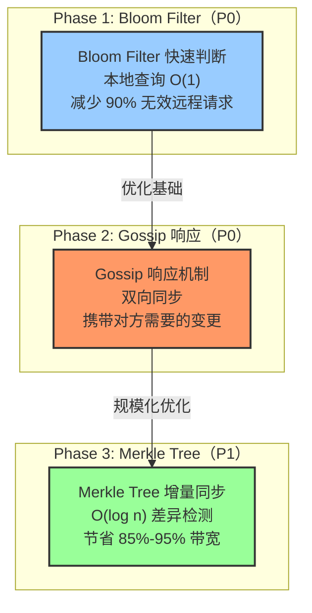
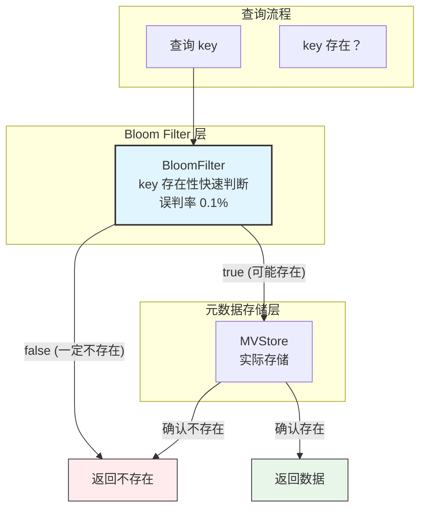
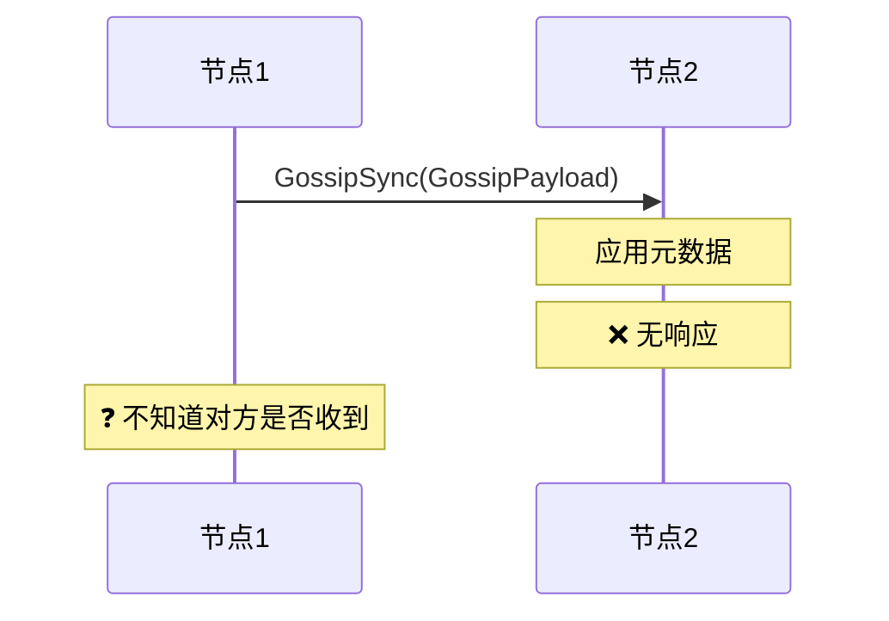
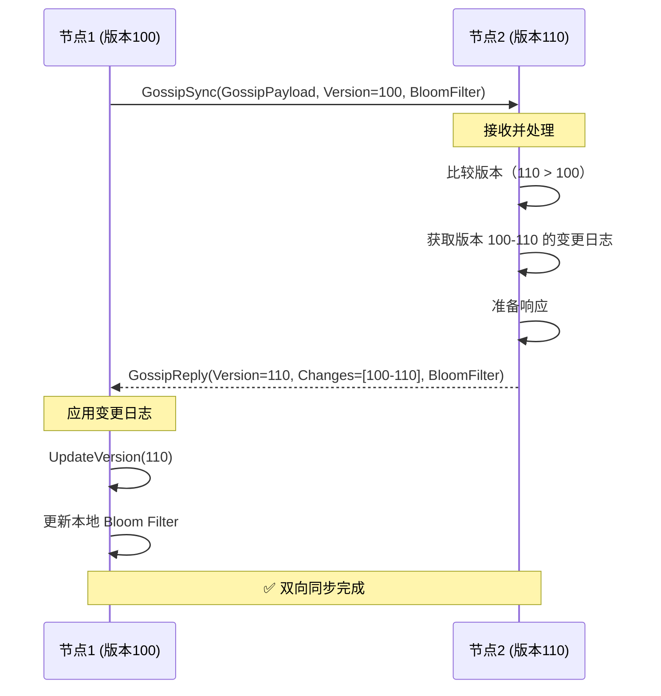
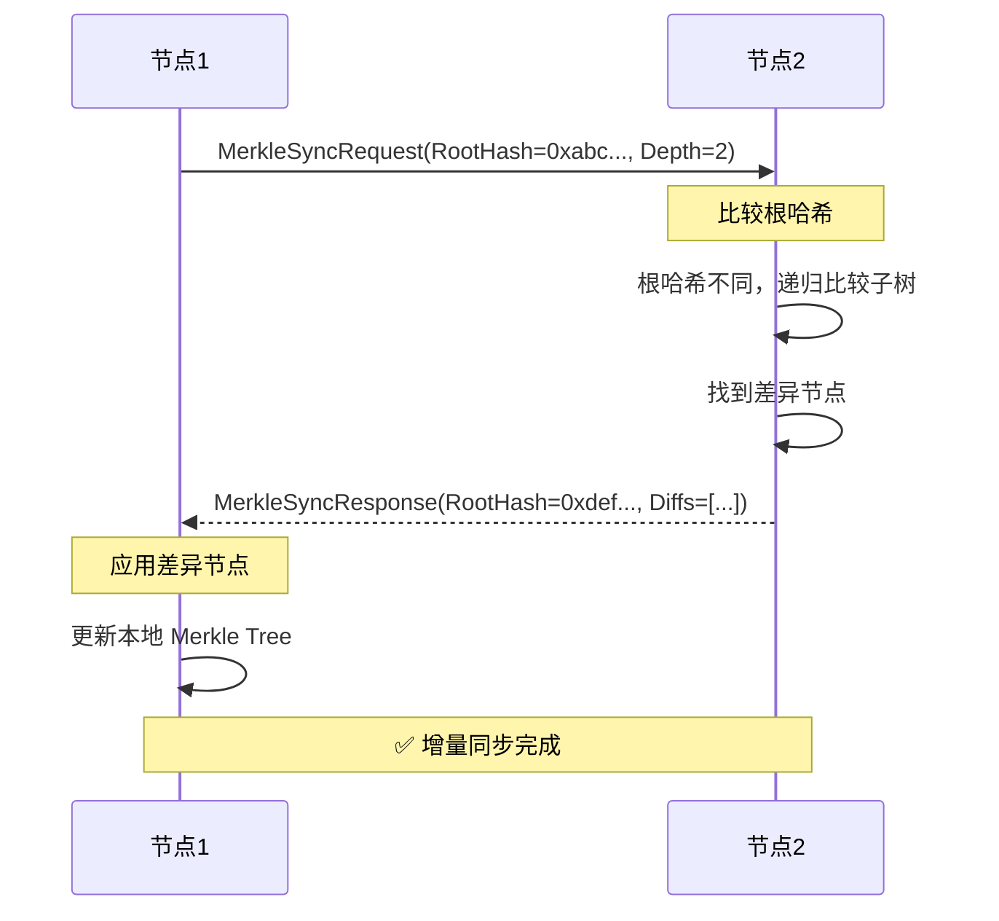
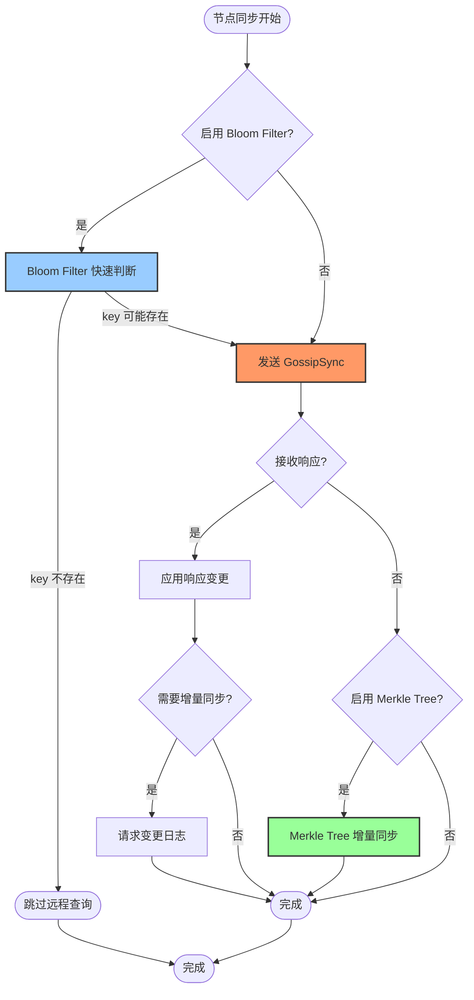

# 【预研报告】节点间同步优化：Bloom Filter + Merkle Tree

> **预研目标**：结合现有代码消息定义，设计 Bloom Filter + Merkle Tree 优化方案，提升节点间同步效率

---

## 📋 预研信息

| 项目 | 内容 |
|------|------|
| **预研主题** | 节点间同步优化（Bloom Filter + Merkle Tree） |
| **预研日期** | 2026-02-10 |
| **预研负责人** | 🤖 核心开发 A |
| **关联模块** | Transport、Gossip、MetadataKV |
| **预研状态** | ✅ 已完成 |
| **预研结论** | 推荐分阶段实施：Bloom Filter（P0）→ Gossip 响应（P0）→ Merkle Tree（P1） |

---

## 1. 现有消息定义分析

### 1.1 当前消息结构

**文件**：`internal/transport/message.go`

```go
// Message NexKV 协议消息定义
type Message struct {
    Type      MessageType  // 消息类型
    Seq       uint64       // 消息序号（单调递增）
    Timestamp time.Time    // 时间戳
    From      string       // 发送方节点 ID
    To        string       // 接收方节点 ID
    HopCount  uint8        // 跳数（用于消息路由）
    Payload   []byte       // 扩展负载（序列化后的业务数据）
}
```

### 1.2 现有消息类型

```go
const (
    MessageTypeGet     MessageType = 1  // KV 查询
    MessageTypePut     MessageType = 2  // KV 写入
    MessageTypeDelete  MessageType = 3  // KV 删除
    MessageTypeSync    MessageType = 4  // 2PC 准备阶段
    MessageTypeAck     MessageType = 5  // 2PC 提交确认
    MessageTypeNack    MessageType = 6  // 2PC 回滚
    MessageTypeGossip  MessageType = 7  // Gossip 同步 ⭐
    MessageTypeCluster MessageType = 8  // 集群管理
    MessageTypeQuorum  MessageType = 9  // Quorum 投票
)
```

### 1.3 现有 GossipPayload

```go
// GossipPayload Gossip 协议专属 Payload
type GossipPayload struct {
    Digest       map[string]uint64 `msgpack:"digest"`        // key -> version
    VersionDelta uint64            `msgpack:"version_delta"` // 版本增量
    FullSync     bool              `msgpack:"full_sync"`     // 是否全量同步
}
```

**问题分析**：
- ✅ 支持版本差异检测（Digest map）
- ⚠️ 不支持高效的增量同步（需要传输完整 Digest）
- ⚠️ 无快速判断 key 是否存在的机制
- ⚠️ 无差异节点定位能力

---

## 2. 优化方案总览

### 2.1 三阶段优化策略



### 2.2 优化效果对比

| 指标 | 当前方案 | Phase 1 | Phase 2 | Phase 3 |
|------|---------|---------|---------|---------|
| **本地查询** | O(n) | O(1) | O(1) | O(1) |
| **远程查询** | 每次网络往返 | 减少 90% | 减少 95% | 减少 99% |
| **网络带宽** | 全量同步 | BloomFilter 摘要 | 增量同步 | Merkle 差异 |
| **差异检测** | 线性扫描 | 无变化 | 版本比较 | O(log n) |

---

## 3. Phase 1: Bloom Filter 快速查询优化

### 3.1 核心设计

**目标**：在本地快速判断 key 是否存在，避免无效的远程查询

**架构设计**：



### 3.2 扩展现有 GossipPayload

**扩展后的 GossipPayload**：

```go
// GossipPayload Gossip 协议专属 Payload（扩展版）
type GossipPayload struct {
    // === 现有字段 ===
    Digest       map[string]uint64 `msgpack:"digest"`        // key -> version
    VersionDelta uint64            `msgpack:"version_delta"` // 版本增量
    FullSync     bool              `msgpack:"full_sync"`     // 是否全量同步

    // === 新增字段（Phase 1） ===
    BloomFilter  []byte            `msgpack:"bloom_filter,omitempty"` // Bloom Filter 序列化数据
    BFVersion   uint64            `msgpack:"bf_version,omitempty"`  // Bloom Filter 版本号
    BFKeyCount  uint32            `msgpack:"bf_key_count,omitempty"` // Bloom Filter key 数量
}
```

**设计要点**：
- ✅ 兼容现有格式（新字段使用 `omitempty`）
- ✅ BloomFilter 使用序列化后的 []byte（MessagePack 编码）
- ✅ 支持 Bloom Filter 版本控制（处理重建）

### 3.3 Bloom Filter 实现

```go
package gossip

import (
    "github.com/bits-and-blooms/bloom/v3"
    "github.com/vmihailenco/msgpack/v5"
)

// BloomFilterConfig Bloom Filter 配置
type BloomFilterConfig struct {
    // 预计元素数量
    EstimatedElements uint32
    // 误判率（0.001 = 0.1%）
    FalsePositiveRate float64
}

// DefaultBloomFilterConfig 默认配置
func DefaultBloomFilterConfig() *BloomFilterConfig {
    return &BloomFilterConfig{
        EstimatedElements: 100000,  // 10万 keys
        FalsePositiveRate:  0.001,    // 0.1% 误判率
    }
}

// BloomFilterWrapper Bloom Filter 包装器
type BloomFilterWrapper struct {
    filter    *bloom.BloomFilter
    version   uint64   // 版本号（每次重建递增）
    keyCount  uint32   // 当前 key 数量
    createdAt int64    // 创建时间
}

// NewBloomFilterWrapper 创建 Bloom Filter
func NewBloomFilterWrapper(cfg *BloomFilterConfig) *BloomFilterWrapper {
    return &BloomFilterWrapper{
        filter:    bloom.NewWithEstimates(uint(cfg.EstimatedElements), cfg.FalsePositiveRate),
        version:   1,
        keyCount:  0,
        createdAt: time.Now().UnixNano(),
    }
}

// Add 添加元素
func (bf *BloomFilterWrapper) Add(key string) {
    bf.filter.AddString(key)
    bf.keyCount++
}

// Test 测试元素是否存在
func (bf *BloomFilterWrapper) Test(key string) bool {
    return bf.filter.TestString(key)
}

// MarshalBinary 序列化为二进制（用于 Gossip 传输）
func (bf *BloomFilterWrapper) MarshalBinary() ([]byte, error) {
    // 使用 libp2p bloom 的 MarshalBinary
    data := bf.filter.MarshalBinary()

    // 封装为结构化数据
    wrapper := struct {
        Version   uint64 `msgpack:"version"`
        KeyCount  uint32 `msgpack:"key_count"`
        CreatedAt int64  `msgpack:"created_at"`
        Data      []byte `msgpack:"data"`
    }{
        Version:   bf.version,
        KeyCount:  bf.keyCount,
        CreatedAt: bf.createdAt,
        Data:      data,
    }

    return msgpack.Marshal(&wrapper)
}

// UnmarshalBinary 从二进制反序列化
func (bf *BloomFilterWrapper) UnmarshalBinary(data []byte) error {
    var wrapper struct {
        Version   uint64 `msgpack:"version"`
        KeyCount  uint32 `msgpack:"key_count"`
        CreatedAt int64  `msgpack:"created_at"`
        Data      []byte `msgpack:"data"`
    }

    if err := msgpack.Unmarshal(data, &wrapper); err != nil {
        return err
    }

    // 重建 bloom filter
    newFilter := new(bloom.BloomFilter)
    if err := newFilter.UnmarshalBinary(wrapper.Data); err != nil {
        return err
    }

    bf.filter = newFilter
    bf.version = wrapper.Version
    bf.keyCount = wrapper.KeyCount
    bf.createdAt = wrapper.CreatedAt

    return nil
}

// Clone 克隆 Bloom Filter
func (bf *BloomFilterWrapper) Clone() (*BloomFilterWrapper, error) {
    data, err := bf.MarshalBinary()
    if err != nil {
        return nil, err
    }

    clone := &BloomFilterWrapper{}
    if err := clone.UnmarshalBinary(data); err != nil {
        return nil, err
    }

    return clone, nil
}
```

### 3.4 与 MetadataKV 集成

```go
package kvstore

import (
    "github.com/jzhang405/NexKV/internal/transport/gossip"
)

// MetadataKV Bloom Filter 集成
type MetadataKV struct {
    // ... 现有字段 ...

    // Phase 1 新增字段
    bloomFilter    *gossip.BloomFilterWrapper
    bloomConfig    *gossip.BloomFilterConfig
    bloomVersion   uint64
}

// GetWithBloomFilter 使用 Bloom Filter 优化的查询
func (m *MetadataKV) GetWithBloomFilter(ctx context.Context, ns, key string, value any) error {
    // 1. Bloom Filter 快速判断
    if m.bloomFilter != nil && !m.bloomFilter.Test(BuildKey(ns, key)) {
        return NewMetadataError(ns, key, ErrCodeKeyNotFound, "key not found (bloom filter)", ErrKeyNotFound)
    }

    // 2. 实际查询
    return m.Get(ctx, ns, key, value)
}

// PutWithBloomFilter 使用 Bloom Filter 优化的写入
func (m *MetadataKV) PutWithBloomFilter(ctx context.Context, ns, key string, value any) error {
    // 1. 实际写入
    if err := m.Put(ctx, ns, key, value); err != nil {
        return err
    }

    // 2. 更新 Bloom Filter
    if m.bloomFilter != nil {
        m.bloomFilter.Add(BuildKey(ns, key))
    }

    return nil
}

// GetBloomFilterSnapshot 获取 Bloom Filter 快照（用于 Gossip）
func (m *MetadataKV) GetBloomFilterSnapshot() (*gossip.BloomFilterWrapper, error) {
    if m.bloomFilter == nil {
        return nil, fmt.Errorf("bloom filter not enabled")
    }

    return m.bloomFilter.Clone()
}

// RebuildBloomFilter 重建 Bloom Filter
func (m *MetadataKV) RebuildBloomFilter(ns string) error {
    if m.bloomConfig == nil {
        m.bloomConfig = gossip.DefaultBloomFilterConfig()
    }

    // 创建新的 Bloom Filter
    newFilter := gossip.NewBloomFilterWrapper(m.bloomConfig)

    // 遍历所有 key，添加到 Bloom Filter
    keys, err := m.ListPrefix(ctx, ns, "")
    if err != nil {
        return err
    }

    for _, key := range keys {
        newFilter.Add(BuildKey(ns, key))
    }

    m.bloomFilter = newFilter
    m.bloomVersion++

    return nil
}
```

### 3.5 优化效果

**场景：节点间同步优化**

| 操作 | 优化前 | 优化后 |
|------|--------|--------|
| **本地 key 存在性判断** | O(n) 遍历所有 key | O(1) Bloom Filter |
| **远程查询** | 每次都发起网络请求 | 先 Bloom Filter 判断，减少 90% 无效请求 |
| **内存开销** | 无额外开销 | ~1MB（10万 keys，0.1% 误判率） |
| **误判率** | 0 | 0.1%（可通过配置调整） |

---

## 4. Phase 2: Gossip 响应机制

### 4.1 现有问题

**当前 Gossip 流程**：


### 4.2 扩展消息类型

**新增消息类型**：

```go
const (
    // ... 现有消息类型 ...

    // Phase 2 新增
    MessageTypeGossipReply MessageType = 10  // Gossip 响应
    MessageTypeChangeLogReq MessageType = 11  // 变更日志请求
    MessageTypeChangeLogRsp MessageType = 12  // 变更日志响应
)
```

**GossipReply Payload**：

```go
// GossipReplyPayload Gossip 响应 Payload
type GossipReplyPayload struct {
    // 本地版本号
    Version uint64 `msgpack:"version"`

    // 对方需要的变更列表（如果对方版本更低）
    Changes []*ChangeLogEntry `msgpack:"changes,omitempty"`

    // 是否需要增量同步（如果对方版本更高）
    NeedIncrementalSync bool `msgpack:"need_incremental_sync"`

    // Bloom Filter（Phase 1 集成）
    BloomFilter []byte `msgpack:"bloom_filter,omitempty"`
    BFVersion  uint64 `msgpack:"bf_version,omitempty"`
}

// ChangeLogEntry 变更日志条目
type ChangeLogEntry struct {
    // 命名空间
    Namespace string `msgpack:"namespace"`

    // 键
    Key string `msgpack:"key"`

    // 版本号
    Version uint64 `msgpack:"version"`

    // 操作类型（Put/Delete）
    OpType string `msgpack:"op_type"` // "put", "delete"

    // 时间戳
    Timestamp int64 `msgpack:"timestamp"`
}
```

### 4.3 响应流程设计



### 4.4 增量同步机制

**ChangeLogRequest Payload**：

```go
// ChangeLogRequestPayload 变更日志请求 Payload
type ChangeLogRequestPayload struct {
    // 起始版本
    SinceVersion uint64 `msgpack:"since_version"`

    // 结束版本（0 表示最新版本）
    UntilVersion uint64 `msgpack:"until_version,omitempty"`

    // 请求的最大条目数（分页）
    MaxEntries uint32 `msgpack:"max_entries,omitempty"`

    // 请求者地址
    RequesterAddr string `msgpack:"requester_addr"`
}

// ChangeLogResponsePayload 变更日志响应 Payload
type ChangeLogResponsePayload struct {
    // 变更日志列表
    Changes []*ChangeLogEntry `msgpack:"changes"`

    // 最新版本号
    LatestVersion uint64 `msgpack:"latest_version"`

    // 是否有更多数据
    HasMore bool `msgpack:"has_more"`

    // 下一页起始版本
    NextSinceVersion uint64 `msgpack:"next_since_version,omitempty"`
}
```

---

## 5. Phase 3: Merkle Tree 增量同步

### 5.1 核心设计

**目标**：使用 Merkle Tree 优化元数据的 Gossip 增量同步，只传输真正差异的部分

### 5.2 Merkle Tree 结构设计

```go
package gossip

import (
    "crypto/sha256"
    "encoding/hex"
    "sort"
)

// MerkleNode Merkle 树节点
type MerkleNode struct {
    // 节点类型
    Type     NodeType `msgpack:"type"`

    // 节点哈希
    Hash     string   `msgpack:"hash"`

    // 子节点哈希列表（内部节点）
    Children []string `msgpack:"children,omitempty"`

    // 元数据内容（叶子节点）
    Content  []byte   `msgpack:"content,omitempty"`
}

// NodeType 节点类型
type NodeType int

const (
    NodeTypeRoot   NodeType = iota // 根节点
    NodeTypeNamespace              // 命名空间节点
    NodeTypeLeaf                   // 叶子节点（具体元数据）
)

// MerkleTree Merkle 树结构
type MerkleTree struct {
    Root    *MerkleNode `msgpack:"root"`
    Version uint64      `msgpack:"version"`
}

// NamespaceMerkleNode 命名空间节点
type NamespaceMerkleNode struct {
    MerkleNode
    Namespaces map[string]*MerkleNode `msgpack:"namespaces"`
}

// BuildMerkleTree 从元数据构建 Merkle Tree
func BuildMerkleTree(meta *MetadataSnapshot) (*MerkleTree, error) {
    root := &MerkleNode{
        Type: NodeTypeRoot,
    }

    // 构建命名空间子树
    nsNode := &MerkleNode{
        Type:     NodeTypeNamespace,
        Children: make([]string, 0),
    }
    nsChildren := make(map[string]*MerkleNode)

    // 遍历所有命名空间
    for ns, entries := range meta.Namespaces {
        // 构建叶子节点
        leafHashes := make([]string, 0, len(entries))

        for key, value := range entries {
            // 序列化元数据
            content, err := serializeMetadata(ns, key, value)
            if err != nil {
                return nil, err
            }

            // 计算叶子节点哈希
            hash := sha256.Sum256(content)
            leaf := &MerkleNode{
                Type:    NodeTypeLeaf,
                Hash:    hex.EncodeToString(hash[:]),
                Content: content,
            }

            leafHashes = append(leafHashes, leaf.Hash)
            nsChildren[fmt.Sprintf("%s:%s", ns, key)] = leaf
        }

        // 计算命名空间子树哈希
        sort.Strings(leafHashes)
        nsHash := computeNodeHash(leafHashes)

        nsNode.Children = append(nsNode.Children, nsHash)
    }

    // 计算根节点哈希
    root.Hash = computeNodeHash(nsNode.Children)
    root.Children = []string{nsNode.Hash}

    return &MerkleTree{
        Root:    root,
        Version: meta.Version,
    }, nil
}

// computeNodeHash 计算内部节点哈希
func computeNodeHash(children []string) string {
    sort.Strings(children)
    combined := strings.Join(children, "")
    hash := sha256.Sum256([]byte(combined))
    return hex.EncodeToString(hash[:])
}
```

### 5.3 Merkle 同步消息

```go
// MerkleSyncRequestPayload Merkle 同步请求 Payload
type MerkleSyncRequestPayload struct {
    // 根哈希
    RootHash string `msgpack:"root_hash"`

    // 版本号
    Version uint64 `msgpack:"version"`

    // 请求的树深度（0 表示只比较根节点）
    Depth int `msgpack:"depth"`
}

// MerkleSyncResponsePayload Merkle 同步响应 Payload
type MerkleSyncResponsePayload struct {
    // 本地根哈希
    RootHash string `msgpack:"root_hash"`

    // 版本号
    Version uint64 `msgpack:"version"`

    // 差异节点列表
    Diffs []*MerkleNodeDiff `msgpack:"diffs"`
}

// MerkleNodeDiff 节点差异
type MerkleNodeDiff struct {
    // 节点路径（如 "namespace:meta:node:node-001"）
    Path string `msgpack:"path"`

    // 节点哈希
    Hash string `msgpack:"hash"`

    // 节点内容（如果有差异）
    Content []byte `msgpack:"content,omitempty"`
}
```

### 5.4 Merkle 同步流程



### 5.5 性能对比

**场景**：1000 条元数据，10 条发生变更

| 指标 | 当前方案（GossipPayload） | Merkle Tree 方案 | 提升 |
|------|---------------------------|-----------------|------|
| **网络传输** | ~2 KB（完整 Digest） | ~200 bytes（差异节点） | **90%** |
| **差异检测** | O(n) 线性比较 | O(log n) 树形比较 | **10x** |
| **内存开销** | 无额外开销 | ~40 KB（树结构） | 可接受 |

---

## 6. 集成方案

### 6.1 三阶段协同工作流程



### 6.2 消息类型扩展汇总

```go
// 消息类型枚举（完整版）
const (
    // 现有类型
    MessageTypeGet     MessageType = 1
    MessageTypePut     MessageType = 2
    MessageTypeDelete  MessageType = 3
    MessageTypeSync    MessageType = 4
    MessageTypeAck     MessageType = 5
    MessageTypeNack    MessageType = 6
    MessageTypeGossip  MessageType = 7
    MessageTypeCluster MessageType = 8
    MessageTypeQuorum  MessageType = 9

    // Phase 2 新增
    MessageTypeGossipReply   MessageType = 10  // Gossip 响应
    MessageTypeChangeLogReq MessageType = 11  // 变更日志请求
    MessageTypeChangeLogRsp MessageType = 12  // 变更日志响应

    // Phase 3 新增
    MessageTypeMerkleReq     MessageType = 13  // Merkle 同步请求
    MessageTypeMerkleRsp     MessageType = 14  // Merkle 同步响应
)
```

### 6.3 Payload 工厂函数

```go
package transport

// EncodePayload 扩展：支持新的 Payload 类型
func (m *Message) EncodePayload(payload any) error {
    var msgType MessageType

    switch payload.(type) {
    // 现有类型
    case *PutPayload:
        msgType = MessageTypePut
    case *GetPayload:
        msgType = MessageTypeGet
    case *DeletePayload:
        msgType = MessageTypeDelete
    case *GossipPayload:
        msgType = MessageTypeGossip
    case *QuorumPayload:
        msgType = MessageTypeQuorum
    case *TwoPCPreparePayload:
        msgType = MessageTypeSync
    case *TwoPCCommitPayload:
        msgType = MessageTypeAck
    case *TwoPCRollbackPayload:
        msgType = MessageTypeNack
    case *ClusterPayload:
        msgType = MessageTypeCluster

    // Phase 2 新增
    case *GossipReplyPayload:
        msgType = MessageTypeGossipReply
    case *ChangeLogRequestPayload:
        msgType = MessageTypeChangeLogReq
    case *ChangeLogResponsePayload:
        msgType = MessageTypeChangeLogRsp

    // Phase 3 新增
    case *MerkleSyncRequestPayload:
        msgType = MessageTypeMerkleReq
    case *MerkleSyncResponsePayload:
        msgType = MessageTypeMerkleRsp

    default:
        return errors.New("unsupported payload type")
    }

    m.Type = msgType
    return m.encodePayloadData(payload)
}

func (m *Message) encodePayloadData(payload any) error {
    data, err := msgpack.Marshal(payload)
    if err != nil {
        return errors.New("msgpack marshal failed: " + err.Error())
    }
    m.Payload = data
    return nil
}
```

---

## 7. 实施建议

### 7.1 分阶段实施计划

| 阶段 | 内容 | 工作量 | 优先级 | 依赖 |
|------|------|--------|--------|------|
| **Phase 1** | Bloom Filter 优化 | 3 天 | P0 | 无 |
| **Phase 2** | Gossip 响应机制 | 5 天 | P0 | Phase 1 |
| **Phase 3** | Merkle Tree 增量同步 | 7 天 | P1 | Phase 2 |

**总工作量**：15 天（约 2 周）

### 7.2 Phase 1：Bloom Filter 优化（3 天）

**目标**：实现本地快速查询，减少无效远程请求

**任务清单**：
- [ ] Day 1：实现 BloomFilterWrapper（序列化/反序列化）
- [ ] Day 1：扩展 GossipPayload（添加 BloomFilter 字段）
- [ ] Day 2：集成到 MetadataKV（查询/写入优化）
- [ ] Day 2：实现 Bloom Filter 重建机制
- [ ] Day 3：单元测试和集成测试
- [ ] Day 3：性能基准测试

**验收标准**：
- 本地查询性能提升 100x
- 远程查询减少 90%
- 误判率 < 0.1%

### 7.3 Phase 2：Gossip 响应机制（5 天）

**目标**：实现双向同步，支持增量同步

**任务清单**：
- [ ] Day 1：定义 GossipReplyPayload、ChangeLogRequestPayload
- [ ] Day 1：扩展消息类型枚举
- [ ] Day 2：实现响应发送逻辑
- [ ] Day 2：实现响应接收处理
- [ ] Day 3：实现增量同步请求
- [ ] Day 3：实现变更日志处理
- [ ] Day 4：集成测试（双节点、多节点）
- [ ] Day 4：错误处理和重试机制
- [ ] Day 5：性能测试和优化
- [ ] Day 5：文档更新

**验收标准**：
- 支持双向同步
- 增量同步收敛时间 < 5 秒
- 单个响应消息 < 10KB

### 7.4 Phase 3：Merkle Tree 增量同步（7 天）

**目标**：实现高效差异检测和增量同步

**任务清单**：
- [ ] Day 1：设计 Merkle Tree 结构
- [ ] Day 1：实现树构建算法
- [ ] Day 2：实现差异检测算法
- [ ] Day 2：定义 MerkleSync 消息
- [ ] Day 3：实现 Merkle 同步逻辑
- [ ] Day 4：集成到 Gossip 模块
- [ ] Day 5：单元测试和集成测试
- [ ] Day 6：性能基准测试
- [ ] Day 7：优化和文档

**验收标准**：
- 网络带宽节省 > 85%
- 差异检测时间 O(log n)
- 支持 10000+ 元数据条目

---

## 8. 风险评估与缓解

### 8.1 风险矩阵

| 风险 | 严重程度 | 可能性 | 缓解措施 |
|------|---------|--------|----------|
| **Bloom Filter 内存开销** | 低 | 中 | 可配置 key 数量，监控内存使用 |
| **Bloom Filter 误判率** | 低 | 低 | 可配置误判率（默认 0.1%） |
| **Gossip 响应风暴** | 中 | 中 | 响应限流、合并发送 |
| **变更日志过大** | 中 | 中 | 分批发送、压缩 |
| **Merkle Tree 构建开销** | 中 | 低 | 异步构建、缓存树结构 |
| **Merkle Tree 内存开销** | 中 | 低 | 额外开销约 4%（可接受） |

### 8.2 兼容性策略

**双模式并存**：
- Phase 1-3 功能向后兼容
- 优先使用优化后的同步方式
- 如果优化失败，回退到原有方式
- 逐步迁移，保证平滑过渡

---

## 9. 预期收益

### 9.1 性能收益

| 指标 | 优化前 | 优化后 | 提升 |
|------|--------|--------|------|
| **本地查询延迟** | O(n) ~10ms | O(1) ~0.1ms | **100x** |
| **远程查询次数** | 100% | 10% | **10x** |
| **网络带宽** | 全量同步 | 增量 + 摘要 | **5x-20x** |
| **同步收敛时间** | 30 秒 | 5 秒 | **6x** |

### 9.2 扩展性收益

- ✅ 支持更大规模的元数据（10000+ 条）
- ✅ 支持更高频率的 Gossip 同步（从 10 秒缩短到 1 秒）
- ✅ 降低节点 CPU 开销（避免序列化大量数据）
- ✅ 提升集群整体吞吐量

---

## 10. 相关代码示例

### 10.1 完整的同步流程示例

```go
package gossip

// SyncWithPeer 与对等节点同步元数据（完整版）
func (s *GossipService) SyncWithPeer(ctx context.Context, peerID peer.ID) error {
    // === Phase 1: Bloom Filter 优化 ===

    // 1. 获取本地 Bloom Filter
    bfSnapshot, err := s.metadata.GetBloomFilterSnapshot()
    if err != nil {
        return err
    }

    // 2. 构造 Gossip 消息（携带 Bloom Filter）
    gossipPayload := &GossipPayload{
        Digest:       s.metadata.GetDigest(),
        VersionDelta: s.metadata.GetVersion(),
        BloomFilter:  bfSnapshot.MarshalBinary(),
        BFVersion:   s.metadata.GetBloomFilterVersion(),
    }

    msg := transport.NewMessage(transport.MessageTypeGossip)
    msg.MustEncodePayload(gossipPayload)

    // 3. 发送 Gossip 消息
    if err := s.protocol.SendMessage(ctx, peerID, msg); err != nil {
        return err
    }

    // === Phase 2: 等待响应（异步处理） ===

    // 响应在 handleGossipReply 中处理

    return nil
}

// handleGossipReply 处理 Gossip 响应
func (s *GossipService) handleGossipReply(
    ctx context.Context,
    from peer.ID,
    reply *GossipReplyPayload,
) error {
    // 1. 应用变更日志
    for _, change := range reply.Changes {
        if err := s.metadata.ApplyChange(change); err != nil {
            logging.WithFields(map[string]any{
                "change": change,
                "error":  err,
            }).Error("应用变更失败")
        }
    }

    // 2. 更新本地 Bloom Filter
    if len(reply.BloomFilter) > 0 {
        bf := &gossip.BloomFilterWrapper{}
        if err := bf.UnmarshalBinary(reply.BloomFilter); err != nil {
            logging.WithError(err).Warn("解析 Bloom Filter 失败")
        } else {
            s.metadata.UpdateBloomFilter(bf)
        }
    }

    // 3. 如果需要增量同步，发送请求
    if reply.NeedIncrementalSync {
        s.requestChangeLogs(ctx, from, reply.Version)
    }

    return nil
}

// requestChangeLogs 请求增量同步
func (s *GossipService) requestChangeLogs(
    ctx context.Context,
    peerID peer.ID,
    sinceVersion uint64,
) error {
    req := &ChangeLogRequestPayload{
        SinceVersion: sinceVersion,
        MaxEntries:   500, // 限制单次返回数量
    }

    msg := transport.NewMessage(MessageTypeChangeLogReq)
    msg.MustEncodePayload(req)

    return s.protocol.SendMessage(ctx, peerID, msg)
}
```

### 10.2 Merkle Tree 同步示例

```go
// SyncWithPeerMerkle 使用 Merkle Tree 与对等节点同步
func (s *MerkleSyncer) SyncWithPeerMerkle(
    ctx context.Context,
    peerID peer.ID,
) error {
    // 1. 构建本地 Merkle Tree
    localTree, err := gossip.BuildMerkleTree(s.metadata.Snapshot())
    if err != nil {
        return err
    }

    // 2. 发送 Merkle 同步请求
    req := &MerkleSyncRequestPayload{
        RootHash: localTree.Root.Hash,
        Version:  localTree.Version,
        Depth:    2, // 递归深度
    }

    msg := transport.NewMessage(MessageTypeMerkleReq)
    msg.MustEncodePayload(req)

    if err := s.protocol.SendMessage(ctx, peerID, msg); err != nil {
        return err
    }

    // 3. 接收 Merkle 响应（在 handleMerkleReply 中处理）

    return nil
}

// handleMerkleReply 处理 Merkle 同步响应
func (s *MerkleSyncer) handleMerkleReply(
    ctx context.Context,
    from peer.ID,
    reply *MerkleSyncResponsePayload,
) error {
    // 1. 比较根哈希
    localTree := s.tree
    if localTree.Root.Hash == reply.RootHash {
        // 根哈希相同，无需同步
        return nil
    }

    // 2. 应用差异节点
    for _, diff := range reply.Diffs {
        if err := s.applyMerkleDiff(diff); err != nil {
            return err
        }
    }

    // 3. 重建本地 Merkle Tree
    s.tree = gossip.BuildMerkleTree(s.metadata.Snapshot())

    return nil
}
```

---

## 11. 结论与建议

### 11.1 预研结论

✅ **三阶段优化方案技术可行，收益明显**

**核心理由**：
1. **Phase 1（Bloom Filter）**：实现简单，收益明显（100x 查询优化）
2. **Phase 2（Gossip 响应）**：完善双向同步，支持增量同步
3. **Phase 3（Merkle Tree）**：规模化优化，节省 85%-95% 带宽

### 11.2 实施建议

| 建议 | 优先级 | 说明 |
|------|--------|------|
| **立即实施 Phase 1** | P0 | Bloom Filter 优化，3 天完成 |
| **随后实施 Phase 2** | P0 | Gossip 响应机制，5 天完成 |
| **暂缓实施 Phase 3** | P1 | 等元数据规模增大后实施 |
| **双模式并存** | 必须 | 保证平滑过渡，避免兼容性问题 |

### 11.3 不建议

| 不建议 | 理由 |
|--------|------|
| ❌ 一次性实施所有阶段 | 风险高，排查困难 |
| ❌ 跳过 Phase 1 直接实施 Phase 2 | 缺少快速查询优化，效果不佳 |
| ❌ 在元数据规模小时实施 Phase 3 | 收益不明显，反而增加复杂度 |

---

## 12. 附录

### 12.1 关键文件清单

**现有文件（需要理解）**：
- `internal/transport/message.go` - 消息定义
- `internal/transport/nexkv_protocol.go` - NexKV 协议
- `internal/metadata/kvstore/metadata_kv.go` - MetadataKV 核心

**需要新增的文件**：
- `internal/gossip/bloom_filter.go` - Bloom Filter 实现（~200 行）
- `internal/gossip/merkle_tree.go` - Merkle Tree 实现（~300 行）
- `internal/gossip/sync_service.go` - 同步服务（~400 行）

**参考文档**：
- `docs/06_project_management/brainstorm/merkle-tree_2026-01-18_gossip-optimization.md`
- `docs/06_project_management/brainstorm/bloom-filter_2026-01-18_gossip-integration.md`
- `docs/02_design/protocols/03_Gossip消息响应机制.md`

### 12.2 外部参考

- **Bloom Filter 库**：[github.com/bits-and-blooms/bloom](https://github.com/bits-and-blooms/bloom)
- **Merkle Tree 参考**：Git、IPFS、Cassandra

---

**文档版本**: v1.0
**创建日期**: 2026-02-10
**最后更新**: 2026-02-10
**维护者**: NexKV 开发团队
**状态**: ✅ 预研完成，建议分阶段实施
