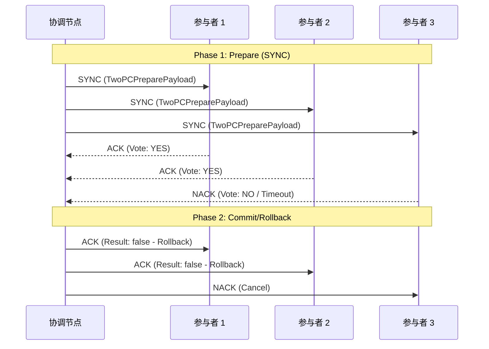

# 【预研报告】NexKV 协议消息定义

> **预研目标**：详细列举 libp2p 协议下的所有消息类型，明确每个协议的职责和消息格式

---

## 📋 协议概览

| 协议 ID | 用途 | 通信模式 | 消息类型 |
|--------|------|---------|---------|
| **/nexkv/1.0.0** | 通用消息传输 | 点对点 | GET, PUT, DELETE, ACK, NACK |
| **/nexkv/rpc/1.0.0** | TreeCoordinator 与节点通信 | 请求-响应 | CLUSTER (Join, Leave, Status) |
| **/nexkv/gossip/1.0.0** | 元数据 Gossip 同步 | 周期性扩散 | GOSSIP (Digest, SyncRequest, SyncResponse) |
| **/nexkv/sync/1.0.0** | 数据同步（2PC） | 两阶段提交 | SYNC (Prepare), ACK (Commit), NACK (Rollback) |
| **/nexkv/quorum/1.0.0** | Quorum 一致性 | 多数派投票 | QUORUM (Propose, Vote, Decide) |

---

## 1️⃣ /nexkv/1.0.0 - 通用消息传输

### 协议说明

基础 KV 操作协议，支持简单的 CRUD 操作。

### 消息类型

#### 1.1 GET - 获取数据

**MessageType**: `MessageTypeGet` (1)

**Payload**:
```go
type GetPayload struct {
    Key         []byte `msgpack:"key"`           // 键
    WithVersion bool   `msgpack:"with_version"`  // 是否返回版本号
}
```

**响应**: `PutPayload`（包含 Value）或 `Nack`

**示例**:
```go
msg := NewMessage(MessageTypeGet)
msg.EncodePayload(&GetPayload{
    Key:         []byte("user:123"),
    WithVersion: true,
})
```

---

#### 1.2 PUT - 写入数据

**MessageType**: `MessageTypePut` (2)

**Payload**:
```go
type PutPayload struct {
    Key     []byte `msgpack:"key"`              // 键
    Value   []byte `msgpack:"value,omitempty"`  // 值
    Version uint64 `msgpack:"version"`          // 版本号
    Sync    bool   `msgpack:"sync"`             // 是否同步写入
}
```

**响应**: `Ack` (成功) 或 `Nack` (失败)

**示例**:
```go
msg := NewMessage(MessageTypePut)
msg.EncodePayload(&PutPayload{
    Key:     []byte("user:123"),
    Value:   []byte(`{"name": "Alice"}`),
    Version: 1,
    Sync:    true,  // 强一致写入
})
```

---

#### 1.3 DELETE - 删除数据

**MessageType**: `MessageTypeDelete` (3)

**Payload**:
```go
type DeletePayload struct {
    Key    []byte `msgpack:"key"`    // 键
    Verify bool   `msgpack:"verify"` // 是否验证删除成功
}
```

**响应**: `Ack` (成功) 或 `Nack` (失败)

**示例**:
```go
msg := NewMessage(MessageTypeDelete)
msg.EncodePayload(&DeletePayload{
    Key:    []byte("user:123"),
    Verify: true,
})
```

---

## 2️⃣ /nexkv/rpc/1.0.0 - TreeCoordinator 与节点通信

### 协议说明

TreeCoordinator 与节点之间的管理协议，支持节点加入、离开、状态查询等操作。

### 消息类型

#### 2.1 CLUSTER - 集群管理

**MessageType**: `MessageTypeCluster` (8)

**Payload**:
```go
type ClusterPayload struct {
    Action   string            `msgpack:"action"`    // "join", "leave", "status"
    NodeID   string            `msgpack:"node_id"`   // 节点 ID
    Metadata map[string]string `msgpack:"metadata"`  // 元数据（地址、端口等）
}
```

**Action 类型**:

| Action | 说明 | 请求方向 | 响应 |
|--------|------|---------|------|
| **join** | 节点加入集群 | Node → Coordinator | Ack (包含分配的节点 ID) |
| **leave** | 节点离开集群 | Node → Coordinator | Ack (确认) |
| **status** | 查询集群状态 | Node → Coordinator | Ack (包含集群拓扑) |

**示例**:
```go
// 节点加入请求
msg := NewMessage(MessageTypeCluster)
msg.EncodePayload(&ClusterPayload{
    Action: "join",
    NodeID: "node-001",
    Metadata: map[string]string{
        "address": "192.168.1.10:8080",
        "role":    "leaf",
        "parent":  "parent-001",
    },
})
```

---

## 3️⃣ /nexkv/gossip/1.0.0 - 元数据 Gossip 同步

### 协议说明

周期性元数据同步协议，实现最终一致性。

### 消息类型

#### 3.1 GOSSIP - Gossip 消息

**MessageType**: `MessageTypeGossip` (7)

**Payload**:
```go
type GossipPayload struct {
    Digest       map[string]uint64 `msgpack:"digest"`         // key -> version (版本摘要)
    VersionDelta uint64            `msgpack:"version_delta"`   // 版本增量
    FullSync     bool              `msgpack:"full_sync"`       // 是否全量同步
}
```

**Gossip 阶段**:

| 阶段 | 说明 | Payload 内容 |
|------|------|-------------|
| **Digest 交换** | 交换版本摘要 | `Digest` 字段包含所有 key 的最新版本 |
| **SyncRequest** | 请求缺失数据 | 请求比对方旧的数据 |
| **SyncResponse** | 响应数据变更 | 返回完整的变更数据 |

**扩展 Payload（Bloom Filter 优化）**:
```go
type GossipPayloadExtended struct {
    // 原有字段
    Digest       map[string]uint64 `msgpack:"digest"`
    VersionDelta uint64            `msgpack:"version_delta"`
    FullSync     bool              `msgpack:"full_sync"`

    // 新增字段（Phase 1: Bloom Filter）
    BloomFilter  []byte  `msgpack:"bloom_filter,omitempty"`  // Bloom Filter 数据
    BFVersion    uint64  `msgpack:"bf_version,omitempty"`    // Bloom Filter 版本
    BFKeyCount   uint32  `msgpack:"bf_key_count,omitempty"`  // Bloom Filter 包含的 key 数量

    // 新增字段（Phase 3: Merkle Tree）
    MerkleRoot   []byte  `msgpack:"merkle_root,omitempty"`   // Merkle Tree 根哈希
    MerkleProof  []byte  `msgpack:"merkle_proof,omitempty"`  // Merkle Proof（差异证明）
}
```

**示例**:
```go
// Gossip Digest 消息
msg := NewMessage(MessageTypeGossip)
msg.EncodePayload(&GossipPayload{
    Digest: map[string]uint64{
        "node:node-001": 10,
        "shard:shard-001": 5,
        "shard:shard-002": 3,
    },
    VersionDelta: 2,
    FullSync:     false,
})
```

---

## 4️⃣ /nexkv/sync/1.0.0 - 数据同步（2PC）

### 协议说明

两阶段提交协议，实现跨节点事务的强一致性。

### 消息类型

#### 4.1 SYNC - 准备阶段（Prepare）

**MessageType**: `MessageTypeSync` (4)

**Payload**:
```go
type TwoPCPreparePayload struct {
    TxID        string      `msgpack:"tx_id"`        // 事务 ID
    Operations  []Operation `msgpack:"operations"`   // 操作列表
    Timeout     int64       `msgpack:"timeout"`      // 超时时间（毫秒）
    Coordinator string      `msgpack:"coordinator"`  // 协调节点 ID
}

type Operation struct {
    Type  string `msgpack:"type"`              // "put", "delete"
    Key   string `msgpack:"key"`               // 操作的键
    Value []byte `msgpack:"value,omitempty"`   // 操作的值
}
```

**示例**:
```go
msg := NewMessage(MessageTypeSync)
msg.EncodePayload(&TwoPCPreparePayload{
    TxID:        "tx-20250210-001",
    Operations: []Operation{
        {Type: "put", Key: "user:123", Value: []byte(`{"name": "Alice"}`)},
        {Type: "put", Key: "user:456", Value: []byte(`{"name": "Bob"}`)},
    },
    Timeout:     5000,  // 5 秒超时
    Coordinator: "parent-001",
})
```

---

#### 4.2 ACK - 提交阶段（Commit）

**MessageType**: `MessageTypeAck` (5)

**Payload**:
```go
type TwoPCCommitPayload struct {
    TxID   string `msgpack:"tx_id"`   // 事务 ID
    Result bool   `msgpack:"result"`  // 提交结果（true=commit, false=abort）
}
```

**示例**:
```go
// Participant 投票 YES
msg := NewMessage(MessageTypeAck)
msg.EncodePayload(&TwoPCCommitPayload{
    TxID:   "tx-20250210-001",
    Result: true,  // 同意提交
})
```

---

#### 4.3 NACK - 回滚阶段（Rollback）

**MessageType**: `MessageTypeNack` (6)

**Payload**:
```go
type TwoPCRollbackPayload struct {
    TxID   string `msgpack:"tx_id"`   // 事务 ID
    Reason string `msgpack:"reason"`  // 回滚原因
}
```

**示例**:
```go
// Participant 投票 NO（或超时）
msg := NewMessage(MessageTypeNack)
msg.EncodePayload(&TwoPCRollbackPayload{
    TxID:   "tx-20250210-001",
    Reason: "timeout: participant not responding",
})
```

---

### 2PC 流程图



---

## 5️⃣ /nexkv/quorum/1.0.0 - Quorum 一致性

### 协议说明

多数派投票协议，实现增强型最终一致性。

### 消息类型

#### 5.1 QUORUM - Quorum 消息

**MessageType**: `MessageTypeQuorum` (9)

**Payload**:
```go
type QuorumPayload struct {
    Phase      string `msgpack:"phase"`               // "propose", "vote", "decide"
    ProposalID string `msgpack:"proposal_id"`         // 提案 ID
    Key        string `msgpack:"key"`                 // 操作的键
    Value      []byte `msgpack:"value,omitempty"`     // 操作的值
    Voter      string `msgpack:"voter,omitempty"`     // 投票节点 ID
    Decision   bool   `msgpack:"decision,omitempty"`  // 决策结果（decide 阶段）
}
```

**Quorum 阶段**:

| 阶段 | 说明 | Payload 内容 |
|------|------|-------------|
| **propose** | 提出变更提案 | Key + Value |
| **vote** | 节点投票 | Voter + Vote |
| **decide** | 宣布决策结果 | Decision + Quorum 数量 |

**示例**:
```go
// Phase 1: Propose
msg := NewMessage(MessageTypeQuorum)
msg.EncodePayload(&QuorumPayload{
    Phase:      "propose",
    ProposalID: "prop-001",
    Key:        "node:node-001",
    Value:      []byte(`{"status": "online"}`),
})

// Phase 2: Vote
msg := NewMessage(MessageTypeQuorum)
msg.EncodePayload(&QuorumPayload{
    Phase:      "vote",
    ProposalID: "prop-001",
    Voter:      "node-002",
    Decision:   true,  // 赞成
})

// Phase 3: Decide
msg := NewMessage(MessageTypeQuorum)
msg.EncodePayload(&QuorumPayload{
    Phase:      "decide",
    ProposalID: "prop-001",
    Decision:   true,  // 通过（多数派赞成）
})
```

---

## 📊 消息类型汇总表

| MessageType | 数值 | Payload 类型 | 协议 | 用途 |
|-------------|------|-------------|------|------|
| `MessageTypeUnknown` | 0 | - | - | 未知消息 |
| `MessageTypeGet` | 1 | `GetPayload` | /nexkv/1.0.0 | 获取数据 |
| `MessageTypePut` | 2 | `PutPayload` | /nexkv/1.0.0 | 写入数据 |
| `MessageTypeDelete` | 3 | `DeletePayload` | /nexkv/1.0.0 | 删除数据 |
| `MessageTypeSync` | 4 | `TwoPCPreparePayload` | /nexkv/sync/1.0.0 | 2PC 准备阶段 |
| `MessageTypeAck` | 5 | `TwoPCCommitPayload` | /nexkv/sync/1.0.0 | 2PC 提交阶段 |
| `MessageTypeNack` | 6 | `TwoPCRollbackPayload` | /nexkv/sync/1.0.0 | 2PC 回滚阶段 |
| `MessageTypeGossip` | 7 | `GossipPayload` | /nexkv/gossip/1.0.0 | Gossip 同步 |
| `MessageTypeCluster` | 8 | `ClusterPayload` | /nexkv/rpc/1.0.0 | 集群管理 |
| `MessageTypeQuorum` | 9 | `QuorumPayload` | /nexkv/quorum/1.0.0 | Quorum 投票 |

---

## 🔗 协议分层图

```mermaid
graph TB
    subgraph 应用层
        KV[GET/PUT/DELETE]
        TC[TreeCoordinator]
    end

    subgraph 协议层
        RPC[/nexkv/rpc/1.0.0]
        GOSSIP[/nexkv/gossip/1.0.0]
        SYNC[/nexkv/sync/1.0.0]
        QUORUM[/nexkv/quorum/1.0.0]
    end

    subgraph 消息层
        M1[CLUSTER]
        M2[GOSSIP]
        M3[SYNC/ACK/NACK]
        M4[QUORUM]
    end

    KV --> RPC
    TC --> GOSSIP
    TC --> SYNC
    TC --> QUORUM

    RPC --> M1
    GOSSIP --> M2
    SYNC --> M3
    QUORUM --> M4

    style RPC fill:#9cf
    style GOSSIP fill:#9f9
    style SYNC fill:#f96
    style QUORUM fill:#fc9
```

---

## 📝 消息编解码

### TLV 格式

所有消息采用 **TLV (Type-Length-Value)** 格式：

```
+--------+--------+------------------------+
| Type   | Length | Value (MessagePack)    |
| (1B)   | (2B)   | (Variable)             |
+--------+--------+------------------------+
```

### 编码流程

```go
// 1. 创建消息
msg := NewMessage(MessageTypePut)
msg.From = "node-001"
msg.To = "node-002"

// 2. 编码 Payload
msg.EncodePayload(&PutPayload{
    Key:     []byte("test"),
    Value:   []byte("value"),
    Version: 1,
    Sync:    true,
})

// 3. TLV 编码
codec := NewMessagePackCodec()
data, err := codec.EncodeToBytes(msg)
```

### 解码流程

```go
// 1. TLV 解码
codec := NewMessagePackCodec()
msg, err := codec.DecodeFromBytes(data)

// 2. 解码 Payload
payload, err := msg.DecodePayload()
if putPayload, ok := payload.(*PutPayload); ok {
    fmt.Printf("Key: %s, Value: %s\n", putPayload.Key, putPayload.Value)
}
```

---

## ⚠️ 注意事项

### 1. 消息序号 (Seq)

- **自动生成**：`MessagePackCodec` 自动生成单调递增的序号
- **用途**：消息去重、乱序重排

### 2. 跳数限制 (HopCount)

- **最大值**：10 (`HopMax`)
- **用途**：防止消息无限转发
- **递增**：每次转发调用 `IncrementHopCount()`

### 3. 类型安全

- **Payload 工厂**：使用 `payloadTypeFactories` 确保 Message 类型和 Payload 类型匹配
- **编译时检查**：Go 类型系统保证编码/解码的类型安全

### 4. 版本兼容性

- **新字段**：使用 `omitempty` 标签确保向后兼容
- **扩展 Payload**：新增 `GossipPayloadExtended`，保留原有字段

---

**文档版本**: v1.0
**创建日期**: 2026-02-10
**维护者**: NexKV 开发团队
**状态**: ✅ 已完成
