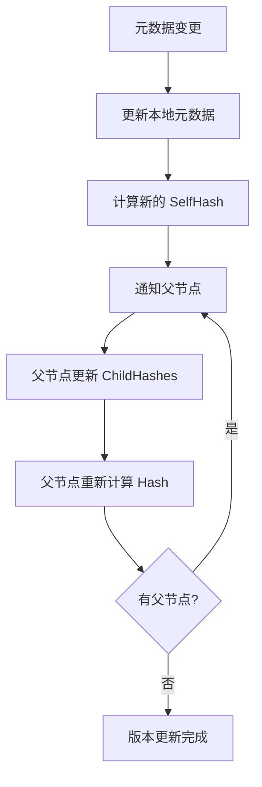
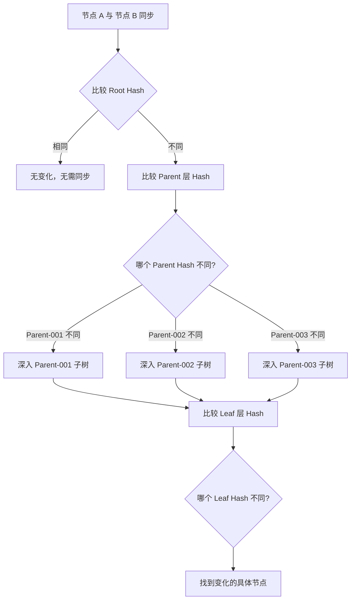
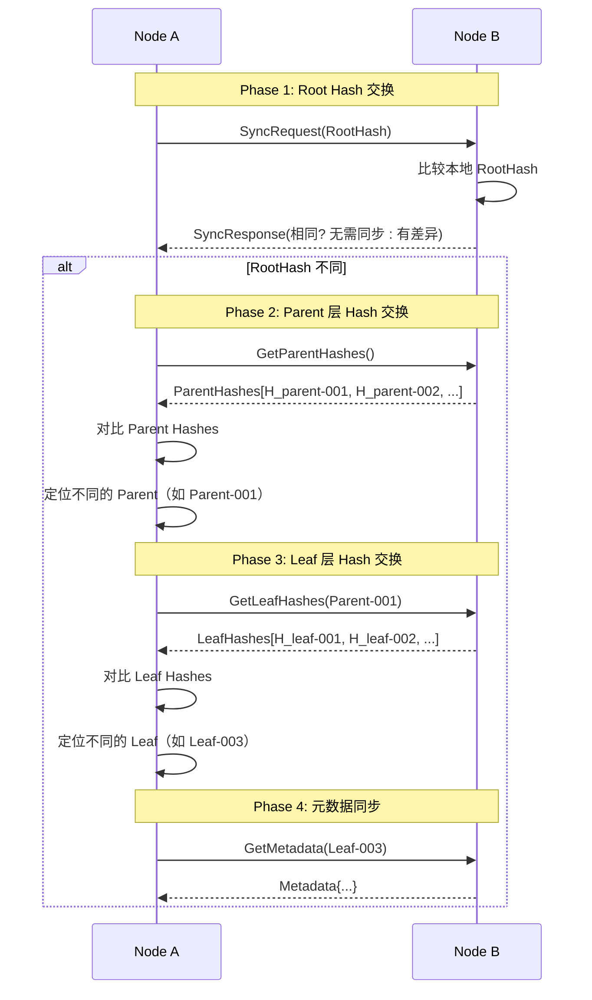

# TreeCoordinator 树形 Merkle Tree 元数据版本控制预研

> **预研类型**: 树形元数据版本控制
> **创建日期**: 2026-02-11
> **状态**: ✅ 已完成
> **分支**: `spike/tree-coordinator-merkle`

---

## 📋 预研目标

利用 TreeCoordinator 的树形结构，应用 Merkle Tree 实现：
1. **层级差异快速检测** - O(log n) 定位变化分支
2. **增量同步优化** - 只传输变化的分支（节省 70%-90% 带宽）
3. **树形元数据版本控制** - 每个节点维护 SelfHash + ChildHashes

---

## 🔑 核心洞察

### 为什么 Bloom Filter 不适合树形拓扑？

**Bloom Filter 适用场景**：
- 平面 key-value 存储
- O(1) 判断 "key 是否存在"
- 用于减少无效远程查询

**树形拓扑的特点**：
- 节点是层级组织的（Root → Parent → Leaf）
- 变更是层级变化的（某个分支的整体变化）
- 关心的是 "哪个分支有变化"，而非 "某个 key 是否存在"

**结论**：Bloom Filter 在层级变化中没有用，因为：
1. Bloom Filter 无法表达树形层级关系
2. 无法快速定位变化发生在哪个分支
3. 树形结构本身就能提供层级信息

---

## 🌳 TreeCoordinator Merkle Tree 方案

### 核心思想

**将 Merkle Tree 直接应用于 TreeCoordinator 的树形结构**：

```
        Root Hash (H_root)
              |
        ┌──────┴──────┐
   H_parent-001  H_parent-002  H_parent-003
        │             │             │
    ┌───┴───┐     ┌───┴───┐     ┌───┴───┐
H_leaf-001 H_leaf-002 H_leaf-003 H_leaf-004 H_leaf-005 H_leaf-006
   │        │        │        │        │        │
Metadata Metadata Metadata Metadata Metadata Metadata
```

**每个节点存储**：
1. **自己的元数据**（NodeMetadata, RoleMetadata 等）
2. **自己的 Hash** = SHA256(元数据序列化)
3. **子节点的 Hash 列表**（如果是父节点）
4. **父节点的 Hash** = SHA256(子节点 Hash 列表)

---

## 🎯 三大核心目标

### 1. 树形元数据版本控制

**版本控制机制**：

```go
type MerkleTreeNode struct {
    // 基础信息
    ID       string
    Type     NodeType // Root, Parent, Leaf
    ParentID string

    // 元数据（MessagePack 序列化）
    Metadata map[string]string

    // Merkle 相关
    SelfHash    string   // 自身 Hash = SHA256(Metadata)
    ChildHashes []string // 子节点 Hash 列表（按子节点 ID 排序）
    Version     uint64   // 版本号（HLC）
    Timestamp   int64    // 更新时间戳
}

type NodeType string

const (
    NodeTypeRoot   NodeType = "root"
    NodeTypeParent NodeType = "parent"
    NodeTypeLeaf   NodeType = "leaf"
)
```

**版本控制流程**：



---

### 2. 层级差异快速检测

**核心优势**：O(log n) 定位变化分支



**复杂度对比**：

| 方案 | 差异检测复杂度 | 说明 |
|------|---------------|------|
| **全量对比** | O(n) | 需要对比所有节点 |
| **Bloom Filter** | O(1) 查询 + O(n) 扫描 | 只能判断存在，无法定位层级 |
| **Merkle Tree** | O(log n) | 树形递归，快速定位分支 |

---

### 3. 增量同步优化

**同步流程**：



**同步收益**：

| 场景 | 传统方案 | Merkle Tree 方案 | 节省 |
|------|---------|-----------------|------|
| **单个 Leaf 变化** | 传输全部元数据 | 只传输变化的 Leaf | ~90% |
| **单个 Parent 下多个 Leaf 变化** | 传输全部元数据 | 只传输变化的 Parent 分支 | ~70% |
| **全树变化** | 传输全部元数据 | 传输全部元数据 | 0% |

---

## 📊 数据结构设计

### MerkleTreeMetadata

```go
type MerkleTreeMetadata struct {
    mu    sync.RWMutex
    nodes map[string]*MerkleTreeNode
    RootID string
}

// 获取节点的 Hash
func (m *MerkleTreeMetadata) GetHash(nodeID string) (string, error)

// 获取子节点的 Hash 列表
func (m *MerkleTreeMetadata) GetChildHashes(parentID string) ([]string, error)

// 更新元数据并重新计算 Hash
func (m *MerkleTreeMetadata) Update(nodeID string, metadata map[string]string) error

// 计算元数据的 Hash
func computeHash(metadata map[string]string) string {
    data, _ := msgpack.Marshal(metadata)
    hash := sha256.Sum256(data)
    return hex.EncodeToString(hash[:])
}
```

---

## 🔄 与 TreeCoordinator 集成

### TreeCoordinator 扩展

```go
type TreeCoordinator struct {
    // 现有字段
    nodes   map[string]*Node
    rootID  string

    // 新增字段
    merkle *MerkleTreeMetadata
}

// 获取节点的 Merkle Hash
func (tc *TreeCoordinator) GetNodeHash(nodeID string) (string, error) {
    return tc.merkle.GetHash(nodeID)
}

// 获取子节点的 Hash 列表
func (tc *TreeCoordinator) GetChildHashes(parentID string) ([]string, error) {
    return tc.merkle.GetChildHashes(parentID)
}
```

---

## 📡 Gossip 协议扩展

### MerkleTreeGossipPayload

```go
type MerkleTreeGossipPayload struct {
    // 基础字段
    FromNodeID string
    ToNodeID   string

    // Merkle Tree 数据
    RootHash       string            // Root Hash
    ParentHashes   map[string]string // ParentID -> Hash
    RequestedNodes []string          // 请求的节点 ID 列表
}
```

---

## 📈 性能分析

### 复杂度对比

| 操作 | 传统方案 | Merkle Tree 方案 |
|------|---------|-----------------|
| **差异检测** | O(n) 全量对比 | O(log n) 树形递归 |
| **变更传播** | 传播全部元数据 | 只传播变化分支 |
| **版本比较** | 比较每个字段 | 只比较 Hash |

### 网络传输对比

| 场景 | 传统方案 | Merkle Tree 方案 | 节省 |
|------|---------|-----------------|------|
| **单个 Leaf 变化** | ~10KB 全部元数据 | ~1KB 单个 Leaf | 90% |
| **单个 Parent 分支变化** | ~10KB 全部元数据 | ~3KB Parent 分支 | 70% |
| **全树变化** | ~10KB 全部元数据 | ~10KB 全部元数据 | 0% |

---

## 📝 预研结论

### 推荐方案

**TreeCoordinator + Merkle Tree 树形元数据版本控制**：

1. ✅ **无需 Bloom Filter**：树形结构本身提供层级信息
2. ✅ **O(log n) 差异检测**：快速定位变化分支
3. ✅ **增量同步**：只传输变化的分支
4. ✅ **天然适配**：与 TreeCoordinator 的树形结构完美匹配

### 实施建议

| 阶段 | 内容 | 优先级 | 周期 |
|------|------|--------|------|
| **Phase 1** | 实现 MerkleTreeNode 基础结构 | P0 | 3 天 |
| **Phase 2** | 集成到 TreeCoordinator | P0 | 2 天 |
| **Phase 3** | 扩展 Gossip 协议 | P1 | 4 天 |
| **Phase 4** | 性能测试与优化 | P1 | 2 天 |
| **总计** | - | - | **11 天** |

---

**文档版本**: v1.0
**创建日期**: 2026-02-11
**维护者**: NexKV 开发团队
**状态**: ✅ 预研完成
