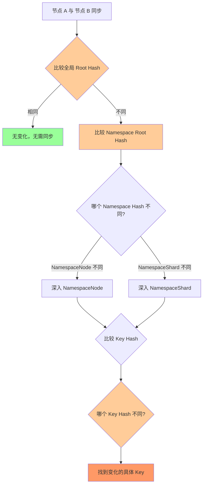
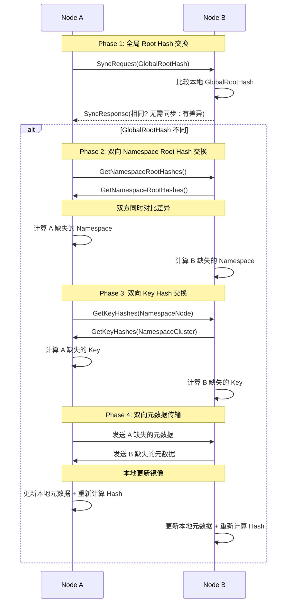
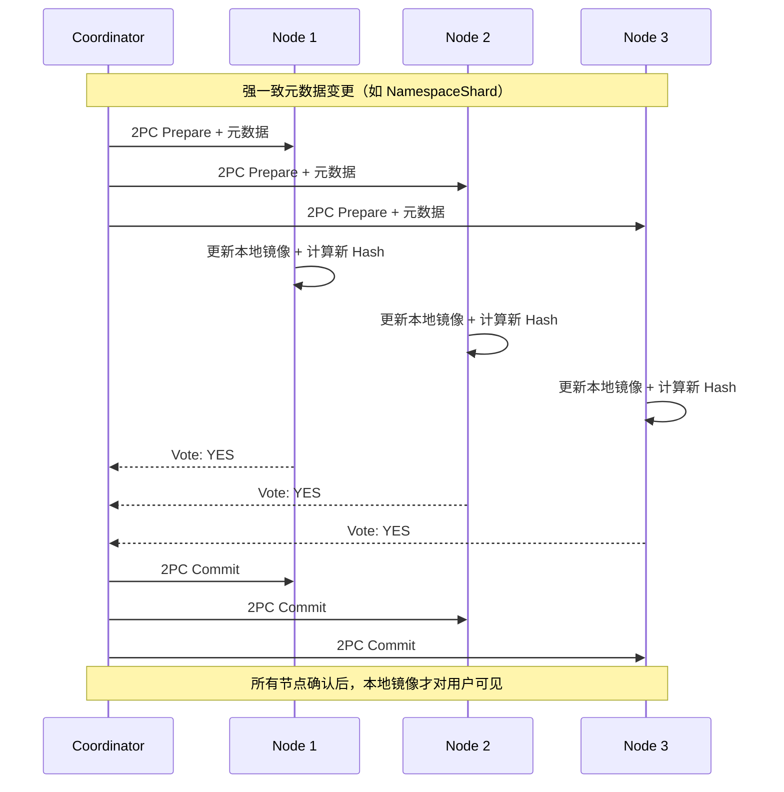
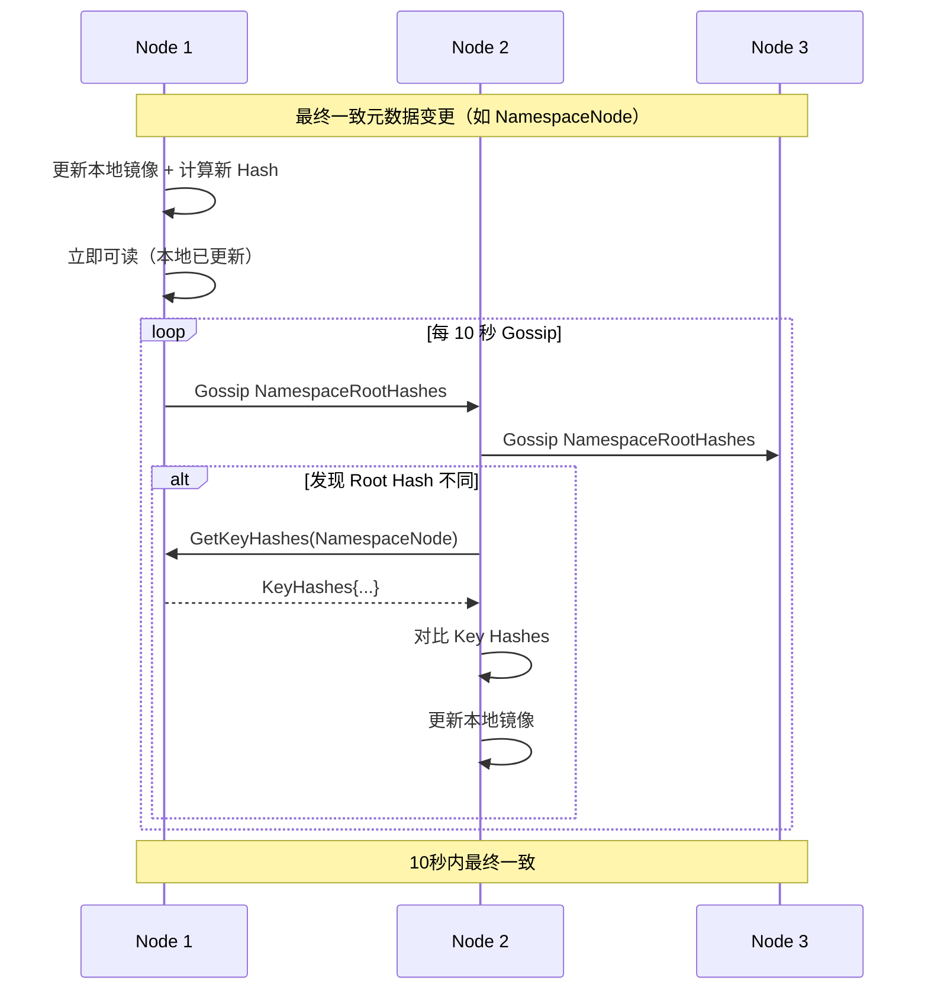

# TreeCoordinator Merkle Tree 元数据版本控制预研（整合版）

> **预研类型**: 树形元数据版本控制
> **创建日期**: 2026-02-11
> **状态**: ✅ 已完成（整合版）
> **整合文档**: tree-coordinator-merkle-tree.md + node-sync-optimization.md

---

## 📋 预研目标

利用 TreeCoordinator 的树形结构，应用 Merkle Tree 实现：
1. **本地读取**：每个节点都有完整元数据镜像，零延迟读取（1-5μs）
2. **层级差异快速检测**：O(log n) 定位变化分支（Root → Namespace → Key）
3. **增量同步优化**：只传输变化的分支（节省 80%-99% 带宽）
4. **一致性级别差异**：强一致（2PC）vs 最终一致（Gossip）

---

## 🔑 核心洞察

### 为什么 Bloom Filter 不适合树形拓扑？

**Bloom Filter 适用场景**：
- 平面 key-value 存储
- O(1) 判断 "key 是否存在"
- 用于减少无效远程查询

**树形拓扑的特点**：
- 节点是层级组织的（Root → Parent → Leaf）
- 变更是层级变化的（某个分支的整体变化）
- 关心的是 "哪个分支有变化"，而非 "某个 key 是否存在"

**结论**：Bloom Filter 在层级变化中没有用，因为：
1. Bloom Filter 无法表达树形层级关系
2. 无法快速定位变化发生在哪个分支
3. 树形结构本身就能提供层级信息

---

## 🌳 树形 Merkle Tree 架构

### 完整元数据镜像 + Namespace 分层

```
┌─────────────────────────────────────────────────────────┐
│ Node A (本地存储)                                        │
├─────────────────────────────────────────────────────────┤
│  完整的元数据镜像（9 个 Namespace）：                      │
│  - NamespaceCluster: cluster:001                        │
│  - NamespaceShard: shard:001, shard:002, ...             │
│  - NamespaceNode: node:node-001, node:node-002, ...      │
│  - ... (其余 6 个 Namespace)                           │
│                                                         │
│  每个 Namespace 一个 Merkle Tree：                        │
│  - H_GlobalRoot = SHA256(H_cluster + H_shard + H_node + ...)  │
│  - H_cluster = SHA256(所有 cluster:* key 的 Hash)          │
│  - H_node = SHA256(所有 node:* key 的 Hash)                │
│                                                         │
│  本地读取优势：                                            │
│  - 读元数据 = 读本地内存（1-5μs）                        │
│  - 无需网络请求                                            │
│  - 10000x 性能提升                                        │
└─────────────────────────────────────────────────────────┘
```

### 一致性级别差异

| Namespace | 说明 | 一致性级别 | Hash 计算时机 | 同步机制 |
|-----------|------|-----------|-------------|---------|
| `NamespaceCluster` | 集群元数据 | **强一致** | 变更时立即 + 2PC 确认 | 同步返回 |
| `NamespaceShard` | 分片元数据 | **强一致** | 变更时立即 + 2PC 确认 | 同步返回 |
| `NamespaceNode` | 节点元数据 | **最终一致** | 变更时计算 + Gossip | 10秒内异步 |
| `NamespaceRole` | 角色元数据 | **最终一致** | 变更时计算 + Gossip | 10秒内异步 |
| `NamespaceStatic` | 静态元数据 | **强一致** | 变更时立即 + 2PC 确认 | 同步返回 |
| `NamespaceTopo` | 拓扑元数据 | **最终一致** | 变更时计算 + Gossip | 10秒内异步 |
| `NamespaceDynamic` | 动态元数据 | **最终一致** | 周期性更新 + Gossip | 10秒内异步 |
| `NamespaceOp` | 运维元数据 | **最终一致** | 变更时计算 + Gossip | 10秒内异步 |
| `NamespaceVersion` | 版本号 | **强一致** | 变更时立即 + 2PC 确认 | 同步返回 |

---

## 🎯 层级差异快速检测

### 三层递归检测



**复杂度**：
- O(1) 比较 Global Root Hash
- O(m) 比较 Namespace Root Hash（m = 9）
- O(log n) 定位具体变化的 Key

---

## 🔄 双向同步 + 增量传输

### 同步流程（整合双向机制）



**同步收益**：

| 场景 | 传统方案 | Merkle Tree 方案 | 节省 |
|------|---------|-----------------|------|
| **单个 Key 变化** | 传输全部元数据 | 只传输变化的 Key | ~99% |
| **单个 Namespace 多个 Key 变化** | 传输全部元数据 | 只传输变化的 Namespace | ~80% |
| **全集群变化** | 传输全部元数据 | 传输全部元数据 | 0% |

---

## 📊 数据结构设计

### NamespacedMerkleTree

```go
type NamespacedMerkleTree struct {
    mu         sync.RWMMutex
    namespaces map[Namespace]*NamespaceMerkleTree
}

type NamespaceMerkleTree struct {
    Namespace Namespace
    KeyHashes map[string]string // key -> Hash
    RootHash  string            // SHA256(所有 Key Hash 的组合)
}

// GetGlobalRootHash 获取全局 Root Hash
func (n *NamespacedMerkleTree) GetGlobalRootHash() string {
    n.mu.RLock()
    defer n.mu.RUnlock()

    var namespaceHashes []string
    for _, tree := range n.namespaces {
        namespaceHashes = append(namespaceHashes, tree.RootHash)
    }

    sort.Strings(namespaceHashes)
    hash := sha256.Sum256([]byte(strings.Join(namespaceHashes, "")))
    return hex.EncodeToString(hash[:])
}

// GetKeyHash 获取单个 Key 的 Hash
func (n *NamespacedMerkleTree) GetKeyHash(ns Namespace, key string) (string, error) {
    n.mu.RLock()
    defer n.mu.RUnlock()

    tree, ok := n.namespaces[ns]
    if !ok {
        return "", ErrNamespaceNotFound
    }

    hash, ok := tree.KeyHashes[key]
    if !ok {
        return "", ErrKeyNotFound
    }

    return hash, nil
}

// UpdateKey 更新 Key 并重新计算 Hash
func (n *NamespacedMerkleTree) UpdateKey(ns Namespace, key string, metadata map[string]string) error {
    n.mu.Lock()
    defer n.mu.Unlock()

    tree, ok := n.namespaces[ns]
    if !ok {
        return ErrNamespaceNotFound
    }

    // 更新 Key 的 Hash
    tree.KeyHashes[key] = computeHash(metadata)

    // 重新计算 Namespace Root Hash
    n.recomputeNamespaceRootHash(ns)

    return nil
}

// 重新计算 Namespace Root Hash
func (n *NamespacedMerkleTree) recomputeNamespaceRootHash(ns Namespace) {
    tree := n.namespaces[ns]

    var keyHashes []string
    for _, hash := range tree.KeyHashes {
        keyHashes = append(keyHashes, hash)
    }

    sort.Strings(keyHashes)
    hash := sha256.Sum256([]byte(strings.Join(keyHashes, "")))
    tree.RootHash = hex.EncodeToString(hash[:])
}
```

---

## 🎯 强一致 vs 最终一致

### 强一致 Namespace（2PC）



### 最终一致 Namespace（Gossip）



---

## 📈 性能分析

### 复杂度对比

| 操作 | 传统方案 | Merkle Tree 方案 |
|------|---------|-----------------|
| **差异检测** | O(n) 线性扫描 | O(1) Global + O(m) Namespace + O(log n) Key |
| **变更传播** | 传播全部元数据 | 只传播变化分支 |
| **版本比较** | 比较每个字段 | 只比较 Hash |
| **读取元数据** | 远程查询（10-50ms） | 本地读取（1-5μs） |

### 网络传输对比

| 场景 | 传统方案 | Merkle Tree 方案 | 节省 |
|------|---------|-----------------|------|
| **单个 Key 变化** | ~10KB 全部元数据 | ~100B 单个 Key | ~99% |
| **单个 Namespace 多个 Key 变化** | ~10KB 全部元数据 | ~2KB Namespace | ~80% |
| **全集群变化** | ~10KB 全部元数据 | ~10KB 全部元数据 | 0% |
| **读取元数据** | 每次远程查询 | 本地读取，零网络开销 | 100% |

---

## 🔗 与现有代码集成

### 扩展 MetadataKV

```go
type MetadataKV struct {
    // 现有字段
    store      *mvstore.MVStore
    namespaces map[Namespace]*namespaceData

    // 新增字段
    merkle *NamespacedMerkleTree
}

// Get - 本地读取，零延迟
func (mkv *MetadataKV) Get(ns Namespace, key string) ([]byte, uint64, error) {
    // 总是读本地，无需网络请求！
    mkv.mu.RLock()
    defer mkv.mu.RUnlock()

    nsData, ok := mkv.namespaces[ns]
    if !ok {
        return nil, 0, ErrNamespaceNotFound
    }

    entry, ok := nsData.data[key]
    if !ok {
        return nil, 0, ErrKeyNotFound
    }

    return entry.Value, entry.Version, nil
}

// Put - 根据一致性级别选择同步机制
func (mkv *MetadataKV) Put(ns Namespace, key string, value []byte) error {
    // 根据一致性级别处理
    if isStrongConsistency(ns) {
        return mkv.putWith2PC(ns, key, value)
    } else {
        return mkv.putWithGossip(ns, key, value)
    }
}
```

### 扩展 GossipPayload

```go
type GossipPayload struct {
    // 原有字段
    Digest       map[string]uint64 `msgpack:"digest"`
    VersionDelta uint64            `msgpack:"version_delta"`
    FullSync     bool              `msgpack:"full_sync"`

    // 双向同步字段（来自 node-sync-optimization.md）
    BloomFilter  []byte  `msgpack:"bloom_filter,omitempty"`  // 保留兼容性（可选）
    BFVersion    uint64  `msgpack:"bf_version,omitempty"`
    BFKeyCount   uint32  `msgpack:"bf_key_count,omitempty"`

    // Namespace Merkle Tree 字段
    GlobalRootHash string            `msgpack:"global_root_hash"` // 全局 Root Hash
    NamespaceHashes map[string]string `msgpack:"namespace_hashes"` // Namespace -> Root Hash
    RequestedData  []SyncRequest      `msgpack:"requested_data,omitempty"` // 双向请求数据
}

type SyncRequest struct {
    Namespace Namespace `msgpack:"namespace"`
    Key       string   `msgpack:"key"`
}
```

---

## 📝 预研结论

### 推荐方案

**TreeCoordinator + Merkle Tree 树形元数据版本控制**：

1. ✅ **完整元数据镜像**：每个节点都有所有元数据副本，本地读取零延迟
2. ✅ **Namespace 分层**：9 个 Namespace，每个一个 Merkle Tree
3. ✅ **一致性级别差异**：强一致（2PC）vs 最终一致（Gossip）
4. ✅ **三层递归检测**：Global → Namespace → Key，O(log n) 定位变化
5. ✅ **双向同步**：双方同时交换差异，各自发送缺失数据
6. ✅ **增量传输**：只传输变化的数据，节省 80%-99% 带宽

### 与 node-sync-optimization.md 的整合

**吸收**：
- 双向同步机制（Phase 2）
- GossipPayload 扩展字段

**替代**：
- Bloom Filter：明确说明不适合树形拓扑
- 平面 Merkle Tree：改为 Namespace 分层 Merkle Tree

**新增**：
- 完整元数据镜像（本地读取）
- 一致性级别差异（强一致 vs 最终一致）
- Namespace 分层结构

### 实施建议

| 阶段 | 内容 | 优先级 | 周期 |
|------|------|--------|------|
| **Phase 1** | 实现 NamespacedMerkleTree 基础结构 | P0 | 3 天 |
| **Phase 2** | 集成到 MetadataKV（本地读取） | P0 | 2 天 |
| **Phase 3** | 扩展 Gossip 协议（双向同步 + Namespace 分层） | P1 | 4 天 |
| **Phase 4** | 强一致 Namespace 的 2PC 实现 | P1 | 3 天 |
| **Phase 5** | 性能测试与优化 | P1 | 2 天 |
| **总计** | - | - | **14 天** |

---

**文档版本**: v2.0（整合版）
**创建日期**: 2026-02-11
**维护者**: NexKV 开发团队
**状态**: ✅ 预研完成
