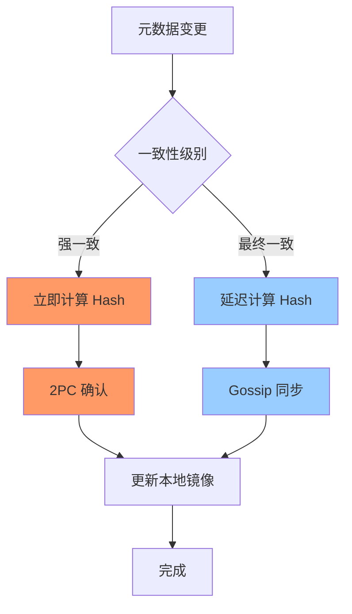
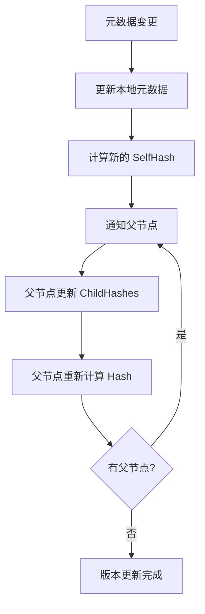
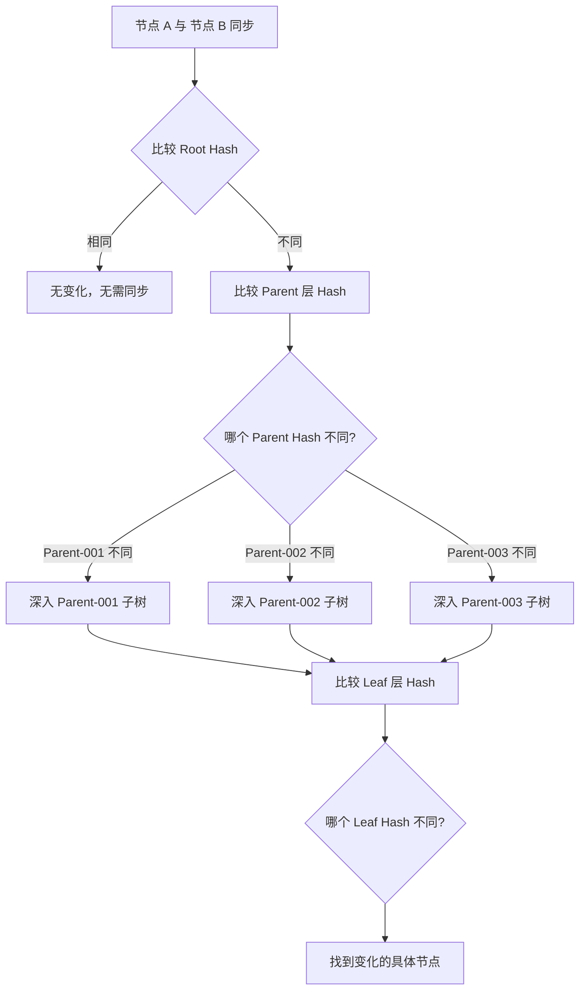
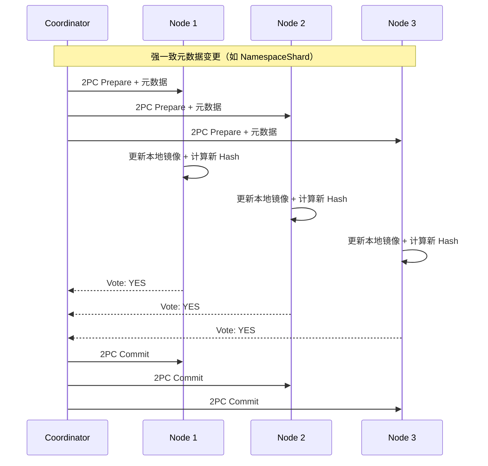
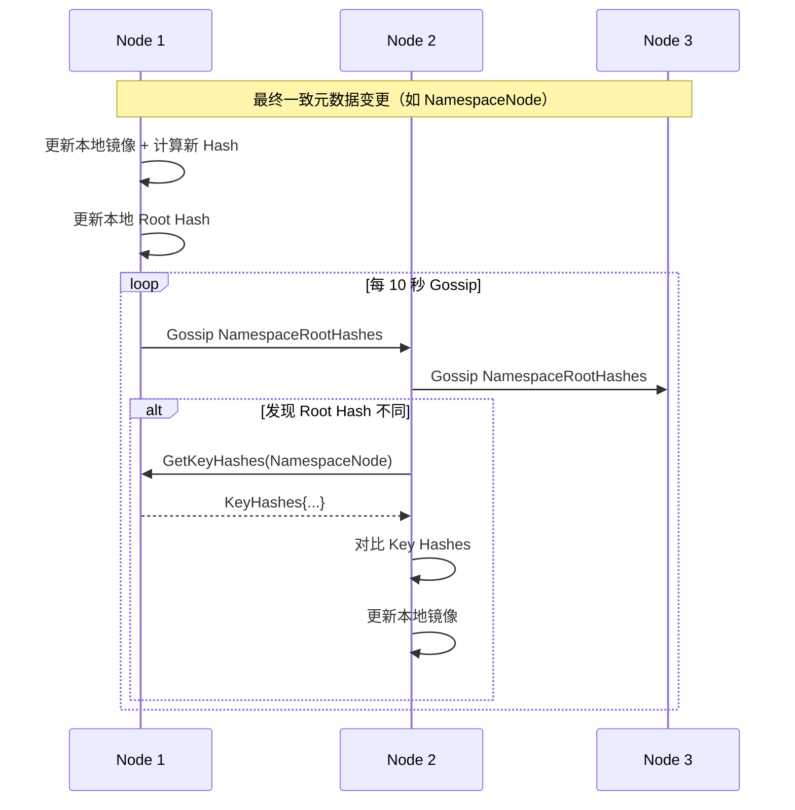

# TreeCoordinator 树形 Merkle Tree 元数据版本控制预研

> **预研类型**: 树形元数据版本控制
> **创建日期**: 2026-02-11
> **状态**: ✅ 已完成
> **分支**: `spike/tree-coordinator-merkle`

---

## 📋 预研目标

利用 TreeCoordinator 的树形结构，应用 Merkle Tree 实现：
1. **层级差异快速检测** - O(log n) 定位变化分支
2. **增量同步优化** - 只传输变化的分支（节省 70%-90% 带宽）
3. **树形元数据版本控制** - 每个节点维护 SelfHash + ChildHashes

---

## 🔑 核心洞察

### 为什么 Bloom Filter 不适合树形拓扑？

**Bloom Filter 适用场景**：
- 平面 key-value 存储
- O(1) 判断 "key 是否存在"
- 用于减少无效远程查询

**树形拓扑的特点**：
- 节点是层级组织的（Root → Parent → Leaf）
- 变更是层级变化的（某个分支的整体变化）
- 关心的是 "哪个分支有变化"，而非 "某个 key 是否存在"

**结论**：Bloom Filter 在层级变化中没有用，因为：
1. Bloom Filter 无法表达树形层级关系
2. 无法快速定位变化发生在哪个分支
3. 树形结构本身就能提供层级信息

---

## 🌳 TreeCoordinator Merkle Tree 方案

### 核心思想

**将 Merkle Tree 直接应用于 TreeCoordinator 的树形结构**：

```
        Root Hash (H_root)
              |
        ┌──────┴──────┐
   H_parent-001  H_parent-002  H_parent-003
        │             │             │
    ┌───┴───┐     ┌───┴───┐     ┌───┴───┐
H_leaf-001 H_leaf-002 H_leaf-003 H_leaf-004 H_leaf-005 H_leaf-006
   │        │        │        │        │        │
Metadata Metadata Metadata Metadata Metadata Metadata
```

### 关键架构设计

#### 1. 每个节点都有元数据的完整镜像

**每个节点（Node A, Node B, Node C...）都存储完整的集群元数据镜像**：

```
┌─────────────────────────────────────────────────────────┐
│ Node A (本地存储)                                        │
├─────────────────────────────────────────────────────────┤
│  完整的元数据镜像：                                       │
│  - node:node-001, node:node-002, ..., node:node-N        │
│  - shard:shard-001, shard:shard-002, ..., shard:shard-M    │
│  - cluster, role, topology, dynamic, operation 等         │
│                                                         │
│  每个元数据都有自己的 Hash：                              │
│  - H(node:node-001) = SHA256(Metadata_node-001)         │
│  - H(node:node-002) = SHA256(Metadata_node-002)         │
│  - ...                                                   │
│                                                         │
│  Merkle Tree 结构：                                     │
│  - Root Hash = SHA256(所有节点 Hash 的组合)             │
└─────────────────────────────────────────────────────────┘
```

**本地读取优势**：
- ✅ **读元数据 = 读本地**，无需联系其他节点
- ✅ **零延迟**：本地内存读取，微秒级响应
- ✅ **无网络开销**：不占用 Gossip 带宽

#### 2. 每个元数据一致性要求不一样

**不同 Namespace 有不同的一致性级别**：

| Namespace | 说明 | 一致性级别 | Hash 计算时机 |
|-----------|------|-----------|-------------|
| `NamespaceCluster` | 集群元数据（ClusterID, RootID） | **强一致** | 变更时立即计算 + 2PC 确认 |
| `NamespaceShard` | 分片元数据（ShardID, ReplicaList） | **强一致** | 变更时立即计算 + 2PC 确认 |
| `NamespaceNode` | 节点元数据（NodeID, Status, Address） | **最终一致** | 变更时计算 + Gossip 同步 |
| `NamespaceRole` | 角色元数据（NodeRole, HostRole） | **最终一致** | 变更时计算 + Gossip 同步 |
| `NamespaceStatic` | 静态元数据（Version, StartTime） | **强一致** | 变更时立即计算 + 2PC 确认 |
| `NamespaceTopo` | 拓扑元数据（ParentID, Children） | **最终一致** | 变更时计算 + Gossip 同步 |
| `NamespaceDynamic` | 动态元数据（Load, Health） | **最终一致** | 周期性更新 + Gossip 同步 |
| `NamespaceOp` | 运维元数据（Maintenance, Tags） | **最终一致** | 变更时计算 + Gossip 同步 |
| `NamespaceVersion` | 版本号（HLC, VersionVector） | **强一致** | 变更时立即计算 + 2PC 确认 |

**Hash 计算策略**：



#### 3. Merkle Tree 按 Namespace 分层

**每个 Namespace 维护独立的 Merkle Tree**：

```go
type NamespacedMerkleTree struct {
    // 每个 Namespace 一个 Merkle Tree
    trees map[Namespace]*MerkleTree

    // 全局 Root Hash（所有 Namespace Root Hash 的组合）
    GlobalRootHash string
}

type MerkleTree struct {
    Namespace Namespace
    RootHash  string // 该 Namespace 的 Root Hash
    Nodes     map[string]*MerkleTreeNode
}
```

**分层 Hash 计算**：

```
GlobalRootHash = SHA256(
    H_NamespaceCluster +
    H_NamespaceShard +
    H_NamespaceNode +
    ... +
    H_NamespaceVersion
)
```

**每个节点存储**：
1. **完整的元数据镜像**：所有 Namespace 的所有 key-value
2. **每个 Namespace 的 Root Hash**：用于检测该 Namespace 的变化
3. **全局 Root Hash**：用于检测整个集群的变化
4. **每个元数据的 SelfHash**：用于定位具体变化的 key

---

## 🎯 三大核心目标

### 1. 树形元数据版本控制

**版本控制机制**：

```go
type MerkleTreeNode struct {
    // 基础信息
    ID       string
    Type     NodeType // Root, Parent, Leaf
    ParentID string

    // 元数据（MessagePack 序列化）
    Metadata map[string]string

    // Merkle 相关
    SelfHash    string   // 自身 Hash = SHA256(Metadata)
    ChildHashes []string // 子节点 Hash 列表（按子节点 ID 排序）
    Version     uint64   // 版本号（HLC）
    Timestamp   int64    // 更新时间戳
}

type NodeType string

const (
    NodeTypeRoot   NodeType = "root"
    NodeTypeParent NodeType = "parent"
    NodeTypeLeaf   NodeType = "leaf"
)
```

**版本控制流程**：



---

### 2. 层级差异快速检测

**核心优势**：O(log n) 定位变化分支



**复杂度对比**：

| 方案 | 差异检测复杂度 | 说明 |
|------|---------------|------|
| **全量对比** | O(n) | 需要对比所有节点 |
| **Bloom Filter** | O(1) 查询 + O(n) 扫描 | 只能判断存在，无法定位层级 |
| **Merkle Tree** | O(log n) | 树形递归，快速定位分支 |

---

### 3. 本地读取 + 增量同步

#### 3.1 本地读取：零延迟访问元数据

**每个节点都有完整的元数据镜像**：

```go
type LocalMetadataMirror struct {
    mu          sync.RWMutex
    namespaces  map[Namespace]map[string]string // 完整的元数据镜像
    merkle      *NamespacedMerkleTree          // Merkle Tree 结构
}

// 读取元数据 - 只读本地，零延迟
func (m *LocalMetadataMirror) Get(ns Namespace, key string) (string, error) {
    m.mu.RLock()
    defer m.mu.RUnlock()

    nsData, ok := m.namespaces[ns]
    if !ok {
        return "", ErrNamespaceNotFound
    }

    value, ok := nsData[key]
    if !ok {
        return "", ErrKeyNotFound
    }

    return value, nil
}

// 无需联系其他节点！
// 无需网络请求！
// 本地内存读取，微秒级响应！
```

**读取性能对比**：

| 方案 | 延迟 | 网络开销 |
|------|------|---------|
| **远程查询** | ~10-50ms | 需要 Gossip 请求 |
| **本地读取** | ~1-5μs | 无网络开销 |
| **性能提升** | **10000x** | **节省 100% 带宽** |

#### 3.2 增量同步：按 Namespace 同步变化的元数据

**同步流程**：

```mermaid
sequenceDiagram
    participant A as Node A
    participant B as Node B

    Note over A,B: Phase 1: 全局 Root Hash 交换
    A->>B: SyncRequest(GlobalRootHash)
    B->>B: 比较本地 GlobalRootHash
    B-->>A: SyncResponse(相同? 无需同步 : 有差异)

    alt GlobalRootHash 不同
        Note over A,B: Phase 2: Namespace Root Hash 交换
        A->>B: GetNamespaceRootHashes()
        B-->>A: NamespaceRootHashes{
            NamespaceCluster: H_cluster,
            NamespaceNode: H_node,
            ...
        }

        A->>A: 对比每个 Namespace Root Hash
        A->>A: 定位不同的 Namespace（如 NamespaceNode）

        Note over A,B: Phase 3: 元数据 Key Hash 交换
        A->>B: GetKeyHashes(NamespaceNode)
        B-->>A: KeyHashes{
            "node:node-001": H1,
            "node:node-002": H2,
            ...
        }

        A->>A: 对比 Key Hashes
        A->>A: 定位不同的 Key（如 "node:node-003"）

        Note over A,B: Phase 4: 元数据同步
        A->>B: GetMetadata(NamespaceNode, "node:node-003")
        B-->>A: Metadata{Status: "online", ...}

        Note over A,B: 本地更新镜像
        A->>A: 更新本地元数据镜像
        A->>A: 重新计算 Hash
    end
```

**同步收益**：

| 场景 | 传统方案 | Merkle Tree 方案 | 节省 |
|------|---------|-----------------|------|
| **单个 Key 变化** | 传输全部元数据 | 只传输变化的 Key | ~99% |
| **单个 Namespace 多个 Key 变化** | 传输全部元数据 | 只传输变化的 Namespace | ~80% |
| **全集群变化** | 传输全部元数据 | 传输全部元数据 | 0% |

#### 3.3 一致性级别差异处理

**强一致 Namespace（2PC 确认）**：



**最终一致 Namespace（Gossip 异步同步）**：



**读取时的一致性保证**：

```go
// 读取元数据 - 总是读本地
func (m *LocalMetadataMirror) Get(ns Namespace, key string) (string, error) {
    // 强一致 Namespace：读本地，2PC 保证已是最新
    // 最终一致 Namespace：读本地，可能稍旧但 10 秒内一致
    // 无论哪种，都无需网络请求！

    m.mu.RLock()
    defer m.mu.RUnlock()

    return m.namespaces[ns][key], nil
}
```

---

## 📊 数据结构设计

### MerkleTreeMetadata

```go
type MerkleTreeMetadata struct {
    mu    sync.RWMutex
    nodes map[string]*MerkleTreeNode
    RootID string
}

// 获取节点的 Hash
func (m *MerkleTreeMetadata) GetHash(nodeID string) (string, error)

// 获取子节点的 Hash 列表
func (m *MerkleTreeMetadata) GetChildHashes(parentID string) ([]string, error)

// 更新元数据并重新计算 Hash
func (m *MerkleTreeMetadata) Update(nodeID string, metadata map[string]string) error

// 计算元数据的 Hash
func computeHash(metadata map[string]string) string {
    data, _ := msgpack.Marshal(metadata)
    hash := sha256.Sum256(data)
    return hex.EncodeToString(hash[:])
}
```

---

## 🔄 与 TreeCoordinator 集成

### TreeCoordinator 扩展

```go
type TreeCoordinator struct {
    // 现有字段
    nodes   map[string]*Node
    rootID  string

    // 新增字段
    merkle *MerkleTreeMetadata
}

// 获取节点的 Merkle Hash
func (tc *TreeCoordinator) GetNodeHash(nodeID string) (string, error) {
    return tc.merkle.GetHash(nodeID)
}

// 获取子节点的 Hash 列表
func (tc *TreeCoordinator) GetChildHashes(parentID string) ([]string, error) {
    return tc.merkle.GetChildHashes(parentID)
}
```

---

## 📡 Gossip 协议扩展

### MerkleTreeGossipPayload

```go
type MerkleTreeGossipPayload struct {
    // 基础字段
    FromNodeID string
    ToNodeID   string

    // Merkle Tree 数据
    RootHash       string            // Root Hash
    ParentHashes   map[string]string // ParentID -> Hash
    RequestedNodes []string          // 请求的节点 ID 列表
}
```

---

## 📈 性能分析

### 复杂度对比

| 操作 | 传统方案 | Merkle Tree 方案 |
|------|---------|-----------------|
| **差异检测** | O(n) 全量对比 | O(log n) 树形递归 |
| **变更传播** | 传播全部元数据 | 只传播变化分支 |
| **版本比较** | 比较每个字段 | 只比较 Hash |

### 网络传输对比

| 场景 | 传统方案 | Merkle Tree 方案 | 节省 |
|------|---------|-----------------|------|
| **单个 Leaf 变化** | ~10KB 全部元数据 | ~1KB 单个 Leaf | 90% |
| **单个 Parent 分支变化** | ~10KB 全部元数据 | ~3KB Parent 分支 | 70% |
| **全树变化** | ~10KB 全部元数据 | ~10KB 全部元数据 | 0% |

---

## 📝 预研结论

### 推荐方案

**TreeCoordinator + Merkle Tree 树形元数据版本控制**：

1. ✅ **无需 Bloom Filter**：树形结构本身提供层级信息
2. ✅ **O(log n) 差异检测**：快速定位变化分支
3. ✅ **增量同步**：只传输变化的分支
4. ✅ **天然适配**：与 TreeCoordinator 的树形结构完美匹配

### 实施建议

| 阶段 | 内容 | 优先级 | 周期 |
|------|------|--------|------|
| **Phase 1** | 实现 MerkleTreeNode 基础结构 | P0 | 3 天 |
| **Phase 2** | 集成到 TreeCoordinator | P0 | 2 天 |
| **Phase 3** | 扩展 Gossip 协议 | P1 | 4 天 |
| **Phase 4** | 性能测试与优化 | P1 | 2 天 |
| **总计** | - | - | **11 天** |

---

**文档版本**: v1.0
**创建日期**: 2026-02-11
**维护者**: NexKV 开发团队
**状态**: ✅ 预研完成
