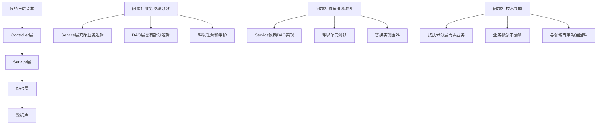
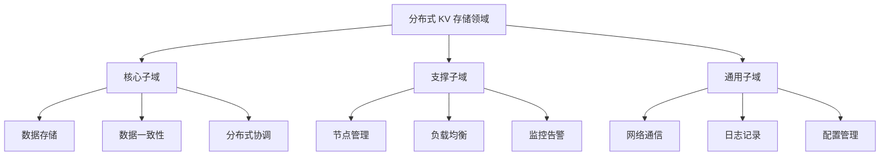
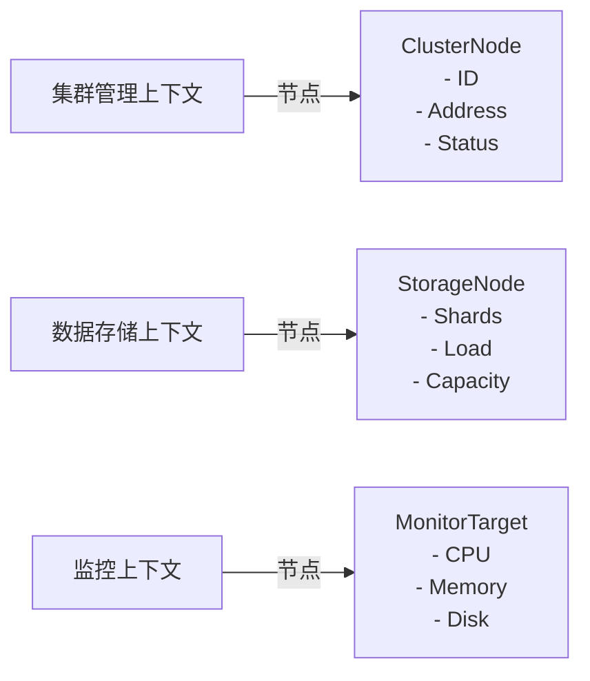
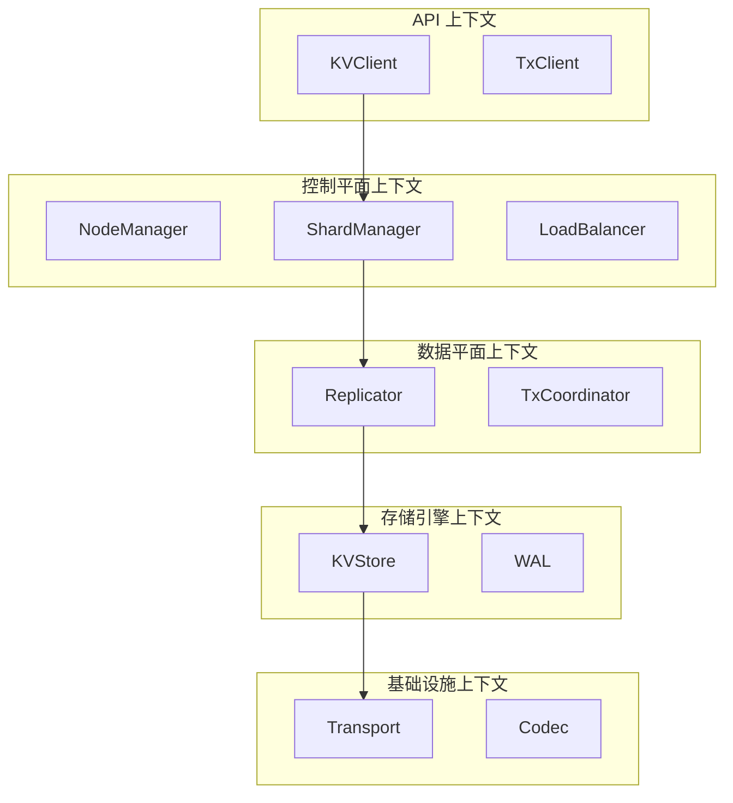
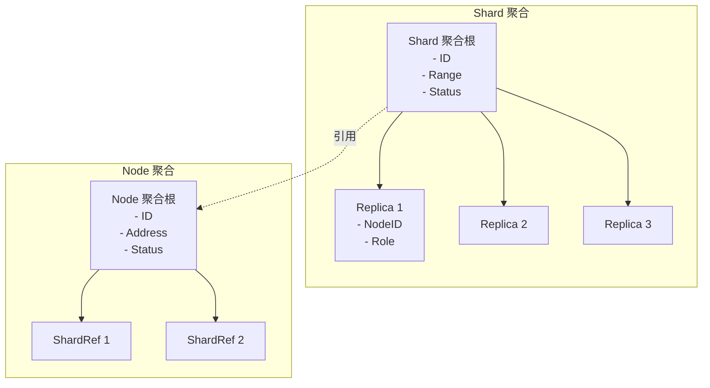
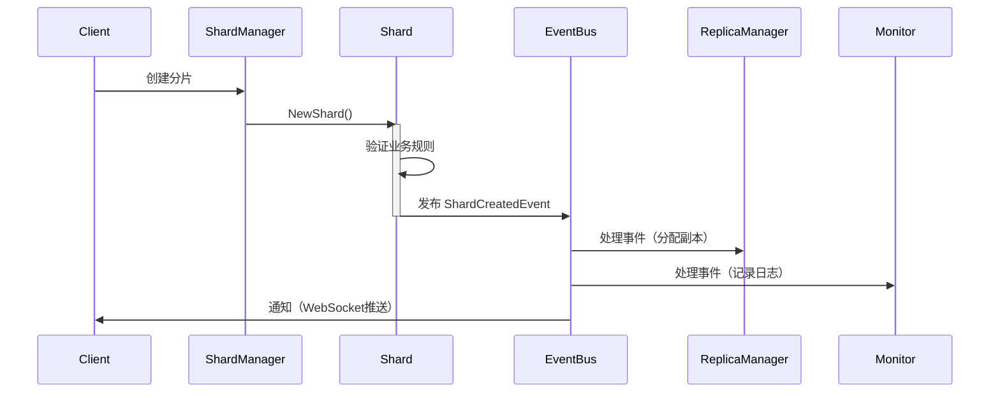
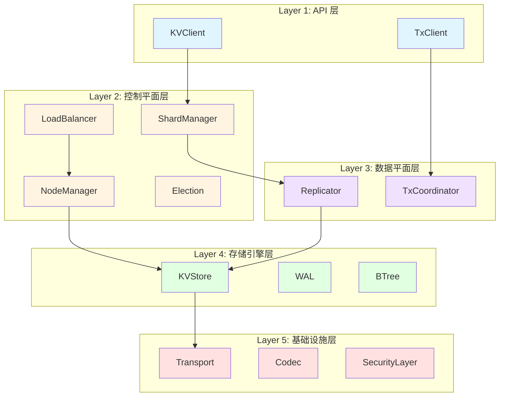
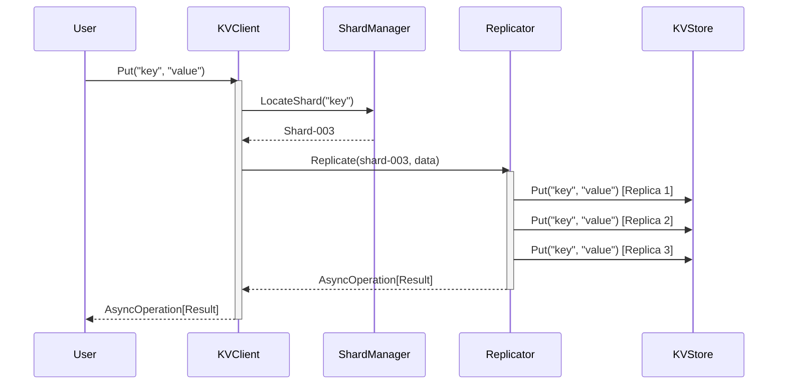
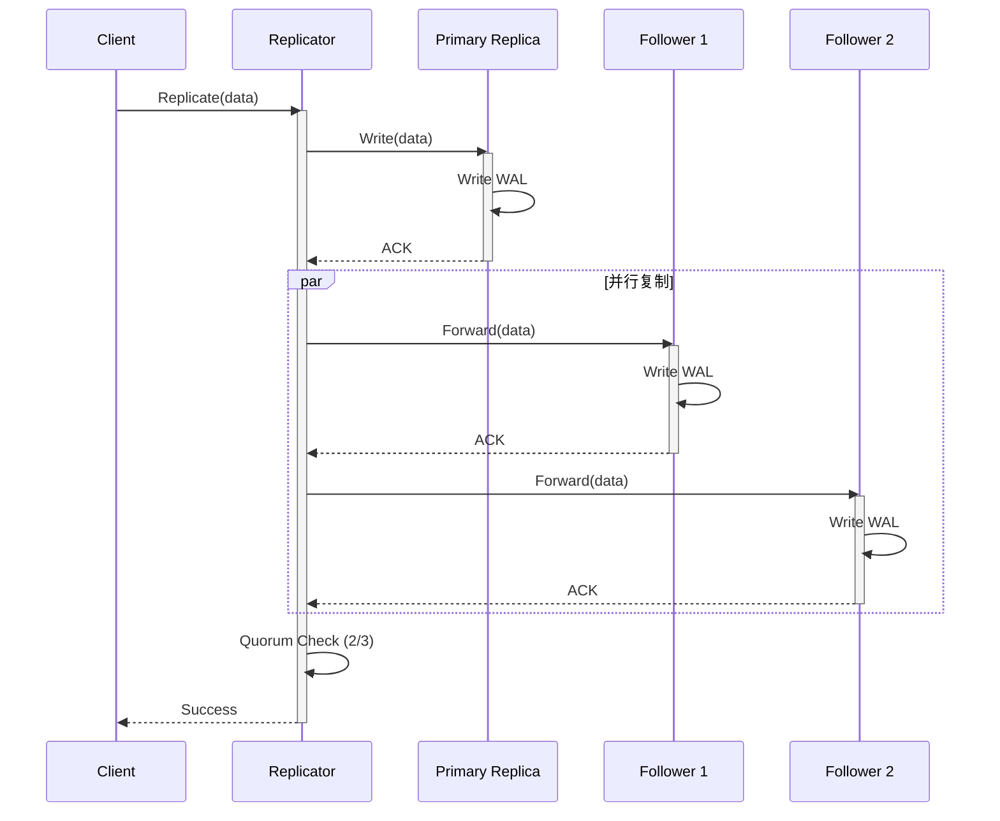

# Day 1 上午：DDD 架构原则深度培训

> **培训时间**: 3小时（09:00-12:00）
> **培训内容**: DDD 领域驱动设计理论 + NexKV 5层架构实践
> **培训目标**: 深入理解 DDD 核心概念，掌握 NexKV 架构设计

---

## 前言：为什么选择 DDD 架构？

在现代分布式系统开发中，**架构设计**决定了系统的可维护性、可扩展性和可测试性。传统的三层架构（Controller-Service-DAO）在微服务和分布式场景下暴露出越来越多的问题：

### 传统架构的痛点



**具体案例**：假设我们需要实现一个"分片迁移"功能，在传统架构中：

1. **Controller** 接收 HTTP 请求
2. **Service** 调用多个 DAO（节点DAO、分片DAO、副本DAO）
3. **Service** 实现复杂的业务逻辑（检查、迁移、更新）
4. **DAO** 执行 SQL 操作

**问题**：
- ❌ 业务逻辑分散在 Service 和 DAO 之间
- ❌ 难以测试（依赖具体数据库实现）
- ❌ 业务概念不清晰（没有"分片"、"副本"等概念）

### DDD 架构的优势

**领域驱动设计（Domain-Driven Design）** 由 Eric Evans 在 2003 年提出，强调：

1. **以业务领域为中心**：代码结构直接反映业务领域
2. **统一语言（Ubiquitous Language）**：开发人员与业务人员使用相同术语
3. **分层架构**：清晰的层次划分，依赖倒置

**NexKV 采用 DDD 架构后**：

```go
// ✅ 业务逻辑集中在领域模型中
shard := domain.NewShard("shard-001", keyRange)
err := shard.MigrateTo(targetNode)  // 业务逻辑在聚合根内部

// ✅ 依赖倒置，易于测试
type ShardManagerImpl struct {
    nodeRepo    repository.NodeRepository    // 接口，不依赖具体实现
    shardRepo   repository.ShardRepository
    eventBus    service.EventBus
}
```

---

## 一、DDD 领域驱动设计核心理论（45分钟）

### 1.1 领域（Domain）与子域（Subdomain）

**定义**：
- **领域（Domain）**：业务问题的范围，是软件要解决的业务问题集合
- **子域（Subdomain）**：领域的分解，每个子域解决特定的业务问题

**NexKV 领域分解**：



**为什么需要分解？**

1. **复杂度管理**：将大问题分解为小问题
2. **优先级排序**：核心子域优先投入资源
3. **团队分工**：不同团队负责不同子域

**NexKV 核心子域识别**：

| 子域 | 类型 | 重要性 | 实现难度 | 说明 |
|------|------|--------|---------|------|
| **数据存储** | 核心 | ⭐⭐⭐⭐⭐ | 高 | Bf-Tree 实现 |
| **数据一致性** | 核心 | ⭐⭐⭐⭐⭐ | 高 | Quorum + Gossip |
| **分布式协调** | 核心 | ⭐⭐⭐⭐ | 中 | 分片迁移、负载均衡 |
| **网络通信** | 通用 | ⭐⭐⭐ | 中 | libp2p 集成 |
| **节点管理** | 支撑 | ⭐⭐⭐ | 低 | 节点注册、心跳 |

---

### 1.2 限界上下文（Bounded Context）

**定义**：限界上下文是子域的边界，定义了模型的适用范围。

**为什么需要限界上下文？**

**示例问题**：同一个术语"节点"在不同上下文中有不同含义：

- **集群管理上下文**：节点 = 物理服务器（IP、端口、状态）
- **数据存储上下文**：节点 = 存储节点（分片列表、负载、容量）
- **监控上下文**：节点 = 监控目标（CPU、内存、磁盘）

**解决方案**：使用限界上下文分离不同的模型



**NexKV 限界上下文设计**：



---

### 1.3 聚合（Aggregate）与聚合根（Aggregate Root）

**定义**：
- **聚合（Aggregate）**：一组关联的领域对象，作为数据修改的单元
- **聚合根（Aggregate Root）**：聚合的入口点，唯一的外部访问点

**核心原则**：

1. **一致性边界**：聚合内部保证强一致性
2. **唯一入口**：只能通过聚合根修改聚合内部对象
3. **事务边界**：一个事务只修改一个聚合

**NexKV 聚合设计**：



**代码实现**：

```go
// internal/domain/model/shard.go

// Shard 分片聚合根
type Shard struct {
    // 标识
    ID      string    `json:"id"`
    
    // 属性
    Range   KeyRange  `json:"range"`
    Status  ShardStatus `json:"status"`
    Version int64     `json:"version"`  // 乐观锁版本号
    
    // 内部实体（通过聚合根访问）
    replicas []*Replica
    
    // 领域事件（待发布）
    uncommittedEvents []DomainEvent
    
    // 并发控制
    mu sync.RWMutex
}

// AddReplica 添加副本（聚合根负责维护业务规则）
func (s *Shard) AddReplica(replica *Replica) error {
    s.mu.Lock()
    defer s.mu.Unlock()
    
    // ✅ 业务规则1：每个分片最多 3 个副本
    if len(s.replicas) >= 3 {
        return NewDomainError("replica_limit_exceeded", 
            "shard %s already has 3 replicas", s.ID)
    }
    
    // ✅ 业务规则2：副本必须分布在不同节点
    for _, r := range s.replicas {
        if r.NodeID == replica.NodeID {
            return NewDomainError("duplicate_replica",
                "shard %s already has replica on node %s", s.ID, replica.NodeID)
        }
    }
    
    // ✅ 业务规则3：必须有主副本
    if replica.Role == RolePrimary && s.hasPrimary() {
        return NewDomainError("primary_exists",
            "shard %s already has a primary replica", s.ID)
    }
    
    // 添加副本
    s.replicas = append(s.replicas, replica)
    s.Version++
    
    // ✅ 发布领域事件（解耦副作用）
    event := ReplicaAddedEvent{
        ShardID:     s.ID,
        ReplicaID:   replica.ID,
        NodeID:      replica.NodeID,
        Role:        replica.Role,
        Timestamp:   time.Now(),
        AggregateVersion: s.Version,
    }
    s.uncommittedEvents = append(s.uncommittedEvents, event)
    
    return nil
}

// RemoveReplica 移除副本
func (s *Shard) RemoveReplica(replicaID string) error {
    s.mu.Lock()
    defer s.mu.Unlock()
    
    // 查找副本
    index := -1
    var replica *Replica
    for i, r := range s.replicas {
        if r.ID == replicaID {
            index = i
            replica = r
            break
        }
    }
    
    if index == -1 {
        return NewDomainError("replica_not_found",
            "replica %s not found in shard %s", replicaID, s.ID)
    }
    
    // ✅ 业务规则：不能移除唯一的副本
    if len(s.replicas) == 1 {
        return NewDomainError("last_replica",
            "cannot remove the last replica of shard %s", s.ID)
    }
    
    // 移除副本
    s.replicas = append(s.replicas[:index], s.replicas[index+1:]...)
    s.Version++
    
    // 发布事件
    event := ReplicaRemovedEvent{
        ShardID:     s.ID,
        ReplicaID:   replicaID,
        NodeID:      replica.NodeID,
        Timestamp:   time.Now(),
        AggregateVersion: s.Version,
    }
    s.uncommittedEvents = append(s.uncommittedEvents, event)
    
    return nil
}

// GetUncommittedEvents 获取未提交的领域事件
func (s *Shard) GetUncommittedEvents() []DomainEvent {
    s.mu.RLock()
    defer s.mu.RUnlock()
    
    events := make([]DomainEvent, len(s.uncommittedEvents))
    copy(events, s.uncommittedEvents)
    return events
}

// MarkEventsAsCommitted 标记事件为已提交
func (s *Shard) MarkEventsAsCommitted() {
    s.mu.Lock()
    defer s.mu.Unlock()
    
    s.uncommittedEvents = nil
}

// 辅助方法
func (s *Shard) hasPrimary() bool {
    for _, r := range s.replicas {
        if r.Role == RolePrimary {
            return true
        }
    }
    return false
}
```

**为什么这样设计？**

1. **封装业务规则**：所有业务规则在聚合根内部验证
2. **一致性保证**：通过聚合根保证聚合内部的一致性
3. **事件驱动**：通过领域事件解耦副作用（通知、审计等）

---

### 1.4 领域事件（Domain Event）

**定义**：领域中发生的、对业务有意义的事情。

**领域事件特征**：

1. **过去时**：表示已经发生的事情（ShardCreated、ReplicaAdded）
2. **不可变**：事件一旦发生，不能修改
3. **携带信息**：包含事件相关的所有必要信息
4. **可序列化**：可以被持久化和传输

**NexKV 核心领域事件**：



**事件定义和实现**：

```go
// internal/domain/model/event.go

// DomainEvent 领域事件接口
type DomainEvent interface {
    // GetAggregateID 获取聚合 ID
    GetAggregateID() string
    
    // GetAggregateType 获取聚合类型
    GetAggregateType() string
    
    // GetEventType 获取事件类型
    GetEventType() string
    
    // GetTimestamp 获取时间戳
    GetTimestamp() time.Time
    
    // GetVersion 获取聚合版本号
    GetVersion() int64
    
    // ToJSON 序列化为 JSON
    ToJSON() ([]byte, error)
}

// BaseDomainEvent 基础领域事件（提供公共字段）
type BaseDomainEvent struct {
    AggregateID      string    `json:"aggregate_id"`
    AggregateType    string    `json:"aggregate_type"`
    EventType        string    `json:"event_type"`
    Timestamp        time.Time `json:"timestamp"`
    AggregateVersion int64     `json:"aggregate_version"`
}

func (e BaseDomainEvent) GetAggregateID() string {
    return e.AggregateID
}

func (e BaseDomainEvent) GetAggregateType() string {
    return e.AggregateType
}

func (e BaseDomainEvent) GetEventType() string {
    return e.EventType
}

func (e BaseDomainEvent) GetTimestamp() time.Time {
    return e.Timestamp
}

func (e BaseDomainEvent) GetVersion() int64 {
    return e.AggregateVersion
}

func (e BaseDomainEvent) ToJSON() ([]byte, error) {
    return json.Marshal(e)
}

// ShardCreatedEvent 分片创建事件
type ShardCreatedEvent struct {
    BaseDomainEvent
    
    // 业务数据
    StartKey string `json:"start_key"`
    EndKey   string `json:"end_key"`
    
    // 元数据
    CreatedBy string `json:"created_by"`  // 创建人
    Reason    string `json:"reason"`      // 创建原因
}

// NewShardCreatedEvent 创建分片创建事件
func NewShardCreatedEvent(shard *Shard, createdBy, reason string) ShardCreatedEvent {
    return ShardCreatedEvent{
        BaseDomainEvent: BaseDomainEvent{
            AggregateID:      shard.ID,
            AggregateType:    "Shard",
            EventType:        "ShardCreated",
            Timestamp:        time.Now(),
            AggregateVersion: shard.Version,
        },
        StartKey: shard.Range.Start,
        EndKey:   shard.Range.End,
        CreatedBy: createdBy,
        Reason:   reason,
    }
}

// ReplicaAddedEvent 副本添加事件
type ReplicaAddedEvent struct {
    BaseDomainEvent
    
    ReplicaID string     `json:"replica_id"`
    NodeID    string     `json:"node_id"`
    Role      ReplicaRole `json:"role"`
}

// NodeJoinedEvent 节点加入事件
type NodeJoinedEvent struct {
    BaseDomainEvent
    
    Address    string    `json:"address"`
    Capacity   int64     `json:"capacity"`   // 存储容量（字节）
    JoinTime   time.Time `json:"join_time"`
}
```

**事件发布和订阅**：

```go
// internal/domain/service/event_bus.go

// EventBus 事件总线接口
type EventBus interface {
    // Publish 发布事件
    Publish(ctx context.Context, event DomainEvent) error
    
    // PublishBatch 批量发布事件
    PublishBatch(ctx context.Context, events []DomainEvent) error
    
    // Subscribe 订阅事件
    Subscribe(eventType string, handler EventHandler) error
    
    // Unsubscribe 取消订阅
    Unsubscribe(eventType string, handler EventHandler) error
}

// EventHandler 事件处理器
type EventHandler func(ctx context.Context, event DomainEvent) error

// 实现：内存事件总线（用于单机测试）
type InMemoryEventBus struct {
    handlers map[string][]EventHandler
    mu       sync.RWMutex
}

func NewInMemoryEventBus() *InMemoryEventBus {
    return &InMemoryEventBus{
        handlers: make(map[string][]EventHandler),
    }
}

func (b *InMemoryEventBus) Subscribe(eventType string, handler EventHandler) error {
    b.mu.Lock()
    defer b.mu.Unlock()
    
    b.handlers[eventType] = append(b.handlers[eventType], handler)
    return nil
}

func (b *InMemoryEventBus) Publish(ctx context.Context, event DomainEvent) error {
    b.mu.RLock()
    handlers := b.handlers[event.GetEventType()]
    b.mu.RUnlock()
    
    // 异步调用所有处理器
    for _, handler := range handlers {
        go func(h EventHandler) {
            if err := h(ctx, event); err != nil {
                log.Printf("Failed to handle event %s: %v", 
                    event.GetEventType(), err)
            }
        }(handler)
    }
    
    return nil
}

// 使用示例
func Example() {
    // 创建事件总线
    eventBus := NewInMemoryEventBus()
    
    // 订阅事件
    eventBus.Subscribe("ReplicaAdded", func(ctx context.Context, event DomainEvent) error {
        e := event.(ReplicaAddedEvent)
        log.Printf("Replica %s added to shard %s on node %s",
            e.ReplicaID, e.AggregateID, e.NodeID)
        return nil
    })
    
    // 创建分片
    shard := NewShard("shard-001", KeyRange{Start: "a", End: "z"})
    
    // 添加副本
    replica := &Replica{ID: "replica-001", NodeID: "node-001", Role: RolePrimary}
    shard.AddReplica(replica)
    
    // 发布事件
    for _, event := range shard.GetUncommittedEvents() {
        eventBus.Publish(context.Background(), event)
    }
    
    shard.MarkEventsAsCommitted()
}
```

---

## 二、NexKV 5层架构深度解析（60分钟）

### 2.1 架构总览与依赖关系

**5层架构设计**：



**关键设计原则**：

1. **依赖倒置（DIP）**：高层依赖抽象接口，不依赖具体实现
2. **单一职责（SRP）**：每层有明确的职责边界
3. **接口隔离（ISP）**：接口最小化，不强迫实现不需要的方法
4. **开闭原则（OCP）**：对扩展开放，对修改关闭

### 2.2 Layer 1: API 层详解

**职责**：对外提供统一的、易用的 API 接口，隐藏内部复杂性。

**设计考量**：



**接口设计**：

```go
// internal/domain/service/client.go

// KVClient KV 客户端接口（API 层）
type KVClient interface {
    // Get 获取键值
    // 返回 AsyncOperation，支持 Future/Callback/Channel 三种模式
    Get(ctx context.Context, key string) AsyncOperation[GetResult]
    
    // Put 写入键值
    Put(ctx context.Context, key string, value []byte) AsyncOperation[PutResult]
    
    // Delete 删除键值
    Delete(ctx context.Context, key string) AsyncOperation[DeleteResult]
    
    // BatchGet 批量获取
    BatchGet(ctx context.Context, keys []string) AsyncOperation[map[string][]byte]
    
    // Scan 范围扫描
    Scan(ctx context.Context, start, end string, limit int) AsyncOperation[[]KV]
}

// GetResult Get 操作结果
type GetResult struct {
    Value []byte
    Found bool
}

// PutResult Put 操作结果
type PutResult struct {
    Success bool
    Version int64  // 写入后的版本号
}

// DeleteResult Delete 操作结果
type DeleteResult struct {
    Success bool
}

// KV 键值对
type KV struct {
    Key   string
    Value []byte
}
```

**使用示例**：

```go
// 示例1：Future 模式（阻塞等待）
result, err := client.Get(ctx, "user:123").Get()
if err != nil {
    return err
}
if result.Found {
    fmt.Println("Value:", string(result.Value))
}

// 示例2：Callback 模式（异步回调）
client.Put(ctx, "user:123", userData).OnComplete(func(result PutResult, err error) {
    if err != nil {
        log.Printf("Failed to put: %v", err)
        return
    }
    log.Printf("Put success, version: %d", result.Version)
})

// 示例3：Channel 模式（流式处理）
ch := client.Scan(ctx, "user:000", "user:999", 100).Channel()
for result := range ch {
    if result.Error != nil {
        log.Printf("Scan error: %v", result.Error)
        break
    }
    for _, kv := range result.Value {
        processUser(kv.Key, kv.Value)
    }
}
```

---

### 2.3 Layer 2: 控制平面层详解

**职责**：集群管理和协调，负责元数据管理、负载均衡、故障检测等。

**核心接口**：

```go
// internal/domain/service/cluster.go

// NodeManager 节点管理器
type NodeManager interface {
    // AddNode 添加节点
    AddNode(ctx context.Context, node *Node) error
    
    // RemoveNode 移除节点
    RemoveNode(ctx context.Context, nodeID string) error
    
    // GetNode 获取节点信息
    GetNode(nodeID string) (*Node, error)
    
    // ListNodes 列出所有节点
    ListNodes() ([]*Node, error)
    
    // Heartbeat 心跳检测
    Heartbeat(ctx context.Context, nodeID string) error
}

// ShardManager 分片管理器
type ShardManager interface {
    // CreateShard 创建分片
    CreateShard(ctx context.Context, keyRange KeyRange) (*Shard, error)
    
    // SplitShard 分裂分片
    SplitShard(ctx context.Context, shardID string, splitKey string) error
    
    // MergeShard 合并分片
    MergeShard(ctx context.Context, shardID1, shardID2 string) error
    
    // MigrateShard 迁移分片
    MigrateShard(ctx context.Context, shardID string, targetNode string) AsyncOperation[MigrationResult]
    
    // GetShard 获取分片信息
    GetShard(shardID string) (*Shard, error)
    
    // LocateShard 定位键所在的分片
    LocateShard(key string) (*Shard, error)
}

// LoadBalancer 负载均衡器
type LoadBalancer interface {
    // SelectNode 选择节点（用于分片分配）
    SelectNode(ctx context.Context, criteria SelectionCriteria) (*Node, error)
    
    // Rebalance 重新平衡负载
    Rebalance(ctx context.Context) error
    
    // GetNodeLoad 获取节点负载
    GetNodeLoad(nodeID string) (*NodeLoad, error)
}
```

**节点管理实现示例**：

```go
// internal/infrastructure/cluster/node_manager_impl.go

type NodeManagerImpl struct {
    nodes      map[string]*Node
    eventBus   service.EventBus
    repo       repository.NodeRepository
    mu         sync.RWMutex
}

func NewNodeManagerImpl(eventBus service.EventBus, repo repository.NodeRepository) *NodeManagerImpl {
    return &NodeManagerImpl{
        nodes:    make(map[string]*Node),
        eventBus: eventBus,
        repo:     repo,
    }
}

func (m *NodeManagerImpl) AddNode(ctx context.Context, node *Node) error {
    m.mu.Lock()
    defer m.mu.Unlock()
    
    // 1. 验证节点
    if err := node.Validate(); err != nil {
        return fmt.Errorf("invalid node: %w", err)
    }
    
    // 2. 检查是否已存在
    if _, exists := m.nodes[node.ID]; exists {
        return fmt.Errorf("node %s already exists", node.ID)
    }
    
    // 3. 持久化
    if err := m.repo.Save(ctx, node); err != nil {
        return fmt.Errorf("failed to save node: %w", err)
    }
    
    // 4. 更新内存
    m.nodes[node.ID] = node
    
    // 5. 发布领域事件
    event := NodeJoinedEvent{
        BaseDomainEvent: BaseDomainEvent{
            AggregateID:   node.ID,
            AggregateType: "Node",
            EventType:     "NodeJoined",
            Timestamp:     time.Now(),
        },
        Address:  node.Address,
        Capacity: node.Capacity,
        JoinTime: time.Now(),
    }
    
    if err := m.eventBus.Publish(ctx, event); err != nil {
        log.Printf("Failed to publish NodeJoinedEvent: %v", err)
        // 不返回错误，因为节点已成功添加
    }
    
    return nil
}
```

---

### 2.4 Layer 3: 数据平面层详解

**职责**：数据一致性管理，负责副本复制、事务协调等。

**副本复制流程**：



**Quorum 复制实现**：

```go
// internal/infrastructure/replication/quorum_replicator_impl.go

type QuorumReplicatorImpl struct {
    transport   service.Transport
    codec       service.Codec
    quorumSize  int  // Quorum 大小（如 3 节点集群，Quorum = 2）
}

func (r *QuorumReplicatorImpl) Replicate(
    ctx context.Context,
    shard *domain.Shard,
    data []byte,
) service.AsyncOperation[ReplicationResult] {
    
    future := async.NewFuture[ReplicationResult]()
    
    go func() {
        // 1. 获取副本列表
        replicas := shard.GetReplicas()
        if len(replicas) < r.quorumSize {
            future.SetResult(ReplicationResult{}, 
                fmt.Errorf("insufficient replicas: %d < %d", 
                    len(replicas), r.quorumSize))
            return
        }
        
        // 2. 并行发送到所有副本
        type replicaResult struct {
            nodeID string
            err    error
        }
        resultCh := make(chan replicaResult, len(replicas))
        
        for _, replica := range replicas {
            go func(nodeID string) {
                err := r.sendToReplica(ctx, nodeID, data)
                resultCh <- replicaResult{nodeID: nodeID, err: err}
            }(replica.NodeID)
        }
        
        // 3. 等待 Quorum 响应
        successCount := 0
        var errors []error
        
        for i := 0; i < len(replicas); i++ {
            select {
            case result := <-resultCh:
                if result.err == nil {
                    successCount++
                    if successCount >= r.quorumSize {
                        // 达到 Quorum，立即返回成功
                        future.SetResult(ReplicationResult{
                            Success:      true,
                            ReplicaCount: successCount,
                        }, nil)
                        return
                    }
                } else {
                    errors = append(errors, 
                        fmt.Errorf("replica %s: %w", result.nodeID, result.err))
                }
            case <-ctx.Done():
                future.SetResult(ReplicationResult{}, ctx.Err())
                return
            }
        }
        
        // 4. 未达到 Quorum，返回失败
        future.SetResult(ReplicationResult{}, 
            fmt.Errorf("quorum not reached: %d/%d, errors: %v",
                successCount, r.quorumSize, errors))
    }()
    
    return future
}

func (r *QuorumReplicatorImpl) sendToReplica(
    ctx context.Context,
    nodeID string,
    data []byte,
) error {
    // 编码数据
    msg, err := r.codec.Encode(data)
    if err != nil {
        return fmt.Errorf("encode failed: %w", err)
    }
    
    // 发送消息
    response, err := r.transport.Send(ctx, nodeID, msg).Get()
    if err != nil {
        return fmt.Errorf("send failed: %w", err)
    }
    
    // 解码响应
    var result ReplicationAck
    if err := r.codec.Decode(response, &result); err != nil {
        return fmt.Errorf("decode failed: %w", err)
    }
    
    if !result.Success {
        return fmt.Errorf("replication failed: %s", result.Error)
    }
    
    return nil
}
```

---

由于篇幅限制，我将继续创建剩余部分...
