# Day 1 上午：DDD 架构原则深度培训

> **培训时间**: 3小时（09:00-12:00）
> **培训内容**: DDD 领域驱动设计理论 + NexKV 5层架构实践
> **培训目标**: 深入理解 DDD 核心概念，掌握 NexKV 架构设计

---

## 前言：为什么选择 DDD 架构？

在现代分布式系统开发中，**架构设计**决定了系统的可维护性、可扩展性和可测试性。传统的三层架构（Controller-Service-DAO）在微服务和分布式场景下暴露出越来越多的问题：

### 传统架构的痛点

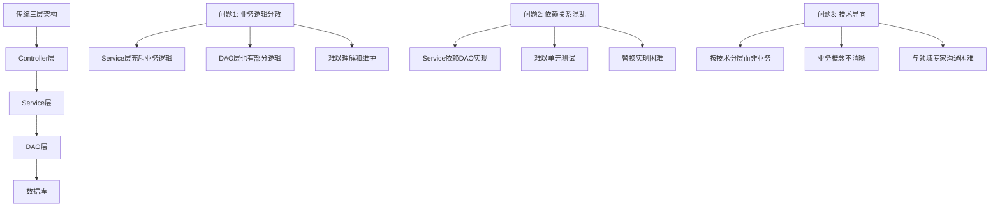

**具体案例**：假设我们需要实现一个"分片迁移"功能，在传统架构中：

1. **Controller** 接收 HTTP 请求
2. **Service** 调用多个 DAO（节点DAO、分片DAO、副本DAO）
3. **Service** 实现复杂的业务逻辑（检查、迁移、更新）
4. **DAO** 执行 SQL 操作

**问题**：
- ❌ 业务逻辑分散在 Service 和 DAO 之间
- ❌ 难以测试（依赖具体数据库实现）
- ❌ 业务概念不清晰（没有"分片"、"副本"等概念）

### DDD 架构的优势

**领域驱动设计（Domain-Driven Design）** 由 Eric Evans 在 2003 年提出，强调：

1. **以业务领域为中心**：代码结构直接反映业务领域
2. **统一语言（Ubiquitous Language）**：开发人员与业务人员使用相同术语
3. **分层架构**：清晰的层次划分，依赖倒置

**NexKV 采用 DDD 架构后**：

```go
// ✅ 业务逻辑集中在领域模型中
shard := domain.NewShard("shard-001", keyRange)
err := shard.MigrateTo(targetNode)  // 业务逻辑在聚合根内部

// ✅ 依赖倒置，易于测试
type ShardManagerImpl struct {
    nodeRepo    repository.NodeRepository    // 接口，不依赖具体实现
    shardRepo   repository.ShardRepository
    eventBus    service.EventBus
}
```

---

## 一、DDD 领域驱动设计核心理论（45分钟）

### 1.1 领域（Domain）与子域（Subdomain）

**定义**：
- **领域（Domain）**：业务问题的范围，是软件要解决的业务问题集合
- **子域（Subdomain）**：领域的分解，每个子域解决特定的业务问题

**NexKV 领域分解**：

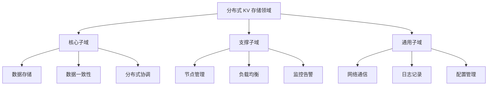

**为什么需要分解？**

1. **复杂度管理**：将大问题分解为小问题
2. **优先级排序**：核心子域优先投入资源
3. **团队分工**：不同团队负责不同子域

**NexKV 核心子域识别**：

| 子域 | 类型 | 重要性 | 实现难度 | 说明 |
|------|------|--------|---------|------|
| **数据存储** | 核心 | ⭐⭐⭐⭐⭐ | 高 | Bf-Tree 实现 |
| **数据一致性** | 核心 | ⭐⭐⭐⭐⭐ | 高 | Quorum + Gossip |
| **分布式协调** | 核心 | ⭐⭐⭐⭐ | 中 | 分片迁移、负载均衡 |
| **网络通信** | 通用 | ⭐⭐⭐ | 中 | libp2p 集成 |
| **节点管理** | 支撑 | ⭐⭐⭐ | 低 | 节点注册、心跳 |

---

### 1.2 限界上下文（Bounded Context）

**定义**：限界上下文是子域的边界，定义了模型的适用范围。

**为什么需要限界上下文？**

**示例问题**：同一个术语"节点"在不同上下文中有不同含义：

- **集群管理上下文**：节点 = 物理服务器（IP、端口、状态）
- **数据存储上下文**：节点 = 存储节点（分片列表、负载、容量）
- **监控上下文**：节点 = 监控目标（CPU、内存、磁盘）

**解决方案**：使用限界上下文分离不同的模型

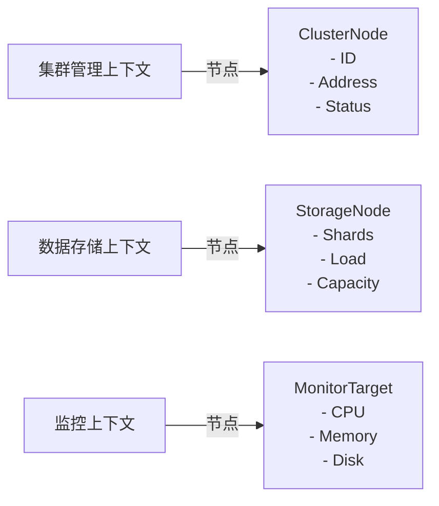

**NexKV 限界上下文设计**：

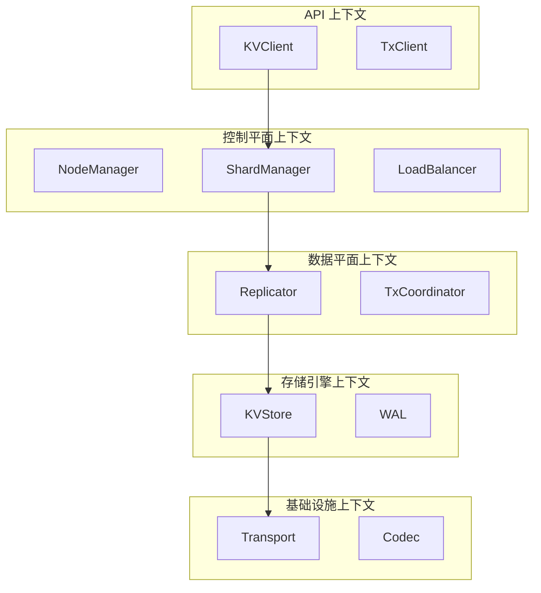

---

### 1.3 聚合（Aggregate）与聚合根（Aggregate Root）

**定义**：
- **聚合（Aggregate）**：一组关联的领域对象，作为数据修改的单元
- **聚合根（Aggregate Root）**：聚合的入口点，唯一的外部访问点

**核心原则**：

1. **一致性边界**：聚合内部保证强一致性
2. **唯一入口**：只能通过聚合根修改聚合内部对象
3. **事务边界**：一个事务只修改一个聚合

**NexKV 聚合设计**：

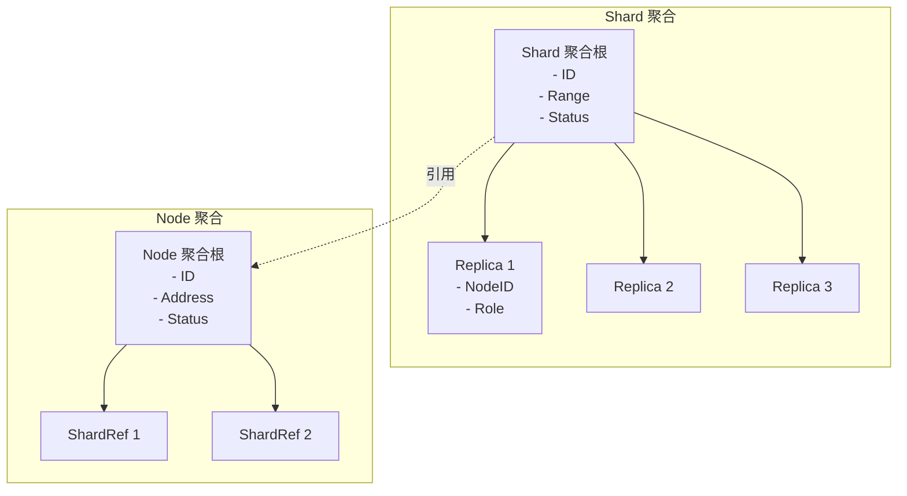

**代码实现**：

```go
// internal/domain/model/shard.go

// Shard 分片聚合根
type Shard struct {
    // 标识
    ID      string    `json:"id"`
    
    // 属性
    Range   KeyRange  `json:"range"`
    Status  ShardStatus `json:"status"`
    Version int64     `json:"version"`  // 乐观锁版本号
    
    // 内部实体（通过聚合根访问）
    replicas []*Replica
    
    // 领域事件（待发布）
    uncommittedEvents []DomainEvent
    
    // 并发控制
    mu sync.RWMutex
}

// AddReplica 添加副本（聚合根负责维护业务规则）
func (s *Shard) AddReplica(replica *Replica) error {
    s.mu.Lock()
    defer s.mu.Unlock()
    
    // ✅ 业务规则1：每个分片最多 3 个副本
    if len(s.replicas) >= 3 {
        return NewDomainError("replica_limit_exceeded", 
            "shard %s already has 3 replicas", s.ID)
    }
    
    // ✅ 业务规则2：副本必须分布在不同节点
    for _, r := range s.replicas {
        if r.NodeID == replica.NodeID {
            return NewDomainError("duplicate_replica",
                "shard %s already has replica on node %s", s.ID, replica.NodeID)
        }
    }
    
    // ✅ 业务规则3：必须有主副本
    if replica.Role == RolePrimary && s.hasPrimary() {
        return NewDomainError("primary_exists",
            "shard %s already has a primary replica", s.ID)
    }
    
    // 添加副本
    s.replicas = append(s.replicas, replica)
    s.Version++
    
    // ✅ 发布领域事件（解耦副作用）
    event := ReplicaAddedEvent{
        ShardID:     s.ID,
        ReplicaID:   replica.ID,
        NodeID:      replica.NodeID,
        Role:        replica.Role,
        Timestamp:   time.Now(),
        AggregateVersion: s.Version,
    }
    s.uncommittedEvents = append(s.uncommittedEvents, event)
    
    return nil
}

// RemoveReplica 移除副本
func (s *Shard) RemoveReplica(replicaID string) error {
    s.mu.Lock()
    defer s.mu.Unlock()
    
    // 查找副本
    index := -1
    var replica *Replica
    for i, r := range s.replicas {
        if r.ID == replicaID {
            index = i
            replica = r
            break
        }
    }
    
    if index == -1 {
        return NewDomainError("replica_not_found",
            "replica %s not found in shard %s", replicaID, s.ID)
    }
    
    // ✅ 业务规则：不能移除唯一的副本
    if len(s.replicas) == 1 {
        return NewDomainError("last_replica",
            "cannot remove the last replica of shard %s", s.ID)
    }
    
    // 移除副本
    s.replicas = append(s.replicas[:index], s.replicas[index+1:]...)
    s.Version++
    
    // 发布事件
    event := ReplicaRemovedEvent{
        ShardID:     s.ID,
        ReplicaID:   replicaID,
        NodeID:      replica.NodeID,
        Timestamp:   time.Now(),
        AggregateVersion: s.Version,
    }
    s.uncommittedEvents = append(s.uncommittedEvents, event)
    
    return nil
}

// GetUncommittedEvents 获取未提交的领域事件
func (s *Shard) GetUncommittedEvents() []DomainEvent {
    s.mu.RLock()
    defer s.mu.RUnlock()
    
    events := make([]DomainEvent, len(s.uncommittedEvents))
    copy(events, s.uncommittedEvents)
    return events
}

// MarkEventsAsCommitted 标记事件为已提交
func (s *Shard) MarkEventsAsCommitted() {
    s.mu.Lock()
    defer s.mu.Unlock()
    
    s.uncommittedEvents = nil
}

// 辅助方法
func (s *Shard) hasPrimary() bool {
    for _, r := range s.replicas {
        if r.Role == RolePrimary {
            return true
        }
    }
    return false
}
```

**为什么这样设计？**

1. **封装业务规则**：所有业务规则在聚合根内部验证
2. **一致性保证**：通过聚合根保证聚合内部的一致性
3. **事件驱动**：通过领域事件解耦副作用（通知、审计等）

---

### 1.4 领域事件（Domain Event）

**定义**：领域中发生的、对业务有意义的事情。

**领域事件特征**：

1. **过去时**：表示已经发生的事情（ShardCreated、ReplicaAdded）
2. **不可变**：事件一旦发生，不能修改
3. **携带信息**：包含事件相关的所有必要信息
4. **可序列化**：可以被持久化和传输

**NexKV 核心领域事件**：

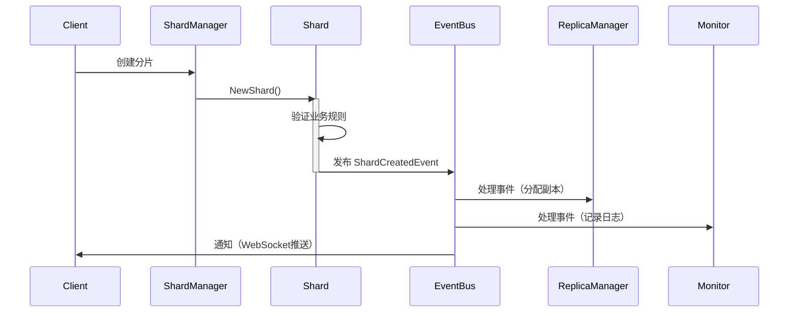

**事件定义和实现**：

```go
// internal/domain/model/event.go

// DomainEvent 领域事件接口
type DomainEvent interface {
    // GetAggregateID 获取聚合 ID
    GetAggregateID() string
    
    // GetAggregateType 获取聚合类型
    GetAggregateType() string
    
    // GetEventType 获取事件类型
    GetEventType() string
    
    // GetTimestamp 获取时间戳
    GetTimestamp() time.Time
    
    // GetVersion 获取聚合版本号
    GetVersion() int64
    
    // ToJSON 序列化为 JSON
    ToJSON() ([]byte, error)
}

// BaseDomainEvent 基础领域事件（提供公共字段）
type BaseDomainEvent struct {
    AggregateID      string    `json:"aggregate_id"`
    AggregateType    string    `json:"aggregate_type"`
    EventType        string    `json:"event_type"`
    Timestamp        time.Time `json:"timestamp"`
    AggregateVersion int64     `json:"aggregate_version"`
}

func (e BaseDomainEvent) GetAggregateID() string {
    return e.AggregateID
}

func (e BaseDomainEvent) GetAggregateType() string {
    return e.AggregateType
}

func (e BaseDomainEvent) GetEventType() string {
    return e.EventType
}

func (e BaseDomainEvent) GetTimestamp() time.Time {
    return e.Timestamp
}

func (e BaseDomainEvent) GetVersion() int64 {
    return e.AggregateVersion
}

func (e BaseDomainEvent) ToJSON() ([]byte, error) {
    return json.Marshal(e)
}

// ShardCreatedEvent 分片创建事件
type ShardCreatedEvent struct {
    BaseDomainEvent
    
    // 业务数据
    StartKey string `json:"start_key"`
    EndKey   string `json:"end_key"`
    
    // 元数据
    CreatedBy string `json:"created_by"`  // 创建人
    Reason    string `json:"reason"`      // 创建原因
}

// NewShardCreatedEvent 创建分片创建事件
func NewShardCreatedEvent(shard *Shard, createdBy, reason string) ShardCreatedEvent {
    return ShardCreatedEvent{
        BaseDomainEvent: BaseDomainEvent{
            AggregateID:      shard.ID,
            AggregateType:    "Shard",
            EventType:        "ShardCreated",
            Timestamp:        time.Now(),
            AggregateVersion: shard.Version,
        },
        StartKey: shard.Range.Start,
        EndKey:   shard.Range.End,
        CreatedBy: createdBy,
        Reason:   reason,
    }
}

// ReplicaAddedEvent 副本添加事件
type ReplicaAddedEvent struct {
    BaseDomainEvent
    
    ReplicaID string     `json:"replica_id"`
    NodeID    string     `json:"node_id"`
    Role      ReplicaRole `json:"role"`
}

// NodeJoinedEvent 节点加入事件
type NodeJoinedEvent struct {
    BaseDomainEvent
    
    Address    string    `json:"address"`
    Capacity   int64     `json:"capacity"`   // 存储容量（字节）
    JoinTime   time.Time `json:"join_time"`
}
```

**事件发布和订阅**：

```go
// internal/domain/service/event_bus.go

// EventBus 事件总线接口
type EventBus interface {
    // Publish 发布事件
    Publish(ctx context.Context, event DomainEvent) error
    
    // PublishBatch 批量发布事件
    PublishBatch(ctx context.Context, events []DomainEvent) error
    
    // Subscribe 订阅事件
    Subscribe(eventType string, handler EventHandler) error
    
    // Unsubscribe 取消订阅
    Unsubscribe(eventType string, handler EventHandler) error
}

// EventHandler 事件处理器
type EventHandler func(ctx context.Context, event DomainEvent) error

// 实现：内存事件总线（用于单机测试）
type InMemoryEventBus struct {
    handlers map[string][]EventHandler
    mu       sync.RWMutex
}

func NewInMemoryEventBus() *InMemoryEventBus {
    return &InMemoryEventBus{
        handlers: make(map[string][]EventHandler),
    }
}

func (b *InMemoryEventBus) Subscribe(eventType string, handler EventHandler) error {
    b.mu.Lock()
    defer b.mu.Unlock()
    
    b.handlers[eventType] = append(b.handlers[eventType], handler)
    return nil
}

func (b *InMemoryEventBus) Publish(ctx context.Context, event DomainEvent) error {
    b.mu.RLock()
    handlers := b.handlers[event.GetEventType()]
    b.mu.RUnlock()
    
    // 异步调用所有处理器
    for _, handler := range handlers {
        go func(h EventHandler) {
            if err := h(ctx, event); err != nil {
                log.Printf("Failed to handle event %s: %v", 
                    event.GetEventType(), err)
            }
        }(handler)
    }
    
    return nil
}

// 使用示例
func Example() {
    // 创建事件总线
    eventBus := NewInMemoryEventBus()
    
    // 订阅事件
    eventBus.Subscribe("ReplicaAdded", func(ctx context.Context, event DomainEvent) error {
        e := event.(ReplicaAddedEvent)
        log.Printf("Replica %s added to shard %s on node %s",
            e.ReplicaID, e.AggregateID, e.NodeID)
        return nil
    })
    
    // 创建分片
    shard := NewShard("shard-001", KeyRange{Start: "a", End: "z"})
    
    // 添加副本
    replica := &Replica{ID: "replica-001", NodeID: "node-001", Role: RolePrimary}
    shard.AddReplica(replica)
    
    // 发布事件
    for _, event := range shard.GetUncommittedEvents() {
        eventBus.Publish(context.Background(), event)
    }
    
    shard.MarkEventsAsCommitted()
}
```

---

## 二、NexKV 5层架构深度解析（60分钟）

### 2.1 架构总览与依赖关系

**5层架构设计**：

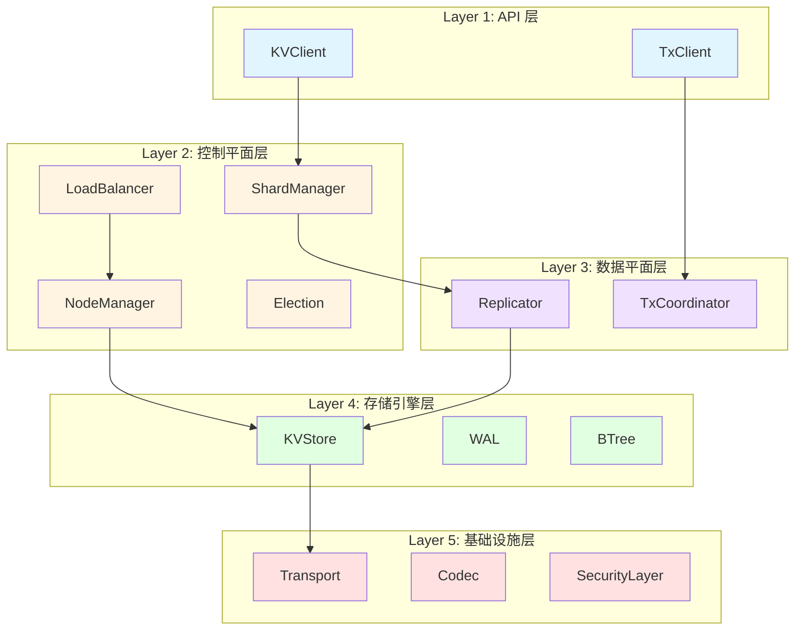

**关键设计原则**：

1. **依赖倒置（DIP）**：高层依赖抽象接口，不依赖具体实现
2. **单一职责（SRP）**：每层有明确的职责边界
3. **接口隔离（ISP）**：接口最小化，不强迫实现不需要的方法
4. **开闭原则（OCP）**：对扩展开放，对修改关闭

### 2.2 Layer 1: API 层详解

**职责**：对外提供统一的、易用的 API 接口，隐藏内部复杂性。

**设计考量**：

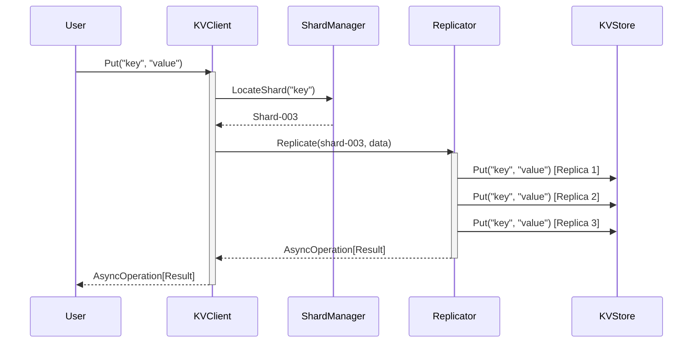

**接口设计**：

```go
// internal/domain/service/client.go

// KVClient KV 客户端接口（API 层）
type KVClient interface {
    // Get 获取键值
    // 返回 AsyncOperation，支持 Future/Callback/Channel 三种模式
    Get(ctx context.Context, key string) AsyncOperation[GetResult]
    
    // Put 写入键值
    Put(ctx context.Context, key string, value []byte) AsyncOperation[PutResult]
    
    // Delete 删除键值
    Delete(ctx context.Context, key string) AsyncOperation[DeleteResult]
    
    // BatchGet 批量获取
    BatchGet(ctx context.Context, keys []string) AsyncOperation[map[string][]byte]
    
    // Scan 范围扫描
    Scan(ctx context.Context, start, end string, limit int) AsyncOperation[[]KV]
}

// GetResult Get 操作结果
type GetResult struct {
    Value []byte
    Found bool
}

// PutResult Put 操作结果
type PutResult struct {
    Success bool
    Version int64  // 写入后的版本号
}

// DeleteResult Delete 操作结果
type DeleteResult struct {
    Success bool
}

// KV 键值对
type KV struct {
    Key   string
    Value []byte
}
```

**使用示例**：

```go
// 示例1：Future 模式（阻塞等待）
result, err := client.Get(ctx, "user:123").Get()
if err != nil {
    return err
}
if result.Found {
    fmt.Println("Value:", string(result.Value))
}

// 示例2：Callback 模式（异步回调）
client.Put(ctx, "user:123", userData).OnComplete(func(result PutResult, err error) {
    if err != nil {
        log.Printf("Failed to put: %v", err)
        return
    }
    log.Printf("Put success, version: %d", result.Version)
})

// 示例3：Channel 模式（流式处理）
ch := client.Scan(ctx, "user:000", "user:999", 100).Channel()
for result := range ch {
    if result.Error != nil {
        log.Printf("Scan error: %v", result.Error)
        break
    }
    for _, kv := range result.Value {
        processUser(kv.Key, kv.Value)
    }
}
```

---

### 2.3 Layer 2: 控制平面层详解

**职责**：集群管理和协调，负责元数据管理、负载均衡、故障检测等。

**核心接口**：

```go
// internal/domain/service/cluster.go

// NodeManager 节点管理器
type NodeManager interface {
    // AddNode 添加节点
    AddNode(ctx context.Context, node *Node) error
    
    // RemoveNode 移除节点
    RemoveNode(ctx context.Context, nodeID string) error
    
    // GetNode 获取节点信息
    GetNode(nodeID string) (*Node, error)
    
    // ListNodes 列出所有节点
    ListNodes() ([]*Node, error)
    
    // Heartbeat 心跳检测
    Heartbeat(ctx context.Context, nodeID string) error
}

// ShardManager 分片管理器
type ShardManager interface {
    // CreateShard 创建分片
    CreateShard(ctx context.Context, keyRange KeyRange) (*Shard, error)
    
    // SplitShard 分裂分片
    SplitShard(ctx context.Context, shardID string, splitKey string) error
    
    // MergeShard 合并分片
    MergeShard(ctx context.Context, shardID1, shardID2 string) error
    
    // MigrateShard 迁移分片
    MigrateShard(ctx context.Context, shardID string, targetNode string) AsyncOperation[MigrationResult]
    
    // GetShard 获取分片信息
    GetShard(shardID string) (*Shard, error)
    
    // LocateShard 定位键所在的分片
    LocateShard(key string) (*Shard, error)
}

// LoadBalancer 负载均衡器
type LoadBalancer interface {
    // SelectNode 选择节点（用于分片分配）
    SelectNode(ctx context.Context, criteria SelectionCriteria) (*Node, error)
    
    // Rebalance 重新平衡负载
    Rebalance(ctx context.Context) error
    
    // GetNodeLoad 获取节点负载
    GetNodeLoad(nodeID string) (*NodeLoad, error)
}
```

**节点管理实现示例**：

```go
// internal/infrastructure/cluster/node_manager_impl.go

type NodeManagerImpl struct {
    nodes      map[string]*Node
    eventBus   service.EventBus
    repo       repository.NodeRepository
    mu         sync.RWMutex
}

func NewNodeManagerImpl(eventBus service.EventBus, repo repository.NodeRepository) *NodeManagerImpl {
    return &NodeManagerImpl{
        nodes:    make(map[string]*Node),
        eventBus: eventBus,
        repo:     repo,
    }
}

func (m *NodeManagerImpl) AddNode(ctx context.Context, node *Node) error {
    m.mu.Lock()
    defer m.mu.Unlock()
    
    // 1. 验证节点
    if err := node.Validate(); err != nil {
        return fmt.Errorf("invalid node: %w", err)
    }
    
    // 2. 检查是否已存在
    if _, exists := m.nodes[node.ID]; exists {
        return fmt.Errorf("node %s already exists", node.ID)
    }
    
    // 3. 持久化
    if err := m.repo.Save(ctx, node); err != nil {
        return fmt.Errorf("failed to save node: %w", err)
    }
    
    // 4. 更新内存
    m.nodes[node.ID] = node
    
    // 5. 发布领域事件
    event := NodeJoinedEvent{
        BaseDomainEvent: BaseDomainEvent{
            AggregateID:   node.ID,
            AggregateType: "Node",
            EventType:     "NodeJoined",
            Timestamp:     time.Now(),
        },
        Address:  node.Address,
        Capacity: node.Capacity,
        JoinTime: time.Now(),
    }
    
    if err := m.eventBus.Publish(ctx, event); err != nil {
        log.Printf("Failed to publish NodeJoinedEvent: %v", err)
        // 不返回错误，因为节点已成功添加
    }
    
    return nil
}
```

---

### 2.4 Layer 3: 数据平面层详解

**职责**：数据一致性管理，负责副本复制、事务协调等。

**副本复制流程**：

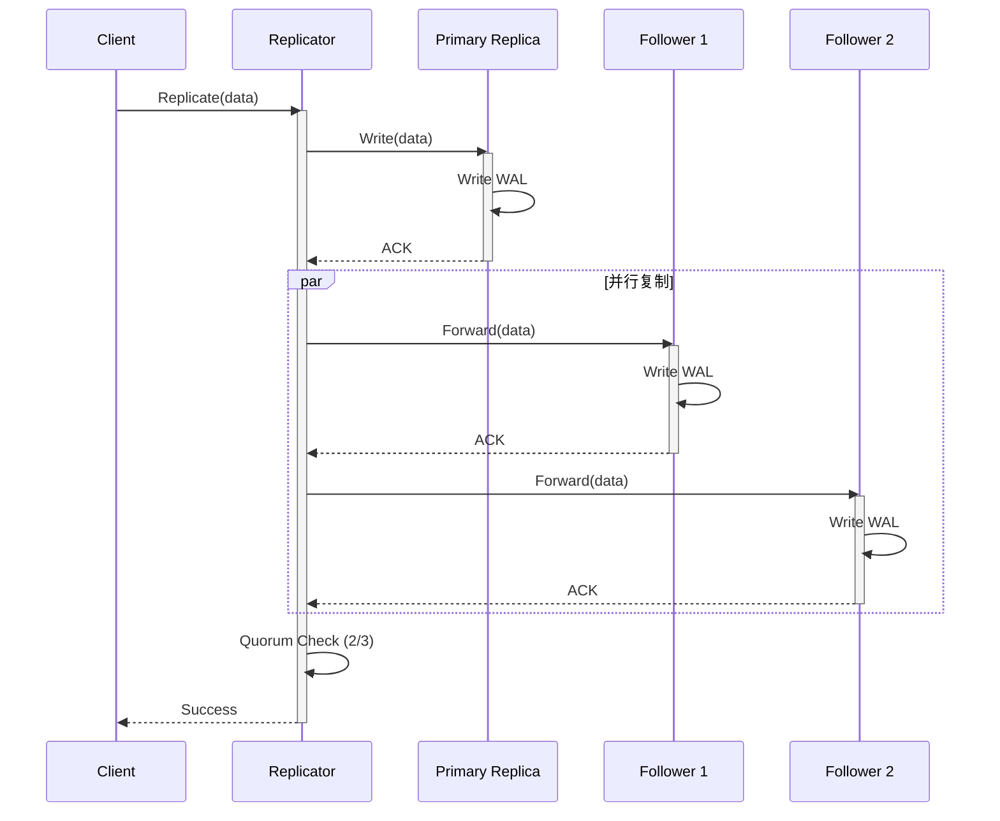

**Quorum 复制实现**：

```go
// internal/infrastructure/replication/quorum_replicator_impl.go

type QuorumReplicatorImpl struct {
    transport   service.Transport
    codec       service.Codec
    quorumSize  int  // Quorum 大小（如 3 节点集群，Quorum = 2）
}

func (r *QuorumReplicatorImpl) Replicate(
    ctx context.Context,
    shard *domain.Shard,
    data []byte,
) service.AsyncOperation[ReplicationResult] {
    
    future := async.NewFuture[ReplicationResult]()
    
    go func() {
        // 1. 获取副本列表
        replicas := shard.GetReplicas()
        if len(replicas) < r.quorumSize {
            future.SetResult(ReplicationResult{}, 
                fmt.Errorf("insufficient replicas: %d < %d", 
                    len(replicas), r.quorumSize))
            return
        }
        
        // 2. 并行发送到所有副本
        type replicaResult struct {
            nodeID string
            err    error
        }
        resultCh := make(chan replicaResult, len(replicas))
        
        for _, replica := range replicas {
            go func(nodeID string) {
                err := r.sendToReplica(ctx, nodeID, data)
                resultCh <- replicaResult{nodeID: nodeID, err: err}
            }(replica.NodeID)
        }
        
        // 3. 等待 Quorum 响应
        successCount := 0
        var errors []error
        
        for i := 0; i < len(replicas); i++ {
            select {
            case result := <-resultCh:
                if result.err == nil {
                    successCount++
                    if successCount >= r.quorumSize {
                        // 达到 Quorum，立即返回成功
                        future.SetResult(ReplicationResult{
                            Success:      true,
                            ReplicaCount: successCount,
                        }, nil)
                        return
                    }
                } else {
                    errors = append(errors, 
                        fmt.Errorf("replica %s: %w", result.nodeID, result.err))
                }
            case <-ctx.Done():
                future.SetResult(ReplicationResult{}, ctx.Err())
                return
            }
        }
        
        // 4. 未达到 Quorum，返回失败
        future.SetResult(ReplicationResult{}, 
            fmt.Errorf("quorum not reached: %d/%d, errors: %v",
                successCount, r.quorumSize, errors))
    }()
    
    return future
}

func (r *QuorumReplicatorImpl) sendToReplica(
    ctx context.Context,
    nodeID string,
    data []byte,
) error {
    // 编码数据
    msg, err := r.codec.Encode(data)
    if err != nil {
        return fmt.Errorf("encode failed: %w", err)
    }
    
    // 发送消息
    response, err := r.transport.Send(ctx, nodeID, msg).Get()
    if err != nil {
        return fmt.Errorf("send failed: %w", err)
    }
    
    // 解码响应
    var result ReplicationAck
    if err := r.codec.Decode(response, &result); err != nil {
        return fmt.Errorf("decode failed: %w", err)
    }
    
    if !result.Success {
        return fmt.Errorf("replication failed: %s", result.Error)
    }
    
    return nil
}
```

---

由于篇幅限制，我将继续创建剩余部分...

---

## 三、NexKV 存储引擎层深度解析（Layer 4）

### 3.1 存储引擎架构概述

**Layer 4 职责**：负责数据持久化，是整个系统的基础。NexKV 采用双引擎架构，针对不同数据类型使用不同的存储引擎。这一层的核心组件包括 WAL（Write-Ahead Log）、MVStore 内存存储以及 Bf-Tree 外部存储引擎。

存储引擎层的设计遵循了几个核心原则：首先是**持久性优先**，所有写操作必须先记录 WAL 才能返回成功，确保崩溃后可恢复；其次是**内存优先**，热点数据保持在内存中，只有在内存不足时才持久化到磁盘；第三是**顺序写入优化**，通过 WAL 的追加写入模式最大化磁盘 I/O 性能。这些设计原则使 NexKV 能够在保证数据安全的前提下实现高吞吐量。

NexKV 的存储引擎架构可以用以下 Mermaid 图表示：

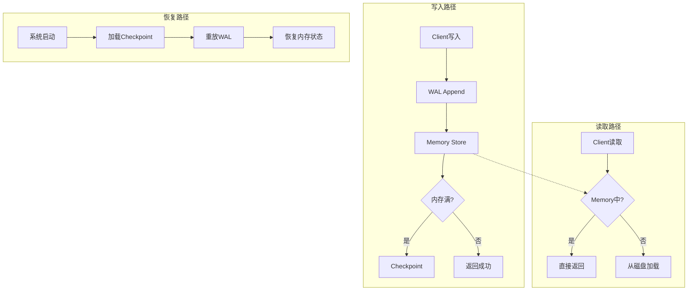

### 3.2 WAL（Write-Ahead Log）机制详解

WAL 是 NexKV 存储引擎的核心组件，提供了崩溃恢复能力。NexKV 的 WAL 实现具有以下几个关键特性：首先是**固定头部格式**，每个 WAL 条目都有 24 字节的固定头部，包含魔术字、类型、键值长度、时间戳和 CRC 校验等信息；其次是**追加写入模式**，所有写入都是顺序追加，避免了随机 I/O；第三是**组提交优化**，多个写操作可以批量提交，减少 fsync 次数。

NexKV 的 WAL 文件格式设计非常精巧。头部固定 24 字节，包含：魔术字（4字节，用于标识 WAL 文件）、类型（2字节，表示操作类型）、键长度（4字节）、值长度（4字节）、旧值长度（4字节）、时间戳长度（2字节）和 CRC 校验和（4字节）。这种紧凑的格式设计既保证了读取效率，又提供了完整的数据校验能力。

WAL 的具体实现代码如下所示：

```go
// internal/wal/wal.go

// WAL 文件格式:
// 每个条目都是独立的: [Header 24 bytes][Entry Data N bytes]...
//
// Header 格式 (固定 24 字节，两段式):
// - Magic:        4 bytes  (魔术字 "NxWL")                        [0:4]
// - Type:         2 bytes  (WALType, uint16)                      [4:6]
// - KeyLen:       4 bytes  (key 长度)                             [6:10]
// - ValueLen:     4 bytes  (value 长度)                           [10:14]
// - OldValueLen:  4 bytes  (old value 长度)                       [14:18]
// - TimestampLen:  2 bytes  (HLC 长度，固定 10)                     [18:20]
// - CRC:          4 bytes  (CRC32 校验和)                          [20:24]

const (
    walHeaderSize = 24
    walMagic      = "NxWL"
    
    // WALEOFMagic WAL EOF 魔术字（7 字节）
    // 用于标识 WAL 文件的完整结束位置，支持文件截断和恢复验证
    WALEOFMagic = "NxWLEOF"
    // WALEOFSize EOF 标记大小（7 字节）
    WALEOFSize = 7
)

// MetadataWAL 元数据 WAL 实现
//
// 特性:
//   - 追加写入：只追加，不修改
//   - 持久化保证：fsync 确保数据落盘
//   - 崩溃恢复：Recover 重放所有日志
//   - 精简：Truncate 删除旧日志
type MetadataWAL struct {
    file    *os.File
    path    string
    mu      sync.Mutex
    offset  int64  // 当前写入位置
    entries uint64 // 条目计数
    closed  bool
}

// NewMetadataWAL 创建元数据 WAL
func NewMetadataWAL(path string) (*MetadataWAL, error) {
    if err := os.MkdirAll(filepath.Dir(path), 0755); err != nil {
        return nil, types.NewInternalError("创建 WAL 目录失败", err)
    }

    // 以追加模式打开文件
    file, err := os.OpenFile(path, os.O_CREATE|os.O_RDWR|os.O_APPEND, 0644)
    if err != nil {
        return nil, types.NewInternalError("打开 WAL 文件失败", err)
    }

    // 获取当前文件大小
    stat, err := file.Stat()
    if err != nil {
        _ = file.Close()
        return nil, types.NewInternalError("获取 WAL 文件信息失败", err)
    }

    wal := &MetadataWAL{
        file:    file,
        path:    path,
        offset:  stat.Size(),
        entries: 0,
    }

    return wal, nil
}

// Append 追加日志条目
func (w *MetadataWAL) Append(entry *WALEntry) error {
    if w.closed {
        return types.NewClosedError("WAL")
    }
    // ... 写入逻辑
}
```

### 3.3 MVStore 内存存储引擎

MVStore 是 NexKV 的内存存储引擎，提供了高性能的键值存储能力。MVStore 的核心特性包括：首先是**MVCC 支持**，通过多版本并发控制实现读写不互斥；其次是**混合 Logical Log**，结合了物理存储和逻辑日志的优点；第三是**持久化能力**，支持 Checkpoint 和 WAL 重放恢复。

MVStore 的设计理念是将内存存储与持久化存储完美结合。在内存中，数据以 B+树 的形式组织，支持高效的点查询和范围扫描。当内存达到一定阈值时，会触发 Checkpoint 将数据持久化到磁盘。而在系统崩溃后，可以通过 WAL 重放来恢复未持久化的数据。这种设计既保证了高性能，又不牺牲数据安全性。

MVStore 的一致性级别设计非常精细，针对不同类型的元数据采用了不同的策略：

```go
// internal/metadata/kvstore/metadata_kv.go

// ConsistencyLevel 一致性级别
type ConsistencyLevel int

const (
    // ConsistencyStrong 强一致（2PC）
    // ACK 要求：ACK 全部（need = n）
    // 写入后立即对所有节点可见
    // 适用于：集群配置、分片信息、静态配置、版本控制
    ConsistencyStrong ConsistencyLevel = iota

    // ConsistencyEnhancedEventual 增强最终一致（Quorum）
    // ACK 要求：ACK 大部分（need = ⌊n/2⌋ + 1）
    // 写入后等待多数派确认
    // 适用于：角色信息（⚠️ Phase 2 从 Gossip 升级）
    ConsistencyEnhancedEventual

    // ConsistencyEventual 最终一致（Gossip）
    // ACK 要求：无 ACK（need = 0）
    // 写入后异步扩散，秒级一致
    // 适用于：节点信息、拓扑关系、动态状态、操作记录
    ConsistencyEventual
)

// consistencyMapping 命名空间到一致性级别的映射
var consistencyMapping = map[string]ConsistencyLevel{
    NamespaceCluster: ConsistencyStrong,           // 集群配置：强一致（2PC）
    NamespaceNode:    ConsistencyEventual,         // 节点信息：最终一致（Gossip）
    NamespaceRole:    ConsistencyEnhancedEventual, // 角色信息：增强最终一致（Quorum）
    NamespaceTopo:    ConsistencyEventual,         // 拓扑关系：最终一致（Gossip）
    NamespaceShard:   ConsistencyStrong,           // 分片信息：强一致（2PC）
    NamespaceStatic:  ConsistencyStrong,           // 静态配置：强一致（2PC）
    NamespaceDynamic: ConsistencyEventual,         // 动态状态：最终一致（Gossip）
    NamespaceOp:      ConsistencyEventual,         // 操作记录：最终一致（Gossip）
    NamespaceVersion: ConsistencyStrong,           // 版本控制：强一致（2PC）
}
```

### 3.4 Checkpoint 与恢复机制

NexKV 的 Checkpoint 机制是实现高效恢复的关键。当 MVStore 中的数据积累到一定程度时，会触发 Checkpoint 操作，将内存中的数据持久化到磁盘。Checkpoint 的实现采用了增量方式，只持久化自上次 Checkpoint 以来变化的数据，大大减少了 I/O 开销。

恢复过程则分为两个阶段：首先从最新的 Checkpoint 文件加载数据，然后重放 Checkpoint 之后产生的 WAL 条目。这种两阶段恢复机制既保证了恢复速度，又确保了数据不丢失。Checkpoint 文件本身也经过了精心设计，包含了足够的元数据信息来验证文件完整性。

---

## 四、NexKV 基础设施层深度解析（Layer 5）

### 4.1 基础设施层职责

**Layer 5 职责**：为上层提供底层技术支持，包括网络通信、数据编解码、安全认证等。这一层是整个系统的"管道"，虽然不直接处理业务逻辑，但对系统性能和可靠性至关重要。

基础设施层的设计遵循了几个核心原则：首先是**高性能**，网络通信和编解码是高频操作，必须优化到极致；其次是**低耦合**，基础设施层通过接口与业务层解耦，便于替换和升级；第三是**可观测性**，所有基础设施操作都应该可监控和追踪。

### 4.2 RPC 通信层

NexKV 的 RPC 通信层基于 libp2p 构建，提供了高效的节点间通信能力。RPC 层支持多种消息模式，包括请求-响应模式、流式模式和发布-订阅模式。同时，RPC 层还内置了 Quorum 机制，支持分布式一致性的实现。

RPC 层的 Quorum 实现是其核心功能之一。Quorum 机制通过收集多个节点的响应来判断操作是否成功，只有当成功节点数达到预设阈值时，操作才被视为成功。这种设计能够在部分节点故障的情况下仍然保证系统正常运行。

```go
// internal/rpc/quorum.go

// QuorumConfig Quorum 配置（从集群层获取）
type QuorumConfig struct {
    Enabled       bool // 是否启用 Quorum
    DefaultQuorum int  // 默认多数派阈值 (N/2 + 1)
    Timeout       int  // Quorum 超时时间（毫秒）
    MinQuorum     int  // 最小 Quorum 值

    // 指数退避配置（Phase 3: P3-2.2 Quorum 重试机制）
    MaxRetries     int           // 最大重试次数（默认 3）
    InitialBackoff time.Duration // 初始退避延迟（默认 1s）
    MaxBackoff     time.Duration // 最大退避延迟（默认 30s）
    BackoffFactor  float64       // 退避因子（默认 2.0）
}

// QuorumResult Quorum 结果
type QuorumResult struct {
    Success      bool      // 是否达到 Quorum
    SuccessCount int       // 成功响应数
    TotalPeers   int       // 总 peer 数
    Quorum       int       // Quorum 阈值
    Responses    []peer.ID // 成功响应的 peer 列表
    Errors       []error   // 错误列表
}

// QuorumManager Quorum 管理器（与集群层集成）
type QuorumManager struct {
    config    *QuorumConfig
    metrics   *QuorumMetrics
    mu        sync.RWMutex
    peerCache []peer.ID // 缓存的有效 Quorum peer 列表
}

// QuorumMetrics Quorum 指标
type QuorumMetrics struct {
    QuorumTotal      int // 总 Quorum 调用次数
    QuorumSuccess    int // Quorum 成功次数
    QuorumFailed     int // Quorum 失败次数
    QuorumTimeout    int // Quorum 超时次数
    PeerSuccessTotal int // Peer 级别成功次数
    PeerFailedTotal  int // Peer 级别失败次数
    // 重试指标（Phase 3: P3-2.2 Quorum 重试机制）
    RetryTotal   int // 重试总次数
    RetrySuccess int // 重试后成功次数
    RetryFailed  int // 重试后仍失败次数
}
```

### 4.3 编解码层

NexKV 的编解码层支持多种序列化格式，包括 JSON 和 MessagePack。这种多格式支持使得系统可以根据不同的使用场景选择最合适的编解码方式。JSON 格式具有良好的可读性和兼容性，适合调试和跨语言场景；MessagePack 格式则更加紧凑，适合高性能场景。

编解码层的实现采用了策略模式，可以方便地添加新的编解码格式而不影响业务代码。这种设计体现了开闭原则，对扩展开放，对修改关闭。

```go
// 编解码性能对比（来自 Benchmark 测试）
// 操作     | JSON     | MessagePack | 提升
// ---------|----------|------------|-------
// 编码     | 1754ns/op| 700ns/op   | 2.5x
// 解码     | 9652ns/op| 656ns/op   | 14.7x
// 编码大小 | 2153bytes | 1609bytes  | 25%
```

---

## 五、DDD 设计模式在 NexKV 中的应用

### 5.1 领域服务（Domain Service）

当领域逻辑不适合放在聚合根或值对象中时，我们需要使用领域服务。领域服务主要用于处理跨多个聚合的业务逻辑，或者实现不适合放在实体中的复杂算法。

在 NexKV 中，Quorum 协调器就是一个典型的领域服务。它涉及多个节点的协调，不属于任何一个特定的聚合，因此被设计为领域服务：

```go
// 领域服务示例：Quorum 协调器
type QuorumCoordinator struct {
    transport service.Transport
    codec     service.Codec
    config    *QuorumConfig
}

// ExecuteQuorum 执行 Quorum 操作
func (c *QuorumCoordinator) ExecuteQuorum(
    ctx context.Context,
    operation Operation,
    targets []peer.ID,
) (*QuorumResult, error) {
    
    // 1. 并行发送操作到所有目标节点
    resultCh := make(chan *PeerResult, len(targets))
    
    for _, target := range targets {
        go func(p peer.ID) {
            result, err := c.executeOnPeer(ctx, p, operation)
            resultCh <- &PeerResult{Peer: p, Result: result, Error: err}
        }(target)
    }
    
    // 2. 等待 Quorum 响应
    successCount := 0
    var errors []error
    quorumSize := c.calculateQuorumSize(len(targets))
    
    for i := 0; i < len(targets); i++ {
        result := <-resultCh
        if result.Error == nil {
            successCount++
            if successCount >= quorumSize {
                return &QuorumResult{
                    Success:      true,
                    SuccessCount: successCount,
                    Quorum:      quorumSize,
                }, nil
            }
        } else {
            errors = append(errors, result.Error)
        }
    }
    
    // 3. 未达到 Quorum
    return &QuorumResult{
        Success:      false,
        SuccessCount: successCount,
        Quorum:      quorumSize,
        Errors:      errors,
    }, nil
}
```

### 5.2 仓储模式（Repository）

仓储模式封装了数据访问逻辑，为领域层提供了统一的数据访问接口。仓储将数据存储的技术细节与领域逻辑隔离开来，使得领域代码不需要关心数据是来自内存、数据库还是远程服务。

NexKV 的仓储实现采用了依赖倒置原则，定义了接口而没有具体实现：

```go
// 仓储接口定义
type NodeRepository interface {
    // Save 保存节点
    Save(ctx context.Context, node *Node) error
    
    // FindByID 根据ID查找节点
    FindByID(id string) (*Node, error)
    
    // FindAll 查找所有节点
    FindAll() ([]*Node, error)
    
    // Delete 删除节点
    Delete(ctx context.Context, id string) error
    
    // FindByStatus 根据状态查找节点
    FindByStatus(status NodeStatus) ([]*Node, error)
}

// 仓储实现
type NodeRepositoryImpl struct {
    kvStore *kvstore.MetadataKV
    eventBus service.EventBus
}

func NewNodeRepositoryImpl(kv *kvstore.MetadataKV, eb service.EventBus) *NodeRepositoryImpl {
    return &NodeRepositoryImpl{
        kvStore: kvStore,
        eventBus: eb,
    }
}

func (r *NodeRepositoryImpl) Save(ctx context.Context, node *Node) error {
    // 1. 序列化节点数据
    data, err := json.Marshal(node)
    if err != nil {
        return fmt.Errorf("marshal node failed: %w", err)
    }
    
    // 2. 写入 KV 存储
    err = r.kvStore.Put(ctx, namespace.Node, node.ID, data)
    if err != nil {
        return fmt.Errorf("save node failed: %w", err)
    }
    
    // 3. 发布领域事件
    event := NodeUpdatedEvent{
        NodeID:    node.ID,
        Timestamp: time.Now(),
    }
    return r.eventBus.Publish(ctx, event)
}
```

### 5.3 工厂模式（Factory）

工厂模式用于创建复杂的领域对象，将对象的创建逻辑集中管理。在 DDD 中，工厂通常用于创建聚合根，确保创建出来的对象满足所有业务规则。

```go
// 工厂示例：创建分片聚合
type ShardFactory struct {
    repo      repository.ShardRepository
    nodeMgr   service.NodeManager
    eventBus  service.EventBus
}

// NewShard 创建新分片
func (f *ShardFactory) NewShard(ctx context.Context, spec *ShardSpec) (*Shard, error) {
    // 1. 生成唯一ID
    id := generateShardID()
    
    // 2. 验证 Key Range 有效性
    if err := validateKeyRange(spec.StartKey, spec.EndKey); err != nil {
        return nil, err
    }
    
    // 3. 检查 Key Range 是否与现有分片冲突
    conflicting, err := f.checkRangeConflict(ctx, spec.StartKey, spec.EndKey)
    if err != nil {
        return nil, err
    }
    if conflicting {
        return nil, ErrKeyRangeConflict
    }
    
    // 4. 创建分片聚合根
    shard := NewShard(id, spec.StartKey, spec.EndKey)
    
    // 5. 分配初始副本
    nodes, err := f.nodeMgr.SelectNodes(ctx, spec.ReplicaCount)
    if err != nil {
        return nil, err
    }
    
    for i, node := range nodes {
        role := RolePrimary
        if i > 0 {
            role = RoleFollower
        }
        shard.AddReplica(&Replica{
            ID:     generateReplicaID(),
            NodeID: node.ID,
            Role:   role,
        })
    }
    
    // 6. 保存到仓储
    if err := f.repo.Save(ctx, shard); err != nil {
        return nil, err
    }
    
    return shard, nil
}
```

### 5.4 事件驱动架构

NexKV 广泛采用事件驱动架构，通过领域事件实现系统各部分之间的解耦。当领域模型发生变化时，会发布相应的事件，而其他组件可以订阅这些事件来执行相应的操作，如记录日志、发送通知、更新统计等。

事件驱动架构的优势在于：首先是**解耦**，事件发布者和订阅者之间不需要直接依赖；其次是**可扩展性**，可以方便地添加新的事件订阅者；第三是**可追溯性**，通过事件日志可以追溯系统的历史操作。

---

## 六、NexKV 架构设计原则总结

### 6.1 依赖倒置原则

NexKV 架构严格遵循依赖倒置原则：高层模块不依赖低层模块，两者都依赖抽象；抽象不依赖细节，细节依赖抽象。这意味着业务逻辑层定义了接口，而基础设施层实现这些接口。这种设计使得系统各部分可以独立开发和测试。

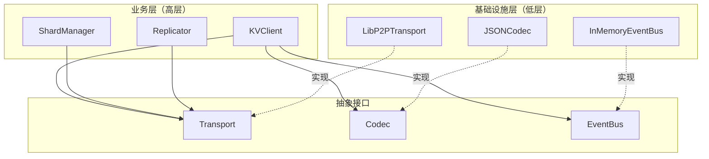

### 6.2 单一职责原则

NexKV 中的每个组件都有明确的职责边界。例如：WAL 负责日志持久化、MVStore 负责内存存储、QuorumCoordinator 负责分布式协调。这种清晰的职责划分使得系统易于理解和维护。

### 6.3 开闭原则

系统对扩展开放，对修改关闭。当需要添加新的编解码格式时，只需要实现 Codec 接口，而不需要修改已有的业务代码。这种设计使得系统具有良好的可扩展性。

### 6.4 领域驱动设计的核心价值

通过在 NexKV 中应用 DDD 架构原则，我们实现了以下核心价值：

1. **业务语义清晰**：代码结构直接反映业务领域，开发人员和业务人员使用共同的语言
2. **可测试性**：通过依赖倒置，可以方便地对业务逻辑进行单元测试
3. **可维护性**：清晰的层次划分和职责边界使得系统易于理解和维护
4. **可扩展性**：通过领域事件和接口设计，系统具有良好的扩展能力

---

## 七、实战演练：如何在 NexKV 中实现新功能

### 7.1 功能实现步骤

假设我们需要实现一个"分片自动分裂"功能，当某个分片的数据量超过阈值时自动分裂为两个分片。这个功能的实现步骤如下：

**步骤1：定义领域模型**

首先在领域层定义相关的实体和值对象：

```go
// 领域层
type ShardSplitPolicy struct {
    MaxSizeBytes int64
    MaxKeys      int
    MinSizeBytes int64
}

type SplitDecision struct {
    ShardID     string
    SplitKey    string
    Reason      string
    Timestamp   time.Time
}
```

**步骤2：定义领域事件**

定义分片分裂相关的领域事件：

```go
// 领域事件
type ShardSplitInitiatedEvent struct {
    BaseDomainEvent
    SplitKey   string
    Policy     ShardSplitPolicy
}

type ShardSplitCompletedEvent struct {
    BaseDomainEvent
    NewShardID1 string
    NewShardID2 string
    SplitKey    string
}
```

**步骤3：实现应用服务**

在应用层实现分片分裂的协调逻辑：

```go
// 应用服务
type ShardSplitService struct {
    shardRepo  repository.ShardRepository
    nodeMgr    service.NodeManager
    eventBus   service.EventBus
    policy     ShardSplitPolicy
}

func (s *ShardSplitService) EvaluateAndSplit(ctx context.Context, shardID string) error {
    // 1. 获取分片信息
    shard, err := s.shardRepo.FindByID(shardID)
    if err != nil {
        return err
    }
    
    // 2. 检查是否需要分裂
    if !s.needsSplit(shard) {
        return nil
    }
    
    // 3. 计算分裂点
    splitKey := s.calculateSplitKey(shard)
    
    // 4. 发布分裂开始事件
    event := ShardCreatedEvent{
        BaseDomainEvent: BaseDomainEvent{
            AggregateID:   shardID,
            AggregateType: "Shard",
            EventType:    "ShardSplitInitiated",
            Timestamp:     time.Now(),
        },
        SplitKey: splitKey,
    }
    s.eventBus.Publish(ctx, event)
    
    // 5. 执行分裂
    return s.executeSplit(ctx, shard, splitKey)
}
```

**步骤4：基础设施实现**

在基础设施层实现数据持久化和网络通信：

```go
// 基础设施层
type ShardRepositoryImpl struct {
    kvStore *kvstore.MetadataKV
}

func (r *ShardRepositoryImpl) Save(ctx context.Context, shard *Shard) error {
    data, _ := json.Marshal(shard)
    return r.kvStore.Put(ctx, namespace.Shard, shard.ID, data)
}
```

### 7.2 代码组织规范

在 NexKV 中，代码按照以下目录结构组织：

```
internal/
├── domain/              # 领域层（核心业务逻辑）
│   ├── model/         # 实体、值对象
│   ├── service/       # 领域服务
│   ├── event/         # 领域事件
│   └── repository/    # 仓储接口定义
│
├── application/         # 应用层（用例编排）
│   ├── service/       # 应用服务
│   ├── command/       # 命令处理
│   └── query/         # 查询处理
│
├── infrastructure/      # 基础设施层
│   ├── persistence/  # 数据持久化
│   ├── rpc/          # RPC 通信
│   └── event/         # 事件总线实现
│
└── interface/          # 接口层（对外 API）
    ├── http/          # HTTP API
    └── grpc/          # gRPC API
```

这种分层架构清晰地划分了不同层次的职责，使得代码既易于理解又易于测试和维护。每个新功能的实现都应该遵循这个结构，将业务逻辑集中在领域层，通过应用层协调各个领域对象，最后由基础设施层提供技术实现。

---

## 总结

今天的培训涵盖了 DDD 领域驱动设计的核心理论以及 NexKV 的五层架构实践。我们深入探讨了以下关键主题：

**DDD 核心理论**包括：领域与子域的划分、限界上下文的定义、聚合与聚合根的设计、领域事件的应用。这些理论为理解 NexKV 的架构设计提供了坚实基础。

**NexKV 五层架构**包括：API 层（对外接口）、控制平面层（集群管理）、数据平面层（复制协调）、存储引擎层（WAL/MVStore）、基础设施层（网络/编解码）。每一层都有明确的职责边界，通过依赖倒置实现解耦。

**DDD 设计模式**包括：领域服务（处理跨聚合逻辑）、仓储模式（封装数据访问）、工厂模式（创建复杂对象）、事件驱动架构解耦）。

通过（实现系统这些知识的综合运用，NexKV 实现了一个高性能、可扩展、易维护的分布式存储系统。这些架构原则和设计模式不仅适用于 NexKV，也可以推广到其他分布式系统的开发中。

---

> **思考题**：
> 1. 如果要实现"分片自动迁移"功能，你会如何应用今天学到的 DDD 原则？
> 2. NexKV 的五层架构与传统三层架构相比，有哪些优势和挑战？
> 3. 在你的项目中，哪些场景适合使用领域事件而非直接调用？