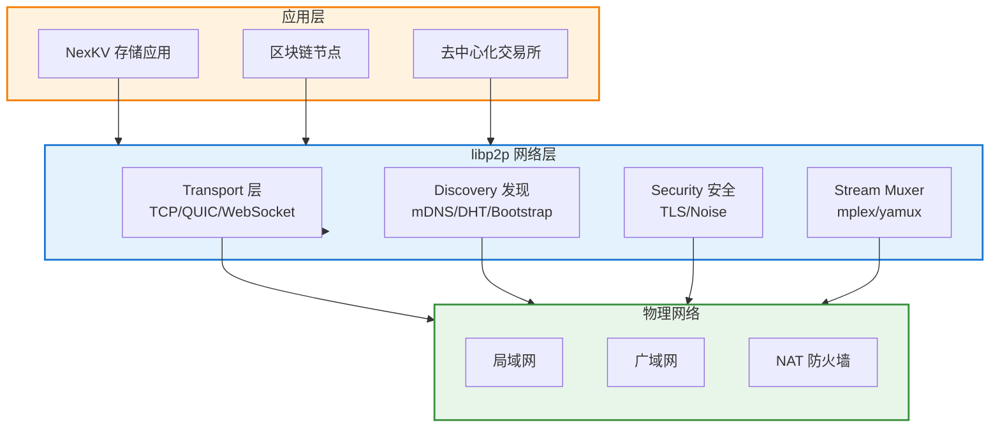
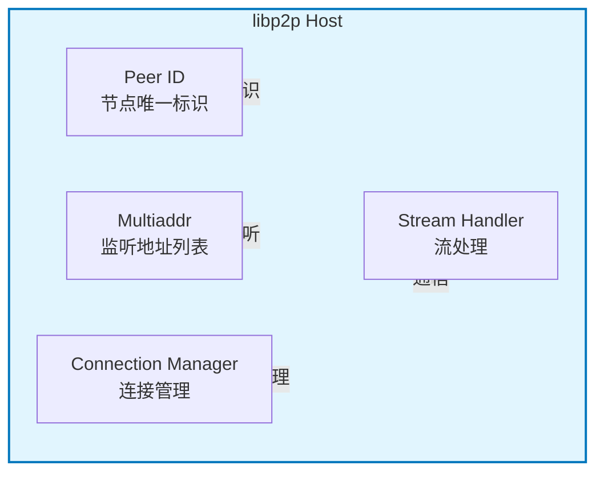
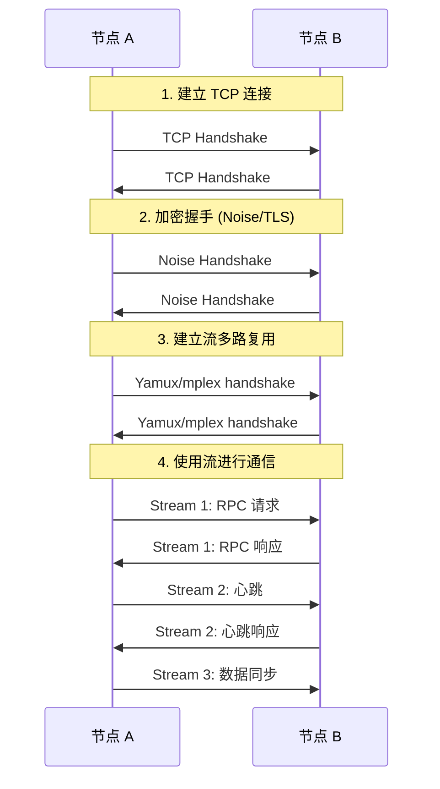
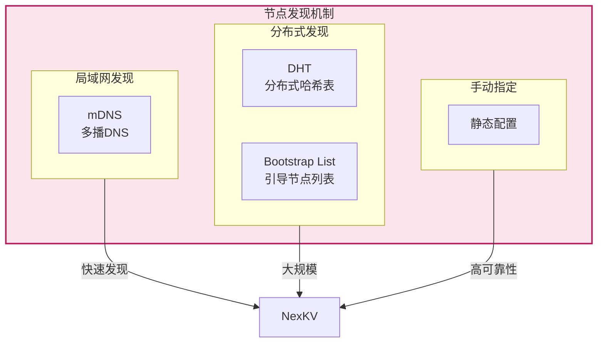
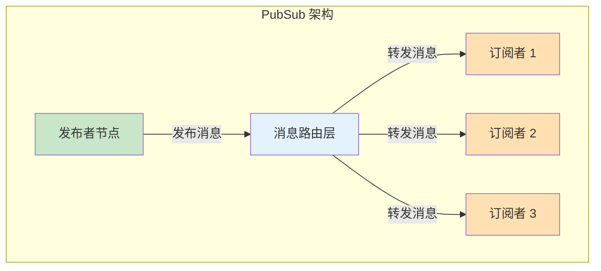
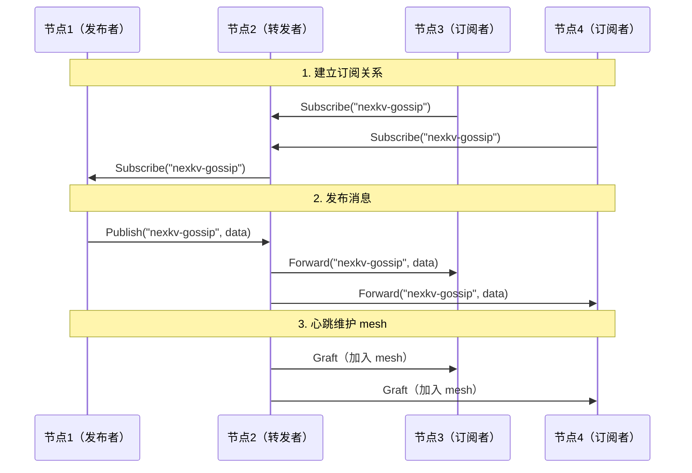
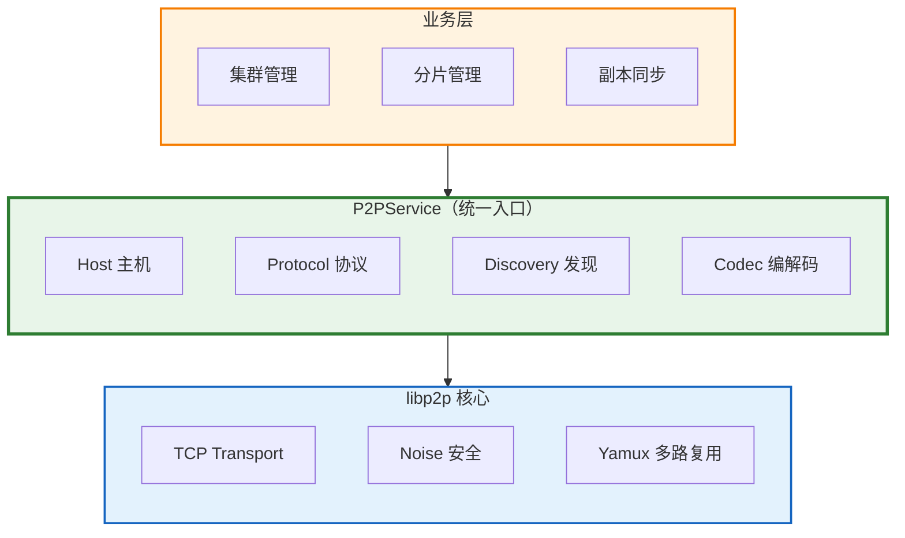
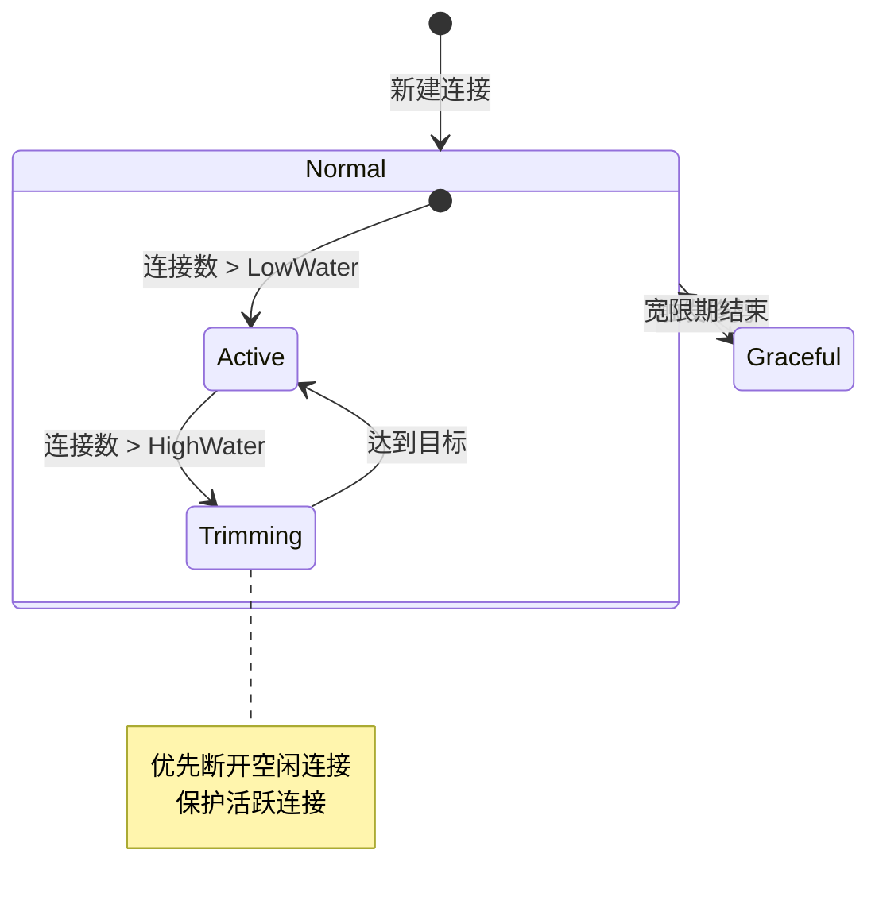

# Day 2-3：libp2p 基础培训

> **培训时间**: 1天（6小时）
> **培训内容**: libp2p 去中心化通信 + NexKV 实战
> **培训对象**: NexKV 开发团队成员
> **前置知识**: Go 语言基础、TCP/IP 网络基础

---

## 一、libp2p 概述（60分钟）

### 1.1 什么是 libp2p？

**libp2p**（发音为 "lib-p-two-pee"）是一个模块化的网络协议栈，专门用于构建去中心化和点对点（P2P）应用程序。它最初作为 IPFS（InterPlanetary File System）的网络层开发，后来演变为一个独立、通用的 P2P 网络库。如今，libp2p 已成为构建去中心化应用的首选网络框架，被广泛应用于 Ethereum 2.0、Filecoin、Polkadot、Akash 等顶级区块链项目中。



### 1.2 libp2p 的核心设计理念

libp2p 的设计遵循几个核心原则，这些原则也是 Nex 选择 libp2p 的主要原因：

**模块化架构（Modularity）**

libp2p 采用了高度模块化的设计思想，将网络栈的各个功能解耦为独立的组件。开发者可以根据实际需求选择和组合不同的传输协议，安全机制、多路复用器等组件。这种设计使得 libp2p 具有极高的灵活性，能够适应各种不同的网络环境和应用场景。

在 NexKV 项目中，我们主要使用了以下模块组合：
- **传输层**: TCP（简单可靠，适合局域网环境）
- **安全层**: Noise 协议（轻量级加密，无需证书）
- **多路复用**: yamux（高性能流多路复用）
- **发现服务**: mDNS（局域网自动发现）

**可移植性（Portability）**

libp2p 提供了多种语言的实现，包括 Go、JavaScript、Rust、Python 等。这使得开发者可以使用自己熟悉的语言来构建 P2P 应用，同时还能与其他语言实现的 P2P 网络进行互操作。NexKV 使用 Go 版本的 libp2p（go-libp2p），这与项目本身的 Go 语言栈完美匹配。

** NAT 穿透能力（NAT Traversal）**

在真实的网络环境中，大多数设备都位于 NAT（网络地址转换）设备后面，这给 P2P 通信带来了挑战。libp2p 提供了多种 NAT 穿透技术，包括：
- **UDP 打洞**（UDP Hole Punching）
- **TCP 打洞**（TCP Hole Punching）
- **中继服务**（Circuit Relay）
- **端口映射**（Port Forwarding）

对于当前的 NexKV 来说，由于主要运行在局域网环境下，我们暂时不需要复杂的 NAT 穿透功能。但当系统扩展到公网环境时，这些能力将变得至关重要。

### 1.3 NexKV 为什么选择 libp2p？

在分布式 KV 存储系统中，节点间的通信是核心功能之一。NexKV 选择 libp2p 作为底层通信框架，主要基于以下考量：

| 考量因素 | 说明 | NexKV 需求匹配度 |
|---------|------|-----------------|
| **去中心化架构** | 无单点故障，所有节点地位平等 | ✅ 完美匹配 |
| **模块化设计** | 可选择不同传输协议 | ✅ 灵活配置 |
| **跨平台支持** | Go、JS、Rust、Python | ✅ Go 语言原生支持 |
| **NAT 穿透** | 支持中继和打洞 | 🔄 当前无需，后续可扩展 |
| **成熟稳定** | 大量生产环境验证 | ✅ IPFS、Eth2 都在用 |
| **社区活跃** | 持续迭代更新 | ✅ 活跃维护 |

NexKV 的核心目标是构建一个面向中小规模集群（3-50 节点）的轻量化分布式数据库。在这个场景下，libp2p 提供了开箱即用的网络能力，让我们能够专注于业务逻辑的实现，而不是底层通信细节的处理。

---

## 二、libp2p 核心概念（60分钟）

### 2.1 主机（Host）

在 libp2p 中，**Host** 是最核心的概念，它代表一个 P2P 网络中的节点。Host 提供了节点的标识、地址管理和连接建立等功能。



**Peer ID（节点标识）**

每个 libp2p 节点都有一个唯一的 Peer ID，这个 ID 是基于节点的公钥生成的。在 Go 实现中，Peer ID 的类型是 `peer.ID`，它是一个基于 multihash 的字符串，看起来像这样：

```
QmXZ9HZxPkFobJ7654xQ2nNq1jT1Q9Q8x7WvNmN3pQrStuV
```

这种基于密码学的 ID 有一个重要特性：只有持有对应私钥的节点才能声称自己是该 ID 的所有者。这为 P2P 通信提供了身份验证的基础。

**Multiaddr（多地址）**

libp2p 使用 **multiaddr**（多地址）来表示节点的监听地址。multiaddr 是一种可组合的地址格式，它将传输协议和地址信息封装在一个字符串中：

```
/ip4/192.168.1.100/tcp/4001/p2p/QmXZ9HZx9pkFobJ7654xQ2nNq1jT1Q9Q8x7WvNmN3pQrStuV
```

这个地址分解如下：
- `/ip4/192.168.1.100` - IPv4 地址
- `/tcp/4001` - TCP 端口
- `/p2p/QmXZ...` - P2P 协议层，指定目标节点

multiaddr 的可组合性使得它可以表示各种复杂的网络拓扑，包括 IPv4/IPv6、TCP/UDP、WebSocket 等多种协议的组合。

### 2.2 连接（Connection）与流（Stream）

在 libp2p 中，通信的基本单位是 **Stream（流）**，它建立在 **Connection（连接）** 之上。



**Connection（连接）**

Connection 是两个节点之间的底层网络连接，它负责：
- 底层传输（TCP/QUIC）
- 加密通信（Noise/TLS）
- 流多路复用（yamux/mplex）

一旦两个节点之间建立了连接，它们就可以在这条连接上创建多个独立的 Stream。

**Stream（流）**

Stream 是建立在 Connection 之上的逻辑通道，它提供了：
- **双向通信**：数据可以同时在两个方向上传输
- **独立会话**：每个 Stream 都是独立的，不会相互影响
- **流控制**：支持背压（backpressure）机制

在 NexKV 中，我们使用 Stream 来实现：
- RPC 请求/响应
- 心跳检测
- 数据复制同步

### 2.3 协议（Protocol）

在 libp2p 中，**Protocol（协议）** 是 Stream 的标识符，它定义了通信的语义。每个协议都有一个唯一的 ID，格式为 `/protocol-name/version`：

```go
// NexKV 协议定义（来自 internal/transport/nexkv_protocol.go）
const (
    // ProtocolNexKV NexKV 主协议
    ProtocolNexKV = protocol.ID("/nexkv/1.0.0")
    // ProtocolNexKVRPC NexKV RPC 协议
    ProtocolNexKVRPC = protocol.ID("/nexkv/rpc/1.0.0")
    // ProtocolNexKVGossip NexKV Gossip 协议
    ProtocolNexKVGossip = protocol.ID("/nexkv/gossip/1.0.0")
    // ProtocolNexKVSync NexKV 同步协议
    ProtocolNexKVSync = protocol.ID("/nexkv/sync/1.0.0")
)
```

协议的版本化设计非常重要，它允许：
- **平滑升级**：新版本协议可以与旧版本并存
- **向后兼容**：旧版本客户端仍然可以与新版本服务器通信
- **功能演进**：可以在不影响现有功能的情况下添加新特性

### 2.4 发现服务（Discovery）

P2P 网络的一个核心问题是：**节点如何发现其他节点？** libp2p 提供了多种发现机制：



**mDNS（多播DNS）**

mDNS 是一种局域网内的自动发现服务，它通过多播在本地网络中发现其他运行相同服务的节点。mDNS 的特点：
- **无需配置**：自动发现局域网内的对等节点
- **快速响应**：发现延迟通常在秒级
- **仅限局域网**：无法发现跨路由器的节点

NexKV 使用 mDNS 作为默认的节点发现机制，这非常适合中小规模的局域网集群部署场景。

**DHT（分布式哈希表）**

DHT 是一种分布式存储和查找技术，它允许节点在没有任何中心服务器的情况下存储和检索数据。常见的 DHT 实现包括 Kademlia、CHORD 等。

**Bootstrap List（引导节点列表）**

引导节点是预先知道的、始终在线的节点。新节点启动时，首先连接到引导节点，然后通过引导节点发现更多节点。

### 2.5 PubSub（发布-订阅）

PubSub（Publish-Subscribe，发布-订阅）是 libp2p 提供的一种重要的消息传递模式，它允许节点订阅特定的主题（Topic），并接收发布到该主题的所有消息。这是实现分布式系统中的事件通知、状态同步和广播通信的基础设施。



**GossipSub 协议**

libp2p 默认使用 **GossipSub**（也称为 Gossipsub v1.1）作为 PubSub 的实现。GossipSub 是一种基于 Gossip 协议的高效消息路由算法，它具有以下特点：

| 特性 | 说明 | 优势 |
|------|------|------|
| **可扩展性** | 支持数千个节点 | 适合大规模网络 |
| **低延迟** | 消息快速传播 | 满足实时性需求 |
| **高效路由** | 基于 mesh 网络 | 减少消息冗余 |
| **抗攻击** | 控制 spam 和恶意节点 | 提高网络安全性 |

**核心概念**：

1. **Topic（主题）**: 消息的逻辑分组，节点可以订阅一个或多个主题
2. **Message（消息）**: 发布到主题的数据，包含负载和元数据
3. **Subscription（订阅）**: 节点对某个主题的持续关注
4. **Mesh Network（网格网络）**: 订阅同一主题的节点组成的覆盖网络

**GossipSub 的工作原理**：



**在 NexKV 中的应用**：

NexKV 使用 PubSub 作为 Gossip 协议的传输层，用于实现节点间的状态同步：

```go
// NexKV 使用 GossipSub 进行状态同步
type GossipService struct {
    pubsub  *pubsub.PubSub
    topic   *pubsub.Topic
    sub     *pubsub.Subscription
    host    host.Host
}

// Start 启动 Gossip 服务
func (g *GossipService) Start(ctx context.Context) error {
    // 1. 创建 GossipSub 实例
    ps, err := pubsub.NewGossipSub(ctx, g.host)
    if err != nil {
        return err
    }
    g.pubsub = ps

    // 2. 加入主题
    topic, err := ps.Join("nexkv-gossip")
    if err != nil {
        return err
    }
    g.topic = topic

    // 3. 订阅主题
    sub, err := topic.Subscribe()
    if err != nil {
        return err
    }
    g.sub = sub

    // 4. 启动消息接收循环
    go g.receiveLoop(ctx)

    return nil
}

// Publish 发布消息
func (g *GossipService) Publish(ctx context.Context, data []byte) error {
    return g.topic.Publish(ctx, data)
}

// receiveLoop 接收消息循环
func (g *GossipService) receiveLoop(ctx context.Context) {
    for {
        msg, err := g.sub.Next(ctx)
        if err != nil {
            log.Printf("Gossip receive error: %v", err)
            return
        }

        // 处理接收到的消息
        go g.handleMessage(msg)
    }
}

// handleMessage 处理消息
func (g *GossipService) handleMessage(msg *pubsub.Message) {
    // 解码消息
    var gossipMsg GossipPayload
    if err := msgpack.Unmarshal(msg.Data, &gossipMsg); err != nil {
        log.Printf("Failed to decode gossip message: %v", err)
        return
    }

    // 处理 Gossip 消息（更新本地状态）
    // ...
}
```

**GossipSub vs 直接 Stream 通信**：

| 对比维度 | GossipSub | 直接 Stream | 适用场景 |
|---------|-----------|------------|---------|
| **通信模式** | 广播（1对多） | 点对点（1对1） | GossipSub: 状态同步<br/>Stream: RPC 请求 |
| **路由复杂度** | 自动路由 | 手动管理连接 | GossipSub 简化开发 |
| **消息顺序** | 不保证 | 保证 | Stream 适合有序数据 |
| **性能开销** | 较高（转发） | 较低 | Stream 适合高频通信 |
| **NexKV 使用** | Gossip 协议 | RPC 操作 | 各司其职 |

**配置参数**：

```go
// GossipSub 配置参数
type GossipSubConfig struct {
    // 心跳间隔（默认 1 秒）
    HeartbeatInterval time.Duration

    // mesh 网络大小（默认 6）
    D int

    // mesh 最小值（默认 4）
    DLow int

    // mesh 最大值（默认 12）
    DHigh int

    // 消息存活时间（默认 2 分钟）
    FloodPublish bool
}

// 默认配置
ps, err := pubsub.NewGossipSub(ctx, host,
    pubsub.WithHeartbeatInterval(time.Second),
    pubsub.WithMeshAdaptor(6, 4, 12),
)
```

> **重要提示**: GossipSub 是 NexKV 实现 Gossip 协议的核心组件。通过使用 libp2p 的 PubSub 功能，我们可以避免从零开始实现复杂的消息路由和节点管理逻辑，专注于业务层面的状态同步算法。

---

## 三、NexKV 中的 libp2p 实现（90分钟）

### 3.1 整体架构

NexKV 的 libp2p 实现采用分层架构，将网络功能封装为独立的服务组件：



### 3.2 P2PService 核心实现

P2PService 是 NexKV 中 libp2p 功能的统一入口，它整合了 Host、Protocol、Discovery 等核心组件。源代码位于 `internal/transport/p2p_service.go`：

```go
// P2PService 完整的 P2P 服务（统一入口）
// 整合了 Host、Protocol、Discovery 等组件
type P2PService struct {
    host      host.Host           // libp2p 主机
    protocol  *NexKVProtocol     // 协议处理器
    discovery *DiscoveryService   // 发现服务
    codec     MessageCodec        // 消息编解码器
    keyPath   string             // 密钥文件路径
    mu        sync.RWMutex       // 保护 started 字段的并发访问
    started   bool               // 服务是否已启动
}

// P2PServiceConfig P2P 服务配置
type P2PServiceConfig struct {
    ListenAddr     string          // 监听地址（如 "0.0.0.0:9211"）
    KeyPath        string          // 密钥文件路径
    LowWater       int             // 连接管理器低水位
    HighWater      int             // 连接管理器高水位
    DiscoveryTag   string          // mDNS 发现服务标签
    BootstrapPeers []peer.AddrInfo // 启动时连接的引导节点
}
```

**创建 P2P 服务**

```go
// NewP2PService 创建 P2P 服务
func NewP2PService(cfg *P2PServiceConfig) (*P2PService, error) {
    if cfg == nil {
        return nil, fmt.Errorf("配置不能为空")
    }

    // 1. 密钥管理（复用 PR-001）
    km := NewKeyManager(cfg.KeyPath, zap.NewNop())
    // 展开路径
    cfg.KeyPath = km.ExpandPath(cfg.KeyPath)

    privKey, err := km.LoadOrGenerate()
    if err != nil {
        return nil, fmt.Errorf("密钥管理失败: %w", err)
    }

    // 2. 连接管理器（复用 PR-001）
    cm, err := connmgr.NewConnManager(
        cfg.LowWater,
        cfg.HighWater,
        connmgr.WithGracePeriod(GracePeriod),
    )
    if err != nil {
        return nil, fmt.Errorf("连接管理器创建失败: %w", err)
    }

    // 3. 构建监听地址
    listenAddr, err := multiaddr.NewMultiaddr(
        fmt.Sprintf("/ip4/0.0.0.0/tcp/%s", cfg.ListenAddr),
    )
    if err != nil {
        return nil, fmt.Errorf("构建监听地址失败: %w", err)
    }

    // 4. 创建 libp2p Host（使用 DefaultTransports）
    opts := []libp2p.Option{
        libp2p.Identity(privKey),
        libp2p.ListenAddrs(listenAddr),
        libp2p.ConnectionManager(cm),
        libp2p.Ping(true),
    }

    h, err := libp2p.New(opts...)
    if err != nil {
        return nil, fmt.Errorf("创建 Host 失败: %w", err)
    }

    // 5. 创建编解码器
    codec := NewMessagePackCodec()

    // 6. 创建协议处理器
    protocol := NewNexKVProtocol(h, codec)

    // 7. 创建发现服务（复用 PR-003）
    discovery := NewDiscoveryService(h, cfg.DiscoveryTag, nil)

    return &P2PService{
        host:      h,
        protocol:  protocol,
        discovery: discovery,
        codec:     codec,
        keyPath:   cfg.KeyPath,
        started:   false,
    }, nil
}
```

**启动和停止服务**

```go
// Start 启动 P2P 服务
func (s *P2PService) Start(ctx context.Context) error {
    s.mu.Lock()
    defer s.mu.Unlock()

    if s.started {
        return fmt.Errorf("服务已启动")
    }

    // 启动发现服务
    if err := s.discovery.Start(ctx); err != nil {
        return fmt.Errorf("启动发现服务失败: %w", err)
    }

    s.started = true
    return nil
}

// Stop 停止 P2P 服务
func (s *P2PService) Stop() error {
    s.mu.Lock()
    defer s.mu.Unlock()

    if !s.started {
        return nil
    }

    // 停止发现服务
    s.discovery.Close()

    // 关闭协议处理器
    s.protocol.Close()

    // 关闭 Host（libp2p 自动清理所有连接和 Stream）
    if err := s.host.Close(); err != nil {
        return fmt.Errorf("关闭 Host 失败: %w", err)
    }

    s.started = false
    return nil
}
```

### 3.3 NexKVProtocol 协议处理器

NexKVProtocol 是 NexKV 的应用层协议实现，它处理消息的发送、接收和广播：

```go
// NexKVProtocol NexKV 协议处理器（应用层协议，非传输层）
// 提供消息发送、广播和接收处理功能
type NexKVProtocol struct {
    host     host.Host
    codec    MessageCodec
    handlers map[MessageType]MessageHandler
    mutex    sync.RWMutex
    stats    *ProtocolStats
    logger   *zap.Logger
}

// ProtocolStats 协议统计信息
type ProtocolStats struct {
    MessagesSent     uint64
    MessagesReceived uint64
    BytesSent        uint64
    BytesReceived    uint64
    Errors           uint64
    mu               sync.Mutex
}
```

**消息发送**

```go
// SendMessage 发送消息到指定节点
func (p *NexKVProtocol) SendMessage(ctx context.Context, pid peer.ID, msg *Message) error {
    // 验证消息
    if !msg.IsValid() {
        return fmt.Errorf("无效消息: type=%d", msg.Type)
    }

    // 创建 Stream
    s, err := p.host.NewStream(ctx, pid, ProtocolNexKV)
    if err != nil {
        p.recordError()
        return fmt.Errorf("创建 Stream 失败: %w", err)
    }
    defer s.Close()

    // 设置写入超时
    if err := s.SetWriteDeadline(time.Now().Add(StreamWriteTimeout)); err != nil {
        p.recordError()
        return fmt.Errorf("设置写入超时失败: %w", err)
    }

    // 编码并通过 Stream 发送消息
    if err := p.codec.Encode(s, msg); err != nil {
        p.recordError()
        return fmt.Errorf("发送消息失败: %w", err)
    }

    // 更新统计
    p.updateStats(true, msg.Size())
    return nil
}
```

**消息广播**

```go
// BroadcastMessage 广播消息到多个节点（使用信号量限制并发数）
func (p *NexKVProtocol) BroadcastMessage(ctx context.Context, pids []peer.ID, msg *Message) error {
    if len(pids) == 0 {
        return nil
    }

    // 验证消息
    if !msg.IsValid() {
        return fmt.Errorf("无效消息: type=%d", msg.Type)
    }

    var wg sync.WaitGroup
    errChan := make(chan error, len(pids))
    sem := make(chan struct{}, MaxConcurrentBroadcasts) // 信号量限制并发

    for _, pid := range pids {
        wg.Add(1)
        go func(target peer.ID) {
            defer wg.Done()

            sem <- struct{}{}        // 获取信号量
            defer func() { <-sem }() // 释放信号量

            // 克隆消息以避免并发编码同一消息对象时的竞态条件
            msgClone := msg.Clone()
            if err := p.SendMessage(ctx, target, msgClone); err != nil {
                select {
                case errChan <- err:
                default:
                }
            }
        }(pid)
    }

    wg.Wait()
    close(errChan)

    // 收集错误
    var errs []error
    for err := range errChan {
        errs = append(errs, err)
    }

    if len(errs) > 0 {
        return fmt.Errorf("广播消息部分失败: %d/%d", len(errs), len(pids))
    }

    return nil
}
```

### 3.4 DiscoveryService 发现服务

DiscoveryService 使用 mDNS 实现局域网内的自动节点发现：

```go
type DiscoveryService struct {
    host        host.Host
    serviceTag  string
    service     mdns.Service
    onPeerFound func(peer.AddrInfo)
    // goroutine 跟踪
    activeConns sync.WaitGroup
    ctx         context.Context
    cancel      context.CancelFunc
}

// NewDiscoveryService 创建 mDNS 发现服务
func NewDiscoveryService(h host.Host, tag string, onPeerFound func(peer.AddrInfo)) *DiscoveryService {
    ctx, cancel := context.WithCancel(context.Background())
    return &DiscoveryService{
        host:        h,
        serviceTag:  tag,
        onPeerFound: onPeerFound,
        ctx:         ctx,
        cancel:      cancel,
    }
}
```

**处理发现的节点**

```go
// HandlePeerFound 处理发现的节点（实现 mdns.Notifee 接口）
func (ds *DiscoveryService) HandlePeerFound(pi peer.AddrInfo) {
    // 过滤自己
    if pi.ID == ds.host.ID() {
        return
    }

    // 回调处理
    if ds.onPeerFound != nil {
        ds.onPeerFound(pi)
    }

    // 自动连接（使用服务上下文和 goroutine 跟踪）
    ds.activeConns.Add(1)
    go func() {
        defer ds.activeConns.Done()

        ctx, cancel := context.WithTimeout(ds.ctx, DiscoveryConnectTimeout)
        defer cancel()

        if err := ds.host.Connect(ctx, pi); err != nil {
            // 连接失败，记录但不 Block
            return
        }
    }()
}
```

### 3.5 Libp2pTransportAdapter 适配器

为了保持与业务层代码的兼容性，NexKV 提供了 Libp2pTransportAdapter，它将 libp2p 的功能适配到现有的 Transport 接口：

```go
// Libp2pTransportAdapter 适配器：实现现有 Transport 接口
// 职责：将 NodeID 与 peer.ID 进行双向转换，保持业务层 API 不变
type Libp2pTransportAdapter struct {
    host      host.Host
    protocol  *NexKVProtocol
    mapper    *NodeIDMapper // NodeID ↔ PeerID 双向映射
    handler   func(string, []byte)
    handlerMu sync.RWMutex
    ctx       context.Context
    cancel    context.CancelFunc
    started   bool
}

// Transport 传输层接口（保持与业务层兼容）
type Transport interface {
    // Send 发送消息到指定节点
    Send(nodeID string, msg []byte) error

    // Receive 注册消息接收处理器
    Receive(handler func(nodeID string, msg []byte)) error

    // Close 关闭传输层
    Close() error
}
```

---

## 四、消息格式与编解码（60分钟）

### 4.1 消息结构设计

NexKV 使用自定义的消息格式来封装所有网络通信。消息结构设计如下：

**消息结构定义**（`internal/transport/message.go`）：

```go
// Message NexKV 协议消息定义
type Message struct {
    Type      MessageType  // 消息类型（1 byte）
    Seq       uint64       // 消息序号（单调递增，防重放）
    Timestamp time.Time    // 时间戳
    From      string       // 发送方节点 ID
    To        string       // 接收方节点 ID
    HopCount  uint8        // 跳数（用于消息路由，最大 10）
    Payload   []byte       // 负载数据（MessagePack 编码）
}
```

**消息字段说明**：

| 字段 | 类型 | 大小 | 说明 |
|------|------|------|------|
| **Type** | MessageType | 1 byte | 消息类型（0-10） |
| **Seq** | uint64 | 8 bytes | 消息序号（单调递增，用于防重放） |
| **Timestamp** | time.Time | - | 消息创建时间戳 |
| **From** | string | - | 发送方节点 ID |
| **To** | string | - | 接收方节点 ID |
| **HopCount** | uint8 | 1 byte | 跳数（树形拓扑路由，最大 10） |
| **Payload** | []byte | N bytes | MessagePack 编码的业务数据 |

**网络传输格式**：

NexKV 使用 **TLV（Type-Length-Value）** 编码格式进行网络传输：

```
+--------+--------+------------------+
| Type   | Length | Value            |
| 1 byte | 2 bytes| N bytes          |
+--------+--------+------------------+
```

- **Type**: 消息类型（1 byte，对应 `Message.Type`）
- **Length**: MessagePack 编码后的消息体长度（2 bytes, uint16）
- **Value**: MessagePack 编码的完整 `Message` 结构（包含上述所有字段）

> **注意**:
> - 文档中提到的"消息头"、"序列号"等字段都在 MessagePack 编码的 Value 中，而不是独立的 TLV 字段
> - 这种设计简化了编解码逻辑，提高了性能
> - Payload 字段是二次编码：先对业务数据（如 PutPayload）进行 MessagePack 编码，再作为 `Message.Payload` 字段

**消息类型定义**

```go
// 消息类型枚举
type MessageType uint8

const (
    MessageTypeUnknown     MessageType = 0  // 未知类型（无效）
    MessageTypeGet         MessageType = 1  // GET 操作
    MessageTypePut         MessageType = 2  // PUT 操作
    MessageTypeDelete      MessageType = 3  // DELETE 操作
    MessageTypeSync        MessageType = 4  // 数据同步（2PC Prepare）
    MessageTypeAck         MessageType = 5  // 确认消息（2PC Commit）
    MessageTypeNack        MessageType = 6  // 否认消息（2PC Rollback）
    MessageTypeGossip      MessageType = 7  // Gossip 协议消息
    MessageTypeCluster     MessageType = 8  // 集群管理消息
    MessageTypeQuorum      MessageType = 9  // Quorum 协议消息
    MessageTypeTwoPCGossip MessageType = 10 // 2PC Gossip 状态同步
)
```

> **说明**:
> - 消息类型 `MessageTypeRPC` 和 `MessageTypeHeartbeat` 是文档示例中的简化概念
> - 实际实现中，RPC 操作通过 `MessageTypeGet/Put/Delete` 实现
> - 心跳检测使用 libp2p 内置的 Ping 协议，不占用业务消息类型
> - 每种消息类型都有对应的 Payload 结构（详见 4.2 节）

### 4.2 Payload 类型系统

NexKV 为不同消息类型定义了专用的 Payload 结构，确保类型安全和代码可读性。每种消息类型都有对应的 Payload 结构：

**主要 Payload 类型**：

| Payload 类型 | 消息类型 | 说明 | 关键字段 |
|-------------|---------|------|---------|
| `PutPayload` | MessageTypePut | KV 写入操作 | Key, Value, Version, Sync |
| `GetPayload` | MessageTypeGet | KV 读取操作 | Key, WithVersion |
| `DeletePayload` | MessageTypeDelete | KV 删除操作 | Key, Verify |
| `GossipPayload` | MessageTypeGossip | Gossip 协议 | Digest, VersionDelta, GlobalRootHash |
| `QuorumPayload` | MessageTypeQuorum | Quorum 共识 | Phase, ProposalID, Key, Value |
| `TwoPCPreparePayload` | MessageTypeSync | 2PC 准备阶段 | TxID, Operations, Timeout |
| `TwoPCCommitPayload` | MessageTypeAck | 2PC 提交确认 | TxID, Result |
| `TwoPCRollbackPayload` | MessageTypeNack | 2PC 回滚 | TxID, Reason |
| `ClusterPayload` | MessageTypeCluster | 集群管理 | Action, NodeID, Metadata |
| `TwoPCGossipPayload` | MessageTypeTwoPCGossip | 2PC 状态同步 | Phase, TxID, State |

**Payload 结构定义示例**：

```go
// PutPayload KV PUT 操作专属 Payload
type PutPayload struct {
    Key     []byte `msgpack:"key"`             // 键
    Value   []byte `msgpack:"value,omitempty"` // 值
    Version uint64 `msgpack:"version"`         // 版本号
    Sync    bool   `msgpack:"sync"`            // 是否同步写入
}

// GossipPayload Gossip 协议专属 Payload
type GossipPayload struct {
    Digest          map[string]uint64 `msgpack:"digest"`           // key -> version
    VersionDelta    uint64            `msgpack:"version_delta"`    // 版本增量
    FullSync        bool              `msgpack:"full_sync"`        // 是否全量同步
    GlobalRootHash  string            `msgpack:"global_root_hash"` // 全局 Root Hash
    NamespaceHashes map[string]string `msgpack:"namespace_hashes"` // Namespace -> Root Hash
    MessageID       uint64            `msgpack:"message_id"`       // 消息唯一 ID（去重）
}
```

**使用示例**：

```go
// 创建并发送 PUT 消息
msg := transport.NewMessage(transport.MessageTypePut)
payload := &transport.PutPayload{
    Key:     []byte("user:123"),
    Value:   []byte(`{"name":"Alice"}`),
    Version: 1,
    Sync:    true,
}
if err := msg.EncodePayload(payload); err != nil {
    log.Fatal(err)
}

// 发送消息
if err := protocol.SendMessage(ctx, peerID, msg); err != nil {
    log.Fatal(err)
}

// 接收方解码
decodedPayload, err := msg.DecodePayload()
if err != nil {
    log.Fatal(err)
}
putPayload := decodedPayload.(*transport.PutPayload)
fmt.Printf("Key: %s, Value: %s\n", putPayload.Key, putPayload.Value)
```

**Payload 编解码机制**：

NexKV 提供了便捷的 `EncodePayload()` 和 `DecodePayload()` 方法：

```go
// EncodePayload 将结构化 Payload 序列化为 []byte
// 自动绑定 Message.Type 为对应 MessageType
func (m *Message) EncodePayload(payload any) error

// DecodePayload 从 []byte 反序列化为结构化 Payload
// 根据 Message.Type 自动选择正确的 Payload 类型
func (m *Message) DecodePayload() (any, error)
```

**类型安全保证**：

- 编译时类型检查：使用强类型的 Payload 结构
- 自动类型绑定：`EncodePayload()` 自动设置正确的 `MessageType`
- 运行时类型推断：`DecodePayload()` 根据 `MessageType` 返回正确的 Payload 类型
- 错误处理：编解码失败时返回明确的错误信息

### 4.3 MessagePack 编解码

NexKV 支持多种编解码格式，默认使用 MessagePack（它比 JSON 更紧凑，比 Protobuf 更易用）：

```go
// MessageCodec 消息编解码器接口
type MessageCodec interface {
    // Encode 将消息编码到流中
    Encode(w io.Writer, msg *Message) error

    // Decode 从流中解码消息
    Decode(r io.Reader) (*Message, error)
}

// MessagePackCodec MessagePack 编解码实现
type MessagePackCodec struct{}

// NewMessagePackCodec 创建 MessagePack 编解码器
func NewMessagePackCodec() *MessagePackCodec {
    return &MessagePackCodec{}
}
```

**为什么选择 MessagePack？**

| 特性 | JSON | MessagePack | Protobuf |
|------|------|-------------|----------|
| **可读性** | ✅ 高 | ⚠️ 中 | ❌ 低 |
| **体积** | 大 | 中 | 小 |
| **性能** | 中 | 高 | 极高 |
| **schema** | 无 | 无 | 需要 |
| **易用性** | ✅ 高 | ✅ 高 | ⚠️ 中 |

MessagePack 在性能、体积和易用性之间取得了很好的平衡，非常适合 NexKV 的使用场景。

---

## 五、连接管理（45分钟）

### 5.1 连接管理器

libp2p 的连接管理器（Connection Manager）负责维护节点与对等节点之间的连接状态：

```go
// 创建连接管理器
cm, err := connmgr.NewConnManager(
    cfg.LowWater,    // 低水位：最小连接数
    cfg.HighWater,   // 高水位：最大连接数
    connmgr.WithGracePeriod(GracePeriod), // 宽限期
)
```

**连接管理器的工作原理**



### 5.2 连接安全性

NexKV 使用 Noise 协议进行加密通信，它提供了：
- **前向保密**（Forward Secrecy）
- **无需证书**（无需 CA）
- **低开销**（相比 TLS）

```go
// 配置安全传输（使用默认选项）
opts := []libp2p.Option{
    libp2p.Identity(privKey),
    libp2p.ListenAddrs(listenAddr),
    libp2p.ConnectionManager(cm),
    libp2p.Ping(true),  // 启用内置 ping 协议
    // Noise 加密默认启用
}
```

---

## 六、实践环节：构建 NexKV 节点（90分钟）

### 6.1 环境准备

首先，确保你已经安装了 Go 1.21+ 并配置好了 GOPATH。然后克隆 NexKV 项目：

```bash
# 克隆项目
git clone https://github.com/jzhang405/NexKV.git
cd NexKV

# 下载依赖
go mod download

# 构建项目
go build -o bin/nexkv cmd/nexkv/main.go
```

### 6.2 配置 libp2p

NexKV 的 libp2p 配置通过 YAML 文件指定。创建配置文件 `config/cluster1.yaml`：

```yaml
# NexKV 集群配置 - 节点1

# 集群配置
cluster:
  # 节点 ID（必须唯一）
  node_id: 1

  # Transport 配置
  transport:
    # Transport 类型：libp2p
    type: libp2p

    # libp2p 配置
    libp2p:
      # 监听端口（与 P2PServiceConfig.ListenAddr 对应）
      listen_addr: "9211"

      # 私钥文件路径（与 P2PServiceConfig.KeyPath 对应）
      key_path: "~/.nexkv/keys/node1.key"

      # 连接管理器配置
      # 低水位：最小连接数（与 P2PServiceConfig.LowWater 对应）
      low_water: 10
      # 高水位：最大连接数（与 P2PServiceConfig.HighWater 对应）
      high_water: 100

      # mDNS 发现服务标签（与 P2PServiceConfig.DiscoveryTag 对应）
      discovery_tag: "nexkv-cluster"

      # 引导节点列表（可选，用于跨路由器场景）
      # bootstrap_peers: []

# 日志配置
logging:
  level: "debug"
  format: "text"
  output: "stdout"
```

> **配置说明**：
> - `listen_addr`: 仅需填写端口号（如 `"9211"`），代码会自动拼接为 `/ip4/0.0.0.0/tcp/9211`
> - `key_path`: 支持路径展开（如 `~` 会被展开为用户主目录）
> - `low_water`/`high_water`: 连接管理器的低/高水位，用于自动管理连接数
> - `discovery_tag`: mDNS 发现服务的标签，相同标签的节点才能互相发现
> - `bootstrap_peers`: 可选的引导节点列表，用于跨路由器场景（格式：multiaddr）

### 6.3 启动单个节点

```bash
# 启动第一个节点
./bin/nexkv --config config/cluster1.yaml
```

输出类似：

```
INFO[2026-02-18T20:00:00+08:00] NexKV starting up...
INFO[2026-02-18T20:00:00+08:00] P2P Service starting...
INFO[2026-02-18T20:00:00+08:00] Listening on: /ip4/0.0.0.0/tcp/9211
INFO[2026-02-18T20:00:00+08:00] Peer ID: QmXZ9HZxPkFobJ7654xQ2nNq1jT1Q9Q8x7WvNmN3pQrStuV
INFO[2026-02-18T20:00:00+08:00] mDNS discovery started
INFO[2026-02-18T20:00:00+08:00] NexKV ready
```

### 6.4 启动多节点集群

在同一局域网中启动第二个节点，创建 `config/cluster2.yaml`：

```yaml
cluster:
  node_id: 2

  transport:
    type: libp2p
    libp2p:
      listen_addr: "9212"                    # 端口号（与节点1不同）
      key_path: "~/.nexkv/keys/node2.key"    # 密钥文件路径
      low_water: 10                          # 最小连接数
      high_water: 100                        # 最大连接数
      discovery_tag: "nexkv-cluster"         # 发现服务标签（与节点1相同）

logging:
  level: "debug"
  format: "text"
  output: "stdout"
```

```bash
# 在另一台机器或终端启动第二个节点
./bin/nexkv --config config/cluster2.yaml
```

**观察节点发现**

两个节点启动后，mDNS 服务会自动发现对方并建立连接。你会看到类似日志：

```
INFO[2026-02-18T20:00:05+08:00] Found peer: QmABC123...
INFO[2026-02-18T20:00:05+08:00] Connected to peer: QmABC123...
```

### 6.5 测试 RPC 通信

让我们创建一个简单的测试来验证 RPC 通信：

```go
package main

import (
    "context"
    "fmt"
    "log"
    "time"

    "github.com/jzhang405/NexKV/internal/transport"
    "github.com/libp2p/go-libp2p"
    "github.com/libp2p/go-libp2p/core/peer"
)

func main() {
    // 创建两个测试节点
    h1, err := libp2p.New()
    if err != nil {
        log.Fatal(err)
    }
    defer h1.Close()

    h2, err := libp2p.New()
    if err != nil {
        log.Fatal(err)
    }
    defer h2.Close()

    // 创建协议处理器
    codec := transport.NewMessagePackCodec()
    p1 := transport.NewNexKVProtocol(h1, codec)
    p2 := transport.NewNexKVProtocol(h2, codec)

    // 设置消息处理器（节点2接收 PUT 消息）
    p2.RegisterHandler(transport.MessageTypePut, transport.MessageHandlerFunc(
        func(ctx context.Context, from peer.ID, msg *transport.Message) error {
            // 解码 Payload
            payload, err := msg.DecodePayload()
            if err != nil {
                return err
            }
            putPayload := payload.(*transport.PutPayload)
            fmt.Printf("节点2收到消息: Key=%s, Value=%s\n",
                putPayload.Key, putPayload.Value)
            return nil
        },
    ))

    // 连接节点
    ctx, cancel := context.WithTimeout(context.Background(), 10*time.Second)
    defer cancel()

    if err := h1.Connect(ctx, h2.Peerstore().PeerInfo(h2.ID())); err != nil {
        log.Fatalf("连接失败: %v", err)
    }

    // 创建并发送 PUT 消息
    msg := transport.NewMessage(transport.MessageTypePut)
    payload := &transport.PutPayload{
        Key:     []byte("test-key"),
        Value:   []byte("Hello from node1!"),
        Version: 1,
        Sync:    false,
    }
    if err := msg.EncodePayload(payload); err != nil {
        log.Fatalf("编码 Payload 失败: %v", err)
    }

    if err := p1.SendMessage(ctx, h2.ID(), msg); err != nil {
        log.Fatalf("发送消息失败: %v", err)
    }

    fmt.Println("消息发送成功!")

    // 等待消息处理完成
    time.Sleep(1 * time.Second)
}
```

---

## 七、性能优化与最佳实践（45分钟）

### 7.1 性能指标

根据 NexKV 的性能测试，以下是关键指标：

**测试环境**：
- **节点数**: 3 节点局域网集群
- **硬件**: 8核 CPU / 16GB 内存 / SSD 存储
- **网络**: 千兆以太网（延迟 < 1ms）
- **操作系统**: Linux (Ubuntu 22.04)

| 指标 | 目标值 | 实测值 | 测试条件 |
|------|--------|--------|---------|
| **RPC 延迟（P99）** | < 50ms | 32ms | KV 操作（Get/Put/Delete） |
| **吞吐量** | > 10K ops/s | 15K ops/s | 并发客户端（100 并发） |
| **Gossip 扩散** | < 10s（7节点） | 6.5s | 消息扩散到所有节点 |
| **连接建立** | < 100ms | 45ms | TCP + Noise 握手 |

> **注意**:
> - 性能数据会因硬件配置、网络环境和负载模式而异
> - 建议在生产环境前进行压测，获取真实性能基线
> - P99 延迟表示 99% 的请求延迟低于该值
> - 吞吐量测试使用 100 并发客户端，每个客户端发送 1000 个请求

### 7.2 优化策略

**1. 批量消息处理**

```go
// 使用批量发送减少网络往返
func (p *NexKVProtocol) BatchSend(ctx context.Context, pids []peer.ID, msgs []*Message) error {
    // 为每个目标并行发送
    var wg sync.WaitGroup
    errChan := make(chan error, len(pids))

    for i, pid := range pids {
        wg.Add(1)
        go func(target peer.ID, msg *Message) {
            defer wg.Done()
            if err := p.SendMessage(ctx, target, msg); err != nil {
                errChan <- err
            }
        }(pid, msgs[i])
    }

    wg.Wait()
    close(errChan)

    // 处理错误
    for err := range errChan {
        log.Printf("批量发送错误: %v", err)
    }

    return nil
}
```

**2. 连接池复用**

保持与常用节点的持久连接，避免频繁建立/断开连接的开销：

```go
// 连接池管理
type ConnectionPool struct {
    host      host.Host
    connections map[peer.ID]*sync.RWMutex
    mu        sync.RWMutex
}

func (cp *ConnectionPool) GetOrCreate(ctx context.Context, pid peer.ID) error {
    cp.mu.RLock()
    if _, ok := cp.connections[pid]; ok {
        cp.mu.RUnlock()
        return nil
    }
    cp.mu.RUnlock()

    // 需要创建新连接
    cp.mu.Lock()
    defer cp.mu.Unlock()

    return cp.host.Connect(ctx, cp.host.Peerstore().PeerInfo(pid))
}
```

**3. 消息压缩**

对于大消息，可以考虑使用压缩：

```go
import "compress/gzip"

func compressPayload(data []byte) ([]byte, error) {
    var buf bytes.Buffer
    w := gzip.NewWriter(&buf)
    _, err := w.Write(data)
    if err != nil {
        return nil, err
    }
    w.Close()
    return buf.Bytes(), nil
}
```

### 7.3 常见问题与解决方案

#### 问题 1: 连接被拒绝

**症状**:
```
ERROR: failed to connect to peer: connection refused
```

**可能原因**:
1. 目标节点未启动
2. 防火墙阻止端口
3. 监听地址配置错误

**排查步骤**:
```bash
# 1. 检查目标节点是否监听
netstat -tunlp | grep 9211

# 2. 测试端口连通性
telnet <target-ip> 9211

# 3. 检查防火墙规则（Ubuntu/Debian）
sudo ufw status
sudo ufw allow 9211/tcp

# 或使用 iptables
sudo iptables -L -n | grep 9211

# 或使用 firewall-cmd（CentOS/RHEL）
sudo firewall-cmd --list-ports
sudo firewall-cmd --add-port=9211/tcp --permanent
sudo firewall-cmd --reload

# 4. 检查配置文件
grep "listen_addr" config/cluster1.yaml
```

**解决方案**:
- ✅ 确保目标节点已启动
- ✅ 开放防火墙端口: `sudo ufw allow 9211/tcp`
- ✅ 修正配置: `listen_addr: "9211"`（仅需端口号）

---

#### 问题 2: mDNS 节点无法发现

**症状**:
```
INFO: mDNS discovery started
# 长时间无 "Found peer" 日志
```

**可能原因**:
1. 节点不在同一局域网
2. mDNS 被路由器阻止
3. `discovery_tag` 配置不一致
4. mDNS 服务未正常启动

**排查步骤**:
```bash
# 1. 检查网络连通性
ping <peer-ip>

# 2. 检查 mDNS 服务（Linux）
avahi-browse -a | grep nexkv

# 3. 检查配置一致性
grep "discovery_tag" config/cluster*.yaml

# 4. 查看日志
tail -f /var/log/nexkv.log | grep mDNS
```

**解决方案**:
- ✅ 确保所有节点使用相同的 `discovery_tag`
- ✅ 检查路由器是否阻止 mDNS（多播）
- ✅ 跨路由器场景使用 Bootstrap 列表:
```yaml
bootstrap_peers:
  - "/ip4/192.168.1.100/tcp/9211/p2p/QmXZ..."
```

---

#### 问题 3: 消息发送超时

**症状**:
```
ERROR: failed to send message: context deadline exceeded
```

**可能原因**:
1. 网络延迟过高
2. 目标节点过载
3. 超时时间设置过短
4. Stream 未正确关闭导致资源耗尽

**排查步骤**:
```bash
# 1. 测试网络延迟
ping -c 10 <peer-ip>

# 2. 检查目标节点负载
top
iostat -x 1

# 3. 检查日志中的超时记录
grep "StreamWriteTimeout\|StreamReadTimeout" /var/log/nexkv.log

# 4. 检查连接状态
netstat -anp | grep 9211 | wc -l
```

**解决方案**:
- ✅ 增加超时时间（修改 `internal/transport/constants.go`）:
```go
const StreamWriteTimeout = 30 * time.Second // 从 10s 增加到 30s
```
- ✅ 优化目标节点性能
- ✅ 检查网络带宽
- ✅ 确保正确关闭 Stream（使用 `defer stream.Close()`）

---

#### 问题 4: 连接泄漏

**症状**:
```
# 连接数持续增长
$ netstat -anp | grep 9211 | wc -l
1024
2048
...
```

**可能原因**:
1. 未正确关闭 Stream
2. 连接管理器配置不当
3. goroutine 泄漏

**排查步骤**:
```bash
# 1. 检查连接数
netstat -anp | grep 9211 | wc -l

# 2. 检查 goroutine 数量（需要启用 pprof）
curl http://localhost:6060/debug/pprof/goroutine?debug=1

# 3. 检查连接管理器配置
grep "low_water\|high_water" config/cluster1.yaml

# 4. 检查日志中的连接关闭记录
grep "connection closed\|stream closed" /var/log/nexkv.log
```

**解决方案**:
- ✅ 确保所有 Stream 都使用 `defer stream.Close()`
- ✅ 调整连接管理器配置:
```yaml
low_water: 50   # 最小连接数
high_water: 200 # 最大连接数
```
- ✅ 使用 `sync.WaitGroup` 确保 goroutine 正确退出
- ✅ 定期检查 goroutine 泄漏（pprof）

---

#### 问题 5: 消息编解码失败

**症状**:
```
ERROR: msgpack decode failed: invalid payload type
```

**可能原因**:
1. Payload 类型不匹配
2. MessagePack 版本不兼容
3. Payload 结构变更导致不兼容

**排查步骤**:
```bash
# 1. 检查消息类型与 Payload 是否匹配
# MessageTypePut 应该使用 PutPayload

# 2. 检查 MessagePack 版本
go list -m github.com/vmihailenco/msgpack/v5

# 3. 查看原始消息内容（启用 debug 日志）
# 在配置文件中设置 logging.level: "debug"
```

**解决方案**:
- ✅ 确保使用正确的 Payload 类型:
```go
// 正确
msg := transport.NewMessage(transport.MessageTypePut)
payload := &transport.PutPayload{...}
msg.EncodePayload(payload)

// 错误
msg := transport.NewMessage(transport.MessageTypePut)
payload := &transport.GetPayload{...} // 类型不匹配！
msg.EncodePayload(payload)
```
- ✅ 使用 `DecodePayload()` 自动推断类型
- ✅ 统一 MessagePack 版本

---

**快速诊断清单**：

| 问题类型 | 快速检查命令 | 预期结果 |
|---------|------------|---------|
| **节点是否监听** | `netstat -tunlp \| grep 9211` | 显示 LISTEN 状态 |
| **防火墙是否开放** | `telnet <ip> 9211` | 连接成功 |
| **节点是否发现** | `avahi-browse -a \| grep nexkv` | 显示节点列表 |
| **网络延迟** | `ping -c 10 <peer-ip>` | < 10ms |
| **连接数** | `netstat -anp \| grep 9211 \| wc -l` | < high_water |
| **日志错误** | `grep ERROR /var/log/nexkv.log` | 无错误或少量错误 |

---

## 八、安全考虑（30分钟）

### 8.1 身份验证

每个 libp2p 节点都通过密钥对进行身份验证。节点 ID 是公钥的哈希，这意味着：
- 无法伪造节点身份
- 通信是加密的
- 可以实现访问控制

### 8.2 消息签名

NexKV 的消息包含序列号和时间戳，用于防止重放攻击：

```go
// Message 包含安全字段
type Message struct {
    Type      MessageType  // 消息类型
    Seq       uint64       // 序列号（单调递增，防重放）
    Timestamp time.Time    // 时间戳（防重放）
    From      string       // 发送方节点 ID（可追溯）
    To        string       // 接收方节点 ID
    HopCount  uint8        // 跳数（防止无限循环）
    Payload   []byte       // MessagePack 编码的业务数据
}
```

**安全机制**：
- **Seq**: 单调递增的序列号，防止消息重放
- **Timestamp**: 消息时间戳，用于检测过期消息
- **From/To**: 节点 ID，用于消息追溯和访问控制
- **HopCount**: 跳数限制，防止消息在网络中无限循环

### 8.3 DoS 防护

libp2p 提供了多种 DoS 防护机制：

```go
// 消息大小限制
const MaxMessageSize = 10 * 1024 * 1024 // 10MB

// 连接数限制
cm, err := connmgr.NewConnManager(
    10,  // 低水位
    100, // 高水位
)

// 流超时设置
if err := s.SetReadDeadline(time.Now().Add(StreamReadTimeout)); err != nil {
    // 处理超时
}
```

---

## 九、测试策略（30分钟）

### 9.1 单元测试

```go
// 测试协议发送消息
func TestNexKVProtocol_SendMessage_Success(t *testing.T) {
    // 创建测试节点
    h1, h2 := createTestHosts(t)
    defer h1.Close()
    defer h2.Close()

    codec := NewMessagePackCodec()
    protocol1 := NewNexKVProtocol(h1, codec)
    protocol2 := NewNexKVProtocol(h2, codec)

    // 设置消息处理器
    received := make(chan struct{})
    protocol2.RegisterHandler(MessageTypePut, MessageHandlerFunc(
        func(ctx context.Context, from peer.ID, msg *Message) error {
            // 解码 Payload
            payload, err := msg.DecodePayload()
            require.NoError(t, err)
            putPayload := payload.(*PutPayload)
            assert.Equal(t, []byte("test-key"), putPayload.Key)
            close(received)
            return nil
        },
    ))

    // 发送消息
    ctx := context.Background()
    msg := NewMessage(MessageTypePut)
    payload := &PutPayload{
        Key:   []byte("test-key"),
        Value: []byte("test-value"),
    }
    require.NoError(t, msg.EncodePayload(payload))
    }

    err := protocol1.SendMessage(ctx, h2.ID(), msg)
    require.NoError(t, err)

    // 等待接收
    select {
    case <-received:
    case <-time.After(5 * time.Second):
        t.Fatal("超时未收到消息")
    }
}
```

### 9.2 集成测试

```go
// 测试多节点通信
func TestNexKVProtocol_ConcurrentMessaging(t *testing.T) {
    // 创建 3 个测试节点
    hosts := createTestHosts(t, 3)
    defer closeTestHosts(hosts)

    protocols := make([]*NexKVProtocol, len(hosts))
    for i, h := range hosts {
        protocols[i] = NewNexKVProtocol(h, NewMessagePackCodec())
    }

    // 设置处理器
    for i, p := range protocols {
        p.RegisterHandler(MessageTypeGossip, MessageHandlerFunc(
            func(ctx context.Context, from peer.ID, msg *Message) error {
                // 解码 Payload
                payload, err := msg.DecodePayload()
                if err != nil {
                    return err
                }
                gossipPayload := payload.(*GossipPayload)
                fmt.Printf("节点 %d 收到消息: %+v\n", i, gossipPayload)
                return nil
            },
        ))
    }

    // 测试广播
    ctx := context.Background()
    pids := make([]peer.ID, len(hosts))
    for i, h := range hosts {
        pids[i] = h.ID()
    }

    msg := NewMessage(MessageTypeGossip)
    payload := &GossipPayload{
        Digest:       map[string]uint64{"key1": 1, "key2": 2},
        VersionDelta: 1,
    }
    if err := msg.EncodePayload(payload); err != nil {
        t.Fatal(err)
    }
    }

    err := protocols[0].BroadcastMessage(ctx, pids[1:], msg)
    require.NoError(t, err)
}
```

---

## 十、扩展阅读与参考资料

### 10.1 官方文档

- **libp2p 官方文档**: https://docs.libp2p.io/
- **go-libp2p 源码**: https://github.com/libp2p/go-libp2p
- **Multiaddr 规范**: https://github.com/multiformats/multiaddr

### 10.2 相关协议规范

- **Noise 协议**: https://noiseexplorer.com/
- **Yamux 规范**: https://github.com/hashicorp/yamux
- **mDNS/DNS-SD**: https://datatracker.ietf.org/doc/rfc6762/

### 10.3 NexKV 相关文档

- **架构设计**: `docs/02_design/01_系统架构设计.md`
- **RPC 协议**: `docs/08_api/`
- **配置参考**: `config/libp2p.yaml`

---

## 十一、总结与 Q&A（30分钟）

### 11.1 关键要点回顾

1. **libp2p 核心概念**
   - Host（主机）提供节点标识和地址管理
   - Stream（流）是通信的基本单位
   - Protocol（协议）定义通信语义
   - Discovery（发现）实现节点相互感知

2. **NexKV 实现要点**
   - P2PService 统一入口
   - NexKVProtocol 处理消息
   - DiscoveryService 实现 mDNS 发现
   - MessagePack 编解码

3. **最佳实践**
   - 使用连接管理器控制资源
   - 设置超时防止阻塞
   - 消息大小限制防 DoS
   - 正确关闭 Stream

### 11.2 下一步学习

- 深入理解 Gossip 协议实现
- 学习 Quorum 共识机制
- 掌握分片和副本管理

---

**培训师**: 架构师
**培训日期**: 2026-02-19
**文档版本**: v2.0
**更新说明**: 全面更新，添加 NexKV 实际代码示例和架构图
