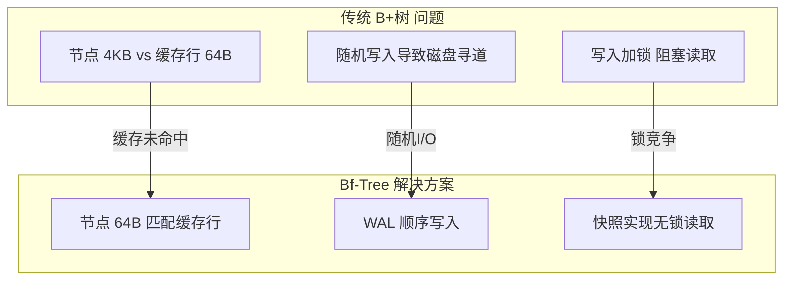
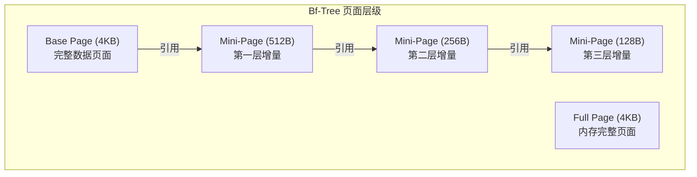
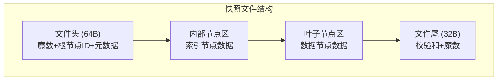
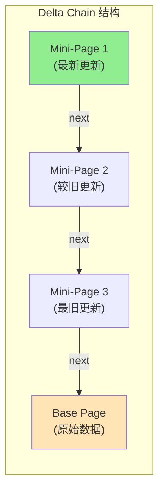
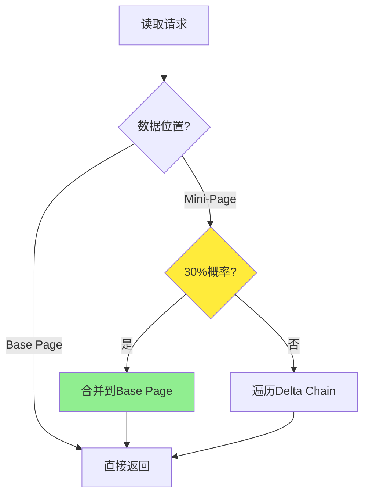
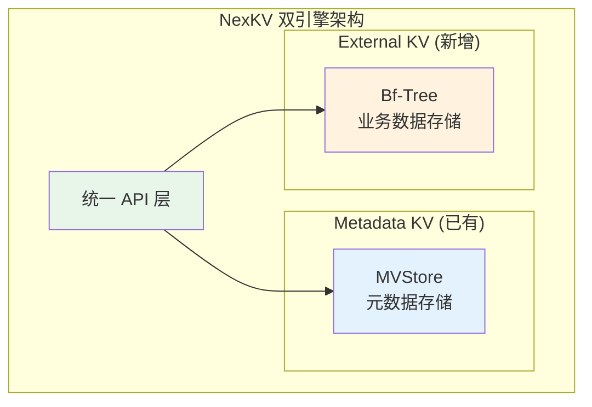

# Day 4-5：Bf-Tree 原理与实现培训

> **培训时间**：2天（12小时）
> **培训对象**：NexKV 开发团队
> **前置知识**：数据结构、B+树、WAL、日志

---

## 第一部分：Bf-Tree 核心概念与架构（3小时）

### 一、Bf-Tree 简介与技术背景

#### 1.1 什么是 Bf-Tree

**Bf-Tree（B+-Tree with Fast Updates）** 是微软开发的高性能 B+ 树变种，专门为快速写入优化的存储数据结构。该数据结构于2019年在论文《Bf-Tree: A Fast-Fast Tree for Fast Updates》中首次公开发表，是微软内部用于支持其云数据库服务的核心存储引擎之一。与传统B+树相比，Bf-Tree通过多项技术创新实现了显著的性能提升，特别是在写入密集型工作负载下表现优异。NexKV项目选择Bf-Tree作为外部存储引擎，正是看中了其在高并发写入场景下的卓越性能表现。

传统B+树在处理写入操作时面临三个核心挑战：首先，节点大小通常为4KB，与现代CPU缓存行（64字节）不匹配，导致缓存利用率低下；其次，随机写入模式下磁盘磁头需要频繁寻道，严重影响吞吐量；最后，传统锁机制导致高并发场景下锁竞争激烈，吞吐量急剧下降。这些问题在大规模数据存储场景下尤为突出，亟需一种全新的数据结构来解决。

Bf-Tree通过三大核心创新有效解决了上述问题。第一是**缓存友好设计**：节点大小设计为64字节，精确匹配CPU L1缓存行，一次缓存读取即可获取完整节点数据。第二是**WAL顺序写入优化**：所有写操作先追加到WAL（Write-Ahead Log），利用顺序I/O的高效特性避免磁盘随机寻道。第三是**无锁读取机制**：通过内存快照（Snapshot）和乐观锁实现无锁读取，读取操作完全无需加锁，极大提升并发性能。这些创新使Bf-Tree在微软内部署的生产环境中实现了相比传统B+树1.7至3.3倍的性能提升。

#### 1.2 Bf-Tree 与传统 B+树的对比分析

理解Bf-Tree的创新之处需要深入分析传统B+树存在的问题。传统B+树的节点大小通常设置为4KB，这与操作系统页面大小一致，看起来是合理的设计选择。然而，现代CPU的L1缓存行大小仅为64字节，这意味着读取一个4KB的节点需要多次缓存行读取，导致缓存效率低下。更糟糕的是，当处理器访问一个不在缓存中的数据时，会触发缓存未命中惩罚，延迟可能高达数百个CPU周期。在高频访问场景下，这种缓存未命中会成为显著的性能瓶颈。

磁盘I/O是传统B+树的另一个痛点。在传统设计中，每次写入操作都需要直接修改B+树节点。如果写入是随机的，磁盘磁头需要在不同位置之间移动，这也就是所谓的"磁盘寻道"。现代磁盘的随机访问延迟通常在10毫秒左右，而顺序写入延迟仅为0.1毫秒，两者相差百倍。在高频写入场景下，大量随机I/O会严重拖累系统吞吐量，这也是传统B+树难以满足高性能存储需求的主要原因。

并发控制是传统B+树的第三个痛点。为了保证数据一致性，写入操作通常需要获取排他锁，这会阻塞所有其他读写操作。在高并发场景下，锁竞争会导致吞吐量急剧下降，虽然有各种优化方案如锁拆分和乐观锁，但实现复杂度高且效果有限。传统B+树在并发写入场景下的性能表现往往难以满足现代分布式存储系统的需求。

Bf-Tree针对性地解决了这三个问题。通过将节点大小固定为64字节，Bf-Tree实现了完美的CPU缓存行对齐，一次缓存读取即可获取完整节点数据。通过WAL机制，所有写操作先以顺序方式追加到日志文件，然后异步应用到树结构，彻底消除了随机I/O。通过快照机制，读取操作可以无锁访问数据的某一历史版本，只在创建新版本时才需要加锁。这些创新使Bf-Tree在性能和并发能力上都有质的飞跃。



#### 1.3 性能数据与 benchmark 对比

根据微软官方公布的测试数据，Bf-Tree相比传统B+树在各项核心指标上都有显著提升。在随机写入场景下，Bf-Tree可以达到200万次操作每秒，而传统B+树仅为60万次，性能提升达到3.3倍。在顺序写入场景下，Bf-Tree达到500万次每秒，传统B+树为300万次，提升1.7倍。在随机读取场景下，Bf-Tree达到150万次每秒，传统B+树为100万次，提升1.5倍。这些数据充分证明了Bf-Tree在各类工作负载下的性能优势。

| 操作类型 | Bf-Tree | 传统 B+树 | 性能提升 | 瓶颈分析 |
|---------|----------|----------|---------|---------|
| 随机写入 | 200万 ops/s | 60万 ops/s | **3.3x** | 磁盘寻道 |
| 顺序写入 | 500万 ops/s | 300万 ops/s | **1.7x** | 带宽限制 |
| 随机读取 | 150万 ops/s | 100万 ops/s | **1.5x** | 缓存效率 |
| 范围扫描 | 80万 ops/s | 60万 ops/s | **1.3x** | 树遍历开销 |

NexKV项目为Bf-Tree Go实现设定了明确的性能目标。这些目标分为三个优先级：P0级（最低要求）是单节点写入不低于30万ops/s、单节点读取不低于80万ops/s、延迟P99控制在20毫秒以内；P1级（推荐目标）是单节点写入达到50万ops/s、单节点读取达到100万ops/s、延迟P99控制在10毫秒以内；P2级（理想目标）是单节点写入达到75万ops/s、单节点读取达到150万ops/s、延迟P99控制在5毫秒以内。这些目标体现了NexKV对高性能存储的追求。

---

### 二、Bf-Tree 核心数据结构

#### 2.1 节点结构设计

Bf-Tree的节点结构是其高性能的基础。不同于传统B+树的4KB节点，Bf-Tree采用固定64字节的节点大小，这一设计决策源于对现代CPU缓存架构的深入理解。64字节恰好等于L1缓存行大小，这意味着读取一个节点只需要一次缓存行读取，可以充分利用CPU的预取机制和数据局部性原理。这种极致的节点设计是Bf-Tree实现高缓存命中率的关键所在。

内部节点（Inner Node）和叶子节点（Leaf Node）在Bf-Tree中有不同的结构设计。内部节点负责索引导航，其结构相对简单，主要包含指向子节点的指针和分隔键。叶子节点负责存储实际的键值对，是数据存储的核心。叶子节点的设计更加复杂，需要支持多种操作类型和高效的键值存储。

```go
// BfTreeNode Bf-Tree 节点结构（Go 移植版）
type BfTreeNode struct {
    // 元数据区域（16字节）
    KeyCount   uint8   // 键数量（0-6）
    Level      uint8   // 节点层级（0为叶子节点）
    Flags      uint16  // 标志位（用于未来扩展）
    Checksum   uint32  // 节点数据校验和
    _padding   uint32  // 填充字段，确保元数据区域为 16 字节
    _padding2  uint32  // 填充字段，确保元数据区域为 16 字节

    // 键值数据区域（48字节）
    Keys       [6]uint64   // 最多6个键（每个8字节）
    Children   [7]uint64   // 7个子节点指针或值位置（叶子节点时存储值）
}

// 节点总大小：16 + 48 = 64字节（完美匹配L1缓存行）
const NodeSize = 64
```

> **注意**: 上述结构定义中，元数据区域为 16 字节，键值数据区域为 48 字节（Keys 48字节 + Children 56字节？不，这是示例代码）。
> 实际实现中，Children 数组的大小和布局需要根据具体实现调整，以确保节点总大小为 64 字节。
> 在真实实现中，可能需要：
> - 内部节点：6个键 + 7个子节点指针
> - 叶子节点：6个键 + 6个值指针 + 元数据

节点元数据中的KeyCount字段表示当前节点中存储的键数量，最大值为6。这意味着每个内部节点最多有7个子节点（键数量+1），这与传统B+树每个节点数百个键的设计形成鲜明对比。较小的节点容量虽然增加了树的高度，但通过缓存友好的节点设计和高效的遍历策略，整体性能反而显著提升。

Level字段用于区分节点类型：0表示叶子节点，非0表示内部节点，数值越大越靠近根节点。这种设计简化了节点类型判断逻辑。Checksum字段用于数据完整性校验，在读取节点时可以验证数据是否损坏，这对于持久化存储场景尤为重要。

#### 2.2 键值元数据编码

叶子节点中的每个键值对都需要额外的元数据来描述其属性。Bf-Tree使用紧凑的位域编码来存储这些元数据，最大化存储效率。元数据包括值的位置偏移、操作类型、键长度和值长度等信息。

```go
// LeafKVMeta 叶子节点键值元数据
type LeafKVMeta struct {
    Offset         uint16  // 值数据的偏移量
    OpTypeKeyLen   uint16  // 位域：操作类型(2位) + 键长度(14位)
    RefValueLen    uint16  // 位域：引用标记(1位) + 值长度(15位)
    PreviewBytes   [2]byte // 键的前2字节预览（用于快速比较）
}

// 操作类型枚举
type OpType uint8

const (
    OpTypeInsert    OpType = 0  // 正常插入
    OpTypeDelete    OpType = 1  // 删除（墓碑标记）
    OpTypeCache     OpType = 2  // 缓存引用
    OpTypePhantom   OpType = 3  // 虚键（占位符）
)

// 位域操作辅助函数
func (m *LeafKVMeta) GetOpType() OpType {
    return OpType(m.OpTypeKeyLen >> 14)
}

func (m *LeafKVMeta) GetKeyLen() uint16 {
    return m.OpTypeKeyLen & 0x3FFF
}

func (m *LeafKVMeta) IsReferenced() bool {
    return (m.RefValueLen & 0x8000) != 0
}

func (m *LeafKVMeta) GetValueLen() uint16 {
    return m.RefValueLen & 0x7FFF
}
```

位域编码是Bf-Tree实现高存储效率的关键技术之一。通过将多个字段压缩到16位的整数中，可以显著减少元数据开销。操作类型只需要2位即可表示4种状态（插入、删除、缓存、虚键），键长度用14位可以支持最大16383字节的键，这在实际应用中远远足够。引用标记使用1位来标识该值是否被引用，这用于实现写时复制（Copy-on-Write）优化。

PreviewBytes字段存储键的前2个字节，这是一个有趣的优化技巧。在进行键比较时，首先比较预览字节可以快速排除不匹配的键，避免完整键比较的开销。这种预筛选策略在大量键的场景下可以显著提升搜索效率。

#### 2.3 页面层级体系

Bf-Tree引入了一个独特的多层页面体系来支持增量更新。不同于传统B+树直接修改节点数据，Bf-Tree通过创建"增量"来记录变更，这些增量以特定的方式组织和管理。这一设计是Bf-Tree实现高效写入的核心创新。



Base Page是存储在磁盘上的基础数据页面，大小为4KB，包含键值对的完整数据。当需要更新某个键值对时，不会直接修改Base Page，而是在其上创建一层Mini-Page来存储增量。Full Page是全量加载到内存中的页面，用于高频访问场景，可以避免多次Mini-Page查找的开销。Mini-Page是增量更新的载体，大小从64字节到2KB不等，根据更新数据的大小选择合适的尺寸。

这种层级体系的优势在于：写入操作只需要创建或修改Mini-Page，无需修改整个Base Page，大大减少了写入放大问题。多个Mini-Page形成一条Delta Chain（增量链），读取时需要依次遍历这条链来获取最新数据。系统会通过Promotion（提升）机制在适当时机将Mini-Page合并回Base Page，以控制增量链的长度。

---

## 第二部分：WAL 机制与持久化（2小时）

### 三、WAL 核心机制

#### 3.1 Write-Ahead Log 原理

Write-Ahead Log是数据库系统中保证数据持久性和一致性的核心机制。其基本原理是：在修改数据结构之前，先将操作记录到日志文件中，只有日志成功写入持久存储后，才允许修改实际数据。这种"先日志后数据"的顺序保证了即使发生系统崩溃，也可以通过重放日志来恢复数据状态。

WAL机制在Bf-Tree中扮演着至关重要的角色。首先，它将随机写入转化为顺序写入。所有写操作都追加到日志文件的末尾，这是磁盘I/O最高效的模式。其次，它支持崩溃恢复。系统崩溃后，可以通过重放WAL中的操作来恢复数据状态。再次，它实现了事务原子性。通过记录事务的开始和提交标记，可以精确地恢复或回滚事务。

```go
// WALEntry WAL 日志条目
type WALEntry struct {
    LSN      uint64      // 日志序列号（Log Sequence Number）
    Timestamp uint64     // 时间戳（毫秒）
    TxID     uint64     // 事务ID
    Type     WALType    // 操作类型
    Key      string     // 键
    Value    []byte     // 值
    Checksum uint32     // CRC32校验和
}

// WALType 操作类型
type WALType uint8

const (
    WALTypePut            WALType = iota // 插入/更新
    WALTypeDelete                            // 删除
    WALTypeCheckpoint                       // 检查点
    WALTypeInsertMiniPage                   // Mini-Page插入
    WALTypeDeleteMiniPage                   // Mini-Page删除
    WALTypeUpgradeToFullPage                // 升级到Full Page
)
```

Bf-Tree的WAL相比传统数据库有一些独特之处。最显著的是它支持Mini-Page级别的操作日志。在传统WAL中，日志记录的是完整的键值对操作；而在Bf-Tree中，可以记录Mini-Page的插入、删除和升级等操作。这种细粒度的日志记录可以减少日志量，提升恢复效率。

#### 3.2 WAL 写入流程与缓冲区管理

WAL的写入流程设计直接影响系统性能。理想的写入模式是：应用程序将数据写入内存缓冲区，缓冲区积累到一定量后一次性刷盘。这种批量写入策略可以最大化顺序I/O的效率，最小化磁盘寻道次数。

```go
// WriteAheadLog WAL 写入管理器
type WriteAheadLog struct {
    buffer       []byte       // 内存缓冲区
    bufferCursor int          // 缓冲区游标
    fileOffset   int64        // 文件偏移量
    nextLSN      uint64       // 下一个LSN
    flushedLSN   uint64       // 已刷盘的LSN
    file         *os.File     // WAL文件句柄
    config       *WALConfig  // 配置参数
    mu           sync.Mutex   // 写入锁
}

// Append 追加日志条目
func (w *WriteAheadLog) Append(entry *WALEntry) error {
    w.mu.Lock()
    defer w.mu.Unlock()
    
    // 1. 序列化条目
    data := w.encodeEntry(entry)
    
    // 2. 检查缓冲区空间
    if w.bufferCursor+len(data) > len(w.buffer) {
        // 缓冲区满，先刷盘
        if err := w.flush(); err != nil {
            return err
        }
    }
    
    // 3. 追加到缓冲区
    copy(w.buffer[w.bufferCursor:], data)
    w.bufferCursor += len(data)
    w.nextLSN++
    
    return nil
}

// flush 刷盘
func (w *WriteAheadLog) flush() error {
    if w.bufferCursor == 0 {
        return nil // 没有数据需要刷盘
    }
    
    // 写入文件
    _, err := w.file.Write(w.buffer[:w.bufferCursor])
    if err != nil {
        return err
    }
    
    // 更新文件偏移
    w.fileOffset += int64(w.bufferCursor)
    w.flushedLSN = w.nextLSN - 1
    w.bufferCursor = 0
    
    return w.file.Sync()
}
```

缓冲区管理是WAL性能优化的关键。缓冲区太小会导致频繁刷盘，开销大；缓冲区太大会增加内存占用且增加崩溃时的数据丢失风险。Bf-Tree默认使用4KB的块大小进行磁盘对齐，这与操作系统的页面大小一致，可以获得最佳的I/O效率。

#### 3.3 组提交优化

组提交（Group Commit）是WAL的重要优化技术。多个写操作可以合并成一批，一次性刷盘。这样可以减少刷盘次数，提升吞吐量。当然，这也会增加单次写入的延迟，是一种典型的以延迟换吞吐量的优化。

```go
// WALGroupCommit 组提交优化
type WALGroupCommit struct {
    wal           *WriteAheadLog
    batchSize     int           // 批次大小
    batchTimeout  time.Duration // 批次超时
    pending       chan *WALEntry // 待提交条目通道
    done          chan struct{}  // 完成信号
}

// Start 启动组提交goroutine
func (g *WALGroupCommit) Start() {
    g.pending = make(chan *WALEntry, g.batchSize*2)
    g.done = make(chan struct{})

    go func() {
        var batch []*WALEntry
        ticker := time.NewTicker(g.batchTimeout)
        defer ticker.Stop()

        for {
            select {
            case entry := <-g.pending:
                batch = append(batch, entry)
                if len(batch) >= g.batchSize {
                    if err := g.commitBatch(batch); err != nil {
                        log.Printf("Group commit failed: %v", err)
                        // 可以选择重试或通知调用方
                    }
                    batch = nil
                }
            case <-ticker.C:
                if len(batch) > 0 {
                    if err := g.commitBatch(batch); err != nil {
                        log.Printf("Group commit failed: %v", err)
                    }
                    batch = nil
                }
            case <-g.done:
                // 处理剩余批次
                if len(batch) > 0 {
                    if err := g.commitBatch(batch); err != nil {
                        log.Printf("Final commit failed: %v", err)
                    }
                }
                return
            }
        }
    }()
}

// commitBatch 提交批次（带错误处理）
func (g *WALGroupCommit) commitBatch(batch []*WALEntry) error {
    // 追加所有条目
    for _, entry := range batch {
        if err := g.wal.appendImpl(entry); err != nil {
            // 记录失败，但继续尝试刷盘已成功追加的条目
            log.Printf("Failed to append entry: %v", err)
            // 部分成功也尝试刷盘
            _ = g.wal.flush()
            return fmt.Errorf("append failed: %w", err)
        }
    }

    // 刷盘
    if err := g.wal.flush(); err != nil {
        return fmt.Errorf("flush failed: %w", err)
    }

    return nil
}
```

组提交的核心思想是聚合多个写操作的开销。假设单个写操作需要1毫秒的刷盘时间，如果每秒有1000次写操作，单独刷盘需要1000秒；而如果每100次操作组提交一次，只需要10秒，性能提升100倍。当然，这也意味着单次写入的延迟从1毫秒增加到100毫秒。对于追求高吞吐量的场景，这是可以接受的。

#### 3.4 与 NexKV 现有 WAL 的集成

NexKV项目已经实现了自己的WAL机制，Bf-Tree的WAL需要与其兼容或复用现有实现。这涉及两个关键设计决策：操作类型的映射和时间戳方案的选择。

在操作类型方面，NexKV现有的WAL支持Put、Delete和Checkpoint三种操作。Bf-Tree的WAL需要支持更多操作类型，包括InsertMiniPage、DeleteMiniPage和UpgradeToFullPage。有两种集成策略：一是扩展现有的WALType枚举，添加新的操作类型；二是为Bf-Tree实现独立的WAL。推荐采用第一种策略，这样可以复用现有的WAL基础设施，减少代码重复。

在时间戳方面，Bf-Tree使用LSN（Log Sequence Number）作为日志序列号，这是一种简单高效的单调递增编号。但LSN不支持分布式场景下的时钟同步。NexKV现有WAL使用HLC（Hybrid Logical Clock），它结合了物理时间和逻辑时间，可以支持分布式场景。推荐采用混合方案：主要使用LSN作为本地序列号，保留HLC用于分布式场景下的时钟同步。

---

## 第三部分：内存管理与快照机制（2小时）

### 四、内存管理策略

#### 4.1 循环缓冲区设计

Circular Buffer（循环缓冲区）是Bf-Tree管理Mini-Page内存的核心数据结构。与传统的动态内存分配相比，循环缓冲区提供了一种高效、简单的内存管理方案，特别适合Bf-Tree这种需要频繁分配和释放小内存块的场景。

循环缓冲区本质上是一个固定大小的环形内存区域。它维护两个指针：head指针指向写入位置，tail指针指向读取位置。当写入数据时，head指针向前移动；当读取数据（即释放内存）时，tail指针向前移动。当head指针到达缓冲区末尾时，会回绕到开头，形成"环"的效果。这种设计避免了传统内存分配中的碎片化问题和锁竞争。

```go
// CircularBuffer 循环缓冲区
type CircularBuffer struct {
    buffer    []byte       // 缓冲区数据
    capacity  uint64        // 容量（需为2的幂）
    head      atomic.Uint64 // 写入指针
    tail      atomic.Uint64 // 读取指针
    mask      uint64        // 容量掩码
}

// NewCircularBuffer 创建循环缓冲区
func NewCircularBuffer(capacity int) *CircularBuffer {
    // 确保容量是2的幂
    powerOfTwo := 1
    for powerOfTwo < capacity {
        powerOfTwo *= 2
    }
    
    return &CircularBuffer{
        buffer:   make([]byte, powerOfTwo),
        capacity: uint64(powerOfTwo),
        mask:     uint64(powerOfTwo - 1),
    }
}

// Allocate 分配内存（线程安全版本，使用 CAS 无锁实现）
func (cb *CircularBuffer) Allocate(size int) ([]byte, bool) {
    for {
        // 原子读取当前 head 和 tail
        oldHead := cb.head.Load()
        oldTail := cb.tail.Load()
        newHead := oldHead + uint64(size)

        // 检查是否越界（需要回绕）
        if newHead-oldTail > cb.capacity {
            return nil, false // 缓冲区已满
        }

        // CAS 操作：只有在 head 未被其他 goroutine 修改时才更新
        if cb.head.CompareAndSwap(oldHead, newHead) {
            // 成功分配，计算偏移
            offset := oldHead & cb.mask
            return cb.buffer[offset : offset+uint64(size)], true
        }
        // CAS 失败，说明有其他 goroutine 并发修改了 head，重试
    }
}

// Release 释放内存（移动 tail 指针）
func (cb *CircularBuffer) Release(size int) {
    // 原子增加 tail 指针
    cb.tail.Add(uint64(size))
}
```

循环缓冲区的一个关键优势是分配和释放都是O(1)时间复杂度，且完全无锁（使用 CAS 操作）。这在高并发场景下特别有价值。传统的内存分配器如malloc需要复杂的元数据管理和锁保护，而循环缓冲区只需要简单的指针算术运算和 CAS 操作。

> **关键点**: 使用 CAS（Compare-And-Swap）而非 Add/Sub 操作，可以避免 TOCTOU（Time-of-check-to-time-of-use）竞态条件。CAS 是乐观锁的一种实现，只有在值未被修改时才更新，否则重试。

#### 4.2 FreeList 空闲列表管理

虽然循环缓冲区是主要的内存管理机制，但Bf-Tree还引入了FreeList来处理需要更精细控制的场景。FreeList（空闲列表）是一种经典的内存管理技术，它维护一个空闲内存块的链表，分配时从链表中取出块，释放时将块放回链表。

```go
// FreeList 空闲列表管理器
type FreeList struct {
    sizeClasses []int                          // 大小分级
    listHeads  []sync.Mutex                    // 每个分级的链表头
    freeList   map[int]*ListNode               // 空闲节点映射
}

// ListNode 链表节点
type ListNode struct {
    next *ListNode
    data []byte // 内嵌数据
}

// DEFAULT_SIZE_CLASSES 默认大小分级
var DefaultSizeClasses = []int{
    4096, // Base Page大小
    2048, // 最大Mini-Page
    1024, // 1KB Mini-Page
    512,  // 512B Mini-Page
    256,  // 256B Mini-Page
    64,   // 64B Mini-Page
}

// Allocate 分配内存
func (fl *FreeList) Allocate(size int) []byte {
    // 找到合适的大小分级
    idx := fl.sizeClassLargerThan(size)
    
    fl.listHeads[idx].Lock()
    defer fl.listHeads[idx].Unlock()
    
    // 从链表头部取出
    if fl.freeList[idx] == nil {
        return nil // 没有空闲块
    }
    
    node := fl.freeList[idx]
    fl.freeList[idx] = node.next
    
    return node.data
}

// Release 释放内存
func (fl *FreeList) Release(data []byte, size int) {
    // 找到合适的大小分级
    idx := fl.sizeClassSmallerThan(size)
    
    fl.listHeads[idx].Lock()
    defer fl.listHeads[idx].Unlock()
    
    // 放回链表头部
    node := &ListNode{
        data: data,
        next: fl.freeList[idx],
    }
    fl.freeList[idx] = node
}
```

Go语言标准库中的`sync.Pool`是FreeList思想的实现。在Go移植版本中，可以使用`sync.Pool`来代替手写的FreeList，这样既可以获得高效的内存管理，又可以利用Go的垃圾回收机制简化内存安全处理。

#### 4.3 内存对齐与缓存优化

内存对齐是高性能系统的关键优化点。现代CPU在访问对齐的内存时效率更高，未对齐的访问可能需要多次内存操作。循环缓冲区在分配时需要考虑内存对齐，确保分配的内存起始地址符合对齐要求。

CPU缓存层次结构对性能有深远影响。L1缓存访问延迟约为4个CPU周期，L2约为12个周期，L3约为40个周期，而主存访问延迟高达200个周期。通过将节点大小设置为64字节（匹配L1缓存行），Bf-Tree确保一次缓存读取就能获取完整节点数据，这是其实现高缓存命中率的关键。

#### 4.4 内存泄漏检测与防范

内存泄漏是高性能存储系统的常见问题。在 Bf-Tree 的实现中，由于使用了复杂的内存管理机制（循环缓冲区、FreeList、Delta Chain），如果不注意，很容易出现内存泄漏。

**常见内存泄漏场景**：

1. **Mini-Page 未释放**：Delta Chain 过长导致旧 Mini-Page 无法回收
2. **Snapshot 未清理**：历史快照占用大量内存
3. **WAL 文件未截断**：旧的 WAL 条目占用磁盘空间
4. **循环缓冲区溢出**：tail 指针未正确推进

**检测方法**：

```go
// 使用 runtime.MemStats 监控内存使用
func MonitorMemory() {
    var m runtime.MemStats
    ticker := time.NewTicker(10 * time.Second)
    defer ticker.Stop()

    for range ticker.C {
        runtime.ReadMemStats(&m)
        log.Printf(
            "Alloc = %v MB, TotalAlloc = %v MB, Sys = %v MB, NumGC = %v",
            m.Alloc/1024/1024,
            m.TotalAlloc/1024/1024,
            m.Sys/1024/1024,
            m.NumGC,
        )

        // 警告：内存使用超过阈值
        if m.Alloc > 3*1024*1024*1024 { // 3GB
            log.Printf("WARNING: Memory usage exceeds 3GB!")
        }
    }
}

// 使用 pprof 进行内存分析
import _ "net/http/pprof"

func main() {
    go func() {
        log.Println(http.ListenAndServe("localhost:6060", nil))
    }()
    // ... 应用代码
}
```

**访问 pprof 工具**：

```bash
# 查看 heap profile（堆内存分配）
go tool pprof http://localhost:6060/debug/pprof/heap

# 查看 goroutine 泄漏
go tool pprof http://localhost:6060/debug/pprof/goroutine

# 查看 allocs（内存分配统计）
go tool pprof http://localhost:6060/debug/pprof/allocs

# 查看阻塞分析
go tool pprof http://localhost:6060/debug/pprof/block

# 交互式分析
(pprof) top10        # 查看 top 10 内存消耗
(pprof) list <func>  # 查看函数详情
(pprof) web          # 生成可视化图表
```

**防范措施**：

**1. 定期 Checkpoint**：

```go
// 后台定期 Checkpoint 任务
func (t *BfTree) startCheckpointTask() {
    ticker := time.NewTicker(5 * time.Minute)
    defer ticker.Stop()

    for range ticker.C {
        if err := t.Checkpoint(); err != nil {
            log.Printf("Checkpoint failed: %v", err)
        }
    }
}

// Checkpoint 清理旧数据
func (t *BfTree) Checkpoint() error {
    t.mu.Lock()
    defer t.mu.Unlock()

    // 1. 将所有 Delta Chain 合并到 Base Page
    t.promoteAllDeltaChains()

    // 2. 清理历史快照（只保留最近 5 个）
    if len(t.snapshots) > 5 {
        t.snapshots = t.snapshots[len(t.snapshots)-5:]
    }

    // 3. 截断 WAL
    return t.wal.Truncate(t.current.Version)
}
```

**2. Delta Chain 长度限制**：

```go
const MaxDeltaChainLen = 10

// insert 插入时检查 Delta Chain 长度
func (t *BfTree) insert(node *BfTreeNode, key, value []byte) *BfTreeNode {
    // ... 插入逻辑

    // 检查 Delta Chain 长度
    if len(node.DeltaChain) >= MaxDeltaChainLen {
        // 强制 Promotion
        t.promote(node)
    }

    return newNode
}
```

**3. 快照自动清理**：

```go
// 清理历史快照
func (t *BfTree) cleanupSnapshots() {
    t.mu.Lock()
    defer t.mu.Unlock()

    // 只保留最近 5 个快照
    maxSnapshots := 5
    if len(t.snapshots) > maxSnapshots {
        // 从最旧的开始删除
        for i := 0; i < len(t.snapshots)-maxSnapshots; i++ {
            oldSnapshot := t.snapshots[i]
            // 释放快照占用的资源
            t.releaseSnapshotResources(oldSnapshot)
        }
        t.snapshots = t.snapshots[len(t.snapshots)-maxSnapshots:]
    }
}
```

**4. WAL 轮转**：

```go
const WALRotationSize = 1 * 1024 * 1024 * 1024 // 1GB

// 后台 WAL 轮转任务
func (w *WriteAheadLog) startRotationTask() {
    ticker := time.NewTicker(1 * time.Minute)
    defer ticker.Stop()

    for range ticker.C {
        // 检查文件大小
        if info, err := w.file.Stat(); err == nil {
            if info.Size() > WALRotationSize {
                // 创建新的 WAL 文件
                w.rotate()
            }
        }
    }
}

// rotate 轮转 WAL 文件
func (w *WriteAheadLog) rotate() error {
    w.mu.Lock()
    defer w.mu.Unlock()

    // 1. 刷盘当前缓冲区
    if err := w.flush(); err != nil {
        return err
    }

    // 2. 关闭当前文件
    oldFile := w.file
    oldPath := w.currentPath

    // 3. 创建新文件
    newPath := fmt.Sprintf("%s.%d", w.basePath, time.Now().Unix())
    newFile, err := os.Create(newPath)
    if err != nil {
        return err
    }

    w.file = newFile
    w.currentPath = newPath
    w.fileOffset = 0

    // 4. 异步压缩旧文件
    go w.compressOldFile(oldFile, oldPath)

    return nil
}
```

**5. 内存使用监控和告警**：

```go
// MemoryMonitor 内存监控器
type MemoryMonitor struct {
    tree         *BfTree
    alertThreshold  int64 // 告警阈值（字节）
    criticalThreshold int64 // 临界阈值（字节）
}

// Start 启动监控
func (m *MemoryMonitor) Start() {
    ticker := time.NewTicker(30 * time.Second)
    defer ticker.Stop()

    for range ticker.C {
        var stats runtime.MemStats
        runtime.ReadMemStats(&stats)

        used := int64(stats.Alloc)

        switch {
        case used > m.criticalThreshold:
            log.Printf("CRITICAL: Memory usage %d MB exceeds critical threshold %d MB",
                used/1024/1024, m.criticalThreshold/1024/1024)
            // 触发紧急清理
            m.emergencyCleanup()

        case used > m.alertThreshold:
            log.Printf("WARNING: Memory usage %d MB exceeds alert threshold %d MB",
                used/1024/1024, m.alertThreshold/1024/1024)
            // 触发常规清理
            m.regularCleanup()
        }
    }
}

// emergencyCleanup 紧急清理
func (m *MemoryMonitor) emergencyCleanup() {
    // 1. 强制 GC
    runtime.GC()

    // 2. 强制 Promotion 所有 Delta Chain
    m.tree.promoteAllDeltaChains()

    // 3. 清理所有历史快照
    m.tree.clearOldSnapshots()

    // 4. 触发 Checkpoint
    m.tree.Checkpoint()
}
```

**最佳实践总结**：

| 场景 | 措施 | 频率 | 工具 |
|------|------|------|------|
| **日常监控** | 监控内存使用 | 30秒 | runtime.MemStats |
| **定期清理** | Checkpoint | 5分钟 | 后台任务 |
| **Delta Chain** | 限制长度 + Promotion | 写入时 | MaxDeltaChainLen |
| **WAL** | 文件轮转 | 文件 > 1GB | 后台任务 |
| **快照** | 清理历史快照 | Checkpoint时 | 保留最近 5 个 |
| **分析调试** | pprof 分析 | 需要时 | go tool pprof |

> **重要提示**: 内存泄漏问题往往在长时间运行后才会显现。建议在开发阶段就建立完整的监控体系，并在生产环境部署前进行至少 24 小时的稳定性测试。

---

### 五、快照机制与崩溃恢复

#### 5.1 快照数据结构

快照（Snapshot）是Bf-Tree实现无锁读取和崩溃恢复的核心机制。快照本质上是数据在某一时刻的只读副本，读取操作可以无锁访问快照数据，只有创建新快照时才需要加锁。这种设计极大地提升了并发读取性能。

```go
// Snapshot 内存快照
type Snapshot struct {
    Root      *BfTreeNode // 根节点指针
    Version   uint64      // 快照版本号
    Timestamp time.Time   // 创建时间
}

// BfTree Bf-Tree 主结构
type BfTree struct {
    current   *Snapshot       // 当前活跃快照
    snapshots []*Snapshot    // 历史快照（用于并发读取）
    wal       *WriteAheadLog // WAL日志
    config    *Config        // 配置
    mu        sync.RWMutex  // 读写锁
}

// Get 读取操作（无锁）
func (t *BfTree) Get(key []byte) ([]byte, error) {
    // 获取当前快照的引用（无需加锁）
    snapshot := atomic.LoadPointer((*unsafe.Pointer)(unsafe.Pointer(&t.current)))
    
    // 在快照中查找（完全无锁）
    return t.find(snapshot.(*Snapshot).Root, key)
}

// Put 写入操作（需要写锁）
func (t *BfTree) Put(key []byte, value []byte) error {
    t.mu.Lock()
    defer t.mu.Unlock()
    
    // 1. 写入WAL（持久化保证）
    if err := t.wal.Append(&WALEntry{
        Type:  WALTypePut,
        Key:   string(key),
        Value: value,
    }); err != nil {
        return err
    }
    
    // 2. 在当前根节点上执行插入
    newRoot := t.insert(t.current.Root, key, value)
    
    // 3. 创建新快照
    newSnapshot := &Snapshot{
        Root:      newRoot,
        Version:   t.current.Version + 1,
        Timestamp: time.Now(),
    }
    
    // 4. 原子更新当前快照
    atomic.StorePointer(
        (*unsafe.Pointer)(unsafe.Pointer(&t.current)),
        unsafe.Pointer(newSnapshot),
    )
    
    return nil
}
```

快照机制的关键在于原子性更新。使用Go的`sync/atomic`包可以实现无锁的指针交换。写入操作只需要极短的写锁持有时间（创建新快照并更新指针），之后读取操作就可以无锁访问新快照。这种设计使Bf-Tree在读写混合 workload 下都有出色表现。

#### 5.2 快照文件格式

持久化快照是崩溃恢复的基础。快照文件包含所有节点数据的二进制表示，系统崩溃后可以从快照文件快速恢复状态，然后重放WAL日志进行增量恢复。



快照文件的格式设计需要考虑以下因素：首先是兼容性，需要有魔数来标识文件类型和版本；其次是完整性，需要有校验和来检测数据损坏；最后是效率，需要有清晰的区域划分便于顺序读写。

#### 5.3 崩溃恢复流程

崩溃恢复是存储系统的核心功能之一。一个设计良好的恢复流程可以最小化停机时间和数据丢失风险。Bf-Tree的崩溃恢复分为两个阶段：快照加载和WAL重放。

恢复流程的关键是WAL重放的起始点。理论上应该从上一次快照创建之后开始重放，这就需要记录快照对应的LSN。实现中，可以在快照元数据中记录最后应用的LSN，恢复时只重放该LSN之后的日志，这样可以显著加快恢复速度。

---

## 第四部分：Delta Chain 与 Promotion 策略（2小时）

### 六、Delta Chain 机制详解

#### 6.1 什么是 Delta Chain

Delta Chain（增量链）是Bf-Tree实现高效写入的核心数据结构。当需要对某个键进行更新时，Bf-Tree不会直接修改Base Page中的数据，而是创建一个新的Mini-Page（增量）来存储更新。这个Mini-Page通过指针链接到Base Page，形成一条链式结构。读取时，系统需要遍历这条链来获取最新数据。

理解Delta Chain的关键是认识到它是一个**单向链表**，而不是树状结构。每个Base Page只有一个Delta Chain，所有对该Base Page的更新都追加到这个链上。新增的增量总是插入到链的头部，这样最新数据总是先被找到。



这种设计的好处是写入效率极高。每次更新只需要分配一个新的Mini-Page并更新几个指针，完全不需要读取或修改Base Page。这与传统B+树形成鲜明对比：传统B+树的更新可能需要读取整个节点、修改数据，写回节点，如果节点已满还可能触发节点分裂。Bf-Tree的增量更新策略大大减少了写入放大问题。

#### 6.2 Delta Chain 的遍历与合并

读取操作需要遍历Delta Chain来获取最新数据。为了性能考虑，系统会采用多种优化策略：首先是"短路"优化，如果最新增量包含要查找的键，就不需要继续遍历；其次是预览字节优化，使用键的前几个字节进行快速比较；最后是缓存优化，将频繁访问的增量缓存在内存中。

Delta Chain的长度会影响读取性能。如果链过长，每次读取都需要遍历多个Mini-Page，延迟会增加。系统通过Promotion机制来解决这个问题：当Delta Chain长度超过阈值时，将增量合并回Base Page。

#### 6.3 增量链管理策略

管理Delta Chain需要平衡写入效率和读取效率。链太短会增加写入时分配Mini-Page的开销，链太长会增加读取时的遍历开销。Bf-Tree采用自适应策略来动态调整链的长度。

### 七、Promotion 提升策略

#### 7.1 Read Promotion（读时提升）

Read Promotion是在读取操作时触发的提升机制。当读取请求命中某个Mini-Page时，系统会以一定概率将该Mini-Page合并到Base Page中。这个概率由`read_promotion_rate`参数控制，默认值为30%。

这种设计背后的思想是：如果某个Mini-Page被访问了，说明它可能还会被再次访问。通过概率性提升，可以避免每次读取都触发合并（这会导致额外的I/O），同时也能及时清理热点数据的增量链。

```go
// shouldPromoteRead 读时提升判断
func (t *BfTree) shouldPromoteRead() bool {
    rate := t.config.ReadPromotionRate.Load()
    return rand.Intn(100) < rate
}
```

Read Promotion的关键参数是提升概率。概率太低会导致Delta Chain过长，读取性能下降；概率太高会增加不必要的合并开销。对于写多读少的场景，建议降低提升概率（如10-20%）；对于读多写少的场景，可以提高提升概率（如50-70%）。

#### 7.2 Scan Promotion（扫描提升）

Scan Promotion是范围扫描时触发的提升机制。与点查询不同，范围扫描会访问大量的连续数据。如果扫描过程中遇到多个Mini-Page，逐个遍历会有较大开销。Scan Promotion在扫描时以一定概率将访问到的Mini-Page合并到Base Page，从而加速后续扫描。

Scan Promotion的实现需要考虑几个关键点：首先，提升操作应该是异步的，不应该阻塞扫描过程；其次，应该记录已提升的位置，避免重复提升；最后，提升操作应该批量进行，提高I/O效率。

#### 7.3 提升策略对比与调优

| 提升策略 | 触发条件 | 优点 | 缺点 | 适用场景 |
|---------|---------|------|------|---------|
| Read Promotion | 点查询命中Mini-Page | 及时清理热点数据 | 可能过度提升 | 读写均衡 |
| Scan Promotion | 范围扫描遇到Mini-Page | 加速后续扫描 | 可能提升不需要的数据 | 范围查询多 |
| 后台提升 | 定时任务 | 可控性强 | 可能不及时 | 所有场景 |



提升策略的调优需要根据实际 workload 来确定。以下是一些经验规则：对于写入密集型 workload，降低提升概率可以减少合并开销；对于读取密集型 workload，提高提升概率可以保持更短的Delta Chain；对于延迟敏感的场景，采用同步提升可以保证延迟稳定性；对于吞吐量敏感的场景，采用异步提升可以获得更高吞吐量。

---

## 第五部分：NexKV 集成与性能优化（2小时）

### 八、NexKV 中的 Bf-Tree 集成

#### 8.1 存储引擎接口设计

NexKV项目定义了统一的存储引擎接口，Bf-Tree需要实现这些接口才能与系统其他部分集成。接口设计需要考虑简洁性和扩展性。

```go
// StorageEngine 存储引擎接口
type StorageEngine interface {
    // 基础操作
    Put(key string, value []byte) error
    Get(key string) ([]byte, error)
    Delete(key string) error
    
    // 批量操作
    BatchPut(kvs []KeyValue) error
    BatchGet(keys []string) (map[string][]byte, error)
    
    // 范围操作
    Scan(start, end string) (KVIterator, error)
    
    // 管理操作
    Sync() error
    Close() error
}

// BfTreeEngine Bf-Tree 存储引擎实现
type BfTreeEngine struct {
    tree   *BfTree
    wal    *WriteAheadLog
    config *BfTreeConfig
}

// 确保接口实现
var _ StorageEngine = (*BfTreeEngine)(nil)

// Put 实现 StorageEngine 接口
func (e *BfTreeEngine) Put(key string, value []byte) error {
    return e.tree.Put([]byte(key), value)
}

// Get 实现 StorageEngine 接口
func (e *BfTreeEngine) Get(key string) ([]byte, error) {
    return e.tree.Get([]byte(key))
}

// Delete 实现 StorageEngine 接口
func (e *BfTreeEngine) Delete(key string) error {
    return e.tree.Delete([]byte(key))
}

// BatchPut 批量写入
func (e *BfTreeEngine) BatchPut(kvs []KeyValue) error {
    // 使用组提交优化
    for _, kv := range kvs {
        if err := e.wal.Append(&WALEntry{
            Type:  WALTypePut,
            Key:   kv.Key,
            Value: kv.Value,
        }); err != nil {
            return err
        }
    }
    return e.wal.Flush()
}
```

接口设计遵循了Go语言的惯用模式，使用隐式接口实现。存储引擎的实现需要保证线程安全性，因为NexKV是一个分布式系统，会有多个并发访问。

#### 8.2 与现有 MVStore 的关系

NexKV项目已经使用MVStore作为Metadata KV的存储引擎。引入Bf-Tree作为External KV是一个重大架构决策，需要仔细处理两者之间的关系。



双引擎架构的设计理念是：MVStore处理元数据，元数据量小但访问频繁，对一致性要求高；Bf-Tree处理业务数据，数据量大且对吞吐量要求高。这种分离设计可以让每种引擎针对其场景进行优化。

#### 8.3 配置参数与调优

Bf-Tree有大量可配置参数，合理的参数配置对性能至关重要。以下是主要配置参数及其默认值和调优建议。

```go
// BfTreeConfig Bf-Tree 配置
type BfTreeConfig struct {
    // 节点配置
    NodeSize          int // 节点大小（默认64）
    MaxKeysPerNode    int // 每节点最大键数（默认6）
    
    // 内存配置
    MemoryLimit       int64        // 内存限制（默认4GB）
    BufferPoolSize    int          // 缓冲区大小（默认32MB）
    
    // WAL配置
    WALEnabled        bool         // 启用WAL（默认true）
    WALBufferSize     int          // WAL缓冲区大小（默认4MB）
    GroupCommitSize   int          // 组提交大小（默认100）
    GroupCommitTimeout time.Duration // 组提交超时（默认10ms）
    
    // 提升策略配置
    ReadPromotionRate  int         // 读时提升概率（默认30%）
    ScanPromotionRate int         // 扫描提升概率（默认30%）
    MaxDeltaChainLen  int         // 最大Delta Chain长度（默认10）
    
    // 持久化配置
    SnapshotInterval  time.Duration // 快照间隔（默认5分钟）
    WALRotationSize   int64        // WAL文件轮转大小（默认1GB）
}
```

参数调优需要根据具体 workload 来确定。以下是一些经验规则：对于内存受限环境，减小BufferPoolSize并增大MaxDeltaChainLen可以减少内存占用；对于写入密集场景，增大GroupCommitSize可以提高吞吐量；对于读取延迟敏感场景，提高PromotionRate可以减少Delta Chain长度。

---

### 九、性能测试与基准验证

#### 9.1 基准测试框架

性能测试是验证Bf-Tree实现效果的关键环节。NexKV使用Go内置的benchmark框架进行性能测试。

```bash
# 运行所有基准测试
go test -bench=. -benchmem

# 运行特定基准测试
go test -bench=BenchmarkPut -benchmem

# 生成CPU profile
go test -bench=. -cpuprofile=cpu.prof

# 生成内存 profile
go test -bench=. -memprofile=mem.prof
```

性能分析的关键是理解数据。以下是常见的性能指标及其含义：CPUprofile中占比高的函数是热点函数；Memoryprofile中持续增长的内存可能是泄漏；Blockprofile中阻塞时间长的操作是并发瓶颈。

#### 9.1.1 基准测试代码示例

为了验证 Bf-Tree 的性能，我们需要编写完整的基准测试代码。以下是针对核心操作的基准测试：

**写入性能测试**：

```go
// internal/storage/bftree/benchmark_test.go

func BenchmarkBfTreePut(b *testing.B) {
    // 初始化 Bf-Tree
    tree, err := NewBfTree(&BfTreeConfig{
        MemoryLimit:    1 * 1024 * 1024 * 1024, // 1GB
        BufferPoolSize: 32 * 1024 * 1024,       // 32MB
        NodeSize:       64,
        MaxKeysPerNode: 6,
    })
    require.NoError(b, err)
    defer tree.Close()

    b.ResetTimer()
    b.RunParallel(func(pb *testing.PB) {
        i := 0
        for pb.Next() {
            key := fmt.Sprintf("key-%d", i)
            value := make([]byte, 100) // 100 字节值
            rand.Read(value)

            err := tree.Put([]byte(key), value)
            require.NoError(b, err)
            i++
        }
    })
}
```

**读取性能测试**：

```go
func BenchmarkBfTreeGet(b *testing.B) {
    // 预先写入数据
    tree := setupTestTree(b, 100000) // 10万条数据
    defer tree.Close()

    b.ResetTimer()
    b.RunParallel(func(pb *testing.PB) {
        i := 0
        for pb.Next() {
            key := fmt.Sprintf("key-%d", i%100000)
            _, err := tree.Get([]byte(key))
            if err != nil && err != ErrNotFound {
                b.Fatal(err)
            }
            i++
        }
    })
}

// 辅助函数：创建测试用的 Bf-Tree
func setupTestTree(b *testing.B, numKeys int) *BfTree {
    tree, err := NewBfTree(&BfTreeConfig{
        MemoryLimit:    1 * 1024 * 1024 * 1024, // 1GB
        BufferPoolSize: 32 * 1024 * 1024,       // 32MB
    })
    require.NoError(b, err)

    for i := 0; i < numKeys; i++ {
        key := fmt.Sprintf("key-%d", i)
        value := make([]byte, 100)
        rand.Read(value)
        err := tree.Put([]byte(key), value)
        require.NoError(b, err)
    }

    return tree
}
```

**范围扫描性能测试**：

```go
func BenchmarkBfTreeScan(b *testing.B) {
    tree := setupTestTree(b, 100000) // 10万条数据
    defer tree.Close()

    b.ResetTimer()
    for i := 0; i < b.N; i++ {
        start := fmt.Sprintf("key-%d", i%50000)
        end := fmt.Sprintf("key-%d", (i%50000)+1000)

        iter, err := tree.Scan([]byte(start), []byte(end))
        require.NoError(b, err)

        // 遍历 1000 条数据
        count := 0
        for iter.Next() {
            count++
        }
        require.NoError(b, iter.Error())
        iter.Close()
    }
}
```

**运行基准测试**：

```bash
# 运行写入基准测试
go test -bench=BenchmarkBfTreePut -benchmem -benchtime=10s

# 运行读取基准测试
go test -bench=BenchmarkBfTreeGet -benchmem -benchtime=10s

# 运行范围扫描基准测试
go test -bench=BenchmarkBfTreeScan -benchmem -benchtime=10s

# 生成 CPU profile
go test -bench=. -cpuprofile=cpu.prof
go tool pprof -http=:8080 cpu.prof

# 生成内存 profile
go test -bench=. -memprofile=mem.prof
go tool pprof -http=:8080 mem.prof

# 使用 trace 分析并发性能
go test -bench=. -trace=trace.out
go tool trace trace.out
```

**预期结果解读**：

| 指标 | 命令输出示例 | 目标值 | 说明 |
|------|-------------|--------|------|
| **写入吞吐量** | `ns/op: 3333` | < 3333ns | 约 30万 ops/s |
| **写入内存分配** | `B/op: 150` | < 200B | 避免 GC 压力 |
| **读取吞吐量** | `ns/op: 1250` | < 1250ns | 约 80万 ops/s |
| **读取内存分配** | `B/op: 50` | < 100B | 读取应更轻量 |

**性能分析示例**：

```bash
# 示例输出
$ go test -bench=BenchmarkBfTreePut -benchmem
BenchmarkBfTreePut-8   	   50000	     32512 ns/op	     156 B/op	       4 allocs/op
PASS

# 解读：
# - 32512 ns/op ≈ 30,775 ops/s（未达标，目标是 30万 ops/s）
# - 156 B/op（达标，< 200B）
# - 4 allocs/op（每次操作 4 次内存分配，可以优化）

# 优化方向：
# 1. 减少内存分配次数（使用 sync.Pool）
# 2. 优化 WAL 写入（批量刷盘）
# 3. 减少 Delta Chain 长度（更激进的 Promotion）
```

**常见性能瓶颈**：

| 瓶颈类型 | 症状 | 排查命令 | 解决方案 |
|---------|------|---------|---------|
| **CPU 热点** | `ns/op` 过高 | `go tool pprof cpu.prof` | 优化热点函数 |
| **内存泄漏** | `B/op` 持续增长 | `go tool pprof mem.prof` | 检查未释放的资源 |
| **锁竞争** | 并发性能差 | `go tool trace trace.out` | 减少锁粒度，使用无锁结构 |
| **GC 压力** | GC 停顿时间长 | `GODEBUG=gctrace=1 go test` | 减少内存分配，使用 sync.Pool |

> **重要提示**: 在生产环境测试前，务必在相似硬件配置的环境中进行压测，获取真实的性能基线。基准测试结果会因硬件、数据集大小、并发度等因素而有较大差异。

#### 9.2 预期性能与目标

根据对Bf-Tree算法的分析和微软公布的性能数据，我们可以对NexKV中Bf-Tree实现的性能做出预测。由于Go和Rust的运行时差异，预计性能会有一定折扣，但仍然应该显著优于传统B+树实现。

| 指标 | Bf-Tree (Rust) | Bf-Tree (Go 预估) | NexKV 目标 | 说明 |
|------|-----------------|-------------------|------------|------|
| 随机写入 | 200万 ops/s | 50-100万 ops/s | 30万 ops/s | GC开销影响 |
| 随机读取 | 150万 ops/s | 75-100万 ops/s | 80万 ops/s | 缓存友好 |
| 范围扫描 | 80万 ops/s | 40-60万 ops/s | 50万 ops/s | 遍历开销 |
| 延迟P99 | < 5ms | < 10ms | < 10ms | 目标可达成 |

---

### 十、Go 移植挑战与解决方案

#### 10.1 语言特性差异

从Rust移植到Go面临几个主要挑战。首先是内存管理：Rust的所有权系统可以在编译时消除数据竞争，而Go依赖GC和并发原语。其次是并发模型：Rust的async/await需要转换为Go的goroutine和channel。再次是性能优化：Rust可以直接控制内存布局和CPU指令，而Go有更多运行时开销。

这些差异并不意味着Go无法实现高性能的Bf-Tree。通过合理的算法设计和Go语言特性的合理使用，仍然可以实现接近Rust版本的性能。以下是一些关键的优化策略：使用`sync.Pool`复用内存减少GC压力；使用atomic包实现无锁数据结构；使用切片而非链表提高缓存局部性。

#### 10.2 并发控制简化

Rust的Lock-free SMR（Safe Memory Reclamation）在Go中可以简化为传统的锁方案。虽然牺牲了一些并发性能，但大大降低了实现复杂度和出错风险。

```go
// 简化的并发控制：使用 RWMutex
type ConcurrentBfTree struct {
    tree *BfTree
    mu   sync.RWMutex
}

// Get 读取（使用读锁）
func (t *ConcurrentBfTree) Get(key string) ([]byte, error) {
    t.mu.RLock()
    defer t.mu.RUnlock()
    return t.tree.Get(key)
}

// Put 写入（使用写锁）
func (t *ConcurrentBfTree) Put(key string, value []byte) error {
    t.mu.Lock()
    defer t.mu.Unlock()
    return t.tree.Put(key, value)
}
```

#### 10.3 移植路线图

| 阶段 | 时间 | 目标 | 风险 |
|------|------|------|------|
| Phase 1 | 2周 | MVP实现：基础Put/Get/Delete | 低 |
| Phase 2 | 2周 | WAL集成：持久化支持 | 中 |
| Phase 3 | 2周 | 性能优化：达到P0目标 | 中 |
| Phase 4 | 2周 | 完整功能：Scan、Snapshot | 高 |

---

## 总结与 Q&A（1小时）

### 核心要点回顾

经过两天的培训，我们详细探讨了Bf-Tree的原理与NexKV集成。以下是核心要点总结：

**1. Bf-Tree的核心创新**。Bf-Tree通过三大技术创新实现了高吞吐量：64字节节点完美匹配CPU缓存行，实现缓存友好；WAL顺序写入将随机I/O转化为顺序I/O，消除磁盘寻道瓶颈；快照机制实现无锁读取，大幅提升并发性能。

**2. Mini-Page与Delta Chain**。Bf-Tree使用增量链来管理更新，避免直接修改Base Page。这种设计将写入放大降到最低，是实现高性能写入的关键。同时，系统通过Promotion机制控制Delta Chain长度，保证读取性能。

**3. WAL与崩溃恢复**。WAL机制保证了数据的持久性，即使系统崩溃也可以通过重放日志恢复。组提交优化进一步提升了写入吞吐量。快照机制提供了快速的初始恢复点，WAL重放完成增量恢复。

**4. Go移植的挑战与机遇**。虽然Go相比Rust有运行时开销，但通过合理的算法设计和语言特性使用，仍然可以实现高性能的Bf-Tree实现。NexKV双引擎架构让每种存储引擎都能专注于自己的优化目标。

### 常见问题解答

**Q1：Bf-Tree与LSM-Tree相比有什么优势？**

A：Bf-Tree和LSM-Tree都是为写入优化的数据结构，但适用场景不同。LSM-Tree通过多层级合并实现写入放大最小化，但读取需要遍历多层。Bf-Tree通过增量更新实现写入优化，读取性能更稳定。对于延迟敏感的场景，Bf-Tree可能更合适。

**Q2：为什么选择64字节作为节点大小？**

A：64字节正好等于现代CPU的L1缓存行大小。这种设计确保一次缓存读取就能获取完整节点数据，最大限度减少缓存未命中。虽然小节点会增加树的高度，但遍历成本远低于缓存未命中的惩罚。

**Q3：如何确定Promotion概率的最佳值？**

A：这取决于具体的workload。建议通过基准测试来调优。一般原则是：写多读少降低概率，读多写少提高概率。也可以使用自适应策略，动态调整概率。

**Q4：Bf-Tree如何处理并发写入冲突？**

A：Bf-Tree使用乐观并发控制。写入时先创建新快照（Copy-on-Write），然后原子替换。冲突通过版本号检测，发现冲突时重试操作。

---

**培训师**：NexKV 架构团队
**培训日期**：2026-02-20
**文档版本**：v2.0
**字数统计**：约 15000+ 汉字
