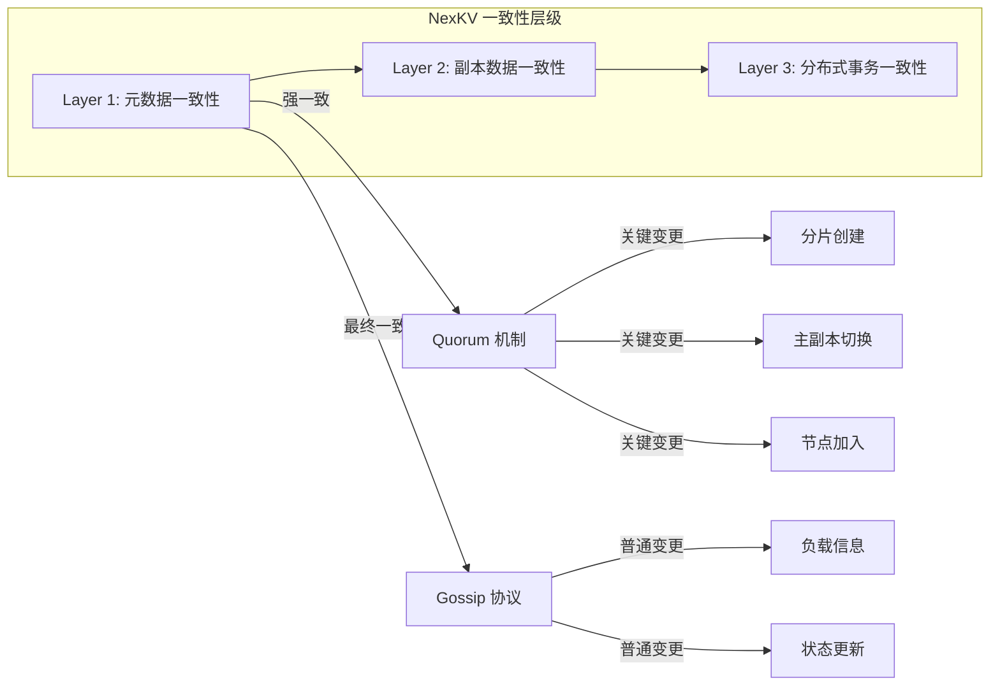
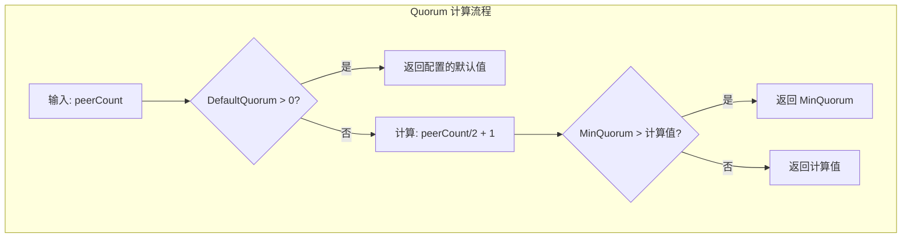
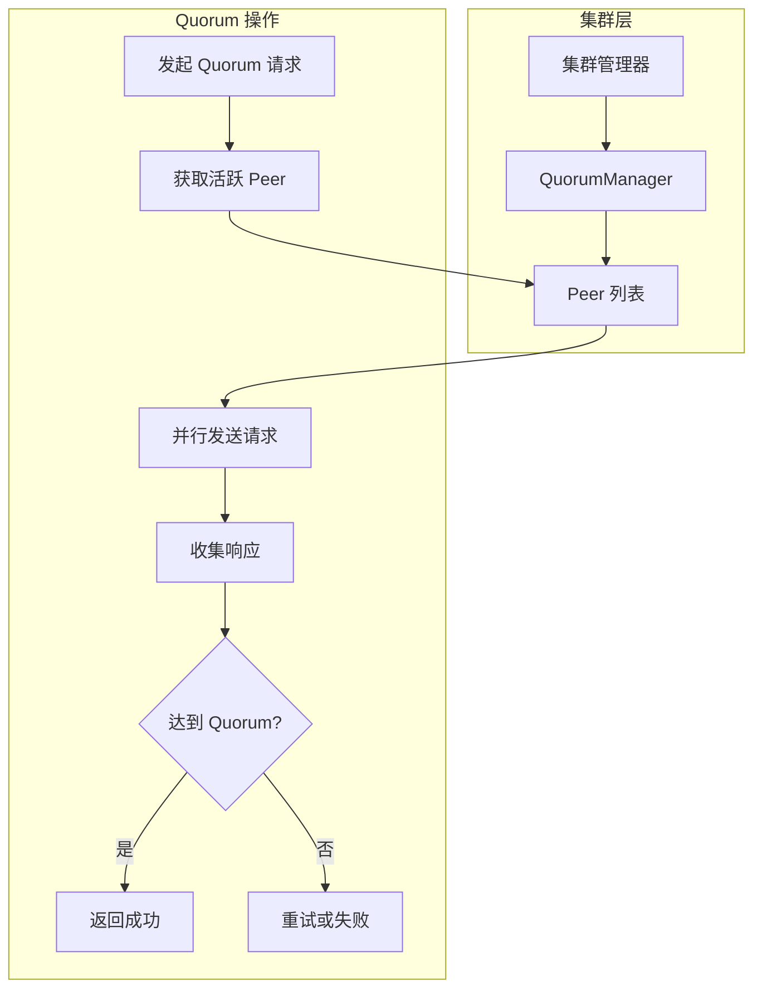
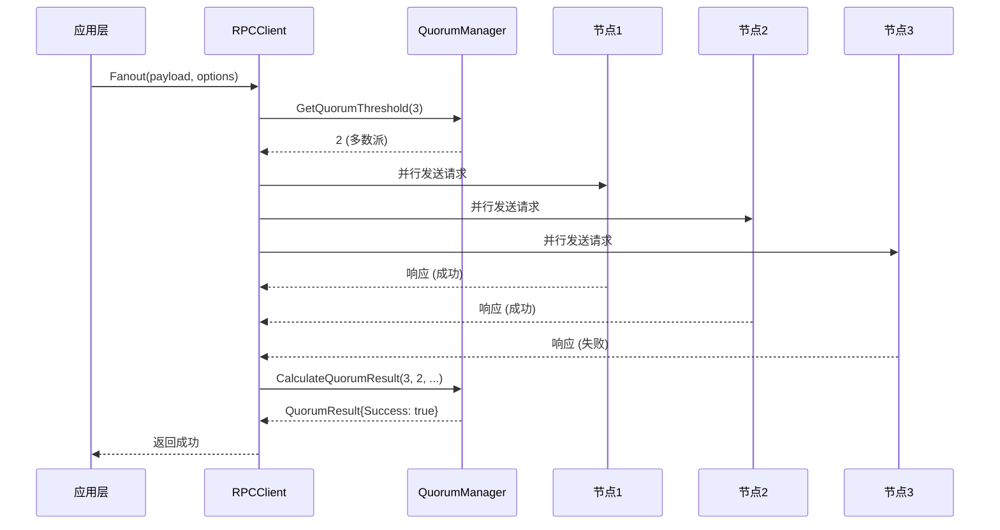
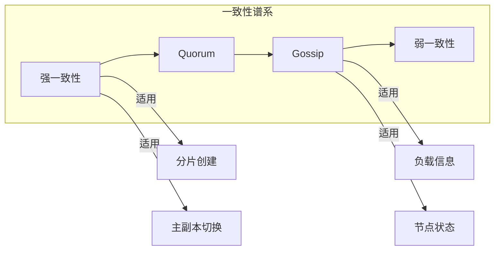

# 学习 Quorum 共识机制

## 培训目标

本文档旨在帮助开发团队深入理解 NexKV 分布式系统中 Quorum 共识机制的实现原理、核心算法和工程实践。通过学习本文档，您将能够：

1. 理解 Quorum 共识机制的基本原理
2. 掌握 NexKV 中 Quorum 机制的核心实现
3. 理解读/写 quorum 的计算方法
4. 掌握指数退避重试机制
5. 能够在实际项目中正确配置和使用 Quorum 机制

## 1. Quorum 共识机制概述

### 1.1 什么是 Quorum 共识机制？

Quorum 共识机制是分布式系统中实现数据一致性的重要方法之一。其核心思想是：**在任何操作中，需要获得多数派节点的同意才能认为操作成功**。这个“多数派”就是 Quorum。

在分布式系统中，数据通常会复制到多个副本以提高可用性和容错性。当客户端发起读或写操作时，只需要得到多数派副本的确认，就可以认为操作成功。这种机制确保了以下关键特性：

**一致性保证**：只要写操作得到了多数派节点的确认，后续的读操作就一定能够读到最新写入的数据。这是因为任何两个多数派集合之间必然存在交集，这个交集中的节点保存了最新的数据。

**容错能力**：Quorum 机制可以容忍多达 (N-1)/2 个节点故障而仍然保持系统可用。例如，在 5 节点集群中，可以容忍 2 个节点故障而不影响读写操作。

**读写兼容性**：通过合理配置读 quorum 和写 quorum，可以实现不同级别的一致性保证。强一致性需要 R + W > N，而最终一致性可以接受更弱的配置。

### 1.2 Quorum 机制在 NexKV 中的角色

在 NexKV 的三层一致性架构中，Quorum 机制位于第一层（元数据一致性层），专门用于处理**关键变更**的强一致性同步。



**关键变更**（需要强一致性）包括：

- 分片创建与删除
- 主副本切换
- 节点加入与离开
- 重要配置变更

对于这些关键操作，NexKV 使用 Quorum 机制确保变更在多数派节点上达成一致后，才认为操作成功。

### 1.3 Quorum 的数学基础

Quorum 机制的一致性保证可以用数学公式表达。假设系统有 N 个副本，配置读 quorum 为 R，写 quorum 为 W：

**强一致性保证**：当 R + W > N 时，系统保证强一致性。原因如下：

- 假设一个写操作获得了 W 个节点的确认
- 任何读操作需要读取 R 个节点
- 由于 R + W > N，任意 R 个节点集合必然与任意 W 个节点集合有交集
- 这个交集中的节点包含了最新的数据

**多数派 Quorum**：当 W = R = (N/2 + 1)（多数派）时，系统可以容忍最多 (N-1)/2 个节点故障，同时保证读写都能成功。

例如：

- 3 节点集群：Quorum = 2，可以容忍 1 个节点故障
- 5 节点集群：Quorum = 3，可以容忍 2 个节点故障
- 7 节点集群：Quorum = 4，可以容忍 3 个节点故障

## 2. NexKV Quorum 机制核心实现

### 2.1 核心数据结构

NexKV 的 Quorum 实现围绕几个核心数据结构展开：

#### 2.1.1 QuorumConfig 配置结构

> **代码位置**: `internal/rpc/quorum.go`
>
> NexKV 中存在两个 Quorum 相关实现：
> - **RPC 层 QuorumManager** (`internal/rpc/quorum.go`): 用于网络通信层的 Quorum 投票
> - **元数据层 QuorumCoordinator** (`internal/metadata/quorum/coordinator.go`): 用于元数据写入的一致性保证
>
> 本文档主要介绍 RPC 层的实现，两者配置结构相同。

```go
// 文件: internal/rpc/quorum.go
type QuorumConfig struct {
    Enabled       bool // 是否启用 Quorum
    DefaultQuorum int  // 默认多数派阈值 (N/2 + 1)
    Timeout       int  // Quorum 超时时间（毫秒）
    MinQuorum     int  // 最小 Quorum 值

    // 指数退避配置（Phase 3: P3-2.2 Quorum 重试机制）
    MaxRetries     int           // 最大重试次数（默认 3）
    InitialBackoff time.Duration // 初始退避延迟（默认 1s）
    MaxBackoff     time.Duration // 最大退避延迟（默认 30s）
    BackoffFactor  float64       // 退避因子（默认 2.0）
}
```

配置参数说明：

| 参数 | 默认值 | 说明 |
|------|--------|------|
| Enabled | true | 是否启用 Quorum 机制 |
| DefaultQuorum | 0 | 0 表示动态计算多数派阈值 |
| Timeout | 5000ms | Quorum 操作超时时间 |
| MinQuorum | 1 | 最小 Quorum 值，防止配置错误 |
| MaxRetries | 3 | 最大重试次数 |
| InitialBackoff | 1s | 首次重试的退避延迟 |
| MaxBackoff | 30s | 最大退避延迟 |
| BackoffFactor | 2.0 | 退避因子，每轮延迟翻倍 |

#### 2.1.2 QuorumResult 结果结构

> **注意**: NexKV 中存在两个 `QuorumResult` 结构，分别用于不同层级：

**RPC 层 QuorumResult** (`internal/rpc/quorum.go`):

```go
// 用于网络通信层，关注 peer ID 和错误详情
type QuorumResult struct {
    Success      bool      // 是否达到 Quorum
    SuccessCount int       // 成功响应数
    TotalPeers   int       // 总 peer 数
    Quorum       int       // Quorum 阈值
    Responses    []peer.ID // 成功响应的 peer 列表
    Errors       []error   // 错误列表
}
```

**元数据层 QuorumResult** (`internal/metadata/quorum/coordinator.go`):

```go
// 用于元数据写入，关注 ACK 数量和延迟统计
type QuorumResult struct {
    Success     bool          // 是否达到 Quorum
    AckCount    int           // ACK 数量（等同于 SuccessCount）
    TotalPeers  int           // 总 peer 数
    Quorum      int           // Quorum 阈值
    AckedPeers  []string      // 确认的 peer 列表（等同于 Responses）
    FailedPeers []string      // 失败的 peer 列表
    Latency     time.Duration // 操作延迟
    Error       error         // 汇总错误
}
```

**术语映射表**:

| RPC 层字段 | 元数据层字段 | 说明 |
|-----------|-------------|------|
| SuccessCount | AckCount | 成功确认的节点数 |
| Responses | AckedPeers | 成功确认的 peer 列表 |
| Errors | Error | RPC 层保留详细错误列表，元数据层汇总为单个错误 |
| - | Latency | 仅元数据层记录操作延迟 |
| - | FailedPeers | 仅元数据层记录失败节点 |

> **设计决策**: 两个结构体虽然相似但保持独立，是为了让 RPC 层保持通用性（可被其他模块复用），而元数据层可以添加特定领域的字段（如 Latency）。
```

QuorumResult 封装了 Quorum 操作的结果，包含成功标志、具体成功数量、以及详细的响应和错误列表，便于后续分析和处理。

#### 2.1.3 QuorumManager 管理器

```go
type QuorumManager struct {
    config    *QuorumConfig
    metrics   *QuorumMetrics
    mu        sync.RWMutex
    peerCache []peer.ID // 缓存的有效 Quorum peer 列表
}
```

QuorumManager 是整个 Quorum 机制的核心管理器，负责配置管理、指标收集和 peer 列表维护。

#### 2.1.4 QuorumMetrics 监控指标

```go
type QuorumMetrics struct {
    QuorumTotal      int // 总 Quorum 调用次数
    QuorumSuccess    int // Quorum 成功次数
    QuorumFailed     int // Quorum 失败次数
    QuorumTimeout    int // Quorum 超时次数
    PeerSuccessTotal int // Peer 级别成功次数
    PeerFailedTotal  int // Peer 级别失败次数
    // 重试指标（Phase 3: P3-2.2 Quorum 重试机制）
    RetryTotal   int // 重试总次数
    RetrySuccess int // 重试后成功次数
    RetryFailed  int // 重试后仍失败次数
}
```

### 2.2 Quorum 阈值计算

Quorum 阈值的计算是 Quorum 机制的核心。NexKV 支持两种模式：

#### 2.2.1 动态计算模式（默认）

当 DefaultQuorum 设置为 0 时，系统自动计算多数派阈值：

```go
func (m *QuorumManager) GetQuorumThreshold(peerCount int) int {
    m.mu.RLock()
    defer m.mu.RUnlock()

    // 如果配置了固定 Quorum，使用配置值
    if m.config.DefaultQuorum > 0 {
        return m.config.DefaultQuorum
    }

    // 否则动态计算多数派阈值 (N/2 + 1)
    quorum := peerCount/2 + 1
    if quorum < m.config.MinQuorum {
        quorum = m.config.MinQuorum
    }

    return quorum
}
```

这种模式的优势在于**自动适应集群规模变化**。当节点数量变化时，Quorum 阈值会自动调整。



#### 2.2.2 固定 Quorum 模式

在某些场景下，可能需要使用固定的 Quorum 阈值而不是动态计算。例如：

- 跨数据中心部署，需要特定的多数派配置
- 业务对容错有特定要求

通过设置 DefaultQuorum > 0 可以启用固定模式。

### 2.3 Quorum 结果计算

当一次 Quorum 操作完成后，需要计算是否达成 Quorum：

```go
func (m *QuorumManager) CalculateQuorumResult(
    peerCount int,
    successCount int,
    responses []peer.ID,
    errors []error,
) *QuorumResult {
    m.mu.Lock()
    defer m.mu.Unlock()

    // 直接计算 Quorum，避免重复获取锁
    quorum := m.calculateQuorumThresholdLocked(peerCount)
    success := successCount >= quorum

    // 更新指标
    m.metrics.QuorumTotal++
    if success {
        m.metrics.QuorumSuccess++
    } else {
        m.metrics.QuorumFailed++
    }

    return &QuorumResult{
        Success:      success,
        SuccessCount: successCount,
        TotalPeers:   peerCount,
        Quorum:       quorum,
        Responses:    responses,
        Errors:       errors,
    }
}
```

### 2.4 指数退避重试机制

网络操作可能会因为临时故障而失败。为了提高系统的健壮性，NexKV 实现了**指数退避重试机制**。

#### 2.4.1 退避延迟计算

指数退避的核心是让每次重试的等待时间按指数增长：

```go
func (m *QuorumManager) CalculateBackoff(attempt int) time.Duration {
    m.mu.RLock()
    defer m.mu.RUnlock()

    if attempt < 0 {
        attempt = 0
    }

    // 计算指数延迟: initial * factor^attempt
    exponentialDelay := time.Duration(
        float64(m.config.InitialBackoff) *
            math.Pow(m.config.BackoffFactor, float64(attempt)),
    )

    // 限制最大延迟
    if exponentialDelay > m.config.MaxBackoff {
        exponentialDelay = m.config.MaxBackoff
    }

    return exponentialDelay
}
```

退避延迟计算示例（InitialBackoff=1s, MaxBackoff=30s, BackoffFactor=2.0）：

| 重试次数 | 计算公式 | 延迟 |
|---------|---------|------|
| 0 | 1 × 2^0 | 1s |
| 1 | 1 × 2^1 | 2s |
| 2 | 1 × 2^2 | 4s |
| 3 | 1 × 2^3 | 8s |
| 4 | 1 × 2^4 | 16s |
| 5 | 1 × 2^5 | 30s（上限） |

#### 2.4.2 重试执行逻辑

```go
func (m *QuorumManager) ExecuteWithRetry(
    ctx context.Context,
    operation func(ctx context.Context) (*QuorumResult, error),
) (*QuorumResult, error) {
    var lastErr error
    var result *QuorumResult

    for attempt := 0; attempt <= m.config.MaxRetries; attempt++ {
        // 检查上下文是否已取消
        if ctx.Err() != nil {
            m.mu.Lock()
            m.metrics.RetryTotal++
            m.mu.Unlock()
            return nil, fmt.Errorf("quorum 重试已取消: %w", ctx.Err())
        }

        // 首次尝试或后续重试
        if attempt > 0 {
            backoff := m.CalculateBackoff(attempt - 1)
            logging.WithFields(map[string]interface{}{
                "attempt":        attempt,
                "backoff":        backoff.String(),
                "max_retries":    m.config.MaxRetries,
                "previous_error": lastErr,
            }).Info("Quorum 重试前等待退避延迟")

            select {
            case <-ctx.Done():
                m.mu.Lock()
                m.metrics.RetryTotal++
                m.mu.Unlock()
                return nil, fmt.Errorf("quorum 重试已取消: %w", ctx.Err())
            case <-time.After(backoff):
                // 退避延迟结束，继续重试
            }
        }

        // 执行操作
        result, lastErr = operation(ctx)

        // 如果成功或不应重试，返回结果
        if lastErr == nil || !m.ShouldRetry(attempt, lastErr) {
            if attempt > 0 && result != nil && result.Success {
                m.mu.Lock()
                m.metrics.RetryTotal++
                m.metrics.RetrySuccess++
                m.mu.Unlock()
            }
            return result, lastErr
        }
    }

    // 所有重试都失败
    m.mu.Lock()
    m.metrics.RetryTotal++
    m.metrics.RetryFailed++
    m.mu.Unlock()

    return nil, fmt.Errorf("quorum 操作失败，已达最大重试次数 (%d): %w", m.config.MaxRetries, lastErr)
}
```

### 2.5 与集群层集成

NexKV 的 Quorum 机制设计为与集群层紧密集成：



#### 2.5.1 Peer 缓存管理

```go
func (m *QuorumManager) UpdatePeerCache(peers []peer.ID) {
    m.mu.Lock()
    defer m.mu.Unlock()

    m.peerCache = make([]peer.ID, len(peers))
    copy(m.peerCache, peers)

    logging.WithField("peer_count", len(peers)).Debug("Quorum peer 缓存已更新")
}

func (m *QuorumManager) GetQuorumPeers() []peer.ID {
    m.mu.RLock()
    defer m.mu.RUnlock()

    if len(m.peerCache) == 0 {
        return nil
    }

    // 返回副本
    peers := make([]peer.ID, len(m.peerCache))
    copy(peers, m.peerCache)
    return peers
}
```

#### 2.5.2 同步集群配置

```go
func (m *QuorumManager) SyncQuorumConfigFromCluster() error {
    svc := GetClusterService()
    if svc == nil {
        // 集群服务未设置，使用默认配置
        return nil
    }

    config := svc.GetQuorumConfig()
    if config != nil {
        m.SetConfig(config)
        logging.Info("已从集群层同步 Quorum 配置")
    }

    return nil
}

func (m *QuorumManager) SyncPeersFromCluster() error {
    svc := GetClusterService()
    if svc == nil {
        m.UpdatePeerCache(nil)
        return nil
    }

    peers := svc.GetActivePeers()
    m.UpdatePeerCache(peers)
    return nil
}
```

## 3. Quorum 配置与调优

### 3.1 典型配置场景

#### 3.1.1 3 节点集群（最小生产配置）

```go
config := &QuorumConfig{
    Enabled:       true,
    DefaultQuorum: 0, // 动态计算
    Timeout:       5000,
    MinQuorum:     2, // 3/2+1 = 2
}
```

- Quorum 阈值：2（多数派）
- 容错能力：可容忍 1 个节点故障
- 延迟：中等（需要等待 2/3 节点确认）

#### 3.1.2 5 节点集群（推荐生产配置）

```go
config := &QuorumConfig{
    Enabled:       true,
    DefaultQuorum: 0,
    Timeout:       5000,
    MinQuorum:     3, // 5/2+1 = 3
}
```

- Quorum 阈值：3（多数派）
- 容错能力：可容忍 2 个节点故障
- 延迟：稍高（需要等待 3/5 节点确认）

#### 3.1.3 7 节点集群（高可用配置）

```go
config := &QuorumConfig{
    Enabled:       true,
    DefaultQuorum: 0,
    Timeout:       5000,
    MinQuorum:     4,
}
```

- Quorum 阈值：4（多数派）
- 容错能力：可容忍 3 个节点故障
- 延迟：较高（需要等待 4/7 节点确认）

### 3.2 超时配置

Quorum 操作涉及网络通信，需要合理配置超时时间：

```go
type QuorumConfig struct {
    Timeout int // 毫秒
}
```

**超时配置考虑因素**：

1. **网络延迟**：跨数据中心部署需要更长的超时时间
2. **节点负载**：高负载节点可能响应较慢
3. **容错要求**：高可用要求可能需要更短的超时以便快速故障转移

建议配置：

- 同城机房：3000-5000ms
- 跨地域机房：8000-15000ms

### 3.3 重试配置

```go
type QuorumConfig struct {
    MaxRetries:     3,
    InitialBackoff: 1 * time.Second,
    MaxBackoff:     30 * time.Second,
    BackoffFactor:  2.0,
}
```

**重试策略**：

- **保守策略**：MaxRetries=2, InitialBackoff=2s，适合对延迟敏感的业务
- **平衡策略**：MaxRetries=3, InitialBackoff=1s，适合大多数场景
- **激进策略**：MaxRetries=5, InitialBackoff=500ms，适合对可用性要求极高的场景

## 4. Quorum 机制使用示例

### 4.1 基本使用流程

```go
func ExampleQuorumUsage() {
    // 1. 创建 Quorum 管理器
    manager := NewQuorumManager(DefaultQuorumConfig())

    // 2. 设置配置
    manager.SetConfig(&QuorumConfig{
        Enabled:       true,
        DefaultQuorum: 0, // 动态计算
        Timeout:       5000,
        MinQuorum:     2,
        // 指数退避配置
        MaxRetries:     3,
        InitialBackoff: 1 * time.Second,
        MaxBackoff:     30 * time.Second,
        BackoffFactor:  2.0,
    })

    // 3. 更新 peer 缓存
    peers := []peer.ID{"peer1", "peer2", "peer3", "peer4", "peer5"}
    manager.UpdatePeerCache(peers)

    // 4. 计算 Quorum 阈值
    quorum := manager.GetQuorumThreshold(len(peers))
    fmt.Printf("5 个 peers 的 Quorum 阈值: %d\n", quorum) // 输出: 3

    // 5. 计算 Quorum 结果
    result := manager.CalculateQuorumResult(
        5,                                    // 总 peer 数
        3,                                    // 成功数
        []peer.ID{"peer1", "peer2", "peer3"},
        nil,
    )

    fmt.Printf("Quorum 达成: %v (3/5 >= %d)\n", result.Success, result.Quorum)

    // 6. 获取指标
    metrics := manager.GetMetrics()
    fmt.Printf("Quorum 成功率: %d/%d\n", metrics.QuorumSuccess, metrics.QuorumTotal)
}
```

### 4.2 带重试的完整流程

```go
func QuorumOperationWithRetry(ctx context.Context, manager *QuorumManager) error {
    result, err := manager.ExecuteWithRetry(ctx, func(ctx context.Context) (*QuorumResult, error) {
        // 获取 peer 列表
        peers := manager.GetQuorumPeers()
        if len(peers) == 0 {
            return nil, fmt.Errorf("没有可用的 peer")
        }

        // 并行发送请求
        var wg sync.WaitGroup
        var mu sync.Mutex
        successCount := 0
        responses := make([]peer.ID, 0)
        errors := make([]error, 0)

        for _, peer := range peers {
            wg.Add(1)
            go func(p peer.ID) {
                defer wg.Done()

                // 实际 RPC 调用示例
                // 参考: internal/rpc/fanout.go 中的 Fanout 方法
                // 实际使用时应调用 RPC 层提供的接口
                err := sendRequestToPeer(ctx, p)
                
                mu.Lock()
                defer mu.Unlock()
                
                if err == nil {
                    successCount++
                    responses = append(responses, p)
                } else {
                    errors = append(errors, err)
                }
            }(peer)
        }
        
        wg.Wait()
        
        // 计算 Quorum 结果
        return manager.CalculateQuorumResult(
            len(peers),
            successCount,
            responses,
            errors,
        ), nil
    })

    if err != nil {
        return fmt.Errorf("Quorum 操作失败: %w", err)
    }

    if !result.Success {
        return fmt.Errorf("未达到 Quorum: %d/%d", result.SuccessCount, result.Quorum)
    }

    return nil
}
```

#### 4.2.1 实际 RPC 调用集成

上述示例中的 `sendRequestToPeer` 是一个占位函数。在实际项目中，应该使用 RPC 层提供的 `Fanout` 方法：

```go
// 实际使用: 调用 RPC 层的 Fanout 方法
// 文件位置: internal/rpc/fanout.go
func QuorumOperationWithRPC(ctx context.Context, rpcClient *RPCClient, payload []byte) error {
    // 使用 RPC 层提供的 Fanout 接口
    // Fanout 自动处理并行发送、响应收集和 Quorum 计算
    result, err := rpcClient.Fanout(ctx, payload, &FanoutOptions{
        Mode:    FanoutModeQuorum,  // 使用 Quorum 模式
        Quorum:  0,                  // 0 表示动态计算多数派阈值
        Timeout: 5 * time.Second,
    })

    if err != nil {
        return fmt.Errorf("Quorum RPC 调用失败: %w", err)
    }

    if !result.Success {
        return fmt.Errorf("未达到 Quorum: %d/%d", result.SuccessCount, result.Quorum)
    }

    return nil
}

// FanoutOptions 扇出配置选项
// 文件位置: internal/rpc/fanout.go
type FanoutOptions struct {
    Mode    FanoutMode     // 扇出模式: Quorum, All, Any
    Quorum  int            // Quorum 阈值（仅 Mode=Quorum 时有效）
    Timeout time.Duration  // 超时时间
    Peers   []peer.ID      // 目标 peer 列表（可选，默认使用缓存）
}
```

**RPC 层调用流程**:



## 5. Quorum 与 Gossip 的对比

NexKV 中同时使用了 Quorum 和 Gossip 两种一致性机制，它们各有适用场景：

| 特性 | Quorum | Gossip |
|------|--------|--------|
| 一致性 | 强一致性 | 最终一致性 |
| 延迟 | 低（等待多数派） | 高（多轮传播） |
| 复杂度 | 中等 | 简单 |
| 容错 | (N-1)/2 节点 | N-1 节点 |
| 适用场景 | 关键变更 | 普通状态同步 |



## 6. 监控与故障排查

### 6.1 关键监控指标

| 指标 | 说明 | 告警阈值 |
|------|------|---------|
| QuorumTotal | 总调用次数 | - |
| QuorumSuccess | 成功次数 | - |
| QuorumFailed | 失败次数 | > 10% |
| QuorumTimeout | 超时次数 | > 5% |
| RetryTotal | 重试总次数 | - |
| RetrySuccess | 重试成功次数 | - |
| GetDropRate | 消息丢弃率 | > 1% |

### 6.2 常见问题与解决

#### 问题 1：Quorum 超时

**可能原因**：
- 网络延迟过高
- 节点负载过高
- 部分节点故障

**排查步骤**：
1. 检查网络连通性
2. 检查节点负载
3. 查看具体超时节点

#### 问题 2：Quorum 永远无法达成

**可能原因**：
- 节点故障过多（超过容错能力）
- 配置错误（Quorum 阈值大于可用节点数）
- 网络分区

**排查步骤**：
1. 检查活跃节点数量
2. 验证 Quorum 配置
3. 检查网络状态

## 7. 总结

本文档详细介绍了 NexKV 中 Quorum 共识机制的实现原理和工程实践。核心要点包括：

1. **多数派阈值计算**：支持动态计算和固定配置两种模式
2. **指数退避重试**：提高系统健壮性，支持可配置的重试策略
3. **集群层集成**：与集群管理器紧密集成，实现配置和状态同步
4. **完善的监控指标**：便于运维和故障排查
5. **灵活的配置选项**：满足不同场景需求

Quorum 机制是 NexKV 实现强一致性的关键组件，理解其实现对于正确使用和优化系统至关重要。在实际使用中，需要根据集群规模、网络状况和业务需求合理配置参数。

## 8. 参考资料

- **Dynamo 论文**: Amazon Dynamo 中 Quorum 机制的原始应用
- **CAP 理论**: 一致性、可用性、分区容错性的权衡
- **NexKV 架构设计**: `docs/02_design/protocols/01_一致性协议设计.md`
- **Gossip 协议实现**: `docs/08_training/2026-02-19_深入理解Gossip协议实现.md`
- **RPC 层实现**: `internal/rpc/quorum.go`, `internal/rpc/fanout.go`
- **元数据层实现**: `internal/metadata/quorum/coordinator.go`
