# 掌握分片和副本管理

## 培训目标

本文档旨在帮助开发团队深入理解 NexKV 分布式系统中分片（Shard）和副本（Replica）管理的实现原理、核心机制和工程实践。通过学习本文档，您将能够：

1. 理解分布式存储系统中分片的基本概念
2. 掌握 NexKV 中分片元数据的核心数据结构
3. 理解分片状态机和生命周期管理
4. 掌握副本分配和复制策略
5. 理解分片迁移和分裂机制

## 1. 分片和副本管理概述

### 1.1 为什么需要分片？

在分布式存储系统中，单机无法存储和处理海量数据。分片（Sharding）是解决这一问题的核心技术，其基本思想是将数据按照某种规则划分到多个存储节点上。

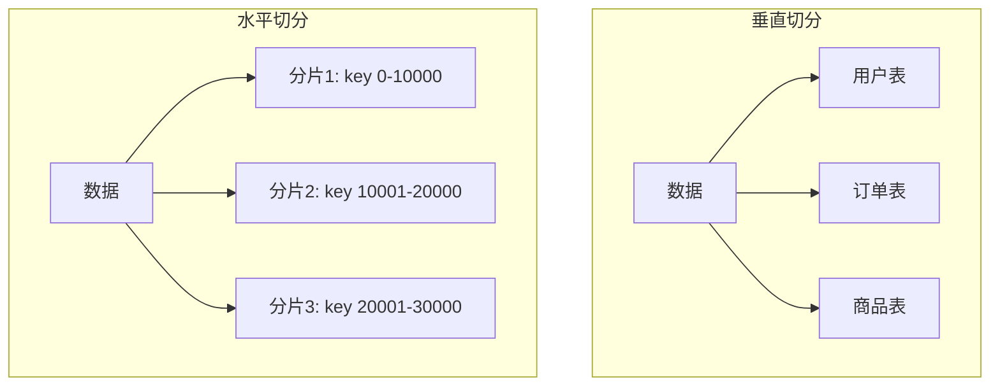

**垂直切分**按照业务功能将数据划分到不同的表或服务中。

**水平切分**按照数据的某个维度（如键的范围、哈希值）将数据划分到多个分片中。每个分片包含完整的数据子集，可以独立存储和处理。

水平切分的优势在于：

- **水平扩展**：可以通过增加分片数量来扩展系统容量
- **负载均衡**：请求分散到多个分片，避免单点瓶颈
- **容错性**：某个分片故障不影响其他分片

### 1.2 为什么需要副本？

副本（Replica）是分片数据的冗余拷贝，主要用于：

**提高可用性**：当某个节点故障时，系统可以从副本节点继续提供服务，实现故障无感知。

**提高性能**：客户端可以从最近的副本读取数据，降低延迟。

**保证一致性**：通过副本复制，实现数据的冗余存储。

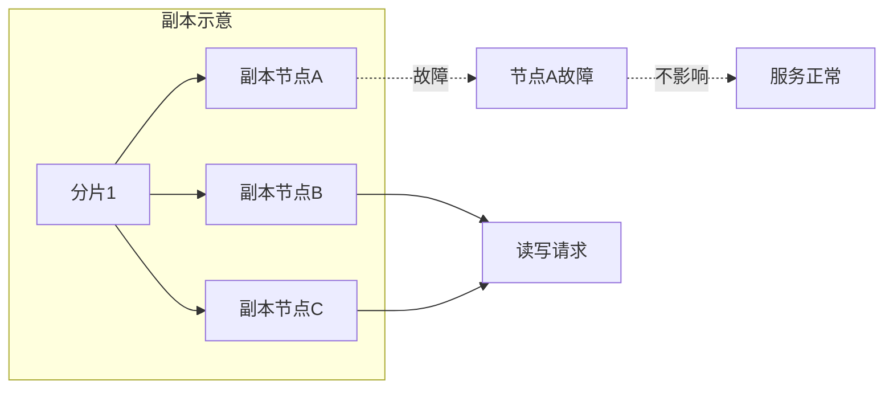

### 1.3 NexKV 分片架构

NexKV 采用**五层架构**设计，分片管理主要涉及 Layer 2（控制平面层）和 Layer 3（数据平面层）：

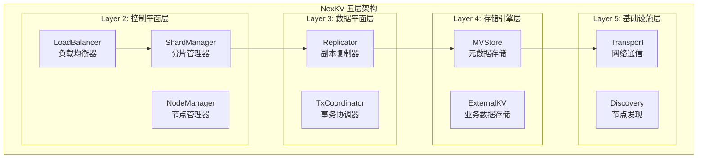

> **前置知识**: 建议先阅读 `docs/08_training/2026-02-18_Day1-AM-DDD-Architecture.md` 了解 NexKV 五层架构的完整设计。

**分片管理器（ShardManager）**：Layer 2 核心组件，负责分片的创建、删除、迁移、分裂等生命周期管理。

**副本复制器（Replicator）**：Layer 3 核心组件，负责副本的分配、健康检查、故障恢复等。

**路由功能**：由 Layer 2 的 LoadBalancer 和 ShardManager 共同提供，负责将客户端请求路由到正确的分片和副本。

### 1.4 NexKV 三层一致性架构

NexKV 采用独特的**三层一致性架构**，分片管理是 Layer 2（副本数据一致性层）的核心：

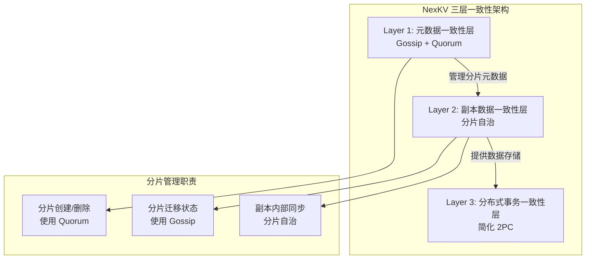

**变更类型分类**:

| 变更类型 | 示例 | 一致性要求 | 同步机制 | 对应章节 |
|---------|------|-----------|---------|---------|
| **关键变更** | 分片创建、主副本切换 | 强一致 | Quorum | 3.3, 4.4 |
| **普通变更** | 分片迁移进度、节点负载 | 最终一致 | Gossip | 3.5, 4.3 |

**关键点**:
- 分片**元数据**变更（创建/删除）使用 Quorum 保证强一致
- 分片**迁移状态**更新使用 Gossip 异步扩散
- 副本**内部数据**同步由分片自治管理

> **延伸阅读**:
> - Layer 1 详解：`docs/08_training/2026-02-19_深入理解Gossip协议实现.md`
> - Layer 1 详解：`docs/08_training/2026-02-19_学习Quorum共识机制.md`

## 2. NexKV 分片核心数据结构

### 2.1 分片信息结构

NexKV 中分片的核心元数据结构如下：

> **代码位置**: `internal/metadata/types/shard_info.go`

```go
// 文件: internal/metadata/types/shard_info.go
type ShardInfo struct {
    // ShardID 分片 ID
    ShardID string `msgpack:"shard_id"`

    // RangeStart 起始键（包含）
    RangeStart string `msgpack:"range_start"`

    // RangeEnd 结束键（不包含）
    RangeEnd string `msgpack:"range_end"`

    // ReplicaNodes 副本节点列表
    ReplicaNodes []string `msgpack:"replica_nodes"`

    // State 分片状态
    State ShardState `msgpack:"state"`

    // PrimaryNode 主副本节点 ID
    PrimaryNode string `msgpack:"primary_node"`

    // MigrationStatus 迁移状态（可选）
    MigrationStatus *ShardMigrationStatus `msgpack:"migration_status,omitempty"`

    // Version MVCC 版本号
    Version uint64 `msgpack:"version"`
}
```

**关键字段说明**：

| 字段 | 类型 | 说明 |
|------|------|------|
| ShardID | string | 分片唯一标识符 |
| RangeStart | string | 分片管理的键范围起始值（包含） |
| RangeEnd | string | 分片管理的键范围结束值（不包含） |
| ReplicaNodes | []string | 该分片的所有副本节点列表 |
| State | ShardState | 当前分片状态 |
| PrimaryNode | string | 主副本所在的节点ID |
| MigrationStatus | *ShardMigrationStatus | 迁移过程中的状态信息 |
| Version | uint64 | MVCC 版本号，用于并发控制 |

### 2.2 分片状态定义

分片在其生命周期中会经历多种状态：

> **代码位置**: `internal/metadata/types/shard_info.go`

```go
// 文件: internal/metadata/types/shard_info.go
type ShardState string

const (
    // ShardStateInitializing 分片初始化中
    ShardStateInitializing ShardState = "initializing"
    // ShardStateActive 分片活跃
    ShardStateActive ShardState = "active"
    // ShardStateMigrating 分片迁移中
    ShardStateMigrating ShardState = "migrating"
    // ShardStateSplitting 分片分裂中
    ShardStateSplitting ShardState = "splitting"
    // ShardStateMerging 分片合并中
    ShardStateMerging ShardState = "merging"
    // ShardStateDraining 分片排空中
    ShardStateDraining ShardState = "draining"
)
```

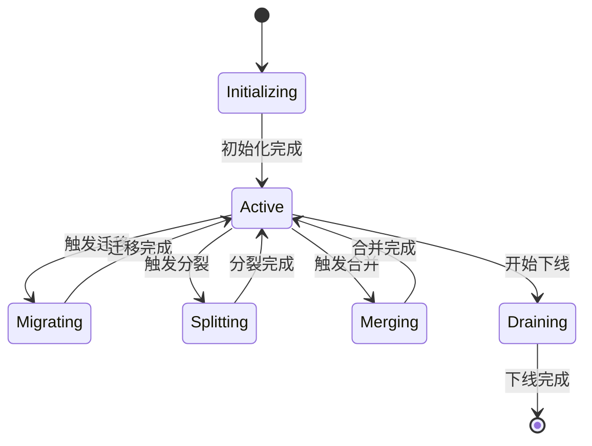

### 2.3 分片状态流转详解

#### 2.3.1 初始状态（Initializing）

当创建新分片时，分片首先进入 Initializing 状态。在此状态下：

- 分片元数据已创建
- 副本节点已分配
- 主副本正在初始化存储引擎
- 数据同步尚未开始

#### 2.3.2 活跃状态（Active）

分片正常工作时的状态。在此状态下：

- 可以正常处理读写请求
- 主副本处理写操作，然后复制到从副本
- 定期进行健康检查

#### 2.3.3 迁移状态（Migrating）

当分片需要在节点之间迁移时进入此状态：

```go
type ShardMigrationStatus struct {
    // SourceNode 源节点 ID
    SourceNode string `msgpack:"source_node"`

    // TargetNode 目标节点 ID
    TargetNode string `msgpack:"target_node"`

    // Progress 迁移进度（0-100）
    Progress int `msgpack:"progress"`

    // StartTime 开始时间
    StartTime int64 `msgpack:"start_time"`

    // EstimatedEndTime 预计结束时间
    EstimatedEndTime int64 `msgpack:"estimated_end_time"`
}
```

迁移过程中：

- 原分片仍可处理读请求
- 写操作需要双写（原节点和新节点）
- 实时跟踪迁移进度
- 迁移完成后切换路由

#### 2.3.4 分裂状态（Splitting）

当分片数据量过大时，会触发分裂：

- 原分片进入 Splitting 状态
- 创建两个新的分片
- 数据从原分片迁移到新分片
- 完成后原分片下线，新分片上线

#### 2.3.5 合并状态（Migrating）

当多个分片数据量过小时，可能触发合并：

- 多个分片进入 Merging 状态
- 数据合并到目标分片
- 完成后源分片下线

#### 2.3.6 排空状态（Draining）

当分片需要下线时进入此状态：

- 停止接收新的写请求
- 等待所有数据同步完成
- 完成后分片正式下线

## 3. 分片管理核心功能

### 3.1 分片键范围判断

```go
// IsInRange 检查键是否在分片范围内
func (s *ShardInfo) IsInRange(key string) bool {
    return key >= s.RangeStart && (s.RangeEnd == "" || key < s.RangeEnd)
}
```

这个方法用于判断某个键应该路由到哪个分片。NexKV 使用**范围分片**策略，相邻的分片键范围连续且不重叠。

```mermaid
graph LR
    subgraph 分片键范围
        A[分片0<br/>[aaa, aaz)] --> B[分片1<br/>[aaz, aba)]
        B --> C[分片2<br/>[aba, abb)]
        C --> D[分片3<br/>[abb, abc)]
    end
    
    E[key: "aaz"] --> B
```

### 3.2 副本节点查询

```go
// HasReplica 检查节点是否为副本
func (s *ShardInfo) HasReplica(nodeID string) bool {
    for _, replica := range s.ReplicaNodes {
        if replica == nodeID {
            return true
        }
    }
    return false
}
```

### 3.3 分片分配策略

分片分配是分布式系统的核心问题之一。NexKV 采用以下策略：

#### 3.3.1 副本分散策略

为了提高容错性，同一分片的多个副本应该尽量分散在不同节点上：

> **说明**: 以下示例是简化版本。实际实现考虑节点容量、负载、机架感知等因素。
> **实际实现位置**: `internal/metadata/cluster/shard_allocator.go` (待实现)

```go
// 伪代码：副本分散分配（简化版）
// 实际实现参见: internal/metadata/cluster/shard_allocator.go
func DistributeReplicas(shardCount int, nodes []string, replicationFactor int) map[string][]string {
    result := make(map[string][]string)
    
    // 打乱节点顺序，确保随机分布
    shuffledNodes := shuffle(nodes)
    
    for shardID := 0; shardID < shardCount; shardID++ {
        replicas := make([]string, 0)
        for i := 0; i < replicationFactor; i++ {
            nodeIndex := (shardID + i) % len(shuffledNodes)
            replicas = append(replicas, shuffledNodes[nodeIndex])
        }
        result[fmt.Sprintf("shard-%d", shardID)] = replicas
    }
    
    return result
}
```

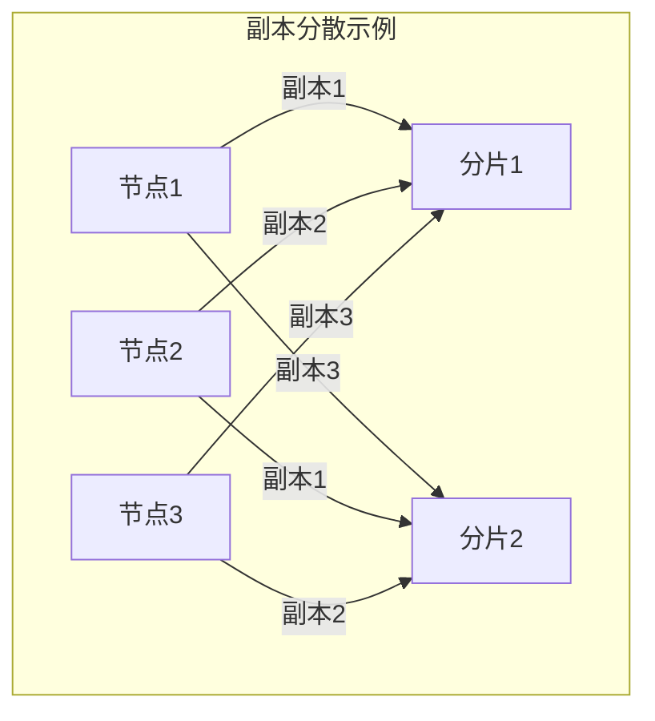

#### 3.3.2 负载均衡策略

除了分散副本，还需要考虑负载均衡：

- **数据量均衡**：每个分片的数据量应该大致相等
- **请求负载均衡**：每个节点处理的请求数量应该均衡
- **网络带宽均衡**：跨节点复制流量应该均衡分布

### 3.4 分片路由

当客户端发起请求时，系统需要快速定位目标分片：

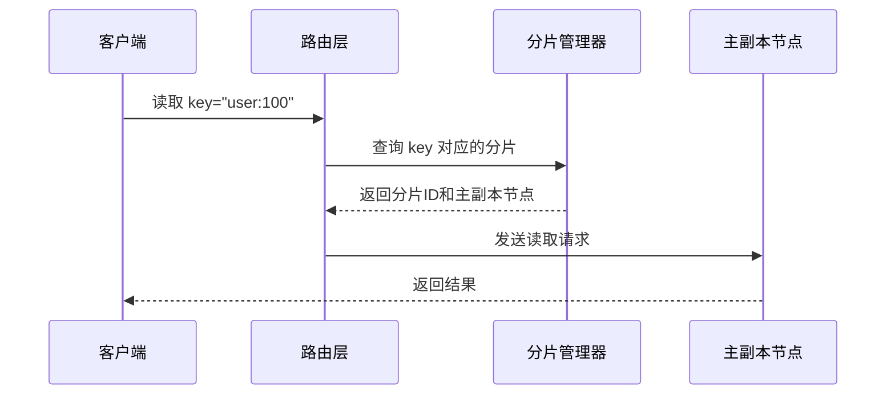

路由实现的关键是**高效的范围查找**。NexKV 使用以下数据结构：

- **有序数组**：适合小规模分片（<1000）
- **B+树**：适合大规模分片
- **哈希表**：适合哈希分片

### 3.5 分片迁移

分片迁移是分布式存储的核心功能，用于：

- 节点故障后的负载重新分配
- 集群扩容时的数据平衡
- 节点维护时的数据迁移

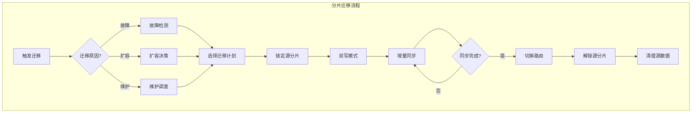

迁移过程中的关键问题：

**双写模式**：在迁移期间，新写入的数据需要同时写入源节点和目标节点，确保数据不丢失。

**增量同步**：使用 WAL（预写日志）或变更日志（CDC）实现增量数据同步。

**一致性保证**：迁移完成后需要确保数据完全一致，通常通过校验和或 Merkle Tree 验证。

**故障恢复**：如果迁移过程中发生故障，需要有回滚机制。

### 3.6 分片分裂

当单个分片的数据量过大时，会触发分裂：

```mermaid
graph TB
    subgraph 分片分裂前
        A[分片0<br/>键范围: [a, z)<br/>数据量: 100GB]
    end
    
    subgraph 分片分裂后
        A --> B[分片0<br/>键范围: [a, m)<br/>数据量: 50GB]
        A --> C[分片1<br/>键范围: [m, z)<br/>数据量: 50GB]
    end
```

分裂触发条件：

- 分片数据量超过阈值（如 100GB）
- 分片请求负载过高
- 手动触发分裂

分裂过程：

1. 评估分裂必要性
2. 计算分裂键（中间键）
3. 创建新分片元数据
4. 迁移数据
5. 更新路由
6. 清理旧分片

### 3.7 分片合并

当多个分片数据量过小时，可能触发合并：

```mermaid
graph TB
    subgraph 分片合并前
        A[分片1<br/>键范围: [a, c)<br/>数据量: 1GB]
        B[分片2<br/>键范围: [c, e)<br/>数据量: 1GB]
    end
    
    subgraph 分片合并后
        C[分片1<br/>键范围: [a, e)<br/>数据量: 2GB]
    end
```

合并触发条件：

- 分片数据量低于阈值（如 10MB）
- 分片数量过多
- 手动触发合并

## 4. 副本管理

### 4.1 副本角色

NexKV 中副本分为两种角色：

**主副本（Primary）**：处理所有写请求，是数据写入的入口。

**从副本（Secondary/Replica）**：从主副本同步数据，提供读服务。

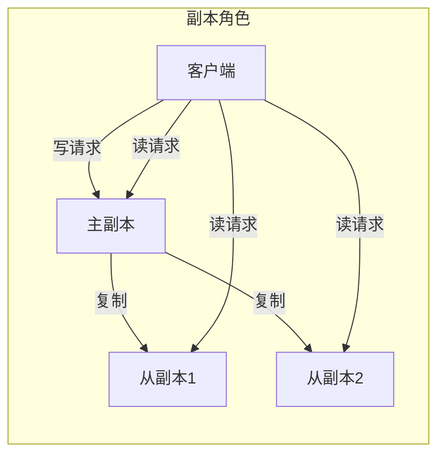

### 4.2 复制模式

#### 4.2.1 同步复制

主副本等待所有从副本确认后才返回成功：

- **优点**：数据一致性最强，切换后无数据丢失
- **缺点**：延迟高，取决于最慢的从副本

```go
// 伪代码：同步复制
func SyncReplicate(write Request) error {
    // 写入主副本
    err := write.Primary.Write(write)
    if err != nil {
        return err
    }
    
    // 并行写入所有从副本
    var wg sync.WaitGroup
    for _, replica := range write.Replicas {
        wg.Add(1)
        go func(r Replica) {
            defer wg.Done()
            r.Write(write)
        }(replica)
    }
    wg.Wait()
    
    return nil
}
```

#### 4.2.2 异步复制

主副本立即返回，然后异步复制到从副本：

- **优点**：延迟低，响应快
- **缺点**：可能存在数据丢失风险

```go
// 伪代码：异步复制
func AsyncReplicate(write Request) error {
    // 写入主副本
    err := write.Primary.Write(write)
    if err != nil {
        return err
    }
    
    // 异步复制到从副本
    go func() {
        for _, replica := range write.Replicas {
            replica.Write(write)
        }
    }()
    
    return nil
}
```

#### 4.2.3 半同步复制

介于同步和异步之间：等待至少一个从副本确认：

- **优点**：在一致性和性能之间取得平衡
- **缺点**：实现复杂度较高

### 4.3 副本故障处理

当从副本故障时：

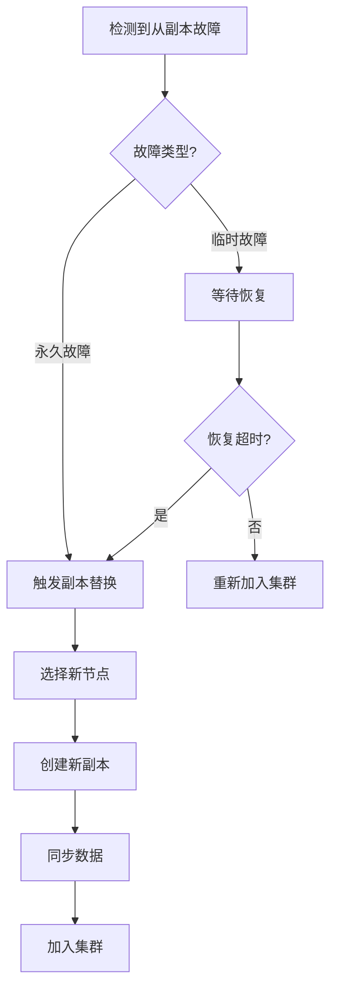

### 4.4 主副本切换

当主副本故障时，需要进行主从切换：

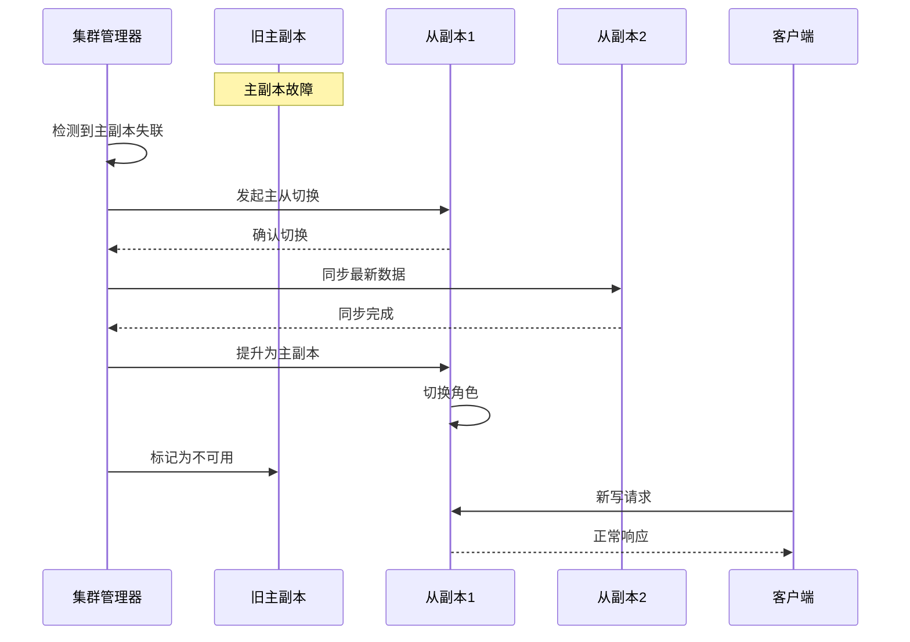

## 5. 分片与副本的配置

### 5.1 分片配置

| 配置项 | 默认值 | 说明 |
|--------|--------|------|
| InitialShardCount | 256 | 初始分片数量 |
| MaxShardCount | 1024 | 最大分片数量 |
| SplitThreshold | 100GB | 分裂阈值 |
| MergeThreshold | 10MB | 合并阈值 |
| MigrationBatchSize | 1000 | 每批迁移记录数 |

### 5.2 副本配置

| 配置项 | 默认值 | 说明 |
|--------|--------|------|
| ReplicationFactor | 3 | 副本数量 |
| SyncReplicaTimeout | 5s | 同步副本超时 |
| HeartbeatInterval | 1s | 心跳间隔 |
|故障检测Timeout | 10s | 故障检测超时 |

## 6. 最佳实践

### 6.1 分片数量规划

分片数量是分布式系统的重要参数：

- **过少**：无法充分利用分布式优势
- **过多**：管理开销增大，元数据膨胀

建议：初始分片数 = 集群节点数 × 2

### 6.2 副本数量选择

副本数量取决于可用性要求：

| 副本数 | 容错能力 | 适用场景 |
|--------|---------|---------|
| 2 | 1 节点 | 开发/测试环境 |
| 3 | 1 节点 | 生产环境（单数据中心） |
| 5 | 2 节点 | 高可用（多数据中心） |

### 6.3 键设计原则

- **避免热点**：选择分布均匀的键
- **避免跨分片事务**：减少分布式事务开销
- **考虑访问模式**：将相关数据放在同一分片

## 7. 监控与运维

### 7.1 关键监控指标

| 指标 | 说明 | 告警阈值 |
|------|------|---------|
| 分片总数 | 当前活跃分片数 | - |
| 分片状态分布 | 各状态分片数量 | 不应有非Active状态长期存在 |
| 迁移进度 | 当前进行中的迁移 | - |
| 副本延迟 | 主从复制延迟 | > 1s |
| 节点分片数 | 每个节点的分片数 | 最大值/最小值 > 3 |

### 7.2 常见问题处理

#### 问题 1：分片数据不均衡

- 原因：键分布不均匀
- 解决：调整分片键或重新分片

#### 问题 2：副本同步延迟高

- 原因：网络延迟或负载过高
- 解决：优化网络或增加副本

#### 问题 3：分片迁移失败

- 原因：目标节点空间不足或网络问题
- 解决：检查资源并重试

## 8. 总结

本文档详细介绍了 NexKV 中分片和副本管理的实现原理和工程实践。核心要点包括：

1. **分片元数据设计**：使用 Range 范围分片，支持高效的键
2. **分片状态路由机**：完整的状态流转机制，覆盖全生命周期
3. **副本管理**：支持同步、异步、半同步多种复制模式
4. **故障处理**：自动故障检测、主从切换、副本替换
5. **迁移与分裂**：支持动态的数据重分布

分片和副本管理是分布式存储系统的核心组件，理解其实现对于正确运维和优化 NexKV 集群至关重要。

## 9. 参考资料

- Google Spanner 分片设计
- Amazon Dynamo 分片策略
- Cassandra 副本复制机制
- TiKV 分片调度系统
