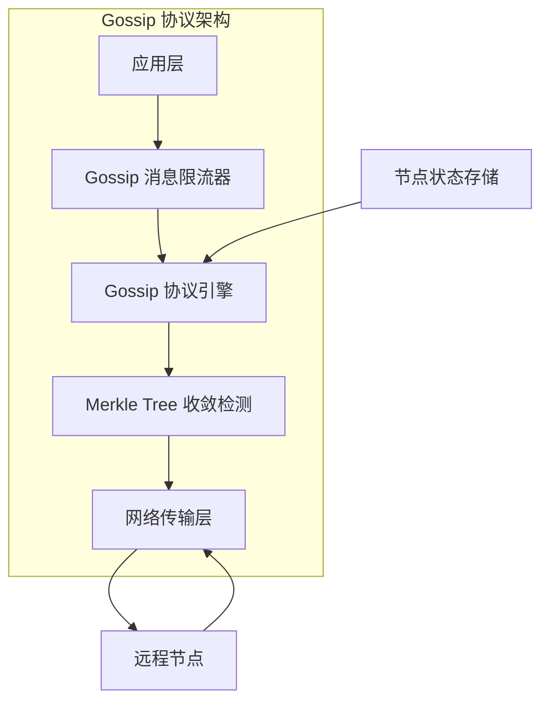
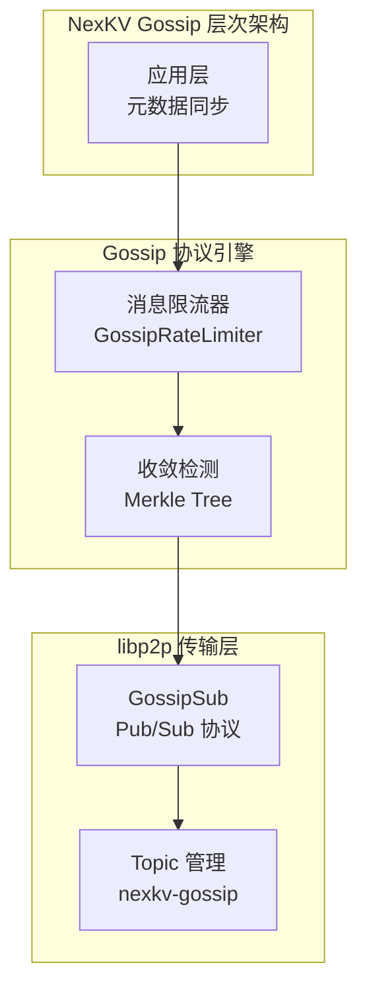
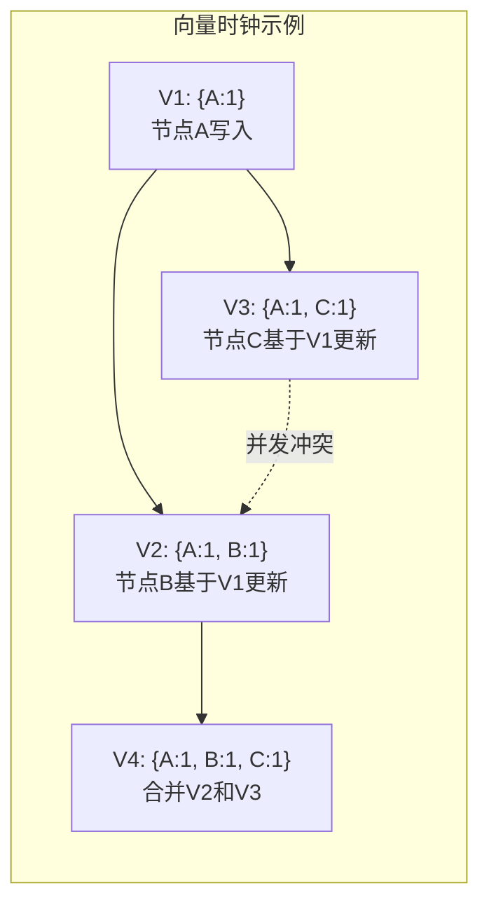
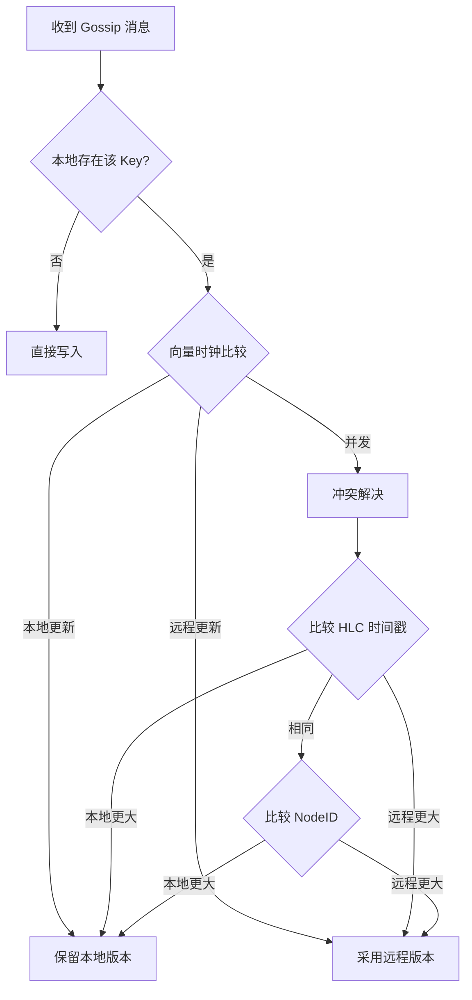
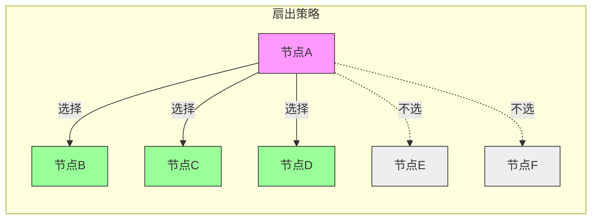

# 深入理解 Gossip 协议实现

## 培训目标

本培训文档旨在帮助开发团队深入理解 NexKV 分布式系统中 Gossip 协议的实现原理、核心机制和工程实践。通过学习本文档，您将能够：

1. 理解 Gossip 协议的基本原理和数学性质
2. 掌握 NexKV 中 Gossip 协议的核心实现
3. 理解 Gossip 收敛性检测机制
4. 了解 Gossip 消息限流策略
5. 能够在实际项目中正确使用和优化 Gossip 协议

## 1. Gossip 协议概述

### 1.1 什么是 Gossip 协议？

Gossip 协议是一种分布式一致性协议，其灵感来源于流行病传播机制。在计算机科学领域，Gossip 协议被广泛应用于分布式系统的状态同步、成员管理、事件传播等场景。其核心思想非常简单：**每个节点定期随机选择若干个邻居节点交换信息，经过多轮传播后，整个集群最终达到一致状态**。

Gossip 协议之所以在分布式系统中广泛应用，主要源于其以下优势：

**首先，Gossip 协议具有极强的容错能力**。由于信息通过多条独立路径传播，个别节点或网络故障不会影响整体一致性。系统可以容忍节点失败、网络分区等故障，只要还有节点存活，信息最终就能传播到整个系统。

**其次，Gossip 协议具有可扩展性**。消息复杂度为 O(log N)，这意味着即使集群规模扩大到数千个节点，消息数量也只会对数增长。这使得 Gossip 协议非常适合大规模分布式系统。

**第三，Gossip 协议实现简单**。相比 Paxos、Raft 等强一致性协议，Gossip 协议的实现要简单得多，不需要复杂的选举、日志复制等机制。

**第四，Gossip 协议最终一致性**。Gossip 协议天然保证最终一致性，信息在有限时间内传播到所有节点，但不同节点可能在某个瞬间看到不同的状态。这种特性非常适合对一致性要求不严格但需要高可用性的场景。

### 1.2 Gossip 协议在 NexKV 中的角色

在 NexKV 分布式 KV 存储系统中，Gossip 协议扮演着至关重要的角色。作为三层一致性架构的基础层组件，Gossip 协议主要负责以下任务：

**第一，元数据传播**。节点信息、分片状态、负载信息等元数据需要传播到所有节点。Gossip 协议确保这些信息在集群中保持最终一致。

**第二，节点发现与成员管理**。新节点加入集群、节点离开（主动退出或故障）都需要通过 Gossip 协议通知其他节点。

**第三，状态同步**。各节点本地状态的变化需要同步到其他节点，包括分片状态、副本状态、负载信息等。

### 1.3 Gossip 协议的数学基础

理解 Gossip 协议的收敛性需要一定的数学基础。假设一个包含 N 个节点的集群，每个节点每轮随机选择 F 个节点进行信息交换（Fanout），经过 k 轮传播后，信息传播到的节点数量大约为：

```
N × (1 - e^(-F × k / N))^F
```

这个公式表明，信息传播速度与 Fanout 数量成正比，与集群规模 N 成反比。当 Fanout 足够大时，传播速度会显著加快，但同时也会增加网络负载。

在 NexKV 中，我们采用动态 Fanout策略，根据集群规模和网络状况自动调整，以在收敛速度和资源消耗之间取得平衡。

## 2. NexKV Gossip 协议核心实现

### 2.1 整体架构

NexKV 的 Gossip 协议实现采用分层架构，主要包含以下几个核心组件：



**Gossip 消息限流器（GossipRateLimiter）** 是整个系统的第一道防线，负责控制消息发送速率，防止网络拥塞。

**Gossip 协议引擎** 是核心组件，负责消息的构造、发送、接收和处理。

**Merkle Tree 收敛检测** 用于判断所有节点是否达到一致状态，是 Gossip 一致性的保障。

**网络传输层** 负责消息的可靠传输。

> **前置知识**: 本文档基于 Day 2-3 培训文档中介绍的 **libp2p GossipSub** 协议。
> 建议先阅读 `2026-02-18_Day2-3-libp2p-Basics.md` 第 270-450 行，了解 PubSub 基础知识。

### 2.1.1 与 libp2p GossipSub 的集成

NexKV 的 Gossip 协议基于 **libp2p GossipSub** 构建，充分利用 libp2p 成熟的 Pub/Sub 基础设施：



**集成架构**:

| 层次 | 组件 | 职责 | 实现位置 |
|------|------|------|---------|
| **应用层** | 元数据同步 | 触发 Gossip 消息 | `internal/metadata/cluster/` |
| **协议层** | GossipRateLimiter | 限流控制 | `internal/metadata/consistency/gossip_rate_limiter.go` |
| **检测层** | Merkle Tree | 收敛检测 | `internal/metadata/consistency/porcupine/gossip_checker.go` |
| **传输层** | libp2p GossipSub | 消息路由 | `github.com/libp2p/go-libp2p-pubsub` |

**使用示例** (参考 Day 2-3 培训文档第 341-409 行):

```go
// GossipService 基于 libp2p GossipSub 的 Gossip 服务
//
// 实际实现位置: internal/p2p/gossip_service.go
type GossipService struct {
    pubsub  *pubsub.PubSub      // libp2p PubSub 实例
    topic   *pubsub.Topic       // Gossip 主题
    sub     *pubsub.Subscription // 订阅句柄
    host    host.Host           // libp2p Host
    limiter *GossipRateLimiter  // 限流器
}

// Start 启动 Gossip 服务
func (g *GossipService) Start(ctx context.Context) error {
    // 1. 创建 GossipSub 实例
    // GossipSub 是 libp2p 提供的高效 PubSub 协议实现
    ps, err := pubsub.NewGossipSub(ctx, g.host,
        pubsub.WithMessageSignaturePolicy(pubsub.StrictNoSign),
    )
    if err != nil {
        return fmt.Errorf("创建 GossipSub 失败: %w", err)
    }

    // 2. 加入 Gossip 主题
    topic, err := ps.Join("nexkv-gossip")
    if err != nil {
        return fmt.Errorf("加入主题失败: %w", err)
    }
    g.topic = topic

    // 3. 订阅主题
    sub, err := topic.Subscribe()
    if err != nil {
        return fmt.Errorf("订阅失败: %w", err)
    }
    g.sub = sub

    // 4. 启动消息接收循环
    go g.receiveLoop(ctx)

    return nil
}

// Publish 发布 Gossip 消息（带限流）
func (g *GossipService) Publish(ctx context.Context, data []byte) error {
    // 检查限流
    if !g.limiter.Allow() {
        return fmt.Errorf("消息被限流")
    }

    return g.topic.Publish(ctx, data)
}

// receiveLoop 消息接收循环
func (g *GossipService) receiveLoop(ctx context.Context) {
    for {
        msg, err := g.sub.Next(ctx)
        if err != nil {
            if ctx.Err() != nil {
                return // 上下文取消，正常退出
            }
            log.Printf("接收消息失败: %v", err)
            continue
        }

        // 处理接收到的 Gossip 消息
        go g.handleMessage(ctx, msg)
    }
}
```

**GossipSub 与直接 Stream 通信的对比**:

| 特性 | GossipSub (PubSub) | 直接 Stream |
|------|-------------------|-------------|
| **消息路由** | 自动多跳传播 | 需手动实现 |
| **成员管理** | 自动维护 | 需手动实现 |
| **消息去重** | 内置支持 | 需手动实现 |
| **适用场景** | 广播消息、状态同步 | 点对点请求/响应 |
| **延迟** | 较高（多跳传播） | 较低（直连） |

NexKV 使用 **GossipSub 处理广播消息**（如元数据同步），使用 **直接 Stream 处理点对点请求**（如 Quorum 投票）。

### 2.2 Gossip 消息限流器实现

在分布式系统中，如果每个节点都无限制地发送 Gossip 消息，可能会导致网络拥塞甚至瘫痪。因此，NexKV 实现了基于令牌桶算法的消息限流器。

#### 2.2.1 令牌桶算法原理

令牌桶是一种常用的流量控制算法。其基本思想是：系统以固定速率向桶中添加令牌，桶的容量有上限。每个消息发送需要消耗一个令牌，当桶为空时，消息必须等待。

令牌桶算法具有以下特性：

**允许突发流量**。由于桶有最大容量（突发容量），当桶中有足够令牌时，可以一次性发送多条消息，而不必严格遵循固定速率。

**平滑输出**。无论输入流量如何波动，令牌桶都能以固定速率输出，避免流量突变。

**易于实现**。只需维护桶中的令牌数和上次更新时间即可。

#### 2.2.2 NexKV 限流器实现

NexKV 的 GossipRateLimiter 实现采用双层限流策略：全局限流和节点级限流。

```go
// GossipRateLimiter Gossip 消息限流器
//
// 设计思路：
//   - 使用令牌桶算法（Token Bucket）
//   - 支持配置化的速率和突发容量
//   - 支持按节点粒度限流
//   - 提供监控指标
type GossipRateLimiter struct {
    mu sync.Mutex

    // 全局限流器配置
    rate       float64   // 每秒产生的令牌数
    burst      int       // 桶的最大容量（突发容量）
    tokens     float64   // 当前令牌数
    lastUpdate time.Time // 上次更新时间

    // 节点级限流器配置
    perNodeRate  float64 // 每个节点每秒产生的令牌数
    perNodeBurst int     // 每个节点的桶最大容量

    // 按节点粒度的限流器
    nodeLimiters map[string]*nodeRateLimiter

    // 监控指标
    metrics *RateLimiterMetrics
}
```

**全局限流器**控制整个节点的消息发送速率，防止本节点成为网络瓶颈。**节点级限流器**控制向特定节点的发送速率，避免对单个节点造成过大压力。

默认配置如下：

```go
func DefaultRateLimiterConfig() *RateLimiterConfig {
    return &RateLimiterConfig{
        Rate:         100, // 全局每秒 100 条消息
        Burst:        200, // 突发 200 条
        PerNodeRate:  20,  // 每节点每秒 20 条
        PerNodeBurst: 50,  // 每节点突发 50 条
        Enabled:      true,
    }
}
```

这个配置意味着：
- 全局发送速率：每秒最多 100 条消息
- 突发容量：最多连续发送 200 条消息
- 单节点速率：每秒最多向同一节点发送 20 条消息
- 单节点突发：最多连续向同一节点发送 50 条消息

#### 2.2.3 限流器核心方法

限流器的核心方法是 AllowN，它判断是否允许发送指定数量的消息：

```go
func (r *GossipRateLimiter) AllowN(n int) bool {
    r.mu.Lock()
    defer r.mu.Unlock()

    now := time.Now()
    elapsed := now.Sub(r.lastUpdate).Seconds()

    // 补充令牌
    r.tokens += elapsed * r.rate
    if r.tokens > float64(r.burst) {
        r.tokens = float64(r.burst)
    }
    r.lastUpdate = now

    // 检查是否有足够的令牌
    if r.tokens >= float64(n) {
        r.tokens -= float64(n)
        r.updateMetrics(true, "", n)
        return true
    }

    r.updateMetrics(false, "", n)
    return false
}
```

这个实现遵循令牌桶的标准算法：

1. **计算时间差**：计算上次更新到当前经过的秒数
2. **补充令牌**：根据时间差和速率补充令牌，但不超过桶的容量
3. **检查令牌**：如果令牌足够，消耗令牌并返回 true；否则返回 false

对于需要向特定节点发送的场景，使用节点级限流检查：

```go
func (r *GossipRateLimiter) AllowNForNode(nodeID string, n int) bool {
    r.mu.Lock()
    defer r.mu.Unlock()

    now := time.Now()

    // 1. 检查全局限流
    // ...（全局检查逻辑）

    // 2. 检查节点级限流
    nodeLimiter, exists := r.nodeLimiters[nodeID]
    if !exists {
        nodeLimiter = &nodeRateLimiter{
            tokens:     float64(r.perNodeBurst),
            lastUpdate: now,
        }
        r.nodeLimiters[nodeID] = nodeLimiter
    }

    // 节点令牌补充和检查逻辑
    // ...

    // 3. 消耗令牌
    r.tokens -= float64(n)
    nodeLimiter.tokens -= float64(n)

    return true
}
```

#### 2.2.4 监控指标

限流器内置完善的监控指标，便于运维人员了解系统运行状态：

```go
type RateLimiterMetrics struct {
    mu sync.RWMutex

    // 全局指标
    TotalMessages   int64 // 总消息数
    AllowedMessages int64 // 允许的消息数
    DroppedMessages int64 // 丢弃的消息数

    // 节点级指标
    NodeMessages   map[string]int64 // 每个节点的消息数
    NodeDropped    map[string]int64 // 每个节点丢弃的消息数
    LastUpdateTime time.Time        // 最后更新时间
}
```

通过 GetDropRate 方法可以计算消息丢弃率：

```go
func (r *GossipRateLimiter) GetDropRate() float64 {
    r.metrics.mu.RLock()
    defer r.metrics.mu.RUnlock()

    if r.metrics.TotalMessages == 0 {
        return 0
    }
    return float64(r.metrics.DroppedMessages) / float64(r.metrics.TotalMessages)
}
```

### 2.3 Gossip 收敛性检测

Gossip 协议的核心特性是最终一致性，但如何判断系统是否已经达到收敛状态是一个重要问题。NexKV 采用 Merkle Tree 技术实现高效的收敛检测。

#### 2.3.1 Merkle Tree 简介

Merkle Tree（默克尔树）是一种哈希二叉树，其叶节点是数据块的哈希值，非叶节点是其子节点哈希值的哈希值。

```mermaid
graph TD
    A[Root Hash<br/>H(ABCD)] --> B[Hash AB<br/>H(AB)]
    A --> C[Hash CD<br/>H(CD)]
    B --> D[Hash A<br/>H(Data1)]
    B --> E[Hash B<br/>H(Data2)]
    C --> F[Hash C<br/>H(Data3)]
    C --> G[Hash D<br/>H(Data4)]
    
    D --> D1[Data1]
    E --> E1[Data2]
    F --> F1[Data3]
    G --> G1[Data4]
```

Merkle Tree 的关键特性是：比较两个树的根哈希值，就能判断两棵树是否相同。如果不同，可以快速定位到不同的子树，从而实现增量同步。

#### 2.3.2 NexKV 收敛检测实现

NexKV 实现了 GossipConvergenceChecker，用于检测所有节点是否达到一致状态：

```go
type GossipConvergenceChecker struct {
    nodes    []ConvergenceNode
    timeout  time.Duration
    interval time.Duration
}
```

核心方法是 WaitForConvergence：

```go
func (c *GossipConvergenceChecker) WaitForConvergence(ctx context.Context) error {
    // 边界情况：没有节点或只有一个节点
    if len(c.nodes) == 0 || len(c.nodes) == 1 {
        return nil
    }

    deadline := time.Now().Add(c.timeout)

    for time.Now().Before(deadline) {
        // 检查是否已收敛
        if c.isConverged() {
            return nil
        }

        // 等待下一次检测
        select {
        case <-ctx.Done():
            return ctx.Err()
        case <-time.After(c.interval):
        }
    }

    // 超时，返回详细诊断信息
    return c.buildConvergenceError()
}
```

isConverged 方法通过比较所有节点的 Merkle Root 判断是否收敛：

```go
func (c *GossipConvergenceChecker) isConverged() bool {
    if len(c.nodes) == 0 {
        return true
    }

    // 获取第一个节点的 Merkle Root 作为基准
    baseRoot := c.nodes[0].GetMerkleRoot()

    // 检查所有节点 Merkle Root 是否一致
    for _, node := range c.nodes[1:] {
        root := node.GetMerkleRoot()
        if baseRoot != root {
            return false
        }
    }
    return true
}
```

如果收敛超时，buildConvergenceError 方法会生成详细的诊断信息，帮助定位问题节点：

```go
func (e *ConvergenceError) GetDiagnostics() string {
    result := fmt.Sprintf("Convergence Timeout: %v\n", e.Timeout)
    result += fmt.Sprintf("Divergent Nodes: %v\n", e.DivergentNodes)
    result += "Node Merkle Roots:\n"
    for nodeID, root := range e.NodeRoots {
        result += fmt.Sprintf("  %s: %s\n", nodeID, root)
    }
    return result
}
```

#### 2.3.5 版本向量与冲突解决

Gossip 协议在传播过程中可能遇到并发写冲突：多个节点同时修改同一 Key，由于传播延迟，不同节点可能看到不同的值。NexKV 使用**向量时钟（Vector Clock）**和 **Last-Writer-Wins (LWW)** 策略解决这类冲突。

**向量时钟机制**

向量时钟是一种跟踪数据因果关系的机制，每个节点维护自己的逻辑时钟：

```go
// VectorClock 向量时钟
//
// 用于跟踪数据的因果关系，检测并发写冲突
// 实际实现位置: internal/metadata/version/vector_clock.go
type VectorClock struct {
    mu     sync.RWMutex
    Clocks map[string]uint64 // NodeID -> Version
}

// NewVectorClock 创建新的向量时钟
func NewVectorClock() *VectorClock {
    return &VectorClock{
        Clocks: make(map[string]uint64),
    }
}

// Increment 递增本节点的时钟
func (vc *VectorClock) Increment(nodeID string) uint64 {
    vc.mu.Lock()
    defer vc.mu.Unlock()

    vc.Clocks[nodeID]++
    return vc.Clocks[nodeID]
}

// Merge 合并另一个向量时钟（取各节点的最大值）
func (vc *VectorClock) Merge(other *VectorClock) {
    vc.mu.Lock()
    defer vc.mu.Unlock()

    for nodeID, version := range other.Clocks {
        if current, exists := vc.Clocks[nodeID]; !exists || version > current {
            vc.Clocks[nodeID] = version
        }
    }
}

// IsConcurrent 判断两个版本是否并发（无因果关系）
//
// 并发定义：两个版本互相不包含对方，即：
// - 版本 A 不是版本 B 的祖先
// - 版本 B 也不是版本 A 的祖先
func (vc *VectorClock) IsConcurrent(other *VectorClock) bool {
    vc.mu.RLock()
    defer vc.mu.RUnlock()

    hasBefore := false // vc 中有比 other 小的版本
    hasAfter := false  // vc 中有比 other 大的版本

    // 检查 vc 相对于 other 的关系
    for nodeID, version := range vc.Clocks {
        otherVersion, exists := other.Clocks[nodeID]
        if !exists {
            // other 没有这个节点的记录，vc 更新
            hasAfter = true
        } else if version < otherVersion {
            hasBefore = true
        } else if version > otherVersion {
            hasAfter = true
        }
    }

    // 检查 other 中 vc 没有的节点
    for nodeID := range other.Clocks {
        if _, exists := vc.Clocks[nodeID]; !exists {
            hasBefore = true
        }
    }

    // 如果同时有 before 和 after，说明是并发
    return hasBefore && hasAfter
}
```



**冲突解决策略：Last-Writer-Wins (LWW)**

当检测到并发写冲突时，NexKV 使用 HLC（Hybrid Logical Clock）时间戳进行裁决：

```go
// ConflictResolver 冲突解决器
//
// 使用 Last-Writer-Wins 策略解决并发冲突
type ConflictResolver struct {
    localNodeID string
}

// Resolve 解决冲突，返回应该保留的值
//
// 规则：选择 HLC 时间戳较大的版本
// 如果时间戳相同，选择 NodeID 字典序较大的版本（保证确定性）
func (cr *ConflictResolver) Resolve(local, remote *VersionedValue) *VersionedValue {
    // 比较向量时钟
    relation := cr.compareVectorClocks(local.VectorClock, remote.VectorClock)

    switch relation {
    case ClockBefore:
        // 本地版本较早，使用远程版本
        return remote
    case ClockAfter:
        // 本地版本较新，保留本地版本
        return local
    case ClockConcurrent:
        // 并发冲突，使用 LWW 策略
        return cr.resolveByTimestamp(local, remote)
    default:
        return local
    }
}

// resolveByTimestamp 使用时间戳解决并发冲突
func (cr *ConflictResolver) resolveByTimestamp(local, remote *VersionedValue) *VersionedValue {
    // 优先选择时间戳较大的
    if local.HLCTimestamp > remote.HLCTimestamp {
        return local
    } else if local.HLCTimestamp < remote.HLCTimestamp {
        return remote
    }

    // 时间戳相同，选择 NodeID 字典序较大的（保证确定性）
    if local.NodeID > remote.NodeID {
        return local
    }
    return remote
}

// VersionedValue 带版本信息的值
type VersionedValue struct {
    Value        []byte       // 实际数据
    VectorClock  *VectorClock // 向量时钟
    HLCTimestamp uint64       // HLC 时间戳
    NodeID       string       // 写入节点 ID
}
```

**Gossip 消息中的版本处理**:

```go
// GossipMessage Gossip 消息结构（带版本信息）
type GossipMessage struct {
    Type      MessageType   `msgpack:"type"`
    Payload   []byte        `msgpack:"payload"`
    Timestamp int64         `msgpack:"timestamp"`

    // 版本控制字段
    VectorClock  map[string]uint64 `msgpack:"vector_clock"`
    HLCTimestamp uint64            `msgpack:"hlc_timestamp"`
    SourceNode   string            `msgpack:"source_node"`
}

// HandleGossipUpdate 处理 Gossip 更新（带冲突检测）
func (g *GossipService) HandleGossipUpdate(ctx context.Context, msg *GossipMessage) error {
    // 1. 解析消息中的向量时钟
    incomingVC := NewVectorClock()
    for nodeID, version := range msg.VectorClock {
        incomingVC.Clocks[nodeID] = version
    }

    // 2. 获取本地版本
    localValue, exists := g.store.GetVersioned(msg.Key)
    if !exists {
        // 本地不存在，直接写入
        return g.store.PutVersioned(msg.Key, &VersionedValue{
            Value:        msg.Payload,
            VectorClock:  incomingVC,
            HLCTimestamp: msg.HLCTimestamp,
            NodeID:       msg.SourceNode,
        })
    }

    // 3. 检测冲突
    if localValue.VectorClock.IsConcurrent(incomingVC) {
        // 并发冲突，使用 LWW 解决
        resolver := &ConflictResolver{localNodeID: g.localNodeID}
        winner := resolver.Resolve(localValue, &VersionedValue{
            Value:        msg.Payload,
            VectorClock:  incomingVC,
            HLCTimestamp: msg.HLCTimestamp,
            NodeID:       msg.SourceNode,
        })

        // 写入获胜版本
        return g.store.PutVersioned(msg.Key, winner)
    }

    // 4. 无冲突，合并向量时钟并写入
    localValue.VectorClock.Merge(incomingVC)
    if msg.HLCTimestamp > localValue.HLCTimestamp {
        localValue.Value = msg.Payload
        localValue.HLCTimestamp = msg.HLCTimestamp
    }
    return g.store.PutVersioned(msg.Key, localValue)
}
```

**冲突解决流程**:



### 2.4 Gossip 消息传播机制

#### 2.4.1 扇出策略

Gossip 协议的传播效率取决于每轮选择多少个节点进行信息交换。在 NexKV 中，我们实现了自适应扇出策略：



**固定扇出**：每轮选择固定数量的节点，适合网络稳定的场景。

**随机扇出**：每轮随机选择节点，实现简单，但可能导致收敛时间不确定。

**自适应扇出**：根据网络状况和收敛速度动态调整扇出数量。初始阶段使用较大的扇出加速传播，后期可以减小扇出以节省资源。

#### 2.4.2 批量限流发送

NexKV 提供了 BatchRateLimit 方法，简化批量发送的限流处理：

```go
func (r *GossipRateLimiter) BatchRateLimit(
    ctx context.Context,
    nodeIDs []string,
    sendFunc func(nodeID string) error,
) (successCount int, droppedCount int, lastError error) {
    for _, nodeID := range nodeIDs {
        // 检查上下文是否已取消
        if ctx.Err() != nil {
            break
        }

        // 检查是否允许发送
        if !r.AllowForNode(nodeID) {
            droppedCount++
            continue
        }

        // 执行发送
        if err := sendFunc(nodeID); err != nil {
            lastError = err
            continue
        }

        successCount++
    }

    return successCount, droppedCount, lastError
}
```

## 3. Gossip 协议配置与调优

### 3.1 配置参数

NexKV 的 Gossip 协议支持丰富的配置选项：

| 参数 | 默认值 | 说明 |
|------|--------|------|
| Rate | 100 | 全局每秒产生的令牌数 |
| Burst | 200 | 桶的最大容量（突发容量） |
| PerNodeRate | 20 | 每个节点每秒产生的令牌数 |
| PerNodeBurst | 50 | 每个节点的桶最大容量 |
| Enabled | true | 是否启用限流 |

### 3.2 调优策略

**高流量场景**：如果系统产生大量 Gossip 消息，可以适当增加 Rate 和 Burst 值。

**高并发场景**：如果需要同时向多个节点发送消息，增加 PerNodeRate 和 PerNodeBurst。

**网络受限场景**：如果网络带宽有限，降低 Rate 以减少消息发送量。

### 3.3 动态配置

NexKV 支持运行时动态调整限流参数：

```go
// 动态设置速率
func (r *GossipRateLimiter) SetRate(rate float64)

// 动态设置突发容量
func (r *GossipRateLimiter) SetBurst(burst int)
```

## 4. Gossip 协议最佳实践

### 4.1 使用场景

Gossip 协议适用于以下场景：

1. **最终一致性要求**：对数据一致性没有强实时要求，可以接受短暂的不一致。
2. **高可用性要求**：需要系统在任何情况下都能继续提供服务。
3. **大规模集群**：节点数量众多，需要可扩展的同步机制。
4. **去中心化架构**：没有中心节点，需要分布式协调。

### 4.2 注意事项

1. **延迟考虑**：Gossip 协议是异步的，信息传播需要时间。对于需要强一致性的操作，不应依赖 Gossip。
2. **网络开销**：虽然消息复杂度是 O(log N)，但在大规模集群中，消息总量仍然可观。需要合理配置限流参数。
3. **收敛时间**：需要根据业务需求调整扇出策略和超时时间，确保在可接受时间内达到收敛。
4. **监控告警**：应该监控收敛状态和消息丢弃率，及时发现和处理异常。

## 5. 案例分析：NexKV 元数据同步

### 5.1 场景描述

在 NexKV 中，Gossip 协议主要用于元数据的最终一致性同步。考虑以下场景：

1. 新节点加入集群，需要获取当前集群的完整视图
2. 分片状态变化（如从 Active 变为 Migrating），需要通知所有相关节点
3. 节点负载信息变化，需要让负载均衡器感知

### 5.2 同步流程

```mermaid
sequenceDiagram
    participant A as 节点A
    participant B as 节点B
    participant C as 节点C
    
    Note over A: 本地状态变更
    A->>A: 更新本地状态
    A->>A: 计算新 Merkle Root
    
    A->>B: Gossip消息(带Merkle信息)
    A->>C: Gossip消息(带Merkle信息)
    
    B->>B: 验证Merkle Root
    C->>C: 验证Merkle Root
    
    B-->>A: 确认接收
    C-->>A: 确认接收
    
    Note over A,B,C: 经过多轮传播<br/>所有节点达到一致
```

### 5.3 异常处理

**节点故障**：如果某个节点在 Gossip 传播过程中故障，其他节点会继续传播该节点的信息，最终在超时后将其从成员列表中移除。

**网络分区**：在网络分区情况下，分区内的节点仍然可以相互同步，分区恢复后，通过 Merkle Tree 收敛检测可以快速发现并同步差异数据。

**消息丢失**：Gossip 协议本身不保证消息可靠送达，但通过多轮传播和冗余发送，可以将消息丢失的影响降到最低。

## 6. 总结

本文档详细介绍了 NexKV 中 Gossip 协议的实现原理和工程实践。核心要点包括：

1. **令牌桶限流**：使用全局和节点级双层令牌桶，确保系统稳定性。
2. **Merkle Tree 收敛检测**：通过 Merkle Root 比较，快速判断集群是否达到一致状态。
3. **可配置性**：丰富的配置选项和动态调整能力，满足不同场景需求。
4. **完善监控**：内置监控指标，便于运维和故障诊断。

Gossip 协议是 NexKV 分布式架构的重要组成部分，理解其实现对于正确使用和优化系统至关重要。

## 7. 参考资料

- 流行病传播模型与 Gossip 协议理论
- Amazon Dynamo 论文中的 Gossip 同步机制
- Cassandra 中的 Gossip 协议实现
- Merkle Tree 在分布式系统中的应用
