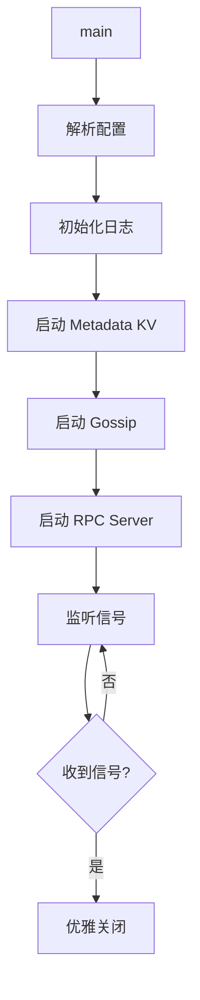

# 阶段 0：现状摸底（建立地图）

> 在深入细节前，先建立项目的"高空视图"，知道自己在什么地方。

**预计时间**：2-3 小时
**状态**：⏳ 待开始

---

## 📋 任务清单

### Step 0.1：绘制启动流程图（30min）

```bash
# 找到入口文件
cd /Users/zhangcz/ws/go/src/github.com/jzhang405/NexKV
ls cmd/                    # 找到 main 入口
```

**任务**：
1. [ ] 打开 `cmd/` 目录下的 main.go
2. [ ] 从 `main()` 函数开始，逐层追踪初始化调用
3. [ ] 画出调用链（用 Mermaid）

**命令参考**：
```bash
# 查看入口文件
cat cmd/nexkv/main.go

# 追踪关键初始化函数
grep -r "New.*Manager\|Init.*Service" internal/
```

---

### Step 0.2：模块清单盘点（45min）

**任务**：
1. [ ] 列出 `internal/` 下所有子目录
2. [ ] 为每个模块填写"身份卡"：

#### 模块身份卡模板

| 模块名 | 一句话职责 | 输入 | 输出 | 依赖谁 | 被谁依赖 |
|--------|-----------|------|------|--------|----------|
| metadata/cluster | 集群元数据管理 | 节点注册请求 | 节点列表 | sync.Map | gossip/ |
| gossip/ | Gossip 协议实现 | 节点状态 | 广播消息 | metadata/ | 所有模块 |

**命令参考**：
```bash
# 列出所有模块
ls -la internal/

# 查看模块的主要接口
find internal/ -name "*.go" -exec grep -l "^type.*interface" {} \;
```

---

### Step 0.3：关键数据结构盘点（45min）

**任务**：
1. [ ] 找出所有定义的核心 struct
2. [ ] 对每个关键 struct 记录：
   - 核心字段（前 5 个）
   - 并发保护方式
   - 生命周期

#### 关键 Struct 审查模板

```markdown
## StructName

**文件位置**：`internal/pkg/struct.go:42`

**核心字段**：
| 字段名 | 类型 | 说明 |
|--------|------|------|
| field1 | string | ... |
| field2 | int32 | ... |

**并发保护**：
- 保护方式：sync.RWMutex / sync.Map / atomic
- 读写比例：读多写少 / 均衡 / 写多读少

**生命周期**：
- 创建时机：系统启动时 / 按需创建
- 销毁时机：系统关闭时 / 引用计数为0
```

**命令参考**：
```bash
# 查找所有 struct 定义
grep -r "^type.*struct" internal/ --include="*.go" | head -20

# 查找带注释的 struct
grep -B5 "^type.*struct" internal/ --include="*.go" | grep "//"
```

---

## 📝 产出物模板

### 启动流程图模板



---

## ✅ 完成自检

- [ ] 我能口头描述"系统启动时依次发生了什么"
- [ ] 我能说出至少 5 个模块的职责
- [ ] 我知道哪些地方用了锁，哪些地方没加锁

---

## 📌 本阶段产出文件

- `phase0_startup_flow.md` - 启动流程图
- `phase0_module_inventory.md` - 模块清单
- `phase0_key_structs.md` - 关键数据结构
