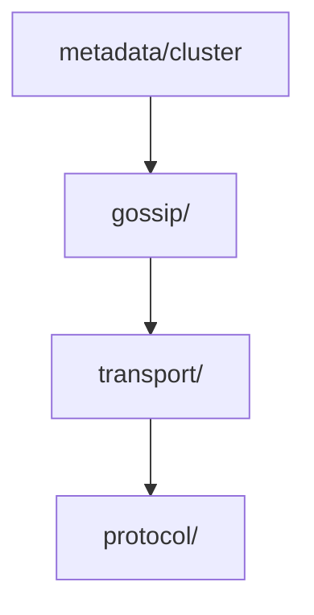

# 阶段 1：架构边界审查（厘清职责）

> 发现模块间的"越界行为"——一个模块不该直接访问另一个模块的内部细节。

**预计时间**：4-6 小时
**状态**：⏳ 待开始

---

## 📋 任务清单

### Step 1.1：绘制依赖关系图（1h）

**任务**：
1. [ ] 分析 import 关系，画出模块依赖图
2. [ ] 检查是否存在**循环依赖**（严重问题）

**命令参考**：
```bash
# 分析每个模块的 import
find internal/ -name "*.go" -exec grep -A20 "^import (" {} \; | grep "jzhang405/NexKV"

# 生成依赖关系（使用 go list）
go list -f '{{.ImportPath}} {{join .Imports " "}}' ./internal/...
```

#### 依赖关系图模板



#### 循环依赖检查清单

- [ ] 无循环依赖
- [ ] 依赖方向清晰（高层依赖低层）
- [ ] 没有跨层依赖（如存储层直接调用 API 层）

---

### Step 1.2：接口边界检查（1.5h）

**任务**：
1. [ ] 检查模块间通信是否通过**接口**而非直接调用实现
2. [ ] 评估每个 interface 的设计

**命令参考**：
```bash
# 找出所有 interface 定义
grep -r "^type.*interface" internal/ --include="*.go"

# 找出未使用的接口
grep -r "^type.*interface" internal/ --include="*.go" | cut -d: -f1 | sort -u
```

#### 接口审查清单

| 接口名 | 方法数 | 文档 | 评估 |
|--------|--------|------|------|
| ClusterManager | 8 | ✅ 有 | ✅ 合理 |
| GossipService | 15 | ❌ 无 | ⚠️ 过大，考虑拆分 |

**接口设计原则**：
- [ ] 接口职责单一（SOLID 中的 ISP）
- [ ] 方法数量合理（3-7 个为佳）
- [ ] 有清晰的文档说明

---

### Step 1.3：职责越界检查（1.5h）

**任务**：
1. [ ] 检查模块是否直接操作其他模块的内部数据
2. [ ] 识别"上帝对象"

**典型反模式**：

```go
// ❌ 反例：gossip 模块直接操作 metadata 的内部 map
gossip.SendUpdate(metadata.hostMap["node-1"].Status)

// ✅ 正例：通过接口访问
gossip.SendUpdate(metadata.GetHostStatus("node-1"))
```

**检查点**：
- [ ] 没有 `.` 链式调用访问深层内部字段
- [ ] 模块间通信通过定义的接口进行
- [ ] 每个模块只管理自己的内部状态

---

## 📝 产出物模板

### 职责越界记录模板

```markdown
## 发现的问题

### P0 - 严重

| 位置 | 问题 | 影响 | 修复建议 |
|------|------|------|----------|
| gossip/send.go:42 | 直接访问 metadata 内部 map | 并发安全风险 | 通过接口访问 |

### P1 - 中等

| 位置 | 问题 | 影响 | 修复建议 |
|------|------|------|----------|
| ... | ... | ... | ... |
```

---

## ✅ 完成自检

- [ ] 我能画出清晰的模块依赖图（无循环依赖）
- [ ] 每个模块对外暴露的接口都有文档说明
- [ ] 没有发现明显的职责越界（或已记录待修复）

---

## 📌 本阶段产出文件

- `phase1_dependency_graph.md` - 依赖关系图
- `phase1_interface_analysis.md` - 接口分析
- `phase1_boundary_violations.md` - 职责越界记录
