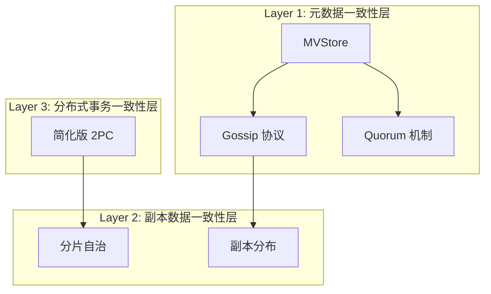
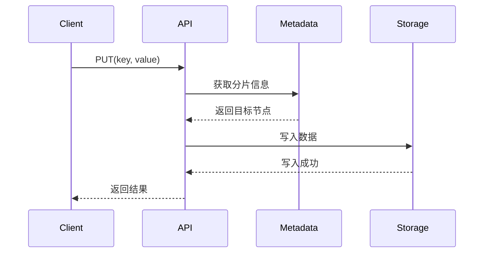

# 阶段 5：可观测性与文档补全（长期可控）

> 建立让你"看懂系统运行状态"的能力，为未来的维护打下基础。

**预计时间**：2-3 小时
**状态**：⏳ 待开始

---

## 📋 任务清单

### Step 5.1：日志审查（1h）

**任务**：
1. [ ] 检查日志输出的完整性
2. [ ] 验证日志级别的合理性
3. [ ] 确保关键路径有日志覆盖

#### 日志检查清单

| 检查项 | 说明 | 检查结果 |
|--------|------|----------|
| 日志级别使用 | DEBUG/INFO/WARN/ERROR 分层合理 | [ ] |
| 关键操作日志 | 启动/停止/选举/迁移都有日志 | [ ] |
| 上下文信息 | 日志包含必要的追踪信息 | [ ] |
| 结构化日志 | 使用 JSON 或其他结构化格式 | [ ] |
| 日志轮转 | 配置了日志轮转策略 | [ ] |

#### 关键日志点

| 场景 | 必需日志字段 | 示例 |
|------|-------------|------|
| 节点启动 | node_id, cluster_id, listen_addr | `INFO node=node-1 cluster=nexkv-prod starting` |
| 节点停止 | node_id, reason | `INFO node=node-1 stopping: graceful shutdown` |
| Leader 选举 | node_id, term, prev_leader | `INFO node=node-3 became leader term=5 prev=node-1` |
| 数据迁移 | shard_id, from, to, progress | `INFO shard=shard-001 migrating from=node-1 to=node-2 50%` |
| 请求超时 | node_id, target, timeout | `WARN node=node-1 request to node-2 timeout after 5s` |

**命令参考**：
```bash
# 检查日志配置
grep -rn "log\." internal/ --include="*.go" | grep -E "SetLevel|Init|New"

# 查找关键路径是否有日志
grep -rn "func.*Start\|func.*Stop\|func.*Elect" internal/ --include="*.go" -A5
```

---

### Step 5.2：Metrics 补充（1h）

**任务**：
1. [ ] 检查现有监控指标
2. [ ] 补充缺失的关键指标
3. [ ] 配置 Prometheus 导出

#### 关键 Metrics 清单

| 类别 | 指标名 | 类型 | 说明 | 优先级 |
|------|--------|------|------|--------|
| 性能 | qps | Gauge | 每秒请求数 | P0 |
| 性能 | latency | Histogram | 请求延迟分布 | P0 |
| 集群 | nodes_up | Gauge | 在线节点数 | P0 |
| 集群 | leader_changes | Counter | Leader 变更次数 | P1 |
| 数据 | shards_total | Gauge | 分片总数 | P1 |
| 数据 | bytes_written | Counter | 写入字节数 | P1 |
| 错误 | requests_failed | Counter | 失败请求数 | P0 |
| 错误 | errors_total | Counter | 错误总数 | P1 |

#### Prometheus 配置示例

```yaml
# prometheus.yml
scrape_configs:
  - job_name: 'nexkv'
    static_configs:
      - targets: ['localhost:9091']
    scrape_interval: 15s
```

**命令参考**：
```bash
# 检查是否已有 metrics
grep -rn "prometheus\|metrics" internal/ --include="*.go"

# 查找 HTTP 端点注册
grep -rn "http\.HandleFunc\|mux\.Handle" internal/ --include="*.go"
```

---

### Step 5.3：补全关键文档（1h）

**任务**：
1. [ ] 创建/更新架构图
2. [ ] 绘制数据流图
3. [ ] 记录关键设计决策

#### 必需文档

| 文档 | 说明 | 模板 |
|------|------|------|
| 架构图 | 展示模块关系 | 用 Mermaid 绘制 |
| 数据流图 | 写请求完整路径 | 用 Mermaid sequenceDiagram |
| 设计决策 | 为什么这样设计 | ADR 模板 |

##### 架构图模板



##### 数据流图模板



##### ADR 模板

```markdown
# ADR-XXX: [标题]

## 状态
[已提议 / 已批准 / 已废弃]

## 背景
[为什么需要这个决策]

## 决策
[我们决定做什么]

## 后果
[正面和负面的影响]

## 替代方案
[我们考虑过但放弃的方案]
```

---

## 📝 产出清单

### 日志
- [ ] `phase5_log_audit.md` - 日志审查报告
- [ ] 日志配置优化建议

### Metrics
- [ ] `phase5_metrics_plan.md` - Metrics 补充计划
- [ ] Prometheus 配置文件
- [ ] Metrics 导出代码（如需新增）

### 文档
- [ ] `phase5_documentation_update.md` - 文档更新总结
- [ ] 架构图（更新到 docs/02_design/）
- [ ] 数据流图（更新到 docs/02_design/）
- [ ] 设计决策记录（更新到 docs/02_design/decisions/）

---

## ✅ 完成自检

- [ ] 我能通过日志追踪一个请求的完整生命周期
- [ ] 我有指标监控集群健康状态
- [ ] 新人能通过文档快速理解系统设计

---

## 📌 本阶段产出文件

- `phase5_log_audit.md` - 日志审查报告
- `phase5_metrics_plan.md` - Metrics 补充计划
- `phase5_documentation_update.md` - 文档更新总结
