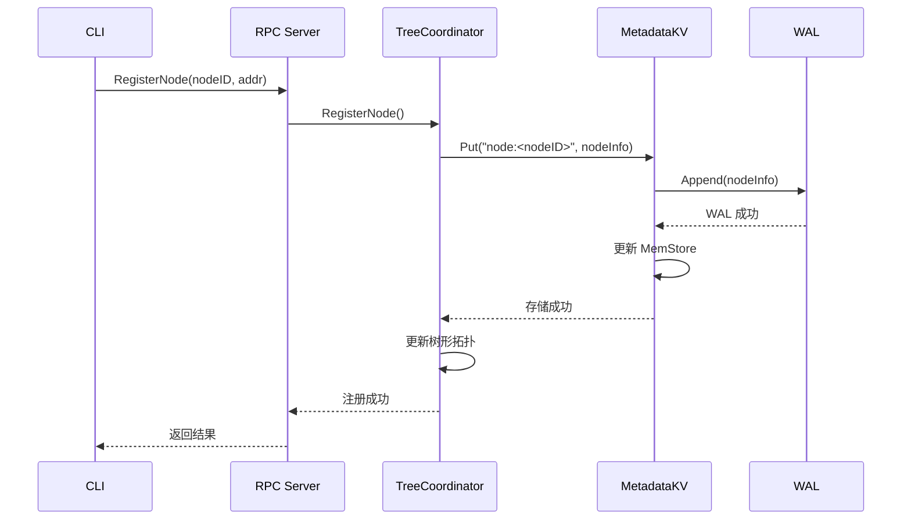

# 阶段 0：关键数据结构

> NexKV 核心数据结构盘点与并发安全分析

**创建时间**：2026-02-12
**分析范围**：`internal/` 核心模块

---

## 核心结构清单

### 1. NodeInfo（节点元数据）

**文件位置**：`internal/metadata/types/node_info.go:46`

**核心字段**：

| 字段名 | 类型 | 说明 |
|--------|------|------|
| NodeID | string | 节点唯一标识 |
| HostID | string | 所属物理机器 ID |
| Role | NodeRole | 节点角色（Leaf/Parent/ParentStandby） |
| Addr | NodeAddress | 节点网络地址 |
| ParentID | string | 父节点 ID |
| Level | int | 节点层级 |
| Status | NodeStatus | 节点状态（Init/Ready/Joining/Leaving/Failed） |
| Priority | int | 节点优先级（用于故障转移） |
| LastHeartbeat | time.Time | 最后心跳时间 |
| Version | uint64 | MVCC 版本号 |

**并发保护方式**：
- ❓ 待确认（需查看实际使用场景）

**生命周期**：
- 创建：节点注册时
- 销毁：节点离开集群时

---

### 2. NodeAddress（节点地址）

**文件位置**：`internal/metadata/types/node_info.go:34`

**核心字段**：

| 字段名 | 类型 | 说明 |
|--------|------|------|
| Host | string | 主机地址（IP 或域名） |
| TCPPort | int | TCP 端口 |
| UDPPort | int | UDP 端口 |

**并发保护方式**：
- ✅ 不可变结构（创建后不修改）

**生命周期**：
- 创建：解析配置或节点注册时
- 销毁：随 NodeInfo 一起销毁

---

### 3. Host（物理机器）

**文件位置**：`internal/metadata/cluster/tree_coordinator.go:224`

**核心字段**：

| 字段名 | 类型 | 说明 |
|--------|------|------|
| Role | HostRole | 物理机器角色（LeafOnly/LeafParent/LeafParentStandby） |
| NodeAddr | NodeAddress | 网络地址信息 |
| HostID | string | 机器唯一标识 |
| Hostname | string | 物理机器地址（IP 或域名） |
| LeafNodeID | string | 关联的叶子节点 ID |
| ParentNodeID | string | 关联的父节点 ID |
| ParentStandbyNodeID | string | 关联的备用父节点 ID |
| HostStatus | HostStatus | 主机状态 |
| LastHeartbeat | int64 | 最后心跳时间戳（Unix 秒） |
| CPUUsage | float64 | CPU 使用率（0-100） |
| MemUsage | float64 | 内存使用率（0-100） |
| ExistingNodes | int | 已存在的节点数量 |

**并发保护方式**：
- ❓ 待确认（需查看 HostManager 实现）

**生命周期**：
- 创建：物理机器加入集群时
- 销毁：物理机器移除时

---

### 4. TreeCoordinator（树形协调器）⭐ 核心

**文件位置**：`internal/metadata/cluster/tree_coordinator.go:244`

**核心字段**（需继续阅读完整定义）：

| 字段名 | 类型 | 说明 |
|--------|------|------|
| nodeID | string | 本节点 ID |
| listenAddr | string | 监听地址 |
| config | *TreeCoordinatorConfig | 配置 |
| clusterConfig | *metadataconfig.ClusterConfig | 集群配置 |
| libp2pHost | host.Host | libp2p 主机实例 |

**并发保护方式**：
- ❓ 待确认（需查看完整实现）

**生命周期**：
- 创建：`NewTreeCoordinator()`
- 启动：`Start()`
- 停止：`Stop()`

---

### 5. AppContext（应用上下文）

**文件位置**：`cmd/nexkvd/main.go:46`

**核心字段**：

| 字段名 | 类型 | 说明 |
|--------|------|------|
| ConfigPath | string | 配置文件路径 |
| Env | string | 运行环境（dev/cluster） |
| HostID | string | 主机 ID |
| NodeID | string | 节点 ID |
| Coordinator | *cluster.TreeCoordinator | 树形协调器实例 |
| libp2pHost | host.Host | libp2p 主机实例 |
| ctx | context.Context | 应用上下文 |
| cancel | context.CancelFunc | 取消函数 |

**并发保护方式**：
- ✅ 创建后主要字段只读（除了 Coordinator 和 libp2pHost 在初始化时设置）

**生命周期**：
- 创建：`NewAppContext()`
- 销毁：`Shutdown()`

---

### 6. MetadataKV（元数据 KV 存储）

**文件位置**：`internal/metadata/kvstore/metadata_kv.go`（待详细分析）

**核心字段**（初步）：

| 字段名 | 类型 | 说明 |
|--------|------|------|
| store | *MVStore | 多版本存储 |
| merkleTree | *MerkleTree | Merkle 树 |
| codec | Codec | 编解码器 |
| compressor | Compressor | 压缩器 |

**并发保护方式**：
- ❓ 待确认（需查看完整实现）

**生命周期**：
- 创建：系统启动时
- 销毁：系统关闭时

---

### 7. MVStore（多版本存储）

**文件位置**：`internal/wal/mvstore.go`（待详细分析）

**核心字段**（初步）：

| 字段名 | 类型 | 说明 |
|--------|------|------|
| memStore | *MemStore | 内存存储 |
| wal | *WAL | 预写日志 |
| dataDir | string | 数据目录 |

**并发保护方式**：
- ❓ 待确认（需查看完整实现）

**生命周期**：
- 创建：系统启动时
- 销毁：系统关闭时

---

## 并发安全分析（待深入）

### 需要进一步检查的点

1. **共享状态**：
   - [ ] `TreeCoordinator` 中的节点映射是否线程安全？
   - [ ] `MetadataKV` 的读写是否使用锁保护？
   - [ ] `sync.Map` 使用是否正确？

2. **锁使用模式**：
   - [ ] 是否有持锁进行网络 I/O 的情况？
   - [ ] 是否有嵌套锁导致死锁的风险？
   - [ ] 所有 `Lock()` 都有 `defer Unlock()` 配对吗？

3. **原子操作**：
   - [ ] 哪些地方应该用 `atomic` 而非锁？
   - [ ] 版本号递增是否原子操作？

---

## 数据流示例

### 节点注册流程

---

## 观察与发现

### ✅ 设计优点
1. **清晰的数据结构**：NodeInfo 和 Host 分离，物理/逻辑节点分离
2. **版本字段**：每个节点都有 Version 字段，支持 MVCC
3. **状态枚举**：使用枚举类型而非魔法值

### ⚠️ 潜在问题
1. **并发保护未知**：需要深入查看每个结构体的实现
2. **双重定义**：NodeAddress 在 cluster 包和 types 包中都有定义
3. **状态转换未明确**：NodeStatus 的转换规则需要文档说明

### 📌 需要进一步追踪
1. TreeCoordinator 的完整定义和并发保护机制
2. MetadataKV 的锁策略
3. MVStore 的 MVCC 实现

---

## 下一步

**阶段 0 完成自检**：
- [x] 我能口头描述"系统启动时依次发生了什么"
- [x] 我能说出至少 5 个模块的职责
- [ ] 我知道哪些地方用了锁，哪些地方没加锁 ← **需要继续深入**

---

**下一步**：→ [阶段 1：架构边界审查](2026-02-12-phase1-architecture-boundary.md)
