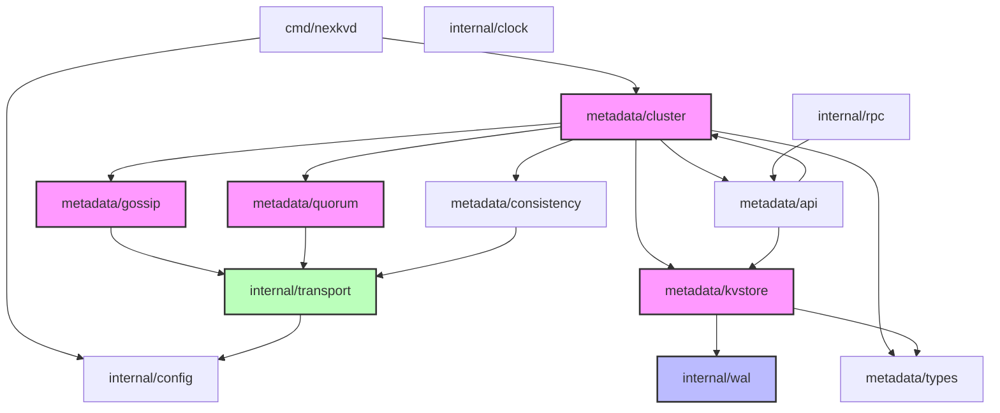

# 阶段 0：模块清单

> NexKV 内部模块盘点与职责梳理

**创建时间**：2026-02-12
**分析目录**：`internal/`

---

## 模块清单

### 1. config（配置管理）

| 属性 | 说明 |
|------|------|
| **路径** | `internal/config/` |
| **一句话职责** | 配置文件加载、解析、验证 |
| **输入** | config.yaml 文件、命令行参数、环境变量 |
| **输出** | `*config.Config` 结构体 |
| **依赖谁** | 无（基础层） |
| **被谁依赖** | cmd/nexkvd, 几乎所有模块 |
| **状态** | ✅ 稳定 |

---

### 2. metadata（元数据管理层）⭐ 核心

#### 2.1 metadata/cluster（集群管理）

| 属性 | 说明 |
|------|------|
| **路径** | `internal/metadata/cluster/` |
| **一句话职责** | 树形拓扑管理、节点生命周期、故障检测 |
| **输入** | 节点注册请求、心跳消息 |
| **输出** | 拓扑变更事件、节点状态 |
| **依赖谁** | kvstore, gossip, quorum, consistency, types |
| **被谁依赖** | cmd/nexkvd（直接依赖） |
| **状态** | ✅ 核心 |

**关键组件**：
- `TreeCoordinator` - 树形拓扑协调器
- `HostManager` - 主机管理器
- `PortAllocator` - 端口分配器

---

#### 2.2 metadata/kvstore（元数据 KV 存储）

| 属性 | 说明 |
|------|------|
| **路径** | `internal/metadata/kvstore/` |
| **一句话职责** | 元数据的持久化存储、Merkle Tree 同步 |
| **输入** | 元数据读写请求 |
| **输出** | 存储结果、Merkle 证明 |
| **依赖谁** | wal, types |
| **被谁依赖** | cluster, gossip |
| **状态** | ✅ 核心 |

**关键组件**：
- `MetadataKV` - 元数据存储接口
- `MerkleTree` - Merkle 树实现
- `MetadataNamespace` - 命名空间管理

---

#### 2.3 metadata/gossip（Gossip 协议）

| 属性 | 说明 |
|------|------|
| **路径** | `internal/metadata/gossip/` |
| **一句话职责** | 节点状态扩散、最终一致性 |
| **输入** | 本地状态变更 |
| **输出** | 远程状态更新 |
| **依赖谁** | kvstore, transport |
| **被谁依赖** | cluster |
| **状态** | ✅ 核心 |

**关键组件**：
- `PeerSelector` - 节点选择策略
- `MerkleSync` - Merkle 树同步

---

#### 2.4 metadata/quorum（Quorum 机制）

| 属性 | 说明 |
|------|------|
| **路径** | `internal/metadata/quorum/` |
| **一句话职责** | 多数派投票、强一致性保障 |
| **输入** | 关键变更请求 |
| **输出** | 投票结果 |
| **依赖谁** | transport |
| **被谁依赖** | cluster |
| **状态** | ✅ 核心 |

**关键组件**：
- `QuorumCoordinator` - Quorum 协调器

---

#### 2.5 metadata/consistency（一致性协调）

| 属性 | 说明 |
|------|------|
| **路径** | `internal/metadata/consistency/` |
| **一句话职责** | TwoPC 协调、跨分片事务 |
| **输入** | 分布式事务请求 |
| **输出** | 事务提交/回滚结果 |
| **依赖谁** | transport, cluster |
| **被谁依赖** | cluster |
| **状态** | 🔄 开发中 |

**关键组件**：
- `TwoPCCoordinator` - 两阶段提交协调器
- `Coordinator` - 通用协调器

---

#### 2.6 metadata/types（元数据类型定义）

| 属性 | 说明 |
|------|------|
| **路径** | `internal/metadata/types/` |
| **一句话职责** | 数据结构定义、编解码、错误类型 |
| **输入** | - |
| **输出** | 类型定义 |
| **依赖谁** | 无 |
| **被谁依赖** | 所有 metadata 子模块 |
| **状态** | ✅ 稳定 |

---

#### 2.7 metadata/api（元数据 API）

| 属性 | 说明 |
|------|------|
| **路径** | `internal/metadata/api/` |
| **一句话职责** | 元数据操作的统一接口 |
| **输入** | 外部 API 请求 |
| **输出** | 元数据操作结果 |
| **依赖谁** | cluster, kvstore |
| **被谁依赖** | rpc |
| **状态** | ✅ 稳定 |

---

### 3. transport（传输层）

| 属性 | 说明 |
|------|------|
| **路径** | `internal/transport/` |
| **一句话职责** | libp2p 网络传输、节点发现、消息编解码 |
| **输入** | 待发送的消息 |
| **输出** | 接收的消息 |
| **依赖谁** | libp2p, config |
| **被谁依赖** | metadata, rpc |
| **状态** | 🔄 迁移中（TCP/UDP → libp2p） |

**关键组件**：
- `Libp2pTransportAdapter` - libp2p 传输适配器
- `P2PService` - P2P 服务封装
- `Discovery` - 节点发现
- `Bootstrap` - 启动引导

---

### 4. wal（预写日志）

| 属性 | 说明 |
|------|------|
| **路径** | `internal/wal/` |
| **一句话职责** | 数据持久化、崩溃恢复、MVStore |
| **输入** | 待持久化的数据 |
| **输出** | 持久化结果 |
| **依赖谁** | 无（底层存储） |
| **被谁依赖** | kvstore |
| **状态** | ✅ 核心 |

**关键组件**：
- `WAL` - 预写日志
- `MVStore` - 多版本存储
- `MemStore` - 内存存储
- `Checkpoint` - 检查点

---

### 5. rpc（RPC 层）

| 属性 | 说明 |
|------|------|
| **路径** | `internal/rpc/` |
| **一句话职责** | CLI 与 Daemon 通信、远程过程调用 |
| **输入** | RPC 请求 |
| **输出** | RPC 响应 |
| **依赖谁** | metadata, transport |
| **被谁依赖** | cmd/nexkv |
| **状态** | 🔄 重写中（待使用 libp2p Stream） |

---

### 6. clock（时钟）

| 属性 | 说明 |
|------|------|
| **路径** | `internal/clock/` |
| **一句话职责** | 混合逻辑时钟（HLC） |
| **输入** | - |
| **输出** | 时间戳 |
| **依赖谁** | 无 |
| **被谁依赖** | metadata |
| **状态** | 📝 基础设施 |

---

## 模块依赖图

---

## 观察与发现

### ✅ 设计优点
1. **清晰的分层**：入口 → 配置 → 元数据 → 传输/存储
2. **类型隔离**：metadata/types 独立，避免循环依赖
3. **职责单一**：每个子模块职责明确

### ⚠️ 潜在问题
1. **RPC 层待重写**：注释显示需要使用 libp2p Stream 重写
2. **transport 迁移中**：从 TCP/UDP 迁移到 libp2p
3. **consistency 开发中**：TwoPC 功能未完全实现

### 📌 需要进一步追踪
1. TreeCoordinator 如何协调各个子模块？
2. Gossip 的具体实现细节？
3. Quorum 的投票流程？

---

**下一步**：→ [阶段 0.3：关键数据结构](phase0_key_structs.md)
