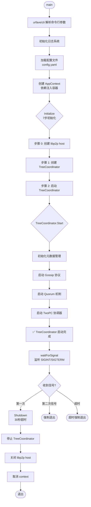

# 阶段 0：启动流程图

> NexKV Daemon 启动流程分析

**创建时间**：2026-02-12
**分析文件**：`cmd/nexkvd/main.go`

---

## 启动流程 Mermaid 图

---

## 详细说明

### 1. 命令行参数解析 (urfave/cli)

| 参数 | 短选项 | 环境变量 | 说明 | 默认值 |
|------|--------|----------|------|--------|
| --config | -c | NEXKV_CONFIG | 配置文件路径 | ./config.yaml |
| --cluster | -n | NEXKV_CLUSTER | 集群名称 | 从配置读取 |
| --host-id | - | NEXKV_HOST_ID | 主机 ID | 从配置读取 |
| --node-id | -i | NEXKV_NODE_ID | 节点 ID | 从配置读取 |
| --addr | -a | NEXKV_NODE_ADDR | 监听地址 | 从配置读取 |
| --env | -e | NEXKV_ENV | 运行环境 | 从配置读取 |
| --log-level | -l | NEXKV_LOG_LEVEL | 日志级别 | 从配置读取 |

---

### 2. 初始化流程（PR-Libp2p-TransportCleanup 简化版）

| 步骤 | 操作 | 说明 |
|------|------|------|
| **步骤 0** | 创建 libp2p host | 解析 multiaddr，创建 libp2p 主机实例 |
| **步骤 1** | 创建 TreeCoordinator | 传入节点配置、libp2p host 等 |
| **步骤 2** | 启动 TreeCoordinator | 启动元数据管理、Gossip、Quorum 等 |

**移除的组件**（PR-Libp2p-TransportCleanup）：
- ❌ identity 包（使用 libp2p peer.ID）
- ❌ TCP/UDP Transport（迁移到 libp2p）
- ❌ RPC Client/Server（待使用 libp2p Stream 重写）

---

### 3. 信号处理

| 信号 | 处理 |
|------|------|
| SIGINT | 第一次 → 优雅关闭（30秒超时） |
| SIGTERM | 第一次 → 优雅关闭（30秒超时） |
| SIGQUIT | 第一次 → 优雅关闭（30秒超时） |
| 任意信号 | 第二次 → 强制退出 |
| 超时 | 30秒未完成 → 强制退出 |

---

### 4. 关键代码位置

| 功能 | 文件 | 行号 |
|------|------|------|
| 主函数 | `cmd/nexkvd/main.go` | 79 |
| runDaemon | `cmd/nexkvd/main.go` | 140 |
| Initialize | `cmd/nexkvd/main.go` | 256 |
| waitForSignal | `cmd/nexkvd/main.go` | 449 |
| Shutdown | `cmd/nexkvd/main.go` | 364 |

---

## 观察与发现

### ✅ 设计优点
1. **清晰的分层**：命令行解析 → 配置加载 → 初始化 → 运行 → 关闭
2. **依赖注入**：使用 AppContext 作为容器，易于测试
3. **优雅关闭**：30秒超时 + 二次信号强制退出

### ⚠️ 潜在问题
1. **TODO 较多**：RPC 功能待使用 libp2p Stream 重写
2. **日志简化**：initLogging 函数目前只做占位处理
3. **错误类型**：大量自定义错误类型，可能过度设计

### 📌 需要进一步追踪
1. TreeCoordinator.Start() 的内部流程
2. Gossip 协议的具体实现
3. Quorum 机制的协调逻辑

---

**下一步**：→ [阶段 0.2：模块清单](phase0_module_inventory.md)
