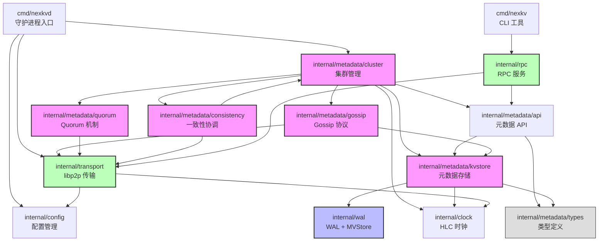

# 阶段 1.1：依赖关系图

> NexKV 模块依赖关系分析

**创建时间**：2026-02-12
**分析方法**：import 依赖追踪

---

## 模块依赖关系图

---

## 依赖层次分析

### 第 0 层：基础设施（无依赖）

| 模块 | 说明 |
|--------|------|
| `internal/clock` | HLC 时钟，无内部依赖 |
| `internal/metadata/types` | 类型定义，纯数据结构 |

### 第 1 层：存储与传输

| 模块 | 依赖 | 说明 |
|--------|--------|------|
| `internal/wal` | clock | WAL + MVStore |
| `internal/transport` | clock, config | libp2p 传输适配器 |

### 第 2 层：元数据管理

| 模块 | 依赖 | 说明 |
|--------|--------|------|
| `internal/metadata/kvstore` | wal, types, clock | 元数据 KV 存储 |
| `internal/metadata/api` | kvstore, types | 元数据统一接口 |

### 第 3 层：一致性协议

| 模块 | 依赖 | 说明 |
|--------|--------|------|
| `internal/metadata/gossip` | transport, kvstore | Gossip 协议 |
| `internal/metadata/quorum` | transport | Quorum 机制 |
| `internal/metadata/consistency` | transport, cluster | TwoPC 协调器 |

### 第 4 层：集群管理

| 模块 | 依赖 | 说明 |
|--------|--------|------|
| `internal/metadata/cluster` | api, gossip, quorum, consistency, clock | 树形拓扑协调器 |

### 第 5 层：应用层

| 模块 | 依赖 | 说明 |
|--------|--------|------|
| `internal/rpc` | api, transport | RPC 服务 |
| `cmd/nexkvd` | cluster, transport, config | 守护进程入口 |
| `cmd/nexkv` | rpc | CLI 工具入口 |

---

## 循环依赖检查

| 检查项 | 结果 | 说明 |
|--------|------|------|
| 模块间循环依赖 | ✅ 未发现 | 依赖方向清晰，单向流动 |
| 包内循环依赖 | ✅ 未发现 | metadata 内部模块无循环 |

---

## 跨层依赖检查

| 检查项 | 结果 | 说明 |
|--------|------|------|
| 高层依赖底层 | ✅ 正常 | cluster → kvstore → wal |
| 底层依赖高层 | ✅ 无 | 无反向依赖 |

---

## 观察与发现

### ✅ 设计优点

1. **清晰的分层**：基础设施 → 存储 → 元数据 → 协议 → 集群 → 应用
2. **无循环依赖**：依赖图是 DAG（有向无环图）
3. **类型隔离**：types 包无依赖，可被任意模块引用

### ⚠️ 潜在问题

1. **cluster 依赖过多**：
   - cluster 同时依赖 api, gossip, quorum, consistency
   - 可能存在"上帝对象"风险

2. **consistency 依赖 cluster**：
   - consistency → cluster 形成潜在的循环依赖路径
   - 需要确认实际使用中是否真的存在循环

3. **RPC 层职责模糊**：
   - RPC 同时依赖 api 和 transport
   - 需要确认其边界是否清晰

### 📌 需要进一步追踪

1. TreeCoordinator 是否管理了过多子模块？
2. consistency 模块与 cluster 的具体交互？
3. RPC 层的实现细节？

---

**下一步**：→ [阶段 1.2：接口边界检查](phase1_interface_analysis.md)
