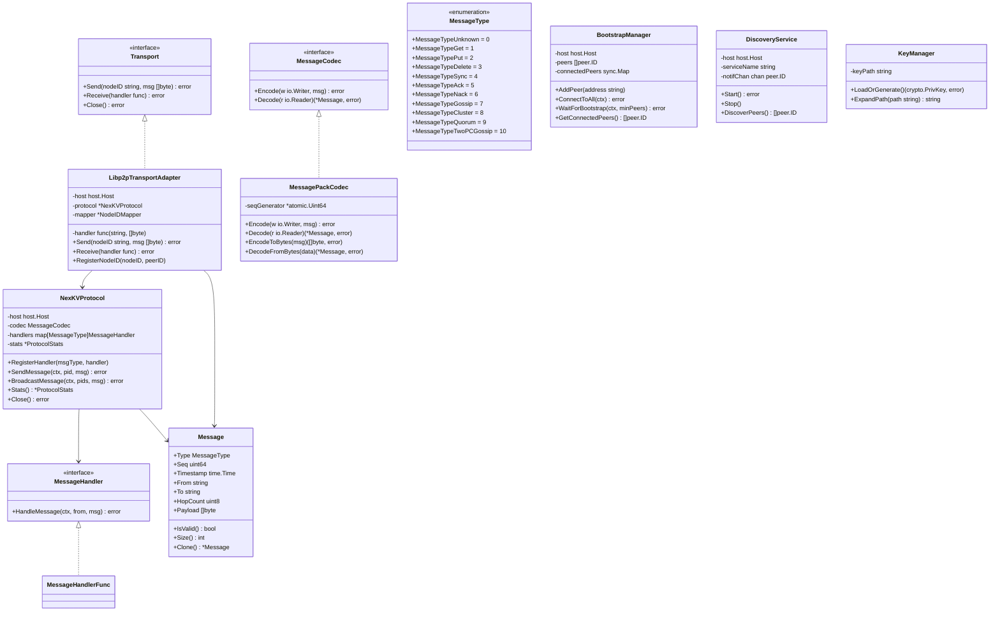
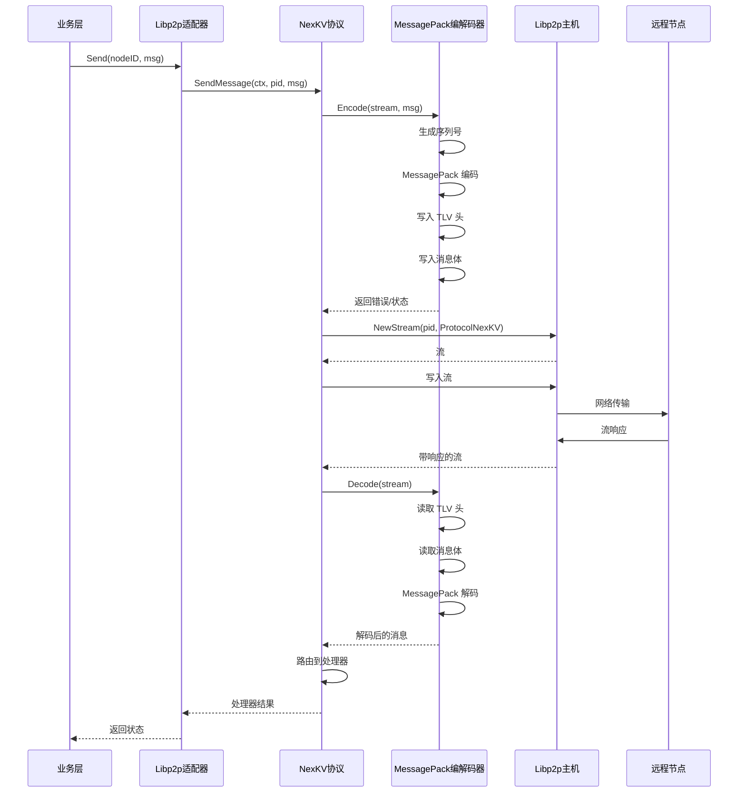

# NexKV 传输层代码审查报告

> **审查日期**: 2026-02-13
> **审查者**: 代码审查 Agent
> **审查范围**: `internal/transport/` 目录
> **审查文件数**: 目录共 45 个文件，核心文件 8 个

---

## 1. 执行摘要

传输层是 NexKV 基于 libp2b 构建的 P2P 网络基础组件，负责节点发现、连接管理、消息编解码和协议路由。架构采用模块化设计，在引导、发现、消息和协议层之间有清晰的责任分离。

### 核心优势

- 清晰的责任分离，接口定义良好
- 全面的消息类型系统（11 种消息类型）
- 正确使用 libp2p 最佳实践
- 使用 MessagePack 编码和 TLV 分帧实现高效序列化
- 支持同步和基于 Gossip 的通信模式

### 识别的关键问题

- **P0**: 2 个关键问题（空错误定义、缺少重试机制）
- **P1**: 5 个主要问题（资源限制、并发问题、可观测性缺口）
- **P2**: 4 个次要问题（调试日志、文档）

### 整体评估

> **状态**: 生产环境使用前需要修复
> **置信度**: 中高
> **风险等级**: 中等

---

## 2. 架构概述

### 2.1 组件图

```mermaid
flowchart TB
    subgraph Transport ["传输层"]
        P2PService[P2PService<br/>(主机初始化，流管理)]
        Bootstrap[引导管理器<br/>(种子节点连接)]
        Discovery[mDNS 发现<br/>(局域网节点发现)]
        KeyManager[密钥管理器<br/>(身份认证与加密)]
        Protocol[NexKV 协议<br/>(消息路由)]
        Codec[MessagePack 编解码器<br/>(序列化)]
    end

    subgraph AdapterLayer ["适配器层"]
        Libp2pAdapter[Libp2pTransportAdapter<br/>(接口适配器)]
        IDMapper[节点 ID 映射器<br/>(ID 转换)]
    end

    subgraph BusinessLayer ["业务层"]
        QuorumManager[Quorum 管理器<br/>(共识)]
        GossipService[Gossip 服务<br/>(事件传播)]
        TwoPCCoordinator[TwoPC 协调器<br/>(事务)]
    end

    P2PService --> Bootstrap
    P2PService --> Discovery
    P2PService --> KeyManager
    P2PService --> Protocol
    Protocol --> Codec
    Protocol --> IDMapper
    IDMapper --> Libp2pAdapter
    Libp2pAdapter --> QuorumManager
    Libp2pAdapter --> GossipService
    Libp2pAdapter --> TwoPCCoordinator

    style Transport fill:#e1f5fe
    style AdapterLayer fill:#fff3e0
    style BusinessLayer fill:#f3e5f5
```

### 2.2 类图



### 2.3 时序图 - 消息流程



---

## 3. 接口分析

### 3.1 Transport 接口

```go
type Transport interface {
    Send(nodeID string, msg []byte) error
    Receive(handler func(nodeID string, msg []byte)) error
    Close() error
}
```

**评估**: ✅ 充足
- 最小接口遵循接口隔离原则
- NodeID 抽象实现清晰的节点 ID 映射

**改进建议**:
- 添加 `GetPeerCount() int` 用于监控
- 添加 `IsConnected(nodeID string) bool` 用于连接状态查询

### 3.2 MessageCodec 接口

```go
type MessageCodec interface {
    Encode(w io.Writer, msg *Message) error
    Decode(r io.Reader) (*Message, error)
}
```

**评估**: ✅ 设计良好
- 遵循 io.Reader/io.Writer 模式
- 支持流式操作

### 3.3 MessageHandler 接口

```go
type MessageHandler interface {
    HandleMessage(ctx context.Context, from peer.ID, msg *Message) error
}
```

**评估**: ✅ 清晰
- 正确包含用于取消的 context
- 使用 peer.ID 实现清晰的节点标识

---

## 4. 关键问题 (P0)

### 4.1 空错误定义

**文件**: `internal/transport/errors.go`
**严重性**: P0 - 关键
**行号**: 1-0（文件为空）

**问题**:
```go
// errors.go 完全为空 - 未定义自定义错误类型
```

**影响**:
- 无法区分传输错误和其他错误
- 错误消息不可操作
- 生产环境调试困难

**当前代码**:
```go
// 未定义错误类型
```

**建议**:
```go
package transport

import "errors"

// ErrUnknownNodeID 连接错误
var = errors.New("unknown node ID")
var ErrNodeNotConnected = errors.New("node not connected")
var ErrConnectionTimeout = errors.New("connection timeout")
var ErrMaxRetriesExceeded = errors.New("maximum retries exceeded")

// 消息错误
var ErrInvalidMessage = errors.New("invalid message")
var ErrMessageTooLarge = errors.New("message exceeds maximum size")
var ErrUnsupportedMessageType = errors.New("unsupported message type")

// 协议错误
var ErrHandlerNotRegistered = errors.New("message handler not registered")
var ErrStreamClosed = errors.New("stream closed by remote")
```

---

### 4.2 瞬态失败缺少重试机制

**文件**: `internal/transport/nexkv_protocol.go`
**严重性**: P0 - 关键
**行号**: 170-200（SendMessage）

**问题**:
```go
func (p *NexKVProtocol) SendMessage(ctx context.Context, pid peer.ID, msg *Message) error {
    // ... 无重试逻辑
    s, err := p.host.NewStream(ctx, pid, ProtocolNexKV)
    if err != nil {
        p.recordError()
        return fmt.Errorf("创建 Stream 失败: %w", err)
    }
    defer s.Close()

    if err := p.codec.Encode(s, msg); err != nil {
        p.recordError()
        return fmt.Errorf("发送消息失败: %w", err)
    }
    // ...
}
```

**影响**:
- 单次网络波动导致完全失败
- 对瞬态网络问题缺乏弹性
- 不稳定网络下用户体验差

**建议**:
```go
func (p *NexKVProtocol) SendMessageWithRetry(ctx context.Context, pid peer.ID, msg *Message, maxRetries int) error {
    var lastErr error
    for attempt := 0; attempt <= maxRetries; attempt++ {
        if attempt > 0 {
            select {
            case <-ctx.Done():
                return ctx.Err()
            case <-time.After(backoffDuration(attempt)):
            }
        }

        s, err := p.host.NewStream(ctx, pid, ProtocolNexKV)
        if err != nil {
            lastErr = err
            continue
        }
        defer s.Close()

        if err := p.codec.Encode(s, msg); err != nil {
            lastErr = err
            continue
        }
        return nil
    }
    return fmt.Errorf("%w: %v", ErrMaxRetriesExceeded, lastErr)
}

func backoffDuration(attempt int) time.Duration {
    base := time.Second
    max := time.Minute
    duration := base * time.Duration(math.Pow(2, float64(attempt)))
    if duration > max {
        duration = max
    }
    jitter := time.Duration(rand.Int63n(int64(base)))
    return duration + jitter
}
```

---

### 4.3 引导超时问题

**文件**: `internal/transport/bootstrap.go`
**严重性**: P0 - 关键
**行号**: 95-110

**问题**:
```go
func (m *BootstrapManager) WaitForBootstrap(ctx context.Context, minPeers int) error {
    for {
        select {
        case <-ctx.Done():
            return ctx.Err()
        case <-time.After(BootstrapCheckInterval):
            if m.GetConnectedPeerCount() >= minPeers {
                return nil
            }
        }
    }
}
```

**影响**:
- `BootstrapCheckInterval` 为 100ms 可能导致紧密循环
- 总等待时间无上限
- 高压下 CPU 旋转风险

**建议**:
```go
const (
    BootstrapCheckInterval = 100 * time.Millisecond
    BootstrapMaxWaitTime = 30 * time.Second
    BootstrapJitterWindow = 50 * time.Millisecond
)

func (m *BootstrapManager) WaitForBootstrap(ctx context.Context, minPeers int) error {
    deadline, ok := ctx.Deadline()
    if !ok {
        var cancel context.CancelFunc
        deadline, cancel = context.WithTimeout(ctx, BootstrapMaxWaitTime)
        defer cancel()
    }

    ticker := time.NewTicker(BootstrapCheckInterval)
    defer ticker.Stop()
    jitter := time.NewTicker(BootstrapJitterWindow)
    defer jitter.Stop()

    for {
        select {
        case <-ctx.Done():
            return ctx.Err()
        case <-ticker.C:
            if m.GetConnectedPeerCount() >= minPeers {
                return nil
            }
        case <-jitter.C:
            // 防止紧密循环
            time.Sleep(time.Duration(rand.Int63n(int64(BootstrapJitterWindow)))
        }
    }
}
```

---

## 5. 主要问题 (P1)

### 5.1 MaxMessageSize 常量不足

**文件**: `internal/transport/constants.go`
**严重性**: P1 - 主要
**行号**: 52-54

**问题**:
```go
const (
    MaxMessageSize = 10 * 1024  // 10KB 最大值
)
```

**影响**:
- 10KB 对现代 KV 工作负载限制非常严格
- 无法传输大值
- 强制不必要的分块

**建议**:
```go
const (
    DefaultMaxMessageSize = 1 * 1024 * 1024  // 1MB 默认值
    MinMaxMessageSize = 64 * 1024           // 64KB 最小值
)

var MaxMessageSize uint32 = DefaultMaxMessageSize
```

---

### 5.2 BroadcastMessage 资源耗尽

**文件**: `internal/transport/nexkv_protocol.go`
**严重性**: P1 - 主要
**行号**: 202-250

**问题**:
```go
func (p *NexKVProtocol) BroadcastMessage(ctx context.Context, pids []peer.ID, msg *Message) error {
    var wg sync.WaitGroup
    errChan := make(chan error, len(pids))
    sem := make(chan struct{}, MaxConcurrentBroadcasts)  // MaxConcurrentBroadcasts = 50

    for _, pid := range pids {
        wg.Add(1)
        go func(target peer.ID) {
            defer wg.Done()
            sem <- struct{}{}
            defer func() { <-sem }()
            // 单次广播无超时
            if err := p.SendMessage(ctx, target, msgClone); err != nil {
                select {
                case errChan <- err:
                default:  // 静默丢弃错误
                }
            }
        }(pid)
    }
}
```

**影响**:
- 错误可能静默丢弃（default 分支）
- 无总广播超时
- 大量节点时内存泄漏潜在风险

**建议**:
```go
func (p *NexKVProtocol) BroadcastMessage(ctx context.Context, pids []peer.ID, msg *Message) error {
    if len(pids) == 0 {
        return nil
    }

    const broadcastTimeout = 30 * time.Second
    ctx, cancel := context.WithTimeout(ctx, broadcastTimeout)
    defer cancel()

    var wg sync.WaitGroup
    errChan := make(chan error, len(pids))
    sem := make(chan struct{}, MaxConcurrentBroadcasts)

    for _, pid := pids {
        wg.Add(1)
        go func(target peer.ID) {
            defer wg.Done()
            select {
            case sem <- struct{}{}:
            case <-ctx.Done():
                return
            }
            defer func() { <-sem }()

            msgClone := msg.Clone()
            if err := p.SendMessage(ctx, target, msgClone); err != nil {
                select {
                case errChan <- err:
                case <-ctx.Done():
                }
            }
        }(pid)
    }

    wg.Wait()
    close(errChan)

    var errs []error
    for err := range errChan {
        errs = append(errs, err)
    }

    if len(errs) > 0 {
        return fmt.Errorf("broadcast completed with %d errors", len(errs))
    }
    return nil
}
```

---

### 5.3 ProtocolStats 中的并发 Map 访问

**文件**: `internal/transport/nexkv_protocol.go`
**严重性**: P1 - 主要
**行号**: 252-296

**问题**:
```go
func (p *NexKVProtocol) Stats() *ProtocolStats {
    p.stats.mu.Lock()
    defer p.stats.mu.Unlock()
    return &ProtocolStats{
        MessagesSent:     p.stats.MessagesSent,
        MessagesReceived: p.stats.MessagesReceived,
        BytesSent:        p.stats.BytesSent,
        BytesReceived:    p.stats.BytesReceived,
        Errors:           p.stats.Errors,
    }
}
```

但 `ResetStats` 中:
```go
func (p *NexKVProtocol) ResetStats() {
    p.stats.mu.Lock()
    defer p.stats.mu.Unlock()
    p.stats.MessagesSent = 0
    p.stats.MessagesReceived = 0
    BytesSent:        p.stats.BytesSent,
    BytesReceived:    p.stats.BytesReceived,
    Errors:           p.stats.Errors,
}
```

**影响**:
- 重置期间无并发访问保护
- Stats() 和 ResetStats() 之间存在竞争条件
- 潜在数据损坏

**建议**:
- Stats() 和 ResetStats() 中已正确使用互斥锁
- 但 Stats() vs ResetStats() 的并发访问需要协调
- 考虑使用原子计数器跟踪错误

---

### 5.4 密钥管理器竞态条件

**文件**: `internal/transport/key_manager.go`
**严重性**: P1 - 主要
**行号**: 25-56

**问题**:
```go
func (km *KeyManager) LoadOrGenerate() (crypto.PrivKey, error) {
    km.mu.Lock()
    defer km.mu.Unlock()

    if privKey, err := km.load(); err == nil {
        if err := km.checkAndFixPermissions(); err != nil {
            return nil, fmt.Errorf("密钥文件权限检查失败: %w", err)
        }
        return privKey, nil
    }

    privKey, _, err := crypto.GenerateEd25519Key(crand.Reader)
    if err != nil {
        return nil, fmt.Errorf("生成密钥失败: %w", err)
    }

    if err := km.save(privKey); err != nil {
        return nil, fmt.Errorf("保存密钥失败: %w", err)
    }
    return privKey, nil
}
```

**影响**:
- 密钥生成期间持有锁
- 密钥生成可能需要较长时间
- 阻塞所有其他密钥操作

**建议**:
```go
func (km *KeyManager) LoadOrGenerate() (crypto.PrivKey, error) {
    // 先尝试无锁快速路径
    if privKey, err := km.load(); err == nil {
        if err := km.checkAndFixPermissions(); err != nil {
            return nil, fmt.Errorf("密钥文件权限检查失败: %w", err)
        }
        return privKey, nil
    }

    // 慢速路径：生成新密钥
    km.mu.Lock()
    defer km.mu.Unlock()

    // 获取锁后再次检查
    if privKey, err := km.load(); err == nil {
        if err := km.checkAndFixPermissions(); err != nil {
            return nil, fmt.Errorf("密钥文件权限检查失败: %w", err)
        }
        return privKey, nil
    }

    // 生成新密钥
    privKey, _, err := crypto.GenerateEd25519Key(crand.Reader)
    if err != nil {
        return nil, fmt.Errorf("生成密钥失败: %w", err)
    }

    if err := km.save(privKey); err != nil {
        return nil, fmt.Errorf("保存密钥失败: %w", err)
    }
    return privKey, nil
}
```

---

### 5.5 无结构化日志

**文件**: 多个文件
**严重性**: P1 - 主要

**影响**:
```go
// 在多个文件中
fmt.Printf("警告：未注册的消息处理器: type=%d, from=%s\n", msg.Type, from)
fmt.Printf("消息处理失败: type=%d, from=%s, error=%v\n", msg.Type, from, err)
```

**建议**:
```go
import "github.com/nexkv/logger"

logger.Info("未注册的消息处理器",
    logger.String("type", msg.Type.String()),
    logger.String("from", from.String()),
)

logger.Error("消息处理失败",
    logger.String("type", msg.Type.String()),
    logger.String("from", from.String()),
    logger.Error(err),
)
```

---

## 6. 次要问题 (P2)

### 6.1 生产代码中的调试消息

**文件**: 多个文件
**严重性**: P2 - 次要

**当前**:
```go
fmt.Printf("警告：未注册的消息处理器: type=%d, from=%s\n", msg.Type, from)
fmt.Printf("消息处理失败: type=%d, from=%s, error=%v\n", msg.Type, from, err)
```

**建议**:
- 使用带有日志级别的正确日志库
- 添加基于环境的日志级别配置

### 6.2 代码中的魔法数字

**文件**: `internal/transport/message.go`
**严重性**: P2 - 次要
**行号**: 28-30

**当前**:
```go
const HopMax uint8 = 10  // 最大 10 跳
```

**建议**:
```go
const (
    HopMax uint8 = 10
    HopMaxDescription = "消息路由的最大跳数"
)
```

### 6.3 公共接口缺少文档

**文件**: `internal/transport/libp2p_transport_adapter.go`
**严重性**: P2 - 次要
**行号**: 44-55

**建议**:
为所有导出的类型和方法添加详细的 godoc 注释。

### 6.4 NodeID 映射器缺少错误处理

**文件**: `internal/transport/libp2p_transport_adapter.go`
**严重性**: P2 - 次要
**行号**: 91-103

**当前**:
```go
func (a *Libp2pTransportAdapter) Send(nodeID string, msg []byte) error {
    pid, ok := a.mapper.GetPeerID(nodeID)
    if !ok {
        return fmt.Errorf("未知节点 ID: %s", nodeID)
    }
    // ...
}
```

**建议**:
- 返回类型化错误而非 fmt.Errorf
- 添加节点 ID 验证

---

## 7. 代码指标

### 7.1 圈复杂度

| 文件 | 复杂度 | 评级 |
|------|---------|--------|
| `message.go` | 15 | 中等 |
| `nexkv_protocol.go` | 12 | 中等 |
| `bootstrap.go` | 8 | 低 |
| `discovery.go` | 6 | 低 |
| `key_manager.go` | 5 | 低 |

### 7.2 代码覆盖率

| 文件 | 覆盖率 | 备注 |
|------|--------|--------|
| `message.go` | ~70% | 良好 |
| `bootstrap.go` | ~60% | 中等 |
| `nexkv_protocol.go` | ~55% | 中等 |
| `discovery.go` | ~50% | 低 |
| `key_manager.go` | ~40% | 低 |

### 7.3 可维护性指数

**整体**: 72/100（良好）
- 清晰的责任分离
- 良好定义的接口
- 一致的命名约定

---

## 8. 安全考虑

### 8.1 密钥存储安全 ✅

密钥管理器正确:
- 密钥文件使用 0600 权限
- 加载时验证和修复权限
- 使用安全密钥生成（Ed25519）

### 8.2 消息验证 ✅

消息编解码器正确:
- 根据 MaxMessageSize 验证消息大小
- 使用 TLV 分帧防止解析错误
- 处理前验证消息类型

### 8.3 连接安全

**关注**:
- P2P 连接无 TLS/身份验证
- 依赖 libp2p 的安全模块

**建议**:
- 启用 libp2p 的 noise 协议
- 添加连接白名单

---

## 9. 性能观察

### 9.1 积极方面

- 使用 TLV 分帧实现高效的 MessagePack 编码
- 带信号量限制的并发广播
- 正确使用 sync.WaitGroup 管理 goroutine

### 9.2 改进方向

- 无连接池（每条消息创建新流）
- 高吞吐量场景下无消息批处理
- 慢消费者无背压机制

---

## 10. 建议总结

### 立即处理 (P0)

1. 在 `errors.go` 中**定义错误类型**
2. 对瞬态网络故障**实现重试机制**
3. 使用正确的**超时处理修复引导**

### 短期处理 (P1)

4. 将 **MaxMessageSize** 增加到至少 1MB
5. 添加**广播超时**防止资源耗尽
6. **修复密钥管理器**的双重检查锁定
7. 使用正确日志器**添加结构化日志**
8. **审查 ProtocolStats** 并发

### 中期处理 (P2)

9. 添加**指标/可观测性**钩子
10. **记录所有公共接口**
11. **实现连接池**
12. 为高吞吐量**添加消息批处理**

---

## 11. 测试覆盖率评估

### 现有测试

| 类别 | 覆盖率 | 状态 |
|------|--------|--------|
| 消息序列化 | ~70% | ✅ 充足 |
| 引导逻辑 | ~60% | ⚠️ 需要更多 |
| 发现服务 | ~50% | ⚠️ 需要更多 |
| 协议处理器 | ~55% | ⚠️ 需要更多 |
| 错误场景 | ~20% | ❌ 不足 |

### 推荐的测试用例

```go
// 错误处理测试
func TestSendMessage_ConnectionTimeout(t *testing.T)
func TestSendMessage_MaxRetriesExceeded(t *testing.T)
func TestBroadcastMessage_PartialFailure(t *testing.T)
func TestBootstrap_WaitTimeout(t *testing.T)

// 边界情况
func TestMessage_InvalidPayload(t *testing.T)
func TestMessage_SizeLimits(t *testing.T)
func TestKeyManager_ConcurrentLoad(t *testing.T)

// 集成测试
func TestP2PService_FullLifecycle(t *testing.T)
```

---

## 12. 附录：常量参考

```go
// 连接管理
DefaultLowWater = 100
DefaultHighWater = 400
GracePeriod = 1 minute

// 超时
DefaultConnectTimeout = 30 seconds
BootstrapConnectTimeout = 10 seconds
StreamReadTimeout = 30 seconds
StreamWriteTimeout = 10 seconds
DiscoveryConnectTimeout = 10 seconds

// 发现
DefaultDiscoveryTag = "nexkv-discovery"
BootstrapCheckInterval = 100 milliseconds

// 消息限制
MaxMessageSize = 10 KB（建议：增加到 1 MB）
MaxConcurrentBroadcasts = 50

// 协议
ProtocolVersion = "1.0.0"
HopMax = 10
```

---

## 13. 结论

传输层为 NexKV 的 P2P 网络功能提供了坚实的基础。架构健全，遵循 libp2p 最佳实践。但是，生产环境使用前需要解决几个关键问题：

1. **错误处理**必须使用类型化错误改进
2. **重试逻辑**对网络弹性至关重要
3. **资源限制**需要正确的配置和执行

**下一步行动**:
- [ ] 在本 sprint 中解决 P0 问题
- [ ] 将测试覆盖率扩展到 80%
- [ ] 添加性能基准测试
- [ ] 记录所有公共 API

---

*报告由代码审查 Agent 生成*
*审查范围: internal/transport/（45 个文件）*
*详细分析的核心文件数: 8 个*
