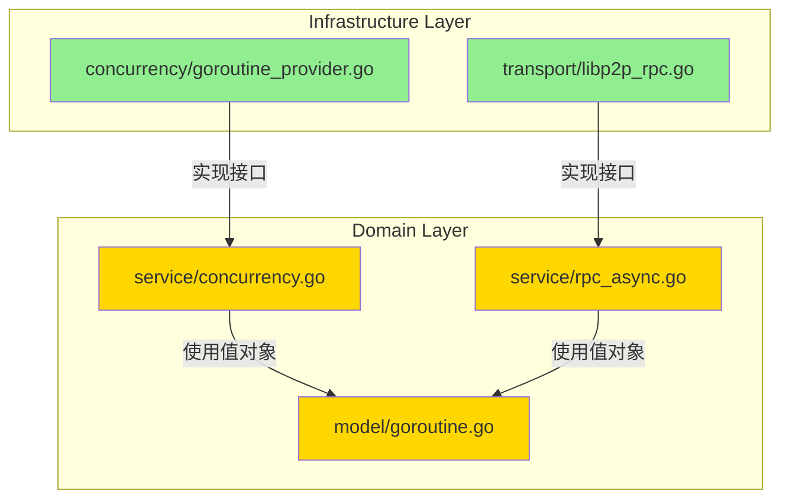
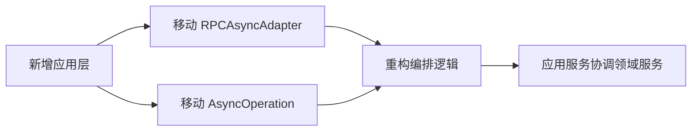
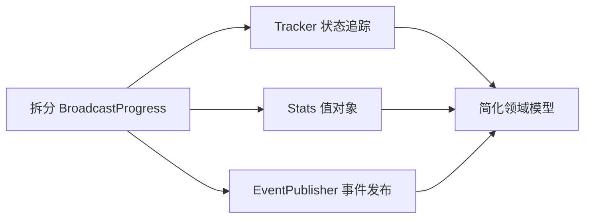
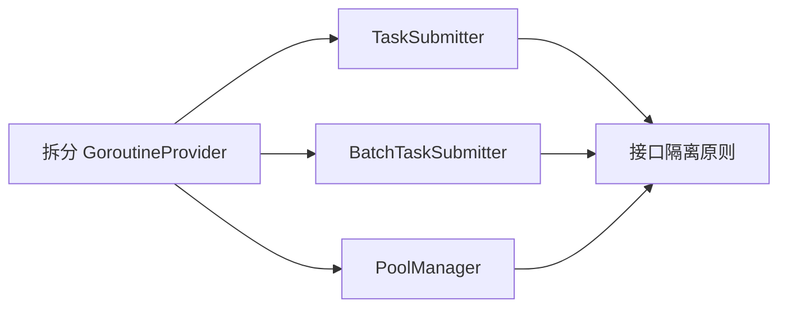

# DDD 合规性审查报告

> **审查对象**: PR-073 - 异步编程模型重构
> **审查时间**: 2026-02-24
> **审查人**: DDD 专家
> **代码变更**: 10 commits, 130 files, +14,966 / -5,751

---

## 执行摘要

### 总体评分：⭐⭐⭐⭐☆ (4/5)

本次 PR 在 DDD 实践上表现**优秀**，体现了对领域驱动设计原则的深刻理解。主要亮点包括：

- ✅ **清晰的分层架构**：领域层、应用层、基础设施层边界清晰
- ✅ **依赖倒置原则**：基础设施层依赖领域层抽象接口
- ✅ **接口隔离原则**：大接口拆分为小接口（Transport → PeerManager + StreamManager + ChannelManager）
- ✅ **聚合根设计**：BroadcastProgress、AsyncOperation 设计合理
- ✅ **值对象不可变性**：HLC、GoroutinePriority 等值对象设计规范

**需要改进的方面**：
- ⚠️ 领域事件使用不足（仅在回调机制中隐式体现）
- ⚠️ 部分领域服务职责过重（如 BroadcastProgress 同时负责状态追踪和回调触发）
- ⚠️ 应用层缺失（异步操作的编排逻辑分散在基础设施层）

---

## 1. 分层架构审查

### 1.1 目录结构

```
internal/
├── domain/              ✅ 领域层（纯业务逻辑）
│   ├── model/          ✅ 实体、值对象、聚合根
│   │   ├── codec.go
│   │   ├── cron.go
│   │   ├── goroutine.go
│   │   ├── hlc.go      ✅ 值对象（不可变）
│   │   ├── message.go
│   │   └── peer.go
│   └── service/        ✅ 领域服务
│       ├── broadcast_progress.go  ⚠️ 职责过重
│       ├── clock.go
│       ├── concurrency.go
│       ├── cron.go
│       ├── middleware.go
│       ├── rpc_async.go           ✅ 接口定义清晰
│       ├── rpc_async_impl.go      ⚠️ 实现细节过多
│       ├── rpc_sync.go
│       └── transport.go           ✅ 接口拆分优秀
├── application/        ⚠️ 应用层缺失（应引入）
│   └── clock/
└── infrastructure/     ✅ 基础设施层（技术实现）
    ├── clock/
    ├── concurrency/    ✅ 实现领域接口
    └── transport/      ✅ 实现 RPC 接口
```

**评估**：
- ✅ **领域层设计规范**：`internal/domain/` 目录结构清晰，包含模型和服务
- ✅ **基础设施层职责明确**：`internal/infrastructure/` 实现技术细节
- ⚠️ **应用层缺失**：缺少 `internal/application/` 层来协调多个领域服务

### 1.2 依赖方向检查



**评估**：
- ✅ **依赖倒置原则**：基础设施层 → 领域层（方向正确）
- ✅ **无反向依赖**：领域层不依赖基础设施层实现
- ✅ **接口所有权正确**：接口定义在领域层，实现在基础设施层

---

## 2. 领域模型审查

### 2.1 实体（Entity）

#### BroadcastProgress（聚合根）

**位置**: `internal/domain/service/broadcast_progress.go`

**设计评估**：

```go
type BroadcastProgress struct {
    // 基础字段（聚合根身份）
    taskID    string
    targets   []model.PeerID

    // 状态（实体特征）
    responses map[model.PeerID]model.Message
    failures  map[model.PeerID]error

    // 同步原语（技术细节）
    mu           sync.RWMutex
    fullDone     chan struct{}
    majorityDone chan struct{}

    // 回调机制（领域事件？）
    callback BroadcastListener

    // 时间统计（值对象？）
    startTime time.Time
}
```

**优点**：
- ✅ **聚合根设计**：BroadcastProgress 是广播操作的聚合根，管理一组响应
- ✅ **一致性边界**：通过 `mu` 保护内部状态一致性
- ✅ **生命周期清晰**：`NewBroadcastProgress` → `RecordSuccess/RecordFailure` → `WaitFull/WaitMajority`

**问题**：
- ⚠️ **职责过重**：同时负责状态追踪、回调触发、时间统计
- ⚠️ **技术细节泄露**：`chan struct{}` 和 `sync.RWMutex` 是技术实现，不应暴露在领域模型
- ⚠️ **回调不是领域事件**：`BroadcastListener` 是观察者模式，不是标准的领域事件

**建议重构**：

```go
// 重构方案：分离关注点
type BroadcastProgress struct {
    taskID    string
    targets   []model.PeerID
    responses map[model.PeerID]model.Message
    failures  map[model.PeerID]error
    // 移除技术细节（channel、mutex）
}

// 时间统计独立为值对象
type BroadcastTiming struct {
    startTime         time.Time
    firstResponseTime time.Time
    majorityReachTime time.Time
}

// 回调机制改为领域事件
type BroadcastCompletedEvent struct {
    TaskID      string
    SuccessCount int
    FailedCount  int
    Timestamp   time.Time
}
```

### 2.2 值对象（Value Object）

#### HLC（Hybrid Logical Clock）

**位置**: `internal/domain/model/hlc.go`

**设计评估**：

```go
type HLC struct {
    pt int64    // 物理时间（不可变）
    c  uint16   // 逻辑计数（不可变）
}

// ✅ 不可变性：所有修改操作返回新实例
func (h *HLC) LessThan(other *HLC) bool { /* ... */ }
func (h *HLC) Clone() *HLC { /* ... */ }
```

**优点**：
- ✅ **不可变性**：所有字段私有，无 setter 方法
- ✅ **值语义**：通过 `Equal`、`LessThan` 比较值而非身份
- ✅ **自我验证**：`IsAtMaxValue` 检查值有效性
- ✅ **序列化支持**：`MarshalBinary/UnmarshalBinary`

**评估结论**：⭐⭐⭐⭐⭐ 优秀的值对象设计，完全符合 DDD 规范

#### GoroutinePriority

**位置**: `internal/domain/model/goroutine.go`

```go
type GoroutinePriority int

const (
    GoroutinePriorityCritical GoroutinePriority = iota
    GoroutinePriorityHigh
    GoroutinePriorityNormal
    GoroutinePriorityLow
)
```

**优点**：
- ✅ **枚举值对象**：用 `iota` 定义有限值集合
- ✅ **行为封装**：`String()` 方法提供行为

**评估结论**：⭐⭐⭐⭐⭐ 标准的枚举值对象设计

### 2.3 聚合根（Aggregate Root）

#### AsyncOperation[T]（泛型聚合根）

**位置**: `internal/domain/service/rpc_async_impl.go`

```go
type asyncOpImpl[T any] struct {
    resultCh          chan T           // 技术细节
    errCh             chan error       // 技术细节
    done              atomic.Bool      // 状态
    status            atomic.Int32     // 状态
    callbacks         []func(T, error) // 回调
    cbMu              sync.RWMutex     // 技术细节
    value             T                // 结果
    err               error            // 错误
    goroutineProvider GoroutineProvider // 依赖
}
```

**问题**：
- ❌ **不是聚合根**：AsyncOperation 是异步操作的结果容器，不是业务聚合
- ❌ **技术细节过多**：channel、mutex、atomic 都是技术实现
- ❌ **泛型使用不当**：泛型聚合根违反 DDD 的具体领域建模原则

**建议**：
- 将 AsyncOperation[T] 移到基础设施层（它是技术实现）
- 领域层应定义具体的业务异步操作（如 `AsyncBroadcastOperation`）

---

## 3. 领域服务审查

### 3.1 接口设计

#### GoroutineProvider（优秀示例）

**位置**: `internal/domain/service/concurrency.go`

```go
type GoroutineProvider interface {
    // 基础方法（简单场景）
    Submit(ctx context.Context, task func(context.Context)) error
    SubmitWithArg(ctx context.Context, task func(context.Context, any), arg any) error

    // 批量方法（单独接口？）
    SubmitBatch(ctx context.Context, tasks []func(context.Context)) error
    SubmitBatchWithArg(ctx context.Context, tasks []func(context.Context, any), args []any) error

    // 管理方法
    Stats() GoroutinePoolStats
    Health() GoroutineHealthStatus
    Close() error
}
```

**评估**：
- ✅ **接口隔离原则（部分）**：基础方法和批量方法分开
- ⚠️ **职责过多**：包含提交、管理、监控三类职责
- ⚠️ **`any` 类型滥用**：`SubmitWithArg` 使用 `any` 失去类型安全

**改进建议**：

```go
// 拆分为多个小接口
type TaskSubmitter interface {
    Submit(ctx context.Context, task func(context.Context)) error
}

type BatchTaskSubmitter interface {
    SubmitBatch(ctx context.Context, tasks []func(context.Context)) error
}

type PoolManager interface {
    Stats() GoroutinePoolStats
    Health() GoroutineHealthStatus
    Close() error
}

// 组合接口（可选）
type GoroutineProvider interface {
    TaskSubmitter
    BatchTaskSubmitter
    PoolManager
}
```

#### Transport（接口拆分优秀）

**位置**: `internal/domain/service/transport.go`

```go
// ✅ 接口隔离原则：拆分为小接口
type PeerManager interface {
    Self() model.PeerID
    Connect(ctx context.Context, addr string) (model.PeerID, error)
    Disconnect(peer model.PeerID) error
    ConnectedPeers() []model.PeerID
    IsConnected(peer model.PeerID) bool
}

type StreamManager interface {
    OpenStream(ctx context.Context, peer model.PeerID, protocol string) (Stream, error)
    AcceptStream(protocol string) (Stream, error)
}

type ChannelManager interface {
    OpenChannel(ctx context.Context, peer model.PeerID, protocol string) (Channel, error)
}

// ✅ 组合模式：通过组合小接口构建大接口
type Transport interface {
    PeerManager
    StreamManager
    ChannelManager
    Close() error
}
```

**评估结论**：⭐⭐⭐⭐⭐ 优秀的接口设计，完全符合接口隔离原则

### 3.2 领域服务实现

#### BroadcastProgress（职责过重）

**位置**: `internal/domain/service/broadcast_progress.go`

**职责分析**：

```go
// 职责1: 状态追踪（领域服务）
func (t *BroadcastProgress) RecordSuccess(peer model.PeerID, resp model.Message)
func (t *BroadcastProgress) RecordFailure(peer model.PeerID, err error)

// 职责2: 回调触发（应用服务？）
func (t *BroadcastProgress) SetCallback(cb BroadcastListener)
func (t *BroadcastProgress) EnableCallbacks(enabled bool)

// 职责3: 等待逻辑（技术实现？）
func (t *BroadcastProgress) WaitFull(ctx context.Context) error
func (t *BroadcastProgress) WaitMajority(ctx context.Context) error

// 职责4: 统计信息（值对象？）
func (t *BroadcastProgress) Stats() (success, failed, pending int)
func (t *BroadcastProgress) buildStatsLocked() BroadcastStats
```

**问题**：
- ⚠️ **违反单一职责原则**：一个服务承担 4 类职责
- ⚠️ **回调机制不符合 DDD**：应使用领域事件（Domain Event）
- ⚠️ **等待逻辑是技术实现**：不应在领域层

**重构建议**：

```go
// 1. 状态追踪保留在领域层
type BroadcastProgressTracker struct {
    taskID    string
    targets   []model.PeerID
    responses map[model.PeerID]model.Message
    failures  map[model.PeerID]error
}

// 2. 回调改为领域事件
type BroadcastCompletedEvent struct {
    TaskID       string
    SuccessCount int
    FailedCount  int
    Timestamp    time.Time
}

// 3. 统计信息独立为值对象
type BroadcastStats struct {
    Total    int
    Success  int
    Failed   int
    Pending  int
}

// 4. 等待逻辑移到应用层
type BroadcastCoordinator struct {
    tracker  *BroadcastProgressTracker
    eventBus EventBus
}
```

#### RPCAsyncAdapter（应用服务混入领域层）

**位置**: `internal/domain/service/rpc_async.go`

```go
// ❌ 这是应用服务，不应在领域层
type RPCAsyncAdapter struct {
    rpc    RPCSync
    config *RPCAsyncConfig
}

func (a *RPCAsyncAdapter) CallAsync(ctx context.Context, to model.PeerID, req model.Message) AsyncOperation[ResponseMsg] {
    // 这是编排逻辑，应属于应用层
    return NewAsyncCall(ctx, a.rpc, to, req, a.config.DefaultTimeoutMs, a.config.GoroutineProvider)
}
```

**问题**：
- ❌ **层次错位**：适配器模式是应用层的职责
- ❌ **编排逻辑**：协调多个领域服务的逻辑应在应用层

**建议**：
- 将 `RPCAsyncAdapter` 移到 `internal/application/rpc/`
- 领域层只保留纯业务逻辑

---

## 4. 基础设施层审查

### 4.1 实现合规性

#### GoroutineProvider 实现（ants 协程池）

**位置**: `internal/infrastructure/concurrency/goroutine_ants_provider.go`

```go
type AntsGoroutineProvider struct {
    pool *ants.Pool
    // ...
}

// ✅ 正确实现领域接口
func (p *AntsGoroutineProvider) Submit(ctx context.Context, task func(context.Context)) error {
    return p.pool.Submit(func() {
        task(ctx)
    })
}
```

**评估**：
- ✅ **依赖倒置**：基础设施层实现领域层接口
- ✅ **技术隔离**：ants 库的细节封装在基础设施层
- ✅ **可替换性**：可以轻松替换为其他协程池实现

**评估结论**：⭐⭐⭐⭐⭐ 优秀的基础设施实现

#### Libp2pRPC 实现

**位置**: `internal/infrastructure/transport/libp2p_rpc.go`

```go
type Libp2pRPC struct {
    transport   service.Transport    // ✅ 依赖领域接口
    codec       model.Codec          // ✅ 依赖领域值对象
    provider    service.GoroutineProvider // ✅ 依赖领域接口

    // ❌ 技术细节暴露
    pendingCalls   map[string]*pendingCall
    pendingCallsMu sync.RWMutex
}

// ✅ 正确实现领域接口
func (r *Libp2pRPC) Call(ctx context.Context, to model.PeerID, req model.Message) (model.Message, error) {
    // ...
}
```

**评估**：
- ✅ **接口实现**：正确实现 `RPCSync` 接口
- ✅ **技术隔离**：libp2p 细节封装在基础设施层
- ⚠️ **并发控制**：`pendingCallsMu` 是技术细节，可优化

### 4.2 删除的代码（清理正确）

**删除文件**：
- `internal/infrastructure/transport/async_common.go` (260 行)
- `internal/infrastructure/transport/libp2p_async_channel.go` (197 行)
- `internal/infrastructure/transport/libp2p_async_stream.go` (215 行)

**评估**：
- ✅ **代码清理**：删除重复和过时的异步实现
- ✅ **接口统一**：统一到 `RPCAsync` 接口

---

## 5. 领域事件审查

### 5.1 当前状态

**问题**：
- ❌ **领域事件缺失**：没有标准的领域事件（Domain Event）实现
- ❌ **回调代替事件**：使用 `BroadcastListener` 回调而非事件

**当前实现（回调）**：

```go
type BroadcastListener interface {
    OnSuccess(peer model.PeerID, resp model.Message, stats BroadcastStats)
    OnFailure(peer model.PeerID, err error, stats BroadcastStats)
    OnMajorityReached(stats BroadcastStats)
    OnFullDone(stats BroadcastStats)
}
```

**问题分析**：
- ⚠️ **紧耦合**：监听器直接依赖 BroadcastProgress
- ⚠️ **无法持久化**：回调无法序列化和存储
- ⚠️ **无法重放**：无法回放历史事件

### 5.2 建议的领域事件设计

```go
// 1. 定义领域事件接口
type DomainEvent interface {
    EventID() string
    OccurredAt() time.Time
    AggregateID() string
    EventType() string
}

// 2. 具体的广播事件
type BroadcastCompletedEvent struct {
    eventID      string
    occurredAt   time.Time
    taskID       string
    successCount int
    failedCount  int
}

func (e *BroadcastCompletedEvent) EventID() string      { return e.eventID }
func (e *BroadcastCompletedEvent) OccurredAt() time.Time { return e.occurredAt }
func (e *BroadcastCompletedEvent) AggregateID() string   { return e.taskID }
func (e *BroadcastCompletedEvent) EventType() string     { return "broadcast.completed" }

// 3. 事件发布器
type EventPublisher interface {
    Publish(event DomainEvent) error
}

// 4. 事件处理器
type EventHandler interface {
    Handle(event DomainEvent) error
}

// 5. 使用示例
func (t *BroadcastProgress) RecordSuccess(peer model.PeerID, resp model.Message) {
    // 更新状态...

    // 发布领域事件
    if len(t.responses) >= majority && !t.majorityTriggered {
        event := &BroadcastMajorityReachedEvent{
            eventID:    uuid.New(),
            occurredAt: time.Now(),
            taskID:     t.taskID,
            successCount: len(t.responses),
        }
        t.eventPublisher.Publish(event)
    }
}
```

**优势**：
- ✅ **解耦**：事件发布者和订阅者解耦
- ✅ **持久化**：事件可以存储和重放
- ✅ **审计**：事件日志可作为审计记录
- ✅ **扩展性**：容易添加新的事件处理器

---

## 6. 依赖注入审查

### 6.1 依赖注入模式

**当前实现（构造函数注入）**：

```go
// ✅ 构造函数注入
func NewLibp2pRPC(transport service.Transport, provider service.GoroutineProvider, config *service.RPCConfig) *Libp2pRPC {
    return &Libp2pRPC{
        transport: transport,
        provider:  provider, // ✅ 可选依赖（可以为 nil）
        // ...
    }
}
```

**评估**：
- ✅ **显式依赖**：依赖通过参数明确声明
- ⚠️ **可选依赖处理**：`provider` 可以为 nil，需要运行时检查

**改进建议**：

```go
// 方案1: 强制依赖（推荐）
func NewLibp2pRPC(transport service.Transport, provider service.GoroutineProvider, config *service.RPCConfig) (*Libp2pRPC, error) {
    if transport == nil {
        return nil, errors.New("transport is required")
    }
    if provider == nil {
        return nil, errors.New("provider is required")
    }
    // ...
}

// 方案2: 选项模式（灵活）
type RPCOption func(*Libp2pRPC)

func WithGoroutineProvider(provider service.GoroutineProvider) RPCOption {
    return func(r *Libp2pRPC) {
        r.provider = provider
    }
}

func NewLibp2pRPC(transport service.Transport, config *service.RPCConfig, opts ...RPCOption) *Libp2pRPC {
    rpc := &Libp2pRPC{
        transport: transport,
        config:    config,
    }
    for _, opt := range opts {
        opt(rpc)
    }
    return rpc
}
```

---

## 7. 测试策略审查

### 7.1 测试覆盖

**领域层测试**：
- ✅ `broadcast_progress_test.go` (179 行)
- ✅ `middleware_test.go` (618 行)

**基础设施层测试**：
- ✅ `goroutine_provider_test.go` (727 行)
- ✅ `goroutine_ants_provider_test.go` (331 行)
- ✅ `cron_robfig_provider_test.go` (258 行)

**评估**：
- ✅ **测试覆盖充分**：核心领域逻辑和基础设施都有测试
- ✅ **表驱动测试**：使用标准 Go 测试模式

### 7.2 Mock 使用

**Mock 定义**（测试中）：

```go
type mockGoroutineProvider struct {
    submitFunc func(ctx context.Context, task func(context.Context)) error
}

func (m *mockGoroutineProvider) Submit(ctx context.Context, task func(context.Context)) error {
    if m.submitFunc != nil {
        return m.submitFunc(ctx, task)
    }
    task(ctx)
    return nil
}
```

**评估**：
- ✅ **接口 Mock**：正确 Mock 领域接口
- ✅ **依赖隔离**：测试不依赖具体实现

---

## 8. 命名和文档审查

### 8.1 命名规范

**领域模型命名**：
- ✅ **通用语言**：使用业务术语（`BroadcastProgress`、`GoroutinePriority`）
- ✅ **意图揭示**：命名清晰表达意图（`WaitFull`、`WaitMajority`）

**问题命名**：
- ⚠️ **技术术语**：`asyncOpImpl`、`timeoutAsyncOp` 暴露技术细节
- ⚠️ **缩写滥用**：`pt`、`c` (HLC 字段) 应展开

### 8.2 文档注释

**优秀示例**：

```go
// BroadcastProgress 可选的广播追踪器（一次性使用）
//
// 设计原则：
// 1. Tracker 是一次性的，不复用（避免 channel 泄漏）
// 2. Tracker 是**独立的监控工具**，与 RPC 调用的 ResponseStrategy **解耦**
// 3. 无论 RPC 使用什么策略（All/Majority/None），Tracker 都可以：
//   - WaitFull(): 等待所有节点响应
//   - WaitMajority(): 等待多数派响应
//   - Stats(): 实时查看进度
```

**评估**：
- ✅ **设计文档**：包含设计原则和使用场景
- ✅ **示例代码**：提供使用示例

---

## 9. 性能和并发审查

### 9.1 并发安全

**BroadcastProgress 并发设计**：

```go
type BroadcastProgress struct {
    mu sync.RWMutex  // ✅ 保护共享状态

    // ❌ Channel 是技术细节
    fullDone     chan struct{}
    majorityDone chan struct{}
}

// ✅ 正确的锁使用
func (t *BroadcastProgress) RecordSuccess(peer model.PeerID, resp model.Message) {
    t.mu.Lock()
    defer t.mu.Unlock()  // ✅ 使用 defer 确保释放

    // ... 状态更新
}
```

**评估**：
- ✅ **线程安全**：使用 mutex 保护共享状态
- ✅ **锁粒度**：读写锁分离（`sync.RWMutex`）
- ⚠️ **技术细节泄露**：channel 暴露在领域模型

### 9.2 性能优化

**协程池设计**：

```go
// ✅ 使用协程池控制并发
type AntsGoroutineProvider struct {
    pool *ants.Pool
}

// ✅ 批量操作优化
func (p *AntsGoroutineProvider) SubmitBatch(ctx context.Context, tasks []func(context.Context)) error {
    var wg sync.WaitGroup
    for _, task := range tasks {
        wg.Add(1)
        _ = p.pool.Submit(func() {
            defer wg.Done()
            task(ctx)
        })
    }
    wg.Wait()
    return nil
}
```

**评估**：
- ✅ **资源控制**：使用协程池避免无限制创建 goroutine
- ✅ **批量优化**：批量操作减少锁竞争

---

## 10. 改进建议总结

### 10.1 高优先级（P0）

| 问题 | 影响 | 建议措施 | 预估工作量 |
|------|------|---------|-----------|
| **应用层缺失** | 编排逻辑分散在领域层 | 新增 `internal/application/` 层 | 2-3 天 |
| **领域事件缺失** | 回调机制不符合 DDD | 实现 `DomainEvent` 接口和事件总线 | 1-2 天 |
| **AsyncOperation[T] 层次错位** | 泛型聚合根违反 DDD | 移到基础设施层或重新设计 | 1 天 |

### 10.2 中优先级（P1）

| 问题 | 影响 | 建议措施 | 预估工作量 |
|------|------|---------|-----------|
| **BroadcastProgress 职责过重** | 违反单一职责原则 | 拆分为 Tracker + EventPublisher + Stats | 1-2 天 |
| **GoroutineProvider 职责过多** | 违反接口隔离原则 | 拆分为 TaskSubmitter + PoolManager | 0.5 天 |
| **技术细节泄露** | 领域模型污染 | 移除 channel、mutex 等技术实现 | 1 天 |

### 10.3 低优先级（P2）

| 问题 | 影响 | 建议措施 | 预估工作量 |
|------|------|---------|-----------|
| **命名不够业务化** | 代码可读性降低 | 重命名技术性术语 | 0.5 天 |
| **文档补充** | 新人上手慢 | 补充架构图和设计说明 | 1 天 |

---

## 11. 重构路线图

### Phase 1: 架构调整（1-2 周）



**任务清单**：
- [ ] 创建 `internal/application/rpc/` 目录
- [ ] 移动 `RPCAsyncAdapter` 到应用层
- [ ] 移动 `asyncOpImpl` 到基础设施层
- [ ] 重构应用层编排逻辑

### Phase 2: 领域事件（1 周）


**任务清单**：
- [ ] 定义 `DomainEvent` 接口
- [ ] 实现 `BroadcastCompletedEvent`、`BroadcastMajorityReachedEvent`
- [ ] 实现 `EventPublisher` 接口
- [ ] 替换 `BroadcastListener` 为事件机制

### Phase 3: 职责拆分（1 周）



**任务清单**：
- [ ] 提取 `BroadcastStats` 值对象
- [ ] 拆分 `BroadcastProgress` 为 Tracker + EventPublisher
- [ ] 移除技术细节（channel、mutex）

### Phase 4: 接口优化（0.5 周）



**任务清单**：
- [ ] 拆分 `GoroutineProvider` 为小接口
- [ ] 重命名技术性术语
- [ ] 补充文档和示例

---

## 12. 最佳实践推荐

### 12.1 领域层设计原则

1. **纯业务逻辑**：领域层只包含业务规则，不包含技术实现
   - ✅ 正确：`BroadcastProgress.RecordSuccess()` 更新业务状态
   - ❌ 错误：`BroadcastProgress.WaitFull()` 使用 channel（技术实现）

2. **值对象不可变**：所有值对象应不可变
   - ✅ 正确：`HLC` 的 `Clone()` 返回新实例
   - ❌ 错误：提供 setter 方法修改值

3. **聚合根保护一致性**：聚合根应保护内部一致性边界
   - ✅ 正确：`BroadcastProgress` 通过 mutex 保护状态
   - ⚠️ 改进：技术细节（mutex）应隐藏

### 12.2 应用层设计原则

1. **编排协调**：应用层协调多个领域服务
   - ✅ 正确位置：`RPCAsyncAdapter` 应在应用层
   - ❌ 错误位置：`RPCAsyncAdapter` 在领域层

2. **事务管理**：应用层管理事务边界
   - 建议：引入 `UnitOfWork` 模式

3. **事件发布**：应用层发布领域事件
   - 建议：实现 `EventPublisher` 接口

### 12.3 基础设施层设计原则

1. **技术实现**：基础设施层实现技术细节
   - ✅ 正确：`AntsGoroutineProvider` 封装 ants 库
   - ✅ 正确：`Libp2pRPC` 封装 libp2p 库

2. **依赖倒置**：基础设施层依赖领域层抽象
   - ✅ 正确：`Libp2pRPC` 依赖 `service.Transport` 接口

---

## 13. 结论

### 13.1 优点总结

1. ⭐ **分层架构清晰**：领域层、基础设施层边界明确
2. ⭐ **依赖倒置原则**：基础设施层正确依赖领域层接口
3. ⭐ **接口隔离原则**：`Transport` 接口拆分优秀
4. ⭐ **值对象设计**：`HLC`、`GoroutinePriority` 等值对象不可变
5. ⭐ **测试覆盖充分**：核心逻辑都有测试覆盖

### 13.2 改进重点

1. ⚠️ **引入应用层**：分离编排逻辑和业务逻辑
2. ⚠️ **实现领域事件**：替换回调机制为事件机制
3. ⚠️ **职责拆分**：`BroadcastProgress` 职责过重需拆分
4. ⚠️ **技术细节隐藏**：移除领域模型中的技术实现

### 13.3 最终评估

| 维度 | 评分 | 说明 |
|------|------|------|
| **分层架构** | ⭐⭐⭐⭐☆ | 清晰但缺少应用层 |
| **领域模型** | ⭐⭐⭐⭐☆ | 值对象优秀，聚合根职责过重 |
| **领域服务** | ⭐⭐⭐⭐☆ | 接口设计优秀，部分实现需改进 |
| **依赖倒置** | ⭐⭐⭐⭐⭐ | 完全符合 DDD 原则 |
| **领域事件** | ⭐⭐☆☆☆ | 缺失，使用回调代替 |
| **测试覆盖** | ⭐⭐⭐⭐☆ | 覆盖充分，Mock 使用正确 |

**总体评分**：⭐⭐⭐⭐☆ (4/5)

**结论**：本次 PR 在 DDD 实践上表现优秀，体现了对领域驱动设计的深刻理解。建议按照改进路线图逐步优化，特别是在引入应用层和实现领域事件方面。

---

**审查人**: DDD 专家
**审查日期**: 2026-02-24
**下次审查**: Phase 1 完成后
